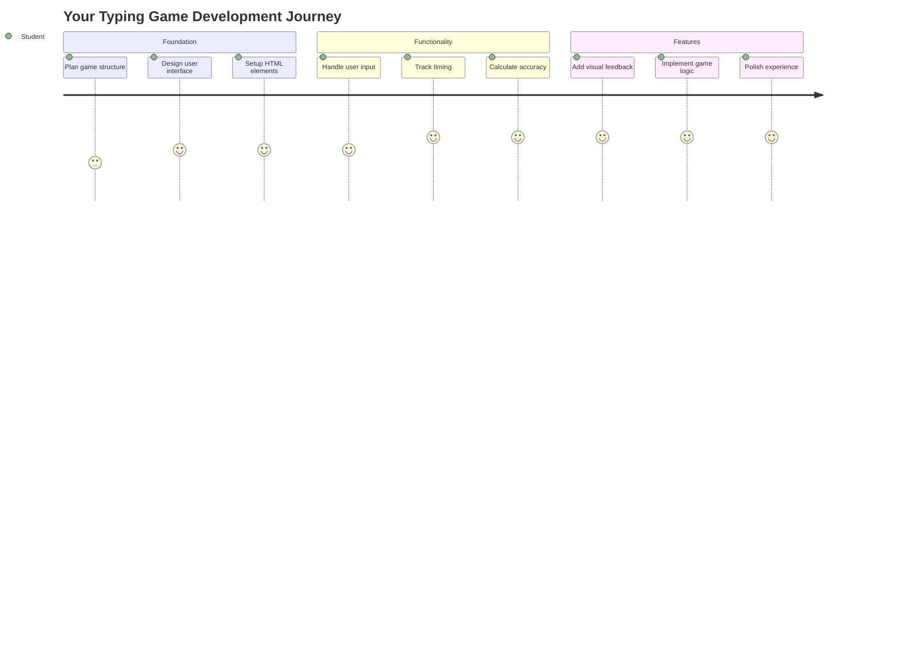
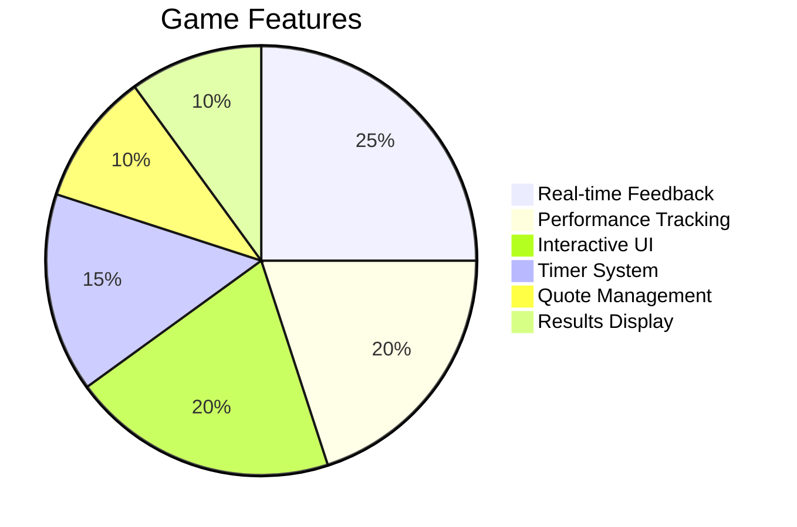
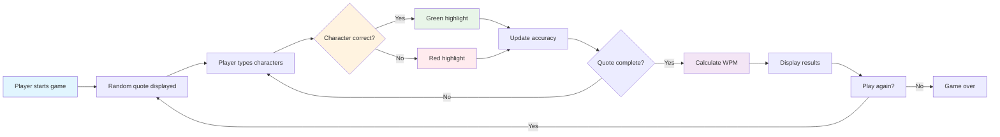
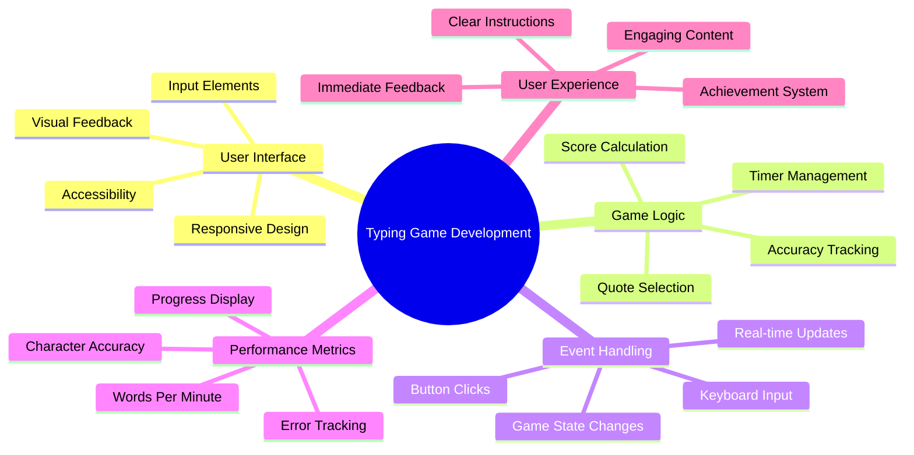
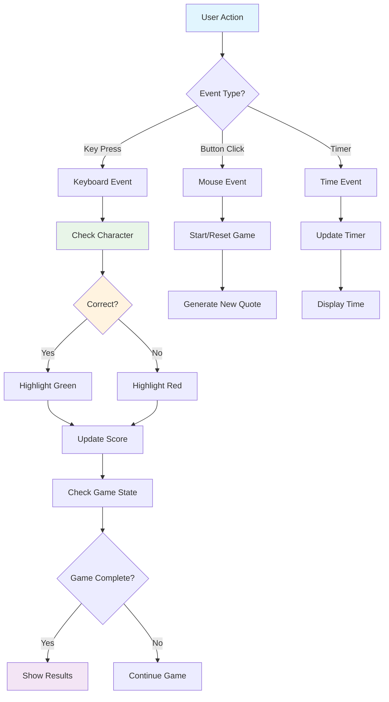
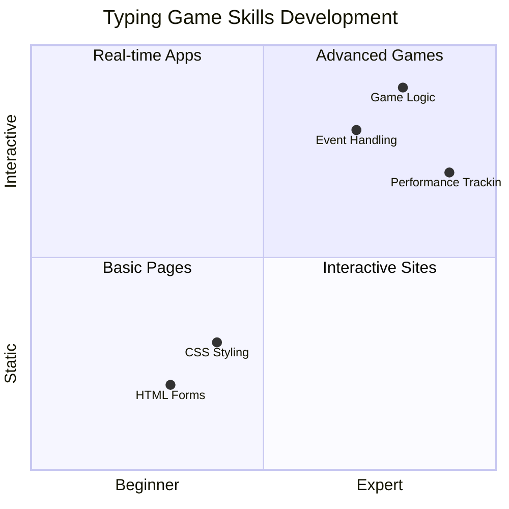
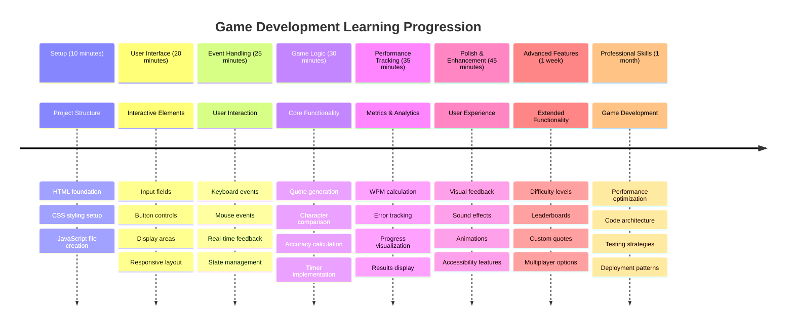

# ਇਵੈਂਟ-ਡ੍ਰਿਵਨ ਪ੍ਰੋਗਰਾਮਿੰਗ - ਇੱਕ ਟਾਈਪਿੰਗ ਗੇਮ ਬਣਾਓ

## ਪਰਿਚਯ

ਇਹ ਕੁਝ ਹੈ ਜੋ ਹਰ ਡਿਵੈਲਪਰ ਜਾਣਦਾ ਹੈ ਪਰ ਕਦੇ-ਕਦੇ ਹੀ ਇਸ ਬਾਰੇ ਗੱਲ ਕਰਦਾ ਹੈ: ਤੇਜ਼ ਟਾਈਪ ਕਰਨਾ ਇੱਕ ਸੁਪਰਪਾਵਰ ਹੈ! 🚀 ਸੋਚੋ - ਜਿੰਨਾ ਜ਼ਿਆਦਾ ਤੇਜ਼ੀ ਨਾਲ ਤੁਸੀਂ ਆਪਣੇ ਵਿਚਾਰਾਂ ਨੂੰ ਆਪਣੇ ਕੋਡ ਐਡੀਟਰ ਤੱਕ ਪਹੁੰਚਾ ਸਕਦੇ ਹੋ, ਉਨਾ ਹੀ ਜ਼ਿਆਦਾ ਤੁਹਾਡੀ ਕ੍ਰੀਏਟਿਵਿਟੀ ਵਧੇਗੀ। ਇਹ ਜਿਵੇਂ ਤੁਹਾਡੇ ਵਿਚਾਰਾਂ ਅਤੇ ਸਕ੍ਰੀਨ ਦੇ ਵਿਚਕਾਰ ਇੱਕ ਸਿੱਧਾ ਪਾਈਪਲਾਈਨ ਹੋਣ ਵਰਗਾ ਹੈ।

ਕੀ ਤੁਸੀਂ ਇਸ ਹੁਨਰ ਨੂੰ ਵਧਾਉਣ ਦਾ ਇੱਕ ਵਧੀਆ ਤਰੀਕਾ ਜਾਣਨਾ ਚਾਹੁੰਦੇ ਹੋ? ਤੁਸੀਂ ਸਹੀ ਸੋਚਿਆ - ਅਸੀਂ ਇੱਕ ਗੇਮ ਬਣਾਉਣ ਜਾ ਰਹੇ ਹਾਂ!

> ਆਓ ਇੱਕ ਸ਼ਾਨਦਾਰ ਟਾਈਪਿੰਗ ਗੇਮ ਇਕੱਠੇ ਬਣਾਈਏ!

ਤਿਆਰ ਹੋ ਜਾਓ ਆਪਣੇ ਸਾਰੇ ਜਾਵਾਸਕ੍ਰਿਪਟ, HTML ਅਤੇ CSS ਹੁਨਰਾਂ ਨੂੰ ਵਰਤਣ ਲਈ? ਅਸੀਂ ਇੱਕ ਟਾਈਪਿੰਗ ਗੇਮ ਬਣਾਉਣ ਜਾ ਰਹੇ ਹਾਂ ਜੋ ਤੁਹਾਨੂੰ ਮਹਾਨ ਡਿਟੈਕਟਿਵ [ਸ਼ਰਲਾਕ ਹੋਮਜ਼](https://en.wikipedia.org/wiki/Sherlock_Holmes) ਦੇ ਰੈਂਡਮ ਕੋਟਸ ਨਾਲ ਚੁਣੌਤੀ ਦੇਵੇਗੀ। ਗੇਮ ਟ੍ਰੈਕ ਕਰੇਗੀ ਕਿ ਤੁਸੀਂ ਕਿੰਨੀ ਤੇਜ਼ ਅਤੇ ਸਹੀ ਟਾਈਪ ਕਰ ਸਕਦੇ ਹੋ - ਅਤੇ ਮੈਨੂੰ ਵਿਸ਼ਵਾਸ ਕਰੋ, ਇਹ ਤੁਹਾਨੂੰ ਉਮੀਦ ਤੋਂ ਜ਼ਿਆਦਾ ਆਕਰਸ਼ਕ ਲੱਗੇਗੀ!

## ਤੁਹਾਨੂੰ ਕੀ ਜਾਣਨ ਦੀ ਲੋੜ ਹੈ

ਸ਼ੁਰੂ ਕਰਨ ਤੋਂ ਪਹਿਲਾਂ, ਇਹ ਯਕੀਨੀ ਬਣਾਓ ਕਿ ਤੁਸੀਂ ਇਹ ਧਾਰਨਾਵਾਂ ਨਾਲ ਸਹੀ ਹੋ (ਚਿੰਤਾ ਨਾ ਕਰੋ ਜੇ ਤੁਹਾਨੂੰ ਛੋਟਾ ਜਿਹਾ ਰੀਫ੍ਰੈਸ਼ਰ ਲੈਣ ਦੀ ਲੋੜ ਹੈ - ਅਸੀਂ ਸਾਰੇ ਇਸ ਮੌਕੇ 'ਤੇ ਰਹੇ ਹਾਂ!):

- ਟੈਕਸਟ ਇਨਪੁਟ ਅਤੇ ਬਟਨ ਕੰਟਰੋਲ ਬਣਾਉਣਾ
- CSS ਅਤੇ ਕਲਾਸਾਂ ਦੀ ਵਰਤੋਂ ਕਰਕੇ ਸਟਾਈਲ ਸੈਟ ਕਰਨਾ  
- ਜਾਵਾਸਕ੍ਰਿਪਟ ਬੁਨਿਆਦੀਆਂ
  - ਇੱਕ ਐਰੇ ਬਣਾਉਣਾ
  - ਇੱਕ ਰੈਂਡਮ ਨੰਬਰ ਬਣਾਉਣਾ
  - ਮੌਜੂਦਾ ਸਮਾਂ ਪ੍ਰਾਪਤ ਕਰਨਾ

ਜੇ ਇਹਨਾਂ ਵਿੱਚੋਂ ਕੋਈ ਵੀ ਚੀਜ਼ ਤੁਹਾਨੂੰ ਥੋੜੀ ਜਿਹੀ ਭੁੱਲੀ ਹੋਈ ਲੱਗਦੀ ਹੈ, ਤਾਂ ਇਹ ਬਿਲਕੁਲ ਠੀਕ ਹੈ! ਕਈ ਵਾਰ ਆਪਣੀ ਜਾਣਕਾਰੀ ਨੂੰ ਮਜ਼ਬੂਤ ਕਰਨ ਦਾ ਸਭ ਤੋਂ ਵਧੀਆ ਤਰੀਕਾ ਇੱਕ ਪ੍ਰੋਜੈਕਟ ਵਿੱਚ ਛਾਲ ਮਾਰਨਾ ਅਤੇ ਚੀਜ਼ਾਂ ਨੂੰ ਸਮਝਣਾ ਹੁੰਦਾ ਹੈ।

### 🔄 **ਪੈਡਾਗੌਜੀਕਲ ਚੈੱਕ-ਇਨ**
**ਬੁਨਿਆਦੀਆਂ ਦੀ ਮੁਲਾਂਕਣ**: ਵਿਕਾਸ ਸ਼ੁਰੂ ਕਰਨ ਤੋਂ ਪਹਿਲਾਂ ਇਹ ਯਕੀਨੀ ਬਣਾਓ ਕਿ ਤੁਸੀਂ ਸਮਝਦੇ ਹੋ:
- ✅ HTML ਫਾਰਮ ਅਤੇ ਇਨਪੁਟ ਐਲੀਮੈਂਟ ਕਿਵੇਂ ਕੰਮ ਕਰਦੇ ਹਨ
- ✅ CSS ਕਲਾਸਾਂ ਅਤੇ ਡਾਇਨਾਮਿਕ ਸਟਾਈਲਿੰਗ
- ✅ ਜਾਵਾਸਕ੍ਰਿਪਟ ਇਵੈਂਟ ਲਿਸਨਰ ਅਤੇ ਹੈਂਡਲਰ
- ✅ ਐਰੇ ਮੈਨਿਪੁਲੇਸ਼ਨ ਅਤੇ ਰੈਂਡਮ ਚੋਣ
- ✅ ਸਮੇਂ ਦੀ ਮਾਪ ਅਤੇ ਗਣਨਾ

**ਤੁਰੰਤ ਸਵੈ-ਪ੍ਰੀਖਣ**: ਕੀ ਤੁਸੀਂ ਸਮਝਾ ਸਕਦੇ ਹੋ ਕਿ ਇਹ ਧਾਰਨਾਵਾਂ ਇੱਕ ਇੰਟਰਐਕਟਿਵ ਗੇਮ ਵਿੱਚ ਕਿਵੇਂ ਕੰਮ ਕਰਦੀਆਂ ਹਨ?
- **ਇਵੈਂਟਸ** ਜਦੋਂ ਯੂਜ਼ਰ ਐਲੀਮੈਂਟਸ ਨਾਲ ਇੰਟਰਐਕਟ ਕਰਦੇ ਹਨ ਤਾਂ ਟ੍ਰਿਗਰ ਹੁੰਦੇ ਹਨ
- **ਹੈਂਡਲਰਸ** ਉਹਨਾਂ ਇਵੈਂਟਸ ਨੂੰ ਪ੍ਰੋਸੈਸ ਕਰਦੇ ਹਨ ਅਤੇ ਗੇਮ ਸਟੇਟ ਨੂੰ ਅਪਡੇਟ ਕਰਦੇ ਹਨ
- **CSS** ਯੂਜ਼ਰ ਐਕਸ਼ਨ ਲਈ ਵਿਜ਼ੁਅਲ ਫੀਡਬੈਕ ਪ੍ਰਦਾਨ ਕਰਦਾ ਹੈ
- **ਟਾਈਮਿੰਗ** ਪ੍ਰਦਰਸ਼ਨ ਮਾਪ ਅਤੇ ਗੇਮ ਪ੍ਰਗਤੀ ਨੂੰ ਯਕੀਨੀ ਬਣਾਉਂਦੀ ਹੈ

## ਆਓ ਇਸ ਨੂੰ ਬਣਾਈਏ!

[ਇਵੈਂਟ ਡ੍ਰਿਵਨ ਪ੍ਰੋਗਰਾਮਿੰਗ ਦੀ ਵਰਤੋਂ ਕਰਕੇ ਟਾਈਪਿੰਗ ਗੇਮ ਬਣਾਉਣਾ](./typing-game/README.md)

### ⚡ **ਅਗਲੇ 5 ਮਿੰਟਾਂ ਵਿੱਚ ਤੁਸੀਂ ਕੀ ਕਰ ਸਕਦੇ ਹੋ**
- [ ] ਆਪਣੇ ਬ੍ਰਾਊਜ਼ਰ ਕਨਸੋਲ ਨੂੰ ਖੋਲ੍ਹੋ ਅਤੇ `addEventListener` ਨਾਲ ਕੀਬੋਰਡ ਇਵੈਂਟਸ ਸੁਣਨ ਦੀ ਕੋਸ਼ਿਸ਼ ਕਰੋ
- [ ] ਇੱਕ ਸਧਾਰਨ HTML ਪੇਜ ਬਣਾਓ ਜਿਸ ਵਿੱਚ ਇੱਕ ਇਨਪੁਟ ਫੀਲਡ ਹੋਵੇ ਅਤੇ ਟਾਈਪਿੰਗ ਡਿਟੈਕਸ਼ਨ ਦੀ ਜਾਂਚ ਕਰੋ
- [ ] ਟਾਈਪ ਕੀਤੇ ਟੈਕਸਟ ਦੀ ਤੁਲਨਾ ਟਾਰਗਟ ਟੈਕਸਟ ਨਾਲ ਕਰਕੇ ਸਟ੍ਰਿੰਗ ਮੈਨਿਪੁਲੇਸ਼ਨ ਦਾ ਅਭਿਆਸ ਕਰੋ
- [ ] `setTimeout` ਨਾਲ ਟਾਈਮਿੰਗ ਫੰਕਸ਼ਨ ਨੂੰ ਸਮਝਣ ਲਈ ਪ੍ਰਯੋਗ ਕਰੋ

### 🎯 **ਇਸ ਘੰਟੇ ਵਿੱਚ ਤੁਸੀਂ ਕੀ ਹਾਸਲ ਕਰ ਸਕਦੇ ਹੋ**
- [ ] ਪੋਸਟ-ਲੈਸਨ ਕਵਿਜ ਪੂਰਾ ਕਰੋ ਅਤੇ ਇਵੈਂਟ-ਡ੍ਰਿਵਨ ਪ੍ਰੋਗਰਾਮਿੰਗ ਨੂੰ ਸਮਝੋ
- [ ] ਸ਼ਬਦ ਵੈਲੀਡੇਸ਼ਨ ਨਾਲ ਟਾਈਪਿੰਗ ਗੇਮ ਦਾ ਬੁਨਿਆਦੀ ਵਰਜਨ ਬਣਾਓ
- [ ] ਸਹੀ ਅਤੇ ਗਲਤ ਟਾਈਪਿੰਗ ਲਈ ਵਿਜ਼ੁਅਲ ਫੀਡਬੈਕ ਸ਼ਾਮਲ ਕਰੋ
- [ ] ਗਤੀ ਅਤੇ ਸਹੀਤਾ ਦੇ ਆਧਾਰ 'ਤੇ ਇੱਕ ਸਧਾਰਨ ਸਕੋਰਿੰਗ ਸਿਸਟਮ ਲਾਗੂ ਕਰੋ
- [ ] CSS ਨਾਲ ਆਪਣੀ ਗੇਮ ਨੂੰ ਸਜਾਓ ਤਾਂ ਜੋ ਇਹ ਦਿੱਖ ਵਿੱਚ ਆਕਰਸ਼ਕ ਹੋਵੇ

### 📅 **ਤੁਹਾਡਾ ਹਫ਼ਤੇ-ਲੰਬਾ ਗੇਮ ਵਿਕਾਸ**
- [ ] ਪੂਰੀ ਟਾਈਪਿੰਗ ਗੇਮ ਨੂੰ ਸਾਰੇ ਫੀਚਰਾਂ ਅਤੇ ਪੋਲਿਸ਼ ਨਾਲ ਪੂਰਾ ਕਰੋ
- [ ] ਵੱਖ-ਵੱਖ ਸ਼ਬਦ ਜਟਿਲਤਾ ਦੇ ਨਾਲ ਮੁਸ਼ਕਲ ਪੱਧਰ ਸ਼ਾਮਲ ਕਰੋ
- [ ] ਯੂਜ਼ਰ ਸਟੈਟਿਸਟਿਕਸ ਟ੍ਰੈਕਿੰਗ ਲਾਗੂ ਕਰੋ (WPM, ਸਮੇਂ ਦੇ ਨਾਲ ਸਹੀਤਾ)
- [ ] ਬਿਹਤਰ ਯੂਜ਼ਰ ਅਨੁਭਵ ਲਈ ਸਾਊਂਡ ਇਫੈਕਟਸ ਅਤੇ ਐਨੀਮੇਸ਼ਨ ਬਣਾਓ
- [ ] ਆਪਣੀ ਗੇਮ ਨੂੰ ਟਚ ਡਿਵਾਈਸਾਂ ਲਈ ਮੋਬਾਈਲ-ਰਿਸਪਾਂਸਿਵ ਬਣਾਓ
- [ ] ਆਪਣੀ ਗੇਮ ਨੂੰ ਆਨਲਾਈਨ ਸ਼ੇਅਰ ਕਰੋ ਅਤੇ ਯੂਜ਼ਰਾਂ ਤੋਂ ਫੀਡਬੈਕ ਪ੍ਰਾਪਤ ਕਰੋ

### 🌟 **ਤੁਹਾਡਾ ਮਹੀਨੇ-ਲੰਬਾ ਇੰਟਰਐਕਟਿਵ ਵਿਕਾਸ**
- [ ] ਵੱਖ-ਵੱਖ ਇੰਟਰਐਕਸ਼ਨ ਪੈਟਰਨ ਦੀ ਖੋਜ ਕਰਦੇ ਹੋਏ ਕਈ ਗੇਮਾਂ ਬਣਾਓ
- [ ] ਗੇਮ ਲੂਪਸ, ਸਟੇਟ ਮੈਨੇਜਮੈਂਟ, ਅਤੇ ਪ੍ਰਦਰਸ਼ਨ ਅਪਟਿਮਾਈਜ਼ੇਸ਼ਨ ਬਾਰੇ ਸਿੱਖੋ
- [ ] ਖੁੱਲ੍ਹੇ ਸਰੋਤ ਵਾਲੇ ਗੇਮ ਵਿਕਾਸ ਪ੍ਰੋਜੈਕਟਾਂ ਵਿੱਚ ਯੋਗਦਾਨ ਦਿਓ
- [ ] ਅਗਰਗਤੀ ਟਾਈਮਿੰਗ ਧਾਰਨਾਵਾਂ ਅਤੇ ਸਮੂਥ ਐਨੀਮੇਸ਼ਨ ਵਿੱਚ ਮਾਹਰ ਬਣੋ
- [ ] ਵੱਖ-ਵੱਖ ਇੰਟਰਐਕਟਿਵ ਐਪਲੀਕੇਸ਼ਨਾਂ ਨੂੰ ਦਰਸਾਉਣ ਵਾਲਾ ਇੱਕ ਪੋਰਟਫੋਲਿਓ ਬਣਾਓ
- [ ] ਗੇਮ ਵਿਕਾਸ ਅਤੇ ਯੂਜ਼ਰ ਇੰਟਰਐਕਸ਼ਨ ਵਿੱਚ ਦਿਲਚਸਪੀ ਰੱਖਣ ਵਾਲਿਆਂ ਨੂੰ ਮਾਰਗਦਰਸ਼ਨ ਦਿਓ

## 🎯 ਤੁਹਾਡਾ ਟਾਈਪਿੰਗ ਗੇਮ ਮਾਹਰਤਾ ਟਾਈਮਲਾਈਨ

### 🛠️ ਤੁਹਾਡਾ ਗੇਮ ਵਿਕਾਸ ਟੂਲਕਿਟ ਸਾਰ

ਇਹ ਪ੍ਰੋਜੈਕਟ ਪੂਰਾ ਕਰਨ ਤੋਂ ਬਾਅਦ, ਤੁਸੀਂ ਮਾਹਰ ਹੋ ਜਾਵੋਗੇ:
- **ਇਵੈਂਟ-ਡ੍ਰਿਵਨ ਪ੍ਰੋਗਰਾਮਿੰਗ**: ਰਿਸਪਾਂਸਿਵ ਯੂਜ਼ਰ ਇੰਟਰਫੇਸ ਜੋ ਇਨਪੁਟ 'ਤੇ ਪ੍ਰਤੀਕ੍ਰਿਆ ਦਿੰਦੇ ਹਨ
- **ਰੀਅਲ-ਟਾਈਮ ਫੀਡਬੈਕ**: ਤੁਰੰਤ ਵਿਜ਼ੁਅਲ ਅਤੇ ਪ੍ਰਦਰਸ਼ਨ ਅਪਡੇਟਸ
- **ਪ੍ਰਦਰਸ਼ਨ ਮਾਪ**: ਸਹੀ ਟਾਈਮਿੰਗ ਅਤੇ ਸਕੋਰਿੰਗ ਸਿਸਟਮ
- **ਗੇਮ ਸਟੇਟ ਮੈਨੇਜਮੈਂਟ**: ਐਪਲੀਕੇਸ਼ਨ ਫਲੋ ਅਤੇ ਯੂਜ਼ਰ ਅਨੁਭਵ ਨੂੰ ਕੰਟਰੋਲ ਕਰਨਾ
- **ਇੰਟਰਐਕਟਿਵ ਡਿਜ਼ਾਈਨ**: ਆਕਰਸ਼ਕ, ਆਦਤ ਬਣਾਉਣ ਵਾਲੇ ਯੂਜ਼ਰ ਅਨੁਭਵ ਬਣਾਉਣਾ
- **ਮਾਡਰਨ ਵੈਬ APIs**: ਬ੍ਰਾਊਜ਼ਰ ਦੀ ਸਮਰੱਥਾ ਨੂੰ ਵਰਤ ਕੇ ਰਿਚ ਇੰਟਰਐਕਸ਼ਨ
- **ਐਕਸੈਸਬਿਲਿਟੀ ਪੈਟਰਨਸ**: ਸਾਰੇ ਯੂਜ਼ਰਾਂ ਲਈ ਸਮਾਵੇਸ਼ੀ ਡਿਜ਼ਾਈਨ

**ਅਸਲ ਦੁਨੀਆ ਵਿੱਚ ਅਰਜ਼ੀ**: ਇਹ ਹੁਨਰ ਸਿੱਧੇ ਲਾਗੂ ਹੁੰਦੇ ਹਨ:
- **ਵੈਬ ਐਪਲੀਕੇਸ਼ਨਸ**: ਕੋਈ ਵੀ ਇੰਟਰਐਕਟਿਵ ਇੰਟਰਫੇਸ ਜਾਂ ਡੈਸ਼ਬੋਰਡ
- **ਸਿੱਖਣ ਵਾਲਾ ਸੌਫਟਵੇਅਰ**: ਸਿੱਖਣ ਵਾਲੇ ਪਲੇਟਫਾਰਮ ਅਤੇ ਹੁਨਰ ਮੁਲਾਂਕਣ ਟੂਲ
- **ਉਤਪਾਦਕਤਾ ਟੂਲਸ**: ਟੈਕਸਟ ਐਡੀਟਰਸ, IDEs, ਅਤੇ ਸਹਿਯੋਗੀ ਸੌਫਟਵੇਅਰ
- **ਗੇਮਿੰਗ ਇੰਡਸਟਰੀ**: ਬ੍ਰਾਊਜ਼ਰ ਗੇਮਸ ਅਤੇ ਇੰਟਰਐਕਟਿਵ ਮਨੋਰੰਜਨ
- **ਮੋਬਾਈਲ ਵਿਕਾਸ**: ਟਚ-ਅਧਾਰਿਤ ਇੰਟਰਫੇਸ ਅਤੇ ਜੈਸਚਰ ਹੈਂਡਲਿੰਗ

**ਅਗਲਾ ਪੱਧਰ**: ਤੁਸੀਂ ਅਗਰਗਤੀ ਗੇਮ ਫਰੇਮਵਰਕਸ, ਰੀਅਲ-ਟਾਈਮ ਮਲਟੀਪਲੇਅਰ ਸਿਸਟਮ, ਜਾਂ ਜਟਿਲ ਇੰਟਰਐਕਟਿਵ ਐਪਲੀਕੇਸ਼ਨਜ਼ ਦੀ ਖੋਜ ਕਰਨ ਲਈ ਤਿਆਰ ਹੋ!

## ਕਰੈਡਿਟਸ

♥️ ਨਾਲ ਲਿਖਿਆ [ਕ੍ਰਿਸਟੋਫਰ ਹੈਰਿਸਨ](http://www.twitter.com/geektrainer)

---

**ਅਸਵੀਕਰਤਾ**:  
ਇਹ ਦਸਤਾਵੇਜ਼ AI ਅਨੁਵਾਦ ਸੇਵਾ [Co-op Translator](https://github.com/Azure/co-op-translator) ਦੀ ਵਰਤੋਂ ਕਰਕੇ ਅਨੁਵਾਦ ਕੀਤਾ ਗਿਆ ਹੈ। ਜਦੋਂ ਕਿ ਅਸੀਂ ਸਹੀ ਹੋਣ ਦੀ ਕੋਸ਼ਿਸ਼ ਕਰਦੇ ਹਾਂ, ਕਿਰਪਾ ਕਰਕੇ ਧਿਆਨ ਦਿਓ ਕਿ ਸਵੈਚਾਲਿਤ ਅਨੁਵਾਦਾਂ ਵਿੱਚ ਗਲਤੀਆਂ ਜਾਂ ਅਸੁਚਤਤਾਵਾਂ ਹੋ ਸਕਦੀਆਂ ਹਨ। ਇਸ ਦੀ ਮੂਲ ਭਾਸ਼ਾ ਵਿੱਚ ਮੂਲ ਦਸਤਾਵੇਜ਼ ਨੂੰ ਅਧਿਕਾਰਤ ਸਰੋਤ ਮੰਨਿਆ ਜਾਣਾ ਚਾਹੀਦਾ ਹੈ। ਮਹੱਤਵਪੂਰਨ ਜਾਣਕਾਰੀ ਲਈ, ਪੇਸ਼ੇਵਰ ਮਨੁੱਖੀ ਅਨੁਵਾਦ ਦੀ ਸਿਫਾਰਸ਼ ਕੀਤੀ ਜਾਂਦੀ ਹੈ। ਇਸ ਅਨੁਵਾਦ ਦੀ ਵਰਤੋਂ ਤੋਂ ਪੈਦਾ ਹੋਣ ਵਾਲੇ ਕਿਸੇ ਵੀ ਗਲਤ ਫਹਿਮੀ ਜਾਂ ਗਲਤ ਵਿਆਖਿਆ ਲਈ ਅਸੀਂ ਜ਼ਿੰਮੇਵਾਰ ਨਹੀਂ ਹਾਂ।