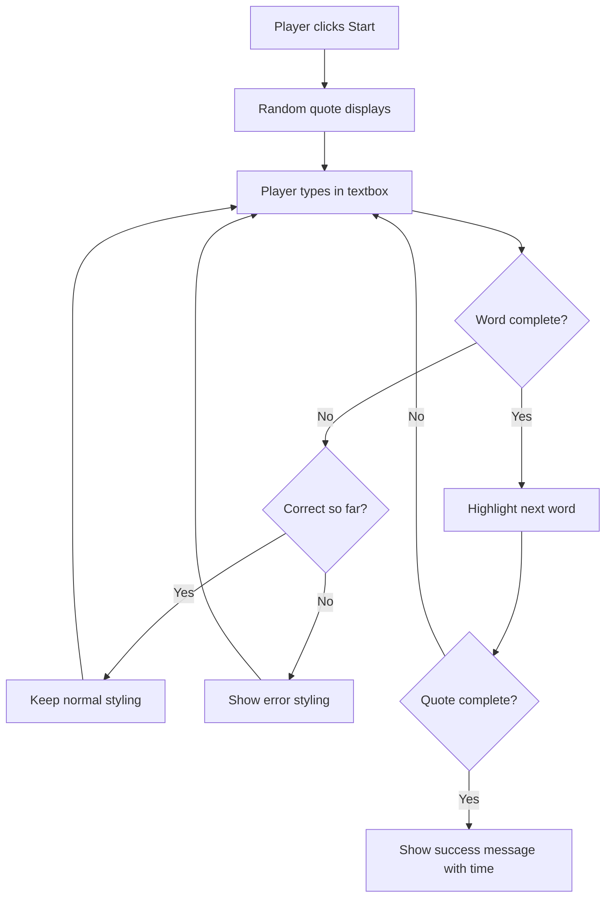
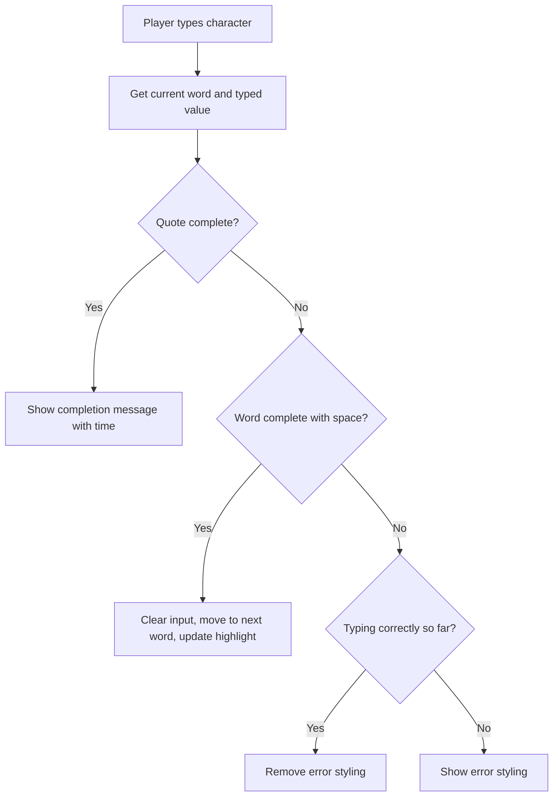

<!--
CO_OP_TRANSLATOR_METADATA:
{
  "original_hash": "e6b75e5b8caae906473a8a09d77b7121",
  "translation_date": "2025-10-22T18:03:52+00:00",
  "source_file": "4-typing-game/typing-game/README.md",
  "language_code": "pa"
}
-->
# ਖੇਡ ਬਣਾਉਣਾ ਇਵੈਂਟਸ ਦੀ ਵਰਤੋਂ ਕਰਕੇ

ਕੀ ਤੁਸੀਂ ਕਦੇ ਸੋਚਿਆ ਹੈ ਕਿ ਵੈਬਸਾਈਟਾਂ ਨੂੰ ਕਿਵੇਂ ਪਤਾ ਹੁੰਦਾ ਹੈ ਕਿ ਤੁਸੀਂ ਬਟਨ 'ਤੇ ਕਲਿਕ ਕੀਤਾ ਜਾਂ ਟੈਕਸਟ ਬਾਕਸ ਵਿੱਚ ਕੁਝ ਟਾਈਪ ਕੀਤਾ? ਇਹ ਸਾਰਾ ਜਾਦੂ ਇਵੈਂਟ-ਡ੍ਰਿਵਨ ਪ੍ਰੋਗਰਾਮਿੰਗ ਦਾ ਹੈ! ਇਸ ਮਹੱਤਵਪੂਰਨ ਹੁਨਰ ਨੂੰ ਸਿੱਖਣ ਦਾ ਸਭ ਤੋਂ ਵਧੀਆ ਤਰੀਕਾ ਹੈ ਕੁਝ ਉਪਯੋਗੀ ਬਣਾਉਣਾ - ਇੱਕ ਟਾਈਪਿੰਗ ਸਪੀਡ ਗੇਮ ਜੋ ਤੁਹਾਡੇ ਹਰ ਕੀ-ਸਟ੍ਰੋਕ 'ਤੇ ਪ੍ਰਤੀਕ੍ਰਿਆ ਦਿੰਦੀ ਹੈ।

ਤੁਸੀਂ ਖੁਦ ਵੇਖੋਗੇ ਕਿ ਵੈਬ ਬ੍ਰਾਊਜ਼ਰ ਤੁਹਾਡੇ ਜਾਵਾਸਕ੍ਰਿਪਟ ਕੋਡ ਨਾਲ "ਗੱਲਬਾਤ" ਕਿਵੇਂ ਕਰਦੇ ਹਨ। ਹਰ ਵਾਰ ਜਦੋਂ ਤੁਸੀਂ ਕਲਿਕ ਕਰਦੇ ਹੋ, ਟਾਈਪ ਕਰਦੇ ਹੋ ਜਾਂ ਮਾਊਸ ਨੂੰ ਹਿਲਾਉਂਦੇ ਹੋ, ਬ੍ਰਾਊਜ਼ਰ ਤੁਹਾਡੇ ਕੋਡ ਨੂੰ ਛੋਟੇ ਸੁਨੇਹੇ ਭੇਜਦਾ ਹੈ (ਜਿਨ੍ਹਾਂ ਨੂੰ ਅਸੀਂ ਇਵੈਂਟਸ ਕਹਿੰਦੇ ਹਾਂ), ਅਤੇ ਤੁਸੀਂ ਫੈਸਲਾ ਕਰਦੇ ਹੋ ਕਿ ਕਿਵੇਂ ਪ੍ਰਤੀਕ੍ਰਿਆ ਦੇਣੀ ਹੈ!

ਜਦੋਂ ਤੱਕ ਅਸੀਂ ਇਹ ਖਤਮ ਕਰਾਂਗੇ, ਤੁਹਾਡੇ ਕੋਲ ਇੱਕ ਅਸਲੀ ਟਾਈਪਿੰਗ ਗੇਮ ਹੋਵੇਗੀ ਜੋ ਤੁਹਾਡੀ ਸਪੀਡ ਅਤੇ ਸਹੀਤਾ ਨੂੰ ਟ੍ਰੈਕ ਕਰਦੀ ਹੈ। ਸਭ ਤੋਂ ਮਹੱਤਵਪੂਰਨ ਗੱਲ, ਤੁਸੀਂ ਉਹ ਬੁਨਿਆਦੀ ਧਾਰਨਾਵਾਂ ਨੂੰ ਸਮਝੋਗੇ ਜੋ ਹਰ ਇੰਟਰਐਕਟਿਵ ਵੈਬਸਾਈਟ ਨੂੰ ਤਾਕਤ ਦਿੰਦੇ ਹਨ। ਚਲੋ ਸ਼ੁਰੂ ਕਰੀਏ!

## ਪ੍ਰੀ-ਲੈਕਚਰ ਕਵਿਜ਼

[ਪ੍ਰੀ-ਲੈਕਚਰ ਕਵਿਜ਼](https://ff-quizzes.netlify.app/web/quiz/21)

## ਇਵੈਂਟ-ਡ੍ਰਿਵਨ ਪ੍ਰੋਗਰਾਮਿੰਗ

ਆਪਣੇ ਮਨਪਸੰਦ ਐਪ ਜਾਂ ਵੈਬਸਾਈਟ ਬਾਰੇ ਸੋਚੋ - ਇਸਨੂੰ ਜ਼ਿੰਦਾ ਅਤੇ ਪ੍ਰਤੀਕ੍ਰਿਆਸ਼ੀਲ ਬਣਾਉਣ ਵਾਲੀ ਚੀਜ਼ ਕੀ ਹੈ? ਇਹ ਸਾਰਾ ਇਸ ਗੱਲ 'ਤੇ ਨਿਰਭਰ ਕਰਦਾ ਹੈ ਕਿ ਇਹ ਤੁਹਾਡੇ ਕੀ ਕਰਨ 'ਤੇ ਕਿਵੇਂ ਪ੍ਰਤੀਕ੍ਰਿਆ ਦਿੰਦਾ ਹੈ! ਹਰ ਟੈਪ, ਕਲਿਕ, ਸਵਾਈਪ ਜਾਂ ਕੀ-ਸਟ੍ਰੋਕ "ਇਵੈਂਟ" ਬਣਾਉਂਦਾ ਹੈ, ਅਤੇ ਇਹੀ ਹੈ ਜਿੱਥੇ ਵੈਬ ਡਿਵੈਲਪਮੈਂਟ ਦਾ ਅਸਲੀ ਜਾਦੂ ਹੁੰਦਾ ਹੈ।

ਇਹ ਹੈ ਜੋ ਵੈਬ ਲਈ ਪ੍ਰੋਗਰਾਮਿੰਗ ਨੂੰ ਬਹੁਤ ਦਿਲਚਸਪ ਬਣਾਉਂਦਾ ਹੈ: ਅਸੀਂ ਕਦੇ ਨਹੀਂ ਜਾਣਦੇ ਕਿ ਕੋਈ ਵਿਅਕਤੀ ਉਸ ਬਟਨ 'ਤੇ ਕਦੋਂ ਕਲਿਕ ਕਰੇਗਾ ਜਾਂ ਟੈਕਸਟ ਬਾਕਸ ਵਿੱਚ ਟਾਈਪ ਕਰਨਾ ਸ਼ੁਰੂ ਕਰੇਗਾ। ਉਹ ਤੁਰੰਤ ਕਲਿਕ ਕਰ ਸਕਦੇ ਹਨ, ਪੰਜ ਮਿੰਟਾਂ ਦੀ ਉਡੀਕ ਕਰ ਸਕਦੇ ਹਨ, ਜਾਂ ਸ਼ਾਇਦ ਕਦੇ ਵੀ ਕਲਿਕ ਨਾ ਕਰਨ। ਇਸ ਅਣਪਛਾਤੇਪਣ ਦਾ ਮਤਲਬ ਹੈ ਕਿ ਅਸੀਂ ਆਪਣੇ ਕੋਡ ਨੂੰ ਲਿਖਣ ਬਾਰੇ ਵੱਖਰੇ ਤਰੀਕੇ ਨਾਲ ਸੋਚਣ ਦੀ ਲੋੜ ਹੈ।

ਇੱਕ ਰਸੋਈ ਦੀ ਰੀਸਿਪੀ ਵਾਂਗ ਉੱਪਰ ਤੋਂ ਹੇਠਾਂ ਚੱਲਣ ਵਾਲਾ ਕੋਡ ਲਿਖਣ ਦੀ ਬਜਾਏ, ਅਸੀਂ ਕੋਡ ਲਿਖਦੇ ਹਾਂ ਜੋ ਕੁਝ ਹੋਣ ਦੀ ਉਡੀਕ ਕਰਦਾ ਹੈ। ਇਹ ਕੁਝ ਇਸ ਤਰ੍ਹਾਂ ਹੈ ਜਿਵੇਂ 1800 ਦੇ ਦਹਾਕੇ ਵਿੱਚ ਟੈਲੀਗ੍ਰਾਫ ਓਪਰੇਟਰ ਆਪਣੇ ਮਸ਼ੀਨਾਂ ਦੇ ਕੋਲ ਬੈਠਦੇ ਸਨ, ਤੁਰੰਤ ਪ੍ਰਤੀਕ੍ਰਿਆ ਦੇਣ ਲਈ ਤਿਆਰ ਹੁੰਦੇ ਸਨ ਜਦੋਂ ਵੀ ਤਾਰ ਆਉਂਦੀ ਸੀ।

ਤਾਂ ਫਿਰ "ਇਵੈਂਟ" ਅਸਲ ਵਿੱਚ ਕੀ ਹੈ? ਸਧਾਰਨ ਤੌਰ 'ਤੇ, ਇਹ ਕੁਝ ਹੈ ਜੋ ਹੁੰਦਾ ਹੈ! ਜਦੋਂ ਤੁਸੀਂ ਬਟਨ 'ਤੇ ਕਲਿਕ ਕਰਦੇ ਹੋ - ਇਹ ਇੱਕ ਇਵੈਂਟ ਹੈ। ਜਦੋਂ ਤੁਸੀਂ ਇੱਕ ਅੱਖਰ ਟਾਈਪ ਕਰਦੇ ਹੋ - ਇਹ ਇੱਕ ਇਵੈਂਟ ਹੈ। ਜਦੋਂ ਤੁਸੀਂ ਆਪਣਾ ਮਾਊਸ ਹਿਲਾਉਂਦੇ ਹੋ - ਇਹ ਇੱਕ ਹੋਰ ਇਵੈਂਟ ਹੈ।

ਇਵੈਂਟ-ਡ੍ਰਿਵਨ ਪ੍ਰੋਗਰਾਮਿੰਗ ਸਾਨੂੰ ਆਪਣੇ ਕੋਡ ਨੂੰ ਸੁਣਨ ਅਤੇ ਪ੍ਰਤੀਕ੍ਰਿਆ ਦੇਣ ਲਈ ਸੈਟ ਕਰਨ ਦੀ ਆਗਿਆ ਦਿੰਦੀ ਹੈ। ਅਸੀਂ ਵਿਸ਼ੇਸ਼ ਫੰਕਸ਼ਨ ਬਣਾਉਂਦੇ ਹਾਂ ਜਿਨ੍ਹਾਂ ਨੂੰ **ਇਵੈਂਟ ਲਿਸਨਰ** ਕਿਹਾ ਜਾਂਦਾ ਹੈ ਜੋ ਵਿਸ਼ੇਸ਼ ਚੀਜ਼ਾਂ ਦੇ ਹੋਣ ਦੀ ਉਡੀਕ ਕਰਦੇ ਹਨ, ਫਿਰ ਜਦੋਂ ਉਹ ਹੁੰਦੇ ਹਨ ਤਾਂ ਤੁਰੰਤ ਕਾਰਵਾਈ ਕਰਦੇ ਹਨ।

ਇਵੈਂਟ ਲਿਸਨਰ ਨੂੰ ਆਪਣੇ ਕੋਡ ਲਈ ਡੋਰਬੈਲ ਹੋਣ ਵਾਂਗ ਸੋਚੋ। ਤੁਸੀਂ ਡੋਰਬੈਲ ਸੈਟ ਕਰਦੇ ਹੋ (`addEventListener()`), ਇਸਨੂੰ ਦੱਸਦੇ ਹੋ ਕਿ ਕਿਹੜੀ ਆਵਾਜ਼ ਸੁਣਨੀ ਹੈ (ਜਿਵੇਂ 'ਕਲਿਕ' ਜਾਂ 'ਕੀਪ੍ਰੈਸ'), ਅਤੇ ਫਿਰ ਇਹ ਨਿਰਧਾਰਤ ਕਰਦੇ ਹੋ ਕਿ ਜਦੋਂ ਕੋਈ ਇਸਨੂੰ ਬਜਾਉਂਦਾ ਹੈ ਤਾਂ ਕੀ ਹੋਣਾ ਚਾਹੀਦਾ ਹੈ (ਤੁਹਾਡਾ ਕਸਟਮ ਫੰਕਸ਼ਨ)।

**ਇਵੈਂਟ ਲਿਸਨਰ ਕਿਵੇਂ ਕੰਮ ਕਰਦੇ ਹਨ:**
- **ਸੁਣਦੇ ਹਨ** ਵਿਸ਼ੇਸ਼ ਯੂਜ਼ਰ ਐਕਸ਼ਨ ਜਿਵੇਂ ਕਿ ਕਲਿਕ, ਕੀ-ਸਟ੍ਰੋਕ ਜਾਂ ਮਾਊਸ ਮੂਵਮੈਂਟ
- **ਤੁਰੰਤ ਚਲਾਉਂਦੇ ਹਨ** ਤੁਹਾਡਾ ਕਸਟਮ ਕੋਡ ਜਦੋਂ ਨਿਰਧਾਰਤ ਇਵੈਂਟ ਹੁੰਦਾ ਹੈ
- **ਤੁਰੰਤ ਪ੍ਰਤੀਕ੍ਰਿਆ ਦਿੰਦੇ ਹਨ** ਯੂਜ਼ਰ ਇੰਟਰਐਕਸ਼ਨ ਲਈ, ਇੱਕ ਸਹੀਮਲ ਅਨੁਭਵ ਬਣਾਉਂਦੇ ਹਨ
- **ਇਕੋ ਐਲੀਮੈਂਟ 'ਤੇ ਕਈ ਇਵੈਂਟਸ ਨੂੰ ਸੰਭਾਲਦੇ ਹਨ** ਵੱਖਰੇ ਲਿਸਨਰ ਦੀ ਵਰਤੋਂ ਕਰਕੇ

> **NOTE:** ਇਹ ਗੱਲ ਉਜਾਗਰ ਕਰਨ ਵਾਲੀ ਹੈ ਕਿ ਇਵੈਂਟ ਲਿਸਨਰ ਬਣਾਉਣ ਦੇ ਕਈ ਤਰੀਕੇ ਹਨ। ਤੁਸੀਂ ਗੁਮਨਾਮ ਫੰਕਸ਼ਨ ਦੀ ਵਰਤੋਂ ਕਰ ਸਕਦੇ ਹੋ, ਜਾਂ ਨਾਮਿਤ ones ਬਣਾਉਣ। ਤੁਸੀਂ ਵੱਖ-ਵੱਖ ਸ਼ਾਰਟਕਟ ਦੀ ਵਰਤੋਂ ਕਰ ਸਕਦੇ ਹੋ, ਜਿਵੇਂ `click` ਪ੍ਰਾਪਰਟੀ ਸੈਟ ਕਰਨਾ, ਜਾਂ `addEventListener()` ਦੀ ਵਰਤੋਂ ਕਰਨਾ। ਸਾਡੇ ਅਭਿਆਸ ਵਿੱਚ ਅਸੀਂ `addEventListener()` ਅਤੇ ਗੁਮਨਾਮ ਫੰਕਸ਼ਨ 'ਤੇ ਧਿਆਨ ਦੇਣ ਜਾ ਰਹੇ ਹਾਂ, ਕਿਉਂਕਿ ਇਹ ਵੈਬ ਡਿਵੈਲਪਰਾਂ ਦੁਆਰਾ ਵਰਤਿਆ ਜਾਣ ਵਾਲਾ ਸਭ ਤੋਂ ਆਮ ਤਰੀਕਾ ਹੈ। ਇਹ ਸਭ ਤੋਂ ਲਚਕਦਾਰ ਵੀ ਹੈ, ਕਿਉਂਕਿ `addEventListener()` ਸਾਰੇ ਇਵੈਂਟਸ ਲਈ ਕੰਮ ਕਰਦਾ ਹੈ, ਅਤੇ ਇਵੈਂਟ ਦਾ ਨਾਮ ਪੈਰਾਮੀਟਰ ਵਜੋਂ ਦਿੱਤਾ ਜਾ ਸਕਦਾ ਹੈ।

### ਆਮ ਇਵੈਂਟਸ

ਜਦੋਂ ਕਿ ਵੈਬ ਬ੍ਰਾਊਜ਼ਰ ਤੁਹਾਡੇ ਲਈ ਸੁਣਨ ਲਈ ਕਈ ਵੱਖਰੇ ਇਵੈਂਟਸ ਦੀ ਪੇਸ਼ਕਸ਼ ਕਰਦੇ ਹਨ, ਜ਼ਿਆਦਾਤਰ ਇੰਟਰਐਕਟਿਵ ਐਪਲੀਕੇਸ਼ਨ ਸਿਰਫ ਕੁਝ ਮੁੱਖ ਇਵੈਂਟਸ 'ਤੇ ਨਿਰਭਰ ਕਰਦੇ ਹਨ। ਇਹ ਮੁੱਖ ਇਵੈਂਟਸ ਨੂੰ ਸਮਝਣਾ ਤੁਹਾਨੂੰ ਉੱਚ-ਦਰਜੇ ਦੇ ਯੂਜ਼ਰ ਇੰਟਰਐਕਸ਼ਨ ਬਣਾਉਣ ਲਈ ਬੁਨਿਆਦ ਮੁਹੱਈਆ ਕਰੇਗਾ।

ਜਦੋਂ ਤੁਸੀਂ ਇੱਕ ਐਪਲੀਕੇਸ਼ਨ ਬਣਾਉਂਦੇ ਹੋ ਤਾਂ ਸੁਣਨ ਲਈ [ਕਈ ਇਵੈਂਟਸ](https://developer.mozilla.org/docs/Web/Events) ਉਪਲਬਧ ਹਨ। ਅਸਲ ਵਿੱਚ, ਪੇਜ 'ਤੇ ਯੂਜ਼ਰ ਦੁਆਰਾ ਕੀਤੀ ਗਈ ਕੋਈ ਵੀ ਚੀਜ਼ ਇੱਕ ਇਵੈਂਟ ਪੈਦਾ ਕਰਦੀ ਹੈ, ਜੋ ਤੁਹਾਨੂੰ ਇਹ ਯਕੀਨੀ ਬਣਾਉਣ ਲਈ ਬਹੁਤ ਤਾਕਤ ਦਿੰਦੀ ਹੈ ਕਿ ਉਹ ਉਹ ਅਨੁਭਵ ਪ੍ਰਾਪਤ ਕਰਦੇ ਹਨ ਜੋ ਤੁਸੀਂ ਚਾਹੁੰਦੇ ਹੋ। ਖੁਸ਼ਕਿਸਮਤੀ ਨਾਲ, ਤੁਹਾਨੂੰ ਆਮ ਤੌਰ 'ਤੇ ਸਿਰਫ ਕੁਝ ਮੁੱਖ ਇਵੈਂਟਸ ਦੀ ਲੋੜ ਹੁੰਦੀ ਹੈ। ਇੱਥੇ ਕੁਝ ਆਮ ਹਨ (ਜਿਨ੍ਹਾਂ ਵਿੱਚੋਂ ਦੋ ਅਸੀਂ ਆਪਣੀ ਗੇਮ ਬਣਾਉਣ ਵੇਲੇ ਵਰਤਾਂਗੇ):

| ਇਵੈਂਟ | ਵੇਰਵਾ | ਆਮ ਵਰਤੋਂ ਦੇ ਕੇਸ |
|-------|-------------|------------------|
| `click` | ਯੂਜ਼ਰ ਨੇ ਕੁਝ 'ਤੇ ਕਲਿਕ ਕੀਤਾ | ਬਟਨ, ਲਿੰਕ, ਇੰਟਰਐਕਟਿਵ ਐਲੀਮੈਂਟਸ |
| `contextmenu` | ਯੂਜ਼ਰ ਨੇ ਸੱਜੇ ਮਾਊਸ ਬਟਨ 'ਤੇ ਕਲਿਕ ਕੀਤਾ | ਕਸਟਮ ਰਾਈਟ-ਕਲਿਕ ਮੀਨੂ |
| `select` | ਯੂਜ਼ਰ ਨੇ ਕੁਝ ਟੈਕਸਟ ਹਾਈਲਾਈਟ ਕੀਤਾ | ਟੈਕਸਟ ਐਡਿਟਿੰਗ, ਕਾਪੀ ਓਪਰੇਸ਼ਨ |
| `input` | ਯੂਜ਼ਰ ਨੇ ਕੁਝ ਟੈਕਸਟ ਇਨਪੁਟ ਕੀਤਾ | ਫਾਰਮ ਵੈਲੀਡੇਸ਼ਨ, ਰੀਅਲ-ਟਾਈਮ ਸਰਚ |

**ਇਹ ਇਵੈਂਟ ਟਾਈਪਸ ਨੂੰ ਸਮਝਣਾ:**
- **ਟ੍ਰਿਗਰ** ਜਦੋਂ ਯੂਜ਼ਰ ਪੇਜ 'ਤੇ ਵਿਸ਼ੇਸ਼ ਐਲੀਮੈਂਟਸ ਨਾਲ ਇੰਟਰਐਕਟ ਕਰਦੇ ਹਨ
- **ਯੂਜ਼ਰ ਦੇ ਐਕਸ਼ਨ ਬਾਰੇ ਵਿਸਤ੍ਰਿਤ ਜਾਣਕਾਰੀ ਪ੍ਰਦਾਨ ਕਰਦੇ ਹਨ** ਇਵੈਂਟ ਓਬਜੈਕਟਸ ਰਾਹੀਂ
- **ਤੁਹਾਨੂੰ ਪ੍ਰਤੀਕ੍ਰਿਆਸ਼ੀਲ, ਇੰਟਰਐਕਟਿਵ ਵੈਬ ਐਪਲੀਕੇਸ਼ਨ ਬਣਾਉਣ ਦੀ ਆਗਿਆ ਦਿੰਦੇ ਹਨ**
- **ਵੱਖਰੇ ਬ੍ਰਾਊਜ਼ਰ ਅਤੇ ਡਿਵਾਈਸ 'ਤੇ ਸਥਿਰ ਤਰੀਕੇ ਨਾਲ ਕੰਮ ਕਰਦੇ ਹਨ**

## ਗੇਮ ਬਣਾਉਣਾ

ਹੁਣ ਜਦੋਂ ਤੁਸੀਂ ਸਮਝ ਗਏ ਹੋ ਕਿ ਇਵੈਂਟਸ ਕਿਵੇਂ ਕੰਮ ਕਰਦੇ ਹਨ, ਆਓ ਇਸ ਗਿਆਨ ਨੂੰ ਅਮਲ ਵਿੱਚ ਲਿਆਉਣ ਲਈ ਕੁਝ ਉਪਯੋਗੀ ਬਣਾਉਣ ਦੀ ਕੋਸ਼ਿਸ਼ ਕਰੀਏ। ਅਸੀਂ ਇੱਕ ਟਾਈਪਿੰਗ ਸਪੀਡ ਗੇਮ ਬਣਾਉਣ ਜਾ ਰਹੇ ਹਾਂ ਜੋ ਇਵੈਂਟ ਹੈਂਡਲਿੰਗ ਨੂੰ ਦਰਸਾਉਂਦਾ ਹੈ ਜਦੋਂ ਕਿ ਤੁਹਾਨੂੰ ਇੱਕ ਮਹੱਤਵਪੂਰਨ ਡਿਵੈਲਪਰ ਹੁਨਰ ਵਿਕਸਿਤ ਕਰਨ ਵਿੱਚ ਮਦਦ ਕਰਦਾ ਹੈ।

ਅਸੀਂ ਇੱਕ ਗੇਮ ਬਣਾਉਣ ਜਾ ਰਹੇ ਹਾਂ ਜੋ ਜਾਵਾਸਕ੍ਰਿਪਟ ਵਿੱਚ ਇਵੈਂਟਸ ਕਿਵੇਂ ਕੰਮ ਕਰਦੇ ਹਨ ਦੀ ਪੜਚੋਲ ਕਰੇਗਾ। ਸਾਡੀ ਗੇਮ ਇੱਕ ਖਿਡਾਰੀ ਦੀ ਟਾਈਪਿੰਗ ਸਿੱਧਤਾ ਦੀ ਜਾਂਚ ਕਰੇਗੀ, ਜੋ ਕਿ ਸਾਰੇ ਡਿਵੈਲਪਰਾਂ ਲਈ ਇੱਕ ਬਹੁਤ ਹੀ ਅਣਡਿੱਠਾ ਹੁਨਰ ਹੈ। ਦਿਲਚਸਪ ਗੱਲ: QWERTY ਕੀਬੋਰਡ ਲੇਆਉਟ ਜੋ ਅਸੀਂ ਅੱਜ ਵਰਤਦੇ ਹਾਂ ਅਸਲ ਵਿੱਚ 1870 ਦੇ ਦਹਾਕੇ ਵਿੱਚ ਟਾਈਪਰਾਈਟਰਾਂ ਲਈ ਡਿਜ਼ਾਈਨ ਕੀਤਾ ਗਿਆ ਸੀ - ਅਤੇ ਚੰਗੀ ਟਾਈਪਿੰਗ ਸਿੱਧਤਾ ਅੱਜ ਵੀ ਪ੍ਰੋਗਰਾਮਰਾਂ ਲਈ ਬਹੁਤ ਕੀਮਤੀ ਹੈ! ਗੇਮ ਦਾ ਜਨਰਲ ਫਲੋ ਇਸ ਤਰ੍ਹਾਂ ਹੋਵੇਗਾ:



**ਇਹ ਹੈ ਕਿ ਸਾਡੀ ਗੇਮ ਕਿਵੇਂ ਕੰਮ ਕਰੇਗੀ:**
- **ਸ਼ੁਰੂ ਹੁੰਦੀ ਹੈ** ਜਦੋਂ ਖਿਡਾਰੀ ਸਟਾਰਟ ਬਟਨ 'ਤੇ ਕਲਿਕ ਕਰਦਾ ਹੈ ਅਤੇ ਇੱਕ ਰੈਂਡਮ ਕੋਟ ਦਿਖਾਈ ਦਿੰਦਾ ਹੈ
- **ਪਲੇਅਰ ਦੀ ਟਾਈਪਿੰਗ ਪ੍ਰਗਤੀ ਨੂੰ ਰੀਅਲ-ਟਾਈਮ ਵਿੱਚ ਸ਼ਬਦ-ਦਰ-ਸ਼ਬਦ ਟ੍ਰੈਕ ਕਰਦਾ ਹੈ**
- **ਮੌਜੂਦਾ ਸ਼ਬਦ ਨੂੰ ਹਾਈਲਾਈਟ ਕਰਦਾ ਹੈ** ਖਿਡਾਰੀ ਦੇ ਧਿਆਨ ਨੂੰ ਗਾਈਡ ਕਰਨ ਲਈ
- **ਟਾਈਪਿੰਗ ਗਲਤੀਆਂ ਲਈ ਤੁਰੰਤ ਵਿਜ਼ੂਅਲ ਫੀਡਬੈਕ ਪ੍ਰਦਾਨ ਕਰਦਾ ਹੈ**
- **ਕੁੱਲ ਸਮਾਂ ਦੀ ਗਣਨਾ ਕਰਦਾ ਹੈ ਅਤੇ ਜਦੋਂ ਕੋਟ ਪੂਰਾ ਹੋ ਜਾਂਦਾ ਹੈ ਤਾਂ ਦਿਖਾਈ ਦਿੰਦਾ ਹੈ**

ਆਓ ਆਪਣੀ ਗੇਮ ਬਣਾਈਏ, ਅਤੇ ਇਵੈਂਟਸ ਬਾਰੇ ਸਿੱਖੀਏ!

### ਫਾਈਲ ਸਟ੍ਰਕਚਰ

ਕੋਡਿੰਗ ਸ਼ੁਰੂ ਕਰਨ ਤੋਂ ਪਹਿਲਾਂ, ਆਓ ਸੁਧਰੇ ਹੋਏ ਹੋਈਏ! ਸ਼ੁਰੂ ਤੋਂ ਹੀ ਇੱਕ ਸਾਫ ਫਾਈਲ ਸਟ੍ਰਕਚਰ ਹੋਣਾ ਤੁਹਾਨੂੰ ਬਾਅਦ ਵਿੱਚ ਸਿਰਦਰਦ ਤੋਂ ਬਚਾਏਗਾ ਅਤੇ ਤੁਹਾਡੇ ਪ੍ਰੋਜੈਕਟ ਨੂੰ ਹੋਰ ਪੇਸ਼ੇਵਰ ਬਣਾਏਗਾ। 😊

ਅਸੀਂ ਸਿਰਫ ਤਿੰਨ ਫਾਈਲਾਂ ਨਾਲ ਚੀਜ਼ਾਂ ਸਧਾਰਨ ਰੱਖਣ ਜਾ ਰਹੇ ਹਾਂ: `index.html` ਸਾਡੇ ਪੇਜ ਸਟ੍ਰਕਚਰ ਲਈ, `script.js` ਸਾਰੀ ਗੇਮ ਲਾਜ਼ਿਕ ਲਈ, ਅਤੇ `style.css` ਸਭ ਕੁਝ ਸ਼ਾਨਦਾਰ ਬਣਾਉਣ ਲਈ। ਇਹ ਕਲਾਸਿਕ ਤ੍ਰਿਓ ਹੈ ਜੋ ਵੈਬ ਦਾ ਜ਼ਿਆਦਾਤਰ ਹਿੱਸਾ ਤਾਕਤਵਾਨ ਬਣਾਉਂਦਾ ਹੈ!

**ਕੰਸੋਲ ਜਾਂ ਟਰਮੀਨਲ ਵਿੰਡੋ ਖੋਲ੍ਹ ਕੇ ਅਤੇ ਹੇਠਾਂ ਦਿੱਤੇ ਕਮਾਂਡ ਜਾਰੀ ਕਰਕੇ ਆਪਣੇ ਕੰਮ ਲਈ ਇੱਕ ਨਵਾਂ ਫੋਲਡਰ ਬਣਾਓ:**

```bash
# Linux or macOS
mkdir typing-game && cd typing-game

# Windows
md typing-game && cd typing-game
```

**ਇਹ ਕਮਾਂਡ ਕੀ ਕਰਦੇ ਹਨ:**
- **ਨਵਾਂ ਡਾਇਰੈਕਟਰੀ ਬਣਾਉਂਦੇ ਹਨ** ਜਿਸਨੂੰ `typing-game` ਕਿਹਾ ਜਾਂਦਾ ਹੈ ਤੁਹਾਡੇ ਪ੍ਰੋਜੈਕਟ ਫਾਈਲਾਂ ਲਈ
- **ਆਪਣੇ ਆਪ ਨਵੀਂ ਬਣਾਈ ਗਈ ਡਾਇਰੈਕਟਰੀ ਵਿੱਚ ਜਾ ਰਹੇ ਹਨ**
- **ਤੁਹਾਡੇ ਗੇਮ ਡਿਵੈਲਪਮੈਂਟ ਲਈ ਇੱਕ ਸਾਫ ਵਰਕਸਪੇਸ ਸੈਟ ਕਰਦੇ ਹਨ**

**Visual Studio Code ਖੋਲ੍ਹੋ:**

```bash
code .
```

**ਇਹ ਕਮਾਂਡ:**
- **Visual Studio Code ਨੂੰ ਮੌਜੂਦਾ ਡਾਇਰੈਕਟਰੀ ਵਿੱਚ ਲਾਂਚ ਕਰਦਾ ਹੈ**
- **ਤੁਹਾਡੇ ਪ੍ਰੋਜੈਕਟ ਫੋਲਡਰ ਨੂੰ ਐਡੀਟਰ ਵਿੱਚ ਖੋਲ੍ਹਦਾ ਹੈ**
- **ਤੁਹਾਨੂੰ ਸਾਰੇ ਡਿਵੈਲਪਮੈਂਟ ਟੂਲਾਂ ਤੱਕ ਪਹੁੰਚ ਪ੍ਰਦਾਨ ਕਰਦਾ ਹੈ**

**Visual Studio Code ਵਿੱਚ ਫੋਲਡਰ ਵਿੱਚ ਤਿੰਨ ਫਾਈਲਾਂ ਹੇਠਾਂ ਦਿੱਤੇ ਨਾਮਾਂ ਨਾਲ ਸ਼ਾਮਲ ਕਰੋ:**
- `index.html` - ਤੁਹਾਡੀ ਗੇਮ ਦੀ ਸਟ੍ਰਕਚਰ ਅਤੇ ਸਮੱਗਰੀ ਨੂੰ ਸ਼ਾਮਲ ਕਰਦਾ ਹੈ
- `script.js` - ਸਾਰੀ ਗੇਮ ਲਾਜ਼ਿਕ ਅਤੇ ਇਵੈਂਟ ਲਿਸਨਰ ਨੂੰ ਸੰਭਾਲਦਾ ਹੈ
- `style.css` - ਵਿਜ਼ੂਅਲ ਦਿੱਖ ਅਤੇ ਸਟਾਈਲਿੰਗ ਨੂੰ ਪਰਿਭਾਸ਼ਿਤ ਕਰਦਾ ਹੈ

## ਯੂਜ਼ਰ ਇੰਟਰਫੇਸ ਬਣਾਉਣਾ

ਹੁਣ ਆਓ ਉਹ ਮੰਚ ਬਣਾਈਏ ਜਿੱਥੇ ਸਾਰੀ ਗੇਮ ਐਕਸ਼ਨ ਹੋਵੇਗੀ! ਇਸਨੂੰ ਇੱਕ ਅੰਤਰਿਕਸ਼ ਜਹਾਜ਼ ਦੇ ਕੰਟਰੋਲ ਪੈਨਲ ਨੂੰ ਡਿਜ਼ਾਈਨ ਕਰਨ ਵਾਂਗ ਸੋਚੋ - ਸਾਨੂੰ ਇਹ ਯਕੀਨੀ ਬਣਾਉਣਾ ਹੈ ਕਿ ਸਾਡੀ ਗੇਮ ਖੇਡਣ ਵਾਲੇ ਨੂੰ ਜੋ ਕੁਝ ਚਾਹੀਦਾ ਹੈ ਉਹ ਉਨ੍ਹਾਂ ਦੀ ਉਮੀਦ ਦੇ ਅਨੁਸਾਰ ਹੋਵੇ।

ਆਓ ਇਹ ਪਤਾ ਕਰੀਏ ਕਿ ਸਾਡੀ ਗੇਮ ਨੂੰ ਅਸਲ ਵਿੱਚ ਕੀ ਚਾਹੀਦਾ ਹੈ। ਜੇ ਤੁਸੀਂ ਇੱਕ ਟਾਈਪਿੰਗ ਗੇਮ ਖੇਡ ਰਹੇ ਹੋ, ਤਾਂ ਤੁਸੀਂ ਸਕ੍ਰੀਨ 'ਤੇ ਕੀ ਦੇਖਣਾ ਚਾਹੋਗੇ? ਇੱਥੇ ਹੈ ਜੋ ਸਾਨੂੰ ਚਾਹੀਦਾ ਹੈ:

| ਯੂਆਈ ਐਲੀਮੈਂਟ | ਉਦੇਸ਼ | HTML ਐਲੀਮੈਂਟ |
|------------|---------|-------------|
| Quote Display | ਟਾਈਪ ਕਰਨ ਲਈ ਟੈਕਸਟ ਦਿਖਾਉਂਦਾ ਹੈ | `<p>` with `id="quote"` |
| Message Area | ਸਥਿਤੀ ਅਤੇ ਸਫਲਤਾ ਦੇ ਸੁਨੇਹੇ ਦਿਖਾਉਂਦਾ ਹੈ | `<p>` with `id="message"` |
| Text Input | ਜਿੱਥੇ ਖਿਡਾਰੀ ਕੋਟ ਟਾਈਪ ਕਰਦੇ ਹਨ | `<input>` with `id="typed-value"` |
| Start Button | ਗੇਮ ਸ਼ੁਰੂ ਕਰਦਾ ਹੈ | `<button>` with `id="start"` |

**ਯੂਆਈ ਸਟ੍ਰਕਚਰ ਨੂੰ ਸਮਝਣਾ:**
- **ਸਮੱਗਰੀ ਨੂੰ ਲਾਜ਼ਮੀ ਤੌਰ 'ਤੇ ਉੱਪਰ ਤੋਂ ਹੇਠਾਂ ਸੰਗਠਿਤ ਕਰਦਾ ਹੈ**
- **ਐਲੀਮੈਂਟਸ ਨੂੰ ਯੂਨੀਕ
| ਕੋਟਸ ਦੀ ਸੂਚੀ | ਖੇਡ ਲਈ ਸਾਰੀਆਂ ਸੰਭਾਵਿਤ ਕੋਟਸ ਸਟੋਰ ਕਰੋ | `['Quote 1', 'Quote 2', ...]` |
| ਸ਼ਬਦਾਂ ਦੀ ਸੂਚੀ | ਮੌਜੂਦਾ ਕੋਟ ਨੂੰ ਵਿਅਕਤੀਗਤ ਸ਼ਬਦਾਂ ਵਿੱਚ ਵੰਡੋ | `['When', 'you', 'have', ...]` |
| ਸ਼ਬਦ ਸੂਚੀ | ਟਰੈਕ ਕਰੋ ਕਿ ਖਿਡਾਰੀ ਕਿਹੜਾ ਸ਼ਬਦ ਟਾਈਪ ਕਰ ਰਿਹਾ ਹੈ | `0, 1, 2, 3...` |
| ਸ਼ੁਰੂਆਤੀ ਸਮਾਂ | ਸਕੋਰਿੰਗ ਲਈ ਬੀਤਿਆ ਸਮਾਂ ਗਿਣੋ | `Date.now()` |

**ਸਾਡੇ UI ਤੱਤਾਂ ਲਈ ਹਵਾਲੇ ਦੀ ਲੋੜ ਹੋਵੇਗੀ:**
| ਤੱਤ | ID | ਉਦੇਸ਼ |
|---------|----|---------|
| ਟੈਕਸਟ ਇਨਪੁਟ | `typed-value` | ਜਿੱਥੇ ਖਿਡਾਰੀ ਟਾਈਪ ਕਰਦੇ ਹਨ |
| ਕੋਟ ਡਿਸਪਲੇ | `quote` | ਟਾਈਪ ਕਰਨ ਲਈ ਕੋਟ ਦਿਖਾਉਂਦਾ ਹੈ |
| ਸੁਨੇਹਾ ਖੇਤਰ | `message` | ਸਥਿਤੀ ਅਪਡੇਟ ਦਿਖਾਉਂਦਾ ਹੈ |

```javascript
// inside script.js
// all of our quotes
const quotes = [
    'When you have eliminated the impossible, whatever remains, however improbable, must be the truth.',
    'There is nothing more deceptive than an obvious fact.',
    'I ought to know by this time that when a fact appears to be opposed to a long train of deductions it invariably proves to be capable of bearing some other interpretation.',
    'I never make exceptions. An exception disproves the rule.',
    'What one man can invent another can discover.',
    'Nothing clears up a case so much as stating it to another person.',
    'Education never ends, Watson. It is a series of lessons, with the greatest for the last.',
];
// store the list of words and the index of the word the player is currently typing
let words = [];
let wordIndex = 0;
// the starting time
let startTime = Date.now();
// page elements
const quoteElement = document.getElementById('quote');
const messageElement = document.getElementById('message');
const typedValueElement = document.getElementById('typed-value');
```

**ਇਹ ਸੈਟਅਪ ਕੋਡ ਕੀ ਕਰਦਾ ਹੈ:**
- **ਸਟੋਰ** ਕਰਦਾ ਹੈ Sherlock Holmes ਦੀਆਂ ਕੋਟਸ ਦੀ ਸੂਚੀ `const` ਦੀ ਵਰਤੋਂ ਕਰਕੇ ਕਿਉਂਕਿ ਕੋਟਸ ਨਹੀਂ ਬਦਲਣਗੀਆਂ
- **ਸ਼ੁਰੂ** ਕਰਦਾ ਹੈ ਟਰੈਕਿੰਗ ਵੈਰੀਏਬਲਾਂ ਨੂੰ `let` ਨਾਲ ਕਿਉਂਕਿ ਇਹ ਮੁੱਲ ਖੇਡ ਦੌਰਾਨ ਅਪਡੇਟ ਹੋਣਗੇ
- **ਪਕੜਦਾ ਹੈ** DOM ਤੱਤਾਂ ਦੇ ਹਵਾਲੇ `document.getElementById()` ਦੀ ਵਰਤੋਂ ਕਰਕੇ ਤੇਜ਼ ਪਹੁੰਚ ਲਈ
- **ਸੈਟਅਪ** ਕਰਦਾ ਹੈ ਸਾਰੇ ਖੇਡ ਫੰਕਸ਼ਨਲਿਟੀ ਲਈ ਮਜ਼ਬੂਤ, ਵੇਰਵੇਦਾਰ ਵੈਰੀਏਬਲ ਨਾਮਾਂ ਨਾਲ
- **ਲਾਜ਼ਮੀ ਤੌਰ 'ਤੇ ਸੰਗਠਿਤ ਕਰਦਾ ਹੈ** ਸੰਬੰਧਿਤ ਡਾਟਾ ਅਤੇ ਤੱਤਾਂ ਨੂੰ ਆਸਾਨ ਕੋਡ ਰੱਖ-ਰਖਾਅ ਲਈ

✅ ਆਪਣੀ ਖੇਡ ਵਿੱਚ ਹੋਰ ਕੋਟਸ ਸ਼ਾਮਲ ਕਰੋ

> 💡 **ਪ੍ਰੋ ਟਿਪ**: ਅਸੀਂ `document.getElementById()` ਦੀ ਵਰਤੋਂ ਕਰਕੇ ਤੱਤਾਂ ਨੂੰ ਜਦੋਂ ਚਾਹੀਏ ਤਦ ਪਕੜ ਸਕਦੇ ਹਾਂ। ਕਿਉਂਕਿ ਅਸੀਂ ਇਨ੍ਹਾਂ ਤੱਤਾਂ ਨੂੰ ਨਿਯਮਿਤ ਤੌਰ 'ਤੇ ਹਵਾਲਾ ਦੇਣ ਜਾ ਰਹੇ ਹਾਂ, ਅਸੀਂ ਸਟ੍ਰਿੰਗ ਲਿਟਰਲਜ਼ ਨਾਲ ਟਾਈਪੋਜ਼ ਤੋਂ ਬਚਣ ਜਾ ਰਹੇ ਹਾਂ। [Vue.js](https://vuejs.org/) ਜਾਂ [React](https://reactjs.org/) ਵਰਗੇ ਫਰੇਮਵਰਕ ਤੁਹਾਨੂੰ ਆਪਣੇ ਕੋਡ ਨੂੰ ਕੇਂਦਰੀਕਰਿਤ ਕਰਨ ਵਿੱਚ ਮਦਦ ਕਰ ਸਕਦੇ ਹਨ।
>
**ਇਹ ਪਹੁੰਚ ਕਿਉਂ ਬਹੁਤ ਵਧੀਆ ਕੰਮ ਕਰਦੀ ਹੈ:**
- **ਸਪੈਲਿੰਗ ਦੀਆਂ ਗਲਤੀਆਂ ਨੂੰ ਰੋਕਦਾ ਹੈ** ਜਦੋਂ ਤੱਤਾਂ ਨੂੰ ਕਈ ਵਾਰ ਹਵਾਲਾ ਦਿੱਤਾ ਜਾਂਦਾ ਹੈ
- **ਕੋਡ ਪੜ੍ਹਨ ਯੋਗਤਾ ਨੂੰ ਸੁਧਾਰਦਾ ਹੈ** ਵੇਰਵੇਦਾਰ ਕਾਂਸਟੈਂਟ ਨਾਮਾਂ ਨਾਲ
- **ਬਿਹਤਰ IDE ਸਹਾਇਤਾ ਨੂੰ ਯੋਗ ਬਣਾਉਂਦਾ ਹੈ** ਆਟੋਕੰਪਲੀਟ ਅਤੇ ਗਲਤੀ ਚੈੱਕਿੰਗ ਨਾਲ
- **ਰਿਫੈਕਟੋਰਿੰਗ ਨੂੰ ਆਸਾਨ ਬਣਾਉਂਦਾ ਹੈ** ਜੇਕਰ ਤੱਤ ID ਬਾਅਦ ਵਿੱਚ ਬਦਲਦੇ ਹਨ

`const`, `let` ਅਤੇ `var` ਦੀ ਵਰਤੋਂ ਬਾਰੇ ਇੱਕ ਵੀਡੀਓ ਦੇਖਣ ਲਈ ਇੱਕ ਮਿੰਟ ਲਓ

[](https://youtube.com/watch?v=JNIXfGiDWM8 "ਵੈਰੀਏਬਲਾਂ ਦੇ ਪ੍ਰਕਾਰ")

> 🎥 ਉਪਰੋਕਤ ਚਿੱਤਰ 'ਤੇ ਕਲਿਕ ਕਰੋ ਵੈਰੀਏਬਲਾਂ ਬਾਰੇ ਵੀਡੀਓ ਲਈ।

### ਸ਼ੁਰੂਆਤ ਲਾਜ਼ਮੀ ਕਰੋ

ਇਥੇ ਸਭ ਕੁਝ ਸਹੀ ਹੋ ਜਾਂਦਾ ਹੈ! 🚀 ਤੁਸੀਂ ਆਪਣਾ ਪਹਿਲਾ ਸੱਚਾ ਇਵੈਂਟ ਲਿਸਨਰ ਲਿਖਣ ਜਾ ਰਹੇ ਹੋ, ਅਤੇ ਇਹ ਦੇਖਣ ਵਿੱਚ ਕਾਫ਼ੀ ਸੰਤੋਸ਼ਜਨਕ ਹੈ ਕਿ ਤੁਹਾਡਾ ਕੋਡ ਬਟਨ ਕਲਿਕ 'ਤੇ ਪ੍ਰਤੀਕ੍ਰਿਆ ਕਰਦਾ ਹੈ।

ਇਸ ਬਾਰੇ ਸੋਚੋ: ਕਿਤੇ ਨਾ ਕਿਤੇ, ਇੱਕ ਖਿਡਾਰੀ "Start" ਬਟਨ 'ਤੇ ਕਲਿਕ ਕਰਨ ਜਾ ਰਿਹਾ ਹੈ, ਅਤੇ ਤੁਹਾਡੇ ਕੋਡ ਨੂੰ ਉਨ੍ਹਾਂ ਲਈ ਤਿਆਰ ਹੋਣਾ ਚਾਹੀਦਾ ਹੈ। ਸਾਨੂੰ ਕੋਈ ਅੰਦਾਜ਼ਾ ਨਹੀਂ ਕਿ ਉਹ ਕਦੋਂ ਕਲਿਕ ਕਰਨਗੇ - ਤੁਰੰਤ, ਜਾਂ ਕੌਫੀ ਪੀਣ ਤੋਂ ਬਾਅਦ - ਪਰ ਜਦੋਂ ਉਹ ਕਰਦੇ ਹਨ, ਤੁਹਾਡੀ ਖੇਡ ਜਿੰਦਗੀ ਵਿੱਚ ਆ ਜਾਂਦੀ ਹੈ।

ਜਦੋਂ ਯੂਜ਼ਰ `start` 'ਤੇ ਕਲਿਕ ਕਰਦਾ ਹੈ, ਸਾਨੂੰ ਇੱਕ ਕੋਟ ਚੁਣਨ ਦੀ ਲੋੜ ਹੈ, ਯੂਜ਼ਰ ਇੰਟਰਫੇਸ ਸੈਟਅਪ ਕਰਨਾ ਹੈ, ਅਤੇ ਮੌਜੂਦਾ ਸ਼ਬਦ ਅਤੇ ਸਮਾਂ ਟਰੈਕਿੰਗ ਸੈਟਅਪ ਕਰਨਾ ਹੈ। ਹੇਠਾਂ ਜਾਵਾਸਕ੍ਰਿਪਟ ਹੈ ਜੋ ਤੁਹਾਨੂੰ ਸ਼ਾਮਲ ਕਰਨ ਦੀ ਲੋੜ ਹੈ; ਅਸੀਂ ਇਸ ਨੂੰ ਸਕ੍ਰਿਪਟ ਬਲਾਕ ਤੋਂ ਬਾਅਦ ਚਰਚਾ ਕਰਦੇ ਹਾਂ।

```javascript
// at the end of script.js
document.getElementById('start').addEventListener('click', () => {
  // get a quote
  const quoteIndex = Math.floor(Math.random() * quotes.length);
  const quote = quotes[quoteIndex];
  // Put the quote into an array of words
  words = quote.split(' ');
  // reset the word index for tracking
  wordIndex = 0;

  // UI updates
  // Create an array of span elements so we can set a class
  const spanWords = words.map(function(word) { return `<span>${word} </span>`});
  // Convert into string and set as innerHTML on quote display
  quoteElement.innerHTML = spanWords.join('');
  // Highlight the first word
  quoteElement.childNodes[0].className = 'highlight';
  // Clear any prior messages
  messageElement.innerText = '';

  // Setup the textbox
  // Clear the textbox
  typedValueElement.value = '';
  // set focus
  typedValueElement.focus();
  // set the event handler

  // Start the timer
  startTime = new Date().getTime();
});
```

**ਕੋਡ ਨੂੰ ਤਰਕਸੰਗਤ ਭਾਗਾਂ ਵਿੱਚ ਵੰਡਣਾ:**

**📊 ਸ਼ਬਦ ਟਰੈਕਿੰਗ ਸੈਟਅਪ:**
- **ਚੁਣਦਾ ਹੈ** ਇੱਕ ਰੈਂਡਮ ਕੋਟ `Math.floor()` ਅਤੇ `Math.random()` ਦੀ ਵਰਤੋਂ ਕਰਕੇ ਵੱਖ-ਵੱਖਤਾ ਲਈ
- **ਕੋਟ ਨੂੰ ਬਦਲਦਾ ਹੈ** ਵਿਅਕਤੀਗਤ ਸ਼ਬਦਾਂ ਦੀ ਸੂਚੀ ਵਿੱਚ `split(' ')` ਦੀ ਵਰਤੋਂ ਕਰਕੇ
- **ਰੀਸੈਟ ਕਰਦਾ ਹੈ** `wordIndex` ਨੂੰ 0 'ਤੇ ਕਿਉਂਕਿ ਖਿਡਾਰੀ ਪਹਿਲੇ ਸ਼ਬਦ ਨਾਲ ਸ਼ੁਰੂ ਕਰਦੇ ਹਨ
- **ਤਿਆਰ ਕਰਦਾ ਹੈ** ਖੇਡ ਦੀ ਸਥਿਤੀ ਇੱਕ ਨਵੀਂ ਰਾਊਂਡ ਲਈ

**🎨 UI ਸੈਟਅਪ ਅਤੇ ਡਿਸਪਲੇ:**
- **ਬਣਾਉਂਦਾ ਹੈ** `<span>` ਤੱਤਾਂ ਦੀ ਸੂਚੀ, ਹਰ ਸ਼ਬਦ ਨੂੰ ਵਿਅਕਤੀਗਤ ਸਟਾਈਲਿੰਗ ਲਈ ਲਪੇਟਦਾ ਹੈ
- **ਸਪੈਨ ਤੱਤਾਂ ਨੂੰ ਜੋੜਦਾ ਹੈ** ਇੱਕ ਸਿੰਗਲ ਸਟ੍ਰਿੰਗ ਵਿੱਚ ਤੇਜ਼ DOM ਅਪਡੇਟ ਲਈ
- **ਪਹਿਲੇ ਸ਼ਬਦ ਨੂੰ ਹਾਈਲਾਈਟ ਕਰਦਾ ਹੈ** CSS ਕਲਾਸ `highlight` ਸ਼ਾਮਲ ਕਰਕੇ
- **ਪਿਛਲੇ ਖੇਡ ਸੁਨੇਹੇ ਸਾਫ ਕਰਦਾ ਹੈ** ਇੱਕ ਸਾਫ ਸਲੇਟ ਪ੍ਰਦਾਨ ਕਰਨ ਲਈ

**⌨️ ਟੈਕਸਟਬਾਕਸ ਤਿਆਰੀ:**
- **ਮੌਜੂਦਾ ਟੈਕਸਟ ਸਾਫ ਕਰਦਾ ਹੈ** ਇਨਪੁਟ ਫੀਲਡ ਵਿੱਚ
- **ਫੋਕਸ ਸੈਟ ਕਰਦਾ ਹੈ** ਟੈਕਸਟਬਾਕਸ 'ਤੇ ਤਾਂ ਜੋ ਖਿਡਾਰੀ ਤੁਰੰਤ ਟਾਈਪ ਕਰ ਸਕਣ
- **ਇਨਪੁਟ ਖੇਤਰ ਤਿਆਰ ਕਰਦਾ ਹੈ** ਨਵੀਂ ਖੇਡ ਸੈਸ਼ਨ ਲਈ

**⏱️ ਟਾਈਮਰ ਸ਼ੁਰੂਆਤ:**
- **ਮੌਜੂਦਾ ਟਾਈਮਸਟੈਂਪ ਪਕੜਦਾ ਹੈ** `new Date().getTime()` ਦੀ ਵਰਤੋਂ ਕਰਕੇ
- **ਟਾਈਪਿੰਗ ਸਪੀਡ ਅਤੇ ਪੂਰਨ ਸਮਾਂ ਦੀ ਸਹੀ ਗਿਣਤੀ ਯੋਗ ਬਣਾਉਂਦਾ ਹੈ**
- **ਖੇਡ ਸੈਸ਼ਨ ਲਈ ਪ੍ਰਦਰਸ਼ਨ ਟਰੈਕਿੰਗ ਸ਼ੁਰੂ ਕਰਦਾ ਹੈ**

### ਟਾਈਪਿੰਗ ਲਾਜ਼ਮੀ ਕਰੋ

ਇਥੇ ਅਸੀਂ ਆਪਣੀ ਖੇਡ ਦੇ ਦਿਲ ਨੂੰ ਹੱਲ ਕਰਦੇ ਹਾਂ! ਚਿੰਤਾ ਨਾ ਕਰੋ ਜੇ ਇਹ ਪਹਿਲਾਂ ਕੁਝ ਜ਼ਿਆਦਾ ਲੱਗਦਾ ਹੈ - ਅਸੀਂ ਹਰ ਹਿੱਸੇ ਨੂੰ ਚੰਗੀ ਤਰ੍ਹਾਂ ਸਮਝਾਵਾਂਗੇ, ਅਤੇ ਅੰਤ ਤੱਕ, ਤੁਸੀਂ ਦੇਖੋਗੇ ਕਿ ਇਹ ਸਭ ਕਿੰਨਾ ਤਰਕਸੰਗਤ ਹੈ।

ਜੋ ਅਸੀਂ ਇੱਥੇ ਬਣਾਉਣ ਜਾ ਰਹੇ ਹਾਂ ਉਹ ਕਾਫ਼ੀ ਸੁਧਾਰਤ ਹੈ: ਹਰ ਵਾਰ ਜਦੋਂ ਕੋਈ ਵਿਅਕਤੀ ਇੱਕ ਅੱਖਰ ਟਾਈਪ ਕਰਦਾ ਹੈ, ਸਾਡਾ ਕੋਡ ਜਾਂਚੇਗਾ ਕਿ ਉਹ ਕੀ ਟਾਈਪ ਕੀਤਾ, ਉਨ੍ਹਾਂ ਨੂੰ ਫੀਡਬੈਕ ਦੇਵੇਗਾ, ਅਤੇ ਫੈਸਲਾ ਕਰੇਗਾ ਕਿ ਅਗਲਾ ਕੀ ਹੋਣਾ ਚਾਹੀਦਾ ਹੈ। ਇਹ ਉਸ ਤਰ੍ਹਾਂ ਹੈ ਜਿਵੇਂ 1970 ਦੇ ਦਹਾਕੇ ਵਿੱਚ WordStar ਵਰਗੇ ਸ਼ੁਰੂਆਤੀ ਵਰਡ ਪ੍ਰੋਸੈਸਰ ਟਾਈਪਿਸਟਾਂ ਨੂੰ ਰੀਅਲ-ਟਾਈਮ ਫੀਡਬੈਕ ਪ੍ਰਦਾਨ ਕਰਦੇ ਸਨ।

```javascript
// at the end of script.js
typedValueElement.addEventListener('input', () => {
  // Get the current word
  const currentWord = words[wordIndex];
  // get the current value
  const typedValue = typedValueElement.value;

  if (typedValue === currentWord && wordIndex === words.length - 1) {
    // end of sentence
    // Display success
    const elapsedTime = new Date().getTime() - startTime;
    const message = `CONGRATULATIONS! You finished in ${elapsedTime / 1000} seconds.`;
    messageElement.innerText = message;
  } else if (typedValue.endsWith(' ') && typedValue.trim() === currentWord) {
    // end of word
    // clear the typedValueElement for the new word
    typedValueElement.value = '';
    // move to the next word
    wordIndex++;
    // reset the class name for all elements in quote
    for (const wordElement of quoteElement.childNodes) {
      wordElement.className = '';
    }
    // highlight the new word
    quoteElement.childNodes[wordIndex].className = 'highlight';
  } else if (currentWord.startsWith(typedValue)) {
    // currently correct
    // highlight the next word
    typedValueElement.className = '';
  } else {
    // error state
    typedValueElement.className = 'error';
  }
});
```

**ਟਾਈਪਿੰਗ ਲਾਜ਼ਮੀ ਫਲੋ ਨੂੰ ਸਮਝਣਾ:**

ਇਹ ਫੰਕਸ਼ਨ ਇੱਕ ਵਾਟਰਫਾਲ ਪਹੁੰਚ ਦੀ ਵਰਤੋਂ ਕਰਦਾ ਹੈ, ਜੋ ਕਿ ਸਭ ਤੋਂ ਵਿਸ਼ੇਸ਼ ਤੋਂ ਸਭ ਤੋਂ ਆਮ ਹਾਲਤਾਂ ਦੀ ਜਾਂਚ ਕਰਦਾ ਹੈ। ਆਓ ਹਰ ਸਥਿਤੀ ਨੂੰ ਵੱਖਰੇ ਤੌਰ 'ਤੇ ਸਮਝੀਏ:



**🏁 ਕੋਟ ਪੂਰਾ (ਸਥਿਤੀ 1):**
- **ਜਾਂਚਦਾ ਹੈ** ਜੇ ਟਾਈਪ ਕੀਤੀ ਕੀਮਤ ਮੌਜੂਦਾ ਸ਼ਬਦ ਨਾਲ ਮੇਲ ਖਾਂਦੀ ਹੈ ਅਤੇ ਅਸੀਂ ਆਖਰੀ ਸ਼ਬਦ 'ਤੇ ਹਾਂ
- **ਬੀਤਿਆ ਸਮਾਂ ਗਿਣਦਾ ਹੈ** ਸ਼ੁਰੂਆਤੀ ਸਮਾਂ ਨੂੰ ਮੌਜੂਦਾ ਸਮਾਂ ਤੋਂ ਘਟਾ ਕੇ
- **ਮਿਲੀਸੈਕੰਡ ਨੂੰ ਸਕਿੰਟ ਵਿੱਚ ਬਦਲਦਾ ਹੈ** 1,000 ਨਾਲ ਵੰਡ ਕੇ
- **ਮੁਬਾਰਕਬਾਦੀ ਸੁਨੇਹਾ ਦਿਖਾਉਂਦਾ ਹੈ** ਪੂਰਨ ਸਮੇਂ ਨਾਲ

**✅ ਸ਼ਬਦ ਪੂਰਾ (ਸਥਿਤੀ 2):**
- **ਪਤਾ ਲਗਾਉਂਦਾ ਹੈ** ਜਦੋਂ ਇਨਪੁਟ ਸਪੇਸ ਨਾਲ ਖਤਮ ਹੁੰਦਾ ਹੈ
- **ਪੱਕਾ ਕਰਦਾ ਹੈ** ਕਿ ਟ੍ਰਿਮ ਕੀਤੀ ਇਨਪੁਟ ਮੌਜੂਦਾ ਸ਼ਬਦ ਨਾਲ ਸਹੀ ਤੌਰ 'ਤੇ ਮੇਲ ਖਾਂਦੀ ਹੈ
- **ਇਨਪੁਟ ਫੀਲਡ ਸਾਫ ਕਰਦਾ ਹੈ** ਅਗਲੇ ਸ਼ਬਦ ਲਈ
- **ਅਗਲੇ ਸ਼ਬਦ 'ਤੇ ਅੱਗੇ ਵਧਦਾ ਹੈ** `wordIndex` ਨੂੰ ਵਧਾ ਕੇ
- **ਦ੍ਰਿਸ਼ਮਾਨ ਹਾਈਲਾਈਟਿੰਗ ਅਪਡੇਟ ਕਰਦਾ ਹੈ** ਸਾਰੀਆਂ ਕਲਾਸਾਂ ਨੂੰ ਹਟਾ ਕੇ ਅਤੇ ਨਵੇਂ ਸ਼ਬਦ ਨੂੰ ਹਾਈਲਾਈਟ ਕਰਕੇ

**📝 ਟਾਈਪਿੰਗ ਜਾਰੀ ਹੈ (ਸਥਿਤੀ 3):**
- **ਪੱਕਾ ਕਰਦਾ ਹੈ** ਕਿ ਮੌਜੂਦਾ ਸ਼ਬਦ ਉਸ ਨਾਲ ਸ਼ੁਰੂ ਹੁੰਦਾ ਹੈ ਜੋ ਹੁਣ ਤੱਕ ਟਾਈਪ ਕੀਤਾ ਗਿਆ ਹੈ
- **ਕੋਈ ਵੀ ਗਲਤੀ ਸਟਾਈਲਿੰਗ ਹਟਾਉਂਦਾ ਹੈ** ਦਿਖਾਉਣ ਲਈ ਕਿ ਇਨਪੁਟ ਸਹੀ ਹੈ
- **ਟਾਈਪਿੰਗ ਜਾਰੀ ਰੱਖਣ ਦੀ ਆਗਿਆ ਦਿੰਦਾ ਹੈ** ਬਿਨਾਂ ਰੁਕਾਵਟ ਦੇ

**❌ ਗਲਤੀ ਦੀ ਸਥਿਤੀ (ਸਥਿਤੀ 4):**
- **ਟ੍ਰਿਗਰ ਕਰਦਾ ਹੈ** ਜਦੋਂ ਟਾਈਪ ਕੀਤਾ ਟੈਕਸਟ ਉਮੀਦ ਕੀਤੇ ਸ਼ਬਦ ਦੀ ਸ਼ੁਰੂਆਤ ਨਾਲ ਮੇਲ ਨਹੀਂ ਖਾਂਦਾ
- **ਗਲਤੀ CSS ਕਲਾਸ ਲਾਗੂ ਕਰਦਾ ਹੈ** ਤੁਰੰਤ ਦ੍ਰਿਸ਼ਮਾਨ ਫੀਡਬੈਕ ਪ੍ਰਦਾਨ ਕਰਨ ਲਈ
- **ਖਿਡਾਰੀਆਂ ਨੂੰ ਮਦਦ ਕਰਦਾ ਹੈ** ਜਲਦੀ ਗਲਤੀਆਂ ਦੀ ਪਛਾਣ ਕਰਨ ਅਤੇ ਠੀਕ ਕਰਨ ਵਿੱਚ

## ਆਪਣੀ ਐਪਲੀਕੇਸ਼ਨ ਦੀ ਜਾਂਚ ਕਰੋ

ਦੇਖੋ ਤੁਸੀਂ ਕੀ ਹਾਸਲ ਕੀਤਾ! 🎉 ਤੁਸੀਂ ਸੱਚਮੁੱਚ, ਇਵੈਂਟ-ਡ੍ਰਿਵਨ ਪ੍ਰੋਗਰਾਮਿੰਗ ਦੀ ਵਰਤੋਂ ਕਰਦੇ ਹੋਏ ਸ਼ੁਰੂ ਤੋਂ ਹੀ ਇੱਕ ਕੰਮ ਕਰਨ ਵਾਲੀ ਟਾਈਪਿੰਗ ਖੇਡ ਬਣਾਈ। ਇਸ ਨੂੰ ਮਾਨਣ ਲਈ ਇੱਕ ਮਿੰਟ ਲਓ - ਇਹ ਕੋਈ ਛੋਟਾ ਕਾਰਨਾਮਾ ਨਹੀਂ ਹੈ!

ਹੁਣ ਜਾਂਚ ਦਾ ਦੌਰ ਆਉਂਦਾ ਹੈ! ਕੀ ਇਹ ਉਮੀਦ ਦੇ ਅਨੁਸਾਰ ਕੰਮ ਕਰੇਗਾ? ਕੀ ਅਸੀਂ ਕੁਝ ਛੱਡ ਦਿੱਤਾ? ਗੱਲ ਇਹ ਹੈ: ਜੇ ਕੁਝ ਤੁਰੰਤ ਸਹੀ ਤਰੀਕੇ ਨਾਲ ਕੰਮ ਨਹੀਂ ਕਰਦਾ, ਤਾਂ ਇਹ ਬਿਲਕੁਲ ਸਧਾਰਨ ਹੈ। ਅਨੁਭਵੀ ਡਿਵੈਲਪਰ ਵੀ ਨਿਯਮਿਤ ਤੌਰ 'ਤੇ ਆਪਣੇ ਕੋਡ ਵਿੱਚ ਬੱਗ ਪਾਉਂਦੇ ਹਨ। ਇਹ ਸਾਰੇ ਵਿਕਾਸ ਪ੍ਰਕਿਰਿਆ ਦਾ ਹਿੱਸਾ ਹੈ!

`start` 'ਤੇ ਕਲਿਕ ਕਰੋ, ਅਤੇ ਟਾਈਪ ਕਰਨਾ ਸ਼ੁਰੂ ਕਰੋ! ਇਹ ਕੁਝ ਇਸ ਤਰ੍ਹਾਂ ਦੇਖਣਾ ਚਾਹੀਦਾ ਹੈ ਜਿਵੇਂ ਅਸੀਂ ਪਹਿਲਾਂ ਐਨੀਮੇਸ਼ਨ ਦੇਖੀ ਸੀ।


**ਆਪਣੀ ਐਪਲੀਕੇਸ਼ਨ ਵਿੱਚ ਕੀ ਜਾਂਚਣਾ ਹੈ:**
- **ਪੱਕਾ ਕਰਦਾ ਹੈ** ਕਿ Start 'ਤੇ ਕਲਿਕ ਕਰਨ ਨਾਲ ਇੱਕ ਰੈਂਡਮ ਕੋਟ ਦਿਖਾਈ ਦਿੰਦਾ ਹੈ
- **ਪੱਕਾ ਕਰਦਾ ਹੈ** ਕਿ ਟਾਈਪਿੰਗ ਮੌਜੂਦਾ ਸ਼ਬਦ ਨੂੰ ਸਹੀ ਤਰੀਕੇ ਨਾਲ ਹਾਈਲਾਈਟ ਕਰਦੀ ਹੈ
- **ਜਾਂਚਦਾ ਹੈ** ਕਿ ਗਲਤ ਟਾਈਪਿੰਗ ਲਈ ਗਲਤੀ ਸਟਾਈਲਿੰਗ ਦਿਖਾਈ ਦਿੰਦੀ ਹੈ
- **ਪੱਕਾ ਕਰਦਾ ਹੈ** ਕਿ ਸ਼ਬਦ ਪੂਰੇ ਕਰਨ ਨਾਲ ਹਾਈਲਾਈਟ ਸਹੀ ਤਰੀਕੇ ਨਾਲ ਅੱਗੇ ਵਧਦੀ ਹੈ
- **ਟੈਸਟ ਕਰਦਾ ਹੈ** ਕਿ ਕੋਟ ਪੂਰਾ ਕਰਨ ਨਾਲ ਪੂਰਨ ਸੁਨੇਹਾ ਸਮੇਂ ਦੇ ਨਾਲ ਦਿਖਾਈ ਦਿੰਦਾ ਹੈ

**ਆਮ ਡੀਬੱਗਿੰਗ ਟਿਪਸ:**
- **ਜਾਂਚੋ** ਬ੍ਰਾਊਜ਼ਰ ਕਨਸੋਲ (F12) ਵਿੱਚ ਜਾਵਾਸਕ੍ਰਿਪਟ ਗਲਤੀਆਂ ਲਈ
- **ਪੱਕਾ ਕਰੋ** ਕਿ ਸਾਰੇ ਫਾਈਲ ਨਾਮ ਬਿਲਕੁਲ ਮੇਲ ਖਾਂਦੇ ਹਨ (ਕੇਸ-ਸੈਂਸਿਟਿਵ)
- **ਪੱਕਾ ਕਰੋ** ਕਿ Live Server ਚੱਲ ਰਿਹਾ ਹੈ ਅਤੇ ਠੀਕ ਤਰੀਕੇ ਨਾਲ ਰਿਫ੍ਰੈਸ਼ ਹੋ ਰਿਹਾ ਹੈ
- **ਵੱਖ-ਵੱਖ ਕੋਟਸ ਟੈਸਟ ਕਰੋ** ਇਹ ਪੱਕਾ ਕਰਨ ਲਈ ਕਿ ਰੈਂਡਮ ਚੋਣ ਸਹੀ ਕੰਮ ਕਰ ਰਹੀ ਹੈ

---

## GitHub Copilot Agent ਚੈਲੈਂਜ 🎮

Agent ਮੋਡ ਦੀ ਵਰਤੋਂ ਕਰਕੇ ਹੇਠਾਂ ਦਿੱਤੇ ਚੈਲੈਂਜ ਨੂੰ ਪੂਰਾ ਕਰੋ:

**ਵੇਰਵਾ:** ਟਾਈਪਿੰਗ ਖੇਡ ਨੂੰ ਵਧਾ ਕੇ ਇੱਕ ਮੁਸ਼ਕਲਤਾ ਸਿਸਟਮ ਲਾਗੂ ਕਰੋ ਜੋ ਖਿਡਾਰੀ ਦੇ ਪ੍ਰਦਰਸ਼ਨ ਦੇ ਅਧਾਰ 'ਤੇ ਖੇਡ ਨੂੰ ਅਨੁਕੂਲ ਕਰਦਾ ਹੈ। ਇਹ ਚੈਲੈਂਜ ਤੁਹਾਨੂੰ ਉੱਨਤ ਇਵੈਂਟ ਹੈਂਡਲਿੰਗ, ਡਾਟਾ ਵਿਸ਼ਲੇਸ਼ਣ, ਅਤੇ ਡਾਇਨਾਮਿਕ UI ਅਪਡੇਟ ਦਾ ਅਭਿਆਸ ਕਰਨ ਵਿੱਚ ਮਦਦ ਕਰੇਗਾ।

**ਪ੍ਰੋੰਪਟ:** ਟਾਈਪਿੰਗ ਖੇਡ ਲਈ ਇੱਕ ਮੁਸ਼ਕਲਤਾ ਸੈਟਅਪ ਸਿਸਟਮ ਬਣਾਓ ਜੋ:
1. ਖਿਡਾਰੀ ਦੀ ਟਾਈਪਿੰਗ ਸਪੀਡ (ਸ਼ਬਦ ਪ੍ਰਤੀ ਮਿੰਟ) ਅਤੇ ਸ਼ੁੱਧਤਾ ਪ੍ਰਤੀਸ਼ਤ ਨੂੰ ਟਰੈਕ ਕਰਦਾ ਹੈ
2. ਤਿੰਨ ਮੁਸ਼ਕਲਤਾ ਪੱਧਰਾਂ ਨੂੰ ਸਵੈਚਾਲਿਤ ਤੌਰ 'ਤੇ ਅਨੁਕੂਲ ਕਰਦਾ ਹੈ: ਆਸਾਨ (ਸਧਾਰਨ ਕੋਟਸ), ਮੱਧਮ (ਮੌਜੂਦਾ ਕੋਟਸ), ਮੁਸ਼ਕਲ (ਜਟਿਲ ਕੋਟਸ ਜਿਨ੍ਹਾਂ ਵਿੱਚ ਪੰਕਚੁਏਸ਼ਨ ਹੈ)
3. ਮੌਜੂਦਾ ਮੁਸ਼ਕਲਤਾ ਪੱਧਰ ਅਤੇ ਖਿਡਾਰੀ ਦੇ ਅੰਕੜੇ UI 'ਤੇ ਦਿਖਾਉਂਦਾ ਹੈ
4. ਇੱਕ ਸਟ੍ਰੀਕ ਕਾਊਂਟਰ ਲਾਗੂ ਕਰਦਾ ਹੈ ਜੋ 3 ਲਗਾਤਾਰ ਚੰਗੇ ਪ੍ਰਦਰਸ਼ਨ ਤੋਂ ਬਾਅਦ ਮੁਸ਼ਕਲਤਾ ਵਧਾਉਂਦਾ ਹੈ
5. ਵਿਜ਼ੂਅਲ ਫੀਡਬੈਕ (ਰੰਗ, ਐਨੀਮੇਸ਼ਨ) ਸ਼ਾਮਲ ਕਰਦਾ ਹੈ ਜੋ ਮੁਸ਼ਕਲਤਾ ਬਦਲਾਅ ਨੂੰ ਦਰਸਾਉਂਦਾ ਹੈ

ਇਹ ਫੀਚਰ ਲਾਗੂ ਕਰਨ ਲਈ ਜ਼ਰੂਰੀ HTML ਤੱਤ, CSS ਸਟਾਈਲ, ਅਤੇ ਜਾਵਾਸਕ੍ਰਿਪਟ ਫੰਕਸ਼ਨ ਸ਼ਾਮਲ ਕਰੋ। ਸਹੀ ਗਲਤੀ ਹੈਂਡਲਿੰਗ ਸ਼ਾਮਲ ਕਰੋ ਅਤੇ

---

**ਅਸਵੀਕਰਤੀ**:  
ਇਹ ਦਸਤਾਵੇਜ਼ AI ਅਨੁਵਾਦ ਸੇਵਾ [Co-op Translator](https://github.com/Azure/co-op-translator) ਦੀ ਵਰਤੋਂ ਕਰਕੇ ਅਨੁਵਾਦ ਕੀਤਾ ਗਿਆ ਹੈ। ਜਦੋਂ ਕਿ ਅਸੀਂ ਸਹੀ ਹੋਣ ਦੀ ਕੋਸ਼ਿਸ਼ ਕਰਦੇ ਹਾਂ, ਕਿਰਪਾ ਕਰਕੇ ਧਿਆਨ ਦਿਓ ਕਿ ਸਵੈਚਾਲਿਤ ਅਨੁਵਾਦਾਂ ਵਿੱਚ ਗਲਤੀਆਂ ਜਾਂ ਅਸੁੱਤੀਆਂ ਹੋ ਸਕਦੀਆਂ ਹਨ। ਮੂਲ ਦਸਤਾਵੇਜ਼ ਨੂੰ ਇਸਦੀ ਮੂਲ ਭਾਸ਼ਾ ਵਿੱਚ ਅਧਿਕਾਰਤ ਸਰੋਤ ਮੰਨਿਆ ਜਾਣਾ ਚਾਹੀਦਾ ਹੈ। ਮਹੱਤਵਪੂਰਨ ਜਾਣਕਾਰੀ ਲਈ, ਪੇਸ਼ੇਵਰ ਮਨੁੱਖੀ ਅਨੁਵਾਦ ਦੀ ਸਿਫਾਰਸ਼ ਕੀਤੀ ਜਾਂਦੀ ਹੈ। ਇਸ ਅਨੁਵਾਦ ਦੀ ਵਰਤੋਂ ਤੋਂ ਪੈਦਾ ਹੋਣ ਵਾਲੇ ਕਿਸੇ ਵੀ ਗਲਤਫਹਿਮੀ ਜਾਂ ਗਲਤ ਵਿਆਖਿਆ ਲਈ ਅਸੀਂ ਜ਼ਿੰਮੇਵਾਰ ਨਹੀਂ ਹਾਂ।