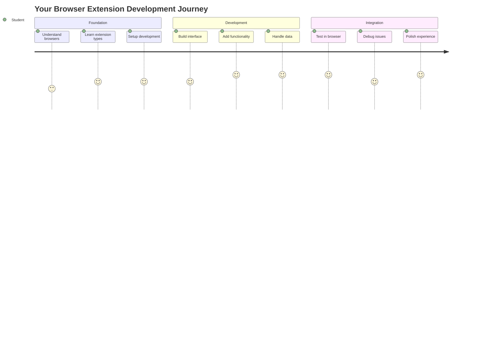
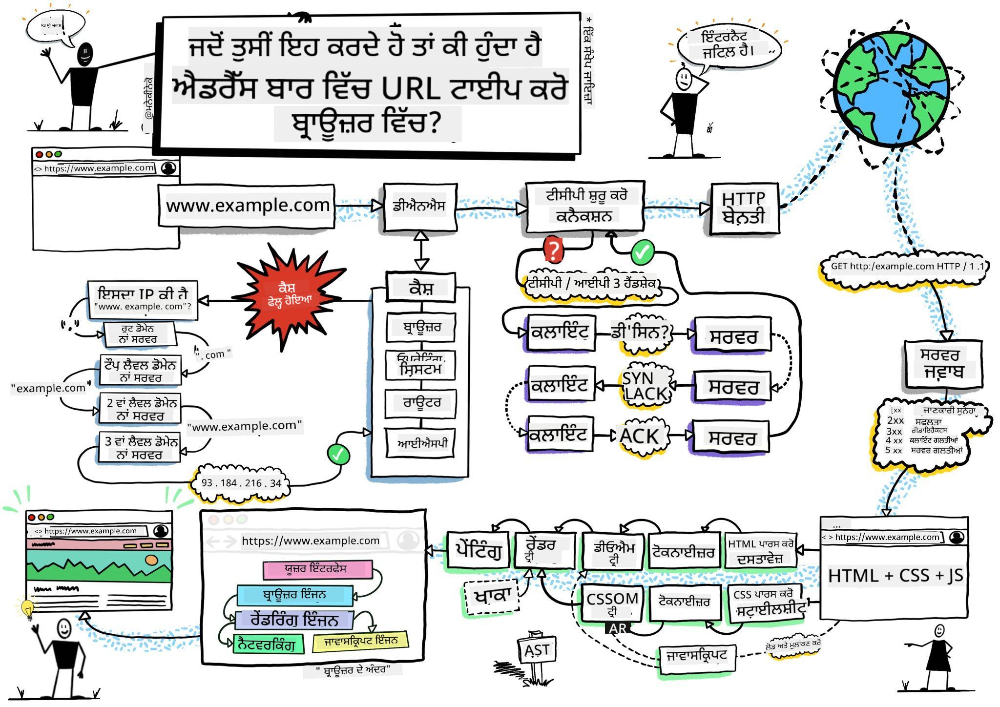
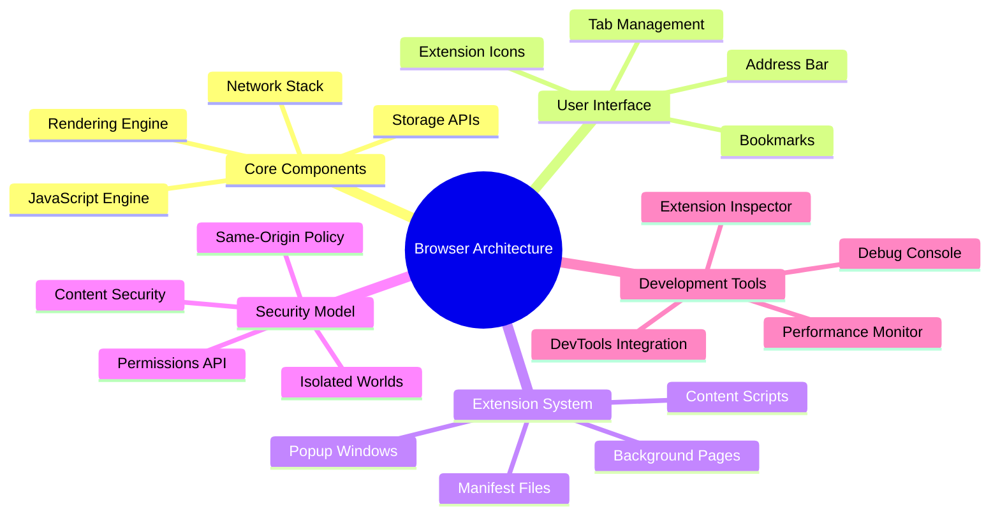
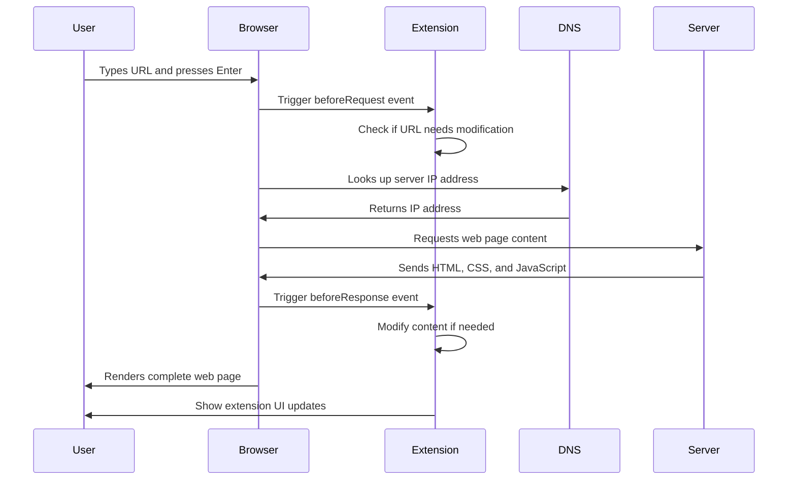
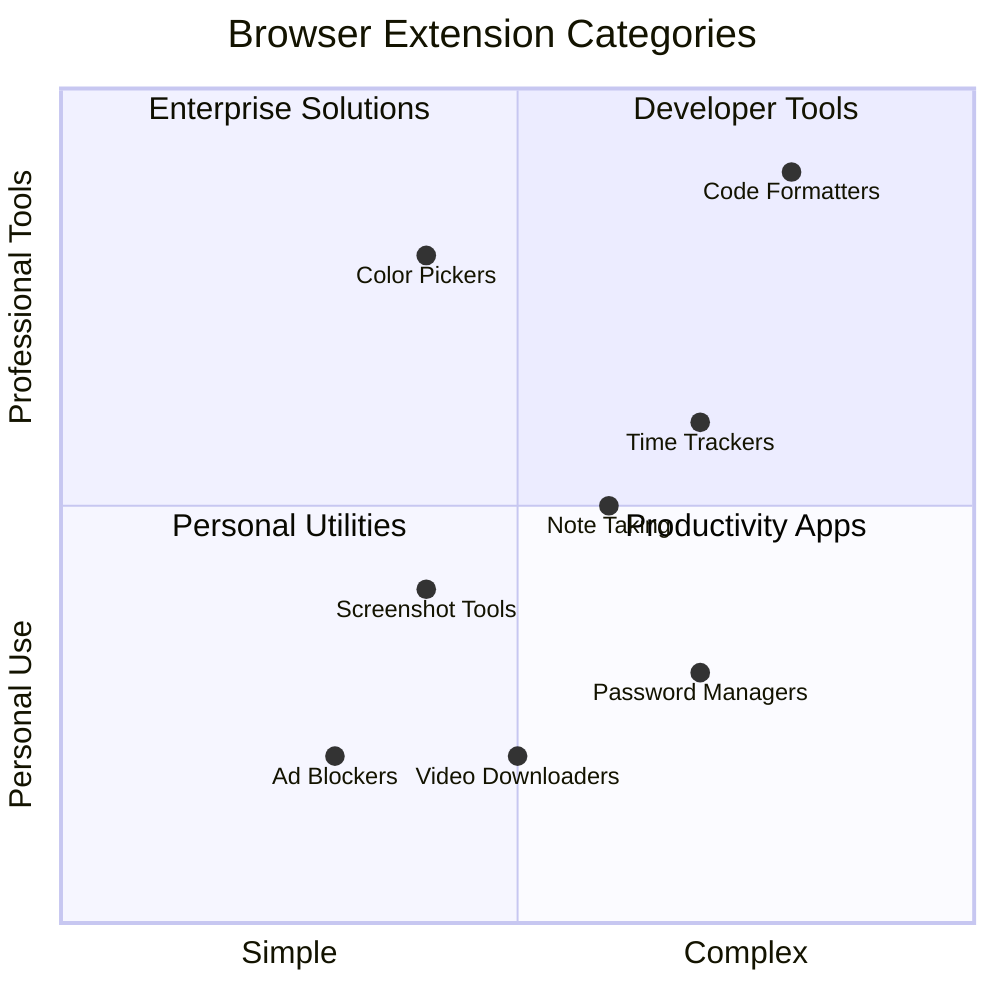
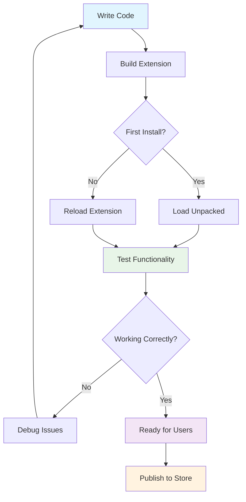
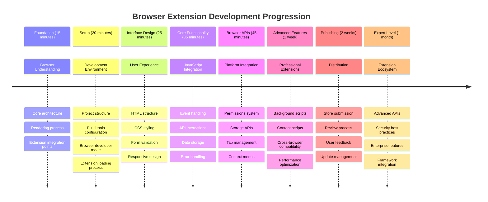

<!--
CO_OP_TRANSLATOR_METADATA:
{
  "original_hash": "00aa85715e1efd4930c17a23e3012e69",
  "translation_date": "2025-11-03T17:03:21+00:00",
  "source_file": "5-browser-extension/1-about-browsers/README.md",
  "language_code": "pa"
}
-->
# ਬ੍ਰਾਊਜ਼ਰ ਐਕਸਟੈਂਸ਼ਨ ਪ੍ਰੋਜੈਕਟ ਭਾਗ 1: ਬ੍ਰਾਊਜ਼ਰ ਬਾਰੇ ਸਭ ਕੁਝ




> ਸਕੈਚਨੋਟ [ਵਾਸਿਮ ਚੇਘਮ](https://dev.to/wassimchegham/ever-wondered-what-happens-when-you-type-in-a-url-in-an-address-bar-in-a-browser-3dob) ਦੁਆਰਾ

## ਲੈਕਚਰ ਤੋਂ ਪਹਿਲਾਂ ਕਵਿਜ਼

[ਲੈਕਚਰ ਤੋਂ ਪਹਿਲਾਂ ਕਵਿਜ਼](https://ff-quizzes.netlify.app/web/quiz/23)

### ਪਰਿਚਯ

ਬ੍ਰਾਊਜ਼ਰ ਐਕਸਟੈਂਸ਼ਨ ਛੋਟੀਆਂ ਐਪਲੀਕੇਸ਼ਨ ਹਨ ਜੋ ਤੁਹਾਡੇ ਵੈੱਬ ਬ੍ਰਾਊਜ਼ਿੰਗ ਅਨੁਭਵ ਨੂੰ ਵਧਾਉਂਦੀਆਂ ਹਨ। ਟਿਮ ਬਰਨਰਜ਼-ਲੀ ਦੇ ਇੰਟਰਐਕਟਿਵ ਵੈੱਬ ਦੇ ਅਸਲ ਦ੍ਰਿਸ਼ਟੀਕੋਣ ਵਾਂਗ, ਐਕਸਟੈਂਸ਼ਨ ਬ੍ਰਾਊਜ਼ਰ ਦੀਆਂ ਸਮਰੱਥਾਵਾਂ ਨੂੰ ਸਧਾਰਨ ਦਸਤਾਵੇਜ਼ ਦੇਖਣ ਤੋਂ ਪਰੇ ਵਧਾਉਂਦੀਆਂ ਹਨ। ਪਾਸਵਰਡ ਮੈਨੇਜਰਾਂ ਤੋਂ ਜੋ ਤੁਹਾਡੇ ਖਾਤਿਆਂ ਨੂੰ ਸੁਰੱਖਿਅਤ ਰੱਖਦੇ ਹਨ, ਰੰਗ ਚੁਣਨ ਵਾਲੇ ਟੂਲਾਂ ਤੱਕ ਜੋ ਡਿਜ਼ਾਈਨਰਾਂ ਨੂੰ ਸਹੀ ਸ਼ੇਡ ਹਾਸਲ ਕਰਨ ਵਿੱਚ ਮਦਦ ਕਰਦੇ ਹਨ, ਐਕਸਟੈਂਸ਼ਨ ਰੋਜ਼ਾਨਾ ਬ੍ਰਾਊਜ਼ਿੰਗ ਚੁਣੌਤੀਆਂ ਦਾ ਹੱਲ ਕਰਦੇ ਹਨ।

ਤੁਹਾਡਾ ਪਹਿਲਾ ਐਕਸਟੈਂਸ਼ਨ ਬਣਾਉਣ ਤੋਂ ਪਹਿਲਾਂ, ਆਓ ਸਮਝੀਏ ਕਿ ਬ੍ਰਾਊਜ਼ਰ ਕਿਵੇਂ ਕੰਮ ਕਰਦੇ ਹਨ। ਜਿਵੇਂ ਅਲੈਕਜ਼ੈਂਡਰ ਗ੍ਰਾਹਮ ਬੈਲ ਨੂੰ ਟੈਲੀਫੋਨ ਦੀ ਖੋਜ ਕਰਨ ਤੋਂ ਪਹਿਲਾਂ ਧੁਨੀ ਸੰਚਾਰ ਨੂੰ ਸਮਝਣ ਦੀ ਲੋੜ ਸੀ, ਬ੍ਰਾਊਜ਼ਰ ਦੇ ਮੂਲ ਤੱਤਾਂ ਨੂੰ ਜਾਣਨਾ ਤੁਹਾਨੂੰ ਐਕਸਟੈਂਸ਼ਨ ਬਣਾਉਣ ਵਿੱਚ ਮਦਦ ਕਰੇਗਾ ਜੋ ਮੌਜੂਦਾ ਬ੍ਰਾਊਜ਼ਰ ਸਿਸਟਮਾਂ ਨਾਲ ਬੇਹਤਰੀਨ ਤਰੀਕੇ ਨਾਲ ਜੁੜਦੇ ਹਨ।

ਇਸ ਪਾਠ ਦੇ ਅੰਤ ਤੱਕ, ਤੁਸੀਂ ਬ੍ਰਾਊਜ਼ਰ ਆਰਕੀਟੈਕਚਰ ਨੂੰ ਸਮਝ ਲਵੋਗੇ ਅਤੇ ਆਪਣਾ ਪਹਿਲਾ ਐਕਸਟੈਂਸ਼ਨ ਬਣਾਉਣਾ ਸ਼ੁਰੂ ਕਰ ਚੁੱਕੇ ਹੋਵੋਗੇ।



## ਵੈੱਬ ਬ੍ਰਾਊਜ਼ਰ ਨੂੰ ਸਮਝਣਾ

ਵੈੱਬ ਬ੍ਰਾਊਜ਼ਰ ਅਸਲ ਵਿੱਚ ਇੱਕ ਉੱਚ-ਤਕਨੀਕੀ ਦਸਤਾਵੇਜ਼ ਅਨੁਵਾਦਕ ਹੈ। ਜਦੋਂ ਤੁਸੀਂ "google.com" ਨੂੰ ਐਡਰੈੱਸ ਬਾਰ ਵਿੱਚ ਟਾਈਪ ਕਰਦੇ ਹੋ, ਬ੍ਰਾਊਜ਼ਰ ਇੱਕ ਜਟਿਲ ਲੜੀਵਾਰ ਕਾਰਵਾਈਆਂ ਕਰਦਾ ਹੈ - ਵਿਸ਼ਵ-ਵਿਆਪੀ ਸਰਵਰਾਂ ਤੋਂ ਸਮੱਗਰੀ ਦੀ ਬੇਨਤੀ ਕਰਦਾ ਹੈ, ਫਿਰ ਉਸ ਕੋਡ ਨੂੰ ਪਾਰਸ ਅਤੇ ਰੈਂਡਰ ਕਰਕੇ ਇੰਟਰਐਕਟਿਵ ਵੈੱਬ ਪੇਜਾਂ ਵਿੱਚ ਬਦਲਦਾ ਹੈ ਜੋ ਤੁਸੀਂ ਵੇਖਦੇ ਹੋ।

ਇਹ ਪ੍ਰਕਿਰਿਆ ਉਸ ਤਰੀਕੇ ਨੂੰ ਦਰਸਾਉਂਦੀ ਹੈ ਜਿਸ ਤਰ੍ਹਾਂ ਪਹਿਲਾ ਵੈੱਬ ਬ੍ਰਾਊਜ਼ਰ, ਵਰਲਡਵਾਈਡਵੈੱਬ, 1990 ਵਿੱਚ ਟਿਮ ਬਰਨਰਜ਼-ਲੀ ਦੁਆਰਾ ਡਿਜ਼ਾਈਨ ਕੀਤਾ ਗਿਆ ਸੀ ਤਾਂ ਜੋ ਹਾਈਪਰਲਿੰਕਡ ਦਸਤਾਵੇਜ਼ਾਂ ਨੂੰ ਹਰ ਕਿਸੇ ਲਈ ਪਹੁੰਚਯੋਗ ਬਣਾਇਆ ਜਾ ਸਕੇ।

✅ **ਥੋੜ੍ਹਾ ਇਤਿਹਾਸ**: ਪਹਿਲਾ ਬ੍ਰਾਊਜ਼ਰ 'ਵਰਲਡਵਾਈਡਵੈੱਬ' ਕਿਹਾ ਜਾਂਦਾ ਸੀ ਅਤੇ ਇਹ 1990 ਵਿੱਚ ਸਰ ਟਿਮੋਥੀ ਬਰਨਰਜ਼-ਲੀ ਦੁਆਰਾ ਬਣਾਇਆ ਗਿਆ ਸੀ।


> ਕੁਝ ਪੁਰਾਣੇ ਬ੍ਰਾਊਜ਼ਰ, [ਕੈਰਨ ਮੈਕਗ੍ਰੇਨ](https://www.slideshare.net/KMcGrane/week-4-ixd-history-personal-computing) ਦੁਆਰਾ

### ਬ੍ਰਾਊਜ਼ਰ ਵੈੱਬ ਸਮੱਗਰੀ ਨੂੰ ਕਿਵੇਂ ਪ੍ਰਕਿਰਿਆ ਕਰਦੇ ਹਨ

URL ਟਾਈਪ ਕਰਨ ਅਤੇ ਵੈੱਬਪੇਜ ਦੇਖਣ ਦੇ ਵਿਚਕਾਰ ਦੀ ਪ੍ਰਕਿਰਿਆ ਵਿੱਚ ਕਈ ਸਹਿ-ਸੰਚਾਲਿਤ ਕਦਮ ਸ਼ਾਮਲ ਹੁੰਦੇ ਹਨ ਜੋ ਸੈਕਿੰਡਾਂ ਵਿੱਚ ਹੋ ਜਾਂਦੇ ਹਨ:



**ਇਹ ਪ੍ਰਕਿਰਿਆ ਕੀ ਹਾਸਲ ਕਰਦੀ ਹੈ:**
- **ਅਨੁਵਾਦ**: DNS ਲੁੱਕਅੱਪ ਰਾਹੀਂ ਮਨੁੱਖ-ਪੜ੍ਹਨਯੋਗ URL ਨੂੰ ਸਰਵਰ IP ਪਤਾ ਵਿੱਚ ਬਦਲਦਾ ਹੈ
- **ਸਥਾਪਨਾ**: HTTP ਜਾਂ HTTPS ਪ੍ਰੋਟੋਕੋਲ ਦੀ ਵਰਤੋਂ ਕਰਕੇ ਵੈੱਬ ਸਰਵਰ ਨਾਲ ਸੁਰੱਖਿਅਤ ਕਨੈਕਸ਼ਨ ਸਥਾਪਿਤ ਕਰਦਾ ਹੈ
- **ਬੇਨਤੀ**: ਸਰਵਰ ਤੋਂ ਵਿਸ਼ੇਸ਼ ਵੈੱਬ ਪੇਜ ਸਮੱਗਰੀ ਦੀ ਬੇਨਤੀ ਕਰਦਾ ਹੈ
- **ਪ੍ਰਾਪਤੀ**: ਸਰਵਰ ਤੋਂ HTML ਮਾਰਕਅੱਪ, CSS ਸਟਾਈਲਿੰਗ, ਅਤੇ ਜਾਵਾਸਕ੍ਰਿਪਟ ਕੋਡ ਪ੍ਰਾਪਤ ਕਰਦਾ ਹੈ
- **ਰੈਂਡਰ**: ਸਾਰੀ ਸਮੱਗਰੀ ਨੂੰ ਇੰਟਰਐਕਟਿਵ ਵੈੱਬਪੇਜ ਵਿੱਚ ਬਦਲਦਾ ਹੈ ਜੋ ਤੁਸੀਂ ਵੇਖਦੇ ਹੋ

### ਬ੍ਰਾਊਜ਼ਰ ਦੇ ਮੁੱਖ ਫੀਚਰ

ਆਧੁਨਿਕ ਬ੍ਰਾਊਜ਼ਰ ਕਈ ਫੀਚਰ ਪ੍ਰਦਾਨ ਕਰਦੇ ਹਨ ਜੋ ਐਕਸਟੈਂਸ਼ਨ ਡਿਵੈਲਪਰ ਵਰਤ ਸਕਦੇ ਹਨ:

| ਫੀਚਰ | ਉਦੇਸ਼ | ਐਕਸਟੈਂਸ਼ਨ ਦੇ ਮੌਕੇ |
|---------|---------|------------------------|
| **ਰੈਂਡਰਿੰਗ ਇੰਜਨ** | HTML, CSS, ਅਤੇ ਜਾਵਾਸਕ੍ਰਿਪਟ ਨੂੰ ਡਿਸਪਲੇ ਕਰਦਾ ਹੈ | ਸਮੱਗਰੀ ਵਿੱਚ ਤਬਦੀਲੀ, ਸਟਾਈਲਿੰਗ ਇੰਜੈਕਸ਼ਨ |
| **ਜਾਵਾਸਕ੍ਰਿਪਟ ਇੰਜਨ** | ਜਾਵਾਸਕ੍ਰਿਪਟ ਕੋਡ ਨੂੰ ਚਲਾਉਂਦਾ ਹੈ | ਕਸਟਮ ਸਕ੍ਰਿਪਟ, API ਇੰਟਰਐਕਸ਼ਨ |
| **ਲੋਕਲ ਸਟੋਰੇਜ** | ਡਾਟਾ ਨੂੰ ਸਥਾਨਕ ਤੌਰ 'ਤੇ ਸੇਵ ਕਰਦਾ ਹੈ | ਯੂਜ਼ਰ ਪਸੰਦਾਂ, ਕੈਸ਼ਡ ਡਾਟਾ |
| **ਨੈਟਵਰਕ ਸਟੈਕ** | ਵੈੱਬ ਬੇਨਤੀਆਂ ਨੂੰ ਸੰਭਾਲਦਾ ਹੈ | ਬੇਨਤੀ ਮਾਨੀਟਰਿੰਗ, ਡਾਟਾ ਵਿਸ਼ਲੇਸ਼ਣ |
| **ਸੁਰੱਖਿਆ ਮਾਡਲ** | ਯੂਜ਼ਰਾਂ ਨੂੰ ਖ਼ਰਾਬ ਸਮੱਗਰੀ ਤੋਂ ਬਚਾਉਂਦਾ ਹੈ | ਸਮੱਗਰੀ ਫਿਲਟਰੀਂਗ, ਸੁਰੱਖਿਆ ਵਧਾਉਣ |

**ਇਹ ਫੀਚਰਾਂ ਨੂੰ ਸਮਝਣ ਨਾਲ ਤੁਹਾਨੂੰ ਮਦਦ ਮਿਲਦੀ ਹੈ:**
- **ਪਛਾਣ**: ਜਿੱਥੇ ਤੁਹਾਡਾ ਐਕਸਟੈਂਸ਼ਨ ਸਭ ਤੋਂ ਵੱਧ ਮੁੱਲ ਜੋੜ ਸਕਦਾ ਹੈ
- **ਚੋਣ**: ਤੁਹਾਡੇ ਐਕਸਟੈਂਸ਼ਨ ਦੀ ਕਾਰਗੁਜ਼ਾਰੀ ਲਈ ਸਹੀ ਬ੍ਰਾਊਜ਼ਰ APIs
- **ਡਿਜ਼ਾਈਨ**: ਐਕਸਟੈਂਸ਼ਨ ਜੋ ਬ੍ਰਾਊਜ਼ਰ ਸਿਸਟਮਾਂ ਨਾਲ ਕੁਸ਼ਲਤਾ ਨਾਲ ਕੰਮ ਕਰਦੇ ਹਨ
- **ਸੁਨਿਸ਼ਚਿਤ**: ਤੁਹਾਡਾ ਐਕਸਟੈਂਸ਼ਨ ਬ੍ਰਾਊਜ਼ਰ ਸੁਰੱਖਿਆ ਦੇ ਸ੍ਰੇਸ਼ਠ ਅਭਿਆਸਾਂ ਦੀ ਪਾਲਣਾ ਕਰਦਾ ਹੈ

### ਕ੍ਰਾਸ-ਬ੍ਰਾਊਜ਼ਰ ਡਿਵੈਲਪਮੈਂਟ ਵਿਚਾਰ

ਵੱਖ-ਵੱਖ ਬ੍ਰਾਊਜ਼ਰ ਮਿਆਰਾਂ ਨੂੰ ਥੋੜ੍ਹੇ ਫਰਕਾਂ ਨਾਲ ਲਾਗੂ ਕਰਦੇ ਹਨ, ਜਿਵੇਂ ਕਿ ਵੱਖ-ਵੱਖ ਪ੍ਰੋਗਰਾਮਿੰਗ ਭਾਸ਼ਾਵਾਂ ਇੱਕੋ ਐਲਗੋਰਿਥਮ ਨੂੰ ਵੱਖ-ਵੱਖ ਤਰੀਕੇ ਨਾਲ ਸੰਭਾਲ ਸਕਦੀਆਂ ਹਨ। Chrome, Firefox, ਅਤੇ Safari ਵਿੱਚ ਹਰ ਇੱਕ ਦੇ ਵਿਲੱਖਣ ਲੱਛਣ ਹਨ ਜੋ ਡਿਵੈਲਪਰਾਂ ਨੂੰ ਐਕਸਟੈਂਸ਼ਨ ਡਿਵੈਲਪਮੈਂਟ ਦੌਰਾਨ ਧਿਆਨ ਵਿੱਚ ਰੱਖਣੇ ਪੈਂਦੇ ਹਨ।

> 💡 **ਪ੍ਰੋ ਟਿਪ**: [caniuse.com](https://www.caniuse.com) ਦੀ ਵਰਤੋਂ ਕਰੋ ਇਹ ਜਾਂਚਣ ਲਈ ਕਿ ਕਿਹੜੀਆਂ ਵੈੱਬ ਤਕਨਾਲੋਜੀਆਂ ਵੱਖ-ਵੱਖ ਬ੍ਰਾਊਜ਼ਰਾਂ ਵਿੱਚ ਸਹਾਇਕ ਹਨ। ਇਹ ਤੁਹਾਡੇ ਐਕਸਟੈਂਸ਼ਨ ਦੇ ਫੀਚਰਾਂ ਦੀ ਯੋਜਨਾ ਬਣਾਉਣ ਦੌਰਾਨ ਬਹੁਤ ਹੀ ਕੀਮਤੀ ਹੈ!

**ਐਕਸਟੈਂਸ਼ਨ ਡਿਵੈਲਪਮੈਂਟ ਲਈ ਮੁੱਖ ਵਿਚਾਰ:**
- **ਟੈਸਟ**: ਆਪਣੇ ਐਕਸਟੈਂਸ਼ਨ ਨੂੰ Chrome, Firefox, ਅਤੇ Edge ਬ੍ਰਾਊਜ਼ਰਾਂ ਵਿੱਚ ਟੈਸਟ ਕਰੋ
- **ਅਨੁਕੂਲਿਤ**: ਵੱਖ-ਵੱਖ ਬ੍ਰਾਊਜ਼ਰ ਐਕਸਟੈਂਸ਼ਨ APIs ਅਤੇ ਮੈਨਿਫੈਸਟ ਫਾਰਮੈਟਾਂ ਲਈ
- **ਸੰਭਾਲ**: ਵੱਖ-ਵੱਖ ਪ੍ਰਦਰਸ਼ਨ ਲੱਛਣ ਅਤੇ ਸੀਮਾਵਾਂ
- **ਪ੍ਰਦਾਨ**: ਬ੍ਰਾਊਜ਼ਰ-ਵਿਸ਼ੇਸ਼ ਫੀਚਰਾਂ ਲਈ ਫਾਲਬੈਕ ਜੋ ਸ਼ਾਇਦ ਉਪਲਬਧ ਨਾ ਹੋਣ

✅ **ਐਨਾਲਿਟਿਕਸ ਅੰਤਰਦ੍ਰਿਸ਼ਟੀ**: ਤੁਸੀਂ ਆਪਣੇ ਵੈੱਬ ਡਿਵੈਲਪਮੈਂਟ ਪ੍ਰੋਜੈਕਟਾਂ ਵਿੱਚ ਐਨਾਲਿਟਿਕਸ ਪੈਕੇਜਾਂ ਨੂੰ ਇੰਸਟਾਲ ਕਰਕੇ ਇਹ ਪਤਾ ਕਰ ਸਕਦੇ ਹੋ ਕਿ ਤੁਹਾਡੇ ਯੂਜ਼ਰ ਕਿਹੜੇ ਬ੍ਰਾਊਜ਼ਰ ਨੂੰ ਤਰਜੀਹ ਦਿੰਦੇ ਹਨ। ਇਹ ਡਾਟਾ ਤੁਹਾਨੂੰ ਪਹਿਲਾਂ ਕਿਹੜੇ ਬ੍ਰਾਊਜ਼ਰਾਂ ਨੂੰ ਸਹਾਇਕ ਬਣਾਉਣ ਲਈ ਪ੍ਰਾਥਮਿਕਤਾ ਦੇਣ ਵਿੱਚ ਮਦਦ ਕਰਦਾ ਹੈ।

## ਬ੍ਰਾਊਜ਼ਰ ਐਕਸਟੈਂਸ਼ਨ ਨੂੰ ਸਮਝਣਾ

ਬ੍ਰਾਊਜ਼ਰ ਐਕਸਟੈਂਸ਼ਨ ਆਮ ਵੈੱਬ ਬ੍ਰਾਊਜ਼ਿੰਗ ਚੁਣੌਤੀਆਂ ਦਾ ਹੱਲ ਕਰਦੇ ਹਨ ਅਤੇ ਬ੍ਰਾਊਜ਼ਰ ਇੰਟਰਫੇਸ ਵਿੱਚ ਸਿੱਧੇ ਫੀਚਰਾਂ ਸ਼ਾਮਲ ਕਰਦੇ ਹਨ। ਵੱਖਰੀ ਐਪਲੀਕੇਸ਼ਨ ਜਾਂ ਜਟਿਲ ਵਰਕਫਲੋ ਦੀ ਲੋੜ ਦੇ ਬਗੈਰ, ਐਕਸਟੈਂਸ਼ਨ ਸੰਦਾਂ ਅਤੇ ਫੀਚਰਾਂ ਤੱਕ ਤੁਰੰਤ ਪਹੁੰਚ ਪ੍ਰਦਾਨ ਕਰਦੇ ਹਨ।

ਇਹ ਧਾਰਨਾ ਉਸ ਤਰੀਕੇ ਨੂੰ ਦਰਸਾਉਂਦੀ ਹੈ ਜਿਸ ਤਰ੍ਹਾਂ ਸ਼ੁਰੂਆਤੀ ਕੰਪਿਊਟਰ ਪਾਇਨੀਅਰ ਜਿਵੇਂ ਕਿ ਡਗਲਸ ਐਂਗਲਬਾਰਟ ਨੇ ਤਕਨਾਲੋਜੀ ਨਾਲ ਮਨੁੱਖੀ ਸਮਰੱਥਾਵਾਂ ਨੂੰ ਵਧਾਉਣ ਦੀ ਕਲਪਨਾ ਕੀਤੀ - ਐਕਸਟੈਂਸ਼ਨ ਤੁਹਾਡੇ ਬ੍ਰਾਊਜ਼ਰ ਦੀ ਮੂਲ ਕਾਰਗੁਜ਼ਾਰੀ ਨੂੰ ਵਧਾਉਂਦੇ ਹਨ।



**ਲੋਕਪ੍ਰਿਯ ਐਕਸਟੈਂਸ਼ਨ ਸ਼੍ਰੇਣੀਆਂ ਅਤੇ ਉਨ੍ਹਾਂ ਦੇ ਫਾਇਦੇ:**
- **ਉਤਪਾਦਕਤਾ ਸੰਦ**: ਟਾਸਕ ਮੈਨੇਜਰ, ਨੋਟ-ਲੈਣ ਵਾਲੇ ਐਪਸ, ਅਤੇ ਸਮਾਂ ਟ੍ਰੈਕਰ ਜੋ ਤੁਹਾਨੂੰ ਸੰਗਠਿਤ ਰਹਿਣ ਵਿੱਚ ਮਦਦ ਕਰਦੇ ਹਨ
- **ਸੁਰੱਖਿਆ ਵਧਾਉਣ**: ਪਾਸਵਰਡ ਮੈਨੇਜਰ, ਐਡ ਬਲਾਕਰ, ਅਤੇ ਪ੍ਰਾਈਵੇਸੀ ਟੂਲ ਜੋ ਤੁਹਾਡੇ ਡਾਟਾ ਦੀ ਰੱਖਿਆ ਕਰਦੇ ਹਨ
- **ਡਿਵੈਲਪਰ ਸੰਦ**: ਕੋਡ ਫਾਰਮੈਟਰ, ਰੰਗ ਚੁਣਨ ਵਾਲੇ ਟੂਲ, ਅਤੇ ਡੀਬੱਗਿੰਗ ਯੂਟਿਲਿਟੀਜ਼ ਜੋ ਡਿਵੈਲਪਮੈਂਟ ਨੂੰ ਸਧਾਰਨ ਬਣਾਉਂਦੀਆਂ ਹਨ
- **ਸਮੱਗਰੀ ਵਧਾਉਣ**: ਪੜ੍ਹਨ ਦੇ ਮੋਡ, ਵੀਡੀਓ ਡਾਊਨਲੋਡਰ, ਅਤੇ ਸਕ੍ਰੀਨਸ਼ਾਟ ਟੂਲ ਜੋ ਤੁਹਾਡੇ ਵੈੱਬ ਅਨੁਭਵ ਨੂੰ ਬਿਹਤਰ ਬਣਾਉਂਦੇ ਹਨ

✅ **ਚਿੰਤਨ ਦਾ ਸਵਾਲ**: ਤੁਹਾਡੇ ਮਨਪਸੰਦ ਬ੍ਰਾਊਜ਼ਰ ਐਕਸਟੈਂਸ਼ਨ ਕਿਹੜੇ ਹਨ? ਉਹ ਵਿਸ਼ੇਸ਼ ਕੰਮ ਕੀ ਕਰਦੇ ਹਨ, ਅਤੇ ਉਹ ਤੁਹਾਡੇ ਬ੍ਰਾਊਜ਼ਿੰਗ ਅਨੁਭਵ ਨੂੰ ਕਿਵੇਂ ਸੁਧਾਰਦੇ ਹਨ?

### 🔄 **ਪੈਡਾਗੌਜੀਕਲ ਚੈੱਕ-ਇਨ**
**ਬ੍ਰਾਊਜ਼ਰ ਆਰਕੀਟੈਕਚਰ ਦੀ ਸਮਝ**: ਐਕਸਟੈਂਸ਼ਨ ਡਿਵੈਲਪਮੈਂਟ ਵੱਲ ਵਧਣ ਤੋਂ ਪਹਿਲਾਂ, ਇਹ ਯਕੀਨੀ ਬਣਾਓ ਕਿ ਤੁਸੀਂ:
- ✅ ਸਮਝ ਸਕਦੇ ਹੋ ਕਿ ਬ੍ਰਾਊਜ਼ਰ ਵੈੱਬ ਬੇਨਤੀਆਂ ਨੂੰ ਕਿਵੇਂ ਪ੍ਰਕਿਰਿਆ ਕਰਦੇ ਹਨ ਅਤੇ ਸਮੱਗਰੀ ਨੂੰ ਕਿਵੇਂ ਰੈਂਡਰ ਕਰਦੇ ਹਨ
- ✅ ਬ੍ਰਾਊਜ਼ਰ ਆਰਕੀਟੈਕਚਰ ਦੇ ਮੁੱਖ ਹਿੱਸਿਆਂ ਦੀ ਪਛਾਣ ਕਰ ਸਕਦੇ ਹੋ
- ✅ ਸਮਝ ਸਕਦੇ ਹੋ ਕਿ ਐਕਸਟੈਂਸ਼ਨ ਬ੍ਰਾਊਜ਼ਰ ਦੀ ਕਾਰਗੁਜ਼ਾਰੀ ਨਾਲ ਕਿਵੇਂ ਜੁੜਦੇ ਹਨ
- ✅ ਉਸ ਸੁਰੱਖਿਆ ਮਾਡਲ ਨੂੰ ਪਛਾਣ ਸਕਦੇ ਹੋ ਜੋ ਯੂਜ਼ਰਾਂ ਦੀ ਰੱਖਿਆ ਕਰਦਾ ਹੈ

**ਤੁਰੰਤ ਸਵੈ-ਟੈਸਟ**: ਕੀ ਤੁਸੀਂ URL ਟਾਈਪ ਕਰਨ ਤੋਂ ਵੈੱਬਪੇਜ ਦੇਖਣ ਤੱਕ ਦਾ ਰਸਤਾ ਸਮਝ ਸਕਦੇ ਹੋ?
1. **DNS ਲੁੱਕਅੱਪ** URL ਨੂੰ IP ਪਤੇ ਵਿੱਚ ਬਦਲਦਾ ਹੈ
2. **HTTP ਬੇਨਤੀ** ਸਰਵਰ ਤੋਂ ਸਮੱਗਰੀ ਲੈਂਦੀ ਹੈ
3. **ਪਾਰਸਿੰਗ** HTML, CSS, ਅਤੇ ਜਾਵਾਸਕ੍ਰਿਪਟ ਨੂੰ ਪ੍ਰਕਿਰਿਆ ਕਰਦੀ ਹੈ
4. **ਰੈਂਡਰਿੰਗ** ਅੰਤਮ ਵੈੱਬਪੇਜ ਨੂੰ ਡਿਸਪਲੇ ਕਰਦੀ ਹੈ
5. **ਐਕਸਟੈਂਸ਼ਨ** ਕਈ ਕਦਮਾਂ 'ਤੇ ਸਮੱਗਰੀ ਨੂੰ ਤਬਦੀਲ ਕਰ ਸਕਦੇ ਹਨ

## ਐਕਸਟੈਂਸ਼ਨ ਨੂੰ ਇੰਸਟਾਲ ਅਤੇ ਮੈਨੇਜ ਕਰਨਾ

ਐਕਸਟੈਂਸ਼ਨ ਇੰਸਟਾਲੇਸ਼ਨ ਪ੍ਰਕਿਰਿਆ ਨੂੰ ਸਮਝਣਾ ਤੁਹਾਨੂੰ ਇਹ ਅਨੁਮਾਨ ਲਗਾਉਣ ਵਿੱਚ ਮਦਦ ਕਰਦਾ ਹੈ ਕਿ ਲੋਕ ਤੁਹਾਡਾ ਐਕਸਟੈਂਸ਼ਨ ਇੰਸਟਾਲ ਕਰਦੇ ਸਮੇਂ ਕਿਹੜਾ ਅਨੁਭਵ ਕਰਦੇ ਹਨ। ਆਧੁਨਿਕ ਬ੍ਰਾਊਜ਼ਰਾਂ ਵਿੱਚ ਇੰਸਟਾਲੇਸ਼ਨ ਪ੍ਰਕਿਰਿਆ ਮਿਆਰੀ ਹੈ, ਇੰਟਰਫੇਸ ਡਿਜ਼ਾਈਨ ਵਿੱਚ ਥੋੜ੍ਹੇ ਫਰਕਾਂ ਨਾਲ।


> **ਮਹੱਤਵਪੂਰਨ**: ਜਦੋਂ ਤੁਸੀਂ ਆਪਣੇ ਐਕਸਟੈਂਸ਼ਨ ਦੀ ਜਾਂਚ ਕਰ ਰਹੇ ਹੋ ਤਾਂ ਡਿਵੈਲਪਰ ਮੋਡ ਨੂੰ ਚਾਲੂ ਕਰਨਾ ਅਤੇ ਹੋਰ ਸਟੋਰਾਂ ਤੋਂ ਐਕਸਟੈਂਸ਼ਨ ਦੀ ਆਗਿਆ ਦੇਣਾ ਯਕੀਨੀ ਬਣਾਓ।

### ਡਿਵੈਲਪਮੈਂਟ ਐਕਸਟੈਂਸ਼ਨ ਇੰਸਟਾਲੇਸ਼ਨ ਪ੍ਰਕਿਰਿਆ

ਜਦੋਂ ਤੁਸੀਂ ਆਪਣੇ ਐਕਸਟੈਂਸ਼ਨ ਨੂੰ ਡਿਵੈਲਪ ਅਤੇ ਜਾਂਚ ਰਹੇ ਹੋ, ਇਸ ਵਰਕਫਲੋ ਦੀ ਪਾਲਣਾ ਕਰੋ:



```bash
# Step 1: Build your extension
npm run build
```

**ਇਹ ਕਮਾਂਡ ਕੀ ਹਾਸਲ ਕਰਦੀ ਹੈ:**
- **ਤਿਆਰ ਕਰਦੀ ਹੈ** ਤੁਹਾਡਾ ਸਰੋਤ ਕੋਡ ਬ੍ਰਾਊਜ਼ਰ-ਤਿਆਰ ਫਾਈਲਾਂ ਵਿੱਚ
- **ਬੰਡਲ ਕਰਦੀ ਹੈ** ਜਾਵਾਸਕ੍ਰਿਪਟ ਮੋਡੀਊਲਾਂ ਨੂੰ ਅਨੁਕੂਲ ਪੈਕੇਜਾਂ ਵਿੱਚ
- **ਜਨਰੇਟ ਕਰਦੀ ਹੈ** ਅੰਤਮ ਐਕਸਟੈਂਸ਼ਨ ਫਾਈਲਾਂ `/dist` ਫੋਲਡਰ ਵਿੱਚ
- **ਤਿਆਰ ਕਰਦੀ ਹੈ** ਤੁਹਾਡਾ ਐਕਸਟੈਂਸ਼ਨ ਇੰਸਟਾਲੇਸ਼ਨ ਅਤੇ ਜਾਂਚ ਲਈ

**ਕਦਮ 2: ਬ੍ਰਾਊਜ਼ਰ ਐਕਸਟੈਂਸ਼ਨ ਪੇਜ 'ਤੇ ਜਾਓ**
1. **ਖੋਲ੍ਹੋ** ਆਪਣੇ ਬ੍ਰਾਊਜ਼ਰ ਦਾ ਐਕਸਟੈਂਸ਼ਨ ਮੈਨੇਜਮੈਂਟ ਪੇਜ
2. **ਕਲਿਕ ਕਰੋ** "ਸੈਟਿੰਗਸ ਅਤੇ ਹੋਰ" ਬਟਨ (ਉਪਰਲੇ ਸੱਜੇ ਕੋਨੇ ਵਿੱਚ `...` ਆਈਕਨ) 
3. **ਚੁਣੋ** ਡ੍ਰਾਪਡਾਊਨ ਮੈਨੂ ਤੋਂ "ਐਕਸਟੈਂਸ਼ਨ"

**ਕਦਮ 3: ਆਪਣਾ ਐਕਸਟੈਂਸ਼ਨ
1. **ਚਲਾਓ** ਬਿਲਡ ਕਮਾਂਡ ਆਪਣੇ ਕੋਡ ਨੂੰ ਕੰਪਾਇਲ ਕਰਨ ਲਈ  
2. **ਲੋਡ ਕਰੋ** ਐਕਸਟੈਂਸ਼ਨ ਨੂੰ ਆਪਣੇ ਬ੍ਰਾਊਜ਼ਰ ਵਿੱਚ ਡਿਵੈਲਪਰ ਮੋਡ ਦੀ ਵਰਤੋਂ ਕਰਕੇ  
3. **ਪੁਸ਼ਟੀ ਕਰੋ** ਕਿ ਫਾਰਮ ਸਹੀ ਤਰੀਕੇ ਨਾਲ ਦਿਖਾਈ ਦੇ ਰਿਹਾ ਹੈ ਅਤੇ ਪੇਸ਼ੇਵਰ ਲੱਗਦਾ ਹੈ  
4. **ਜਾਂਚ ਕਰੋ** ਕਿ ਸਾਰੇ ਫਾਰਮ ਐਲਿਮੈਂਟ ਸਹੀ ਤਰੀਕੇ ਨਾਲ ਅਲਾਈਨ ਅਤੇ ਫੰਕਸ਼ਨਲ ਹਨ  

**ਤੁਹਾਡੇ ਦੁਆਰਾ ਹਾਸਲ ਕੀਤੇ ਗਏ ਨਤੀਜੇ:**  
- **ਬਣਾਇਆ** ਆਪਣੇ ਐਕਸਟੈਂਸ਼ਨ ਲਈ ਮੁੱਢਲੀ HTML ਬਣਤਰ  
- **ਤਿਆਰ ਕੀਤਾ** ਕਨਫਿਗਰੇਸ਼ਨ ਅਤੇ ਨਤੀਜਿਆਂ ਦੇ ਇੰਟਰਫੇਸ ਸਹੀ ਸੈਮੈਂਟਿਕ ਮਾਰਕਅੱਪ ਨਾਲ  
- **ਸੈਟ ਕੀਤਾ** ਇੱਕ ਆਧੁਨਿਕ ਡਿਵੈਲਪਮੈਂਟ ਵਰਕਫਲੋ ਉਦਯੋਗ-ਮਿਆਰੀ ਟੂਲ ਦੀ ਵਰਤੋਂ ਕਰਕੇ  
- **ਤਿਆਰ ਕੀਤਾ** ਇੰਟਰਐਕਟਿਵ ਜਾਵਾਸਕ੍ਰਿਪਟ ਫੰਕਸ਼ਨਾਲਿਟੀ ਸ਼ਾਮਲ ਕਰਨ ਲਈ ਮਜ਼ਬੂਤ ਬੁਨਿਆਦ  

### 🔄 **ਪੈਡਾਗੌਜੀਕਲ ਚੈੱਕ-ਇਨ**  
**ਐਕਸਟੈਂਸ਼ਨ ਡਿਵੈਲਪਮੈਂਟ ਪ੍ਰਗਤੀ**: ਅੱਗੇ ਵਧਣ ਤੋਂ ਪਹਿਲਾਂ ਆਪਣੀ ਸਮਝ ਦੀ ਪੁਸ਼ਟੀ ਕਰੋ:  
- ✅ ਕੀ ਤੁਸੀਂ ਪ੍ਰੋਜੈਕਟ ਬਣਤਰ ਵਿੱਚ ਹਰ ਫਾਈਲ ਦੇ ਉਦੇਸ਼ ਨੂੰ ਸਮਝ ਸਕਦੇ ਹੋ?  
- ✅ ਕੀ ਤੁਸੀਂ ਸਮਝਦੇ ਹੋ ਕਿ ਬਿਲਡ ਪ੍ਰਕਿਰਿਆ ਤੁਹਾਡੇ ਸਰੋਤ ਕੋਡ ਨੂੰ ਕਿਵੇਂ ਬਦਲਦੀ ਹੈ?  
- ✅ ਕਿਉਂ ਅਸੀਂ ਕਨਫਿਗਰੇਸ਼ਨ ਅਤੇ ਨਤੀਜਿਆਂ ਨੂੰ ਵੱਖ-ਵੱਖ UI ਸੈਕਸ਼ਨਾਂ ਵਿੱਚ ਵੰਡਦੇ ਹਾਂ?  
- ✅ ਫਾਰਮ ਬਣਤਰ usability ਅਤੇ accessibility ਨੂੰ ਕਿਵੇਂ ਸਹਾਰਾ ਦਿੰਦੀ ਹੈ?  

**ਡਿਵੈਲਪਮੈਂਟ ਵਰਕਫਲੋ ਸਮਝ**: ਹੁਣ ਤੁਹਾਨੂੰ ਇਹ ਕਰਨ ਦੇ ਯੋਗ ਹੋਣਾ ਚਾਹੀਦਾ ਹੈ:  
1. **ਸੋਧ ਕਰੋ** ਆਪਣੇ ਐਕਸਟੈਂਸ਼ਨ ਇੰਟਰਫੇਸ ਲਈ HTML ਅਤੇ CSS  
2. **ਚਲਾਓ** ਬਿਲਡ ਕਮਾਂਡ ਆਪਣੇ ਬਦਲਾਅ ਨੂੰ ਕੰਪਾਇਲ ਕਰਨ ਲਈ  
3. **ਰੀਲੋਡ ਕਰੋ** ਐਕਸਟੈਂਸ਼ਨ ਨੂੰ ਆਪਣੇ ਬ੍ਰਾਊਜ਼ਰ ਵਿੱਚ ਅਪਡੇਟ ਦੀ ਜਾਂਚ ਕਰਨ ਲਈ  
4. **ਡਿਬੱਗ ਕਰੋ** ਸਮੱਸਿਆਵਾਂ ਨੂੰ ਬ੍ਰਾਊਜ਼ਰ ਡਿਵੈਲਪਰ ਟੂਲ ਦੀ ਵਰਤੋਂ ਕਰਕੇ  

ਤੁਸੀਂ ਬ੍ਰਾਊਜ਼ਰ ਐਕਸਟੈਂਸ਼ਨ ਡਿਵੈਲਪਮੈਂਟ ਦਾ ਪਹਿਲਾ ਪੜਾਅ ਪੂਰਾ ਕਰ ਲਿਆ ਹੈ। ਜਿਵੇਂ ਕਿ ਰਾਈਟ ਬ੍ਰਦਰਾਂ ਨੇ ਉਡਾਣ ਹਾਸਲ ਕਰਨ ਤੋਂ ਪਹਿਲਾਂ ਏਅਰੋਡਾਇਨਾਮਿਕਸ ਨੂੰ ਸਮਝਣ ਦੀ ਲੋੜ ਸੀ, ਇਹ ਬੁਨਿਆਦੀ ਧਾਰਨਾਵਾਂ ਨੂੰ ਸਮਝਣਾ ਤੁਹਾਨੂੰ ਅਗਲੇ ਪਾਠ ਵਿੱਚ ਹੋਰ ਜਟਿਲ ਇੰਟਰਐਕਟਿਵ ਫੀਚਰ ਬਣਾਉਣ ਲਈ ਤਿਆਰ ਕਰਦਾ ਹੈ।  

## GitHub Copilot Agent Challenge 🚀  

Agent ਮੋਡ ਦੀ ਵਰਤੋਂ ਕਰਕੇ ਹੇਠਾਂ ਦਿੱਤੇ ਚੈਲੈਂਜ ਨੂੰ ਪੂਰਾ ਕਰੋ:  

**ਵੇਰਵਾ:** API keys ਅਤੇ region codes ਦਰਜ ਕਰਨ ਸਮੇਂ ਯੂਜ਼ਰ ਅਨੁਭਵ ਨੂੰ ਸੁਧਾਰਨ ਲਈ ਫਾਰਮ ਵੈਲੀਡੇਸ਼ਨ ਅਤੇ ਫੀਡਬੈਕ ਫੀਚਰ ਸ਼ਾਮਲ ਕਰੋ।  

**ਪ੍ਰੋਮਪਟ:** ਜਾਵਾਸਕ੍ਰਿਪਟ ਵੈਲੀਡੇਸ਼ਨ ਫੰਕਸ਼ਨ ਬਣਾਓ ਜੋ ਜਾਂਚ ਕਰਦੇ ਹਨ ਕਿ API key ਫੀਲਡ ਵਿੱਚ ਘੱਟੋ-ਘੱਟ 20 ਅੱਖਰ ਹਨ ਅਤੇ region code ਸਹੀ ਫਾਰਮੈਟ (ਜਿਵੇਂ 'US-NEISO') ਦਾ ਪਾਲਣ ਕਰਦਾ ਹੈ। ਦ੍ਰਿਸ਼ਮਾਨ ਫੀਡਬੈਕ ਸ਼ਾਮਲ ਕਰੋ ਜਿਵੇਂ ਕਿ ਵੈਧ ਇਨਪੁਟ ਲਈ ਇਨਪੁਟ ਬਾਰਡਰ ਰੰਗ ਨੂੰ ਹਰਾ ਅਤੇ ਅਵੈਧ ਲਈ ਲਾਲ ਬਦਲਣਾ। ਸੁਰੱਖਿਆ ਦੇ ਉਦੇਸ਼ਾਂ ਲਈ API key ਨੂੰ ਦਿਖਾਉਣ/ਛੁਪਾਉਣ ਦਾ ਟੌਗਲ ਫੀਚਰ ਵੀ ਸ਼ਾਮਲ ਕਰੋ।  

Agent ਮੋਡ ਬਾਰੇ ਹੋਰ ਜਾਣੋ [ਇਥੇ](https://code.visualstudio.com/blogs/2025/02/24/introducing-copilot-agent-mode)।  

## 🚀 ਚੈਲੈਂਜ  

ਬ੍ਰਾਊਜ਼ਰ ਐਕਸਟੈਂਸ਼ਨ ਸਟੋਰ 'ਤੇ ਇੱਕ ਨਜ਼ਰ ਮਾਰੋ ਅਤੇ ਆਪਣੇ ਬ੍ਰਾਊਜ਼ਰ ਵਿੱਚ ਇੱਕ ਇੰਸਟਾਲ ਕਰੋ। ਤੁਸੀਂ ਇਸਦੇ ਫਾਈਲਾਂ ਨੂੰ ਦਿਲਚਸਪ ਤਰੀਕਿਆਂ ਵਿੱਚ ਜਾਂਚ ਸਕਦੇ ਹੋ। ਤੁਸੀਂ ਕੀ ਖੋਜਦੇ ਹੋ?  

## Post-Lecture Quiz  

[Post-lecture quiz](https://ff-quizzes.netlify.app/web/quiz/24)  

## Review & Self Study  

ਇਸ ਪਾਠ ਵਿੱਚ ਤੁਸੀਂ ਵੈੱਬ ਬ੍ਰਾਊਜ਼ਰ ਦੇ ਇਤਿਹਾਸ ਬਾਰੇ ਕੁਝ ਸਿੱਖਿਆ; ਇਸ ਮੌਕੇ ਨੂੰ ਵਰਤ ਕੇ ਇਹ ਸਿੱਖੋ ਕਿ ਵਰਲਡ ਵਾਈਡ ਵੈੱਬ ਦੇ ਆਵਿਸਕਾਰਕਾਂ ਨੇ ਇਸਦੇ ਉਪਯੋਗ ਬਾਰੇ ਕਿਵੇਂ ਸੋਚਿਆ ਸੀ। ਕੁਝ ਲਾਭਦਾਇਕ ਸਾਈਟਾਂ ਸ਼ਾਮਲ ਹਨ:  

[The History of Web Browsers](https://www.mozilla.org/firefox/browsers/browser-history/)  

[History of the Web](https://webfoundation.org/about/vision/history-of-the-web/)  

[An interview with Tim Berners-Lee](https://www.theguardian.com/technology/2019/mar/12/tim-berners-lee-on-30-years-of-the-web-if-we-dream-a-little-we-can-get-the-web-we-want)  

### ⚡ **ਅਗਲੇ 5 ਮਿੰਟ ਵਿੱਚ ਤੁਸੀਂ ਕੀ ਕਰ ਸਕਦੇ ਹੋ**  
- [ ] Chrome/Edge ਐਕਸਟੈਂਸ਼ਨ ਪੇਜ (chrome://extensions) ਖੋਲ੍ਹੋ ਅਤੇ ਜੋ ਤੁਸੀਂ ਇੰਸਟਾਲ ਕੀਤਾ ਹੈ ਉਸਨੂੰ ਖੋਜੋ  
- [ ] ਆਪਣੇ ਬ੍ਰਾਊਜ਼ਰ ਦੇ DevTools Network ਟੈਬ ਨੂੰ ਵੇਖੋ ਜਦੋਂ ਤੁਸੀਂ ਇੱਕ ਵੈੱਬਪੇਜ ਲੋਡ ਕਰਦੇ ਹੋ  
- [ ] ਪੇਜ ਸਰੋਤ ਵੇਖਣ ਦੀ ਕੋਸ਼ਿਸ਼ ਕਰੋ (Ctrl+U) HTML ਬਣਤਰ ਦੇਖਣ ਲਈ  
- [ ] ਕਿਸੇ ਵੀ ਵੈੱਬਪੇਜ ਐਲਿਮੈਂਟ ਦੀ ਜਾਂਚ ਕਰੋ ਅਤੇ DevTools ਵਿੱਚ ਇਸਦੇ CSS ਨੂੰ ਸੋਧੋ  

### 🎯 **ਇਸ ਘੰਟੇ ਵਿੱਚ ਤੁਸੀਂ ਕੀ ਹਾਸਲ ਕਰ ਸਕਦੇ ਹੋ**  
- [ ] ਪਾਠ-ਪਾਠ ਕਵਿਜ ਪੂਰਾ ਕਰੋ ਅਤੇ ਬ੍ਰਾਊਜ਼ਰ ਦੇ ਮੁੱਢਲੇ ਤੱਤ ਸਮਝੋ  
- [ ] ਬ੍ਰਾਊਜ਼ਰ ਐਕਸਟੈਂਸ਼ਨ ਲਈ ਇੱਕ ਬੁਨਿਆਦੀ manifest.json ਫਾਈਲ ਬਣਾਓ  
- [ ] ਇੱਕ ਸਧਾਰਨ "Hello World" ਐਕਸਟੈਂਸ਼ਨ ਬਣਾਓ ਜੋ ਇੱਕ ਪੌਪਅੱਪ ਦਿਖਾਉਂਦਾ ਹੈ  
- [ ] ਡਿਵੈਲਪਰ ਮੋਡ ਵਿੱਚ ਆਪਣਾ ਐਕਸਟੈਂਸ਼ਨ ਲੋਡ ਕਰਨ ਦੀ ਜਾਂਚ ਕਰੋ  
- [ ] ਆਪਣੇ ਟਾਰਗਟ ਬ੍ਰਾਊਜ਼ਰ ਲਈ ਬ੍ਰਾਊਜ਼ਰ ਐਕਸਟੈਂਸ਼ਨ ਡੌਕਯੂਮੈਂਟੇਸ਼ਨ ਦੀ ਖੋਜ ਕਰੋ  

### 📅 **ਤੁਹਾਡਾ ਹਫਤਾਵਾਰ ਐਕਸਟੈਂਸ਼ਨ ਯਾਤਰਾ**  
- [ ] ਇੱਕ ਕਾਰਗਰ ਬ੍ਰਾਊਜ਼ਰ ਐਕਸਟੈਂਸ਼ਨ ਪੂਰਾ ਕਰੋ ਜਿਸ ਵਿੱਚ ਅਸਲ ਯੂਟਿਲਿਟੀ ਹੋਵੇ  
- [ ] ਕਨਟੈਂਟ ਸਕ੍ਰਿਪਟ, ਬੈਕਗਰਾਊਂਡ ਸਕ੍ਰਿਪਟ, ਅਤੇ ਪੌਪਅੱਪ ਇੰਟਰਐਕਸ਼ਨ ਬਾਰੇ ਸਿੱਖੋ  
- [ ] ਬ੍ਰਾਊਜ਼ਰ APIs ਜਿਵੇਂ ਕਿ storage, tabs, ਅਤੇ messaging ਨੂੰ ਮਾਸਟਰ ਕਰੋ  
- [ ] ਆਪਣੇ ਐਕਸਟੈਂਸ਼ਨ ਲਈ ਯੂਜ਼ਰ-ਫ੍ਰੈਂਡਲੀ ਇੰਟਰਫੇਸ ਡਿਜ਼ਾਈਨ ਕਰੋ  
- [ ] ਵੱਖ-ਵੱਖ ਵੈੱਬਸਾਈਟਾਂ ਅਤੇ ਸਥਿਤੀਆਂ ਵਿੱਚ ਆਪਣੇ ਐਕਸਟੈਂਸ਼ਨ ਦੀ ਜਾਂਚ ਕਰੋ  
- [ ] ਆਪਣੇ ਬ੍ਰਾਊਜ਼ਰ ਦੇ ਐਕਸਟੈਂਸ਼ਨ ਸਟੋਰ ਵਿੱਚ ਆਪਣਾ ਐਕਸਟੈਂਸ਼ਨ ਪ੍ਰਕਾਸ਼ਿਤ ਕਰੋ  

### 🌟 **ਤੁਹਾਡਾ ਮਹੀਨਾਵਾਰ ਬ੍ਰਾਊਜ਼ਰ ਡਿਵੈਲਪਮੈਂਟ**  
- [ ] ਵੱਖ-ਵੱਖ ਯੂਜ਼ਰ ਸਮੱਸਿਆਵਾਂ ਨੂੰ ਹੱਲ ਕਰਨ ਵਾਲੇ ਕਈ ਐਕਸਟੈਂਸ਼ਨ ਬਣਾਓ  
- [ ] ਉੱਚ-ਸਤਰੀ ਬ੍ਰਾਊਜ਼ਰ APIs ਅਤੇ ਸੁਰੱਖਿਆ ਦੇ ਸ੍ਰੇਸ਼ਠ ਅਭਿਆਸ ਸਿੱਖੋ  
- [ ] ਖੁੱਲੇ ਸਰੋਤ ਬ੍ਰਾਊਜ਼ਰ ਐਕਸਟੈਂਸ਼ਨ ਪ੍ਰੋਜੈਕਟਾਂ ਵਿੱਚ ਯੋਗਦਾਨ ਦਿਓ  
- [ ] ਕ੍ਰਾਸ-ਬ੍ਰਾਊਜ਼ਰ ਅਨੁਕੂਲਤਾ ਅਤੇ ਪ੍ਰਗਤੀਸ਼ੀਲ ਸੁਧਾਰ ਵਿੱਚ ਮਾਹਰ ਬਣੋ  
- [ ] ਹੋਰਾਂ ਲਈ ਐਕਸਟੈਂਸ਼ਨ ਡਿਵੈਲਪਮੈਂਟ ਟੂਲ ਅਤੇ ਟੈਂਪਲੇਟ ਬਣਾਓ  
- [ ] ਬ੍ਰਾਊਜ਼ਰ ਐਕਸਟੈਂਸ਼ਨ ਮਾਹਰ ਬਣੋ ਜੋ ਹੋਰ ਡਿਵੈਲਪਰਾਂ ਦੀ ਮਦਦ ਕਰਦਾ ਹੈ  

## 🎯 ਤੁਹਾਡਾ ਬ੍ਰਾਊਜ਼ਰ ਐਕਸਟੈਂਸ਼ਨ ਮਾਹਰਤਾ ਟਾਈਮਲਾਈਨ  


  
### 🛠️ ਤੁਹਾਡਾ ਐਕਸਟੈਂਸ਼ਨ ਡਿਵੈਲਪਮੈਂਟ ਟੂਲਕਿਟ ਸਾਰ  

ਇਸ ਪਾਠ ਨੂੰ ਪੂਰਾ ਕਰਨ ਤੋਂ ਬਾਅਦ, ਹੁਣ ਤੁਹਾਡੇ ਕੋਲ ਹੈ:  
- **ਬ੍ਰਾਊਜ਼ਰ ਆਰਕੀਟੈਕਚਰ ਗਿਆਨ**: ਰੈਂਡਰਿੰਗ ਇੰਜਨ, ਸੁਰੱਖਿਆ ਮਾਡਲ, ਅਤੇ ਐਕਸਟੈਂਸ਼ਨ ਇੰਟੀਗ੍ਰੇਸ਼ਨ ਦੀ ਸਮਝ  
- **ਡਿਵੈਲਪਮੈਂਟ ਵਾਤਾਵਰਣ**: Webpack, NPM, ਅਤੇ ਡਿਬੱਗਿੰਗ ਸਮਰੱਥਾ ਨਾਲ ਆਧੁਨਿਕ ਟੂਲਚੇਨ  
- **UI/UX ਬੁਨਿਆਦ**: ਸੈਮੈਂਟਿਕ HTML ਬਣਤਰ ਪ੍ਰਗਤੀਸ਼ੀਲ ਖੁਲਾਸੇ ਪੈਟਰਨ ਨਾਲ  
- **ਸੁਰੱਖਿਆ ਜਾਗਰੂਕਤਾ**: ਬ੍ਰਾਊਜ਼ਰ ਅਨੁਮਤੀਆਂ ਅਤੇ ਸੁਰੱਖਿਅਤ ਡਿਵੈਲਪਮੈਂਟ ਅਭਿਆਸ ਦੀ ਸਮਝ  
- **ਕ੍ਰਾਸ-ਬ੍ਰਾਊਜ਼ਰ ਧਾਰਨਾਵਾਂ**: ਅਨੁਕੂਲਤਾ ਵਿਚਾਰਾਂ ਅਤੇ ਜਾਂਚ ਪਹੁੰਚਾਂ ਦੀ ਜਾਣਕਾਰੀ  
- **API ਇੰਟੀਗ੍ਰੇਸ਼ਨ**: ਬਾਹਰੀ ਡਾਟਾ ਸਰੋਤਾਂ ਨਾਲ ਕੰਮ ਕਰਨ ਲਈ ਬੁਨਿਆਦ  
- **ਪੇਸ਼ੇਵਰ ਵਰਕਫਲੋ**: ਉਦਯੋਗ-ਮਿਆਰੀ ਡਿਵੈਲਪਮੈਂਟ ਅਤੇ ਜਾਂਚ ਪ੍ਰਕਿਰਿਆਵਾਂ  

**ਅਸਲ-ਦੁਨੀਆ ਦੇ ਅਰਜ਼ੀ**: ਇਹ ਹੁਨਰ ਸਿੱਧੇ ਲਾਗੂ ਹੁੰਦੇ ਹਨ:  
- **ਵੈੱਬ ਡਿਵੈਲਪਮੈਂਟ**: ਸਿੰਗਲ-ਪੇਜ ਐਪਲੀਕੇਸ਼ਨ ਅਤੇ ਪ੍ਰਗਤੀਸ਼ੀਲ ਵੈੱਬ ਐਪਸ  
- **ਡੈਸਕਟਾਪ ਐਪਲੀਕੇਸ਼ਨ**: Electron ਅਤੇ ਵੈੱਬ-ਅਧਾਰਿਤ ਡੈਸਕਟਾਪ ਸਾਫਟਵੇਅਰ  
- **ਮੋਬਾਈਲ ਡਿਵੈਲਪਮੈਂਟ**: ਹਾਈਬ੍ਰਿਡ ਐਪਸ ਅਤੇ ਵੈੱਬ-ਅਧਾਰਿਤ ਮੋਬਾਈਲ ਹੱਲ  
- **ਇੰਟਰਪ੍ਰਾਈਜ਼ ਟੂਲ**: ਅੰਦਰੂਨੀ ਉਤਪਾਦਕਤਾ ਐਪਲੀਕੇਸ਼ਨ ਅਤੇ ਵਰਕਫਲੋ ਆਟੋਮੇਸ਼ਨ  
- **ਖੁੱਲੇ ਸਰੋਤ**: ਬ੍ਰਾਊਜ਼ਰ ਐਕਸਟੈਂਸ਼ਨ ਪ੍ਰੋਜੈਕਟਾਂ ਅਤੇ ਵੈੱਬ ਮਿਆਰਾਂ ਵਿੱਚ ਯੋਗਦਾਨ  

**ਅਗਲਾ ਪੱਧਰ**: ਤੁਸੀਂ ਹੁਣ ਇੰਟਰਐਕਟਿਵ ਫੰਕਸ਼ਨਾਲਿਟੀ ਸ਼ਾਮਲ ਕਰਨ, ਬ੍ਰਾਊਜ਼ਰ APIs ਨਾਲ ਕੰਮ ਕਰਨ, ਅਤੇ ਐਕਸਟੈਂਸ਼ਨ ਬਣਾਉਣ ਲਈ ਤਿਆਰ ਹੋ ਜੋ ਅਸਲ ਯੂਜ਼ਰ ਸਮੱਸਿਆਵਾਂ ਨੂੰ ਹੱਲ ਕਰਦੇ ਹਨ!  

## ਅਸਾਈਨਮੈਂਟ  

[ਆਪਣੇ ਐਕਸਟੈਂਸ਼ਨ ਨੂੰ ਰੀਸਟਾਈਲ ਕਰੋ](assignment.md)  

---

**ਅਸਵੀਕਰਤੀ**:  
ਇਹ ਦਸਤਾਵੇਜ਼ AI ਅਨੁਵਾਦ ਸੇਵਾ [Co-op Translator](https://github.com/Azure/co-op-translator) ਦੀ ਵਰਤੋਂ ਕਰਕੇ ਅਨੁਵਾਦ ਕੀਤਾ ਗਿਆ ਹੈ। ਜਦੋਂ ਕਿ ਅਸੀਂ ਸਹੀ ਹੋਣ ਦੀ ਕੋਸ਼ਿਸ਼ ਕਰਦੇ ਹਾਂ, ਕਿਰਪਾ ਕਰਕੇ ਧਿਆਨ ਦਿਓ ਕਿ ਸਵੈਚਾਲਿਤ ਅਨੁਵਾਦਾਂ ਵਿੱਚ ਗਲਤੀਆਂ ਜਾਂ ਅਸੁੱਤੀਆਂ ਹੋ ਸਕਦੀਆਂ ਹਨ। ਮੂਲ ਦਸਤਾਵੇਜ਼ ਨੂੰ ਇਸਦੀ ਮੂਲ ਭਾਸ਼ਾ ਵਿੱਚ ਅਧਿਕਾਰਤ ਸਰੋਤ ਮੰਨਿਆ ਜਾਣਾ ਚਾਹੀਦਾ ਹੈ। ਮਹੱਤਵਪੂਰਨ ਜਾਣਕਾਰੀ ਲਈ, ਪੇਸ਼ੇਵਰ ਮਨੁੱਖੀ ਅਨੁਵਾਦ ਦੀ ਸਿਫਾਰਸ਼ ਕੀਤੀ ਜਾਂਦੀ ਹੈ। ਇਸ ਅਨੁਵਾਦ ਦੀ ਵਰਤੋਂ ਤੋਂ ਪੈਦਾ ਹੋਣ ਵਾਲੇ ਕਿਸੇ ਵੀ ਗਲਤਫਹਿਮੀ ਜਾਂ ਗਲਤ ਵਿਆਖਿਆ ਲਈ ਅਸੀਂ ਜ਼ਿੰਮੇਵਾਰ ਨਹੀਂ ਹਾਂ।