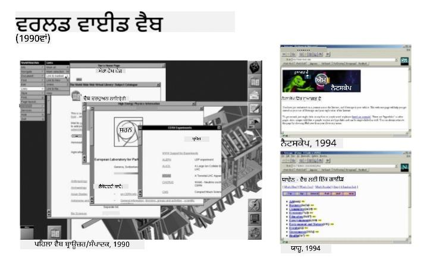
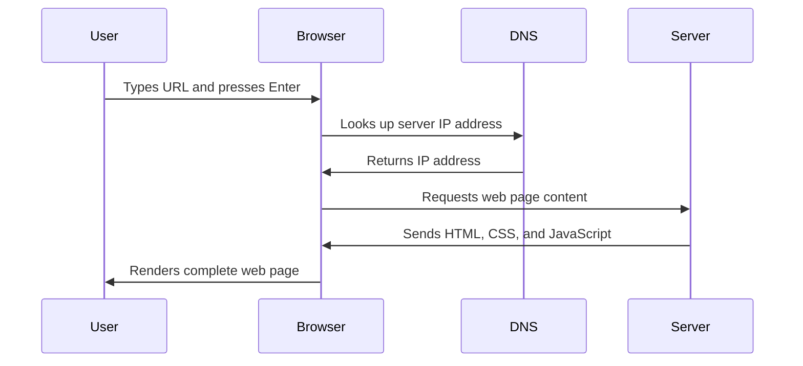
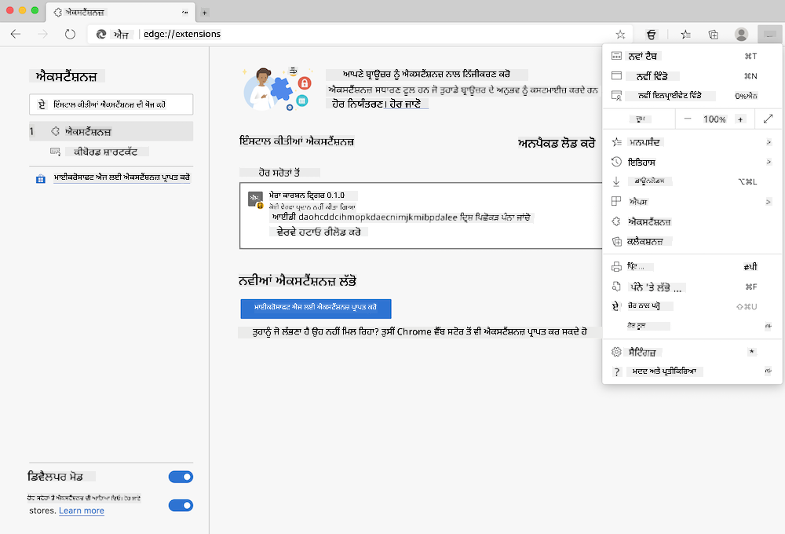

<!--
CO_OP_TRANSLATOR_METADATA:
{
  "original_hash": "33a875c522f237a2026e4653240dfc07",
  "translation_date": "2025-10-22T18:16:44+00:00",
  "source_file": "5-browser-extension/1-about-browsers/README.md",
  "language_code": "pa"
}
-->
# ਬ੍ਰਾਊਜ਼ਰ ਐਕਸਟੈਂਸ਼ਨ ਪ੍ਰੋਜੈਕਟ ਭਾਗ 1: ਬ੍ਰਾਊਜ਼ਰ ਬਾਰੇ ਸਭ ਕੁਝ


> ਸਕੈਚਨੋਟ [ਵਾਸਿਮ ਚੇਘਮ](https://dev.to/wassimchegham/ever-wondered-what-happens-when-you-type-in-a-url-in-an-address-bar-in-a-browser-3dob) ਦੁਆਰਾ

## ਪੂਰਵ-ਵਿਆਖਿਆਨ ਕਵਿਜ਼

[ਪੂਰਵ-ਵਿਆਖਿਆਨ ਕਵਿਜ਼](https://ff-quizzes.netlify.app/web/quiz/23)

### ਪਰਿਚਯ

ਬ੍ਰਾਊਜ਼ਰ ਐਕਸਟੈਂਸ਼ਨ ਛੋਟੀਆਂ ਐਪਲੀਕੇਸ਼ਨ ਹਨ ਜੋ ਤੁਹਾਡੇ ਵੈੱਬ ਬ੍ਰਾਊਜ਼ਿੰਗ ਅਨੁਭਵ ਨੂੰ ਵਧਾਉਂਦੀਆਂ ਹਨ। ਟਿਮ ਬਰਨਰਜ਼-ਲੀ ਦੇ ਇੰਟਰਐਕਟਿਵ ਵੈੱਬ ਦੇ ਮੂਲ ਦ੍ਰਿਸ਼ਟੀਕੋਣ ਵਾਂਗ, ਐਕਸਟੈਂਸ਼ਨ ਬ੍ਰਾਊਜ਼ਰ ਦੀ ਸਮਰੱਥਾ ਨੂੰ ਸਧਾਰਨ ਦਸਤਾਵੇਜ਼ ਦੇਖਣ ਤੋਂ ਪਰੇ ਵਧਾਉਂਦੀਆਂ ਹਨ। ਪਾਸਵਰਡ ਮੈਨੇਜਰਾਂ ਤੋਂ ਜੋ ਤੁਹਾਡੇ ਖਾਤਿਆਂ ਨੂੰ ਸੁਰੱਖਿਅਤ ਰੱਖਦੇ ਹਨ, ਰੰਗ ਚੁਣਨ ਵਾਲੇ ਸੰਦਾਂ ਤੱਕ ਜੋ ਡਿਜ਼ਾਈਨਰਾਂ ਨੂੰ ਸਹੀ ਸ਼ੇਡ ਹਾਸਲ ਕਰਨ ਵਿੱਚ ਮਦਦ ਕਰਦੇ ਹਨ, ਐਕਸਟੈਂਸ਼ਨ ਰੋਜ਼ਾਨਾ ਬ੍ਰਾਊਜ਼ਿੰਗ ਚੁਣੌਤੀਆਂ ਦਾ ਹੱਲ ਕਰਦੇ ਹਨ।

ਤੁਹਾਡਾ ਪਹਿਲਾ ਐਕਸਟੈਂਸ਼ਨ ਬਣਾਉਣ ਤੋਂ ਪਹਿਲਾਂ, ਆਓ ਸਮਝੀਏ ਕਿ ਬ੍ਰਾਊਜ਼ਰ ਕਿਵੇਂ ਕੰਮ ਕਰਦੇ ਹਨ। ਜਿਵੇਂ ਅਲੈਕਸੈਂਡਰ ਗ੍ਰਾਹਮ ਬੈੱਲ ਨੂੰ ਟੈਲੀਫੋਨ ਦੀ ਖੋਜ ਕਰਨ ਤੋਂ ਪਹਿਲਾਂ ਧੁਨੀ ਸੰਚਾਰ ਨੂੰ ਸਮਝਣ ਦੀ ਲੋੜ ਸੀ, ਬ੍ਰਾਊਜ਼ਰ ਦੇ ਮੂਲ ਤੱਤਾਂ ਨੂੰ ਜਾਣਨ ਨਾਲ ਤੁਹਾਨੂੰ ਐਕਸਟੈਂਸ਼ਨ ਬਣਾਉਣ ਵਿੱਚ ਮਦਦ ਮਿਲੇਗੀ ਜੋ ਮੌਜੂਦਾ ਬ੍ਰਾਊਜ਼ਰ ਸਿਸਟਮਾਂ ਨਾਲ ਬਹੁਤ ਹੀ ਸਹੀ ਤਰੀਕੇ ਨਾਲ ਜੁੜਦੇ ਹਨ।

ਇਸ ਪਾਠ ਦੇ ਅੰਤ ਤੱਕ, ਤੁਸੀਂ ਬ੍ਰਾਊਜ਼ਰ ਆਰਕੀਟੈਕਚਰ ਨੂੰ ਸਮਝ ਲਵੋਗੇ ਅਤੇ ਆਪਣਾ ਪਹਿਲਾ ਐਕਸਟੈਂਸ਼ਨ ਬਣਾਉਣਾ ਸ਼ੁਰੂ ਕਰ ਚੁੱਕੇ ਹੋਵੋਗੇ।

## ਵੈੱਬ ਬ੍ਰਾਊਜ਼ਰ ਨੂੰ ਸਮਝਣਾ

ਵੈੱਬ ਬ੍ਰਾਊਜ਼ਰ ਅਸਲ ਵਿੱਚ ਇੱਕ ਸੁਧਾਰਿਆ ਦਸਤਾਵੇਜ਼ ਵਿਆਖਿਆਕਾਰ ਹੈ। ਜਦੋਂ ਤੁਸੀਂ "google.com" ਨੂੰ ਐਡਰੈੱਸ ਬਾਰ ਵਿੱਚ ਟਾਈਪ ਕਰਦੇ ਹੋ, ਬ੍ਰਾਊਜ਼ਰ ਇੱਕ ਜਟਿਲ ਕ੍ਰਮਬੱਧ ਕਾਰਵਾਈ ਕਰਦਾ ਹੈ - ਦੁਨੀਆ ਭਰ ਦੇ ਸਰਵਰਾਂ ਤੋਂ ਸਮੱਗਰੀ ਦੀ ਬੇਨਤੀ ਕਰਦਾ ਹੈ, ਫਿਰ ਉਸ ਕੋਡ ਨੂੰ ਵਿਆਖਿਆ ਅਤੇ ਰੈਂਡਰ ਕਰਦਾ ਹੈ ਜੋ ਤੁਸੀਂ ਇੰਟਰਐਕਟਿਵ ਵੈੱਬ ਪੇਜਾਂ 'ਤੇ ਵੇਖਦੇ ਹੋ।

ਇਹ ਪ੍ਰਕਿਰਿਆ ਉਸ ਤਰੀਕੇ ਨੂੰ ਦਰਸਾਉਂਦੀ ਹੈ ਜਿਸ ਤਰ੍ਹਾਂ ਪਹਿਲਾ ਵੈੱਬ ਬ੍ਰਾਊਜ਼ਰ, ਵਰਲਡਵਾਈਡਵੈੱਬ, 1990 ਵਿੱਚ ਟਿਮ ਬਰਨਰਜ਼-ਲੀ ਦੁਆਰਾ ਡਿਜ਼ਾਈਨ ਕੀਤਾ ਗਿਆ ਸੀ ਤਾਂ ਜੋ ਹਾਈਪਰਲਿੰਕਡ ਦਸਤਾਵੇਜ਼ਾਂ ਨੂੰ ਹਰ ਕਿਸੇ ਲਈ ਪਹੁੰਚਯੋਗ ਬਣਾਇਆ ਜਾ ਸਕੇ।

✅ **ਥੋੜ੍ਹਾ ਇਤਿਹਾਸ**: ਪਹਿਲਾ ਬ੍ਰਾਊਜ਼ਰ 'ਵਰਲਡਵਾਈਡਵੈੱਬ' ਕਿਹਾ ਜਾਂਦਾ ਸੀ ਅਤੇ 1990 ਵਿੱਚ ਸਰ ਟਿਮੋਥੀ ਬਰਨਰਜ਼-ਲੀ ਦੁਆਰਾ ਬਣਾਇਆ ਗਿਆ ਸੀ।


> ਕੁਝ ਪੁਰਾਣੇ ਬ੍ਰਾਊਜ਼ਰ, [ਕੈਰਨ ਮੈਕਗ੍ਰੇਨ](https://www.slideshare.net/KMcGrane/week-4-ixd-history-personal-computing) ਦੁਆਰਾ

### ਬ੍ਰਾਊਜ਼ਰ ਵੈੱਬ ਸਮੱਗਰੀ ਨੂੰ ਕਿਵੇਂ ਪ੍ਰਕਿਰਿਆ ਕਰਦੇ ਹਨ

URL ਦਾਖਲ ਕਰਨ ਅਤੇ ਵੈੱਬਪੇਜ ਦੇਖਣ ਦੇ ਵਿਚਕਾਰ ਦੀ ਪ੍ਰਕਿਰਿਆ ਵਿੱਚ ਕਈ ਸਹਿ-ਸੰਯੋਜਿਤ ਕਦਮ ਸ਼ਾਮਲ ਹੁੰਦੇ ਹਨ ਜੋ ਸੈਕਿੰਡਾਂ ਵਿੱਚ ਹੋ ਜਾਂਦੇ ਹਨ:



**ਇਹ ਪ੍ਰਕਿਰਿਆ ਕੀ ਪੂਰੀ ਕਰਦੀ ਹੈ:**
- **ਅਨੁਵਾਦ**: DNS ਲੁੱਕਅੱਪ ਰਾਹੀਂ ਮਨੁੱਖ-ਪੜ੍ਹਨਯੋਗ URL ਨੂੰ ਸਰਵਰ IP ਪਤਾ ਵਿੱਚ
- **ਸਥਾਪਿਤ**: HTTP ਜਾਂ HTTPS ਪ੍ਰੋਟੋਕੋਲ ਦੀ ਵਰਤੋਂ ਕਰਕੇ ਵੈੱਬ ਸਰਵਰ ਨਾਲ ਸੁਰੱਖਿਅਤ ਕਨੈਕਸ਼ਨ
- **ਬੇਨਤੀ**: ਸਰਵਰ ਤੋਂ ਵਿਸ਼ੇਸ਼ ਵੈੱਬ ਪੇਜ ਸਮੱਗਰੀ
- **ਪ੍ਰਾਪਤ**: HTML ਮਾਰਕਅੱਪ, CSS ਸਟਾਈਲਿੰਗ, ਅਤੇ ਜਾਵਾਸਕ੍ਰਿਪਟ ਕੋਡ
- **ਰੈਂਡਰ**: ਸਾਰੀ ਸਮੱਗਰੀ ਨੂੰ ਇੰਟਰਐਕਟਿਵ ਵੈੱਬ ਪੇਜ ਵਿੱਚ

### ਬ੍ਰਾਊਜ਼ਰ ਦੇ ਮੁੱਖ ਫੀਚਰ

ਆਧੁਨਿਕ ਬ੍ਰਾਊਜ਼ਰ ਕਈ ਫੀਚਰ ਪ੍ਰਦਾਨ ਕਰਦੇ ਹਨ ਜੋ ਐਕਸਟੈਂਸ਼ਨ ਡਿਵੈਲਪਰ ਵਰਤ ਸਕਦੇ ਹਨ:

| ਫੀਚਰ | ਉਦੇਸ਼ | ਐਕਸਟੈਂਸ਼ਨ ਦੇ ਮੌਕੇ |
|---------|---------|------------------------|
| **ਰੈਂਡਰਿੰਗ ਇੰਜਨ** | HTML, CSS, ਅਤੇ ਜਾਵਾਸਕ੍ਰਿਪਟ ਦਿਖਾਉਂਦਾ ਹੈ | ਸਮੱਗਰੀ ਵਿੱਚ ਤਬਦੀਲੀ, ਸਟਾਈਲਿੰਗ ਇੰਜੈਕਸ਼ਨ |
| **ਜਾਵਾਸਕ੍ਰਿਪਟ ਇੰਜਨ** | ਜਾਵਾਸਕ੍ਰਿਪਟ ਕੋਡ ਚਲਾਉਂਦਾ ਹੈ | ਕਸਟਮ ਸਕ੍ਰਿਪਟ, API ਇੰਟਰੈਕਸ਼ਨ |
| **ਲੋਕਲ ਸਟੋਰੇਜ** | ਡਾਟਾ ਨੂੰ ਸਥਾਨਕ ਤੌਰ 'ਤੇ ਸੇਵ ਕਰਦਾ ਹੈ | ਯੂਜ਼ਰ ਪਸੰਦਾਂ, ਕੈਸ਼ਡ ਡਾਟਾ |
| **ਨੈਟਵਰਕ ਸਟੈਕ** | ਵੈੱਬ ਬੇਨਤੀਆਂ ਨੂੰ ਸੰਭਾਲਦਾ ਹੈ | ਬੇਨਤੀ ਮਾਨੀਟਰਿੰਗ, ਡਾਟਾ ਵਿਸ਼ਲੇਸ਼ਣ |
| **ਸੁਰੱਖਿਆ ਮਾਡਲ** | ਖਤਰਨਾਕ ਸਮੱਗਰੀ ਤੋਂ ਯੂਜ਼ਰਾਂ ਦੀ ਰੱਖਿਆ ਕਰਦਾ ਹੈ | ਸਮੱਗਰੀ ਫਿਲਟਰੇਸ਼ਨ, ਸੁਰੱਖਿਆ ਵਿੱਚ ਸੁਧਾਰ |

**ਇਨ੍ਹਾਂ ਫੀਚਰਾਂ ਨੂੰ ਸਮਝਣ ਨਾਲ ਤੁਹਾਨੂੰ ਮਦਦ ਮਿਲਦੀ ਹੈ:**
- **ਪਛਾਣ**: ਜਿੱਥੇ ਤੁਹਾਡਾ ਐਕਸਟੈਂਸ਼ਨ ਸਭ ਤੋਂ ਵੱਧ ਮੁੱਲ ਜੋੜ ਸਕਦਾ ਹੈ
- **ਚੋਣ**: ਤੁਹਾਡੇ ਐਕਸਟੈਂਸ਼ਨ ਦੀ ਕਾਰਗੁਜ਼ਾਰੀ ਲਈ ਸਹੀ ਬ੍ਰਾਊਜ਼ਰ API
- **ਡਿਜ਼ਾਈਨ**: ਐਕਸਟੈਂਸ਼ਨ ਜੋ ਬ੍ਰਾਊਜ਼ਰ ਸਿਸਟਮਾਂ ਨਾਲ ਕੁਸ਼ਲਤਾਪੂਰਵਕ ਕੰਮ ਕਰਦੇ ਹਨ
- **ਸੁਨਿਸ਼ਚਿਤ**: ਤੁਹਾਡਾ ਐਕਸਟੈਂਸ਼ਨ ਬ੍ਰਾਊਜ਼ਰ ਸੁਰੱਖਿਆ ਦੇ ਸ੍ਰੇਸ਼ਠ ਅਭਿਆਸਾਂ ਦੀ ਪਾਲਣਾ ਕਰਦਾ ਹੈ

### ਕ੍ਰਾਸ-ਬ੍ਰਾਊਜ਼ਰ ਵਿਕਾਸ ਦੇ ਵਿਚਾਰ

ਵੱਖ-ਵੱਖ ਬ੍ਰਾਊਜ਼ਰ ਮਿਆਰਾਂ ਨੂੰ ਕੁਝ ਹੱਦ ਤੱਕ ਵੱਖ-ਵੱਖ ਤਰੀਕੇ ਨਾਲ ਲਾਗੂ ਕਰਦੇ ਹਨ, ਜਿਵੇਂ ਕਿ ਵੱਖ-ਵੱਖ ਪ੍ਰੋਗਰਾਮਿੰਗ ਭਾਸ਼ਾਵਾਂ ਇੱਕੋ ਹੀ ਐਲਗੋਰਿਦਮ ਨੂੰ ਵੱਖ-ਵੱਖ ਤਰੀਕੇ ਨਾਲ ਸੰਭਾਲ ਸਕਦੀਆਂ ਹਨ। Chrome, Firefox, ਅਤੇ Safari ਵਿੱਚ ਹਰ ਇੱਕ ਵਿੱਚ ਵਿਲੱਖਣ ਵਿਸ਼ੇਸ਼ਤਾਵਾਂ ਹਨ ਜੋ ਡਿਵੈਲਪਰਾਂ ਨੂੰ ਐਕਸਟੈਂਸ਼ਨ ਵਿਕਾਸ ਦੌਰਾਨ ਧਿਆਨ ਵਿੱਚ ਰੱਖਣੀਆਂ ਪੈਂਦੀਆਂ ਹਨ।

> 💡 **ਪ੍ਰੋ ਟਿਪ**: [caniuse.com](https://www.caniuse.com) ਦੀ ਵਰਤੋਂ ਕਰੋ ਇਹ ਜਾਂਚਣ ਲਈ ਕਿ ਕਿਹੜੀਆਂ ਵੈੱਬ ਤਕਨਾਲੋਜੀਆਂ ਵੱਖ-ਵੱਖ ਬ੍ਰਾਊਜ਼ਰਾਂ ਵਿੱਚ ਸਹਾਇਕ ਹਨ। ਇਹ ਤੁਹਾਡੇ ਐਕਸਟੈਂਸ਼ਨ ਦੇ ਫੀਚਰਾਂ ਦੀ ਯੋਜਨਾ ਬਣਾਉਣ ਦੌਰਾਨ ਬਹੁਤ ਹੀ ਕੀਮਤੀ ਹੈ!

**ਐਕਸਟੈਂਸ਼ਨ ਵਿਕਾਸ ਲਈ ਮੁੱਖ ਵਿਚਾਰ:**
- **ਟੈਸਟ** ਕਰੋ ਆਪਣੇ ਐਕਸਟੈਂਸ਼ਨ ਨੂੰ Chrome, Firefox, ਅਤੇ Edge ਬ੍ਰਾਊਜ਼ਰਾਂ ਵਿੱਚ
- **ਅਨੁਕੂਲ** ਕਰੋ ਵੱਖ-ਵੱਖ ਬ੍ਰਾਊਜ਼ਰ ਐਕਸਟੈਂਸ਼ਨ API ਅਤੇ ਮੈਨਿਫੈਸਟ ਫਾਰਮੈਟ
- **ਸੰਭਾਲ** ਕਰੋ ਵੱਖ-ਵੱਖ ਪ੍ਰਦਰਸ਼ਨ ਵਿਸ਼ੇਸ਼ਤਾਵਾਂ ਅਤੇ ਸੀਮਾਵਾਂ
- **ਪ੍ਰਦਾਨ** ਕਰੋ ਬ੍ਰਾਊਜ਼ਰ-ਵਿਸ਼ੇਸ਼ ਫੀਚਰਾਂ ਲਈ ਫਾਲਬੈਕ ਜੋ ਉਪਲਬਧ ਨਹੀਂ ਹੋ ਸਕਦੇ

✅ **ਵਿਸ਼ਲੇਸ਼ਣ ਅੰਤਰਦ੍ਰਿਸ਼ਟੀ**: ਤੁਸੀਂ ਆਪਣੇ ਵੈੱਬ ਵਿਕਾਸ ਪ੍ਰੋਜੈਕਟਾਂ ਵਿੱਚ ਵਿਸ਼ਲੇਸ਼ਣ ਪੈਕੇਜਾਂ ਨੂੰ ਇੰਸਟਾਲ ਕਰਕੇ ਇਹ ਨਿਰਧਾਰਤ ਕਰ ਸਕਦੇ ਹੋ ਕਿ ਤੁਹਾਡੇ ਯੂਜ਼ਰ ਕਿਹੜੇ ਬ੍ਰਾਊਜ਼ਰ ਨੂੰ ਤਰਜੀਹ ਦਿੰਦੇ ਹਨ। ਇਹ ਡਾਟਾ ਤੁਹਾਨੂੰ ਪਹਿਲਾਂ ਕਿਹੜੇ ਬ੍ਰਾਊਜ਼ਰਾਂ ਨੂੰ ਸਹਾਇਕ ਬਣਾਉਣ ਲਈ ਤਰਜੀਹ ਦੇਣ ਵਿੱਚ ਮਦਦ ਕਰਦਾ ਹੈ।

## ਬ੍ਰਾਊਜ਼ਰ ਐਕਸਟੈਂਸ਼ਨ ਨੂੰ ਸਮਝਣਾ

ਬ੍ਰਾਊਜ਼ਰ ਐਕਸਟੈਂਸ਼ਨ ਆਮ ਵੈੱਬ ਬ੍ਰਾਊਜ਼ਿੰਗ ਚੁਣੌਤੀਆਂ ਦਾ ਹੱਲ ਕਰਦੇ ਹਨ ਬ੍ਰਾਊਜ਼ਰ ਇੰਟਰਫੇਸ ਵਿੱਚ ਸਿੱਧੇ ਫੰਕਸ਼ਨਲਿਟੀ ਸ਼ਾਮਲ ਕਰਕੇ। ਵੱਖਰੇ ਐਪਲੀਕੇਸ਼ਨਾਂ ਜਾਂ ਜਟਿਲ ਵਰਕਫਲੋਜ਼ ਦੀ ਲੋੜ ਦੇ ਬਗੈਰ, ਐਕਸਟੈਂਸ਼ਨ ਸੰਦਾਂ ਅਤੇ ਵਿਸ਼ੇਸ਼ਤਾਵਾਂ ਤੱਕ ਤੁਰੰਤ ਪਹੁੰਚ ਪ੍ਰਦਾਨ ਕਰਦੇ ਹਨ।

ਇਹ ਧਾਰਨਾ ਉਸ ਤਰੀਕੇ ਨੂੰ ਦਰਸਾਉਂਦੀ ਹੈ ਜਿਸ ਤਰ੍ਹਾਂ ਸ਼ੁਰੂਆਤੀ ਕੰਪਿਊਟਰ ਪਾਇਓਨੀਅਰਾਂ ਜਿਵੇਂ ਕਿ ਡਗਲਸ ਐਂਗਲਬਾਰਟ ਨੇ ਤਕਨਾਲੋਜੀ ਨਾਲ ਮਨੁੱਖੀ ਸਮਰੱਥਾਵਾਂ ਨੂੰ ਵਧਾਉਣ ਦੀ ਕਲਪਨਾ ਕੀਤੀ ਸੀ - ਐਕਸਟੈਂਸ਼ਨ ਤੁਹਾਡੇ ਬ੍ਰਾਊਜ਼ਰ ਦੀ ਮੂਲ ਫੰਕਸ਼ਨਲਿਟੀ ਨੂੰ ਵਧਾਉਂਦੇ ਹਨ।

**ਪ੍ਰਸਿੱਧ ਐਕਸਟੈਂਸ਼ਨ ਸ਼੍ਰੇਣੀਆਂ ਅਤੇ ਉਨ੍ਹਾਂ ਦੇ ਫਾਇਦੇ:**
- **ਉਤਪਾਦਕਤਾ ਸੰਦ**: ਟਾਸਕ ਮੈਨੇਜਰ, ਨੋਟ-ਲੈਣ ਵਾਲੇ ਐਪਸ, ਅਤੇ ਸਮਾਂ ਟ੍ਰੈਕਰ ਜੋ ਤੁਹਾਨੂੰ ਸੰਗਠਿਤ ਰਹਿਣ ਵਿੱਚ ਮਦਦ ਕਰਦੇ ਹਨ
- **ਸੁਰੱਖਿਆ ਵਿੱਚ ਸੁਧਾਰ**: ਪਾਸਵਰਡ ਮੈਨੇਜਰ, ਐਡ ਬਲਾਕਰ, ਅਤੇ ਗੋਪਨੀਯਤਾ ਸੰਦ ਜੋ ਤੁਹਾਡੇ ਡਾਟਾ ਦੀ ਰੱਖਿਆ ਕਰਦੇ ਹਨ
- **ਡਿਵੈਲਪਰ ਸੰਦ**: ਕੋਡ ਫਾਰਮੈਟਰ, ਰੰਗ ਚੁਣਨ ਵਾਲੇ ਸੰਦ, ਅਤੇ ਡੀਬੱਗਿੰਗ ਯੂਟਿਲਿਟੀਜ਼ ਜੋ ਵਿਕਾਸ ਨੂੰ ਸਧਾਰਦੇ ਹਨ
- **ਸਮੱਗਰੀ ਵਿੱਚ ਸੁਧਾਰ**: ਪੜ੍ਹਨ ਦੇ ਢੰਗ, ਵੀਡੀਓ ਡਾਊਨਲੋਡਰ, ਅਤੇ ਸਕ੍ਰੀਨਸ਼ਾਟ ਸੰਦ ਜੋ ਤੁਹਾਡੇ ਵੈੱਬ ਅਨੁਭਵ ਨੂੰ ਬਿਹਤਰ ਬਣਾਉਂਦੇ ਹਨ

✅ **ਚਿੰਤਨ ਪ੍ਰਸ਼ਨ**: ਤੁਹਾਡੇ ਮਨਪਸੰਦ ਬ੍ਰਾਊਜ਼ਰ ਐਕਸਟੈਂਸ਼ਨ ਕਿਹੜੇ ਹਨ? ਉਹ ਕਿਹੜੇ ਵਿਸ਼ੇਸ਼ ਕੰਮ ਕਰਦੇ ਹਨ, ਅਤੇ ਉਹ ਤੁਹਾਡੇ ਬ੍ਰਾਊਜ਼ਿੰਗ ਅਨੁਭਵ ਨੂੰ ਕਿਵੇਂ ਬਿਹਤਰ ਬਣਾਉਂਦੇ ਹਨ?

## ਐਕਸਟੈਂਸ਼ਨ ਨੂੰ ਇੰਸਟਾਲ ਅਤੇ ਪ੍ਰਬੰਧਿਤ ਕਰਨਾ

ਐਕਸਟੈਂਸ਼ਨ ਇੰਸਟਾਲੇਸ਼ਨ ਪ੍ਰਕਿਰਿਆ ਨੂੰ ਸਮਝਣਾ ਤੁਹਾਨੂੰ ਇਹ ਅਨੁਮਾਨ ਲਗਾਉਣ ਵਿੱਚ ਮਦਦ ਕਰਦਾ ਹੈ ਕਿ ਜਦੋਂ ਲੋਕ ਤੁਹਾਡਾ ਐਕਸਟੈਂਸ਼ਨ ਇੰਸਟਾਲ ਕਰਦੇ ਹਨ ਤਾਂ ਉਨ੍ਹਾਂ ਦਾ ਅਨੁਭਵ ਕਿਵੇਂ ਹੋਵੇਗਾ। ਇੰਸਟਾਲੇਸ਼ਨ ਪ੍ਰਕਿਰਿਆ ਆਧੁਨਿਕ ਬ੍ਰਾਊਜ਼ਰਾਂ ਵਿੱਚ ਮਿਆਰੀ ਹੈ, ਇੰਟਰਫੇਸ ਡਿਜ਼ਾਈਨ ਵਿੱਚ ਥੋੜ੍ਹੇ ਬਦਲਾਅ ਦੇ ਨਾਲ।



> **ਮਹੱਤਵਪੂਰਨ**: ਜਦੋਂ ਤੁਸੀਂ ਆਪਣੇ ਐਕਸਟੈਂਸ਼ਨ ਦੀ ਜਾਂਚ ਕਰ ਰਹੇ ਹੋ ਤਾਂ ਡਿਵੈਲਪਰ ਮੋਡ ਨੂੰ ਚਾਲੂ ਕਰਨਾ ਅਤੇ ਹੋਰ ਸਟੋਰਾਂ ਤੋਂ ਐਕਸਟੈਂਸ਼ਨ ਦੀ ਆਗਿਆ ਦੇਣਾ ਯਕੀਨੀ ਬਣਾਓ।

### ਵਿਕਾਸ ਐਕਸਟੈਂਸ਼ਨ ਇੰਸਟਾਲੇਸ਼ਨ ਪ੍ਰਕਿਰਿਆ

ਜਦੋਂ ਤੁਸੀਂ ਆਪਣੇ ਐਕਸਟੈਂਸ਼ਨ ਨੂੰ ਵਿਕਸਿਤ ਅਤੇ ਜਾਂਚ ਰਹੇ ਹੋ, ਇਸ ਵਰਕਫਲੋਅ ਦੀ ਪਾਲਣਾ ਕਰੋ:

```bash
# Step 1: Build your extension
npm run build
```

**ਇਹ ਕਮਾਂਡ ਕੀ ਪੂਰੀ ਕਰਦੀ ਹੈ:**
- **ਤਿਆਰ** ਕਰਦਾ ਹੈ ਤੁਹਾਡੇ ਸਰੋਤ ਕੋਡ ਨੂੰ ਬ੍ਰਾਊਜ਼ਰ-ਤਿਆਰ ਫਾਈਲਾਂ ਵਿੱਚ
- **ਬੰਡਲ** ਕਰਦਾ ਹੈ ਜਾਵਾਸਕ੍ਰਿਪਟ ਮੋਡੀਊਲਾਂ ਨੂੰ ਅਨੁਕੂਲ ਪੈਕੇਜਾਂ ਵਿੱਚ
- **ਜਨਰੇਟ** ਕਰਦਾ ਹੈ ਅੰਤਮ ਐਕਸਟੈਂਸ਼ਨ ਫਾਈਲਾਂ `/dist` ਫੋਲਡਰ ਵਿੱਚ
- **ਤਿਆਰ** ਕਰਦਾ ਹੈ ਤੁਹਾਡੇ ਐਕਸਟੈਂਸ਼ਨ ਨੂੰ ਇੰਸਟਾਲ ਅਤੇ ਜਾਂਚ ਲਈ

**ਕਦਮ 2: ਬ੍ਰਾਊਜ਼ਰ ਐਕਸਟੈਂਸ਼ਨ ਤੇ ਜਾਓ**
1. **ਖੋਲ੍ਹੋ** ਆਪਣੇ ਬ੍ਰਾਊਜ਼ਰ ਦਾ ਐਕਸਟੈਂਸ਼ਨ ਪ੍ਰਬੰਧਨ ਪੇਜ
2. **ਕਲਿੱਕ ਕਰੋ** "ਸੈਟਿੰਗਸ ਅਤੇ ਹੋਰ" ਬਟਨ (ਉੱਪਰ ਸੱਜੇ ਕੋਨੇ ਵਿੱਚ `...` ਆਈਕਨ)
3. **ਚੁਣੋ** "ਐਕਸਟੈਂਸ਼ਨ" ਡ੍ਰਾਪਡਾਊਨ ਮੈਨੂ ਤੋਂ

**ਕਦਮ 3: ਆਪਣਾ ਐਕਸਟੈਂਸ਼ਨ ਲੋਡ ਕਰੋ**
- **ਨਵੀਂ ਇੰਸਟਾਲੇਸ਼ਨ ਲਈ**: `ਲੋਡ ਅਨਪੈਕਡ` ਚੁਣੋ ਅਤੇ ਆਪਣਾ `/dist` ਫੋਲਡਰ ਚੁਣੋ
- **ਅੱਪਡੇਟ ਲਈ**: ਆਪਣੇ ਪਹਿਲਾਂ ਤੋਂ ਇੰਸਟਾਲ ਕੀਤੇ ਐਕਸਟੈਂਸ਼ਨ ਦੇ ਨਾਲ `ਰੀਲੋਡ` 'ਤੇ ਕਲਿੱਕ ਕਰੋ
- **ਜਾਂਚ ਲਈ**: "ਡਿਵੈਲਪਰ ਮੋਡ" ਨੂੰ ਚਾਲੂ ਕਰੋ ਤਾਂ ਜੋ ਵਾਧੂ ਡੀਬੱਗਿੰਗ ਫੀਚਰਾਂ ਤੱਕ ਪਹੁੰਚ ਕੀਤੀ ਜਾ ਸਕੇ

### ਪ੍ਰੋਡਕਸ਼ਨ ਐਕਸਟੈਂਸ਼ਨ ਇੰਸਟਾਲੇਸ਼ਨ

> ✅ **ਨੋਟ**: ਇਹ ਵਿਕਾਸ ਨਿਰਦੇਸ਼ਾਂ ਖਾਸ ਤੌਰ 'ਤੇ ਉਹ ਐਕਸਟੈਂਸ਼ਨ ਲਈ ਹਨ ਜੋ ਤੁਸੀਂ ਖੁਦ ਬਣਾਉਂਦੇ ਹੋ। ਪ੍ਰਕਾਸ਼ਿਤ ਐਕਸਟੈਂਸ਼ਨ ਨੂੰ ਇੰਸਟਾਲ ਕਰਨ ਲਈ, [ਮਾਈਕਰੋਸਾਫਟ ਐਜ ਐਡ-ਆਨ ਸਟੋਰ](https://microsoftedge.microsoft.com/addons/Microsoft-Edge-Extensions-Home) ਵਰਗੇ ਅਧਿਕਾਰਤ ਬ੍ਰਾਊਜ਼ਰ ਐਕਸਟੈਂਸ਼ਨ ਸਟੋਰਾਂ 'ਤੇ ਜਾਓ।

**ਫਰਕ ਨੂੰ ਸਮਝਣਾ:**
- **ਵਿਕਾਸ ਇੰਸਟਾਲੇਸ਼ਨ** ਤੁਹਾਨੂੰ ਵਿਕਾਸ ਦੌਰਾਨ ਅਪ੍ਰਕਾਸ਼ਿਤ ਐਕਸਟੈਂਸ਼ਨ ਦੀ ਜਾਂਚ ਕਰਨ ਦਿੰਦੇ ਹਨ
- **ਸਟੋਰ ਇੰਸਟਾਲੇਸ਼ਨ** ਪ੍ਰਕਾਸ਼ਿਤ ਐਕਸਟੈਂਸ਼ਨ ਪ੍ਰਦਾਨ ਕਰਦੇ ਹਨ ਜਿਨ੍ਹਾਂ ਵਿੱਚ ਸਵੈ-ਚਾਲੂ ਅੱਪਡੇਟ ਹੁੰਦੇ ਹਨ
- **ਸਾਈਡਲੋਡਿੰਗ** ਅਧਿਕਾਰਤ ਸਟੋਰਾਂ ਤੋਂ ਬਾਹਰ ਐਕਸਟੈਂਸ਼ਨ ਦੀ ਇੰਸਟਾਲੇਸ਼ਨ ਦੀ ਆਗਿਆ ਦਿੰਦਾ ਹੈ (ਡਿਵੈਲਪਰ ਮੋਡ ਦੀ ਲੋੜ ਹੈ)

## ਆਪਣਾ ਕਾਰਬਨ ਫੁਟਪ੍ਰਿੰਟ ਐਕਸਟੈਂਸ਼ਨ ਬਣਾਉਣਾ

ਅਸੀਂ ਇੱਕ ਬ੍ਰਾਊਜ਼ਰ
**ਵੇਰਵਾ:** ਬ੍ਰਾਊਜ਼ਰ ਐਕਸਟੈਂਸ਼ਨ ਵਿੱਚ ਸੁਧਾਰ ਲਿਆਉਣ ਲਈ ਫਾਰਮ ਵੈਰੀਫਿਕੇਸ਼ਨ ਅਤੇ ਯੂਜ਼ਰ ਫੀਡਬੈਕ ਫੀਚਰ ਸ਼ਾਮਲ ਕਰੋ, ਤਾਂ ਜੋ API ਕੁੰਜੀਆਂ ਅਤੇ ਰੀਜਨ ਕੋਡ ਦਾਖਲ ਕਰਦੇ ਸਮੇਂ ਯੂਜ਼ਰ ਅਨੁਭਵ ਨੂੰ ਬਿਹਤਰ ਕੀਤਾ ਜਾ ਸਕੇ।

**ਪ੍ਰੋੰਪਟ:** ਜਾਵਾਸਕ੍ਰਿਪਟ ਵੈਰੀਫਿਕੇਸ਼ਨ ਫੰਕਸ਼ਨ ਬਣਾਓ ਜੋ ਜਾਂਚ ਕਰ ਸਕੇ ਕਿ API ਕੁੰਜੀ ਫੀਲਡ ਵਿੱਚ ਘੱਟੋ-ਘੱਟ 20 ਅੱਖਰ ਹਨ ਅਤੇ ਰੀਜਨ ਕੋਡ ਸਹੀ ਫਾਰਮੈਟ (ਜਿਵੇਂ 'US-NEISO') ਦਾ ਪਾਲਣ ਕਰਦਾ ਹੈ। ਦ੍ਰਿਸ਼ਮਾਨ ਫੀਡਬੈਕ ਸ਼ਾਮਲ ਕਰੋ, ਜਿਵੇਂ ਕਿ ਵੈਧ ਇਨਪੁਟ ਲਈ ਬਾਰਡਰ ਦਾ ਰੰਗ ਹਰਾ ਅਤੇ ਗੈਰ-ਵੈਧ ਲਈ ਲਾਲ। ਸੁਰੱਖਿਆ ਦੇ ਮੱਦੇਨਜ਼ਰ API ਕੁੰਜੀ ਨੂੰ ਦਿਖਾਉਣ/ਛੁਪਾਉਣ ਲਈ ਟੌਗਲ ਫੀਚਰ ਵੀ ਸ਼ਾਮਲ ਕਰੋ।

[ਏਜੰਟ ਮੋਡ](https://code.visualstudio.com/blogs/2025/02/24/introducing-copilot-agent-mode) ਬਾਰੇ ਹੋਰ ਜਾਣੋ।

## 🚀 ਚੁਣੌਤੀ

ਬ੍ਰਾਊਜ਼ਰ ਐਕਸਟੈਂਸ਼ਨ ਸਟੋਰ 'ਤੇ ਜਾਓ ਅਤੇ ਇੱਕ ਐਕਸਟੈਂਸ਼ਨ ਆਪਣੇ ਬ੍ਰਾਊਜ਼ਰ ਵਿੱਚ ਇੰਸਟਾਲ ਕਰੋ। ਇਸ ਦੀਆਂ ਫਾਈਲਾਂ ਨੂੰ ਦਿਲਚਸਪ ਢੰਗ ਨਾਲ ਜਾਂਚੋ। ਤੁਹਾਨੂੰ ਕੀ ਪਤਾ ਲੱਗਦਾ ਹੈ?

## ਲੈਕਚਰ ਬਾਅਦ ਕਵਿਜ਼

[ਲੈਕਚਰ ਬਾਅਦ ਕਵਿਜ਼](https://ff-quizzes.netlify.app/web/quiz/24)

## ਸਮੀਖਿਆ ਅਤੇ ਸਵੈ ਅਧਿਐਨ

ਇਸ ਪਾਠ ਵਿੱਚ ਤੁਸੀਂ ਵੈੱਬ ਬ੍ਰਾਊਜ਼ਰ ਦੇ ਇਤਿਹਾਸ ਬਾਰੇ ਥੋੜਾ ਸਿੱਖਿਆ; ਇਸ ਮੌਕੇ ਦਾ ਫਾਇਦਾ ਚੁੱਕੋ ਅਤੇ ਵਰਲਡ ਵਾਈਡ ਵੈੱਬ ਦੇ ਖੋਜਕਾਰਾਂ ਨੇ ਇਸਦੇ ਉਪਯੋਗ ਬਾਰੇ ਕਿਵੇਂ ਸੋਚਿਆ, ਇਸਦੇ ਇਤਿਹਾਸ ਬਾਰੇ ਹੋਰ ਪੜ੍ਹ ਕੇ ਜਾਣੋ। ਕੁਝ ਲਾਭਦਾਇਕ ਸਾਈਟਾਂ ਸ਼ਾਮਲ ਹਨ:

[ਵੈੱਬ ਬ੍ਰਾਊਜ਼ਰ ਦਾ ਇਤਿਹਾਸ](https://www.mozilla.org/firefox/browsers/browser-history/)

[ਵੈੱਬ ਦਾ ਇਤਿਹਾਸ](https://webfoundation.org/about/vision/history-of-the-web/)

[ਟਿਮ ਬਰਨਰਜ਼-ਲੀ ਨਾਲ ਇੰਟਰਵਿਊ](https://www.theguardian.com/technology/2019/mar/12/tim-berners-lee-on-30-years-of-the-web-if-we-dream-a-little-we-can-get-the-web-we-want)

## ਅਸਾਈਨਮੈਂਟ

[ਆਪਣੇ ਐਕਸਟੈਂਸ਼ਨ ਨੂੰ ਰੀਸਟਾਈਲ ਕਰੋ](assignment.md)

---

**ਅਸਵੀਕਰਤਾ**:  
ਇਹ ਦਸਤਾਵੇਜ਼ AI ਅਨੁਵਾਦ ਸੇਵਾ [Co-op Translator](https://github.com/Azure/co-op-translator) ਦੀ ਵਰਤੋਂ ਕਰਕੇ ਅਨੁਵਾਦ ਕੀਤਾ ਗਿਆ ਹੈ। ਜਦੋਂ ਕਿ ਅਸੀਂ ਸਹੀ ਹੋਣ ਦੀ ਕੋਸ਼ਿਸ਼ ਕਰਦੇ ਹਾਂ, ਕਿਰਪਾ ਕਰਕੇ ਧਿਆਨ ਦਿਓ ਕਿ ਸਵੈਚਾਲਿਤ ਅਨੁਵਾਦਾਂ ਵਿੱਚ ਗਲਤੀਆਂ ਜਾਂ ਅਸੁੱਤੀਆਂ ਹੋ ਸਕਦੀਆਂ ਹਨ। ਇਸ ਦੀ ਮੂਲ ਭਾਸ਼ਾ ਵਿੱਚ ਮੂਲ ਦਸਤਾਵੇਜ਼ ਨੂੰ ਅਧਿਕਾਰਤ ਸਰੋਤ ਮੰਨਿਆ ਜਾਣਾ ਚਾਹੀਦਾ ਹੈ। ਮਹੱਤਵਪੂਰਨ ਜਾਣਕਾਰੀ ਲਈ, ਪੇਸ਼ੇਵਰ ਮਨੁੱਖੀ ਅਨੁਵਾਦ ਦੀ ਸਿਫਾਰਸ਼ ਕੀਤੀ ਜਾਂਦੀ ਹੈ। ਇਸ ਅਨੁਵਾਦ ਦੀ ਵਰਤੋਂ ਤੋਂ ਪੈਦਾ ਹੋਣ ਵਾਲੇ ਕਿਸੇ ਵੀ ਗਲਤਫਹਿਮੀ ਜਾਂ ਗਲਤ ਵਿਆਖਿਆ ਲਈ ਅਸੀਂ ਜ਼ਿੰਮੇਵਾਰ ਨਹੀਂ ਹਾਂ।