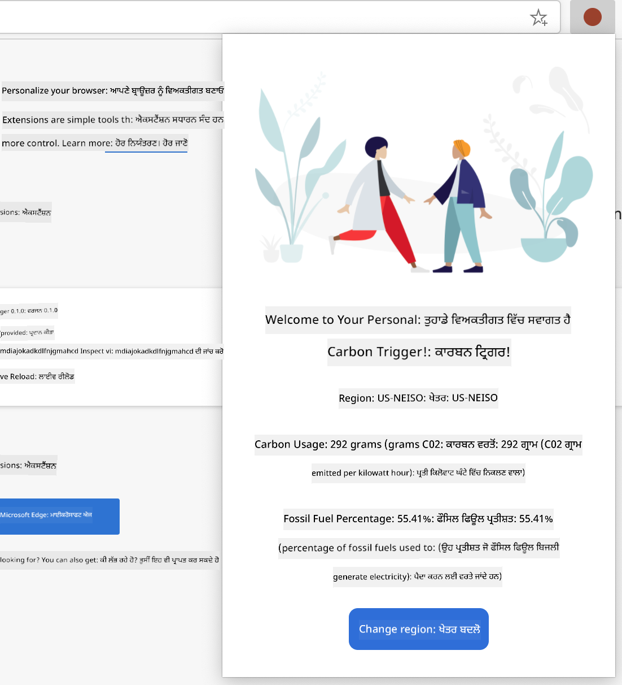

<!--
CO_OP_TRANSLATOR_METADATA:
{
  "original_hash": "2326d04e194a10aa760b51f5e5a1f61d",
  "translation_date": "2025-08-28T16:57:35+00:00",
  "source_file": "5-browser-extension/1-about-browsers/README.md",
  "language_code": "pa"
}
-->
# ਬ੍ਰਾਊਜ਼ਰ ਐਕਸਟੈਂਸ਼ਨ ਪ੍ਰੋਜੈਕਟ ਭਾਗ 1: ਬ੍ਰਾਊਜ਼ਰ ਬਾਰੇ ਸਭ ਕੁਝ


> ਸਕੈਚਨੋਟ [ਵਸੀਮ ਚੇਘਮ](https://dev.to/wassimchegham/ever-wondered-what-happens-when-you-type-in-a-url-in-an-address-bar-in-a-browser-3dob) ਦੁਆਰਾ

## ਲੈਕਚਰ ਤੋਂ ਪਹਿਲਾਂ ਕਵੀਜ਼

[ਪ੍ਰੀ-ਲੈਕਚਰ ਕਵੀਜ਼](https://ff-quizzes.netlify.app/web/quiz/23)

### ਪਰਿਚਯ

ਬ੍ਰਾਊਜ਼ਰ ਐਕਸਟੈਂਸ਼ਨ ਬ੍ਰਾਊਜ਼ਰ ਵਿੱਚ ਵਾਧੂ ਫੰਕਸ਼ਨਲਿਟੀ ਜੋੜਦੇ ਹਨ। ਪਰ ਇੱਕ ਬਣਾਉਣ ਤੋਂ ਪਹਿਲਾਂ, ਤੁਹਾਨੂੰ ਇਹ ਸਮਝਣਾ ਚਾਹੀਦਾ ਹੈ ਕਿ ਬ੍ਰਾਊਜ਼ਰ ਕਿਵੇਂ ਕੰਮ ਕਰਦੇ ਹਨ।

### ਬ੍ਰਾਊਜ਼ਰ ਬਾਰੇ

ਇਸ ਪਾਠਮਾਲਾ ਵਿੱਚ, ਤੁਸੀਂ ਇੱਕ ਬ੍ਰਾਊਜ਼ਰ ਐਕਸਟੈਂਸ਼ਨ ਬਣਾਉਣਾ ਸਿੱਖੋਗੇ ਜੋ Chrome, Firefox ਅਤੇ Edge ਬ੍ਰਾਊਜ਼ਰਾਂ 'ਤੇ ਕੰਮ ਕਰੇਗਾ। ਇਸ ਭਾਗ ਵਿੱਚ, ਤੁਸੀਂ ਜਾਣੋਗੇ ਕਿ ਬ੍ਰਾਊਜ਼ਰ ਕਿਵੇਂ ਕੰਮ ਕਰਦੇ ਹਨ ਅਤੇ ਬ੍ਰਾਊਜ਼ਰ ਐਕਸਟੈਂਸ਼ਨ ਦੇ ਤੱਤਾਂ ਨੂੰ ਕਿਵੇਂ ਤਿਆਰ ਕਰਨਾ ਹੈ।

ਪਰ ਬ੍ਰਾਊਜ਼ਰ ਹੈ ਕੀ? ਇਹ ਇੱਕ ਸੌਫਟਵੇਅਰ ਐਪਲੀਕੇਸ਼ਨ ਹੈ ਜੋ ਯੂਜ਼ਰ ਨੂੰ ਸਰਵਰ ਤੋਂ ਸਮੱਗਰੀ ਐਕਸੈਸ ਕਰਨ ਅਤੇ ਵੈੱਬ ਪੇਜਾਂ 'ਤੇ ਡਿਸਪਲੇ ਕਰਨ ਦੀ ਆਗਿਆ ਦਿੰਦਾ ਹੈ।

✅ ਥੋੜ੍ਹਾ ਇਤਿਹਾਸ: ਪਹਿਲਾ ਬ੍ਰਾਊਜ਼ਰ 'ਵਰਲਡਵਾਈਡਵੈੱਬ' ਕਿਹਾ ਜਾਂਦਾ ਸੀ ਅਤੇ ਇਹ ਸਿਰ ਟਿਮੋਥੀ ਬਰਨਰਜ਼-ਲੀ ਦੁਆਰਾ 1990 ਵਿੱਚ ਬਣਾਇਆ ਗਿਆ ਸੀ।


> ਕੁਝ ਸ਼ੁਰੂਆਤੀ ਬ੍ਰਾਊਜ਼ਰ, [ਕੈਰਨ ਮੈਕਗ੍ਰੇਨ](https://www.slideshare.net/KMcGrane/week-4-ixd-history-personal-computing) ਦੁਆਰਾ

ਜਦੋਂ ਇੱਕ ਯੂਜ਼ਰ URL (ਯੂਨੀਫਾਰਮ ਰਿਸੋਰਸ ਲੋਕੇਟਰ) ਐਡਰੈੱਸ ਦੀ ਵਰਤੋਂ ਕਰਕੇ ਇੰਟਰਨੈੱਟ ਨਾਲ ਜੁੜਦਾ ਹੈ, ਆਮ ਤੌਰ 'ਤੇ Hypertext Transfer Protocol ਰਾਹੀਂ `http` ਜਾਂ `https` ਐਡਰੈੱਸ ਦੀ ਵਰਤੋਂ ਕਰਦਾ ਹੈ, ਤਾਂ ਬ੍ਰਾਊਜ਼ਰ ਵੈੱਬ ਸਰਵਰ ਨਾਲ ਸੰਚਾਰ ਕਰਦਾ ਹੈ ਅਤੇ ਵੈੱਬ ਪੇਜ ਲਿਆਉਂਦਾ ਹੈ।

ਇਸ ਸਮੇਂ, ਬ੍ਰਾਊਜ਼ਰ ਦਾ ਰੈਂਡਰਿੰਗ ਇੰਜਨ ਇਸਨੂੰ ਯੂਜ਼ਰ ਦੇ ਡਿਵਾਈਸ 'ਤੇ ਡਿਸਪਲੇ ਕਰਦਾ ਹੈ, ਜੋ ਕਿ ਮੋਬਾਈਲ ਫੋਨ, ਡੈਸਕਟਾਪ ਜਾਂ ਲੈਪਟਾਪ ਹੋ ਸਕਦਾ ਹੈ।

ਬ੍ਰਾਊਜ਼ਰ ਸਮੱਗਰੀ ਨੂੰ ਕੈਸ਼ ਕਰਨ ਦੀ ਸਮਰੱਥਾ ਵੀ ਰੱਖਦੇ ਹਨ ਤਾਂ ਜੋ ਹਰ ਵਾਰ ਸਰਵਰ ਤੋਂ ਲਿਆਉਣ ਦੀ ਲੋੜ ਨਾ ਪਵੇ। ਇਹ ਯੂਜ਼ਰ ਦੀ ਬ੍ਰਾਊਜ਼ਿੰਗ ਗਤੀਵਿਧੀ ਦਾ ਇਤਿਹਾਸ ਰਿਕਾਰਡ ਕਰ ਸਕਦੇ ਹਨ, 'ਕੁਕੀਜ਼' ਸਟੋਰ ਕਰ ਸਕਦੇ ਹਨ, ਜੋ ਛੋਟੇ ਡਾਟਾ ਟੁਕੜੇ ਹੁੰਦੇ ਹਨ ਜੋ ਯੂਜ਼ਰ ਦੀ ਗਤੀਵਿਧੀ ਸਟੋਰ ਕਰਨ ਲਈ ਵਰਤੇ ਜਾਂਦੇ ਹਨ, ਅਤੇ ਹੋਰ ਵੀ ਬਹੁਤ ਕੁਝ।

ਇੱਕ ਬਹੁਤ ਮਹੱਤਵਪੂਰਨ ਗੱਲ ਜੋ ਯਾਦ ਰੱਖਣੀ ਚਾਹੀਦੀ ਹੈ ਉਹ ਇਹ ਹੈ ਕਿ ਸਾਰੇ ਬ੍ਰਾਊਜ਼ਰ ਇੱਕੋ ਜਿਹੇ ਨਹੀਂ ਹੁੰਦੇ! ਹਰ ਬ੍ਰਾਊਜ਼ਰ ਦੀਆਂ ਆਪਣੀਆਂ ਮਜ਼ਬੂਤੀਆਂ ਅਤੇ ਕਮਜ਼ੋਰੀਆਂ ਹੁੰਦੀਆਂ ਹਨ, ਅਤੇ ਇੱਕ ਪੇਸ਼ੇਵਰ ਵੈੱਬ ਡਿਵੈਲਪਰ ਨੂੰ ਇਹ ਸਮਝਣਾ ਚਾਹੀਦਾ ਹੈ ਕਿ ਵੈੱਬ ਪੇਜਾਂ ਨੂੰ ਕਿਵੇਂ ਕ੍ਰਾਸ-ਬ੍ਰਾਊਜ਼ਰ ਚੰਗਾ ਬਣਾਇਆ ਜਾਵੇ। ਇਸ ਵਿੱਚ ਛੋਟੇ ਵਿਊਪੋਰਟਾਂ ਨੂੰ ਸੰਭਾਲਣਾ ਸ਼ਾਮਲ ਹੈ, ਜਿਵੇਂ ਕਿ ਮੋਬਾਈਲ ਫੋਨ ਦਾ, ਅਤੇ ਉਹ ਯੂਜ਼ਰ ਜੋ ਆਫਲਾਈਨ ਹੈ।

ਇੱਕ ਬਹੁਤ ਹੀ ਲਾਭਦਾਇਕ ਵੈੱਬਸਾਈਟ ਜੋ ਤੁਸੀਂ ਸ਼ਾਇਦ ਆਪਣੇ ਮਨਪਸੰਦ ਬ੍ਰਾਊਜ਼ਰ ਵਿੱਚ ਬੁੱਕਮਾਰਕ ਕਰਨੀ ਚਾਹੁੰਦੇ ਹੋ ਉਹ ਹੈ [caniuse.com](https://www.caniuse.com)। ਜਦੋਂ ਤੁਸੀਂ ਵੈੱਬ ਪੇਜ ਬਣਾਉਂਦੇ ਹੋ, ਤਾਂ caniuse ਦੀ ਸਹਾਇਕ ਤਕਨਾਲੋਜੀਆਂ ਦੀ ਸੂਚੀ ਵਰਤਣਾ ਬਹੁਤ ਮਦਦਗਾਰ ਹੁੰਦਾ ਹੈ ਤਾਂ ਜੋ ਤੁਸੀਂ ਆਪਣੇ ਯੂਜ਼ਰਾਂ ਦਾ ਵਧੀਆ ਸਮਰਥਨ ਕਰ ਸਕੋ।

✅ ਤੁਸੀਂ ਕਿਵੇਂ ਪਤਾ ਕਰ ਸਕਦੇ ਹੋ ਕਿ ਤੁਹਾਡੇ ਵੈੱਬਸਾਈਟ ਦੇ ਯੂਜ਼ਰ ਬੇਸ ਵਿੱਚ ਕਿਹੜੇ ਬ੍ਰਾਊਜ਼ਰ ਸਭ ਤੋਂ ਜ਼ਿਆਦਾ ਪ੍ਰਸਿੱਧ ਹਨ? ਆਪਣੇ ਐਨਾਲਿਟਿਕਸ ਚੈੱਕ ਕਰੋ - ਤੁਸੀਂ ਵੈੱਬ ਡਿਵੈਲਪਮੈਂਟ ਪ੍ਰਕਿਰਿਆ ਦੇ ਹਿੱਸੇ ਵਜੋਂ ਵੱਖ-ਵੱਖ ਐਨਾਲਿਟਿਕਸ ਪੈਕੇਜ ਇੰਸਟਾਲ ਕਰ ਸਕਦੇ ਹੋ, ਅਤੇ ਇਹ ਤੁਹਾਨੂੰ ਦੱਸਣਗੇ ਕਿ ਕਿਹੜੇ ਬ੍ਰਾਊਜ਼ਰ ਸਭ ਤੋਂ ਜ਼ਿਆਦਾ ਵਰਤੇ ਜਾਂਦੇ ਹਨ।

## ਬ੍ਰਾਊਜ਼ਰ ਐਕਸਟੈਂਸ਼ਨ

ਤੁਸੀਂ ਬ੍ਰਾਊਜ਼ਰ ਐਕਸਟੈਂਸ਼ਨ ਕਿਉਂ ਬਣਾਉਣਾ ਚਾਹੋਗੇ? ਇਹ ਤੁਹਾਡੇ ਬ੍ਰਾਊਜ਼ਰ ਨਾਲ ਜੁੜਨ ਲਈ ਇੱਕ ਸਹੂਲਤਮੰਦ ਚੀਜ਼ ਹੈ ਜਦੋਂ ਤੁਹਾਨੂੰ ਉਹ ਕੰਮ ਕਰਨ ਦੀ ਲੋੜ ਹੁੰਦੀ ਹੈ ਜੋ ਤੁਸੀਂ ਵਾਰ-ਵਾਰ ਕਰਦੇ ਹੋ। ਉਦਾਹਰਣ ਲਈ, ਜੇ ਤੁਸੀਂ ਵੱਖ-ਵੱਖ ਵੈੱਬ ਪੇਜਾਂ 'ਤੇ ਰੰਗਾਂ ਦੀ ਜਾਂਚ ਕਰਨ ਦੀ ਲੋੜ ਮਹਿਸੂਸ ਕਰਦੇ ਹੋ, ਤਾਂ ਤੁਸੀਂ ਇੱਕ ਕਲਰ-ਪਿਕਰ ਬ੍ਰਾਊਜ਼ਰ ਐਕਸਟੈਂਸ਼ਨ ਇੰਸਟਾਲ ਕਰ ਸਕਦੇ ਹੋ। ਜੇ ਤੁਹਾਨੂੰ ਪਾਸਵਰਡ ਯਾਦ ਰੱਖਣ ਵਿੱਚ ਮੁਸ਼ਕਲ ਹੁੰਦੀ ਹੈ, ਤਾਂ ਤੁਸੀਂ ਇੱਕ ਪਾਸਵਰਡ-ਮੈਨੇਜਮੈਂਟ ਬ੍ਰਾਊਜ਼ਰ ਐਕਸਟੈਂਸ਼ਨ ਵਰਤ ਸਕਦੇ ਹੋ।

ਬ੍ਰਾਊਜ਼ਰ ਐਕਸਟੈਂਸ਼ਨ ਬਣਾਉਣਾ ਵੀ ਮਜ਼ੇਦਾਰ ਹੁੰਦਾ ਹੈ। ਇਹ ਆਮ ਤੌਰ 'ਤੇ ਕੁਝ ਸੀਮਤ ਕੰਮਾਂ ਨੂੰ ਸੰਭਾਲਦੇ ਹਨ ਜੋ ਇਹ ਚੰਗੀ ਤਰ੍ਹਾਂ ਕਰਦੇ ਹਨ।

✅ ਤੁਹਾਡੇ ਮਨਪਸੰਦ ਬ੍ਰਾਊਜ਼ਰ ਐਕਸਟੈਂਸ਼ਨ ਕਿਹੜੇ ਹਨ? ਇਹ ਕਿਹੜੇ ਕੰਮ ਕਰਦੇ ਹਨ?

### ਐਕਸਟੈਂਸ਼ਨ ਇੰਸਟਾਲ ਕਰਨਾ

ਬਣਾਉਣ ਤੋਂ ਪਹਿਲਾਂ, ਬ੍ਰਾਊਜ਼ਰ ਐਕਸਟੈਂਸ਼ਨ ਬਣਾਉਣ ਅਤੇ ਡਿਪਲੌਇ ਕਰਨ ਦੀ ਪ੍ਰਕਿਰਿਆ ਨੂੰ ਦੇਖੋ। ਹਾਲਾਂਕਿ ਹਰ ਬ੍ਰਾਊਜ਼ਰ ਇਸ ਕੰਮ ਨੂੰ ਸੰਭਾਲਣ ਵਿੱਚ ਥੋੜ੍ਹਾ ਵੱਖਰਾ ਹੈ, ਪਰ Chrome ਅਤੇ Firefox ਵਿੱਚ ਇਹ ਪ੍ਰਕਿਰਿਆ Edge ਦੇ ਇਸ ਉਦਾਹਰਣ ਨਾਲ ਮਿਲਦੀ-ਜੁਲਦੀ ਹੈ:


> ਨੋਟ: ਯਕੀਨੀ ਬਣਾਓ ਕਿ ਡਿਵੈਲਪਰ ਮੋਡ ਚਾਲੂ ਹੈ ਅਤੇ ਹੋਰ ਸਟੋਰਾਂ ਤੋਂ ਐਕਸਟੈਂਸ਼ਨ ਦੀ ਆਗਿਆ ਦਿੰਦੇ ਹੋ।

ਮੁੱਢ ਤੌਰ 'ਤੇ, ਪ੍ਰਕਿਰਿਆ ਇਹ ਹੋਵੇਗੀ:

- ਆਪਣੇ ਐਕਸਟੈਂਸ਼ਨ ਨੂੰ `npm run build` ਦੀ ਵਰਤੋਂ ਕਰਕੇ ਬਣਾਓ  
- ਬ੍ਰਾਊਜ਼ਰ ਵਿੱਚ "ਸੈਟਿੰਗਜ਼ ਅਤੇ ਹੋਰ" ਬਟਨ (ਉੱਪਰ ਸੱਜੇ ਕੋਨੇ ਵਿੱਚ `...` ਆਈਕਨ) ਦੀ ਵਰਤੋਂ ਕਰਕੇ ਐਕਸਟੈਂਸ਼ਨ ਪੇਨ 'ਤੇ ਜਾਓ  
- ਜੇ ਇਹ ਨਵੀਂ ਇੰਸਟਾਲੇਸ਼ਨ ਹੈ, ਤਾਂ `load unpacked` ਚੁਣੋ ਤਾਂ ਜੋ ਨਵਾਂ ਐਕਸਟੈਂਸ਼ਨ ਉਸਦੇ ਬਿਲਡ ਫੋਲਡਰ (ਸਾਡੇ ਕੇਸ ਵਿੱਚ `/dist`) ਤੋਂ ਅੱਪਲੋਡ ਕੀਤਾ ਜਾ ਸਕੇ  
- ਜਾਂ, ਜੇ ਤੁਸੀਂ ਪਹਿਲਾਂ ਤੋਂ ਇੰਸਟਾਲ ਕੀਤੇ ਐਕਸਟੈਂਸ਼ਨ ਨੂੰ ਰੀਲੋਡ ਕਰ ਰਹੇ ਹੋ, ਤਾਂ `reload` 'ਤੇ ਕਲਿਕ ਕਰੋ  

✅ ਇਹ ਹਦਾਇਤਾਂ ਉਹ ਐਕਸਟੈਂਸ਼ਨ ਲਈ ਹਨ ਜੋ ਤੁਸੀਂ ਖੁਦ ਬਣਾਉਂਦੇ ਹੋ; ਉਹ ਐਕਸਟੈਂਸ਼ਨ ਇੰਸਟਾਲ ਕਰਨ ਲਈ ਜੋ ਹਰ ਬ੍ਰਾਊਜ਼ਰ ਨਾਲ ਜੁੜੇ ਐਕਸਟੈਂਸ਼ਨ ਸਟੋਰ ਵਿੱਚ ਰਿਲੀਜ਼ ਕੀਤੇ ਗਏ ਹਨ, ਤੁਹਾਨੂੰ ਉਹਨਾਂ [ਸਟੋਰਾਂ](https://microsoftedge.microsoft.com/addons/Microsoft-Edge-Extensions-Home) 'ਤੇ ਜਾ ਕੇ ਆਪਣੀ ਪਸੰਦ ਦਾ ਐਕਸਟੈਂਸ਼ਨ ਇੰਸਟਾਲ ਕਰਨਾ ਚਾਹੀਦਾ ਹੈ।

### ਸ਼ੁਰੂ ਕਰੋ

ਤੁਸੀਂ ਇੱਕ ਬ੍ਰਾਊਜ਼ਰ ਐਕਸਟੈਂਸ਼ਨ ਬਣਾਉਣ ਜਾ ਰਹੇ ਹੋ ਜੋ ਤੁਹਾਡੇ ਖੇਤਰ ਦੇ ਕਾਰਬਨ ਫੁੱਟਪ੍ਰਿੰਟ ਨੂੰ ਡਿਸਪਲੇ ਕਰੇਗਾ, ਤੁਹਾਡੇ ਖੇਤਰ ਦੀ ਊਰਜਾ ਦੀ ਵਰਤੋਂ ਅਤੇ ਊਰਜਾ ਦੇ ਸਰੋਤ ਨੂੰ ਦਿਖਾਵੇਗਾ। ਐਕਸਟੈਂਸ਼ਨ ਵਿੱਚ ਇੱਕ ਫਾਰਮ ਹੋਵੇਗਾ ਜੋ API ਕੁੰਜੀ ਇਕੱਠੀ ਕਰੇਗਾ ਤਾਂ ਜੋ ਤੁਸੀਂ CO2 Signal ਦੀ API ਤੱਕ ਪਹੁੰਚ ਸਕੋ।

**ਤੁਹਾਨੂੰ ਲੋੜ ਹੈ:**

- [API ਕੁੰਜੀ](https://www.co2signal.com/); ਇਸ ਪੇਜ 'ਤੇ ਆਪਣੇ ਈਮੇਲ ਨੂੰ ਬਾਕਸ ਵਿੱਚ ਦਰਜ ਕਰੋ ਅਤੇ ਤੁਹਾਨੂੰ ਇੱਕ ਭੇਜੀ ਜਾਵੇਗੀ  
- [ਤੁਹਾਡੇ ਖੇਤਰ ਦਾ ਕੋਡ](http://api.electricitymap.org/v3/zones) ਜੋ [Electricity Map](https://www.electricitymap.org/map) ਨਾਲ ਸਬੰਧਤ ਹੈ (ਉਦਾਹਰਣ ਲਈ, ਬੌਸਟਨ ਵਿੱਚ, ਮੈਂ 'US-NEISO' ਵਰਤਦਾ ਹਾਂ)।  
- [ਸ਼ੁਰੂਆਤੀ ਕੋਡ](../../../../5-browser-extension/start)। `start` ਫੋਲਡਰ ਡਾਊਨਲੋਡ ਕਰੋ; ਤੁਸੀਂ ਇਸ ਫੋਲਡਰ ਵਿੱਚ ਕੋਡ ਪੂਰਾ ਕਰ ਰਹੇ ਹੋਵੋਗੇ।  
- [NPM](https://www.npmjs.com) - NPM ਇੱਕ ਪੈਕੇਜ ਮੈਨੇਜਮੈਂਟ ਟੂਲ ਹੈ; ਇਸਨੂੰ ਲੋਕਲ ਤੌਰ 'ਤੇ ਇੰਸਟਾਲ ਕਰੋ ਅਤੇ ਤੁਹਾਡੇ `package.json` ਫਾਇਲ ਵਿੱਚ ਦਰਜ ਪੈਕੇਜ ਤੁਹਾਡੇ ਵੈੱਬ ਐਸੈਟ ਦੁਆਰਾ ਵਰਤਣ ਲਈ ਇੰਸਟਾਲ ਕੀਤੇ ਜਾਣਗੇ  

✅ ਪੈਕੇਜ ਮੈਨੇਜਮੈਂਟ ਬਾਰੇ ਹੋਰ ਜਾਣੋ ਇਸ [ਸ਼ਾਨਦਾਰ ਲਰਨ ਮਾਡਿਊਲ](https://docs.microsoft.com/learn/modules/create-nodejs-project-dependencies/?WT.mc_id=academic-77807-sagibbon) ਵਿੱਚ

ਕੋਡਬੇਸ ਨੂੰ ਇੱਕ ਵਾਰ ਦੇਖੋ:

dist  
    -|manifest.json (ਡਿਫਾਲਟ ਇੱਥੇ ਸੈੱਟ ਕੀਤੇ ਗਏ ਹਨ)  
    -|index.html (ਫਰੰਟ-ਐਂਡ HTML ਮਾਰਕਅੱਪ ਇੱਥੇ ਹੈ)  
    -|background.js (ਬੈਕਗ੍ਰਾਊਂਡ JS ਇੱਥੇ ਹੈ)  
    -|main.js (ਬਿਲਟ JS)  
src  
    -|index.js (ਤੁਹਾਡਾ JS ਕੋਡ ਇੱਥੇ ਜਾਂਦਾ ਹੈ)  

✅ ਜਦੋਂ ਤੁਹਾਡੇ ਕੋਲ ਆਪਣੀ API ਕੁੰਜੀ ਅਤੇ ਖੇਤਰ ਕੋਡ ਤਿਆਰ ਹੋਵੇ, ਤਾਂ ਉਹਨਾਂ ਨੂੰ ਭਵਿੱਖ ਵਿੱਚ ਵਰਤਣ ਲਈ ਕਿਸੇ ਨੋਟ ਵਿੱਚ ਸਟੋਰ ਕਰੋ।

### ਐਕਸਟੈਂਸ਼ਨ ਲਈ HTML ਬਣਾਓ

ਇਸ ਐਕਸਟੈਂਸ਼ਨ ਵਿੱਚ ਦੋ ਦ੍ਰਿਸ਼ ਹਨ। ਇੱਕ API ਕੁੰਜੀ ਅਤੇ ਖੇਤਰ ਕੋਡ ਇਕੱਠਾ ਕਰਨ ਲਈ:


ਅਤੇ ਦੂਜਾ ਖੇਤਰ ਦੀ ਕਾਰਬਨ ਵਰਤੋਂ ਨੂੰ ਡਿਸਪਲੇ ਕਰਨ ਲਈ:



ਆਓ ਫਾਰਮ ਲਈ HTML ਬਣਾਉਣ ਅਤੇ CSS ਨਾਲ ਇਸਨੂੰ ਸਜਾਉਣ ਤੋਂ ਸ਼ੁਰੂ ਕਰੀਏ।

`/dist` ਫੋਲਡਰ ਵਿੱਚ, ਤੁਸੀਂ ਇੱਕ ਫਾਰਮ ਅਤੇ ਇੱਕ ਨਤੀਜਾ ਖੇਤਰ ਬਣਾਉਗੇ। `index.html` ਫਾਇਲ ਵਿੱਚ, ਫਾਰਮ ਖੇਤਰ ਨੂੰ ਭਰੋ:

```HTML
<form class="form-data" autocomplete="on">
	<div>
		<h2>New? Add your Information</h2>
	</div>
	<div>
		<label for="region">Region Name</label>
		<input type="text" id="region" required class="region-name" />
	</div>
	<div>
		<label for="api">Your API Key from tmrow</label>
		<input type="text" id="api" required class="api-key" />
	</div>
	<button class="search-btn">Submit</button>
</form>	
```  
ਇਹ ਉਹ ਫਾਰਮ ਹੈ ਜਿੱਥੇ ਤੁਹਾਡੀ ਸੁਰੱਖਿਅਤ ਜਾਣਕਾਰੀ ਇਨਪੁਟ ਕੀਤੀ ਜਾਵੇਗੀ ਅਤੇ ਲੋਕਲ ਸਟੋਰੇਜ ਵਿੱਚ ਸਟੋਰ ਕੀਤੀ ਜਾਵੇਗੀ।

ਅਗਲੇ, ਨਤੀਜਾ ਖੇਤਰ ਬਣਾਓ; ਆਖਰੀ ਫਾਰਮ ਟੈਗ ਦੇ ਹੇਠਾਂ ਕੁਝ ਡਿਵਜ਼ ਸ਼ਾਮਲ ਕਰੋ:

```HTML
<div class="result">
	<div class="loading">loading...</div>
	<div class="errors"></div>
	<div class="data"></div>
	<div class="result-container">
		<p><strong>Region: </strong><span class="my-region"></span></p>
		<p><strong>Carbon Usage: </strong><span class="carbon-usage"></span></p>
		<p><strong>Fossil Fuel Percentage: </strong><span class="fossil-fuel"></span></p>
	</div>
	<button class="clear-btn">Change region</button>
</div>
```  
ਇਸ ਸਮੇਂ, ਤੁਸੀਂ ਇੱਕ ਬਿਲਡ ਦੀ ਕੋਸ਼ਿਸ਼ ਕਰ ਸਕਦੇ ਹੋ। ਯਕੀਨੀ ਬਣਾਓ ਕਿ ਇਸ ਐਕਸਟੈਂਸ਼ਨ ਦੇ ਪੈਕੇਜ ਡਿਪੈਂਡੇੰਸੀਜ਼ ਨੂੰ ਇੰਸਟਾਲ ਕਰੋ:

```
npm install
```  

ਇਹ ਕਮਾਂਡ npm, ਨੋਡ ਪੈਕੇਜ ਮੈਨੇਜਰ ਦੀ ਵਰਤੋਂ ਕਰੇਗੀ, ਜੋ ਤੁਹਾਡੇ ਐਕਸਟੈਂਸ਼ਨ ਦੇ ਬਿਲਡ ਪ੍ਰਕਿਰਿਆ ਲਈ webpack ਨੂੰ ਇੰਸਟਾਲ ਕਰੇਗੀ। ਤੁਸੀਂ ਇਸ ਪ੍ਰਕਿਰਿਆ ਦੇ ਆਉਟਪੁੱਟ ਨੂੰ `/dist/main.js` ਵਿੱਚ ਦੇਖ ਸਕਦੇ ਹੋ - ਤੁਸੀਂ ਦੇਖੋਗੇ ਕਿ ਕੋਡ ਬੰਡਲ ਕੀਤਾ ਗਿਆ ਹੈ।

ਫਿਲਹਾਲ, ਐਕਸਟੈਂਸ਼ਨ ਨੂੰ ਬਿਲਡ ਕਰਨਾ ਚਾਹੀਦਾ ਹੈ ਅਤੇ, ਜੇ ਤੁਸੀਂ ਇਸਨੂੰ Edge ਵਿੱਚ ਇੱਕ ਐਕਸਟੈਂਸ਼ਨ ਵਜੋਂ ਡਿਪਲੌਇ ਕਰਦੇ ਹੋ, ਤਾਂ ਤੁਸੀਂ ਇੱਕ ਸੁੰਦਰ ਤਰ੍ਹਾਂ ਡਿਸਪਲੇ ਕੀਤਾ ਫਾਰਮ ਦੇਖੋਗੇ।

ਵਧਾਈ ਹੋਵੇ, ਤੁਸੀਂ ਬ੍ਰਾਊਜ਼ਰ ਐਕਸਟੈਂਸ਼ਨ ਬਣਾਉਣ ਵੱਲ ਪਹਿਲੇ ਕਦਮ ਲਏ ਹਨ। ਅਗਲੇ ਪਾਠਾਂ ਵਿੱਚ, ਤੁਸੀਂ ਇਸਨੂੰ ਹੋਰ ਫੰਕਸ਼ਨਲ ਅਤੇ ਉਪਯੋਗ ਬਣਾਉਣ ਜਾ ਰਹੇ ਹੋ।

---

## 🚀 ਚੁਣੌਤੀ

ਕਿਸੇ ਬ੍ਰਾਊਜ਼ਰ ਐਕਸਟੈਂਸ਼ਨ ਸਟੋਰ ਨੂੰ ਦੇਖੋ ਅਤੇ ਆਪਣੇ ਬ੍ਰਾਊਜ਼ਰ ਵਿੱਚ ਇੱਕ ਇੰਸਟਾਲ ਕਰੋ। ਤੁਸੀਂ ਇਸਦੇ ਫਾਇਲਾਂ ਨੂੰ ਦਿਲਚਸਪ ਤਰੀਕਿਆਂ ਨਾਲ ਜਾਂਚ ਸਕਦੇ ਹੋ। ਤੁਹਾਨੂੰ ਕੀ ਪਤਾ ਲੱਗਦਾ ਹੈ?

## ਲੈਕਚਰ ਤੋਂ ਬਾਅਦ ਕਵੀਜ਼

[ਪੋਸਟ-ਲੈਕਚਰ ਕਵੀਜ਼](https://ff-quizzes.netlify.app/web/quiz/24)

## ਸਮੀਖਿਆ ਅਤੇ ਸਵੈ ਅਧਿਐਨ

ਇਸ ਪਾਠ ਵਿੱਚ ਤੁਸੀਂ ਵੈੱਬ ਬ੍ਰਾਊਜ਼ਰ ਦੇ ਇਤਿਹਾਸ ਬਾਰੇ ਥੋੜ੍ਹਾ ਬਹੁਤ ਸਿੱਖਿਆ; ਇਸ ਮੌਕੇ ਦਾ ਫਾਇਦਾ ਚੁੱਕੋ ਅਤੇ ਜ਼ਿਆਦਾ ਪੜ੍ਹੋ ਕਿ ਵਰਲਡ ਵਾਈਡ ਵੈੱਬ ਦੇ ਖੋਜਕਾਰਾਂ ਨੇ ਇਸਦੇ ਵਰਤੋਂ ਬਾਰੇ ਕਿਵੇਂ ਸੋਚਿਆ। ਕੁਝ ਲਾਭਦਾਇਕ ਸਾਈਟਾਂ ਸ਼ਾਮਲ ਹਨ:

[ਵੈੱਬ ਬ੍ਰਾਊਜ਼ਰਾਂ ਦਾ ਇਤਿਹਾਸ](https://www.mozilla.org/firefox/browsers/browser-history/)

[ਵੈੱਬ ਦਾ ਇਤਿਹਾਸ](https://webfoundation.org/about/vision/history-of-the-web/)

[ਟਿਮ ਬਰਨਰਜ਼-ਲੀ ਨਾਲ ਇੱਕ ਇੰਟਰਵਿਊ](https://www.theguardian.com/technology/2019/mar/12/tim-berners-lee-on-30-years-of-the-web-if-we-dream-a-little-we-can-get-the-web-we-want)

## ਅਸਾਈਨਮੈਂਟ

[ਆਪਣੇ ਐਕਸਟੈਂਸ਼ਨ ਨੂੰ ਦੁਬਾਰਾ ਸਜਾਓ](assignment.md)

---

**ਅਸਵੀਕਰਤੀ**:  
ਇਹ ਦਸਤਾਵੇਜ਼ AI ਅਨੁਵਾਦ ਸੇਵਾ [Co-op Translator](https://github.com/Azure/co-op-translator) ਦੀ ਵਰਤੋਂ ਕਰਕੇ ਅਨੁਵਾਦ ਕੀਤਾ ਗਿਆ ਹੈ। ਜਦੋਂ ਕਿ ਅਸੀਂ ਸਹੀ ਹੋਣ ਦੀ ਕੋਸ਼ਿਸ਼ ਕਰਦੇ ਹਾਂ, ਕਿਰਪਾ ਕਰਕੇ ਧਿਆਨ ਦਿਓ ਕਿ ਸਵੈਚਾਲਿਤ ਅਨੁਵਾਦਾਂ ਵਿੱਚ ਗਲਤੀਆਂ ਜਾਂ ਅਸੁੱਤੀਆਂ ਹੋ ਸਕਦੀਆਂ ਹਨ। ਮੂਲ ਦਸਤਾਵੇਜ਼ ਨੂੰ ਇਸਦੀ ਮੂਲ ਭਾਸ਼ਾ ਵਿੱਚ ਅਧਿਕਾਰਤ ਸਰੋਤ ਮੰਨਿਆ ਜਾਣਾ ਚਾਹੀਦਾ ਹੈ। ਮਹੱਤਵਪੂਰਨ ਜਾਣਕਾਰੀ ਲਈ, ਪੇਸ਼ੇਵਰ ਮਨੁੱਖੀ ਅਨੁਵਾਦ ਦੀ ਸਿਫਾਰਸ਼ ਕੀਤੀ ਜਾਂਦੀ ਹੈ। ਇਸ ਅਨੁਵਾਦ ਦੀ ਵਰਤੋਂ ਤੋਂ ਪੈਦਾ ਹੋਣ ਵਾਲੇ ਕਿਸੇ ਵੀ ਗਲਤਫਹਿਮੀ ਜਾਂ ਗਲਤ ਵਿਆਖਿਆ ਲਈ ਅਸੀਂ ਜ਼ਿੰਮੇਵਾਰ ਨਹੀਂ ਹਾਂ।