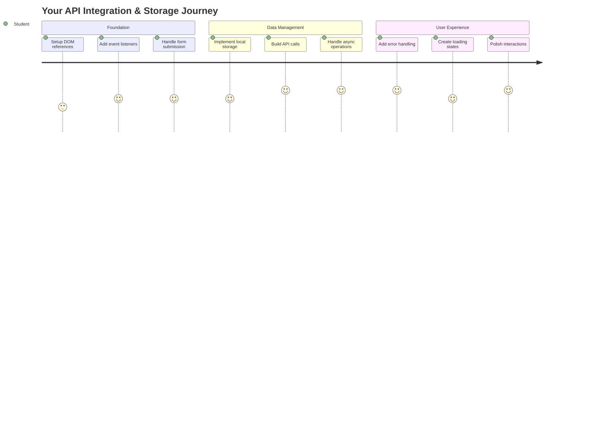
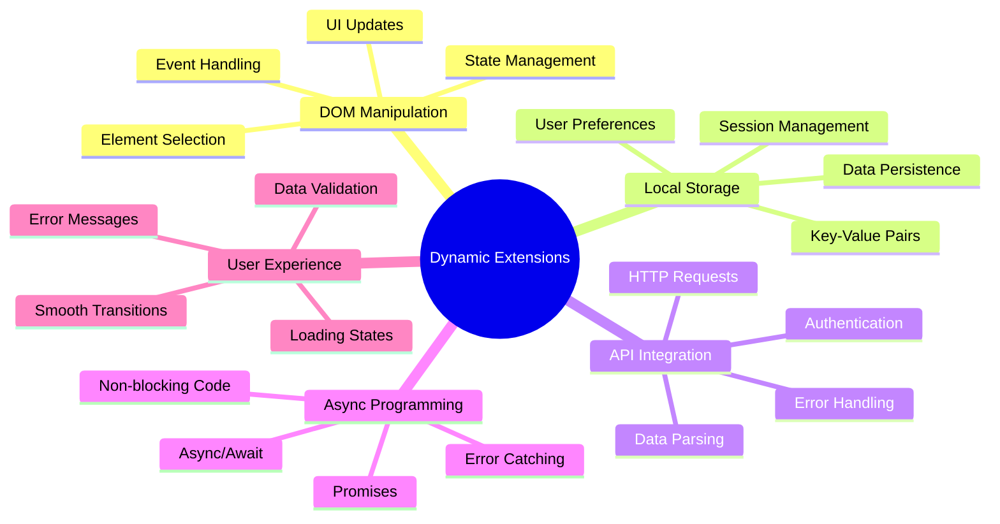
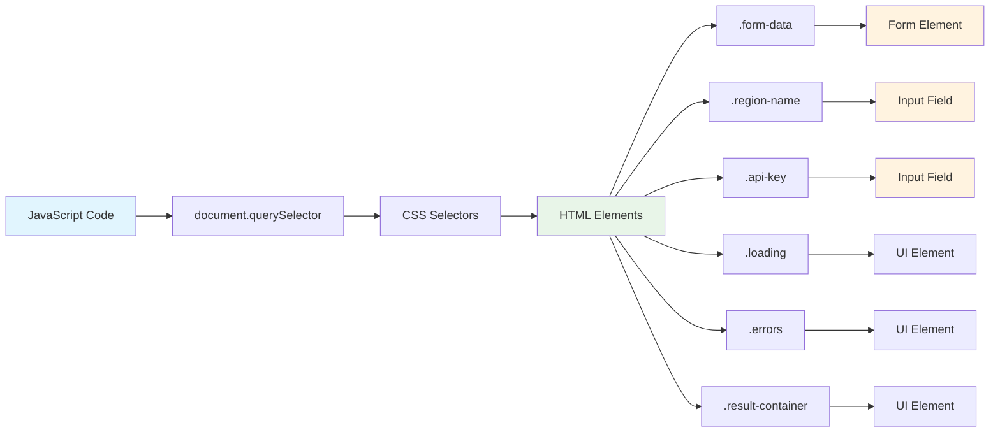
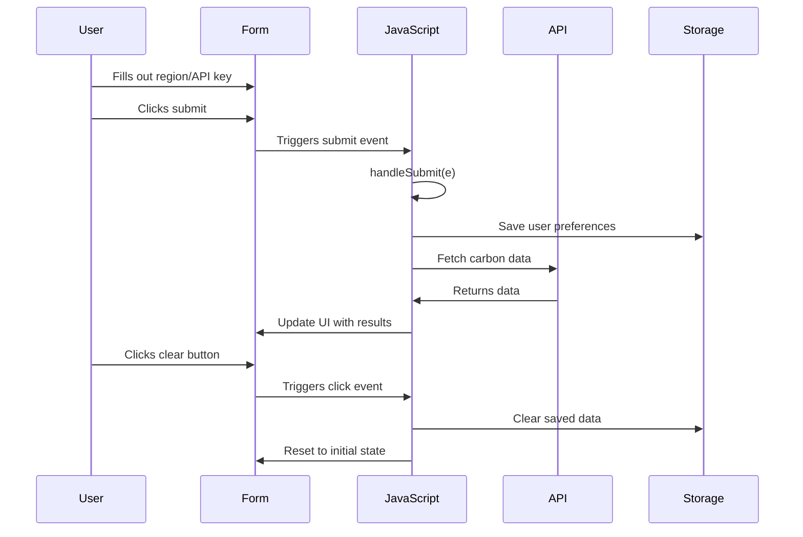
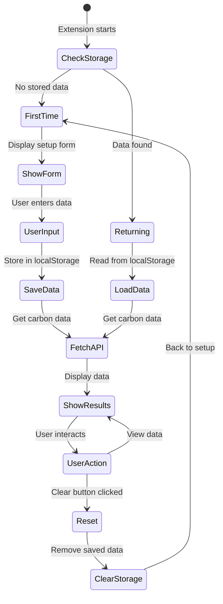
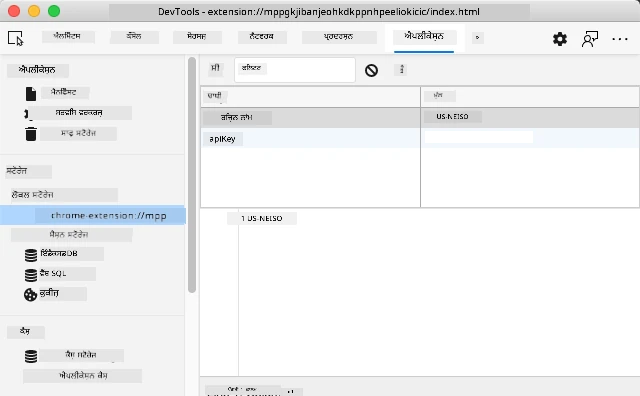
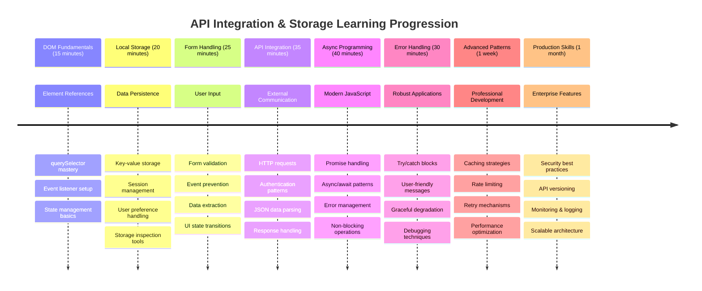

# ਬ੍ਰਾਊਜ਼ਰ ਐਕਸਟੈਂਸ਼ਨ ਪ੍ਰੋਜੈਕਟ ਭਾਗ 2: API ਕਾਲ ਕਰੋ, ਲੋਕਲ ਸਟੋਰੇਜ ਵਰਤੋ



## ਪੂਰਵ-ਵਿਦਿਆਰਥੀ ਕਵਿਜ਼

[ਪੂਰਵ-ਵਿਦਿਆਰਥੀ ਕਵਿਜ਼](https://ff-quizzes.netlify.app/web/quiz/25)

## ਪਰਿਚਯ

ਤੁਹਾਨੂੰ ਯਾਦ ਹੈ ਕਿ ਤੁਸੀਂ ਬ੍ਰਾਊਜ਼ਰ ਐਕਸਟੈਂਸ਼ਨ ਬਣਾਉਣ ਦੀ ਸ਼ੁਰੂਆਤ ਕੀਤੀ ਸੀ? ਇਸ ਸਮੇਂ ਤੁਹਾਡੇ ਕੋਲ ਇੱਕ ਸੁੰਦਰ ਫਾਰਮ ਹੈ, ਪਰ ਇਹ ਮੁੱਖ ਤੌਰ 'ਤੇ ਸਥਿਰ ਹੈ। ਅੱਜ ਅਸੀਂ ਇਸਨੂੰ ਹਕੀਕਤੀ ਡਾਟਾ ਨਾਲ ਜੋੜ ਕੇ ਅਤੇ ਇਸਨੂੰ ਯਾਦਸ਼ਕਤੀ ਦੇ ਕੇ ਜ਼ਿੰਦਾ ਕਰਾਂਗੇ।

ਅਪੋਲੋ ਮਿਸ਼ਨ ਕੰਟਰੋਲ ਕੰਪਿਊਟਰਾਂ ਬਾਰੇ ਸੋਚੋ - ਉਹ ਸਿਰਫ਼ ਸਥਿਰ ਜਾਣਕਾਰੀ ਨਹੀਂ ਦਿਖਾਉਂਦੇ ਸਨ। ਉਹ ਸਪੇਸਕ੍ਰਾਫਟ ਨਾਲ ਲਗਾਤਾਰ ਸੰਚਾਰ ਕਰਦੇ ਸਨ, ਟੈਲੀਮੇਟਰੀ ਡਾਟਾ ਨਾਲ ਅਪਡੇਟ ਹੁੰਦੇ ਸਨ, ਅਤੇ ਮਹੱਤਵਪੂਰਨ ਮਿਸ਼ਨ ਪੈਰਾਮੀਟਰਾਂ ਨੂੰ ਯਾਦ ਰੱਖਦੇ ਸਨ। ਅੱਜ ਅਸੀਂ ਇਸ ਤਰ੍ਹਾਂ ਦਾ ਗਤੀਸ਼ੀਲ ਵਿਹਾਰ ਬਣਾਉਣ ਜਾ ਰਹੇ ਹਾਂ। ਤੁਹਾਡਾ ਐਕਸਟੈਂਸ਼ਨ ਇੰਟਰਨੈਟ ਨਾਲ ਜੁੜੇਗਾ, ਹਕੀਕਤੀ ਵਾਤਾਵਰਣ ਡਾਟਾ ਲਵੇਗਾ, ਅਤੇ ਅਗਲੀ ਵਾਰ ਲਈ ਤੁਹਾਡੇ ਸੈਟਿੰਗਾਂ ਨੂੰ ਯਾਦ ਰੱਖੇਗਾ।

API ਇੰਟੀਗ੍ਰੇਸ਼ਨ ਮੁਸ਼ਕਲ ਲੱਗ ਸਕਦੀ ਹੈ, ਪਰ ਇਹ ਸਿਰਫ਼ ਤੁਹਾਡੇ ਕੋਡ ਨੂੰ ਹੋਰ ਸੇਵਾਵਾਂ ਨਾਲ ਸੰਚਾਰ ਕਰਨ ਦਾ ਸਿਖਾਉਣਾ ਹੈ। ਚਾਹੇ ਤੁਸੀਂ ਮੌਸਮ ਡਾਟਾ, ਸੋਸ਼ਲ ਮੀਡੀਆ ਫੀਡਸ, ਜਾਂ ਕਾਰਬਨ ਫੁੱਟਪ੍ਰਿੰਟ ਜਾਣਕਾਰੀ ਲੈ ਰਹੇ ਹੋ ਜਿਵੇਂ ਅਸੀਂ ਅੱਜ ਕਰਨ ਜਾ ਰਹੇ ਹਾਂ, ਇਹ ਸਾਰੇ ਡਿਜ਼ੀਟਲ ਕਨੈਕਸ਼ਨ ਸਥਾਪਤ ਕਰਨ ਬਾਰੇ ਹੈ। ਅਸੀਂ ਇਹ ਵੀ ਪੜ੍ਹਾਂਗੇ ਕਿ ਬ੍ਰਾਊਜ਼ਰ ਜਾਣਕਾਰੀ ਨੂੰ ਕਿਵੇਂ ਸਥਿਰ ਕਰ ਸਕਦੇ ਹਨ - ਜਿਵੇਂ ਲਾਇਬ੍ਰੇਰੀਆਂ ਨੇ ਕਿਤਾਬਾਂ ਦੇ ਸਥਾਨ ਨੂੰ ਯਾਦ ਰੱਖਣ ਲਈ ਕਾਰਡ ਕੈਟਾਲੌਗ ਵਰਤੇ ਹਨ।

ਇਸ ਪਾਠ ਦੇ ਅੰਤ ਤੱਕ, ਤੁਹਾਡੇ ਕੋਲ ਇੱਕ ਬ੍ਰਾਊਜ਼ਰ ਐਕਸਟੈਂਸ਼ਨ ਹੋਵੇਗਾ ਜੋ ਹਕੀਕਤੀ ਡਾਟਾ ਲੈਂਦਾ ਹੈ, ਯੂਜ਼ਰ ਪਸੰਦਾਂ ਨੂੰ ਸਟੋਰ ਕਰਦਾ ਹੈ, ਅਤੇ ਇੱਕ ਸੁਗਮ ਅਨੁਭਵ ਪ੍ਰਦਾਨ ਕਰਦਾ ਹੈ। ਚਲੋ ਸ਼ੁਰੂ ਕਰੀਏ!



✅ ਸਹੀ ਫਾਈਲਾਂ ਵਿੱਚ ਗਿਣਤੀ ਵਾਲੇ ਸੈਗਮੈਂਟਾਂ ਦੀ ਪਾਲਣਾ ਕਰੋ ਤਾਂ ਜੋ ਤੁਹਾਨੂੰ ਪਤਾ ਲੱਗੇ ਕਿ ਤੁਹਾਡਾ ਕੋਡ ਕਿੱਥੇ ਰੱਖਣਾ ਹੈ।

## ਐਕਸਟੈਂਸ਼ਨ ਵਿੱਚ ਤਬਦੀਲੀ ਕਰਨ ਲਈ ਤੱਤ ਸੈਟ ਕਰੋ

ਤੁਹਾਡਾ ਜਾਵਾਸਕ੍ਰਿਪਟ ਇੰਟਰਫੇਸ ਨੂੰ ਤਬਦੀਲ ਕਰਨ ਤੋਂ ਪਹਿਲਾਂ, ਇਸਨੂੰ ਖਾਸ HTML ਤੱਤਾਂ ਦੇ ਹਵਾਲੇ ਦੀ ਲੋੜ ਹੁੰਦੀ ਹੈ। ਇਸਨੂੰ ਇਸ ਤਰ੍ਹਾਂ ਸੋਚੋ ਜਿਵੇਂ ਇੱਕ ਦੂਰਬੀਨ ਨੂੰ ਖਾਸ ਤਾਰਿਆਂ ਵੱਲ ਇਸ਼ਾਰਾ ਕਰਨ ਦੀ ਲੋੜ ਹੁੰਦੀ ਹੈ - ਗੈਲੀਲਿਓ ਜੁਪਿਟਰ ਦੇ ਚੰਦਾਂ ਦਾ ਅਧਿਐਨ ਕਰਨ ਤੋਂ ਪਹਿਲਾਂ, ਉਸਨੂੰ ਜੁਪਿਟਰ ਨੂੰ ਲੱਭਣਾ ਅਤੇ ਇਸ 'ਤੇ ਧਿਆਨ ਕੇਂਦਰਿਤ ਕਰਨਾ ਪਿਆ।

ਤੁਹਾਡੇ `index.js` ਫਾਈਲ ਵਿੱਚ, ਅਸੀਂ `const` ਵੈਰੀਏਬਲ ਬਣਾਵਾਂਗੇ ਜੋ ਹਰ ਮਹੱਤਵਪੂਰਨ ਫਾਰਮ ਤੱਤ ਦੇ ਹਵਾਲੇ ਨੂੰ ਕੈਪਚਰ ਕਰਦੇ ਹਨ। ਇਹ ਉਸ ਤਰ੍ਹਾਂ ਹੈ ਜਿਵੇਂ ਵਿਗਿਆਨੀਆਂ ਆਪਣੇ ਸਾਜ਼ੋ-ਸਾਮਾਨ ਨੂੰ ਲੇਬਲ ਕਰਦੇ ਹਨ - ਹਰ ਵਾਰ ਪੂਰੇ ਲੈਬੋਰਟਰੀ ਵਿੱਚ ਖੋਜ ਕਰਨ ਦੀ ਬਜਾਏ, ਉਹ ਸਿੱਧੇ ਤੌਰ 'ਤੇ ਉਹਨਾਂ ਨੂੰ ਪਹੁੰਚ ਸਕਦੇ ਹਨ ਜੋ ਉਹਨਾਂ ਦੀ ਲੋੜ ਹੈ।



```javascript
// form fields
const form = document.querySelector('.form-data');
const region = document.querySelector('.region-name');
const apiKey = document.querySelector('.api-key');

// results
const errors = document.querySelector('.errors');
const loading = document.querySelector('.loading');
const results = document.querySelector('.result-container');
const usage = document.querySelector('.carbon-usage');
const fossilfuel = document.querySelector('.fossil-fuel');
const myregion = document.querySelector('.my-region');
const clearBtn = document.querySelector('.clear-btn');
```

**ਇਹ ਕੋਡ ਕੀ ਕਰਦਾ ਹੈ:**
- **ਕੈਪਚਰ ਕਰਦਾ ਹੈ** ਫਾਰਮ ਤੱਤਾਂ ਨੂੰ `document.querySelector()` ਨਾਲ CSS ਕਲਾਸ ਸਿਲੈਕਟਰਾਂ ਦੀ ਵਰਤੋਂ ਕਰਕੇ
- **ਬਣਾਉਂਦਾ ਹੈ** ਇਨਪੁਟ ਫੀਲਡਸ ਲਈ ਹਵਾਲੇ ਜਿਵੇਂ ਖੇਤਰ ਦਾ ਨਾਮ ਅਤੇ API ਕੁੰਜੀ
- **ਸਥਾਪਿਤ ਕਰਦਾ ਹੈ** ਕਾਰਬਨ ਵਰਤੋਂ ਡਾਟਾ ਲਈ ਨਤੀਜਾ ਡਿਸਪਲੇ ਤੱਤਾਂ ਨਾਲ ਕਨੈਕਸ਼ਨ
- **ਸੈਟ ਕਰਦਾ ਹੈ** UI ਤੱਤਾਂ ਲਈ ਪਹੁੰਚ ਜਿਵੇਂ ਲੋਡਿੰਗ ਇੰਡੀਕੇਟਰ ਅਤੇ ਗਲਤੀ ਸੁਨੇਹੇ
- **ਸਟੋਰ ਕਰਦਾ ਹੈ** ਹਰ ਤੱਤ ਹਵਾਲੇ ਨੂੰ `const` ਵੈਰੀਏਬਲ ਵਿੱਚ ਜੋ ਤੁਹਾਡੇ ਕੋਡ ਵਿੱਚ ਆਸਾਨ ਰੀਯੂਜ਼ ਲਈ ਹੈ

## ਇਵੈਂਟ ਲਿਸਨਰਜ਼ ਸ਼ਾਮਲ ਕਰੋ

ਹੁਣ ਅਸੀਂ ਤੁਹਾਡੇ ਐਕਸਟੈਂਸ਼ਨ ਨੂੰ ਯੂਜ਼ਰ ਦੀਆਂ ਕਾਰਵਾਈਆਂ ਦਾ ਜਵਾਬ ਦੇਣ ਲਈ ਬਣਾਵਾਂਗੇ। ਇਵੈਂਟ ਲਿਸਨਰਜ਼ ਤੁਹਾਡੇ ਕੋਡ ਦਾ ਯੂਜ਼ਰ ਇੰਟਰੈਕਸ਼ਨ ਦੀ ਨਿਗਰਾਨੀ ਕਰਨ ਦਾ ਤਰੀਕਾ ਹੈ। ਇਹਨਾਂ ਨੂੰ ਪਹਿਲੇ ਟੈਲੀਫੋਨ ਐਕਸਚੇਂਜ ਵਿੱਚ ਓਪਰੇਟਰਾਂ ਵਾਂਗ ਸੋਚੋ - ਉਹ ਆਉਣ ਵਾਲੀਆਂ ਕਾਲਾਂ ਲਈ ਸੁਣਦੇ ਸਨ ਅਤੇ ਜਦੋਂ ਕੋਈ ਕਨੈਕਸ਼ਨ ਬਣਾਉਣ ਦੀ ਇੱਛਾ ਕਰਦਾ ਸੀ ਤਾਂ ਸਹੀ ਸਰਕਟਸ ਨੂੰ ਜੋੜਦੇ ਸਨ।



```javascript
form.addEventListener('submit', (e) => handleSubmit(e));
clearBtn.addEventListener('click', (e) => reset(e));
init();
```

**ਇਹ ਸੰਕਲਪ ਸਮਝਣਾ:**
- **ਜੋੜਦਾ ਹੈ** ਇੱਕ ਸਬਮਿਟ ਲਿਸਨਰ ਫਾਰਮ ਨਾਲ ਜੋ ਯੂਜ਼ਰਜ਼ ਦੇ ਐਂਟਰ ਦਬਾਉਣ ਜਾਂ ਸਬਮਿਟ ਕਲਿਕ ਕਰਨ 'ਤੇ ਟ੍ਰਿਗਰ ਹੁੰਦਾ ਹੈ
- **ਜੋੜਦਾ ਹੈ** ਇੱਕ ਕਲਿਕ ਲਿਸਨਰ ਕਲੀਅਰ ਬਟਨ ਨਾਲ ਫਾਰਮ ਨੂੰ ਰੀਸੈਟ ਕਰਨ ਲਈ
- **ਪਾਸ ਕਰਦਾ ਹੈ** ਇਵੈਂਟ ਆਬਜੈਕਟ `(e)` ਹੈਂਡਲਰ ਫੰਕਸ਼ਨਜ਼ ਨੂੰ ਵਧੇਰੇ ਕੰਟਰੋਲ ਲਈ
- **ਕਾਲ ਕਰਦਾ ਹੈ** `init()` ਫੰਕਸ਼ਨ ਤੁਰੰਤ ਐਕਸਟੈਂਸ਼ਨ ਦੀ ਸ਼ੁਰੂਆਤੀ ਸਥਿਤੀ ਸੈਟ ਕਰਨ ਲਈ

✅ ਇੱਥੇ ਵਰਤੀ ਗਈ ਸ਼ਾਰਟਹੈਂਡ ਐਰੋ ਫੰਕਸ਼ਨ ਸਿੰਟੈਕਸ ਨੂੰ ਨੋਟ ਕਰੋ। ਇਹ ਆਧੁਨਿਕ ਜਾਵਾਸਕ੍ਰਿਪਟ ਪਹੁੰਚ ਪੁਰਾਣੇ ਫੰਕਸ਼ਨ ਐਕਸਪ੍ਰੈਸ਼ਨਜ਼ ਨਾਲੋਂ ਸਾਫ਼ ਹੈ, ਪਰ ਦੋਵੇਂ ਹੀ ਬਰਾਬਰ ਚੰਗੇ ਕੰਮ ਕਰਦੇ ਹਨ!

### 🔄 **ਪੈਡਾਗੌਜੀਕਲ ਚੈੱਕ-ਇਨ**
**ਇਵੈਂਟ ਹੈਂਡਲਿੰਗ ਸਮਝਣਾ**: ਸ਼ੁਰੂਆਤ ਕਰਨ ਤੋਂ ਪਹਿਲਾਂ ਯਕੀਨੀ ਬਣਾਓ ਕਿ ਤੁਸੀਂ ਸਮਝ ਸਕਦੇ ਹੋ:
- ✅ ਕਿਵੇਂ `addEventListener` ਯੂਜ਼ਰ ਦੀਆਂ ਕਾਰਵਾਈਆਂ ਨੂੰ ਜਾਵਾਸਕ੍ਰਿਪਟ ਫੰਕਸ਼ਨਜ਼ ਨਾਲ ਜੋੜਦਾ ਹੈ
- ✅ ਕਿਉਂ ਅਸੀਂ ਹੈਂਡਲਰ ਫੰਕਸ਼ਨਜ਼ ਨੂੰ ਇਵੈਂਟ ਆਬਜੈਕਟ `(e)` ਪਾਸ ਕਰਦੇ ਹਾਂ
- ✅ `submit` ਅਤੇ `click` ਇਵੈਂਟਸ ਵਿੱਚ ਅੰਤਰ ਪਛਾਣੋ
- ✅ `init()` ਫੰਕਸ਼ਨ ਕਦੋਂ ਚਲਦਾ ਹੈ ਅਤੇ ਕਿਉਂ

**ਤੁਰੰਤ ਸਵਾਲ-ਜਵਾਬ**: ਜੇ ਤੁਸੀਂ ਫਾਰਮ ਸਬਮਿਸ਼ਨ ਵਿੱਚ `e.preventDefault()` ਭੁੱਲ ਜਾਓ ਤਾਂ ਕੀ ਹੋਵੇਗਾ?
*ਜਵਾਬ: ਪੇਜ ਰੀਲੋਡ ਹੋ ਜਾਵੇਗਾ, ਸਾਰੇ ਜਾਵਾਸਕ੍ਰਿਪਟ ਸਥਿਤੀ ਖਤਮ ਹੋ ਜਾਵੇਗੀ ਅਤੇ ਯੂਜ਼ਰ ਅਨੁਭਵ ਵਿੱਚ ਰੁਕਾਵਟ ਆਵੇਗੀ*

## ਸ਼ੁਰੂਆਤ ਅਤੇ ਰੀਸੈਟ ਫੰਕਸ਼ਨ ਬਣਾਓ

ਆਓ ਤੁਹਾਡੇ ਐਕਸਟੈਂਸ਼ਨ ਲਈ ਸ਼ੁਰੂਆਤੀ ਤਰਕ ਬਣਾਈਏ। `init()` ਫੰਕਸ਼ਨ ਇੱਕ ਜਹਾਜ਼ ਦੇ ਨੈਵੀਗੇਸ਼ਨ ਸਿਸਟਮ ਵਾਂਗ ਹੈ ਜੋ ਆਪਣੇ ਸਾਜ਼ੋ-ਸਾਮਾਨ ਦੀ ਜਾਂਚ ਕਰਦਾ ਹੈ - ਇਹ ਮੌਜੂਦਾ ਸਥਿਤੀ ਦਾ ਨਿਰਧਾਰਨ ਕਰਦਾ ਹੈ ਅਤੇ ਇਸਦੇ ਅਨੁਸਾਰ ਇੰਟਰਫੇਸ ਨੂੰ ਸਮਰੂਪ ਕਰਦਾ ਹੈ। ਇਹ ਜਾਂਚਦਾ ਹੈ ਕਿ ਕਿਸੇ ਨੇ ਪਹਿਲਾਂ ਤੁਹਾਡੇ ਐਕਸਟੈਂਸ਼ਨ ਦੀ ਵਰਤੋਂ ਕੀਤੀ ਹੈ ਜਾਂ ਨਹੀਂ ਅਤੇ ਉਹਨਾਂ ਦੀਆਂ ਪਿਛਲੀ ਸੈਟਿੰਗਾਂ ਨੂੰ ਲੋਡ ਕਰਦਾ ਹੈ।

`reset()` ਫੰਕਸ਼ਨ ਯੂਜ਼ਰਜ਼ ਨੂੰ ਇੱਕ ਨਵਾਂ ਸ਼ੁਰੂਆਤ ਪ੍ਰਦਾਨ ਕਰਦਾ ਹੈ - ਜਿਵੇਂ ਵਿਗਿਆਨੀ ਆਪਣੇ ਸਾਜ਼ੋ-ਸਾਮਾਨ ਨੂੰ ਪ੍ਰਯੋਗਾਂ ਦੇ ਵਿਚਕਾਰ ਰੀਸੈਟ ਕਰਦੇ ਹਨ ਤਾਂ ਜੋ ਸਾਫ਼ ਡਾਟਾ ਯਕੀਨੀ ਬਣਾਇਆ ਜਾ ਸਕੇ।

```javascript
function init() {
	// Check if user has previously saved API credentials
	const storedApiKey = localStorage.getItem('apiKey');
	const storedRegion = localStorage.getItem('regionName');

	// Set extension icon to generic green (placeholder for future lesson)
	// TODO: Implement icon update in next lesson

	if (storedApiKey === null || storedRegion === null) {
		// First-time user: show the setup form
		form.style.display = 'block';
		results.style.display = 'none';
		loading.style.display = 'none';
		clearBtn.style.display = 'none';
		errors.textContent = '';
	} else {
		// Returning user: load their saved data automatically
		displayCarbonUsage(storedApiKey, storedRegion);
		results.style.display = 'none';
		form.style.display = 'none';
		clearBtn.style.display = 'block';
	}
}

function reset(e) {
	e.preventDefault();
	// Clear stored region to allow user to choose a new location
	localStorage.removeItem('regionName');
	// Restart the initialization process
	init();
}
```

**ਇੱਥੇ ਕੀ ਹੁੰਦਾ ਹੈ ਇਸਨੂੰ ਤੋੜ ਕੇ ਸਮਝਣਾ:**
- **ਰੀਟਰੀਵ ਕਰਦਾ ਹੈ** ਸਟੋਰ ਕੀਤੀ API ਕੁੰਜੀ ਅਤੇ ਖੇਤਰ ਨੂੰ ਬ੍ਰਾਊਜ਼ਰ ਦੇ ਲੋਕਲ ਸਟੋਰੇਜ ਤੋਂ
- **ਜਾਂਚਦਾ ਹੈ** ਕਿ ਇਹ ਪਹਿਲੀ ਵਾਰ ਦਾ ਯੂਜ਼ਰ ਹੈ (ਕੋਈ ਸਟੋਰ ਕੀਤੇ ਪ੍ਰਮਾਣ ਨਹੀਂ) ਜਾਂ ਵਾਪਸੀ ਕਰਨ ਵਾਲਾ ਯੂਜ਼ਰ
- **ਦਿਖਾਉਂਦਾ ਹੈ** ਨਵੇਂ ਯੂਜ਼ਰਜ਼ ਲਈ ਸੈਟਅੱਪ ਫਾਰਮ ਅਤੇ ਹੋਰ ਇੰਟਰਫੇਸ ਤੱਤਾਂ ਨੂੰ ਛੁਪਾਉਂਦਾ ਹੈ
- **ਆਟੋਮੈਟਿਕ ਲੋਡ ਕਰਦਾ ਹੈ** ਸਟੋਰ ਕੀਤੇ ਡਾਟਾ ਨੂੰ ਵਾਪਸੀ ਕਰਨ ਵਾਲੇ ਯੂਜ਼ਰਜ਼ ਲਈ ਅਤੇ ਰੀਸੈਟ ਵਿਕਲਪ ਦਿਖਾਉਂਦਾ ਹੈ
- **ਪ੍ਰਬੰਧ ਕਰਦਾ ਹੈ** ਉਪਲਬਧ ਡਾਟਾ ਦੇ ਅਧਾਰ 'ਤੇ ਯੂਜ਼ਰ ਇੰਟਰਫੇਸ ਸਥਿਤੀ

**ਲੋਕਲ ਸਟੋਰੇਜ ਬਾਰੇ ਮੁੱਖ ਸੰਕਲਪ:**
- **ਡਾਟਾ ਨੂੰ ਸਥਿਰ ਕਰਦਾ ਹੈ** ਬ੍ਰਾਊਜ਼ਰ ਸੈਸ਼ਨਜ਼ ਦੇ ਵਿਚਕਾਰ (ਸੈਸ਼ਨ ਸਟੋਰੇਜ ਦੇ ਵਿਰੁੱਧ)
- **ਡਾਟਾ ਨੂੰ ਸਟੋਰ ਕਰਦਾ ਹੈ** ਕੁੰਜੀ-ਮੁੱਲ ਜੋੜਿਆਂ ਦੇ ਰੂਪ ਵਿੱਚ `getItem()` ਅਤੇ `setItem()` ਦੀ ਵਰਤੋਂ ਕਰਕੇ
- **ਨਾਲ ਵਾਪਸ ਕਰਦਾ ਹੈ** `null` ਜਦੋਂ ਕਿਸੇ ਦਿੱਤੀ ਕੁੰਜੀ ਲਈ ਕੋਈ ਡਾਟਾ ਮੌਜੂਦ ਨਹੀਂ ਹੁੰਦਾ
- **ਪ੍ਰਦਾਨ ਕਰਦਾ ਹੈ** ਯੂਜ਼ਰ ਪਸੰਦਾਂ ਅਤੇ ਸੈਟਿੰਗਾਂ ਨੂੰ ਯਾਦ ਰੱਖਣ ਦਾ ਸਧਾਰਨ ਤਰੀਕਾ

> 💡 **ਬ੍ਰਾਊਜ਼ਰ ਸਟੋਰੇਜ ਨੂੰ ਸਮਝਣਾ**: [LocalStorage](https://developer.mozilla.org/docs/Web/API/Window/localStorage) ਤੁਹਾਡੇ ਐਕਸਟੈਂਸ਼ਨ ਨੂੰ ਸਥਿਰ ਯਾਦਸ਼ਕਤੀ ਦੇਣ ਵਾਂਗ ਹੈ। ਸੋਚੋ ਕਿ ਕਿਵੇਂ ਪ੍ਰਾਚੀਨ ਅਲੈਕਜ਼ੈਂਡਰੀਆ ਦੀ ਲਾਇਬ੍ਰੇਰੀ ਨੇ ਸਕਰੋਲਜ਼ ਨੂੰ ਸਟੋਰ ਕੀਤਾ - ਜਾਣਕਾਰੀ ਉਪਲਬਧ ਰਹੀ ਜਦੋਂ ਵਿਦਵਾਨ ਛੱਡ ਕੇ ਵਾਪਸ ਆਏ।
>
> **ਮੁੱਖ ਵਿਸ਼ੇਸ਼ਤਾਵਾਂ:**
> - **ਡਾਟਾ ਨੂੰ ਸਥਿਰ ਕਰਦਾ ਹੈ** ਭਾਵੇਂ ਤੁਸੀਂ ਆਪਣਾ ਬ੍ਰਾਊਜ਼ਰ ਬੰਦ ਕਰ ਦਿਓ
> - **ਕੰਪਿਊਟਰ ਰੀਸਟਾਰਟ ਅਤੇ ਬ੍ਰਾਊਜ਼ਰ ਕਰੈਸ਼ ਤੋਂ ਬਚਦਾ ਹੈ**
> - **ਯੂਜ਼ਰ ਪਸੰਦਾਂ ਲਈ ਵੱਡੀ ਸਟੋਰੇਜ ਸਪੇਸ ਪ੍ਰਦਾਨ ਕਰਦਾ ਹੈ**
> - **ਨੈਟਵਰਕ ਦੇਰੀ ਤੋਂ ਬਿਨਾਂ ਤੁਰੰਤ ਪਹੁੰਚ ਪ੍ਰਦਾਨ ਕਰਦਾ ਹੈ**

> **ਮਹੱਤਵਪੂਰਨ ਨੋਟ**: ਤੁਹਾਡੇ ਬ੍ਰਾਊਜ਼ਰ ਐਕਸਟੈਂਸ਼ਨ ਦਾ ਆਪਣਾ ਅਲੱਗ ਲੋਕਲ ਸਟੋਰੇਜ ਹੁੰਦਾ ਹੈ ਜੋ ਆਮ ਵੈਬ ਪੇਜਾਂ ਤੋਂ ਵੱਖਰਾ ਹੁੰਦਾ ਹੈ। ਇਹ ਸੁਰੱਖਿਆ ਪ੍ਰਦਾਨ ਕਰਦਾ ਹੈ ਅਤੇ ਹੋਰ ਵੈਬਸਾਈਟਾਂ ਨਾਲ ਟਕਰਾਅ ਨੂੰ ਰੋਕਦਾ ਹੈ।

ਤੁਹਾਡੇ ਸਟੋਰ ਕੀਤੇ ਡਾਟਾ ਨੂੰ ਦੇਖਣ ਲਈ ਬ੍ਰਾਊਜ਼ਰ ਡਿਵੈਲਪਰ ਟੂਲਜ਼ (F12) ਖੋਲ੍ਹੋ, **ਐਪਲੀਕੇਸ਼ਨ** ਟੈਬ 'ਤੇ ਜਾਓ, ਅਤੇ **ਲੋਕਲ ਸਟੋਰੇਜ** ਸੈਕਸ਼ਨ ਨੂੰ ਵਧਾਓ।





> ⚠️ **ਸੁਰੱਖਿਆ ਵਿਚਾਰ**: ਉਤਪਾਦਨ ਐਪਲੀਕੇਸ਼ਨਜ਼ ਵਿੱਚ, LocalStorage ਵਿੱਚ API ਕੁੰਜੀਆਂ ਨੂੰ ਸਟੋਰ ਕਰਨਾ ਸੁਰੱਖਿਆ ਖਤਰੇ ਪੈਦਾ ਕਰਦਾ ਹੈ ਕਿਉਂਕਿ ਜਾਵਾਸਕ੍ਰਿਪਟ ਇਸ ਡਾਟਾ ਤੱਕ ਪਹੁੰਚ ਕਰ ਸਕਦਾ ਹੈ। ਸਿੱਖਣ ਦੇ ਉਦੇਸ਼ਾਂ ਲਈ, ਇਹ ਪਹੁੰਚ ਠੀਕ ਹੈ, ਪਰ ਅਸਲ ਐਪਲੀਕੇਸ਼ਨਜ਼ ਨੂੰ ਸੰਵੇਦਨਸ਼ੀਲ ਪ੍ਰਮਾਣਾਂ ਲਈ ਸੁਰੱਖਿਅਤ ਸਰਵਰ-ਸਾਈਡ ਸਟੋਰੇਜ ਦੀ ਵਰਤੋਂ ਕਰਨੀ ਚਾਹੀਦੀ ਹੈ।

## ਫਾਰਮ ਸਬਮਿਸ਼ਨ ਨੂੰ ਹੈਂਡਲ ਕਰੋ

ਹੁਣ ਅਸੀਂ ਹੈਂਡਲ ਕਰਾਂਗੇ ਕਿ ਜਦੋਂ ਕੋਈ ਤੁਹਾਡਾ ਫਾਰਮ ਸਬਮਿਟ ਕਰਦਾ ਹੈ ਤਾਂ ਕੀ ਹੁੰਦਾ ਹੈ। ਡਿਫਾਲਟ ਤੌਰ 'ਤੇ, ਬ੍ਰਾਊਜ਼ਰ ਫਾਰਮ ਸਬਮਿਟ ਕੀਤੇ ਜਾਣ 'ਤੇ ਪੇਜ ਨੂੰ ਰੀਲੋਡ ਕਰਦੇ ਹਨ, ਪਰ ਅਸੀਂ ਇਸ ਵਿਹਾਰ ਨੂੰ ਰੋਕਾਂਗੇ ਤਾਂ ਜੋ ਇੱਕ ਸੁਗਮ ਅਨੁਭਵ ਬਣਾਇਆ ਜਾ ਸਕੇ।

ਇਹ ਪਹੁੰਚ ਉਸ ਤਰ੍ਹਾਂ ਹੈ ਜਿਵੇਂ ਮਿਸ਼ਨ ਕੰਟਰੋਲ ਸਪੇਸਕ੍ਰਾਫਟ ਸੰਚਾਰ ਨੂੰ ਹੈਂਡਲ ਕਰਦਾ ਹੈ - ਹਰ ਟ੍ਰਾਂਸਮਿਸ਼ਨ ਲਈ ਪੂਰੇ ਸਿਸਟਮ ਨੂੰ ਰੀਸੈਟ ਕਰਨ ਦੀ ਬਜਾਏ, ਉਹ ਨਵੀਂ ਜਾਣਕਾਰੀ ਨੂੰ ਪ੍ਰੋਸੈਸ ਕਰਦੇ ਹੋਏ ਲਗਾਤਾਰ ਕਾਰਵਾਈ ਜਾਰੀ ਰੱਖਦੇ ਹਨ।

ਇੱਕ ਫੰਕਸ਼ਨ ਬਣਾਓ ਜੋ ਫਾਰਮ ਸਬਮਿਸ਼ਨ ਇਵੈਂਟ ਨੂੰ ਕੈਪਚਰ ਕਰਦਾ ਹੈ ਅਤੇ ਯੂਜ਼ਰ ਦਾ ਇਨਪੁਟ ਕੱਢਦਾ ਹੈ:

```javascript
function handleSubmit(e) {
	e.preventDefault();
	setUpUser(apiKey.value, region.value);
}
```

**ਉਪਰੋਕਤ ਵਿੱਚ, ਅਸੀਂ:**
- **ਡਿਫਾਲਟ ਫਾਰਮ ਸਬਮਿਸ਼ਨ ਵਿਹਾਰ ਨੂੰ ਰੋਕਦਾ ਹੈ** ਜੋ ਪੇਜ ਨੂੰ ਰੀਫ੍ਰੈਸ਼ ਕਰਦਾ
- **ਯੂਜ਼ਰ ਇਨਪੁਟ ਮੁੱਲਾਂ ਨੂੰ ਕੈਪਚਰ ਕਰਦਾ ਹੈ** API ਕੁੰਜੀ ਅਤੇ ਖੇਤਰ ਫੀਲਡਸ ਤੋਂ
- **ਫਾਰਮ ਡਾਟਾ ਨੂੰ `setUpUser()` ਫੰਕਸ਼ਨ ਨੂੰ ਪਾਸ ਕਰਦਾ ਹੈ** ਪ੍ਰੋਸੈਸਿੰਗ ਲਈ
- **ਸਿੰਗਲ-ਪੇਜ ਐਪਲੀਕੇਸ਼ਨ ਵਿਹਾਰ ਨੂੰ ਸਥਿਰ ਰੱਖਦਾ ਹੈ** ਪੇਜ ਰੀਲੋਡ ਤੋਂ ਬਚ ਕੇ

✅ ਯਾਦ ਰੱਖੋ ਕਿ ਤੁਹਾਡੇ HTML ਫਾਰਮ ਫੀਲਡਸ ਵਿੱਚ `required` ਐਟ੍ਰਿਬਿਊਟ ਸ਼ਾਮਲ ਹੈ, ਇਸ ਲਈ ਬ੍ਰਾਊਜ਼ਰ ਆਟੋਮੈਟਿਕ ਤੌਰ 'ਤੇ ਯਕੀਨੀ ਬਣਾਉਂਦਾ ਹੈ ਕਿ ਯੂਜ਼ਰਜ਼ ਇਸ ਫੰਕਸ਼ਨ ਦੇ ਚਲਣ ਤੋਂ ਪਹਿਲਾਂ API ਕੁੰਜੀ ਅਤੇ ਖੇਤਰ ਦੋਵੇਂ ਪ੍ਰਦਾਨ ਕਰਦੇ ਹਨ।

## ਯੂਜ਼ਰ ਪਸੰਦਾਂ ਸੈਟ ਕਰੋ

`setUpUser` ਫੰਕਸ਼ਨ ਯੂਜ਼ਰ ਦੇ ਪ੍ਰਮਾਣਾਂ ਨੂੰ ਸਟੋਰ ਕਰਨ ਅਤੇ ਪਹਿਲੀ API ਕਾਲ ਸ਼ੁਰੂ ਕਰਨ ਲਈ ਜ਼ਿੰਮੇਵਾਰ ਹੈ। ਇਹ ਸੈਟਅੱਪ ਤੋਂ ਨਤੀਜੇ ਦਿਖਾਉਣ ਲਈ ਇੱਕ ਸੁਗਮ ਤਬਦੀਲੀ ਬਣਾਉਂਦਾ ਹੈ।

```javascript
function setUpUser(apiKey, regionName) {
	// Save user credentials for future sessions
	localStorage.setItem('apiKey', apiKey);
	localStorage.setItem('regionName', regionName);
	
	// Update UI to show loading state
	loading.style.display = 'block';
	errors.textContent = '';
	clearBtn.style.display = 'block';
	
	// Fetch carbon usage data with user's credentials
	displayCarbonUsage(apiKey, regionName);
}
```

**ਕਦਮ-ਦਰ-ਕਦਮ, ਇੱਥੇ ਕੀ ਹੋ ਰਿਹਾ ਹੈ:**
- **API ਕੁੰਜੀ ਅਤੇ ਖੇਤਰ ਦਾ ਨਾਮ ਸਟੋਰ ਕਰਦਾ ਹੈ** ਲੋਕਲ ਸਟੋਰੇਜ ਵਿੱਚ
**ਵੇਰਵਾ:** ਬ੍ਰਾਊਜ਼ਰ ਐਕਸਟੈਂਸ਼ਨ ਵਿੱਚ ਗਲਤੀ ਸੰਭਾਲਨ ਵਿੱਚ ਸੁਧਾਰ ਅਤੇ ਯੂਜ਼ਰ ਅਨੁਭਵ ਫੀਚਰ ਸ਼ਾਮਲ ਕਰਕੇ ਇਸਨੂੰ ਬਿਹਤਰ ਬਣਾਓ। ਇਹ ਚੁਣੌਤੀ ਤੁਹਾਨੂੰ APIs, ਸਥਾਨਕ ਸਟੋਰੇਜ, ਅਤੇ DOM ਮੈਨਿਪੂਲੇਸ਼ਨ 'ਤੇ ਆਧੁਨਿਕ ਜਾਵਾਸਕ੍ਰਿਪਟ ਪੈਟਰਨਾਂ ਦੀ ਵਰਤੋਂ ਕਰਨ ਦਾ ਅਭਿਆਸ ਕਰਨ ਵਿੱਚ ਮਦਦ ਕਰੇਗੀ।

**ਪ੍ਰੋੰਪਟ:** displayCarbonUsage ਫੰਕਸ਼ਨ ਦਾ ਇੱਕ ਬਿਹਤਰ ਸੰਸਕਰਣ ਬਣਾਓ ਜਿਸ ਵਿੱਚ ਸ਼ਾਮਲ ਹੋਵੇ: 1) API ਕਾਲਾਂ ਦੇ ਫੇਲ੍ਹ ਹੋਣ 'ਤੇ exponential backoff ਨਾਲ ਰੀਟ੍ਰਾਈ ਮਕੈਨਿਜ਼ਮ, 2) API ਕਾਲ ਕਰਨ ਤੋਂ ਪਹਿਲਾਂ ਰੀਜਨ ਕੋਡ ਲਈ ਇਨਪੁਟ ਵੈਲੀਡੇਸ਼ਨ, 3) ਲੋਡਿੰਗ ਐਨੀਮੇਸ਼ਨ ਨਾਲ ਪ੍ਰੋਗਰੈਸ ਇੰਡਿਕੇਟਰ, 4) localStorage ਵਿੱਚ API ਜਵਾਬਾਂ ਨੂੰ 30 ਮਿੰਟਾਂ ਲਈ ਮਿਆਦ ਸਮੇਤ ਕੈਸ਼ ਕਰਨਾ, ਅਤੇ 5) ਪਿਛਲੇ API ਕਾਲਾਂ ਤੋਂ ਇਤਿਹਾਸਕ ਡਾਟਾ ਦਿਖਾਉਣ ਦੀ ਵਿਸ਼ੇਸ਼ਤਾ। ਸਾਰੇ ਫੰਕਸ਼ਨ ਪੈਰਾਮੀਟਰ ਅਤੇ ਰਿਟਰਨ ਟਾਈਪਸ ਨੂੰ ਦਸਤਾਵੇਜ਼ ਕਰਨ ਲਈ TypeScript-ਸ਼ੈਲੀ JSDoc ਟਿੱਪਣੀਆਂ ਸ਼ਾਮਲ ਕਰੋ।

[agent mode](https://code.visualstudio.com/blogs/2025/02/24/introducing-copilot-agent-mode) ਬਾਰੇ ਹੋਰ ਜਾਣੋ।

## 🚀 ਚੁਣੌਤੀ

APIs ਦੀ ਸਮਝ ਨੂੰ ਵਧਾਉਣ ਲਈ ਵੈੱਬ ਵਿਕਾਸ ਲਈ ਉਪਲਬਧ ਬ੍ਰਾਊਜ਼ਰ-ਅਧਾਰਤ APIs ਦੀ ਖੋਜ ਕਰੋ। ਇਨ੍ਹਾਂ APIs ਵਿੱਚੋਂ ਇੱਕ ਚੁਣੋ ਅਤੇ ਇੱਕ ਛੋਟਾ ਡੈਮੋ ਬਣਾਓ:

- [Geolocation API](https://developer.mozilla.org/docs/Web/API/Geolocation_API) - ਯੂਜ਼ਰ ਦਾ ਮੌਜੂਦਾ ਸਥਾਨ ਪ੍ਰਾਪਤ ਕਰੋ
- [Notification API](https://developer.mozilla.org/docs/Web/API/Notifications_API) - ਡੈਸਕਟਾਪ ਨੋਟੀਫਿਕੇਸ਼ਨ ਭੇਜੋ
- [HTML Drag and Drop API](https://developer.mozilla.org/docs/Web/API/HTML_Drag_and_Drop_API) - ਇੰਟਰਐਕਟਿਵ ਡ੍ਰੈਗ ਇੰਟਰਫੇਸ ਬਣਾਓ
- [Web Storage API](https://developer.mozilla.org/docs/Web/API/Web_Storage_API) - ਸਥਾਨਕ ਸਟੋਰੇਜ ਤਕਨੀਕਾਂ
- [Fetch API](https://developer.mozilla.org/docs/Web/API/Fetch_API) - XMLHttpRequest ਦਾ ਆਧੁਨਿਕ ਵਿਕਲਪ

**ਖੋਜ ਦੇ ਸਵਾਲ:**  
- ਇਹ API ਕਿਹੜੀਆਂ ਅਸਲ ਦੁਨੀਆ ਦੀਆਂ ਸਮੱਸਿਆਵਾਂ ਦਾ ਹੱਲ ਦਿੰਦੀ ਹੈ?  
- API ਗਲਤੀਆਂ ਅਤੇ ਐਜ ਕੇਸਾਂ ਨੂੰ ਕਿਵੇਂ ਸੰਭਾਲਦੀ ਹੈ?  
- ਇਸ API ਨੂੰ ਵਰਤਣ ਸਮੇਂ ਕਿਹੜੀਆਂ ਸੁਰੱਖਿਆ ਸੰਬੰਧੀ ਚਿੰਤਾਵਾਂ ਹਨ?  
- ਇਹ API ਵੱਖ-ਵੱਖ ਬ੍ਰਾਊਜ਼ਰਾਂ ਵਿੱਚ ਕਿੰਨੀ ਵਿਆਪਕ ਹੈ?

ਖੋਜ ਦੇ ਬਾਅਦ, ਇਹ ਪਛਾਣੋ ਕਿ ਇੱਕ API ਨੂੰ ਡਿਵੈਲਪਰ-ਫ੍ਰੈਂਡਲੀ ਅਤੇ ਭਰੋਸੇਮੰਦ ਬਣਾਉਣ ਵਾਲੇ ਗੁਣ ਕੀ ਹਨ।

## ਪੋਸਟ-ਲੈਕਚਰ ਕਵਿਜ਼

[ਪੋਸਟ-ਲੈਕਚਰ ਕਵਿਜ਼](https://ff-quizzes.netlify.app/web/quiz/26)

## ਸਮੀਖਿਆ ਅਤੇ ਸਵੈ-ਅਧਿਐਨ

ਤੁਹਾਨੂੰ ਇਸ ਪਾਠ ਵਿੱਚ LocalStorage ਅਤੇ APIs ਬਾਰੇ ਸਿੱਖਣ ਨੂੰ ਮਿਲਿਆ, ਜੋ ਕਿ ਪੇਸ਼ੇਵਰ ਵੈੱਬ ਡਿਵੈਲਪਰ ਲਈ ਬਹੁਤ ਹੀ ਲਾਭਦਾਇਕ ਹਨ। ਕੀ ਤੁਸੀਂ ਸੋਚ ਸਕਦੇ ਹੋ ਕਿ ਇਹ ਦੋ ਚੀਜ਼ਾਂ ਇਕੱਠੇ ਕਿਵੇਂ ਕੰਮ ਕਰਦੀਆਂ ਹਨ? ਸੋਚੋ ਕਿ ਤੁਸੀਂ ਇੱਕ ਵੈੱਬਸਾਈਟ ਨੂੰ ਕਿਵੇਂ ਡਿਜ਼ਾਈਨ ਕਰੋਗੇ ਜੋ API ਦੁਆਰਾ ਵਰਤਣ ਲਈ ਆਈਟਮ ਸਟੋਰ ਕਰੇ।

### ⚡ **ਅਗਲੇ 5 ਮਿੰਟਾਂ ਵਿੱਚ ਤੁਸੀਂ ਕੀ ਕਰ ਸਕਦੇ ਹੋ**  
- [ ] DevTools ਦੇ Application ਟੈਬ ਨੂੰ ਖੋਲ੍ਹੋ ਅਤੇ ਕਿਸੇ ਵੀ ਵੈੱਬਸਾਈਟ 'ਤੇ localStorage ਦੀ ਜਾਂਚ ਕਰੋ  
- [ ] ਇੱਕ ਸਧਾਰਨ HTML ਫਾਰਮ ਬਣਾਓ ਅਤੇ ਬ੍ਰਾਊਜ਼ਰ ਵਿੱਚ ਫਾਰਮ ਵੈਲੀਡੇਸ਼ਨ ਦੀ ਜਾਂਚ ਕਰੋ  
- [ ] localStorage ਵਿੱਚ ਡਾਟਾ ਸਟੋਰ ਅਤੇ ਰੀਟ੍ਰੀਵ ਕਰਨ ਦੀ ਕੋਸ਼ਿਸ਼ ਕਰੋ  
- [ ] Network ਟੈਬ ਦੀ ਵਰਤੋਂ ਕਰਕੇ ਫਾਰਮ ਡਾਟਾ ਦੀ ਜਾਂਚ ਕਰੋ  

### 🎯 **ਇਸ ਘੰਟੇ ਵਿੱਚ ਤੁਸੀਂ ਕੀ ਹਾਸਲ ਕਰ ਸਕਦੇ ਹੋ**  
- [ ] ਪੋਸਟ-ਲੈਸਨ ਕਵਿਜ਼ ਪੂਰਾ ਕਰੋ ਅਤੇ ਫਾਰਮ ਹੈਂਡਲਿੰਗ ਸੰਕਲਪਾਂ ਨੂੰ ਸਮਝੋ  
- [ ] ਇੱਕ ਬ੍ਰਾਊਜ਼ਰ ਐਕਸਟੈਂਸ਼ਨ ਫਾਰਮ ਬਣਾਓ ਜੋ ਯੂਜ਼ਰ ਪਸੰਦਾਂ ਨੂੰ ਸੇਵ ਕਰਦਾ ਹੈ  
- [ ] ਕਲਾਇੰਟ-ਸਾਈਡ ਫਾਰਮ ਵੈਲੀਡੇਸ਼ਨ ਨੂੰ ਮਦਦਗਾਰ ਗਲਤੀ ਸੁਨੇਹਿਆਂ ਨਾਲ ਲਾਗੂ ਕਰੋ  
- [ ] ਐਕਸਟੈਂਸ਼ਨ ਡਾਟਾ ਸਟੋਰੇਜ ਲਈ chrome.storage API ਦੀ ਵਰਤੋਂ ਦਾ ਅਭਿਆਸ ਕਰੋ  
- [ ] ਇੱਕ ਯੂਜ਼ਰ ਇੰਟਰਫੇਸ ਬਣਾਓ ਜੋ ਸੇਵ ਕੀਤੇ ਯੂਜ਼ਰ ਸੈਟਿੰਗਾਂ ਨੂੰ ਪ੍ਰਤੀਕ੍ਰਿਆ ਦਿੰਦਾ ਹੈ  

### 📅 **ਤੁਹਾਡਾ ਹਫ਼ਤੇ-ਲੰਬਾ ਐਕਸਟੈਂਸ਼ਨ ਬਣਾਉਣ ਦਾ ਯੋਜਨਾ**  
- [ ] ਫਾਰਮ ਫੰਕਸ਼ਨਲਿਟੀ ਨਾਲ ਇੱਕ ਪੂਰੀ-ਫੀਚਰਡ ਬ੍ਰਾਊਜ਼ਰ ਐਕਸਟੈਂਸ਼ਨ ਪੂਰਾ ਕਰੋ  
- [ ] ਵੱਖ-ਵੱਖ ਸਟੋਰੇਜ ਵਿਕਲਪਾਂ: local, sync, ਅਤੇ session storage ਵਿੱਚ ਮਾਹਰ ਬਣੋ  
- [ ] autocomplete ਅਤੇ validation ਵਰਗੇ ਉੱਨਤ ਫਾਰਮ ਫੀਚਰ ਲਾਗੂ ਕਰੋ  
- [ ] ਯੂਜ਼ਰ ਡਾਟਾ ਲਈ import/export ਫੰਕਸ਼ਨਲਿਟੀ ਸ਼ਾਮਲ ਕਰੋ  
- [ ] ਵੱਖ-ਵੱਖ ਬ੍ਰਾਊਜ਼ਰਾਂ ਵਿੱਚ ਆਪਣੇ ਐਕਸਟੈਂਸ਼ਨ ਦੀ ਪੂਰੀ ਜਾਂਚ ਕਰੋ  
- [ ] ਆਪਣੇ ਐਕਸਟੈਂਸ਼ਨ ਦੇ ਯੂਜ਼ਰ ਅਨੁਭਵ ਅਤੇ ਗਲਤੀ ਸੰਭਾਲਨ ਨੂੰ ਪਾਲਿਸ਼ ਕਰੋ  

### 🌟 **ਤੁਹਾਡਾ ਮਹੀਨੇ-ਲੰਬਾ ਵੈੱਬ API ਮਾਹਰ ਬਣਾਉਣ ਦਾ ਯੋਜਨਾ**  
- [ ] ਵੱਖ-ਵੱਖ ਬ੍ਰਾਊਜ਼ਰ ਸਟੋਰੇਜ APIs ਦੀ ਵਰਤੋਂ ਕਰਕੇ ਜਟਿਲ ਐਪਲੀਕੇਸ਼ਨ ਬਣਾਓ  
- [ ] offline-first ਵਿਕਾਸ ਪੈਟਰਨਾਂ ਬਾਰੇ ਸਿੱਖੋ  
- [ ] ਡਾਟਾ ਸਟੋਰੇਜ ਵਿੱਚ ਸ਼ਾਮਲ ਖੁੱਲੇ ਸਰੋਤ ਪ੍ਰੋਜੈਕਟਾਂ ਵਿੱਚ ਯੋਗਦਾਨ ਪਾਓ  
- [ ] ਗੋਪਨੀਯਤਾ-ਕੇਂਦਰਿਤ ਵਿਕਾਸ ਅਤੇ GDPR ਅਨੁਕੂਲਤਾ ਵਿੱਚ ਮਾਹਰ ਬਣੋ  
- [ ] ਫਾਰਮ ਹੈਂਡਲਿੰਗ ਅਤੇ ਡਾਟਾ ਮੈਨੇਜਮੈਂਟ ਲਈ ਦੁਬਾਰਾ ਵਰਤਣਯੋਗ ਲਾਇਬ੍ਰੇਰੀਆਂ ਬਣਾਓ  
- [ ] ਵੈੱਬ APIs ਅਤੇ ਐਕਸਟੈਂਸ਼ਨ ਵਿਕਾਸ ਬਾਰੇ ਗਿਆਨ ਸਾਂਝਾ ਕਰੋ  

## 🎯 ਤੁਹਾਡਾ ਐਕਸਟੈਂਸ਼ਨ ਵਿਕਾਸ ਮਾਹਰ ਬਣਾਉਣ ਦਾ ਸਮਾਂ-ਰੇਖਾ  


  
### 🛠️ ਤੁਹਾਡਾ ਫੁੱਲ-ਸਟੈਕ ਵਿਕਾਸ ਟੂਲਕਿਟ ਸਾਰ

ਇਸ ਪਾਠ ਨੂੰ ਪੂਰਾ ਕਰਨ ਤੋਂ ਬਾਅਦ, ਤੁਹਾਡੇ ਕੋਲ ਹੁਣ ਹੈ:  
- **DOM ਮਾਹਰਤਾ**: ਸਹੀ ਤਰੀਕੇ ਨਾਲ ਐਲੀਮੈਂਟ ਟਾਰਗੇਟਿੰਗ ਅਤੇ ਮੈਨਿਪੂਲੇਸ਼ਨ  
- **ਸਟੋਰੇਜ ਮਾਹਰਤਾ**: localStorage ਨਾਲ ਸਥਾਈ ਡਾਟਾ ਮੈਨੇਜਮੈਂਟ  
- **API ਇੰਟੀਗ੍ਰੇਸ਼ਨ**: ਰੀਅਲ-ਟਾਈਮ ਡਾਟਾ ਫੈਚਿੰਗ ਅਤੇ ਪ੍ਰਮਾਣਿਕਤਾ  
- **Async ਪ੍ਰੋਗਰਾਮਿੰਗ**: ਆਧੁਨਿਕ ਜਾਵਾਸਕ੍ਰਿਪਟ ਨਾਲ non-blocking ਓਪਰੇਸ਼ਨ  
- **ਗਲਤੀ ਸੰਭਾਲਨ**: ਗਲਤੀਆਂ ਨੂੰ ਸੁਚਾਰੂ ਤਰੀਕੇ ਨਾਲ ਸੰਭਾਲਣ ਵਾਲੇ ਮਜ਼ਬੂਤ ਐਪਲੀਕੇਸ਼ਨ  
- **ਯੂਜ਼ਰ ਅਨੁਭਵ**: ਲੋਡਿੰਗ ਸਟੇਟਸ, ਵੈਲੀਡੇਸ਼ਨ, ਅਤੇ ਸੁਚਾਰੂ ਇੰਟਰੈਕਸ਼ਨ  
- **ਆਧੁਨਿਕ ਪੈਟਰਨ**: fetch API, async/await, ਅਤੇ ES6+ ਫੀਚਰ  

**ਪੇਸ਼ੇਵਰ ਹੁਨਰ ਪ੍ਰਾਪਤ ਕੀਤੇ:** ਤੁਸੀਂ ਇਨ੍ਹਾਂ ਪੈਟਰਨਾਂ ਨੂੰ ਲਾਗੂ ਕੀਤਾ ਹੈ:  
- **ਵੈੱਬ ਐਪਲੀਕੇਸ਼ਨ**: ਬਾਹਰੀ ਡਾਟਾ ਸਰੋਤਾਂ ਨਾਲ ਸਿੰਗਲ-ਪੇਜ ਐਪਸ  
- **ਮੋਬਾਈਲ ਵਿਕਾਸ**: API-ਚਲਿਤ ਐਪਸ ਜਿਨ੍ਹਾਂ ਵਿੱਚ offline ਸਮਰਥਨ ਹੈ  
- **ਡੈਸਕਟਾਪ ਸੌਫਟਵੇਅਰ**: Electron ਐਪਸ ਜਿਨ੍ਹਾਂ ਵਿੱਚ ਸਥਾਈ ਸਟੋਰੇਜ ਹੈ  
- **ਇੰਟਰਪ੍ਰਾਈਜ਼ ਸਿਸਟਮ**: ਪ੍ਰਮਾਣਿਕਤਾ, ਕੈਸ਼ਿੰਗ, ਅਤੇ ਗਲਤੀ ਸੰਭਾਲਨ  
- **ਆਧੁਨਿਕ ਫਰੇਮਵਰਕ**: React/Vue/Angular ਡਾਟਾ ਮੈਨੇਜਮੈਂਟ ਪੈਟਰਨ  

**ਅਗਲਾ ਪੱਧਰ:** ਤੁਸੀਂ ਉੱਨਤ ਵਿਸ਼ਿਆਂ ਦੀ ਖੋਜ ਕਰਨ ਲਈ ਤਿਆਰ ਹੋ, ਜਿਵੇਂ ਕਿ ਕੈਸ਼ਿੰਗ ਰਣਨੀਤੀਆਂ, ਰੀਅਲ-ਟਾਈਮ WebSocket ਕਨੈਕਸ਼ਨ, ਜਾਂ ਜਟਿਲ ਸਟੇਟ ਮੈਨੇਜਮੈਂਟ!

## ਅਸਾਈਨਮੈਂਟ

[Adopt an API](assignment.md)

---

**ਅਸਵੀਕਰਤਾ**:  
ਇਹ ਦਸਤਾਵੇਜ਼ AI ਅਨੁਵਾਦ ਸੇਵਾ [Co-op Translator](https://github.com/Azure/co-op-translator) ਦੀ ਵਰਤੋਂ ਕਰਕੇ ਅਨੁਵਾਦ ਕੀਤਾ ਗਿਆ ਹੈ। ਜਦੋਂ ਕਿ ਅਸੀਂ ਸਹੀ ਹੋਣ ਦਾ ਯਤਨ ਕਰਦੇ ਹਾਂ, ਕਿਰਪਾ ਕਰਕੇ ਧਿਆਨ ਦਿਓ ਕਿ ਸਵੈਚਾਲਿਤ ਅਨੁਵਾਦਾਂ ਵਿੱਚ ਗਲਤੀਆਂ ਜਾਂ ਅਸੁੱਤੀਆਂ ਹੋ ਸਕਦੀਆਂ ਹਨ। ਮੂਲ ਦਸਤਾਵੇਜ਼ ਨੂੰ ਇਸਦੀ ਮੂਲ ਭਾਸ਼ਾ ਵਿੱਚ ਅਧਿਕਾਰਤ ਸਰੋਤ ਮੰਨਿਆ ਜਾਣਾ ਚਾਹੀਦਾ ਹੈ। ਮਹੱਤਵਪੂਰਨ ਜਾਣਕਾਰੀ ਲਈ, ਪੇਸ਼ੇਵਰ ਮਨੁੱਖੀ ਅਨੁਵਾਦ ਦੀ ਸਿਫਾਰਸ਼ ਕੀਤੀ ਜਾਂਦੀ ਹੈ। ਇਸ ਅਨੁਵਾਦ ਦੀ ਵਰਤੋਂ ਤੋਂ ਪੈਦਾ ਹੋਣ ਵਾਲੇ ਕਿਸੇ ਵੀ ਗਲਤਫਹਿਮੀ ਜਾਂ ਗਲਤ ਵਿਆਖਿਆ ਲਈ ਅਸੀਂ ਜ਼ਿੰਮੇਵਾਰ ਨਹੀਂ ਹਾਂ।