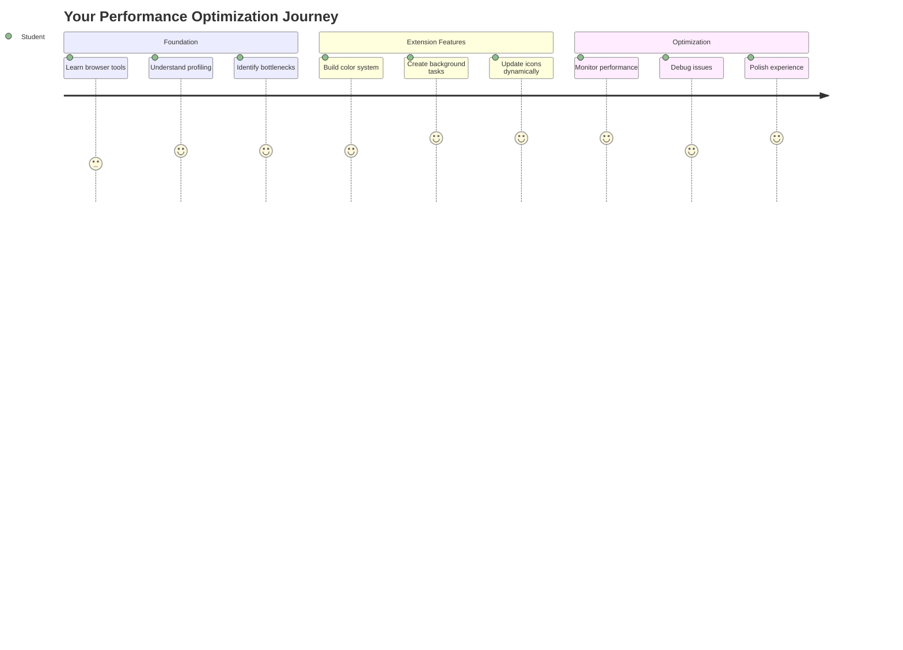
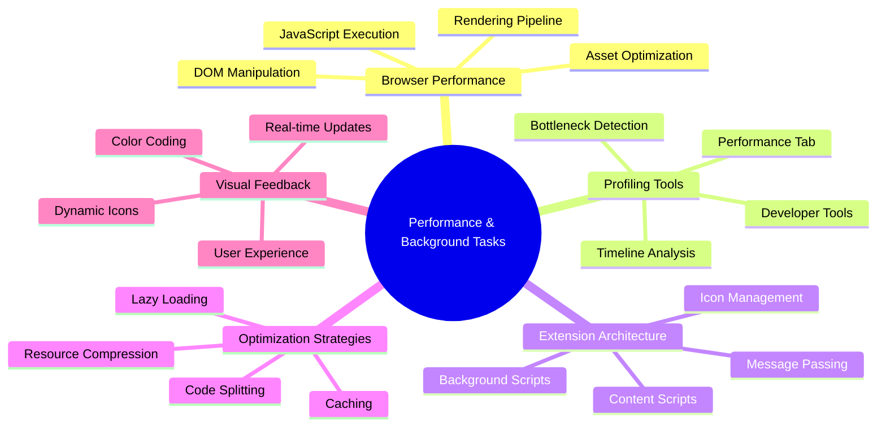
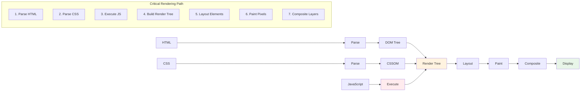
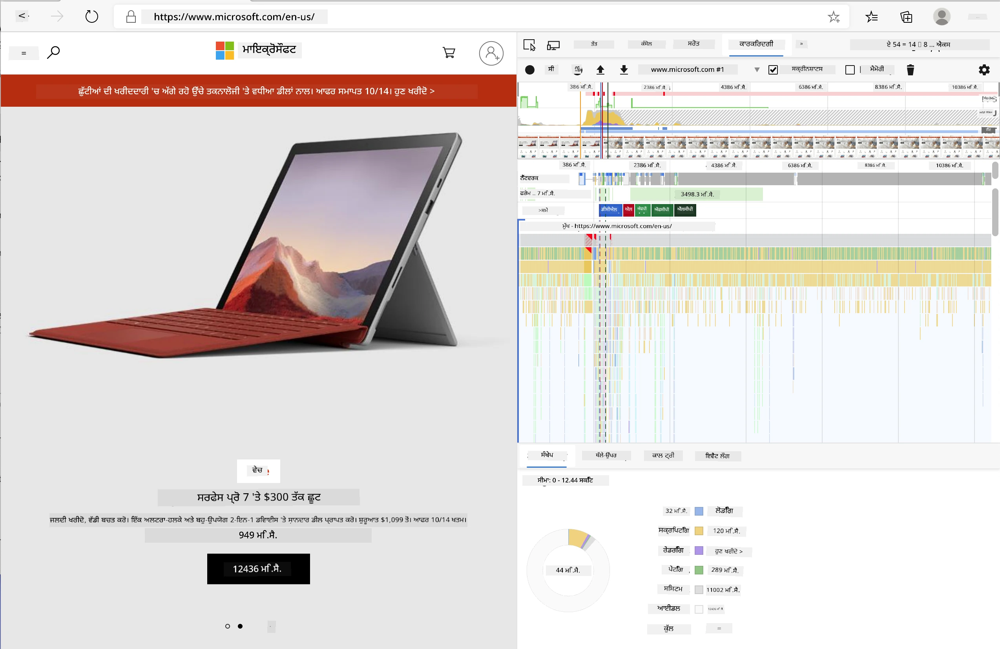
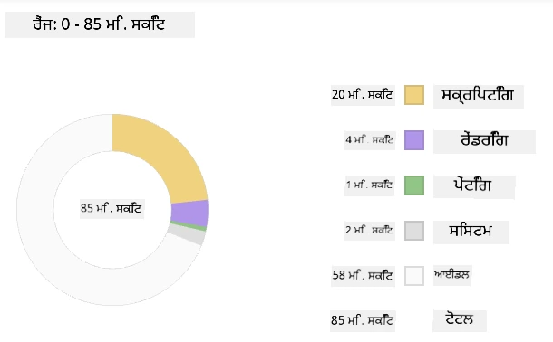
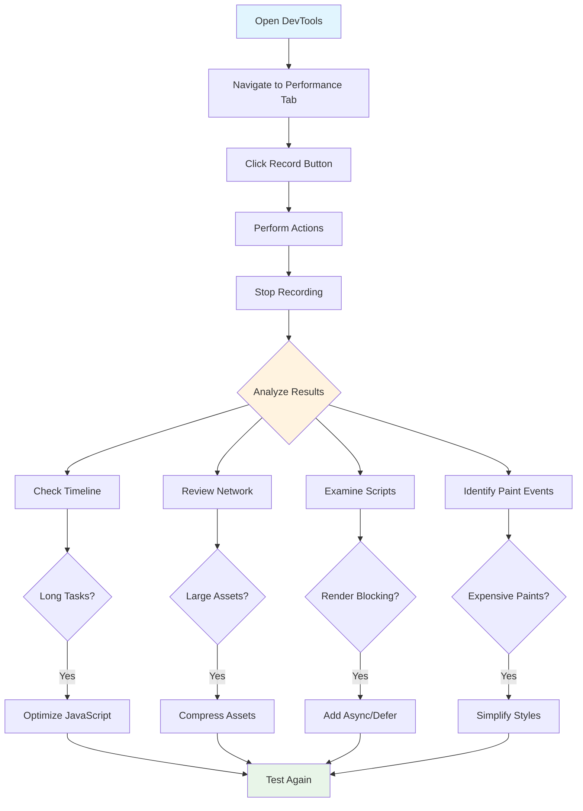
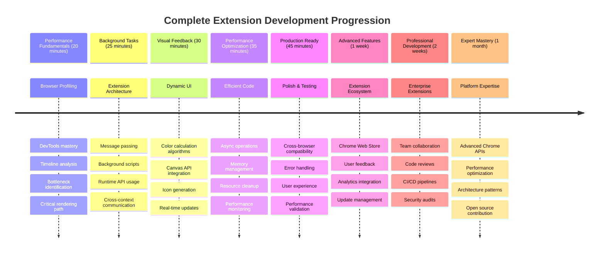

# ਬ੍ਰਾਊਜ਼ਰ ਐਕਸਟੈਂਸ਼ਨ ਪ੍ਰੋਜੈਕਟ ਭਾਗ 3: ਬੈਕਗ੍ਰਾਊਂਡ ਟਾਸਕ ਅਤੇ ਪ੍ਰਦਰਸ਼ਨ ਬਾਰੇ ਸਿੱਖੋ

ਕੀ ਤੁਸੀਂ ਕਦੇ ਸੋਚਿਆ ਹੈ ਕਿ ਕੁਝ ਬ੍ਰਾਊਜ਼ਰ ਐਕਸਟੈਂਸ਼ਨ ਕਿਵੇਂ ਤੇਜ਼ ਅਤੇ ਪ੍ਰਤੀਕ੍ਰਿਆਸ਼ੀਲ ਮਹਿਸੂਸ ਹੁੰਦੇ ਹਨ ਜਦੋਂ ਕਿ ਹੋਰ ਹੌਲੀ ਲੱਗਦੇ ਹਨ? ਇਸਦਾ ਰਾਜ਼ ਪਿੱਛੇ ਚੱਲ ਰਹੇ ਪ੍ਰਕਿਰਿਆਵਾਂ ਵਿੱਚ ਹੈ। ਜਦੋਂ ਵਰਤੋਂਕਾਰ ਤੁਹਾਡੇ ਐਕਸਟੈਂਸ਼ਨ ਦੇ ਇੰਟਰਫੇਸ 'ਤੇ ਕਲਿਕ ਕਰਦੇ ਹਨ, ਇੱਕ ਪੂਰੀ ਦੁਨੀਆ ਬੈਕਗ੍ਰਾਊਂਡ ਪ੍ਰਕਿਰਿਆਵਾਂ ਦੀ ਹੈ ਜੋ ਡਾਟਾ ਫੈਚਿੰਗ, ਆਈਕਨ ਅਪਡੇਟ ਅਤੇ ਸਿਸਟਮ ਰਿਸੋਰਸ ਨੂੰ ਚੁੱਪਚਾਪ ਸੰਭਾਲ ਰਹੀ ਹੈ।

ਇਹ ਬ੍ਰਾਊਜ਼ਰ ਐਕਸਟੈਂਸ਼ਨ ਸੀਰੀਜ਼ ਦਾ ਅੰਤਮ ਪਾਠ ਹੈ, ਅਤੇ ਅਸੀਂ ਤੁਹਾਡੇ ਕਾਰਬਨ ਫੁਟਪ੍ਰਿੰਟ ਟ੍ਰੈਕਰ ਨੂੰ ਸੁਚਾਰੂ ਤਰੀਕੇ ਨਾਲ ਚਲਾਉਣ ਵਾਲਾ ਬਣਾਉਣ ਜਾ ਰਹੇ ਹਾਂ। ਤੁਸੀਂ ਗਤੀਸ਼ੀਲ ਆਈਕਨ ਅਪਡੇਟ ਜੋੜੋਗੇ ਅਤੇ ਪ੍ਰਦਰਸ਼ਨ ਸਮੱਸਿਆਵਾਂ ਨੂੰ ਸਮਝਣ ਸਿੱਖੋਗੇ ਤਾਂ ਜੋ ਉਹ ਸਮੱਸਿਆਵਾਂ ਬਣਨ ਤੋਂ ਪਹਿਲਾਂ ਹੀ ਪਕੜੀ ਜਾ ਸਕਣ। ਇਹ ਇੱਕ ਰੇਸ ਕਾਰ ਨੂੰ ਟਿਊਨ ਕਰਨ ਵਰਗਾ ਹੈ - ਛੋਟੀਆਂ ਸੁਧਾਰਾਂ ਨਾਲ ਸਭ ਕੁਝ ਕਿਵੇਂ ਚਲਦਾ ਹੈ ਇਸ ਵਿੱਚ ਵੱਡਾ ਅੰਤਰ ਪੈ ਸਕਦਾ ਹੈ।

ਜਦੋਂ ਅਸੀਂ ਖਤਮ ਕਰਾਂਗੇ, ਤੁਹਾਡੇ ਕੋਲ ਇੱਕ ਪਾਲਿਸ਼ ਕੀਤਾ ਐਕਸਟੈਂਸ਼ਨ ਹੋਵੇਗਾ ਅਤੇ ਉਹ ਪ੍ਰਦਰਸ਼ਨ ਸਿਧਾਂਤ ਸਮਝ ਆਉਣਗੇ ਜੋ ਚੰਗੇ ਵੈੱਬ ਐਪਸ ਨੂੰ ਮਹਾਨ ਬਣਾਉਂਦੇ ਹਨ। ਆਓ ਬ੍ਰਾਊਜ਼ਰ ਅਪਟੀਮਾਈਜ਼ੇਸ਼ਨ ਦੀ ਦੁਨੀਆ ਵਿੱਚ ਡੁੱਬੀਏ।

## ਪਾਠ ਤੋਂ ਪਹਿਲਾਂ ਕਵਿਜ਼

[ਪਾਠ ਤੋਂ ਪਹਿਲਾਂ ਕਵਿਜ਼](https://ff-quizzes.netlify.app/web/quiz/27)

### ਪਰਿਚਯ

ਪਿਛਲੇ ਪਾਠਾਂ ਵਿੱਚ, ਤੁਸੀਂ ਇੱਕ ਫਾਰਮ ਬਣਾਇਆ, ਇਸਨੂੰ API ਨਾਲ ਜੋੜਿਆ, ਅਤੇ ਅਸਿੰਕ੍ਰੋਨਸ ਡਾਟਾ ਫੈਚਿੰਗ ਦਾ ਮੁਕਾਬਲਾ ਕੀਤਾ। ਤੁਹਾਡਾ ਐਕਸਟੈਂਸ਼ਨ ਚੰਗੇ ਤਰੀਕੇ ਨਾਲ ਰੂਪ ਲੈ ਰਿਹਾ ਹੈ।

ਹੁਣ ਅਸੀਂ ਅੰਤਮ ਛੋਹਾਂ ਜੋੜਣ ਦੀ ਲੋੜ ਹੈ - ਜਿਵੇਂ ਕਿ ਉਹ ਐਕਸਟੈਂਸ਼ਨ ਆਈਕਨ ਨੂੰ ਕਾਰਬਨ ਡਾਟਾ ਦੇ ਅਧਾਰ 'ਤੇ ਰੰਗ ਬਦਲਣ ਲਈ ਬਣਾਉਣਾ। ਇਹ ਮੈਨੂੰ ਯਾਦ ਦਿਵਾਉਂਦਾ ਹੈ ਕਿ NASA ਨੂੰ Apollo ਅੰਤਰਿਕਸ਼ ਜਹਾਜ਼ ਦੇ ਹਰ ਸਿਸਟਮ ਨੂੰ ਅਪਟੀਮਾਈਜ਼ ਕਰਨਾ ਪਿਆ। ਉਹ ਕੋਈ ਵੀ ਸਾਈਕਲ ਜਾਂ ਮੈਮਰੀ ਬਰਬਾਦ ਕਰਨ ਦਾ ਜੋਖਮ ਨਹੀਂ ਲੈ ਸਕਦੇ ਸਨ ਕਿਉਂਕਿ ਪ੍ਰਦਰਸ਼ਨ 'ਤੇ ਜ਼ਿੰਦਗੀਆਂ ਨਿਰਭਰ ਕਰਦੀਆਂ ਸਨ। ਜਦੋਂ ਕਿ ਸਾਡਾ ਬ੍ਰਾਊਜ਼ਰ ਐਕਸਟੈਂਸ਼ਨ ਇਸ ਕਦਰ ਮਹੱਤਵਪੂਰਨ ਨਹੀਂ ਹੈ, ਉਹੀ ਸਿਧਾਂਤ ਲਾਗੂ ਹੁੰਦੇ ਹਨ - ਕੁਸ਼ਲ ਕੋਡ ਚੰਗੇ ਵਰਤੋਂਕਾਰ ਅਨੁਭਵ ਬਣਾਉਂਦਾ ਹੈ।

## ਵੈੱਬ ਪ੍ਰਦਰਸ਼ਨ ਬੁਨਿਆਦੀਆਂ

ਜਦੋਂ ਤੁਹਾਡਾ ਕੋਡ ਕੁਸ਼ਲਤਾਪੂਰਵਕ ਚਲਦਾ ਹੈ, ਲੋਕ ਅਸਲ ਵਿੱਚ *ਅਹਿਸਾਸ* ਕਰ ਸਕਦੇ ਹਨ। ਤੁਸੀਂ ਉਹ ਪਲ ਜਾਣਦੇ ਹੋ ਜਦੋਂ ਇੱਕ ਪੇਜ ਤੁਰੰਤ ਲੋਡ ਹੁੰਦਾ ਹੈ ਜਾਂ ਇੱਕ ਐਨੀਮੇਸ਼ਨ ਸੁਚਾਰੂ ਤਰੀਕੇ ਨਾਲ ਚਲਦੀ ਹੈ? ਇਹ ਚੰਗੇ ਪ੍ਰਦਰਸ਼ਨ ਦਾ ਕੰਮ ਹੈ।

ਪ੍ਰਦਰਸ਼ਨ ਸਿਰਫ਼ ਗਤੀ ਬਾਰੇ ਨਹੀਂ ਹੈ - ਇਹ ਵੈੱਬ ਅਨੁਭਵਾਂ ਨੂੰ ਕੁਦਰਤੀ ਬਣਾਉਣ ਬਾਰੇ ਹੈ ਨਾ ਕਿ ਭਾਰੀ ਅਤੇ ਨਿਰਾਸ਼ਜਨਕ। ਕੰਪਿਊਟਿੰਗ ਦੇ ਸ਼ੁਰੂਆਤੀ ਦਿਨਾਂ ਵਿੱਚ, Grace Hopper ਨੇ ਆਪਣੇ ਡੈਸਕ 'ਤੇ ਇੱਕ ਨੈਨੋਸੈਕੰਡ (ਲਗਭਗ ਇੱਕ ਫੁੱਟ ਲੰਬੇ ਤਾਰ ਦਾ ਟੁਕੜਾ) ਰੱਖਿਆ ਸੀ ਤਾਂ ਜੋ ਦਿਖਾ ਸਕੇ ਕਿ ਰੋਸ਼ਨੀ ਇੱਕ ਬਿਲੀਅਨਵੇਂ ਸੈਕੰਡ ਵਿੱਚ ਕਿੰਨੀ ਦੂਰ ਜਾਂਦੀ ਹੈ। ਇਹ ਉਸਦਾ ਤਰੀਕਾ ਸੀ ਸਮਝਾਉਣ ਦਾ ਕਿ ਕੰਪਿਊਟਿੰਗ ਵਿੱਚ ਹਰ ਮਾਈਕ੍ਰੋਸੈਕੰਡ ਕਿਉਂ ਮਹੱਤਵਪੂਰਨ ਹੈ। ਆਓ ਉਹ ਜਾਸੂਸੀ ਟੂਲਜ਼ ਦੀ ਪੜਤਾਲ ਕਰੀਏ ਜੋ ਤੁਹਾਨੂੰ ਦਿਖਾਉਂਦੇ ਹਨ ਕਿ ਕੀ ਚੀਜ਼ਾਂ ਹੌਲੀ ਹੋ ਰਹੀਆਂ ਹਨ।

> "ਵੈੱਬਸਾਈਟ ਪ੍ਰਦਰਸ਼ਨ ਦੋ ਚੀਜ਼ਾਂ ਬਾਰੇ ਹੈ: ਪੇਜ ਕਿੰਨੀ ਤੇਜ਼ੀ ਨਾਲ ਲੋਡ ਹੁੰਦੀ ਹੈ, ਅਤੇ ਇਸ 'ਤੇ ਕੋਡ ਕਿੰਨੀ ਤੇਜ਼ੀ ਨਾਲ ਚਲਦਾ ਹੈ।" -- [Zack Grossbart](https://www.smashingmagazine.com/2012/06/javascript-profiling-chrome-developer-tools/)

ਤੁਹਾਡੇ ਵੈੱਬਸਾਈਟਾਂ ਨੂੰ ਹਰ ਕਿਸਮ ਦੇ ਉਪਕਰਣਾਂ 'ਤੇ, ਹਰ ਕਿਸਮ ਦੇ ਵਰਤੋਂਕਾਰਾਂ ਲਈ, ਹਰ ਕਿਸਮ ਦੇ ਹਾਲਾਤਾਂ ਵਿੱਚ ਬਹੁਤ ਤੇਜ਼ ਬਣਾਉਣ ਦੇ ਵਿਸ਼ੇ ਬਾਰੇ, ਹੈਰਾਨੀਜਨਕ ਤੌਰ 'ਤੇ, ਬਹੁਤ ਕੁਝ ਹੈ। ਜਦੋਂ ਤੁਸੀਂ ਇੱਕ ਸਧਾਰਨ ਵੈੱਬ ਪ੍ਰੋਜੈਕਟ ਜਾਂ ਬ੍ਰਾਊਜ਼ਰ ਐਕਸਟੈਂਸ਼ਨ ਬਣਾਉਂਦੇ ਹੋ ਤਾਂ ਕੁਝ ਗੱਲਾਂ ਨੂੰ ਯਾਦ ਰੱਖਣਾ ਚਾਹੀਦਾ ਹੈ।

ਤੁਹਾਡੇ ਸਾਈਟ ਨੂੰ ਅਪਟੀਮਾਈਜ਼ ਕਰਨ ਦਾ ਪਹਿਲਾ ਕਦਮ ਇਹ ਸਮਝਣਾ ਹੈ ਕਿ ਅਸਲ ਵਿੱਚ ਹੇਠਾਂ ਕੀ ਹੋ ਰਿਹਾ ਹੈ। ਖੁਸ਼ਕਿਸਮਤੀ ਨਾਲ, ਤੁਹਾਡੇ ਬ੍ਰਾਊਜ਼ਰ ਵਿੱਚ ਸ਼ਕਤੀਸ਼ਾਲੀ ਜਾਸੂਸੀ ਟੂਲਜ਼ ਪਹਿਲਾਂ ਹੀ ਸ਼ਾਮਲ ਹਨ।

Edge ਵਿੱਚ Developer Tools ਖੋਲ੍ਹਣ ਲਈ, ਉੱਪਰ ਸੱਜੇ ਕੋਨੇ ਵਿੱਚ ਉਹ ਤਿੰਨ ਬਿੰਦੂਆਂ 'ਤੇ ਕਲਿਕ ਕਰੋ, ਫਿਰ More Tools > Developer Tools 'ਤੇ ਜਾਓ। ਜਾਂ ਕੀਬੋਰਡ ਸ਼ਾਰਟਕੱਟ ਵਰਤੋ: Windows 'ਤੇ `Ctrl` + `Shift` + `I` ਜਾਂ Mac 'ਤੇ `Option` + `Command` + `I`। ਜਦੋਂ ਤੁਸੀਂ ਉੱਥੇ ਹੋ, Performance ਟੈਬ 'ਤੇ ਕਲਿਕ ਕਰੋ - ਇਹ ਉਹ ਜਗ੍ਹਾ ਹੈ ਜਿੱਥੇ ਤੁਸੀਂ ਆਪਣੀ ਜਾਂਚ ਕਰੋਗੇ।

**ਇਹ ਹੈ ਤੁਹਾਡਾ ਪ੍ਰਦਰਸ਼ਨ ਜਾਸੂਸੀ ਟੂਲਕਿਟ:**
- **Developer Tools ਖੋਲ੍ਹੋ** (ਤੁਸੀਂ ਇਹਨਾਂ ਨੂੰ ਇੱਕ ਡਿਵੈਲਪਰ ਵਜੋਂ ਲਗਾਤਾਰ ਵਰਤੋਂਗੇ!)
- **Performance ਟੈਬ 'ਤੇ ਜਾਓ** - ਇਸਨੂੰ ਆਪਣੇ ਵੈੱਬ ਐਪ ਦਾ ਫਿਟਨੈਸ ਟ੍ਰੈਕਰ ਸਮਝੋ
- **Record ਬਟਨ ਦਬਾਓ** ਅਤੇ ਆਪਣੀ ਪੇਜ ਦੀ ਕਾਰਵਾਈ ਦੇਖੋ
- **ਨਤੀਜੇ ਪੜ੍ਹੋ** ਤਾਂ ਜੋ ਪਤਾ ਲੱਗੇ ਕਿ ਕੀ ਚੀਜ਼ਾਂ ਹੌਲੀ ਹੋ ਰਹੀਆਂ ਹਨ

ਆਓ ਇਸਨੂੰ ਅਜ਼ਮਾਈਏ। ਇੱਕ ਵੈੱਬਸਾਈਟ ਖੋਲ੍ਹੋ (Microsoft.com ਇਸ ਲਈ ਚੰਗੀ ਹੈ) ਅਤੇ 'Record' ਬਟਨ 'ਤੇ ਕਲਿਕ ਕਰੋ। ਹੁਣ ਪੇਜ ਨੂੰ ਰੀਫ੍ਰੈਸ਼ ਕਰੋ ਅਤੇ ਪ੍ਰੋਫਾਈਲਰ ਨੂੰ ਜੋ ਕੁਝ ਵੀ ਹੁੰਦਾ ਹੈ ਉਸਨੂੰ ਕੈਪਚਰ ਕਰਦੇ ਦੇਖੋ। ਜਦੋਂ ਤੁਸੀਂ ਰਿਕਾਰਡਿੰਗ ਰੋਕਦੇ ਹੋ, ਤੁਹਾਨੂੰ ਇਹ ਦੇਖਣ ਨੂੰ ਮਿਲੇਗਾ ਕਿ ਬ੍ਰਾਊਜ਼ਰ 'ਸਕ੍ਰਿਪਟ', 'ਰੈਂਡਰ' ਅਤੇ 'ਪੇਂਟ' ਸਾਈਟ ਨੂੰ ਕਿਵੇਂ ਤਿਆਰ ਕਰਦਾ ਹੈ। ਇਹ ਮੈਨੂੰ ਯਾਦ ਦਿਵਾਉਂਦਾ ਹੈ ਕਿ ਮਿਸ਼ਨ ਕੰਟਰੋਲ ਰਾਕਟ ਲਾਂਚ ਦੌਰਾਨ ਹਰ ਸਿਸਟਮ ਦੀ ਨਿਗਰਾਨੀ ਕਰਦਾ ਹੈ - ਤੁਹਾਨੂੰ ਇਹ ਪਤਾ ਲੱਗਦਾ ਹੈ ਕਿ ਅਸਲ ਵਿੱਚ ਕੀ ਹੋ ਰਿਹਾ ਹੈ ਅਤੇ ਕਦੋਂ।

✅ [Microsoft Documentation](https://docs.microsoft.com/microsoft-edge/devtools-guide/performance/?WT.mc_id=academic-77807-sagibbon) ਵਿੱਚ ਹੋਰ ਬਹੁਤ ਸਾਰੇ ਵੇਰਵੇ ਹਨ ਜੇ ਤੁਸੀਂ ਹੋਰ ਡੂੰਘਾਈ ਵਿੱਚ ਜਾਣਾ ਚਾਹੁੰਦੇ ਹੋ

> ਪ੍ਰੋ ਟਿਪ: ਟੈਸਟ ਕਰਨ ਤੋਂ ਪਹਿਲਾਂ ਆਪਣਾ ਬ੍ਰਾਊਜ਼ਰ ਕੈਸ਼ ਸਾਫ਼ ਕਰੋ ਤਾਂ ਜੋ ਦੇਖਿਆ ਜਾ ਸਕੇ ਕਿ ਤੁਹਾਡੀ ਸਾਈਟ ਪਹਿਲੀ ਵਾਰ ਦੇਖਣ ਵਾਲੇ ਲਈ ਕਿਵੇਂ ਪ੍ਰਦਰਸ਼ਨ ਕਰਦੀ ਹੈ - ਇਹ ਆਮ ਤੌਰ 'ਤੇ ਦੁਬਾਰਾ ਦੌਰੇ ਤੋਂ ਬਹੁਤ ਵੱਖਰੀ ਹੁੰਦੀ ਹੈ!

ਪ੍ਰੋਫਾਈਲ ਟਾਈਮਲਾਈਨ ਦੇ ਤੱਤਾਂ ਨੂੰ ਚੁਣੋ ਤਾਂ ਜੋ ਉਹ ਘਟਨਾਵਾਂ ਦੇਖ ਸਕੋ ਜੋ ਤੁਹਾਡੀ ਪੇਜ ਲੋਡ ਹੋਣ ਦੌਰਾਨ ਹੁੰਦੀਆਂ ਹਨ।

ਪ੍ਰੋਫਾਈਲ ਟਾਈਮਲਾਈਨ ਦੇ ਇੱਕ ਹਿੱਸੇ ਨੂੰ ਚੁਣ ਕੇ ਅਤੇ ਸਾਰਾਂ ਪੈਨ ਦੇਖ ਕੇ ਆਪਣੀ ਪੇਜ ਦੇ ਪ੍ਰਦਰਸ਼ਨ ਦੀ ਇੱਕ ਝਲਕ ਪ੍ਰਾਪਤ ਕਰੋ:

Event Log ਪੈਨ ਦੀ ਜਾਂਚ ਕਰੋ ਤਾਂ ਜੋ ਦੇਖਿਆ ਜਾ ਸਕੇ ਕਿ ਕੋਈ ਘਟਨਾ 15 ms ਤੋਂ ਵੱਧ ਸਮਾਂ ਲੈਂਦੀ ਹੈ:

✅ ਆਪਣੇ ਪ੍ਰੋਫਾਈਲਰ ਨੂੰ ਜਾਣੋ! ਇਸ ਸਾਈਟ 'ਤੇ ਡਿਵੈਲਪਰ ਟੂਲਜ਼ ਖੋਲ੍ਹੋ ਅਤੇ ਦੇਖੋ ਕਿ ਕੋਈ ਬੋਤਲਨੈਕ ਹੈ। ਸਭ ਤੋਂ ਹੌਲੀ ਲੋਡ ਹੋਣ ਵਾਲਾ ਐਸੈਟ ਕਿਹੜਾ ਹੈ? ਸਭ ਤੋਂ ਤੇਜ਼?

## ਪ੍ਰੋਫਾਈਲਿੰਗ ਕਰਦੇ ਸਮੇਂ ਕੀ ਦੇਖਣਾ ਹੈ

ਪ੍ਰੋਫਾਈਲਰ ਚਲਾਉਣਾ ਸਿਰਫ਼ ਸ਼ੁਰੂਆਤ ਹੈ - ਅਸਲ ਹੁਨਰ ਇਹ ਜਾਣਨਾ ਹੈ ਕਿ ਉਹ ਰੰਗੀਨ ਚਾਰਟ ਤੁਹਾਨੂੰ ਅਸਲ ਵਿੱਚ ਕੀ ਦੱਸ ਰਹੇ ਹਨ। ਚਿੰਤਾ ਨਾ ਕਰੋ, ਤੁਸੀਂ ਇਹਨਾਂ ਨੂੰ ਪੜ੍ਹਨ ਦਾ ਤਰੀਕਾ ਸਿੱਖ ਲਵੋਗੇ। ਅਨੁਭਵੀ ਡਿਵੈਲਪਰਾਂ ਨੇ ਪੂਰੀ ਸਮੱਸਿਆ ਬਣਨ ਤੋਂ ਪਹਿਲਾਂ ਚੇਤਾਵਨੀ ਦੇ ਸੰਕੇਤਾਂ ਨੂੰ ਪਛਾਣਨਾ ਸਿੱਖ ਲਿਆ ਹੈ।

ਆਓ ਆਮ ਦੋਸ਼ੀਆਂ ਬਾਰੇ ਗੱਲ ਕਰੀਏ - ਉਹ ਪ੍ਰਦਰਸ਼ਨ ਸਮੱਸਿਆਵਾਂ ਜੋ ਵੈੱਬ ਪ੍ਰੋਜੈਕਟਾਂ ਵਿੱਚ ਆਮ ਤੌਰ 'ਤੇ ਚੁਪਕੇ ਨਾਲ ਆ ਜਾਂਦੀਆਂ ਹਨ। ਜਿਵੇਂ Marie Curie ਨੂੰ ਆਪਣੇ ਲੈਬ ਵਿੱਚ ਰੇਡੀਏਸ਼ਨ ਪੱਧਰ ਦੀ ਸਾਵਧਾਨੀ ਨਾਲ ਨਿਗਰਾਨੀ ਕਰਨੀ ਪਈ, ਸਾਨੂੰ ਕੁਝ ਪੈਟਰਨਾਂ ਦੇਖਣ ਦੀ ਲੋੜ ਹੈ ਜੋ ਸਮੱਸਿਆਵਾਂ ਦੇ ਪੈਦਾ ਹੋਣ ਦਾ ਸੰਕੇਤ ਦਿੰਦੇ ਹਨ। ਇਹਨਾਂ ਨੂੰ ਜਲਦੀ ਪਕੜਨਾ ਤੁਹਾਨੂੰ (ਅਤੇ ਤੁਹਾਡੇ ਵਰਤੋਂਕਾਰਾਂ ਨੂੰ) ਬਹੁਤ ਸਾਰੀ ਨਿਰਾਸ਼ਾ ਤੋਂ ਬਚਾ ਸਕਦਾ ਹੈ।

**ਐਸੈਟ ਸਾਈਜ਼**: ਵੈੱਬਸਾਈਟਾਂ ਸਾਲਾਂ ਤੋਂ "ਭਾਰੀ" ਹੋ ਰਹੀਆਂ ਹਨ, ਅਤੇ ਇਸ ਵਾਧੇ ਦਾ ਬਹੁਤ ਸਾਰਾ ਭਾਰ ਚਿੱਤਰਾਂ ਤੋਂ ਆ ਰਿਹਾ ਹੈ। ਇਹ ਇਸ ਤਰ੍ਹਾਂ ਹੈ ਕਿ ਅਸੀਂ ਆਪਣੇ ਡਿਜੀਟਲ ਸੂਟਕੇਸਾਂ ਵਿੱਚ ਹੋਰ ਅਤੇ ਹੋਰ ਭਰ ਰਹੇ ਹਾਂ।

✅ [Internet Archive](https://httparchive.org/reports/page-weight) 'ਤੇ ਜਾਂਚ ਕਰੋ ਕਿ ਪੇਜ ਸਾਈਜ਼ ਕਿਵੇਂ ਸਮੇਂ ਦੇ ਨਾਲ ਵਧੇ ਹਨ - ਇਹ ਕਾਫ਼ੀ ਖੁਲਾਸਾ ਕਰਨ ਵਾਲਾ ਹੈ।

**ਆਪਣੇ ਐਸੈਟਾਂ ਨੂੰ ਅਪਟੀਮਾਈਜ਼ ਕਰਨ ਦੇ ਤਰੀਕੇ:**
- **ਚਿੱਤਰਾਂ ਨੂੰ ਕੰਪ੍ਰੈਸ ਕਰੋ**! ਆਧੁਨਿਕ ਫਾਰਮੈਟ ਜਿਵੇਂ WebP ਫਾਈਲ ਸਾਈਜ਼ ਨੂੰ ਨਾਟਕੀ ਤਰੀਕੇ ਨਾਲ ਘਟਾ ਸਕਦੇ ਹਨ
- **ਹਰ ਉਪਕਰਣ ਲਈ ਸਹੀ ਚਿੱਤਰ ਸਾਈਜ਼ ਸੇਵਾ ਕਰੋ** - ਫੋਨਾਂ ਨੂੰ ਵੱਡੇ ਡੈਸਕਟਾਪ ਚਿੱਤਰ ਭੇਜਣ ਦੀ ਲੋੜ ਨਹੀਂ ਹੈ
- **CSS ਅਤੇ JavaScript ਨੂੰ ਮਿਨਿਫਾਈ ਕਰੋ** - ਹਰ ਬਾਈਟ ਮਹੱਤਵਪੂਰਨ ਹੈ
- **ਲੇਜ਼ੀ ਲੋਡਿੰਗ ਵਰਤੋਂ ਕਰੋ** ਤਾਂ ਜੋ ਚਿੱਤਰ ਸਿਰਫ਼ ਉਸ ਸਮੇਂ ਡਾਊਨਲੋਡ ਹੋਣ ਜਦੋਂ ਵਰਤੋਂਕਾਰ ਅਸਲ ਵਿੱਚ ਉਨ੍ਹਾਂ ਨੂੰ ਸਕ੍ਰੋਲ ਕਰਦੇ ਹਨ

**DOM ਟ੍ਰੈਵਰਸਲ**: ਬ੍ਰਾਊਜ਼ਰ ਨੂੰ ਆਪਣੇ ਦੁਆਰਾ ਲਿਖੇ ਕੋਡ ਦੇ ਅਧਾਰ 'ਤੇ ਆਪਣਾ Document Object Model ਬਣਾਉਣਾ ਪੈਂਦਾ ਹੈ, ਇਸ ਲਈ ਚੰਗੇ ਪੇਜ ਪ੍ਰਦਰਸ਼ਨ ਦੇ ਹਿੱਤ ਵਿੱਚ ਆਪਣੇ ਟੈਗਾਂ ਨੂੰ ਘੱਟ ਰੱਖਣਾ ਚਾਹੀਦਾ ਹੈ, ਸਿਰਫ਼ ਉਹਨਾਂ ਨੂੰ ਵਰਤਣਾ ਅਤੇ ਸਟਾਈਲ ਕਰਨਾ ਜੋ ਪੇਜ ਨੂੰ ਲੋੜ ਹੈ। ਇਸ ਬਿੰਦੂ 'ਤੇ, ਪੇਜ ਨਾਲ ਸੰਬੰਧਿਤ ਵਾਧੂ CSS ਨੂੰ ਅਪਟੀਮਾਈਜ਼ ਕੀਤਾ ਜਾ ਸਕਦਾ ਹੈ; ਸਟਾਈਲ ਜੋ ਸਿਰਫ਼ ਇੱਕ ਪੇਜ 'ਤੇ ਵਰਤਣ ਦੀ ਲੋੜ ਹੈ ਉਹਨਾਂ ਨੂੰ ਮੁੱਖ ਸਟਾਈਲ ਸ਼ੀਟ ਵਿੱਚ ਸ਼ਾਮਲ ਕਰਨ ਦੀ ਲੋੜ ਨਹੀਂ ਹੈ, ਉਦਾਹਰਣ ਲਈ।

**DOM ਅਪਟੀਮਾਈਜ਼ੇਸ਼ਨ ਲਈ ਮੁੱਖ ਰਣਨੀਤੀਆਂ:**
- **HTML ਤੱਤਾਂ ਅਤੇ ਨੈਸਟਿੰਗ ਪੱਧਰਾਂ ਦੀ ਗਿਣਤੀ ਘਟਾਓ**
- **ਅਣਵਰਤ CSS ਨਿਯਮਾਂ ਨੂੰ ਹਟਾਓ ਅਤੇ ਸਟਾਈਲਸ਼ੀਟਾਂ ਨੂੰ ਕੁਸ਼ਲਤਾਪੂਰਵਕ ਇਕੱਠਾ ਕਰੋ**
- **CSS ਨੂੰ ਸੰਗਠਿਤ ਕਰੋ ਤਾਂ ਜੋ ਹਰ ਪੇਜ ਲਈ ਸਿਰਫ਼ ਲੋੜੀਂਦਾ ਲੋਡ ਹੋਵੇ**
- **HTML ਨੂੰ ਸੈਮੈਂਟਿਕ ਤਰੀਕੇ ਨਾਲ ਬਣਾਓ ਤਾਂ ਜੋ ਬ੍ਰਾਊਜ਼ਰ ਪਾਰਸਿੰਗ ਚੰਗੀ ਹੋਵੇ**

**JavaScript**: ਹਰ JavaScript ਡਿਵੈਲਪਰ ਨੂੰ 'ਰੈਂਡਰ-ਬਲਾਕਿੰਗ' ਸਕ੍ਰਿਪਟਾਂ ਲਈ ਦੇਖਣਾ ਚਾਹੀਦਾ ਹੈ ਜੋ DOM ਨੂੰ ਟ੍ਰੈਵਰਸ ਅਤੇ ਬ੍ਰਾਊਜ਼ਰ 'ਤੇ ਪੇਂਟ ਕਰਨ ਤੋਂ ਪਹਿਲਾਂ ਲੋਡ ਹੋਣੀ ਚਾਹੀਦੀ ਹੈ। ਆਪਣੇ inline ਸਕ੍ਰਿਪਟਾਂ ਨਾਲ `defer` ਵਰਤਣ ਬਾਰੇ ਸੋਚੋ (ਜਿਵੇਂ Terrarium ਮੋਡਿਊਲ ਵਿੱਚ ਕੀਤਾ ਗਿਆ ਹੈ)।

**ਆਧੁਨਿਕ JavaScript ਅਪਟੀਮਾਈਜ਼ੇਸ਼ਨ ਤਕਨੀਕਾਂ:**
- **`defer` ਐਟ੍ਰਿਬਿਊਟ ਵਰਤਦਾ ਹੈ** ਤਾਂ ਜੋ DOM ਪਾਰਸਿੰਗ ਤੋਂ ਬਾਅਦ ਸਕ੍ਰਿਪਟ ਲੋਡ ਹੋਣ
- **ਕੋਡ ਸਪਲਿਟਿੰਗ ਲਾਗੂ ਕਰਦਾ ਹੈ** ਤਾਂ ਜੋ ਸਿਰਫ਼ ਲੋੜੀਂਦਾ JavaScript ਲੋਡ ਹੋਵੇ
- **ਗੈਰ-ਮਹੱਤਵਪੂਰਨ ਕਾਰਗੁਜ਼ਾਰੀ ਲਈ ਲੇਜ਼ੀ ਲੋਡਿੰਗ ਲਾਗੂ ਕਰਦਾ ਹੈ**
- **ਭਾਰੀ ਲਾਇਬ੍ਰੇਰੀਆਂ ਅਤੇ ਫਰੇਮਵਰਕਾਂ ਦੀ ਵਰਤੋਂ ਘਟਾਉਂਦਾ ਹੈ ਜਦੋਂ ਸੰਭਵ ਹੋਵੇ

✅ ਕੁਝ ਸਾਈਟਾਂ ਨੂੰ [Site Speed Test ਵੈੱਬਸਾਈਟ](https://www.webpagetest.org/) 'ਤੇ ਅਜ਼ਮਾਓ ਤਾਂ ਜੋ ਇਹ ਸਿੱਖਿਆ ਜਾ ਸਕੇ ਕਿ ਸਾਈਟ ਪ੍ਰਦਰਸ਼ਨ ਨੂੰ ਨਿਰਧਾਰਤ ਕਰਨ ਲਈ ਕੀ ਆਮ ਜਾਂਚਾਂ ਕੀਤੀਆਂ ਜਾਂਦੀਆਂ ਹਨ।

### 🔄 **ਪੈਡਾਗੌਜੀਕਲ ਚੈੱਕ-ਇਨ**
**ਪ੍ਰਦਰਸ਼ਨ ਸਮਝ**: ਐਕਸਟੈਂਸ਼ਨ ਫੀਚਰ ਬਣਾਉਣ ਤੋਂ ਪਹਿਲਾਂ ਯਕੀਨੀ ਬਣਾਓ ਕਿ ਤੁਸੀਂ ਕਰ ਸਕਦੇ ਹੋ:
- ✅ HTML ਤੋਂ ਪਿਕਸਲ ਤੱਕ ਮਹੱਤਵਪੂਰਨ ਰੈਂਡਰਿੰਗ ਪਾਥ ਦੀ ਵਿਆਖਿਆ ਕਰੋ
- ✅ ਵੈੱਬ ਐਪਲੀਕੇਸ਼ਨਾਂ ਵਿੱਚ ਆਮ ਪ੍ਰਦਰਸ਼ਨ ਬੋਤਲਨੈਕਾਂ ਦੀ ਪਛਾਣ ਕਰੋ
- ✅ ਪੇਜ ਪ੍ਰਦਰਸ਼ਨ ਨੂੰ ਪ੍ਰੋਫਾਈਲ ਕਰਨ ਲਈ ਬ੍ਰਾਊਜ਼ਰ ਡਿਵੈਲਪਰ ਟੂਲਜ਼ ਦੀ ਵਰਤੋਂ ਕਰੋ
- ✅ ਸਮਝੋ ਕਿ ਐਸੈਟ ਸਾਈਜ਼ ਅਤੇ DOM ਜਟਿਲਤਾ ਗਤੀ 'ਤੇ ਕਿਵੇਂ ਪ੍ਰਭਾਵ ਪਾਉਂਦੇ ਹਨ

**ਤੁਰੰਤ ਸਵੈ-ਪ੍ਰੀਖ
- ✅ Chrome Runtime API ਵਧਾਈ ਦੇ ਆਰਕੀਟੈਕਚਰ ਵਿੱਚ ਕੀ ਭੂਮਿਕਾ ਨਿਭਾਉਂਦਾ ਹੈ?
- ✅ ਰੰਗ ਗਣਨਾ ਅਲਗੋਰਿਥਮ ਡਾਟਾ ਨੂੰ ਵਿਜ਼ੂਅਲ ਫੀਡਬੈਕ ਨਾਲ ਕਿਵੇਂ ਜੋੜਦਾ ਹੈ?

**ਪ੍ਰਦਰਸ਼ਨ ਦੇ ਵਿਚਾਰ**: ਤੁਹਾਡੀ ਵਧਾਈ ਹੁਣ ਇਹ ਦਿਖਾਉਂਦੀ ਹੈ:
- **ਕੁਸ਼ਲ ਸੰਦੇਸ਼ਵਾਹੀ**: ਸਕ੍ਰਿਪਟ ਸੰਦਰਭਾਂ ਵਿੱਚ ਸਾਫ਼ ਸੰਚਾਰ
- **ਸਰਲ ਰੇਂਡਰਿੰਗ**: OffscreenCanvas UI ਨੂੰ ਰੋਕਣ ਤੋਂ ਰੋਕਦਾ ਹੈ
- **ਤੁਰੰਤ ਅਪਡੇਟ**: ਲਾਈਵ ਡਾਟਾ ਦੇ ਅਧਾਰ 'ਤੇ ਡਾਇਨਾਮਿਕ ਆਈਕਨ ਬਦਲਾਅ
- **ਮੈਮੋਰੀ ਪ੍ਰਬੰਧਨ**: ਸਹੀ ਸਫਾਈ ਅਤੇ ਸਰੋਤ ਸੰਭਾਲ

**ਤੁਹਾਡੀ ਵਧਾਈ ਦੀ ਜਾਂਚ ਕਰਨ ਦਾ ਸਮਾਂ:**
- **ਬਿਲਡ** ਸਭ ਕੁਝ `npm run build` ਨਾਲ ਕਰੋ
- **ਰੀਲੋਡ** ਆਪਣੀ ਵਧਾਈ ਨੂੰ ਬ੍ਰਾਊਜ਼ਰ ਵਿੱਚ (ਇਸ ਕਦਮ ਨੂੰ ਭੁੱਲੋ ਨਾ)
- **ਖੋਲ੍ਹੋ** ਆਪਣੀ ਵਧਾਈ ਅਤੇ ਦੇਖੋ ਕਿ ਆਈਕਨ ਕਿਵੇਂ ਰੰਗ ਬਦਲਦਾ ਹੈ
- **ਜਾਂਚੋ** ਕਿ ਇਹ ਦੁਨੀਆ ਭਰ ਦੇ ਅਸਲੀ ਕਾਰਬਨ ਡਾਟਾ ਲਈ ਕਿਵੇਂ ਪ੍ਰਤੀਕ੍ਰਿਆ ਕਰਦਾ ਹੈ

ਹੁਣ ਤੁਹਾਨੂੰ ਇੱਕ ਨਜ਼ਰ ਵਿੱਚ ਪਤਾ ਲੱਗੇਗਾ ਕਿ ਕਪੜੇ ਧੋਣ ਦਾ ਸਮਾਂ ਹੈ ਜਾਂ ਸਾਫ਼ ਊਰਜਾ ਲਈ ਉਡੀਕ ਕਰਨੀ ਚਾਹੀਦੀ ਹੈ। ਤੁਸੀਂ ਕੁਝ ਸੱਚਮੁੱਚ ਲਾਭਦਾਇਕ ਬਣਾਇਆ ਹੈ ਅਤੇ ਬ੍ਰਾਊਜ਼ਰ ਦੇ ਪ੍ਰਦਰਸ਼ਨ ਬਾਰੇ ਸਿੱਖਿਆ ਪ੍ਰਾਪਤ ਕੀਤੀ ਹੈ।

## GitHub Copilot Agent Challenge 🚀

Agent ਮੋਡ ਦੀ ਵਰਤੋਂ ਕਰਕੇ ਹੇਠਾਂ ਦਿੱਤੇ ਚੈਲੈਂਜ ਨੂੰ ਪੂਰਾ ਕਰੋ:

**ਵੇਰਵਾ:** ਬ੍ਰਾਊਜ਼ਰ ਵਧਾਈ ਦੀ ਪ੍ਰਦਰਸ਼ਨ ਨਿਗਰਾਨੀ ਸਮਰੱਥਾ ਨੂੰ ਵਧਾਉਣ ਲਈ ਇੱਕ ਫੀਚਰ ਸ਼ਾਮਲ ਕਰੋ ਜੋ ਵਧਾਈ ਦੇ ਵੱਖ-ਵੱਖ ਹਿੱਸਿਆਂ ਦੇ ਲੋਡ ਸਮੇਂ ਨੂੰ ਟ੍ਰੈਕ ਅਤੇ ਡਿਸਪਲੇ ਕਰਦਾ ਹੈ।

**ਪ੍ਰੇਰਨਾ:** ਬ੍ਰਾਊਜ਼ਰ ਵਧਾਈ ਲਈ ਇੱਕ ਪ੍ਰਦਰਸ਼ਨ ਨਿਗਰਾਨੀ ਸਿਸਟਮ ਬਣਾਓ ਜੋ API ਤੋਂ CO2 ਡਾਟਾ ਲੈਣ, ਰੰਗ ਗਣਨਾ ਕਰਨ ਅਤੇ ਆਈਕਨ ਅਪਡੇਟ ਕਰਨ ਵਿੱਚ ਲੱਗਣ ਵਾਲੇ ਸਮੇਂ ਨੂੰ ਮਾਪਦਾ ਅਤੇ ਲਾਗ ਬਨਾਉਂਦਾ ਹੈ। ਇੱਕ ਫੰਕਸ਼ਨ `performanceTracker` ਬਣਾਓ ਜੋ Performance API ਦੀ ਵਰਤੋਂ ਕਰਕੇ ਇਨ੍ਹਾਂ ਕਾਰਵਾਈਆਂ ਨੂੰ ਮਾਪਦਾ ਹੈ ਅਤੇ ਬ੍ਰਾਊਜ਼ਰ ਕਨਸੋਲ ਵਿੱਚ ਟਾਈਮਸਟੈਂਪ ਅਤੇ ਸਮੇਂ ਦੇ ਮਾਪਦੰਡਾਂ ਨਾਲ ਨਤੀਜੇ ਦਿਖਾਉਂਦਾ ਹੈ।

[agent mode](https://code.visualstudio.com/blogs/2025/02/24/introducing-copilot-agent-mode) ਬਾਰੇ ਹੋਰ ਜਾਣੋ।

## 🚀 Challenge

ਇਹ ਇੱਕ ਦਿਲਚਸਪ ਜਾਸੂਸੀ ਮਿਸ਼ਨ ਹੈ: ਕੁਝ ਖੁੱਲ੍ਹੇ ਸਰੋਤ ਵਾਲੀਆਂ ਵੈਬਸਾਈਟਾਂ ਦੀ ਚੋਣ ਕਰੋ ਜੋ ਸਾਲਾਂ ਤੋਂ ਚੱਲ ਰਹੀਆਂ ਹਨ (ਜਿਵੇਂ Wikipedia, GitHub, ਜਾਂ Stack Overflow) ਅਤੇ ਉਨ੍ਹਾਂ ਦੇ commit ਇਤਿਹਾਸ ਵਿੱਚ ਖੋਜ ਕਰੋ। ਕੀ ਤੁਸੀਂ ਦੇਖ ਸਕਦੇ ਹੋ ਕਿ ਉਨ੍ਹਾਂ ਨੇ ਕਿੱਥੇ ਪ੍ਰਦਰਸ਼ਨ ਵਿੱਚ ਸੁਧਾਰ ਕੀਤੇ? ਕਿਹੜੀਆਂ ਸਮੱਸਿਆਵਾਂ ਮੁੜ-ਮੁੜ ਆਉਂਦੀਆਂ ਹਨ?

**ਤੁਹਾਡਾ ਜਾਂਚ ਕਰਨ ਦਾ ਤਰੀਕਾ:**
- **ਖੋਜੋ** commit ਸੁਨੇਹਿਆਂ ਵਿੱਚ "optimize," "performance," ਜਾਂ "faster" ਵਰਗੇ ਸ਼ਬਦਾਂ ਲਈ
- **ਦੇਖੋ** ਪੈਟਰਨ - ਕੀ ਉਹ ਇੱਕੋ ਕਿਸਮ ਦੀਆਂ ਸਮੱਸਿਆਵਾਂ ਨੂੰ ਮੁੜ-ਮੁੜ ਠੀਕ ਕਰਦੇ ਹਨ?
- **ਪਛਾਣੋ** ਆਮ ਕਾਰਨ ਜੋ ਵੈਬਸਾਈਟਾਂ ਨੂੰ ਹੌਲੀ ਕਰਦੇ ਹਨ
- **ਸਾਂਝਾ ਕਰੋ** ਜੋ ਤੁਸੀਂ ਪਤਾ ਲਗਾਇਆ - ਹੋਰ ਵਿਕਾਸਕਾਰ ਅਸਲ ਦੁਨੀਆ ਦੇ ਉਦਾਹਰਣਾਂ ਤੋਂ ਸਿੱਖਦੇ ਹਨ

## Post-Lecture Quiz

[Post-lecture quiz](https://ff-quizzes.netlify.app/web/quiz/28)

## Review & Self Study

[performance newsletter](https://perf.email) ਲਈ ਸਾਈਨ ਅਪ ਕਰਨ ਬਾਰੇ ਸੋਚੋ

ਬ੍ਰਾਊਜ਼ਰਾਂ ਵੱਲੋਂ ਵੈਬ ਪ੍ਰਦਰਸ਼ਨ ਨੂੰ ਮਾਪਣ ਦੇ ਕੁਝ ਤਰੀਕੇ ਦੀ ਜਾਂਚ ਕਰੋ ਜਿਵੇਂ ਕਿ ਉਨ੍ਹਾਂ ਦੇ ਵੈਬ ਟੂਲਜ਼ ਵਿੱਚ ਪ੍ਰਦਰਸ਼ਨ ਟੈਬ ਦੇਖ ਕੇ। ਕੀ ਤੁਹਾਨੂੰ ਕੋਈ ਵੱਡੇ ਅੰਤਰ ਮਿਲਦੇ ਹਨ?

### ⚡ **ਅਗਲੇ 5 ਮਿੰਟਾਂ ਵਿੱਚ ਤੁਸੀਂ ਕੀ ਕਰ ਸਕਦੇ ਹੋ**
- [ ] ਬ੍ਰਾਊਜ਼ਰ ਟਾਸਕ ਮੈਨੇਜਰ (Chrome ਵਿੱਚ Shift+Esc) ਖੋਲ੍ਹੋ ਅਤੇ ਵਧਾਈ ਦੇ ਸਰੋਤ ਦੀ ਵਰਤੋਂ ਦੇਖੋ
- [ ] DevTools ਪ੍ਰਦਰਸ਼ਨ ਟੈਬ ਦੀ ਵਰਤੋਂ ਕਰਕੇ ਵੈਬਪੇਜ ਪ੍ਰਦਰਸ਼ਨ ਨੂੰ ਰਿਕਾਰਡ ਅਤੇ ਵਿਸ਼ਲੇਸ਼ਣ ਕਰੋ
- [ ] ਬ੍ਰਾਊਜ਼ਰ ਦੇ ਵਧਾਈ ਪੰਨੇ ਨੂੰ ਚੈੱਕ ਕਰੋ ਕਿ ਕਿਹੜੀਆਂ ਵਧਾਈਆਂ ਸਟਾਰਟਅਪ ਸਮੇਂ ਨੂੰ ਪ੍ਰਭਾਵਿਤ ਕਰਦੀਆਂ ਹਨ
- [ ] ਵਧਾਈਆਂ ਨੂੰ ਅਸਥਾਈ ਤੌਰ 'ਤੇ ਅਯੋਗ ਕਰਨ ਦੀ ਕੋਸ਼ਿਸ਼ ਕਰੋ ਅਤੇ ਪ੍ਰਦਰਸ਼ਨ ਦੇ ਅੰਤਰ ਦੇਖੋ

### 🎯 **ਇਸ ਘੰਟੇ ਵਿੱਚ ਤੁਸੀਂ ਕੀ ਹਾਸਲ ਕਰ ਸਕਦੇ ਹੋ**
- [ ] ਪੋਸਟ-ਪਾਠ ਕਵਿਜ਼ ਪੂਰਾ ਕਰੋ ਅਤੇ ਪ੍ਰਦਰਸ਼ਨ ਸੰਕਲਪਾਂ ਨੂੰ ਸਮਝੋ
- [ ] ਆਪਣੀ ਬ੍ਰਾਊਜ਼ਰ ਵਧਾਈ ਲਈ ਇੱਕ ਬੈਕਗ੍ਰਾਊਂਡ ਸਕ੍ਰਿਪਟ ਲਾਗੂ ਕਰੋ
- [ ] ਬ੍ਰਾਊਜ਼ਰ.alarms ਦੀ ਵਰਤੋਂ ਕਰਕੇ ਕੁਸ਼ਲ ਬੈਕਗ੍ਰਾਊਂਡ ਕੰਮ ਸਿੱਖੋ
- [ ] ਸਮੱਗਰੀ ਸਕ੍ਰਿਪਟਾਂ ਅਤੇ ਬੈਕਗ੍ਰਾਊਂਡ ਸਕ੍ਰਿਪਟਾਂ ਦੇ ਵਿਚਕਾਰ ਸੰਦੇਸ਼ ਪਾਸ ਕਰਨ ਦਾ ਅਭਿਆਸ ਕਰੋ
- [ ] ਆਪਣੀ ਵਧਾਈ ਦੇ ਸਰੋਤ ਦੀ ਵਰਤੋਂ ਨੂੰ ਮਾਪੋ ਅਤੇ ਸੁਧਾਰ ਕਰੋ

### 📅 **ਤੁਹਾਡਾ ਹਫ਼ਤੇ-ਲੰਬਾ ਪ੍ਰਦਰਸ਼ਨ ਯਾਤਰਾ**
- [ ] ਬੈਕਗ੍ਰਾਊਂਡ ਸਮਰੱਥਾ ਨਾਲ ਇੱਕ ਉੱਚ-ਪ੍ਰਦਰਸ਼ਨ ਬ੍ਰਾਊਜ਼ਰ ਵਧਾਈ ਪੂਰੀ ਕਰੋ
- [ ] ਸੇਵਾ ਕਰਮਚਾਰੀਆਂ ਅਤੇ ਆਧੁਨਿਕ ਵਧਾਈ ਆਰਕੀਟੈਕਚਰ ਵਿੱਚ ਮਾਹਰ ਬਣੋ
- [ ] ਕੁਸ਼ਲ ਡਾਟਾ ਸਿੰਕ੍ਰੋਨਾਈਜ਼ੇਸ਼ਨ ਅਤੇ ਕੈਸ਼ਿੰਗ ਰਣਨੀਤੀਆਂ ਲਾਗੂ ਕਰੋ
- [ ] ਵਧਾਈ ਪ੍ਰਦਰਸ਼ਨ ਲਈ ਉੱਚ-ਪੱਧਰ ਦੀ ਡੀਬੱਗਿੰਗ ਤਕਨੀਕਾਂ ਸਿੱਖੋ
- [ ] ਆਪਣੀ ਵਧਾਈ ਨੂੰ ਕਾਰਗੁਜ਼ਾਰੀ ਅਤੇ ਸਰੋਤ ਕੁਸ਼ਲਤਾ ਲਈ ਸੁਧਾਰੋ
- [ ] ਵਧਾਈ ਪ੍ਰਦਰਸ਼ਨ ਦ੍ਰਿਸ਼ਾਂ ਲਈ ਵਿਸਥਾਰਿਤ ਟੈਸਟ ਬਣਾਓ

### 🌟 **ਤੁਹਾਡਾ ਮਹੀਨੇ-ਲੰਬਾ ਸੁਧਾਰ ਮਾਹਰਤਾ**
- [ ] ਉੱਚ-ਪ੍ਰਦਰਸ਼ਨ ਵਾਲੀਆਂ ਬ੍ਰਾਊਜ਼ਰ ਵਧਾਈਆਂ ਬਣਾਓ
- [ ] Web Workers, Service Workers, ਅਤੇ ਆਧੁਨਿਕ ਵੈਬ ਪ੍ਰਦਰਸ਼ਨ ਬਾਰੇ ਸਿੱਖੋ
- [ ] ਪ੍ਰਦਰਸ਼ਨ ਸੁਧਾਰ 'ਤੇ ਕੇਂਦਰਿਤ ਖੁੱਲ੍ਹੇ ਸਰੋਤ ਪ੍ਰੋਜੈਕਟਾਂ ਵਿੱਚ ਯੋਗਦਾਨ ਦਿਓ
- [ ] ਬ੍ਰਾਊਜ਼ਰ ਇੰਟਰਨਲ ਅਤੇ ਉੱਚ-ਪੱਧਰ ਡੀਬੱਗਿੰਗ ਤਕਨੀਕਾਂ ਵਿੱਚ ਮਾਹਰ ਬਣੋ
- [ ] ਪ੍ਰਦਰਸ਼ਨ ਨਿਗਰਾਨੀ ਟੂਲ ਅਤੇ ਸ੍ਰੇਸ਼ਠ ਅਭਿਆਸ ਗਾਈਡ ਬਣਾਓ
- [ ] ਵੈਬ ਐਪਲੀਕੇਸ਼ਨਾਂ ਨੂੰ ਸੁਧਾਰਨ ਵਾਲੇ ਪ੍ਰਦਰਸ਼ਨ ਮਾਹਰ ਬਣੋ

## 🎯 ਤੁਹਾਡਾ ਬ੍ਰਾਊਜ਼ਰ ਵਧਾਈ ਮਾਹਰਤਾ ਟਾਈਮਲਾਈਨ

### 🛠️ ਤੁਹਾਡਾ ਪੂਰਾ ਵਧਾਈ ਵਿਕਾਸ ਟੂਲਕਿਟ

ਇਸ ਤ੍ਰਿਲੋਜੀ ਨੂੰ ਪੂਰਾ ਕਰਨ ਤੋਂ ਬਾਅਦ, ਤੁਸੀਂ ਮਾਹਰ ਬਣ ਗਏ ਹੋ:
- **ਬ੍ਰਾਊਜ਼ਰ ਆਰਕੀਟੈਕਚਰ**: ਬ੍ਰਾਊਜ਼ਰ ਸਿਸਟਮਾਂ ਨਾਲ ਵਧਾਈਆਂ ਕਿਵੇਂ ਜੁੜਦੀਆਂ ਹਨ ਇਸ ਦੀ ਗਹਿਰਾਈ ਸਮਝ
- **ਪ੍ਰਦਰਸ਼ਨ ਪ੍ਰੋਫਾਈਲਿੰਗ**: ਵਿਕਾਸਕਾਰ ਟੂਲ ਦੀ ਵਰਤੋਂ ਕਰਕੇ ਬੋਤਲਨੈਕਸ ਦੀ ਪਛਾਣ ਅਤੇ ਠੀਕ ਕਰਨ ਦੀ ਸਮਰੱਥਾ
- **Async ਪ੍ਰੋਗਰਾਮਿੰਗ**: ਜਵਾਬਦੇਹ, ਗੈਰ-ਬਲੌਕਿੰਗ ਕਾਰਵਾਈਆਂ ਲਈ ਆਧੁਨਿਕ ਜਾਵਾਸਕ੍ਰਿਪਟ ਪੈਟਰਨ
- **API ਇੰਟੀਗ੍ਰੇਸ਼ਨ**: ਪ੍ਰਮਾਣਿਕਤਾ ਅਤੇ ਗਲਤੀ ਸੰਭਾਲ ਨਾਲ ਬਾਹਰੀ ਡਾਟਾ ਲੈਣਾ
- **ਵਿਜ਼ੂਅਲ ਡਿਜ਼ਾਈਨ**: ਡਾਇਨਾਮਿਕ UI ਅਪਡੇਟ ਅਤੇ Canvas-ਅਧਾਰਿਤ ਗ੍ਰਾਫਿਕਸ ਜਨਰੇਸ਼ਨ
- **ਸੰਦੇਸ਼ ਪਾਸਿੰਗ**: ਵਧਾਈ ਆਰਕੀਟੈਕਚਰ ਵਿੱਚ ਇੰਟਰ-ਸਕ੍ਰਿਪਟ ਸੰਚਾਰ
- **ਉਪਭੋਗਤਾ ਅਨੁਭਵ**: ਲੋਡਿੰਗ ਸਟੇਟ, ਗਲਤੀ ਸੰਭਾਲ, ਅਤੇ ਸਹਜ ਸੰਚਾਰ
- **ਉਤਪਾਦਨ ਦੱਖਤਾ**: ਅਸਲ ਦੁਨੀਆ ਵਿੱਚ ਵਰਤੋਂ ਲਈ ਟੈਸਟਿੰਗ, ਡੀਬੱਗਿੰਗ, ਅਤੇ ਸੁਧਾਰ

**ਅਸਲ ਦੁਨੀਆ ਦੇ ਅਰਜ਼ੀ**: ਤੁਹਾਡੀ ਵਧਾਈ ਵਿਕਾਸ ਦੱਖਤਾ ਸਿੱਧੇ ਤੌਰ 'ਤੇ ਲਾਗੂ ਹੁੰਦੀ ਹੈ:
- **Progressive Web Apps**: ਸਮਾਨ ਆਰਕੀਟੈਕਚਰ ਅਤੇ ਪ੍ਰਦਰਸ਼ਨ ਪੈਟਰਨ
- **Electron Desktop Apps**: ਵੈਬ ਤਕਨਾਲੋਜੀਆਂ ਦੀ ਵਰਤੋਂ ਕਰਕੇ ਕ੍ਰਾਸ-ਪਲੇਟਫਾਰਮ ਐਪਲੀਕੇਸ਼ਨ
- **Mobile Hybrid Apps**: Cordova/PhoneGap ਵਿਕਾਸ ਵੈਬ APIs ਦੀ ਵਰਤੋਂ ਕਰਕੇ
- **Enterprise Web Applications**: ਜਟਿਲ ਡੈਸ਼ਬੋਰਡ ਅਤੇ ਉਤਪਾਦਕਤਾ ਟੂਲ
- **Chrome DevTools Extensions**: ਉੱਚ-ਪੱਧਰ ਵਿਕਾਸਕਾਰ ਟੂਲਿੰਗ ਅਤੇ ਡੀਬੱਗਿੰਗ
- **Web API Integration**: ਕੋਈ ਵੀ ਐਪਲੀਕੇਸ਼ਨ ਜੋ ਬਾਹਰੀ ਸੇਵਾਵਾਂ ਨਾਲ ਸੰਚਾਰ ਕਰਦਾ ਹੈ

**ਪੇਸ਼ੇਵਰ ਪ੍ਰਭਾਵ**: ਹੁਣ ਤੁਸੀਂ ਕਰ ਸਕਦੇ ਹੋ:
- **ਬਣਾਓ** ਉਤਪਾਦਨ-ਤਿਆਰ ਬ੍ਰਾਊਜ਼ਰ ਵਧਾਈਆਂ ਸੰਕਲਪ ਤੋਂ ਉਤਪਾਦਨ ਤੱਕ
- **ਸੁਧਾਰੋ** ਵੈਬ ਐਪਲੀਕੇਸ਼ਨ ਪ੍ਰਦਰਸ਼ਨ ਨੂੰ ਉਦਯੋਗ-ਮਿਆਰੀ ਪ੍ਰੋਫਾਈਲਿੰਗ ਟੂਲ ਦੀ ਵਰਤੋਂ ਕਰਕੇ
- **ਆਰਕੀਟੈਕਟ** ਸਕੇਲਬਲ ਸਿਸਟਮ ਸਹੀ ਚਿੰਤਾ ਦੇ ਵੰਡ ਨਾਲ
- **ਡੀਬੱਗ** ਜਟਿਲ async ਕਾਰਵਾਈਆਂ ਅਤੇ ਕ੍ਰਾਸ-ਸੰਦਰਭ ਸੰਚਾਰ
- **ਯੋਗਦਾਨ ਦਿਓ** ਖੁੱਲ੍ਹੇ ਸਰੋਤ ਵਧਾਈ ਪ੍ਰੋਜੈਕਟਾਂ ਅਤੇ ਬ੍ਰਾਊਜ਼ਰ ਮਿਆਰਾਂ ਵਿੱਚ

**ਅਗਲੇ ਪੱਧਰ ਦੇ ਮੌਕੇ**:
- **Chrome Web Store Developer**: ਲੱਖਾਂ ਉਪਭੋਗਤਾਵਾਂ ਲਈ ਵਧਾਈਆਂ ਪ੍ਰਕਾਸ਼ਿਤ ਕਰੋ
- **Web Performance Engineer**: ਸੁਧਾਰ ਅਤੇ ਉਪਭੋਗਤਾ ਅਨੁਭਵ ਵਿੱਚ ਮਾਹਰ ਬਣੋ
- **Browser Platform Developer**: ਬ੍ਰਾਊਜ਼ਰ ਇੰਜਨ ਵਿਕਾਸ ਵਿੱਚ ਯੋਗਦਾਨ ਦਿਓ
- **Extension Framework Creator**: ਉਹ ਟੂਲ ਬਣਾਓ ਜੋ ਹੋਰ ਵਿਕਾਸਕਾਰਾਂ ਦੀ ਮਦਦ ਕਰਦੇ ਹਨ
- **Developer Relations**: ਸਿੱਖਣ ਅਤੇ ਸਮੱਗਰੀ ਬਣਾਉਣ ਦੇ ਜ਼ਰੀਏ ਗਿਆਨ ਸਾਂਝਾ ਕਰੋ

🌟 **ਸਫਲਤਾ ਪ੍ਰਾਪਤ ਕੀਤੀ**: ਤੁਸੀਂ ਇੱਕ ਪੂਰੀ, ਕਾਰਗੁਜ਼ਾਰ ਬ੍ਰਾਊਜ਼ਰ ਵਧਾਈ ਬਣਾਈ ਹੈ ਜੋ ਪੇਸ਼ੇਵਰ ਵਿਕਾਸ ਅਭਿਆਸ ਅਤੇ ਆਧੁਨਿਕ ਵੈਬ ਮਿਆਰਾਂ ਨੂੰ ਦਰਸਾਉਂਦੀ ਹੈ!

## Assignment

[ਇੱਕ ਸਾਈਟ ਦਾ ਪ੍ਰਦਰਸ਼ਨ ਵਿਸ਼ਲੇਸ਼ਣ ਕਰੋ](assignment.md)

---

**ਅਸਵੀਕਰਤੀ**:  
ਇਹ ਦਸਤਾਵੇਜ਼ AI ਅਨੁਵਾਦ ਸੇਵਾ [Co-op Translator](https://github.com/Azure/co-op-translator) ਦੀ ਵਰਤੋਂ ਕਰਕੇ ਅਨੁਵਾਦ ਕੀਤਾ ਗਿਆ ਹੈ। ਜਦੋਂ ਕਿ ਅਸੀਂ ਸਹੀ ਹੋਣ ਦਾ ਯਤਨ ਕਰਦੇ ਹਾਂ, ਕਿਰਪਾ ਕਰਕੇ ਧਿਆਨ ਦਿਓ ਕਿ ਸਵੈਚਾਲਿਤ ਅਨੁਵਾਦਾਂ ਵਿੱਚ ਗਲਤੀਆਂ ਜਾਂ ਅਸੁੱਤੀਆਂ ਹੋ ਸਕਦੀਆਂ ਹਨ। ਇਸ ਦੀ ਮੂਲ ਭਾਸ਼ਾ ਵਿੱਚ ਮੂਲ ਦਸਤਾਵੇਜ਼ ਨੂੰ ਅਧਿਕਾਰਤ ਸਰੋਤ ਮੰਨਿਆ ਜਾਣਾ ਚਾਹੀਦਾ ਹੈ। ਮਹੱਤਵਪੂਰਨ ਜਾਣਕਾਰੀ ਲਈ, ਪੇਸ਼ੇਵਰ ਮਨੁੱਖੀ ਅਨੁਵਾਦ ਦੀ ਸਿਫਾਰਸ਼ ਕੀਤੀ ਜਾਂਦੀ ਹੈ। ਅਸੀਂ ਇਸ ਅਨੁਵਾਦ ਦੀ ਵਰਤੋਂ ਤੋਂ ਪੈਦਾ ਹੋਣ ਵਾਲੇ ਕਿਸੇ ਵੀ ਗਲਤਫਹਿਮੀ ਜਾਂ ਗਲਤ ਵਿਆਖਿਆ ਲਈ ਜ਼ਿੰਮੇਵਾਰ ਨਹੀਂ ਹਾਂ।