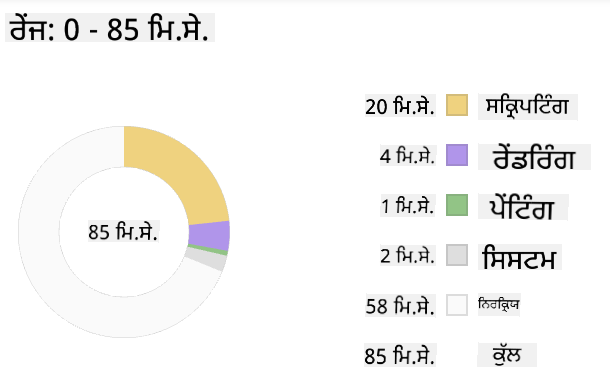
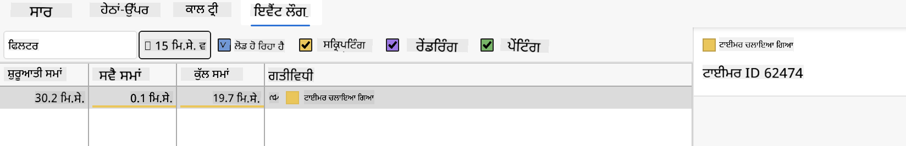

<!--
CO_OP_TRANSLATOR_METADATA:
{
  "original_hash": "640d7f35d57f0e02bbfe468bb0247741",
  "translation_date": "2025-10-20T22:09:51+00:00",
  "source_file": "5-browser-extension/3-background-tasks-and-performance/README.md",
  "language_code": "pa"
}
-->
# ਬ੍ਰਾਊਜ਼ਰ ਐਕਸਟੈਂਸ਼ਨ ਪ੍ਰੋਜੈਕਟ ਭਾਗ 3: ਬੈਕਗ੍ਰਾਊਂਡ ਟਾਸਕ ਅਤੇ ਪ੍ਰਦਰਸ਼ਨ ਬਾਰੇ ਸਿੱਖੋ

## ਲੈਕਚਰ ਤੋਂ ਪਹਿਲਾਂ ਕਵੀਜ਼

[ਲੈਕਚਰ ਤੋਂ ਪਹਿਲਾਂ ਕਵੀਜ਼](https://ff-quizzes.netlify.app/web/quiz/27)

### ਜਾਣ ਪਛਾਣ

ਇਸ ਮੌਡਿਊਲ ਦੇ ਪਿਛਲੇ ਦੋ ਪਾਠਾਂ ਵਿੱਚ, ਤੁਸੀਂ ਸਿੱਖਿਆ ਕਿ API ਤੋਂ ਫੈਚ ਕੀਤੇ ਡਾਟਾ ਲਈ ਇੱਕ ਫਾਰਮ ਅਤੇ ਡਿਸਪਲੇ ਇਲਾਕਾ ਕਿਵੇਂ ਬਣਾਇਆ ਜਾਵੇ। ਇਹ ਵੈੱਬ 'ਤੇ ਇੱਕ ਵੈੱਬ ਪ੍ਰਜ਼ੈਂਸ ਬਣਾਉਣ ਦਾ ਇੱਕ ਬਹੁਤ ਹੀ ਸਧਾਰਨ ਤਰੀਕਾ ਹੈ। ਤੁਸੀਂ ਡਾਟਾ ਨੂੰ ਅਸਿੰਕ੍ਰੋਨਸ ਤਰੀਕੇ ਨਾਲ ਫੈਚ ਕਰਨ ਦਾ ਹੱਲ ਕਿਵੇਂ ਕਰਨਾ ਹੈ, ਇਹ ਵੀ ਸਿੱਖਿਆ। ਤੁਹਾਡਾ ਬ੍ਰਾਊਜ਼ਰ ਐਕਸਟੈਂਸ਼ਨ ਲਗਭਗ ਪੂਰਾ ਹੋ ਚੁੱਕਾ ਹੈ।

ਹੁਣ ਕੁਝ ਬੈਕਗ੍ਰਾਊਂਡ ਟਾਸਕਾਂ ਦਾ ਪ੍ਰਬੰਧਨ ਕਰਨਾ ਬਾਕੀ ਹੈ, ਜਿਸ ਵਿੱਚ ਐਕਸਟੈਂਸ਼ਨ ਦੇ ਆਈਕਨ ਦੇ ਰੰਗ ਨੂੰ ਰੀਫ੍ਰੈਸ਼ ਕਰਨਾ ਸ਼ਾਮਲ ਹੈ। ਇਸ ਲਈ ਇਹ ਸਮਾਂ ਬ੍ਰਾਊਜ਼ਰ ਦੇ ਇਸ ਤਰ੍ਹਾਂ ਦੇ ਟਾਸਕਾਂ ਨੂੰ ਸੰਭਾਲਣ ਦੇ ਤਰੀਕੇ ਬਾਰੇ ਗੱਲ ਕਰਨ ਲਈ ਬਹੁਤ ਵਧੀਆ ਹੈ। ਆਓ, ਜਦੋਂ ਤੁਸੀਂ ਆਪਣੇ ਵੈੱਬ ਐਸੈਟ ਬਣਾਉਂਦੇ ਹੋ ਤਾਂ ਵੈੱਬਸਾਈਟ ਦੀ ਪ੍ਰਦਰਸ਼ਨਸ਼ੀਲਤਾ ਦੇ ਸੰਦਰਭ ਵਿੱਚ ਇਨ੍ਹਾਂ ਬ੍ਰਾਊਜ਼ਰ ਟਾਸਕਾਂ ਬਾਰੇ ਸੋਚੀਏ।

## ਵੈੱਬ ਪ੍ਰਦਰਸ਼ਨਸ਼ੀਲਤਾ ਦੇ ਮੂਲ ਤੱਤ

> "ਵੈੱਬਸਾਈਟ ਦੀ ਪ੍ਰਦਰਸ਼ਨਸ਼ੀਲਤਾ ਦੋ ਚੀਜ਼ਾਂ ਬਾਰੇ ਹੈ: ਪੰਨਾ ਕਿੰਨਾ ਤੇਜ਼ੀ ਨਾਲ ਲੋਡ ਹੁੰਦਾ ਹੈ, ਅਤੇ ਇਸ 'ਤੇ ਕੋਡ ਕਿੰਨਾ ਤੇਜ਼ੀ ਨਾਲ ਚਲਦਾ ਹੈ।" -- [ਜ਼ੈਕ ਗਰੋਸਬਾਰਟ](https://www.smashingmagazine.com/2012/06/javascript-profiling-chrome-developer-tools/)

ਤੁਹਾਡੀਆਂ ਵੈੱਬਸਾਈਟਾਂ ਨੂੰ ਹਰ ਕਿਸਮ ਦੇ ਉਪਕਰਣਾਂ 'ਤੇ, ਹਰ ਕਿਸਮ ਦੇ ਉਪਭੋਗਤਾਵਾਂ ਲਈ, ਹਰ ਕਿਸਮ ਦੀਆਂ ਸਥਿਤੀਆਂ ਵਿੱਚ ਬਹੁਤ ਤੇਜ਼ ਬਣਾਉਣ ਦੇ ਤਰੀਕੇ ਬਾਰੇ ਵਿਸ਼ਾ ਅਚੰਭਿਤ ਕਰਨ ਵਾਲਾ ਵੱਡਾ ਹੈ। ਜਦੋਂ ਤੁਸੀਂ ਇੱਕ ਸਧਾਰਨ ਵੈੱਬ ਪ੍ਰੋਜੈਕਟ ਜਾਂ ਬ੍ਰਾਊਜ਼ਰ ਐਕਸਟੈਂਸ਼ਨ ਬਣਾਉਂਦੇ ਹੋ ਤਾਂ ਕੁਝ ਗੱਲਾਂ ਨੂੰ ਯਾਦ ਰੱਖਣਾ ਜ਼ਰੂਰੀ ਹੈ।

ਤੁਹਾਨੂੰ ਇਹ ਯਕੀਨੀ ਬਣਾਉਣ ਲਈ ਸਭ ਤੋਂ ਪਹਿਲਾਂ ਕੀ ਕਰਨ ਦੀ ਲੋੜ ਹੈ ਕਿ ਤੁਹਾਡੀ ਸਾਈਟ ਕੁਸ਼ਲਤਾਪੂਰਵਕ ਚੱਲ ਰਹੀ ਹੈ, ਇਹ ਹੈ ਇਸ ਦੀ ਪ੍ਰਦਰਸ਼ਨਸ਼ੀਲਤਾ ਬਾਰੇ ਡਾਟਾ ਇਕੱਠਾ ਕਰਨਾ। ਇਹ ਕਰਨ ਲਈ ਪਹਿਲਾ ਸਥਾਨ ਤੁਹਾਡੇ ਵੈੱਬ ਬ੍ਰਾਊਜ਼ਰ ਦੇ ਡਿਵੈਲਪਰ ਟੂਲ ਹਨ। Edge ਵਿੱਚ, ਤੁਸੀਂ "ਸੈਟਿੰਗਜ਼ ਅਤੇ ਹੋਰ" ਬਟਨ (ਬ੍ਰਾਊਜ਼ਰ ਦੇ ਸਿਖਰ ਦੇ ਸੱਜੇ ਪਾਸੇ ਤਿੰਨ ਬਿੰਦੂਆਂ ਵਾਲਾ ਆਈਕਨ) ਚੁਣ ਸਕਦੇ ਹੋ, ਫਿਰ More Tools > Developer Tools 'ਤੇ ਜਾਓ ਅਤੇ Performance ਟੈਬ ਖੋਲ੍ਹੋ। ਤੁਸੀਂ Windows 'ਤੇ `Ctrl` + `Shift` + `I` ਜਾਂ Mac 'ਤੇ `Option` + `Command` + `I` ਦੀਬਾਰ ਚਾਬੀ ਦੀ ਮਦਦ ਨਾਲ ਡਿਵੈਲਪਰ ਟੂਲ ਖੋਲ੍ਹ ਸਕਦੇ ਹੋ।

Performance ਟੈਬ ਵਿੱਚ ਇੱਕ ਪ੍ਰੋਫਾਈਲਿੰਗ ਟੂਲ ਸ਼ਾਮਲ ਹੈ। ਇੱਕ ਵੈੱਬਸਾਈਟ ਖੋਲ੍ਹੋ (ਉਦਾਹਰਣ ਲਈ, [https://www.microsoft.com](https://www.microsoft.com/?WT.mc_id=academic-77807-sagibbon)) ਅਤੇ 'Record' ਬਟਨ 'ਤੇ ਕਲਿਕ ਕਰੋ, ਫਿਰ ਸਾਈਟ ਨੂੰ ਰੀਫ੍ਰੈਸ਼ ਕਰੋ। ਕਿਸੇ ਵੀ ਸਮੇਂ ਰਿਕਾਰਡਿੰਗ ਨੂੰ ਰੋਕੋ, ਅਤੇ ਤੁਸੀਂ ਉਹ ਰੂਟੀਨ ਦੇਖ ਸਕਦੇ ਹੋ ਜੋ 'script', 'render', ਅਤੇ 'paint' ਸਾਈਟ ਨੂੰ ਜਨਰੇਟ ਕਰਨ ਲਈ ਬਣਾਏ ਗਏ ਹਨ:


✅ [Microsoft Documentation](https://docs.microsoft.com/microsoft-edge/devtools-guide/performance/?WT.mc_id=academic-77807-sagibbon) 'ਤੇ Edge ਵਿੱਚ Performance ਪੈਨਲ ਬਾਰੇ ਜਾਣਕਾਰੀ ਪ੍ਰਾਪਤ ਕਰੋ।

> ਟਿਪ: ਤੁਹਾਡੀ ਵੈੱਬਸਾਈਟ ਦੇ ਸਟਾਰਟਅਪ ਸਮੇਂ ਦਾ ਸਹੀ ਪੜ੍ਹਨ ਪ੍ਰਾਪਤ ਕਰਨ ਲਈ, ਆਪਣੇ ਬ੍ਰਾਊਜ਼ਰ ਦਾ ਕੈਸ਼ ਸਾਫ਼ ਕਰੋ।

ਪੰਨੇ ਦੇ ਲੋਡ ਹੋਣ ਦੌਰਾਨ ਹੋਣ ਵਾਲੇ ਘਟਨਾਵਾਂ 'ਤੇ ਜ਼ੂਮ ਕਰਨ ਲਈ ਪ੍ਰੋਫਾਈਲ ਟਾਈਮਲਾਈਨ ਦੇ ਤੱਤਾਂ ਨੂੰ ਚੁਣੋ।

ਪੰਨੇ ਦੀ ਪ੍ਰਦਰਸ਼ਨਸ਼ੀਲਤਾ ਦੀ ਇੱਕ ਝਲਕ ਪ੍ਰਾਪਤ ਕਰਨ ਲਈ ਪ੍ਰੋਫਾਈਲ ਟਾਈਮਲਾਈਨ ਦੇ ਇੱਕ ਹਿੱਸੇ ਨੂੰ ਚੁਣੋ ਅਤੇ ਸਾਰ ਪੈਨ ਦੇਖੋ:



ਇਵੈਂਟ ਲੌਗ ਪੈਨ ਦੀ ਜਾਂਚ ਕਰੋ ਕਿ ਕੀ ਕੋਈ ਘਟਨਾ 15 ਮਿ.ਸੇ. ਤੋਂ ਵੱਧ ਸਮਾਂ ਲੈਂਦੀ ਹੈ:



✅ ਆਪਣੇ ਪ੍ਰੋਫਾਈਲਰ ਨੂੰ ਜਾਣੋ! ਇਸ ਸਾਈਟ 'ਤੇ ਡਿਵੈਲਪਰ ਟੂਲ ਖੋਲ੍ਹੋ ਅਤੇ ਦੇਖੋ ਕਿ ਕੀ ਕੋਈ ਬੋਤਲਨੈਕਸ ਹਨ। ਸਭ ਤੋਂ ਹੌਲੀ ਲੋਡ ਹੋਣ ਵਾਲਾ ਐਸੈਟ ਕਿਹੜਾ ਹੈ? ਸਭ ਤੋਂ ਤੇਜ਼?

## ਪ੍ਰੋਫਾਈਲਿੰਗ ਚੈੱਕ

ਆਮ ਤੌਰ 'ਤੇ, ਕੁਝ "ਸਮੱਸਿਆ ਵਾਲੇ ਖੇਤਰ" ਹੁੰਦੇ ਹਨ ਜਿਨ੍ਹਾਂ ਨੂੰ ਹਰ ਵੈੱਬ ਡਿਵੈਲਪਰ ਨੂੰ ਸਾਈਟ ਬਣਾਉਣ ਦੌਰਾਨ ਦੇਖਣਾ ਚਾਹੀਦਾ ਹੈ ਤਾਂ ਕਿ ਜਦੋਂ ਇਹ ਪ੍ਰੋਡਕਸ਼ਨ 'ਤੇ ਡਿਪਲੌਇ ਕਰਨ ਦਾ ਸਮਾਂ ਆਵੇ ਤਾਂ ਕੋਈ ਬੁਰਾ ਅਚੰਭਾ ਨਾ ਹੋਵੇ।

**ਐਸੈਟ ਸਾਈਜ਼**: ਪਿਛਲੇ ਕੁਝ ਸਾਲਾਂ ਵਿੱਚ ਵੈੱਬ 'ਭਾਰੀ' ਹੋ ਗਈ ਹੈ, ਅਤੇ ਇਸ ਲਈ ਹੌਲੀ ਵੀ। ਇਸ ਭਾਰ ਦਾ ਕੁਝ ਹਿੱਸਾ ਚਿੱਤਰਾਂ ਦੇ ਉਪਯੋਗ ਨਾਲ ਸੰਬੰਧਿਤ ਹੈ।

✅ [Internet Archive](https://httparchive.org/reports/page-weight) 'ਤੇ ਪੰਨਾ ਭਾਰ ਅਤੇ ਹੋਰ ਬਾਰੇ ਇਤਿਹਾਸਕ ਦ੍ਰਿਸ਼ਟੀ ਲਈ ਦੇਖੋ।

ਇੱਕ ਵਧੀਆ ਅਭਿਆਸ ਇਹ ਯਕੀਨੀ ਬਣਾਉਣਾ ਹੈ ਕਿ ਤੁਹਾਡੇ ਚਿੱਤਰਾਂ ਨੂੰ ਅਨੁਕੂਲਿਤ ਕੀਤਾ ਗਿਆ ਹੈ ਅਤੇ ਤੁਹਾਡੇ ਉਪਭੋਗਤਾਵਾਂ ਲਈ ਸਹੀ ਆਕਾਰ ਅਤੇ ਰਿਜ਼ੋਲਿਊਸ਼ਨ 'ਤੇ ਪੇਸ਼ ਕੀਤਾ ਗਿਆ ਹੈ।

**DOM ਟ੍ਰੈਵਰਸਲ**: ਬ੍ਰਾਊਜ਼ਰ ਨੂੰ ਤੁਹਾਡੇ ਦੁਆਰਾ ਲਿਖੇ ਕੋਡ ਦੇ ਆਧਾਰ 'ਤੇ ਆਪਣਾ ਡੌਕਯੂਮੈਂਟ ਓਬਜੈਕਟ ਮਾਡਲ ਬਣਾਉਣਾ ਪੈਂਦਾ ਹੈ, ਇਸ ਲਈ ਇਹ ਚੰਗੀ ਪੰਨਾ ਪ੍ਰਦਰਸ਼ਨਸ਼ੀਲਤਾ ਦੇ ਹਿੱਤ ਵਿੱਚ ਹੈ ਕਿ ਤੁਹਾਡੇ ਟੈਗ ਘੱਟ ਹੋਣ, ਸਿਰਫ਼ ਉਹਨਾਂ ਨੂੰ ਵਰਤਣਾ ਅਤੇ ਸਟਾਈਲ ਕਰਨਾ ਜਿਨ੍ਹਾਂ ਦੀ ਪੰਨੇ ਨੂੰ ਲੋੜ ਹੈ। ਇਸ ਨੁਕਤੇ ਤੱਕ, ਪੰਨੇ ਨਾਲ ਸੰਬੰਧਿਤ ਵਾਧੂ CSS ਨੂੰ ਅਨੁਕੂਲਿਤ ਕੀਤਾ ਜਾ ਸਕਦਾ ਹੈ; ਸਟਾਈਲ ਜੋ ਸਿਰਫ਼ ਇੱਕ ਪੰਨੇ 'ਤੇ ਵਰਤੇ ਜਾਣ ਦੀ ਲੋੜ ਹੈ ਉਹਨਾਂ ਨੂੰ ਮੁੱਖ ਸਟਾਈਲ ਸ਼ੀਟ ਵਿੱਚ ਸ਼ਾਮਲ ਕਰਨ ਦੀ ਲੋੜ ਨਹੀਂ ਹੈ, ਉਦਾਹਰਣ ਲਈ।

**ਜਾਵਾਸਕ੍ਰਿਪਟ**: ਹਰ ਜਾਵਾਸਕ੍ਰਿਪਟ ਡਿਵੈਲਪਰ ਨੂੰ 'ਰੈਂਡਰ-ਬਲੌਕਿੰਗ' ਸਕ੍ਰਿਪਟਾਂ ਲਈ ਦੇਖਣਾ ਚਾਹੀਦਾ ਹੈ ਜੋ DOM ਨੂੰ ਬ੍ਰਾਊਜ਼ਰ ਵਿੱਚ ਟ੍ਰੈਵਰਸ ਅਤੇ ਪੇਂਟ ਕਰਨ ਤੋਂ ਪਹਿਲਾਂ ਲੋਡ ਹੋਣੀ ਚਾਹੀਦੀ ਹੈ। ਆਪਣੇ inline ਸਕ੍ਰਿਪਟਾਂ ਨਾਲ `defer` ਵਰਤਣ ਬਾਰੇ ਸੋਚੋ (ਜਿਵੇਂ ਕਿ Terrarium ਮੌਡਿਊਲ ਵਿੱਚ ਕੀਤਾ ਗਿਆ ਹੈ)।

✅ ਸਾਈਟ ਪ੍ਰਦਰਸ਼ਨਸ਼ੀਲਤਾ ਦਾ ਨਿਰਧਾਰਨ ਕਰਨ ਲਈ ਕੀਤੇ ਜਾਣ ਵਾਲੇ ਆਮ ਚੈੱਕਾਂ ਬਾਰੇ ਹੋਰ ਜਾਣਨ ਲਈ [Site Speed Test website](https://www.webpagetest.org/) 'ਤੇ ਕੁਝ ਸਾਈਟਾਂ ਦੀ ਕੋਸ਼ਿਸ਼ ਕਰੋ।

ਹੁਣ ਜਦੋਂ ਤੁਹਾਨੂੰ ਇਹ ਪਤਾ ਹੈ ਕਿ ਬ੍ਰਾਊਜ਼ਰ ਉਹ ਐਸੈਟਾਂ ਨੂੰ ਕਿਵੇਂ ਰੈਂਡਰ ਕਰਦਾ ਹੈ ਜੋ ਤੁਸੀਂ ਇਸ ਨੂੰ ਭੇਜਦੇ ਹੋ, ਆਓ ਅੰਤਮ ਕੁਝ ਚੀਜ਼ਾਂ ਦੇਖੀਏ ਜੋ ਤੁਹਾਨੂੰ ਆਪਣਾ ਐਕਸਟੈਂਸ਼ਨ ਪੂਰਾ ਕਰਨ ਲਈ ਕਰਨ ਦੀ ਲੋੜ ਹੈ:

### ਰੰਗ ਦੀ ਗਣਨਾ ਕਰਨ ਲਈ ਇੱਕ ਫੰਕਸ਼ਨ ਬਣਾਓ

`/src/index.js` ਵਿੱਚ ਕੰਮ ਕਰਦੇ ਹੋਏ, `calculateColor()` ਨਾਮਕ ਇੱਕ ਫੰਕਸ਼ਨ ਸ਼ਾਮਲ ਕਰੋ ਜੋ `const` ਵੈਰੀਏਬਲਾਂ ਦੀ ਲੜੀ ਦੇ ਬਾਅਦ ਹੋਵੇ ਜੋ ਤੁਸੀਂ DOM ਤੱਕ ਪਹੁੰਚ ਪ੍ਰਾਪਤ ਕਰਨ ਲਈ ਸੈਟ ਕੀਤੇ ਹਨ:

```JavaScript
function calculateColor(value) {
	let co2Scale = [0, 150, 600, 750, 800];
	let colors = ['#2AA364', '#F5EB4D', '#9E4229', '#381D02', '#381D02'];

	let closestNum = co2Scale.sort((a, b) => {
		return Math.abs(a - value) - Math.abs(b - value);
	})[0];
	console.log(value + ' is closest to ' + closestNum);
	let num = (element) => element > closestNum;
	let scaleIndex = co2Scale.findIndex(num);

	let closestColor = colors[scaleIndex];
	console.log(scaleIndex, closestColor);

	chrome.runtime.sendMessage({ action: 'updateIcon', value: { color: closestColor } });
}
```

ਇੱਥੇ ਕੀ ਹੋ ਰਿਹਾ ਹੈ? ਤੁਸੀਂ API ਕਾਲ ਤੋਂ ਇੱਕ ਮੁੱਲ (ਕਾਰਬਨ ਇੰਟੈਂਸਿਟੀ) ਪਾਸ ਕਰਦੇ ਹੋ ਜੋ ਤੁਸੀਂ ਪਿਛਲੇ ਪਾਠ ਵਿੱਚ ਪੂਰਾ ਕੀਤਾ ਸੀ, ਅਤੇ ਫਿਰ ਤੁਸੀਂ ਗਣਨਾ ਕਰਦੇ ਹੋ ਕਿ ਇਸ ਦਾ ਮੁੱਲ ਰੰਗਾਂ ਦੀ ਲੜੀ ਵਿੱਚ ਪੇਸ਼ ਕੀਤੇ ਗਏ ਸੂਚਕ ਦੇ ਕਿੰਨਾ ਨੇੜੇ ਹੈ। ਫਿਰ ਤੁਸੀਂ ਉਸ ਨੇੜੇ ਦੇ ਰੰਗ ਦਾ ਮੁੱਲ chrome runtime ਨੂੰ ਭੇਜਦੇ ਹੋ।

chrome.runtime ਵਿੱਚ [ਇੱਕ API](https://developer.chrome.com/extensions/runtime) ਹੈ ਜੋ ਹਰ ਕਿਸਮ ਦੇ ਬੈਕਗ੍ਰਾਊਂਡ ਟਾਸਕਾਂ ਨੂੰ ਸੰਭਾਲਦਾ ਹੈ, ਅਤੇ ਤੁਹਾਡਾ ਐਕਸਟੈਂਸ਼ਨ ਇਸਦਾ ਲਾਭ ਲੈ ਰਿਹਾ ਹੈ:

> "chrome.runtime API ਨੂੰ ਬੈਕਗ੍ਰਾਊਂਡ ਪੰਨਾ ਪ੍ਰਾਪਤ ਕਰਨ, ਮੈਨਿਫੈਸਟ ਬਾਰੇ ਵੇਰਵੇ ਵਾਪਸ ਕਰਨ, ਅਤੇ ਐਪ ਜਾਂ ਐਕਸਟੈਂਸ਼ਨ ਲਾਈਫਸਾਈਕਲ ਵਿੱਚ ਘਟਨਾਵਾਂ ਸੁਣਨ ਅਤੇ ਜਵਾਬ ਦੇਣ ਲਈ ਵਰਤੋ। ਤੁਸੀਂ ਇਸ API ਨੂੰ URLs ਦੇ ਰਿਲੇਟਿਵ ਪਾਥ ਨੂੰ ਪੂਰੀ ਤਰ੍ਹਾਂ ਯੋਗ URLs ਵਿੱਚ ਬਦਲਣ ਲਈ ਵੀ ਵਰਤ ਸਕਦੇ ਹੋ।"

✅ ਜੇ ਤੁਸੀਂ ਇਹ ਬ੍ਰਾਊਜ਼ਰ ਐਕਸਟੈਂਸ਼ਨ Edge ਲਈ ਵਿਕਸਿਤ ਕਰ ਰਹੇ ਹੋ, ਤਾਂ ਇਹ ਤੁਹਾਨੂੰ ਹੈਰਾਨ ਕਰ ਸਕਦਾ ਹੈ ਕਿ ਤੁਸੀਂ chrome API ਵਰਤ ਰਹੇ ਹੋ। ਨਵੇਂ Edge ਬ੍ਰਾਊਜ਼ਰ ਵਰਜਨ Chromium ਬ੍ਰਾਊਜ਼ਰ ਇੰਜਣ 'ਤੇ ਚੱਲਦੇ ਹਨ, ਇਸ ਲਈ ਤੁਸੀਂ ਇਹ ਟੂਲ ਵਰਤ ਸਕਦੇ ਹੋ।

> ਨੋਟ ਕਰੋ, ਜੇ ਤੁਸੀਂ ਬ੍ਰਾਊਜ਼ਰ ਐਕਸਟੈਂਸ਼ਨ ਨੂੰ ਪ੍ਰੋਫਾਈਲ ਕਰਨਾ ਚਾਹੁੰਦੇ ਹੋ, ਤਾਂ ਇਸਨੂੰ ਖੁਦ ਦੇ ਅੰਦਰੋਂ ਡਿਵੈਲਪਰ ਟੂਲਾਂ ਲਾਂਚ ਕਰੋ, ਕਿਉਂਕਿ ਇਹ ਆਪਣਾ ਵੱਖਰਾ ਬ੍ਰਾਊਜ਼ਰ ਇੰਸਟੈਂਸ ਹੈ।

### ਡਿਫਾਲਟ ਆਈਕਨ ਰੰਗ ਸੈਟ ਕਰੋ

ਹੁਣ, `init()` ਫੰਕਸ਼ਨ ਵਿੱਚ, ਆਈਕਨ ਨੂੰ ਸ਼ੁਰੂ ਕਰਨ ਲਈ ਜਨਰਲ ਗ੍ਰੀਨ ਸੈਟ ਕਰੋ, ਦੁਬਾਰਾ chrome ਦੇ `updateIcon` ਐਕਸ਼ਨ ਨੂੰ ਕਾਲ ਕਰਕੇ:

```JavaScript
chrome.runtime.sendMessage({
	action: 'updateIcon',
		value: {
			color: 'green',
		},
});
```
### ਫੰਕਸ਼ਨ ਕਾਲ ਕਰੋ, ਕਾਲ ਨੂੰ ਐਗਜ਼ਿਕਿਊਟ ਕਰੋ

ਅਗਲੇ, ਤੁਸੀਂ ਪਿਛਲੇ ਪਾਠ ਵਿੱਚ ਕੀਤੇ CO2Signal API ਦੁਆਰਾ ਵਾਪਸ ਕੀਤੇ ਗਏ ਪ੍ਰੋਮਿਸ ਵਿੱਚ ਉਸ ਫੰਕਸ਼ਨ ਨੂੰ ਕਾਲ ਕਰੋ:

```JavaScript
//let CO2...
calculateColor(CO2);
```

ਅਤੇ ਅੰਤ ਵਿੱਚ, `/dist/background.js` ਵਿੱਚ, ਇਹਨਾਂ ਬੈਕਗ੍ਰਾਊਂਡ ਐਕਸ਼ਨ ਕਾਲਾਂ ਲਈ ਸੁਣਨ ਵਾਲਾ ਸ਼ਾਮਲ ਕਰੋ:

```JavaScript
chrome.runtime.onMessage.addListener(function (msg, sender, sendResponse) {
	if (msg.action === 'updateIcon') {
		chrome.action.setIcon({ imageData: drawIcon(msg.value) });
	}
});
//borrowed from energy lollipop extension, nice feature!
function drawIcon(value) {
	let canvas = new OffscreenCanvas(200, 200);
	let context = canvas.getContext('2d');

	context.beginPath();
	context.fillStyle = value.color;
	context.arc(100, 100, 50, 0, 2 * Math.PI);
	context.fill();

	return context.getImageData(50, 50, 100, 100);
}
```
ਇਸ ਕੋਡ ਵਿੱਚ, ਤੁਸੀਂ ਬੈਕਐਂਡ ਟਾਸਕ ਮੈਨੇਜਰ ਨੂੰ ਆਉਣ ਵਾਲੇ ਕਿਸੇ ਵੀ ਸੁਨੇਹੇ ਲਈ ਸੁਣਨ ਵਾਲਾ ਸ਼ਾਮਲ ਕਰ ਰਹੇ ਹੋ। ਜੇ ਇਸਨੂੰ 'updateIcon' ਕਿਹਾ ਜਾਂਦਾ ਹੈ, ਤਾਂ ਅਗਲਾ ਕੋਡ ਚਲਾਇਆ ਜਾਂਦਾ ਹੈ ਜੋ Canvas API ਦੀ ਵਰਤੋਂ ਕਰਕੇ ਸਹੀ ਰੰਗ ਦਾ ਆਈਕਨ ਡ੍ਰਾ ਕਰਦਾ ਹੈ।

✅ ਤੁਸੀਂ Canvas API ਬਾਰੇ ਹੋਰ ਸਿੱਖੋਗੇ [Space Game ਪਾਠਾਂ](../../6-space-game/2-drawing-to-canvas/README.md) ਵਿੱਚ।

ਹੁਣ, ਆਪਣਾ ਐਕਸਟੈਂਸ਼ਨ ਮੁੜ ਬਣਾਓ (`npm run build`), ਰੀਫ੍ਰੈਸ਼ ਕਰੋ ਅਤੇ ਆਪਣਾ ਐਕਸਟੈਂਸ਼ਨ ਲਾਂਚ ਕਰੋ, ਅਤੇ ਰੰਗ ਬਦਲਦੇ ਦੇਖੋ। ਕੀ ਇਹ ਸਮਾਂ ਕੋਈ ਕੰਮ ਕਰਨ ਜਾਂ ਬਰਤਨ ਧੋਣ ਲਈ ਵਧੀਆ ਹੈ? ਹੁਣ ਤੁਹਾਨੂੰ ਪਤਾ ਹੈ!

ਵਧਾਈਆਂ, ਤੁਸੀਂ ਇੱਕ ਉਪਯੋਗੀ ਬ੍ਰਾਊਜ਼ਰ ਐਕਸਟੈਂਸ਼ਨ ਬਣਾਇਆ ਹੈ ਅਤੇ ਹੋਰ ਸਿੱਖਿਆ ਕਿ ਬ੍ਰਾਊਜ਼ਰ ਕਿਵੇਂ ਕੰਮ ਕਰਦਾ ਹੈ ਅਤੇ ਇਸਦੀ ਪ੍ਰਦਰਸ਼ਨਸ਼ੀਲਤਾ ਨੂੰ ਕਿਵੇਂ ਪ੍ਰੋਫਾਈਲ ਕਰਨਾ ਹੈ।

## GitHub Copilot Agent ਚੈਲੈਂਜ 🚀

Agent ਮੋਡ ਦੀ ਵਰਤੋਂ ਕਰਕੇ ਹੇਠਾਂ ਦਿੱਤੇ ਚੈਲੈਂਜ ਨੂੰ ਪੂਰਾ ਕਰੋ:

**ਵੇਰਵਾ:** ਬ੍ਰਾਊਜ਼ਰ ਐਕਸਟੈਂਸ਼ਨ ਦੀ ਪ੍ਰਦਰਸ਼ਨਸ਼ੀਲਤਾ ਮਾਨੀਟਰਿੰਗ ਸਮਰੱਥਾ ਨੂੰ ਵਧਾਉਣ ਲਈ ਇੱਕ ਫੀਚਰ ਸ਼ਾਮਲ ਕਰੋ ਜੋ ਐਕਸਟੈਂਸ਼ਨ ਦੇ ਵੱਖ-ਵੱਖ ਕੰਪੋਨੈਂਟਾਂ ਦੇ ਲੋਡ ਸਮੇਂ ਨੂੰ ਟ੍ਰੈਕ ਅਤੇ ਡਿਸਪਲੇ ਕਰਦਾ ਹੈ।

**ਪ੍ਰੋੰਪਟ:** ਬ੍ਰਾਊਜ਼ਰ ਐਕਸਟੈਂਸ਼ਨ ਲਈ ਇੱਕ ਪ੍ਰਦਰਸ਼ਨਸ਼ੀਲਤਾ ਮਾਨੀਟਰਿੰਗ ਸਿਸਟਮ ਬਣਾਓ ਜੋ API ਤੋਂ CO2 ਡਾਟਾ ਫੈਚ ਕਰਨ, ਰੰਗਾਂ ਦੀ ਗਣਨਾ ਕਰਨ, ਅਤੇ ਆਈਕਨ ਨੂੰ ਅਪਡੇਟ ਕਰਨ ਵਿੱਚ ਲੱਗਣ ਵਾਲੇ ਸਮੇਂ ਨੂੰ ਮਾਪਦਾ ਹੈ ਅਤੇ ਬ੍ਰਾਊਜ਼ਰ ਕਨਸੋਲ ਵਿੱਚ ਟਾਈਮਸਟੈਂਪ ਅਤੇ ਦੂਰੀ ਮੈਟ੍ਰਿਕਸ ਦੇ ਨਾਲ ਨੋਟ ਕਰਦਾ ਹੈ।

---

## 🚀 ਚੈਲੈਂਜ

ਕੁਝ ਖੁੱਲ੍ਹੇ ਸਰੋਤ ਵਾਲੀਆਂ ਵੈੱਬਸਾਈਟਾਂ ਦੀ ਜਾਂਚ ਕਰੋ ਜੋ ਬਹੁਤ ਸਮਾਂ ਪਹਿਲਾਂ ਤੋਂ ਮੌਜੂਦ ਹਨ, ਅਤੇ, ਉਨ੍ਹਾਂ ਦੇ GitHub ਇਤਿਹਾਸ ਦੇ ਆਧਾਰ 'ਤੇ, ਦੇਖੋ ਕਿ ਕੀ ਤੁਸੀਂ ਇਹ ਨਿਰਧਾਰਤ ਕਰ ਸਕਦੇ ਹੋ ਕਿ ਉਹ ਕਿਵੇਂ ਸਾਲਾਂ ਵਿੱਚ ਪ੍ਰਦਰਸ਼ਨਸ਼ੀਲਤਾ ਲਈ ਅਨੁਕੂਲਿਤ ਕੀਤੇ ਗਏ ਸਨ। ਸਭ ਤੋਂ ਆਮ ਸਮੱਸਿਆ ਕਿਹੜੀ ਹੈ?

## ਲੈਕਚਰ ਤੋਂ ਬਾਅਦ ਕਵੀਜ਼

[ਲੈਕਚਰ ਤੋਂ ਬਾਅਦ ਕਵੀਜ਼](https://ff-quizzes.netlify.app/web/quiz/28)

## ਸਮੀਖਿਆ ਅਤੇ ਸਵੈ ਅਧਿਐਨ

ਇੱਕ [ਪ੍ਰਦਰਸ਼ਨਸ਼ੀਲਤਾ ਨਿਊਜ਼ਲੈਟਰ](https://perf.email/) ਲਈ ਸਾਈਨ ਅਪ ਕਰਨ ਬਾਰੇ ਵਿਚਾਰ ਕਰੋ।

ਵੈੱਬ ਟੂਲਾਂ ਵਿੱਚ ਪ੍ਰਦਰਸ਼ਨ ਟੈਬਾਂ ਦੇਖ ਕੇ ਬ੍ਰਾਊਜ਼ਰ ਵੈੱਬ ਪ੍ਰਦਰਸ਼ਨਸ਼ੀਲਤਾ ਨੂੰ ਮਾਪਣ ਦੇ ਕੁਝ ਤਰੀਕਿਆਂ ਦੀ ਜਾਂਚ ਕਰੋ। ਕੀ ਤੁਹਾਨੂੰ ਕੋਈ ਵੱਡੇ ਅੰਤਰ ਮਿਲਦੇ ਹਨ?

## ਅਸਾਈਨਮੈਂਟ

[ਸਾਈਟ ਦੀ ਪ੍ਰਦਰਸ਼ਨਸ਼ੀਲਤਾ ਦੀ ਜਾਂਚ ਕਰੋ](assignment.md)

---

**ਅਸਵੀਕਰਤੀ**:  
ਇਹ ਦਸਤਾਵੇਜ਼ AI ਅਨੁਵਾਦ ਸੇਵਾ [Co-op Translator](https://github.com/Azure/co-op-translator) ਦੀ ਵਰਤੋਂ ਕਰਕੇ ਅਨੁਵਾਦ ਕੀਤਾ ਗਿਆ ਹੈ। ਜਦੋਂ ਕਿ ਅਸੀਂ ਸਹੀ ਹੋਣ ਦੀ ਕੋਸ਼ਿਸ਼ ਕਰਦੇ ਹਾਂ, ਕਿਰਪਾ ਕਰਕੇ ਧਿਆਨ ਦਿਓ ਕਿ ਸਵੈਚਾਲਿਤ ਅਨੁਵਾਦਾਂ ਵਿੱਚ ਗਲਤੀਆਂ ਜਾਂ ਅਸੁੱਤੀਆਂ ਹੋ ਸਕਦੀਆਂ ਹਨ। ਮੂਲ ਦਸਤਾਵੇਜ਼ ਨੂੰ ਇਸਦੀ ਮੂਲ ਭਾਸ਼ਾ ਵਿੱਚ ਅਧਿਕਾਰਤ ਸਰੋਤ ਮੰਨਿਆ ਜਾਣਾ ਚਾਹੀਦਾ ਹੈ। ਮਹੱਤਵਪੂਰਨ ਜਾਣਕਾਰੀ ਲਈ, ਪੇਸ਼ੇਵਰ ਮਨੁੱਖੀ ਅਨੁਵਾਦ ਦੀ ਸਿਫਾਰਸ਼ ਕੀਤੀ ਜਾਂਦੀ ਹੈ। ਅਸੀਂ ਇਸ ਅਨੁਵਾਦ ਦੀ ਵਰਤੋਂ ਤੋਂ ਪੈਦਾ ਹੋਣ ਵਾਲੇ ਕਿਸੇ ਵੀ ਗਲਤਫਹਿਮੀ ਜਾਂ ਗਲਤ ਵਿਆਖਿਆ ਲਈ ਜ਼ਿੰਮੇਵਾਰ ਨਹੀਂ ਹਾਂ।