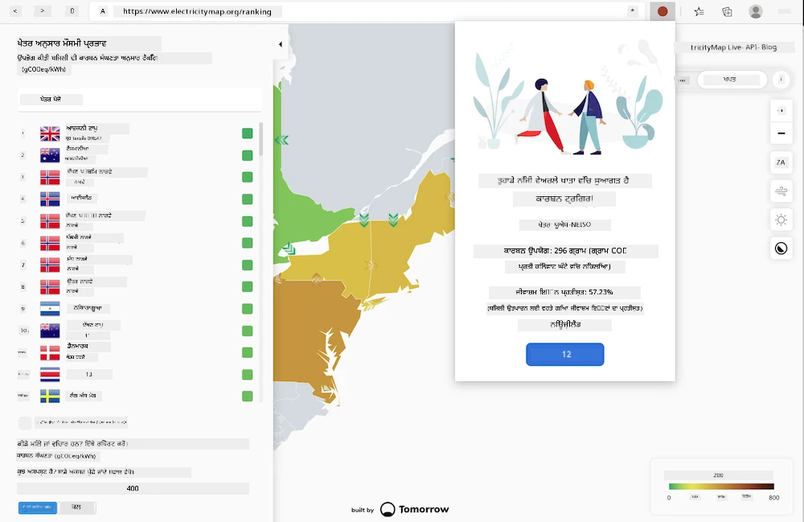
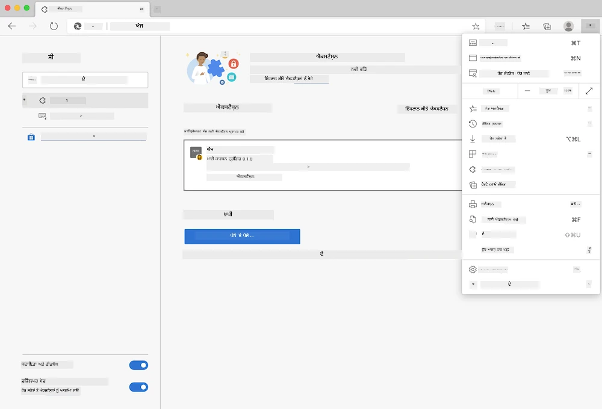

<!--
CO_OP_TRANSLATOR_METADATA:
{
  "original_hash": "fab4e6b4f0efcd587a9029d82991f597",
  "translation_date": "2025-08-25T23:51:01+00:00",
  "source_file": "5-browser-extension/solution/README.md",
  "language_code": "pa"
}
-->
# ਕਾਰਬਨ ਟ੍ਰਿਗਰ ਬ੍ਰਾਊਜ਼ਰ ਐਕਸਟੈਂਸ਼ਨ: ਪੂਰਾ ਕੋਡ

tmrow ਦੀ CO2 Signal API ਦੀ ਵਰਤੋਂ ਕਰਦੇ ਹੋਏ ਬਿਜਲੀ ਦੀ ਖਪਤ ਨੂੰ ਟਰੈਕ ਕਰਨ ਲਈ ਇੱਕ ਬ੍ਰਾਊਜ਼ਰ ਐਕਸਟੈਂਸ਼ਨ ਬਣਾਓ, ਤਾਂ ਜੋ ਤੁਹਾਡੇ ਬ੍ਰਾਊਜ਼ਰ ਵਿੱਚ ਹੀ ਤੁਹਾਨੂੰ ਯਾਦ ਦਿਵਾਈ ਜਾ ਸਕੇ ਕਿ ਤੁਹਾਡੇ ਖੇਤਰ ਵਿੱਚ ਬਿਜਲੀ ਦੀ ਖਪਤ ਕਿੰਨੀ ਜ਼ਿਆਦਾ ਹੈ। ਇਸ ਐਕਸਟੈਂਸ਼ਨ ਦੀ ਵਰਤੋਂ ਕਰਕੇ ਤੁਸੀਂ ਇਸ ਜਾਣਕਾਰੀ ਦੇ ਆਧਾਰ 'ਤੇ ਆਪਣੇ ਕੰਮਾਂ ਬਾਰੇ ਸੋਚ-ਵਿਚਾਰ ਕਰ ਸਕਦੇ ਹੋ।



## ਸ਼ੁਰੂਆਤ ਕਰਨਾ

ਤੁਹਾਨੂੰ [npm](https://npmjs.com) ਇੰਸਟਾਲ ਕੀਤਾ ਹੋਣਾ ਚਾਹੀਦਾ ਹੈ। ਇਸ ਕੋਡ ਦੀ ਇੱਕ ਕਾਪੀ ਆਪਣੇ ਕੰਪਿਊਟਰ ਦੇ ਕਿਸੇ ਫੋਲਡਰ ਵਿੱਚ ਡਾਊਨਲੋਡ ਕਰੋ।

ਸਾਰੀਆਂ ਲੋੜੀਂਦੀਆਂ ਪੈਕੇਜਾਂ ਇੰਸਟਾਲ ਕਰੋ:

```
npm install
```

webpack ਤੋਂ ਐਕਸਟੈਂਸ਼ਨ ਬਣਾਓ

```
npm run build
```

Edge 'ਤੇ ਇੰਸਟਾਲ ਕਰਨ ਲਈ, ਬ੍ਰਾਊਜ਼ਰ ਦੇ ਸੱਜੇ ਉੱਪਰ ਵਾਲੇ 'ਤਿੰਨ ਬਿੰਦੂ' ਮੀਨੂ ਦੀ ਵਰਤੋਂ ਕਰਕੇ ਐਕਸਟੈਂਸ਼ਨ ਪੈਨਲ ਲੱਭੋ। ਉੱਥੋਂ, 'ਲੋਡ ਅਨਪੈਕਡ' ਚੁਣੋ ਤਾਂ ਜੋ ਨਵਾਂ ਐਕਸਟੈਂਸ਼ਨ ਲੋਡ ਕੀਤਾ ਜਾ ਸਕੇ। ਪ੍ਰਾਂਪਟ 'ਤੇ 'dist' ਫੋਲਡਰ ਖੋਲ੍ਹੋ ਅਤੇ ਐਕਸਟੈਂਸ਼ਨ ਲੋਡ ਹੋ ਜਾਵੇਗਾ। ਇਸਨੂੰ ਵਰਤਣ ਲਈ, ਤੁਹਾਨੂੰ CO2 Signal ਦੀ API ਲਈ ਇੱਕ API ਕੁੰਜੀ ([ਇੱਥੇ ਈਮੇਲ ਰਾਹੀਂ ਪ੍ਰਾਪਤ ਕਰੋ](https://www.co2signal.com/) - ਇਸ ਪੰਨੇ 'ਤੇ ਬਾਕਸ ਵਿੱਚ ਆਪਣਾ ਈਮੇਲ ਦਰਜ ਕਰੋ) ਅਤੇ ਆਪਣੇ ਖੇਤਰ ਲਈ [Electricity Map](https://www.electricitymap.org/map) ਦੇ ਅਨੁਸਾਰ [ਖੇਤਰ ਕੋਡ](http://api.electricitymap.org/v3/zones) ਦੀ ਲੋੜ ਹੋਵੇਗੀ (ਉਦਾਹਰਣ ਵਜੋਂ, ਬੋਸਟਨ ਵਿੱਚ, ਮੈਂ 'US-NEISO' ਵਰਤਦਾ ਹਾਂ)।



ਜਦੋਂ API ਕੁੰਜੀ ਅਤੇ ਖੇਤਰ ਐਕਸਟੈਂਸ਼ਨ ਇੰਟਰਫੇਸ ਵਿੱਚ ਦਰਜ ਕੀਤੇ ਜਾਂਦੇ ਹਨ, ਬ੍ਰਾਊਜ਼ਰ ਐਕਸਟੈਂਸ਼ਨ ਬਾਰ ਵਿੱਚ ਰੰਗੀਨ ਬਿੰਦੂ ਤੁਹਾਡੇ ਖੇਤਰ ਦੀ ਊਰਜਾ ਖਪਤ ਨੂੰ ਦਰਸਾਉਣ ਲਈ ਬਦਲ ਜਾਣਾ ਚਾਹੀਦਾ ਹੈ ਅਤੇ ਤੁਹਾਨੂੰ ਇਹ ਸੰਕੇਤ ਦੇਵੇਗਾ ਕਿ ਕਿਹੜੀਆਂ ਊਰਜਾ-ਗਹਿਰੀਆਂ ਗਤੀਵਿਧੀਆਂ ਤੁਹਾਡੇ ਲਈ ਉਚਿਤ ਹੋ ਸਕਦੀਆਂ ਹਨ। ਇਸ 'ਬਿੰਦੂ' ਪ੍ਰਣਾਲੀ ਦਾ ਵਿਚਾਰ ਮੈਨੂੰ ਕੈਲੀਫੋਰਨੀਆ ਦੇ ਉਤਸਰਜਨ ਲਈ [Energy Lollipop ਐਕਸਟੈਂਸ਼ਨ](https://energylollipop.com/) ਤੋਂ ਮਿਲਿਆ ਸੀ।

**ਅਸਵੀਕਾਰਨ**:  
ਇਹ ਦਸਤਾਵੇਜ਼ AI ਅਨੁਵਾਦ ਸੇਵਾ [Co-op Translator](https://github.com/Azure/co-op-translator) ਦੀ ਵਰਤੋਂ ਕਰਕੇ ਅਨੁਵਾਦ ਕੀਤਾ ਗਿਆ ਹੈ। ਜਦੋਂ ਕਿ ਅਸੀਂ ਸਹੀਤਾ ਲਈ ਯਤਨਸ਼ੀਲ ਹਾਂ, ਕਿਰਪਾ ਕਰਕੇ ਧਿਆਨ ਦਿਓ ਕਿ ਸਵੈਚਾਲਿਤ ਅਨੁਵਾਦਾਂ ਵਿੱਚ ਗਲਤੀਆਂ ਜਾਂ ਅਸੁਚੱਜੇਪਣ ਹੋ ਸਕਦੇ ਹਨ। ਮੂਲ ਦਸਤਾਵੇਜ਼ ਨੂੰ ਇਸਦੀ ਮੂਲ ਭਾਸ਼ਾ ਵਿੱਚ ਅਧਿਕਾਰਤ ਸਰੋਤ ਮੰਨਿਆ ਜਾਣਾ ਚਾਹੀਦਾ ਹੈ। ਮਹੱਤਵਪੂਰਨ ਜਾਣਕਾਰੀ ਲਈ, ਪੇਸ਼ੇਵਰ ਮਨੁੱਖੀ ਅਨੁਵਾਦ ਦੀ ਸਿਫਾਰਸ਼ ਕੀਤੀ ਜਾਂਦੀ ਹੈ। ਇਸ ਅਨੁਵਾਦ ਦੀ ਵਰਤੋਂ ਤੋਂ ਪੈਦਾ ਹੋਣ ਵਾਲੇ ਕਿਸੇ ਵੀ ਗਲਤਫਹਿਮੀ ਜਾਂ ਗਲਤ ਵਿਆਖਿਆ ਲਈ ਅਸੀਂ ਜ਼ਿੰਮੇਵਾਰ ਨਹੀਂ ਹਾਂ।