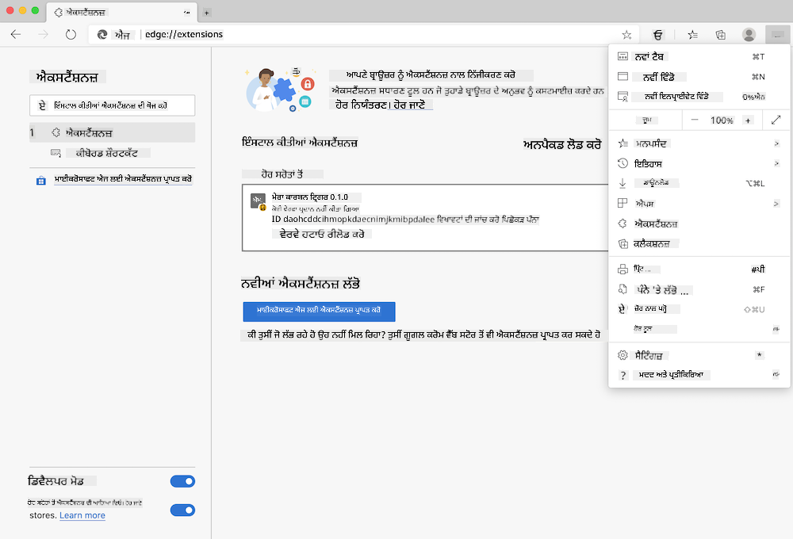

<!--
CO_OP_TRANSLATOR_METADATA:
{
  "original_hash": "dd58ae1b7707034f055718c1b68bc8de",
  "translation_date": "2025-08-25T23:54:37+00:00",
  "source_file": "5-browser-extension/solution/translation/README.hi.md",
  "language_code": "pa"
}
-->
# ਕਾਰਬਨ ਟ੍ਰਿਗਰ ਬ੍ਰਾਊਜ਼ਰ ਐਕਸਟੈਂਸ਼ਨ: ਪੂਰਾ ਕੀਤਾ ਹੋਇਆ ਕੋਡ

ਬਿਜਲੀ ਦੀ ਵਰਤੋਂ ਨੂੰ ਟਰੈਕ ਕਰਨ ਲਈ tmrow ਦੇ C02 ਸਿਗਨਲ API ਦਾ ਇਸਤੇਮਾਲ ਕਰਦੇ ਹੋਏ, ਇੱਕ ਬ੍ਰਾਊਜ਼ਰ ਐਕਸਟੈਂਸ਼ਨ ਬਣਾਉਣਾ ਤਾਂ ਜੋ ਤੁਹਾਡੇ ਬ੍ਰਾਊਜ਼ਰ ਵਿੱਚ ਤੁਹਾਡੇ ਖੇਤਰ ਦੀ ਬਿਜਲੀ ਦੀ ਵਰਤੋਂ ਕਿੰਨੀ ਭਾਰੀ ਹੈ, ਇਸ ਬਾਰੇ ਤੁਹਾਨੂੰ ਇੱਕ ਯਾਦ ਦਿਵਾਈ ਜਾ ਸਕੇ। ਇਸ ਐਕਸਟੈਂਸ਼ਨ ਨੂੰ ਵਰਤਣ ਨਾਲ ਤੁਹਾਨੂੰ ਇਸ ਜਾਣਕਾਰੀ ਦੇ ਆਧਾਰ 'ਤੇ ਆਪਣੀਆਂ ਗਤੀਵਿਧੀਆਂ ਬਾਰੇ ਫੈਸਲੇ ਕਰਨ ਵਿੱਚ ਮਦਦ ਮਿਲੇਗੀ।


## ਸ਼ੁਰੂਆਤ ਕਰਨਾ

ਤੁਹਾਨੂੰ [npm](https://npmjs.com) ਇੰਸਟਾਲ ਕਰਨਾ ਹੋਵੇਗਾ। ਆਪਣੇ ਕੰਪਿਊਟਰ 'ਤੇ ਇੱਕ ਫੋਲਡਰ ਵਿੱਚ ਇਸ ਕੋਡ ਦੀ ਇੱਕ ਕਾਪੀ ਡਾਊਨਲੋਡ ਕਰੋ।

ਸਾਰੇ ਲੋੜੀਂਦੇ ਪੈਕੇਜ ਇੰਸਟਾਲ ਕਰੋ:

```
npm install
```

ਵੇਬਪੈਕ ਨਾਲ ਐਕਸਟੈਂਸ਼ਨ ਬਣਾਓ:

```
npm run build
```

Edge 'ਤੇ ਇੰਸਟਾਲ ਕਰਨ ਲਈ, ਬ੍ਰਾਊਜ਼ਰ ਦੇ ਉੱਪਰਲੇ ਸੱਜੇ ਕੋਨੇ 'ਤੇ 'ਤਿੰਨ ਡਾਟ' ਮੀਨੂ ਦੀ ਵਰਤੋਂ ਕਰਕੇ ਐਕਸਟੈਂਸ਼ਨ ਪੈਨਲ ਨੂੰ ਲੱਭੋ। ਉੱਥੋਂ, ਇੱਕ ਨਵਾਂ ਐਕਸਟੈਂਸ਼ਨ ਲੋਡ ਕਰਨ ਲਈ 'ਲੋਡ ਅਨਪੈਕਡ' ਚੁਣੋ। ਪ੍ਰੌਮਪਟ 'ਤੇ 'dist' ਫੋਲਡਰ ਖੋਲ੍ਹੋ ਅਤੇ ਐਕਸਟੈਂਸ਼ਨ ਲੋਡ ਹੋ ਜਾਵੇਗਾ। ਇਸਦਾ ਇਸਤੇਮਾਲ ਕਰਨ ਲਈ, ਤੁਹਾਨੂੰ CO2 ਸਿਗਨਲ ਦੀ API ([ਈਮੇਲ ਰਾਹੀਂ ਇੱਥੇ ਪ੍ਰਾਪਤ ਕਰੋ](https://www.co2signal.com/) ਲਈ ਇੱਕ API ਕੁੰਜੀ ਦੀ ਲੋੜ ਹੋਵੇਗੀ - ਇਸ ਪੰਨੇ 'ਤੇ ਬਾਕਸ ਵਿੱਚ ਆਪਣਾ ਈਮੇਲ ਦਰਜ ਕਰੋ) ਅਤੇ [ਤੁਹਾਡੇ ਖੇਤਰ ਲਈ ਕੋਡ](http://api.electricitymap.org/v3/zones) [ਇਲੈਕਟ੍ਰਿਸਿਟੀ ਮੈਪ](https://www.electricitymap.org/map) ਤੋਂ (ਉਦਾਹਰਣ ਲਈ, ਬੋਸਟਨ ਵਿੱਚ, ਮੈਂ 'US-NEISO' ਦੀ ਵਰਤੋਂ ਕਰਦਾ ਹਾਂ)।



ਜਦੋਂ API ਕੁੰਜੀ ਅਤੇ ਖੇਤਰ ਐਕਸਟੈਂਸ਼ਨ ਇੰਟਰਫੇਸ ਵਿੱਚ ਦਰਜ ਕੀਤੇ ਜਾਂਦੇ ਹਨ, ਬ੍ਰਾਊਜ਼ਰ ਐਕਸਟੈਂਸ਼ਨ ਬਾਰ ਵਿੱਚ ਰੰਗੀਨ ਡਾਟ ਤੁਹਾਡੇ ਖੇਤਰ ਦੀ ਊਰਜਾ ਦੀ ਵਰਤੋਂ ਨੂੰ ਦਰਸਾਉਣ ਲਈ ਬਦਲ ਜਾਣਾ ਚਾਹੀਦਾ ਹੈ ਅਤੇ ਤੁਹਾਨੂੰ ਇਹ ਸੰਕੇਤ ਦੇਣਾ ਚਾਹੀਦਾ ਹੈ ਕਿ ਊਰਜਾ-ਭਾਰੀ ਗਤੀਵਿਧੀਆਂ ਤੁਹਾਡੇ ਲਈ ਕਦੋਂ ਉਚਿਤ ਹੋਣਗੀਆਂ। ਇਸ 'ਡਾਟ' ਪ੍ਰਣਾਲੀ ਦੇ ਪਿੱਛੇ ਦੀ ਧਾਰਨਾ ਮੈਨੂੰ ਕੈਲੀਫੋਰਨੀਆ ਦੇ ਉਤਸਰਜਨ ਲਈ [ਐਨਰਜੀ ਲੌਲੀਪੌਪ ਐਕਸਟੈਂਸ਼ਨ](https://energylollipop.com/) ਤੋਂ ਮਿਲੀ ਸੀ।

**ਅਸਵੀਕਰਤਾ**:  
ਇਹ ਦਸਤਾਵੇਜ਼ AI ਅਨੁਵਾਦ ਸੇਵਾ [Co-op Translator](https://github.com/Azure/co-op-translator) ਦੀ ਵਰਤੋਂ ਕਰਕੇ ਅਨੁਵਾਦ ਕੀਤਾ ਗਿਆ ਹੈ। ਜਦੋਂ ਕਿ ਅਸੀਂ ਸਹੀ ਹੋਣ ਦੀ ਕੋਸ਼ਿਸ਼ ਕਰਦੇ ਹਾਂ, ਕਿਰਪਾ ਕਰਕੇ ਧਿਆਨ ਦਿਓ ਕਿ ਸਵੈਚਾਲਿਤ ਅਨੁਵਾਦਾਂ ਵਿੱਚ ਗਲਤੀਆਂ ਜਾਂ ਅਸੁੱਤੀਆਂ ਹੋ ਸਕਦੀਆਂ ਹਨ। ਮੂਲ ਦਸਤਾਵੇਜ਼ ਨੂੰ ਇਸਦੀ ਮੂਲ ਭਾਸ਼ਾ ਵਿੱਚ ਅਧਿਕਾਰਤ ਸਰੋਤ ਮੰਨਿਆ ਜਾਣਾ ਚਾਹੀਦਾ ਹੈ। ਮਹੱਤਵਪੂਰਨ ਜਾਣਕਾਰੀ ਲਈ, ਪੇਸ਼ੇਵਰ ਮਨੁੱਖੀ ਅਨੁਵਾਦ ਦੀ ਸਿਫਾਰਸ਼ ਕੀਤੀ ਜਾਂਦੀ ਹੈ। ਇਸ ਅਨੁਵਾਦ ਦੀ ਵਰਤੋਂ ਤੋਂ ਪੈਦਾ ਹੋਣ ਵਾਲੇ ਕਿਸੇ ਵੀ ਗਲਤਫਹਿਮੀ ਜਾਂ ਗਲਤ ਵਿਆਖਿਆ ਲਈ ਅਸੀਂ ਜ਼ਿੰਮੇਵਾਰ ਨਹੀਂ ਹਾਂ।