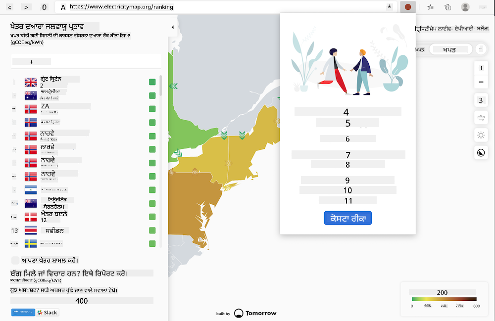

<!--
CO_OP_TRANSLATOR_METADATA:
{
  "original_hash": "9a6b22a2eff0f499b66236be973b24ad",
  "translation_date": "2025-08-25T23:59:55+00:00",
  "source_file": "5-browser-extension/solution/translation/README.it.md",
  "language_code": "pa"
}
-->
# ਕਾਰਬਨ ਟ੍ਰਿਗਰ ਬ੍ਰਾਊਜ਼ਰ ਐਕਸਟੈਂਸ਼ਨ: ਸ਼ੁਰੂ ਕਰਨ ਲਈ ਕੋਡ

ਤੁਸੀਂ tmrow ਦੀ Signal CO2 API ਦੀ ਵਰਤੋਂ ਕਰਕੇ ਬਿਜਲੀ ਦੀ ਖਪਤ ਦੀ ਨਿਗਰਾਨੀ ਕਰਨ ਲਈ ਇੱਕ ਬ੍ਰਾਊਜ਼ਰ ਐਕਸਟੈਂਸ਼ਨ ਬਣਾਉਗੇ, ਤਾਂ ਜੋ ਤੁਹਾਡੇ ਬ੍ਰਾਊਜ਼ਰ ਵਿੱਚ ਸਿੱਧੇ ਹੀ ਤੁਹਾਨੂੰ ਇਹ ਯਾਦ ਦਿਵਾਇਆ ਜਾ ਸਕੇ ਕਿ ਤੁਹਾਡੇ ਖੇਤਰ ਵਿੱਚ ਬਿਜਲੀ ਦੀ ਵਰਤੋਂ ਕਿੰਨੀ ਭਾਰੀ ਹੈ। ਇਸ ਐਡ-ਹੌਕ ਐਕਸਟੈਂਸ਼ਨ ਦੀ ਵਰਤੋਂ ਤੁਹਾਨੂੰ ਆਪਣੀਆਂ ਗਤੀਵਿਧੀਆਂ ਨੂੰ ਇਸ ਜਾਣਕਾਰੀ ਦੇ ਆਧਾਰ 'ਤੇ ਮੁਲਾਂਕਣ ਕਰਨ ਵਿੱਚ ਮਦਦ ਕਰੇਗੀ।



## ਸ਼ੁਰੂ ਕਰਨ ਲਈ

ਤੁਹਾਨੂੰ [npm](https://npmjs.com) ਇੰਸਟਾਲ ਹੋਣਾ ਲਾਜ਼ਮੀ ਹੈ। ਇਸ ਕੋਡ ਦੀ ਇੱਕ ਕਾਪੀ ਆਪਣੇ ਕੰਪਿਊਟਰ ਦੇ ਕਿਸੇ ਫੋਲਡਰ ਵਿੱਚ ਡਾਊਨਲੋਡ ਕਰੋ।

ਸਾਰੇ ਲੋੜੀਂਦੇ ਪੈਕੇਜ ਇੰਸਟਾਲ ਕਰੋ:

```
npm install
```

Webpack ਨਾਲ ਐਕਸਟੈਂਸ਼ਨ ਬਣਾਓ:

```
npm run build
```

Edge 'ਤੇ ਇੰਸਟਾਲ ਕਰਨ ਲਈ, ਬ੍ਰਾਊਜ਼ਰ ਦੇ ਸੱਜੇ ਉੱਪਰਲੇ ਕੋਨੇ ਵਿੱਚ "ਤਿੰਨ ਬਿੰਦੂ" ਵਾਲੇ ਮੀਨੂ ਦੀ ਵਰਤੋਂ ਕਰਕੇ ਐਕਸਟੈਂਸ਼ਨ ਪੈਨਲ ਲੱਭੋ। ਜੇਕਰ ਇਹ ਪਹਿਲਾਂ ਤੋਂ ਚਾਲੂ ਨਹੀਂ ਹੈ, ਤਾਂ ਡਿਵੈਲਪਰ ਮੋਡ (ਥੱਲੇ ਖੱਬੇ) ਚਾਲੂ ਕਰੋ। "ਅਨਜ਼ਿੱਪਡ ਲੋਡ ਕਰੋ" ਚੁਣੋ ਤਾਂ ਜੋ ਨਵੀਂ ਐਕਸਟੈਂਸ਼ਨ ਲੋਡ ਕੀਤੀ ਜਾ ਸਕੇ। ਪ੍ਰਾਂਪਟ 'ਤੇ "dist" ਫੋਲਡਰ ਖੋਲ੍ਹੋ ਅਤੇ ਐਕਸਟੈਂਸ਼ਨ ਲੋਡ ਹੋ ਜਾਵੇਗੀ। ਇਸਨੂੰ ਵਰਤਣ ਲਈ, ਤੁਹਾਨੂੰ CO2 Signal API ਲਈ ਇੱਕ API ਕੁੰਜੀ ਦੀ ਲੋੜ ਹੋਵੇਗੀ (ਤੁਸੀਂ ਇਸਨੂੰ [ਇੱਥੇ ਈਮੇਲ ਰਾਹੀਂ ਪ੍ਰਾਪਤ ਕਰ ਸਕਦੇ ਹੋ](https://www.co2signal.com/) - ਇਸ ਪੰਨੇ 'ਤੇ ਬਾਕਸ ਵਿੱਚ ਆਪਣੀ ਈਮੇਲ ਦਰਜ ਕਰੋ) ਅਤੇ ਆਪਣੇ ਖੇਤਰ ਲਈ [ਮਾਪ ਕੋਡ](http://api.electricitymap.org/v3/zones), ਜੋ ਕਿ [ਬਿਜਲੀ ਮਾਪਾ](https://www.electricitymap.org/map) ਨਾਲ ਸਬੰਧਤ ਹੈ (ਉਦਾਹਰਣ ਲਈ, ਬੋਸਟਨ ਵਿੱਚ "US-NEISO")।


ਜਦੋਂ API ਕੁੰਜੀ ਅਤੇ ਖੇਤਰ ਐਕਸਟੈਂਸ਼ਨ ਇੰਟਰਫੇਸ ਵਿੱਚ ਦਰਜ ਕੀਤੇ ਜਾਂਦੇ ਹਨ, ਬ੍ਰਾਊਜ਼ਰ ਐਕਸਟੈਂਸ਼ਨ ਬਾਰ ਵਿੱਚ ਰੰਗਦਾਰ ਬਿੰਦੂ ਖੇਤਰ ਦੀ ਬਿਜਲੀ ਦੀ ਵਰਤੋਂ ਨੂੰ ਦਰਸਾਉਣ ਲਈ ਬਦਲ ਜਾਣਾ ਚਾਹੀਦਾ ਹੈ ਅਤੇ ਇਹ ਸੰਕੇਤ ਦੇਣਾ ਚਾਹੀਦਾ ਹੈ ਕਿ ਕਿਹੜੀਆਂ ਉੱਚ-ਖਪਤ ਵਾਲੀਆਂ ਗਤੀਵਿਧੀਆਂ ਨੂੰ ਅਨੁਕੂਲ ਤੌਰ 'ਤੇ ਅੰਜਾਮ ਦਿੱਤਾ ਜਾ ਸਕਦਾ ਹੈ। ਇਸ "ਬਿੰਦੂ" ਪ੍ਰਣਾਲੀ ਦੇ ਪਿੱਛੇ ਦਾ ਵਿਚਾਰ [Energy Lollipop ਐਕਸਟੈਂਸ਼ਨ](https://energylollipop.com/) ਤੋਂ ਲਿਆ ਗਿਆ ਹੈ, ਜੋ ਕਿ ਕੈਲੀਫੋਰਨੀਆ ਦੀਆਂ ਉਤਸਰਜਨ ਲਈ ਹੈ।

**ਅਸਵੀਕਾਰਨਾ**:  
ਇਹ ਦਸਤਾਵੇਜ਼ AI ਅਨੁਵਾਦ ਸੇਵਾ [Co-op Translator](https://github.com/Azure/co-op-translator) ਦੀ ਵਰਤੋਂ ਕਰਕੇ ਅਨੁਵਾਦ ਕੀਤਾ ਗਿਆ ਹੈ। ਜਦੋਂ ਕਿ ਅਸੀਂ ਸਹੀਤਾ ਲਈ ਯਤਨਸ਼ੀਲ ਹਾਂ, ਕਿਰਪਾ ਕਰਕੇ ਧਿਆਨ ਦਿਓ ਕਿ ਸਵੈਚਾਲਿਤ ਅਨੁਵਾਦਾਂ ਵਿੱਚ ਗਲਤੀਆਂ ਜਾਂ ਅਸੁਣੀਕਤਾਵਾਂ ਹੋ ਸਕਦੀਆਂ ਹਨ। ਮੂਲ ਦਸਤਾਵੇਜ਼ ਨੂੰ ਇਸਦੀ ਮੂਲ ਭਾਸ਼ਾ ਵਿੱਚ ਅਧਿਕਾਰਤ ਸਰੋਤ ਮੰਨਿਆ ਜਾਣਾ ਚਾਹੀਦਾ ਹੈ। ਮਹੱਤਵਪੂਰਨ ਜਾਣਕਾਰੀ ਲਈ, ਪੇਸ਼ੇਵਰ ਮਨੁੱਖੀ ਅਨੁਵਾਦ ਦੀ ਸਿਫਾਰਸ਼ ਕੀਤੀ ਜਾਂਦੀ ਹੈ। ਇਸ ਅਨੁਵਾਦ ਦੀ ਵਰਤੋਂ ਤੋਂ ਪੈਦਾ ਹੋਣ ਵਾਲੇ ਕਿਸੇ ਵੀ ਗਲਤਫਹਿਮੀ ਜਾਂ ਗਲਤ ਵਿਆਖਿਆ ਲਈ ਅਸੀਂ ਜ਼ਿੰਮੇਵਾਰ ਨਹੀਂ ਹਾਂ।