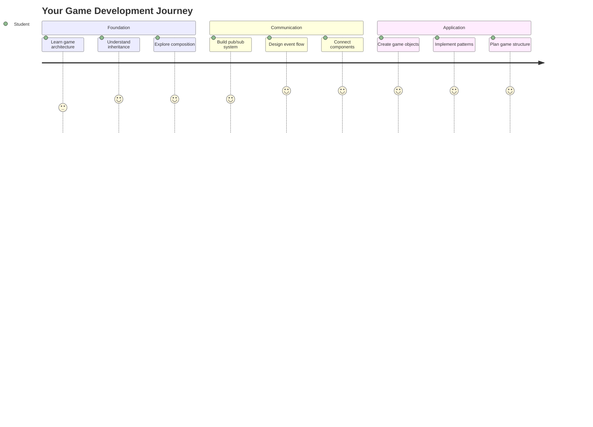
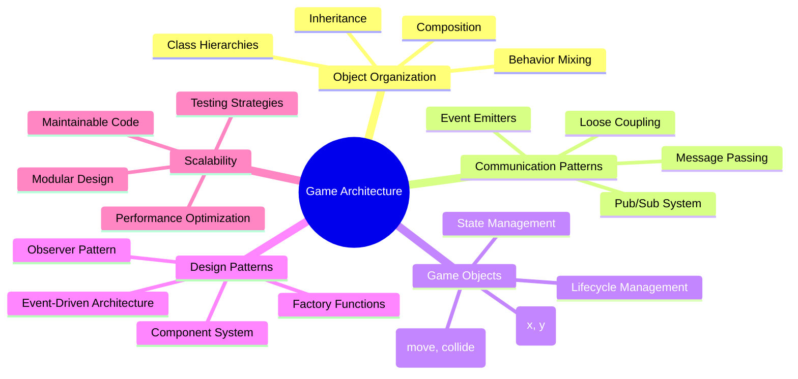
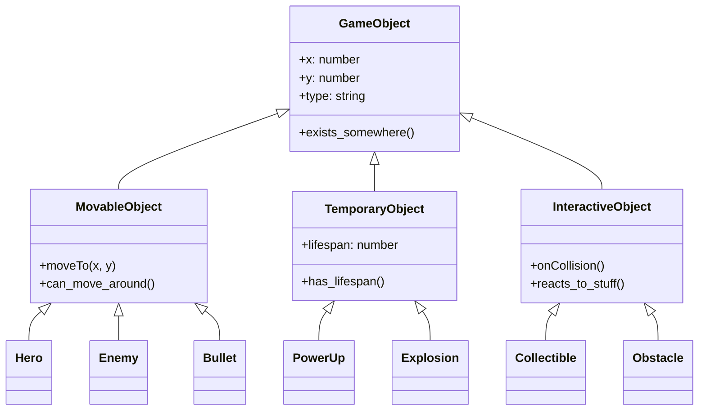
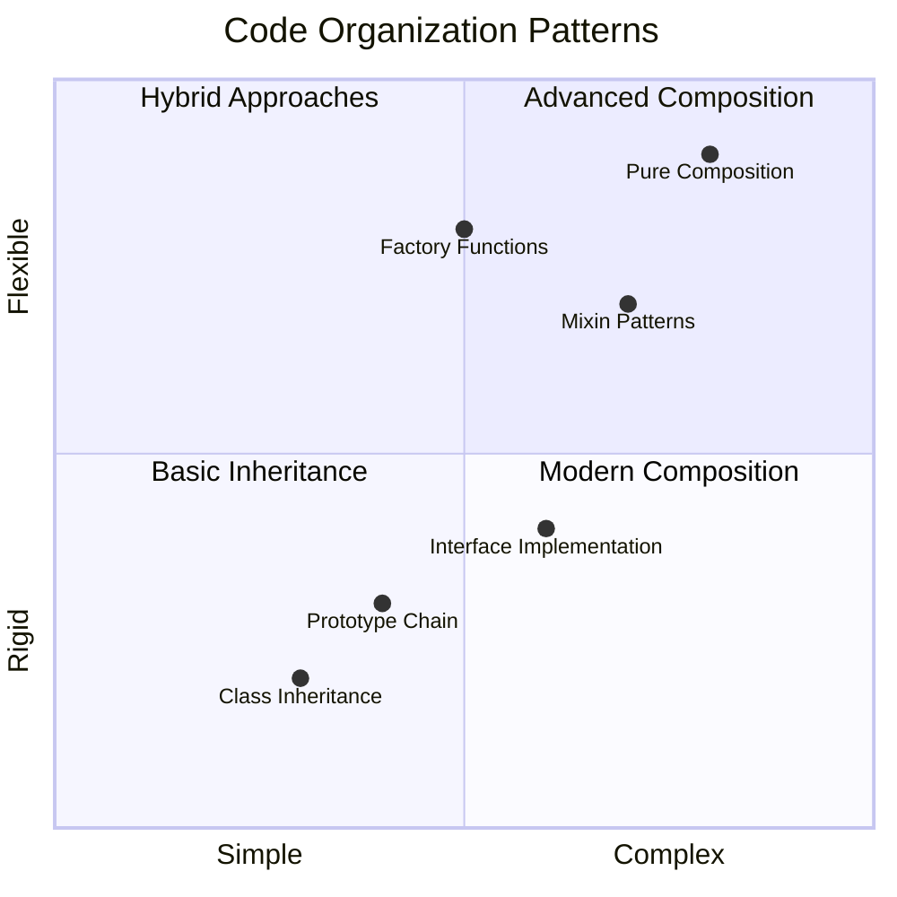
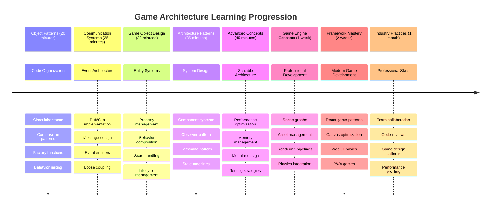

# ਸਪੇਸ ਗੇਮ ਬਣਾਓ ਭਾਗ 1: ਜਾਣ ਪਛਾਣ




NASA ਦੇ ਮਿਸ਼ਨ ਕੰਟਰੋਲ ਵਾਂਗ, ਜੋ ਸਪੇਸ ਲਾਂਚ ਦੌਰਾਨ ਕਈ ਸਿਸਟਮਾਂ ਨੂੰ ਸਹੀ ਤਰੀਕੇ ਨਾਲ ਸਾਂਭਦਾ ਹੈ, ਅਸੀਂ ਇੱਕ ਸਪੇਸ ਗੇਮ ਬਣਾਉਣ ਜਾ ਰਹੇ ਹਾਂ ਜੋ ਦਿਖਾਏਗਾ ਕਿ ਕਿਸ ਤਰ੍ਹਾਂ ਇੱਕ ਪ੍ਰੋਗਰਾਮ ਦੇ ਵੱਖ-ਵੱਖ ਹਿੱਸੇ ਬਿਨਾਂ ਰੁਕਾਵਟ ਦੇ ਇਕੱਠੇ ਕੰਮ ਕਰ ਸਕਦੇ ਹਨ। ਕੁਝ ਐਸਾ ਬਣਾਉਣ ਦੇ ਨਾਲ ਜੋ ਤੁਸੀਂ ਖੇਡ ਸਕਦੇ ਹੋ, ਤੁਸੀਂ ਉਹ ਮੁੱਖ ਪ੍ਰੋਗਰਾਮਿੰਗ ਧਾਰਨਾਵਾਂ ਸਿੱਖੋਗੇ ਜੋ ਕਿਸੇ ਵੀ ਸਾਫਟਵੇਅਰ ਪ੍ਰੋਜੈਕਟ ਲਈ ਲਾਗੂ ਹੁੰਦੀਆਂ ਹਨ।

ਅਸੀਂ ਕੋਡ ਨੂੰ ਸੰਗਠਿਤ ਕਰਨ ਦੇ ਦੋ ਮੁੱਖ ਤਰੀਕੇ: ਵਾਰਸ ਅਤੇ ਰਚਨਾ ਦੀ ਪੜਚੋਲ ਕਰਾਂਗੇ। ਇਹ ਸਿਰਫ਼ ਅਕਾਦਮਿਕ ਧਾਰਨਾਵਾਂ ਨਹੀਂ ਹਨ – ਇਹ ਉਹੀ ਪੈਟਰਨ ਹਨ ਜੋ ਵੀਡੀਓ ਗੇਮਾਂ ਤੋਂ ਬੈਂਕਿੰਗ ਸਿਸਟਮ ਤੱਕ ਸਭ ਕੁਝ ਚਲਾਉਂਦੇ ਹਨ। ਅਸੀਂ ਇੱਕ ਸੰਚਾਰ ਪ੍ਰਣਾਲੀ ਨੂੰ ਵੀ ਲਾਗੂ ਕਰਾਂਗੇ ਜਿਸਨੂੰ pub/sub ਕਿਹਾ ਜਾਂਦਾ ਹੈ, ਜੋ ਸਪੇਸਕ੍ਰਾਫਟ ਵਿੱਚ ਵਰਤੇ ਜਾਣ ਵਾਲੇ ਸੰਚਾਰ ਜਾਲਾਂ ਵਾਂਗ ਕੰਮ ਕਰਦੀ ਹੈ, ਵੱਖ-ਵੱਖ ਹਿੱਸਿਆਂ ਨੂੰ ਜਾਣਕਾਰੀ ਸਾਂਝੀ ਕਰਨ ਦੀ ਆਗਿਆ ਦਿੰਦੀ ਹੈ ਬਿਨਾਂ ਨਿਰਭਰਤਾ ਬਣਾਉਣ ਦੇ।

ਇਸ ਸਿਰੀਜ਼ ਦੇ ਅੰਤ ਤੱਕ, ਤੁਸੀਂ ਸਮਝ ਪਾ ਲੋਗੇ ਕਿ ਐਪਲੀਕੇਸ਼ਨ ਕਿਵੇਂ ਬਣਾਉਣੀਆਂ ਹਨ ਜੋ ਵਧ ਸਕਦੀਆਂ ਹਨ ਅਤੇ ਵਿਕਸਿਤ ਹੋ ਸਕਦੀਆਂ ਹਨ – ਚਾਹੇ ਤੁਸੀਂ ਗੇਮਾਂ, ਵੈੱਬ ਐਪਲੀਕੇਸ਼ਨ ਜਾਂ ਕੋਈ ਹੋਰ ਸਾਫਟਵੇਅਰ ਸਿਸਟਮ ਵਿਕਸਿਤ ਕਰ ਰਹੇ ਹੋਵੋ।



## ਲੈਕਚਰ ਤੋਂ ਪਹਿਲਾਂ ਕਵਿਜ਼

[ਲੈਕਚਰ ਤੋਂ ਪਹਿਲਾਂ ਕਵਿਜ਼](https://ff-quizzes.netlify.app/web/quiz/29)

## ਗੇਮ ਡਿਵੈਲਪਮੈਂਟ ਵਿੱਚ ਵਾਰਸ ਅਤੇ ਰਚਨਾ

ਜਿਵੇਂ-ਜਿਵੇਂ ਪ੍ਰੋਜੈਕਟ ਜਟਿਲ ਹੋ ਜਾਂਦੇ ਹਨ, ਕੋਡ ਦਾ ਸੰਗਠਨ ਮਹੱਤਵਪੂਰਨ ਬਣ ਜਾਂਦਾ ਹੈ। ਜੋ ਇੱਕ ਸਧਾਰਨ ਸਕ੍ਰਿਪਟ ਵਜੋਂ ਸ਼ੁਰੂ ਹੁੰਦਾ ਹੈ, ਉਹ ਬਿਨਾਂ ਸਹੀ ਸਟ੍ਰਕਚਰ ਦੇ ਸਾਂਭਣਾ ਮੁਸ਼ਕਲ ਬਣ ਸਕਦਾ ਹੈ – ਬਿਲਕੁਲ ਜਿਵੇਂ Apollo ਮਿਸ਼ਨ ਨੂੰ ਹਜ਼ਾਰਾਂ ਹਿੱਸਿਆਂ ਦੇ ਵਿਚਕਾਰ ਸਹੀ ਤਾਲਮੇਲ ਦੀ ਲੋੜ ਸੀ।

ਅਸੀਂ ਕੋਡ ਨੂੰ ਸੰਗਠਿਤ ਕਰਨ ਦੇ ਦੋ ਮੁੱਖ ਤਰੀਕੇ ਦੀ ਪੜਚੋਲ ਕਰਾਂਗੇ: ਵਾਰਸ ਅਤੇ ਰਚਨਾ। ਹਰ ਇੱਕ ਦੇ ਵੱਖ-ਵੱਖ ਫਾਇਦੇ ਹਨ, ਅਤੇ ਦੋਵਾਂ ਨੂੰ ਸਮਝਣਾ ਤੁਹਾਨੂੰ ਵੱਖ-ਵੱਖ ਸਥਿਤੀਆਂ ਲਈ ਸਹੀ ਤਰੀਕਾ ਚੁਣਨ ਵਿੱਚ ਮਦਦ ਕਰਦਾ ਹੈ। ਅਸੀਂ ਇਹ ਧਾਰਨਾਵਾਂ ਆਪਣੇ ਸਪੇਸ ਗੇਮ ਦੁਆਰਾ ਦਿਖਾਵਾਂਗੇ, ਜਿੱਥੇ ਹੀਰੋ, ਦੁਸ਼ਮਣ, ਪਾਵਰ-ਅੱਪਸ ਅਤੇ ਹੋਰ ਵਸਤੂਆਂ ਨੂੰ ਕੁਸ਼ਲਤਾਪੂਰਵਕ ਪਰਸਪਰ ਕਰਨਾ ਪਵੇਗਾ।

✅ ਸਭ ਤੋਂ ਪ੍ਰਸਿੱਧ ਪ੍ਰੋਗਰਾਮਿੰਗ ਕਿਤਾਬਾਂ ਵਿੱਚੋਂ ਇੱਕ [ਡਿਜ਼ਾਈਨ ਪੈਟਰਨ](https://en.wikipedia.org/wiki/Design_Patterns) ਬਾਰੇ ਹੈ।

ਕਿਸੇ ਵੀ ਗੇਮ ਵਿੱਚ, ਤੁਹਾਡੇ ਕੋਲ `game objects` ਹੁੰਦੇ ਹਨ – ਇੰਟਰਐਕਟਿਵ ਤੱਤ ਜੋ ਤੁਹਾਡੇ ਗੇਮ ਵਰਲਡ ਨੂੰ ਭਰਦੇ ਹਨ। ਹੀਰੋ, ਦੁਸ਼ਮਣ, ਪਾਵਰ-ਅੱਪਸ ਅਤੇ ਵਿਜ਼ੁਅਲ ਪ੍ਰਭਾਵ ਸਾਰੇ ਗੇਮ ਓਬਜੈਕਟ ਹਨ। ਹਰ ਇੱਕ `x` ਅਤੇ `y` ਮੁੱਲਾਂ ਦੀ ਵਰਤੋਂ ਕਰਕੇ ਨਿਰਧਾਰਿਤ ਸਕ੍ਰੀਨ ਕੋਆਰਡੀਨੇਟਸ 'ਤੇ ਮੌਜੂਦ ਹੁੰਦਾ ਹੈ, ਬਿਲਕੁਲ ਜਿਵੇਂ ਕੋਆਰਡੀਨੇਟ ਪਲੇਨ 'ਤੇ ਬਿੰਦੂ ਪਲਾਟ ਕਰਦੇ ਹੋ।

ਇਹਨਾਂ ਦੇ ਵਿਜ਼ੁਅਲ ਅੰਤਰ ਦੇ ਬਾਵਜੂਦ, ਇਹ ਵਸਤੂਆਂ ਅਕਸਰ ਮੁੱਖ ਵਿਹਾਰ ਸਾਂਝੇ ਕਰਦੀਆਂ ਹਨ:

- **ਇਹ ਕਿਤੇ ਮੌਜੂਦ ਹੁੰਦੀਆਂ ਹਨ** – ਹਰ ਵਸਤੂ ਦੇ x ਅਤੇ y ਕੋਆਰਡੀਨੇਟ ਹੁੰਦੇ ਹਨ ਤਾਂ ਜੋ ਗੇਮ ਜਾਣ ਸਕੇ ਕਿ ਇਸਨੂੰ ਕਿੱਥੇ ਡਰਾਅ ਕਰਨਾ ਹੈ
- **ਕਈ ਚਲ ਸਕਦੀਆਂ ਹਨ** – ਹੀਰੋ ਦੌੜਦੇ ਹਨ, ਦੁਸ਼ਮਣ ਪਿੱਛਾ ਕਰਦੇ ਹਨ, ਗੋਲੀਆਂ ਸਕ੍ਰੀਨ 'ਤੇ ਉੱਡਦੀਆਂ ਹਨ
- **ਇਹਨਾਂ ਦੀ ਉਮਰ ਹੁੰਦੀ ਹੈ** – ਕੁਝ ਹਮੇਸ਼ਾ ਰਹਿੰਦੇ ਹਨ, ਹੋਰ (ਜਿਵੇਂ ਧਮਾਕੇ) ਕੁਝ ਸਮੇਂ ਲਈ ਦਿਖਾਈ ਦਿੰਦੇ ਹਨ ਅਤੇ ਗਾਇਬ ਹੋ ਜਾਂਦੇ ਹਨ
- **ਇਹਨਾਂ ਦਾ ਪ੍ਰਤੀਕਰਮ ਹੁੰਦਾ ਹੈ** – ਜਦੋਂ ਚੀਜ਼ਾਂ ਟਕਰਾਉਂਦੀਆਂ ਹਨ, ਪਾਵਰ-ਅੱਪਸ ਇਕੱਠੇ ਕੀਤੇ ਜਾਂਦੇ ਹਨ, ਹੈਲਥ ਬਾਰ ਅਪਡੇਟ ਹੁੰਦੇ ਹਨ

✅ Pac-Man ਵਰਗੇ ਗੇਮ ਬਾਰੇ ਸੋਚੋ। ਕੀ ਤੁਸੀਂ ਇਸ ਗੇਮ ਵਿੱਚ ਉਪਰੋਕਤ ਚਾਰ ਓਬਜੈਕਟ ਕਿਸਮਾਂ ਦੀ ਪਹਿਚਾਣ ਕਰ ਸਕਦੇ ਹੋ?



### ਕੋਡ ਦੁਆਰਾ ਵਿਹਾਰ ਨੂੰ ਪ੍ਰਗਟ ਕਰਨਾ

ਹੁਣ ਜਦੋਂ ਤੁਸੀਂ ਸਮਝ ਗਏ ਹੋ ਕਿ ਗੇਮ ਓਬਜੈਕਟ ਸਾਂਝੇ ਵਿਹਾਰ ਕਰਦੇ ਹਨ, ਆਓ ਵੇਖੀਏ ਕਿ ਜਾਵਾਸਕ੍ਰਿਪਟ ਵਿੱਚ ਇਹ ਵਿਹਾਰ ਕਿਵੇਂ ਲਾਗੂ ਕਰਨਾ ਹੈ। ਤੁਸੀਂ ਵਿਅਕਤੀਗਤ ਓਬਜੈਕਟਾਂ ਜਾਂ ਕਲਾਸਾਂ ਨਾਲ ਜੁੜੇ ਮੈਥਡਾਂ ਦੁਆਰਾ ਓਬਜੈਕਟ ਵਿਹਾਰ ਨੂੰ ਪ੍ਰਗਟ ਕਰ ਸਕਦੇ ਹੋ, ਅਤੇ ਚੋਣ ਕਰਨ ਲਈ ਕਈ ਤਰੀਕੇ ਹਨ।

**ਕਲਾਸ-ਅਧਾਰਿਤ ਤਰੀਕਾ**

ਕਲਾਸਾਂ ਅਤੇ ਵਾਰਸ ਗੇਮ ਓਬਜੈਕਟਾਂ ਨੂੰ ਸੰਗਠਿਤ ਕਰਨ ਲਈ ਇੱਕ ਸਟ੍ਰਕਚਰਡ ਤਰੀਕਾ ਪ੍ਰਦਾਨ ਕਰਦੇ ਹਨ। ਜਿਵੇਂ Carl Linnaeus ਦੁਆਰਾ ਵਿਕਸਿਤ ਟੈਕਸੋਨੋਮਿਕ ਵਰਗੀਕਰਨ ਪ੍ਰਣਾਲੀ, ਤੁਸੀਂ ਆਮ ਗੁਣਾਂ ਵਾਲੀ ਇੱਕ ਬੇਸ ਕਲਾਸ ਨਾਲ ਸ਼ੁਰੂ ਕਰਦੇ ਹੋ, ਫਿਰ ਵਿਸ਼ੇਸ਼ ਸਮਰੱਥਾਵਾਂ ਜੋੜਦੇ ਹੋਈਆਂ ਇਹਨਾਂ ਮੁੱਢਲੀ ਗੁਣਾਂ ਨੂੰ ਵਾਰਸ ਕਰਨ ਵਾਲੀਆਂ ਵਿਸ਼ੇਸ਼ ਕਲਾਸਾਂ ਬਣਾਉਂਦੇ ਹੋ।

✅ ਵਾਰਸ ਇੱਕ ਮਹੱਤਵਪੂਰਨ ਧਾਰਨਾ ਹੈ। [MDN ਦੇ ਵਾਰਸ ਬਾਰੇ ਲੇਖ](https://developer.mozilla.org/docs/Web/JavaScript/Inheritance_and_the_prototype_chain) 'ਤੇ ਹੋਰ ਜਾਣੋ।

ਇਹ ਹੈ ਕਿ ਤੁਸੀਂ ਕਲਾਸਾਂ ਅਤੇ ਵਾਰਸ ਦੀ ਵਰਤੋਂ ਕਰਕੇ ਗੇਮ ਓਬਜੈਕਟਾਂ ਨੂੰ ਕਿਵੇਂ ਲਾਗੂ ਕਰ ਸਕਦੇ ਹੋ:

```javascript
// Step 1: Create the base GameObject class
class GameObject {
  constructor(x, y, type) {
    this.x = x;
    this.y = y;
    this.type = type;
  }
}
```

**ਇਸਨੂੰ ਕਦਮ-ਦਰ-ਕਦਮ ਤੋੜ ਕੇ ਸਮਝਦੇ ਹਾਂ:**
- ਅਸੀਂ ਇੱਕ ਬੁਨਿਆਦੀ ਟੈਂਪਲੇਟ ਬਣਾਉਂਦੇ ਹਾਂ ਜੋ ਹਰ ਗੇਮ ਓਬਜੈਕਟ ਵਰਤ ਸਕਦਾ ਹੈ
- ਕਨਸਟ੍ਰਕਟਰ ਸੇਵ ਕਰਦਾ ਹੈ ਕਿ ਓਬਜੈਕਟ ਕਿੱਥੇ ਹੈ (`x`, `y`) ਅਤੇ ਇਹ ਕਿਸ ਕਿਸਮ ਦਾ ਹੈ
- ਇਹ ਉਹ ਬੁਨਿਆਦ ਬਣ ਜਾਂਦੀ ਹੈ ਜਿਸ 'ਤੇ ਤੁਹਾਡੇ ਸਾਰੇ ਗੇਮ ਓਬਜੈਕਟ ਬਣਾਏ ਜਾਣਗੇ

```javascript
// Step 2: Add movement capability through inheritance
class Movable extends GameObject {
  constructor(x, y, type) {
    super(x, y, type); // Call parent constructor
  }

  // Add the ability to move to a new position
  moveTo(x, y) {
    this.x = x;
    this.y = y;
  }
}
```

**ਉਪਰੋਕਤ ਵਿੱਚ, ਅਸੀਂ:**
- **GameObject ਕਲਾਸ ਨੂੰ ਵਧਾਇਆ** ਹੈ ਤਾਂ ਜੋ ਮੂਵਮੈਂਟ ਫੰਕਸ਼ਨਲਿਟੀ ਸ਼ਾਮਲ ਕੀਤੀ ਜਾ ਸਕੇ
- **ਪੇਰੈਂਟ ਕਨਸਟ੍ਰਕਟਰ ਨੂੰ ਕਾਲ ਕੀਤਾ** `super()` ਦੀ ਵਰਤੋਂ ਕਰਕੇ ਵਾਰਸ ਕੀਤੇ ਗੁਣਾਂ ਨੂੰ ਸ਼ੁਰੂ ਕਰਨ ਲਈ
- **ਇੱਕ `moveTo()` ਮੈਥਡ ਜੋੜਿਆ** ਜੋ ਓਬਜੈਕਟ ਦੀ ਪੋਜ਼ੀਸ਼ਨ ਅਪਡੇਟ ਕਰਦਾ ਹੈ

```javascript
// Step 3: Create specific game object types
class Hero extends Movable {
  constructor(x, y) {
    super(x, y, 'Hero'); // Set type automatically
  }
}

class Tree extends GameObject {
  constructor(x, y) {
    super(x, y, 'Tree'); // Trees don't need movement
  }
}

// Step 4: Use your game objects
const hero = new Hero(0, 0);
hero.moveTo(5, 5); // Hero can move!

const tree = new Tree(10, 15);
// tree.moveTo() would cause an error - trees can't move
```

**ਇਹ ਧਾਰਨਾਵਾਂ ਨੂੰ ਸਮਝਣਾ:**
- **ਵਿਸ਼ੇਸ਼ ਓਬਜੈਕਟ ਕਿਸਮਾਂ ਬਣਾਉਂਦਾ ਹੈ** ਜੋ ਉਚਿਤ ਵਿਹਾਰ ਵਾਰਸ ਕਰਦੇ ਹਨ
- **ਦਿਖਾਉਂਦਾ ਹੈ** ਕਿ ਵਾਰਸ ਚੁਣਵਾਂਦ ਗੁਣਾਂ ਨੂੰ ਸ਼ਾਮਲ ਕਰਨ ਦੀ ਆਗਿਆ ਦਿੰਦਾ ਹੈ
- **ਦਿਖਾਉਂਦਾ ਹੈ** ਕਿ ਹੀਰੋ ਚਲ ਸਕਦੇ ਹਨ ਜਦਕਿ ਦਰੱਖਤ ਸਥਿਰ ਰਹਿੰਦੇ ਹਨ
- **ਦਿਖਾਉਂਦਾ ਹੈ** ਕਿ ਕਲਾਸ ਹਾਇਰਾਰਕੀ ਅਣਉਚਿਤ ਕਾਰਵਾਈਆਂ ਨੂੰ ਰੋਕਦੀ ਹੈ

✅ ਕੁਝ ਮਿੰਟ ਲਓ ਅਤੇ Pac-Man ਹੀਰੋ (ਜਿਵੇਂ Inky, Pinky ਜਾਂ Blinky) ਨੂੰ ਦੁਬਾਰਾ ਸੋਚੋ ਅਤੇ ਇਹ ਕਿਵੇਂ ਜਾਵਾਸਕ੍ਰਿਪਟ ਵਿੱਚ ਲਿਖਿਆ ਜਾਵੇਗਾ।

**ਰਚਨਾ ਦਾ ਤਰੀਕਾ**

ਰਚਨਾ ਇੱਕ ਮੋਡਿਊਲਰ ਡਿਜ਼ਾਈਨ ਫਿਲਾਸਫੀ ਦੀ ਪਾਲਣਾ ਕਰਦੀ ਹੈ, ਬਿਲਕੁਲ ਜਿਵੇਂ ਇੰਜੀਨੀਅਰ ਸਪੇਸਕ੍ਰਾਫਟ ਨੂੰ ਬਦਲਣਯੋਗ ਹਿੱਸਿਆਂ ਨਾਲ ਡਿਜ਼ਾਈਨ ਕਰਦੇ ਹਨ। ਇੱਕ ਪੇਰੈਂਟ ਕਲਾਸ ਤੋਂ ਵਾਰਸ ਕਰਨ ਦੀ ਬਜਾਏ, ਤੁਸੀਂ ਵਿਸ਼ੇਸ਼ ਵਿਹਾਰਾਂ ਨੂੰ ਜੋੜਦੇ ਹੋ ਤਾਂ ਜੋ ਓਬਜੈਕਟਾਂ ਨੂੰ ਉਹ ਸਮਰੱਥਾਵਾਂ ਮਿਲਣ ਜੋ ਉਹਨਾਂ ਨੂੰ ਲੋੜੀਂਦੀਆਂ ਹਨ। ਇਹ ਤਰੀਕਾ ਸਖ਼ਤ ਹਾਇਰਾਰਕੀਕਲ ਪਾਬੰਦੀਆਂ ਤੋਂ ਬਿਨਾਂ ਲਚਕਦਾਰਤਾ ਪ੍ਰਦਾਨ ਕਰਦਾ ਹੈ।

```javascript
// Step 1: Create base behavior objects
const gameObject = {
  x: 0,
  y: 0,
  type: ''
};

const movable = {
  moveTo(x, y) {
    this.x = x;
    this.y = y;
  }
};
```

**ਇਹ ਕੋਡ ਕੀ ਕਰਦਾ ਹੈ:**
- **ਬੇਸ `gameObject` ਨੂੰ ਪਰਿਭਾਸ਼ਿਤ ਕਰਦਾ ਹੈ** ਜਿਸ ਵਿੱਚ ਪੋਜ਼ੀਸ਼ਨ ਅਤੇ ਕਿਸਮ ਗੁਣ ਹਨ
- **ਵੱਖਰੇ `movable` ਵਿਹਾਰ ਓਬਜੈਕਟ ਨੂੰ ਬਣਾਉਂਦਾ ਹੈ** ਜਿਸ ਵਿੱਚ ਮੂਵਮੈਂਟ ਫੰਕਸ਼ਨਲਿਟੀ ਹੈ
- **ਚਿੰਤਾਵਾਂ ਨੂੰ ਵੱਖ ਕਰਦਾ ਹੈ** ਪੋਜ਼ੀਸ਼ਨ ਡੇਟਾ ਅਤੇ ਮੂਵਮੈਂਟ ਲਾਜ਼ਿਕ ਨੂੰ ਅਜ਼ਾਦ ਰੱਖ ਕੇ

```javascript
// Step 2: Compose objects by combining behaviors
const movableObject = { ...gameObject, ...movable };

// Step 3: Create factory functions for different object types
function createHero(x, y) {
  return {
    ...movableObject,
    x,
    y,
    type: 'Hero'
  };
}

function createStatic(x, y, type) {
  return {
    ...gameObject,
    x,
    y,
    type
  };
}
```

**ਉਪਰੋਕਤ ਵਿੱਚ, ਅਸੀਂ:**
- **ਬੇਸ ਓਬਜੈਕਟ ਗੁਣਾਂ ਨੂੰ ਮੂਵਮੈਂਟ ਵਿਹਾਰ ਨਾਲ ਜੋੜਿਆ** ਹੈ ਸਪ੍ਰੈਡ ਸਿੰਟੈਕਸ ਦੀ ਵਰਤੋਂ ਕਰਕੇ
- **ਫੈਕਟਰੀ ਫੰਕਸ਼ਨ ਬਣਾਏ** ਜੋ ਕਸਟਮਾਈਜ਼ਡ ਓਬਜੈਕਟ ਵਾਪਸ ਕਰਦੇ ਹਨ
- **ਸਖ਼ਤ ਕਲਾਸ ਹਾਇਰਾਰਕੀ ਤੋਂ ਬਿਨਾਂ ਲਚਕਦਾਰ ਓਬਜੈਕਟ ਬਣਾਉਣ ਦੀ ਆਗਿਆ ਦਿੱਤੀ**
- **ਓਬਜੈਕਟਾਂ ਨੂੰ ਉਹ ਵਿਹਾਰ ਦੇਣ ਦੀ ਆਗਿਆ ਦਿੱਤੀ ਜੋ ਉਹਨਾਂ ਨੂੰ ਲੋੜੀਂਦਾ ਹੈ**

```javascript
// Step 4: Create and use your composed objects
const hero = createHero(10, 10);
hero.moveTo(5, 5); // Works perfectly!

const tree = createStatic(0, 0, 'Tree');
// tree.moveTo() is undefined - no movement behavior was composed
```

**ਯਾਦ ਰੱਖਣ ਵਾਲੇ ਮੁੱਖ ਬਿੰਦੂ:**
- **ਵਾਰਸ ਕਰਨ ਦੀ ਬਜਾਏ ਵਿਹਾਰਾਂ ਨੂੰ ਮਿਲਾ ਕੇ ਓਬਜੈਕਟ ਬਣਾਉਂਦਾ ਹੈ**
- **ਸਖ਼ਤ ਹਾਇਰਾਰਕੀਕਲ ਪਾਬੰਦੀਆਂ ਤੋਂ ਵੱਧ ਲਚਕਦਾਰਤਾ ਪ੍ਰਦਾਨ ਕਰਦਾ ਹੈ**
- **ਓਬਜੈਕਟਾਂ ਨੂੰ ਉਹ ਵਿਸ਼ੇਸ਼ਤਾਵਾਂ ਦੇਣ ਦੀ ਆਗਿਆ ਦਿੰਦਾ ਹੈ ਜੋ ਉਹਨਾਂ ਨੂੰ ਲੋੜੀਂਦੀਆਂ ਹਨ**
- **ਸਾਫ਼ ਓਬਜੈਕਟ ਕੌਂਬੀਨੇਸ਼ਨ ਲਈ ਆਧੁਨਿਕ ਜਾਵਾਸਕ੍ਰਿਪਟ ਸਪ੍ਰੈਡ ਸਿੰਟੈਕਸ ਦੀ ਵਰਤੋਂ ਕਰਦਾ ਹੈ**
```

**Which Pattern Should You Choose?**

**Which Pattern Should You Choose?**



> 💡 **ਪ੍ਰੋ ਟਿਪ**: ਦੋਵੇਂ ਪੈਟਰਨ ਆਧੁਨਿਕ ਜਾਵਾਸਕ੍ਰਿਪਟ ਵਿਕਾਸ ਵਿੱਚ ਆਪਣੀ ਜਗ੍ਹਾ ਰੱਖਦੇ ਹਨ। ਕਲਾਸਾਂ ਸਪਸ਼ਟ ਤਰੀਕੇ ਨਾਲ ਪਰਿਭਾਸ਼ਿਤ ਹਾਇਰਾਰਕੀ ਲਈ ਚੰਗੀਆਂ ਕੰਮ ਕਰਦੀਆਂ ਹਨ, ਜਦਕਿ ਰਚਨਾ ਵਧੇਰੇ ਲਚਕਦਾਰਤਾ ਦੀ ਲੋੜ ਹੋਣ 'ਤੇ ਚਮਕਦੀ ਹੈ।
> 
**ਇਹ ਹੈ ਕਿ ਕਦੋਂ ਹਰ ਤਰੀਕੇ ਦੀ ਵਰਤੋਂ ਕਰਨੀ ਹੈ:**
- **ਵਾਰਸ ਚੁਣੋ** ਜਦੋਂ ਤੁਹਾਡੇ ਕੋਲ ਸਪਸ਼ਟ "is-a" ਸੰਬੰਧ ਹਨ (ਹੀਰੋ *is-a* Movable ਓਬਜੈਕਟ)
- **ਰਚਨਾ ਚੁਣੋ** ਜਦੋਂ ਤੁਹਾਨੂੰ "has-a" ਸੰਬੰਧਾਂ ਦੀ ਲੋੜ ਹੈ (ਹੀਰੋ *has* ਮੂਵਮੈਂਟ ਸਮਰੱਥਾਵਾਂ)
- **ਆਪਣੀ ਟੀਮ ਦੀਆਂ ਪਸੰਦਾਂ ਅਤੇ ਪ੍ਰੋਜੈਕਟ ਦੀਆਂ ਲੋੜਾਂ ਨੂੰ ਧਿਆਨ ਵਿੱਚ ਰੱਖੋ**
- **ਯਾਦ ਰੱਖੋ** ਕਿ ਤੁਸੀਂ ਇੱਕੋ ਐਪਲੀਕੇਸ਼ਨ ਵਿੱਚ ਦੋਵੇਂ ਤਰੀਕਿਆਂ ਨੂੰ ਮਿਲਾ ਸਕਦੇ ਹੋ

### 🔄 **ਪੈਡਾਗੌਜੀਕਲ ਚੈੱਕ-ਇਨ**
**ਓਬਜੈਕਟ ਸੰਗਠਨ ਸਮਝ**: ਸੰਚਾਰ ਪੈਟਰਨਾਂ ਵੱਲ ਜਾਣ ਤੋਂ ਪਹਿਲਾਂ, ਇਹ ਯਕੀਨੀ ਬਣਾਓ ਕਿ ਤੁਸੀਂ:
- ✅ ਵਾਰਸ ਅਤੇ ਰਚਨਾ ਦੇ ਵਿਚਕਾਰ ਅੰਤਰ ਦੀ ਵਿਆਖਿਆ ਕਰ ਸਕਦੇ ਹੋ
- ✅ ਕਲਾਸਾਂ ਵਿਰੁੱਧ ਫੈਕਟਰੀ ਫੰਕਸ਼ਨਾਂ ਦੀ ਵਰਤੋਂ ਕਰਨ ਦਾ ਸਮਾਂ ਪਛਾਣ ਸਕਦੇ ਹੋ
- ✅ ਵਾਰਸ ਵਿੱਚ `super()` ਕੀਵਰਡ ਕਿਵੇਂ ਕੰਮ ਕਰਦਾ ਹੈ ਇਹ ਸਮਝ ਸਕਦੇ ਹੋ
- ✅ ਗੇਮ ਡਿਵੈਲਪਮੈਂਟ ਲਈ ਹਰ ਤਰੀਕੇ ਦੇ ਫਾਇਦੇ ਪਛਾਣ ਸਕਦੇ ਹੋ

**ਤੁਰੰਤ ਸਵੈ-ਪ੍ਰੀਖਣ**: ਤੁਸੀਂ ਇੱਕ Flying Enemy ਕਿਵੇਂ ਬਣਾਉਂਦੇ ਜੋ ਚਲ ਸਕਦਾ ਹੈ ਅਤੇ ਉੱਡ ਸਕਦਾ ਹੈ?
- **ਵਾਰਸ ਤਰੀਕਾ**: `class FlyingEnemy extends Movable`
- **ਰਚਨਾ ਤਰੀਕਾ**: `{ ...movable, ...flyable, ...gameObject }`

**ਅਸਲ ਦੁਨੀਆ ਨਾਲ ਜੁੜਾਅ**: ਇਹ ਪੈਟਰਨ ਹਰ ਜਗ੍ਹਾ ਦਿਖਾਈ ਦਿੰਦੇ ਹਨ:
- **React ਕੰਪੋਨੈਂਟਸ**: Props (ਰਚਨਾ) ਵਿਰੁੱਧ ਕਲਾਸ ਵਾਰਸ
- **ਗੇਮ ਇੰਜਨ**: Entity-component systems ਰਚਨਾ ਦੀ ਵਰਤੋਂ ਕਰਦੇ ਹਨ
- **ਮੋਬਾਈਲ ਐਪਸ**: UI ਫਰੇਮਵਰਕ ਅਕਸਰ ਵਾਰਸ ਹਾਇਰਾਰਕੀ ਦੀ ਵਰਤੋਂ ਕਰਦੇ ਹਨ

## ਸੰਚਾਰ ਪੈਟਰਨ: Pub/Sub ਪ੍ਰਣਾਲੀ

ਜਿਵੇਂ-ਜਿਵੇਂ ਐਪਲੀਕੇਸ਼ਨ ਜਟਿਲ ਹੋ ਜਾਂਦੇ ਹਨ, ਹਿੱਸਿਆਂ ਦੇ ਵਿਚਕਾਰ ਸੰਚਾਰ ਦਾ ਪ੍ਰਬੰਧਨ ਚੁਣੌਤੀਪੂਰਨ ਬਣ ਜਾਂਦਾ ਹੈ। ਪਬਲਿਸ਼-ਸਬਸਕ੍ਰਾਈਬ ਪੈਟਰਨ (pub/sub) ਇਸ ਸਮੱਸਿਆ ਨੂੰ ਹਲ ਕਰਦਾ ਹੈ ਰੇਡੀਓ ਬ੍ਰਾਡਕਾਸਟਿੰਗ ਵਰਗੇ ਸਿਧਾਂਤਾਂ ਦੀ ਵਰਤੋਂ ਕਰਕੇ – ਇੱਕ ਟ੍ਰਾਂਸਮਿਟਰ ਕਈ ਰਿਸੀਵਰਾਂ ਤੱਕ ਪਹੁੰਚ ਸਕਦਾ ਹੈ ਬਿਨਾਂ ਇਹ ਜਾਣਨ ਦੇ ਕਿ ਕੌਣ ਸੁਣ ਰਿਹਾ ਹੈ।

ਸੋਚੋ ਕਿ ਜਦੋਂ ਇੱਕ ਹੀਰੋ ਨੂੰ ਨੁਕਸਾਨ ਹੁੰਦਾ ਹੈ: ਹੈਲਥ ਬਾਰ ਅਪਡੇਟ ਹੁੰਦਾ ਹੈ, ਸਾਊਂਡ ਇਫੈਕਟਸ ਚਲਦੇ ਹਨ, ਵਿਜ਼ੁਅਲ ਫੀਡਬੈਕ ਦਿਖਾਈ ਦਿੰਦਾ ਹੈ। ਹੀਰੋ ਓਬਜੈਕਟ ਨੂੰ ਸਿੱਧੇ ਤੌਰ 'ਤੇ ਇਹਨਾਂ ਸਿਸਟਮਾਂ ਨਾਲ ਜੋੜਨ ਦੀ ਬਜਾਏ, pub/sub ਹੀਰੋ ਨੂੰ "ਨੁਕਸਾਨ ਹੋਇਆ" ਸੁਨੇਹਾ ਪ੍ਰਸਾਰਿਤ ਕਰਨ ਦੀ ਆਗਿਆ ਦਿੰਦਾ ਹੈ। ਕੋਈ ਵੀ ਸਿਸਟਮ ਜਿਸਨੂੰ ਪ੍ਰਤੀਕਰਮ ਕਰਨ ਦੀ ਲੋੜ ਹੈ, ਇਸ ਸੁਨੇਹਾ ਕਿਸਮ ਦੀ ਸਬਸਕ੍ਰਿਪਸ਼ਨ ਕਰ ਸਕਦਾ ਹੈ ਅਤੇ ਇਸਦੇ ਅਨੁਸਾਰ ਪ੍ਰਤੀਕਰਮ ਕਰ ਸਕਦਾ ਹੈ।

✅ **Pub/Sub** ਦਾ ਮਤਲਬ ਹੈ 'ਪਬਲਿਸ਼-ਸ
ਗੇਮ ਆਰਕੀਟੈਕਚਰ ਨੂੰ ਬਿਹਤਰ ਬਣਾਉਣ ਲਈ ਪਬ-ਸਬ ਪੈਟਰਨ ਦੇ ਫਾਇਦੇ ਬਾਰੇ ਸੋਚੋ। ਇਹ ਪਤਾ ਕਰੋ ਕਿ ਕਿਹੜੇ ਕੰਪੋਨੈਂਟਸ ਨੂੰ ਇਵੈਂਟਸ ਜਾਰੀ ਕਰਨੇ ਚਾਹੀਦੇ ਹਨ ਅਤੇ ਸਿਸਟਮ ਨੂੰ ਕਿਵੇਂ ਪ੍ਰਤੀਕਿਰਿਆ ਦੇਣੀ ਚਾਹੀਦੀ ਹੈ। ਇੱਕ ਗੇਮ ਕਾਂਸੈਪਟ ਡਿਜ਼ਾਈਨ ਕਰੋ ਅਤੇ ਇਸਦੇ ਕੰਪੋਨੈਂਟਸ ਦੇ ਵਿਚਕਾਰ ਸੰਚਾਰ ਪੈਟਰਨਸ ਨੂੰ ਮੈਪ ਕਰੋ।

## ਪੋਸਟ-ਲੈਕਚਰ ਕਵਿਜ਼

[ਪੋਸਟ-ਲੈਕਚਰ ਕਵਿਜ਼](https://ff-quizzes.netlify.app/web/quiz/30)

## ਰਿਵਿਊ ਅਤੇ ਸਵੈ ਅਧਿਐਨ

ਪਬ/ਸਬ ਬਾਰੇ ਹੋਰ ਜਾਣਕਾਰੀ ਪ੍ਰਾਪਤ ਕਰੋ [ਇਸ ਬਾਰੇ ਪੜ੍ਹ ਕੇ](https://docs.microsoft.com/azure/architecture/patterns/publisher-subscriber/?WT.mc_id=academic-77807-sagibbon)।

### ⚡ **ਅਗਲੇ 5 ਮਿੰਟਾਂ ਵਿੱਚ ਤੁਸੀਂ ਕੀ ਕਰ ਸਕਦੇ ਹੋ**
- [ ] ਕੋਈ ਵੀ HTML5 ਗੇਮ ਆਨਲਾਈਨ ਖੋਲ੍ਹੋ ਅਤੇ ਇਸਦੇ ਕੋਡ ਨੂੰ DevTools ਦੀ ਮਦਦ ਨਾਲ ਇੰਸਪੈਕਟ ਕਰੋ
- [ ] ਇੱਕ ਸਧਾਰਨ HTML5 ਕੈਨਵਾਸ ਐਲੀਮੈਂਟ ਬਣਾਓ ਅਤੇ ਇੱਕ ਬੇਸਿਕ ਸ਼ੇਪ ਡ੍ਰਾ ਕਰੋ
- [ ] `setInterval` ਦੀ ਵਰਤੋਂ ਕਰਕੇ ਇੱਕ ਸਧਾਰਨ ਐਨੀਮੇਸ਼ਨ ਲੂਪ ਬਣਾਉਣ ਦੀ ਕੋਸ਼ਿਸ਼ ਕਰੋ
- [ ] ਕੈਨਵਾਸ API ਡੌਕੂਮੈਂਟੇਸ਼ਨ ਦੀ ਖੋਜ ਕਰੋ ਅਤੇ ਇੱਕ ਡ੍ਰਾਇੰਗ ਮੈਥਡ ਦੀ ਕੋਸ਼ਿਸ਼ ਕਰੋ

### 🎯 **ਇਸ ਘੰਟੇ ਵਿੱਚ ਤੁਸੀਂ ਕੀ ਹਾਸਲ ਕਰ ਸਕਦੇ ਹੋ**
- [ ] ਪੋਸਟ-ਲੈਸਨ ਕਵਿਜ਼ ਪੂਰਾ ਕਰੋ ਅਤੇ ਗੇਮ ਡਿਵੈਲਪਮੈਂਟ ਕਾਂਸੈਪਟਸ ਨੂੰ ਸਮਝੋ
- [ ] HTML, CSS, ਅਤੇ JavaScript ਫਾਈਲਾਂ ਨਾਲ ਆਪਣਾ ਗੇਮ ਪ੍ਰੋਜੈਕਟ ਸਟ੍ਰਕਚਰ ਸੈਟ ਕਰੋ
- [ ] ਇੱਕ ਬੇਸਿਕ ਗੇਮ ਲੂਪ ਬਣਾਓ ਜੋ ਲਗਾਤਾਰ ਅਪਡੇਟ ਅਤੇ ਰੈਂਡਰ ਕਰਦਾ ਹੈ
- [ ] ਕੈਨਵਾਸ 'ਤੇ ਆਪਣੀ ਪਹਿਲੀ ਗੇਮ ਸਪ੍ਰਾਈਟਸ ਡ੍ਰਾ ਕਰੋ
- [ ] ਚਿੱਤਰਾਂ ਅਤੇ ਧੁਨਾਂ ਲਈ ਬੇਸਿਕ ਐਸੈਟ ਲੋਡਿੰਗ ਲਾਗੂ ਕਰੋ

### 📅 **ਤੁਹਾਡਾ ਹਫ਼ਤੇ-ਲੰਬਾ ਗੇਮ ਬਣਾਉਣ ਦਾ ਯੋਜਨਾ**
- [ ] ਸਾਰੇ ਯੋਜਿਤ ਫੀਚਰਾਂ ਨਾਲ ਪੂਰਾ ਸਪੇਸ ਗੇਮ ਪੂਰਾ ਕਰੋ
- [ ] ਪੋਲਿਸ਼ਡ ਗ੍ਰਾਫਿਕਸ, ਸਾਊਂਡ ਇਫੈਕਟਸ, ਅਤੇ ਸਮੂਥ ਐਨੀਮੇਸ਼ਨਸ ਸ਼ਾਮਲ ਕਰੋ
- [ ] ਗੇਮ ਸਟੇਟਸ ਲਾਗੂ ਕਰੋ (ਸਟਾਰਟ ਸਕ੍ਰੀਨ, ਗੇਮਪਲੇ, ਗੇਮ ਓਵਰ)
- [ ] ਸਕੋਰਿੰਗ ਸਿਸਟਮ ਅਤੇ ਪਲੇਅਰ ਪ੍ਰਗਤੀ ਟ੍ਰੈਕਿੰਗ ਬਣਾਓ
- [ ] ਆਪਣੀ ਗੇਮ ਨੂੰ ਸਾਰੇ ਡਿਵਾਈਸਾਂ 'ਤੇ ਰਿਸਪਾਂਸਿਵ ਅਤੇ ਐਕਸੇਸਿਬਲ ਬਣਾਓ
- [ ] ਆਪਣੀ ਗੇਮ ਨੂੰ ਆਨਲਾਈਨ ਸ਼ੇਅਰ ਕਰੋ ਅਤੇ ਪਲੇਅਰਾਂ ਤੋਂ ਫੀਡਬੈਕ ਪ੍ਰਾਪਤ ਕਰੋ

### 🌟 **ਤੁਹਾਡਾ ਮਹੀਨੇ-ਲੰਬਾ ਗੇਮ ਡਿਵੈਲਪਮੈਂਟ**
- [ ] ਵੱਖ-ਵੱਖ ਜਾਨਰਸ ਅਤੇ ਮਕੈਨਿਕਸ ਦੀ ਖੋਜ ਕਰਦੇ ਹੋਏ ਕਈ ਗੇਮ ਬਣਾਓ
- [ ] Phaser ਜਾਂ Three.js ਵਰਗਾ ਗੇਮ ਡਿਵੈਲਪਮੈਂਟ ਫਰੇਮਵਰਕ ਸਿੱਖੋ
- [ ] ਓਪਨ ਸੋਰਸ ਗੇਮ ਡਿਵੈਲਪਮੈਂਟ ਪ੍ਰੋਜੈਕਟਸ ਵਿੱਚ ਯੋਗਦਾਨ ਪਾਉ
- [ ] ਅਡਵਾਂਸਡ ਗੇਮ ਪ੍ਰੋਗਰਾਮਿੰਗ ਪੈਟਰਨਸ ਅਤੇ ਅਪਟਿਮਾਈਜ਼ੇਸ਼ਨ ਵਿੱਚ ਮਾਹਰ ਬਣੋ
- [ ] ਆਪਣੀ ਗੇਮ ਡਿਵੈਲਪਮੈਂਟ ਸਕਿਲਸ ਦਿਖਾਉਣ ਲਈ ਇੱਕ ਪੋਰਟਫੋਲਿਓ ਬਣਾਓ
- [ ] ਗੇਮ ਡਿਵੈਲਪਮੈਂਟ ਅਤੇ ਇੰਟਰਐਕਟਿਵ ਮੀਡੀਆ ਵਿੱਚ ਦਿਲਚਸਪੀ ਰੱਖਣ ਵਾਲਿਆਂ ਨੂੰ ਮਾਰਗਦਰਸ਼ਨ ਦਿਓ

## 🎯 ਤੁਹਾਡਾ ਗੇਮ ਡਿਵੈਲਪਮੈਂਟ ਮਾਹਰਤਾ ਟਾਈਮਲਾਈਨ



### 🛠️ ਤੁਹਾਡਾ ਗੇਮ ਆਰਕੀਟੈਕਚਰ ਟੂਲਕਿਟ ਸੰਖੇਪ

ਇਹ ਪਾਠ ਪੂਰਾ ਕਰਨ ਤੋਂ ਬਾਅਦ, ਹੁਣ ਤੁਹਾਡੇ ਕੋਲ ਹੈ:
- **ਡਿਜ਼ਾਈਨ ਪੈਟਰਨ ਮਾਹਰਤਾ**: ਵਿਰਾਸਤ ਅਤੇ ਰਚਨਾ ਦੇ ਫਾਇਦੇ-ਨੁਕਸਾਨ ਦੀ ਸਮਝ
- **ਇਵੈਂਟ-ਡ੍ਰਿਵਨ ਆਰਕੀਟੈਕਚਰ**: ਸਕੇਲਬਲ ਸੰਚਾਰ ਲਈ ਪਬ/ਸਬ ਲਾਗੂ ਕਰਨਾ
- **ਆਬਜੈਕਟ-ਓਰੀਐਂਟਡ ਡਿਜ਼ਾਈਨ**: ਕਲਾਸ ਹਾਇਰਾਰਕੀਜ਼ ਅਤੇ ਵਿਹਾਰਕ ਰਚਨਾ
- **ਮਾਡਰਨ ਜਾਵਾਸਕ੍ਰਿਪਟ**: ਫੈਕਟਰੀ ਫੰਕਸ਼ਨਸ, ਸਪ੍ਰੈਡ ਸਿੰਟੈਕਸ, ਅਤੇ ES6+ ਪੈਟਰਨਸ
- **ਸਕੇਲਬਲ ਆਰਕੀਟੈਕਚਰ**: ਢਿੱਲੇ ਜੁੜੇ ਹੋਏ ਅਤੇ ਮੋਡਿਊਲਰ ਡਿਜ਼ਾਈਨ ਪ੍ਰਿੰਸਿਪਲਸ
- **ਗੇਮ ਡਿਵੈਲਪਮੈਂਟ ਫਾਊਂਡੇਸ਼ਨ**: ਐਂਟਿਟੀ ਸਿਸਟਮਸ ਅਤੇ ਕੰਪੋਨੈਂਟ ਪੈਟਰਨਸ
- **ਪ੍ਰੋਫੈਸ਼ਨਲ ਪੈਟਰਨਸ**: ਕੋਡ ਆਰਗਨਾਈਜ਼ੇਸ਼ਨ ਲਈ ਇੰਡਸਟਰੀ-ਸਟੈਂਡਰਡ ਪਹੁੰਚ

**ਅਸਲ-ਦੁਨੀਆ ਦੇ ਐਪਲੀਕੇਸ਼ਨਸ**: ਇਹ ਪੈਟਰਨਸ ਸਿੱਧੇ ਤੌਰ 'ਤੇ ਲਾਗੂ ਹੁੰਦੇ ਹਨ:
- **ਫਰੰਟਐਂਡ ਫਰੇਮਵਰਕਸ**: React/Vue ਕੰਪੋਨੈਂਟ ਆਰਕੀਟੈਕਚਰ ਅਤੇ ਸਟੇਟ ਮੈਨੇਜਮੈਂਟ
- **ਬੈਕਐਂਡ ਸੇਵਾਵਾਂ**: ਮਾਈਕ੍ਰੋਸਰਵਿਸ ਸੰਚਾਰ ਅਤੇ ਇਵੈਂਟ-ਡ੍ਰਿਵਨ ਸਿਸਟਮਸ
- **ਮੋਬਾਈਲ ਡਿਵੈਲਪਮੈਂਟ**: iOS/Android ਐਪ ਆਰਕੀਟੈਕਚਰ ਅਤੇ ਨੋਟੀਫਿਕੇਸ਼ਨ ਸਿਸਟਮਸ
- **ਗੇਮ ਇੰਜਨਸ**: Unity, Unreal, ਅਤੇ ਵੈਬ-ਅਧਾਰਿਤ ਗੇਮ ਡਿਵੈਲਪਮੈਂਟ
- **ਐਂਟਰਪ੍ਰਾਈਜ਼ ਸੌਫਟਵੇਅਰ**: ਇਵੈਂਟ ਸੋਰਸਿੰਗ ਅਤੇ ਵੰਡੇ ਸਿਸਟਮ ਡਿਜ਼ਾਈਨ
- **API ਡਿਜ਼ਾਈਨ**: RESTful ਸੇਵਾਵਾਂ ਅਤੇ ਰੀਅਲ-ਟਾਈਮ ਸੰਚਾਰ

**ਪ੍ਰੋਫੈਸ਼ਨਲ ਸਕਿਲਸ ਪ੍ਰਾਪਤ ਕੀਤੇ**: ਹੁਣ ਤੁਸੀਂ ਕਰ ਸਕਦੇ ਹੋ:
- **ਡਿਜ਼ਾਈਨ** ਸਕੇਲਬਲ ਸੌਫਟਵੇਅਰ ਆਰਕੀਟੈਕਚਰਸ ਨੂੰ ਸਾਬਤ ਪੈਟਰਨਸ ਦੀ ਵਰਤੋਂ ਕਰਕੇ
- **ਲਾਗੂ ਕਰੋ** ਇਵੈਂਟ-ਡ੍ਰਿਵਨ ਸਿਸਟਮਸ ਜੋ ਜਟਿਲ ਇੰਟਰੈਕਸ਼ਨਸ ਨੂੰ ਸੰਭਾਲਦੇ ਹਨ
- **ਚੁਣੋ** ਵੱਖ-ਵੱਖ ਸਥਿਤੀਆਂ ਲਈ ਉਚਿਤ ਕੋਡ ਆਰਗਨਾਈਜ਼ੇਸ਼ਨ ਰਣਨੀਤੀਆਂ
- **ਡਿਬੱਗ** ਅਤੇ ਢਿੱਲੇ ਜੁੜੇ ਹੋਏ ਸਿਸਟਮਸ ਨੂੰ ਪ੍ਰਭਾਵਸ਼ਾਲੀ ਢੰਗ ਨਾਲ ਸੰਭਾਲੋ
- **ਸੰਚਾਰ ਕਰੋ** ਤਕਨੀਕੀ ਫੈਸਲੇ ਇੰਡਸਟਰੀ-ਸਟੈਂਡਰਡ ਟਰਮੀਨੋਲੋਜੀ ਦੀ ਵਰਤੋਂ ਕਰਕੇ

**ਅਗਲਾ ਪੱਧਰ**: ਤੁਸੀਂ ਇਹ ਪੈਟਰਨਸ ਨੂੰ ਅਸਲ ਗੇਮ ਵਿੱਚ ਲਾਗੂ ਕਰਨ ਲਈ ਤਿਆਰ ਹੋ, ਅਡਵਾਂਸਡ ਗੇਮ ਡਿਵੈਲਪਮੈਂਟ ਵਿਸ਼ਿਆਂ ਦੀ ਖੋਜ ਕਰਨ ਲਈ, ਜਾਂ ਵੈਬ ਐਪਲੀਕੇਸ਼ਨਸ ਵਿੱਚ ਇਹ ਆਰਕੀਟੈਕਚਰਲ ਕਾਂਸੈਪਟਸ ਲਾਗੂ ਕਰਨ ਲਈ!

🌟 **ਅਚੀਵਮੈਂਟ ਪ੍ਰਾਪਤ ਕੀਤੀ**: ਤੁਸੀਂ ਮੁਢਲੀ ਸੌਫਟਵੇਅਰ ਆਰਕੀਟੈਕਚਰ ਪੈਟਰਨਸ ਵਿੱਚ ਮਾਹਰਤਾ ਹਾਸਲ ਕਰ ਲਈ ਹੈ ਜੋ ਸਧਾਰਨ ਗੇਮ ਤੋਂ ਲੈ ਕੇ ਜਟਿਲ ਐਂਟਰਪ੍ਰਾਈਜ਼ ਸਿਸਟਮਸ ਤੱਕ ਸਭ ਕੁਝ ਪਾਵਰ ਕਰਦੇ ਹਨ!

## ਅਸਾਈਨਮੈਂਟ

[ਇੱਕ ਗੇਮ ਮੌਕਅੱਪ ਬਣਾਓ](assignment.md)

---

**ਅਸਵੀਕਰਤਾ**:  
ਇਹ ਦਸਤਾਵੇਜ਼ AI ਅਨੁਵਾਦ ਸੇਵਾ [Co-op Translator](https://github.com/Azure/co-op-translator) ਦੀ ਵਰਤੋਂ ਕਰਕੇ ਅਨੁਵਾਦ ਕੀਤਾ ਗਿਆ ਹੈ। ਜਦੋਂ ਕਿ ਅਸੀਂ ਸਹੀ ਹੋਣ ਦੀ ਕੋਸ਼ਿਸ਼ ਕਰਦੇ ਹਾਂ, ਕਿਰਪਾ ਕਰਕੇ ਧਿਆਨ ਦਿਓ ਕਿ ਸਵੈਚਾਲਿਤ ਅਨੁਵਾਦਾਂ ਵਿੱਚ ਗਲਤੀਆਂ ਜਾਂ ਅਸੁੱਤੀਆਂ ਹੋ ਸਕਦੀਆਂ ਹਨ। ਮੂਲ ਦਸਤਾਵੇਜ਼ ਨੂੰ ਇਸਦੀ ਮੂਲ ਭਾਸ਼ਾ ਵਿੱਚ ਅਧਿਕਾਰਤ ਸਰੋਤ ਮੰਨਿਆ ਜਾਣਾ ਚਾਹੀਦਾ ਹੈ। ਮਹੱਤਵਪੂਰਨ ਜਾਣਕਾਰੀ ਲਈ, ਪੇਸ਼ੇਵਰ ਮਨੁੱਖੀ ਅਨੁਵਾਦ ਦੀ ਸਿਫਾਰਸ਼ ਕੀਤੀ ਜਾਂਦੀ ਹੈ। ਇਸ ਅਨੁਵਾਦ ਦੀ ਵਰਤੋਂ ਤੋਂ ਪੈਦਾ ਹੋਣ ਵਾਲੇ ਕਿਸੇ ਵੀ ਗਲਤਫਹਿਮੀ ਜਾਂ ਗਲਤ ਵਿਆਖਿਆ ਲਈ ਅਸੀਂ ਜ਼ਿੰਮੇਵਾਰ ਨਹੀਂ ਹਾਂ।