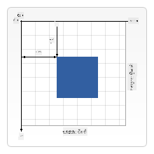

<!--
CO_OP_TRANSLATOR_METADATA:
{
  "original_hash": "056641280211e52fd0adb81b6058ec55",
  "translation_date": "2025-08-28T17:03:51+00:00",
  "source_file": "6-space-game/2-drawing-to-canvas/README.md",
  "language_code": "pa"
}
-->
# ਸਪੇਸ ਗੇਮ ਬਣਾਓ ਭਾਗ 2: ਹੀਰੋ ਅਤੇ ਦੈਤ ਕੈਨਵਸ 'ਤੇ ਡਰਾਅ ਕਰੋ

## ਲੈਕਚਰ ਤੋਂ ਪਹਿਲਾਂ ਕਵੀਜ਼

[ਲੈਕਚਰ ਤੋਂ ਪਹਿਲਾਂ ਕਵੀਜ਼](https://ff-quizzes.netlify.app/web/quiz/31)

## ਕੈਨਵਸ

ਕੈਨਵਸ ਇੱਕ HTML ਤੱਤ ਹੈ ਜਿਸ ਵਿੱਚ ਮੂਲ ਰੂਪ ਵਿੱਚ ਕੋਈ ਸਮੱਗਰੀ ਨਹੀਂ ਹੁੰਦੀ; ਇਹ ਇੱਕ ਖਾਲੀ ਸਲੇਟ ਹੈ। ਤੁਹਾਨੂੰ ਇਸ 'ਤੇ ਡਰਾਇੰਗ ਕਰਕੇ ਇਸ ਵਿੱਚ ਕੁਝ ਜੋੜਨਾ ਪਵੇਗਾ।

✅ [ਕੈਨਵਸ API ਬਾਰੇ ਹੋਰ ਪੜ੍ਹੋ](https://developer.mozilla.org/docs/Web/API/Canvas_API) MDN 'ਤੇ।

ਇਹ ਆਮ ਤੌਰ 'ਤੇ ਪੰਨੇ ਦੇ ਬਾਡੀ ਦੇ ਹਿੱਸੇ ਵਜੋਂ ਇਸ ਤਰ੍ਹਾਂ ਘੋਸ਼ਿਤ ਕੀਤਾ ਜਾਂਦਾ ਹੈ:

```html
<canvas id="myCanvas" width="200" height="100"></canvas>
```

ਉੱਪਰ ਅਸੀਂ `id`, `width` ਅਤੇ `height` ਸੈਟ ਕਰ ਰਹੇ ਹਾਂ।

- `id`: ਇਸ ਨੂੰ ਸੈਟ ਕਰੋ ਤਾਂ ਜੋ ਤੁਸੀਂ ਇਸ ਨਾਲ ਇੰਟਰੈਕਟ ਕਰਨ ਲਈ ਰਿਫਰੈਂਸ ਪ੍ਰਾਪਤ ਕਰ ਸਕੋ।
- `width`: ਇਹ ਤੱਤ ਦੀ ਚੌੜਾਈ ਹੈ।
- `height`: ਇਹ ਤੱਤ ਦੀ ਉਚਾਈ ਹੈ।

## ਸਧਾਰਨ ਜਾਮਿਤੀ ਆਕਾਰ ਡਰਾਅ ਕਰਨਾ

ਕੈਨਵਸ ਚੀਜ਼ਾਂ ਡਰਾਅ ਕਰਨ ਲਈ ਕਾਰਟੀਸ਼ੀਅਨ ਕੋਆਰਡੀਨੇਟ ਸਿਸਟਮ ਦੀ ਵਰਤੋਂ ਕਰ ਰਿਹਾ ਹੈ। ਇਸ ਲਈ, ਇਹ ਕਿਸੇ ਚੀਜ਼ ਦੀ ਸਥਿਤੀ ਦਰਸਾਉਣ ਲਈ x-ਅਕਸ ਅਤੇ y-ਅਕਸ ਦੀ ਵਰਤੋਂ ਕਰਦਾ ਹੈ। ਸਥਿਤੀ `0,0` ਸਿਖਰ ਦੇ ਖੱਬੇ ਕੋਨੇ ਵਿੱਚ ਹੁੰਦੀ ਹੈ ਅਤੇ ਹੇਠਾਂ ਦਾ ਸੱਜਾ ਕੋਨਾ ਉਹ ਹੁੰਦਾ ਹੈ ਜੋ ਤੁਸੀਂ ਕੈਨਵਸ ਦੀ ਚੌੜਾਈ ਅਤੇ ਉਚਾਈ ਵਜੋਂ ਸੈਟ ਕੀਤਾ ਹੈ।


> ਚਿੱਤਰ [MDN](https://developer.mozilla.org/docs/Web/API/Canvas_API/Tutorial/Drawing_shapes) ਤੋਂ

ਕੈਨਵਸ ਤੱਤ 'ਤੇ ਡਰਾਇੰਗ ਕਰਨ ਲਈ ਤੁਹਾਨੂੰ ਹੇਠਾਂ ਦਿੱਤੇ ਕਦਮਾਂ ਦੀ ਪਾਲਣਾ ਕਰਨੀ ਪਵੇਗੀ:

1. **ਕੈਨਵਸ ਤੱਤ ਲਈ ਰਿਫਰੈਂਸ ਪ੍ਰਾਪਤ ਕਰੋ।**
2. **ਕੈਨਵਸ ਤੱਤ 'ਤੇ ਮੌਜੂਦ ਕੌਂਟੈਕਸਟ ਤੱਤ ਲਈ ਰਿਫਰੈਂਸ ਪ੍ਰਾਪਤ ਕਰੋ।**
3. **ਕੌਂਟੈਕਸਟ ਤੱਤ ਦੀ ਵਰਤੋਂ ਕਰਕੇ ਡਰਾਇੰਗ ਆਪਰੇਸ਼ਨ ਕਰੋ।**

ਉਪਰੋਕਤ ਕਦਮਾਂ ਲਈ ਕੋਡ ਆਮ ਤੌਰ 'ਤੇ ਇਸ ਤਰ੍ਹਾਂ ਲੱਗਦਾ ਹੈ:

```javascript
// draws a red rectangle
//1. get the canvas reference
canvas = document.getElementById("myCanvas");

//2. set the context to 2D to draw basic shapes
ctx = canvas.getContext("2d");

//3. fill it with the color red
ctx.fillStyle = 'red';

//4. and draw a rectangle with these parameters, setting location and size
ctx.fillRect(0,0, 200, 200) // x,y,width, height
```

✅ ਕੈਨਵਸ API ਮੁੱਖ ਤੌਰ 'ਤੇ 2D ਆਕਾਰਾਂ 'ਤੇ ਧਿਆਨ ਕੇਂਦਰਿਤ ਕਰਦਾ ਹੈ, ਪਰ ਤੁਸੀਂ ਵੈੱਬਸਾਈਟ 'ਤੇ 3D ਤੱਤ ਵੀ ਡਰਾਅ ਕਰ ਸਕਦੇ ਹੋ; ਇਸ ਲਈ, ਤੁਸੀਂ [WebGL API](https://developer.mozilla.org/docs/Web/API/WebGL_API) ਦੀ ਵਰਤੋਂ ਕਰ ਸਕਦੇ ਹੋ।

ਤੁਸੀਂ ਕੈਨਵਸ API ਨਾਲ ਕਈ ਤਰ੍ਹਾਂ ਦੀਆਂ ਚੀਜ਼ਾਂ ਡਰਾਅ ਕਰ ਸਕਦੇ ਹੋ, ਜਿਵੇਂ:

- **ਜਾਮਿਤੀ ਆਕਾਰ**, ਅਸੀਂ ਪਹਿਲਾਂ ਹੀ ਦਿਖਾਇਆ ਹੈ ਕਿ ਕਿਵੇਂ ਆਯਤ ਬਣਾਉਣਾ ਹੈ, ਪਰ ਤੁਸੀਂ ਹੋਰ ਵੀ ਬਹੁਤ ਕੁਝ ਡਰਾਅ ਕਰ ਸਕਦੇ ਹੋ।
- **ਪਾਠ**, ਤੁਸੀਂ ਕਿਸੇ ਵੀ ਫੌਂਟ ਅਤੇ ਰੰਗ ਨਾਲ ਪਾਠ ਲਿਖ ਸਕਦੇ ਹੋ।
- **ਚਿੱਤਰ**, ਤੁਸੀਂ ਕਿਸੇ ਚਿੱਤਰ ਜਿਵੇਂ .jpg ਜਾਂ .png ਤੋਂ ਚਿੱਤਰ ਡਰਾਅ ਕਰ ਸਕਦੇ ਹੋ।

✅ ਇਸਨੂੰ ਅਜ਼ਮਾਓ! ਤੁਸੀਂ ਜਾਣਦੇ ਹੋ ਕਿ ਆਯਤ ਕਿਵੇਂ ਬਣਾਉਣਾ ਹੈ, ਕੀ ਤੁਸੀਂ ਪੰਨੇ 'ਤੇ ਗੋਲਾਕਾਰ ਬਣਾਉਣ ਦੀ ਕੋਸ਼ਿਸ਼ ਕਰ ਸਕਦੇ ਹੋ? CodePen 'ਤੇ ਕੁਝ ਦਿਲਚਸਪ ਕੈਨਵਸ ਡਰਾਇੰਗਾਂ ਵੇਖੋ। ਇਹ ਰਿਹਾ ਇੱਕ [ਖਾਸ ਤੌਰ 'ਤੇ ਪ੍ਰਭਾਵਸ਼ਾਲੀ ਉਦਾਹਰਨ](https://codepen.io/dissimulate/pen/KrAwx)।

## ਚਿੱਤਰ ਐਸੈਟ ਲੋਡ ਕਰੋ ਅਤੇ ਡਰਾਅ ਕਰੋ

ਤੁਸੀਂ ਇੱਕ `Image` ਆਬਜੈਕਟ ਬਣਾਕੇ ਅਤੇ ਇਸ ਦੀ `src` ਪ੍ਰਾਪਰਟੀ ਸੈਟ ਕਰਕੇ ਚਿੱਤਰ ਐਸੈਟ ਲੋਡ ਕਰਦੇ ਹੋ। ਫਿਰ ਤੁਸੀਂ ਇਸਨੂੰ ਵਰਤਣ ਲਈ ਤਿਆਰ ਹੋਣ ਦੀ ਜਾਣਕਾਰੀ ਲਈ `load` ਇਵੈਂਟ ਨੂੰ ਸੁਣਦੇ ਹੋ। ਕੋਡ ਇਸ ਤਰ੍ਹਾਂ ਲੱਗਦਾ ਹੈ:

### ਐਸੈਟ ਲੋਡ ਕਰੋ

```javascript
const img = new Image();
img.src = 'path/to/my/image.png';
img.onload = () => {
  // image loaded and ready to be used
}
```

### ਐਸੈਟ ਪੈਟਰਨ ਲੋਡ ਕਰੋ

ਉਪਰੋਕਤ ਨੂੰ ਇਸ ਤਰ੍ਹਾਂ ਦੇ ਸੰਰਚਨਾ ਵਿੱਚ ਲਪੇਟਣ ਦੀ ਸਿਫਾਰਸ਼ ਕੀਤੀ ਜਾਂਦੀ ਹੈ, ਤਾਂ ਜੋ ਇਸਨੂੰ ਵਰਤਣਾ ਆਸਾਨ ਹੋਵੇ ਅਤੇ ਤੁਸੀਂ ਇਸਨੂੰ ਸਿਰਫ਼ ਉਸ ਸਮੇਂ ਮੈਨਿਪੂਲੇਟ ਕਰੋ ਜਦੋਂ ਇਹ ਪੂਰੀ ਤਰ੍ਹਾਂ ਲੋਡ ਹੋਵੇ:

```javascript
function loadAsset(path) {
  return new Promise((resolve) => {
    const img = new Image();
    img.src = path;
    img.onload = () => {
      // image loaded and ready to be used
      resolve(img);
    }
  })
}

// use like so

async function run() {
  const heroImg = await loadAsset('hero.png')
  const monsterImg = await loadAsset('monster.png')
}

```

ਸਕ੍ਰੀਨ 'ਤੇ ਗੇਮ ਐਸੈਟ ਡਰਾਅ ਕਰਨ ਲਈ, ਤੁਹਾਡਾ ਕੋਡ ਇਸ ਤਰ੍ਹਾਂ ਲੱਗੇਗਾ:

```javascript
async function run() {
  const heroImg = await loadAsset('hero.png')
  const monsterImg = await loadAsset('monster.png')

  canvas = document.getElementById("myCanvas");
  ctx = canvas.getContext("2d");
  ctx.drawImage(heroImg, canvas.width/2,canvas.height/2);
  ctx.drawImage(monsterImg, 0,0);
}
```

## ਹੁਣ ਤੁਹਾਡਾ ਗੇਮ ਬਣਾਉਣ ਦਾ ਸਮਾਂ ਹੈ

### ਕੀ ਬਣਾਉਣਾ ਹੈ

ਤੁਸੀਂ ਇੱਕ ਵੈੱਬ ਪੰਨਾ ਬਣਾਉਣਾ ਹੈ ਜਿਸ ਵਿੱਚ ਕੈਨਵਸ ਤੱਤ ਹੋਵੇ। ਇਹ ਇੱਕ ਕਾਲੇ ਰੰਗ ਦੀ ਸਕ੍ਰੀਨ `1024*768` ਰੇਂਡਰ ਕਰੇਗਾ। ਅਸੀਂ ਤੁਹਾਨੂੰ ਦੋ ਚਿੱਤਰ ਦਿੱਤੇ ਹਨ:

- ਹੀਰੋ ਜਹਾਜ਼

   

- 5*5 ਦੈਤ

   

### ਵਿਕਾਸ ਸ਼ੁਰੂ ਕਰਨ ਲਈ ਸਿਫਾਰਸ਼ੀ ਕਦਮ

ਉਹ ਫਾਈਲਾਂ ਲੱਭੋ ਜੋ ਤੁਹਾਡੇ ਲਈ `your-work` ਸਬ ਫੋਲਡਰ ਵਿੱਚ ਬਣਾਈ ਗਈਆਂ ਹਨ। ਇਸ ਵਿੱਚ ਹੇਠਾਂ ਦਿੱਤੇ ਤੱਤ ਹੋਣੇ ਚਾਹੀਦੇ ਹਨ:

```bash
-| assets
  -| enemyShip.png
  -| player.png
-| index.html
-| app.js
-| package.json
```

Visual Studio Code ਵਿੱਚ ਇਸ ਫੋਲਡਰ ਦੀ ਕਾਪੀ ਖੋਲ੍ਹੋ। ਤੁਹਾਡੇ ਕੋਲ ਇੱਕ ਲੋਕਲ ਡਿਵੈਲਪਮੈਂਟ ਵਾਤਾਵਰਣ ਸੈਟਅੱਪ ਹੋਣਾ ਚਾਹੀਦਾ ਹੈ, ਖਾਸ ਕਰਕੇ Visual Studio Code ਨਾਲ NPM ਅਤੇ Node ਇੰਸਟਾਲ ਹੋਣੇ ਚਾਹੀਦੇ ਹਨ। ਜੇ ਤੁਹਾਡੇ ਕੰਪਿਊਟਰ 'ਤੇ `npm` ਸੈਟਅੱਪ ਨਹੀਂ ਹੈ, [ਇਹ ਹੈ ਕਿ ਇਸਨੂੰ ਕਿਵੇਂ ਸੈਟਅੱਪ ਕਰਨਾ ਹੈ](https://www.npmjs.com/get-npm)।

ਆਪਣੇ ਪ੍ਰੋਜੈਕਟ ਨੂੰ `your_work` ਫੋਲਡਰ ਵਿੱਚ ਨੈਵੀਗੇਟ ਕਰਕੇ ਸ਼ੁਰੂ ਕਰੋ:

```bash
cd your-work
npm start
```

ਉਪਰੋਕਤ HTTP ਸਰਵਰ ਪਤਾ `http://localhost:5000` 'ਤੇ ਸ਼ੁਰੂ ਕਰੇਗਾ। ਇੱਕ ਬ੍ਰਾਊਜ਼ਰ ਖੋਲ੍ਹੋ ਅਤੇ ਉਹ ਪਤਾ ਦਰਜ ਕਰੋ। ਇਹ ਹੁਣੇ ਤੱਕ ਇੱਕ ਖਾਲੀ ਪੰਨਾ ਹੈ, ਪਰ ਇਹ ਬਦਲ ਜਾਵੇਗਾ।

> ਨੋਟ: ਆਪਣੀ ਸਕ੍ਰੀਨ 'ਤੇ ਬਦਲਾਅ ਵੇਖਣ ਲਈ, ਬ੍ਰਾਊਜ਼ਰ ਨੂੰ ਰਿਫ੍ਰੈਸ਼ ਕਰੋ।

### ਕੋਡ ਸ਼ਾਮਲ ਕਰੋ

`your-work/app.js` ਵਿੱਚ ਲੋੜੀਂਦਾ ਕੋਡ ਸ਼ਾਮਲ ਕਰੋ ਤਾਂ ਜੋ ਹੇਠਾਂ ਦਿੱਤੇ ਸਮੱਸਿਆਵਾਂ ਦਾ ਹੱਲ ਕੀਤਾ ਜਾ ਸਕੇ:

1. **ਕੈਨਵਸ** ਕਾਲੇ ਪਿਛੋਕੜ ਨਾਲ ਡਰਾਅ ਕਰੋ  
   > ਟਿੱਪ: `/app.js` ਵਿੱਚ ਸਹੀ TODO ਦੇ ਹੇਠਾਂ ਦੋ ਲਾਈਨਾਂ ਸ਼ਾਮਲ ਕਰੋ, `ctx` ਤੱਤ ਨੂੰ ਕਾਲਾ ਸੈਟ ਕਰੋ ਅਤੇ ਸਿਖਰ/ਖੱਬੇ ਕੋਆਰਡੀਨੇਟ 0,0 ਤੇ ਸੈਟ ਕਰੋ ਅਤੇ ਉਚਾਈ ਅਤੇ ਚੌੜਾਈ ਕੈਨਵਸ ਦੇ ਬਰਾਬਰ ਸੈਟ ਕਰੋ।
2. **ਟੈਕਸਚਰ ਲੋਡ ਕਰੋ**  
   > ਟਿੱਪ: ਖਿਡਾਰੀ ਅਤੇ ਦੁਸ਼ਮਣ ਦੇ ਚਿੱਤਰਾਂ ਨੂੰ `await loadTexture` ਦੀ ਵਰਤੋਂ ਕਰਕੇ ਅਤੇ ਚਿੱਤਰ ਪਾਥ ਪਾਸ ਕਰਕੇ ਸ਼ਾਮਲ ਕਰੋ। ਤੁਸੀਂ ਇਹਨਾਂ ਨੂੰ ਹੁਣੇ ਤੱਕ ਸਕ੍ਰੀਨ 'ਤੇ ਨਹੀਂ ਵੇਖੋਗੇ!
3. **ਹੀਰੋ ਨੂੰ ਸਕ੍ਰੀਨ ਦੇ ਕੇਂਦਰ ਵਿੱਚ ਡਰਾਅ ਕਰੋ**  
   > ਟਿੱਪ: `drawImage` API ਦੀ ਵਰਤੋਂ ਕਰਕੇ heroImg ਨੂੰ ਸਕ੍ਰੀਨ 'ਤੇ ਡਰਾਅ ਕਰੋ, `canvas.width / 2 - 45` ਅਤੇ `canvas.height - canvas.height / 4)` ਸੈਟ ਕਰੋ।
4. **5*5 ਦੈਤ ਡਰਾਅ ਕਰੋ**  
   > ਟਿੱਪ: ਹੁਣ ਤੁਸੀਂ ਸਕ੍ਰੀਨ 'ਤੇ ਦੁਸ਼ਮਣਾਂ ਨੂੰ ਡਰਾਅ ਕਰਨ ਲਈ ਕੋਡ ਨੂੰ ਅਨਕਮੈਂਟ ਕਰ ਸਕਦੇ ਹੋ। ਅਗਲੇ, `createEnemies` ਫੰਕਸ਼ਨ 'ਤੇ ਜਾਓ ਅਤੇ ਇਸਨੂੰ ਬਣਾਓ।

   ਪਹਿਲਾਂ, ਕੁਝ ਕਾਂਸਟੈਂਟ ਸੈਟ ਕਰੋ:

    ```javascript
    const MONSTER_TOTAL = 5;
    const MONSTER_WIDTH = MONSTER_TOTAL * 98;
    const START_X = (canvas.width - MONSTER_WIDTH) / 2;
    const STOP_X = START_X + MONSTER_WIDTH;
    ```

    ਫਿਰ, ਦੈਤਾਂ ਦੀ ਐਰੇ ਨੂੰ ਸਕ੍ਰੀਨ 'ਤੇ ਡਰਾਅ ਕਰਨ ਲਈ ਇੱਕ ਲੂਪ ਬਣਾਓ:

    ```javascript
    for (let x = START_X; x < STOP_X; x += 98) {
        for (let y = 0; y < 50 * 5; y += 50) {
          ctx.drawImage(enemyImg, x, y);
        }
      }
    ```

## ਨਤੀਜਾ

ਅੰਤਿਮ ਨਤੀਜਾ ਇਸ ਤਰ੍ਹਾਂ ਲੱਗਣਾ ਚਾਹੀਦਾ ਹੈ:


## ਹੱਲ

ਕਿਰਪਾ ਕਰਕੇ ਪਹਿਲਾਂ ਇਸਨੂੰ ਖੁਦ ਹੱਲ ਕਰਨ ਦੀ ਕੋਸ਼ਿਸ਼ ਕਰੋ, ਪਰ ਜੇ ਤੁਸੀਂ ਫਸ ਜਾਓ, ਤਾਂ ਇੱਕ [ਹੱਲ](../../../../6-space-game/2-drawing-to-canvas/solution/app.js) ਵੇਖੋ।

---

## 🚀 ਚੁਣੌਤੀ

ਤੁਸੀਂ 2D-ਕੇਂਦਰਿਤ ਕੈਨਵਸ API ਨਾਲ ਡਰਾਇੰਗ ਬਾਰੇ ਸਿੱਖਿਆ ਹੈ; [WebGL API](https://developer.mozilla.org/docs/Web/API/WebGL_API) ਬਾਰੇ ਵੇਖੋ ਅਤੇ 3D ਆਬਜੈਕਟ ਬਣਾਉਣ ਦੀ ਕੋਸ਼ਿਸ਼ ਕਰੋ।

## ਲੈਕਚਰ ਤੋਂ ਬਾਅਦ ਕਵੀਜ਼

[ਲੈਕਚਰ ਤੋਂ ਬਾਅਦ ਕਵੀਜ਼](https://ff-quizzes.netlify.app/web/quiz/32)

## ਸਮੀਖਿਆ ਅਤੇ ਖੁਦ ਅਧਿਐਨ

ਕੈਨਵਸ API ਬਾਰੇ ਹੋਰ ਜਾਣੋ [ਇਸ ਬਾਰੇ ਪੜ੍ਹ ਕੇ](https://developer.mozilla.org/docs/Web/API/Canvas_API)।

## ਅਸਾਈਨਮੈਂਟ

[ਕੈਨਵਸ API ਨਾਲ ਖੇਡੋ](assignment.md)

---

**ਅਸਵੀਕਾਰਨਾ**:  
ਇਹ ਦਸਤਾਵੇਜ਼ AI ਅਨੁਵਾਦ ਸੇਵਾ [Co-op Translator](https://github.com/Azure/co-op-translator) ਦੀ ਵਰਤੋਂ ਕਰਕੇ ਅਨੁਵਾਦ ਕੀਤਾ ਗਿਆ ਹੈ। ਜਦੋਂ ਕਿ ਅਸੀਂ ਸਹੀ ਹੋਣ ਦੀ ਕੋਸ਼ਿਸ਼ ਕਰਦੇ ਹਾਂ, ਕਿਰਪਾ ਕਰਕੇ ਧਿਆਨ ਦਿਓ ਕਿ ਸਵੈਚਾਲਿਤ ਅਨੁਵਾਦਾਂ ਵਿੱਚ ਗਲਤੀਆਂ ਜਾਂ ਅਸੁਚੱਜੇਪਣ ਹੋ ਸਕਦੇ ਹਨ। ਮੂਲ ਦਸਤਾਵੇਜ਼, ਜੋ ਇਸਦੀ ਮੂਲ ਭਾਸ਼ਾ ਵਿੱਚ ਹੈ, ਨੂੰ ਅਧਿਕਾਰਤ ਸਰੋਤ ਮੰਨਿਆ ਜਾਣਾ ਚਾਹੀਦਾ ਹੈ। ਮਹੱਤਵਪੂਰਨ ਜਾਣਕਾਰੀ ਲਈ, ਪੇਸ਼ੇਵਰ ਮਨੁੱਖੀ ਅਨੁਵਾਦ ਦੀ ਸਿਫਾਰਸ਼ ਕੀਤੀ ਜਾਂਦੀ ਹੈ। ਇਸ ਅਨੁਵਾਦ ਦੀ ਵਰਤੋਂ ਤੋਂ ਪੈਦਾ ਹੋਣ ਵਾਲੇ ਕਿਸੇ ਵੀ ਗਲਤਫਹਿਮੀ ਜਾਂ ਗਲਤ ਵਿਆਖਿਆ ਲਈ ਅਸੀਂ ਜ਼ਿੰਮੇਵਾਰ ਨਹੀਂ ਹਾਂ।