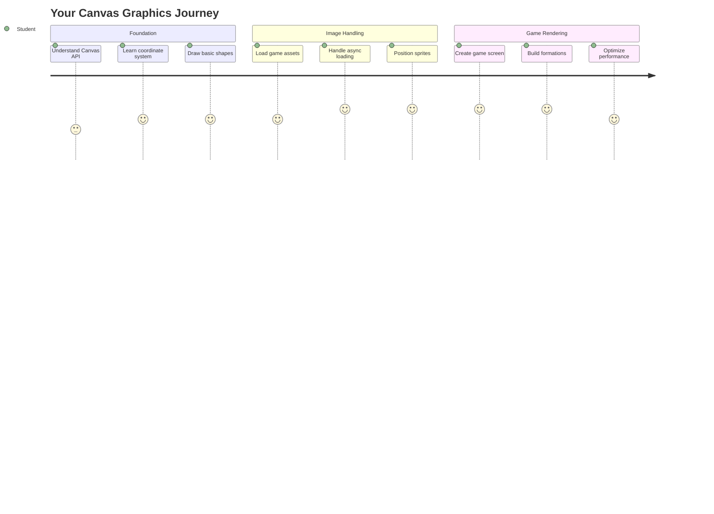
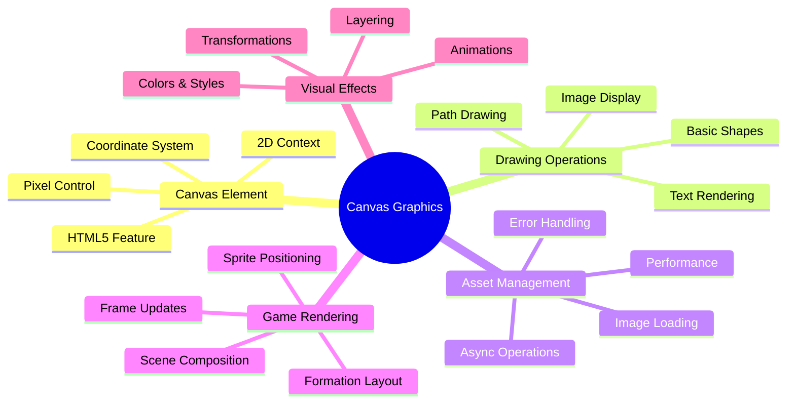
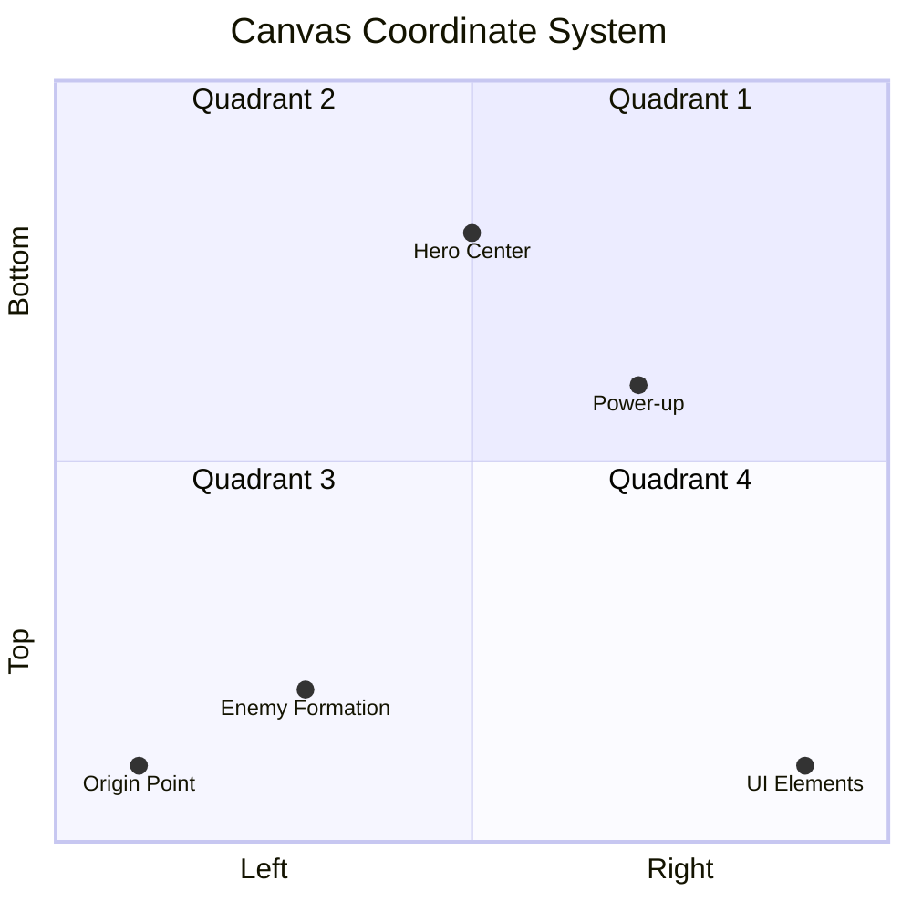
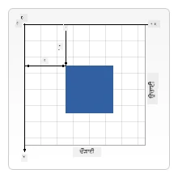
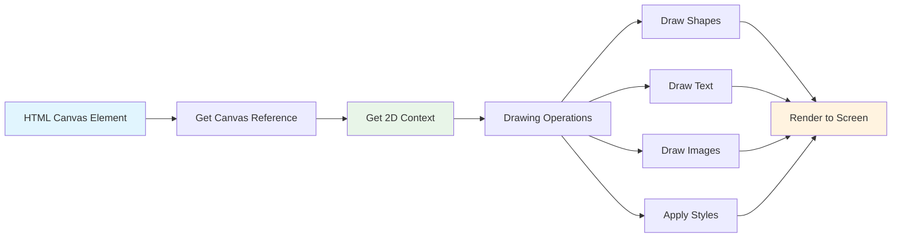
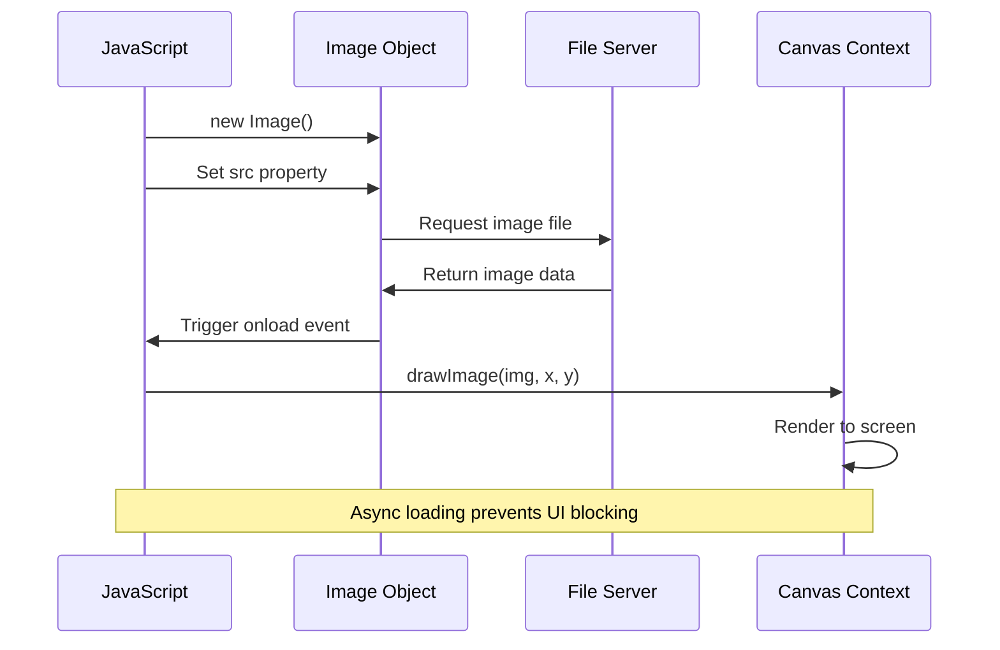
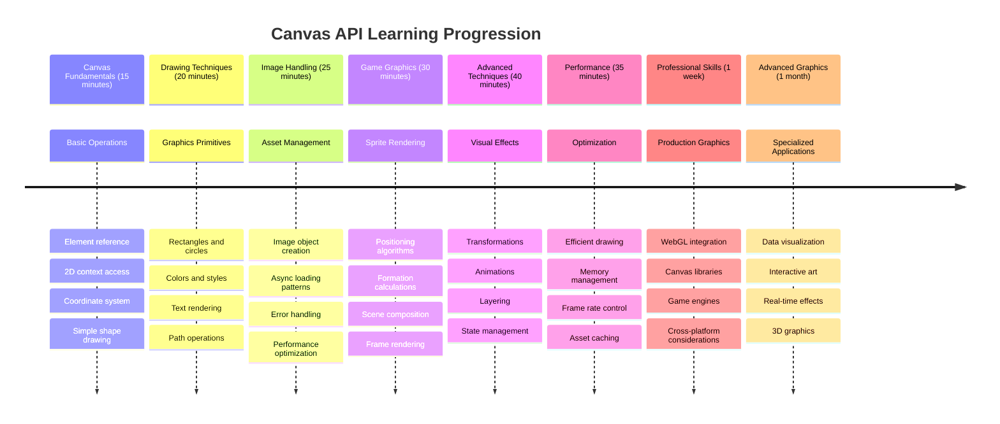

<!--
CO_OP_TRANSLATOR_METADATA:
{
  "original_hash": "7994743c5b21fdcceb36307916ef249a",
  "translation_date": "2025-11-03T16:51:17+00:00",
  "source_file": "6-space-game/2-drawing-to-canvas/README.md",
  "language_code": "pa"
}
-->
# ਸਪੇਸ ਗੇਮ ਬਣਾਓ ਭਾਗ 2: ਹੀਰੋ ਅਤੇ ਮੌਂਸਟਰਜ਼ ਨੂੰ ਕੈਨਵਸ 'ਤੇ ਡਰਾਇੰਗ ਕਰੋ



ਕੈਨਵਸ API ਵੈੱਬ ਡਿਵੈਲਪਮੈਂਟ ਦੇ ਸਭ ਤੋਂ ਸ਼ਕਤੀਸ਼ਾਲੀ ਫੀਚਰਾਂ ਵਿੱਚੋਂ ਇੱਕ ਹੈ, ਜੋ ਤੁਹਾਡੇ ਬ੍ਰਾਊਜ਼ਰ ਵਿੱਚ ਗਤੀਸ਼ੀਲ, ਇੰਟਰਐਕਟਿਵ ਗ੍ਰਾਫਿਕਸ ਬਣਾਉਣ ਲਈ ਵਰਤੀ ਜਾਂਦੀ ਹੈ। ਇਸ ਪਾਠ ਵਿੱਚ, ਅਸੀਂ ਉਸ ਖਾਲੀ HTML `<canvas>` ਤੱਤ ਨੂੰ ਇੱਕ ਗੇਮ ਦੁਨੀਆ ਵਿੱਚ ਬਦਲਾਂਗੇ ਜੋ ਹੀਰੋ ਅਤੇ ਮੌਂਸਟਰਜ਼ ਨਾਲ ਭਰੀ ਹੋਈ ਹੈ। ਕੈਨਵਸ ਨੂੰ ਆਪਣੇ ਡਿਜ਼ਾਈਨ ਬੋਰਡ ਵਜੋਂ ਸੋਚੋ ਜਿੱਥੇ ਕੋਡ ਦ੍ਰਿਸ਼ਮਾਨ ਬਣ ਜਾਂਦਾ ਹੈ।

ਅਸੀਂ ਪਿਛਲੇ ਪਾਠ ਵਿੱਚ ਸਿੱਖੀ ਗਈਆਂ ਚੀਜ਼ਾਂ 'ਤੇ ਅੱਗੇ ਵਧ ਰਹੇ ਹਾਂ, ਅਤੇ ਹੁਣ ਅਸੀਂ ਦ੍ਰਿਸ਼ਮਾਨ ਪੱਖਾਂ ਵਿੱਚ ਡੁੱਬਣ ਜਾ ਰਹੇ ਹਾਂ। ਤੁਸੀਂ ਸਿੱਖੋਗੇ ਕਿ ਗੇਮ ਸਪ੍ਰਾਈਟਸ ਨੂੰ ਕਿਵੇਂ ਲੋਡ ਅਤੇ ਡਿਸਪਲੇ ਕਰਨਾ ਹੈ, ਤੱਤਾਂ ਨੂੰ ਸਹੀ ਢੰਗ ਨਾਲ ਕਿਵੇਂ ਸਥਿਤ ਕਰਨਾ ਹੈ, ਅਤੇ ਆਪਣੇ ਸਪੇਸ ਗੇਮ ਲਈ ਦ੍ਰਿਸ਼ਮਾਨ ਬੁਨਿਆਦ ਕਿਵੇਂ ਬਣਾਉਣੀ ਹੈ। ਇਹ ਸਥਿਰ ਵੈੱਬ ਪੰਨਿਆਂ ਅਤੇ ਗਤੀਸ਼ੀਲ, ਇੰਟਰਐਕਟਿਵ ਤਜਰਬਿਆਂ ਦੇ ਵਿਚਕਾਰ ਪੂਲ ਬਣਾਉਂਦਾ ਹੈ।

ਇਸ ਪਾਠ ਦੇ ਅੰਤ ਤੱਕ, ਤੁਹਾਡੇ ਕੋਲ ਇੱਕ ਪੂਰੀ ਗੇਮ ਸੀਨ ਹੋਵੇਗੀ ਜਿਸ ਵਿੱਚ ਤੁਹਾਡਾ ਹੀਰੋ ਜਹਾਜ਼ ਸਹੀ ਢੰਗ ਨਾਲ ਸਥਿਤ ਹੋਵੇਗਾ ਅਤੇ ਦੁਸ਼ਮਣੀ ਫਾਰਮੇਸ਼ਨ ਲੜਾਈ ਲਈ ਤਿਆਰ ਹੋਵੇਗੀ। ਤੁਸੀਂ ਸਮਝੋਗੇ ਕਿ ਆਧੁਨਿਕ ਗੇਮਾਂ ਬ੍ਰਾਊਜ਼ਰਾਂ ਵਿੱਚ ਗ੍ਰਾਫਿਕਸ ਨੂੰ ਕਿਵੇਂ ਰੈਂਡਰ ਕਰਦੀਆਂ ਹਨ ਅਤੇ ਆਪਣੇ ਇੰਟਰਐਕਟਿਵ ਦ੍ਰਿਸ਼ਮਾਨ ਤਜਰਬੇ ਬਣਾਉਣ ਲਈ ਹੁਨਰ ਪ੍ਰਾਪਤ ਕਰੋਗੇ। ਆਓ ਕੈਨਵਸ ਗ੍ਰਾਫਿਕਸ ਦੀ ਪੜਚੋਲ ਕਰੀਏ ਅਤੇ ਤੁਹਾਡੇ ਸਪੇਸ ਗੇਮ ਨੂੰ ਜ਼ਿੰਦਾ ਕਰੀਏ!



## ਪਾਠ ਤੋਂ ਪਹਿਲਾਂ ਕਵਿਜ਼

[ਪਾਠ ਤੋਂ ਪਹਿਲਾਂ ਕਵਿਜ਼](https://ff-quizzes.netlify.app/web/quiz/31)

## ਕੈਨਵਸ

ਤਾਂ ਇਹ `<canvas>` ਤੱਤ ਅਸਲ ਵਿੱਚ ਕੀ ਹੈ? ਇਹ HTML5 ਦਾ ਹੱਲ ਹੈ ਵੈੱਬ ਬ੍ਰਾਊਜ਼ਰਾਂ ਵਿੱਚ ਗਤੀਸ਼ੀਲ ਗ੍ਰਾਫਿਕਸ ਅਤੇ ਐਨੀਮੇਸ਼ਨ ਬਣਾਉਣ ਲਈ। ਸਧਾਰਨ ਤਸਵੀਰਾਂ ਜਾਂ ਵੀਡੀਓਜ਼ ਦੇ ਵਿਰੁੱਧ, ਜੋ ਸਥਿਰ ਹੁੰਦੀਆਂ ਹਨ, ਕੈਨਵਸ ਤੁਹਾਨੂੰ ਸਕ੍ਰੀਨ 'ਤੇ ਦਿਖਾਈ ਦੇਣ ਵਾਲੀ ਹਰ ਚੀਜ਼ 'ਤੇ ਪਿਕਸਲ-ਪੱਧਰ ਦਾ ਕੰਟਰੋਲ ਦਿੰਦਾ ਹੈ। ਇਹ ਗੇਮਾਂ, ਡਾਟਾ ਵਿਜੁਅਲਾਈਜ਼ੇਸ਼ਨ, ਅਤੇ ਇੰਟਰਐਕਟਿਵ ਕਲਾ ਲਈ ਬਹੁਤ ਹੀ ਉਚਿਤ ਹੈ। ਇਸਨੂੰ ਇੱਕ ਪ੍ਰੋਗਰਾਮੇਬਲ ਡਰਾਇੰਗ ਸਤਹ ਵਜੋਂ ਸੋਚੋ ਜਿੱਥੇ ਜਾਵਾਸਕ੍ਰਿਪਟ ਤੁਹਾਡਾ ਬੁਰਸ਼ ਬਣ ਜਾਂਦਾ ਹੈ।

ਮੂਲ ਰੂਪ ਵਿੱਚ, ਇੱਕ ਕੈਨਵਸ ਤੱਤ ਤੁਹਾਡੇ ਪੰਨੇ 'ਤੇ ਇੱਕ ਖਾਲੀ, ਪਾਰਦਰਸ਼ੀ ਆਯਤਕਾਰ ਵਾਂਗ ਦਿਖਾਈ ਦਿੰਦਾ ਹੈ। ਪਰ ਇਹੀ ਇਸਦੀ ਸੰਭਾਵਨਾ ਹੈ! ਇਸਦੀ ਅਸਲ ਸ਼ਕਤੀ ਤਦ ਸਾਹਮਣੇ ਆਉਂਦੀ ਹੈ ਜਦੋਂ ਤੁਸੀਂ ਜਾਵਾਸਕ੍ਰਿਪਟ ਦੀ ਵਰਤੋਂ ਕਰਕੇ ਆਕਾਰ ਬਣਾਉਂਦੇ ਹੋ, ਤਸਵੀਰਾਂ ਲੋਡ ਕਰਦੇ ਹੋ, ਐਨੀਮੇਸ਼ਨ ਬਣਾਉਂਦੇ ਹੋ, ਅਤੇ ਚੀਜ਼ਾਂ ਨੂੰ ਯੂਜ਼ਰ ਇੰਟਰਐਕਸ਼ਨ ਲਈ ਪ੍ਰਤੀਕਿਰਿਆ ਕਰਨ ਲਈ ਬਣਾਉਂਦੇ ਹੋ। ਇਹ ਕੁਝ ਇਸੇ ਤਰ੍ਹਾਂ ਹੈ ਜਿਵੇਂ 1960 ਦੇ ਦਹਾਕੇ ਵਿੱਚ ਬੈਲ ਲੈਬਜ਼ ਦੇ ਪਹਿਲੇ ਕੰਪਿਊਟਰ ਗ੍ਰਾਫਿਕਸ ਪਾਇਨੀਅਰਜ਼ ਨੇ ਪਹਿਲੀਆਂ ਡਿਜ਼ੀਟਲ ਐਨੀਮੇਸ਼ਨ ਬਣਾਉਣ ਲਈ ਹਰ ਪਿਕਸਲ ਨੂੰ ਪ੍ਰੋਗਰਾਮ ਕੀਤਾ ਸੀ।

✅ [ਕੈਨਵਸ API ਬਾਰੇ ਹੋਰ ਪੜ੍ਹੋ](https://developer.mozilla.org/docs/Web/API/Canvas_API) MDN 'ਤੇ।

ਇਹ ਆਮ ਤੌਰ 'ਤੇ ਪੰਨੇ ਦੇ ਬਾਡੀ ਦੇ ਹਿੱਸੇ ਵਜੋਂ ਐਲਾਨ ਕੀਤਾ ਜਾਂਦਾ ਹੈ:

```html
<canvas id="myCanvas" width="200" height="100"></canvas>
```

**ਇਹ ਕੋਡ ਕੀ ਕਰਦਾ ਹੈ:**
- **ਸੈੱਟ ਕਰਦਾ ਹੈ** `id` ਐਟ੍ਰਿਬਿਊਟ ਤਾਂ ਜੋ ਤੁਸੀਂ ਇਸ ਖਾਸ ਕੈਨਵਸ ਤੱਤ ਨੂੰ ਜਾਵਾਸਕ੍ਰਿਪਟ ਵਿੱਚ ਰੈਫਰ ਕਰ ਸਕੋ
- **ਵਿਆਖਿਆ ਕਰਦਾ ਹੈ** ਪਿਕਸਲ ਵਿੱਚ `width` ਕੈਨਵਸ ਦੇ ਹੋਰਿਜ਼ਾਂਟਲ ਆਕਾਰ ਨੂੰ ਨਿਯੰਤਰਿਤ ਕਰਨ ਲਈ
- **ਸਥਾਪਿਤ ਕਰਦਾ ਹੈ** ਪਿਕਸਲ ਵਿੱਚ `height` ਕੈਨਵਸ ਦੇ ਵਰਟੀਕਲ ਮਾਪ ਨੂੰ ਨਿਰਧਾਰਤ ਕਰਨ ਲਈ

## ਸਧਾਰਨ ਜਾਮਿਤੀ ਆਕਾਰ ਡਰਾਇੰਗ ਕਰਨਾ

ਹੁਣ ਜਦ ਤੁਸੀਂ ਜਾਣਦੇ ਹੋ ਕਿ ਕੈਨਵਸ ਤੱਤ ਕੀ ਹੈ, ਆਓ ਇਸ 'ਤੇ ਅਸਲ ਵਿੱਚ ਡਰਾਇੰਗ ਕਰਨ ਦੀ ਪੜਚੋਲ ਕਰੀਏ! ਕੈਨਵਸ ਇੱਕ ਕੋਆਰਡੀਨੇਟ ਸਿਸਟਮ ਦੀ ਵਰਤੋਂ ਕਰਦਾ ਹੈ ਜੋ ਮੈਥ ਕਲਾਸ ਤੋਂ ਜਾਣੂ ਲੱਗ ਸਕਦਾ ਹੈ, ਪਰ ਕੰਪਿਊਟਰ ਗ੍ਰਾਫਿਕਸ ਲਈ ਇੱਕ ਮਹੱਤਵਪੂਰਨ ਮੋੜ ਹੈ।

ਕੈਨਵਸ ਕਾਰਟੀਸ਼ੀਅਨ ਕੋਆਰਡੀਨੇਟਸ ਦੀ ਵਰਤੋਂ ਕਰਦਾ ਹੈ ਜਿਸ ਵਿੱਚ ਇੱਕ x-ਅਕਸ (ਹੋਰਿਜ਼ਾਂਟਲ) ਅਤੇ y-ਅਕਸ (ਵਰਟੀਕਲ) ਹੁੰਦਾ ਹੈ ਜੋ ਤੁਸੀਂ ਜੋ ਵੀ ਡਰਾਇੰਗ ਕਰਦੇ ਹੋ ਉਸਦੀ ਸਥਿਤੀ ਨੂੰ ਨਿਰਧਾਰਤ ਕਰਦਾ ਹੈ। ਪਰ ਇੱਥੇ ਮੁੱਖ ਅੰਤਰ ਹੈ: ਮੈਥ ਕਲਾਸ ਦੇ ਕੋਆਰਡੀਨੇਟ ਸਿਸਟਮ ਦੇ ਵਿਰੁੱਧ, ਮੂਲ ਬਿੰਦੂ `(0,0)` ਟੌਪ-ਲੇਫਟ ਕੋਨੇ 'ਤੇ ਸ਼ੁਰੂ ਹੁੰਦਾ ਹੈ, ਜਿੱਥੇ x-ਮੁੱਲ ਸੱਜੇ ਵੱਲ ਵਧਦੇ ਹਨ ਅਤੇ y-ਮੁੱਲ ਹੇਠਾਂ ਵਧਦੇ ਹਨ। ਇਹ ਪਹੁੰਚ ਸ਼ੁਰੂਆਤੀ ਕੰਪਿਊਟਰ ਡਿਸਪਲੇਜ਼ ਤੋਂ ਆਉਂਦੀ ਹੈ ਜਿੱਥੇ ਇਲੈਕਟ੍ਰਾਨ ਬੀਮ ਟੌਪ ਤੋਂ ਬਾਟਮ ਤੱਕ ਸਕੈਨ ਕਰਦੇ ਸਨ, ਜਿਸ ਨਾਲ ਟੌਪ-ਲੇਫਟ ਕੁਦਰਤੀ ਸ਼ੁਰੂਆਤੀ ਬਿੰਦੂ ਬਣ ਜਾਂਦਾ ਹੈ।




> ਚਿੱਤਰ [MDN](https://developer.mozilla.org/docs/Web/API/Canvas_API/Tutorial/Drawing_shapes) ਤੋਂ

ਕੈਨਵਸ ਤੱਤ 'ਤੇ ਡਰਾਇੰਗ ਕਰਨ ਲਈ, ਤੁਸੀਂ ਉਹੀ ਤਿੰਨ-ਕਦਮ ਪ੍ਰਕਿਰਿਆ ਅਪਣਾਉਂਦੇ ਹੋ ਜੋ ਸਾਰੇ ਕੈਨਵਸ ਗ੍ਰਾਫਿਕਸ ਦੀ ਬੁਨਿਆਦ ਬਣਦੀ ਹੈ। ਜਦ ਤੁਸੀਂ ਇਹ ਕੁਝ ਵਾਰ ਕਰਦੇ ਹੋ, ਇਹ ਦੂਸਰੀ ਕੁਦਰਤ ਬਣ ਜਾਂਦੀ ਹੈ:



1. **ਤੁਹਾਡੇ ਕੈਨਵਸ ਤੱਤ ਲਈ ਇੱਕ ਰੈਫਰੈਂਸ ਪ੍ਰਾਪਤ ਕਰੋ** DOM ਤੋਂ (ਬਿਲਕੁਲ ਕਿਸੇ ਹੋਰ HTML ਤੱਤ ਵਾਂਗ)
2. **2D ਰੈਂਡਰਿੰਗ ਸੰਦਰਭ ਪ੍ਰਾਪਤ ਕਰੋ** – ਇਹ ਸਾਰੇ ਡਰਾਇੰਗ ਤਰੀਕਿਆਂ ਨੂੰ ਪ੍ਰਦਾਨ ਕਰਦਾ ਹੈ
3. **ਡਰਾਇੰਗ ਸ਼ੁਰੂ ਕਰੋ!** ਸੰਦਰਭ ਦੇ ਬਿਲਟ-ਇਨ ਤਰੀਕਿਆਂ ਦੀ ਵਰਤੋਂ ਕਰਕੇ ਆਪਣੇ ਗ੍ਰਾਫਿਕਸ ਬਣਾਓ

ਇਹ ਕੋਡ ਵਿੱਚ ਇਸ ਤਰ੍ਹਾਂ ਦਿਖਾਈ ਦਿੰਦਾ ਹੈ:

```javascript
// Step 1: Get the canvas element
const canvas = document.getElementById("myCanvas");

// Step 2: Get the 2D rendering context
const ctx = canvas.getContext("2d");

// Step 3: Set fill color and draw a rectangle
ctx.fillStyle = 'red';
ctx.fillRect(0, 0, 200, 200); // x, y, width, height
```

**ਆਓ ਇਸਨੂੰ ਕਦਮ ਦਰ ਕਦਮ ਤੋੜੀਏ:**
- ਅਸੀਂ **ਆਪਣੇ ਕੈਨਵਸ ਤੱਤ ਨੂੰ** ਇਸਦੇ ID ਦੀ ਵਰਤੋਂ ਕਰਕੇ ਪਕੜਦੇ ਹਾਂ ਅਤੇ ਇਸਨੂੰ ਇੱਕ ਵੈਰੀਏਬਲ ਵਿੱਚ ਸਟੋਰ ਕਰਦੇ ਹਾਂ
- ਅਸੀਂ **2D ਰੈਂਡਰਿੰਗ ਸੰਦਰਭ ਪ੍ਰਾਪਤ ਕਰਦੇ ਹਾਂ** – ਇਹ ਸਾਡੇ ਡਰਾਇੰਗ ਤਰੀਕਿਆਂ ਨਾਲ ਭਰਿਆ ਹੋਇਆ ਸੰਦ ਹੈ
- ਅਸੀਂ **ਕੈਨਵਸ ਨੂੰ ਦੱਸਦੇ ਹਾਂ** ਕਿ ਅਸੀਂ ਚੀਜ਼ਾਂ ਨੂੰ ਲਾਲ ਰੰਗ ਨਾਲ ਭਰਨਾ ਚਾਹੁੰਦੇ ਹਾਂ `fillStyle` ਪ੍ਰਾਪਰਟੀ ਦੀ ਵਰਤੋਂ ਕਰਕੇ
- ਅਸੀਂ **ਆਯਤਕਾਰ ਡਰਾਇੰਗ ਕਰਦੇ ਹਾਂ** ਜੋ ਟੌਪ-ਲੇਫਟ ਕੋਨੇ (0,0) ਤੋਂ ਸ਼ੁਰੂ ਹੁੰਦਾ ਹੈ ਜੋ 200 ਪਿਕਸਲ ਚੌੜਾ ਅਤੇ ਲੰਮਾ ਹੈ

✅ ਕੈਨਵਸ API ਮੁੱਖ ਤੌਰ 'ਤੇ 2D ਆਕਾਰਾਂ 'ਤੇ ਧਿਆਨ ਕੇਂਦਰਿਤ ਕਰਦਾ ਹੈ, ਪਰ ਤੁਸੀਂ ਇੱਕ ਵੈੱਬਸਾਈਟ 'ਤੇ 3D ਤੱਤ ਵੀ ਡਰਾਇੰਗ ਕਰ ਸਕਦੇ ਹੋ; ਇਸ ਲਈ, ਤੁਸੀਂ [WebGL API](https://developer.mozilla.org/docs/Web/API/WebGL_API) ਦੀ ਵਰਤੋਂ ਕਰ ਸਕਦੇ ਹੋ।

ਤੁਸੀਂ ਕੈਨਵਸ API ਨਾਲ ਹੇਠਾਂ ਦਿੱਤੀਆਂ ਚੀਜ਼ਾਂ ਡਰਾਇੰਗ ਕਰ ਸਕਦੇ ਹੋ:

- **ਜਾਮਿਤੀ ਆਕਾਰ**, ਅਸੀਂ ਪਹਿਲਾਂ ਹੀ ਦਿਖਾਇਆ ਹੈ ਕਿ ਕਿਵੇਂ ਇੱਕ ਆਯਤਕਾਰ ਡਰਾਇੰਗ ਕਰਨਾ ਹੈ, ਪਰ ਹੋਰ ਬਹੁਤ ਕੁਝ ਹੈ ਜੋ ਤੁਸੀਂ ਡਰਾਇੰਗ ਕਰ ਸਕਦੇ ਹੋ।
- **ਪਾਠ**, ਤੁਸੀਂ ਕਿਸੇ ਵੀ ਫੌਂਟ ਅਤੇ ਰੰਗ ਨਾਲ ਪਾਠ ਲਿਖ ਸਕਦੇ ਹੋ।
- **ਤਸਵੀਰਾਂ**, ਤੁਸੀਂ ਇੱਕ ਤਸਵੀਰ ਡਰਾਇੰਗ ਕਰ ਸਕਦੇ ਹੋ ਜੋ ਇੱਕ .jpg ਜਾਂ .png ਜਿਵੇਂ ਤਸਵੀਰ ਦੇ ਸਰੋਤ 'ਤੇ ਆਧਾਰਿਤ ਹੋਵੇ।

✅ ਇਸਨੂੰ ਅਜ਼ਮਾਓ! ਤੁਸੀਂ ਜਾਣਦੇ ਹੋ ਕਿ ਇੱਕ ਆਯਤਕਾਰ ਕਿਵੇਂ ਡਰਾਇੰਗ ਕਰਨਾ ਹੈ, ਕੀ ਤੁਸੀਂ ਇੱਕ ਪੰਨੇ 'ਤੇ ਇੱਕ ਗੋਲ ਡਰਾਇੰਗ ਕਰ ਸਕਦੇ ਹੋ? ਕੁਝ ਦਿਲਚਸਪ ਕੈਨਵਸ ਡਰਾਇੰਗਾਂ ਨੂੰ CodePen 'ਤੇ ਦੇਖੋ। ਇੱਥੇ ਇੱਕ [ਖਾਸ ਤੌਰ 'ਤੇ ਪ੍ਰਭਾਵਸ਼ਾਲੀ ਉਦਾਹਰਨ ਹੈ](https://codepen.io/dissimulate/pen/KrAwx)।

### 🔄 **ਪੈਡਾਗੌਜੀਕਲ ਚੈਕ-ਇਨ**
**ਕੈਨਵਸ ਬੁਨਿਆਦੀਆਂ ਸਮਝ**: ਚਿੱਤਰ ਲੋਡ ਕਰਨ ਵੱਲ ਵਧਣ ਤੋਂ ਪਹਿਲਾਂ, ਯਕੀਨੀ ਬਣਾਓ ਕਿ ਤੁਸੀਂ ਇਹ ਸਮਝਦੇ ਹੋ:
- ✅ ਕੈਨਵਸ ਕੋਆਰਡੀਨੇਟ ਸਿਸਟਮ ਮੈਥਮੈਟਿਕਲ ਕੋਆਰਡੀਨੇਟਸ ਤੋਂ ਕਿਵੇਂ ਵੱਖਰਾ ਹੈ
- ✅ ਕੈਨਵਸ ਡਰਾਇੰਗ ਕਾਰਵਾਈਆਂ ਲਈ ਤਿੰਨ-ਕਦਮ ਪ੍ਰਕਿਰਿਆ ਨੂੰ ਸਮਝੋ
- ✅ ਪਛਾਣੋ ਕਿ 2D ਰੈਂਡਰਿੰਗ ਸੰਦਰਭ ਕੀ ਪ੍ਰਦਾਨ ਕਰਦਾ ਹੈ
- ✅ ਵੇਰਵਾ ਦਿਓ ਕਿ fillStyle ਅਤੇ fillRect ਕਿਵੇਂ ਇਕੱਠੇ ਕੰਮ ਕਰਦੇ ਹਨ

**ਤੇਜ਼ ਸਵੈ-ਪ੍ਰੀਖਣ**: ਤੁਸੀਂ (100, 50) ਸਥਿਤੀ 'ਤੇ 25 ਦੇ ਅਰਧਵਿਆਸ ਨਾਲ ਇੱਕ ਨੀਲਾ ਗੋਲ ਕਿਵੇਂ ਡਰਾਇੰਗ ਕਰੋਗੇ?
```javascript
ctx.fillStyle = 'blue';
ctx.beginPath();
ctx.arc(100, 50, 25, 0, 2 * Math.PI);
ctx.fill();
```

**ਕੈਨਵਸ ਡਰਾਇੰਗ ਤਰੀਕੇ ਜੋ ਤੁਸੀਂ ਹੁਣ ਜਾਣਦੇ ਹੋ**:
- **fillRect()**: ਭਰੇ ਹੋਏ ਆਯਤਕਾਰ ਡਰਾਇੰਗ ਕਰਦਾ ਹੈ
- **fillStyle**: ਰੰਗ ਅਤੇ ਪੈਟਰਨ ਸੈੱਟ ਕਰਦਾ ਹੈ
- **beginPath()**: ਨਵੇਂ ਡਰਾਇੰਗ ਪਾਥ ਸ਼ੁਰੂ ਕਰਦਾ ਹੈ
- **arc()**: ਗੋਲ ਅਤੇ ਕਰਵ ਬਣਾਉਂਦਾ ਹੈ

## ਇੱਕ ਤਸਵੀਰ ਐਸੈਟ ਲੋਡ ਕਰੋ ਅਤੇ ਡਰਾਇੰਗ ਕਰੋ

ਸਧਾਰਨ ਆਕਾਰ ਡਰਾਇੰਗ ਕਰਨਾ ਸ਼ੁਰੂਆਤ ਕਰਨ ਲਈ ਲਾਭਦਾਇਕ ਹੈ, ਪਰ ਜ਼ਿਆਦਾਤਰ ਗੇਮਾਂ ਨੂੰ ਅਸਲ ਤਸਵੀਰਾਂ ਦੀ ਲੋੜ ਹੁੰਦੀ ਹੈ! ਸਪ੍ਰਾਈਟਸ, ਬੈਕਗਰਾਊਂਡ, ਅਤੇ ਟੈਕਸਚਰ ਉਹ ਹਨ ਜੋ ਗੇਮਾਂ ਨੂੰ ਦ੍ਰਿਸ਼ਮਾਨ ਆਕਰਸ਼ਣ ਦਿੰਦੇ ਹਨ। ਕੈਨਵਸ 'ਤੇ ਤਸਵੀਰਾਂ ਨੂੰ ਲੋਡ ਅਤੇ ਡਿਸਪਲੇ ਕਰਨਾ ਜਾਮਿਤੀ ਆਕਾਰਾਂ ਨੂੰ ਡਰਾਇੰਗ ਕਰਨ ਤੋਂ ਵੱਖਰਾ ਹੈ, ਪਰ ਜਦ ਤੁਸੀਂ ਪ੍ਰਕਿਰਿਆ ਨੂੰ ਸਮਝ ਲੈਂਦੇ ਹੋ ਤਾਂ ਇਹ ਸਿੱਧਾ ਹੈ।

ਸਾਨੂੰ ਇੱਕ `Image` ਆਬਜੈਕਟ ਬਣਾਉਣ ਦੀ ਲੋੜ ਹੈ, ਆਪਣੀ ਤਸਵੀਰ ਫਾਈਲ ਨੂੰ ਲੋਡ ਕਰਨ ਦੀ ਲੋੜ ਹੈ (ਇਹ ਅਸਮਕਾਲੀ ਤੌਰ 'ਤੇ ਹੁੰਦਾ ਹੈ, ਜਿਸਦਾ ਮਤਲਬ ਹੈ "ਪਿਛਲੇ ਪਾਸੇ"), ਅਤੇ ਫਿਰ ਇਸਨੂੰ ਕੈਨਵਸ 'ਤੇ ਡਰਾਇੰਗ ਕਰੋ ਜਦੋਂ ਇਹ ਤਿਆਰ ਹੋਵੇ। ਇਹ ਪਹੁੰਚ ਯਕੀਨੀ ਬਣਾਉਂਦੀ ਹੈ ਕਿ ਤੁਹਾਡੀਆਂ ਤਸਵੀਰਾਂ ਸਹੀ ਤੌਰ 'ਤੇ ਡਿਸਪਲੇ ਹੁੰਦੀਆਂ ਹਨ ਬਿਨਾਂ ਤੁਹਾਡੇ ਐਪਲੀਕੇਸ਼ਨ ਨੂੰ ਰੋਕਣ ਦੇ।



### ਬੁਨਿਆਦੀ ਤਸਵੀਰ ਲੋਡ ਕਰਨਾ

```javascript
const img = new Image();
img.src = 'path/to/my/image.png';
img.onload = () => {
  // Image loaded and ready to be used
  console.log('Image loaded successfully!');
};
```

**ਇਸ ਕੋਡ ਵਿੱਚ ਕੀ ਹੋ ਰਿਹਾ ਹੈ:**
- ਅਸੀਂ **ਇੱਕ ਨਵਾਂ Image ਆਬਜੈਕਟ ਬਣਾਉਂਦੇ ਹਾਂ** ਜੋ ਸਾਡੇ ਸਪ੍ਰਾਈਟ ਜਾਂ ਟੈਕਸਚਰ ਨੂੰ ਰੱਖੇਗਾ
- ਅਸੀਂ **ਇਸਨੂੰ ਦੱਸਦੇ ਹਾਂ** ਕਿ ਕਿਹੜੀ ਤਸਵੀਰ ਫਾਈਲ ਨੂੰ ਲੋਡ ਕਰਨਾ ਹੈ ਸਰੋਤ ਪਾਥ ਸੈੱਟ ਕਰਕੇ
- ਅਸੀਂ **ਲੋਡ ਇਵੈਂਟ ਲਈ ਸੁਣਦੇ ਹਾਂ** ਤਾਂ ਜੋ ਸਾਨੂੰ ਪਤਾ ਲੱਗੇ ਕਿ ਤਸਵੀਰ ਕਦੋਂ ਵਰਤਣ ਲਈ ਤਿਆਰ ਹੈ

### ਤਸਵੀਰਾਂ ਨੂੰ ਲੋਡ ਕਰਨ ਦਾ ਇੱਕ ਵਧੀਆ ਤਰੀਕਾ

ਇੱਥੇ ਇੱਕ ਹੋਰ ਮਜ਼ਬੂਤ ਤਰੀਕਾ ਹੈ ਜੋ ਪੇਸ਼ੇਵਰ ਡਿਵੈਲਪਰ ਆਮ ਤੌਰ 'ਤੇ ਵਰਤਦੇ ਹਨ। ਅਸੀਂ ਤਸਵੀਰ ਲੋਡ ਕਰਨ ਨੂੰ ਇੱਕ ਪ੍ਰਾਮਿਸ-ਅਧਾਰਿਤ ਫੰਕਸ਼ਨ ਵਿੱਚ ਲਪੇਟਾਂਗੇ – ਇਹ ਪਹੁੰਚ, ਜੋ ES6 ਵਿੱਚ ਜਦੋਂ ਜਾਵਾਸਕ੍ਰਿਪਟ ਪ੍ਰਾਮਿਸ ਮਿਆਰੀ ਬਣੇ, ਤੁਹਾਡੇ ਕੋਡ ਨੂੰ ਹੋਰ ਸੰਗਠਿਤ ਬਣਾਉਂਦੀ ਹੈ ਅਤੇ ਗਲਤੀਆਂ ਨੂੰ ਸੁਚੱਜੇ ਢੰਗ ਨਾਲ ਸੰਭਾਲਦੀ ਹੈ:

```javascript
function loadAsset(path) {
  return new Promise((resolve, reject) => {
    const img = new Image();
    img.src = path;
    img.onload = () => {
      resolve(img);
    };
    img.onerror = () => {
      reject(new Error(`Failed to load image: ${path}`));
    };
  });
}

// Modern usage with async/await
async function initializeGame() {
  try {
    const heroImg = await loadAsset('hero.png');
    const monsterImg = await loadAsset('monster.png');
    // Images are now ready to use
  } catch (error) {
    console.error('Failed to load game assets:', error);
  }
}
```

**ਅਸੀਂ ਇੱਥੇ ਕੀ ਕੀਤਾ ਹੈ:**
- ਸਾਰੇ ਤਸਵੀਰ ਲੋਡ ਕਰਨ ਵਾਲੇ ਲੌਜਿਕ ਨੂੰ ਇੱਕ ਪ੍ਰਾਮਿਸ ਵਿੱਚ **ਲਪੇਟਿਆ** ਤਾਂ ਜੋ ਅਸੀਂ ਇਸਨੂੰ ਹੋਰ ਵਧੀਆ ਢੰਗ ਨਾਲ ਸੰਭਾਲ ਸਕੀਏ
- ਗਲਤੀ ਸੰਭਾਲਣ **ਸ਼ਾਮਲ ਕੀਤਾ** ਜੋ ਅਸਲ ਵਿੱਚ ਸਾਨੂੰ ਦੱਸਦਾ ਹੈ ਕਿ ਜਦੋਂ ਕੁਝ ਗਲਤ ਹੁੰਦਾ ਹੈ
- ਆਧੁਨਿਕ async/await ਸਿੰਟੈਕਸ ਦੀ ਵਰਤੋਂ ਕੀਤੀ ਕਿਉਂਕਿ ਇਹ ਪੜ੍ਹਨ ਲਈ ਬਹੁਤ ਸਾਫ਼ ਹੈ
- try/catch ਬਲਾਕ ਸ਼ਾਮਲ ਕੀਤੇ ਤਾਂ ਜੋ ਕਿਸੇ ਵੀ ਲੋਡਿੰਗ ਹੱਝਪੇ ਨੂੰ ਸੁਚੱਜੇ ਢੰਗ ਨਾਲ ਸੰਭਾਲਿਆ ਜਾ ਸਕੇ

ਜਦੋਂ ਤੁਹਾਡੀਆਂ ਤਸਵੀਰਾਂ ਲੋਡ ਹੋ ਜਾਂਦੀਆਂ ਹਨ, ਕੈਨਵਸ 'ਤੇ ਉਨ੍ਹਾਂ ਨੂੰ ਡਰਾਇੰਗ ਕਰਨਾ ਅਸਲ ਵਿੱਚ ਕਾਫ਼ੀ ਸਿੱਧਾ ਹੁੰਦਾ ਹੈ:

```javascript
async function renderGameScreen() {
  try {
    // Load game assets
    const heroImg = await loadAsset('hero.png');
    const monsterImg = await loadAsset('monster.png');

    // Get canvas and context
    const canvas = document.getElementById("myCanvas");
    const ctx = canvas.getContext("2d");

    // Draw images to specific positions
    ctx.drawImage(heroImg, canvas.width / 2, canvas.height / 2);
    ctx.drawImage(monsterImg, 0, 0);
  } catch (error) {
    console.error('Failed to render game screen:', error);
  }
}
```

**ਆਓ ਇਸਨੂੰ ਕਦਮ ਦਰ ਕਦਮ ਸਮਝੀਏ:**
- ਅਸੀਂ **ਆਪਣੇ ਹੀਰੋ ਅਤੇ ਮੌਂਸਟਰ ਤਸਵੀਰਾਂ ਨੂੰ** ਬੈਕਗਰਾਊਂਡ ਵਿੱਚ await ਦੀ ਵਰਤੋਂ ਕਰਕੇ ਲੋਡ ਕਰਦੇ ਹਾਂ
- ਅਸੀਂ **ਆਪਣੇ ਕੈਨਵਸ ਤੱਤ ਨੂੰ ਪਕੜਦੇ ਹਾਂ** ਅਤੇ ਉਹ 2D ਰੈਂਡਰਿੰਗ ਸੰਦਰਭ ਪ੍ਰਾਪਤ ਕਰਦੇ ਹਾਂ ਜਿਸਦੀ ਸਾਨੂੰ ਲੋੜ ਹੈ
- ਅਸੀਂ **ਹੀਰੋ ਤਸਵੀਰ ਨੂੰ ਸਥਿਤ ਕਰਦੇ ਹਾਂ** ਸਿੱਧੇ ਕੇਂਦਰ ਵਿੱਚ ਕੁਝ ਤੇਜ਼ ਕੋਆਰਡੀਨੇਟ ਗਣਿਤ ਦੀ ਵਰਤੋਂ ਕਰਕੇ
- ਅਸੀਂ **ਮੌਂਸਟਰ ਤਸਵੀਰ ਨੂੰ** ਟੌਪ-ਲੇਫਟ ਕੋਨੇ 'ਤੇ ਰੱਖਦੇ ਹਾਂ ਤਾਂ ਜੋ ਸਾਡੀ ਦੁਸ਼ਮਣੀ ਫਾਰਮੇਸ਼ਨ ਸ਼ੁਰੂ
- **ਕੋਆਰਡੀਨੇਟ ਸਿਸਟਮ**: ਗਣਿਤ ਨੂੰ ਸਕ੍ਰੀਨ ਪੋਜ਼ੀਸ਼ਨ ਵਿੱਚ ਤਬਦੀਲ ਕਰਨਾ  
- **ਸਪ੍ਰਾਈਟ ਪ੍ਰਬੰਧਨ**: ਗੇਮ ਗ੍ਰਾਫਿਕਸ ਨੂੰ ਲੋਡ ਅਤੇ ਡਿਸਪਲੇ ਕਰਨਾ  
- **ਫਾਰਮੇਸ਼ਨ ਐਲਗੋਰਿਥਮ**: ਸੁਧਰੇ ਹੋਏ ਲੇਆਉਟ ਲਈ ਗਣਿਤਕ ਪੈਟਰਨ  
- **ਐਸਿੰਕ ਓਪਰੇਸ਼ਨ**: ਸਮਰਥ ਜਾਵਾਸਕ੍ਰਿਪਟ ਸੁਚਾਰੂ ਯੂਜ਼ਰ ਅਨੁਭਵ ਲਈ  

## ਨਤੀਜਾ  

ਅੰਤਮ ਨਤੀਜਾ ਇਸ ਤਰ੍ਹਾਂ ਦਿਖਾਈ ਦੇਣਾ ਚਾਹੀਦਾ ਹੈ:  

  

## ਹੱਲ  

ਪਹਿਲਾਂ ਇਸਨੂੰ ਖੁਦ ਹੱਲ ਕਰਨ ਦੀ ਕੋਸ਼ਿਸ਼ ਕਰੋ, ਪਰ ਜੇ ਤੁਸੀਂ ਫਸ ਜਾਓ, ਤਾਂ [ਹੱਲ](../../../../6-space-game/2-drawing-to-canvas/solution/app.js) ਵੇਖੋ।  

---

## GitHub Copilot Agent Challenge 🚀  

Agent ਮੋਡ ਦੀ ਵਰਤੋਂ ਕਰਕੇ ਹੇਠਾਂ ਦਿੱਤੇ ਚੈਲੈਂਜ ਨੂੰ ਪੂਰਾ ਕਰੋ:  

**ਵੇਰਵਾ:** ਆਪਣੇ ਸਪੇਸ ਗੇਮ ਕੈਨਵਸ ਨੂੰ ਵਿਜੁਅਲ ਪ੍ਰਭਾਵ ਅਤੇ ਇੰਟਰਐਕਟਿਵ ਤੱਤਾਂ ਨਾਲ ਵਧਾਓ, ਜੋ ਕਿ ਤੁਸੀਂ ਸਿੱਖੇ ਕੈਨਵਸ API ਤਕਨੀਕਾਂ ਦੀ ਵਰਤੋਂ ਕਰਕੇ ਕਰ ਸਕਦੇ ਹੋ।  

**ਪ੍ਰੋੰਪਟ:** `enhanced-canvas.html` ਨਾਮਕ ਇੱਕ ਨਵੀਂ ਫਾਈਲ ਬਣਾਓ ਜਿਸ ਵਿੱਚ ਇੱਕ ਕੈਨਵਸ ਹੋਵੇ ਜੋ ਪਿਛੋਕੜ ਵਿੱਚ ਐਨੀਮੇਟਡ ਸਟਾਰ ਦਿਖਾਏ, ਹੀਰੋ ਸ਼ਿਪ ਲਈ ਇੱਕ ਪਲਸਿੰਗ ਹੈਲਥ ਬਾਰ, ਅਤੇ ਦੁਸ਼ਮਨ ਸ਼ਿਪਾਂ ਜੋ ਹੌਲੀ-ਹੌਲੀ ਹੇਠਾਂ ਵੱਲ ਚਲਦੀਆਂ ਹਨ। ਜਾਵਾਸਕ੍ਰਿਪਟ ਕੋਡ ਸ਼ਾਮਲ ਕਰੋ ਜੋ ਰੈਂਡਮ ਪੋਜ਼ੀਸ਼ਨ ਅਤੇ ਓਪੇਸਿਟੀ ਦੀ ਵਰਤੋਂ ਕਰਕੇ ਟਵਿੰਕਲਿੰਗ ਸਟਾਰ ਖਿੱਚਦਾ ਹੈ, ਹੈਲਥ ਬਾਰ ਨੂੰ ਹੈਲਥ ਲੈਵਲ ਦੇ ਅਧਾਰ 'ਤੇ ਰੰਗ ਬਦਲਣ ਲਈ ਲਾਗੂ ਕਰਦਾ ਹੈ (ਹਰਾ > ਪੀਲਾ > ਲਾਲ), ਅਤੇ ਦੁਸ਼ਮਨ ਸ਼ਿਪਾਂ ਨੂੰ ਵੱਖ-ਵੱਖ ਗਤੀ ਨਾਲ ਸਕ੍ਰੀਨ ਦੇ ਹੇਠਾਂ ਵੱਲ ਚਲਾਉਂਦਾ ਹੈ।  

[Agent ਮੋਡ ਬਾਰੇ ਹੋਰ ਜਾਣੋ](https://code.visualstudio.com/blogs/2025/02/24/introducing-copilot-agent-mode) ਇੱਥੇ।  

## 🚀 ਚੈਲੈਂਜ  

ਤੁਸੀਂ 2D-ਕੇਂਦਰਤ ਕੈਨਵਸ API ਨਾਲ ਡ੍ਰਾਇੰਗ ਬਾਰੇ ਸਿੱਖਿਆ ਹੈ; [WebGL API](https://developer.mozilla.org/docs/Web/API/WebGL_API) ਨੂੰ ਵੇਖੋ ਅਤੇ 3D ਵਸਤੂ ਖਿੱਚਣ ਦੀ ਕੋਸ਼ਿਸ਼ ਕਰੋ।  

## ਪੋਸਟ-ਲੈਕਚਰ ਕਵਿਜ਼  

[ਪੋਸਟ-ਲੈਕਚਰ ਕਵਿਜ਼](https://ff-quizzes.netlify.app/web/quiz/32)  

## ਸਮੀਖਿਆ ਅਤੇ ਖੁਦ ਅਧਿਐਨ  

ਕੈਨਵਸ API ਬਾਰੇ ਹੋਰ ਜਾਣੋ [ਇਸਨੂੰ ਪੜ੍ਹ ਕੇ](https://developer.mozilla.org/docs/Web/API/Canvas_API)।  

### ⚡ **ਅਗਲੇ 5 ਮਿੰਟਾਂ ਵਿੱਚ ਤੁਸੀਂ ਕੀ ਕਰ ਸਕਦੇ ਹੋ**  
- [ ] ਬ੍ਰਾਊਜ਼ਰ ਕਨਸੋਲ ਖੋਲ੍ਹੋ ਅਤੇ `document.createElement('canvas')` ਨਾਲ ਇੱਕ ਕੈਨਵਸ ਐਲੀਮੈਂਟ ਬਣਾਓ  
- [ ] ਕੈਨਵਸ ਕੌਂਟੈਕਸਟ 'ਤੇ `fillRect()` ਦੀ ਵਰਤੋਂ ਕਰਕੇ ਇੱਕ ਆਯਤ ਖਿੱਚਣ ਦੀ ਕੋਸ਼ਿਸ਼ ਕਰੋ  
- [ ] `fillStyle` ਪ੍ਰਾਪਰਟੀ ਦੀ ਵਰਤੋਂ ਕਰਕੇ ਵੱਖ-ਵੱਖ ਰੰਗਾਂ ਨਾਲ ਪ੍ਰਯੋਗ ਕਰੋ  
- [ ] `arc()` ਵਿਧੀ ਦੀ ਵਰਤੋਂ ਕਰਕੇ ਇੱਕ ਸਧਾਰਨ ਗੋਲ ਖਿੱਚੋ  

### 🎯 **ਇਸ ਘੰਟੇ ਵਿੱਚ ਤੁਸੀਂ ਕੀ ਹਾਸਲ ਕਰ ਸਕਦੇ ਹੋ**  
- [ ] ਪੋਸਟ-ਲੈਸਨ ਕਵਿਜ਼ ਪੂਰਾ ਕਰੋ ਅਤੇ ਕੈਨਵਸ ਦੇ ਮੂਲ ਭਾਗਾਂ ਨੂੰ ਸਮਝੋ  
- [ ] ਕਈ ਆਕਾਰ ਅਤੇ ਰੰਗਾਂ ਨਾਲ ਇੱਕ ਕੈਨਵਸ ਡ੍ਰਾਇੰਗ ਐਪਲੀਕੇਸ਼ਨ ਬਣਾਓ  
- [ ] ਆਪਣੇ ਗੇਮ ਲਈ ਚਿੱਤਰ ਲੋਡ ਕਰਨ ਅਤੇ ਸਪ੍ਰਾਈਟ ਰੈਂਡਰਿੰਗ ਲਾਗੂ ਕਰੋ  
- [ ] ਇੱਕ ਸਧਾਰਨ ਐਨੀਮੇਸ਼ਨ ਬਣਾਓ ਜੋ ਕੈਨਵਸ 'ਤੇ ਵਸਤੂਆਂ ਨੂੰ ਹਿਲਾਉਂਦਾ ਹੈ  
- [ ] ਕੈਨਵਸ ਰੂਪਾਂਤਰਨਾਂ ਜਿਵੇਂ ਕਿ ਸਕੇਲਿੰਗ, ਰੋਟੇਸ਼ਨ, ਅਤੇ ਟ੍ਰਾਂਸਲੇਸ਼ਨ ਦਾ ਅਭਿਆਸ ਕਰੋ  

### 📅 **ਤੁਹਾਡਾ ਹਫਤਾਵਾਰ ਕੈਨਵਸ ਯਾਤਰਾ**  
- [ ] ਪਾਲਿਸ਼ ਕੀਤੇ ਗ੍ਰਾਫਿਕਸ ਅਤੇ ਸਪ੍ਰਾਈਟ ਐਨੀਮੇਸ਼ਨ ਨਾਲ ਸਪੇਸ ਗੇਮ ਪੂਰਾ ਕਰੋ  
- [ ] ਗ੍ਰੇਡੀਐਂਟ, ਪੈਟਰਨ, ਅਤੇ ਕੌਂਪੋਜ਼ਿਟਿੰਗ ਵਰਗੀਆਂ ਉੱਚ-ਸਤਹ ਕੈਨਵਸ ਤਕਨੀਕਾਂ ਵਿੱਚ ਮਾਹਰ ਬਣੋ  
- [ ] ਕੈਨਵਸ ਦੀ ਵਰਤੋਂ ਕਰਕੇ ਡਾਟਾ ਪ੍ਰਤੀਨਿਧੀ ਲਈ ਇੰਟਰਐਕਟਿਵ ਵਿਜੁਅਲਾਈਜ਼ੇਸ਼ਨ ਬਣਾਓ  
- [ ] ਸੁਚਾਰੂ ਪ੍ਰਦਰਸ਼ਨ ਲਈ ਕੈਨਵਸ ਅਪਟਿਮਾਈਜ਼ੇਸ਼ਨ ਤਕਨੀਕਾਂ ਸਿੱਖੋ  
- [ ] ਵੱਖ-ਵੱਖ ਟੂਲਾਂ ਨਾਲ ਡ੍ਰਾਇੰਗ ਜਾਂ ਪੇਂਟਿੰਗ ਐਪਲੀਕੇਸ਼ਨ ਬਣਾਓ  
- [ ] ਕੈਨਵਸ ਨਾਲ ਰਚਨਾਤਮਕ ਕੋਡਿੰਗ ਪੈਟਰਨ ਅਤੇ ਜਨਰੇਟਿਵ ਆਰਟ ਦੀ ਖੋਜ ਕਰੋ  

### 🌟 **ਤੁਹਾਡਾ ਮਹੀਨਾਵਾਰ ਗ੍ਰਾਫਿਕਸ ਮਾਹਰਤਾ**  
- [ ] Canvas 2D ਅਤੇ WebGL ਦੀ ਵਰਤੋਂ ਕਰਕੇ ਜਟਿਲ ਵਿਜੁਅਲ ਐਪਲੀਕੇਸ਼ਨ ਬਣਾਓ  
- [ ] ਗ੍ਰਾਫਿਕਸ ਪ੍ਰੋਗਰਾਮਿੰਗ ਸੰਕਲਪ ਅਤੇ ਸ਼ੇਡਰ ਬੇਸਿਕਸ ਸਿੱਖੋ  
- [ ] ਖੁੱਲੇ ਸਰੋਤ ਗ੍ਰਾਫਿਕਸ ਲਾਇਬ੍ਰੇਰੀਆਂ ਅਤੇ ਵਿਜੁਅਲਾਈਜ਼ੇਸ਼ਨ ਟੂਲਾਂ ਵਿੱਚ ਯੋਗਦਾਨ ਪਾਓ  
- [ ] ਗ੍ਰਾਫਿਕਸ-ਗਹਿਰੇ ਐਪਲੀਕੇਸ਼ਨ ਲਈ ਪ੍ਰਦਰਸ਼ਨ ਅਪਟਿਮਾਈਜ਼ੇਸ਼ਨ ਵਿੱਚ ਮਾਹਰ ਬਣੋ  
- [ ] ਕੈਨਵਸ ਪ੍ਰੋਗਰਾਮਿੰਗ ਅਤੇ ਕੰਪਿਊਟਰ ਗ੍ਰਾਫਿਕਸ ਬਾਰੇ ਸਿੱਖਣ ਲਈ ਸਿੱਖਿਆ ਸਮੱਗਰੀ ਬਣਾਓ  
- [ ] ਗ੍ਰਾਫਿਕਸ ਪ੍ਰੋਗਰਾਮਿੰਗ ਮਾਹਰ ਬਣੋ ਜੋ ਹੋਰਾਂ ਨੂੰ ਵਿਜੁਅਲ ਅਨੁਭਵ ਬਣਾਉਣ ਵਿੱਚ ਮਦਦ ਕਰਦਾ ਹੈ  

## 🎯 ਤੁਹਾਡਾ ਕੈਨਵਸ ਗ੍ਰਾਫਿਕਸ ਮਾਹਰਤਾ ਟਾਈਮਲਾਈਨ  


  
### 🛠️ ਤੁਹਾਡਾ ਕੈਨਵਸ ਗ੍ਰਾਫਿਕਸ ਟੂਲਕਿਟ ਸਾਰ  

ਇਸ ਪਾਠ ਨੂੰ ਪੂਰਾ ਕਰਨ ਤੋਂ ਬਾਅਦ, ਹੁਣ ਤੁਹਾਡੇ ਕੋਲ ਹੈ:  
- **ਕੈਨਵਸ API ਮਾਹਰਤਾ**: 2D ਗ੍ਰਾਫਿਕਸ ਪ੍ਰੋਗਰਾਮਿੰਗ ਦੀ ਪੂਰੀ ਸਮਝ  
- **ਕੋਆਰਡੀਨੇਟ ਗਣਿਤ**: ਸਹੀ ਪੋਜ਼ੀਸ਼ਨਿੰਗ ਅਤੇ ਲੇਆਉਟ ਐਲਗੋਰਿਥਮ  
- **ਐਸੈਟ ਪ੍ਰਬੰਧਨ**: ਪੇਸ਼ੇਵਰ ਚਿੱਤਰ ਲੋਡਿੰਗ ਅਤੇ ਗਲਤੀ ਸੰਭਾਲ  
- **ਰੈਂਡਰਿੰਗ ਪਾਈਪਲਾਈਨ**: ਦ੍ਰਿਸ਼ ਰਚਨਾ ਲਈ ਸੰਰਚਿਤ ਦ੍ਰਿਸ਼ਟੀਕੋਣ  
- **ਗੇਮ ਗ੍ਰਾਫਿਕਸ**: ਸਪ੍ਰਾਈਟ ਪੋਜ਼ੀਸ਼ਨਿੰਗ ਅਤੇ ਫਾਰਮੇਸ਼ਨ ਗਣਨਾ  
- **ਐਸਿੰਕ ਪ੍ਰੋਗਰਾਮਿੰਗ**: ਸੁਚਾਰੂ ਪ੍ਰਦਰਸ਼ਨ ਲਈ ਆਧੁਨਿਕ ਜਾਵਾਸਕ੍ਰਿਪਟ ਪੈਟਰਨ  
- **ਵਿਜੁਅਲ ਪ੍ਰੋਗਰਾਮਿੰਗ**: ਗਣਿਤਕ ਸੰਕਲਪਾਂ ਨੂੰ ਸਕ੍ਰੀਨ ਗ੍ਰਾਫਿਕਸ ਵਿੱਚ ਤਬਦੀਲ ਕਰਨਾ  

**ਅਸਲ ਦੁਨੀਆ ਵਿੱਚ ਅਰਜ਼ੀ**: ਤੁਹਾਡੇ ਕੈਨਵਸ ਹੁਨਰ ਸਿੱਧੇ ਲਾਗੂ ਹੁੰਦੇ ਹਨ:  
- **ਡਾਟਾ ਵਿਜੁਅਲਾਈਜ਼ੇਸ਼ਨ**: ਚਾਰਟ, ਗ੍ਰਾਫ, ਅਤੇ ਇੰਟਰਐਕਟਿਵ ਡੈਸ਼ਬੋਰਡ  
- **ਗੇਮ ਡਿਵੈਲਪਮੈਂਟ**: 2D ਗੇਮ, ਸਿਮੂਲੇਸ਼ਨ, ਅਤੇ ਇੰਟਰਐਕਟਿਵ ਅਨੁਭਵ  
- **ਡਿਜੀਟਲ ਆਰਟ**: ਰਚਨਾਤਮਕ ਕੋਡਿੰਗ ਅਤੇ ਜਨਰੇਟਿਵ ਆਰਟ ਪ੍ਰੋਜੈਕਟ  
- **UI/UX ਡਿਜ਼ਾਈਨ**: ਕਸਟਮ ਗ੍ਰਾਫਿਕਸ ਅਤੇ ਇੰਟਰਐਕਟਿਵ ਤੱਤ  
- **ਸਿੱਖਿਆ ਸਾਫਟਵੇਅਰ**: ਵਿਜੁਅਲ ਸਿੱਖਣ ਦੇ ਟੂਲ ਅਤੇ ਸਿਮੂਲੇਸ਼ਨ  
- **ਵੈੱਬ ਐਪਲੀਕੇਸ਼ਨ**: ਗਤੀਸ਼ੀਲ ਗ੍ਰਾਫਿਕਸ ਅਤੇ ਰੀਅਲ-ਟਾਈਮ ਵਿਜੁਅਲਾਈਜ਼ੇਸ਼ਨ  

**ਪੇਸ਼ੇਵਰ ਹੁਨਰ ਪ੍ਰਾਪਤ ਕੀਤੇ**: ਹੁਣ ਤੁਸੀਂ ਕਰ ਸਕਦੇ ਹੋ:  
- **ਬਣਾਓ** ਬਾਹਰੀ ਲਾਇਬ੍ਰੇਰੀਆਂ ਤੋਂ ਬਿਨਾਂ ਕਸਟਮ ਗ੍ਰਾਫਿਕਸ ਹੱਲ  
- **ਅਪਟਿਮਾਈਜ਼** ਰੈਂਡਰਿੰਗ ਪ੍ਰਦਰਸ਼ਨ ਸੁਚਾਰੂ ਯੂਜ਼ਰ ਅਨੁਭਵ ਲਈ  
- **ਡਿਬੱਗ** ਬ੍ਰਾਊਜ਼ਰ ਡਿਵੈਲਪਰ ਟੂਲ ਦੀ ਵਰਤੋਂ ਕਰਕੇ ਜਟਿਲ ਵਿਜੁਅਲ ਸਮੱਸਿਆਵਾਂ  
- **ਡਿਜ਼ਾਈਨ** ਗਣਿਤਕ ਸਿਧਾਂਤਾਂ ਦੀ ਵਰਤੋਂ ਕਰਕੇ ਸਕੇਲਬਲ ਗ੍ਰਾਫਿਕਸ ਸਿਸਟਮ  
- **ਇੰਟੀਗ੍ਰੇਟ** ਕੈਨਵਸ ਗ੍ਰਾਫਿਕਸ ਨੂੰ ਆਧੁਨਿਕ ਵੈੱਬ ਐਪਲੀਕੇਸ਼ਨ ਫਰੇਮਵਰਕਸ ਨਾਲ  

**ਕੈਨਵਸ API ਵਿਧੀਆਂ ਜਿਨ੍ਹਾਂ ਵਿੱਚ ਤੁਸੀਂ ਮਾਹਰ ਹੋ**:  
- **ਐਲੀਮੈਂਟ ਪ੍ਰਬੰਧਨ**: getElementById, getContext  
- **ਡ੍ਰਾਇੰਗ ਓਪਰੇਸ਼ਨ**: fillRect, drawImage, fillStyle  
- **ਐਸੈਟ ਲੋਡਿੰਗ**: ਚਿੱਤਰ ਵਸਤੂਆਂ, Promise ਪੈਟਰਨ  
- **ਗਣਿਤਕ ਪੋਜ਼ੀਸ਼ਨਿੰਗ**: ਕੋਆਰਡੀਨੇਟ ਗਣਨਾ, ਫਾਰਮੇਸ਼ਨ ਐਲਗੋਰਿਥਮ  

**ਅਗਲਾ ਪੱਧਰ**: ਤੁਸੀਂ ਐਨੀਮੇਸ਼ਨ, ਯੂਜ਼ਰ ਇੰਟਰਐਕਸ਼ਨ, ਟਕਰਾਅ ਪਤਾ ਲਗਾਉਣ, ਜਾਂ 3D ਗ੍ਰਾਫਿਕਸ ਲਈ WebGL ਦੀ ਖੋਜ ਕਰਨ ਲਈ ਤਿਆਰ ਹੋ!  

🌟 **ਅਚੀਵਮੈਂਟ ਅਨਲੌਕ ਕੀਤੀ**: ਤੁਸੀਂ ਮੂਲ ਕੈਨਵਸ API ਤਕਨੀਕਾਂ ਦੀ ਵਰਤੋਂ ਕਰਕੇ ਇੱਕ ਪੂਰੀ ਗੇਮ ਰੈਂਡਰਿੰਗ ਸਿਸਟਮ ਬਣਾਇਆ ਹੈ!  

## ਅਸਾਈਨਮੈਂਟ  

[ਕੈਨਵਸ API ਨਾਲ ਖੇਡੋ](assignment.md)  

---

**ਅਸਵੀਕਰਤੀ**:  
ਇਹ ਦਸਤਾਵੇਜ਼ AI ਅਨੁਵਾਦ ਸੇਵਾ [Co-op Translator](https://github.com/Azure/co-op-translator) ਦੀ ਵਰਤੋਂ ਕਰਕੇ ਅਨੁਵਾਦ ਕੀਤਾ ਗਿਆ ਹੈ। ਜਦੋਂ ਕਿ ਅਸੀਂ ਸਹੀ ਹੋਣ ਦਾ ਯਤਨ ਕਰਦੇ ਹਾਂ, ਕਿਰਪਾ ਕਰਕੇ ਧਿਆਨ ਦਿਓ ਕਿ ਸਵੈਚਾਲਿਤ ਅਨੁਵਾਦਾਂ ਵਿੱਚ ਗਲਤੀਆਂ ਜਾਂ ਅਸੁਚੀਤਤਾਵਾਂ ਹੋ ਸਕਦੀਆਂ ਹਨ। ਇਸ ਦੀ ਮੂਲ ਭਾਸ਼ਾ ਵਿੱਚ ਮੂਲ ਦਸਤਾਵੇਜ਼ ਨੂੰ ਅਧਿਕਾਰਤ ਸਰੋਤ ਮੰਨਿਆ ਜਾਣਾ ਚਾਹੀਦਾ ਹੈ। ਮਹੱਤਵਪੂਰਨ ਜਾਣਕਾਰੀ ਲਈ, ਪੇਸ਼ੇਵਰ ਮਨੁੱਖੀ ਅਨੁਵਾਦ ਦੀ ਸਿਫਾਰਸ਼ ਕੀਤੀ ਜਾਂਦੀ ਹੈ। ਅਸੀਂ ਇਸ ਅਨੁਵਾਦ ਦੀ ਵਰਤੋਂ ਤੋਂ ਪੈਦਾ ਹੋਣ ਵਾਲੇ ਕਿਸੇ ਵੀ ਗਲਤ ਫਹਿਮੀ ਜਾਂ ਗਲਤ ਵਿਆਖਿਆ ਲਈ ਜ਼ਿੰਮੇਵਾਰ ਨਹੀਂ ਹਾਂ।