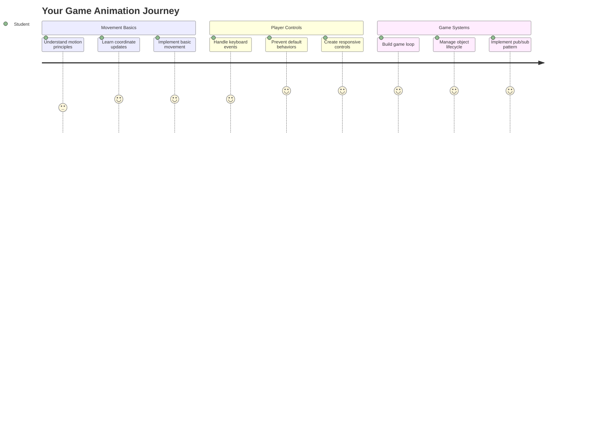
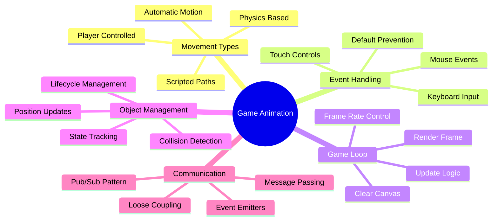
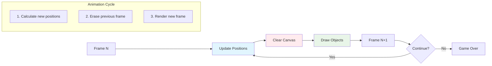
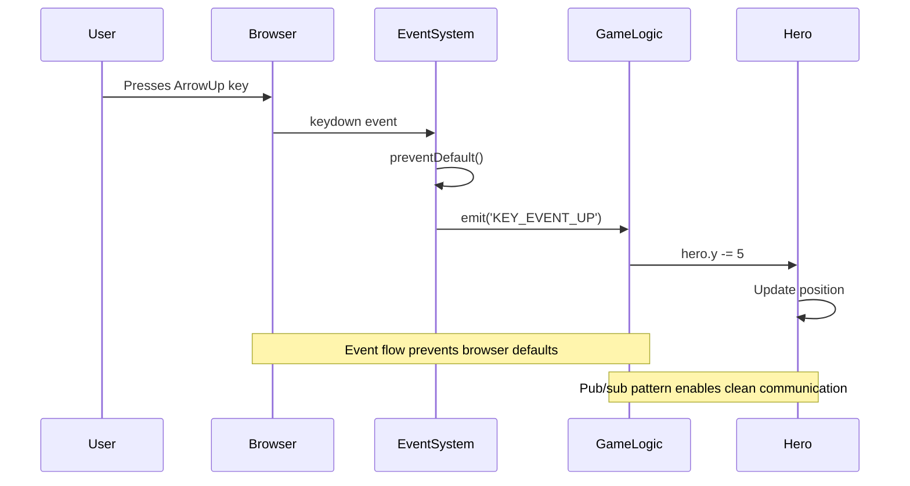
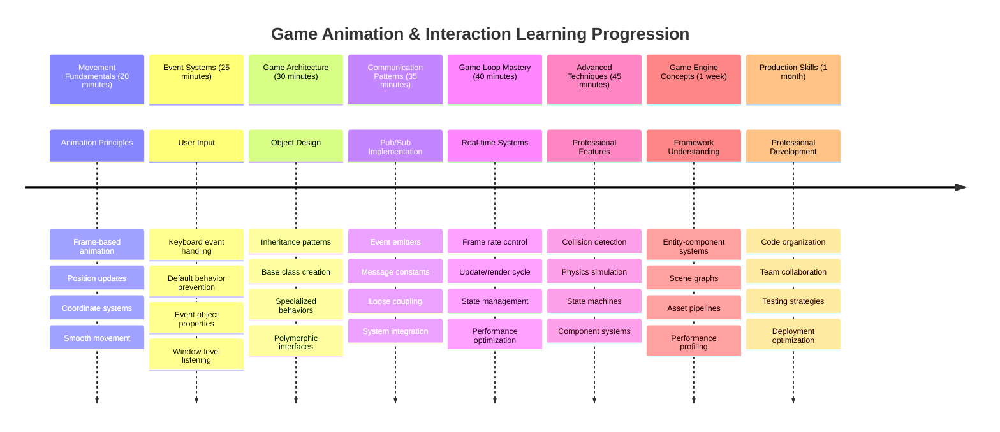

# ਸਪੇਸ ਗੇਮ ਬਣਾਓ ਭਾਗ 3: ਮੋਸ਼ਨ ਸ਼ਾਮਲ ਕਰਨਾ



ਆਪਣੇ ਮਨਪਸੰਦ ਗੇਮਾਂ ਬਾਰੇ ਸੋਚੋ - ਜੋ ਉਨ੍ਹਾਂ ਨੂੰ ਦਿਲਚਸਪ ਬਣਾਉਂਦਾ ਹੈ, ਉਹ ਸਿਰਫ਼ ਸੁੰਦਰ ਗ੍ਰਾਫਿਕਸ ਨਹੀਂ ਹੁੰਦੇ, ਬਲਕਿ ਇਹ ਹੁੰਦਾ ਹੈ ਕਿ ਸਭ ਕੁਝ ਕਿਵੇਂ ਹਿਲਦਾ ਹੈ ਅਤੇ ਤੁਹਾਡੇ ਕਮਾਂਡਾਂ ਦਾ ਜਵਾਬ ਦਿੰਦਾ ਹੈ। ਇਸ ਸਮੇਂ, ਤੁਹਾਡਾ ਸਪੇਸ ਗੇਮ ਇੱਕ ਸੁੰਦਰ ਪੇਂਟਿੰਗ ਵਾਂਗ ਹੈ, ਪਰ ਅਸੀਂ ਇਸ ਵਿੱਚ ਹਿਲਚਲ ਜੋੜਨ ਵਾਲੇ ਹਾਂ ਜੋ ਇਸ ਨੂੰ ਜ਼ਿੰਦਾ ਕਰ ਦੇਵੇਗਾ।

ਜਦੋਂ NASA ਦੇ ਇੰਜੀਨੀਅਰਾਂ ਨੇ Apollo ਮਿਸ਼ਨ ਲਈ ਗਾਈਡੈਂਸ ਕੰਪਿਊਟਰ ਪ੍ਰੋਗਰਾਮ ਕੀਤਾ, ਤਾਂ ਉਨ੍ਹਾਂ ਨੇ ਇੱਕੋ ਜਿਹੀ ਚੁਣੌਤੀ ਦਾ ਸਾਹਮਣਾ ਕੀਤਾ: ਜਹਾਜ਼ ਨੂੰ ਪਾਇਲਟ ਦੇ ਇਸ਼ਾਰਿਆਂ ਦਾ ਜਵਾਬ ਕਿਵੇਂ ਦਿਵਾਇਆ ਜਾਵੇ ਜਦੋਂ ਕਿ ਕੋਰਸ ਸਹੀ ਕਰਨ ਲਈ ਸਵੈ-ਚਾਲਤ ਸਿਸਟਮ ਵੀ ਚੱਲ ਰਿਹਾ ਹੋਵੇ। ਅੱਜ ਅਸੀਂ ਜੋ ਸਿਧਾਂਤ ਸਿੱਖਾਂਗੇ ਉਹਨਾਂ ਹੀ ਸੰਕਲਪਾਂ ਨੂੰ ਦਰਸਾਉਂਦੇ ਹਨ - ਖਿਡਾਰੀ-ਨਿਯੰਤਰਿਤ ਮੋਸ਼ਨ ਦਾ ਪ੍ਰਬੰਧਨ ਅਤੇ ਸਵੈ-ਚਾਲਤ ਸਿਸਟਮ ਦੇ ਵਿਹਾਰ।

ਇਸ ਪਾਠ ਵਿੱਚ, ਤੁਸੀਂ ਸਿੱਖੋਗੇ ਕਿ ਸਪੇਸਸ਼ਿਪ ਨੂੰ ਸਕ੍ਰੀਨ 'ਤੇ ਕਿਵੇਂ ਹਿਲਾਇਆ ਜਾਵੇ, ਖਿਡਾਰੀ ਦੇ ਹੁਕਮਾਂ ਦਾ ਜਵਾਬ ਕਿਵੇਂ ਦਿੱਤਾ ਜਾਵੇ, ਅਤੇ ਹਿਲਚਲ ਦੇ ਸਮਰੂਪ ਪੈਟਰਨ ਕਿਵੇਂ ਬਣਾਏ ਜਾਵਨ। ਅਸੀਂ ਹਰ ਚੀਜ਼ ਨੂੰ ਆਸਾਨ ਸੰਕਲਪਾਂ ਵਿੱਚ ਵੰਡਾਂਗੇ ਜੋ ਕੁਦਰਤੀ ਤੌਰ 'ਤੇ ਇੱਕ ਦੂਜੇ 'ਤੇ ਅਧਾਰਿਤ ਹਨ।

ਅੰਤ ਵਿੱਚ, ਤੁਹਾਡੇ ਕੋਲ ਖਿਡਾਰੀ ਆਪਣੇ ਹੀਰੋ ਸ਼ਿਪ ਨੂੰ ਸਕ੍ਰੀਨ 'ਤੇ ਉਡਾ ਰਹੇ ਹੋਣਗੇ ਜਦੋਂ ਕਿ ਦੁਸ਼ਮਣ ਜਹਾਜ਼ ਉੱਪਰ ਗਸ਼ਤ ਕਰ ਰਹੇ ਹੋਣਗੇ। ਸਭ ਤੋਂ ਮਹੱਤਵਪੂਰਨ ਗੱਲ ਇਹ ਹੈ ਕਿ ਤੁਸੀਂ ਉਹ ਮੁੱਖ ਸਿਧਾਂਤ ਸਮਝ ਲਵੋਗੇ ਜੋ ਗੇਮ ਮੋਸ਼ਨ ਸਿਸਟਮ ਨੂੰ ਚਲਾਉਂਦੇ ਹਨ।



## ਪਾਠ ਤੋਂ ਪਹਿਲਾਂ ਕਵਿਜ਼

[ਪਾਠ ਤੋਂ ਪਹਿਲਾਂ ਕਵਿਜ਼](https://ff-quizzes.netlify.app/web/quiz/33)

## ਗੇਮ ਮੋਸ਼ਨ ਨੂੰ ਸਮਝਣਾ

ਗੇਮਾਂ ਵਿੱਚ ਜ਼ਿੰਦਗੀ ਆਉਂਦੀ ਹੈ ਜਦੋਂ ਚੀਜ਼ਾਂ ਹਿਲਣ ਲੱਗਦੀਆਂ ਹਨ, ਅਤੇ ਇਹ ਮੁੱਖ ਤੌਰ 'ਤੇ ਦੋ ਤਰੀਕਿਆਂ ਨਾਲ ਹੁੰਦਾ ਹੈ:

- **ਖਿਡਾਰੀ-ਨਿਯੰਤਰਿਤ ਮੋਸ਼ਨ**: ਜਦੋਂ ਤੁਸੀਂ ਕੋਈ ਕੁੰਜੀ ਦਬਾਉਂਦੇ ਹੋ ਜਾਂ ਆਪਣੀ ਮਾਊਸ ਕਲਿੱਕ ਕਰਦੇ ਹੋ, ਤਾਂ ਕੁਝ ਹਿਲਦਾ ਹੈ। ਇਹ ਤੁਹਾਡੇ ਅਤੇ ਤੁਹਾਡੇ ਗੇਮ ਜਗਤ ਦੇ ਵਿਚਕਾਰ ਸਿੱਧਾ ਸੰਪਰਕ ਹੈ।
- **ਸਵੈ-ਚਾਲਤ ਮੋਸ਼ਨ**: ਜਦੋਂ ਗੇਮ ਖੁਦ ਚੀਜ਼ਾਂ ਨੂੰ ਹਿਲਾਉਣ ਦਾ ਫੈਸਲਾ ਕਰਦੀ ਹੈ - ਜਿਵੇਂ ਕਿ ਉਹ ਦੁਸ਼ਮਣ ਜਹਾਜ਼ ਜੋ ਸਕ੍ਰੀਨ 'ਤੇ ਗਸ਼ਤ ਕਰਨ ਦੀ ਲੋੜ ਹੈ ਭਾਵੇਂ ਤੁਸੀਂ ਕੁਝ ਕਰ ਰਹੇ ਹੋ ਜਾਂ ਨਹੀਂ।

ਕੰਪਿਊਟਰ ਸਕ੍ਰੀਨ 'ਤੇ ਚੀਜ਼ਾਂ ਨੂੰ ਹਿਲਾਉਣਾ ਤੁਹਾਡੇ ਸੋਚਣ ਤੋਂ ਵੀ ਆਸਾਨ ਹੈ। ਮੈਥ ਕਲਾਸ ਵਿੱਚ ਉਹ x ਅਤੇ y ਕੋਆਰਡੀਨੇਟਸ ਯਾਦ ਹਨ? ਇਹੀ ਹੈ ਜਿਸ ਨਾਲ ਅਸੀਂ ਇੱਥੇ ਕੰਮ ਕਰ ਰਹੇ ਹਾਂ। ਜਦੋਂ ਗੈਲੀਲਿਓ ਨੇ 1610 ਵਿੱਚ ਜੂਪੀਟਰ ਦੇ ਚੰਦਾਂ ਨੂੰ ਟ੍ਰੈਕ ਕੀਤਾ, ਉਹ ਅਸਲ ਵਿੱਚ ਇਹੀ ਕਰ ਰਿਹਾ ਸੀ - ਮੋਸ਼ਨ ਪੈਟਰਨ ਨੂੰ ਸਮਝਣ ਲਈ ਸਮੇਂ ਦੇ ਨਾਲ ਸਥਿਤੀਆਂ ਨੂੰ ਪਲਾਟ ਕਰਨਾ।

ਸਕ੍ਰੀਨ 'ਤੇ ਚੀਜ਼ਾਂ ਨੂੰ ਹਿਲਾਉਣਾ ਇੱਕ ਫਲਿੱਪਬੁੱਕ ਐਨੀਮੇਸ਼ਨ ਬਣਾਉਣ ਵਾਂਗ ਹੈ - ਤੁਹਾਨੂੰ ਇਹ ਤਿੰਨ ਆਸਾਨ ਕਦਮਾਂ ਦੀ ਪਾਲਣਾ ਕਰਨ ਦੀ ਲੋੜ ਹੈ:



1. **ਸਥਿਤੀ ਨੂੰ ਅਪਡੇਟ ਕਰੋ** - ਇਹ ਬਦਲੋ ਕਿ ਤੁਹਾਡੀ ਚੀਜ਼ ਕਿੱਥੇ ਹੋਣੀ ਚਾਹੀਦੀ ਹੈ (ਸ਼ਾਇਦ ਇਸਨੂੰ ਸੱਜੇ ਵੱਲ 5 ਪਿਕਸਲ ਹਿਲਾਓ)
2. **ਪੁਰਾਣਾ ਫਰੇਮ ਮਿਟਾਓ** - ਸਕ੍ਰੀਨ ਨੂੰ ਸਾਫ਼ ਕਰੋ ਤਾਂ ਜੋ ਤੁਹਾਨੂੰ ਹਰ ਜਗ੍ਹਾ ਭੂਤੀਆ ਨਿਸ਼ਾਨ ਨਾ ਦਿਖਾਈ ਦੇਣ
3. **ਨਵਾਂ ਫਰੇਮ ਬਣਾਓ** - ਆਪਣੀ ਚੀਜ਼ ਨੂੰ ਇਸਦੀ ਨਵੀਂ ਸਥਿਤੀ 'ਤੇ ਰੱਖੋ

ਇਹ ਕਾਫ਼ੀ ਤੇਜ਼ੀ ਨਾਲ ਕਰੋ, ਅਤੇ ਬੂਮ! ਤੁਹਾਡੇ ਕੋਲ ਹੌਲੀ ਹੌਲੀ ਹਿਲਣ ਵਾਲੀ ਚੀਜ਼ ਹੈ ਜੋ ਖਿਡਾਰੀਆਂ ਨੂੰ ਕੁਦਰਤੀ ਮਹਿਸੂਸ ਹੁੰਦੀ ਹੈ।

ਇਹ ਕੋਡ ਵਿੱਚ ਇਸ ਤਰ੍ਹਾਂ ਦਿਖਾਈ ਦੇ ਸਕਦਾ ਹੈ:

```javascript
// Set the hero's location
hero.x += 5;
// Clear the rectangle that hosts the hero
ctx.clearRect(0, 0, canvas.width, canvas.height);
// Redraw the game background and hero
ctx.fillRect(0, 0, canvas.width, canvas.height);
ctx.fillStyle = "black";
ctx.drawImage(heroImg, hero.x, hero.y);
```

**ਇਹ ਕੋਡ ਕੀ ਕਰਦਾ ਹੈ:**
- **ਹੀਰੋ ਦੇ x-ਕੋਆਰਡੀਨੇਟ ਨੂੰ 5 ਪਿਕਸਲ ਨਾਲ ਅਪਡੇਟ ਕਰਦਾ ਹੈ** ਤਾਂ ਜੋ ਇਸਨੂੰ ਆੜ੍ਹੇ ਤੌਰ 'ਤੇ ਹਿਲਾਇਆ ਜਾ ਸਕੇ
- **ਪੂਰੇ ਕੈਨਵਸ ਖੇਤਰ ਨੂੰ ਸਾਫ਼ ਕਰਦਾ ਹੈ** ਤਾਂ ਜੋ ਪਿਛਲੇ ਫਰੇਮ ਨੂੰ ਹਟਾਇਆ ਜਾ ਸਕੇ
- **ਕੈਨਵਸ ਨੂੰ ਕਾਲੇ ਬੈਕਗਰਾਊਂਡ ਰੰਗ ਨਾਲ ਭਰਦਾ ਹੈ**
- **ਹੀਰੋ ਦੀ ਚਿੱਤਰਕਲਾ ਨੂੰ ਇਸਦੀ ਨਵੀਂ ਸਥਿਤੀ 'ਤੇ ਦੁਬਾਰਾ ਖਿੱਚਦਾ ਹੈ**

✅ ਕੀ ਤੁਸੀਂ ਸੋਚ ਸਕਦੇ ਹੋ ਕਿ ਕਿਉਂ ਤੁਹਾਡੇ ਹੀਰੋ ਨੂੰ ਹਰ ਸੈਕਿੰਡ ਵਿੱਚ ਕਈ ਫਰੇਮਾਂ ਦੁਬਾਰਾ ਖਿੱਚਣ ਨਾਲ ਪ੍ਰਦਰਸ਼ਨ ਦੀ ਲਾਗਤ ਹੋ ਸਕਦੀ ਹੈ? [ਇਸ ਪੈਟਰਨ ਦੇ ਵਿਕਲਪਾਂ](https://developer.mozilla.org/en-US/docs/Web/API/Canvas_API/Tutorial/Optimizing_canvas) ਬਾਰੇ ਪੜ੍ਹੋ।

## ਕੀਬੋਰਡ ਇਵੈਂਟਸ ਨੂੰ ਸੰਭਾਲਣਾ

ਇਹ ਉਹ ਜਗ੍ਹਾ ਹੈ ਜਿੱਥੇ ਅਸੀਂ ਖਿਡਾਰੀ ਦੇ ਇਨਪੁਟ ਨੂੰ ਗੇਮ ਦੀ ਕਾਰਵਾਈ ਨਾਲ ਜੋੜਦੇ ਹਾਂ। ਜਦੋਂ ਕੋਈ ਲੇਜ਼ਰ ਫਾਇਰ ਕਰਨ ਲਈ ਸਪੇਸਬਾਰ ਦਬਾਉਂਦਾ ਹੈ ਜਾਂ ਐਸਟਰੋਇਡ ਤੋਂ ਬਚਣ ਲਈ ਐਰੋ ਕੀ ਦਬਾਉਂਦਾ ਹੈ, ਤੁਹਾਡੀ ਗੇਮ ਨੂੰ ਉਸ ਇਨਪੁਟ ਦਾ ਪਤਾ ਲਗਾਉਣਾ ਅਤੇ ਉਸਦਾ ਜਵਾਬ ਦੇਣਾ ਚਾਹੀਦਾ ਹੈ।

ਕੀਬੋਰਡ ਇਵੈਂਟਸ ਵਿੰਡੋ ਪੱਧਰ 'ਤੇ ਹੁੰਦੇ ਹਨ, ਜਿਸਦਾ ਮਤਲਬ ਹੈ ਕਿ ਤੁਹਾਡਾ ਪੂਰਾ ਬ੍ਰਾਊਜ਼ਰ ਵਿੰਡੋ ਉਹਨਾਂ ਕੁੰਜੀਆਂ ਦੇ ਦਬਾਅ ਨੂੰ ਸੁਣ ਰਿਹਾ ਹੈ। ਦੂਜੇ ਪਾਸੇ, ਮਾਊਸ ਕਲਿੱਕ ਨੂੰ ਖਾਸ ਤੌਰ 'ਤੇ ਤੱਤਾਂ ਨਾਲ ਜੋੜਿਆ ਜਾ ਸਕਦਾ ਹੈ (ਜਿਵੇਂ ਕਿ ਬਟਨ 'ਤੇ ਕਲਿੱਕ ਕਰਨਾ)। ਸਾਡੇ ਸਪੇਸ ਗੇਮ ਲਈ, ਅਸੀਂ ਕੀਬੋਰਡ ਕੰਟਰੋਲ 'ਤੇ ਧਿਆਨ ਦੇਵਾਂਗੇ ਕਿਉਂਕਿ ਇਹ ਖਿਡਾਰੀਆਂ ਨੂੰ ਉਹ ਕਲਾਸਿਕ ਆਰਕੇਡ ਮਹਿਸੂਸ ਦਿੰਦਾ ਹੈ।

ਇਹ ਮੈਨੂੰ ਯਾਦ ਦਿਵਾਉਂਦਾ ਹੈ ਕਿ 1800 ਦੇ ਦਹਾਕੇ ਵਿੱਚ ਟੈਲੀਗ੍ਰਾਫ ਓਪਰੇਟਰਾਂ ਨੂੰ ਮੋਰਸ ਕੋਡ ਇਨਪੁਟ ਨੂੰ ਅਰਥਪੂਰਨ ਸੁਨੇਹਿਆਂ ਵਿੱਚ ਤਬਦੀਲ ਕਰਨਾ ਪੈਂਦਾ ਸੀ - ਅਸੀਂ ਕੁਝ ਇਸੇ ਤਰ੍ਹਾਂ ਕਰ ਰਹੇ ਹਾਂ, ਕੁੰਜੀ ਦਬਾਅ ਨੂੰ ਗੇਮ ਕਮਾਂਡਾਂ ਵਿੱਚ ਤਬਦੀਲ ਕਰ ਰਹੇ ਹਾਂ।

ਇੱਕ ਇਵੈਂਟ ਨੂੰ ਸੰਭਾਲਣ ਲਈ ਤੁਹਾਨੂੰ ਵਿੰਡੋ ਦੇ `addEventListener()` ਮੈਥਡ ਦੀ ਵਰਤੋਂ ਕਰਨੀ ਪੈਂਦੀ ਹੈ ਅਤੇ ਇਸਨੂੰ ਦੋ ਇਨਪੁਟ ਪੈਰਾਮੀਟਰ ਦੇਣੇ ਪੈਂਦੇ ਹਨ। ਪਹਿਲਾ ਪੈਰਾਮੀਟਰ ਇਵੈਂਟ ਦਾ ਨਾਮ ਹੈ, ਉਦਾਹਰਨ ਲਈ `keyup`। ਦੂਜਾ ਪੈਰਾਮੀਟਰ ਉਹ ਫੰਕਸ਼ਨ ਹੈ ਜੋ ਇਵੈਂਟ ਹੋਣ ਦੇ ਨਤੀਜੇ ਵਜੋਂ ਚਲਾਇਆ ਜਾਣਾ ਚਾਹੀਦਾ ਹੈ।

ਇਹ ਇੱਕ ਉਦਾਹਰਨ ਹੈ:

```javascript
window.addEventListener('keyup', (evt) => {
  // evt.key = string representation of the key
  if (evt.key === 'ArrowUp') {
    // do something
  }
});
```

**ਇੱਥੇ ਕੀ ਹੁੰਦਾ ਹੈ:**
- **ਕੀਬੋਰਡ ਇਵੈਂਟਸ** ਨੂੰ ਪੂਰੀ ਵਿੰਡੋ 'ਤੇ ਸੁਣਦਾ ਹੈ
- **ਇਵੈਂਟ ਆਬਜੈਕਟ** ਨੂੰ ਕੈਪਚਰ ਕਰਦਾ ਹੈ ਜੋ ਦੱਸਦਾ ਹੈ ਕਿ ਕਿਹੜੀ ਕੁੰਜੀ ਦਬਾਈ ਗਈ ਸੀ
- **ਜਾਂਚਦਾ ਹੈ** ਕਿ ਦਬਾਈ ਗਈ ਕੁੰਜੀ ਕਿਸੇ ਖਾਸ ਕੁੰਜੀ (ਇਸ ਮਾਮਲੇ ਵਿੱਚ, ਉੱਪਰ ਵਾਲੀ ਐਰੋ) ਨਾਲ ਮੇਲ ਖਾਂਦੀ ਹੈ
- **ਕੋਡ ਚਲਾਉਂਦਾ ਹੈ** ਜਦੋਂ ਸ਼ਰਤ ਪੂਰੀ ਹੁੰਦੀ ਹੈ

ਕੀ ਇਵੈਂਟਸ ਲਈ ਇਵੈਂਟ 'ਤੇ ਦੋ ਗੁਣ ਹੁੰਦੇ ਹਨ ਜੋ ਤੁਸੀਂ ਵਰਤ ਸਕਦੇ ਹੋ ਇਹ ਦੇਖਣ ਲਈ ਕਿ ਕਿਹੜੀ ਕੁੰਜੀ ਦਬਾਈ ਗਈ ਸੀ:

- `key` - ਇਹ ਦਬਾਈ ਗਈ ਕੁੰਜੀ ਦਾ ਸਤਰ ਰੂਪ ਹੈ, ਉਦਾਹਰਨ ਲਈ `'ArrowUp'`
- `keyCode` - ਇਹ ਇੱਕ ਨੰਬਰ ਰੂਪ ਹੈ, ਉਦਾਹਰਨ ਲਈ `37`, ਜੋ `ArrowLeft` ਦੇ ਅਨੁਕੂਲ ਹੈ

✅ ਕੀ ਇਵੈਂਟ ਮੈਨਿਪੂਲੇਸ਼ਨ ਗੇਮ ਡਿਵੈਲਪਮੈਂਟ ਤੋਂ ਬਾਹਰ ਵੀ ਲਾਭਦਾਇਕ ਹੈ। ਇਸ ਤਕਨੀਕ ਲਈ ਹੋਰ ਕੀ ਉਦੇਸ਼ ਤੁਸੀਂ ਸੋਚ ਸਕਦੇ ਹੋ?



### ਖਾਸ ਕੁੰਜੀਆਂ: ਇੱਕ ਚੇਤਾਵਨੀ!

ਕੁਝ ਕੁੰਜੀਆਂ ਵਿੱਚ ਬਣਾਏ ਗਏ ਬ੍ਰਾਊਜ਼ਰ ਵਿਹਾਰ ਹੁੰਦੇ ਹਨ ਜੋ ਤੁਹਾਡੀ ਗੇਮ ਵਿੱਚ ਰੁਕਾਵਟ ਪੈਦਾ ਕਰ ਸਕਦੇ ਹਨ। ਐਰੋ ਕੁੰਜੀਆਂ ਪੰਨਾ ਸਕ੍ਰੋਲ ਕਰਦੀਆਂ ਹਨ ਅਤੇ ਸਪੇਸਬਾਰ ਹੇਠਾਂ ਜੰਪ ਕਰਦੀ ਹੈ - ਉਹ ਵਿਹਾਰ ਜੋ ਤੁਸੀਂ ਨਹੀਂ ਚਾਹੁੰਦੇ ਜਦੋਂ ਕੋਈ ਆਪਣਾ ਸਪੇਸਸ਼ਿਪ ਚਲਾਉਣ ਦੀ ਕੋਸ਼ਿਸ਼ ਕਰ ਰਿਹਾ ਹੋਵੇ।

ਅਸੀਂ ਇਹ ਡਿਫਾਲਟ ਵਿਹਾਰ ਰੋਕ ਸਕਦੇ ਹਾਂ ਅਤੇ ਆਪਣੀ ਗੇਮ ਨੂੰ ਇਸ ਇਨਪੁਟ ਨੂੰ ਸੰਭਾਲਣ ਦੇ ਸਕਦੇ ਹਾਂ। ਇਹ ਉਸ ਤਰ੍ਹਾਂ ਹੈ ਜਿਵੇਂ ਸ਼ੁਰੂਆਤੀ ਕੰਪਿਊਟਰ ਪ੍ਰੋਗਰਾਮਰਾਂ ਨੂੰ ਸਿਸਟਮ ਇੰਟਰਪਟਸ ਨੂੰ ਓਵਰਰਾਈਡ ਕਰਨਾ ਪੈਂਦਾ ਸੀ ਤਾਂ ਜੋ ਕਸਟਮ ਵਿਹਾਰ ਬਣਾਇਆ ਜਾ ਸਕੇ - ਅਸੀਂ ਸਿਰਫ ਬ੍ਰਾਊਜ਼ਰ ਪੱਧਰ 'ਤੇ ਕਰ ਰਹੇ ਹਾਂ। ਇਹ ਕਿਵੇਂ:

```javascript
const onKeyDown = function (e) {
  console.log(e.keyCode);
  switch (e.keyCode) {
    case 37:
    case 39:
    case 38:
    case 40: // Arrow keys
    case 32:
      e.preventDefault();
      break; // Space
    default:
      break; // do not block other keys
  }
};

window.addEventListener('keydown', onKeyDown);
```

**ਇਸ ਰੋਕਥਾਮ ਕੋਡ ਨੂੰ ਸਮਝਣਾ:**
- **ਖਾਸ ਕੁੰਜੀ ਕੋਡਾਂ ਲਈ ਜਾਂਚਦਾ ਹੈ** ਜੋ ਅਣਚਾਹੇ ਬ੍ਰਾਊਜ਼ਰ ਵਿਹਾਰ ਦਾ ਕਾਰਨ ਬਣ ਸਕਦੇ ਹਨ
- **ਡਿਫਾਲਟ ਬ੍ਰਾਊਜ਼ਰ ਕਾਰਵਾਈ ਨੂੰ ਰੋਕਦਾ ਹੈ** ਐਰੋ ਕੁੰਜੀਆਂ ਅਤੇ ਸਪੇਸਬਾਰ ਲਈ
- **ਹੋਰ ਕੁੰਜੀਆਂ ਨੂੰ ਆਮ ਤੌਰ 'ਤੇ ਕੰਮ ਕਰਨ ਦਿੰਦਾ ਹੈ**
- **ਵਰਤਦਾ ਹੈ** `e.preventDefault()` ਬ੍ਰਾਊਜ਼ਰ ਦੇ ਬਣਾਏ ਵਿਹਾਰ ਨੂੰ ਰੋਕਣ ਲਈ

### 🔄 **ਪੈਡਾਗੌਜੀਕਲ ਚੈੱਕ-ਇਨ**
**ਇਵੈਂਟ ਹੈਂਡਲਿੰਗ ਸਮਝਣਾ**: ਸਵੈ-ਚਾਲਤ ਮੋਸ਼ਨ 'ਤੇ ਜਾਣ ਤੋਂ ਪਹਿਲਾਂ, ਯਕੀਨੀ ਬਣਾਓ ਕਿ ਤੁਸੀਂ:
- ✅ `keydown` ਅਤੇ `keyup` ਇਵੈਂਟਸ ਦੇ ਵਿਚਕਾਰ ਫਰਕ ਦੀ ਵਿਆਖਿਆ ਕਰ ਸਕਦੇ ਹੋ
- ✅ ਸਮਝ ਸਕਦੇ ਹੋ ਕਿ ਅਸੀਂ ਡਿਫault ਬ੍ਰਾਊਜ਼ਰ ਵਿਹਾਰਾਂ ਨੂੰ ਕਿਉਂ ਰੋਕਦੇ ਹਾਂ
- ✅ ਸਮਝ ਸਕਦੇ ਹੋ ਕਿ ਇਵ
   - **ਸ਼ੁਰੂ ਕਰਦਾ ਹੈ** ਇੱਕ ਐਰੇ ਜੋ ਸਾਰੇ ਗੇਮ ਆਬਜੈਕਟਸ ਨੂੰ ਰੱਖ ਸਕੇ

   4. **ਗੇਮ ਸ਼ੁਰੂ ਕਰੋ**

       ```javascript
       function initGame() {
         gameObjects = [];
         createEnemies();
         createHero();
       
         eventEmitter.on(Messages.KEY_EVENT_UP, () => {
           hero.y -= 5;
         });
       
         eventEmitter.on(Messages.KEY_EVENT_DOWN, () => {
           hero.y += 5;
         });
       
         eventEmitter.on(Messages.KEY_EVENT_LEFT, () => {
           hero.x -= 5;
         });
       
4. **ਗੇਮ ਲੂਪ ਸੈਟਅਪ ਕਰੋ**

   `window.onload` ਫੰਕਸ਼ਨ ਨੂੰ ਰੀਫੈਕਟਰ ਕਰੋ ਤਾਂ ਜੋ ਗੇਮ ਸ਼ੁਰੂ ਹੋਵੇ ਅਤੇ ਇੱਕ ਵਧੀਆ ਇੰਟਰਵਲ 'ਤੇ ਗੇਮ ਲੂਪ ਸੈਟਅਪ ਕੀਤਾ ਜਾ ਸਕੇ। ਤੁਸੀਂ ਇਸ ਵਿੱਚ ਲੇਜ਼ਰ ਬੀਮ ਵੀ ਸ਼ਾਮਲ ਕਰੋਗੇ:

    ```javascript
    window.onload = async () => {
      canvas = document.getElementById("canvas");
      ctx = canvas.getContext("2d");
      heroImg = await loadTexture("assets/player.png");
      enemyImg = await loadTexture("assets/enemyShip.png");
      laserImg = await loadTexture("assets/laserRed.png");
    
      initGame();
      const gameLoopId = setInterval(() => {
        ctx.clearRect(0, 0, canvas.width, canvas.height);
        ctx.fillStyle = "black";
        ctx.fillRect(0, 0, canvas.width, canvas.height);
        drawGameObjects(ctx);
      }, 100);
    };
    ```

   **ਗੇਮ ਸੈਟਅਪ ਨੂੰ ਸਮਝਣਾ:**
   - **ਪੂਰੀ ਤਰ੍ਹਾਂ ਪੇਜ ਲੋਡ ਹੋਣ ਦੀ ਉਡੀਕ ਕਰਦਾ ਹੈ** ਸ਼ੁਰੂ ਕਰਨ ਤੋਂ ਪਹਿਲਾਂ
   - **ਕੈਨਵਸ ਐਲੀਮੈਂਟ ਅਤੇ ਇਸਦਾ 2D ਰੇਂਡਰਿੰਗ ਕਾਂਟੈਕਸਟ ਪ੍ਰਾਪਤ ਕਰਦਾ ਹੈ**
   - **ਸਾਰੇ ਇਮੇਜ ਐਸੈਟਸ ਨੂੰ ਅਸਿੰਕ੍ਰੋਨਸ ਤਰੀਕੇ ਨਾਲ ਲੋਡ ਕਰਦਾ ਹੈ** `await` ਦੀ ਵਰਤੋਂ ਕਰਕੇ
   - **ਗੇਮ ਲੂਪ ਨੂੰ 100ms ਇੰਟਰਵਲ (10 FPS) 'ਤੇ ਚਲਾਉਣਾ ਸ਼ੁਰੂ ਕਰਦਾ ਹੈ**
   - **ਹਰ ਫਰੇਮ 'ਤੇ ਪੂਰੀ ਸਕ੍ਰੀਨ ਨੂੰ ਸਾਫ਼ ਕਰਦਾ ਹੈ ਅਤੇ ਦੁਬਾਰਾ ਡ੍ਰਾ ਕਰਦਾ ਹੈ**

5. **ਕੋਡ ਸ਼ਾਮਲ ਕਰੋ** ਜੋ ਵਿਰੋਧੀਆਂ ਨੂੰ ਇੱਕ ਨਿਰਧਾਰਿਤ ਇੰਟਰਵਲ 'ਤੇ ਹਿਲਣ ਦੇ ਸਕੇ

    `createEnemies()` ਫੰਕਸ਼ਨ ਨੂੰ ਰੀਫੈਕਟਰ ਕਰੋ ਤਾਂ ਜੋ ਵਿਰੋਧੀਆਂ ਬਣਾਏ ਜਾ ਸਕਣ ਅਤੇ ਉਨ੍ਹਾਂ ਨੂੰ ਨਵੇਂ gameObjects ਕਲਾਸ ਵਿੱਚ ਪੁਸ਼ ਕੀਤਾ ਜਾ ਸਕੇ:

    ```javascript
    function createEnemies() {
      const MONSTER_TOTAL = 5;
      const MONSTER_WIDTH = MONSTER_TOTAL * 98;
      const START_X = (canvas.width - MONSTER_WIDTH) / 2;
      const STOP_X = START_X + MONSTER_WIDTH;
    
      for (let x = START_X; x < STOP_X; x += 98) {
        for (let y = 0; y < 50 * 5; y += 50) {
          const enemy = new Enemy(x, y);
          enemy.img = enemyImg;
          gameObjects.push(enemy);
        }
      }
    }
    ```

    **ਵਿਰੋਧੀ ਬਣਾਉਣ ਦਾ ਕੀ ਕਰਦਾ ਹੈ:**
    - **ਪੋਜ਼ੀਸ਼ਨ ਦੀ ਗਣਨਾ ਕਰਦਾ ਹੈ** ਵਿਰੋਧੀਆਂ ਨੂੰ ਸਕ੍ਰੀਨ ਦੇ ਕੇਂਦਰ ਵਿੱਚ ਰੱਖਣ ਲਈ
    - **ਵਿਰੋਧੀਆਂ ਦੀ ਗ੍ਰਿਡ ਬਣਾਉਂਦਾ ਹੈ** ਨੇਸਟਡ ਲੂਪ ਦੀ ਵਰਤੋਂ ਕਰਕੇ
    - **ਹਰ ਵਿਰੋਧੀ ਆਬਜੈਕਟ ਨੂੰ ਵਿਰੋਧੀ ਇਮੇਜ ਅਸਾਈਨ ਕਰਦਾ ਹੈ**
    - **ਹਰ ਵਿਰੋਧੀ ਨੂੰ ਗਲੋਬਲ ਗੇਮ ਆਬਜੈਕਟਸ ਐਰੇ ਵਿੱਚ ਸ਼ਾਮਲ ਕਰਦਾ ਹੈ**
    
    ਅਤੇ ਇੱਕ `createHero()` ਫੰਕਸ਼ਨ ਸ਼ਾਮਲ ਕਰੋ ਜੋ ਹੀਰੋ ਲਈ ਇੱਕ ਸਮਾਨ ਪ੍ਰਕਿਰਿਆ ਕਰੇ।

    ```javascript
    function createHero() {
      hero = new Hero(
        canvas.width / 2 - 45,
        canvas.height - canvas.height / 4
      );
      hero.img = heroImg;
      gameObjects.push(hero);
    }
    ```

    **ਹੀਰੋ ਬਣਾਉਣ ਦਾ ਕੀ ਕਰਦਾ ਹੈ:**
    - **ਹੀਰੋ ਨੂੰ ਸਕ੍ਰੀਨ ਦੇ ਹੇਠਲੇ ਕੇਂਦਰ ਵਿੱਚ ਪੋਜ਼ੀਸ਼ਨ ਕਰਦਾ ਹੈ**
    - **ਹੀਰੋ ਆਬਜੈਕਟ ਨੂੰ ਹੀਰੋ ਇਮੇਜ ਅਸਾਈਨ ਕਰਦਾ ਹੈ**
    - **ਹੀਰੋ ਨੂੰ ਰੇਂਡਰਿੰਗ ਲਈ ਗੇਮ ਆਬਜੈਕਟਸ ਐਰੇ ਵਿੱਚ ਸ਼ਾਮਲ ਕਰਦਾ ਹੈ**

    ਅਤੇ ਆਖਿਰ ਵਿੱਚ, ਇੱਕ `drawGameObjects()` ਫੰਕਸ਼ਨ ਸ਼ੁਰੂ ਕਰਨ ਲਈ ਸ਼ਾਮਲ ਕਰੋ:

    ```javascript
    function drawGameObjects(ctx) {
      gameObjects.forEach(go => go.draw(ctx));
    }
    ```

    **ਡ੍ਰਾਇੰਗ ਫੰਕਸ਼ਨ ਨੂੰ ਸਮਝਣਾ:**
    - **ਐਰੇ ਵਿੱਚ ਸਾਰੇ ਗੇਮ ਆਬਜੈਕਟਸ 'ਤੇ ਇਟਰੇਟ ਕਰਦਾ ਹੈ**
    - **ਹਰ ਆਬਜੈਕਟ 'ਤੇ `draw()` ਮੈਥਡ ਨੂੰ ਕਾਲ ਕਰਦਾ ਹੈ**
    - **ਕੈਨਵਸ ਕਾਂਟੈਕਸਟ ਪਾਸ ਕਰਦਾ ਹੈ ਤਾਂ ਜੋ ਆਬਜੈਕਟਸ ਆਪਣੇ ਆਪ ਨੂੰ ਰੇਂਡਰ ਕਰ ਸਕਣ**

    ### 🔄 **ਪੈਡਾਗੌਜੀਕਲ ਚੈਕ-ਇਨ**
    **ਪੂਰੀ ਗੇਮ ਸਿਸਟਮ ਦੀ ਸਮਝ**: ਆਪਣੇ ਪੂਰੇ ਆਰਕੀਟੈਕਚਰ ਦੀ ਮਾਹਰਤਾ ਦੀ ਪੁਸ਼ਟੀ ਕਰੋ:
    - ✅ ਵਿਰਾਸਤ ਕਿਵੇਂ ਹੀਰੋ ਅਤੇ ਵਿਰੋਧੀ ਨੂੰ ਸਾਂਝੇ GameObject ਗੁਣਾਂ ਦੀ ਸਹਾਇਤਾ ਦਿੰਦੀ ਹੈ?
    - ✅ ਪਬ/ਸਬ ਪੈਟਰਨ ਤੁਹਾਡੇ ਕੋਡ ਨੂੰ ਜ਼ਿਆਦਾ ਮੈਨਟੇਨਬਲ ਕਿਉਂ ਬਣਾਉਂਦਾ ਹੈ?
    - ✅ ਗੇਮ ਲੂਪ ਸਮੂਥ ਐਨੀਮੇਸ਼ਨ ਬਣਾਉਣ ਵਿੱਚ ਕਿਹੜਾ ਭੂਮਿਕਾ ਨਿਭਾਉਂਦਾ ਹੈ?
    - ✅ ਇਵੈਂਟ ਲਿਸਨਰਜ਼ ਯੂਜ਼ਰ ਇਨਪੁਟ ਨੂੰ ਗੇਮ ਆਬਜੈਕਟ ਵਿਹਾਰ ਨਾਲ ਕਿਵੇਂ ਜੋੜਦੇ ਹਨ?

    **ਸਿਸਟਮ ਇੰਟੀਗ੍ਰੇਸ਼ਨ**: ਤੁਹਾਡਾ ਗੇਮ ਹੁਣ ਦਰਸਾਉਂਦਾ ਹੈ:
    - **ਆਬਜੈਕਟ-ਓਰੀਐਂਟਡ ਡਿਜ਼ਾਈਨ**: ਬੇਸ ਕਲਾਸਾਂ ਨਾਲ ਵਿਸ਼ੇਸ਼ਤਾਵਾਂ ਦੀ ਵਿਰਾਸਤ
    - **ਇਵੈਂਟ-ਡ੍ਰਿਵਨ ਆਰਕੀਟੈਕਚਰ**: ਪਬ/ਸਬ ਪੈਟਰਨ ਲਈ ਲੂਜ਼ ਕਪਲਿੰਗ
    - **ਐਨੀਮੇਸ਼ਨ ਫਰੇਮਵਰਕ**: ਗੇਮ ਲੂਪ ਨਾਲ ਲਗਾਤਾਰ ਫਰੇਮ ਅਪਡੇਟ
    - **ਇਨਪੁਟ ਹੈਂਡਲਿੰਗ**: ਕੀਬੋਰਡ ਇਵੈਂਟਸ ਨਾਲ ਡਿਫਾਲਟ ਪ੍ਰੀਵੇਂਸ਼ਨ
    - **ਐਸੈਟ ਮੈਨੇਜਮੈਂਟ**: ਇਮੇਜ ਲੋਡਿੰਗ ਅਤੇ ਸਪ੍ਰਾਈਟ ਰੇਂਡਰਿੰਗ

    **ਪ੍ਰੋਫੈਸ਼ਨਲ ਪੈਟਰਨਸ**: ਤੁਸੀਂ ਲਾਗੂ ਕੀਤਾ ਹੈ:
    - **ਸੰਬੰਧਿਤ ਕੰਸਰਨਸ ਦੀ ਵੰਡ**: ਇਨਪੁਟ, ਲਾਜਿਕ, ਅਤੇ ਰੇਂਡਰਿੰਗ ਨੂੰ ਵੱਖ-ਵੱਖ ਰੱਖਣਾ
    - **ਪੋਲਿਮਾਰਫਿਜ਼ਮ**: ਸਾਰੇ ਗੇਮ ਆਬਜੈਕਟਸ ਸਾਂਝੇ ਡ੍ਰਾਇੰਗ ਇੰਟਰਫੇਸ ਨੂੰ ਸਹਾਇਤਾ ਦਿੰਦੇ ਹਨ
    - **ਮੇਸੇਜ ਪਾਸਿੰਗ**: ਕੰਪੋਨੈਂਟਸ ਦੇ ਵਿਚਕਾਰ ਸਾਫ਼ ਸੰਚਾਰ
    - **ਰਿਸੋਰਸ ਮੈਨੇਜਮੈਂਟ**: ਸਪ੍ਰਾਈਟ ਅਤੇ ਐਨੀਮੇਸ਼ਨ ਦੀ ਕੁਸ਼ਲ ਹੈਂਡਲਿੰਗ

    ਤੁਹਾਡੇ ਵਿਰੋਧੀ ਤੁਹਾਡੇ ਹੀਰੋ ਸਪੇਸਸ਼ਿਪ ਵੱਲ ਅੱਗੇ ਵਧਣੇ ਸ਼ੁਰੂ ਕਰਨੇ ਚਾਹੀਦੇ ਹਨ!
      }
    }
    ```
    
    and add a `createHero()` function to do a similar process for the hero.
    
    ```javascript
    function createHero() {
      hero = new Hero(
        canvas.width / 2 - 45,
        canvas.height - canvas.height / 4
      );
      hero.img = heroImg;
      gameObjects.push(hero);
    }
    ```

    ਅਤੇ ਆਖਿਰ ਵਿੱਚ, ਇੱਕ `drawGameObjects()` ਫੰਕਸ਼ਨ ਸ਼ੁਰੂ ਕਰਨ ਲਈ ਸ਼ਾਮਲ ਕਰੋ:

    ```javascript
    function drawGameObjects(ctx) {
      gameObjects.forEach(go => go.draw(ctx));
    }
    ```

    ਤੁਹਾਡੇ ਵਿਰੋਧੀ ਤੁਹਾਡੇ ਹੀਰੋ ਸਪੇਸਸ਼ਿਪ ਵੱਲ ਅੱਗੇ ਵਧਣੇ ਸ਼ੁਰੂ ਕਰਨੇ ਚਾਹੀਦੇ ਹਨ!

---

## GitHub Copilot Agent Challenge 🚀

ਇਹ ਇੱਕ ਚੁਣੌਤੀ ਹੈ ਜੋ ਤੁਹਾਡੇ ਗੇਮ ਦੀ ਪੋਲਿਸ਼ ਨੂੰ ਸੁਧਾਰੇਗੀ: ਬਾਊਂਡਰੀਜ਼ ਅਤੇ ਸਮੂਥ ਕੰਟਰੋਲ ਸ਼ਾਮਲ ਕਰਨਾ। ਇਸ ਸਮੇਂ, ਤੁਹਾਡਾ ਹੀਰੋ ਸਕ੍ਰੀਨ ਤੋਂ ਬਾਹਰ ਉੱਡ ਸਕਦਾ ਹੈ, ਅਤੇ ਮੂਵਮੈਂਟ ਥੋੜਾ ਅਸਮਰੂਪ ਲੱਗ ਸਕਦਾ ਹੈ।

**ਤੁਹਾਡਾ ਮਿਸ਼ਨ:** ਆਪਣੀ ਸਪੇਸਸ਼ਿਪ ਨੂੰ ਹੋਰ ਹਕੀਕਤੀਵਾਦੀ ਬਣਾਉਣ ਲਈ ਸਕ੍ਰੀਨ ਬਾਊਂਡਰੀਜ਼ ਅਤੇ ਫਲੂਇਡ ਮੂਵਮੈਂਟ ਲਾਗੂ ਕਰੋ। ਜਦੋਂ ਖਿਡਾਰੀ ਇੱਕ ਐਰੋ ਕੀ ਦਬਾਉਂਦੇ ਹਨ, ਸਪੇਸਸ਼ਿਪ ਨੂੰ ਡਿਸਕ੍ਰੀਟ ਸਟੈਪਸ ਦੀ ਬਜਾਏ ਲਗਾਤਾਰ ਗਲਾਈਡ ਕਰਨਾ ਚਾਹੀਦਾ ਹੈ। ਜਦੋਂ ਸਪੇਸਸ਼ਿਪ ਸਕ੍ਰੀਨ ਬਾਊਂਡਰੀਜ਼ 'ਤੇ ਪਹੁੰਚਦਾ ਹੈ, ਵਿਜ਼ੂਅਲ ਫੀਡਬੈਕ ਸ਼ਾਮਲ ਕਰਨ ਬਾਰੇ ਸੋਚੋ – ਸ਼ਾਇਦ ਖੇਡ ਖੇਤਰ ਦੇ ਕਿਨਾਰੇ ਨੂੰ ਦਰਸਾਉਣ ਲਈ ਇੱਕ ਸੁਬਟਲ ਪ੍ਰਭਾਵ।

[agent mode](https://code.visualstudio.com/blogs/2025/02/24/introducing-copilot-agent-mode) ਬਾਰੇ ਹੋਰ ਜਾਣੋ।

## 🚀 Challenge

ਜਿਵੇਂ ਜਿਵੇਂ ਪ੍ਰੋਜੈਕਟ ਵਧਦੇ ਹਨ, ਕੋਡ ਦਾ ਸੰਗਠਨ ਬਹੁਤ ਮਹੱਤਵਪੂਰਨ ਬਣ ਜਾਂਦਾ ਹੈ। ਤੁਸੀਂ ਸ਼ਾਇਦ ਧਿਆਨ ਦਿੱਤਾ ਹੋਵੇ ਕਿ ਤੁਹਾਡੀ ਫਾਈਲ ਫੰਕਸ਼ਨਸ, ਵੈਰੀਏਬਲਸ, ਅਤੇ ਕਲਾਸਾਂ ਨਾਲ ਭਰੀ ਹੋਈ ਹੈ। ਇਹ ਮੈਨੂੰ ਯਾਦ ਦਿੰਦਾ ਹੈ ਕਿ Apollo ਮਿਸ਼ਨ ਕੋਡ ਨੂੰ ਸੰਗਠਿਤ ਕਰਨ ਵਾਲੇ ਇੰਜੀਨੀਅਰਾਂ ਨੂੰ ਸਪਸ਼ਟ, ਮੈਨਟੇਨਬਲ ਸਿਸਟਮ ਬਣਾਉਣੇ ਪਏ ਜੋ ਕਈ ਟੀਮਾਂ ਇੱਕੋ ਸਮੇਂ 'ਤੇ ਕੰਮ ਕਰ ਸਕਣ।

**ਤੁਹਾਡਾ ਮਿਸ਼ਨ:**
ਸਾਫਟਵੇਅਰ ਆਰਕੀਟੈਕਟ ਵਾਂਗ ਸੋਚੋ। ਤੁਸੀਂ ਆਪਣਾ ਕੋਡ ਕਿਵੇਂ ਸੰਗਠਿਤ ਕਰੋਗੇ ਤਾਂ ਜੋ ਛੇ ਮਹੀਨੇ ਬਾਅਦ, ਤੁਸੀਂ (ਜਾਂ ਤੁਹਾਡਾ ਸਾਥੀ) ਸਮਝ ਸਕੋ ਕਿ ਕੀ ਹੋ ਰਿਹਾ ਹੈ? ਭਾਵੇਂ ਸਾਰਾ ਕੁਝ ਇੱਕ ਫਾਈਲ ਵਿੱਚ ਰਹੇ, ਤੁਸੀਂ ਬਿਹਤਰ ਸੰਗਠਨ ਬਣਾਉਣ ਲਈ ਇਹ ਕਰ ਸਕਦੇ ਹੋ:

- **ਸੰਬੰਧਿਤ ਫੰਕਸ਼ਨਸ ਨੂੰ ਸਮੂਹਬੱਧ ਕਰਨਾ** ਸਪਸ਼ਟ ਕਮੈਂਟ ਹੈਡਰਸ ਨਾਲ
- **ਕੰਸਰਨਸ ਨੂੰ ਵੱਖ-ਵੱਖ ਕਰਨਾ** - ਗੇਮ ਲਾਜਿਕ ਨੂੰ ਰੇਂਡਰਿੰਗ ਤੋਂ ਵੱਖ ਰੱਖਣਾ
- **ਵੈਰੀਏਬਲਸ ਅਤੇ ਫੰਕਸ਼ਨਸ ਲਈ ਸਥਿਰ ਨਾਮਕਰਨ** ਰੀਤੀਆਂ ਦੀ ਵਰਤੋਂ
- **ਮੋਡਿਊਲਸ ਜਾਂ ਨੇਮਸਪੇਸ ਬਣਾਉਣਾ** ਆਪਣੇ ਗੇਮ ਦੇ ਵੱਖ-ਵੱਖ ਪਹਲੂਆਂ ਨੂੰ ਸੰਗਠਿਤ ਕਰਨ ਲਈ
- **ਡਾਕੂਮੈਂਟੇਸ਼ਨ ਸ਼ਾਮਲ ਕਰਨਾ** ਜੋ ਹਰ ਮੁੱਖ ਭਾਗ ਦੇ ਉਦੇਸ਼ ਨੂੰ ਵਿਆਖਿਆ ਕਰਦਾ ਹੈ

**ਚਿੰਤਨ ਪ੍ਰਸ਼ਨ:**
- ਤੁਹਾਡੇ ਕੋਡ ਦੇ ਕਿਹੜੇ ਭਾਗ ਸਭ ਤੋਂ ਮੁਸ਼ਕਲ ਹਨ ਜਦੋਂ ਤੁਸੀਂ ਉਨ੍ਹਾਂ ਨੂੰ ਵਾਪਸ ਵੇਖਦੇ ਹੋ?
- ਤੁਸੀਂ ਆਪਣੇ ਕੋਡ ਨੂੰ ਕਿਵੇਂ ਸੰਗਠਿਤ ਕਰ ਸਕਦੇ ਹੋ ਤਾਂ ਜੋ ਕੋਈ ਹੋਰ ਵਿਅਕਤੀ ਇਸ ਵਿੱਚ ਯੋਗਦਾਨ ਪਾ ਸਕੇ?
- ਕੀ ਹੋਵੇਗਾ ਜੇ ਤੁਸੀਂ ਪਾਵਰ-ਅਪਸ ਜਾਂ ਵੱਖ-ਵੱਖ ਵਿਰੋਧੀ ਕਿਸਮਾਂ ਵਰਗੇ ਨਵੇਂ ਫੀਚਰ ਸ਼ਾਮਲ ਕਰਨਾ ਚਾਹੋ?

## Post-Lecture Quiz

[Post-lecture quiz](https://ff-quizzes.netlify.app/web/quiz/34)

## Review & Self Study

ਅਸੀਂ ਸਾਰਾ ਕੁਝ ਸ਼ੁਰੂ ਤੋਂ ਬਣਾਇਆ ਹੈ, ਜੋ ਸਿਖਣ ਲਈ ਸ਼ਾਨਦਾਰ ਹੈ, ਪਰ ਇੱਥੇ ਇੱਕ ਛੋਟਾ ਰਾਜ਼ ਹੈ – ਕੁਝ ਸ਼ਾਨਦਾਰ ਜਾਵਾਸਕ੍ਰਿਪਟ ਫਰੇਮਵਰਕਸ ਹਨ ਜੋ ਤੁਹਾਡੇ ਲਈ ਬਹੁਤ ਸਾਰਾ ਕੰਮ ਕਰ ਸਕਦੇ ਹਨ। ਜਦੋਂ ਤੁਸੀਂ ਉਹ ਮੂਲ ਤੱਤਾਂ ਵਿੱਚ ਸਹੀ ਮਹਿਸੂਸ ਕਰਦੇ ਹੋ ਜੋ ਅਸੀਂ ਕਵਰ ਕੀਤੇ ਹਨ, ਇਹ [ਉਪਲਬਧ ਕੀ ਹੈ](https://github.com/collections/javascript-game-engines) ਦੀ ਖੋਜ ਕਰਨ ਲਈ ਮੁੱਲਵਾਨ ਹੈ।

ਫਰੇਮਵਰਕਸ ਨੂੰ ਇਸ ਤਰ੍ਹਾਂ ਸੋਚੋ ਕਿ ਤੁਹਾਡੇ ਕੋਲ ਇੱਕ ਚੰਗੀ ਤਿਆਰ ਟੂਲਬਾਕਸ ਹੈ ਬਜਾਏ ਹਰ ਟੂਲ ਨੂੰ ਹੱਥ ਨਾਲ ਬਣਾਉਣ ਦੇ। ਇਹ ਉਹਨਾਂ ਕੋਡ ਸੰਗਠਨ ਚੁਣੌਤੀਆਂ ਨੂੰ ਹੱਲ ਕਰ ਸਕਦੇ ਹਨ ਜਿਨ੍ਹਾਂ ਬਾਰੇ ਅਸੀਂ ਗੱਲ ਕੀਤੀ ਹੈ, ਅਤੇ ਉਹ ਫੀਚਰ ਪੇਸ਼ ਕਰਦੇ ਹਨ ਜੋ ਤੁਹਾਨੂੰ ਖੁਦ ਬਣਾਉਣ ਵਿੱਚ ਹਫ਼ਤੇ ਲੱਗ ਸਕਦੇ ਹਨ।

**ਖੋਜ ਕਰਨ ਲਈ ਚੀਜ਼ਾਂ:**
- ਗੇਮ ਇੰਜਨਸ ਕੋਡ ਨੂੰ ਕਿਵੇਂ ਸੰਗਠਿਤ ਕਰਦੇ ਹਨ – ਤੁਸੀਂ ਉਨ੍ਹਾਂ ਦੇ ਚਤੁਰਾਈਪੂਰਨ ਪੈਟਰਨਸ ਨੂੰ ਦੇਖ ਕੇ ਹੈਰਾਨ ਹੋ ਜਾਓਗੇ
- ਕੈਨਵਸ ਗੇਮਸ ਨੂੰ ਬਟਰ-ਸਮੂਥ ਚਲਾਉਣ ਲਈ ਪ੍ਰਦਰਸ਼ਨ ਚਾਲਾਕੀਆਂ  
- ਮੋਡਰਨ ਜਾਵਾਸਕ੍ਰਿਪਟ ਫੀਚਰਸ ਜੋ ਤੁਹਾਡੇ ਕੋਡ ਨੂੰ ਸਾਫ਼ ਅਤੇ ਜ਼ਿਆਦਾ ਮੈਨਟੇਨਬਲ ਬਣਾ ਸਕਦੇ ਹਨ
- ਗੇਮ ਆਬਜੈਕਟਸ ਅਤੇ ਉਨ੍ਹਾਂ ਦੇ ਸੰਬੰਧਾਂ ਨੂੰ ਪ੍ਰਬੰਧਿਤ ਕਰਨ ਦੇ ਵੱਖ-ਵੱਖ ਤਰੀਕੇ

## 🎯 Your Game Animation Mastery Timeline



### 🛠️ Your Game Development Toolkit Summary

ਇਸ ਪਾਠ ਨੂੰ ਪੂਰਾ ਕਰਨ ਤੋਂ ਬਾਅਦ, ਤੁਸੀਂ ਹੁਣ ਮਾਹਰ ਹੋ:
- **ਐਨੀਮੇਸ਼ਨ ਪ੍ਰਿੰਸਿਪਲਸ**: ਫਰੇਮ-ਅਧਾਰਿਤ ਮੂਵਮੈਂਟ ਅਤੇ ਸਮੂਥ ਟ੍ਰਾਂਜ਼ੀਸ਼ਨਸ
- **ਇਵੈਂਟ-ਡ੍ਰਿਵਨ ਪ੍ਰੋਗਰਾਮਿੰਗ**: ਕੀਬੋਰਡ ਇਨਪੁਟ ਹੈਂਡਲਿੰਗ ਨਾਲ ਸਹੀ ਇਵੈਂਟ ਮੈਨੇਜਮੈਂਟ
- **ਆਬਜੈਕਟ-ਓਰੀਐਂਟਡ ਡਿਜ਼ਾਈਨ**: ਵਿਰਾਸਤ ਹਾਇਰਾਰਕੀਜ਼ ਅਤੇ ਪੋਲਿਮਾਰਫਿਕ ਇੰਟਰਫੇਸ
- **ਸੰਚਾਰ ਪੈਟਰਨਸ**: ਪਬ/ਸਬ ਆਰਕੀਟੈਕਚਰ ਲਈ ਮੈਨਟੇਨਬਲ ਕੋਡ
- **ਗੇਮ ਲੂਪ ਆਰਕੀਟੈਕਚਰ**: ਰੀਅਲ-ਟਾਈਮ ਅਪਡੇਟ ਅਤੇ ਰੇਂਡਰਿੰਗ ਸਾਈਕਲਸ
- **ਇਨਪੁਟ ਸਿਸਟਮਸ**: ਯੂਜ਼ਰ ਕੰਟਰੋਲ ਮੈਪਿੰਗ ਨਾਲ ਡਿਫਾਲਟ ਵਿਹਾਰ ਪ੍ਰੀਵੇਂਸ਼ਨ
- **ਐਸੈਟ ਮੈਨੇਜਮੈਂਟ**: ਸਪ੍ਰਾਈਟ ਲੋਡਿੰਗ ਅਤੇ ਕੁਸ਼ਲ ਰੇਂਡਰਿੰਗ ਤਕਨੀਕਾਂ

### ⚡ **ਤੁਹਾਡੇ ਅਗਲੇ 5 ਮਿੰਟਾਂ ਵਿੱਚ ਕੀ ਕਰ ਸਕਦੇ ਹੋ**
- [ ] ਬ੍ਰਾਊਜ਼ਰ ਕਨਸੋਲ ਖੋਲ੍ਹੋ ਅਤੇ `addEventListener('keydown', console.log)` ਦੀ ਕੋਸ਼ਿਸ਼ ਕਰੋ ਕੀਬੋਰਡ ਇਵੈਂਟਸ ਦੇਖਣ ਲਈ
- [ ] ਇੱਕ ਸਧਾਰਨ div ਐਲੀਮੈਂਟ ਬਣਾਓ ਅਤੇ ਇਸਨੂੰ ਐਰੋ ਕੀਜ਼ ਦੀ ਵਰਤੋਂ ਕਰਕੇ ਹਿਲਾਓ
- [ ] ਲਗਾਤਾਰ ਮੂਵਮੈਂਟ ਬਣਾਉਣ ਲਈ `setInterval` ਨਾਲ ਪ੍ਰਯੋਗ ਕਰੋ
- [ ] `event.preventDefault()` ਨਾਲ ਡਿਫਾਲਟ ਵਿਹਾਰ ਨੂੰ ਰੋਕਣ ਦੀ ਕੋਸ਼ਿਸ਼ ਕਰੋ

### 🎯 **ਤੁਹਾਡੇ ਇਸ ਘੰਟੇ ਵਿੱਚ ਕੀ ਹਾਸਲ ਕਰ ਸਕਦੇ ਹੋ**
- [ ] ਪਾਠ-ਪਾਠ ਕਵਿਜ਼ ਪੂਰਾ ਕਰੋ ਅਤੇ ਇਵੈਂਟ-ਡ੍ਰਿਵਨ ਪ੍ਰੋਗਰਾਮਿੰਗ ਨੂੰ ਸਮਝੋ
- [ ] ਪੂਰੀ ਕੀਬੋਰਡ ਕੰਟਰੋਲਸ ਨਾਲ ਮੂਵਮੈਂਟ ਵਾਲਾ ਹੀਰੋ ਸਪੇਸਸ਼ਿਪ ਬਣਾਓ
- [ ] ਸਮੂਥ ਵਿਰੋਧੀ ਮੂਵਮੈਂਟ ਪੈਟਰਨਸ ਲਾਗੂ ਕਰੋ
- [ ] ਗੇਮ ਆਬਜੈਕਟਸ ਨੂੰ ਸਕ੍ਰੀਨ ਤੋਂ ਬਾਹਰ ਜਾਣ ਤੋਂ ਰੋਕਣ ਲਈ ਬਾਊਂਡਰੀਜ਼ ਸ਼ਾਮਲ ਕਰੋ
- [ ] ਗੇਮ ਆਬਜੈਕਟਸ ਦੇ ਵਿਚਕਾਰ ਬੇਸਿਕ ਟਕਰਾਅ ਪਤਾ ਲਗਾਉਣਾ ਬਣਾਓ

### 📅 **ਤੁਹਾਡਾ ਹਫ਼ਤੇ-ਲੰਬਾ ਐਨੀਮੇਸ਼ਨ ਯਾਤਰਾ**
- [ ] ਪੂਰੀ ਸਪੇਸ ਗੇਮ ਪੂਰੀ ਮੂਵਮੈਂਟ ਅਤੇ ਇੰਟਰੈਕਸ਼ਨਸ ਨਾਲ ਪੂਰੀ ਕਰੋ
- [ ] ਵਧੇਰੇ ਮੂਵਮੈਂਟ ਪੈਟਰਨਸ ਸ਼ਾਮਲ ਕਰੋ ਜਿਵੇਂ ਕਿ ਕਰਵਜ਼, ਐਕਸਲੇਰੇਸ਼ਨ, ਅਤੇ ਫਿਜ਼ਿਕਸ
- [ ] ਸਮੂਥ ਟ੍ਰਾਂਜ਼ੀਸ਼ਨਸ ਅਤੇ ਈਜ਼ਿੰਗ ਫੰਕਸ਼ਨਸ ਲਾਗੂ ਕਰੋ
- [ ] ਪਾਰਟੀਕਲ ਪ੍ਰਭਾਵ ਅਤੇ ਵਿਜ਼ੂਅਲ ਫੀਡਬੈਕ ਸਿਸਟਮ ਬਣਾਓ
- [ ] ਗੇਮ ਪ੍ਰਦਰਸ਼ਨ ਨੂੰ ਸਮੂਥ 60fps ਗੇਮਪਲੇ ਲਈ ਓਪਟੀਮਾਈਜ਼ ਕਰੋ
- [ ] ਮੋਬਾਈਲ ਟਚ ਕੰਟਰੋਲਸ ਅਤੇ ਰਿਸਪਾਂਸਿਵ ਡਿਜ਼ਾਈਨ ਸ਼ਾਮਲ ਕਰੋ

### 🌟 **ਤੁਹਾਡਾ ਮਹੀਨੇ-ਲੰਬਾ ਇੰਟਰੈਕਟਿਵ ਵਿਕਾਸ**
- [ ] ਉੱਚ-ਸਤਹ ਦੇ ਐਨੀਮੇਸ਼ਨ ਸਿਸਟਮਸ ਨਾਲ ਜਟਿਲ ਇੰਟਰੈਕਟਿਵ ਐਪਲੀਕੇਸ਼ਨਸ ਬਣਾਓ
- [ ] GSAP ਵਰਗੇ ਐਨੀਮੇਸ਼ਨ ਲਾਇਬ੍ਰੇਰੀਜ਼ ਸਿੱਖੋ ਜਾਂ ਆਪਣਾ ਐਨੀਮੇਸ਼ਨ ਇੰਜਨ ਬਣ

---

**ਅਸਵੀਕਰਤਾ**:  
ਇਹ ਦਸਤਾਵੇਜ਼ AI ਅਨੁਵਾਦ ਸੇਵਾ [Co-op Translator](https://github.com/Azure/co-op-translator) ਦੀ ਵਰਤੋਂ ਕਰਕੇ ਅਨੁਵਾਦ ਕੀਤਾ ਗਿਆ ਹੈ। ਜਦੋਂ ਕਿ ਅਸੀਂ ਸਹੀ ਹੋਣ ਦੀ ਕੋਸ਼ਿਸ਼ ਕਰਦੇ ਹਾਂ, ਕਿਰਪਾ ਕਰਕੇ ਧਿਆਨ ਦਿਓ ਕਿ ਸਵੈਚਾਲਿਤ ਅਨੁਵਾਦਾਂ ਵਿੱਚ ਗਲਤੀਆਂ ਜਾਂ ਅਸੁਚਤਤਾਵਾਂ ਹੋ ਸਕਦੀਆਂ ਹਨ। ਮੂਲ ਦਸਤਾਵੇਜ਼ ਨੂੰ ਇਸਦੀ ਮੂਲ ਭਾਸ਼ਾ ਵਿੱਚ ਅਧਿਕਾਰਤ ਸਰੋਤ ਮੰਨਿਆ ਜਾਣਾ ਚਾਹੀਦਾ ਹੈ। ਮਹੱਤਵਪੂਰਨ ਜਾਣਕਾਰੀ ਲਈ, ਪੇਸ਼ੇਵਰ ਮਨੁੱਖੀ ਅਨੁਵਾਦ ਦੀ ਸਿਫਾਰਸ਼ ਕੀਤੀ ਜਾਂਦੀ ਹੈ। ਇਸ ਅਨੁਵਾਦ ਦੀ ਵਰਤੋਂ ਤੋਂ ਪੈਦਾ ਹੋਣ ਵਾਲੇ ਕਿਸੇ ਵੀ ਗਲਤਫਹਿਮੀ ਜਾਂ ਗਲਤ ਵਿਆਖਿਆ ਲਈ ਅਸੀਂ ਜ਼ਿੰਮੇਵਾਰ ਨਹੀਂ ਹਾਂ।