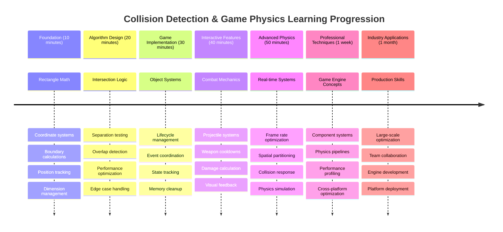

# ਸਪੇਸ ਗੇਮ ਬਣਾਓ ਭਾਗ 4: ਲੇਜ਼ਰ ਸ਼ਾਮਲ ਕਰਨਾ ਅਤੇ ਟਕਰਾਅ ਦੀ ਪਛਾਣ ਕਰਨਾ

## ਪੂਰਵ-ਵਿਚਾਰ ਕਵਿਜ਼

[ਪੂਰਵ-ਵਿਚਾਰ ਕਵਿਜ਼](https://ff-quizzes.netlify.app/web/quiz/35)

ਸਟਾਰ ਵਾਰਜ਼ ਦੇ ਉਸ ਪਲ ਬਾਰੇ ਸੋਚੋ ਜਦੋਂ ਲੂਕ ਦੇ ਪ੍ਰੋਟੋਨ ਟੋਰਪੀਡੋਜ਼ ਡੈਥ ਸਟਾਰ ਦੇ ਐਗਜ਼ਹੌਸਟ ਪੋਰਟ ਨੂੰ ਹਿੱਟ ਕਰਦੇ ਹਨ। ਉਹ ਸਹੀ ਟਕਰਾਅ ਦੀ ਪਛਾਣ ਨੇ ਗਲੈਕਸੀ ਦੀ ਕਿਸਮਤ ਬਦਲ ਦਿੱਤੀ! ਗੇਮਾਂ ਵਿੱਚ, ਟਕਰਾਅ ਦੀ ਪਛਾਣ ਇਸੇ ਤਰ੍ਹਾਂ ਕੰਮ ਕਰਦੀ ਹੈ - ਇਹ ਇਹ ਨਿਰਧਾਰਤ ਕਰਦੀ ਹੈ ਕਿ ਜਦੋਂ ਵਸਤੂਆਂ ਪਰਸਪਰ ਸੰਪਰਕ ਕਰਦੀਆਂ ਹਨ ਤਾਂ ਕੀ ਹੁੰਦਾ ਹੈ।

ਇਸ ਪਾਠ ਵਿੱਚ, ਤੁਸੀਂ ਆਪਣੇ ਸਪੇਸ ਗੇਮ ਵਿੱਚ ਲੇਜ਼ਰ ਹਥਿਆਰ ਸ਼ਾਮਲ ਕਰੋਗੇ ਅਤੇ ਟਕਰਾਅ ਦੀ ਪਛਾਣ ਨੂੰ ਲਾਗੂ ਕਰੋਗੇ। ਜਿਵੇਂ NASA ਦੇ ਮਿਸ਼ਨ ਪਲਾਨਰਜ਼ ਅੰਤਰਿਕਸ਼ ਜਹਾਜ਼ ਦੇ ਰਾਹਾਂ ਦੀ ਗਣਨਾ ਕਰਦੇ ਹਨ ਤਾਂ ਕਿ ਮਲਬੇ ਤੋਂ ਬਚਿਆ ਜਾ ਸਕੇ, ਤੁਸੀਂ ਸਿੱਖੋਗੇ ਕਿ ਜਦੋਂ ਗੇਮ ਵਸਤੂਆਂ ਇੱਕ-ਦੂਜੇ ਨਾਲ ਟਕਰਾਉਂਦੀਆਂ ਹਨ ਤਾਂ ਕਿਵੇਂ ਪਛਾਣ ਕਰਨੀ ਹੈ। ਅਸੀਂ ਇਸਨੂੰ ਛੋਟੇ-ਛੋਟੇ ਕਦਮਾਂ ਵਿੱਚ ਤੋੜਾਂਗੇ ਜੋ ਇੱਕ-ਦੂਜੇ 'ਤੇ ਅਧਾਰਿਤ ਹਨ।

ਅੰਤ ਵਿੱਚ, ਤੁਹਾਡੇ ਕੋਲ ਇੱਕ ਕੰਮ ਕਰਨ ਵਾਲਾ ਲੜਾਈ ਪ੍ਰਣਾਲੀ ਹੋਵੇਗੀ ਜਿੱਥੇ ਲੇਜ਼ਰ ਦੁਸ਼ਮਨਾਂ ਨੂੰ ਨਸ਼ਟ ਕਰਦੇ ਹਨ ਅਤੇ ਟਕਰਾਅ ਗੇਮ ਇਵੈਂਟਸ ਨੂੰ ਟ੍ਰਿਗਰ ਕਰਦੇ ਹਨ। ਇਹੀ ਟਕਰਾਅ ਦੇ ਸਿਧਾਂਤ ਫਿਜ਼ਿਕਸ ਸਿਮੂਲੇਸ਼ਨ ਤੋਂ ਲੈ ਕੇ ਇੰਟਰਐਕਟਿਵ ਵੈੱਬ ਇੰਟਰਫੇਸ ਤੱਕ ਹਰ ਚੀਜ਼ ਵਿੱਚ ਵਰਤੇ ਜਾਂਦੇ ਹਨ।

✅ ਪਹਿਲੇ ਕੰਪਿਊਟਰ ਗੇਮ ਬਾਰੇ ਕੁਝ ਖੋਜ ਕਰੋ ਜੋ ਕਦੇ ਲਿਖਿਆ ਗਿਆ ਸੀ। ਇਸ ਦੀ ਕਾਰਗੁਜ਼ਾਰੀ ਕੀ ਸੀ?

## ਟਕਰਾਅ ਦੀ ਪਛਾਣ

ਟਕਰਾਅ ਦੀ ਪਛਾਣ ਅਪੋਲੋ ਲੂਨਰ ਮੋਡਿਊਲ ਦੇ ਨਜ਼ਦੀਕੀ ਸੈਂਸਰਾਂ ਵਾਂਗ ਕੰਮ ਕਰਦੀ ਹੈ - ਇਹ ਲਗਾਤਾਰ ਦੂਰੀਆਂ ਦੀ ਜਾਂਚ ਕਰਦੀ ਹੈ ਅਤੇ ਜਦੋਂ ਵਸਤੂਆਂ ਬਹੁਤ ਨੇੜੇ ਆ ਜਾਂਦੀਆਂ ਹਨ ਤਾਂ ਚੇਤਾਵਨੀ ਦਿੰਦੀ ਹੈ। ਗੇਮਾਂ ਵਿੱਚ, ਇਹ ਪ੍ਰਣਾਲੀ ਇਹ ਨਿਰਧਾਰਤ ਕਰਦੀ ਹੈ ਕਿ ਜਦੋਂ ਵਸਤੂਆਂ ਸੰਪਰਕ ਕਰਦੀਆਂ ਹਨ ਤਾਂ ਕੀ ਹੋਣਾ ਚਾਹੀਦਾ ਹੈ।

ਜੋ ਪਹੁੰਚ ਅਸੀਂ ਵਰਤਾਂਗੇ ਉਹ ਹਰ ਗੇਮ ਵਸਤੂ ਨੂੰ ਇੱਕ ਆਯਤਕਾਰ ਵਜੋਂ ਮੰਨਦੀ ਹੈ, ਜਿਵੇਂ ਹਵਾਈ ਟ੍ਰੈਫਿਕ ਕੰਟਰੋਲ ਪ੍ਰਣਾਲੀਆਂ ਸਧਾਰਨ ਜਿਓਮੈਟ੍ਰਿਕ ਸ਼ੇਪਾਂ ਨੂੰ ਵਰਤਦੀਆਂ ਹਨ ਜਹਾਜ਼ਾਂ ਨੂੰ ਟ੍ਰੈਕ ਕਰਨ ਲਈ। ਇਹ ਆਯਤਕਾਰ ਵਿਧੀ ਬੁਨਿਆਦੀ ਲੱਗ ਸਕਦੀ ਹੈ, ਪਰ ਇਹ ਗਣਨਾਤਮਕ ਤੌਰ 'ਤੇ ਪ੍ਰਭਾਵਸ਼ਾਲੀ ਹੈ ਅਤੇ ਜ਼ਿਆਦਾਤਰ ਗੇਮ ਸਥਿਤੀਆਂ ਲਈ ਚੰਗੀ ਤਰ੍ਹਾਂ ਕੰਮ ਕਰਦੀ ਹੈ।

### ਆਯਤਕਾਰ ਪ੍ਰਤੀਨਿਧਤਾ

ਹਰ ਗੇਮ ਵਸਤੂ ਨੂੰ ਕੋਆਰਡੀਨੇਟ ਬਾਊਂਡਰੀਜ਼ ਦੀ ਲੋੜ ਹੁੰਦੀ ਹੈ, ਜਿਵੇਂ ਮਾਰਸ ਪਾਥਫਾਈਂਡਰ ਰੋਵਰ ਨੇ ਮਾਰਸ ਦੀ ਸਤਹ 'ਤੇ ਆਪਣਾ ਸਥਾਨ ਮੈਪ ਕੀਤਾ। ਇੱਥੇ ਅਸੀਂ ਇਹ ਬਾਊਂਡਰੀ ਕੋਆਰਡੀਨੇਟਸ ਕਿਵੇਂ ਪਰਿਭਾਸ਼ਿਤ ਕਰਦੇ ਹਾਂ:

**ਇਸਨੂੰ ਤੋੜ ਕੇ ਸਮਝੋ:**
- **ਉੱਪਰੀ ਕਿਨਾਰਾ**: ਜਿੱਥੇ ਤੁਹਾਡੀ ਵਸਤੂ ਲੰਬਕਾਰੀ ਤੌਰ 'ਤੇ ਸ਼ੁਰੂ ਹੁੰਦੀ ਹੈ (ਇਸ ਦਾ y ਸਥਾਨ)
- **ਖੱਬਾ ਕਿਨਾਰਾ**: ਜਿੱਥੇ ਇਹ ਆੜ੍ਹਕ ਤੌਰ 'ਤੇ ਸ਼ੁਰੂ ਹੁੰਦੀ ਹੈ (ਇਸ ਦਾ x ਸਥਾਨ)
- **ਹੇਠਲਾ ਕਿਨਾਰਾ**: y ਸਥਾਨ ਵਿੱਚ ਉਚਾਈ ਸ਼ਾਮਲ ਕਰੋ - ਹੁਣ ਤੁਹਾਨੂੰ ਪਤਾ ਹੈ ਕਿ ਇਹ ਕਿੱਥੇ ਖਤਮ ਹੁੰਦੀ ਹੈ!
- **ਸੱਜਾ ਕਿਨਾਰਾ**: ਚੌੜਾਈ ਨੂੰ x ਸਥਾਨ ਵਿੱਚ ਸ਼ਾਮਲ ਕਰੋ - ਅਤੇ ਤੁਹਾਡੇ ਕੋਲ ਪੂਰੀ ਬਾਊਂਡਰੀ ਹੈ

### ਇੰਟਰਸੈਕਸ਼ਨ ਐਲਗੋਰਿਦਮ

ਆਯਤਕਾਰ ਇੰਟਰਸੈਕਸ਼ਨ ਦੀ ਪਛਾਣ ਕਰਨ ਲਈ ਤਰਕ ਦੀ ਵਰਤੋਂ ਕੀਤੀ ਜਾਂਦੀ ਹੈ ਜਿਵੇਂ ਕਿ ਹਬਲ ਸਪੇਸ ਟੈਲੀਸਕੋਪ ਇਹ ਨਿਰਧਾਰਤ ਕਰਦਾ ਹੈ ਕਿ ਕੀ ਇਸਦੇ ਦ੍ਰਿਸ਼ਟੀ ਖੇਤਰ ਵਿੱਚ ਆਕਾਸ਼ੀ ਵਸਤੂਆਂ ਇੱਕ-ਦੂਜੇ ਨਾਲ ਓਵਰਲੈਪ ਕਰ ਰਹੀਆਂ ਹਨ। ਐਲਗੋਰਿਦਮ ਵੱਖਰੇ ਹੋਣ ਦੀ ਜਾਂਚ ਕਰਦਾ ਹੈ:

**ਵੱਖਰੇ ਹੋਣ ਦੀ ਜਾਂਚ ਰੇਡਾਰ ਪ੍ਰਣਾਲੀਆਂ ਵਾਂਗ ਕੰਮ ਕਰਦੀ ਹੈ:**
- ਕੀ ਆਯਤਕਾਰ 2 ਪੂਰੀ ਤਰ੍ਹਾਂ ਆਯਤਕਾਰ 1 ਦੇ ਸੱਜੇ ਪਾਸੇ ਹੈ?
- ਕੀ ਆਯਤਕਾਰ 2 ਪੂਰੀ ਤਰ੍ਹਾਂ ਆਯਤਕਾਰ 1 ਦੇ ਖੱਬੇ ਪਾਸੇ ਹੈ?
- ਕੀ ਆਯਤਕਾਰ 2 ਪੂਰੀ ਤਰ੍ਹਾਂ ਆਯਤਕਾਰ 1 ਦੇ ਹੇਠਾਂ ਹੈ?
- ਕੀ ਆਯਤਕਾਰ 2 ਪੂਰੀ ਤਰ੍ਹਾਂ ਆਯਤਕਾਰ 1 ਦੇ ਉੱਪਰ ਹੈ?

ਜੇ ਇਹਨਾਂ ਵਿੱਚੋਂ ਕੋਈ ਵੀ ਸ਼ਰਤ ਸੱਚ ਨਹੀਂ ਹੈ, ਤਾਂ ਆਯਤਕਾਰਾਂ ਨੂੰ ਜ਼ਰੂਰ ਓਵਰਲੈਪ ਕਰਨਾ ਚਾਹੀਦਾ ਹੈ। ਇਹ ਪਹੁੰਚ ਇਸ ਤਰ੍ਹਾਂ ਹੈ ਜਿਵੇਂ ਰੇਡਾਰ ਓਪਰੇਟਰ ਨਿਰਧਾਰਤ ਕਰਦੇ ਹਨ ਕਿ ਕੀ ਦੋ ਜਹਾਜ਼ ਸੁਰੱਖਿਅਤ ਦੂਰੀ 'ਤੇ ਹਨ।

## ਵਸਤੂਆਂ ਦੇ ਜੀਵਨ ਚੱਕਰ ਦਾ ਪ੍ਰਬੰਧਨ

ਜਦੋਂ ਲੇਜ਼ਰ ਦੁਸ਼ਮਨ ਨੂੰ ਹਿੱਟ ਕਰਦਾ ਹੈ, ਦੋਵਾਂ ਵਸਤੂਆਂ ਨੂੰ ਗੇਮ ਤੋਂ ਹਟਾਉਣ ਦੀ ਲੋੜ ਹੁੰਦੀ ਹੈ। ਹਾਲਾਂਕਿ, ਮਿਡ-ਲੂਪ ਵਿੱਚ ਵਸਤੂਆਂ ਨੂੰ ਮਿਟਾਉਣਾ ਕਰੈਸ਼ ਦਾ ਕਾਰਨ ਬਣ ਸਕਦਾ ਹੈ - ਜਿਵੇਂ ਅਪੋਲੋ ਗਾਈਡੈਂਸ ਕੰਪਿਊਟਰ ਵਰਗੇ ਪੁਰਾਣੇ ਕੰਪਿਊਟਰ ਸਿਸਟਮਾਂ ਵਿੱਚ ਸਿੱਖਿਆ ਗਿਆ। ਇਸ ਦੀ ਬਜਾਏ, ਅਸੀਂ "ਮਿਟਾਉਣ ਲਈ ਚਿੰਨ੍ਹਿਤ ਕਰੋ" ਪਹੁੰਚ ਵਰਤਦੇ ਹਾਂ ਜੋ ਫਰੇਮਾਂ ਦੇ ਵਿਚਕਾਰ ਵਸਤੂਆਂ ਨੂੰ ਸੁਰੱਖਿਅਤ ਤੌਰ 'ਤੇ ਹਟਾਉਂਦੀ ਹੈ।

**ਇਸ ਪਹੁੰਚ ਦਾ ਕਾਰਨ ਕੰਮ ਕਰਦਾ ਹੈ:**
- ਅਸੀਂ ਵਸਤੂ ਨੂੰ "ਮਰਿਆ ਹੋਇਆ" ਚਿੰਨ੍ਹਿਤ ਕਰਦੇ ਹਾਂ ਪਰ ਇਸਨੂੰ ਤੁਰੰਤ ਮਿਟਾਉਂਦੇ ਨਹੀਂ
- ਇਹ ਮੌਜੂਦਾ ਗੇਮ ਫਰੇਮ ਨੂੰ ਸੁਰੱਖਿਅਤ ਤੌਰ 'ਤੇ ਖਤਮ ਕਰਨ ਦਿੰਦਾ ਹੈ
- ਕੋਈ ਕਰੈਸ਼ ਨਹੀਂ ਹੁੰਦੇ ਜਦੋਂ ਕੁਝ ਵਰਤਣ ਦੀ ਕੋਸ਼ਿਸ਼ ਕੀਤੀ ਜਾਂਦੀ ਹੈ ਜੋ ਪਹਿਲਾਂ ਹੀ ਮਿਟਾਇਆ ਜਾ ਚੁੱਕਾ ਹੈ!

ਫਿਰ ਅਗਲੇ ਰੈਂਡਰ ਸਾਈਕਲ ਤੋਂ ਪਹਿਲਾਂ ਮਿਟਾਏ ਗਏ ਵਸਤੂਆਂ ਨੂੰ ਫਿਲਟਰ ਕਰੋ:

**ਇਹ ਫਿਲਟਰੀ ਕਰਦਾ ਹੈ:**
- ਸਿਰਫ "ਜੀਵਤ" ਵਸਤੂਆਂ ਨਾਲ ਇੱਕ ਤਾਜ਼ਾ ਸੂਚੀ ਬਣਾਉਂਦਾ ਹੈ
- ਕੁਝ ਵੀ ਮਰਿਆ ਹੋਇਆ ਚਿੰਨ੍ਹਿਤ ਕੀਤਾ ਹੋਇਆ ਬਾਹਰ ਸੁੱਟ ਦਿੰਦਾ ਹੈ
- ਤੁਹਾਡੀ ਗੇਮ ਨੂੰ ਸੁਰੱਖਿਅਤ ਤੌਰ 'ਤੇ ਚਲਾਉਂਦਾ ਹੈ
- ਮਿਟਾਈਆਂ ਗਈਆਂ ਵਸਤੂਆਂ ਦੇ ਸੰਚਿਤ ਹੋਣ ਤੋਂ ਮੈਮੋਰੀ ਬਲੋਟ ਨੂੰ ਰੋਕਦਾ ਹੈ

## ਲੇਜ਼ਰ ਮਕੈਨਿਕਸ ਨੂੰ ਲਾਗੂ ਕਰਨਾ

ਗੇਮਾਂ ਵਿੱਚ ਲੇਜ਼ਰ ਪ੍ਰੋਜੈਕਟਾਈਲਜ਼ ਸਟਾਰ ਟ੍ਰੈਕ ਵਿੱਚ ਫੋਟੋਨ ਟੋਰਪੀਡੋਜ਼ ਦੇ ਇੱਕੋ ਹੀ ਸਿਧਾਂਤ 'ਤੇ ਕੰਮ ਕਰਦੇ ਹਨ - ਇਹ ਵੱਖਰੀਆਂ ਵਸਤੂਆਂ ਹਨ ਜੋ ਸਿੱਧੇ ਲਾਈਨਾਂ ਵਿੱਚ ਯਾਤਰਾ ਕਰਦੀਆਂ ਹਨ ਜਦੋਂ ਤੱਕ ਇਹ ਕੁਝ ਹਿੱਟ ਨਹੀਂ ਕਰਦੀਆਂ। ਹਰ ਸਪੇਸਬਾਰ ਦਬਾਉਣ ਨਾਲ ਇੱਕ ਨਵਾਂ ਲੇਜ਼ਰ ਵਸਤੂ ਬਣਦਾ ਹੈ ਜੋ ਸਕ੍ਰੀਨ 'ਤੇ ਚਲਦਾ ਹੈ।

ਇਸਨੂੰ ਕੰਮ ਕਰਨ ਲਈ, ਸਾਨੂੰ ਕੁਝ ਵੱਖਰੀਆਂ ਚੀਜ਼ਾਂ ਨੂੰ ਸਹਿ-ਸੰਚਾਲਿਤ ਕਰਨ ਦੀ ਲੋੜ ਹੈ:

**ਲਾਗੂ ਕਰਨ ਲਈ ਮੁੱਖ ਹਿੱਸੇ:**
- **ਬਣਾਉਣਾ** ਲੇਜ਼ਰ ਵਸਤੂਆਂ ਜੋ ਹੀਰੋ ਦੇ ਸਥਾਨ ਤੋਂ ਜਨਮ ਲੈਂਦੀਆਂ ਹਨ
- **ਹੈਂਡਲ ਕਰਨਾ** ਕੀਬੋਰਡ ਇਨਪੁਟ ਲੇਜ਼ਰ ਬਣਾਉਣ ਨੂੰ ਟ੍ਰਿਗਰ ਕਰਨ ਲਈ
- **ਪ੍ਰਬੰਧਨ** ਲੇਜ਼ਰ ਦੀ ਮੋਸ਼ਨ ਅਤੇ ਜੀਵਨ ਚੱਕਰ
- **ਲਾਗੂ ਕਰਨਾ** ਲੇਜ਼ਰ ਪ੍ਰੋਜੈਕਟਾਈਲਜ਼ ਲਈ ਵਿਜ਼ੁਅਲ ਪ੍ਰਤੀਨਿਧਤਾ

## ਫਾਇਰਿੰਗ ਰੇਟ ਕੰਟਰੋਲ ਲਾਗੂ ਕਰਨਾ

ਅਨਲਿਮਿਟਡ ਫਾਇਰਿੰਗ ਰੇਟ ਗੇਮ ਇੰਜਨ ਨੂੰ ਥੱਕਾ ਦੇਵੇਗਾ ਅਤੇ ਗੇਮਪਲੇ ਨੂੰ ਬਹੁਤ ਆਸਾਨ ਬਣਾ ਦੇਵੇਗਾ। ਅਸਲ ਹਥਿਆਰ ਪ੍ਰਣਾਲੀਆਂ ਨੂੰ ਇਸੇ ਤਰ੍ਹਾਂ ਦੀਆਂ ਪਾਬੰਦੀਆਂ ਦਾ ਸਾਹਮਣਾ ਕਰਨਾ ਪੈਂਦਾ ਹੈ - ਇੱਥੋਂ ਤੱਕ ਕਿ USS ਐਂਟਰਪ੍ਰਾਈਜ਼ ਦੇ ਫੇਜ਼ਰਜ਼ ਨੂੰ ਵੀ ਸ਼ਾਟਾਂ ਦੇ ਵਿਚਕਾਰ ਰੀਚਾਰਜ ਕਰਨ ਦਾ ਸਮਾਂ ਲੱਗਦਾ ਸੀ।

ਅਸੀਂ ਇੱਕ ਕੂਲਡਾਊਨ ਪ੍ਰਣਾਲੀ ਲਾਗੂ ਕਰਾਂਗੇ ਜੋ ਰੈਪਿਡ-ਫਾਇਰ ਸਪੈਮਿੰਗ ਨੂੰ ਰੋਕਦੀ ਹੈ ਜਦੋਂ ਕਿ ਸੰਵੇਦਨਸ਼ੀਲ ਕੰਟਰੋਲਾਂ ਨੂੰ ਬਣਾਈ ਰੱਖਦੀ ਹੈ:

**ਕੂਲਡਾਊਨ ਕਿਵੇਂ ਕੰਮ ਕਰਦਾ ਹੈ:**
- ਜਦੋਂ ਬਣਾਇਆ ਜਾਂਦਾ ਹੈ, ਹਥਿਆਰ "ਹੌਟ" ਸ਼ੁਰੂ ਹੁੰਦਾ ਹੈ (ਅਜੇ ਤੱਕ ਫਾਇਰ ਨਹੀਂ ਕਰ ਸਕਦਾ)
- ਟਾਈਮਆਉਟ ਪੀਰੀਅਡ ਤੋਂ ਬਾਅਦ, ਇਹ "ਕੂਲ" ਬਣ ਜਾਂਦਾ ਹੈ (ਫਾਇਰ ਕਰਨ ਲਈ ਤਿਆਰ)
- ਫਾਇਰ ਕਰਨ ਤੋਂ ਪਹਿਲਾਂ, ਅਸੀਂ ਜਾਂਚਦੇ ਹਾਂ: "ਕੀ ਹਥਿਆਰ ਕੂਲ ਹੈ?"
- ਇਹ ਸਪੈਮ-ਕਲਿਕਿੰਗ ਨੂੰ ਰੋਕਦਾ ਹੈ ਜਦੋਂ ਕਿ ਕੰਟਰੋਲਾਂ ਨੂੰ ਸੰਵੇਦਨਸ਼ੀਲ ਬਣਾਈ ਰੱਖਦਾ ਹੈ

✅ ਸਪੇਸ ਗੇਮ ਸੀਰੀਜ਼ ਦੇ ਪਾਠ 1 ਨੂੰ ਵੇਖੋ ਤਾਂ ਕਿ ਕੂਲਡਾਊਨਜ਼ ਬਾਰੇ ਯਾਦ ਦਿਵਾਈ ਜਾ ਸਕੇ।

## ਟਕਰਾਅ ਪ੍ਰਣਾਲੀ ਬਣਾਉਣਾ

ਤੁਸੀਂ ਆਪਣੀ ਮੌਜੂਦਾ ਸਪੇਸ ਗੇਮ ਕੋਡ ਨੂੰ ਵਧਾਉਂਦੇ ਹੋਏ ਇੱਕ ਟਕਰਾਅ ਦੀ ਪਛਾਣ ਪ੍ਰਣਾਲੀ ਬਣਾਉਣ ਜਾ ਰਹੇ ਹੋ। ਜਿਵੇਂ ਇੰਟਰਨੈਸ਼ਨਲ ਸਪੇਸ ਸਟੇਸ਼ਨ ਦੀ ਆਟੋਮੈਟਿਕ ਟਕਰਾਅ ਤੋਂ ਬਚਾਅ ਪ੍ਰਣਾਲੀ, ਤੁਹਾਡੀ ਗੇਮ ਲਗਾਤਾਰ ਵਸਤੂਆਂ ਦੇ ਸਥਾਨਾਂ ਦੀ ਨਿਗਰਾਨੀ ਕਰੇਗੀ ਅਤੇ ਇੰਟਰਸੈਕਸ਼ਨਸ ਨੂੰ ਜਵਾਬ ਦੇਵੇਗੀ।

ਪਿਛਲੇ ਪਾਠ ਦੇ ਕੋਡ ਤੋਂ ਸ਼ੁਰੂ ਕਰਦੇ ਹੋਏ, ਤੁਸੀਂ ਟਕਰਾਅ ਦੀ ਪਛਾਣ ਸ਼ਾਮਲ ਕਰਾਂਗੇ ਜਿਸ ਵਿੱਚ ਵਸਤੂਆਂ ਦੇ ਪਰਸਪਰ ਸੰਪਰਕਾਂ ਨੂੰ ਨਿਰਧਾਰਤ ਕਰਨ ਵਾਲੇ ਵਿਸ਼ੇਸ਼ ਨਿਯਮ ਹਨ।

> 💡 **ਪ੍ਰੋ ਟਿਪ**: ਲੇਜ਼ਰ ਸਪ੍ਰਾਈਟ ਪਹਿਲਾਂ ਹੀ ਤੁਹਾਡੇ ਐਸੈਟਸ ਫੋਲਡਰ ਵਿੱਚ ਸ਼ਾਮਲ ਹੈ ਅਤੇ ਤੁਹਾਡੇ ਕੋਡ ਵਿੱਚ ਦਰਸਾਇਆ ਗਿਆ ਹੈ, ਲਾਗੂ ਕਰਨ ਲਈ ਤਿਆਰ।

### ਲਾਗੂ ਕਰਨ ਲਈ ਟਕਰਾਅ ਦੇ ਨਿਯਮ

**ਸ਼ਾਮਲ ਕਰਨ ਲਈ ਗੇਮ ਮਕੈਨਿਕਸ:**
1. **ਲੇਜ਼ਰ ਦੁਸ਼ਮਨ ਨੂੰ ਹਿੱਟ ਕਰਦਾ ਹੈ**: ਜਦੋਂ ਲੇਜ਼ਰ ਪ੍ਰੋਜੈਕਟਾਈਲ ਦੁਆਰਾ ਹਿੱਟ ਕੀਤਾ ਜਾਂਦਾ ਹੈ ਤਾਂ ਦੁਸ਼ਮਨ ਵਸਤੂ ਨਸ਼ਟ ਹੋ ਜਾਂਦੀ ਹੈ
2. **ਲੇਜ਼ਰ ਸਕ੍ਰੀਨ ਬਾਊਂਡਰੀ ਨੂੰ ਹਿੱਟ ਕਰਦਾ ਹੈ**: ਜਦੋਂ ਲੇਜ਼ਰ ਸਕ੍ਰੀਨ ਦੇ ਉੱਪਰੀ ਕਿਨਾਰੇ 'ਤੇ ਪਹੁੰਚਦਾ ਹੈ ਤਾਂ ਇਸਨੂੰ ਹਟਾ ਦਿੱਤਾ ਜਾਂਦਾ ਹੈ
3. **ਦੁਸ਼ਮਨ ਅਤੇ ਹੀਰੋ ਟਕਰਾਅ**: ਜਦੋਂ ਦੋਵਾਂ ਵਸਤੂਆਂ ਇੱਕ-ਦੂਜੇ ਨਾਲ ਟਕਰਾਉਂਦੀਆਂ ਹਨ ਤਾਂ ਦੋਵਾਂ ਵਸਤੂਆਂ ਨਸ਼ਟ ਹੋ ਜਾਂਦੀਆਂ ਹਨ
4. **ਦੁਸ਼ਮਨ ਹੇਠਾਂ ਪਹੁੰਚਦਾ ਹੈ**: ਜਦੋਂ ਦੁਸ਼ਮਨ ਸਕ੍ਰੀਨ ਦੇ ਹੇਠਲੇ ਹਿੱਸੇ 'ਤੇ ਪਹੁੰਚਦੇ ਹਨ ਤਾਂ ਗੇਮ ਖਤਮ ਹੋ ਜਾਂਦੀ ਹੈ

### 🔄 **ਪੈਡਾਗੌਜੀਕਲ ਚੈੱਕ-ਇਨ**
**ਟਕਰਾਅ ਦੀ ਪਛਾਣ ਦੀ ਬੁਨਿਆਦ**: ਲਾਗੂ ਕਰਨ ਤੋਂ ਪਹਿਲਾਂ, ਇਹ ਯਕੀਨੀ ਬਣਾਓ ਕਿ ਤੁਸੀਂ ਸਮਝਦੇ ਹੋ:
- ✅ ਕਿਵੇਂ ਆਯਤਕਾਰ ਬਾਊਂਡਰੀਜ਼ ਟਕਰਾਅ ਜ਼ੋਨ ਨੂੰ ਪਰਿਭਾਸ਼ਿਤ ਕਰਦੀਆਂ ਹਨ
- ✅ ਕਿਉਂ ਵੱਖਰੇ ਹੋਣ ਦੀ ਜਾਂਚ ਇੰਟਰਸੈਕਸ਼ਨ ਗਣਨਾ ਨਾਲੋਂ ਜ਼ਿਆਦਾ ਪ੍ਰਭਾਵਸ਼ਾਲੀ ਹੈ
- ✅ ਗੇਮ ਲੂਪ ਵਿੱਚ ਵਸਤੂਆਂ ਦੇ ਜੀਵਨ ਚੱਕਰ ਪ੍ਰਬੰਧਨ ਦੀ ਮਹੱਤਤਾ
- ✅ ਕਿਵੇਂ ਇਵੈਂਟ-ਡ੍ਰਿਵਨ ਪ੍ਰਣਾਲੀਆਂ ਟਕਰਾਅ ਦੇ ਜਵਾਬਾਂ ਨੂੰ ਸਹਿ-ਸੰਚਾਲਿਤ ਕਰਦੀਆਂ ਹਨ

**ਤੁਰੰਤ ਸਵਾਲ-ਜਵਾਬ**: ਜੇ ਤੁਸੀਂ ਵਸਤੂਆਂ ਨੂੰ ਤੁਰੰਤ ਮਿਟਾ ਦਿੰਦੇ ਤਾਂ ਕੀ ਹੁੰਦਾ?
*ਜਵਾਬ: ਮਿਡ-ਲੂਪ ਮਿਟਾਉਣਾ ਕਰੈਸ਼ ਦਾ ਕਾਰਨ ਬਣ ਸਕਦਾ ਹੈ ਜਾਂ ਇਟਰੈਸ਼ਨ ਵਿੱਚ ਵਸਤੂਆਂ ਨੂੰ ਸਕਿਪ ਕਰ ਸਕਦਾ ਹੈ*

**ਭੌਤਿਕ ਵਿਗਿਆਨ ਦੀ ਸਮਝ**: ਹੁਣ ਤੁਸੀਂ ਸਮਝਦੇ ਹੋ:
- **ਕੋਆਰਡੀਨੇਟ ਸਿਸਟਮ**: ਕਿਵੇਂ ਸਥਾਨ ਅਤੇ ਮਾਪ ਬਾਊਂਡਰੀਜ਼ ਬਣਾਉਂਦੇ ਹਨ
- **ਇੰਟਰਸੈਕਸ਼ਨ ਤਰਕ**: ਟਕਰਾਅ ਦੀ ਪਛਾਣ ਦੇ ਪਿੱਛੇ ਗਣਿਤਕ ਸਿਧਾਂਤ
- **ਪ੍ਰਦਰਸ਼ਨ ਦਾ ਅਧਿਕਤਮ ਉਪਯੋਗ**: ਰੀਅਲ-ਟਾਈਮ ਸਿਸਟਮਾਂ ਵਿੱਚ ਪ੍ਰਭਾਵਸ਼ਾਲੀ ਐਲਗੋਰਿਦਮ ਕਿਉਂ ਮਹੱਤਵਪੂਰਨ ਹਨ
- **ਮੈਮੋਰੀ ਪ੍ਰਬੰਧਨ**: ਸਥਿਰਤਾ ਲਈ ਸੁਰੱਖਿਅਤ ਵਸਤੂ ਜੀਵਨ ਚੱਕਰ ਪੈਟਰਨ

## ਆਪਣਾ ਵਿਕਾਸ ਵਾਤਾਵਰਣ ਸੈਟ ਕਰਨਾ

ਚੰਗੀ ਖ਼ਬਰ - ਅਸੀਂ ਪਹਿਲਾਂ ਹੀ ਤੁਹਾਡੇ ਲਈ ਜ਼ਿਆਦਾਤਰ ਮੂਲ ਢਾਂਚਾ ਸੈਟ ਕਰ ਦਿੱਤਾ ਹੈ! ਤੁਹਾਡੇ ਸਾਰੇ ਗੇਮ ਐਸੈਟਸ ਅਤੇ ਬੁਨਿਆਦੀ ਬਣਤਰ `your-work` ਸਬਫੋਲਡਰ ਵਿੱਚ ਉਪਲਬਧ ਹਨ, ਜੋ ਕਿ ਤੁਹਾਡੇ ਲਈ ਸ਼ਾਨਦਾਰ ਟਕਰਾਅ ਫੀਚਰ ਸ਼ਾਮਲ ਕਰਨ ਲਈ ਤਿਆਰ ਹਨ।

### ਪ੍ਰਾਜੈਕਟ ਢਾਂਚਾ

**ਫਾਇਲ ਢਾਂਚੇ ਨੂੰ ਸਮਝਣਾ:**
- **ਸ਼ਾਮਲ ਕਰਦਾ ਹੈ** ਗੇਮ ਵਸਤੂਆਂ ਲਈ ਸਾਰੇ ਸਪ੍ਰਾਈਟ ਚਿੱਤਰ
- **ਸ਼ਾਮਲ ਕਰਦਾ ਹੈ** ਮੁੱਖ HTML ਦਸਤਾਵੇਜ਼ ਅਤੇ ਜਾਵਾਸਕ੍ਰਿਪਟ ਐਪਲੀਕੇਸ਼ਨ ਫਾਇਲ
- **ਪੇਸ਼ ਕਰਦਾ ਹੈ** ਸਥਾਨਕ ਵਿਕਾਸ ਸਰਵਰ ਲਈ ਪੈਕੇਜ ਸੰਰਚਨਾ

### ਵਿਕਾਸ ਸਰਵਰ ਸ਼ੁਰੂ ਕਰਨਾ

ਆਪਣੇ ਪ੍ਰਾਜੈਕਟ ਫੋਲਡਰ ਵਿੱਚ ਜਾਓ
- [ ] ਰੀਅਲ-ਟਾਈਮ ਵਿੱਚ ਟਕਰਾਅ ਦੀਆਂ ਘਟਨਾਵਾਂ ਨੂੰ ਟ੍ਰੈਕ ਕਰਨ ਲਈ `console.log` ਬਿਆਨ ਸ਼ਾਮਲ ਕਰੋ

### 🎯 **ਇਸ ਘੰਟੇ ਵਿੱਚ ਤੁਸੀਂ ਕੀ ਹਾਸਲ ਕਰ ਸਕਦੇ ਹੋ**
- [ ] ਪੋਸਟ-ਪਾਠ ਕਵਿਜ਼ ਪੂਰਾ ਕਰੋ ਅਤੇ ਟਕਰਾਅ ਪਤਾ ਲਗਾਉਣ ਦੇ ਅਲਗੋਰਿਥਮ ਨੂੰ ਸਮਝੋ
- [ ] ਟਕਰਾਅ ਹੋਣ 'ਤੇ ਧਮਾਕਿਆਂ ਵਰਗੇ ਵਿਜ਼ੂਅਲ ਪ੍ਰਭਾਵ ਸ਼ਾਮਲ ਕਰੋ
- [ ] ਵੱਖ-ਵੱਖ ਗੁਣਾਂ ਵਾਲੇ ਪ੍ਰੋਜੈਕਟਾਈਲਜ਼ ਦੇ ਵੱਖ-ਵੱਖ ਕਿਸਮਾਂ ਨੂੰ ਲਾਗੂ ਕਰੋ
- [ ] ਪਾਵਰ-ਅੱਪਸ ਬਣਾਓ ਜੋ ਖਿਡਾਰੀ ਦੀਆਂ ਯੋਗਤਾਵਾਂ ਨੂੰ ਅਸਥਾਈ ਤੌਰ 'ਤੇ ਵਧਾਉਂਦੇ ਹਨ
- [ ] ਟਕਰਾਅ ਨੂੰ ਹੋਰ ਰੋਮਾਂਚਕ ਬਣਾਉਣ ਲਈ ਧੁਨੀਆਂ ਦੇ ਪ੍ਰਭਾਵ ਸ਼ਾਮਲ ਕਰੋ

### 📅 **ਤੁਹਾਡਾ ਹਫ਼ਤੇ-ਲੰਬਾ ਫਿਜ਼ਿਕਸ ਪ੍ਰੋਗਰਾਮਿੰਗ**
- [ ] ਪੂਰੀ ਸਪੇਸ ਗੇਮ ਪੂਰੀ ਕਰੋ ਜਿਸ ਵਿੱਚ ਪਾਲਿਸ਼ ਕੀਤੇ ਟਕਰਾਅ ਸਿਸਟਮ ਹਨ
- [ ] ਆਗੇ ਦੇ ਟਕਰਾਅ ਦੇ ਆਕਾਰ ਲਾਗੂ ਕਰੋ ਜਿਵੇਂ ਕਿ ਆਰਕਟੈਂਗਲ ਤੋਂ ਬਾਹਰ (ਗੋਲ, ਬਹੁਭੁਜ)
- [ ] ਹਕੀਕਤੀ ਧਮਾਕੇ ਦੇ ਪ੍ਰਭਾਵਾਂ ਲਈ ਕਣ ਸਿਸਟਮ ਸ਼ਾਮਲ ਕਰੋ
- [ ] ਟਕਰਾਅ ਤੋਂ ਬਚਣ ਵਾਲੇ ਜਟਿਲ ਦੁਸ਼ਮਣ ਦੇ ਵਿਹਾਰ ਬਣਾਓ
- [ ] ਬਹੁਤ ਸਾਰੇ ਆਬਜੈਕਟਾਂ ਨਾਲ ਬਿਹਤਰ ਪ੍ਰਦਰਸ਼ਨ ਲਈ ਟਕਰਾਅ ਪਤਾ ਲਗਾਉਣ ਨੂੰ ਅਨੁਕੂਲ ਬਣਾਓ
- [ ] ਮੋਮੈਂਟਮ ਅਤੇ ਹਕੀਕਤੀ ਗਤੀਵਿਧੀ ਵਰਗੇ ਫਿਜ਼ਿਕਸ ਸਿਮੂਲੇਸ਼ਨ ਸ਼ਾਮਲ ਕਰੋ

### 🌟 **ਤੁਹਾਡਾ ਮਹੀਨੇ-ਲੰਬਾ ਗੇਮ ਫਿਜ਼ਿਕਸ ਮਾਹਰਤਾ**
- [ ] ਅਗਰਗਾਮੀ ਫਿਜ਼ਿਕਸ ਇੰਜਨ ਅਤੇ ਹਕੀਕਤੀ ਸਿਮੂਲੇਸ਼ਨ ਨਾਲ ਗੇਮ ਬਣਾਓ
- [ ] 3D ਟਕਰਾਅ ਪਤਾ ਲਗਾਉਣ ਅਤੇ ਸਪੇਸ਼ਲ ਪਾਰਟੀਸ਼ਨਿੰਗ ਅਲਗੋਰਿਥਮ ਸਿੱਖੋ
- [ ] ਖੁੱਲ੍ਹੇ ਸਰੋਤ ਫਿਜ਼ਿਕਸ ਲਾਇਬ੍ਰੇਰੀਆਂ ਅਤੇ ਗੇਮ ਇੰਜਨਾਂ ਵਿੱਚ ਯੋਗਦਾਨ ਪਾਓ
- [ ] ਗ੍ਰਾਫਿਕਸ-ਗੰਭੀਰ ਐਪਲੀਕੇਸ਼ਨਾਂ ਲਈ ਪ੍ਰਦਰਸ਼ਨ ਅਨੁਕੂਲਤਾ ਵਿੱਚ ਮਾਹਰ ਬਣੋ
- [ ] ਗੇਮ ਫਿਜ਼ਿਕਸ ਅਤੇ ਟਕਰਾਅ ਪਤਾ ਲਗਾਉਣ ਬਾਰੇ ਸਿੱਖਣ ਵਾਲਾ ਸਮੱਗਰੀ ਬਣਾਓ
- [ ] ਅਗਰਗਾਮੀ ਫਿਜ਼ਿਕਸ ਪ੍ਰੋਗਰਾਮਿੰਗ ਯੋਗਤਾਵਾਂ ਨੂੰ ਦਰਸਾਉਣ ਵਾਲਾ ਪੋਰਟਫੋਲਿਓ ਬਣਾਓ

## 🎯 ਤੁਹਾਡਾ ਟਕਰਾਅ ਪਤਾ ਲਗਾਉਣ ਮਾਹਰਤਾ ਟਾਈਮਲਾਈਨ

### 🛠️ ਤੁਹਾਡਾ ਗੇਮ ਫਿਜ਼ਿਕਸ ਟੂਲਕਿਟ ਸੰਖੇਪ

ਇਸ ਪਾਠ ਨੂੰ ਪੂਰਾ ਕਰਨ ਤੋਂ ਬਾਅਦ, ਤੁਸੀਂ ਮਾਹਰ ਬਣ ਗਏ ਹੋ:
- **ਟਕਰਾਅ ਗਣਿਤ**: ਆਰਕਟੈਂਗਲ ਇੰਟਰਸੈਕਸ਼ਨ ਅਲਗੋਰਿਥਮ ਅਤੇ ਕੋਆਰਡੀਨੇਟ ਸਿਸਟਮ
- **ਪ੍ਰਦਰਸ਼ਨ ਅਨੁਕੂਲਤਾ**: ਰੀਅਲ-ਟਾਈਮ ਐਪਲੀਕੇਸ਼ਨਾਂ ਲਈ ਕੁਸ਼ਲ ਟਕਰਾਅ ਪਤਾ ਲਗਾਉਣ
- **ਆਬਜੈਕਟ ਲਾਈਫਸਾਈਕਲ ਪ੍ਰਬੰਧਨ**: ਸੁਰੱਖਿਅਤ ਰਚਨਾ, ਅਪਡੇਟਿੰਗ, ਅਤੇ ਨਸ਼ਟ ਪੈਟਰਨ
- **ਇਵੈਂਟ-ਡ੍ਰਿਵਨ ਆਰਕੀਟੈਕਚਰ**: ਟਕਰਾਅ ਪ੍ਰਤੀਕ੍ਰਿਆ ਲਈ ਡਿਕਪਲਡ ਸਿਸਟਮ
- **ਗੇਮ ਲੂਪ ਇੰਟੀਗ੍ਰੇਸ਼ਨ**: ਫਰੇਮ-ਅਧਾਰਤ ਫਿਜ਼ਿਕਸ ਅਪਡੇਟ ਅਤੇ ਰੈਂਡਰਿੰਗ ਕੋਆਰਡੀਨੇਸ਼ਨ
- **ਇਨਪੁਟ ਸਿਸਟਮ**: ਦਰਸਨਯੋਗ ਕੰਟਰੋਲਾਂ ਨਾਲ ਦਰ ਅਨੁਕੂਲਤਾ ਅਤੇ ਫੀਡਬੈਕ
- **ਮੇਮੋਰੀ ਪ੍ਰਬੰਧਨ**: ਕੁਸ਼ਲ ਆਬਜੈਕਟ ਪੂਲਿੰਗ ਅਤੇ ਸਾਫ਼-ਸੁਥਰੀ ਰਣਨੀਤੀਆਂ

**ਅਸਲ-ਦੁਨੀਆ ਦੇ ਐਪਲੀਕੇਸ਼ਨ**: ਤੁਹਾਡੀਆਂ ਟਕਰਾਅ ਪਤਾ ਲਗਾਉਣ ਦੀਆਂ ਯੋਗਤਾਵਾਂ ਸਿੱਧੇ ਲਾਗੂ ਹੁੰਦੀਆਂ ਹਨ:
- **ਇੰਟਰਐਕਟਿਵ ਸਿਮੂਲੇਸ਼ਨ**: ਵਿਗਿਆਨਕ ਮਾਡਲਿੰਗ ਅਤੇ ਸਿੱਖਣ ਦੇ ਸਾਧਨ
- **ਯੂਜ਼ਰ ਇੰਟਰਫੇਸ ਡਿਜ਼ਾਈਨ**: ਡਰੈਗ-ਐਂਡ-ਡ੍ਰਾਪ ਇੰਟਰਐਕਸ਼ਨ ਅਤੇ ਟਚ ਪਤਾ ਲਗਾਉਣ
- **ਡਾਟਾ ਵਿਜ਼ੁਅਲਾਈਜ਼ੇਸ਼ਨ**: ਇੰਟਰਐਕਟਿਵ ਚਾਰਟ ਅਤੇ ਕਲਿੱਕ ਕਰਨ ਯੋਗ ਤੱਤ
- **ਮੋਬਾਈਲ ਵਿਕਾਸ**: ਟਚ ਜੈਸਚਰ ਪਛਾਣ ਅਤੇ ਟਕਰਾਅ ਸੰਭਾਲ
- **ਰੋਬੋਟਿਕਸ ਪ੍ਰੋਗਰਾਮਿੰਗ**: ਪਾਥ ਪਲੈਨਿੰਗ ਅਤੇ ਰੁਕਾਵਟਾਂ ਤੋਂ ਬਚਣ
- **ਕੰਪਿਊਟਰ ਗ੍ਰਾਫਿਕਸ**: ਰੇ ਟ੍ਰੇਸਿੰਗ ਅਤੇ ਸਪੇਸ਼ਲ ਅਲਗੋਰਿਥਮ

**ਪੇਸ਼ੇਵਰ ਯੋਗਤਾਵਾਂ ਪ੍ਰਾਪਤ ਕੀਤੀਆਂ**: ਹੁਣ ਤੁਸੀਂ ਕਰ ਸਕਦੇ ਹੋ:
- **ਡਿਜ਼ਾਈਨ** ਰੀਅਲ-ਟਾਈਮ ਟਕਰਾਅ ਪਤਾ ਲਗਾਉਣ ਲਈ ਕੁਸ਼ਲ ਅਲਗੋਰਿਥਮ
- **ਲਾਗੂ** ਫਿਜ਼ਿਕਸ ਸਿਸਟਮ ਜੋ ਆਬਜੈਕਟ ਦੀ ਜਟਿਲਤਾ ਨਾਲ ਸਕੇਲ ਕਰਦੇ ਹਨ
- **ਡਿਬੱਗ** ਗਣਿਤਕ ਸਿਧਾਂਤਾਂ ਦੀ ਵਰਤੋਂ ਕਰਕੇ ਜਟਿਲ ਇੰਟਰਐਕਸ਼ਨ ਸਿਸਟਮ
- **ਅਨੁਕੂਲ** ਵੱਖ-ਵੱਖ ਹਾਰਡਵੇਅਰ ਅਤੇ ਬ੍ਰਾਊਜ਼ਰ ਯੋਗਤਾਵਾਂ ਲਈ ਪ੍ਰਦਰਸ਼ਨ
- **ਆਰਕੀਟੈਕਟ** ਸਾਬਤ ਡਿਜ਼ਾਈਨ ਪੈਟਰਨ ਵਰਤ ਕੇ ਰੱਖਣਯੋਗ ਗੇਮ ਸਿਸਟਮ

**ਗੇਮ ਵਿਕਾਸ ਸੰਕਲਪ ਮਾਹਰਤਾ**:
- **ਫਿਜ਼ਿਕਸ ਸਿਮੂਲੇਸ਼ਨ**: ਰੀਅਲ-ਟਾਈਮ ਟਕਰਾਅ ਪਤਾ ਲਗਾਉਣ ਅਤੇ ਪ੍ਰਤੀਕ੍ਰਿਆ
- **ਪ੍ਰਦਰਸ਼ਨ ਇੰਜੀਨੀਅਰਿੰਗ**: ਇੰਟਰਐਕਟਿਵ ਐਪਲੀਕੇਸ਼ਨਾਂ ਲਈ ਅਨੁਕੂਲ ਅਲਗੋਰਿਥਮ
- **ਇਵੈਂਟ ਸਿਸਟਮ**: ਗੇਮ ਦੇ ਘਟਕਾਂ ਵਿਚਕਾਰ ਡਿਕਪਲਡ ਸੰਚਾਰ
- **ਆਬਜੈਕਟ ਪ੍ਰਬੰਧਨ**: ਗਤੀਸ਼ੀਲ ਸਮੱਗਰੀ ਲਈ ਕੁਸ਼ਲ ਲਾਈਫਸਾਈਕਲ ਪੈਟਰਨ
- **ਇਨਪੁਟ ਸੰਭਾਲ**: ਦਰਸਨਯੋਗ ਕੰਟਰੋਲਾਂ ਨਾਲ ਉਚਿਤ ਫੀਡਬੈਕ

**ਅਗਲਾ ਪੱਧਰ**: ਤੁਸੀਂ Matter.js ਵਰਗੇ ਅਗਰਗਾਮੀ ਫਿਜ਼ਿਕਸ ਇੰਜਨਾਂ ਦੀ ਖੋਜ ਕਰਨ, 3D ਟਕਰਾਅ ਪਤਾ ਲਗਾਉਣ ਨੂੰ ਲਾਗੂ ਕਰਨ, ਜਾਂ ਜਟਿਲ ਕਣ ਸਿਸਟਮ ਬਣਾਉਣ ਲਈ ਤਿਆਰ ਹੋ!

🌟 **ਸਫਲਤਾ ਪ੍ਰਾਪਤ ਕੀਤੀ**: ਤੁਸੀਂ ਪੇਸ਼ੇਵਰ-ਗਰੇਡ ਟਕਰਾਅ ਪਤਾ ਲਗਾਉਣ ਨਾਲ ਪੂਰੀ ਫਿਜ਼ਿਕਸ-ਅਧਾਰਤ ਇੰਟਰਐਕਸ਼ਨ ਸਿਸਟਮ ਬਣਾਇਆ ਹੈ!

## GitHub Copilot Agent Challenge 🚀

Agent ਮੋਡ ਦੀ ਵਰਤੋਂ ਕਰਕੇ ਹੇਠਾਂ ਦਿੱਤੇ ਚੈਲੈਂਜ ਨੂੰ ਪੂਰਾ ਕਰੋ:

**ਵੇਰਵਾ:** ਟਕਰਾਅ ਪਤਾ ਲਗਾਉਣ ਸਿਸਟਮ ਨੂੰ ਵਧਾਉਣ ਲਈ ਪਾਵਰ-ਅੱਪਸ ਲਾਗੂ ਕਰੋ ਜੋ ਬੇਤਰਤੀਬੀ ਨਾਲ ਉਤਪੰਨ ਹੁੰਦੇ ਹਨ ਅਤੇ ਹੀਰੋ ਸ਼ਿਪ ਦੁਆਰਾ ਇਕੱਠੇ ਕੀਤੇ ਜਾਣ 'ਤੇ ਅਸਥਾਈ ਯੋਗਤਾਵਾਂ ਪ੍ਰਦਾਨ ਕਰਦੇ ਹਨ।

**ਪ੍ਰੋੰਪਟ:** ਇੱਕ PowerUp ਕਲਾਸ ਬਣਾਓ ਜੋ GameObject ਨੂੰ ਵਧਾਉਂਦੀ ਹੈ ਅਤੇ ਹੀਰੋ ਅਤੇ ਪਾਵਰ-ਅੱਪਸ ਦੇ ਵਿਚਕਾਰ ਟਕਰਾਅ ਪਤਾ ਲਗਾਉਣ ਨੂੰ ਲਾਗੂ ਕਰਦੀ ਹੈ। ਘੱਟੋ-ਘੱਟ ਦੋ ਕਿਸਮਾਂ ਦੇ ਪਾਵਰ-ਅੱਪਸ ਸ਼ਾਮਲ ਕਰੋ: ਇੱਕ ਜੋ ਫਾਇਰ ਰੇਟ ਵਧਾਉਂਦਾ ਹੈ (ਕੂਲਡਾਊਨ ਘਟਾਉਂਦਾ ਹੈ) ਅਤੇ ਦੂਜਾ ਜੋ ਅਸਥਾਈ ਸ਼ੀਲਡ ਬਣਾਉਂਦਾ ਹੈ। ਬੇਤਰਤੀਬੀ ਅੰਤਰਾਲ ਅਤੇ ਸਥਿਤੀਆਂ 'ਤੇ ਪਾਵਰ-ਅੱਪਸ ਬਣਾਉਣ ਵਾਲੀ ਸਪੌਨ ਲਾਜ਼ਿਕ ਸ਼ਾਮਲ ਕਰੋ।

---

## 🚀 ਚੈਲੈਂਜ

ਧਮਾਕਾ ਸ਼ਾਮਲ ਕਰੋ! [ਸਪੇਸ ਆਰਟ ਰੇਪੋ](../../../../6-space-game/solution/spaceArt/readme.txt) ਵਿੱਚ ਗੇਮ ਐਸੈਟਸ ਨੂੰ ਵੇਖੋ ਅਤੇ ਜਦੋਂ ਲੇਜ਼ਰ ਐਲੀਅਨ ਨੂੰ ਹਿੱਟ ਕਰਦਾ ਹੈ ਤਾਂ ਧਮਾਕਾ ਸ਼ਾਮਲ ਕਰਨ ਦੀ ਕੋਸ਼ਿਸ਼ ਕਰੋ

## ਪੋਸਟ-ਲੈਕਚਰ ਕਵਿਜ਼

[ਪੋਸਟ-ਲੈਕਚਰ ਕਵਿਜ਼](https://ff-quizzes.netlify.app/web/quiz/36)

## ਸਮੀਖਾ ਅਤੇ ਸਵੈ ਅਧਿਐਨ

ਤੁਹਾਡੇ ਗੇਮ ਵਿੱਚ ਹੁਣ ਤੱਕ ਅੰਤਰਾਲਾਂ ਨਾਲ ਪ੍ਰਯੋਗ ਕਰੋ। ਜਦੋਂ ਤੁਸੀਂ ਉਨ੍ਹਾਂ ਨੂੰ ਬਦਲਦੇ ਹੋ ਤਾਂ ਕੀ ਹੁੰਦਾ ਹੈ? [JavaScript ਟਾਈਮਿੰਗ ਇਵੈਂਟਸ](https://www.freecodecamp.org/news/javascript-timing-events-settimeout-and-setinterval/) ਬਾਰੇ ਹੋਰ ਪੜ੍ਹੋ।

## ਅਸਾਈਨਮੈਂਟ

[ਟਕਰਾਅ ਦੀ ਖੋਜ ਕਰੋ](assignment.md)

---

**ਅਸਵੀਕਰਤਾ**:  
ਇਹ ਦਸਤਾਵੇਜ਼ AI ਅਨੁਵਾਦ ਸੇਵਾ [Co-op Translator](https://github.com/Azure/co-op-translator) ਦੀ ਵਰਤੋਂ ਕਰਕੇ ਅਨੁਵਾਦ ਕੀਤਾ ਗਿਆ ਹੈ। ਜਦੋਂ ਕਿ ਅਸੀਂ ਸਹੀ ਹੋਣ ਦੀ ਕੋਸ਼ਿਸ਼ ਕਰਦੇ ਹਾਂ, ਕਿਰਪਾ ਕਰਕੇ ਧਿਆਨ ਦਿਓ ਕਿ ਸਵੈਚਾਲਿਤ ਅਨੁਵਾਦਾਂ ਵਿੱਚ ਗਲਤੀਆਂ ਜਾਂ ਅਸੁੱਤੀਆਂ ਹੋ ਸਕਦੀਆਂ ਹਨ। ਮੂਲ ਦਸਤਾਵੇਜ਼ ਨੂੰ ਇਸਦੀ ਮੂਲ ਭਾਸ਼ਾ ਵਿੱਚ ਅਧਿਕਾਰਤ ਸਰੋਤ ਮੰਨਿਆ ਜਾਣਾ ਚਾਹੀਦਾ ਹੈ। ਮਹੱਤਵਪੂਰਨ ਜਾਣਕਾਰੀ ਲਈ, ਪੇਸ਼ੇਵਰ ਮਨੁੱਖੀ ਅਨੁਵਾਦ ਦੀ ਸਿਫਾਰਸ਼ ਕੀਤੀ ਜਾਂਦੀ ਹੈ। ਇਸ ਅਨੁਵਾਦ ਦੀ ਵਰਤੋਂ ਤੋਂ ਪੈਦਾ ਹੋਣ ਵਾਲੇ ਕਿਸੇ ਵੀ ਗਲਤਫਹਿਮੀ ਜਾਂ ਗਲਤ ਵਿਆਖਿਆ ਲਈ ਅਸੀਂ ਜ਼ਿੰਮੇਵਾਰ ਨਹੀਂ ਹਾਂ।