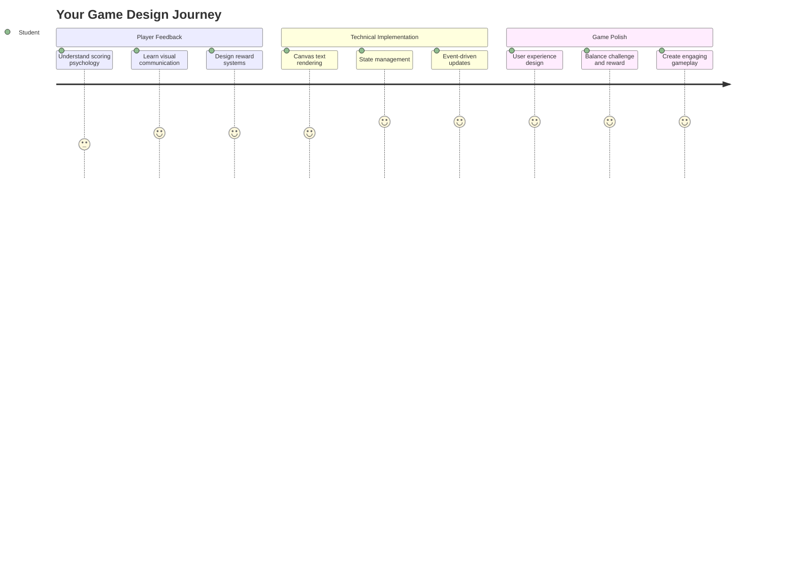
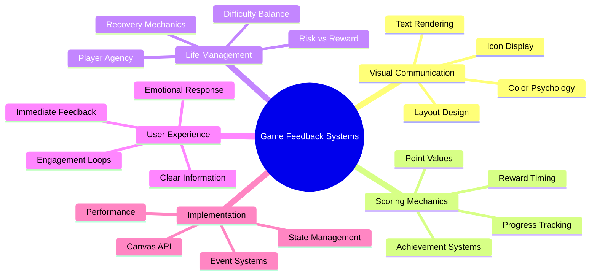
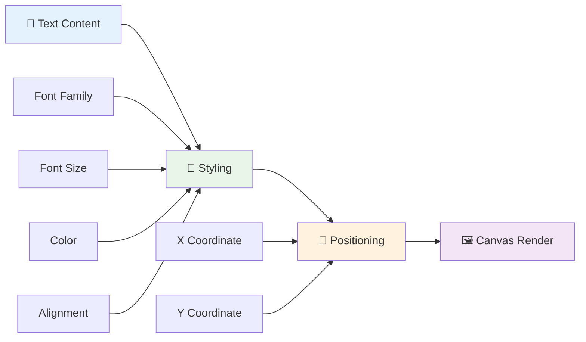
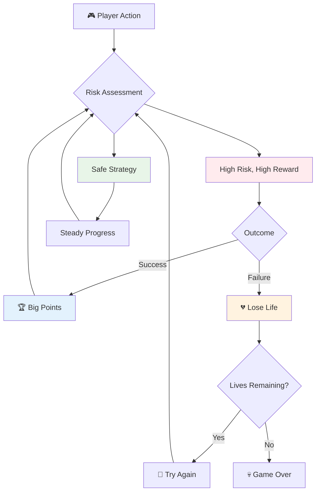
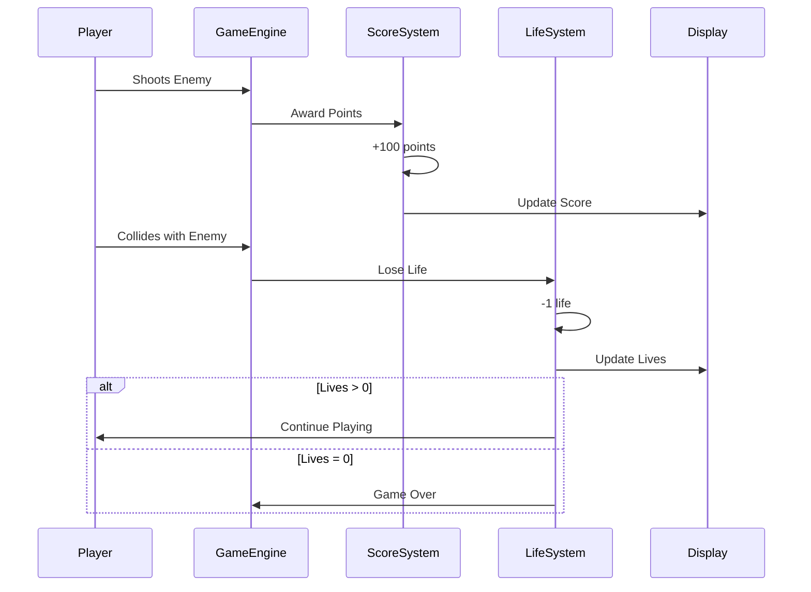
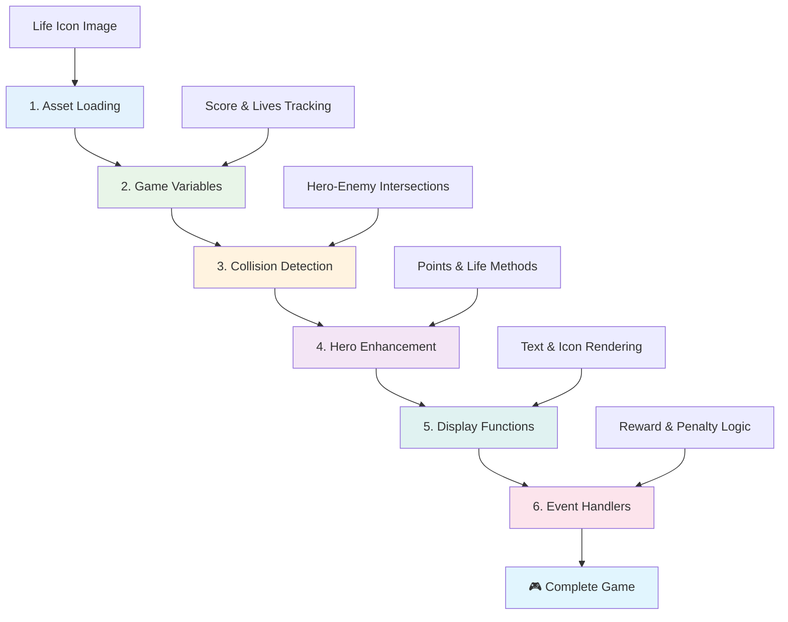

# ਸਪੇਸ ਗੇਮ ਬਣਾਓ ਭਾਗ 5: ਸਕੋਰਿੰਗ ਅਤੇ ਜ਼ਿੰਦਗੀਆਂ



## ਪ੍ਰੀ-ਲੈਕਚਰ ਕਵਿਜ਼

[ਪ੍ਰੀ-ਲੈਕਚਰ ਕਵਿਜ਼](https://ff-quizzes.netlify.app/web/quiz/37)

ਤਿਆਰ ਹੋ ਜਾਓ ਆਪਣੀ ਸਪੇਸ ਗੇਮ ਨੂੰ ਇੱਕ ਅਸਲ ਗੇਮ ਵਾਂਗ ਮਹਿਸੂਸ ਕਰਨ ਲਈ? ਚਲੋ ਸਕੋਰਿੰਗ ਪੌਇੰਟਸ ਅਤੇ ਜ਼ਿੰਦਗੀਆਂ ਦਾ ਪ੍ਰਬੰਧਨ ਕਰੀਏ - ਉਹ ਮੁੱਖ ਮਕੈਨਿਕਸ ਜਿਨ੍ਹਾਂ ਨੇ ਸ਼ੁਰੂਆਤੀ ਆਰਕੇਡ ਗੇਮਾਂ ਜਿਵੇਂ ਕਿ ਸਪੇਸ ਇਨਵੇਡਰਜ਼ ਨੂੰ ਸਧਾਰਨ ਡੈਮੋਨਸਟਰੇਸ਼ਨ ਤੋਂ ਨਸ਼ੇ ਵਾਲੇ ਮਨੋਰੰਜਨ ਵਿੱਚ ਬਦਲ ਦਿੱਤਾ। ਇਹ ਉਹ ਜਗ੍ਹਾ ਹੈ ਜਿੱਥੇ ਤੁਹਾਡੀ ਗੇਮ ਸੱਚਮੁੱਚ ਖੇਡਣਯੋਗ ਬਣਦੀ ਹੈ।



## ਸਕ੍ਰੀਨ 'ਤੇ ਟੈਕਸਟ ਡਰਾਇੰਗ - ਤੁਹਾਡੀ ਗੇਮ ਦੀ ਆਵਾਜ਼

ਤੁਹਾਡਾ ਸਕੋਰ ਦਿਖਾਉਣ ਲਈ, ਸਾਨੂੰ ਕੈਨਵਾਸ 'ਤੇ ਟੈਕਸਟ ਰੈਂਡਰ ਕਰਨ ਦਾ ਤਰੀਕਾ ਸਿੱਖਣ ਦੀ ਲੋੜ ਹੈ। `fillText()` ਮੈਥਡ ਤੁਹਾਡਾ ਮੁੱਖ ਸਾਧਨ ਹੈ - ਇਹ ਉਹੀ ਤਕਨੀਕ ਹੈ ਜੋ ਕਲਾਸਿਕ ਆਰਕੇਡ ਗੇਮਾਂ ਵਿੱਚ ਸਕੋਰ ਅਤੇ ਸਥਿਤੀ ਦੀ ਜਾਣਕਾਰੀ ਦਿਖਾਉਣ ਲਈ ਵਰਤੀ ਜਾਂਦੀ ਸੀ।



ਤੁਹਾਨੂੰ ਟੈਕਸਟ ਦੀ ਸ਼ਕਲ 'ਤੇ ਪੂਰਾ ਕੰਟਰੋਲ ਹੈ:

```javascript
ctx.font = "30px Arial";
ctx.fillStyle = "red";
ctx.textAlign = "right";
ctx.fillText("show this on the screen", 0, 0);
```

✅ [ਕੈਨਵਾਸ 'ਤੇ ਟੈਕਸਟ ਸ਼ਾਮਲ ਕਰਨ](https://developer.mozilla.org/docs/Web/API/Canvas_API/Tutorial/Drawing_text) ਬਾਰੇ ਹੋਰ ਜਾਣਕਾਰੀ ਲਈ ਡੁੱਬੋ - ਤੁਸੀਂ ਫੋਂਟਸ ਅਤੇ ਸਟਾਈਲਿੰਗ ਨਾਲ ਕਿੰਨਾ ਕ੍ਰੀਏਟਿਵ ਹੋ ਸਕਦੇ ਹੋ ਇਸ 'ਤੇ ਹੈਰਾਨ ਹੋ ਸਕਦੇ ਹੋ!

## ਜ਼ਿੰਦਗੀਆਂ - ਸਿਰਫ਼ ਇੱਕ ਗਿਣਤੀ ਤੋਂ ਵੱਧ

ਗੇਮ ਡਿਜ਼ਾਈਨ ਵਿੱਚ, "ਜ਼ਿੰਦਗੀ" ਖਿਡਾਰੀ ਦੀ ਗਲਤੀ ਦੀ ਮਾਰਜਿਨ ਨੂੰ ਦਰਸਾਉਂਦੀ ਹੈ। ਇਹ ਧਾਰਨਾ ਪਿਨਬਾਲ ਮਸ਼ੀਨਾਂ ਤੋਂ ਆਉਂਦੀ ਹੈ, ਜਿੱਥੇ ਤੁਹਾਨੂੰ ਖੇਡਣ ਲਈ ਕਈ ਗੇਂਦਾਂ ਮਿਲਦੀਆਂ ਸਨ। ਸ਼ੁਰੂਆਤੀ ਵੀਡੀਓ ਗੇਮਾਂ ਜਿਵੇਂ ਕਿ ਐਸਟਰੋਇਡਜ਼ ਵਿੱਚ, ਜ਼ਿੰਦਗੀਆਂ ਨੇ ਖਿਡਾਰੀਆਂ ਨੂੰ ਜੋਖਮ ਲੈਣ ਅਤੇ ਗਲਤੀਆਂ ਤੋਂ ਸਿੱਖਣ ਦੀ ਇਜਾਜ਼ਤ ਦਿੱਤੀ।



ਦ੍ਰਿਸ਼ਮਾਨ ਪ੍ਰਤੀਨਿਧਤਾ ਬਹੁਤ ਮਹੱਤਵਪੂਰਨ ਹੈ - "Lives: 3" ਦੇ ਸਿਰਫ਼ ਦਿਖਾਉਣ ਦੀ ਬਜਾਏ ਜਹਾਜ਼ ਦੇ ਆਈਕਾਨ ਦਿਖਾਉਣਾ ਤੁਰੰਤ ਦ੍ਰਿਸ਼ਮਾਨ ਪਛਾਣ ਬਣਾਉਂਦਾ ਹੈ, ਜਿਵੇਂ ਕਿ ਸ਼ੁਰੂਆਤੀ ਆਰਕੇਡ ਕੈਬਿਨਟਸ ਨੇ ਭਾਸ਼ਾ ਦੀਆਂ ਰੁਕਾਵਟਾਂ ਨੂੰ ਪਾਰ ਕਰਨ ਲਈ ਆਈਕੋਗ੍ਰਾਫੀ ਵਰਤੀ।

## ਤੁਹਾਡੀ ਗੇਮ ਦਾ ਰਿਵਾਰਡ ਸਿਸਟਮ ਬਣਾਉਣਾ

ਹੁਣ ਅਸੀਂ ਮੁੱਖ ਫੀਡਬੈਕ ਸਿਸਟਮ ਲਾਗੂ ਕਰਾਂਗੇ ਜੋ ਖਿਡਾਰੀਆਂ ਨੂੰ ਜੁੜੇ ਰੱਖਦੇ ਹਨ:



- **ਸਕੋਰਿੰਗ ਸਿਸਟਮ**: ਹਰ ਤਬਾਹ ਕੀਤੇ ਗਏ ਦੁਸ਼ਮਨ ਜਹਾਜ਼ ਲਈ 100 ਪੌਇੰਟਸ ਮਿਲਦੇ ਹਨ (ਗੋਲ ਗਿਣਤੀਆਂ ਖਿਡਾਰੀਆਂ ਲਈ ਮਾਨਸਿਕ ਤੌਰ 'ਤੇ ਗਿਣਤੀ ਕਰਨਾ ਆਸਾਨ ਬਣਾਉਂਦੀਆਂ ਹਨ)। ਸਕੋਰ ਨੂੰ ਹੇਠਾਂ ਖੱਬੇ ਕੋਨੇ ਵਿੱਚ ਦਿਖਾਇਆ ਜਾਵੇਗਾ।
- **ਲਾਈਫ ਕਾਊਂਟਰ**: ਤੁਹਾਡਾ ਹੀਰੋ ਤਿੰਨ ਜ਼ਿੰਦਗੀਆਂ ਨਾਲ ਸ਼ੁਰੂ ਕਰਦਾ ਹੈ - ਇੱਕ ਮਿਆਰ ਜੋ ਸ਼ੁਰੂਆਤੀ ਆਰਕੇਡ ਗੇਮਾਂ ਦੁਆਰਾ ਚੁਣੌਤੀ ਅਤੇ ਖੇਡਣਯੋਗਤਾ ਦੇ ਸੰਤੁਲਨ ਲਈ ਸਥਾਪਿਤ ਕੀਤਾ ਗਿਆ। ਹਰ ਵਾਰ ਦੁਸ਼ਮਨ ਨਾਲ ਟਕਰਾਉਣ 'ਤੇ ਇੱਕ ਜ਼ਿੰਦਗੀ ਖਤਮ ਹੋ ਜਾਂਦੀ ਹੈ। ਬਾਕੀ ਜ਼ਿੰਦਗੀਆਂ ਨੂੰ ਹੇਠਾਂ ਸੱਜੇ ਕੋਨੇ ਵਿੱਚ ਜਹਾਜ਼ ਦੇ ਆਈਕਾਨਾਂ ਨਾਲ ਦਿਖਾਇਆ ਜਾਵੇਗਾ ।

## ਚਲੋ ਬਣਾਉਣਾ ਸ਼ੁਰੂ ਕਰੀਏ!

ਸਭ ਤੋਂ ਪਹਿਲਾਂ, ਆਪਣਾ ਵਰਕਸਪੇਸ ਸੈਟ ਕਰੋ। ਆਪਣੀ `your-work` ਸਬ ਫੋਲਡਰ ਵਿੱਚ ਫਾਈਲਾਂ ਨੂੰ ਖੋਲ੍ਹੋ। ਤੁਹਾਨੂੰ ਇਹ ਫਾਈਲਾਂ ਦਿਖਾਈ ਦੇਣੀਆਂ ਚਾਹੀਦੀਆਂ ਹਨ:

```bash
-| assets
  -| enemyShip.png
  -| player.png
  -| laserRed.png
-| index.html
-| app.js
-| package.json
```

ਤੁਹਾਡੀ ਗੇਮ ਦੀ ਜਾਂਚ ਕਰਨ ਲਈ, `your_work` ਫੋਲਡਰ ਤੋਂ ਡਿਵੈਲਪਮੈਂਟ ਸਰਵਰ ਸ਼ੁਰੂ ਕਰੋ:

```bash
cd your-work
npm start
```

ਇਹ ਇੱਕ ਲੋਕਲ ਸਰਵਰ ਨੂੰ `http://localhost:5000` 'ਤੇ ਚਲਾਉਂਦਾ ਹੈ। ਆਪਣੀ ਬ੍ਰਾਊਜ਼ਰ ਵਿੱਚ ਇਸ ਪਤੇ ਨੂੰ ਖੋਲ੍ਹੋ ਅਤੇ ਆਪਣੀ ਗੇਮ ਦੇਖੋ। ਐਰੋ ਕੀਜ਼ ਨਾਲ ਕੰਟਰੋਲ ਦੀ ਜਾਂਚ ਕਰੋ ਅਤੇ ਸਭ ਕੁਝ ਸਹੀ ਕੰਮ ਕਰ ਰਿਹਾ ਹੈ ਜਾਂ ਨਹੀਂ ਇਹ ਵੇਖਣ ਲਈ ਦੁਸ਼ਮਨਾਂ ਨੂੰ ਗੋਲੀ ਮਾਰਣ ਦੀ ਕੋਸ਼ਿਸ਼ ਕਰੋ।



### ਕੋਡ ਕਰਨ ਦਾ ਸਮਾਂ!

1. **ਦ੍ਰਿਸ਼ਮਾਨ ਐਸੈਟਸ ਨੂੰ ਲਓ**। `solution/assets/` ਫੋਲਡਰ ਤੋਂ `life.png` ਐਸੈਟ ਨੂੰ ਕਾਪੀ ਕਰੋ ਅਤੇ ਇਸਨੂੰ ਆਪਣੇ `your-work` ਫੋਲਡਰ ਵਿੱਚ ਪਾਓ। ਫਿਰ `lifeImg` ਨੂੰ ਆਪਣੇ window.onload ਫੰਕਸ਼ਨ ਵਿੱਚ ਸ਼ਾਮਲ ਕਰੋ:

    ```javascript
    lifeImg = await loadTexture("assets/life.png");
    ```

1. `lifeImg` ਨੂੰ ਆਪਣੇ ਐਸੈਟਸ ਲਿਸਟ ਵਿੱਚ ਸ਼ਾਮਲ ਕਰਨਾ ਨਾ ਭੁੱਲੋ:

    ```javascript
    let heroImg,
    ...
    lifeImg,
    ...
    eventEmitter = new EventEmitter();
    ```
  
2. **ਆਪਣੀਆਂ ਗੇਮ ਵੈਰੀਏਬਲਸ ਸੈਟ ਕਰੋ**। ਆਪਣਾ ਕੁੱਲ ਸਕੋਰ (0 ਤੋਂ ਸ਼ੁਰੂ ਕਰਦੇ ਹੋਏ) ਅਤੇ ਬਾਕੀ ਜ਼ਿੰਦਗੀਆਂ (3 ਤੋਂ ਸ਼ੁਰੂ ਕਰਦੇ ਹੋਏ) ਟ੍ਰੈਕ ਕਰਨ ਲਈ ਕੁਝ ਕੋਡ ਸ਼ਾਮਲ ਕਰੋ। ਅਸੀਂ ਇਹਨਾਂ ਨੂੰ ਸਕ੍ਰੀਨ 'ਤੇ ਦਿਖਾਵਾਂਗੇ ਤਾਂ ਜੋ ਖਿਡਾਰੀ ਹਮੇਸ਼ਾ ਜਾਣ ਸਕਣ ਕਿ ਉਹ ਕਿੱਥੇ ਖੜੇ ਹਨ।

3. **ਕੋਲਿਜ਼ਨ ਡਿਟੈਕਸ਼ਨ ਲਾਗੂ ਕਰੋ**। ਆਪਣੇ `updateGameObjects()` ਫੰਕਸ਼ਨ ਨੂੰ ਵਧਾਓ ਤਾਂ ਜੋ ਇਹ ਪਤਾ ਲਗਾ ਸਕੇ ਕਿ ਦੁਸ਼ਮਨ ਤੁਹਾਡੇ ਹੀਰੋ ਨਾਲ ਟਕਰਾਉਂਦੇ ਹਨ:

    ```javascript
    enemies.forEach(enemy => {
        const heroRect = hero.rectFromGameObject();
        if (intersectRect(heroRect, enemy.rectFromGameObject())) {
          eventEmitter.emit(Messages.COLLISION_ENEMY_HERO, { enemy });
        }
      })
    ```

4. **ਆਪਣੇ ਹੀਰੋ ਵਿੱਚ ਜ਼ਿੰਦਗੀ ਅਤੇ ਪੌਇੰਟ ਟ੍ਰੈਕਿੰਗ ਸ਼ਾਮਲ ਕਰੋ**। 
   1. **ਕਾਊਂਟਰਸ ਸ਼ੁਰੂ ਕਰੋ**। `this.cooldown = 0` ਦੇ ਹੇਠਾਂ ਆਪਣੇ `Hero` ਕਲਾਸ ਵਿੱਚ ਜ਼ਿੰਦਗੀ ਅਤੇ ਪੌਇੰਟਸ ਸੈਟ ਕਰੋ:

        ```javascript
        this.life = 3;
        this.points = 0;
        ```

   1. **ਇਹ ਮੁੱਲ ਖਿਡਾਰੀ ਨੂੰ ਦਿਖਾਓ**। ਸਕ੍ਰੀਨ 'ਤੇ ਇਹ ਮੁੱਲ ਡਰਾਇੰਗ ਕਰਨ ਲਈ ਫੰਕਸ਼ਨ ਬਣਾਓ:

        ```javascript
        function drawLife() {
          // TODO, 35, 27
          const START_POS = canvas.width - 180;
          for(let i=0; i < hero.life; i++ ) {
            ctx.drawImage(
              lifeImg, 
              START_POS + (45 * (i+1) ), 
              canvas.height - 37);
          }
        }
        
        function drawPoints() {
          ctx.font = "30px Arial";
          ctx.fillStyle = "red";
          ctx.textAlign = "left";
          drawText("Points: " + hero.points, 10, canvas.height-20);
        }
        
        function drawText(message, x, y) {
          ctx.fillText(message, x, y);
        }

        ```

   1. **ਇਹਨਾਂ ਨੂੰ ਆਪਣੇ ਗੇਮ ਲੂਪ ਵਿੱਚ ਜੋੜੋ**। `updateGameObjects()` ਦੇ ਬਾਅਦ ਆਪਣੇ window.onload ਫੰਕਸ਼ਨ ਵਿੱਚ ਇਹ ਫੰਕਸ਼ਨ ਸ਼ਾਮਲ ਕਰੋ:

        ```javascript
        drawPoints();
        drawLife();
        ```

### 🔄 **ਪੈਡਾਗੌਜੀਕਲ ਚੈੱਕ-ਇਨ**
**ਗੇਮ ਡਿਜ਼ਾਈਨ ਸਮਝ**: ਨਤੀਜਿਆਂ ਨੂੰ ਲਾਗੂ ਕਰਨ ਤੋਂ ਪਹਿਲਾਂ, ਇਹ ਯਕੀਨੀ ਬਣਾਓ ਕਿ ਤੁਸੀਂ ਸਮਝਦੇ ਹੋ:
- ✅ ਦ੍ਰਿਸ਼ਮਾਨ ਫੀਡਬੈਕ ਖਿਡਾਰੀਆਂ ਨੂੰ ਗੇਮ ਸਥਿਤੀ ਕਿਵੇਂ ਦਿਖਾਉਂਦਾ ਹੈ
- ✅ UI ਐਲਿਮੈਂਟਸ ਦੀ ਸਥਿਰ ਪਲੇਸਮੈਂਟ usability ਨੂੰ ਕਿਵੇਂ ਸੁਧਾਰਦੀ ਹੈ
- ✅ ਪੌਇੰਟ ਮੁੱਲ ਅਤੇ ਜ਼ਿੰਦਗੀ ਪ੍ਰਬੰਧਨ ਦੇ ਪਿੱਛੇ ਮਨੋਵਿਗਿਆਨ
- ✅ ਕੈਨਵਾਸ ਟੈਕਸਟ ਰੈਂਡਰਿੰਗ HTML ਟੈਕਸਟ ਤੋਂ ਕਿਵੇਂ ਵੱਖਰੀ ਹੈ

**ਤੁਰੰਤ ਸਵੈ-ਪਰੀਖਣ**: ਆਰਕੇਡ ਗੇਮਾਂ ਆਮ ਤੌਰ 'ਤੇ ਪੌਇੰਟ ਮੁੱਲਾਂ ਲਈ ਗੋਲ ਗਿਣਤੀਆਂ ਕਿਉਂ ਵਰਤਦੀਆਂ ਹਨ?
*ਜਵਾਬ: ਗੋਲ ਗਿਣਤੀਆਂ ਖਿਡਾਰੀਆਂ ਲਈ ਮਾਨਸਿਕ ਤੌਰ 'ਤੇ ਗਿਣਤੀ ਕਰਨਾ ਆਸਾਨ ਬਣਾਉਂਦੀਆਂ ਹਨ ਅਤੇ ਸੰਤੋਸ਼ਜਨਕ ਮਨੋਵਿਗਿਆਨਕ ਰਿਵਾਰਡ ਬਣਾਉਂਦੀਆਂ ਹਨ*

**ਯੂਜ਼ਰ ਐਕਸਪੀਰੀਅੰਸ ਪ੍ਰਿੰਸਿਪਲਸ**: ਤੁਸੀਂ ਹੁਣ ਲਾਗੂ ਕਰ ਰਹੇ ਹੋ:
- **ਦ੍ਰਿਸ਼ਮਾਨ ਹਾਇਰਾਰਕੀ**: ਮਹੱਤਵਪੂਰਨ ਜਾਣਕਾਰੀ ਨੂੰ ਪ੍ਰਮੁੱਖ ਸਥਿਤੀ ਵਿੱਚ ਰੱਖਣਾ
- **ਤੁਰੰਤ ਫੀਡਬੈਕ**: ਖਿਡਾਰੀ ਦੀਆਂ ਕਾਰਵਾਈਆਂ ਲਈ ਰੀਅਲ-ਟਾਈਮ ਅੱਪਡੇਟਸ
- **ਕੌਗਨਿਟਿਵ ਲੋਡ**: ਸਧਾਰਨ, ਸਪਸ਼ਟ ਜਾਣਕਾਰੀ ਪ੍ਰਸਤੁਤੀ
- **ਇਮੋਸ਼ਨਲ ਡਿਜ਼ਾਈਨ**: ਆਈਕਾਨ ਅਤੇ ਰੰਗ ਜੋ ਖਿਡਾਰੀ ਨਾਲ ਜੁੜਾਅ ਬਣਾਉਂਦੇ ਹਨ

1. **ਗੇਮ ਨਤੀਜੇ ਅਤੇ ਰਿਵਾਰਡ ਲਾਗੂ ਕਰੋ**। ਹੁਣ ਅਸੀਂ ਫੀਡਬੈਕ ਸਿਸਟਮ ਸ਼ਾਮਲ ਕਰਾਂਗੇ ਜੋ ਖਿਡਾਰੀ ਦੀਆਂ ਕਾਰਵਾਈਆਂ ਨੂੰ ਮਾਇਨੇਦਾਰ ਬਣਾਉਂਦੇ ਹਨ:

   1. **ਕੋਲਿਜ਼ਨ ਜ਼ਿੰਦਗੀ ਦੀ ਕੀਮਤ ਹੈ**। ਹਰ ਵਾਰ ਤੁਹਾਡਾ ਹੀਰੋ ਦੁਸ਼ਮਨ ਨਾਲ ਟਕਰਾਉਂਦਾ ਹੈ, ਤੁਹਾਨੂੰ ਇੱਕ ਜ਼ਿੰਦਗੀ ਗੁਆਉਣੀ ਚਾਹੀਦੀ ਹੈ।
   
      ਇਹ ਮੈਥਡ ਆਪਣੇ `Hero` ਕਲਾਸ ਵਿੱਚ ਸ਼ਾਮਲ ਕਰੋ:

        ```javascript
        decrementLife() {
          this.life--;
          if (this.life === 0) {
            this.dead = true;
          }
        }
        ```

   2. **ਦੁਸ਼ਮਨ ਨੂੰ ਗੋਲੀ ਮਾਰਨਾ ਪੌਇੰਟਸ ਕਮਾਉਂਦਾ ਹੈ**। ਹਰ ਸਫਲ ਹਿੱਟ 100 ਪੌਇੰਟਸ ਦਿੰਦਾ ਹੈ, ਸਹੀ ਗੋਲੀ ਮਾਰਨ ਲਈ ਤੁਰੰਤ ਸਕਾਰਾਤਮਕ ਫੀਡਬੈਕ ਪ੍ਰਦਾਨ ਕਰਦਾ ਹੈ।

      ਆਪਣੇ Hero ਕਲਾਸ ਵਿੱਚ ਇਸ ਇੰਕ੍ਰੀਮੈਂਟ ਮੈਥਡ ਨੂੰ ਵਧਾਓ:
    
        ```javascript
          incrementPoints() {
            this.points += 100;
          }
        ```

        ਹੁਣ ਇਹਨਾਂ ਫੰਕਸ਼ਨਸ ਨੂੰ ਆਪਣੇ ਕੋਲਿਜ਼ਨ ਇਵੈਂਟਸ ਨਾਲ ਜੋੜੋ:

        ```javascript
        eventEmitter.on(Messages.COLLISION_ENEMY_LASER, (_, { first, second }) => {
           first.dead = true;
           second.dead = true;
           hero.incrementPoints();
        })

        eventEmitter.on(Messages.COLLISION_ENEMY_HERO, (_, { enemy }) => {
           enemy.dead = true;
           hero.decrementLife();
        });
        ```

✅ ਜਾਵਾਸਕ੍ਰਿਪਟ ਅਤੇ ਕੈਨਵਾਸ ਨਾਲ ਬਣਾਈਆਂ ਹੋਰ ਗੇਮਾਂ ਬਾਰੇ ਜਾਣਨ ਲਈ ਕੁਝ ਖੋਜ ਕਰੋ - ਤੁਸੀਂ ਹੈਰਾਨ ਹੋ ਸਕਦੇ ਹੋ ਕਿ ਕੀ ਸੰਭਵ ਹੈ!

ਇਹ ਫੀਚਰਸ ਲਾਗੂ ਕਰਨ ਤੋਂ ਬਾਅਦ, ਆਪਣੀ ਗੇਮ ਦੀ ਜਾਂਚ ਕਰੋ ਤਾਂ ਜੋ ਪੂਰਾ ਫੀਡਬੈਕ ਸਿਸਟਮ ਕਾਰਵਾਈ ਵਿੱਚ ਵੇਖਿਆ ਜਾ ਸਕੇ। ਤੁਹਾਨੂੰ ਹੇਠਾਂ ਸੱਜੇ ਕੋਨੇ ਵਿੱਚ ਜ਼ਿੰਦਗੀ ਦੇ ਆਈਕਾਨ, ਹੇਠਾਂ ਖੱਬੇ ਵਿੱਚ ਆਪਣਾ ਸਕੋਰ ਦਿਖਾਈ ਦੇਣਾ ਚਾਹੀਦਾ ਹੈ, ਅਤੇ ਵੇਖੋ ਕਿ ਟਕਰਾਉਣ ਨਾਲ ਜ਼ਿੰਦਗੀਆਂ ਘਟਦੀਆਂ ਹਨ ਜਦੋਂ ਕਿ ਸਫਲ ਸ਼ਾਟਸ ਨਾਲ ਤੁਹਾਡਾ ਸਕੋਰ ਵਧਦਾ ਹੈ।

ਤੁਹਾਡੀ ਗੇਮ ਵਿੱਚ ਹੁਣ ਉਹ ਮੁੱਖ ਮਕੈਨਿਕਸ ਹਨ ਜਿਨ੍ਹਾਂ ਨੇ ਸ਼ੁਰੂਆਤੀ ਆਰਕੇਡ ਗੇਮਾਂ ਨੂੰ ਬਹੁਤ ਆਕਰਸ਼ਕ ਬਣਾਇਆ - ਸਪਸ਼ਟ ਲਕਸ਼, ਤੁਰੰਤ ਫੀਡਬੈਕ, ਅਤੇ ਖਿਡਾਰੀ ਦੀਆਂ ਕਾਰਵਾਈਆਂ ਲਈ ਮਾਇਨੇਦਾਰ ਨਤੀਜੇ।

### 🔄 **ਪੈਡਾਗੌਜੀਕਲ ਚੈੱਕ-ਇਨ**
**ਪੂਰਾ ਗੇਮ ਡਿਜ਼ਾਈਨ ਸਿਸਟਮ**: ਖਿਡਾਰੀ ਫੀਡਬੈਕ ਸਿਸਟਮਾਂ ਦੀ ਆਪਣੀ ਮਾਹਰਤਾ ਦੀ ਪੁਸ਼ਟੀ ਕਰੋ:
- ✅ ਸਕੋਰਿੰਗ ਮਕੈਨਿਕਸ ਖਿਡਾਰੀ ਦੀ ਪ੍ਰੇਰਨਾ ਅਤੇ ਜੁੜਾਅ ਕਿਵੇਂ ਬਣਾਉਂਦੇ ਹਨ?
- ✅ ਯੂਜ਼ਰ ਇੰਟਰਫੇਸ ਡਿਜ਼ਾਈਨ ਲਈ ਦ੍ਰਿਸ਼ਮਾਨ ਸਥਿਰਤਾ ਕਿਉਂ ਮਹੱਤਵਪੂਰਨ ਹੈ?
- ✅ ਜ਼ਿੰਦਗੀ ਸਿਸਟਮ ਚੁਣੌਤੀ ਅਤੇ ਖਿਡਾਰੀ ਰਿਟੇਨਸ਼ਨ ਦਾ ਸੰਤੁਲਨ ਕਿਵੇਂ ਬਣਾਉਂਦਾ ਹੈ?
- ✅ ਤੁਰੰਤ ਫੀਡਬੈਕ ਸੰਤੋਸ਼ਜਨਕ ਗੇਮਪਲੇ ਬਣਾਉਣ ਵਿੱਚ ਕਿਵੇਂ ਭੂਮਿਕਾ ਨਿਭਾਉਂਦਾ ਹੈ?

**ਸਿਸਟਮ ਇੰਟੀਗ੍ਰੇਸ਼ਨ**: ਤੁਹਾਡਾ ਫੀਡਬੈਕ ਸਿਸਟਮ ਦਰਸਾਉਂਦਾ ਹੈ:
- **ਯੂਜ਼ਰ ਐਕਸਪੀਰੀਅੰਸ ਡਿਜ਼ਾਈਨ**: ਸਪਸ਼ਟ ਦ੍ਰਿਸ਼ਮਾਨ ਸੰਚਾਰ ਅਤੇ ਜਾਣਕਾਰੀ ਹਾਇਰਾਰਕੀ
- **ਇਵੈਂਟ-ਡ੍ਰਿਵਨ ਆਰਕੀਟੈਕਚਰ**: ਖਿਡਾਰੀ ਦੀਆਂ ਕਾਰਵਾਈਆਂ ਲਈ ਜਵਾਬੀ ਅੱਪਡੇਟਸ
- **ਸਟੇਟ ਮੈਨੇਜਮੈਂਟ**: ਗੇਮ ਡੇਟਾ ਨੂੰ ਟ੍ਰੈਕ ਕਰਨਾ ਅਤੇ ਦਿਖਾਉਣਾ
- **ਕੈਨਵਾਸ ਮਾਹਰਤਾ**: ਟੈਕਸਟ ਰੈਂਡਰਿੰਗ ਅਤੇ ਸਪ੍ਰਾਈਟ ਪੋਜ਼ੀਸ਼ਨਿੰਗ
- **ਗੇਮ ਮਨੋਵਿਗਿਆਨ**: ਖਿਡਾਰੀ ਦੀ ਪ੍ਰੇਰਨਾ ਅਤੇ ਜੁੜਾਅ ਨੂੰ ਸਮਝਣਾ

**ਪ੍ਰੋਫੈਸ਼ਨਲ ਪੈਟਰਨਸ**: ਤੁਸੀਂ ਲਾਗੂ ਕੀਤਾ ਹੈ:
- **MVC ਆਰਕੀਟੈਕਚਰ**: ਗੇਮ ਲੌਜਿਕ, ਡੇਟਾ, ਅਤੇ ਪ੍ਰਸਤੁਤੀ ਦਾ ਵੱਖਰਾ ਕਰਨਾ
- **ਓਬਜ਼ਰਵਰ ਪੈਟਰਨ**: ਗੇਮ ਸਥਿਤੀ ਬਦਲਾਅ ਲਈ ਇਵੈਂਟ-ਡ੍ਰਿਵਨ ਅੱਪਡੇਟਸ
- **ਕੰਪੋਨੈਂਟ ਡਿਜ਼ਾਈਨ**: ਰੀਯੂਜ਼ੇਬਲ ਫੰਕਸ਼ਨਸ ਰੈਂਡਰਿੰਗ ਅਤੇ ਲੌਜਿਕ ਲਈ
- **ਪਰਫਾਰਮੈਂਸ ਓਪਟੀਮਾਈਜ਼ੇਸ਼ਨ**: ਗੇਮ ਲੂਪਸ ਵਿੱਚ ਕੁਸ਼ਲ ਰੈਂਡਰਿੰਗ

### ⚡ **ਅਗਲੇ 5 ਮਿੰਟਾਂ ਵਿੱਚ ਤੁਸੀਂ ਕੀ ਕਰ ਸਕਦੇ ਹੋ**
- [ ] ਸਕੋਰ ਡਿਸਪਲੇ ਲਈ ਵੱਖ-ਵੱਖ ਫੋਂਟ ਸਾਈਜ਼ ਅਤੇ ਰੰਗਾਂ ਨਾਲ ਪ੍ਰਯੋਗ ਕਰੋ
- [ ] ਪੌਇੰਟ ਮੁੱਲਾਂ ਨੂੰ ਬਦਲਣ ਦੀ ਕੋਸ਼ਿਸ਼ ਕਰੋ ਅਤੇ ਵੇਖੋ ਕਿ ਇਹ ਗੇਮਪਲੇ ਮਹਿਸੂਸ 'ਤੇ ਕਿਵੇਂ ਪ੍ਰਭਾਵ ਪਾਉਂਦਾ ਹੈ
- [ ] ਜਦੋਂ ਪੌਇੰਟਸ ਅਤੇ ਜ਼ਿੰਦਗੀਆਂ ਬਦਲਦੀਆਂ ਹਨ ਤਾਂ ਟਰੈਕ ਕਰਨ ਲਈ console.log ਸਟੇਟਮੈਂਟਸ ਸ਼ਾਮਲ ਕਰੋ
- [ ] ਐਜ ਕੇਸਾਂ ਦੀ ਜਾਂਚ ਕਰੋ ਜਿਵੇਂ ਕਿ ਜ਼ਿੰਦਗੀਆਂ ਖਤਮ ਹੋਣ ਜਾਂ ਉੱਚੇ ਸਕੋਰ ਪ੍ਰਾਪਤ ਕਰਨਾ

### 🎯 **ਇਸ ਘੰਟੇ ਵਿੱਚ ਤੁਸੀਂ ਕੀ ਹਾਸਲ ਕਰ ਸਕਦੇ ਹੋ**
- [ ] ਪੋਸਟ-ਲੈਸਨ ਕਵਿਜ਼ ਪੂਰਾ ਕਰੋ ਅਤੇ ਗੇਮ ਡਿਜ਼ਾਈਨ ਮਨੋਵਿਗਿਆਨ ਨੂੰ ਸਮਝੋ
- [ ] ਸਕੋਰਿੰਗ ਅਤੇ ਜ਼ਿੰਦਗੀ ਗੁਆਉਣ ਲਈ ਸਾਊਂਡ ਇਫੈਕਟਸ ਸ਼ਾਮਲ ਕਰੋ
- [ ] localStorage ਦੀ ਵਰਤੋਂ ਕਰਕੇ ਇੱਕ ਹਾਈ ਸਕੋਰ ਸਿਸਟਮ ਲਾਗੂ ਕਰੋ
- [ ] ਵੱਖ-ਵੱਖ ਦੁਸ਼ਮਨ ਕਿਸਮਾਂ ਲਈ ਵੱਖ-ਵੱਖ ਪੌਇੰਟ ਮੁੱਲ ਸ਼ਾਮਲ ਕਰੋ
- [ ] ਜ਼ਿੰਦਗੀ ਗੁਆਉਣ 'ਤੇ ਸਕ੍ਰੀਨ ਸ਼ੇਕ ਜਿਵੇਂ ਦ੍ਰਿਸ਼ਮਾਨ ਪ੍ਰਭਾਵ ਸ਼ਾਮਲ ਕਰੋ

### 📅 **ਤੁਹਾਡਾ ਹਫ਼ਤੇ-ਲੰਬਾ ਗੇਮ ਡਿਜ਼ਾਈਨ ਯਾਤਰਾ**
- [ ] ਪੂਰੀ ਸਪੇਸ ਗੇਮ ਪੂਰੇ ਫੀਡਬੈਕ ਸਿਸਟਮਾਂ ਨਾਲ ਪੂਰੀ ਕਰੋ
- [ ] ਐਡਵਾਂਸਡ ਸਕੋਰਿੰਗ ਮਕੈਨਿਕਸ ਜਿਵੇਂ ਕਿ ਕੰਬੋ ਮਲਟੀਪਲਾਇਰਜ਼ ਲਾਗੂ ਕਰੋ
- [ ] ਅਚੀਵਮੈਂਟਸ ਅਤੇ ਅਨਲੌਕ ਕਰਨ ਵਾਲੀ ਸਮੱਗਰੀ ਸ਼ਾਮਲ ਕਰੋ
- [ ] ਮੁਸ਼ਕਲਤਾ ਪ੍ਰਗਤੀ ਅਤੇ

---

**ਅਸਵੀਕਰਤਾ**:  
ਇਹ ਦਸਤਾਵੇਜ਼ AI ਅਨੁਵਾਦ ਸੇਵਾ [Co-op Translator](https://github.com/Azure/co-op-translator) ਦੀ ਵਰਤੋਂ ਕਰਕੇ ਅਨੁਵਾਦ ਕੀਤਾ ਗਿਆ ਹੈ। ਜਦੋਂ ਕਿ ਅਸੀਂ ਸਹੀ ਹੋਣ ਦੀ ਕੋਸ਼ਿਸ਼ ਕਰਦੇ ਹਾਂ, ਕਿਰਪਾ ਕਰਕੇ ਧਿਆਨ ਦਿਓ ਕਿ ਸਵੈਚਾਲਿਤ ਅਨੁਵਾਦਾਂ ਵਿੱਚ ਗਲਤੀਆਂ ਜਾਂ ਅਸੁਚੀਤਤਾਵਾਂ ਹੋ ਸਕਦੀਆਂ ਹਨ। ਇਸ ਦੀ ਮੂਲ ਭਾਸ਼ਾ ਵਿੱਚ ਮੂਲ ਦਸਤਾਵੇਜ਼ ਨੂੰ ਅਧਿਕਾਰਤ ਸਰੋਤ ਮੰਨਿਆ ਜਾਣਾ ਚਾਹੀਦਾ ਹੈ। ਮਹੱਤਵਪੂਰਨ ਜਾਣਕਾਰੀ ਲਈ, ਪੇਸ਼ੇਵਰ ਮਨੁੱਖੀ ਅਨੁਵਾਦ ਦੀ ਸਿਫਾਰਸ਼ ਕੀਤੀ ਜਾਂਦੀ ਹੈ। ਇਸ ਅਨੁਵਾਦ ਦੀ ਵਰਤੋਂ ਤੋਂ ਪੈਦਾ ਹੋਣ ਵਾਲੇ ਕਿਸੇ ਵੀ ਗਲਤਫਹਿਮੀ ਜਾਂ ਗਲਤ ਵਿਆਖਿਆ ਲਈ ਅਸੀਂ ਜ਼ਿੰਮੇਵਾਰ ਨਹੀਂ ਹਾਂ।