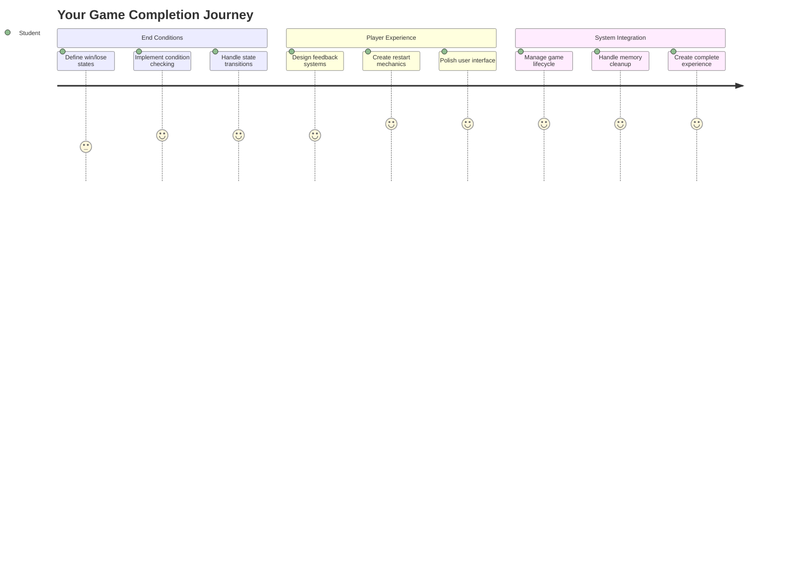
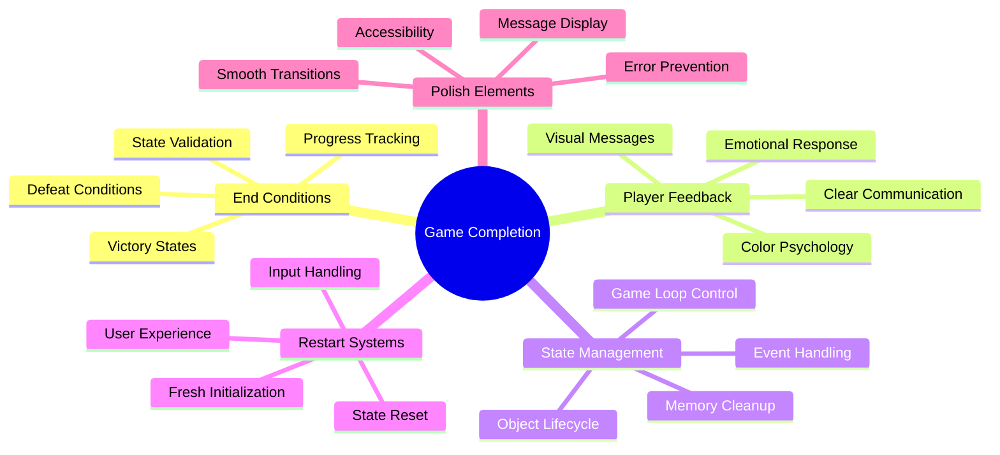
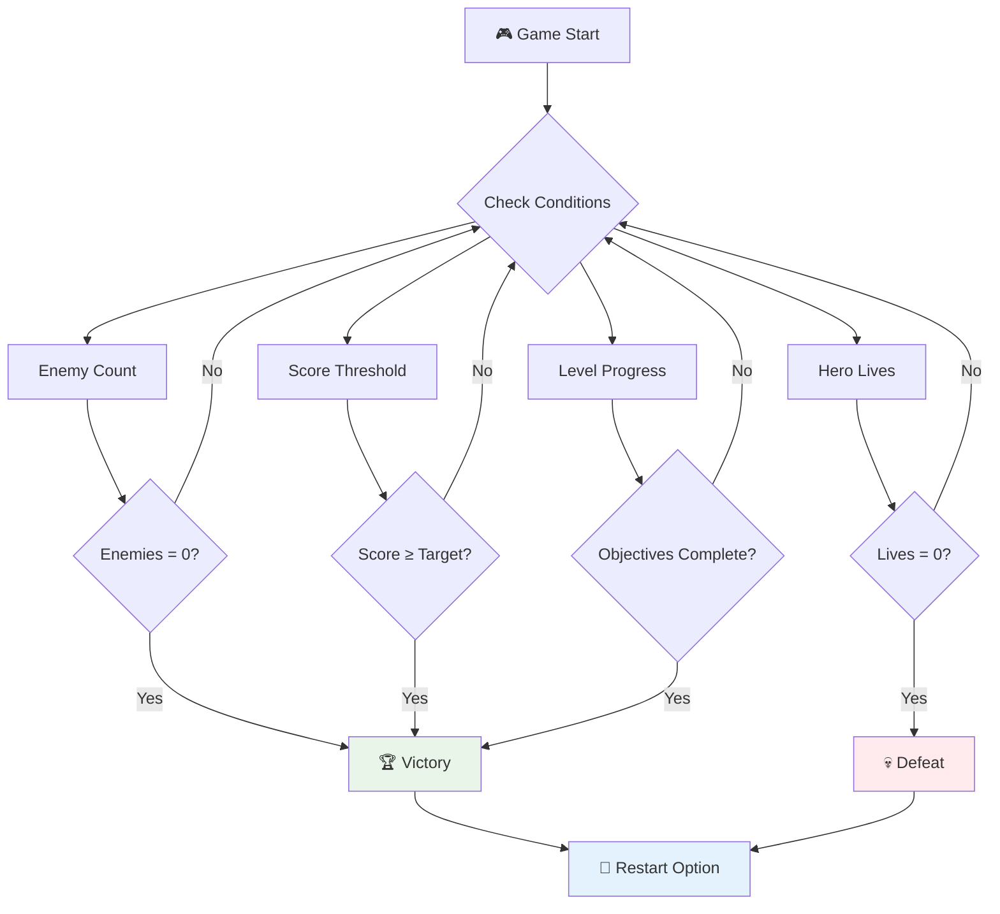
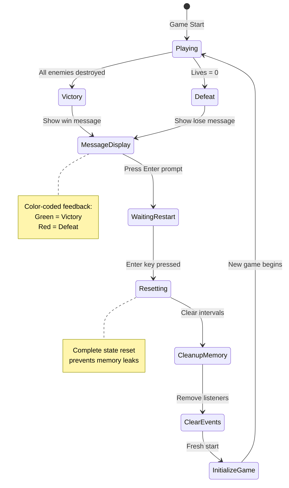
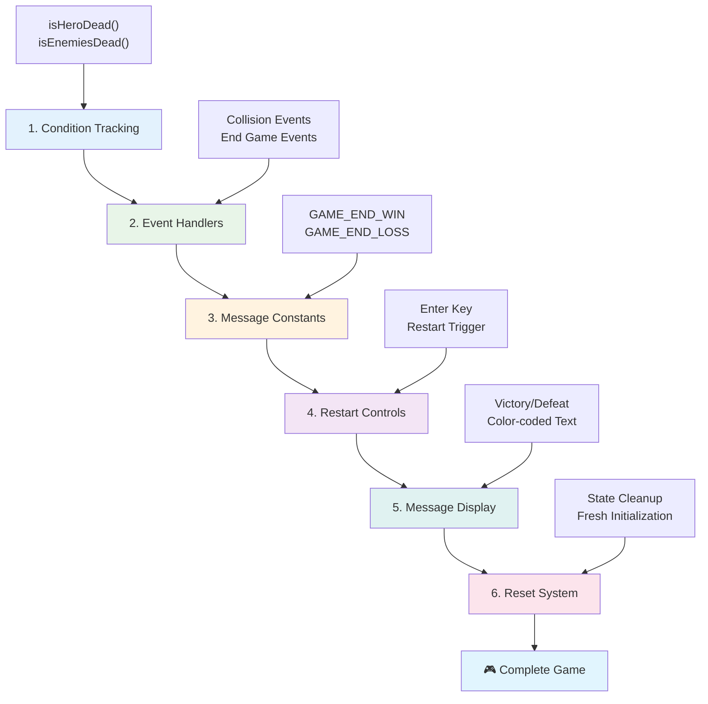
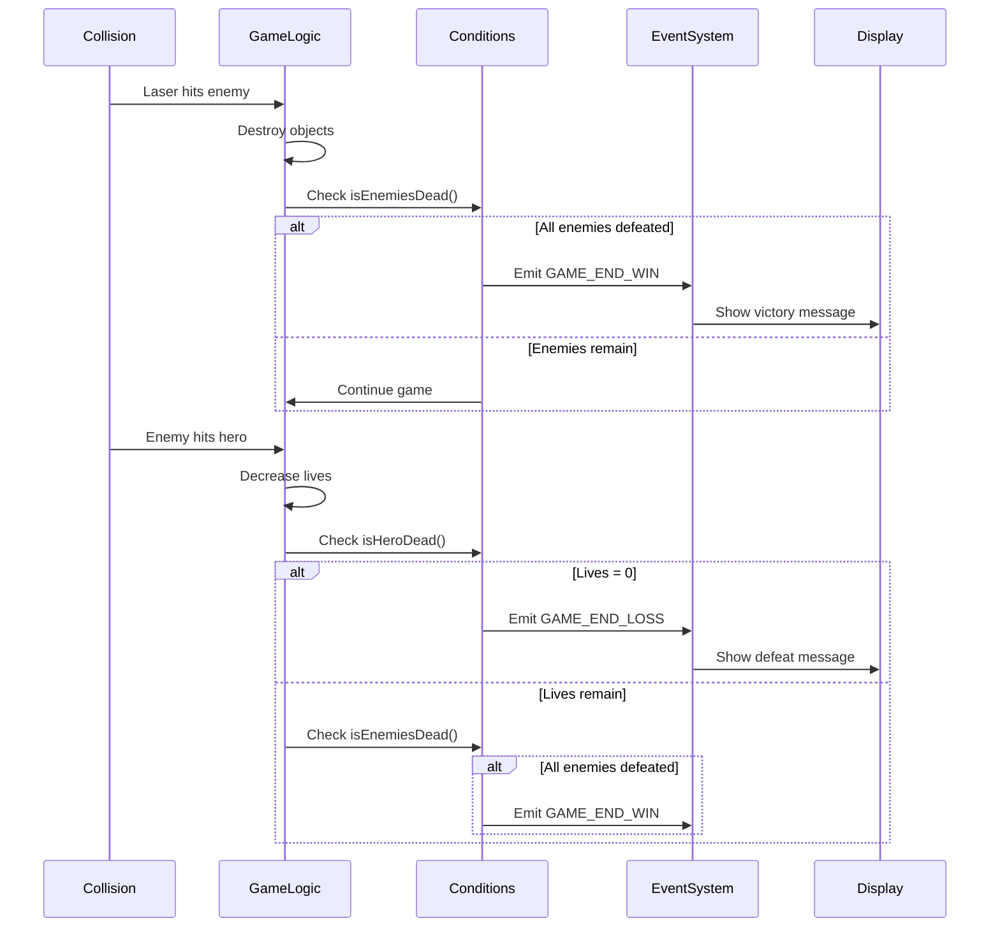
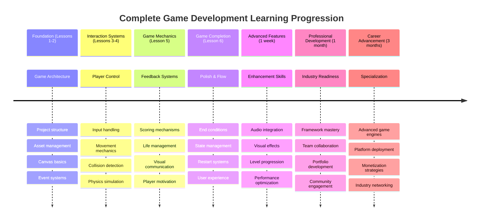

<!--
CO_OP_TRANSLATOR_METADATA:
{
  "original_hash": "a4b78043f4d64bf3ee24e0689b8b391d",
  "translation_date": "2025-11-03T16:53:07+00:00",
  "source_file": "6-space-game/6-end-condition/README.md",
  "language_code": "pa"
}
-->
# ਸਪੇਸ ਗੇਮ ਬਣਾਓ ਭਾਗ 6: ਅੰਤ ਅਤੇ ਦੁਬਾਰਾ ਸ਼ੁਰੂ



ਹਰ ਵਧੀਆ ਗੇਮ ਲਈ ਸਪਸ਼ਟ ਅੰਤ ਦੀਆਂ ਸ਼ਰਤਾਂ ਅਤੇ ਇੱਕ ਸੁਗਮ ਦੁਬਾਰਾ ਸ਼ੁਰੂ ਕਰਨ ਦੀ ਪ੍ਰਣਾਲੀ ਦੀ ਲੋੜ ਹੁੰਦੀ ਹੈ। ਤੁਸੀਂ ਇੱਕ ਸ਼ਾਨਦਾਰ ਸਪੇਸ ਗੇਮ ਬਣਾਈ ਹੈ ਜਿਸ ਵਿੱਚ ਮੂਵਮੈਂਟ, ਲੜਾਈ ਅਤੇ ਸਕੋਰਿੰਗ ਹੈ - ਹੁਣ ਸਮਾਂ ਹੈ ਕਿ ਅੰਤਮ ਹਿੱਸੇ ਜੋੜੇ ਜਾਣ ਜੋ ਇਸਨੂੰ ਪੂਰਾ ਮਹਿਸੂਸ ਕਰਵਾਉਣ।

ਤੁਹਾਡੀ ਗੇਮ ਇਸ ਸਮੇਂ ਬਿਨਾਂ ਰੁਕਾਵਟ ਦੇ ਚੱਲ ਰਹੀ ਹੈ, ਜਿਵੇਂ ਕਿ ਨਾਸਾ ਦੁਆਰਾ 1977 ਵਿੱਚ ਲਾਂਚ ਕੀਤੇ ਗਏ Voyager ਪ੍ਰੋਬਜ਼ - ਅਜੇ ਵੀ ਦਹਾਕਿਆਂ ਬਾਅਦ ਅੰਤਰਿਕਸ਼ ਵਿੱਚ ਯਾਤਰਾ ਕਰ ਰਹੇ ਹਨ। ਜਦੋਂ ਕਿ ਇਹ ਸਪੇਸ ਐਕਸਪਲੋਰੇਸ਼ਨ ਲਈ ਠੀਕ ਹੈ, ਗੇਮਾਂ ਨੂੰ ਸੰਤੋਸ਼ਜਨਕ ਅਨੁਭਵ ਬਣਾਉਣ ਲਈ ਪਰਿਭਾਸ਼ਿਤ ਅੰਤ ਦੀ ਲੋੜ ਹੁੰਦੀ ਹੈ।

ਅੱਜ, ਅਸੀਂ ਸਹੀ ਜਿੱਤ/ਹਾਰ ਦੀਆਂ ਸ਼ਰਤਾਂ ਅਤੇ ਇੱਕ ਦੁਬਾਰਾ ਸ਼ੁਰੂ ਕਰਨ ਦੀ ਪ੍ਰਣਾਲੀ ਲਾਗੂ ਕਰਾਂਗੇ। ਇਸ ਪਾਠ ਦੇ ਅੰਤ ਤੱਕ, ਤੁਹਾਡੇ ਕੋਲ ਇੱਕ ਪਾਲਿਸ਼ ਕੀਤੀ ਗੇਮ ਹੋਵੇਗੀ ਜਿਸਨੂੰ ਖਿਡਾਰੀ ਪੂਰਾ ਕਰ ਸਕਦੇ ਹਨ ਅਤੇ ਦੁਬਾਰਾ ਖੇਡ ਸਕਦੇ ਹਨ, ਬਿਲਕੁਲ ਉਹਨਾਂ ਕਲਾਸਿਕ ਆਰਕੇਡ ਗੇਮਾਂ ਵਾਂਗ ਜੋ ਮੀਡੀਆ ਨੂੰ ਪਰਿਭਾਸ਼ਿਤ ਕਰਦੀਆਂ ਹਨ।



## ਪਾਠ ਤੋਂ ਪਹਿਲਾਂ ਕਵਿਜ਼

[ਪਾਠ ਤੋਂ ਪਹਿਲਾਂ ਕਵਿਜ਼](https://ff-quizzes.netlify.app/web/quiz/39)

## ਗੇਮ ਦੇ ਅੰਤ ਦੀਆਂ ਸ਼ਰਤਾਂ ਨੂੰ ਸਮਝਣਾ

ਤੁਹਾਡੀ ਗੇਮ ਕਦੋਂ ਖਤਮ ਹੋਣੀ ਚਾਹੀਦੀ ਹੈ? ਇਹ ਮੂਲ ਸਵਾਲ ਆਰਕੇਡ ਯੁੱਗ ਤੋਂ ਗੇਮ ਡਿਜ਼ਾਈਨ ਨੂੰ ਆਕਾਰ ਦੇ ਰਿਹਾ ਹੈ। Pac-Man ਉਸ ਸਮੇਂ ਖਤਮ ਹੁੰਦੀ ਹੈ ਜਦੋਂ ਤੁਹਾਨੂੰ ਭੂਤਾਂ ਦੁਆਰਾ ਫੜਿਆ ਜਾਂਦਾ ਹੈ ਜਾਂ ਸਾਰੇ ਡਾਟਸ ਸਾਫ਼ ਕਰ ਦਿੱਤੇ ਜਾਂਦੇ ਹਨ, ਜਦੋਂ ਕਿ Space Invaders ਉਸ ਸਮੇਂ ਖਤਮ ਹੁੰਦੀ ਹੈ ਜਦੋਂ ਐਲੀਅਨ ਹੇਠਾਂ ਪਹੁੰਚ ਜਾਂਦੇ ਹਨ ਜਾਂ ਤੁਸੀਂ ਉਹਨਾਂ ਨੂੰ ਸਾਰੇ ਨਸ਼ਟ ਕਰ ਦਿੰਦੇ ਹੋ।

ਗੇਮ ਬਣਾਉਣ ਵਾਲੇ ਦੇ ਤੌਰ ਤੇ, ਤੁਸੀਂ ਜਿੱਤ ਅਤੇ ਹਾਰ ਦੀਆਂ ਸ਼ਰਤਾਂ ਨੂੰ ਪਰਿਭਾਸ਼ਿਤ ਕਰਦੇ ਹੋ। ਸਾਡੇ ਸਪੇਸ ਗੇਮ ਲਈ, ਇੱਥੇ ਸਾਬਤ ਕੀਤੇ ਗਏ ਤਰੀਕੇ ਹਨ ਜੋ ਰੋਮਾਂਚਕ ਗੇਮਪਲੇ ਬਣਾਉਂਦੇ ਹਨ:



- **`N` ਦੁਸ਼ਮਨ ਜਹਾਜ਼ ਨਸ਼ਟ ਕੀਤੇ ਗਏ ਹਨ**: ਇਹ ਕਾਫ਼ੀ ਆਮ ਹੈ ਜੇ ਤੁਸੀਂ ਗੇਮ ਨੂੰ ਵੱਖ-ਵੱਖ ਲੈਵਲ ਵਿੱਚ ਵੰਡਦੇ ਹੋ ਕਿ ਤੁਸੀਂ ਇੱਕ ਲੈਵਲ ਪੂਰਾ ਕਰਨ ਲਈ `N` ਦੁਸ਼ਮਨ ਜਹਾਜ਼ ਨਸ਼ਟ ਕਰਨ ਦੀ ਲੋੜ ਹੈ।
- **ਤੁਹਾਡਾ ਜਹਾਜ਼ ਨਸ਼ਟ ਹੋ ਗਿਆ ਹੈ**: ਕੁਝ ਗੇਮਾਂ ਵਿੱਚ ਤੁਸੀਂ ਗੇਮ ਹਾਰ ਜਾਂਦੇ ਹੋ ਜੇ ਤੁਹਾਡਾ ਜਹਾਜ਼ ਨਸ਼ਟ ਹੋ ਜਾਂਦਾ ਹੈ। ਇੱਕ ਹੋਰ ਆਮ ਤਰੀਕਾ ਹੈ ਕਿ ਤੁਹਾਡੇ ਕੋਲ ਜ਼ਿੰਦਗੀ ਦਾ ਸੰਕਲਪ ਹੁੰਦਾ ਹੈ। ਹਰ ਵਾਰ ਜਦੋਂ ਤੁਹਾਡਾ ਜਹਾਜ਼ ਨਸ਼ਟ ਹੁੰਦਾ ਹੈ ਤਾਂ ਇਹ ਇੱਕ ਜ਼ਿੰਦਗੀ ਘਟਾਉਂਦਾ ਹੈ। ਜਦੋਂ ਸਾਰੀਆਂ ਜ਼ਿੰਦਗੀਆਂ ਖਤਮ ਹੋ ਜਾਂਦੀਆਂ ਹਨ ਤਾਂ ਤੁਸੀਂ ਗੇਮ ਹਾਰ ਜਾਂਦੇ ਹੋ।
- **ਤੁਹਾਨੂੰ `N` ਪਾਇੰਟ ਮਿਲੇ ਹਨ**: ਇੱਕ ਹੋਰ ਆਮ ਅੰਤ ਦੀ ਸ਼ਰਤ ਤੁਹਾਡੇ ਲਈ ਪਾਇੰਟ ਇਕੱਠੇ ਕਰਨਾ ਹੈ। ਤੁਹਾਨੂੰ ਪਾਇੰਟ ਕਿਵੇਂ ਮਿਲਦੇ ਹਨ ਇਹ ਤੁਹਾਡੇ ਉੱਤੇ ਹੈ ਪਰ ਇਹ ਕਾਫ਼ੀ ਆਮ ਹੈ ਕਿ ਵੱਖ-ਵੱਖ ਗਤੀਵਿਧੀਆਂ ਲਈ ਪਾਇੰਟ ਦਿੱਤੇ ਜਾਂਦੇ ਹਨ ਜਿਵੇਂ ਕਿ ਦੁਸ਼ਮਨ ਜਹਾਜ਼ ਨੂੰ ਨਸ਼ਟ ਕਰਨਾ ਜਾਂ ਸ਼ਾਇਦ ਉਹ ਚੀਜ਼ਾਂ ਇਕੱਠੀਆਂ ਕਰਨਾ ਜੋ ਚੀਜ਼ਾਂ ਨਸ਼ਟ ਹੋਣ ਤੇ ਡਿੱਗਦੀਆਂ ਹਨ।
- **ਇੱਕ ਲੈਵਲ ਪੂਰਾ ਕਰੋ**: ਇਹ ਕਈ ਸ਼ਰਤਾਂ ਸ਼ਾਮਲ ਕਰ ਸਕਦਾ ਹੈ ਜਿਵੇਂ ਕਿ `X` ਦੁਸ਼ਮਨ ਜਹਾਜ਼ ਨਸ਼ਟ ਕੀਤੇ, `Y` ਪਾਇੰਟ ਇਕੱਠੇ ਕੀਤੇ ਜਾਂ ਸ਼ਾਇਦ ਕਿ ਇੱਕ ਵਿਸ਼ੇਸ਼ ਚੀਜ਼ ਇਕੱਠੀ ਕੀਤੀ ਗਈ ਹੈ।

## ਗੇਮ ਦੁਬਾਰਾ ਸ਼ੁਰੂ ਕਰਨ ਦੀ ਪ੍ਰਣਾਲੀ ਲਾਗੂ ਕਰਨਾ

ਵਧੀਆ ਗੇਮਾਂ ਸੁਗਮ ਦੁਬਾਰਾ ਸ਼ੁਰੂ ਕਰਨ ਦੀ ਪ੍ਰਣਾਲੀ ਰਾਹੀਂ ਰੀਪਲੇਅਬਿਲਿਟੀ ਨੂੰ ਉਤਸ਼ਾਹਿਤ ਕਰਦੀਆਂ ਹਨ। ਜਦੋਂ ਖਿਡਾਰੀ ਗੇਮ ਪੂਰੀ ਕਰਦੇ ਹਨ (ਜਾਂ ਹਾਰ ਜਾਂਦੇ ਹਨ), ਉਹ ਅਕਸਰ ਤੁਰੰਤ ਦੁਬਾਰਾ ਕੋਸ਼ਿਸ਼ ਕਰਨਾ ਚਾਹੁੰਦੇ ਹਨ - ਚਾਹੇ ਆਪਣਾ ਸਕੋਰ ਬਹਿਤਰ ਕਰਨ ਲਈ ਜਾਂ ਆਪਣਾ ਪ੍ਰਦਰਸ਼ਨ ਸੁਧਾਰਨ ਲਈ।



Tetris ਇਸਦਾ ਬਹੁਤ ਵਧੀਆ ਉਦਾਹਰਨ ਹੈ: ਜਦੋਂ ਤੁਹਾਡੇ ਬਲਾਕ ਉੱਪਰ ਪਹੁੰਚ ਜਾਂਦੇ ਹਨ, ਤੁਸੀਂ ਤੁਰੰਤ ਇੱਕ ਨਵੀਂ ਗੇਮ ਸ਼ੁਰੂ ਕਰ ਸਕਦੇ ਹੋ ਬਿਨਾਂ ਜਟਿਲ ਮੀਨੂਜ਼ ਵਿੱਚ ਜਾਏ। ਅਸੀਂ ਇੱਕ ਸਮਾਨ ਦੁਬਾਰਾ ਸ਼ੁਰੂ ਕਰਨ ਦੀ ਪ੍ਰਣਾਲੀ ਬਣਾਵਾਂਗੇ ਜੋ ਗੇਮ ਦੀ ਸਥਿਤੀ ਨੂੰ ਸਾਫ਼ ਤਰੀਕੇ ਨਾਲ ਰੀਸੈਟ ਕਰਦੀ ਹੈ ਅਤੇ ਖਿਡਾਰੀਆਂ ਨੂੰ ਜਲਦੀ ਕਾਰਵਾਈ ਵਿੱਚ ਵਾਪਸ ਲੈ ਜਾਂਦੀ ਹੈ।

✅ **ਚਿੰਤਨ**: ਉਹ ਗੇਮਾਂ ਬਾਰੇ ਸੋਚੋ ਜੋ ਤੁਸੀਂ ਖੇਡੀ ਹਨ। ਉਹ ਕਿਹੜੀਆਂ ਸ਼ਰਤਾਂ ਦੇ ਅਧਾਰ ਤੇ ਖਤਮ ਹੁੰਦੀਆਂ ਹਨ, ਅਤੇ ਤੁਹਾਨੂੰ ਕਿਵੇਂ ਦੁਬਾਰਾ ਸ਼ੁਰੂ ਕਰਨ ਲਈ ਪ੍ਰੇਰਿਤ ਕੀਤਾ ਜਾਂਦਾ ਹੈ? ਇੱਕ ਦੁਬਾਰਾ ਸ਼ੁਰੂ ਕਰਨ ਦਾ ਅਨੁਭਵ ਸੁਗਮ ਬਨਾਮ ਨਿਰਾਸ਼ਜਨਕ ਕਿਵੇਂ ਮਹਿਸੂਸ ਹੁੰਦਾ ਹੈ?

## ਤੁਸੀਂ ਕੀ ਬਣਾਉਣ ਜਾ ਰਹੇ ਹੋ

ਤੁਸੀਂ ਅੰਤਮ ਵਿਸ਼ੇਸ਼ਤਾਵਾਂ ਲਾਗੂ ਕਰੋਗੇ ਜੋ ਤੁਹਾਡੇ ਪ੍ਰੋਜੈਕਟ ਨੂੰ ਇੱਕ ਪੂਰੀ ਗੇਮ ਅਨੁਭਵ ਵਿੱਚ ਬਦਲ ਦਿੰਦੇ ਹਨ। ਇਹ ਤੱਤ ਪਾਲਿਸ਼ ਕੀਤੀਆਂ ਗੇਮਾਂ ਨੂੰ ਬੁਨਿਆਦੀ ਪ੍ਰੋਟੋਟਾਈਪ ਤੋਂ ਵੱਖ ਕਰਦੇ ਹਨ।

**ਅੱਜ ਅਸੀਂ ਕੀ ਜੋੜ ਰਹੇ ਹਾਂ:**

1. **ਜਿੱਤ ਦੀ ਸ਼ਰਤ**: ਸਾਰੇ ਦੁਸ਼ਮਨਾਂ ਨੂੰ ਨਸ਼ਟ ਕਰੋ ਅਤੇ ਇੱਕ ਸਹੀ ਜਸ਼ਨ ਪ੍ਰਾਪਤ ਕਰੋ (ਤੁਸੀਂ ਇਸਨੂੰ ਕਮਾਇਆ ਹੈ!)
2. **ਹਾਰ ਦੀ ਸ਼ਰਤ**: ਜ਼ਿੰਦਗੀ ਖਤਮ ਹੋ ਜਾਏ ਅਤੇ ਹਾਰ ਸਕ੍ਰੀਨ ਦਾ ਸਾਹਮਣਾ ਕਰੋ
3. **ਦੁਬਾਰਾ ਸ਼ੁਰੂ ਕਰਨ ਦੀ ਪ੍ਰਣਾਲੀ**: Enter ਦਬਾਓ ਅਤੇ ਤੁਰੰਤ ਵਾਪਸ ਸ਼ੁਰੂ ਕਰੋ - ਕਿਉਂਕਿ ਇੱਕ ਗੇਮ ਕਦੇ ਵੀ ਕਾਫ਼ੀ ਨਹੀਂ ਹੁੰਦੀ
4. **ਸਥਿਤੀ ਪ੍ਰਬੰਧਨ**: ਹਰ ਵਾਰ ਸਾਫ਼ ਸ਼ੁਰੂ - ਪਿਛਲੀ ਗੇਮ ਤੋਂ ਕੋਈ ਬਚੇ-ਖੁਚੇ ਦੁਸ਼ਮਨ ਜਾਂ ਅਜੀਬ ਗਲਤੀਆਂ ਨਹੀਂ

## ਸ਼ੁਰੂਆਤ ਕਰਨਾ

ਆਓ ਤੁਹਾਡੇ ਵਿਕਾਸ ਦੇ ਮਾਹੌਲ ਦੀ ਤਿਆਰੀ ਕਰੀਏ। ਤੁਹਾਡੇ ਕੋਲ ਪਿਛਲੇ ਪਾਠਾਂ ਤੋਂ ਤੁਹਾਡੇ ਸਪੇਸ ਗੇਮ ਫਾਈਲਾਂ ਤਿਆਰ ਹੋਣੀਆਂ ਚਾਹੀਦੀਆਂ ਹਨ।

**ਤੁਹਾਡਾ ਪ੍ਰੋਜੈਕਟ ਕੁਝ ਇਸ ਤਰ੍ਹਾਂ ਦਿਖਾਈ ਦੇਣਾ ਚਾਹੀਦਾ ਹੈ:**

```bash
-| assets
  -| enemyShip.png
  -| player.png
  -| laserRed.png
  -| life.png
-| index.html
-| app.js
-| package.json
```

**ਤੁਹਾਡਾ ਵਿਕਾਸ ਸਰਵਰ ਸ਼ੁਰੂ ਕਰੋ:**

```bash
cd your-work
npm start
```

**ਇਹ ਕਮਾਂਡ:**
- `http://localhost:5000` 'ਤੇ ਇੱਕ ਲੋਕਲ ਸਰਵਰ ਚਲਾਉਂਦੀ ਹੈ
- ਤੁਹਾਡੀਆਂ ਫਾਈਲਾਂ ਨੂੰ ਠੀਕ ਤਰੀਕੇ ਨਾਲ ਸਰਵ ਕਰਦੀ ਹੈ
- ਜਦੋਂ ਤੁਸੀਂ ਬਦਲਾਅ ਕਰਦੇ ਹੋ ਤਾਂ ਆਪਣੇ ਆਪ ਰੀਫ੍ਰੈਸ਼ ਹੁੰਦੀ ਹੈ

`http://localhost:5000` ਨੂੰ ਆਪਣੇ ਬ੍ਰਾਊਜ਼ਰ ਵਿੱਚ ਖੋਲ੍ਹੋ ਅਤੇ ਪੁਸ਼ਟੀ ਕਰੋ ਕਿ ਤੁਹਾਡੀ ਗੇਮ ਚੱਲ ਰਹੀ ਹੈ। ਤੁਹਾਨੂੰ ਮੂਵ, ਸ਼ੂਟ ਅਤੇ ਦੁਸ਼ਮਨਾਂ ਨਾਲ ਇੰਟਰੈਕਟ ਕਰਨ ਦੇ ਯੋਗ ਹੋਣਾ ਚਾਹੀਦਾ ਹੈ। ਇੱਕ ਵਾਰ ਪੁਸ਼ਟੀ ਹੋਣ ਤੋਂ ਬਾਅਦ, ਅਸੀਂ ਲਾਗੂ ਕਰਨ ਦੀ ਪ੍ਰਕਿਰਿਆ ਜਾਰੀ ਰੱਖ ਸਕਦੇ ਹਾਂ।

> 💡 **ਪ੍ਰੋ ਟਿਪ**: Visual Studio Code ਵਿੱਚ ਚੇਤਾਵਨੀ ਤੋਂ ਬਚਣ ਲਈ, `gameLoopId` ਨੂੰ ਤੁਹਾਡੇ ਫਾਈਲ ਦੇ ਸਿਖਰ 'ਤੇ `let gameLoopId;` ਵਜੋਂ ਘੋਸ਼ਿਤ ਕਰੋ ਬਜਾਏ ਕਿ ਇਸਨੂੰ `window.onload` ਫੰਕਸ਼ਨ ਦੇ ਅੰਦਰ ਘੋਸ਼ਿਤ ਕਰਨ ਦੇ। ਇਹ ਆਧੁਨਿਕ JavaScript ਵੈਰੀਏਬਲ ਘੋਸ਼ਣਾ ਦੇ ਸ੍ਰੇਸ਼ਠ ਅਭਿਆਸਾਂ ਦਾ ਪਾਲਣ ਕਰਦਾ ਹੈ।



## ਲਾਗੂ ਕਰਨ ਦੇ ਕਦਮ

### ਕਦਮ 1: ਅੰਤ ਦੀ ਸਥਿਤੀ ਟ੍ਰੈਕ ਕਰਨ ਵਾਲੇ ਫੰਕਸ਼ਨ ਬਣਾਓ

ਸਾਨੂੰ ਫੰਕਸ਼ਨਾਂ ਦੀ ਲੋੜ ਹੈ ਜੋ ਨਿਗਰਾਨੀ ਕਰਦੇ ਹਨ ਕਿ ਗੇਮ ਕਦੋਂ ਖਤਮ ਹੋਣੀ ਚਾਹੀਦੀ ਹੈ। ਜਿਵੇਂ ਕਿ ਅੰਤਰਰਾਸ਼ਟਰੀ ਸਪੇਸ ਸਟੇਸ਼ਨ ਦੇ ਸੈਂਸਰ ਜੋ ਨਿਰੰਤਰ ਮਹੱਤਵਪੂਰਨ ਪ੍ਰਣਾਲੀਆਂ ਦੀ ਨਿਗਰਾਨੀ ਕਰਦੇ ਹਨ, ਇਹ ਫੰਕਸ਼ਨ ਗੇਮ ਦੀ ਸਥਿਤੀ ਨੂੰ ਲਗਾਤਾਰ ਜਾਂਚਣਗੇ।

```javascript
function isHeroDead() {
  return hero.life <= 0;
}

function isEnemiesDead() {
  const enemies = gameObjects.filter((go) => go.type === "Enemy" && !go.dead);
  return enemies.length === 0;
}
```

**ਇੱਥੇ ਕੀ ਹੋ ਰਿਹਾ ਹੈ:**
- **ਜਾਂਚਦਾ ਹੈ** ਕਿ ਸਾਡੇ ਹੀਰੋ ਦੀਆਂ ਜ਼ਿੰਦਗੀਆਂ ਖਤਮ ਹੋ ਗਈਆਂ ਹਨ (ਦੁਖਦਾਈ!)
- **ਗਿਣਦਾ ਹੈ** ਕਿ ਕਿੰਨੇ ਦੁਸ਼ਮਨ ਅਜੇ ਵੀ ਜ਼ਿੰਦਾ ਹਨ
- **ਸੱਚ/ਝੂਠ** ਲਾਜ਼ਮੀ ਤਰੀਕੇ ਨਾਲ ਸਧਾਰਨ ਲਾਜ਼ਿਕ ਵਰਤਦਾ ਹੈ
- **ਸਾਰੇ ਗੇਮ ਆਬਜੈਕਟਾਂ ਨੂੰ ਫਿਲਟਰ ਕਰਦਾ ਹੈ** ਜਿੰਨਾਂ ਨੂੰ ਬਚਾਇਆ ਜਾ ਸਕਦਾ ਹੈ

### ਕਦਮ 2: ਅੰਤ ਦੀਆਂ ਸ਼ਰਤਾਂ ਲਈ ਇਵੈਂਟ ਹੈਂਡਲਰ ਅਪਡੇਟ ਕਰੋ

ਹੁਣ ਅਸੀਂ ਇਹ ਸ਼ਰਤਾਂ ਦੀ ਜਾਂਚ ਗੇਮ ਦੇ ਇਵੈਂਟ ਸਿਸਟਮ ਨਾਲ ਜੋੜਾਂਗੇ। ਹਰ ਵਾਰ ਜਦੋਂ ਕੋਈ ਟਕਰਾਅ ਹੁੰਦਾ ਹੈ, ਗੇਮ ਮੁਲਾਂਕਣ ਕਰੇਗੀ ਕਿ ਕੀ ਇਹ ਅੰਤ ਦੀ ਸ਼ਰਤ ਨੂੰ ਸੈਟ ਕਰਦਾ ਹੈ। ਇਹ ਮਹੱਤਵਪੂਰਨ ਗੇਮ ਇਵੈਂਟਾਂ ਲਈ ਤੁਰੰਤ ਫੀਡਬੈਕ ਬਣਾਉਂਦਾ ਹੈ।



```javascript
eventEmitter.on(Messages.COLLISION_ENEMY_LASER, (_, { first, second }) => {
    first.dead = true;
    second.dead = true;
    hero.incrementPoints();

    if (isEnemiesDead()) {
      eventEmitter.emit(Messages.GAME_END_WIN);
    }
});

eventEmitter.on(Messages.COLLISION_ENEMY_HERO, (_, { enemy }) => {
    enemy.dead = true;
    hero.decrementLife();
    if (isHeroDead())  {
      eventEmitter.emit(Messages.GAME_END_LOSS);
      return; // loss before victory
    }
    if (isEnemiesDead()) {
      eventEmitter.emit(Messages.GAME_END_WIN);
    }
});

eventEmitter.on(Messages.GAME_END_WIN, () => {
    endGame(true);
});
  
eventEmitter.on(Messages.GAME_END_LOSS, () => {
  endGame(false);
});
```

**ਇੱਥੇ ਕੀ ਹੋ ਰਿਹਾ ਹੈ:**
- **ਲੇਜ਼ਰ ਦੁਸ਼ਮਨ ਨੂੰ ਮਾਰਦਾ ਹੈ**: ਦੋਵੇਂ ਗਾਇਬ ਹੋ ਜਾਂਦੇ ਹਨ, ਤੁਹਾਨੂੰ ਪਾਇੰਟ ਮਿਲਦੇ ਹਨ, ਅਤੇ ਅਸੀਂ ਜਾਂਚ ਕਰਦੇ ਹਾਂ ਕਿ ਤੁਸੀਂ ਜਿੱਤ ਗਏ ਹੋ
- **ਦੁਸ਼ਮਨ ਤੁਹਾਨੂੰ ਮਾਰਦਾ ਹੈ**: ਤੁਸੀਂ ਇੱਕ ਜ਼ਿੰਦਗੀ ਗੁਆਉਂਦੇ ਹੋ, ਅਤੇ ਅਸੀਂ ਜਾਂਚ ਕਰਦੇ ਹਾਂ ਕਿ ਤੁਸੀਂ ਅਜੇ ਵੀ ਜ਼ਿੰਦਾ ਹੋ
- **ਸਮਾਰਟ ਕ੍ਰਮ**: ਅਸੀਂ ਪਹਿਲਾਂ ਹਾਰ ਦੀ ਜਾਂਚ ਕਰਦੇ ਹਾਂ (ਕੋਈ ਵੀ ਇੱਕ ਸਮੇਂ ਜਿੱਤਣਾ ਅਤੇ ਹਾਰਣਾ ਨਹੀਂ ਚਾਹੁੰਦਾ!)
- **ਤੁਰੰਤ ਪ੍ਰਤੀਕ੍ਰਿਆ**: ਜਿਵੇਂ ਹੀ ਕੁਝ ਮਹੱਤਵਪੂਰਨ ਹੁੰਦਾ ਹੈ, ਗੇਮ ਇਸ ਬਾਰੇ ਜਾਣਦੀ ਹੈ

### ਕਦਮ 3: ਨਵੇਂ ਸੁਨੇਹਾ ਕਾਂਸਟੈਂਟਸ ਸ਼ਾਮਲ ਕਰੋ

ਤੁਹਾਨੂੰ ਆਪਣੇ `Messages` ਕਾਂਸਟੈਂਟ ਆਬਜੈਕਟ ਵਿੱਚ ਨਵੇਂ ਸੁਨੇਹਾ ਕਿਸਮਾਂ ਸ਼ਾਮਲ ਕਰਨ ਦੀ ਲੋੜ ਹੋਵੇਗੀ। ਇਹ ਕਾਂਸਟੈਂਟਸ ਸਥਿਰਤਾ ਬਣਾਈ ਰੱਖਣ ਵਿੱਚ ਮਦਦ ਕਰਦੇ ਹਨ ਅਤੇ ਤੁਹਾਡੇ ਇਵੈਂਟ ਸਿਸਟਮ ਵਿੱਚ ਟਾਈਪੋਜ਼ ਨੂੰ ਰੋਕਦੇ ਹਨ।

```javascript
GAME_END_LOSS: "GAME_END_LOSS",
GAME_END_WIN: "GAME_END_WIN",
```

**ਉਪਰੋਕਤ ਵਿੱਚ, ਅਸੀਂ:**
- **ਸੁਨੇਹਾ ਕਾਂਸਟੈਂਟਸ ਸ਼ਾਮਲ ਕੀਤੇ** ਗੇਮ ਦੇ ਅੰਤ ਦੇ ਇਵੈਂਟਸ ਲਈ ਸਥਿਰਤਾ ਬਣਾਈ ਰੱਖਣ ਲਈ
- **ਵਰਤੇ** ਵਰਣਨਾਤਮਕ ਨਾਮ ਜੋ ਸਪਸ਼ਟ ਤੌਰ 'ਤੇ ਇਵੈਂਟ ਦੇ ਉਦੇਸ਼ ਨੂੰ ਦਰਸਾਉਂਦੇ ਹਨ
- **ਮੌਜੂਦਾ ਨਾਮਕਰਨ ਰੀਤੀ ਦੀ ਪਾਲਣਾ ਕੀਤੀ** ਸੁਨੇਹਾ ਕਿਸਮਾਂ ਲਈ

### ਕਦਮ 4: ਦੁਬਾਰਾ ਸ਼ੁਰੂ ਕਰਨ ਦੇ ਕੰਟਰੋਲ ਲਾਗੂ ਕਰੋ

ਹੁਣ ਤੁਸੀਂ ਕੀਬੋਰਡ ਕੰਟਰੋਲ ਸ਼ਾਮਲ ਕਰੋਗੇ ਜੋ ਖਿਡਾਰੀਆਂ ਨੂੰ ਗੇਮ ਦੁਬਾਰਾ ਸ਼ੁਰੂ ਕਰਨ ਦੀ ਆਗਿਆ ਦਿੰਦੇ ਹਨ। Enter ਕੁੰਜੀ ਇੱਕ ਕੁਦਰਤੀ ਚੋਣ ਹੈ ਕਿਉਂਕਿ ਇਹ ਆਮ ਤੌਰ 'ਤੇ ਕਾਰਵਾਈ ਦੀ ਪੁਸ਼ਟੀ ਕਰਨ ਅਤੇ ਨਵੀਆਂ ਗੇਮਾਂ ਸ਼ੁਰੂ ਕਰਨ ਨਾਲ ਜੁੜੀ ਹੋਈ ਹੈ।

**ਆਪਣੇ ਮੌਜੂਦਾ keydown ਇਵੈਂਟ ਸੁਣਨ ਵਾਲੇ ਵਿੱਚ Enter ਕੁੰਜੀ ਦੀ ਪਛਾਣ ਸ਼ਾਮਲ ਕਰੋ:**

```javascript
else if(evt.key === "Enter") {
   eventEmitter.emit(Messages.KEY_EVENT_ENTER);
}
```

**ਨਵਾਂ ਸੁਨੇਹਾ ਕਾਂਸਟੈਂਟ ਸ਼ਾਮਲ ਕਰੋ:**

```javascript
KEY_EVENT_ENTER: "KEY_EVENT_ENTER",
```

**ਤੁਹਾਨੂੰ ਕੀ ਜਾਣਨ ਦੀ ਲੋੜ ਹੈ:**
- **ਤੁਹਾਡੇ ਮੌਜੂਦਾ ਕੀਬੋਰਡ ਇਵੈਂਟ ਹੈਂਡਲਿੰਗ ਸਿਸਟਮ ਨੂੰ ਵਧਾਉਂਦਾ ਹੈ**
- **Enter ਕੁੰਜੀ ਨੂੰ ਦੁਬਾਰਾ ਸ਼ੁਰੂ ਕਰਨ ਦੇ ਟ੍ਰਿਗਰ ਵਜੋਂ ਵਰਤਦਾ ਹੈ** ਸਹਜ ਉਪਭੋਗਤਾ ਅਨੁਭਵ ਲਈ
- **ਇੱਕ ਕਸਟਮ ਇਵੈਂਟ ਨੂੰ ਪ੍ਰਸਾਰਿਤ ਕਰਦਾ ਹੈ** ਜਿਸਨੂੰ ਤੁਹਾਡੇ ਗੇਮ ਦੇ ਹੋਰ ਹਿੱਸੇ ਸੁਣ ਸਕਦੇ ਹਨ
- **ਤੁਹਾਡੇ ਹੋਰ ਕੀਬੋਰਡ ਕੰਟਰੋਲਾਂ ਦੇ ਸਮਾਨ ਪੈਟਰਨ ਨੂੰ ਬਣਾਈ ਰੱਖਦਾ ਹੈ**

### ਕਦਮ 5: ਸੁਨੇਹਾ ਪ੍ਰਦਰਸ਼ਨ ਪ੍ਰਣਾਲੀ ਬਣਾਓ

ਤੁਹਾਡੀ ਗੇਮ ਨੂੰ ਖਿਡਾਰੀਆਂ ਨੂੰ ਨਤੀਜੇ ਸਪਸ਼ਟ ਤੌਰ 'ਤੇ ਸੰਚਾਰ ਕਰਨ ਦੀ ਲੋੜ ਹੈ। ਅਸੀਂ ਇੱਕ ਸੁਨੇਹਾ ਪ੍ਰਣਾਲੀ ਬਣਾਵਾਂਗੇ ਜੋ ਜਿੱਤ ਅਤੇ ਹਾਰ ਦੀਆਂ ਸਥਿਤੀਆਂ ਨੂੰ ਰੰਗ-ਕੋਡ ਕੀਤੇ ਟੈਕਸਟ ਦੁਆਰਾ ਪ੍ਰਦਰਸ਼ਿਤ ਕਰਦੀ ਹੈ, ਜਿਵੇਂ ਕਿ ਸ਼ੁਰੂਆਤੀ ਕੰਪਿਊਟਰ ਸਿਸਟਮਾਂ ਦੇ ਟਰਮੀਨਲ ਇੰਟਰਫੇਸ ਜਿੱਥੇ ਹਰੇ ਰੰਗ ਨੇ ਸਫਲਤਾ ਦਰਸਾਈ ਅਤੇ ਲਾਲ ਰੰਗ ਨੇ ਗਲਤੀਆਂ ਦਾ ਸੰਕੇਤ ਦਿੱਤਾ।

**`displayMessage()` ਫੰਕਸ਼ਨ ਬਣਾਓ:**

```javascript
function displayMessage(message, color = "red") {
  ctx.font = "30px Arial";
  ctx.fillStyle = color;
  ctx.textAlign = "center";
  ctx.fillText(message, canvas.width / 2, canvas.height / 2);
}
```

**ਕਦਮ-ਦਰ-ਕਦਮ, ਇੱਥੇ ਕੀ ਹੋ ਰਿਹਾ ਹੈ:**
- **ਫਾਂਟ ਸਾਈਜ਼ ਅਤੇ ਪਰਿਵਾਰ ਸੈਟ ਕਰਦਾ ਹੈ** ਸਪਸ਼ਟ, ਪੜ੍ਹਨਯੋਗ ਟੈਕਸਟ ਲਈ
- **ਰੰਗ ਪੈਰਾਮੀਟਰ ਲਾਗੂ ਕਰਦਾ ਹੈ** "ਲਾਲ" ਨੂੰ ਚੇਤਾਵਨੀ ਲਈ ਡਿਫਾਲਟ ਵਜੋਂ
- **ਟੈਕਸਟ ਨੂੰ ਕੈਨਵਾਸ 'ਤੇ ਕਦਮਾਂਵਾਰ ਕੇਂਦਰਿਤ ਕਰਦਾ ਹੈ**
- **ਆਧੁਨਿਕ JavaScript ਡਿਫਾਲਟ ਪੈਰਾਮੀਟਰ ਵਰਤਦਾ ਹੈ** ਲਚਕਦਾਰ ਰੰਗ ਵਿਕਲਪਾਂ ਲਈ
- **ਕੈਨਵਾਸ 2D ਸੰਦਰਭ ਵਰਤਦਾ ਹੈ** ਸਿੱਧੇ ਟੈਕਸਟ ਰੈਂਡਰਿੰਗ ਲਈ

**`endGame()` ਫੰਕਸ਼ਨ ਬਣਾਓ:**

```javascript
function endGame(win) {
  clearInterval(gameLoopId);

  // Set a delay to ensure any pending renders complete
  setTimeout(() => {
    ctx.clearRect(0, 0, canvas.width, canvas.height);
    ctx.fillStyle = "black";
    ctx.fillRect(0, 0, canvas.width, canvas.height);
    if (win) {
      displayMessage(
        "Victory!!! Pew Pew... - Press [Enter] to start a new game Captain Pew Pew",
        "green"
      );
    } else {
      displayMessage(
        "You died !!! Press [Enter] to start a new game Captain Pew Pew"
      );
    }
  }, 200)  
}
```

**ਇਹ ਫੰਕਸ਼ਨ ਕੀ ਕਰਦਾ ਹੈ:**
- **ਸਭ ਕੁਝ ਜਮਾਉਂਦਾ ਹੈ** - ਕੋਈ ਹੋਰ ਮੂਵਮੈਂਟ ਜਾਂ ਲੇਜ਼ਰ ਨਹੀਂ
- **ਇੱਕ ਛੋਟਾ ਰੁਕਾਵਟ ਲੈਂਦਾ ਹੈ (200ms)** ਆਖਰੀ ਫਰੇਮ ਖਿੱਚਣ ਦੇ ਸਮੇਂ ਦੇਣ
### 🌟 **ਤੁਹਾਡਾ ਮਹੀਨੇ-ਲੰਬਾ ਗੇਮ ਡਿਵੈਲਪਮੈਂਟ ਕਰੀਅਰ**
- [ ] ਵੱਖ-ਵੱਖ ਜਾਨਰ ਅਤੇ ਮਕੈਨਿਕਸ ਦੀ ਖੋਜ ਕਰਦੇ ਹੋਏ ਕਈ ਪੂਰੇ ਗੇਮ ਬਣਾਓ
- [ ] Phaser ਜਾਂ Three.js ਵਰਗੇ ਉੱਚ-ਸਤਹ ਦੇ ਗੇਮ ਡਿਵੈਲਪਮੈਂਟ ਫਰੇਮਵਰਕ ਸਿੱਖੋ
- [ ] ਖੁੱਲ੍ਹੇ ਸਰੋਤ ਵਾਲੇ ਗੇਮ ਡਿਵੈਲਪਮੈਂਟ ਪ੍ਰੋਜੈਕਟਾਂ ਵਿੱਚ ਯੋਗਦਾਨ ਪਾਓ
- [ ] ਗੇਮ ਡਿਜ਼ਾਈਨ ਦੇ ਸਿਧਾਂਤ ਅਤੇ ਖਿਡਾਰੀ ਦੀ ਮਨੋਵਿਗਿਆਨ ਦਾ ਅਧਿਐਨ ਕਰੋ
- [ ] ਆਪਣੀ ਗੇਮ ਡਿਵੈਲਪਮੈਂਟ ਕੌਸ਼ਲਾਂ ਨੂੰ ਦਰਸਾਉਣ ਵਾਲਾ ਪੋਰਟਫੋਲਿਓ ਬਣਾਓ
- [ ] ਗੇਮ ਡਿਵੈਲਪਮੈਂਟ ਕਮਿਊਨਿਟੀ ਨਾਲ ਜੁੜੋ ਅਤੇ ਸਿੱਖਣਾ ਜਾਰੀ ਰੱਖੋ

## 🎯 ਤੁਹਾਡਾ ਪੂਰਾ ਗੇਮ ਡਿਵੈਲਪਮੈਂਟ ਮਾਹਰਤਾ ਟਾਈਮਲਾਈਨ



### 🛠️ ਤੁਹਾਡਾ ਪੂਰਾ ਗੇਮ ਡਿਵੈਲਪਮੈਂਟ ਟੂਲਕਿਟ ਸੰਖੇਪ

ਇਸ ਪੂਰੇ ਸਪੇਸ ਗੇਮ ਸੀਰੀਜ਼ ਨੂੰ ਪੂਰਾ ਕਰਨ ਤੋਂ ਬਾਅਦ, ਤੁਸੀਂ ਮਾਹਰ ਹੋ ਗਏ ਹੋ:
- **ਗੇਮ ਆਰਕੀਟੈਕਚਰ**: ਇਵੈਂਟ-ਡ੍ਰਿਵਨ ਸਿਸਟਮ, ਗੇਮ ਲੂਪ, ਅਤੇ ਸਟੇਟ ਮੈਨੇਜਮੈਂਟ
- **ਗ੍ਰਾਫਿਕਸ ਪ੍ਰੋਗਰਾਮਿੰਗ**: ਕੈਨਵਸ API, ਸਪ੍ਰਾਈਟ ਰੈਂਡਰਿੰਗ, ਅਤੇ ਵਿਜ਼ੂਅਲ ਇਫੈਕਟਸ
- **ਇਨਪੁਟ ਸਿਸਟਮ**: ਕੀਬੋਰਡ ਹੈਂਡਲਿੰਗ, ਟਕਰਾਅ ਦੀ ਪਛਾਣ, ਅਤੇ ਰਿਸਪਾਂਸਿਵ ਕੰਟਰੋਲ
- **ਗੇਮ ਡਿਜ਼ਾਈਨ**: ਖਿਡਾਰੀ ਫੀਡਬੈਕ, ਪ੍ਰਗਤੀ ਸਿਸਟਮ, ਅਤੇ ਐਨਗੇਜਮੈਂਟ ਮਕੈਨਿਕਸ
- **ਪਰਫਾਰਮੈਂਸ ਓਪਟੀਮਾਈਜ਼ੇਸ਼ਨ**: ਕੁਸ਼ਲ ਰੈਂਡਰਿੰਗ, ਮੈਮਰੀ ਮੈਨੇਜਮੈਂਟ, ਅਤੇ ਫਰੇਮ ਰੇਟ ਕੰਟਰੋਲ
- **ਯੂਜ਼ਰ ਐਕਸਪੀਰੀਅੰਸ**: ਸਪਸ਼ਟ ਸੰਚਾਰ, ਸਹਜ ਕੰਟਰੋਲ, ਅਤੇ ਪੋਲਿਸ਼ ਡਿਟੇਲਸ
- **ਪ੍ਰੋਫੈਸ਼ਨਲ ਪੈਟਰਨਸ**: ਸਾਫ਼ ਕੋਡ, ਡੀਬੱਗਿੰਗ ਤਕਨੀਕਾਂ, ਅਤੇ ਪ੍ਰੋਜੈਕਟ ਆਰਗਨਾਈਜ਼ੇਸ਼ਨ

**ਅਸਲ-ਦੁਨੀਆ ਦੇ ਐਪਲੀਕੇਸ਼ਨ**: ਤੁਹਾਡੇ ਗੇਮ ਡਿਵੈਲਪਮੈਂਟ ਕੌਸ਼ਲ ਸਿੱਧੇ ਲਾਗੂ ਹੁੰਦੇ ਹਨ:
- **ਇੰਟਰਐਕਟਿਵ ਵੈੱਬ ਐਪਲੀਕੇਸ਼ਨ**: ਡਾਇਨਾਮਿਕ ਇੰਟਰਫੇਸ ਅਤੇ ਰੀਅਲ-ਟਾਈਮ ਸਿਸਟਮ
- **ਡਾਟਾ ਵਿਜ਼ੁਅਲਾਈਜ਼ੇਸ਼ਨ**: ਐਨੀਮੇਟਿਡ ਚਾਰਟ ਅਤੇ ਇੰਟਰਐਕਟਿਵ ਗ੍ਰਾਫਿਕਸ
- **ਐਜੂਕੇਸ਼ਨਲ ਟੈਕਨੋਲੋਜੀ**: ਗੇਮੀਫਿਕੇਸ਼ਨ ਅਤੇ ਦਿਲਚਸਪ ਸਿੱਖਣ ਦੇ ਤਜਰਬੇ
- **ਮੋਬਾਈਲ ਡਿਵੈਲਪਮੈਂਟ**: ਟਚ-ਅਧਾਰਿਤ ਇੰਟਰੈਕਸ਼ਨ ਅਤੇ ਪਰਫਾਰਮੈਂਸ ਓਪਟੀਮਾਈਜ਼ੇਸ਼ਨ
- **ਸਿਮੂਲੇਸ਼ਨ ਸੌਫਟਵੇਅਰ**: ਫਿਜ਼ਿਕਸ ਇੰਜਨ ਅਤੇ ਰੀਅਲ-ਟਾਈਮ ਮਾਡਲਿੰਗ
- **ਕ੍ਰੀਏਟਿਵ ਇੰਡਸਟਰੀਜ਼**: ਇੰਟਰਐਕਟਿਵ ਆਰਟ, ਮਨੋਰੰਜਨ, ਅਤੇ ਡਿਜ਼ੀਟਲ ਤਜਰਬੇ

**ਪ੍ਰੋਫੈਸ਼ਨਲ ਕੌਸ਼ਲ ਪ੍ਰਾਪਤ ਕੀਤੇ**: ਹੁਣ ਤੁਸੀਂ ਕਰ ਸਕਦੇ ਹੋ:
- **ਆਰਕੀਟੈਕਟ** ਜਟਿਲ ਇੰਟਰਐਕਟਿਵ ਸਿਸਟਮ ਨੂੰ ਸ਼ੁਰੂ ਤੋਂ ਬਣਾਓ
- **ਡੀਬੱਗ** ਰੀਅਲ-ਟਾਈਮ ਐਪਲੀਕੇਸ਼ਨ ਨੂੰ ਵਿਧੀਬੱਧ ਤਰੀਕਿਆਂ ਨਾਲ
- **ਓਪਟੀਮਾਈਜ਼** ਪਰਫਾਰਮੈਂਸ ਲਈ ਸਹੀ ਯੂਜ਼ਰ ਤਜਰਬੇ
- **ਡਿਜ਼ਾਈਨ** ਦਿਲਚਸਪ ਯੂਜ਼ਰ ਇੰਟਰਫੇਸ ਅਤੇ ਇੰਟਰਐਕਸ਼ਨ ਪੈਟਰਨ
- **ਕੋਲਾਬਰੇਟ** ਤਕਨੀਕੀ ਪ੍ਰੋਜੈਕਟਾਂ 'ਤੇ ਸਹੀ ਕੋਡ ਆਰਗਨਾਈਜ਼ੇਸ਼ਨ ਨਾਲ

**ਗੇਮ ਡਿਵੈਲਪਮੈਂਟ ਸੰਕਲਪਾਂ ਵਿੱਚ ਮਾਹਰਤਾ**:
- **ਰੀਅਲ-ਟਾਈਮ ਸਿਸਟਮ**: ਗੇਮ ਲੂਪ, ਫਰੇਮ ਰੇਟ ਮੈਨੇਜਮੈਂਟ, ਅਤੇ ਪਰਫਾਰਮੈਂਸ
- **ਇਵੈਂਟ-ਡ੍ਰਿਵਨ ਆਰਕੀਟੈਕਚਰ**: ਡਿਕਪਲਡ ਸਿਸਟਮ ਅਤੇ ਮੈਸੇਜ ਪਾਸਿੰਗ
- **ਸਟੇਟ ਮੈਨੇਜਮੈਂਟ**: ਜਟਿਲ ਡਾਟਾ ਹੈਂਡਲਿੰਗ ਅਤੇ ਲਾਈਫਸਾਈਕਲ ਮੈਨੇਜਮੈਂਟ
- **ਯੂਜ਼ਰ ਇੰਟਰਫੇਸ ਪ੍ਰੋਗਰਾਮਿੰਗ**: ਕੈਨਵਸ ਗ੍ਰਾਫਿਕਸ ਅਤੇ ਰਿਸਪਾਂਸਿਵ ਡਿਜ਼ਾਈਨ
- **ਗੇਮ ਡਿਜ਼ਾਈਨ ਥਿਊਰੀ**: ਖਿਡਾਰੀ ਦੀ ਮਨੋਵਿਗਿਆਨ ਅਤੇ ਐਨਗੇਜਮੈਂਟ ਮਕੈਨਿਕਸ

**ਅਗਲਾ ਪੱਧਰ**: ਤੁਸੀਂ ਉੱਚ-ਸਤਹ ਦੇ ਗੇਮ ਫਰੇਮਵਰਕ, 3D ਗ੍ਰਾਫਿਕਸ, ਮਲਟੀਪਲੇਅਰ ਸਿਸਟਮ ਦੀ ਖੋਜ ਕਰਨ ਜਾਂ ਪੇਸ਼ੇਵਰ ਗੇਮ ਡਿਵੈਲਪਮੈਂਟ ਭੂਮਿਕਾਵਾਂ ਵਿੱਚ ਜਾਣ ਲਈ ਤਿਆਰ ਹੋ!

🌟 **ਅਚੀਵਮੈਂਟ ਅਨਲੌਕ ਕੀਤੀ**: ਤੁਸੀਂ ਪੂਰੀ ਗੇਮ ਡਿਵੈਲਪਮੈਂਟ ਯਾਤਰਾ ਪੂਰੀ ਕਰ ਲਈ ਹੈ ਅਤੇ ਸ਼ੁਰੂ ਤੋਂ ਇੱਕ ਪੇਸ਼ੇਵਰ-ਗੁਣਵੱਤਾ ਵਾਲਾ ਇੰਟਰਐਕਟਿਵ ਤਜਰਬਾ ਬਣਾਇਆ ਹੈ!

**ਗੇਮ ਡਿਵੈਲਪਮੈਂਟ ਕਮਿਊਨਿਟੀ ਵਿੱਚ ਤੁਹਾਡਾ ਸਵਾਗਤ ਹੈ!** 🎮✨

## GitHub Copilot Agent Challenge 🚀

Agent ਮੋਡ ਦੀ ਵਰਤੋਂ ਕਰਕੇ ਹੇਠਾਂ ਦਿੱਤੇ ਚੈਲੈਂਜ ਨੂੰ ਪੂਰਾ ਕਰੋ:

**ਵੇਰਵਾ:** ਸਪੇਸ ਗੇਮ ਵਿੱਚ ਲੈਵਲ ਪ੍ਰਗਤੀ ਸਿਸਟਮ ਨੂੰ ਵਧਾਉਣ ਲਈ ਵਧੇਰੇ ਮੁਸ਼ਕਲ ਅਤੇ ਬੋਨਸ ਫੀਚਰ ਲਾਗੂ ਕਰੋ।

**ਪ੍ਰੋੰਪਟ:** ਇੱਕ ਮਲਟੀ-ਲੈਵਲ ਸਪੇਸ ਗੇਮ ਸਿਸਟਮ ਬਣਾਓ ਜਿੱਥੇ ਹਰ ਲੈਵਲ ਵਿੱਚ ਵਧੇਰੇ ਦੁਸ਼ਮਨ ਜਹਾਜ਼ ਹੋਣ, ਜਿਨ੍ਹਾਂ ਦੀ ਗਤੀ ਅਤੇ ਸਿਹਤ ਵਧਦੀ ਹੈ। ਇੱਕ ਸਕੋਰਿੰਗ ਮਲਟੀਪਲਾਇਰ ਸ਼ਾਮਲ ਕਰੋ ਜੋ ਹਰ ਲੈਵਲ ਨਾਲ ਵਧਦਾ ਹੈ, ਅਤੇ ਪਾਵਰ-ਅਪ (ਜਿਵੇਂ ਕਿ ਰੈਪਿਡ ਫਾਇਰ ਜਾਂ ਸ਼ੀਲਡ) ਲਾਗੂ ਕਰੋ ਜੋ ਦੁਸ਼ਮਨ ਦੇ ਨਸ਼ਟ ਹੋਣ 'ਤੇ ਰੈਂਡਮ ਤੌਰ 'ਤੇ ਆਉਂਦੇ ਹਨ। ਲੈਵਲ ਪੂਰਾ ਕਰਨ ਦਾ ਬੋਨਸ ਸ਼ਾਮਲ ਕਰੋ ਅਤੇ ਮੌਜੂਦਾ ਸਕੋਰ ਅਤੇ ਜ਼ਿੰਦਗੀ ਦੇ ਨਾਲ ਸਕ੍ਰੀਨ 'ਤੇ ਮੌਜੂਦਾ ਲੈਵਲ ਦਿਖਾਓ।

Agent ਮੋਡ ਬਾਰੇ ਹੋਰ ਜਾਣੋ [ਇਥੇ](https://code.visualstudio.com/blogs/2025/02/24/introducing-copilot-agent-mode)।

## 🚀 ਵਿਕਲਪਿਕ ਵਧੀਆ ਚੈਲੈਂਜ

**ਆਪਣੇ ਗੇਮ ਵਿੱਚ ਆਡੀਓ ਸ਼ਾਮਲ ਕਰੋ**: ਆਪਣੇ ਗੇਮਪਲੇ ਤਜਰਬੇ ਨੂੰ ਵਧਾਉਣ ਲਈ ਸਾਊਂਡ ਇਫੈਕਟਸ ਲਾਗੂ ਕਰੋ! ਹੇਠਾਂ ਦਿੱਤੇ ਲਈ ਆਡੀਓ ਸ਼ਾਮਲ ਕਰਨ ਬਾਰੇ ਸੋਚੋ:

- **ਲੇਜ਼ਰ ਸ਼ਾਟਸ** ਜਦੋਂ ਖਿਡਾਰੀ ਫਾਇਰ ਕਰਦਾ ਹੈ
- **ਦੁਸ਼ਮਨ ਦਾ ਨਸ਼ਟ** ਜਦੋਂ ਜਹਾਜ਼ ਹਿੱਟ ਹੁੰਦੇ ਹਨ
- **ਹੀਰੋ ਡੈਮਜ** ਜਦੋਂ ਖਿਡਾਰੀ ਹਿੱਟ ਲੈਂਦਾ ਹੈ
- **ਵਿਜੇਤਾ ਸੰਗੀਤ** ਜਦੋਂ ਗੇਮ ਜਿੱਤਿਆ ਜਾਂਦਾ ਹੈ
- **ਹਾਰ ਦਾ ਸਾਊਂਡ** ਜਦੋਂ ਗੇਮ ਹਾਰਿਆ ਜਾਂਦਾ ਹੈ

**ਆਡੀਓ ਲਾਗੂ ਕਰਨ ਦਾ ਉਦਾਹਰਨ:**

```javascript
// Create audio objects
const laserSound = new Audio('assets/laser.wav');
const explosionSound = new Audio('assets/explosion.wav');

// Play sounds during game events
function playLaserSound() {
  laserSound.currentTime = 0; // Reset to beginning
  laserSound.play();
}
```

**ਤੁਹਾਨੂੰ ਕੀ ਜਾਣਨ ਦੀ ਲੋੜ ਹੈ:**
- **ਬਣਾਉਂਦਾ ਹੈ** ਵੱਖ-ਵੱਖ ਸਾਊਂਡ ਇਫੈਕਟਸ ਲਈ ਆਡੀਓ ਆਬਜੈਕਟ
- **ਰੀਸੈਟ ਕਰਦਾ ਹੈ** `currentTime` ਤਾਕਿ ਤੇਜ਼-ਗਤੀ ਵਾਲੇ ਸਾਊਂਡ ਇਫੈਕਟਸ ਦੀ ਆਗਿਆ ਦਿੰਦਾ ਹੈ
- **ਹੈਂਡਲ ਕਰਦਾ ਹੈ** ਬ੍ਰਾਊਜ਼ਰ autoplay ਨੀਤੀਆਂ ਨੂੰ ਯੂਜ਼ਰ ਇੰਟਰਐਕਸ਼ਨ ਤੋਂ ਸਾਊਂਡ ਟ੍ਰਿਗਰ ਕਰਕੇ
- **ਮੈਨੇਜ ਕਰਦਾ ਹੈ** ਆਡੀਓ ਵਾਲੀਅਮ ਅਤੇ ਟਾਈਮਿੰਗ ਬਿਹਤਰ ਗੇਮ ਤਜਰਬੇ ਲਈ

> 💡 **ਸਿੱਖਣ ਦਾ ਸਰੋਤ**: ਇਸ [ਆਡੀਓ ਸੈਂਡਬਾਕਸ](https://www.w3schools.com/jsref/tryit.asp?filename=tryjsref_audio_play) ਦੀ ਖੋਜ ਕਰੋ ਜਾਵਾਸਕ੍ਰਿਪਟ ਗੇਮਾਂ ਵਿੱਚ ਆਡੀਓ ਲਾਗੂ ਕਰਨ ਬਾਰੇ ਹੋਰ ਜਾਣਨ ਲਈ।

## ਪੋਸਟ-ਲੈਕਚਰ ਕਵਿਜ਼

[ਪੋਸਟ-ਲੈਕਚਰ ਕਵਿਜ਼](https://ff-quizzes.netlify.app/web/quiz/40)

## ਸਮੀਖਿਆ ਅਤੇ ਸਵੈ ਅਧਿਐਨ

ਤੁਹਾਡਾ ਅਸਾਈਨਮੈਂਟ ਇੱਕ ਨਵਾਂ ਸੈਂਪਲ ਗੇਮ ਬਣਾਉਣਾ ਹੈ, ਇਸ ਲਈ ਕੁਝ ਦਿਲਚਸਪ ਗੇਮਾਂ ਦੀ ਖੋਜ ਕਰੋ ਤਾਂ ਜੋ ਤੁਸੀਂ ਦੇਖ ਸਕੋ ਕਿ ਤੁਸੀਂ ਕਿਸ ਕਿਸਮ ਦਾ ਗੇਮ ਬਣਾਉਣਾ ਚਾਹੁੰਦੇ ਹੋ।

## ਅਸਾਈਨਮੈਂਟ

[ਸੈਂਪਲ ਗੇਮ ਬਣਾਓ](assignment.md)

---

**ਅਸਵੀਕਰਤੀ**:  
ਇਹ ਦਸਤਾਵੇਜ਼ AI ਅਨੁਵਾਦ ਸੇਵਾ [Co-op Translator](https://github.com/Azure/co-op-translator) ਦੀ ਵਰਤੋਂ ਕਰਕੇ ਅਨੁਵਾਦ ਕੀਤਾ ਗਿਆ ਹੈ। ਜਦੋਂ ਕਿ ਅਸੀਂ ਸਹੀ ਹੋਣ ਦੀ ਕੋਸ਼ਿਸ਼ ਕਰਦੇ ਹਾਂ, ਕਿਰਪਾ ਕਰਕੇ ਧਿਆਨ ਦਿਓ ਕਿ ਸਵੈਚਾਲਿਤ ਅਨੁਵਾਦਾਂ ਵਿੱਚ ਗਲਤੀਆਂ ਜਾਂ ਅਸੁੱਤੀਆਂ ਹੋ ਸਕਦੀਆਂ ਹਨ। ਮੂਲ ਦਸਤਾਵੇਜ਼ ਨੂੰ ਇਸਦੀ ਮੂਲ ਭਾਸ਼ਾ ਵਿੱਚ ਅਧਿਕਾਰਤ ਸਰੋਤ ਮੰਨਿਆ ਜਾਣਾ ਚਾਹੀਦਾ ਹੈ। ਮਹੱਤਵਪੂਰਨ ਜਾਣਕਾਰੀ ਲਈ, ਪੇਸ਼ੇਵਰ ਮਨੁੱਖੀ ਅਨੁਵਾਦ ਦੀ ਸਿਫਾਰਸ਼ ਕੀਤੀ ਜਾਂਦੀ ਹੈ। ਇਸ ਅਨੁਵਾਦ ਦੀ ਵਰਤੋਂ ਤੋਂ ਪੈਦਾ ਹੋਣ ਵਾਲੇ ਕਿਸੇ ਵੀ ਗਲਤਫਹਿਮੀ ਜਾਂ ਗਲਤ ਵਿਆਖਿਆ ਲਈ ਅਸੀਂ ਜ਼ਿੰਮੇਵਾਰ ਨਹੀਂ ਹਾਂ।