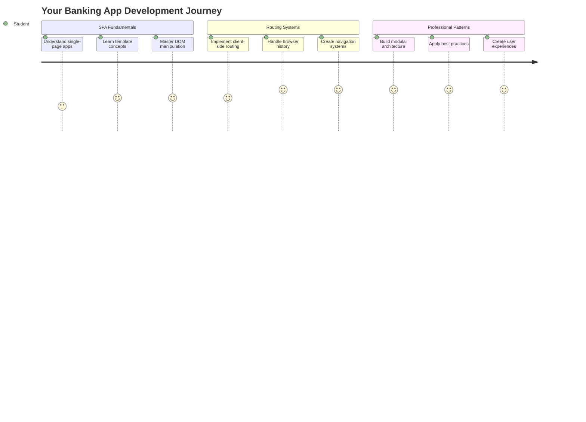
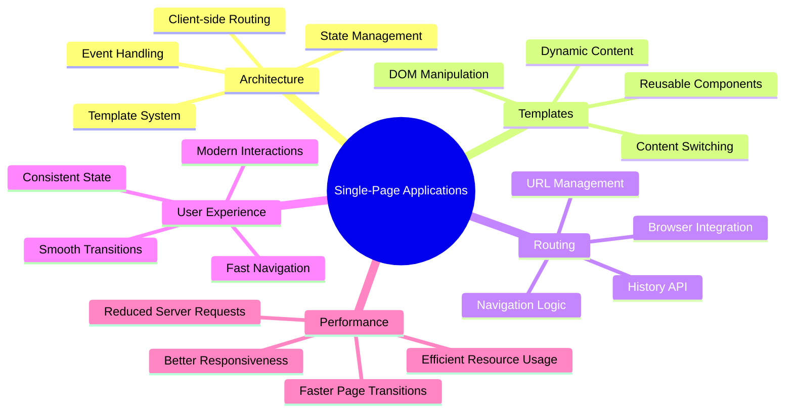
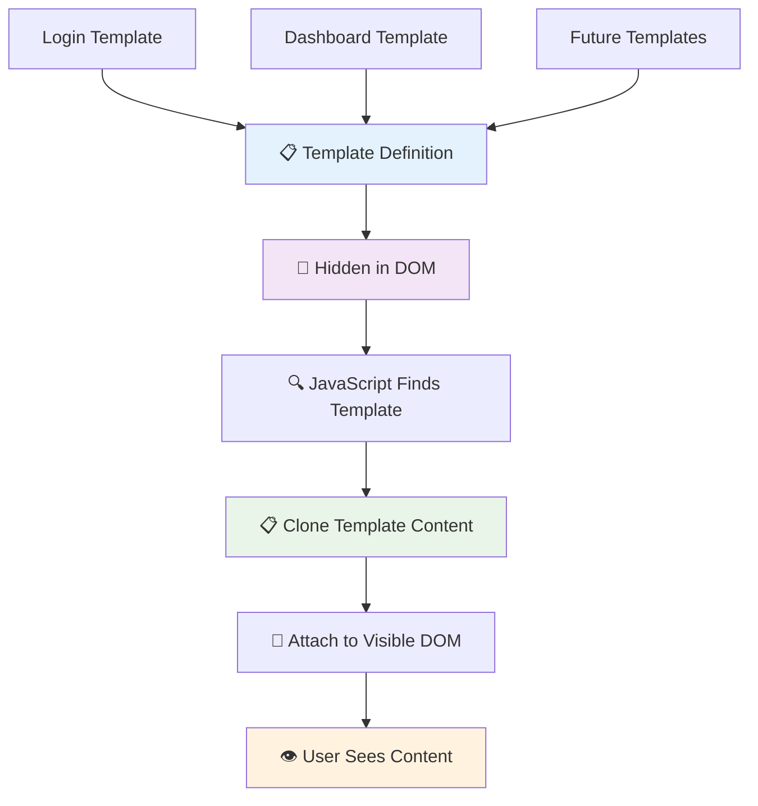
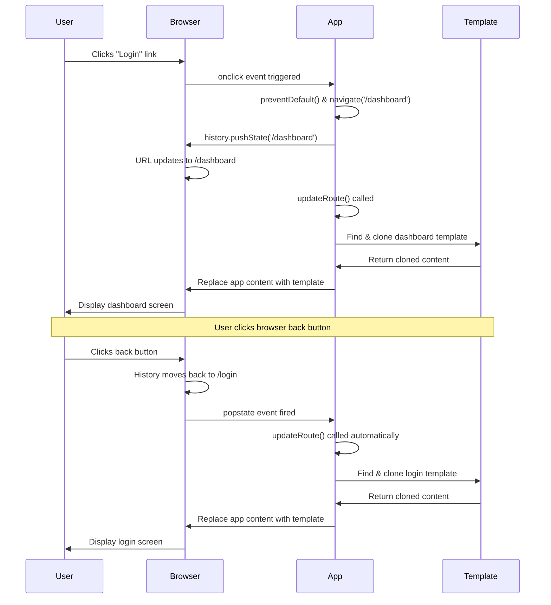

# ਬੈਂਕਿੰਗ ਐਪ ਬਣਾਉਣਾ ਭਾਗ 1: ਵੈੱਬ ਐਪ ਵਿੱਚ HTML ਟੈਂਪਲੇਟ ਅਤੇ ਰੂਟਸ



ਜਦੋਂ 1969 ਵਿੱਚ Apollo 11 ਦਾ ਗਾਈਡੈਂਸ ਕੰਪਿਊਟਰ ਚੰਦਰਮਾ ਵੱਲ ਜਾ ਰਿਹਾ ਸੀ, ਤਾਂ ਇਸ ਨੂੰ ਸਾਰੇ ਸਿਸਟਮ ਨੂੰ ਰੀਸਟਾਰਟ ਕੀਤੇ ਬਿਨਾਂ ਵੱਖ-ਵੱਖ ਪ੍ਰੋਗਰਾਮਾਂ ਵਿੱਚ ਸਵਿੱਚ ਕਰਨਾ ਪਿਆ। ਆਧੁਨਿਕ ਵੈੱਬ ਐਪਲੀਕੇਸ਼ਨ ਵੀ ਇਸੇ ਤਰ੍ਹਾਂ ਕੰਮ ਕਰਦੇ ਹਨ - ਇਹ ਤੁਹਾਨੂੰ ਜੋ ਕੁਝ ਦਿਖਾਈ ਦੇ ਰਿਹਾ ਹੈ ਉਸ ਨੂੰ ਬਦਲਦੇ ਹਨ ਬਿਨਾਂ ਸਾਰਾ ਕੁਝ ਮੁੜ ਲੋਡ ਕੀਤੇ। ਇਹ ਉਹ ਸਹੀ ਅਤੇ ਜਵਾਬਦੇਹ ਅਨੁਭਵ ਪੈਦਾ ਕਰਦਾ ਹੈ ਜਿਸ ਦੀ ਉਪਭੋਗਤਾਵਾਂ ਨੂੰ ਅੱਜ ਉਮੀਦ ਹੈ।

ਪ੍ਰੰਪਰਾਗਤ ਵੈੱਬਸਾਈਟਾਂ ਦੇ ਉਲਟ, ਜੋ ਹਰ ਕ੍ਰਿਆਵਾਂ ਲਈ ਪੂਰੇ ਪੰਨੇ ਨੂੰ ਮੁੜ ਲੋਡ ਕਰਦੀਆਂ ਹਨ, ਆਧੁਨਿਕ ਵੈੱਬ ਐਪਸ ਸਿਰਫ ਉਹ ਹਿੱਸੇ ਅਪਡੇਟ ਕਰਦੀਆਂ ਹਨ ਜਿਨ੍ਹਾਂ ਨੂੰ ਬਦਲਣ ਦੀ ਲੋੜ ਹੈ। ਇਹ ਪਹੁੰਚ, ਬਿਲਕੁਲ ਉਸ ਤਰ੍ਹਾਂ ਜਿਵੇਂ ਮਿਸ਼ਨ ਕੰਟਰੋਲ ਵੱਖ-ਵੱਖ ਡਿਸਪਲੇਅਜ਼ ਵਿੱਚ ਸਵਿੱਚ ਕਰਦਾ ਹੈ ਜਦੋਂ ਕਿ ਲਗਾਤਾਰ ਸੰਚਾਰ ਬਣਾਈ ਰੱਖਦਾ ਹੈ, ਉਹ ਸਹੀ ਅਨੁਭਵ ਪੈਦਾ ਕਰਦਾ ਹੈ ਜਿਸ ਦੀ ਅਸੀਂ ਉਮੀਦ ਕਰਦੇ ਹਾਂ।

ਇਹ ਅੰਤਰ ਕਿਵੇਂ ਨਜ਼ਰ ਆਉਂਦਾ ਹੈ:

| ਪ੍ਰੰਪਰਾਗਤ ਮਲਟੀ-ਪੇਜ ਐਪਸ | ਆਧੁਨਿਕ ਸਿੰਗਲ-ਪੇਜ ਐਪਸ |
|----------------------------|-------------------------|
| **ਨੈਵੀਗੇਸ਼ਨ** | ਹਰ ਸਕ੍ਰੀਨ ਲਈ ਪੂਰਾ ਪੰਨਾ ਮੁੜ ਲੋਡ | ਤੁਰੰਤ ਸਮੱਗਰੀ ਸਵਿੱਚ |
| **ਪਰਫਾਰਮੈਂਸ** | ਪੂਰੇ HTML ਡਾਊਨਲੋਡ ਦੇ ਕਾਰਨ ਹੌਲੀ | ਹਿੱਸਾ ਅਪਡੇਟ ਨਾਲ ਤੇਜ਼ |
| **ਉਪਭੋਗਤਾ ਅਨੁਭਵ** | ਪੰਨਾ ਫਲੈਸ਼ | ਸਹੀ, ਐਪ-ਜਿਵੇਂ ਟ੍ਰਾਂਜ਼ੀਸ਼ਨ |
| **ਡਾਟਾ ਸਾਂਝਾ ਕਰਨਾ** | ਪੰਨਿਆਂ ਵਿੱਚ ਮੁਸ਼ਕਲ | ਸੌਖਾ ਸਟੇਟ ਮੈਨੇਜਮੈਂਟ |
| **ਡਿਵੈਲਪਮੈਂਟ** | ਕਈ HTML ਫਾਈਲਾਂ ਨੂੰ ਸੰਭਾਲਣਾ | ਇੱਕ HTML ਨਾਲ ਗਤੀਸ਼ੀਲ ਟੈਂਪਲੇਟ |

**ਵਿਕਾਸ ਦੀ ਸਮਝ:**
- **ਪ੍ਰੰਪਰਾਗਤ ਐਪਸ** ਹਰ ਨੈਵੀਗੇਸ਼ਨ ਕਾਰਵਾਈ ਲਈ ਸਰਵਰ ਰਿਕਵੈਸਟ ਦੀ ਲੋੜ ਹੁੰਦੀ ਹੈ
- **ਆਧੁਨਿਕ SPAs** ਇੱਕ ਵਾਰ ਲੋਡ ਹੁੰਦੇ ਹਨ ਅਤੇ ਸਮੱਗਰੀ ਨੂੰ ਗਤੀਸ਼ੀਲ ਤੌਰ 'ਤੇ ਜਾਵਾਸਕ੍ਰਿਪਟ ਦੀ ਵਰਤੋਂ ਕਰਕੇ ਅਪਡੇਟ ਕਰਦੇ ਹਨ
- **ਉਪਭੋਗਤਾ ਦੀ ਉਮੀਦਾਂ** ਹੁਣ ਤੁਰੰਤ, ਸਹੀ ਅੰਤਰਕ੍ਰਿਆਵਾਂ ਨੂੰ ਤਰਜੀਹ ਦਿੰਦੇ ਹਨ
- **ਪਰਫਾਰਮੈਂਸ ਫਾਇਦੇ** ਵਿੱਚ ਘੱਟ ਬੈਂਡਵਿਡਥ ਅਤੇ ਤੇਜ਼ ਜਵਾਬ ਸ਼ਾਮਲ ਹਨ

ਇਸ ਪਾਠ ਵਿੱਚ, ਅਸੀਂ ਇੱਕ ਬੈਂਕਿੰਗ ਐਪ ਬਣਾਉਣ ਜਾ ਰਹੇ ਹਾਂ ਜਿਸ ਵਿੱਚ ਕਈ ਸਕ੍ਰੀਨ ਸਹੀ ਤੌਰ 'ਤੇ ਇੱਕ ਦੂਜੇ ਨਾਲ ਜੁੜੇ ਹੋਣਗੇ। ਜਿਵੇਂ ਵਿਗਿਆਨੀ ਵੱਖ-ਵੱਖ ਪ੍ਰਯੋਗਾਂ ਲਈ ਮੁੜ-ਕੰਫਿਗਰ ਕੀਤੇ ਜਾ ਸਕਣ ਵਾਲੇ ਮੋਡਿਊਲਰ ਸੰਦਾਂ ਦੀ ਵਰਤੋਂ ਕਰਦੇ ਹਨ, ਅਸੀਂ HTML ਟੈਂਪਲੇਟਾਂ ਦੀ ਵਰਤੋਂ ਕਰਾਂਗੇ ਜੋ ਦੁਬਾਰਾ ਵਰਤਣਯੋਗ ਹਿੱਸੇ ਵਜੋਂ ਜਰੂਰਤ ਮੁਤਾਬਕ ਦਿਖਾਏ ਜਾ ਸਕਦੇ ਹਨ।

ਤੁਹਾਨੂੰ HTML ਟੈਂਪਲੇਟਾਂ (ਵੱਖ-ਵੱਖ ਸਕ੍ਰੀਨਾਂ ਲਈ ਦੁਬਾਰਾ ਵਰਤਣਯੋਗ ਬਲੂਪ੍ਰਿੰਟ), ਜਾਵਾਸਕ੍ਰਿਪਟ ਰੂਟਿੰਗ (ਸਕ੍ਰੀਨਾਂ ਵਿੱਚ ਸਵਿੱਚ ਕਰਨ ਵਾਲਾ ਸਿਸਟਮ), ਅਤੇ ਬ੍ਰਾਊਜ਼ਰ ਦਾ ਹਿਸਟਰੀ API (ਜੋ ਬੈਕ ਬਟਨ ਨੂੰ ਉਮੀਦ ਮੁਤਾਬਕ ਕੰਮ ਕਰਨ ਦਿੰਦਾ ਹੈ) ਨਾਲ ਕੰਮ ਕਰਨਾ ਪਵੇਗਾ। ਇਹ ਉਹੀ ਮੂਲ ਤਕਨੀਕਾਂ ਹਨ ਜੋ React, Vue, ਅਤੇ Angular ਵਰਗੇ ਫਰੇਮਵਰਕਾਂ ਦੁਆਰਾ ਵਰਤੀਆਂ ਜਾਂਦੀਆਂ ਹਨ।

ਅੰਤ ਵਿੱਚ, ਤੁਹਾਡੇ ਕੋਲ ਇੱਕ ਕੰਮ ਕਰਨ ਵਾਲਾ ਬੈਂਕਿੰਗ ਐਪ ਹੋਵੇਗਾ ਜੋ ਪੇਸ਼ੇਵਰ ਸਿੰਗਲ-ਪੇਜ ਐਪਲੀਕੇਸ਼ਨ ਸਿਧਾਂਤਾਂ ਨੂੰ ਦਰਸਾਉਂਦਾ ਹੈ।



## ਪਾਠ ਤੋਂ ਪਹਿਲਾਂ ਕਵਿਜ਼

[ਪਾਠ ਤੋਂ ਪਹਿਲਾਂ ਕਵਿਜ਼](https://ff-quizzes.netlify.app/web/quiz/41)

### ਤੁਹਾਨੂੰ ਕੀ ਚਾਹੀਦਾ ਹੈ

ਸਾਨੂੰ ਆਪਣੀ ਬੈਂਕਿੰਗ ਐਪ ਦੀ ਜਾਂਚ ਕਰਨ ਲਈ ਇੱਕ ਸਥਾਨਕ ਵੈੱਬ ਸਰਵਰ ਦੀ ਲੋੜ ਹੋਵੇਗੀ – ਚਿੰਤਾ ਨਾ ਕਰੋ, ਇਹ ਸੁਵਿਧਾਜਨਕ ਹੈ! ਜੇ ਤੁਹਾਡੇ ਕੋਲ ਪਹਿਲਾਂ ਤੋਂ ਇੱਕ ਸੈਟਅਪ ਨਹੀਂ ਹੈ, ਤਾਂ ਸਿਰਫ [Node.js](https://nodejs.org) ਇੰਸਟਾਲ ਕਰੋ ਅਤੇ ਆਪਣੇ ਪ੍ਰੋਜੈਕਟ ਫੋਲਡਰ ਤੋਂ `npx lite-server` ਚਲਾਓ। ਇਹ ਸਹੂਲਤਮਈ ਕਮਾਂਡ ਇੱਕ ਸਥਾਨਕ ਸਰਵਰ ਚਲਾਉਂਦੀ ਹੈ ਅਤੇ ਤੁਹਾਡੀ ਐਪ ਨੂੰ ਬ੍ਰਾਊਜ਼ਰ ਵਿੱਚ ਖੋਲ੍ਹਦੀ ਹੈ।

### ਤਿਆਰੀ

ਆਪਣੇ ਕੰਪਿਊਟਰ 'ਤੇ, `bank` ਨਾਮਕ ਇੱਕ ਫੋਲਡਰ ਬਣਾਓ ਜਿਸ ਵਿੱਚ `index.html` ਨਾਮਕ ਇੱਕ ਫਾਈਲ ਹੋਵੇ। ਅਸੀਂ ਇਸ HTML [ਬੋਇਲਰਪਲੇਟ](https://en.wikipedia.org/wiki/Boilerplate_code) ਤੋਂ ਸ਼ੁਰੂ ਕਰਾਂਗੇ:

```html
<!DOCTYPE html>
<html lang="en">
  <head>
    <meta charset="UTF-8">
    <meta name="viewport" content="width=device-width, initial-scale=1.0">
    <title>Bank App</title>
  </head>
  <body>
    <!-- This is where you'll work -->
  </body>
</html>
```

**ਇਹ ਬੋਇਲਰਪਲੇਟ ਕੀ ਪ੍ਰਦਾਨ ਕਰਦਾ ਹੈ:**
- **ਸਥਾਪਿਤ ਕਰਦਾ ਹੈ** HTML5 ਦਸਤਾਵੇਜ਼ ਦੀ ਬਣਤਰ ਸਹੀ DOCTYPE ਘੋਸ਼ਣਾ ਨਾਲ
- **ਕੰਫਿਗਰ ਕਰਦਾ ਹੈ** ਅੰਤਰਰਾਸ਼ਟਰੀ ਟੈਕਸਟ ਸਹਾਇਤਾ ਲਈ UTF-8 ਅੱਖਰ ਕੋਡਿੰਗ
- **ਸਮਰਥਨ ਦਿੰਦਾ ਹੈ** ਮੋਬਾਈਲ ਅਨੁਕੂਲਤਾ ਲਈ ਵਿਊਪੋਰਟ ਮੈਟਾ ਟੈਗ ਨਾਲ ਜਵਾਬਦੇਹ ਡਿਜ਼ਾਈਨ
- **ਸੈਟ ਕਰਦਾ ਹੈ** ਇੱਕ ਵਰਣਨਾਤਮਕ ਸਿਰਲੇਖ ਜੋ ਬ੍ਰਾਊਜ਼ਰ ਟੈਬ ਵਿੱਚ ਦਿਖਾਈ ਦਿੰਦਾ ਹੈ
- **ਬਣਾਉਂਦਾ ਹੈ** ਇੱਕ ਸਾਫ ਸਰੀਰ ਦਾ ਹਿੱਸਾ ਜਿੱਥੇ ਅਸੀਂ ਆਪਣੀ ਐਪਲੀਕੇਸ਼ਨ ਬਣਾਉਣ ਜਾ ਰਹੇ ਹਾਂ

> 📁 **ਪ੍ਰੋਜੈਕਟ ਬਣਤਰ ਦਾ ਪੂਰਵ ਦਰਸ਼ਨ**
> 
> **ਇਸ ਪਾਠ ਦੇ ਅੰਤ ਵਿੱਚ, ਤੁਹਾਡਾ ਪ੍ਰੋਜੈਕਟ ਸ਼ਾਮਲ ਹੋਵੇਗਾ:**
> ```
> bank/
> ├── index.html      <!-- Main HTML with templates -->
> ├── app.js          <!-- Routing and navigation logic -->
> └── style.css       <!-- (Optional for future lessons) -->
> ```
> 
> **ਫਾਈਲ ਜ਼ਿੰਮੇਵਾਰੀਆਂ:**
> - **index.html**: ਸਾਰੇ ਟੈਂਪਲੇਟਾਂ ਨੂੰ ਸ਼ਾਮਲ ਕਰਦਾ ਹੈ ਅਤੇ ਐਪ ਬਣਤਰ ਪ੍ਰਦਾਨ ਕਰਦਾ ਹੈ
> - **app.js**: ਰੂਟਿੰਗ, ਨੈਵੀਗੇਸ਼ਨ, ਅਤੇ ਟੈਂਪਲੇਟ ਮੈਨੇਜਮੈਂਟ ਨੂੰ ਸੰਭਾਲਦਾ ਹੈ
> - **ਟੈਂਪਲੇਟ**: ਲੌਗਇਨ, ਡੈਸ਼ਬੋਰਡ, ਅਤੇ ਹੋਰ ਸਕ੍ਰੀਨਾਂ ਲਈ UI ਨੂੰ ਪਰਿਭਾਸ਼ਿਤ ਕਰਦਾ ਹੈ

---

## HTML ਟੈਂਪਲੇਟ

ਟੈਂਪਲੇਟ ਵੈੱਬ ਵਿਕਾਸ ਵਿੱਚ ਇੱਕ ਮੂਲ ਸਮੱਸਿਆ ਦਾ ਹੱਲ ਕਰਦੇ ਹਨ। ਜਦੋਂ ਗੁਟਨਬਰਗ ਨੇ 1440 ਦੇ ਦਹਾਕੇ ਵਿੱਚ ਮੂਵਏਬਲ ਟਾਈਪ ਪ੍ਰਿੰਟਿੰਗ ਦੀ ਖੋਜ ਕੀਤੀ, ਤਾਂ ਉਸਨੇ ਸਮਝਿਆ ਕਿ ਪੂਰੇ ਪੰਨੇ ਨੂੰ ਖੋਦਣ ਦੀ ਬਜਾਏ, ਉਹ ਦੁਬਾਰਾ ਵਰਤਣਯੋਗ ਅੱਖਰ ਬਲਾਕ ਬਣਾਉਣ ਅਤੇ ਜਰੂਰਤ ਮੁਤਾਬਕ ਉਨ੍ਹਾਂ ਨੂੰ ਸਜਾ ਸਕਦਾ ਹੈ। HTML ਟੈਂਪਲੇਟ ਇਸੇ ਸਿਧਾਂਤ 'ਤੇ ਕੰਮ ਕਰਦੇ ਹਨ - ਹਰ ਸਕ੍ਰੀਨ ਲਈ ਵੱਖ-ਵੱਖ HTML ਫਾਈਲਾਂ ਬਣਾਉਣ ਦੀ ਬਜਾਏ, ਤੁਸੀਂ ਦੁਬਾਰਾ ਵਰਤਣਯੋਗ ਬਣਤਰਾਂ ਨੂੰ ਪਰਿਭਾਸ਼ਿਤ ਕਰਦੇ ਹੋ ਜੋ ਜਰੂਰਤ ਪੈਣ 'ਤੇ ਦਿਖਾਈ ਜਾ ਸਕਦੇ ਹਨ।



ਟੈਂਪਲੇਟਾਂ ਨੂੰ ਆਪਣੇ ਐਪ ਦੇ ਵੱਖ-ਵੱਖ ਹਿੱਸਿਆਂ ਲਈ ਬਲੂਪ੍ਰਿੰਟ ਵਜੋਂ ਸੋਚੋ। ਜਿਵੇਂ ਇੱਕ ਆਰਕੀਟੈਕਟ ਇੱਕ ਬਲੂਪ੍ਰਿੰਟ ਬਣਾਉਂਦਾ ਹੈ ਅਤੇ ਇਸਨੂੰ ਕਈ ਵਾਰ ਵਰਤਦਾ ਹੈ ਬਜਾਏ ਇੱਕੋ ਜਿਹੇ ਕਮਰੇ ਨੂੰ ਮੁੜ ਡਰਾਅ ਕਰਨ ਦੇ, ਅਸੀਂ ਟੈਂਪਲੇਟ ਇੱਕ ਵਾਰ ਬਣਾਉਂਦੇ ਹਾਂ ਅਤੇ ਜਰੂਰਤ ਮੁਤਾਬਕ ਇਸਨੂੰ ਵਰਤਦੇ ਹਾਂ। ਬ੍ਰਾਊਜ਼ਰ ਇਹਨਾਂ ਟੈਂਪਲੇਟਾਂ ਨੂੰ ਲੁਕਾ ਕੇ ਰੱਖਦਾ ਹੈ ਜਦੋਂ ਤੱਕ ਜਾਵਾਸਕ੍ਰਿਪਟ ਇਸਨੂੰ ਐਕਟੀਵੇਟ ਨਹੀਂ ਕਰਦਾ।

ਜੇ ਤੁਸੀਂ ਵੈੱਬ ਪੰਨੇ ਲਈ ਕਈ ਸਕ੍ਰੀਨ ਬਣਾਉਣਾ ਚਾਹੁੰਦੇ ਹੋ, ਤਾਂ ਇੱਕ ਹੱਲ ਇਹ ਹੋਵੇਗਾ ਕਿ ਤੁਸੀਂ ਹਰ ਸਕ੍ਰੀਨ ਲਈ ਇੱਕ HTML ਫਾਈਲ ਬਣਾਓ। ਹਾਲਾਂਕਿ, ਇਸ ਹੱਲ ਨਾਲ ਕੁਝ ਅਸੁਵਿਧਾਵਾਂ ਆਉਂਦੀਆਂ ਹਨ:

- ਸਕ੍ਰੀਨ ਸਵਿੱਚ ਕਰਨ ਸਮੇਂ ਤੁਹਾਨੂੰ ਪੂਰੇ HTML ਨੂੰ ਮੁੜ ਲੋਡ ਕਰਨਾ ਪਵੇਗਾ, ਜੋ ਹੌਲੀ ਹੋ ਸਕਦਾ ਹੈ।
- ਵੱਖ-ਵੱਖ ਸਕ੍ਰੀਨਾਂ ਵਿੱਚ ਡਾਟਾ ਸਾਂਝਾ ਕਰਨਾ ਮੁਸ਼ਕਲ ਹੈ।

ਇੱਕ ਹੋਰ ਪਹੁੰਚ ਇਹ ਹੈ ਕਿ ਸਿਰਫ ਇੱਕ HTML ਫਾਈਲ ਹੋਵੇ, ਅਤੇ `<template>` ਤੱਤ ਦੀ ਵਰਤੋਂ ਕਰਕੇ ਕਈ [HTML ਟੈਂਪਲੇਟ](https://developer.mozilla.org/docs/Web/HTML/Element/template) ਪਰਿਭਾਸ਼ਿਤ ਕੀਤੇ ਜਾਣ। ਇੱਕ ਟੈਂਪਲੇਟ ਇੱਕ ਦੁਬਾਰਾ ਵਰਤਣਯੋਗ HTML ਬਲਾਕ ਹੈ ਜੋ ਬ੍ਰਾਊਜ਼ਰ ਦੁਆਰਾ ਦਿਖਾਇਆ ਨਹੀਂ ਜਾਂਦਾ, ਅਤੇ ਇਸਨੂੰ ਜਾਵਾਸਕ੍ਰਿਪਟ ਦੀ ਵਰਤੋਂ ਕਰਕੇ ਰਨਟਾਈਮ 'ਤੇ ਇੰਸਟੈਂਸ਼ੀਏਟ ਕਰਨ ਦੀ ਲੋੜ ਹੁੰਦੀ ਹੈ।

### ਆਓ ਇਸਨੂੰ ਬਣਾਈਏ

ਅਸੀਂ ਇੱਕ ਬੈਂਕ ਐਪ ਬਣਾਉਣ ਜਾ ਰਹੇ ਹਾਂ ਜਿਸ ਵਿੱਚ ਦੋ ਮੁੱਖ ਸਕ੍ਰੀਨ ਹੋਣਗੇ: ਇੱਕ ਲੌਗਇਨ ਪੰਨਾ ਅਤੇ ਇੱਕ ਡੈਸ਼ਬੋਰਡ। ਪਹਿਲਾਂ, ਆਓ ਆਪਣੇ HTML ਬਾਡੀ ਵਿੱਚ ਇੱਕ ਪਲੇਸਹੋਲਡਰ ਤੱਤ ਸ਼ਾਮਲ ਕਰੀਏ - ਇਹ ਉਹ ਜਗ੍ਹਾ ਹੈ ਜਿੱਥੇ ਸਾਡੇ ਵੱਖ-ਵੱਖ ਸਕ੍ਰੀਨ ਦਿਖਾਈ ਦੇਣਗੇ:

```html
<div id="app">Loading...</div>
```

**ਇਸ ਪਲੇਸਹੋਲਡਰ ਦੀ ਸਮਝ:**
- **ਬਣਾਉਂਦਾ ਹੈ** ਇੱਕ ਕੰਟੇਨਰ ਜਿਸਦਾ ID "app" ਹੈ ਜਿੱਥੇ ਸਾਰੇ ਸਕ੍ਰੀਨ ਦਿਖਾਈ ਦੇਣਗੇ
- **ਦਿਖਾਉਂਦਾ ਹੈ** ਇੱਕ ਲੋਡਿੰਗ ਸੁਨੇਹਾ ਜਦੋਂ ਤੱਕ ਜਾਵਾਸਕ੍ਰਿਪਟ ਪਹਿਲਾ ਸਕ੍ਰੀਨ ਸ਼ੁਰੂ ਨਹੀਂ ਕਰਦਾ
- **ਪ੍ਰਦਾਨ ਕਰਦਾ ਹੈ** ਸਾਡੇ ਗਤੀਸ਼ੀਲ ਸਮੱਗਰੀ ਲਈ ਇੱਕ ਸਿੰਗਲ ਮਾਊਂਟਿੰਗ ਪੌਇੰਟ
- **ਸੌਖਾ ਬਣਾਉਂਦਾ ਹੈ** ਜਾਵਾਸਕ੍ਰਿਪਟ ਦੁਆਰਾ ਟਾਰਗਟਿੰਗ `document.getElementById()` ਦੀ ਵਰਤੋਂ ਕਰਕੇ

> 💡 **ਪ੍ਰੋ ਟਿਪ**: ਕਿਉਂਕਿ ਇਸ ਤੱਤ ਦੀ ਸਮੱਗਰੀ ਬਦਲੀ ਜਾਵੇਗੀ, ਅਸੀਂ ਇੱਕ ਲੋਡਿੰਗ ਸੁਨੇਹਾ ਜਾਂ ਇੰਡੀਕੇਟਰ ਰੱਖ ਸਕਦੇ ਹਾਂ ਜੋ ਐਪ ਲੋਡ ਹੋਣ ਸਮੇਂ ਦਿਖਾਈ ਦੇਵੇਗਾ।

ਅਗਲੇ ਕਦਮ ਵਿੱਚ, ਆਓ ਲੌਗਇਨ ਪੰਨੇ ਲਈ HTML ਟੈਂਪਲੇਟ ਨੂੰ ਹੇਠਾਂ ਸ਼ਾਮਲ ਕਰੀਏ। ਇਸ ਵਿੱਚ ਅਜੇ ਤੱਕ ਸਿਰਫ ਇੱਕ ਸਿਰਲੇਖ ਅਤੇ ਇੱਕ ਸੈਕਸ਼ਨ ਹੋਵੇਗਾ ਜਿਸ ਵਿੱਚ ਇੱਕ ਲਿੰਕ ਹੋਵੇਗਾ ਜੋ ਨੈਵੀਗੇਸ਼ਨ ਕਰਨ ਲਈ ਵਰਤਿਆ ਜਾਵੇਗਾ।

```html
<template id="login">
  <h1>Bank App</h1>
  <section>
    <a href="/dashboard">Login</a>
  </section>
</template>
```

**ਇਸ ਲੌਗਇਨ ਟੈਂਪਲੇਟ ਦੀ ਵਿਸ਼ਲੇਸ਼ਣ:**
- **ਪਰਿਭਾਸ਼ਿਤ ਕਰਦਾ ਹੈ** ਇੱਕ ਟੈਂਪਲੇਟ ਜਿਸਦਾ ਵਿਲੱਖਣ ਪਛਾਣਕਰਤਾ "login" ਹੈ ਜਾਵਾਸਕ੍ਰਿਪਟ ਟਾਰਗਟਿੰਗ ਲਈ
- **ਸ਼ਾਮਲ ਕਰਦਾ ਹੈ** ਇੱਕ ਮੁੱਖ ਸਿਰਲੇਖ ਜੋ ਐਪ ਦੀ ਬ੍ਰਾਂਡਿੰਗ ਸਥਾਪਿਤ ਕਰਦਾ ਹੈ
- **ਸ਼ਾਮਲ ਕਰਦਾ ਹੈ** ਇੱਕ ਸੈਮਾਂਟਿਕ `<section>` ਤੱਤ ਜੋ ਸੰਬੰਧਿਤ ਸਮੱਗਰੀ ਨੂੰ ਸਮੂਹਿਤ ਕਰਦਾ ਹੈ
- **ਪ੍ਰਦਾਨ ਕਰਦਾ ਹੈ** ਇੱਕ ਨੈਵੀਗੇਸ਼ਨ ਲਿੰਕ ਜੋ ਉਪਭੋਗਤਾਵਾਂ ਨੂੰ ਡੈਸ਼ਬੋਰਡ ਵੱਲ ਰੂਟ ਕਰੇਗਾ

ਫਿਰ ਅਸੀਂ ਡੈਸ਼ਬੋਰਡ ਪੰਨੇ ਲਈ ਇੱਕ ਹੋਰ HTML ਟੈਂਪਲੇਟ ਸ਼ਾਮਲ ਕਰਾਂਗੇ। ਇਸ ਪੰਨੇ ਵਿੱਚ ਵੱਖ-ਵੱਖ ਸੈਕਸ਼ਨ ਹੋਣਗੇ:

- ਇੱਕ ਸਿਰਲੇਖ ਜਿਸ ਵਿੱਚ ਸਿਰਲੇਖ ਅਤੇ ਲੌਗਆਉਟ ਲਿੰਕ ਹੋਵੇਗਾ
- ਬੈਂਕ ਖਾਤੇ ਦੀ ਮੌਜੂਦਾ ਬਕਾਇਆ ਰਕਮ
- ਲੈਣ-ਦੇਣ ਦੀ ਸੂਚੀ, ਜੋ ਇੱਕ ਟੇਬਲ ਵਿੱਚ ਦਿਖਾਈ ਜਾਵੇਗੀ

```html
<template id="dashboard">
  <header>
    <h1>Bank App</h1>
    <a href="/login">Logout</a>
  </header>
  <section>
    Balance: 100$
  </section>
  <section>
    <h2>Transactions</h2>
    <table>
      <thead>
        <tr>
          <th>Date</th>
          <th>Object</th>
          <th>Amount</th>
        </tr>
      </thead>
      <tbody></tbody>
    </table>
  </section>
</template>
```

**ਆਓ ਡੈਸ਼ਬੋਰਡ ਦੇ ਹਰ ਹਿੱਸੇ ਨੂੰ ਸਮਝੀਏ:**
- **ਪੰਨੇ ਨੂੰ ਬਣਾਉਂਦਾ ਹੈ** ਇੱਕ ਸੈਮਾਂਟਿਕ `<header>` ਤੱਤ ਨਾਲ ਜਿਸ ਵਿੱਚ ਨੈਵੀਗੇਸ਼ਨ ਸ਼ਾਮਲ ਹੈ
- **ਸਥਿਰ ਤੌਰ 'ਤੇ ਦਿਖਾਉਂਦਾ ਹੈ** ਐਪ ਸਿਰਲੇਖ ਨੂੰ ਸਕ੍ਰੀਨਾਂ ਵਿੱਚ ਬ੍ਰਾਂਡਿੰਗ ਲਈ
- **ਪ੍ਰਦਾਨ ਕਰਦਾ ਹੈ** ਇੱਕ ਲੌਗਆਉਟ ਲਿੰਕ ਜੋ ਲੌਗਇਨ ਸਕ੍ਰੀਨ ਵੱਲ ਰੂਟ ਕਰਦਾ ਹੈ
- **ਮੌਜੂਦਾ ਖਾਤੇ ਦੀ ਬਕਾਇਆ ਰਕਮ ਦਿਖਾਉਂਦਾ ਹੈ** ਇੱਕ ਸਮਰਪਿਤ ਸੈਕਸ਼ਨ ਵਿੱਚ
- **ਲੈਣ-ਦੇਣ ਡਾਟਾ ਨੂੰ ਸੰਗਠਿਤ ਕਰਦਾ ਹੈ** ਇੱਕ ਢੰਗ ਨਾਲ ਬਣਾਈ ਗਈ HTML ਟੇਬਲ ਦੀ ਵਰਤੋਂ ਕਰਕੇ
- **ਟੇਬਲ ਸਿਰਲੇਖਾਂ ਨੂੰ ਪਰਿਭਾਸ਼ਿਤ ਕਰਦਾ ਹੈ** ਮਿਤੀ, ਵਸਤੂ, ਅਤੇ ਰਕਮ ਕਾਲਮਾਂ ਲਈ
- **ਟੇਬਲ ਬਾਡੀ ਨੂੰ ਖਾਲੀ ਛੱਡਦਾ ਹੈ** ਗਤੀਸ਼ੀਲ ਸਮੱਗਰੀ ਇੰਜੈਕਸ਼ਨ ਲਈ

> 💡 **ਪ੍ਰੋ ਟਿਪ**: ਜਦੋਂ HTML ਟੈਂਪਲੇਟ ਬਣਾਉਂਦੇ ਹੋ, ਜੇ ਤੁਸੀਂ ਦੇਖਣਾ ਚਾਹੁੰਦੇ ਹੋ ਕਿ ਇਹ ਕਿਵੇਂ ਲੱਗੇਗਾ, ਤਾਂ ਤੁਸੀਂ `<template>` ਅਤੇ `</template>` ਲਾਈਨਾਂ ਨੂੰ `<!-- -->` ਨਾਲ ਕਮੈਂਟ ਕਰਕੇ ਲੁਕਾ ਸਕਦੇ ਹੋ।

### 🔄 **ਪੈਡਾਗੌਜੀਕਲ ਚੈੱਕ-ਇਨ**
**ਟੈਂਪਲੇਟ ਸਿਸਟਮ ਦੀ ਸਮਝ**: ਜਾਵਾਸਕ੍ਰਿਪਟ ਲਾਗੂ ਕਰਨ ਤੋਂ ਪਹਿਲਾਂ, ਇਹ ਯਕੀਨੀ ਬਣਾਓ ਕਿ ਤੁਸੀਂ ਸਮਝਦੇ ਹੋ:
- ✅ ਟੈਂਪਲੇਟ ਸਧਾਰਨ HTML ਤੱਤਾਂ ਤੋਂ ਕਿਵੇਂ ਵੱਖ ਹਨ
- ✅ ਕਿਉਂ ਟੈਂਪਲੇਟ ਜਾਵਾਸਕ੍ਰਿਪਟ ਦੁਆਰਾ ਐਕਟੀਵੇਟ ਹੋਣ ਤੱਕ ਲੁਕੇ ਰਹਿੰਦੇ ਹਨ
- ✅ ਟੈਂਪਲੇਟਾਂ ਵਿੱਚ ਸੈਮਾਂਟਿਕ HTML ਬਣਤਰ ਦੀ ਮਹੱਤਤਾ
- ✅ ਟੈਂਪਲੇਟ ਦੁਬਾਰਾ ਵਰਤਣਯੋਗ UI ਹਿੱਸੇ ਕਿਵੇਂ ਯੋਗ ਕਰਦੇ ਹਨ

**ਤੁਰੰਤ ਸਵਾਲ-ਜਵਾਬ**: ਜੇ ਤੁਸੀਂ ਆਪਣੇ HTML ਤੋਂ `<template>` ਟੈਗ ਹਟਾ ਦਿੰਦੇ ਹੋ ਤਾਂ ਕੀ ਹੁੰਦਾ ਹੈ?
*ਜਵਾਬ: ਸਮੱਗਰੀ ਤੁਰੰਤ ਦਿਖਾਈ ਦੇਣ ਲੱਗਦੀ ਹੈ ਅਤੇ ਇਸਦਾ ਟੈਂਪਲੇਟ ਫੰਕਸ਼ਨਲਿਟੀ ਖਤਮ ਹੋ ਜਾਂਦੀ ਹੈ*

**ਆਰਕੀਟੈਕਚਰ ਦੇ ਫਾਇਦੇ**: ਟੈਂਪਲੇਟ ਪ੍ਰਦਾਨ ਕਰਦੇ ਹਨ:
- **ਦੁਬਾਰਾ ਵਰਤਣਯੋਗਤਾ**: ਇੱਕ ਪਰਿਭਾਸ਼
ਹੁਣ ਆਓ `updateRoute` ਫੰਕਸ਼ਨ ਵਿੱਚ ਕੁਝ ਤਬਦੀਲੀਆਂ ਕਰੀਏ। ਸਿੱਧੇ `templateId` ਨੂੰ ਦਲੀਲ ਵਜੋਂ ਪਾਸ ਕਰਨ ਦੀ ਬਜਾਏ, ਅਸੀਂ ਪਹਿਲਾਂ ਮੌਜੂਦਾ URL ਨੂੰ ਵੇਖ ਕੇ ਇਸਨੂੰ ਪ੍ਰਾਪਤ ਕਰਨਾ ਚਾਹੁੰਦੇ ਹਾਂ, ਅਤੇ ਫਿਰ ਆਪਣੇ ਮੈਪ ਦੀ ਵਰਤੋਂ ਕਰਕੇ ਸੰਬੰਧਿਤ ਟੈਂਪਲੇਟ ID ਮੁੱਲ ਲੈਣਾ ਚਾਹੁੰਦੇ ਹਾਂ। ਅਸੀਂ [`window.location.pathname`](https://developer.mozilla.org/docs/Web/API/Location/pathname) ਦੀ ਵਰਤੋਂ ਕਰਕੇ URL ਤੋਂ ਸਿਰਫ਼ ਪਾਥ ਸੈਕਸ਼ਨ ਪ੍ਰਾਪਤ ਕਰ ਸਕਦੇ ਹਾਂ।

```js
function updateRoute() {
  const path = window.location.pathname;
  const route = routes[path];

  const template = document.getElementById(route.templateId);
  const view = template.content.cloneNode(true);
  const app = document.getElementById('app');
  app.innerHTML = '';
  app.appendChild(view);
}
```

**ਇਸ ਵਿੱਚ ਕੀ ਹੁੰਦਾ ਹੈ:**
- **ਨਿਕਾਲਦਾ ਹੈ** ਮੌਜੂਦਾ ਪਾਥ ਨੂੰ ਬ੍ਰਾਊਜ਼ਰ ਦੇ URL ਤੋਂ `window.location.pathname` ਦੀ ਵਰਤੋਂ ਕਰਕੇ
- **ਖੋਜਦਾ ਹੈ** ਸੰਬੰਧਿਤ ਰੂਟ ਕਨਫਿਗਰੇਸ਼ਨ ਨੂੰ ਸਾਡੇ routes object ਵਿੱਚ
- **ਪ੍ਰਾਪਤ ਕਰਦਾ ਹੈ** ਟੈਂਪਲੇਟ ID ਨੂੰ ਰੂਟ ਕਨਫਿਗਰੇਸ਼ਨ ਤੋਂ
- **ਪਾਲਣ ਕਰਦਾ ਹੈ** ਪਿਛਲੇ ਟੈਂਪਲੇਟ ਰੈਂਡਰਿੰਗ ਪ੍ਰਕਿਰਿਆ ਨੂੰ
- **ਬਣਾਉਂਦਾ ਹੈ** ਇੱਕ ਡਾਇਨਾਮਿਕ ਸਿਸਟਮ ਜੋ URL ਬਦਲਣ 'ਤੇ ਪ੍ਰਤੀਕ੍ਰਿਆ ਕਰਦਾ ਹੈ

ਇੱਥੇ ਅਸੀਂ ਆਪਣੇ routes ਨੂੰ ਸੰਬੰਧਿਤ ਟੈਂਪਲੇਟ ਨਾਲ ਮੈਪ ਕੀਤਾ। ਤੁਸੀਂ ਇਸਨੂੰ ਆਪਣੇ ਬ੍ਰਾਊਜ਼ਰ ਵਿੱਚ URL ਨੂੰ ਮੈਨੁਅਲੀ ਤੌਰ 'ਤੇ ਬਦਲ ਕੇ ਸਹੀ ਕੰਮ ਕਰਨ ਦੀ ਜਾਂਚ ਕਰ ਸਕਦੇ ਹੋ।

✅ ਜੇ ਤੁਸੀਂ URL ਵਿੱਚ ਕੋਈ ਅਣਜਾਣ ਪਾਥ ਦਰਜ ਕਰੋ ਤਾਂ ਕੀ ਹੁੰਦਾ ਹੈ? ਅਸੀਂ ਇਸਨੂੰ ਕਿਵੇਂ ਹੱਲ ਕਰ ਸਕਦੇ ਹਾਂ?

## ਨੈਵੀਗੇਸ਼ਨ ਸ਼ਾਮਲ ਕਰਨਾ

ਰੂਟਿੰਗ ਸਥਾਪਿਤ ਹੋਣ ਦੇ ਨਾਲ, ਯੂਜ਼ਰਾਂ ਨੂੰ ਐਪ ਵਿੱਚ ਨੈਵੀਗੇਟ ਕਰਨ ਦਾ ਇੱਕ ਤਰੀਕਾ ਚਾਹੀਦਾ ਹੈ। ਰਵਾਇਤੀ ਵੈਬਸਾਈਟਾਂ ਲਿੰਕਾਂ 'ਤੇ ਕਲਿਕ ਕਰਨ 'ਤੇ ਪੂਰੇ ਪੰਨੇ ਨੂੰ ਰੀਲੋਡ ਕਰਦੀਆਂ ਹਨ, ਪਰ ਅਸੀਂ URL ਅਤੇ ਸਮੱਗਰੀ ਨੂੰ ਪੰਨਾ ਰੀਲੋਡ ਕੀਤੇ ਬਿਨਾਂ ਅਪਡੇਟ ਕਰਨਾ ਚਾਹੁੰਦੇ ਹਾਂ। ਇਹ ਇੱਕ ਹੌਲੀ ਅਨੁਭਵ ਪੈਦਾ ਕਰਦਾ ਹੈ, ਜਿਵੇਂ ਡੈਸਕਟਾਪ ਐਪਲੀਕੇਸ਼ਨ ਵੱਖ-ਵੱਖ ਦ੍ਰਿਸ਼ਾਂ ਵਿੱਚ ਸਵਿੱਚ ਕਰਦੀਆਂ ਹਨ।

ਅਸੀਂ ਦੋ ਚੀਜ਼ਾਂ ਨੂੰ ਸਹਿ-ਸੰਚਾਲਿਤ ਕਰਨ ਦੀ ਲੋੜ ਹੈ: ਬ੍ਰਾਊਜ਼ਰ ਦੇ URL ਨੂੰ ਅਪਡੇਟ ਕਰਨਾ ਤਾਂ ਜੋ ਯੂਜ਼ਰ ਪੰਨਿਆਂ ਨੂੰ ਬੁੱਕਮਾਰਕ ਕਰ ਸਕਣ ਅਤੇ ਲਿੰਕਾਂ ਸਾਂਝੇ ਕਰ ਸਕਣ, ਅਤੇ ਉਚਿਤ ਸਮੱਗਰੀ ਨੂੰ ਪ੍ਰਦਰਸ਼ਿਤ ਕਰਨਾ। ਜਦੋਂ ਇਹ ਸਹੀ ਤਰੀਕੇ ਨਾਲ ਲਾਗੂ ਕੀਤਾ ਜਾਂਦਾ ਹੈ, ਇਹ ਉਹ ਸਹੀ ਨੈਵੀਗੇਸ਼ਨ ਪੈਦਾ ਕਰਦਾ ਹੈ ਜਿਸਦੀ ਮੌਡਰਨ ਐਪਲੀਕੇਸ਼ਨ ਤੋਂ ਉਮੀਦ ਕੀਤੀ ਜਾਂਦੀ ਹੈ।



### 🔄 **ਪੈਡਾਗੌਜੀਕਲ ਚੈੱਕ-ਇਨ**
**ਸਿੰਗਲ-ਪੇਜ ਐਪਲੀਕੇਸ਼ਨ ਆਰਕੀਟੈਕਚਰ**: ਪੂਰੇ ਸਿਸਟਮ ਦੀ ਸਮਝ ਦੀ ਪੁਸ਼ਟੀ ਕਰੋ:
- ✅ ਕਲਾਇੰਟ-ਸਾਈਡ ਰੂਟਿੰਗ ਰਵਾਇਤੀ ਸਰਵਰ-ਸਾਈਡ ਰੂਟਿੰਗ ਤੋਂ ਕਿਵੇਂ ਵੱਖਰੀ ਹੈ?
- ✅ SPA ਨੈਵੀਗੇਸ਼ਨ ਲਈ History API ਕਿਉਂ ਜ਼ਰੂਰੀ ਹੈ?
- ✅ ਟੈਂਪਲੇਟ ਪੰਨਾ ਰੀਲੋਡ ਕੀਤੇ ਬਿਨਾਂ ਡਾਇਨਾਮਿਕ ਸਮੱਗਰੀ ਨੂੰ ਕਿਵੇਂ ਯੋਗ ਬਣਾਉਂਦੇ ਹਨ?
- ✅ ਨੈਵੀਗੇਸ਼ਨ ਨੂੰ ਰੋਕਣ ਵਿੱਚ ਇਵੈਂਟ ਹੈਂਡਲਿੰਗ ਦਾ ਕੀ ਭੂਮਿਕਾ ਹੈ?

**ਸਿਸਟਮ ਇੰਟੀਗ੍ਰੇਸ਼ਨ**: ਤੁਹਾਡਾ SPA ਦਰਸਾਉਂਦਾ ਹੈ:
- **ਟੈਂਪਲੇਟ ਮੈਨੇਜਮੈਂਟ**: ਡਾਇਨਾਮਿਕ ਸਮੱਗਰੀ ਨਾਲ ਦੁਬਾਰਾ ਵਰਤਣਯੋਗ UI ਕੰਪੋਨੈਂਟ
- **ਕਲਾਇੰਟ-ਸਾਈਡ ਰੂਟਿੰਗ**: ਸਰਵਰ ਦੀ ਬੇਨਤੀ ਤੋਂ ਬਿਨਾਂ URL ਮੈਨੇਜਮੈਂਟ
- **ਇਵੈਂਟ-ਡ੍ਰਿਵਨ ਆਰਕੀਟੈਕਚਰ**: ਨੈਵੀਗੇਸ਼ਨ ਅਤੇ ਯੂਜ਼ਰ ਇੰਟਰੈਕਸ਼ਨ ਲਈ ਪ੍ਰਤੀਕ੍ਰਿਆਸ਼ੀਲਤਾ
- **ਬ੍ਰਾਊਜ਼ਰ ਇੰਟੀਗ੍ਰੇਸ਼ਨ**: ਸਹੀ ਇਤਿਹਾਸ ਅਤੇ ਬੈਕ/ਫਾਰਵਰਡ ਬਟਨ ਸਹਾਇਤਾ
- **ਪਰਫਾਰਮੈਂਸ ਅਪਟਿਮਾਈਜ਼ੇਸ਼ਨ**: ਤੇਜ਼ ਤਬਦੀਲੀਆਂ ਅਤੇ ਘੱਟ ਸਰਵਰ ਲੋਡ

**ਪ੍ਰੋਫੈਸ਼ਨਲ ਪੈਟਰਨ**: ਤੁਸੀਂ ਲਾਗੂ ਕੀਤਾ ਹੈ:
- **ਮਾਡਲ-ਵਿਊ ਵੱਖਰਾ**: ਟੈਂਪਲੇਟ ਐਪਲੀਕੇਸ਼ਨ ਲੌਜਿਕ ਤੋਂ ਵੱਖਰੇ
- **ਸਟੇਟ ਮੈਨੇਜਮੈਂਟ**: URL ਸਟੇਟ ਪ੍ਰਦਰਸ਼ਿਤ ਸਮੱਗਰੀ ਨਾਲ ਸਿੰਕ੍ਰੋਨਾਈਜ਼
- **ਪ੍ਰੋਗਰੈਸਿਵ ਐਨਹੈਂਸਮੈਂਟ**: ਜਾਵਾਸਕ੍ਰਿਪਟ ਬੁਨਿਆਦੀ HTML ਫੰਕਸ਼ਨਲਿਟੀ ਨੂੰ ਵਧਾਉਂਦਾ ਹੈ
- **ਯੂਜ਼ਰ ਅਨੁਭਵ**: ਪੰਨਾ ਰੀਲੋਡ ਕੀਤੇ ਬਿਨਾਂ ਹੌਲੀ, ਐਪ-ਜਿਵੇਂ ਨੈਵੀਗੇਸ਼ਨ

> � **ਆਰਕੀਟੈਕਚਰ ਅੰਦਰੂਨੀ ਜਾਣਕਾਰੀ**: ਨੈਵੀਗੇਸ਼ਨ ਸਿਸਟਮ ਕੰਪੋਨੈਂਟ
>
> **ਤੁਸੀਂ ਕੀ ਬਣਾਉਂਦੇ ਹੋ:**
> - **🔄 URL ਮੈਨੇਜਮੈਂਟ**: ਪੰਨਾ ਰੀਲੋਡ ਕੀਤੇ ਬਿਨਾਂ ਬ੍ਰਾਊਜ਼ਰ ਐਡਰੈੱਸ ਬਾਰ ਨੂੰ ਅਪਡੇਟ ਕਰਦਾ ਹੈ
> - **📋 ਟੈਂਪਲੇਟ ਸਿਸਟਮ**: ਮੌਜੂਦਾ ਰੂਟ ਦੇ ਆਧਾਰ 'ਤੇ ਸਮੱਗਰੀ ਨੂੰ ਡਾਇਨਾਮਿਕ ਤੌਰ 'ਤੇ ਬਦਲਦਾ ਹੈ  
> - **📚 ਇਤਿਹਾਸ ਇੰਟੀਗ੍ਰੇਸ਼ਨ**: ਬ੍ਰਾਊਜ਼ਰ ਬੈਕ/ਫਾਰਵਰਡ ਬਟਨ ਫੰਕਸ਼ਨਲਿਟੀ ਨੂੰ ਬਣਾਈ ਰੱਖਦਾ ਹੈ
> - **🛡️ ਐਰਰ ਹੈਂਡਲਿੰਗ**: ਅਵੈਧ ਜਾਂ ਗੁੰਮ ਰੂਟਾਂ ਲਈ ਗ੍ਰੇਸਫੁਲ ਫਾਲਬੈਕ

> **ਕਿਵੇਂ ਕੰਪੋਨੈਂਟ ਇਕੱਠੇ ਕੰਮ ਕਰਦੇ ਹਨ:**
> - **ਸੁਣਦਾ ਹੈ** ਨੈਵੀਗੇਸ਼ਨ ਇਵੈਂਟ (ਕਲਿਕ, ਇਤਿਹਾਸ ਬਦਲ)
> - **ਅਪਡੇਟ ਕਰਦਾ ਹੈ** URL ਨੂੰ History API ਦੀ ਵਰਤੋਂ ਕਰਕੇ
> - **ਰੈਂਡਰ ਕਰਦਾ ਹੈ** ਨਵੇਂ ਰੂਟ ਲਈ ਉਚਿਤ ਟੈਂਪਲੇਟ
> - **ਸੰਭਾਲਦਾ ਹੈ** ਪੂਰੇ ਅਨੁਭਵ ਨੂੰ ਸਹੀ ਬਣਾਈ ਰੱਖਦਾ ਹੈ

ਅਸੀਂ ਆਪਣੇ ਐਪ ਲਈ ਅਗਲਾ ਕਦਮ ਪੰਨਿਆਂ ਵਿੱਚ ਨੈਵੀਗੇਟ ਕਰਨ ਦੀ ਸੰਭਾਵਨਾ ਸ਼ਾਮਲ ਕਰਨਾ ਹੈ ਬਿਨਾਂ URL ਨੂੰ ਮੈਨੁਅਲੀ ਤੌਰ 'ਤੇ ਬਦਲਣ ਦੀ। ਇਸਦਾ ਮਤਲਬ ਦੋ ਚੀਜ਼ਾਂ ਹਨ:

  1. ਮੌਜੂਦਾ URL ਨੂੰ ਅਪਡੇਟ ਕਰਨਾ
  2. ਨਵੇਂ URL ਦੇ ਆਧਾਰ 'ਤੇ ਪ੍ਰਦਰਸ਼ਿਤ ਟੈਂਪਲੇਟ ਨੂੰ ਅਪਡੇਟ ਕਰਨਾ

ਅਸੀਂ ਪਹਿਲਾਂ ਹੀ `updateRoute` ਫੰਕਸ਼ਨ ਨਾਲ ਦੂਜੇ ਹਿੱਸੇ ਦਾ ਧਿਆਨ ਰੱਖਿਆ ਹੈ, ਇਸ ਲਈ ਅਸੀਂ ਮੌਜੂਦਾ URL ਨੂੰ ਅਪਡੇਟ ਕਰਨ ਦਾ ਤਰੀਕਾ ਲੱਭਣਾ ਹੈ।

ਅਸੀਂ ਜਾਵਾਸਕ੍ਰਿਪਟ ਅਤੇ ਖਾਸ ਤੌਰ 'ਤੇ [`history.pushState`](https://developer.mozilla.org/docs/Web/API/History/pushState) ਦੀ ਵਰਤੋਂ ਕਰਨੀ ਪਵੇਗੀ ਜੋ URL ਨੂੰ ਅਪਡੇਟ ਕਰਨ ਅਤੇ ਬ੍ਰਾਊਜ਼ਿੰਗ ਇਤਿਹਾਸ ਵਿੱਚ ਇੱਕ ਨਵਾਂ ਐਂਟਰੀ ਬਣਾਉਣ ਦੀ ਆਗਿਆ ਦਿੰਦਾ ਹੈ, HTML ਨੂੰ ਰੀਲੋਡ ਕੀਤੇ ਬਿਨਾਂ।

> ⚠️ **ਮਹੱਤਵਪੂਰਨ ਨੋਟ**: ਜਦੋਂ HTML ਐਂਕਰ ਐਲੀਮੈਂਟ [`<a href>`](https://developer.mozilla.org/docs/Web/HTML/Element/a) ਨੂੰ ਆਪਣੇ ਆਪ ਵਰਤਿਆ ਜਾਵੇ ਤਾਂ ਇਹ ਵੱਖ-ਵੱਖ URLs ਲਈ ਹਾਈਪਰਲਿੰਕ ਬਣਾਉਣ ਲਈ ਵਰਤਿਆ ਜਾ ਸਕਦਾ ਹੈ, ਪਰ ਇਹ ਡਿਫਾਲਟ ਤੌਰ 'ਤੇ ਬ੍ਰਾਊਜ਼ਰ HTML ਨੂੰ ਰੀਲੋਡ ਕਰੇਗਾ। ਰੂਟਿੰਗ ਨੂੰ ਕਸਟਮ ਜਾਵਾਸਕ੍ਰਿਪਟ ਨਾਲ ਸੰਭਾਲਦੇ ਸਮੇਂ ਇਸ ਵਿਵਹਾਰ ਨੂੰ ਰੋਕਣਾ ਜ਼ਰੂਰੀ ਹੈ, ਕਲਿਕ ਇਵੈਂਟ 'ਤੇ preventDefault() ਫੰਕਸ਼ਨ ਦੀ ਵਰਤੋਂ ਕਰਕੇ।

### ਟਾਸਕ

ਆਓ ਇੱਕ ਨਵਾਂ ਫੰਕਸ਼ਨ ਬਣਾਈਏ ਜਿਸਦੀ ਵਰਤੋਂ ਅਸੀਂ ਆਪਣੇ ਐਪ ਵਿੱਚ ਨੈਵੀਗੇਟ ਕਰਨ ਲਈ ਕਰ ਸਕਦੇ ਹਾਂ:

```js
function navigate(path) {
  window.history.pushState({}, path, path);
  updateRoute();
}
```

**ਇਸ ਨੈਵੀਗੇਸ਼ਨ ਫੰਕਸ਼ਨ ਨੂੰ ਸਮਝਣਾ:**
- **ਅਪਡੇਟ ਕਰਦਾ ਹੈ** ਬ੍ਰਾਊਜ਼ਰ ਦੇ URL ਨੂੰ `history.pushState` ਦੀ ਵਰਤੋਂ ਕਰਕੇ ਨਵੇਂ ਪਾਥ 'ਤੇ
- **ਜੋੜਦਾ ਹੈ** ਬ੍ਰਾਊਜ਼ਰ ਦੇ ਇਤਿਹਾਸ ਸਟੈਕ ਵਿੱਚ ਇੱਕ ਨਵਾਂ ਐਂਟਰੀ ਸਹੀ ਬੈਕ/ਫਾਰਵਰਡ ਬਟਨ ਸਹਾਇਤਾ ਲਈ
- **ਟ੍ਰਿਗਰ ਕਰਦਾ ਹੈ** `updateRoute()` ਫੰਕਸ਼ਨ ਨੂੰ ਸੰਬੰਧਿਤ ਟੈਂਪਲੇਟ ਪ੍ਰਦਰਸ਼ਿਤ ਕਰਨ ਲਈ
- **ਸੰਭਾਲਦਾ ਹੈ** ਸਿੰਗਲ-ਪੇਜ ਐਪਲੀਕੇਸ਼ਨ ਅਨੁਭਵ ਬਿਨਾਂ ਪੰਨਾ ਰੀਲੋਡ ਕੀਤੇ

ਇਹ ਵਿਧੀ ਪਹਿਲਾਂ ਦਿੱਤੇ ਪਾਥ ਦੇ ਆਧਾਰ 'ਤੇ ਮੌਜੂਦਾ URL ਨੂੰ ਅਪਡੇਟ ਕਰਦੀ ਹੈ, ਫਿਰ ਟੈਂਪਲੇਟ ਨੂੰ ਅਪਡੇਟ ਕਰਦੀ ਹੈ। ਗੁਣ `window.location.origin` URL ਰੂਟ ਨੂੰ ਵਾਪਸ ਕਰਦਾ ਹੈ, ਜੋ ਸਾਨੂੰ ਦਿੱਤੇ ਪਾਥ ਤੋਂ ਪੂਰਾ URL ਦੁਬਾਰਾ ਬਣਾਉਣ ਦੀ ਆਗਿਆ ਦਿੰਦਾ ਹੈ।

ਹੁਣ ਜਦੋਂ ਸਾਡੇ ਕੋਲ ਇਹ ਫੰਕਸ਼ਨ ਹੈ, ਅਸੀਂ ਉਸ ਸਮੱਸਿਆ ਦਾ ਧਿਆਨ ਰੱਖ ਸਕਦੇ ਹਾਂ ਜੇਕਰ ਕੋਈ ਪਾਥ ਕਿਸੇ ਵੀ ਪਰਿਭਾਸ਼ਿਤ ਰੂਟ ਨਾਲ ਮੇਲ ਨਹੀਂ ਖਾਂਦਾ। ਅਸੀਂ `updateRoute` ਫੰਕਸ਼ਨ ਨੂੰ ਸੋਧ ਕੇ ਇੱਕ ਮੌਜੂਦਾ ਰੂਟ ਵਿੱਚ ਫਾਲਬੈਕ ਸ਼ਾਮਲ ਕਰਾਂਗੇ ਜੇਕਰ ਅਸੀਂ ਕੋਈ ਮੇਲ ਨਹੀਂ ਲੱਭਦੇ।

```js
function updateRoute() {
  const path = window.location.pathname;
  const route = routes[path];

  if (!route) {
    return navigate('/login');
  }

  const template = document.getElementById(route.templateId);
  const view = template.content.cloneNode(true);
  const app = document.getElementById('app');
  app.innerHTML = '';
  app.appendChild(view);
}
```

**ਯਾਦ ਰੱਖਣ ਵਾਲੇ ਮੁੱਖ ਬਿੰਦੂ:**
- **ਜਾਂਚਦਾ ਹੈ** ਕਿ ਮੌਜੂਦਾ ਪਾਥ ਲਈ ਕੋਈ ਰੂਟ ਮੌਜੂਦ ਹੈ ਜਾਂ ਨਹੀਂ
- **ਰੀਡਾਇਰੈਕਟ ਕਰਦਾ ਹੈ** ਲੌਗਇਨ ਪੰਨੇ 'ਤੇ ਜਦੋਂ ਕੋਈ ਅਵੈਧ ਰੂਟ ਐਕਸੈਸ ਕੀਤਾ ਜਾਂਦਾ ਹੈ
- **ਪ੍ਰਦਾਨ ਕਰਦਾ ਹੈ** ਇੱਕ ਫਾਲਬੈਕ ਮਕੈਨਿਜ਼ਮ ਜੋ ਟੁੱਟੇ ਨੈਵੀਗੇਸ਼ਨ ਨੂੰ ਰੋਕਦਾ ਹੈ
- **ਸੁਨਿਸ਼ਚਿਤ ਕਰਦਾ ਹੈ** ਕਿ ਯੂਜ਼ਰ ਹਮੇਸ਼ਾ ਇੱਕ ਵੈਧ ਸਕ੍ਰੀਨ ਦੇਖਦੇ ਹਨ, ਭਾਵੇਂ URL ਗਲਤ ਹੋ

ਜੇਕਰ ਕੋਈ ਰੂਟ ਨਹੀਂ ਲੱਭਦਾ, ਅਸੀਂ ਹੁਣ `login` ਪੰਨੇ 'ਤੇ ਰੀਡਾਇਰੈਕਟ ਕਰਾਂਗੇ।

ਹੁਣ ਆਓ ਇੱਕ ਫੰਕਸ਼ਨ ਬਣਾਈਏ ਜੋ ਲਿੰਕ 'ਤੇ ਕਲਿਕ ਕਰਨ 'ਤੇ URL ਪ੍ਰਾਪਤ ਕਰਦਾ ਹੈ, ਅਤੇ ਬ੍ਰਾਊਜ਼ਰ ਦੇ ਡਿਫਾਲਟ ਲਿੰਕ ਵਿਵਹਾਰ ਨੂੰ ਰੋਕਦਾ ਹੈ:

```js
function onLinkClick(event) {
  event.preventDefault();
  navigate(event.target.href);
}
```

**ਇਸ ਕਲਿਕ ਹੈਂਡਲਰ ਨੂੰ ਸਮਝਣਾ:**
- **ਰੋਕਦਾ ਹੈ** ਬ੍ਰਾਊਜ਼ਰ ਦੇ ਡਿਫਾਲਟ ਲਿੰਕ ਵਿਵਹਾਰ ਨੂੰ `preventDefault()` ਦੀ ਵਰਤੋਂ ਕਰਕੇ
- **ਨਿਕਾਲਦਾ ਹੈ** ਮੰਜ਼ਿਲ URL ਨੂੰ ਕਲਿਕ ਕੀਤੇ ਲਿੰਕ ਐਲੀਮੈਂਟ ਤੋਂ
- **ਕਾਲ ਕਰਦਾ ਹੈ** ਸਾਡੇ ਕਸਟਮ navigate ਫੰਕਸ਼ਨ ਨੂੰ ਪੰਨਾ ਰੀਲੋਡ ਕਰਨ ਦੀ ਬਜਾਏ
- **ਸੰਭਾਲਦਾ ਹੈ** ਹੌਲੀ ਸਿੰਗਲ-ਪੇਜ ਐਪਲੀਕੇਸ਼ਨ ਅਨੁਭਵ

```html
<a href="/dashboard" onclick="onLinkClick(event)">Login</a>
...
<a href="/login" onclick="onLinkClick(event)">Logout</a>
```

**ਇਹ onclick ਬਾਈਡਿੰਗ ਕੀ ਪ੍ਰਾਪਤ ਕਰਦੀ ਹੈ:**
- **ਜੋੜਦੀ ਹੈ** ਹਰ ਲਿੰਕ ਨੂੰ ਸਾਡੇ ਕਸਟਮ ਨੈਵੀਗੇਸ਼ਨ ਸਿਸਟਮ ਨਾਲ
- **ਪਾਸ ਕਰਦੀ ਹੈ** ਕਲਿਕ ਇਵੈਂਟ ਨੂੰ ਸਾਡੇ `onLinkClick` ਫੰਕਸ਼ਨ ਨੂੰ ਪ੍ਰੋਸੈਸਿੰਗ ਲਈ
- **ਯੋਗ ਬਣਾਉਂਦੀ ਹੈ** ਹੌਲੀ ਨੈਵੀਗੇਸ਼ਨ ਬਿਨਾਂ ਪੰਨਾ ਰੀਲੋਡ ਕੀਤੇ
- **ਸੰਭਾਲਦਾ ਹੈ** ਸਹੀ URL ਸਟ੍ਰਕਚਰ ਜੋ ਯੂਜ਼ਰ ਬੁੱਕਮਾਰਕ ਜਾਂ ਸਾਂਝੇ ਕਰ ਸਕਦੇ ਹਨ

[`onclick`](https://developer.mozilla.org/docs/Web/API/GlobalEventHandlers/onclick) ਐਟ੍ਰਿਬਿਊਟ ਕਲਿਕ ਇਵੈਂਟ ਨੂੰ ਜਾਵਾਸਕ੍ਰਿਪਟ ਕੋਡ ਨਾਲ ਬਾਈਡ ਕਰਦਾ ਹੈ, ਇੱਥੇ `navigate()` ਫੰਕਸ਼ਨ ਨੂੰ ਕਾਲ ਕਰਦਾ ਹੈ।

ਇਨ੍ਹਾਂ ਲਿੰਕਾਂ 'ਤੇ ਕਲਿਕ ਕਰਨ ਦੀ ਕੋਸ਼ਿਸ਼ ਕਰੋ, ਤੁਹਾਨੂੰ ਹੁਣ ਆਪਣੇ ਐਪ ਦੇ ਵੱਖ-ਵੱਖ ਸਕ੍ਰੀਨਾਂ ਵਿੱਚ ਨੈਵੀਗੇਟ ਕਰਨ ਦੇ ਯੋਗ ਹੋਣਾ ਚਾਹੀਦਾ ਹੈ।

✅ `history.pushState` ਵਿਧੀ HTML5 ਮਿਆਰ ਦਾ ਹਿੱਸਾ ਹੈ ਅਤੇ [ਸਾਰੇ ਮੌਡਰਨ ਬ੍ਰਾਊਜ਼ਰ](https://caniuse.com/?search=pushState) ਵਿੱਚ ਲਾਗੂ ਕੀਤੀ ਗਈ ਹੈ। ਜੇਕਰ ਤੁਸੀਂ ਪੁਰਾਣੇ ਬ੍ਰਾਊਜ਼ਰਾਂ ਲਈ ਵੈਬ ਐਪ ਬਣਾਉਂਦੇ ਹੋ, ਤਾਂ ਇਸ API ਦੇ ਸਥਾਨ 'ਤੇ ਵਰਤਣ ਲਈ ਇੱਕ ਚਾਲ ਹੈ: ਪਾਥ ਤੋਂ ਪਹਿਲਾਂ [ਹੈਸ਼ (`#`)](https://en.wikipedia.org/wiki/URI_fragment) ਦੀ ਵਰਤੋਂ ਕਰਕੇ ਤੁਸੀਂ ਰੂਟਿੰਗ ਲਾਗੂ ਕਰ ਸਕਦੇ ਹੋ ਜੋ ਰੈਗੂਲਰ ਐਂਕਰ ਨੈਵੀਗੇਸ਼ਨ ਨਾਲ ਕੰਮ ਕਰਦੀ ਹੈ ਅਤੇ ਪੰਨਾ ਰੀਲੋਡ ਨਹੀਂ ਕਰਦੀ, ਕਿਉਂਕਿ ਇਸਦਾ ਉਦੇਸ਼ ਪੰਨੇ ਦੇ ਅੰਦਰੂਨੀ ਲਿੰਕ ਬਣਾਉਣਾ ਸੀ।

## ਬੈਕ ਅਤੇ ਫਾਰਵਰਡ ਬਟਨ ਕੰਮ ਕਰਨ ਲਈ ਬਣਾਉਣਾ

ਬੈਕ ਅਤੇ ਫਾਰਵਰਡ ਬਟਨ ਵੈਬ ਬ੍ਰਾਊਜ਼ਿੰਗ ਲਈ ਮੂਲ ਹਨ, ਜਿਵੇਂ NASA ਮਿਸ਼ਨ ਕੰਟਰੋਲਰ ਪਿਛਲੇ ਸਿਸਟਮ ਸਟੇਟਸ ਦੀ ਸਮੀਖਾ ਕਰ ਸਕਦੇ ਹਨ। ਯੂਜ਼ਰ ਉਮੀਦ ਕਰਦੇ ਹਨ ਕਿ ਇਹ ਬਟਨ ਕੰਮ ਕਰਨਗੇ, ਅਤੇ ਜਦੋਂ ਇਹ ਨਹੀਂ ਕਰਦੇ, ਤਾਂ ਇਹ ਉਮੀਦ ਕੀਤੇ ਬ੍ਰਾਊਜ਼ਿੰਗ ਅਨੁਭਵ ਨੂੰ ਤੋੜ ਦਿੰਦਾ ਹੈ।

ਸਾਡੇ ਸਿੰਗਲ-ਪੇਜ ਐਪ ਨੂੰ ਇਸ ਲਈ ਵਾਧੂ ਸੰਰਚਨਾ ਦੀ ਲੋੜ ਹੈ। ਬ੍ਰਾਊਜ਼ਰ ਇੱਕ ਇਤਿਹਾਸ ਸਟੈਕ ਨੂੰ ਬਣਾਈ ਰੱਖਦਾ ਹੈ (ਜਿਸਨੂੰ ਅਸੀਂ `history.pushState` ਨਾਲ ਜੋੜ ਰਹੇ ਹਾਂ), ਪਰ ਜਦੋਂ ਯੂਜ਼ਰ ਇਸ ਇਤਿਹਾਸ ਵਿੱਚ ਨੈਵੀਗੇਟ ਕਰਦੇ ਹਨ, ਤਾਂ ਸਾਡੇ ਐਪ ਨੂੰ ਸਹੀ ਤਰੀਕੇ ਨਾਲ ਪ੍ਰਦਰਸ਼ਿਤ ਸਮੱਗਰੀ ਨੂੰ ਅਪਡੇਟ ਕਰਨਾ ਪਵੇਗਾ।


**ਮੁੱਖ ਇੰਟਰੈਕਸ਼ਨ ਬਿੰਦੂ:**
- **ਯੂਜ਼ਰ ਕਾਰਵਾਈਆਂ** ਕਲਿਕ ਜਾਂ ਬ੍ਰਾਊਜ਼ਰ ਬਟਨਾਂ ਦੁਆਰਾ ਨੈਵੀਗੇਸ਼ਨ ਨੂੰ ਟ੍ਰਿਗਰ ਕਰਦੀਆਂ ਹਨ
- **ਐਪ ਰੋਕਦਾ ਹੈ** ਲਿੰਕ ਕਲਿਕਾਂ ਨੂੰ ਪੰਨਾ ਰੀਲੋਡ ਕਰਨ ਤੋਂ
- **History API** URL ਬਦਲ ਅਤੇ ਬ੍ਰਾਊਜ਼ਰ ਇਤਿਹਾਸ ਸਟੈਕ ਨੂੰ ਮੈਨੇਜ ਕਰਦਾ ਹੈ
- **ਟੈਂਪਲੇਟ** ਹਰ ਸਕ੍ਰੀਨ ਲਈ ਸਮੱਗਰੀ ਸਟ੍ਰਕਚਰ ਪ੍ਰਦਾਨ ਕਰਦੇ ਹਨ
- **ਇਵੈਂਟ ਲਿਸਨਰ** ਇਹ ਯਕੀਨੀ ਬਣਾਉਂਦੇ ਹਨ ਕਿ ਐਪ ਸਾਰੇ ਨੈਵੀਗੇਸ਼ਨ ਕਿਸਮਾਂ ਲਈ ਪ੍ਰਤੀਕ੍ਰਿਆ
- **ਆਰਕੀਟੈਕਟ** ਸਿੰਗਲ-ਪੇਜ ਐਪਲੀਕੇਸ਼ਨਜ਼ ਨੂੰ ਸਹੀ ਤਰੀਕੇ ਨਾਲ ਵੱਖ-ਵੱਖ ਹਿੱਸਿਆਂ ਵਿੱਚ ਵੰਡ ਕੇ ਬਣਾਓ  
- **ਲਾਗੂ ਕਰੋ** ਕਲਾਇੰਟ-ਸਾਈਡ ਰਾਊਟਿੰਗ ਸਿਸਟਮ ਜੋ ਐਪਲੀਕੇਸ਼ਨ ਦੀ ਜਟਿਲਤਾ ਨਾਲ ਵਧ ਸਕੇ  
- **ਡਿਬੱਗ ਕਰੋ** ਬ੍ਰਾਊਜ਼ਰ ਡਿਵੈਲਪਰ ਟੂਲਜ਼ ਦੀ ਵਰਤੋਂ ਕਰਕੇ ਜਟਿਲ ਨੈਵੀਗੇਸ਼ਨ ਫਲੋਜ਼  
- **ਪ੍ਰਦਰਸ਼ਨ ਨੂੰ ਠੀਕ ਕਰੋ** ਕੁਸ਼ਲ ਟੈਂਪਲੇਟ ਮੈਨੇਜਮੈਂਟ ਰਾਹੀਂ ਐਪਲੀਕੇਸ਼ਨ ਦੀ ਕਾਰਗੁਜ਼ਾਰੀ  
- **ਡਿਜ਼ਾਈਨ ਕਰੋ** ਯੂਜ਼ਰ ਅਨੁਭਵ ਜੋ ਸਵਦੇਸ਼ੀ ਅਤੇ ਪ੍ਰਤੀਕ੍ਰਿਆਸ਼ੀਲ ਮਹਿਸੂਸ ਹੁੰਦੇ ਹਨ  

**ਫਰੰਟਐਂਡ ਡਿਵੈਲਪਮੈਂਟ ਦੇ ਮਾਹਰ ਸੰਕਲਪ**:  
- **ਕੰਪੋਨੈਂਟ ਆਰਕੀਟੈਕਚਰ**: ਦੁਬਾਰਾ ਵਰਤਣਯੋਗ UI ਪੈਟਰਨ ਅਤੇ ਟੈਂਪਲੇਟ ਸਿਸਟਮ  
- **ਸਟੇਟ ਸਿੰਕ੍ਰੋਨਾਈਜ਼ੇਸ਼ਨ**: URL ਸਟੇਟ ਮੈਨੇਜਮੈਂਟ ਅਤੇ ਬ੍ਰਾਊਜ਼ਰ ਹਿਸਟਰੀ  
- **ਇਵੈਂਟ-ਡ੍ਰਿਵਨ ਪ੍ਰੋਗਰਾਮਿੰਗ**: ਯੂਜ਼ਰ ਇੰਟਰੈਕਸ਼ਨ ਹੈਂਡਲਿੰਗ ਅਤੇ ਨੈਵੀਗੇਸ਼ਨ  
- **ਪ੍ਰਦਰਸ਼ਨ ਠੀਕ ਕਰਨਾ**: ਕੁਸ਼ਲ DOM ਮੈਨੇਜਮੈਂਟ ਅਤੇ ਸਮੱਗਰੀ ਲੋਡਿੰਗ  
- **ਯੂਜ਼ਰ ਅਨੁਭਵ ਡਿਜ਼ਾਈਨ**: ਸਮੂਥ ਟ੍ਰਾਂਜ਼ੀਸ਼ਨ ਅਤੇ ਸਹਜ ਨੈਵੀਗੇਸ਼ਨ  

**ਅਗਲਾ ਪੱਧਰ**: ਤੁਸੀਂ ਮਾਡਰਨ ਫਰੰਟਐਂਡ ਫਰੇਮਵਰਕਸ, ਐਡਵਾਂਸਡ ਸਟੇਟ ਮੈਨੇਜਮੈਂਟ ਜਾਂ ਜਟਿਲ ਐਂਟਰਪ੍ਰਾਈਜ਼ ਐਪਲੀਕੇਸ਼ਨ ਬਣਾਉਣ ਦੀ ਖੋਜ ਕਰਨ ਲਈ ਤਿਆਰ ਹੋ!  

🌟 **ਸਫਲਤਾ ਪ੍ਰਾਪਤ**: ਤੁਸੀਂ ਮਾਡਰਨ ਵੈੱਬ ਆਰਕੀਟੈਕਚਰ ਪੈਟਰਨਜ਼ ਨਾਲ ਇੱਕ ਪੇਸ਼ੇਵਰ ਸਿੰਗਲ-ਪੇਜ ਐਪਲੀਕੇਸ਼ਨ ਦੀ ਬੁਨਿਆਦ ਬਣਾਈ ਹੈ!  

---

## GitHub Copilot Agent ਚੈਲੈਂਜ 🚀  

Agent ਮੋਡ ਦੀ ਵਰਤੋਂ ਕਰਕੇ ਹੇਠਾਂ ਦਿੱਤੇ ਚੈਲੈਂਜ ਨੂੰ ਪੂਰਾ ਕਰੋ:  

**ਵੇਰਵਾ:** ਬੈਂਕਿੰਗ ਐਪ ਨੂੰ ਸੁਧਾਰੋ ਜੇਕਰ ਗਲਤ ਰੂਟਸ ਤੇ ਜਾਓ ਤਾਂ ਯੂਜ਼ਰ ਅਨੁਭਵ ਨੂੰ ਬਿਹਤਰ ਬਣਾਉਣ ਲਈ ਐਰਰ ਹੈਂਡਲਿੰਗ ਅਤੇ 404 ਪੇਜ ਟੈਂਪਲੇਟ ਲਾਗੂ ਕਰੋ।  

**ਪ੍ਰੋੰਪਟ:** "not-found" ਆਈਡੀ ਨਾਲ ਇੱਕ ਨਵਾਂ HTML ਟੈਂਪਲੇਟ ਬਣਾਓ ਜੋ ਯੂਜ਼ਰ-ਫ੍ਰੈਂਡਲੀ 404 ਐਰਰ ਪੇਜ ਸਟਾਈਲਿੰਗ ਨਾਲ ਦਿਖਾਏ। ਫਿਰ ਜਾਵਾਸਕ੍ਰਿਪਟ ਰਾਊਟਿੰਗ ਲਾਜ਼ਿਕ ਨੂੰ ਸੋਧੋ ਤਾਂ ਜੋ ਇਹ ਟੈਂਪਲੇਟ ਗਲਤ URLs ਤੇ ਦਿਖਾਈ ਦੇਵੇ, ਅਤੇ "Go Home" ਬਟਨ ਸ਼ਾਮਲ ਕਰੋ ਜੋ ਲੌਗਇਨ ਪੇਜ ਤੇ ਵਾਪਸ ਨੈਵੀਗੇਟ ਕਰੇ।  

Agent ਮੋਡ ਬਾਰੇ ਹੋਰ ਜਾਣੋ [ਇਥੇ](https://code.visualstudio.com/blogs/2025/02/24/introducing-copilot-agent-mode)।  

## 🚀 ਚੈਲੈਂਜ  

ਇਸ ਐਪ ਲਈ ਕਰੈਡਿਟਸ ਦਿਖਾਉਣ ਵਾਲੇ ਤੀਜੇ ਪੇਜ ਲਈ ਨਵਾਂ ਟੈਂਪਲੇਟ ਅਤੇ ਰੂਟ ਸ਼ਾਮਲ ਕਰੋ।  

**ਚੈਲੈਂਜ ਦੇ ਲਕਸ਼**:  
- **ਬਣਾਓ** ਇੱਕ ਨਵਾਂ HTML ਟੈਂਪਲੇਟ ਜਿਸ ਵਿੱਚ ਉਚਿਤ ਸਮੱਗਰੀ ਸਟ੍ਰਕਚਰ ਹੋਵੇ  
- **ਨਵਾਂ ਰੂਟ ਸ਼ਾਮਲ ਕਰੋ** ਆਪਣੇ ਰੂਟਸ ਕਨਫਿਗਰੇਸ਼ਨ ਆਬਜੈਕਟ ਵਿੱਚ  
- **ਨੈਵੀਗੇਸ਼ਨ ਲਿੰਕ ਸ਼ਾਮਲ ਕਰੋ** ਕਰੈਡਿਟਸ ਪੇਜ ਤੇ ਅਤੇ ਵਾਪਸ  
- **ਟੈਸਟ ਕਰੋ** ਕਿ ਸਾਰਾ ਨੈਵੀਗੇਸ਼ਨ ਬ੍ਰਾਊਜ਼ਰ ਹਿਸਟਰੀ ਨਾਲ ਸਹੀ ਕੰਮ ਕਰਦਾ ਹੈ  

## ਪੋਸਟ-ਲੈਕਚਰ ਕਵਿਜ  

[ਪੋਸਟ-ਲੈਕਚਰ ਕਵਿਜ](https://ff-quizzes.netlify.app/web/quiz/42)  

## ਸਮੀਖਿਆ ਅਤੇ ਸਵੈ-ਅਧਿਐਨ  

ਰਾਊਟਿੰਗ ਵੈੱਬ ਡਿਵੈਲਪਮੈਂਟ ਦੇ ਹੈਰਾਨੀਜਨਕ ਤੌਰ ਤੇ ਜਟਿਲ ਹਿੱਸਿਆਂ ਵਿੱਚੋਂ ਇੱਕ ਹੈ, ਖਾਸ ਕਰਕੇ ਜਦੋਂ ਵੈੱਬ ਪੇਜ ਰਿਫ੍ਰੈਸ਼ ਬਿਹੇਵਿਅਰ ਤੋਂ ਸਿੰਗਲ ਪੇਜ ਐਪਲੀਕੇਸ਼ਨ ਪੇਜ ਰਿਫ੍ਰੈਸ਼ ਵੱਲ ਵਧਦਾ ਹੈ। [Azure Static Web App ਸੇਵਾ](https://docs.microsoft.com/azure/static-web-apps/routes/?WT.mc_id=academic-77807-sagibbon) ਰਾਊਟਿੰਗ ਨੂੰ ਕਿਵੇਂ ਹੈਂਡਲ ਕਰਦੀ ਹੈ ਇਸ ਬਾਰੇ ਕੁਝ ਪੜ੍ਹੋ। ਕੀ ਤੁਸੀਂ ਸਮਝਾ ਸਕਦੇ ਹੋ ਕਿ ਇਸ ਦਸਤਾਵੇਜ਼ ਵਿੱਚ ਵਰਣਨ ਕੀਤੇ ਕੁਝ ਫੈਸਲੇ ਕਿਉਂ ਜ਼ਰੂਰੀ ਹਨ?  

**ਵਾਧੂ ਸਿੱਖਣ ਦੇ ਸਰੋਤ**:  
- **ਖੋਜ ਕਰੋ** ਕਿ ਪ੍ਰਸਿੱਧ ਫਰੇਮਵਰਕਸ ਜਿਵੇਂ React Router ਅਤੇ Vue Router ਕਲਾਇੰਟ-ਸਾਈਡ ਰਾਊਟਿੰਗ ਨੂੰ ਕਿਵੇਂ ਲਾਗੂ ਕਰਦੇ ਹਨ  
- **ਅੰਤਰਾਂ ਦੀ ਖੋਜ ਕਰੋ** ਹੈਸ਼-ਅਧਾਰਿਤ ਰਾਊਟਿੰਗ ਅਤੇ ਹਿਸਟਰੀ API ਰਾਊਟਿੰਗ ਵਿੱਚ  
- **ਸਿੱਖੋ** ਸਰਵਰ-ਸਾਈਡ ਰੈਂਡਰਿੰਗ (SSR) ਬਾਰੇ ਅਤੇ ਇਹ ਰਾਊਟਿੰਗ ਰਣਨੀਤੀਆਂ ਨੂੰ ਕਿਵੇਂ ਪ੍ਰਭਾਵਿਤ ਕਰਦਾ ਹੈ  
- **ਜਾਂਚ ਕਰੋ** ਕਿ ਪ੍ਰੋਗਰੈਸਿਵ ਵੈੱਬ ਐਪਸ (PWAs) ਰਾਊਟਿੰਗ ਅਤੇ ਨੈਵੀਗੇਸ਼ਨ ਨੂੰ ਕਿਵੇਂ ਹੈਂਡਲ ਕਰਦੇ ਹਨ  

## ਅਸਾਈਨਮੈਂਟ  

[ਰਾਊਟਿੰਗ ਨੂੰ ਸੁਧਾਰੋ](assignment.md)  

---

**ਅਸਵੀਕਰਤੀ**:  
ਇਹ ਦਸਤਾਵੇਜ਼ AI ਅਨੁਵਾਦ ਸੇਵਾ [Co-op Translator](https://github.com/Azure/co-op-translator) ਦੀ ਵਰਤੋਂ ਕਰਕੇ ਅਨੁਵਾਦ ਕੀਤਾ ਗਿਆ ਹੈ। ਜਦੋਂ ਕਿ ਅਸੀਂ ਸਹੀ ਹੋਣ ਦੀ ਕੋਸ਼ਿਸ਼ ਕਰਦੇ ਹਾਂ, ਕਿਰਪਾ ਕਰਕੇ ਧਿਆਨ ਦਿਓ ਕਿ ਸਵੈਚਾਲਿਤ ਅਨੁਵਾਦਾਂ ਵਿੱਚ ਗਲਤੀਆਂ ਜਾਂ ਅਸੁੱਤੀਆਂ ਹੋ ਸਕਦੀਆਂ ਹਨ। ਮੂਲ ਦਸਤਾਵੇਜ਼ ਨੂੰ ਇਸਦੀ ਮੂਲ ਭਾਸ਼ਾ ਵਿੱਚ ਅਧਿਕਾਰਤ ਸਰੋਤ ਮੰਨਿਆ ਜਾਣਾ ਚਾਹੀਦਾ ਹੈ। ਮਹੱਤਵਪੂਰਨ ਜਾਣਕਾਰੀ ਲਈ, ਪੇਸ਼ੇਵਰ ਮਨੁੱਖੀ ਅਨੁਵਾਦ ਦੀ ਸਿਫਾਰਸ਼ ਕੀਤੀ ਜਾਂਦੀ ਹੈ। ਅਸੀਂ ਇਸ ਅਨੁਵਾਦ ਦੀ ਵਰਤੋਂ ਤੋਂ ਪੈਦਾ ਹੋਣ ਵਾਲੇ ਕਿਸੇ ਵੀ ਗਲਤਫਹਿਮੀ ਜਾਂ ਗਲਤ ਵਿਆਖਿਆ ਲਈ ਜ਼ਿੰਮੇਵਾਰ ਨਹੀਂ ਹਾਂ।