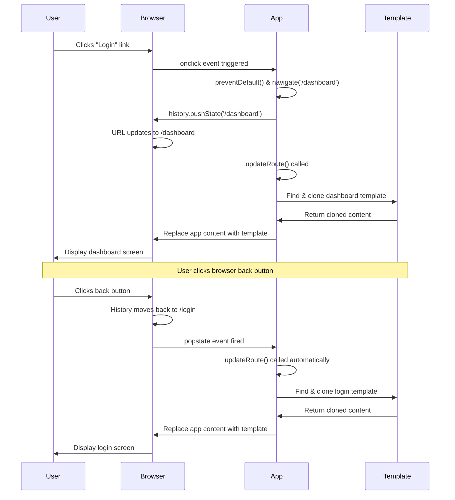

<!--
CO_OP_TRANSLATOR_METADATA:
{
  "original_hash": "5d259f6962464ad91e671083aa0398f4",
  "translation_date": "2025-10-22T17:58:36+00:00",
  "source_file": "7-bank-project/1-template-route/README.md",
  "language_code": "pa"
}
-->
# ਬੈਂਕਿੰਗ ਐਪ ਬਣਾਉਣਾ ਭਾਗ 1: HTML ਟੈਂਪਲੇਟ ਅਤੇ ਵੈੱਬ ਐਪ ਵਿੱਚ ਰੂਟਸ

ਜਦੋਂ 1969 ਵਿੱਚ Apollo 11 ਦਾ ਗਾਈਡੈਂਸ ਕੰਪਿਊਟਰ ਚੰਦਰਮਾ ਵੱਲ ਜਾ ਰਿਹਾ ਸੀ, ਤਾਂ ਇਸ ਨੂੰ ਸਾਰੇ ਸਿਸਟਮ ਨੂੰ ਰੀਸਟਾਰਟ ਕੀਤੇ ਬਿਨਾਂ ਵੱਖ-ਵੱਖ ਪ੍ਰੋਗਰਾਮਾਂ ਵਿੱਚ ਸਵਿੱਚ ਕਰਨਾ ਪਿਆ। ਆਧੁਨਿਕ ਵੈੱਬ ਐਪਲੀਕੇਸ਼ਨ ਵੀ ਇਸੇ ਤਰ੍ਹਾਂ ਕੰਮ ਕਰਦੇ ਹਨ - ਇਹ ਤੁਹਾਨੂੰ ਜੋ ਕੁਝ ਦਿਖਾਈ ਦੇ ਰਿਹਾ ਹੈ ਉਸ ਨੂੰ ਬਦਲਦੇ ਹਨ ਬਿਨਾਂ ਸਾਰਾ ਕੁਝ ਮੁੜ ਲੋਡ ਕੀਤੇ। ਇਹ ਉਹ ਸਹੀ ਅਤੇ ਜਵਾਬਦੇਹ ਅਨੁਭਵ ਪੈਦਾ ਕਰਦਾ ਹੈ ਜਿਸ ਦੀ ਉਪਭੋਗਤਾਵਾਂ ਨੂੰ ਅੱਜ ਉਮੀਦ ਹੈ।

ਪ੍ਰੰਪਰਾਗਤ ਵੈੱਬਸਾਈਟਾਂ ਦੇ ਉਲਟ, ਜੋ ਹਰ ਇੰਟਰੈਕਸ਼ਨ ਲਈ ਪੂਰੇ ਪੇਜ ਨੂੰ ਮੁੜ ਲੋਡ ਕਰਦੀਆਂ ਹਨ, ਆਧੁਨਿਕ ਵੈੱਬ ਐਪਸ ਸਿਰਫ ਉਹ ਹਿੱਸੇ ਅਪਡੇਟ ਕਰਦੀਆਂ ਹਨ ਜਿਨ੍ਹਾਂ ਨੂੰ ਬਦਲਣ ਦੀ ਲੋੜ ਹੈ। ਇਹ ਪਹੁੰਚ, ਜਿਵੇਂ ਕਿ ਮਿਸ਼ਨ ਕੰਟਰੋਲ ਵੱਖ-ਵੱਖ ਡਿਸਪਲੇਅਜ਼ ਵਿੱਚ ਸਵਿੱਚ ਕਰਦਾ ਹੈ ਜਦੋਂ ਕਿ ਲਗਾਤਾਰ ਸੰਚਾਰ ਬਣਾਈ ਰੱਖਦਾ ਹੈ, ਉਹ ਸਹੀ ਅਨੁਭਵ ਪੈਦਾ ਕਰਦਾ ਹੈ ਜਿਸ ਦੀ ਅਸੀਂ ਉਮੀਦ ਕਰਦੇ ਹਾਂ।

ਇਹ ਹੈ ਜੋ ਇਸ ਤਰ੍ਹਾਂ ਦੇ ਅਨੁਭਵ ਨੂੰ ਬਹੁਤ ਵੱਖਰਾ ਬਣਾਉਂਦਾ ਹੈ:

| ਪ੍ਰੰਪਰਾਗਤ ਮਲਟੀ-ਪੇਜ ਐਪਸ | ਆਧੁਨਿਕ ਸਿੰਗਲ-ਪੇਜ ਐਪਸ |
|----------------------------|-------------------------|
| **ਨੈਵੀਗੇਸ਼ਨ** | ਹਰ ਸਕ੍ਰੀਨ ਲਈ ਪੂਰਾ ਪੇਜ ਮੁੜ ਲੋਡ | ਤੁਰੰਤ ਸਮੱਗਰੀ ਸਵਿੱਚ |
| **ਪਰਫਾਰਮੈਂਸ** | ਪੂਰੇ HTML ਡਾਊਨਲੋਡ ਦੇ ਕਾਰਨ ਹੌਲੀ | ਹਿੱਸਾ ਅਪਡੇਟ ਨਾਲ ਤੇਜ਼ |
| **ਉਪਭੋਗਤਾ ਅਨੁਭਵ** | ਪੇਜ ਫਲੈਸ਼ | ਸਹੀ, ਐਪ-ਜਿਵੇਂ ਟ੍ਰਾਂਜ਼ੀਸ਼ਨ |
| **ਡਾਟਾ ਸ਼ੇਅਰਿੰਗ** | ਪੇਜਾਂ ਵਿੱਚ ਮੁਸ਼ਕਲ | ਸੌਖਾ ਸਟੇਟ ਮੈਨੇਜਮੈਂਟ |
| **ਡਿਵੈਲਪਮੈਂਟ** | ਕਈ HTML ਫਾਈਲਾਂ ਨੂੰ ਸੰਭਾਲਣਾ | ਇੱਕ HTML ਨਾਲ ਡਾਇਨਾਮਿਕ ਟੈਂਪਲੇਟ |

**ਵਿਕਾਸ ਦੀ ਸਮਝ:**
- **ਪ੍ਰੰਪਰਾਗਤ ਐਪਸ** ਹਰ ਨੈਵੀਗੇਸ਼ਨ ਕਾਰਵਾਈ ਲਈ ਸਰਵਰ ਰਿਕਵੈਸਟ ਦੀ ਲੋੜ ਹੁੰਦੀ ਹੈ
- **ਆਧੁਨਿਕ SPAs** ਇੱਕ ਵਾਰ ਲੋਡ ਹੁੰਦੇ ਹਨ ਅਤੇ ਸਮੱਗਰੀ ਨੂੰ ਡਾਇਨਾਮਿਕ ਤਰੀਕੇ ਨਾਲ ਜਾਵਾਸਕ੍ਰਿਪਟ ਦੀ ਵਰਤੋਂ ਕਰਕੇ ਅਪਡੇਟ ਕਰਦੇ ਹਨ
- **ਉਪਭੋਗਤਾ ਦੀ ਉਮੀਦਾਂ** ਹੁਣ ਤੁਰੰਤ, ਸਹੀ ਇੰਟਰੈਕਸ਼ਨ ਨੂੰ ਤਰਜੀਹ ਦਿੰਦੇ ਹਨ
- **ਪਰਫਾਰਮੈਂਸ ਫਾਇਦੇ** ਵਿੱਚ ਘੱਟ ਬੈਂਡਵਿਡਥ ਅਤੇ ਤੇਜ਼ ਜਵਾਬ ਸ਼ਾਮਲ ਹਨ

ਇਸ ਪਾਠ ਵਿੱਚ, ਅਸੀਂ ਇੱਕ ਬੈਂਕਿੰਗ ਐਪ ਬਣਾਉਣ ਜਾ ਰਹੇ ਹਾਂ ਜਿਸ ਵਿੱਚ ਕਈ ਸਕ੍ਰੀਨ ਹਨ ਜੋ ਸਹੀ ਤਰੀਕੇ ਨਾਲ ਇੱਕ ਦੂਜੇ ਨਾਲ ਜੁੜੇ ਹੋਏ ਹਨ। ਜਿਵੇਂ ਕਿ ਵਿਗਿਆਨੀ ਵੱਖ-ਵੱਖ ਪ੍ਰਯੋਗਾਂ ਲਈ ਮੁੜ-ਕੰਫਿਗਰ ਕੀਤੇ ਜਾ ਸਕਣ ਵਾਲੇ ਮੋਡਿਊਲਰ ਸੰਦਾਂ ਦੀ ਵਰਤੋਂ ਕਰਦੇ ਹਨ, ਅਸੀਂ HTML ਟੈਂਪਲੇਟਾਂ ਦੀ ਵਰਤੋਂ ਕਰਾਂਗੇ ਜੋ ਦੁਬਾਰਾ ਵਰਤਣਯੋਗ ਹਿੱਸੇ ਹਨ ਜਿਨ੍ਹਾਂ ਨੂੰ ਜਰੂਰਤ ਪੜਨ 'ਤੇ ਦਿਖਾਇਆ ਜਾ ਸਕਦਾ ਹੈ।

ਤੁਹਾਨੂੰ HTML ਟੈਂਪਲੇਟਾਂ (ਵੱਖ-ਵੱਖ ਸਕ੍ਰੀਨਾਂ ਲਈ ਦੁਬਾਰਾ ਵਰਤਣਯੋਗ ਬਲੂਪ੍ਰਿੰਟ), ਜਾਵਾਸਕ੍ਰਿਪਟ ਰੂਟਿੰਗ (ਸਿਸਟਮ ਜੋ ਸਕ੍ਰੀਨਾਂ ਵਿੱਚ ਸਵਿੱਚ ਕਰਦਾ ਹੈ), ਅਤੇ ਬ੍ਰਾਊਜ਼ਰ ਦੇ ਹਿਸਟਰੀ API (ਜੋ ਬੈਕ ਬਟਨ ਨੂੰ ਉਮੀਦ ਦੇ ਅਨੁਸਾਰ ਕੰਮ ਕਰਦਾ ਹੈ) ਨਾਲ ਕੰਮ ਕਰਨਾ ਪਵੇਗਾ। ਇਹ ਉਹੀ ਮੂਲ ਤਕਨੀਕਾਂ ਹਨ ਜੋ React, Vue, ਅਤੇ Angular ਵਰਗੇ ਫਰੇਮਵਰਕਾਂ ਦੁਆਰਾ ਵਰਤੀਆਂ ਜਾਂਦੀਆਂ ਹਨ।

ਅੰਤ ਵਿੱਚ, ਤੁਹਾਡੇ ਕੋਲ ਇੱਕ ਕੰਮ ਕਰਨ ਵਾਲਾ ਬੈਂਕਿੰਗ ਐਪ ਹੋਵੇਗਾ ਜੋ ਪੇਸ਼ੇਵਰ ਸਿੰਗਲ-ਪੇਜ ਐਪਲੀਕੇਸ਼ਨ ਦੇ ਸਿਧਾਂਤਾਂ ਨੂੰ ਦਰਸਾਉਂਦਾ ਹੈ।

## ਪਾਠ ਤੋਂ ਪਹਿਲਾਂ ਕਵਿਜ਼

[ਪਾਠ ਤੋਂ ਪਹਿਲਾਂ ਕਵਿਜ਼](https://ff-quizzes.netlify.app/web/quiz/41)

### ਤੁਹਾਨੂੰ ਕੀ ਚਾਹੀਦਾ ਹੈ

ਅਸੀਂ ਆਪਣੇ ਬੈਂਕਿੰਗ ਐਪ ਨੂੰ ਟੈਸਟ ਕਰਨ ਲਈ ਇੱਕ ਲੋਕਲ ਵੈੱਬ ਸਰਵਰ ਦੀ ਲੋੜ ਹੋਵੇਗੀ – ਚਿੰਤਾ ਨਾ ਕਰੋ, ਇਹ ਜ਼ਿਆਦਾ ਮੁਸ਼ਕਲ ਨਹੀਂ ਹੈ! ਜੇ ਤੁਹਾਡੇ ਕੋਲ ਪਹਿਲਾਂ ਤੋਂ ਇੱਕ ਸੈਟਅਪ ਨਹੀਂ ਹੈ, ਤਾਂ ਸਿਰਫ [Node.js](https://nodejs.org) ਇੰਸਟਾਲ ਕਰੋ ਅਤੇ ਆਪਣੇ ਪ੍ਰੋਜੈਕਟ ਫੋਲਡਰ ਤੋਂ `npx lite-server` ਚਲਾਓ। ਇਹ ਸਹੀ ਕਮਾਂਡ ਇੱਕ ਲੋਕਲ ਸਰਵਰ ਚਲਾਉਂਦੀ ਹੈ ਅਤੇ ਤੁਹਾਡਾ ਐਪ ਬ੍ਰਾਊਜ਼ਰ ਵਿੱਚ ਖੋਲ੍ਹਦੀ ਹੈ।

### ਤਿਆਰੀ

ਆਪਣੇ ਕੰਪਿਊਟਰ 'ਤੇ, `bank` ਨਾਮਕ ਇੱਕ ਫੋਲਡਰ ਬਣਾਓ ਜਿਸ ਵਿੱਚ `index.html` ਨਾਮਕ ਇੱਕ ਫਾਈਲ ਹੋਵੇ। ਅਸੀਂ ਇਸ HTML [ਬੋਇਲਰਪਲੇਟ](https://en.wikipedia.org/wiki/Boilerplate_code) ਤੋਂ ਸ਼ੁਰੂ ਕਰਾਂਗੇ:

```html
<!DOCTYPE html>
<html lang="en">
  <head>
    <meta charset="UTF-8">
    <meta name="viewport" content="width=device-width, initial-scale=1.0">
    <title>Bank App</title>
  </head>
  <body>
    <!-- This is where you'll work -->
  </body>
</html>
```

**ਇਹ ਬੋਇਲਰਪਲੇਟ ਕੀ ਪ੍ਰਦਾਨ ਕਰਦਾ ਹੈ:**
- **HTML5 ਦਸਤਾਵੇਜ਼ ਦੀ ਬਣਤਰ** ਨੂੰ ਸਹੀ DOCTYPE ਡਿਕਲੇਰੇਸ਼ਨ ਨਾਲ ਸਥਾਪਿਤ ਕਰਦਾ ਹੈ
- **ਅੰਤਰਰਾਸ਼ਟਰੀ ਟੈਕਸਟ ਸਹਾਇਤਾ ਲਈ** UTF-8 ਕੈਰੈਕਟਰ ਐਨਕੋਡਿੰਗ ਨੂੰ ਸੰਰਚਿਤ ਕਰਦਾ ਹੈ
- **ਮੋਬਾਈਲ ਅਨੁਕੂਲਤਾ ਲਈ** viewport ਮੈਟਾ ਟੈਗ ਨਾਲ ਜਵਾਬਦੇਹ ਡਿਜ਼ਾਈਨ ਨੂੰ ਯੋਗ ਬਣਾਉਂਦਾ ਹੈ
- **ਬ੍ਰਾਊਜ਼ਰ ਟੈਬ ਵਿੱਚ** ਇੱਕ ਵਰਣਨਾਤਮਕ ਸਿਰਲੇਖ ਸੈਟ ਕਰਦਾ ਹੈ
- **ਸਾਫ ਸਰੀਰ ਭਾਗ ਬਣਾਉਂਦਾ ਹੈ** ਜਿੱਥੇ ਅਸੀਂ ਆਪਣਾ ਐਪਲੀਕੇਸ਼ਨ ਬਣਾਉਣ ਜਾ ਰਹੇ ਹਾਂ

> 📁 **ਪ੍ਰੋਜੈਕਟ ਬਣਤਰ ਝਲਕ**
> 
> **ਇਸ ਪਾਠ ਦੇ ਅੰਤ ਵਿੱਚ, ਤੁਹਾਡਾ ਪ੍ਰੋਜੈਕਟ ਸ਼ਾਮਲ ਹੋਵੇਗਾ:**
> ```
> bank/
> ├── index.html      <!-- Main HTML with templates -->
> ├── app.js          <!-- Routing and navigation logic -->
> └── style.css       <!-- (Optional for future lessons) -->
> ```
> 
> **ਫਾਈਲ ਜ਼ਿੰਮੇਵਾਰੀਆਂ:**
> - **index.html**: ਸਾਰੇ ਟੈਂਪਲੇਟਾਂ ਨੂੰ ਸ਼ਾਮਲ ਕਰਦਾ ਹੈ ਅਤੇ ਐਪ ਬਣਤਰ ਪ੍ਰਦਾਨ ਕਰਦਾ ਹੈ
> - **app.js**: ਰੂਟਿੰਗ, ਨੈਵੀਗੇਸ਼ਨ, ਅਤੇ ਟੈਂਪਲੇਟ ਮੈਨੇਜਮੈਂਟ ਨੂੰ ਸੰਭਾਲਦਾ ਹੈ
> - **ਟੈਂਪਲੇਟ**: ਲੌਗਇਨ, ਡੈਸ਼ਬੋਰਡ, ਅਤੇ ਹੋਰ ਸਕ੍ਰੀਨਾਂ ਲਈ UI ਨੂੰ ਪਰਿਭਾਸ਼ਿਤ ਕਰਦਾ ਹੈ

---

## HTML ਟੈਂਪਲੇਟ

ਟੈਂਪਲੇਟ ਵੈੱਬ ਵਿਕਾਸ ਵਿੱਚ ਇੱਕ ਮੂਲ ਸਮੱਸਿਆ ਦਾ ਹੱਲ ਕਰਦੇ ਹਨ। ਜਦੋਂ ਗੁਟਨਬਰਗ ਨੇ 1440 ਦੇ ਦਹਾਕੇ ਵਿੱਚ ਮੂਵਏਬਲ ਟਾਈਪ ਪ੍ਰਿੰਟਿੰਗ ਦੀ ਖੋਜ ਕੀਤੀ, ਤਾਂ ਉਸ ਨੇ ਸਮਝਿਆ ਕਿ ਪੂਰੇ ਪੇਜਾਂ ਨੂੰ ਖੋਦਣ ਦੀ ਬਜਾਏ, ਉਹ ਦੁਬਾਰਾ ਵਰਤਣਯੋਗ ਅੱਖਰ ਬਲਾਕ ਬਣਾਉਣ ਅਤੇ ਜਰੂਰਤ ਅਨੁਸਾਰ ਉਨ੍ਹਾਂ ਨੂੰ ਸਜਾਉਣ ਕਰ ਸਕਦਾ ਹੈ। HTML ਟੈਂਪਲੇਟ ਇਸੇ ਸਿਧਾਂਤ 'ਤੇ ਕੰਮ ਕਰਦੇ ਹਨ - ਹਰ ਸਕ੍ਰੀਨ ਲਈ ਵੱਖ-ਵੱਖ HTML ਫਾਈਲਾਂ ਬਣਾਉਣ ਦੀ ਬਜਾਏ, ਤੁਸੀਂ ਦੁਬਾਰਾ ਵਰਤਣਯੋਗ ਬਣਤਰਾਂ ਨੂੰ ਪਰਿਭਾਸ਼ਿਤ ਕਰਦੇ ਹੋ ਜੋ ਜਰੂਰਤ ਪੈਣ 'ਤੇ ਦਿਖਾਈ ਜਾ ਸਕਦੀਆਂ ਹਨ।

ਟੈਂਪਲੇਟਾਂ ਨੂੰ ਆਪਣੇ ਐਪ ਦੇ ਵੱਖ-ਵੱਖ ਹਿੱਸਿਆਂ ਲਈ ਬਲੂਪ੍ਰਿੰਟ ਵਜੋਂ ਸੋਚੋ। ਜਿਵੇਂ ਕਿ ਇੱਕ ਆਰਕੀਟੈਕਟ ਇੱਕ ਬਲੂਪ੍ਰਿੰਟ ਬਣਾਉਂਦਾ ਹੈ ਅਤੇ ਇਸ ਨੂੰ ਕਈ ਵਾਰ ਵਰਤਦਾ ਹੈ ਬਜਾਏ ਇੱਕੋ ਜਿਹੇ ਕਮਰੇ ਦੁਬਾਰਾ ਖਿੱਚਣ ਦੇ, ਅਸੀਂ ਟੈਂਪਲੇਟ ਇੱਕ ਵਾਰ ਬਣਾਉਂਦੇ ਹਾਂ ਅਤੇ ਜਰੂਰਤ ਪੈਣ 'ਤੇ ਉਨ੍ਹਾਂ ਨੂੰ ਵਰਤਦੇ ਹਾਂ। ਬ੍ਰਾਊਜ਼ਰ ਇਹਨਾਂ ਟੈਂਪਲੇਟਾਂ ਨੂੰ ਲੁਕਾ ਕੇ ਰੱਖਦਾ ਹੈ ਜਦੋਂ ਤੱਕ ਜਾਵਾਸਕ੍ਰਿਪਟ ਉਨ੍ਹਾਂ ਨੂੰ ਐਕਟੀਵੇਟ ਨਹੀਂ ਕਰਦਾ।

ਜੇ ਤੁਸੀਂ ਵੈੱਬ ਪੇਜ ਲਈ ਕਈ ਸਕ੍ਰੀਨ ਬਣਾਉਣਾ ਚਾਹੁੰਦੇ ਹੋ, ਤਾਂ ਇੱਕ ਹੱਲ ਇਹ ਹੋਵੇਗਾ ਕਿ ਤੁਸੀਂ ਹਰ ਸਕ੍ਰੀਨ ਲਈ ਇੱਕ HTML ਫਾਈਲ ਬਣਾਓ ਜੋ ਤੁਸੀਂ ਦਿਖਾਉਣਾ ਚਾਹੁੰਦੇ ਹੋ। ਹਾਲਾਂਕਿ, ਇਸ ਹੱਲ ਨਾਲ ਕੁਝ ਅਸੁਵਿਧਾ ਆਉਂਦੀ ਹੈ:

- ਸਕ੍ਰੀਨ ਸਵਿੱਚ ਕਰਨ ਸਮੇਂ ਤੁਹਾਨੂੰ ਪੂਰੇ HTML ਨੂੰ ਮੁੜ ਲੋਡ ਕਰਨਾ ਪਵੇਗਾ, ਜੋ ਹੌਲੀ ਹੋ ਸਕਦੀ ਹੈ।
- ਵੱਖ-ਵੱਖ ਸਕ੍ਰੀਨਾਂ ਵਿੱਚ ਡਾਟਾ ਸਾਂਝਾ ਕਰਨਾ ਮੁਸ਼ਕਲ ਹੈ।

ਇੱਕ ਹੋਰ ਪਹੁੰਚ ਇਹ ਹੈ ਕਿ ਸਿਰਫ ਇੱਕ HTML ਫਾਈਲ ਹੋਵੇ, ਅਤੇ [HTML ਟੈਂਪਲੇਟ](https://developer.mozilla.org/docs/Web/HTML/Element/template) ਨੂੰ `<template>` ਐਲੀਮੈਂਟ ਦੀ ਵਰਤੋਂ ਕਰਕੇ ਪਰਿਭਾਸ਼ਿਤ ਕੀਤਾ ਜਾਵੇ। ਇੱਕ ਟੈਂਪਲੇਟ ਇੱਕ ਦੁਬਾਰਾ ਵਰਤਣਯੋਗ HTML ਬਲਾਕ ਹੈ ਜੋ ਬ੍ਰਾਊਜ਼ਰ ਦੁਆਰਾ ਦਿਖਾਇਆ ਨਹੀਂ ਜਾਂਦਾ, ਅਤੇ ਇਸਨੂੰ ਜਾਵਾਸਕ੍ਰਿਪਟ ਦੀ ਵਰਤੋਂ ਕਰਕੇ ਰਨਟਾਈਮ 'ਤੇ ਇੰਸਟੈਂਸ਼ੀਏਟ ਕਰਨ ਦੀ ਲੋੜ ਹੁੰਦੀ ਹੈ।

### ਆਓ ਇਸਨੂੰ ਬਣਾਈਏ

ਅਸੀਂ ਇੱਕ ਬੈਂਕ ਐਪ ਬਣਾਉਣ ਜਾ ਰਹੇ ਹਾਂ ਜਿਸ ਵਿੱਚ ਦੋ ਮੁੱਖ ਸਕ੍ਰੀਨ ਹਨ: ਇੱਕ ਲੌਗਇਨ ਪੇਜ ਅਤੇ ਇੱਕ ਡੈਸ਼ਬੋਰਡ। ਪਹਿਲਾਂ, ਆਓ ਆਪਣੇ HTML ਬਾਡੀ ਵਿੱਚ ਇੱਕ ਪਲੇਸਹੋਲਡਰ ਐਲੀਮੈਂਟ ਸ਼ਾਮਲ ਕਰੀਏ - ਇਹ ਉਹ ਜਗ੍ਹਾ ਹੈ ਜਿੱਥੇ ਸਾਡੇ ਵੱਖ-ਵੱਖ ਸਕ੍ਰੀਨ ਦਿਖਾਈ ਦੇਣਗੇ:

```html
<div id="app">Loading...</div>
```

**ਇਸ ਪਲੇਸਹੋਲਡਰ ਦੀ ਸਮਝ:**
- **ਇੱਕ ਕੰਟੇਨਰ ਬਣਾਉਂਦਾ ਹੈ** ਜਿਸਦਾ ID "app" ਹੈ ਜਿੱਥੇ ਸਾਰੇ ਸਕ੍ਰੀਨ ਦਿਖਾਈ ਦੇਣਗੇ
- **ਜਾਵਾਸਕ੍ਰਿਪਟ ਪਹਿਲੀ ਸਕ੍ਰੀਨ ਸ਼ੁਰੂ ਕਰਨ ਤੱਕ** ਇੱਕ ਲੋਡਿੰਗ ਸੁਨੇਹਾ ਦਿਖਾਉਂਦਾ ਹੈ
- **ਸਾਡੇ ਡਾਇਨਾਮਿਕ ਸਮੱਗਰੀ ਲਈ** ਇੱਕ ਸਿੰਗਲ ਮਾਊਂਟਿੰਗ ਪੌਇੰਟ ਪ੍ਰਦਾਨ ਕਰਦਾ ਹੈ
- **ਜਾਵਾਸਕ੍ਰਿਪਟ ਦੁਆਰਾ ਸੌਖਾ ਟਾਰਗੇਟਿੰਗ ਯੋਗ ਬਣਾਉਂਦਾ ਹੈ** `document.getElementById()` ਦੀ ਵਰਤੋਂ ਕਰਕੇ

> 💡 **ਪ੍ਰੋ ਟਿਪ**: ਕਿਉਂਕਿ ਇਸ ਐਲੀਮੈਂਟ ਦੀ ਸਮੱਗਰੀ ਬਦਲੀ ਜਾਵੇਗੀ, ਅਸੀਂ ਇਸ ਵਿੱਚ ਇੱਕ ਲੋਡਿੰਗ ਸੁਨੇਹਾ ਜਾਂ ਇੰਡੀਕੇਟਰ ਰੱਖ ਸਕਦੇ ਹਾਂ ਜੋ ਐਪ ਲੋਡ ਹੋਣ ਸਮੇਂ ਦਿਖਾਈ ਦੇਵੇਗਾ।

ਅਗਲੇ ਕਦਮ ਵਿੱਚ, ਆਓ ਲੌਗਇਨ ਪੇਜ ਲਈ HTML ਟੈਂਪਲੇਟ ਨੂੰ ਹੇਠਾਂ ਸ਼ਾਮਲ ਕਰੀਏ। ਇਸ ਵਿੱਚ ਅਜੇ ਲਈ ਸਿਰਫ ਇੱਕ ਸਿਰਲੇਖ ਅਤੇ ਇੱਕ ਸੈਕਸ਼ਨ ਸ਼ਾਮਲ ਕਰਾਂਗੇ ਜਿਸ ਵਿੱਚ ਇੱਕ ਲਿੰਕ ਹੋਵੇਗਾ ਜੋ ਅਸੀਂ ਨੈਵੀਗੇਸ਼ਨ ਕਰਨ ਲਈ ਵਰਤਾਂਗੇ।

```html
<template id="login">
  <h1>Bank App</h1>
  <section>
    <a href="/dashboard">Login</a>
  </section>
</template>
```

**ਇਸ ਲੌਗਇਨ ਟੈਂਪਲੇਟ ਦਾ ਵਿਸ਼ਲੇਸ਼ਣ:**
- **ਇੱਕ ਟੈਂਪਲੇਟ ਪਰਿਭਾਸ਼ਿਤ ਕਰਦਾ ਹੈ** ਜਿਸਦਾ ਵਿਲੱਖਣ ਪਛਾਣਕਰਤਾ "login" ਹੈ ਜਾਵਾਸਕ੍ਰਿਪਟ ਟਾਰਗੇਟਿੰਗ ਲਈ
- **ਇੱਕ ਮੁੱਖ ਸਿਰਲੇਖ ਸ਼ਾਮਲ ਕਰਦਾ ਹੈ** ਜੋ ਐਪ ਦੀ ਬ੍ਰਾਂਡਿੰਗ ਸਥਾਪਿਤ ਕਰਦਾ ਹੈ
- **ਇੱਕ ਸੈਮਾਂਟਿਕ `<section>` ਐਲੀਮੈਂਟ ਸ਼ਾਮਲ ਕਰਦਾ ਹੈ** ਜੋ ਸੰਬੰਧਿਤ ਸਮੱਗਰੀ ਨੂੰ ਸਮੂਹਿਤ ਕਰਦਾ ਹੈ
- **ਇੱਕ ਨੈਵੀਗੇਸ਼ਨ ਲਿੰਕ ਪ੍ਰਦਾਨ ਕਰਦਾ ਹੈ** ਜੋ ਉਪਭੋਗਤਾਵਾਂ ਨੂੰ ਡੈਸ਼ਬੋਰਡ ਵੱਲ ਰੂਟ ਕਰੇਗਾ

ਫਿਰ ਅਸੀਂ ਡੈਸ਼ਬੋਰਡ ਪੇਜ ਲਈ ਇੱਕ ਹੋਰ HTML ਟੈਂਪਲੇਟ ਸ਼ਾਮਲ ਕਰਾਂਗੇ। ਇਸ ਪੇਜ ਵਿੱਚ ਵੱਖ-ਵੱਖ ਸੈਕਸ਼ਨ ਹੋਣਗੇ:

- ਇੱਕ ਸਿਰਲੇਖ ਜਿਸ ਵਿੱਚ ਸਿਰਲੇਖ ਅਤੇ ਲੌਗਆਉਟ ਲਿੰਕ ਹੋਵੇਗਾ
- ਬੈਂਕ ਖਾਤੇ ਦਾ ਮੌਜੂਦਾ ਬੈਲੈਂਸ
- ਟ੍ਰਾਂਜ਼ੈਕਸ਼ਨਾਂ ਦੀ ਸੂਚੀ, ਜੋ ਇੱਕ ਟੇਬਲ ਵਿੱਚ ਦਿਖਾਈ ਜਾਵੇਗੀ

```html
<template id="dashboard">
  <header>
    <h1>Bank App</h1>
    <a href="/login">Logout</a>
  </header>
  <section>
    Balance: 100$
  </section>
  <section>
    <h2>Transactions</h2>
    <table>
      <thead>
        <tr>
          <th>Date</th>
          <th>Object</th>
          <th>Amount</th>
        </tr>
      </thead>
      <tbody></tbody>
    </table>
  </section>
</template>
```

**ਆਓ ਇਸ ਡੈਸ਼ਬੋਰਡ ਦੇ ਹਰ ਹਿੱਸੇ ਨੂੰ ਸਮਝੀਏ:**
- **ਸਕ੍ਰੀਨ ਨੂੰ ਸੈਮਾਂਟਿਕ `<header>` ਐਲੀਮੈਂਟ ਨਾਲ ਬਣਾਉਂਦਾ ਹੈ** ਜਿਸ ਵਿੱਚ ਨੈਵੀਗੇਸ਼ਨ ਸ਼ਾਮਲ ਹੈ
- **ਐਪ ਸਿਰਲੇਖ ਨੂੰ ਸਥਿਰ ਤਰੀਕੇ ਨਾਲ ਦਿਖਾਉਂਦਾ ਹੈ** ਸਕ੍ਰੀਨਾਂ ਵਿੱਚ ਬ੍ਰਾਂਡਿੰਗ ਲਈ
- **ਲੌਗਆਉਟ ਲਿੰਕ ਪ੍ਰਦਾਨ ਕਰਦਾ ਹੈ** ਜੋ ਲੌਗਇਨ ਸਕ੍ਰੀਨ ਵੱਲ ਰੂਟ ਕਰਦਾ ਹੈ
- **ਮੌਜੂਦਾ ਖਾਤੇ ਦਾ ਬੈਲੈਂਸ ਦਿਖਾਉਂਦਾ ਹੈ** ਇੱਕ ਸਮਰਪਿਤ ਸੈਕਸ਼ਨ ਵਿੱਚ
- **ਟ੍ਰਾਂਜ਼ੈਕਸ਼ਨ ਡਾਟਾ ਨੂੰ ਸੰਗਠਿਤ ਕਰਦਾ ਹੈ** ਇੱਕ ਸਹੀ ਤਰੀਕੇ ਨਾਲ ਬਣਾਈ ਗਈ HTML ਟੇਬਲ ਦੀ ਵਰਤੋਂ ਕਰਕੇ
- **ਟੇਬਲ ਹੈਡਰ ਪਰਿਭਾਸ਼ਿਤ ਕਰਦਾ ਹੈ** Date, Object, ਅਤੇ Amount ਕਾਲਮਾਂ ਲਈ
- **ਟੇਬਲ ਬਾਡੀ ਨੂੰ ਖਾਲੀ ਛੱਡਦਾ ਹੈ** ਡਾਇਨਾਮਿਕ ਸਮੱਗਰੀ ਇੰਜੈਕਸ਼ਨ ਲਈ

> 💡 **ਪ੍ਰੋ ਟਿਪ**: ਜਦੋਂ HTML ਟੈਂਪਲੇਟ ਬਣਾਉਂਦੇ ਹੋ, ਜੇ ਤੁਸੀਂ ਦੇਖਣਾ ਚਾਹੁੰਦੇ ਹੋ ਕਿ ਇਹ ਕਿਵੇਂ ਲੱਗੇਗਾ, ਤਾਂ ਤੁਸੀਂ `<template>` ਅਤੇ `</template>` ਲਾਈਨਾਂ ਨੂੰ `<!-- -->` ਨਾਲ ਕਮੈਂਟ ਕਰਕੇ ਲੁਕਾ ਸਕਦੇ ਹੋ।

✅ ਤੁਸੀਂ ਸੋਚਦੇ ਹੋ ਕਿ ਅਸੀਂ ਟੈਂਪਲੇਟਾਂ 'ਤੇ `id` ਐਟਰੀਬਿਊਟ ਦੀ ਵਰਤੋਂ ਕਿਉਂ ਕਰਦੇ ਹਾਂ? ਕੀ ਅਸੀਂ ਕੁਝ ਹੋਰ ਵਰਤ ਸਕਦੇ ਹਾਂ ਜਿਵੇਂ ਕਿ ਕਲਾਸਾਂ?

## ਜਾਵਾਸਕ੍ਰਿਪਟ ਨਾਲ ਟੈਂਪਲੇਟਾਂ ਨੂੰ ਜਿੰਦਗੀ ਦੇਣਾ

ਹੁਣ ਅਸੀਂ ਆਪਣੇ ਟੈਂਪਲੇਟਾਂ ਨੂੰ ਫੰਕਸ਼ਨਲ ਬਣਾਉਣ ਦੀ ਲੋੜ ਹੈ। ਜਿਵੇਂ ਕਿ ਇੱਕ 3D ਪ੍ਰਿੰਟਰ ਇੱਕ ਡਿਜ਼ੀਟਲ ਬਲੂਪ੍ਰਿੰਟ ਲੈਂਦਾ ਹੈ ਅਤੇ ਇੱਕ ਭੌਤਿਕ ਵਸਤੂ ਬਣਾਉਂਦਾ ਹੈ, ਜਾਵਾਸਕ੍ਰਿਪਟ ਸਾਡੇ ਲੁਕਾਏ ਟੈਂਪਲੇਟਾਂ ਨੂੰ ਲੈਂਦਾ ਹੈ ਅਤੇ ਦਿਖਾਈ ਦੇਣ ਵਾਲੇ, ਇੰਟਰੈਕਟਿਵ ਐਲੀਮੈਂਟ ਬਣਾਉਂਦਾ ਹੈ ਜੋ ਉਪਭੋਗਤਾ ਦੇਖ ਅਤੇ ਵਰਤ ਸਕਦੇ ਹਨ।

ਇਹ ਪ੍ਰਕਿਰਿਆ ਤਿੰਨ ਸਥਿਰ ਕਦਮਾਂ ਦੀ ਪਾਲਣਾ ਕਰਦੀ ਹੈ ਜੋ ਆਧੁਨਿਕ ਵੈੱਬ ਵਿਕਾਸ ਦੀ ਨੀਂਹ ਬਣਾਉਂਦੇ ਹਨ। ਜਦੋਂ ਤੁਸੀਂ ਇਸ ਪੈਟਰਨ ਨੂੰ ਸਮਝ ਲੈਂਦੇ ਹੋ, ਤਾਂ ਤੁਸੀਂ ਇਸਨੂੰ ਕਈ ਫਰੇਮਵਰਕਾਂ ਅਤੇ ਲਾਇਬ੍ਰੇਰੀਆਂ ਵਿੱਚ ਪਛਾਣ ਸਕਦੇ ਹੋ।

ਜੇ ਤੁਸੀਂ ਆਪਣੀ ਮੌਜੂਦਾ HTML ਫਾਈਲ ਨੂੰ
✅ ਜੇ ਤੁਸੀਂ URL ਵਿੱਚ ਅਣਜਾਣ ਪਾਥ ਦਰਜ ਕਰੋ ਤਾਂ ਕੀ ਹੁੰਦਾ ਹੈ? ਇਸ ਨੂੰ ਕਿਵੇਂ ਹੱਲ ਕੀਤਾ ਜਾ ਸਕਦਾ ਹੈ?

## ਨੈਵੀਗੇਸ਼ਨ ਸ਼ਾਮਲ ਕਰਨਾ

ਰੂਟਿੰਗ ਸਥਾਪਿਤ ਹੋਣ ਦੇ ਨਾਲ, ਉਪਭੋਗਤਾਵਾਂ ਨੂੰ ਐਪ ਵਿੱਚ ਨੈਵੀਗੇਟ ਕਰਨ ਦਾ ਇੱਕ ਤਰੀਕਾ ਚਾਹੀਦਾ ਹੈ। ਰਵਾਇਤੀ ਵੈਬਸਾਈਟਾਂ ਲਿੰਕਾਂ 'ਤੇ ਕਲਿਕ ਕਰਨ 'ਤੇ ਪੂਰੇ ਪੰਨੇ ਨੂੰ ਰੀਲੋਡ ਕਰਦੀਆਂ ਹਨ, ਪਰ ਅਸੀਂ URL ਅਤੇ ਸਮੱਗਰੀ ਨੂੰ ਪੰਨਾ ਰੀਫ੍ਰੈਸ਼ ਕੀਤੇ ਬਿਨਾਂ ਅਪਡੇਟ ਕਰਨਾ ਚਾਹੁੰਦੇ ਹਾਂ। ਇਹ ਇੱਕ ਹੌਲੀ ਅਨੁਭਵ ਪੈਦਾ ਕਰਦਾ ਹੈ, ਜਿਵੇਂ ਡੈਸਕਟਾਪ ਐਪਲੀਕੇਸ਼ਨ ਵੱਖ-ਵੱਖ ਦ੍ਰਿਸ਼ਾਂ ਵਿੱਚ ਸਵਿੱਚ ਕਰਦੀਆਂ ਹਨ।

ਸਾਨੂੰ ਦੋ ਚੀਜ਼ਾਂ ਨੂੰ ਸਹਿਮਤ ਕਰਨਾ ਪਵੇਗਾ: ਬ੍ਰਾਊਜ਼ਰ ਦੇ URL ਨੂੰ ਅਪਡੇਟ ਕਰਨਾ ਤਾਂ ਜੋ ਉਪਭੋਗਤਾ ਪੰਨਿਆਂ ਨੂੰ ਬੁੱਕਮਾਰਕ ਕਰ ਸਕਣ ਅਤੇ ਲਿੰਕਾਂ ਸਾਂਝੇ ਕਰ ਸਕਣ, ਅਤੇ ਸਹੀ ਸਮੱਗਰੀ ਦਿਖਾਉਣਾ। ਜੇ ਇਹ ਸਹੀ ਤਰੀਕੇ ਨਾਲ ਲਾਗੂ ਕੀਤਾ ਜਾਵੇ, ਤਾਂ ਇਹ ਆਧੁਨਿਕ ਐਪਲੀਕੇਸ਼ਨਾਂ ਤੋਂ ਉਪਭੋਗਤਾਵਾਂ ਦੀ ਉਮੀਦ ਵਾਲੀ ਨਿਰਵਿਘਨ ਨੈਵੀਗੇਸ਼ਨ ਪੈਦਾ ਕਰਦਾ ਹੈ।

> 🏗️ **ਆਰਕੀਟੈਕਚਰ ਅੰਦਰੂਨੀ ਜਾਣਕਾਰੀ**: ਨੈਵੀਗੇਸ਼ਨ ਸਿਸਟਮ ਦੇ ਹਿੱਸੇ
>
> **ਤੁਹਾਡਾ ਬਣਾਉਣਾ:**
> - **🔄 URL ਪ੍ਰਬੰਧਨ**: ਪੰਨਾ ਰੀਲੋਡ ਕੀਤੇ ਬਿਨਾਂ ਬ੍ਰਾਊਜ਼ਰ ਐਡਰੈੱਸ ਬਾਰ ਨੂੰ ਅਪਡੇਟ ਕਰਦਾ ਹੈ
> - **📋 ਟੈਂਪਲੇਟ ਸਿਸਟਮ**: ਮੌਜੂਦਾ ਰੂਟ ਦੇ ਅਧਾਰ 'ਤੇ ਸਮੱਗਰੀ ਨੂੰ ਗਤੀਸ਼ੀਲ ਤੌਰ 'ਤੇ ਬਦਲਦਾ ਹੈ  
> - **📚 ਹਿਸਟਰੀ ਇੰਟੀਗ੍ਰੇਸ਼ਨ**: ਬ੍ਰਾਊਜ਼ਰ ਦੇ ਬੈਕ/ਫਾਰਵਰਡ ਬਟਨ ਦੀ ਕਾਰਗੁਜ਼ਾਰੀ ਨੂੰ ਬਣਾਈ ਰੱਖਦਾ ਹੈ
> - **🛡️ ਗਲਤੀ ਸੰਭਾਲ**: ਗਲਤ ਜਾਂ ਗੁੰਮ ਪਾਥਾਂ ਲਈ ਸੁਗਮ ਫਾਲਬੈਕ
>
> **ਹਿੱਸੇ ਕਿਵੇਂ ਇਕੱਠੇ ਕੰਮ ਕਰਦੇ ਹਨ:**
> - **ਸੁਣਦਾ ਹੈ** ਨੈਵੀਗੇਸ਼ਨ ਇਵੈਂਟਾਂ (ਕਲਿਕ, ਹਿਸਟਰੀ ਬਦਲਾਅ)
> - **ਅਪਡੇਟ ਕਰਦਾ ਹੈ** URL ਨੂੰ ਹਿਸਟਰੀ API ਦੀ ਵਰਤੋਂ ਕਰਕੇ
> - **ਰੈਂਡਰ ਕਰਦਾ ਹੈ** ਨਵੇਂ ਰੂਟ ਲਈ ਸਹੀ ਟੈਂਪਲੇਟ
> - **ਬਣਾਈ ਰੱਖਦਾ ਹੈ** ਨਿਰਵਿਘਨ ਉਪਭੋਗਤਾ ਅਨੁਭਵ

ਸਾਡੇ ਐਪ ਲਈ ਅਗਲਾ ਕਦਮ ਇਹ ਹੈ ਕਿ ਪੰਨਿਆਂ ਵਿੱਚ ਨੈਵੀਗੇਟ ਕਰਨ ਦੀ ਸੰਭਾਵਨਾ ਸ਼ਾਮਲ ਕੀਤੀ ਜਾਵੇ ਬਿਨਾਂ URL ਨੂੰ ਹੱਥੋਂ ਬਦਲਣ ਦੀ ਲੋੜ। ਇਸਦਾ ਮਤਲਬ ਦੋ ਚੀਜ਼ਾਂ ਹਨ:

  1. ਮੌਜੂਦਾ URL ਨੂੰ ਅਪਡੇਟ ਕਰਨਾ
  2. ਨਵੇਂ URL ਦੇ ਅਧਾਰ 'ਤੇ ਦਿਖਾਈ ਗਈ ਟੈਂਪਲੇਟ ਨੂੰ ਅਪਡੇਟ ਕਰਨਾ

ਅਸੀਂ ਪਹਿਲਾਂ ਹੀ `updateRoute` ਫੰਕਸ਼ਨ ਨਾਲ ਦੂਜੇ ਹਿੱਸੇ ਦੀ ਸੰਭਾਲ ਕਰ ਚੁੱਕੇ ਹਾਂ, ਇਸ ਲਈ ਸਾਨੂੰ ਮੌਜੂਦਾ URL ਨੂੰ ਅਪਡੇਟ ਕਰਨ ਦਾ ਤਰੀਕਾ ਲੱਭਣਾ ਪਵੇਗਾ।

ਸਾਨੂੰ ਜਾਵਾਸਕ੍ਰਿਪਟ ਦੀ ਵਰਤੋਂ ਕਰਨੀ ਪਵੇਗੀ ਅਤੇ ਖਾਸ ਤੌਰ 'ਤੇ [`history.pushState`](https://developer.mozilla.org/docs/Web/API/History/pushState) ਦੀ ਵਰਤੋਂ ਕਰਨੀ ਪਵੇਗੀ ਜੋ HTML ਨੂੰ ਰੀਲੋਡ ਕੀਤੇ ਬਿਨਾਂ URL ਨੂੰ ਅਪਡੇਟ ਕਰਨ ਅਤੇ ਬ੍ਰਾਊਜ਼ਿੰਗ ਹਿਸਟਰੀ ਵਿੱਚ ਇੱਕ ਨਵਾਂ ਐਂਟਰੀ ਬਣਾਉਣ ਦੀ ਆਗਿਆ ਦਿੰਦਾ ਹੈ।

> ⚠️ **ਮਹੱਤਵਪੂਰਨ ਨੋਟ**: ਜਦੋਂ HTML ਐਂਕਰ ਐਲਿਮੈਂਟ [`<a href>`](https://developer.mozilla.org/docs/Web/HTML/Element/a) ਨੂੰ ਆਪਣੇ ਆਪ ਵਰਤਿਆ ਜਾ ਸਕਦਾ ਹੈ ਵੱਖ-ਵੱਖ URL ਲਈ ਹਾਈਪਰਲਿੰਕ ਬਣਾਉਣ ਲਈ, ਇਹ ਡਿਫਾਲਟ ਤੌਰ 'ਤੇ ਬ੍ਰਾਊਜ਼ਰ ਨੂੰ HTML ਨੂੰ ਰੀਲੋਡ ਕਰਨ ਲਈ ਮਜਬੂਰ ਕਰੇਗਾ। ਜਦੋਂ ਕਸਟਮ ਜਾਵਾਸਕ੍ਰਿਪਟ ਨਾਲ ਰੂਟਿੰਗ ਨੂੰ ਸੰਭਾਲਦੇ ਹੋ, ਇਸ ਵਿਹਾਰ ਨੂੰ ਰੋਕਣ ਲਈ, ਕਲਿਕ ਇਵੈਂਟ 'ਤੇ preventDefault() ਫੰਕਸ਼ਨ ਦੀ ਵਰਤੋਂ ਕਰਨੀ ਜ਼ਰੂਰੀ ਹੈ।

### ਟਾਸਕ

ਆਓ ਇੱਕ ਨਵਾਂ ਫੰਕਸ਼ਨ ਬਣਾਈਏ ਜਿਸਦੀ ਵਰਤੋਂ ਅਸੀਂ ਆਪਣੇ ਐਪ ਵਿੱਚ ਨੈਵੀਗੇਟ ਕਰਨ ਲਈ ਕਰ ਸਕਦੇ ਹਾਂ:

```js
function navigate(path) {
  window.history.pushState({}, path, path);
  updateRoute();
}
```

**ਇਸ ਨੈਵੀਗੇਸ਼ਨ ਫੰਕਸ਼ਨ ਨੂੰ ਸਮਝਣਾ:**
- **ਅਪਡੇਟ ਕਰਦਾ ਹੈ** ਬ੍ਰਾਊਜ਼ਰ ਦੇ URL ਨੂੰ `history.pushState` ਦੀ ਵਰਤੋਂ ਕਰਕੇ ਨਵੇਂ ਪਾਥ 'ਤੇ
- **ਸ਼ਾਮਲ ਕਰਦਾ ਹੈ** ਬ੍ਰਾਊਜ਼ਰ ਦੇ ਹਿਸਟਰੀ ਸਟੈਕ ਵਿੱਚ ਇੱਕ ਨਵਾਂ ਐਂਟਰੀ ਬੈਕ/ਫਾਰਵਰਡ ਬਟਨ ਦੇ ਸਹੀ ਸਮਰਥਨ ਲਈ
- **ਟ੍ਰਿਗਰ ਕਰਦਾ ਹੈ** `updateRoute()` ਫੰਕਸ਼ਨ ਨੂੰ ਸਬੰਧਤ ਟੈਂਪਲੇਟ ਦਿਖਾਉਣ ਲਈ
- **ਬਣਾਈ ਰੱਖਦਾ ਹੈ** ਸਿੰਗਲ-ਪੇਜ ਐਪ ਅਨੁਭਵ ਬਿਨਾਂ ਪੰਨਾ ਰੀਲੋਡ ਕੀਤੇ

ਇਹ ਵਿਧੀ ਪਹਿਲਾਂ ਦਿੱਤੇ ਪਾਥ ਦੇ ਅਧਾਰ 'ਤੇ ਮੌਜੂਦਾ URL ਨੂੰ ਅਪਡੇਟ ਕਰਦੀ ਹੈ, ਫਿਰ ਟੈਂਪਲੇਟ ਨੂੰ ਅਪਡੇਟ ਕਰਦੀ ਹੈ। ਗੁਣ `window.location.origin` URL ਰੂਟ ਨੂੰ ਵਾਪਸ ਕਰਦਾ ਹੈ, ਜੋ ਸਾਨੂੰ ਦਿੱਤੇ ਪਾਥ ਤੋਂ ਪੂਰਾ URL ਦੁਬਾਰਾ ਬਣਾਉਣ ਦੀ ਆਗਿਆ ਦਿੰਦਾ ਹੈ।

ਹੁਣ ਜਦੋਂ ਸਾਡੇ ਕੋਲ ਇਹ ਫੰਕਸ਼ਨ ਹੈ, ਅਸੀਂ ਉਸ ਸਮੱਸਿਆ ਦੀ ਸੰਭਾਲ ਕਰ ਸਕਦੇ ਹਾਂ ਜੇਕਰ ਕੋਈ ਪਾਥ ਕਿਸੇ ਵੀ ਪਰਿਭਾਸ਼ਿਤ ਰੂਟ ਨਾਲ ਮੇਲ ਨਹੀਂ ਖਾਂਦਾ। ਅਸੀਂ `updateRoute` ਫੰਕਸ਼ਨ ਨੂੰ ਸੋਧਾਂਗੇ ਅਤੇ ਇੱਕ ਮੌਜੂਦਾ ਰੂਟ 'ਤੇ ਫਾਲਬੈਕ ਸ਼ਾਮਲ ਕਰਾਂਗੇ ਜੇਕਰ ਅਸੀਂ ਮੇਲ ਨਹੀਂ ਲੱਭ ਸਕਦੇ।

```js
function updateRoute() {
  const path = window.location.pathname;
  const route = routes[path];

  if (!route) {
    return navigate('/login');
  }

  const template = document.getElementById(route.templateId);
  const view = template.content.cloneNode(true);
  const app = document.getElementById('app');
  app.innerHTML = '';
  app.appendChild(view);
}
```

**ਮਹੱਤਵਪੂਰਨ ਬਿੰਦੂ ਯਾਦ ਰੱਖੋ:**
- **ਚੈੱਕ ਕਰਦਾ ਹੈ** ਕਿ ਮੌਜੂਦਾ ਪਾਥ ਲਈ ਕੋਈ ਰੂਟ ਮੌਜੂਦ ਹੈ
- **ਰੀਡਾਇਰੈਕਟ ਕਰਦਾ ਹੈ** ਲੌਗਇਨ ਪੰਨੇ 'ਤੇ ਜਦੋਂ ਗਲਤ ਰੂਟ ਐਕਸੈਸ ਕੀਤਾ ਜਾਂਦਾ ਹੈ
- **ਫਾਲਬੈਕ ਮਕੈਨਿਜ਼ਮ ਪ੍ਰਦਾਨ ਕਰਦਾ ਹੈ** ਜੋ ਟੁੱਟੀ ਨੈਵੀਗੇਸ਼ਨ ਨੂੰ ਰੋਕਦਾ ਹੈ
- **ਸੁਨਿਸ਼ਚਿਤ ਕਰਦਾ ਹੈ** ਕਿ ਉਪਭੋਗਤਾ ਹਮੇਸ਼ਾ ਇੱਕ ਵੈਧ ਸਕ੍ਰੀਨ ਵੇਖਦੇ ਹਨ, ਭਾਵੇਂ URL ਗਲਤ ਹੋਵੇ

ਜੇਕਰ ਕੋਈ ਰੂਟ ਨਹੀਂ ਲੱਬਦਾ, ਤਾਂ ਅਸੀਂ ਹੁਣ `login` ਪੰਨੇ 'ਤੇ ਰੀਡਾਇਰੈਕਟ ਕਰਾਂਗੇ।

ਹੁਣ ਆਓ ਇੱਕ ਫੰਕਸ਼ਨ ਬਣਾਈਏ ਜੋ ਲਿੰਕ 'ਤੇ ਕਲਿਕ ਕਰਨ 'ਤੇ URL ਲੈਂਦਾ ਹੈ ਅਤੇ ਬ੍ਰਾਊਜ਼ਰ ਦੇ ਡਿਫਾਲਟ ਲਿੰਕ ਵਿਹਾਰ ਨੂੰ ਰੋਕਦਾ ਹੈ:

```js
function onLinkClick(event) {
  event.preventDefault();
  navigate(event.target.href);
}
```

**ਇਸ ਕਲਿਕ ਹੈਂਡਲਰ ਨੂੰ ਤੋੜਨਾ:**
- **ਰੋਕਦਾ ਹੈ** ਬ੍ਰਾਊਜ਼ਰ ਦੇ ਡਿਫਾਲਟ ਲਿੰਕ ਵਿਹਾਰ ਨੂੰ `preventDefault()` ਦੀ ਵਰਤੋਂ ਕਰਕੇ
- **ਨਿਕਾਲਦਾ ਹੈ** clicked ਲਿੰਕ ਐਲਿਮੈਂਟ ਤੋਂ ਮੰਜ਼ਿਲ URL
- **ਕਾਲ ਕਰਦਾ ਹੈ** ਸਾਡੇ ਕਸਟਮ navigate ਫੰਕਸ਼ਨ ਨੂੰ ਪੰਨਾ ਰੀਲੋਡ ਕਰਨ ਦੀ ਬਜਾਏ
- **ਬਣਾਈ ਰੱਖਦਾ ਹੈ** ਹੌਲੀ ਸਿੰਗਲ-ਪੇਜ ਐਪਲੀਕੇਸ਼ਨ ਅਨੁਭਵ

```html
<a href="/dashboard" onclick="onLinkClick(event)">Login</a>
...
<a href="/login" onclick="onLinkClick(event)">Logout</a>
```

**ਇਹ onclick ਬਾਈਡਿੰਗ ਕੀ ਪ੍ਰਾਪਤ ਕਰਦੀ ਹੈ:**
- **ਜੋੜਦੀ ਹੈ** ਹਰ ਲਿੰਕ ਨੂੰ ਸਾਡੇ ਕਸਟਮ ਨੈਵੀਗੇਸ਼ਨ ਸਿਸਟਮ ਨਾਲ
- **ਪਾਸ ਕਰਦੀ ਹੈ** ਕਲਿਕ ਇਵੈਂਟ ਨੂੰ ਸਾਡੇ `onLinkClick` ਫੰਕਸ਼ਨ ਲਈ ਪ੍ਰੋਸੈਸਿੰਗ ਲਈ
- **ਸਮਰਥਨ ਕਰਦੀ ਹੈ** ਹੌਲੀ ਨੈਵੀਗੇਸ਼ਨ ਬਿਨਾਂ ਪੰਨਾ ਰੀਲੋਡ ਕੀਤੇ
- **ਸਹੀ URL ਸਟ੍ਰਕਚਰ ਬਣਾਈ ਰੱਖਦੀ ਹੈ** ਜਿਸਨੂੰ ਉਪਭੋਗਤਾ ਬੁੱਕਮਾਰਕ ਜਾਂ ਸਾਂਝਾ ਕਰ ਸਕਦੇ ਹਨ

[`onclick`](https://developer.mozilla.org/docs/Web/API/GlobalEventHandlers/onclick) ਐਟ੍ਰਿਬਿਊਟ `click` ਇਵੈਂਟ ਨੂੰ ਜਾਵਾਸਕ੍ਰਿਪਟ ਕੋਡ ਨਾਲ ਬਾਈਡ ਕਰਦਾ ਹੈ, ਇੱਥੇ `navigate()` ਫੰਕਸ਼ਨ ਨੂੰ ਕਾਲ ਕਰਨ ਲਈ।

ਇਨ੍ਹਾਂ ਲਿੰਕਾਂ 'ਤੇ ਕਲਿਕ ਕਰਨ ਦੀ ਕੋਸ਼ਿਸ਼ ਕਰੋ, ਹੁਣ ਤੁਹਾਨੂੰ ਆਪਣੇ ਐਪ ਦੇ ਵੱਖ-ਵੱਖ ਸਕ੍ਰੀਨ ਵਿੱਚ ਨੈਵੀਗੇਟ ਕਰਨ ਦੇ ਯੋਗ ਹੋਣਾ ਚਾਹੀਦਾ ਹੈ।

✅ `history.pushState` ਵਿਧੀ HTML5 ਮਿਆਰ ਦਾ ਹਿੱਸਾ ਹੈ ਅਤੇ [ਸਾਰੇ ਆਧੁਨਿਕ ਬ੍ਰਾਊਜ਼ਰਾਂ](https://caniuse.com/?search=pushState) ਵਿੱਚ ਲਾਗੂ ਕੀਤੀ ਗਈ ਹੈ। ਜੇਕਰ ਤੁਸੀਂ ਪੁਰਾਣੇ ਬ੍ਰਾਊਜ਼ਰਾਂ ਲਈ ਵੈਬ ਐਪ ਬਣਾਉਂਦੇ ਹੋ, ਤਾਂ ਇਸ API ਦੇ ਸਥਾਨ 'ਤੇ ਵਰਤਣ ਲਈ ਇੱਕ ਚਾਲ ਹੈ: ਪਾਥ ਤੋਂ ਪਹਿਲਾਂ [ਹੈਸ਼ (`#`)](https://en.wikipedia.org/wiki/URI_fragment) ਦੀ ਵਰਤੋਂ ਕਰਕੇ ਤੁਸੀਂ ਰੂਟਿੰਗ ਲਾਗੂ ਕਰ ਸਕਦੇ ਹੋ ਜੋ ਰਵਾਇਤੀ ਐਂਕਰ ਨੈਵੀਗੇਸ਼ਨ ਨਾਲ ਕੰਮ ਕਰਦੀ ਹੈ ਅਤੇ ਪੰਨਾ ਰੀਲੋਡ ਨਹੀਂ ਕਰਦੀ।

## ਬੈਕ ਅਤੇ ਫਾਰਵਰਡ ਬਟਨ ਕੰਮ ਕਰਨ ਲਈ ਬਣਾਉਣਾ

ਬੈਕ ਅਤੇ ਫਾਰਵਰਡ ਬਟਨ ਵੈਬ ਬ੍ਰਾਊਜ਼ਿੰਗ ਲਈ ਮੂਲਭੂਤ ਹਨ, ਜਿਵੇਂ ਕਿ NASA ਮਿਸ਼ਨ ਕੰਟਰੋਲਰ ਪਿਛਲੇ ਸਿਸਟਮ ਸਟੇਟਸ ਦੀ ਸਮੀਖਿਆ ਕਰ ਸਕਦੇ ਹਨ। ਉਪਭੋਗਤਾ ਉਮੀਦ ਕਰਦੇ ਹਨ ਕਿ ਇਹ ਬਟਨ ਕੰਮ ਕਰਨਗੇ, ਅਤੇ ਜਦੋਂ ਇਹ ਨਹੀਂ ਕਰਦੇ, ਤਾਂ ਇਹ ਉਮੀਦ ਕੀਤੇ ਬ੍ਰਾਊਜ਼ਿੰਗ ਅਨੁਭਵ ਨੂੰ ਤੋੜ ਦਿੰਦਾ ਹੈ।

ਸਾਡੇ ਸਿੰਗਲ-ਪੇਜ ਐਪ ਨੂੰ ਇਸਨੂੰ ਸਮਰਥਨ ਦੇਣ ਲਈ ਵਾਧੂ ਸੰਰਚਨਾ ਦੀ ਲੋੜ ਹੈ। ਬ੍ਰਾਊਜ਼ਰ ਇੱਕ ਹਿਸਟਰੀ ਸਟੈਕ ਨੂੰ ਬਣਾਈ ਰੱਖਦਾ ਹੈ (ਜਿਸਨੂੰ ਅਸੀਂ `history.pushState` ਨਾਲ ਸ਼ਾਮਲ ਕਰ ਰਹੇ ਹਾਂ), ਪਰ ਜਦੋਂ ਉਪਭੋਗਤਾ ਇਸ ਹਿਸਟਰੀ ਵਿੱਚ ਨੈਵੀਗੇਟ ਕਰਦੇ ਹਨ, ਤਾਂ ਸਾਡੇ ਐਪ ਨੂੰ ਸਹੀ ਸਮੱਗਰੀ ਨੂੰ ਅਨੁਸਾਰ ਅਪਡੇਟ ਕਰਨਾ ਪਵੇਗਾ।



**ਮੁੱਖ ਇੰਟਰੈਕਸ਼ਨ ਬਿੰਦੂ:**
- **ਉਪਭੋਗਤਾ ਕਾਰਵਾਈਆਂ** ਕਲਿਕ ਜਾਂ ਬ੍ਰਾਊਜ਼ਰ ਬਟਨਾਂ ਦੁਆਰਾ ਨੈਵੀਗੇਸ਼ਨ ਨੂੰ ਟ੍ਰਿਗਰ ਕਰਦੀਆਂ ਹਨ
- **ਐਪ ਰੋਕਦਾ ਹੈ** ਲਿੰਕ ਕਲਿਕਾਂ ਨੂੰ ਪੰਨਾ ਰੀਲੋਡ ਕਰਨ ਤੋਂ
- **ਹਿਸਟਰੀ API** URL ਬਦਲਾਅ ਅਤੇ ਬ੍ਰਾਊਜ਼ਰ ਹਿਸਟਰੀ ਸਟੈਕ ਨੂੰ ਪ੍ਰਬੰਧਿਤ ਕਰਦਾ ਹੈ
- **ਟੈਂਪਲੇਟ** ਹਰ ਸਕ੍ਰੀਨ ਲਈ ਸਮੱਗਰੀ ਦੀ ਬਣਤਰ ਪ੍ਰਦਾਨ ਕਰਦੇ ਹਨ
- **ਇਵੈਂਟ ਸੁਣਨ ਵਾਲੇ** ਇਹ ਯਕੀਨੀ ਬਣਾਉਂਦੇ ਹਨ ਕਿ ਐਪ ਸਾਰੇ ਨੈਵੀਗੇਸ਼ਨ ਕਿਸਮਾਂ ਦਾ ਜਵਾਬ ਦਿੰਦਾ ਹੈ

`history.pushState` ਬ੍ਰਾਊਜ਼ਰ ਦੇ ਨੈਵੀਗੇਸ਼ਨ ਹਿਸਟਰੀ ਵਿੱਚ ਨਵੇਂ ਐਂਟਰੀ ਬਣਾਉਂਦਾ ਹੈ। ਤੁਸੀਂ ਇਸਨੂੰ ਆਪਣੇ ਬ੍ਰਾਊਜ਼ਰ ਦੇ *ਬੈਕ ਬਟਨ* ਨੂੰ ਦਬਾ ਕੇ ਚੈੱਕ ਕਰ ਸਕਦੇ ਹੋ, ਇਹ ਕੁਝ ਇਸ ਤਰ੍ਹਾਂ ਦਿਖਾਈ ਦੇਵੇਗਾ:


ਜੇਕਰ ਤੁਸੀਂ ਕੁਝ ਵਾਰ ਬੈਕ ਬਟਨ 'ਤੇ ਕਲਿਕ ਕਰਨ ਦੀ ਕੋਸ਼ਿਸ਼ ਕਰੋ, ਤਾਂ ਤੁਸੀਂ ਵੇਖੋਗੇ ਕਿ ਮੌਜੂਦਾ URL ਬਦਲਦਾ ਹੈ ਅਤੇ ਹਿਸਟਰੀ ਅਪਡੇਟ ਹੁੰਦੀ ਹੈ, ਪਰ ਉਹੀ ਟੈਂਪਲੇਟ ਦਿਖਾਈ ਦਿੰਦਾ ਹੈ।

ਇਸਦਾ ਕਾਰਨ ਇਹ ਹੈ ਕਿ ਐਪ ਨੂੰ ਪਤਾ ਨਹੀਂ ਕਿ ਸਾਨੂੰ ਹਰ ਵਾਰ ਹਿਸਟਰੀ ਬਦਲਣ 'ਤੇ `updateRoute()` ਨੂੰ ਕਾਲ ਕਰਨ ਦੀ ਲੋੜ ਹੈ। ਜੇਕਰ ਤੁਸੀਂ [`history.pushState`](https://developer.mozilla.org/docs/Web/API/History/pushState) ਦਸਤਾਵੇਜ਼ ਨੂੰ ਵੇਖੋ, ਤਾਂ ਤੁਸੀਂ ਵੇਖ ਸਕਦੇ ਹੋ ਕਿ ਜੇਕਰ ਸਟੇਟ ਬਦਲਦਾ ਹੈ - ਜਿਸਦਾ ਮਤਲਬ ਹੈ ਕਿ ਅਸੀਂ ਵੱਖ-ਵੱਖ URL 'ਤੇ ਚਲੇ ਗਏ - ਤਾਂ [`popstate`](https://developer.mozilla.org/docs/Web/API/Window/popstate_event) ਇਵੈਂਟ ਟ੍ਰਿਗਰ ਹੁੰਦਾ ਹੈ। ਅਸੀਂ ਇਸ ਸਮੱਸਿਆ ਨੂੰ ਹੱਲ ਕਰਨ ਲਈ ਇਸਦੀ ਵਰਤੋਂ ਕਰਾਂਗੇ।

### ਟਾਸਕ

ਇਹ ਯਕੀਨੀ ਬਣਾਉਣ ਲਈ ਕਿ ਬ੍ਰਾਊਜ਼ਰ ਹਿਸਟਰੀ ਬਦਲਣ 'ਤੇ ਦਿਖਾਈ ਗਈ ਟੈਂਪਲੇਟ ਅਪਡੇਟ ਹੁੰਦੀ ਹੈ, ਅਸੀਂ ਇੱਕ ਨਵਾਂ ਫੰਕਸ਼ਨ ਜੋੜਾਂਗੇ ਜੋ `updateRoute()` ਨੂੰ ਕਾਲ ਕਰਦਾ ਹੈ। ਅਸੀਂ ਇਹ ਆਪਣੇ `app.js` ਫਾਈਲ ਦੇ ਤਲ 'ਤੇ ਕਰਾਂਗੇ:

```js
window.onpopstate = () => updateRoute();
updateRoute();
```

**ਇਸ ਹਿਸਟਰੀ ਇੰਟੀਗ੍ਰੇਸ਼ਨ ਨੂੰ ਸਮਝਣਾ:**
- **ਸੁਣਦਾ ਹੈ** `popstate` ਇਵੈਂਟਾਂ ਲਈ ਜੋ ਬ੍ਰਾਊਜ਼ਰ ਬਟਨਾਂ ਨਾਲ ਉਪਭੋਗਤਾ ਨੈਵੀਗੇਸ਼ਨ ਕਰਨ 'ਤੇ ਹੁੰਦੇ ਹਨ
- **ਵਰਤਦਾ ਹੈ** ਸੰਖੇਪ ਇਵੈਂਟ ਹੈਂਡਲਰ ਸਿੰਟੈਕਸ ਲਈ ਐਰੋ ਫੰਕਸ਼ਨ
- **ਆਪਮਾਤਰ ਕਾਲ ਕਰਦਾ ਹੈ** `updateRoute()` ਜਦੋਂ ਵੀ ਹਿਸਟਰੀ ਸਟੇਟ ਬਦਲਦਾ ਹੈ
- **ਐਪ ਨੂੰ ਸ਼ੁਰੂ ਕਰਦਾ ਹੈ** `updateRoute()` ਨੂੰ ਕਾਲ ਕਰਕੇ ਜਦੋਂ ਪੰਨਾ ਪਹਿਲੀ ਵਾਰ ਲੋਡ ਹੁੰਦਾ ਹੈ
- **ਸੁਨਿਸ਼ਚਿਤ ਕਰਦਾ ਹੈ** ਕਿ ਉਪਭੋਗਤਾ ਕਿਸੇ ਵੀ ਤਰੀਕੇ ਨਾਲ ਨੈਵੀਗੇਟ ਕਰਨ ਦੇ ਬਾਵਜੂਦ ਸਹੀ ਟੈਂਪਲੇਟ ਵੇਖਦੇ ਹਨ

> 💡 **ਪ੍ਰੋ ਟਿਪ**: ਅਸੀਂ ਇੱਥੇ ਆਪਣੇ `popstate` ਇਵੈਂਟ ਹੈਂਡਲਰ ਨੂੰ ਘੁੰਮਣ ਲਈ [ਐਰੋ ਫੰਕਸ਼ਨ](https://developer.mozilla.org/docs/Web/JavaScript/Reference/Functions/Arrow_functions) ਦੀ ਵਰਤੋਂ ਕੀਤੀ, ਪਰ ਇੱਕ ਰਵਾਇਤੀ ਫੰਕਸ਼ਨ ਵੀ ਉਹੀ ਕੰਮ ਕਰੇਗਾ।

ਇੱਥੇ ਐਰੋ ਫੰਕਸ਼ਨ 'ਤੇ ਇੱਕ ਰਿਫਰੈਸ਼ਰ ਵੀਡੀਓ ਹੈ:

[](https://youtube.com/watch?v=OP6eEbOj2sc "ਐਰੋ ਫੰਕਸ਼ਨ")

> 🎥 ਉੱਪਰ ਦਿੱਤੀ ਤਸਵੀਰ 'ਤੇ ਕਲਿਕ ਕਰੋ ਐਰੋ ਫੰਕਸ਼ਨ ਬਾਰੇ ਵੀਡੀਓ ਲਈ।

ਹੁਣ ਆਪਣੇ ਬ੍ਰਾਊਜ਼ਰ ਦੇ ਬੈਕ ਅਤੇ ਫਾਰਵਰਡ ਬਟਨ ਦੀ ਵਰਤੋਂ ਕਰਨ ਦੀ ਕੋਸ਼ਿਸ਼ ਕਰੋ, ਅਤੇ ਚੈੱਕ ਕਰੋ ਕਿ ਦਿਖਾਈ ਗਈ ਰੂਟ ਇਸ ਵਾਰ ਸਹੀ ਤਰੀਕੇ ਨਾਲ ਅਪਡੇਟ ਹੁੰਦੀ ਹੈ।

---

## GitHub Copilot Agent Challenge 🚀

Agent ਮੋਡ ਦੀ ਵਰਤੋਂ ਕਰਕੇ ਹੇਠਾਂ ਦਿੱਤੇ ਚੈਲੈਂਜ ਨੂੰ ਪੂਰਾ ਕਰੋ:

**ਵੇਰਵਾ:** ਬੈਂਕਿੰਗ ਐਪ ਨੂੰ ਗਲ

---

**ਅਸਵੀਕਰਤੀ**:  
ਇਹ ਦਸਤਾਵੇਜ਼ AI ਅਨੁਵਾਦ ਸੇਵਾ [Co-op Translator](https://github.com/Azure/co-op-translator) ਦੀ ਵਰਤੋਂ ਕਰਕੇ ਅਨੁਵਾਦ ਕੀਤਾ ਗਿਆ ਹੈ। ਜਦੋਂ ਕਿ ਅਸੀਂ ਸਹੀ ਹੋਣ ਦਾ ਯਤਨ ਕਰਦੇ ਹਾਂ, ਕਿਰਪਾ ਕਰਕੇ ਧਿਆਨ ਦਿਓ ਕਿ ਸਵੈਚਾਲਿਤ ਅਨੁਵਾਦਾਂ ਵਿੱਚ ਗਲਤੀਆਂ ਜਾਂ ਅਸੁੱਤੀਆਂ ਹੋ ਸਕਦੀਆਂ ਹਨ। ਮੂਲ ਦਸਤਾਵੇਜ਼ ਨੂੰ ਇਸਦੀ ਮੂਲ ਭਾਸ਼ਾ ਵਿੱਚ ਅਧਿਕਾਰਤ ਸਰੋਤ ਮੰਨਿਆ ਜਾਣਾ ਚਾਹੀਦਾ ਹੈ। ਮਹੱਤਵਪੂਰਨ ਜਾਣਕਾਰੀ ਲਈ, ਪੇਸ਼ੇਵਰ ਮਨੁੱਖੀ ਅਨੁਵਾਦ ਦੀ ਸਿਫਾਰਸ਼ ਕੀਤੀ ਜਾਂਦੀ ਹੈ। ਅਸੀਂ ਇਸ ਅਨੁਵਾਦ ਦੀ ਵਰਤੋਂ ਤੋਂ ਪੈਦਾ ਹੋਣ ਵਾਲੇ ਕਿਸੇ ਵੀ ਗਲਤਫਹਿਮੀ ਜਾਂ ਗਲਤ ਵਿਆਖਿਆ ਲਈ ਜ਼ਿੰਮੇਵਾਰ ਨਹੀਂ ਹਾਂ।