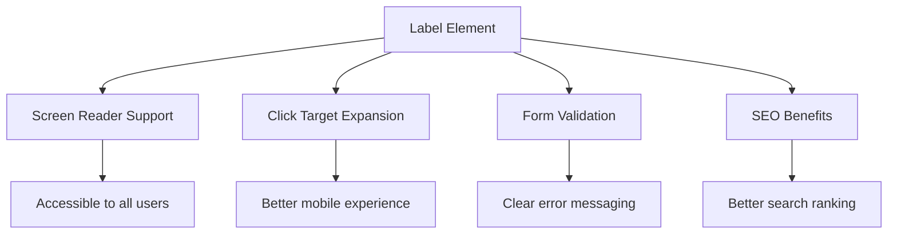
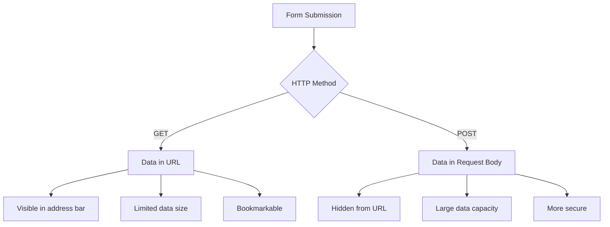
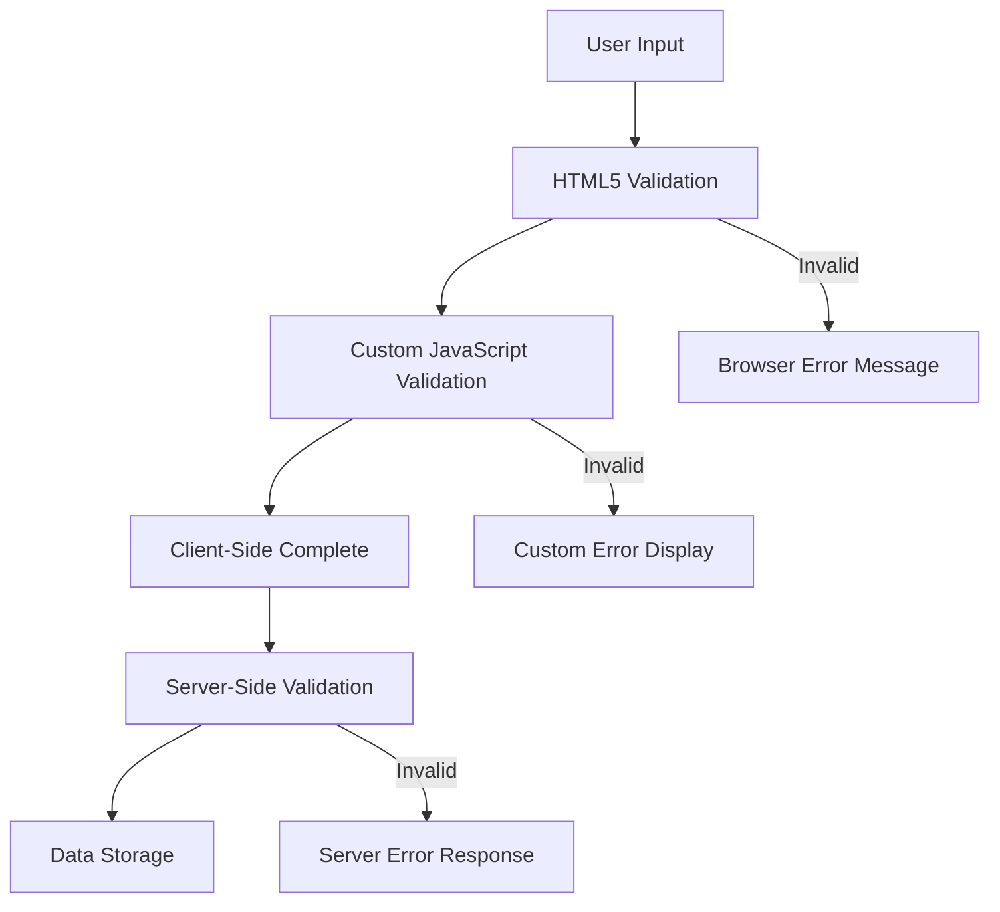
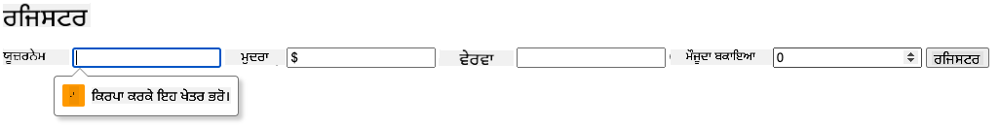
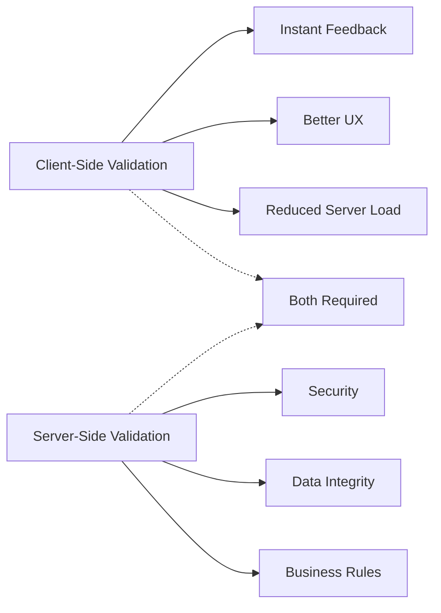

<!--
CO_OP_TRANSLATOR_METADATA:
{
  "original_hash": "b24f28fc46dd473aa9080f174182adde",
  "translation_date": "2025-10-22T18:01:06+00:00",
  "source_file": "7-bank-project/2-forms/README.md",
  "language_code": "pa"
}
-->
# ਬੈਂਕਿੰਗ ਐਪ ਬਣਾਓ ਭਾਗ 2: ਲੌਗਇਨ ਅਤੇ ਰਜਿਸਟ੍ਰੇਸ਼ਨ ਫਾਰਮ ਬਣਾਓ

## ਪੂਰਵ-ਵਿਆਖਿਆ ਪ੍ਰਸ਼ਨਾਵਲੀ

[ਪੂਰਵ-ਵਿਆਖਿਆ ਪ੍ਰਸ਼ਨਾਵਲੀ](https://ff-quizzes.netlify.app/web/quiz/43)

ਕੀ ਤੁਸੀਂ ਕਦੇ ਆਨਲਾਈਨ ਫਾਰਮ ਭਰਿਆ ਹੈ ਅਤੇ ਤੁਹਾਡੇ ਈਮੇਲ ਫਾਰਮੈਟ ਨੂੰ ਰੱਦ ਕਰ ਦਿੱਤਾ ਗਿਆ? ਜਾਂ ਸਾਰਾ ਡਾਟਾ ਗੁਆ ਲਿਆ ਜਦੋਂ ਤੁਸੀਂ ਸਬਮਿਟ ਦਬਾਇਆ? ਅਸੀਂ ਸਾਰੇ ਇਹਨਾਂ ਨਿਰਾਸ਼ਾਜਨਕ ਤਜਰਬਿਆਂ ਦਾ ਸਾਹਮਣਾ ਕੀਤਾ ਹੈ।

ਫਾਰਮ ਤੁਹਾਡੇ ਯੂਜ਼ਰ ਅਤੇ ਤੁਹਾਡੇ ਐਪਲੀਕੇਸ਼ਨ ਦੀ ਕਾਰਗੁਜ਼ਾਰੀ ਦੇ ਵਿਚਕਾਰ ਪੁਲ ਹਨ। ਜਿਵੇਂ ਹਵਾਈ ਟ੍ਰੈਫਿਕ ਕੰਟਰੋਲਰਜ਼ ਸੁਰੱਖਿਅਤ ਤਰੀਕੇ ਨਾਲ ਜਹਾਜ਼ਾਂ ਨੂੰ ਉਨ੍ਹਾਂ ਦੇ ਮੰਜ਼ਿਲਾਂ ਤੱਕ ਪਹੁੰਚਾਉਣ ਲਈ ਧਿਆਨਪੂਰਵਕ ਪ੍ਰੋਟੋਕੋਲ ਦੀ ਵਰਤੋਂ ਕਰਦੇ ਹਨ, ਚੰਗੀ ਤਰ੍ਹਾਂ ਡਿਜ਼ਾਈਨ ਕੀਤੇ ਫਾਰਮ ਸਪਸ਼ਟ ਫੀਡਬੈਕ ਦਿੰਦੇ ਹਨ ਅਤੇ ਮਹਿੰਗੇ ਗਲਤੀਆਂ ਨੂੰ ਰੋਕਦੇ ਹਨ। ਦੂਜੇ ਪਾਸੇ, ਖਰਾਬ ਫਾਰਮ ਯੂਜ਼ਰ ਨੂੰ ਜਲਦੀ ਦੂਰ ਕਰ ਸਕਦੇ ਹਨ।

ਇਸ ਪਾਠ ਵਿੱਚ, ਅਸੀਂ ਤੁਹਾਡੇ ਸਥਿਰ ਬੈਂਕਿੰਗ ਐਪ ਨੂੰ ਇੰਟਰਐਕਟਿਵ ਐਪਲੀਕੇਸ਼ਨ ਵਿੱਚ ਬਦਲਾਂਗੇ। ਤੁਸੀਂ ਸਿੱਖੋਗੇ ਕਿ ਯੂਜ਼ਰ ਇਨਪੁੱਟ ਦੀ ਵੈਧਤਾ ਦੀ ਜਾਂਚ ਕਰਨ ਵਾਲੇ, ਸਰਵਰਾਂ ਨਾਲ ਸੰਚਾਰ ਕਰਨ ਵਾਲੇ ਅਤੇ ਮਦਦਗਾਰ ਫੀਡਬੈਕ ਪ੍ਰਦਾਨ ਕਰਨ ਵਾਲੇ ਫਾਰਮ ਕਿਵੇਂ ਬਣਾਉਣੇ ਹਨ। ਇਸਨੂੰ ਤੁਹਾਡੇ ਐਪਲੀਕੇਸ਼ਨ ਦੀਆਂ ਵਿਸ਼ੇਸ਼ਤਾਵਾਂ ਨੂੰ ਨੈਵੀਗੇਟ ਕਰਨ ਦੇ ਲਈ ਕੰਟਰੋਲ ਇੰਟਰਫੇਸ ਬਣਾਉਣ ਵਾਂਗ ਸਮਝੋ।

ਅੰਤ ਵਿੱਚ, ਤੁਹਾਡੇ ਕੋਲ ਇੱਕ ਪੂਰਾ ਲੌਗਇਨ ਅਤੇ ਰਜਿਸਟ੍ਰੇਸ਼ਨ ਸਿਸਟਮ ਹੋਵੇਗਾ ਜਿਸ ਵਿੱਚ ਵੈਧਤਾ ਹੋਵੇਗੀ ਜੋ ਯੂਜ਼ਰਾਂ ਨੂੰ ਨਿਰਾਸ਼ਾ ਦੀ ਬਜਾਏ ਸਫਲਤਾ ਵੱਲ ਦਿਸ਼ਾ ਦਿੰਦਾ ਹੈ।

## ਪੂਰਵ ਸ਼ਰਤਾਂ

ਫਾਰਮ ਬਣਾਉਣ ਤੋਂ ਪਹਿਲਾਂ, ਆਓ ਇਹ ਯਕੀਨੀ ਬਣਾਈਏ ਕਿ ਤੁਹਾਡਾ ਸੈਟਅੱਪ ਸਹੀ ਹੈ। ਇਹ ਪਾਠ ਪਿਛਲੇ ਪਾਠ ਤੋਂ ਸਿੱਧਾ ਜੁੜਦਾ ਹੈ, ਇਸ ਲਈ ਜੇ ਤੁਸੀਂ ਅੱਗੇ ਵਧ ਗਏ ਹੋ, ਤਾਂ ਤੁਸੀਂ ਪਹਿਲਾਂ ਮੁੱਢਲੀ ਚੀਜ਼ਾਂ ਨੂੰ ਸਹੀ ਤਰੀਕੇ ਨਾਲ ਸੈਟ ਕਰਨ ਲਈ ਵਾਪਸ ਜਾ ਸਕਦੇ ਹੋ।

### ਲੋੜੀਂਦਾ ਸੈਟਅੱਪ

| ਕੰਪੋਨੈਂਟ | ਸਥਿਤੀ | ਵੇਰਵਾ |
|-----------|--------|-------------|
| [HTML ਟੈਂਪਲੇਟ](../1-template-route/README.md) | ✅ ਲੋੜੀਂਦਾ | ਤੁਹਾਡੇ ਬੈਂਕਿੰਗ ਐਪ ਦੀ ਮੁੱਢਲੀ ਬਣਤਰ |
| [Node.js](https://nodejs.org) | ✅ ਲੋੜੀਂਦਾ | ਸਰਵਰ ਲਈ ਜਾਵਾਸਕ੍ਰਿਪਟ ਰਨਟਾਈਮ |
| [ਬੈਂਕ API ਸਰਵਰ](../api/README.md) | ✅ ਲੋੜੀਂਦਾ | ਡਾਟਾ ਸਟੋਰੇਜ ਲਈ ਬੈਕਐਂਡ ਸੇਵਾ |

> 💡 **ਡਿਵੈਲਪਮੈਂਟ ਟਿਪ**: ਤੁਸੀਂ ਇੱਕ ਸਮੇਂ ਦੋ ਵੱਖ-ਵੱਖ ਸਰਵਰ ਚਲਾਉਂਦੇ ਹੋ – ਇੱਕ ਤੁਹਾਡੇ ਫਰੰਟ-ਐਂਡ ਬੈਂਕਿੰਗ ਐਪ ਲਈ ਅਤੇ ਦੂਜਾ ਬੈਕਐਂਡ API ਲਈ। ਇਹ ਸੈਟਅੱਪ ਅਸਲ ਦੁਨੀਆ ਦੇ ਵਿਕਾਸ ਨੂੰ ਦਰਸਾਉਂਦਾ ਹੈ ਜਿੱਥੇ ਫਰੰਟਐਂਡ ਅਤੇ ਬੈਕਐਂਡ ਸੇਵਾਵਾਂ ਵੱਖ-ਵੱਖ ਤਰੀਕੇ ਨਾਲ ਕੰਮ ਕਰਦੀਆਂ ਹਨ।

### ਸਰਵਰ ਸੰਰਚਨਾ

**ਤੁਹਾਡਾ ਵਿਕਾਸ ਵਾਤਾਵਰਣ ਸ਼ਾਮਲ ਕਰੇਗਾ:**
- **ਫਰੰਟਐਂਡ ਸਰਵਰ**: ਤੁਹਾਡੇ ਬੈਂਕਿੰਗ ਐਪ ਨੂੰ ਸੇਵਾ ਦਿੰਦਾ ਹੈ (ਆਮ ਤੌਰ 'ਤੇ ਪੋਰਟ `3000`)
- **ਬੈਕਐਂਡ API ਸਰਵਰ**: ਡਾਟਾ ਸਟੋਰੇਜ ਅਤੇ ਰੀਟਰੀਵਲ ਨੂੰ ਸੰਭਾਲਦਾ ਹੈ (ਪੋਰਟ `5000`)
- **ਦੋਵੇਂ ਸਰਵਰ** ਬਿਨਾਂ ਕਿਸੇ ਟਕਰਾਅ ਦੇ ਇੱਕ ਸਮੇਂ ਚਲ ਸਕਦੇ ਹਨ

**ਤੁਹਾਡੇ API ਕਨੈਕਸ਼ਨ ਦੀ ਜਾਂਚ:**
```bash
curl http://localhost:5000/api
# Expected response: "Bank API v1.0.0"
```

**ਜੇ ਤੁਸੀਂ API ਵਰਜਨ ਦਾ ਜਵਾਬ ਵੇਖਦੇ ਹੋ, ਤਾਂ ਤੁਸੀਂ ਅੱਗੇ ਵਧਣ ਲਈ ਤਿਆਰ ਹੋ!**

---

## HTML ਫਾਰਮ ਅਤੇ ਕੰਟਰੋਲ ਨੂੰ ਸਮਝਣਾ

HTML ਫਾਰਮ ਤੁਹਾਡੇ ਵੈੱਬ ਐਪਲੀਕੇਸ਼ਨ ਨਾਲ ਯੂਜ਼ਰਾਂ ਦੇ ਸੰਚਾਰ ਦਾ ਸਾਧਨ ਹਨ। ਇਹਨਾਂ ਨੂੰ 19ਵੀਂ ਸਦੀ ਦੇ ਦੂਰ-ਦੂਰ ਦੇ ਸਥਾਨਾਂ ਨੂੰ ਜੋੜਨ ਵਾਲੇ ਟੈਲੀਗ੍ਰਾਫ ਸਿਸਟਮ ਵਾਂਗ ਸੋਚੋ – ਇਹ ਯੂਜ਼ਰ ਦੇ ਇਰਾਦੇ ਅਤੇ ਐਪਲੀਕੇਸ਼ਨ ਦੇ ਜਵਾਬ ਦੇ ਵਿਚਕਾਰ ਸੰਚਾਰ ਪ੍ਰੋਟੋਕੋਲ ਹਨ। ਜਦੋਂ ਧਿਆਨਪੂਰਵਕ ਡਿਜ਼ਾਈਨ ਕੀਤਾ ਜਾਂਦਾ ਹੈ, ਇਹ ਗਲਤੀਆਂ ਨੂੰ ਫੜਦੇ ਹਨ, ਇਨਪੁੱਟ ਫਾਰਮੈਟਿੰਗ ਨੂੰ ਗਾਈਡ ਕਰਦੇ ਹਨ ਅਤੇ ਮਦਦਗਾਰ ਸੁਝਾਅ ਪ੍ਰਦਾਨ ਕਰਦੇ ਹਨ।

ਆਧੁਨਿਕ ਫਾਰਮ ਬੁਨਿਆਦੀ ਟੈਕਸਟ ਇਨਪੁੱਟ ਤੋਂ ਕਾਫੀ ਜ਼ਿਆਦਾ ਸੁਧਾਰਸ਼ੀਲ ਹਨ। HTML5 ਨੇ ਵਿਸ਼ੇਸ਼ ਇਨਪੁੱਟ ਕਿਸਮਾਂ ਦੀ ਪੇਸ਼ਕਸ਼ ਕੀਤੀ ਜੋ ਈਮੇਲ ਵੈਧਤਾ, ਨੰਬਰ ਫਾਰਮੈਟਿੰਗ ਅਤੇ ਮਿਤੀ ਚੋਣ ਨੂੰ ਆਪਣੇ ਆਪ ਸੰਭਾਲਦੇ ਹਨ। ਇਹ ਸੁਧਾਰ ਪਹੁੰਚਯੋਗਤਾ ਅਤੇ ਮੋਬਾਈਲ ਯੂਜ਼ਰ ਅਨੁਭਵਾਂ ਦੋਵਾਂ ਲਈ ਲਾਭਦਾਇਕ ਹਨ।

### ਲੋੜੀਂਦੇ ਫਾਰਮ ਤੱਤ

**ਹਰ ਫਾਰਮ ਨੂੰ ਲੋੜੀਂਦੇ ਬਲਾਕ:**

```html
<!-- Basic form structure -->
<form id="userForm" method="POST">
  <label for="username">Username</label>
  <input id="username" name="username" type="text" required>
  
  <button type="submit">Submit</button>
</form>
```

**ਇਹ ਕੋਡ ਕੀ ਕਰਦਾ ਹੈ:**
- **ਇੱਕ ਫਾਰਮ ਕੰਟੇਨਰ ਬਣਾਉਂਦਾ ਹੈ** ਜਿਸ ਵਿੱਚ ਇੱਕ ਵਿਲੱਖਣ ਪਛਾਣਕਰਤਾ ਹੁੰਦਾ ਹੈ
- **ਡਾਟਾ ਸਬਮਿਸ਼ਨ ਲਈ HTTP ਵਿਧੀ ਨਿਰਧਾਰਤ ਕਰਦਾ ਹੈ**
- **ਪਹੁੰਚਯੋਗਤਾ ਲਈ ਲੇਬਲਾਂ ਨੂੰ ਇਨਪੁੱਟ ਨਾਲ ਜੋੜਦਾ ਹੈ**
- **ਫਾਰਮ ਨੂੰ ਪ੍ਰਕਿਰਿਆ ਕਰਨ ਲਈ ਸਬਮਿਟ ਬਟਨ ਨੂੰ ਪਰਿਭਾਸ਼ਿਤ ਕਰਦਾ ਹੈ**

### ਆਧੁਨਿਕ ਇਨਪੁੱਟ ਕਿਸਮਾਂ ਅਤੇ ਗੁਣ

| ਇਨਪੁੱਟ ਕਿਸਮ | ਉਦੇਸ਼ | ਉਦਾਹਰਨ ਵਰਤੋਂ |
|------------|---------|---------------|
| `text` | ਆਮ ਟੈਕਸਟ ਇਨਪੁੱਟ | `<input type="text" name="username">` |
| `email` | ਈਮੇਲ ਵੈਧਤਾ | `<input type="email" name="email">` |
| `password` | ਲੁਕਿਆ ਹੋਇਆ ਟੈਕਸਟ ਇਨਟਰੀ | `<input type="password" name="password">` |
| `number` | ਸੰਖਿਆਵਾਂ ਦਾ ਇਨਪੁੱਟ | `<input type="number" name="balance" min="0">` |
| `tel` | ਫੋਨ ਨੰਬਰ | `<input type="tel" name="phone">` |

> 💡 **ਆਧੁਨਿਕ HTML5 ਫਾਇਦਾ**: ਵਿਸ਼ੇਸ਼ ਇਨਪੁੱਟ ਕਿਸਮਾਂ ਦੀ ਵਰਤੋਂ ਨਾਲ ਆਪਣੇ ਆਪ ਵੈਧਤਾ, ਉਚਿਤ ਮੋਬਾਈਲ ਕੀਬੋਰਡ ਅਤੇ ਬਿਹਤਰ ਪਹੁੰਚਯੋਗਤਾ ਸਹਾਇਤਾ ਪ੍ਰਦਾਨ ਹੁੰਦੀ ਹੈ ਬਿਨਾਂ ਵਾਧੂ ਜਾਵਾਸਕ੍ਰਿਪਟ ਦੇ!

### ਬਟਨ ਕਿਸਮਾਂ ਅਤੇ ਵਿਹਾਰ

```html
<!-- Different button behaviors -->
<button type="submit">Save Data</button>     <!-- Submits the form -->
<button type="reset">Clear Form</button>    <!-- Resets all fields -->
<button type="button">Custom Action</button> <!-- No default behavior -->
```

**ਹਰ ਬਟਨ ਕਿਸਮ ਕੀ ਕਰਦੀ ਹੈ:**
- **ਸਬਮਿਟ ਬਟਨ**: ਫਾਰਮ ਸਬਮਿਸ਼ਨ ਨੂੰ ਸ਼ੁਰੂ ਕਰਦੇ ਹਨ ਅਤੇ ਡਾਟਾ ਨੂੰ ਨਿਰਧਾਰਤ ਐਂਡਪੌਇੰਟ ਤੇ ਭੇਜਦੇ ਹਨ
- **ਰੀਸੈਟ ਬਟਨ**: ਸਾਰੇ ਫਾਰਮ ਫੀਲਡਾਂ ਨੂੰ ਉਨ੍ਹਾਂ ਦੀ ਸ਼ੁਰੂਆਤੀ ਸਥਿਤੀ ਵਿੱਚ ਮੁੜ ਸਥਾਪਿਤ ਕਰਦੇ ਹਨ
- **ਨਿਯਮਤ ਬਟਨ**: ਕੋਈ ਡਿਫਾਲਟ ਵਿਹਾਰ ਪ੍ਰਦਾਨ ਨਹੀਂ ਕਰਦੇ, ਜਿਨ੍ਹਾਂ ਨੂੰ ਕਾਰਗੁਜ਼ਾਰੀ ਲਈ ਕਸਟਮ ਜਾਵਾਸਕ੍ਰਿਪਟ ਦੀ ਲੋੜ ਹੁੰਦੀ ਹੈ

> ⚠️ **ਮਹੱਤਵਪੂਰਨ ਨੋਟ**: `<input>` ਤੱਤ ਸਵੈ-ਬੰਦ ਹੈ ਅਤੇ ਬੰਦ ਕਰਨ ਵਾਲੇ ਟੈਗ ਦੀ ਲੋੜ ਨਹੀਂ ਹੁੰਦੀ। ਆਧੁਨਿਕ ਸ੍ਰੇਸ਼ਠ ਅਭਿਆਸ `<input>` ਨੂੰ ਬਿਨਾਂ ਸਲੈਸ਼ ਦੇ ਲਿਖਣਾ ਹੈ।

### ਤੁਹਾਡਾ ਲੌਗਇਨ ਫਾਰਮ ਬਣਾਉਣਾ

ਹੁਣ ਆਓ ਇੱਕ ਵਿਹਾਰਕ ਲੌਗਇਨ ਫਾਰਮ ਬਣਾਈਏ ਜੋ ਆਧੁਨਿਕ HTML ਫਾਰਮ ਅਭਿਆਸਾਂ ਨੂੰ ਦਰਸਾਉਂਦਾ ਹੈ। ਅਸੀਂ ਇੱਕ ਬੁਨਿਆਦੀ ਬਣਤਰ ਨਾਲ ਸ਼ੁਰੂ ਕਰਾਂਗੇ ਅਤੇ ਪਹੁੰਚਯੋਗਤਾ ਵਿਸ਼ੇਸ਼ਤਾਵਾਂ ਅਤੇ ਵੈਧਤਾ ਨਾਲ ਇਸਨੂੰ ਬਹੁਤਰੀਨ ਬਣਾਉਂਦੇ ਜਾਵਾਂਗੇ।

```html
<template id="login">
  <h1>Bank App</h1>
  <section>
    <h2>Login</h2>
    <form id="loginForm" novalidate>
      <div class="form-group">
        <label for="username">Username</label>
        <input id="username" name="user" type="text" required 
               autocomplete="username" placeholder="Enter your username">
      </div>
      <button type="submit">Login</button>
    </form>
  </section>
</template>
```

**ਇੱਥੇ ਕੀ ਹੁੰਦਾ ਹੈ:**
- **ਸੈਮੈਂਟਿਕ HTML5 ਤੱਤਾਂ ਨਾਲ ਫਾਰਮ ਬਣਾਉਂਦਾ ਹੈ**
- **ਸੰਬੰਧਿਤ ਤੱਤਾਂ ਨੂੰ `div` ਕੰਟੇਨਰਾਂ ਵਿੱਚ ਸਮੂਹਬੱਧ ਕਰਦਾ ਹੈ**
- **ਲੇਬਲਾਂ ਨੂੰ `for` ਅਤੇ `id` ਗੁਣਾਂ ਦੀ ਵਰਤੋਂ ਕਰਕੇ ਇਨਪੁੱਟ ਨਾਲ ਜੋੜਦਾ ਹੈ**
- **ਬਿਹਤਰ UX ਲਈ `autocomplete` ਅਤੇ `placeholder` ਵਰਗੇ ਆਧੁਨਿਕ ਗੁਣ ਸ਼ਾਮਲ ਕਰਦਾ ਹੈ**
- **ਵੈਧਤਾ ਨੂੰ ਸੰਭਾਲਣ ਲਈ `novalidate` ਸ਼ਾਮਲ ਕਰਦਾ ਹੈ**

### ਸਹੀ ਲੇਬਲਾਂ ਦੀ ਤਾਕਤ

**ਆਧੁਨਿਕ ਵੈੱਬ ਵਿਕਾਸ ਲਈ ਲੇਬਲ ਕਿਉਂ ਮਹੱਤਵਪੂਰਨ ਹਨ:**



**ਸਹੀ ਲੇਬਲ ਕੀ ਪ੍ਰਾਪਤ ਕਰਦੇ ਹਨ:**
- **ਸਕ੍ਰੀਨ ਰੀਡਰਜ਼ ਨੂੰ ਫਾਰਮ ਫੀਲਡਾਂ ਨੂੰ ਸਪਸ਼ਟ ਤੌਰ 'ਤੇ ਐਲਾਨ ਕਰਨ ਦੇ ਯੋਗ ਬਣਾਉਂਦੇ ਹਨ**
- **ਕਲਿੱਕ ਕਰਨ ਵਾਲੇ ਖੇਤਰ ਨੂੰ ਵਧਾਉਂਦੇ ਹਨ (ਲੇਬਲ 'ਤੇ ਕਲਿੱਕ ਕਰਨ ਨਾਲ ਇਨਪੁੱਟ ਫੋਕਸ ਹੁੰਦਾ ਹੈ)**
- **ਵੱਡੇ ਟਚ ਟਾਰਗਟਾਂ ਨਾਲ ਮੋਬਾਈਲ ਯੂਜ਼ਬਿਲਟੀ ਵਿੱਚ ਸੁਧਾਰ ਕਰਦੇ ਹਨ**
- **ਅਰਥਪੂਰਨ ਗਲਤੀ ਦੇ ਸੁਨੇਹੇ ਦੇ ਨਾਲ ਫਾਰਮ ਵੈਧਤਾ ਦਾ ਸਮਰਥਨ ਕਰਦੇ ਹਨ**
- **ਫਾਰਮ ਤੱਤਾਂ ਨੂੰ ਸੈਮੈਂਟਿਕ ਅਰਥ ਪ੍ਰਦਾਨ ਕਰਕੇ SEO ਵਿੱਚ ਸੁਧਾਰ ਕਰਦੇ ਹਨ**

> 🎯 **ਪਹੁੰਚਯੋਗਤਾ ਦਾ ਲਕਸ਼**: ਹਰ ਫਾਰਮ ਇਨਪੁੱਟ ਦਾ ਇੱਕ ਸੰਬੰਧਿਤ ਲੇਬਲ ਹੋਣਾ ਚਾਹੀਦਾ ਹੈ। ਇਹ ਸਧਾਰਨ ਅਭਿਆਸ ਤੁਹਾਡੇ ਫਾਰਮਾਂ ਨੂੰ ਹਰ ਕਿਸੇ ਲਈ ਵਰਤਣਯੋਗ ਬਣਾਉਂਦਾ ਹੈ, ਜਿਸ ਵਿੱਚ ਅਪੰਗਤਾ ਵਾਲੇ ਯੂਜ਼ਰ ਸ਼ਾਮਲ ਹਨ, ਅਤੇ ਸਾਰੇ ਯੂਜ਼ਰਾਂ ਲਈ ਅਨੁਭਵ ਵਿੱਚ ਸੁਧਾਰ ਕਰਦਾ ਹੈ।

### ਰਜਿਸਟ੍ਰੇਸ਼ਨ ਫਾਰਮ ਬਣਾਉਣਾ

ਰਜਿਸਟ੍ਰੇਸ਼ਨ ਫਾਰਮ ਨੂੰ ਪੂਰੇ ਯੂਜ਼ਰ ਖਾਤੇ ਨੂੰ ਬਣਾਉਣ ਲਈ ਹੋਰ ਵਿਸਤ੍ਰਿਤ ਜਾਣਕਾਰੀ ਦੀ ਲੋੜ ਹੁੰਦੀ ਹੈ। ਆਓ ਇਸਨੂੰ ਆਧੁਨਿਕ HTML5 ਵਿਸ਼ੇਸ਼ਤਾਵਾਂ ਅਤੇ ਵਧੀਕ ਪਹੁੰਚਯੋਗਤਾ ਨਾਲ ਬਣਾਈਏ।

```html
<hr/>
<h2>Register</h2>
<form id="registerForm" novalidate>
  <div class="form-group">
    <label for="user">Username</label>
    <input id="user" name="user" type="text" required 
           autocomplete="username" placeholder="Choose a username">
  </div>
  
  <div class="form-group">
    <label for="currency">Currency</label>
    <input id="currency" name="currency" type="text" value="$" 
           required maxlength="3" placeholder="USD, EUR, etc.">
  </div>
  
  <div class="form-group">
    <label for="description">Account Description</label>
    <input id="description" name="description" type="text" 
           maxlength="100" placeholder="Personal savings, checking, etc.">
  </div>
  
  <div class="form-group">
    <label for="balance">Starting Balance</label>
    <input id="balance" name="balance" type="number" value="0" 
           min="0" step="0.01" placeholder="0.00">
  </div>
  
  <button type="submit">Create Account</button>
</form>
```

**ਉਪਰੋਕਤ ਵਿੱਚ, ਅਸੀਂ:**
- **ਹਰ ਫੀਲਡ ਨੂੰ ਬਿਹਤਰ ਸਟਾਈਲਿੰਗ ਅਤੇ ਲੇਆਉਟ ਲਈ ਕੰਟੇਨਰ div ਵਿੱਚ ਸੰਗਠਿਤ ਕੀਤਾ**
- **ਬ੍ਰਾਊਜ਼ਰ ਆਟੋਫਿਲ ਸਹਾਇਤਾ ਲਈ ਉਚਿਤ `autocomplete` ਗੁਣ ਸ਼ਾਮਲ ਕੀਤੇ**
- **ਯੂਜ਼ਰ ਇਨਪੁੱਟ ਨੂੰ ਗਾਈਡ ਕਰਨ ਲਈ ਮਦਦਗਾਰ ਪਲੇਸਹੋਲਡਰ ਟੈਕਸਟ ਸ਼ਾਮਲ ਕੀਤਾ**
- **`value` ਗੁਣ ਦੀ ਵਰਤੋਂ ਕਰਕੇ ਸਮਝਦਾਰ ਡਿਫਾਲਟ ਸੈਟ ਕੀਤੇ**
- **ਵੈਧਤਾ ਗੁਣਾਂ ਜਿਵੇਂ `required`, `maxlength`, ਅਤੇ `min` ਲਾਗੂ ਕੀਤੇ**
- **ਡੈਸੀਮਲ ਸਹਾਇਤਾ ਨਾਲ ਬੈਲੈਂਸ ਫੀਲਡ ਲਈ `type="number"` ਦੀ ਵਰਤੋਂ ਕੀਤੀ**

### ਇਨਪੁੱਟ ਕਿਸਮਾਂ ਅਤੇ ਵਿਹਾਰ ਦੀ ਖੋਜ

**ਆਧੁਨਿਕ ਇਨਪੁੱਟ ਕਿਸਮਾਂ ਵਧੀਕ ਕਾਰਗੁਜ਼ਾਰੀ ਪ੍ਰਦਾਨ ਕਰਦੀਆਂ ਹਨ:**

| ਵਿਸ਼ੇਸ਼ਤਾ | ਫਾਇਦਾ | ਉਦਾਹਰਨ |
|---------|---------|----------|
| `type="number"` | ਮੋਬਾਈਲ 'ਤੇ ਨੰਬਰਿਕ ਕੀਪੈਡ | ਬੈਲੈਂਸ ਇਨਟਰੀ ਆਸਾਨ |
| `step="0.01"` | ਡੈਸੀਮਲ ਪ੍ਰਿਸੀਸ਼ਨ ਕੰਟਰੋਲ | ਮੁਦਰਾ ਵਿੱਚ ਸੈਂਟ ਦੀ ਆਗਿਆ |
| `autocomplete` | ਬ੍ਰਾਊਜ਼ਰ ਆਟੋਫਿਲ | ਤੇਜ਼ ਫਾਰਮ ਪੂਰਾ |
| `placeholder` | ਸੰਦਰਭੀ ਸੰਕੇਤ | ਯੂਜ਼ਰ ਦੀ ਉਮੀਦਾਂ ਨੂੰ ਗਾਈਡ ਕਰਦਾ ਹੈ |

> 🎯 **ਪਹੁੰਚਯੋਗਤਾ ਚੁਣੌਤੀ**: ਸਿਰਫ ਆਪਣੇ ਕੀਬੋਰਡ ਦੀ ਵਰਤੋਂ ਕਰਕੇ ਫਾਰਮਾਂ ਨੂੰ ਨੈਵੀਗੇਟ ਕਰਨ ਦੀ ਕੋਸ਼ਿਸ਼ ਕਰੋ! `Tab` ਨਾਲ ਫੀਲਡਾਂ ਵਿੱਚ ਜਾਓ, `Space` ਨਾਲ ਚੈੱਕਬਾਕਸ ਚੁਣੋ, ਅਤੇ `Enter` ਨਾਲ ਸਬਮਿਟ ਕਰੋ। ਇਹ ਅਨੁਭਵ ਤੁਹਾਨੂੰ ਸਮਝਣ ਵਿੱਚ ਮਦਦ ਕਰਦਾ ਹੈ ਕਿ ਸਕ੍ਰੀਨ ਰੀਡਰ ਯੂਜ਼ਰ ਤੁਹਾਡੇ ਫਾਰਮਾਂ ਨਾਲ ਕਿਵੇਂ ਸੰਚਾਰ ਕਰਦੇ ਹਨ।

## ਫਾਰਮ ਸਬਮਿਸ਼ਨ ਵਿਧੀਆਂ ਨੂੰ ਸਮਝਣਾ

ਜਦੋਂ ਕੋਈ ਤੁਹਾਡੇ ਫਾਰਮ ਨੂੰ ਭਰਦਾ ਹੈ ਅਤੇ ਸਬਮਿਟ ਦਬਾਉਂਦਾ ਹੈ, ਤਾਂ ਉਹ ਡਾਟਾ ਕਿਤੇ ਜਾਣਾ ਚਾਹੀਦਾ ਹੈ – ਆਮ ਤੌਰ 'ਤੇ ਇੱਕ ਸਰਵਰ ਤੇ ਜੋ ਇਸਨੂੰ ਸੇਵ ਕਰ ਸਕੇ। ਇਹ ਕੁਝ ਵੱਖ-ਵੱਖ ਤਰੀਕੇ ਨਾਲ ਹੋ ਸਕਦਾ ਹੈ, ਅਤੇ ਇਹ ਜਾਣਨਾ ਕਿ ਕਿਹੜਾ ਤਰੀਕਾ ਵਰਤਣਾ ਹੈ, ਤੁਹਾਨੂੰ ਬਾਅਦ ਵਿੱਚ ਕੁਝ ਮੁਸ਼ਕਲਾਂ ਤੋਂ ਬਚਾ ਸਕਦਾ ਹੈ।

ਆਓ ਵੇਖੀਏ ਕਿ ਜਦੋਂ ਕੋਈ ਉਹ ਸਬਮਿਟ ਬਟਨ ਦਬਾਉਂਦਾ ਹੈ ਤਾਂ ਅਸਲ ਵਿੱਚ ਕੀ ਹੁੰਦਾ ਹੈ।

### ਡਿਫਾਲਟ ਫਾਰਮ ਵਿਹਾਰ

ਸਭ ਤੋਂ ਪਹਿਲਾਂ, ਆਓ ਬੁਨਿਆਦੀ ਫਾਰਮ ਸਬਮਿਸ਼ਨ ਨਾਲ ਕੀ ਹੁੰਦਾ ਹੈ, ਇਸਨੂੰ ਵੇਖੀਏ:

**ਤੁਹਾਡੇ ਮੌਜੂਦਾ ਫਾਰਮਾਂ ਦੀ ਜਾਂਚ ਕਰੋ:**
1. ਆਪਣੇ ਫਾਰਮ ਵਿੱਚ *Register* ਬਟਨ ਦਬਾਓ
2. ਆਪਣੇ ਬ੍ਰਾਊਜ਼ਰ ਦੇ ਐਡਰੈੱਸ ਬਾਰ ਵਿੱਚ ਬਦਲਾਅ ਨੂੰ ਵੇਖੋ
3. ਧਿਆਨ ਦਿਓ ਕਿ ਪੇਜ ਰੀਲੋਡ ਹੁੰਦਾ ਹੈ ਅਤੇ ਡਾਟਾ URL ਵਿੱਚ ਦਿਖਾਈ ਦਿੰਦਾ ਹੈ


### HTTP ਵਿਧੀਆਂ ਦੀ ਤੁਲਨਾ



**ਫਰਕਾਂ ਨੂੰ ਸਮਝਣਾ:**

| ਵਿਧੀ | ਵਰਤੋਂ ਦਾ ਮਾਮਲਾ | ਡਾਟਾ ਸਥਾਨ | ਸੁਰੱਖਿਆ ਪੱਧਰ | ਆਕਾਰ ਸੀਮਾ |
|--------|----------|---------------|----------------|-------------|
| `GET` | ਖੋਜ ਪੁੱਛਗਿੱਛ, ਫਿਲਟਰ | URL ਪੈਰਾਮੀਟਰ | ਘੱਟ (ਦਿੱਖ ਵਾਲਾ) | ~2000 ਅੱਖਰ |
| `POST` | ਯੂਜ਼ਰ ਖਾਤੇ, ਸੰਵੇਦਨਸ਼ੀਲ ਡਾਟਾ | ਰੀਕਵੈਸਟ ਬਾਡੀ | ਉੱਚ (ਲੁਕਿਆ ਹੋਇਆ) | ਕੋਈ ਪ੍ਰਯੋਗਕ ਸੀਮਾ ਨਹੀਂ |

**ਮੁ
- **ਪੇਸ਼ ਕਰਦਾ ਹੈ** ਡਿਬੱਗਿੰਗ ਲਈ ਵਿਸਤ੍ਰਿਤ ਗਲਤੀ ਸੁਨੇਹੇ  
- **ਵਾਪਸ ਕਰਦਾ ਹੈ** ਸਫਲਤਾ ਅਤੇ ਗਲਤੀ ਮਾਮਲਿਆਂ ਲਈ ਸਥਿਰ ਡਾਟਾ ਸਟ੍ਰਕਚਰ  

### ਆਧੁਨਿਕ Fetch API ਦੀ ਤਾਕਤ  

**ਪੁਰਾਣੇ ਤਰੀਕਿਆਂ ਦੇ ਮੁਕਾਬਲੇ Fetch API ਦੇ ਫਾਇਦੇ:**  

| ਫੀਚਰ | ਫਾਇਦਾ | ਇੰਪਲੀਮੈਂਟੇਸ਼ਨ |  
|---------|---------|----------------|  
| ਪ੍ਰੋਮਿਸ-ਅਧਾਰਿਤ | ਸਾਫ਼ async ਕੋਡ | `await fetch()` |  
| ਰਿਕਵੈਸਟ ਕਸਟਮਾਈਜ਼ੇਸ਼ਨ | ਪੂਰਾ HTTP ਕੰਟਰੋਲ | Headers, methods, body |  
| ਰਿਸਪਾਂਸ ਹੈਂਡਲਿੰਗ | ਲਚਕਦਾਰ ਡਾਟਾ ਪਾਰਸਿੰਗ | `.json()`, `.text()`, `.blob()` |  
| ਗਲਤੀ ਹੈਂਡਲਿੰਗ | ਵਿਸਤ੍ਰਿਤ ਗਲਤੀ ਪਕੜ | Try/catch blocks |  

> 🎥 **ਹੋਰ ਸਿੱਖੋ**: [Async/Await Tutorial](https://youtube.com/watch?v=YwmlRkrxvkk) - ਆਧੁਨਿਕ ਵੈੱਬ ਵਿਕਾਸ ਲਈ asynchronous JavaScript ਪੈਟਰਨ ਨੂੰ ਸਮਝਣਾ।  

**ਸਰਵਰ ਕਮਿਊਨਿਕੇਸ਼ਨ ਲਈ ਮੁੱਖ ਧਾਰਨਾਵਾਂ:**  
- **Async functions** ਸਰਵਰ ਰਿਸਪਾਂਸ ਦੀ ਉਡੀਕ ਕਰਨ ਲਈ ਐਗਜ਼ਿਕਿਊਸ਼ਨ ਰੋਕਣ ਦੀ ਆਗਿਆ ਦਿੰਦੇ ਹਨ  
- **Await keyword** asynchronous ਕੋਡ ਨੂੰ synchronous ਕੋਡ ਵਾਂਗ ਪੜ੍ਹਨ ਯੋਗ ਬਣਾਉਂਦਾ ਹੈ  
- **Fetch API** ਆਧੁਨਿਕ, ਪ੍ਰੋਮਿਸ-ਅਧਾਰਿਤ HTTP ਰਿਕਵੈਸਟ ਪ੍ਰਦਾਨ ਕਰਦਾ ਹੈ  
- **Error handling** ਯਕੀਨੀ ਬਣਾਉਂਦਾ ਹੈ ਕਿ ਤੁਹਾਡਾ ਐਪ ਨੈਟਵਰਕ ਸਮੱਸਿਆਵਾਂ ਲਈ ਸੁਚਾਰੂ ਤਰੀਕੇ ਨਾਲ ਪ੍ਰਤੀਕ੍ਰਿਆ ਕਰਦਾ ਹੈ  

### ਰਜਿਸਟ੍ਰੇਸ਼ਨ ਫੰਕਸ਼ਨ ਪੂਰਾ ਕਰਨਾ  

ਆਓ ਇੱਕ ਪੂਰੀ, ਪ੍ਰੋਡਕਸ਼ਨ-ਤਿਆਰ ਰਜਿਸਟ੍ਰੇਸ਼ਨ ਫੰਕਸ਼ਨ ਨਾਲ ਸਭ ਕੁਝ ਇਕੱਠਾ ਕਰੀਏ:  

```javascript
async function register() {
  const registerForm = document.getElementById('registerForm');
  const submitButton = registerForm.querySelector('button[type="submit"]');
  
  try {
    // Show loading state
    submitButton.disabled = true;
    submitButton.textContent = 'Creating Account...';
    
    // Process form data
    const formData = new FormData(registerForm);
    const jsonData = JSON.stringify(Object.fromEntries(formData));
    
    // Send to server
    const result = await createAccount(jsonData);
    
    if (result.error) {
      console.error('Registration failed:', result.error);
      alert(`Registration failed: ${result.error}`);
      return;
    }
    
    console.log('Account created successfully!', result);
    alert(`Welcome, ${result.user}! Your account has been created.`);
    
    // Reset form after successful registration
    registerForm.reset();
    
  } catch (error) {
    console.error('Unexpected error:', error);
    alert('An unexpected error occurred. Please try again.');
  } finally {
    // Restore button state
    submitButton.disabled = false;
    submitButton.textContent = 'Create Account';
  }
}
```
  
**ਇਸ ਵਧੇਰੇ ਇੰਪਲੀਮੈਂਟੇਸ਼ਨ ਵਿੱਚ ਸ਼ਾਮਲ ਹੈ:**  
- **ਪੇਸ਼ ਕਰਦਾ ਹੈ** ਫਾਰਮ ਸਬਮਿਸ਼ਨ ਦੌਰਾਨ ਵਿਜ਼ੁਅਲ ਫੀਡਬੈਕ  
- **ਅਸਮਰਥ ਕਰਦਾ ਹੈ** ਸਬਮਿਟ ਬਟਨ ਨੂੰ ਡੁਪਲੀਕੇਟ ਸਬਮਿਸ਼ਨ ਤੋਂ ਰੋਕਣ ਲਈ  
- **ਹੈਂਡਲ ਕਰਦਾ ਹੈ** ਉਮੀਦ ਕੀਤੀ ਅਤੇ ਅਣਉਮੀਦ ਗਲਤੀਆਂ ਨੂੰ ਸੁਚਾਰੂ ਤਰੀਕੇ ਨਾਲ  
- **ਦਿਖਾਉਂਦਾ ਹੈ** ਯੂਜ਼ਰ-ਫ੍ਰੈਂਡਲੀ ਸਫਲਤਾ ਅਤੇ ਗਲਤੀ ਸੁਨੇਹੇ  
- **ਰੀਸੈਟ ਕਰਦਾ ਹੈ** ਫਾਰਮ ਨੂੰ ਸਫਲ ਰਜਿਸਟ੍ਰੇਸ਼ਨ ਤੋਂ ਬਾਅਦ  
- **ਬਹਾਲ ਕਰਦਾ ਹੈ** UI ਸਥਿਤੀ ਨੂੰ ਨਤੀਜੇ ਤੋਂ ਬੇਪਰਵਾਹ  

### ਤੁਹਾਡੀ ਇੰਪਲੀਮੈਂਟੇਸ਼ਨ ਦੀ ਜਾਂਚ  

**ਆਪਣੇ ਬ੍ਰਾਊਜ਼ਰ ਡਿਵੈਲਪਰ ਟੂਲ ਖੋਲ੍ਹੋ ਅਤੇ ਰਜਿਸਟ੍ਰੇਸ਼ਨ ਦੀ ਜਾਂਚ ਕਰੋ:**  

1. **ਬ੍ਰਾਊਜ਼ਰ ਕਨਸੋਲ** ਖੋਲ੍ਹੋ (F12 → Console tab)  
2. **ਰਜਿਸਟ੍ਰੇਸ਼ਨ ਫਾਰਮ ਭਰੋ**  
3. **"Create Account" 'ਤੇ ਕਲਿਕ ਕਰੋ**  
4. **ਕਨਸੋਲ ਸੁਨੇਹੇ ਅਤੇ ਯੂਜ਼ਰ ਫੀਡਬੈਕ ਦੇਖੋ**  

  

**ਤੁਹਾਨੂੰ ਕੀ ਦੇਖਣਾ ਚਾਹੀਦਾ ਹੈ:**  
- **ਲੋਡਿੰਗ ਸਥਿਤੀ** ਸਬਮਿਟ ਬਟਨ 'ਤੇ ਦਿਖਾਈ ਦਿੰਦੀ ਹੈ  
- **ਕਨਸੋਲ ਲੌਗਸ** ਪ੍ਰਕਿਰਿਆ ਬਾਰੇ ਵਿਸਤ੍ਰਿਤ ਜਾਣਕਾਰੀ ਦਿਖਾਉਂਦੇ ਹਨ  
- **ਸਫਲਤਾ ਸੁਨੇਹਾ** ਖਾਤਾ ਬਣਾਉਣ ਵਿੱਚ ਸਫਲ ਹੋਣ 'ਤੇ ਦਿਖਾਈ ਦਿੰਦਾ ਹੈ  
- **ਫਾਰਮ ਸਫਲ ਸਬਮਿਸ਼ਨ ਤੋਂ ਬਾਅਦ ਆਪਣੇ ਆਪ ਰੀਸੈਟ ਹੋ ਜਾਂਦਾ ਹੈ**  

> 🔒 **ਸੁਰੱਖਿਆ ਵਿਚਾਰ**: ਵਰਤਮਾਨ ਵਿੱਚ, ਡਾਟਾ HTTP ਰਾਹੀਂ ਯਾਤਰਾ ਕਰਦਾ ਹੈ, ਜੋ ਪ੍ਰੋਡਕਸ਼ਨ ਲਈ ਸੁਰੱਖਿਅਤ ਨਹੀਂ ਹੈ। ਅਸਲ ਐਪਲੀਕੇਸ਼ਨਾਂ ਵਿੱਚ, ਹਮੇਸ਼ਾ HTTPS ਵਰਤੋ ਡਾਟਾ ਟ੍ਰਾਂਸਮਿਸ਼ਨ ਨੂੰ ਇਨਕ੍ਰਿਪਟ ਕਰਨ ਲਈ। [HTTPS ਸੁਰੱਖਿਆ](https://en.wikipedia.org/wiki/HTTPS) ਬਾਰੇ ਹੋਰ ਸਿੱਖੋ ਅਤੇ ਇਹ ਯੂਜ਼ਰ ਡਾਟਾ ਦੀ ਰੱਖਿਆ ਲਈ ਕਿਉਂ ਜ਼ਰੂਰੀ ਹੈ।  

## ਵਿਸਤ੍ਰਿਤ ਫਾਰਮ ਵੈਲੀਡੇਸ਼ਨ  

ਫਾਰਮ ਵੈਲੀਡੇਸ਼ਨ ਉਸ ਤਜਰਬੇ ਨੂੰ ਰੋਕਦਾ ਹੈ ਜਿੱਥੇ ਗਲਤੀਆਂ ਸਿਰਫ ਸਬਮਿਸ਼ਨ ਤੋਂ ਬਾਅਦ ਹੀ ਪਤਾ ਲਗਦੀਆਂ ਹਨ। ਜਿਵੇਂ ਕਿ ਇੰਟਰਨੈਸ਼ਨਲ ਸਪੇਸ ਸਟੇਸ਼ਨ 'ਤੇ ਕਈ ਵਧੇਰੇ ਸੁਰੱਖਿਆ ਪ੍ਰਣਾਲੀਆਂ ਹਨ, ਪ੍ਰਭਾਵਸ਼ਾਲੀ ਵੈਲੀਡੇਸ਼ਨ ਕਈ ਸੁਰੱਖਿਆ ਚੈੱਕ ਦੀਆਂ ਪਰਤਾਂ ਨੂੰ ਵਰਤਦਾ ਹੈ।  

ਸਭ ਤੋਂ ਵਧੀਆ ਤਰੀਕਾ ਬ੍ਰਾਊਜ਼ਰ-ਸਤਰ ਦੇ ਵੈਲੀਡੇਸ਼ਨ ਨੂੰ ਤੁਰੰਤ ਫੀਡਬੈਕ ਲਈ, ਜਾਵਾਸਕ੍ਰਿਪਟ ਵੈਲੀਡੇਸ਼ਨ ਨੂੰ ਵਧੇਰੇ ਯੂਜ਼ਰ ਅਨੁਭਵ ਲਈ, ਅਤੇ ਸਰਵਰ-ਸਤਰ ਦੇ ਵੈਲੀਡੇਸ਼ਨ ਨੂੰ ਸੁਰੱਖਿਆ ਅਤੇ ਡਾਟਾ ਦੀ ਅਖੰਡਤਾ ਲਈ ਜੋੜਦਾ ਹੈ। ਇਹ ਵਧੇਰੇ ਸੁਰੱਖਿਆ ਯਕੀਨੀ ਬਣਾਉਂਦਾ ਹੈ ਕਿ ਯੂਜ਼ਰ ਸੰਤੁਸ਼ਟੀ ਅਤੇ ਸਿਸਟਮ ਦੀ ਰੱਖਿਆ ਦੋਵੇਂ ਹੋ ਸਕਦੇ ਹਨ।  

### ਵੈਲੀਡੇਸ਼ਨ ਦੀਆਂ ਪਰਤਾਂ ਨੂੰ ਸਮਝਣਾ  


  
**ਮਲਟੀ-ਲੇਅਰ ਵੈਲੀਡੇਸ਼ਨ ਰਣਨੀਤੀ:**  
- **HTML5 ਵੈਲੀਡੇਸ਼ਨ**: ਤੁਰੰਤ ਬ੍ਰਾਊਜ਼ਰ-ਅਧਾਰਿਤ ਚੈੱਕ  
- **JavaScript ਵੈਲੀਡੇਸ਼ਨ**: ਕਸਟਮ ਲਾਜਿਕ ਅਤੇ ਯੂਜ਼ਰ ਅਨੁਭਵ  
- **ਸਰਵਰ ਵੈਲੀਡੇਸ਼ਨ**: ਅੰਤਮ ਸੁਰੱਖਿਆ ਅਤੇ ਡਾਟਾ ਦੀ ਅਖੰਡਤਾ ਚੈੱਕ  
- **ਪ੍ਰੋਗਰੈਸਿਵ ਵਧੀਆ ਬਣਾਉਣਾ**: ਜੇ ਜਾਵਾਸਕ੍ਰਿਪਟ ਅਸਮਰਥ ਹੈ ਤਾਂ ਵੀ ਕੰਮ ਕਰਦਾ ਹੈ  

### HTML5 ਵੈਲੀਡੇਸ਼ਨ ਐਟ੍ਰਿਬਿਊਟਸ  

**ਆਧੁਨਿਕ ਵੈਲੀਡੇਸ਼ਨ ਟੂਲ ਤੁਹਾਡੇ ਲਈ:**  

| ਐਟ੍ਰਿਬਿਊਟ | ਉਦੇਸ਼ | ਉਦਾਹਰਨ ਵਰਤੋਂ | ਬ੍ਰਾਊਜ਼ਰ ਵਿਹਾਰ |  
|-----------|---------|---------------|------------------|  
| `required` | ਲਾਜ਼ਮੀ ਫੀਲਡ | `<input required>` | ਖਾਲੀ ਸਬਮਿਸ਼ਨ ਨੂੰ ਰੋਕਦਾ ਹੈ |  
| `minlength`/`maxlength` | ਟੈਕਸਟ ਲੰਬਾਈ ਦੀਆਂ ਸੀਮਾਵਾਂ | `<input maxlength="20">` | ਅੱਖਰਾਂ ਦੀ ਸੀਮਾ ਲਾਗੂ ਕਰਦਾ ਹੈ |  
| `min`/`max` | ਨੰਬਰਕ ਸੀਮਾਵਾਂ | `<input min="0" max="1000">` | ਨੰਬਰ ਦੀਆਂ ਹੱਦਾਂ ਦੀ ਜਾਂਚ ਕਰਦਾ ਹੈ |  
| `pattern` | ਕਸਟਮ regex ਨਿਯਮ | `<input pattern="[A-Za-z]+">` | ਖਾਸ ਫਾਰਮੈਟਾਂ ਨੂੰ ਮਿਲਾਉਂਦਾ ਹੈ |  
| `type` | ਡਾਟਾ ਟਾਈਪ ਵੈਲੀਡੇਸ਼ਨ | `<input type="email">` | ਫਾਰਮੈਟ-ਵਿਸ਼ੇਸ਼ ਵੈਲੀਡੇਸ਼ਨ |  

### CSS ਵੈਲੀਡੇਸ਼ਨ ਸਟਾਈਲਿੰਗ  

**ਵੈਲੀਡੇਸ਼ਨ ਸਥਿਤੀਆਂ ਲਈ ਵਿਜ਼ੁਅਲ ਫੀਡਬੈਕ ਬਣਾਓ:**  

```css
/* Valid input styling */
input:valid {
  border-color: #28a745;
  background-color: #f8fff9;
}

/* Invalid input styling */
input:invalid {
  border-color: #dc3545;
  background-color: #fff5f5;
}

/* Focus states for better accessibility */
input:focus:valid {
  box-shadow: 0 0 0 0.2rem rgba(40, 167, 69, 0.25);
}

input:focus:invalid {
  box-shadow: 0 0 0 0.2rem rgba(220, 53, 69, 0.25);
}
```
  
**ਇਹ ਵਿਜ਼ੁਅਲ ਸੰਕੇਤ ਕੀ ਪ੍ਰਾਪਤ ਕਰਦੇ ਹਨ:**  
- **ਹਰੇ ਬਾਰਡਰ**: ਸਫਲ ਵੈਲੀਡੇਸ਼ਨ ਨੂੰ ਦਰਸਾਉਂਦੇ ਹਨ, ਜਿਵੇਂ ਕਿ ਮਿਸ਼ਨ ਕੰਟਰੋਲ ਵਿੱਚ ਹਰੀ ਲਾਈਟ  
- **ਲਾਲ ਬਾਰਡਰ**: ਵੈਲੀਡੇਸ਼ਨ ਗਲਤੀਆਂ ਨੂੰ ਦਰਸਾਉਂਦੇ ਹਨ ਜਿਨ੍ਹਾਂ ਨੂੰ ਧਿਆਨ ਦੀ ਲੋੜ ਹੈ  
- **ਫੋਕਸ ਹਾਈਲਾਈਟਸ**: ਮੌਜੂਦਾ ਇਨਪੁਟ ਸਥਾਨ ਲਈ ਸਪਸ਼ਟ ਵਿਜ਼ੁਅਲ ਸੰਦਰਭ ਪ੍ਰਦਾਨ ਕਰਦੇ ਹਨ  
- **ਸਥਿਰ ਸਟਾਈਲਿੰਗ**: ਪੇਸ਼ਕਸ਼ਯੋਗ ਇੰਟਰਫੇਸ ਪੈਟਰਨ ਸਥਾਪਿਤ ਕਰਦੇ ਹਨ ਜਿਨ੍ਹਾਂ ਨੂੰ ਯੂਜ਼ਰ ਸਿੱਖ ਸਕਦੇ ਹਨ  

> 💡 **ਪ੍ਰੋ ਟਿਪ**: `:valid` ਅਤੇ `:invalid` CSS pseudo-classes ਨੂੰ ਵਰਤੋ ਤੁਰੰਤ ਵਿਜ਼ੁਅਲ ਫੀਡਬੈਕ ਪ੍ਰਦਾਨ ਕਰਨ ਲਈ ਜਦੋਂ ਯੂਜ਼ਰ ਟਾਈਪ ਕਰਦੇ ਹਨ, ਇੱਕ ਪ੍ਰਤੀਕ੍ਰਿਆਸ਼ੀਲ ਅਤੇ ਮਦਦਗਾਰ ਇੰਟਰਫੇਸ ਬਣਾਉਣ ਲਈ।  

### ਵਿਸਤ੍ਰਿਤ ਵੈਲੀਡੇਸ਼ਨ ਲਾਗੂ ਕਰਨਾ  

ਆਓ ਤੁਹਾਡੇ ਰਜਿਸਟ੍ਰੇਸ਼ਨ ਫਾਰਮ ਨੂੰ ਮਜ਼ਬੂਤ ​​ਵੈਲੀਡੇਸ਼ਨ ਨਾਲ ਵਧੀਆ ਬਣਾਈਏ ਜੋ ਸ਼ਾਨਦਾਰ ਯੂਜ਼ਰ ਅਨੁਭਵ ਅਤੇ ਡਾਟਾ ਗੁਣਵੱਤਾ ਪ੍ਰਦਾਨ ਕਰਦਾ ਹੈ:  

```html
<form id="registerForm" method="POST" novalidate>
  <div class="form-group">
    <label for="user">Username <span class="required">*</span></label>
    <input id="user" name="user" type="text" required 
           minlength="3" maxlength="20" 
           pattern="[a-zA-Z0-9_]+" 
           autocomplete="username"
           title="Username must be 3-20 characters, letters, numbers, and underscores only">
    <small class="form-text">Choose a unique username (3-20 characters)</small>
  </div>
  
  <div class="form-group">
    <label for="currency">Currency <span class="required">*</span></label>
    <input id="currency" name="currency" type="text" required 
           value="$" maxlength="3" 
           pattern="[A-Z$€£¥₹]+" 
           title="Enter a valid currency symbol or code">
    <small class="form-text">Currency symbol (e.g., $, €, £)</small>
  </div>
  
  <div class="form-group">
    <label for="description">Account Description</label>
    <input id="description" name="description" type="text" 
           maxlength="100" 
           placeholder="Personal savings, checking, etc.">
    <small class="form-text">Optional description (up to 100 characters)</small>
  </div>
  
  <div class="form-group">
    <label for="balance">Starting Balance</label>
    <input id="balance" name="balance" type="number" 
           value="0" min="0" step="0.01" 
           title="Enter a positive number for your starting balance">
    <small class="form-text">Initial account balance (minimum $0.00)</small>
  </div>
  
  <button type="submit">Create Account</button>
</form>
```
  
**ਵਧੇਰੇ ਵੈਲੀਡੇਸ਼ਨ ਨੂੰ ਸਮਝਣਾ:**  
- **ਲਾਜ਼ਮੀ ਫੀਲਡ ਸੰਕੇਤਕ** ਨਾਲ ਮਦਦਗਾਰ ਵਰਣਨ ਜੋੜਦਾ ਹੈ  
- **`pattern` ਐਟ੍ਰਿਬਿਊਟਸ** ਫਾਰਮੈਟ ਵੈਲੀਡੇਸ਼ਨ ਲਈ ਸ਼ਾਮਲ ਕਰਦਾ ਹੈ  
- **`title` ਐਟ੍ਰਿਬਿਊਟਸ** ਪਹੁੰਚਯੋਗਤਾ ਅਤੇ ਟੂਲਟਿਪਸ ਲਈ ਪ੍ਰਦਾਨ ਕਰਦਾ ਹੈ  
- **ਮਦਦਗਾਰ ਟੈਕਸਟ** ਯੂਜ਼ਰ ਇਨਪੁਟ ਨੂੰ ਗਾਈਡ ਕਰਨ ਲਈ ਜੋੜਦਾ ਹੈ  
- **ਸਮਾਂਜਸ HTML ਸਟ੍ਰਕਚਰ** ਬਿਹਤਰ ਪਹੁੰਚਯੋਗਤਾ ਲਈ ਵਰਤਦਾ ਹੈ  

### ਉੱਚ-ਸਤਰੀ ਵੈਲੀਡੇਸ਼ਨ ਨਿਯਮ  

**ਹਰ ਵੈਲੀਡੇਸ਼ਨ ਨਿਯਮ ਕੀ ਪ੍ਰਾਪਤ ਕਰਦਾ ਹੈ:**  

| ਫੀਲਡ | ਵੈਲੀਡੇਸ਼ਨ ਨਿਯਮ | ਯੂਜ਼ਰ ਫਾਇਦਾ |  
|-------|------------------|--------------|  
| Username | `required`, `minlength="3"`, `maxlength="20"`, `pattern="[a-zA-Z0-9_]+"` | ਵੈਧ, ਵਿਲੱਖਣ ਪਛਾਣਕਰਤਾ ਯਕੀਨੀ ਬਣਾਉਂਦਾ ਹੈ |  
| Currency | `required`, `maxlength="3"`, `pattern="[A-Z$€£¥₹]+"` | ਆਮ ਕਰੰਸੀ ਸਿੰਬਲਜ਼ ਨੂੰ ਸਵੀਕਾਰ ਕਰਦਾ ਹੈ |  
| Balance | `min="0"`, `step="0.01"`, `type="number"` | ਨਕਾਰਾਤਮਕ ਬੈਲੰਸ ਨੂੰ ਰੋਕਦਾ ਹੈ |  
| Description | `maxlength="100"` | ਵਾਜ਼ਿਬ ਲੰਬਾਈ ਦੀਆਂ ਸੀਮਾਵਾਂ |  

### ਵੈਲੀਡੇਸ਼ਨ ਵਿਹਾਰ ਦੀ ਜਾਂਚ  

**ਇਹ ਵੈਲੀਡੇਸ਼ਨ ਸਥਿਤੀਆਂ ਦੀ ਕੋਸ਼ਿਸ਼ ਕਰੋ:**  
1. **ਫਾਰਮ ਸਬਮਿਟ ਕਰੋ** ਖਾਲੀ ਲਾਜ਼ਮੀ ਫੀਲਡਾਂ ਨਾਲ  
2. **ਇੱਕ ਯੂਜ਼ਰਨੇਮ ਦਾਖਲ ਕਰੋ** ਜੋ 3 ਅੱਖਰਾਂ ਤੋਂ ਛੋਟਾ ਹੈ  
3. **ਯੂਜ਼ਰਨੇਮ ਫੀਲਡ ਵਿੱਚ ਵਿਸ਼ੇਸ਼ ਅੱਖਰਾਂ ਦੀ ਕੋਸ਼ਿਸ਼ ਕਰੋ**  
4. **ਇੱਕ ਨਕਾਰਾਤਮਕ ਬੈਲੰਸ ਰਕਮ ਦਾਖਲ ਕਰੋ**  

  

**ਤੁਹਾਨੂੰ ਕੀ ਦੇਖਣਾ ਚਾਹੀਦਾ ਹੈ:**  
- **ਬ੍ਰਾਊਜ਼ਰ ਦਿਖਾਉਂਦਾ ਹੈ** ਮੂਲ ਵੈਲੀਡੇਸ਼ਨ ਸੁਨੇਹੇ  
- **ਸਟਾਈਲਿੰਗ ਬਦਲਦੀ ਹੈ** `:valid` ਅਤੇ `:invalid` ਸਥਿਤੀਆਂ ਦੇ ਅਧਾਰ 'ਤੇ  
- **ਫਾਰਮ ਸਬਮਿਸ਼ਨ** ਤਦ ਤੱਕ ਰੋਕਿਆ ਜਾਂਦਾ ਹੈ ਜਦ ਤੱਕ ਸਾਰੀਆਂ ਵੈਲੀਡੇਸ਼ਨ ਪਾਸ ਨਹੀਂ ਹੁੰਦੀਆਂ  
- **ਫੋਕਸ ਆਪਣੇ ਆਪ** ਪਹਿਲੀ ਗਲਤ ਫੀਲਡ 'ਤੇ ਚਲਾ ਜਾਂਦਾ ਹੈ  

### ਕਲਾਇੰਟ-ਸਾਈਡ ਵੈਲੀਡੇਸ਼ਨ ਵਸਰਵਰ-ਸਾਈਡ ਵੈਲੀਡੇਸ਼ਨ  


  
**ਤੁਹਾਨੂੰ ਦੋਵੇਂ ਪਰਤਾਂ ਦੀ ਲੋੜ ਕਿਉਂ ਹੈ:**  
- **ਕਲਾਇੰਟ-ਸਾਈਡ ਵੈਲੀਡੇਸ਼ਨ**: ਤੁਰੰਤ ਫੀਡਬੈਕ ਪ੍ਰਦਾਨ ਕਰਦਾ ਹੈ ਅਤੇ ਯੂਜ਼ਰ ਅਨੁਭਵ ਨੂੰ ਬਿਹਤਰ ਬਣਾਉਂਦਾ ਹੈ  
- **ਸਰਵਰ-ਸਾਈਡ ਵੈਲੀਡੇਸ਼ਨ**: ਸੁਰੱਖਿਆ ਯਕੀਨੀ ਬਣਾਉਂਦਾ ਹੈ ਅਤੇ ਜਟਿਲ ਕਾਰੋਬਾਰੀ ਨਿਯਮਾਂ ਨੂੰ ਹੈਂਡਲ ਕਰਦਾ ਹੈ  
- **ਸੰਯੁਕਤ ਦ੍ਰਿਸ਼ਕੋਣ**: ਮਜ਼ਬੂਤ, ਯੂਜ਼ਰ-ਫ੍ਰੈਂਡਲੀ, ਅਤੇ ਸੁਰੱਖਿਅਤ ਐਪਲੀਕੇਸ਼ਨ ਬਣਾਉਂਦਾ ਹੈ  
- **ਪ੍ਰੋਗਰੈਸਿਵ ਵਧੀਆ ਬਣਾਉਣਾ**: ਜੇ ਜਾਵਾਸਕ੍ਰਿਪਟ ਅਸਮਰਥ ਹੈ ਤਾਂ ਵੀ ਕੰਮ ਕਰਦਾ ਹੈ  

> 🛡️ **ਸੁਰੱਖਿਆ ਯਾਦ ਦਿਹਾਨੀ**: ਸਿਰਫ ਕਲਾਇੰਟ-ਸਾਈਡ ਵੈਲੀਡੇਸ਼ਨ 'ਤੇ ਕਦੇ ਵੀ ਭਰੋਸਾ ਨਾ ਕਰੋ! ਦੁਸ਼ਟ ਯੂਜ਼ਰ ਕਲਾਇੰਟ-ਸਾਈਡ ਚੈੱਕ ਨੂੰ ਬਾਈਪਾਸ ਕਰ ਸਕਦੇ ਹਨ, ਇਸ ਲਈ ਸਰਵਰ-ਸਾਈਡ ਵੈਲੀਡੇਸ਼ਨ ਸੁਰੱਖਿਆ ਅਤੇ ਡਾਟਾ ਦੀ ਅਖੰਡਤਾ ਲਈ ਜ਼ਰੂਰੀ ਹੈ।  

---

---

## GitHub Copilot Agent ਚੈਲੈਂਜ 🚀  

Agent ਮੋਡ ਨੂੰ ਵਰਤ ਕੇ ਹੇਠਾਂ ਦਿੱਤੇ ਚੈਲੈਂਜ ਨੂੰ ਪੂਰਾ ਕਰੋ:  

**ਵੇਰਵਾ:** ਰਜਿਸਟ੍ਰੇਸ਼ਨ ਫਾਰਮ ਨੂੰ ਵਿਸਤ੍ਰਿਤ ਕਲਾਇੰਟ-ਸਾਈਡ ਵੈਲੀਡੇਸ਼ਨ ਅਤੇ ਯੂਜ਼ਰ ਫੀਡਬੈਕ ਨਾਲ ਵਧੀਆ ਬਣਾਓ।  

**ਪ੍ਰੋੰਪਟ:** ਰਜਿਸਟ੍ਰੇਸ਼ਨ ਫਾਰਮ ਲਈ ਇੱਕ ਪੂਰੀ ਵੈਲੀਡੇਸ਼ਨ ਪ੍ਰਣਾਲੀ ਬਣਾਓ ਜੋ ਸ਼ਾਮਲ ਕਰਦੀ ਹੈ: 1) ਯੂਜ਼ਰ ਟਾਈਪ ਕਰਨ ਦੇ ਨਾਲ ਹਰ ਫੀਲਡ ਲਈ ਰੀਅਲ-ਟਾਈਮ ਵੈਲੀਡੇਸ਼ਨ ਫੀਡਬੈਕ, 2) ਹਰ ਇਨਪੁਟ ਫੀਲਡ ਦੇ ਹੇਠਾਂ ਕਸਟਮ ਵੈਲੀਡੇਸ਼ਨ ਸੁਨੇਹੇ, 3) ਇੱਕ ਪਾਸਵਰਡ ਕਨਫਰਮੇਸ਼ਨ ਫੀਲਡ ਜਿਸ ਵਿੱਚ ਮੈਚਿੰਗ ਵੈਲੀਡੇਸ਼ਨ ਹੈ, 4) ਵਿਜ਼ੁਅਲ ਸੰਕੇਤ (ਜਿਵੇਂ ਕਿ ਵੈਧ ਫੀਲਡਾਂ ਲਈ ਹਰੇ ਚਿੰਨ੍ਹ ਅਤੇ ਗਲਤ ਫੀਲਡਾਂ ਲਈ ਲਾਲ ਚੇਤਾਵਨੀਆਂ), 5) ਇੱਕ ਸਬਮਿਟ ਬਟਨ ਜੋ ਸਿਰਫ ਤਦ ਹੀ ਸਮਰਥ ਹੁੰਦਾ ਹੈ ਜਦੋਂ ਸਾਰੀਆਂ ਵੈਲੀਡੇਸ਼ਨ ਪਾਸ ਹੁੰਦੀਆਂ ਹਨ। HTML5 ਵੈਲੀਡੇਸ਼ਨ ਐਟ੍ਰਿਬਿਊਟਸ, CSS ਸਟਾਈਲਿੰਗ ਲਈ, ਅਤੇ ਜਾਵਾਸਕ੍ਰਿਪਟ ਇੰਟਰਐਕਟਿਵ ਵਿਹਾਰ ਲਈ ਵਰਤੋ।  

[Agent mode](https://code.visualstudio.com/blogs/2025/02/24/introducing-copilot-agent-mode) ਬਾਰੇ ਹੋਰ ਸਿੱਖੋ।  

## 🚀 ਚੈਲੈਂਜ  

HTML ਵਿੱਚ ਇੱਕ ਗਲਤੀ ਸੁਨੇਹਾ ਦਿਖਾਓ ਜੇ ਯੂਜ਼ਰ ਪਹਿਲਾਂ ਹੀ ਮੌਜੂਦ ਹੈ।  

ਇਹ ਹੈ ਉਦ

---

**ਅਸਵੀਕਰਤਾ**:  
ਇਹ ਦਸਤਾਵੇਜ਼ AI ਅਨੁਵਾਦ ਸੇਵਾ [Co-op Translator](https://github.com/Azure/co-op-translator) ਦੀ ਵਰਤੋਂ ਕਰਕੇ ਅਨੁਵਾਦ ਕੀਤਾ ਗਿਆ ਹੈ। ਜਦੋਂ ਕਿ ਅਸੀਂ ਸਹੀ ਹੋਣ ਦੀ ਕੋਸ਼ਿਸ਼ ਕਰਦੇ ਹਾਂ, ਕਿਰਪਾ ਕਰਕੇ ਧਿਆਨ ਦਿਓ ਕਿ ਸਵੈਚਾਲਿਤ ਅਨੁਵਾਦਾਂ ਵਿੱਚ ਗਲਤੀਆਂ ਜਾਂ ਅਸੁੱਤੀਆਂ ਹੋ ਸਕਦੀਆਂ ਹਨ। ਇਸ ਦੀ ਮੂਲ ਭਾਸ਼ਾ ਵਿੱਚ ਮੂਲ ਦਸਤਾਵੇਜ਼ ਨੂੰ ਅਧਿਕਾਰਤ ਸਰੋਤ ਮੰਨਿਆ ਜਾਣਾ ਚਾਹੀਦਾ ਹੈ। ਮਹੱਤਵਪੂਰਨ ਜਾਣਕਾਰੀ ਲਈ, ਪੇਸ਼ੇਵਰ ਮਨੁੱਖੀ ਅਨੁਵਾਦ ਦੀ ਸਿਫਾਰਸ਼ ਕੀਤੀ ਜਾਂਦੀ ਹੈ। ਇਸ ਅਨੁਵਾਦ ਦੀ ਵਰਤੋਂ ਤੋਂ ਪੈਦਾ ਹੋਣ ਵਾਲੇ ਕਿਸੇ ਵੀ ਗਲਤਫਹਿਮੀ ਜਾਂ ਗਲਤ ਵਿਆਖਿਆ ਲਈ ਅਸੀਂ ਜ਼ਿੰਮੇਵਾਰ ਨਹੀਂ ਹਾਂ।