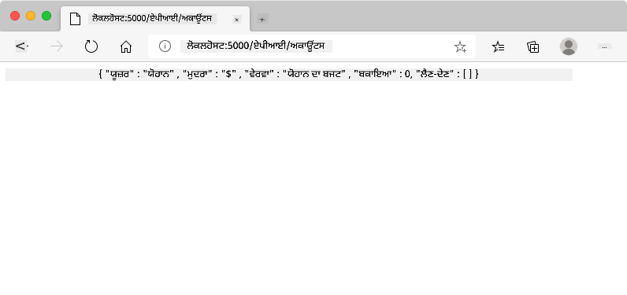
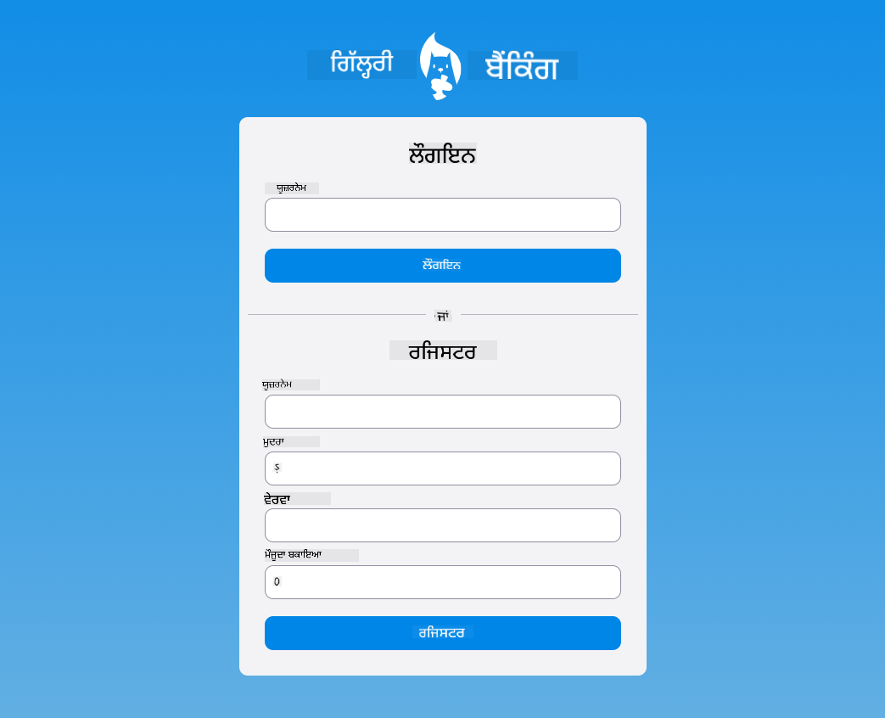

<!--
CO_OP_TRANSLATOR_METADATA:
{
  "original_hash": "8baca047d77a5f43fa4099c0578afa42",
  "translation_date": "2025-08-28T16:53:46+00:00",
  "source_file": "7-bank-project/2-forms/README.md",
  "language_code": "pa"
}
-->
# ਬੈਂਕਿੰਗ ਐਪ ਬਣਾਓ ਭਾਗ 2: ਲੌਗਇਨ ਅਤੇ ਰਜਿਸਟ੍ਰੇਸ਼ਨ ਫਾਰਮ ਬਣਾਓ

## ਪੂਰਵ-ਵਿਆਖਿਆਨ ਕਵਿਜ਼

[ਪੂਰਵ-ਵਿਆਖਿਆਨ ਕਵਿਜ਼](https://ff-quizzes.netlify.app/web/quiz/43)

### ਪਰਿਚਯ

ਲਗਭਗ ਸਾਰੇ ਆਧੁਨਿਕ ਵੈੱਬ ਐਪਸ ਵਿੱਚ, ਤੁਸੀਂ ਆਪਣਾ ਖਾਤਾ ਬਣਾਕੇ ਆਪਣੀ ਨਿੱਜੀ ਜਗ੍ਹਾ ਪ੍ਰਾਪਤ ਕਰ ਸਕਦੇ ਹੋ। ਕਈ ਉਪਭੋਗਤਾ ਇੱਕ ਸਮੇਂ ਵਿੱਚ ਵੈੱਬ ਐਪਸ ਨੂੰ ਐਕਸੈਸ ਕਰ ਸਕਦੇ ਹਨ, ਇਸ ਲਈ ਤੁਹਾਨੂੰ ਹਰ ਉਪਭੋਗਤਾ ਦਾ ਨਿੱਜੀ ਡਾਟਾ ਵੱਖ-ਵੱਖ ਸਟੋਰ ਕਰਨ ਅਤੇ ਦਿਖਾਉਣ ਲਈ ਇੱਕ ਮਕੈਨਿਜ਼ਮ ਦੀ ਲੋੜ ਹੁੰਦੀ ਹੈ। ਅਸੀਂ [ਉਪਭੋਗਤਾ ਪਛਾਣ ਨੂੰ ਸੁਰੱਖਿਅਤ ਤਰੀਕੇ ਨਾਲ](https://en.wikipedia.org/wiki/Authentication) ਪ੍ਰਬੰਧਿਤ ਕਰਨ ਬਾਰੇ ਨਹੀਂ ਸਿੱਖਾਂਗੇ ਕਿਉਂਕਿ ਇਹ ਆਪਣੇ ਆਪ ਵਿੱਚ ਇੱਕ ਵਿਸਤ੍ਰਿਤ ਵਿਸ਼ਾ ਹੈ, ਪਰ ਅਸੀਂ ਇਹ ਯਕੀਨੀ ਬਣਾਵਾਂਗੇ ਕਿ ਹਰ ਉਪਭੋਗਤਾ ਇੱਕ (ਜਾਂ ਵੱਧ) ਬੈਂਕ ਖਾਤਾ ਬਣਾਉਣ ਦੇ ਯੋਗ ਹੋਵੇ।

ਇਸ ਭਾਗ ਵਿੱਚ ਅਸੀਂ HTML ਫਾਰਮਾਂ ਦੀ ਵਰਤੋਂ ਕਰਕੇ ਆਪਣੇ ਵੈੱਬ ਐਪ ਵਿੱਚ ਲੌਗਇਨ ਅਤੇ ਰਜਿਸਟ੍ਰੇਸ਼ਨ ਸ਼ਾਮਲ ਕਰਾਂਗੇ। ਅਸੀਂ ਦੇਖਾਂਗੇ ਕਿ ਡਾਟਾ ਨੂੰ ਸਰਵਰ API ਨੂੰ ਪ੍ਰੋਗਰਾਮਿੰਗ ਤਰੀਕੇ ਨਾਲ ਕਿਵੇਂ ਭੇਜਿਆ ਜਾ ਸਕਦਾ ਹੈ, ਅਤੇ ਆਖਿਰਕਾਰ ਉਪਭੋਗਤਾ ਇਨਪੁਟ ਲਈ ਬੁਨਿਆਦੀ ਵੈਧਤਾ ਨਿਯਮਾਂ ਨੂੰ ਕਿਵੇਂ ਪਰਿਭਾਸ਼ਿਤ ਕੀਤਾ ਜਾ ਸਕਦਾ ਹੈ।

### ਪੂਰਵ ਸ਼ਰਤ

ਤੁਹਾਨੂੰ ਇਸ ਪਾਠ ਲਈ ਵੈੱਬ ਐਪ ਦੇ [HTML ਟੈਂਪਲੇਟ ਅਤੇ ਰੂਟਿੰਗ](../1-template-route/README.md) ਪੂਰੇ ਕਰਨੇ ਚਾਹੀਦੇ ਹਨ। ਤੁਹਾਨੂੰ [Node.js](https://nodejs.org) ਇੰਸਟਾਲ ਕਰਨ ਦੀ ਲੋੜ ਹੈ ਅਤੇ [ਸਰਵਰ API](../api/README.md) ਨੂੰ ਸਥਾਨਕ ਤੌਰ 'ਤੇ ਚਲਾਉਣਾ ਚਾਹੀਦਾ ਹੈ ਤਾਂ ਜੋ ਤੁਸੀਂ ਖਾਤੇ ਬਣਾਉਣ ਲਈ ਡਾਟਾ ਭੇਜ ਸਕੋ।

**ਨੋਟ ਕਰੋ**
ਤੁਹਾਨੂੰ ਇੱਕ ਸਮੇਂ ਵਿੱਚ ਦੋ ਟਰਮੀਨਲ ਚਲਾਉਣੇ ਪੈਣਗੇ ਜਿਵੇਂ ਹੇਠਾਂ ਦਿੱਤੇ ਗਏ ਹਨ:
1. ਮੁੱਖ ਬੈਂਕ ਐਪ ਲਈ ਜੋ ਅਸੀਂ [HTML ਟੈਂਪਲੇਟ ਅਤੇ ਰੂਟਿੰਗ](../1-template-route/README.md) ਪਾਠ ਵਿੱਚ ਬਣਾਇਆ ਸੀ।
2. [ਬੈਂਕ ਐਪ ਸਰਵਰ API](../api/README.md) ਲਈ ਜੋ ਅਸੀਂ ਉਪਰੋਕਤ ਸੈਟਅਪ ਕੀਤਾ।

ਤੁਹਾਨੂੰ ਪਾਠ ਦੇ ਬਾਕੀ ਹਿੱਸੇ ਦੇ ਨਾਲ ਅੱਗੇ ਵਧਣ ਲਈ ਦੋ ਸਰਵਰ ਚਲਾਉਣੇ ਪੈਣਗੇ। ਇਹ ਵੱਖ-ਵੱਖ ਪੋਰਟਾਂ (ਪੋਰਟ `3000` ਅਤੇ ਪੋਰਟ `5000`) 'ਤੇ ਸੁਣ ਰਹੇ ਹਨ ਇਸ ਲਈ ਸਭ ਕੁਝ ਠੀਕ ਕੰਮ ਕਰਨਾ ਚਾਹੀਦਾ ਹੈ।

ਤੁਹਾਨੂੰ ਇਹ ਕਮਾਂਡ ਟਰਮੀਨਲ ਵਿੱਚ ਚਲਾਕੇ ਜਾਂਚ ਕਰਨੀ ਚਾਹੀਦੀ ਹੈ ਕਿ ਸਰਵਰ ਠੀਕ ਚੱਲ ਰਿਹਾ ਹੈ:

```sh
curl http://localhost:5000/api
# -> should return "Bank API v1.0.0" as a result
```

---

## ਫਾਰਮ ਅਤੇ ਕੰਟਰੋਲ

`<form>` ਐਲਿਮੈਂਟ HTML ਦਸਤਾਵੇਜ਼ ਦੇ ਇੱਕ ਸੈਕਸ਼ਨ ਨੂੰ ਘੇਰਦਾ ਹੈ ਜਿੱਥੇ ਉਪਭੋਗਤਾ ਇਨਪੁਟ ਅਤੇ ਇੰਟਰਐਕਟਿਵ ਕੰਟਰੋਲ ਨਾਲ ਡਾਟਾ ਸਬਮਿਟ ਕਰ ਸਕਦਾ ਹੈ। ਫਾਰਮ ਵਿੱਚ ਵਰਤਣ ਲਈ ਹਰ ਕਿਸਮ ਦੇ ਉਪਭੋਗਤਾ ਇੰਟਰਫੇਸ (UI) ਕੰਟਰੋਲ ਹਨ, ਸਭ ਤੋਂ ਆਮ `<input>` ਅਤੇ `<button>` ਐਲਿਮੈਂਟ ਹਨ।

`<input>` ਦੇ ਕਈ [ਕਿਸਮਾਂ](https://developer.mozilla.org/docs/Web/HTML/Element/input) ਹੁੰਦੀਆਂ ਹਨ। ਉਦਾਹਰਣ ਲਈ, ਜੇ ਤੁਸੀਂ ਇੱਕ ਖੇਤਰ ਬਣਾਉਣਾ ਚਾਹੁੰਦੇ ਹੋ ਜਿੱਥੇ ਉਪਭੋਗਤਾ ਆਪਣਾ ਯੂਜ਼ਰਨੇਮ ਦਰਜ ਕਰ ਸਕਦਾ ਹੈ, ਤੁਸੀਂ ਇਹ ਵਰਤ ਸਕਦੇ ਹੋ:

```html
<input id="username" name="username" type="text">
```

`name` ਐਟ੍ਰਿਬਿਊਟ ਨੂੰ ਜਦੋਂ ਫਾਰਮ ਡਾਟਾ ਭੇਜਿਆ ਜਾਵੇਗਾ ਤਾਂ ਇਸਨੂੰ ਪ੍ਰਾਪਰਟੀ ਨਾਮ ਵਜੋਂ ਵਰਤਿਆ ਜਾਵੇਗਾ। `id` ਐਟ੍ਰਿਬਿਊਟ ਨੂੰ `<label>` ਨੂੰ ਫਾਰਮ ਕੰਟਰੋਲ ਨਾਲ ਜੋੜਨ ਲਈ ਵਰਤਿਆ ਜਾਂਦਾ ਹੈ।

> `<input>` ਦੀਆਂ [ਕਿਸਮਾਂ](https://developer.mozilla.org/docs/Web/HTML/Element/input) ਅਤੇ [ਹੋਰ ਫਾਰਮ ਕੰਟਰੋਲ](https://developer.mozilla.org/docs/Learn/Forms/Other_form_controls) ਦੀ ਪੂਰੀ ਸੂਚੀ ਦੇਖੋ ਤਾਂ ਜੋ ਤੁਹਾਨੂੰ ਇਹ ਪਤਾ ਲੱਗੇ ਕਿ ਆਪਣੇ UI ਬਣਾਉਣ ਸਮੇਂ ਤੁਸੀਂ ਸਾਰੇ ਮੂਲ UI ਐਲਿਮੈਂਟਾਂ ਦੀ ਵਰਤੋਂ ਕਰ ਸਕਦੇ ਹੋ।

✅ ਨੋਟ ਕਰੋ ਕਿ `<input>` ਇੱਕ [ਖਾਲੀ ਐਲਿਮੈਂਟ](https://developer.mozilla.org/docs/Glossary/Empty_element) ਹੈ ਜਿਸ 'ਤੇ ਤੁਸੀਂ *ਬੰਦ ਕਰਨ ਵਾਲਾ ਟੈਗ* ਨਹੀਂ ਜੋੜਨਾ ਚਾਹੀਦਾ। ਤੁਸੀਂ ਖੁਦ-ਬੰਦ `<input/>` ਨੋਟੇਸ਼ਨ ਦੀ ਵਰਤੋਂ ਕਰ ਸਕਦੇ ਹੋ, ਪਰ ਇਹ ਲਾਜ਼ਮੀ ਨਹੀਂ ਹੈ।

ਫਾਰਮ ਵਿੱਚ `<button>` ਐਲਿਮੈਂਟ ਕੁਝ ਖਾਸ ਹੈ। ਜੇ ਤੁਸੀਂ ਇਸਦਾ `type` ਐਟ੍ਰਿਬਿਊਟ ਨਿਰਧਾਰਤ ਨਹੀਂ ਕਰਦੇ, ਤਾਂ ਜਦੋਂ ਦਬਾਇਆ ਜਾਂਦਾ ਹੈ, ਇਹ ਆਟੋਮੈਟਿਕ ਤੌਰ 'ਤੇ ਫਾਰਮ ਡਾਟਾ ਨੂੰ ਸਰਵਰ 'ਤੇ ਸਬਮਿਟ ਕਰ ਦੇਵੇਗਾ। ਇੱਥੇ ਸੰਭਾਵਿਤ `type` ਮੁੱਲ ਹਨ:

- `submit`: ਫਾਰਮ ਵਿੱਚ ਡਿਫਾਲਟ, ਬਟਨ ਫਾਰਮ ਸਬਮਿਟ ਕਾਰਵਾਈ ਨੂੰ ਟ੍ਰਿਗਰ ਕਰਦਾ ਹੈ।
- `reset`: ਬਟਨ ਸਾਰੇ ਫਾਰਮ ਕੰਟਰੋਲ ਨੂੰ ਉਨ੍ਹਾਂ ਦੇ ਸ਼ੁਰੂਆਤੀ ਮੁੱਲਾਂ 'ਤੇ ਰੀਸੈਟ ਕਰਦਾ ਹੈ।
- `button`: ਜਦੋਂ ਬਟਨ ਦਬਾਇਆ ਜਾਂਦਾ ਹੈ ਤਾਂ ਕੋਈ ਡਿਫਾਲਟ ਵਿਹਾਰ ਨਿਰਧਾਰਤ ਨਾ ਕਰੋ। ਤੁਸੀਂ ਇਸ 'ਤੇ ਜਾਵਾਸਕ੍ਰਿਪਟ ਦੀ ਵਰਤੋਂ ਕਰਕੇ ਕਸਟਮ ਕਾਰਵਾਈਆਂ ਨਿਰਧਾਰਤ ਕਰ ਸਕਦੇ ਹੋ।

### ਕੰਮ

ਆਓ `login` ਟੈਂਪਲੇਟ ਵਿੱਚ ਇੱਕ ਫਾਰਮ ਸ਼ਾਮਲ ਕਰਕੇ ਸ਼ੁਰੂ ਕਰੀਏ। ਸਾਨੂੰ ਇੱਕ *ਯੂਜ਼ਰਨੇਮ* ਖੇਤਰ ਅਤੇ ਇੱਕ *ਲੌਗਇਨ* ਬਟਨ ਦੀ ਲੋੜ ਹੈ।

```html
<template id="login">
  <h1>Bank App</h1>
  <section>
    <h2>Login</h2>
    <form id="loginForm">
      <label for="username">Username</label>
      <input id="username" name="user" type="text">
      <button>Login</button>
    </form>
  </section>
</template>
```

ਜੇ ਤੁਸੀਂ ਧਿਆਨ ਨਾਲ ਦੇਖੋ, ਤਾਂ ਤੁਸੀਂ ਨੋਟ ਕਰ ਸਕਦੇ ਹੋ ਕਿ ਅਸੀਂ ਇੱਥੇ `<label>` ਐਲਿਮੈਂਟ ਵੀ ਸ਼ਾਮਲ ਕੀਤਾ ਹੈ। `<label>` ਐਲਿਮੈਂਟ UI ਕੰਟਰੋਲਾਂ ਨੂੰ ਨਾਮ ਦੇਣ ਲਈ ਵਰਤੇ ਜਾਂਦੇ ਹਨ, ਜਿਵੇਂ ਕਿ ਸਾਡਾ ਯੂਜ਼ਰਨੇਮ ਖੇਤਰ। ਲੇਬਲ ਤੁਹਾਡੇ ਫਾਰਮਾਂ ਦੀ ਪੜ੍ਹਨਯੋਗਤਾ ਲਈ ਮਹੱਤਵਪੂਰਨ ਹਨ, ਪਰ ਇਹ ਵਾਧੂ ਫਾਇਦੇ ਵੀ ਲੈ ਕੇ ਆਉਂਦੇ ਹਨ:

- ਜਦੋਂ ਤੁਸੀਂ ਲੇਬਲ ਨੂੰ ਫਾਰਮ ਕੰਟਰੋਲ ਨਾਲ ਜੋੜਦੇ ਹੋ, ਤਾਂ ਇਹ ਸਹਾਇਕ ਤਕਨਾਲੋਜੀਆਂ (ਜਿਵੇਂ ਕਿ ਸਕ੍ਰੀਨ ਰੀਡਰ) ਦੀ ਵਰਤੋਂ ਕਰਨ ਵਾਲੇ ਉਪਭੋਗਤਾਵਾਂ ਨੂੰ ਇਹ ਸਮਝਣ ਵਿੱਚ ਮਦਦ ਕਰਦਾ ਹੈ ਕਿ ਉਹਨਾਂ ਨੂੰ ਕਿਹੜਾ ਡਾਟਾ ਪ੍ਰਦਾਨ ਕਰਨ ਦੀ ਉਮੀਦ ਹੈ।
- ਤੁਸੀਂ ਲੇਬਲ 'ਤੇ ਕਲਿਕ ਕਰਕੇ ਸੰਬੰਧਿਤ ਇਨਪੁਟ 'ਤੇ ਸਿੱਧਾ ਫੋਕਸ ਰੱਖ ਸਕਦੇ ਹੋ, ਜਿਸ ਨਾਲ ਟਚ-ਸਕ੍ਰੀਨ ਆਧਾਰਿਤ ਡਿਵਾਈਸਾਂ 'ਤੇ ਪਹੁੰਚਣਾ ਆਸਾਨ ਬਣ ਜਾਂਦਾ ਹੈ।

> [ਵੈੱਬ 'ਤੇ ਪਹੁੰਚਯੋਗਤਾ](https://developer.mozilla.org/docs/Learn/Accessibility/What_is_accessibility) ਇੱਕ ਬਹੁਤ ਹੀ ਮਹੱਤਵਪੂਰਨ ਵਿਸ਼ਾ ਹੈ ਜਿਸਨੂੰ ਅਕਸਰ ਨਜ਼ਰਅੰਦਾਜ਼ ਕੀਤਾ ਜਾਂਦਾ ਹੈ। [ਸੈਮਾਂਟਿਕ HTML ਐਲਿਮੈਂਟ](https://developer.mozilla.org/docs/Learn/Accessibility/HTML) ਦੀ ਵਰਤੋਂ ਕਰਕੇ ਪਹੁੰਚਯੋਗ ਸਮੱਗਰੀ ਬਣਾਉਣਾ ਮੁਸ਼ਕਲ ਨਹੀਂ ਹੈ ਜੇ ਤੁਸੀਂ ਉਨ੍ਹਾਂ ਦੀ ਸਹੀ ਤਰੀਕੇ ਨਾਲ ਵਰਤੋਂ ਕਰੋ। ਤੁਸੀਂ [ਪਹੁੰਚਯੋਗਤਾ ਬਾਰੇ ਹੋਰ ਪੜ੍ਹ ਸਕਦੇ ਹੋ](https://developer.mozilla.org/docs/Web/Accessibility) ਤਾਂ ਜੋ ਆਮ ਗਲਤੀਆਂ ਤੋਂ ਬਚ ਸਕੋ ਅਤੇ ਇੱਕ ਜ਼ਿੰਮੇਵਾਰ ਡਿਵੈਲਪਰ ਬਣ ਸਕੋ।

ਹੁਣ ਅਸੀਂ ਪਹਿਲੇ ਫਾਰਮ ਦੇ ਹੇਠਾਂ ਰਜਿਸਟ੍ਰੇਸ਼ਨ ਲਈ ਦੂਜਾ ਫਾਰਮ ਸ਼ਾਮਲ ਕਰਾਂਗੇ:

```html
<hr/>
<h2>Register</h2>
<form id="registerForm">
  <label for="user">Username</label>
  <input id="user" name="user" type="text">
  <label for="currency">Currency</label>
  <input id="currency" name="currency" type="text" value="$">
  <label for="description">Description</label>
  <input id="description" name="description" type="text">
  <label for="balance">Current balance</label>
  <input id="balance" name="balance" type="number" value="0">
  <button>Register</button>
</form>
```

`value` ਐਟ੍ਰਿਬਿਊਟ ਦੀ ਵਰਤੋਂ ਕਰਕੇ ਅਸੀਂ ਦਿੱਤੇ ਗਏ ਇਨਪੁਟ ਲਈ ਡਿਫਾਲਟ ਮੁੱਲ ਨਿਰਧਾਰਤ ਕਰ ਸਕਦੇ ਹਾਂ। ਧਿਆਨ ਦਿਓ ਕਿ `balance` ਲਈ ਇਨਪੁਟ ਵਿੱਚ `number` ਕਿਸਮ ਹੈ। ਕੀ ਇਹ ਹੋਰ ਇਨਪੁਟਾਂ ਤੋਂ ਵੱਖਰਾ ਲੱਗਦਾ ਹੈ? ਇਸ ਨਾਲ ਇੰਟਰਐਕਟ ਕਰਨ ਦੀ ਕੋਸ਼ਿਸ਼ ਕਰੋ।

✅ ਕੀ ਤੁਸੀਂ ਸਿਰਫ਼ ਕੀਬੋਰਡ ਦੀ ਵਰਤੋਂ ਕਰਕੇ ਫਾਰਮਾਂ ਨੂੰ ਨੈਵੀਗੇਟ ਅਤੇ ਇੰਟਰਐਕਟ ਕਰ ਸਕਦੇ ਹੋ? ਤੁਸੀਂ ਇਹ ਕਿਵੇਂ ਕਰੋਗੇ?

## ਡਾਟਾ ਨੂੰ ਸਰਵਰ 'ਤੇ ਸਬਮਿਟ ਕਰਨਾ

ਹੁਣ ਜਦੋਂ ਸਾਡੇ ਕੋਲ ਇੱਕ ਫੰਕਸ਼ਨਲ UI ਹੈ, ਅਗਲਾ ਕਦਮ ਡਾਟਾ ਨੂੰ ਸਰਵਰ 'ਤੇ ਭੇਜਣਾ ਹੈ। ਆਓ ਆਪਣੇ ਮੌਜੂਦਾ ਕੋਡ ਦੀ ਵਰਤੋਂ ਕਰਕੇ ਇੱਕ ਛੋਟੀ ਜਹੀ ਜਾਂਚ ਕਰੀਏ: ਕੀ ਹੁੰਦਾ ਹੈ ਜੇ ਤੁਸੀਂ *Login* ਜਾਂ *Register* ਬਟਨ 'ਤੇ ਕਲਿਕ ਕਰੋ?

ਕੀ ਤੁਸੀਂ ਆਪਣੇ ਬ੍ਰਾਊਜ਼ਰ ਦੇ URL ਸੈਕਸ਼ਨ ਵਿੱਚ ਬਦਲਾਅ ਨੂੰ ਨੋਟ ਕੀਤਾ?


`<form>` ਲਈ ਡਿਫਾਲਟ ਕਾਰਵਾਈ ਮੌਜੂਦਾ ਸਰਵਰ URL 'ਤੇ [GET ਵਿਧੀ](https://www.w3.org/Protocols/rfc2616/rfc2616-sec9.html#sec9.3) ਦੀ ਵਰਤੋਂ ਕਰਕੇ ਫਾਰਮ ਨੂੰ ਸਬਮਿਟ ਕਰਨਾ ਹੈ, ਫਾਰਮ ਡਾਟਾ ਨੂੰ ਸਿੱਧੇ URL ਵਿੱਚ ਸ਼ਾਮਲ ਕਰਨਾ। ਇਸ ਵਿਧੀ ਵਿੱਚ ਕੁਝ ਘਾਟ ਹਨ:

- ਭੇਜਿਆ ਗਿਆ ਡਾਟਾ ਬਹੁਤ ਹੀ ਸੀਮਿਤ ਹੈ (ਲਗਭਗ 2000 ਅੱਖਰ)
- ਡਾਟਾ ਸਿੱਧੇ URL ਵਿੱਚ ਦਿਖਾਈ ਦੇ ਰਿਹਾ ਹੈ (ਪਾਸਵਰਡ ਲਈ ਵਧੀਆ ਨਹੀਂ)
- ਇਹ ਫਾਈਲ ਅਪਲੋਡ ਨਾਲ ਕੰਮ ਨਹੀਂ ਕਰਦਾ

ਇਸ ਲਈ ਤੁਸੀਂ ਇਸਨੂੰ [POST ਵਿਧੀ](https://www.w3.org/Protocols/rfc2616/rfc2616-sec9.html#sec9.5) ਦੀ ਵਰਤੋਂ ਕਰਨ ਲਈ ਬਦਲ ਸਕਦੇ ਹੋ ਜੋ HTTP ਬੇਨਤੀ ਦੇ ਬਾਡੀ ਵਿੱਚ ਫਾਰਮ ਡਾਟਾ ਨੂੰ ਸਰਵਰ 'ਤੇ ਭੇਜਦੀ ਹੈ, ਬਿਨਾਂ ਪਿਛਲੇ ਸੀਮਾਵਾਂ ਦੇ।

> ਜਦੋਂ ਕਿ POST ਡਾਟਾ ਭੇਜਣ ਲਈ ਸਭ ਤੋਂ ਆਮ ਤਰੀਕੇ ਦੀ ਵਰਤੋਂ ਕੀਤੀ ਜਾਂਦੀ ਹੈ, [ਕੁਝ ਖਾਸ ਸਥਿਤੀਆਂ](https://www.w3.org/2001/tag/doc/whenToUseGet.html) ਵਿੱਚ GET ਵਿਧੀ ਦੀ ਵਰਤੋਂ ਕਰਨੀ ਪਸੰਦ ਕੀਤੀ ਜਾਂਦੀ ਹੈ, ਜਿਵੇਂ ਕਿ ਖੋਜ ਖੇਤਰ ਨੂੰ ਲਾਗੂ ਕਰਦੇ ਸਮੇਂ।

### ਕੰਮ

ਰਜਿਸਟ੍ਰੇਸ਼ਨ ਫਾਰਮ ਵਿੱਚ `action` ਅਤੇ `method` ਗੁਣ ਸ਼ਾਮਲ ਕਰੋ:

```html
<form id="registerForm" action="//localhost:5000/api/accounts" method="POST">
```

ਹੁਣ ਆਪਣੇ ਨਾਮ ਨਾਲ ਨਵਾਂ ਖਾਤਾ ਰਜਿਸਟਰ ਕਰਨ ਦੀ ਕੋਸ਼ਿਸ਼ ਕਰੋ। *Register* ਬਟਨ 'ਤੇ ਕਲਿਕ ਕਰਨ ਤੋਂ ਬਾਅਦ ਤੁਹਾਨੂੰ ਕੁਝ ਇਸ ਤਰ੍ਹਾਂ ਦੇਖਣਾ ਚਾਹੀਦਾ ਹੈ:



ਜੇ ਸਭ ਕੁਝ ਠੀਕ ਚੱਲਦਾ ਹੈ, ਤਾਂ ਸਰਵਰ ਤੁਹਾਡੀ ਬੇਨਤੀ ਦਾ ਜਵਾਬ [JSON](https://www.json.org/json-en.html) ਪ੍ਰਤੀਕਰਮ ਨਾਲ ਦੇਵੇਗਾ ਜਿਸ ਵਿੱਚ ਬਣਾਇਆ ਗਿਆ ਖਾਤਾ ਡਾਟਾ ਸ਼ਾਮਲ ਹੈ।

✅ ਇੱਕੋ ਨਾਮ ਨਾਲ ਮੁੜ ਰਜਿਸਟਰ ਕਰਨ ਦੀ ਕੋਸ਼ਿਸ਼ ਕਰੋ। ਕੀ ਹੁੰਦਾ ਹੈ?

## ਪੰਨਾ ਰੀਲੋਡ ਕੀਤੇ ਬਿਨਾਂ ਡਾਟਾ ਸਬਮਿਟ ਕਰਨਾ

ਜਿਵੇਂ ਤੁਸੀਂ ਸ਼ਾਇਦ ਨੋਟ ਕੀਤਾ ਹੈ, ਇਸ ਤਰੀਕੇ ਨਾਲ ਇੱਕ ਛੋਟੀ ਜਹੀ ਸਮੱਸਿਆ ਹੈ ਜੋ ਅਸੀਂ ਵਰਤੀ: ਫਾਰਮ ਸਬਮਿਟ ਕਰਦੇ ਸਮੇਂ, ਅਸੀਂ ਆਪਣੇ ਐਪ ਤੋਂ ਬਾਹਰ ਨਿਕਲ ਜਾਂਦੇ ਹਾਂ ਅਤੇ ਬ੍ਰਾਊਜ਼ਰ ਨੂੰ ਸਰਵਰ URL 'ਤੇ ਰੀਡਾਇਰੈਕਟ ਕਰਦੇ ਹਾਂ। ਅਸੀਂ ਆਪਣੇ ਵੈੱਬ ਐਪ ਨਾਲ ਸਾਰੇ ਪੰਨਾ ਰੀਲੋਡਾਂ ਤੋਂ ਬਚਣ ਦੀ ਕੋਸ਼ਿਸ਼ ਕਰ ਰਹੇ ਹਾਂ, ਕਿਉਂਕਿ ਅਸੀਂ [ਸਿੰਗਲ-ਪੇਜ ਐਪਲੀਕੇਸ਼ਨ (SPA)](https://en.wikipedia.org/wiki/Single-page_application) ਬਣਾ ਰਹੇ ਹਾਂ।

ਫਾਰਮ ਡਾਟਾ ਨੂੰ ਸਰਵਰ 'ਤੇ ਭੇਜਣ ਲਈ ਬਿਨਾਂ ਪੰਨਾ ਰੀਲੋਡ ਨੂੰ ਮਜ਼ਬੂਰ ਕੀਤੇ, ਸਾਨੂੰ ਜਾਵਾਸਕ੍ਰਿਪਟ ਕੋਡ ਦੀ ਵਰਤੋਂ ਕਰਨੀ ਪਵੇਗੀ। `<form>` ਐਲਿਮੈਂਟ ਦੇ `action` ਗੁਣ ਵਿੱਚ URL ਰੱਖਣ ਦੀ ਬਜਾਏ, ਤੁਸੀਂ `javascript:` ਸਤਰ ਨਾਲ ਪੂਰਵ-ਲਗਾਏ ਗਏ ਕਿਸੇ ਵੀ ਜਾਵਾਸਕ੍ਰਿਪਟ ਕੋਡ ਦੀ ਵਰਤੋਂ ਕਰ ਸਕਦੇ ਹੋ ਤਾਂ ਜੋ ਇੱਕ ਕਸਟਮ ਕਾਰਵਾਈ ਕੀਤੀ ਜਾ ਸਕੇ। ਇਸਦੀ ਵਰਤੋਂ ਕਰਨ ਦਾ ਮਤਲਬ ਇਹ ਵੀ ਹੈ ਕਿ ਤੁਹਾਨੂੰ ਕੁਝ ਕੰਮ ਲਾਗੂ ਕਰਨੇ ਪੈਣਗੇ ਜੋ ਪਹਿਲਾਂ ਬ੍ਰਾਊਜ਼ਰ ਦੁਆਰਾ ਆਟੋਮੈਟਿਕ ਤੌਰ 'ਤੇ ਕੀਤੇ ਜਾਂਦੇ ਸਨ:

- ਫਾਰਮ ਡਾਟਾ ਪ੍ਰਾਪਤ ਕਰੋ
- ਫਾਰਮ ਡਾਟਾ ਨੂੰ ਇੱਕ ਉਚਿਤ ਫਾਰਮੈਟ ਵਿੱਚ ਰੂਪਾਂਤਰਿਤ ਅਤੇ ਕੋਡ ਕਰੋ
- HTTP ਬੇਨਤੀ ਬਣਾਓ ਅਤੇ ਇਸਨੂੰ ਸਰਵਰ 'ਤੇ ਭੇਜੋ

### ਕੰਮ

ਰਜਿਸਟ੍ਰੇਸ਼ਨ ਫਾਰਮ `action` ਨੂੰ ਬਦਲੋ:

```html
<form id="registerForm" action="javascript:register()">
```

`app.js` ਖੋਲ੍ਹੋ ਅਤੇ `register` ਨਾਮਕ ਇੱਕ ਨਵਾਂ ਫੰਕਸ਼ਨ ਸ਼ਾਮਲ ਕਰੋ:

```js
function register() {
  const registerForm = document.getElementById('registerForm');
  const formData = new FormData(registerForm);
  const data = Object.fromEntries(formData);
  const jsonData = JSON.stringify(data);
}
```

ਇੱਥੇ ਅਸੀਂ `getElementById()` ਦੀ ਵਰਤੋਂ ਕਰਕੇ ਫਾਰਮ ਐਲਿਮੈਂਟ ਪ੍ਰਾਪਤ ਕਰਦੇ ਹਾਂ ਅਤੇ [`FormData`](https://developer.mozilla.org/docs/Web/API/FormData) ਹੈਲਪਰ ਦੀ ਵਰਤੋਂ ਕਰਕੇ ਫਾਰਮ ਕੰਟਰੋਲਾਂ ਤੋਂ ਮੁੱਲਾਂ ਨੂੰ ਕੁੰਜੀ/ਮੁੱਲ ਜੋੜੇ ਦੇ ਸੈਟ ਵਜੋਂ ਕੱਢਦੇ ਹਾਂ। ਫਿਰ ਅਸੀਂ ਡਾਟਾ ਨੂੰ ਇੱਕ ਰੈਗੂਲਰ ਓਬਜੈਕਟ ਵਿੱਚ ਰੂਪਾਂਤਰਿਤ ਕਰਦੇ ਹਾਂ [`Object.fromEntries()`](https://developer.mozilla.org/docs/Web/JavaScript/Reference/Global_Objects/Object/fromEntries) ਦੀ ਵਰਤੋਂ ਕਰਕੇ ਅਤੇ ਆਖਿਰਕਾਰ ਡਾਟਾ ਨੂੰ [JSON](https://www.json.org/json-en.html) ਵਿੱਚ ਸੀਰੀਅਲਾਈਜ਼ ਕਰਦੇ ਹਾਂ, ਇੱਕ ਫਾਰਮੈਟ ਜੋ ਵੈੱਬ 'ਤੇ ਡਾਟਾ ਦੀ ਅਦਲ-ਬਦਲ ਲਈ ਆਮ ਤੌਰ 'ਤੇ ਵਰਤਿਆ ਜਾਂਦਾ ਹੈ।

ਡਾਟਾ ਹੁਣ ਸਰਵਰ 'ਤੇ ਭੇਜਣ ਲਈ ਤਿਆਰ ਹੈ। `createAccount` ਨਾਮਕ ਇੱਕ ਨਵਾਂ ਫੰਕਸ਼ਨ ਬਣਾਓ:

```js
async function createAccount(account) {
  try {
    const response = await fetch('//localhost:5000/api/accounts', {
      method: 'POST',
      headers: { 'Content-Type': 'application/json' },
      body: account
    });
    return await response.json();
  } catch (error) {
    return { error: error.message || 'Unknown error' };
  }
}
```

ਇਹ ਫੰਕਸ਼ਨ ਕੀ ਕਰ ਰਿਹਾ ਹੈ? ਪਹਿਲਾਂ, ਇੱਥੇ `async` ਕੀਵਰਡ ਨੂੰ ਨੋਟ ਕਰੋ। ਇਸਦਾ ਮਤਲਬ ਹੈ ਕਿ ਫੰਕਸ਼ਨ ਵਿੱਚ ਕੋਡ ਸ਼ਾਮਲ ਹੈ ਜੋ [**ਅਸਿੰਕ੍ਰੋਨਸ**](https://developer.mozilla.org/docs/Web/JavaScript/Reference/Statements/async_function) ਤਰੀਕੇ ਨਾਲ ਚੱਲੇਗਾ। ਜਦੋਂ `await` ਕੀਵਰਡ ਦੇ ਨਾਲ ਵਰਤਿਆ ਜਾਂਦਾ ਹੈ,
ਸੁਝਾਅ: ਤੁਸੀਂ ਆਪਣੇ ਫਾਰਮ ਕੰਟਰੋਲਜ਼ ਦੇ ਦਿੱਖ ਨੂੰ ਕਸਟਮਾਈਜ਼ ਕਰ ਸਕਦੇ ਹੋ ਜੇ ਉਹ ਵੈਧ ਹਨ ਜਾਂ ਨਹੀਂ, `:valid` ਅਤੇ `:invalid` CSS ਪਸੂਡੋ-ਕਲਾਸਾਂ ਦੀ ਵਰਤੋਂ ਕਰਕੇ।
### ਕੰਮ

ਨਵਾਂ ਖਾਤਾ ਬਣਾਉਣ ਲਈ 2 ਜ਼ਰੂਰੀ ਫੀਲਡ ਹਨ: ਯੂਜ਼ਰਨੇਮ ਅਤੇ ਕਰੰਸੀ। ਹੋਰ ਫੀਲਡਜ਼ ਵਿਕਲਪਿਕ ਹਨ। ਫਾਰਮ ਦੇ HTML ਨੂੰ ਅਪਡੇਟ ਕਰੋ, `required` ਐਟ੍ਰਿਬਿਊਟ ਅਤੇ ਫੀਲਡ ਦੇ ਲੇਬਲ ਵਿੱਚ ਟੈਕਸਟ ਦੀ ਵਰਤੋਂ ਕਰਦੇ ਹੋਏ:

```html
<label for="user">Username (required)</label>
<input id="user" name="user" type="text" required>
...
<label for="currency">Currency (required)</label>
<input id="currency" name="currency" type="text" value="$" required>
```

ਹਾਲਾਂਕਿ ਇਸ ਸਰਵਰ ਦੀ ਵਿਸ਼ੇਸ਼ ਇਮਪਲੀਮੈਂਟੇਸ਼ਨ ਫੀਲਡਜ਼ ਦੀ ਵੱਧ ਤੋਂ ਵੱਧ ਲੰਬਾਈ 'ਤੇ ਕੋਈ ਖਾਸ ਸੀਮਾਵਾਂ ਲਾਗੂ ਨਹੀਂ ਕਰਦੀ, ਪਰ ਕਿਸੇ ਵੀ ਯੂਜ਼ਰ ਟੈਕਸਟ ਐਂਟਰੀ ਲਈ ਵਾਜਬ ਸੀਮਾਵਾਂ ਨਿਰਧਾਰਤ ਕਰਨਾ ਹਮੇਸ਼ਾ ਇੱਕ ਚੰਗੀ ਪ੍ਰਥਾ ਹੈ।

ਟੈਕਸਟ ਫੀਲਡਜ਼ ਵਿੱਚ `maxlength` ਐਟ੍ਰਿਬਿਊਟ ਸ਼ਾਮਲ ਕਰੋ:

```html
<input id="user" name="user" type="text" maxlength="20" required>
...
<input id="currency" name="currency" type="text" value="$" maxlength="5" required>
...
<input id="description" name="description" type="text" maxlength="100">
```

ਹੁਣ ਜੇ ਤੁਸੀਂ *Register* ਬਟਨ ਦਬਾਉਂਦੇ ਹੋ ਅਤੇ ਕੋਈ ਫੀਲਡ ਸਾਡੇ ਦੁਆਰਾ ਨਿਰਧਾਰਤ ਵੈਧਤਾ ਨਿਯਮਾਂ ਦੀ ਪਾਲਣਾ ਨਹੀਂ ਕਰਦੀ, ਤਾਂ ਤੁਹਾਨੂੰ ਕੁਝ ਇਸ ਤਰ੍ਹਾਂ ਦੇਖਣ ਨੂੰ ਮਿਲੇਗਾ:


ਇਸ ਤਰ੍ਹਾਂ ਦੀ ਵੈਧਤਾ, ਡਾਟਾ ਸਰਵਰ ਨੂੰ ਭੇਜਣ ਤੋਂ *ਪਹਿਲਾਂ* ਕੀਤੀ ਜਾਂਦੀ ਹੈ, **ਕਲਾਇੰਟ-ਸਾਈਡ** ਵੈਧਤਾ ਕਹਿੰਦੇ ਹਨ। ਪਰ ਧਿਆਨ ਦਿਓ ਕਿ ਸਾਰੇ ਚੈੱਕ ਡਾਟਾ ਭੇਜਣ ਤੋਂ ਬਿਨਾਂ ਕਰਨਾ ਹਮੇਸ਼ਾ ਸੰਭਵ ਨਹੀਂ ਹੁੰਦਾ। ਉਦਾਹਰਨ ਲਈ, ਅਸੀਂ ਇੱਥੇ ਜਾਂਚ ਨਹੀਂ ਕਰ ਸਕਦੇ ਕਿ ਇੱਕੋ ਯੂਜ਼ਰਨੇਮ ਨਾਲ ਪਹਿਲਾਂ ਹੀ ਕੋਈ ਖਾਤਾ ਮੌਜੂਦ ਹੈ ਜਾਂ ਨਹੀਂ, ਬਿਨਾਂ ਸਰਵਰ ਨੂੰ ਰਿਕਵੈਸਟ ਭੇਜਣ। ਸਰਵਰ 'ਤੇ ਕੀਤੀ ਗਈ ਵਾਧੂ ਵੈਧਤਾ ਨੂੰ **ਸਰਵਰ-ਸਾਈਡ** ਵੈਧਤਾ ਕਹਿੰਦੇ ਹਨ।

ਆਮ ਤੌਰ 'ਤੇ ਦੋਵੇਂ ਨੂੰ ਲਾਗੂ ਕਰਨ ਦੀ ਲੋੜ ਹੁੰਦੀ ਹੈ। ਜਦੋਂ ਕਿ ਕਲਾਇੰਟ-ਸਾਈਡ ਵੈਧਤਾ ਯੂਜ਼ਰ ਨੂੰ ਤੁਰੰਤ ਫੀਡਬੈਕ ਦੇ ਕੇ ਯੂਜ਼ਰ ਅਨੁਭਵ ਨੂੰ ਸੁਧਾਰਦੀ ਹੈ, ਸਰਵਰ-ਸਾਈਡ ਵੈਧਤਾ ਇਹ ਯਕੀਨੀ ਬਣਾਉਣ ਲਈ ਮਹੱਤਵਪੂਰਨ ਹੈ ਕਿ ਤੁਸੀਂ ਜੋ ਯੂਜ਼ਰ ਡਾਟਾ ਪ੍ਰੋਸੈਸ ਕਰ ਰਹੇ ਹੋ ਉਹ ਸਹੀ ਅਤੇ ਸੁਰੱਖਿਅਤ ਹੈ।

---

## 🚀 ਚੁਣੌਤੀ

ਜੇ ਯੂਜ਼ਰ ਪਹਿਲਾਂ ਹੀ ਮੌਜੂਦ ਹੈ, ਤਾਂ HTML ਵਿੱਚ ਇੱਕ ਗਲਤੀ ਸੁਨੇਹਾ ਦਿਖਾਓ।

ਇੱਥੇ ਇੱਕ ਉਦਾਹਰਨ ਹੈ ਕਿ CSS ਸਟਾਈਲਿੰਗ ਦੇ ਕੁਝ ਹਿੱਸੇ ਦੇ ਬਾਅਦ ਅੰਤਮ ਲੌਗਇਨ ਪੇਜ ਕਿਵੇਂ ਲੱਗ ਸਕਦਾ ਹੈ:



## ਪੋਸਟ-ਲੈਕਚਰ ਕਵਿਜ਼

[ਪੋਸਟ-ਲੈਕਚਰ ਕਵਿਜ਼](https://ff-quizzes.netlify.app/web/quiz/44)

## ਸਮੀਖਿਆ ਅਤੇ ਸਵੈ ਅਧਿਐਨ

ਡਿਵੈਲਪਰਜ਼ ਫਾਰਮ ਬਣਾਉਣ ਦੇ ਯਤਨ ਵਿੱਚ ਬਹੁਤ ਸ੍ਰਜਨਾਤਮਕ ਹੋ ਗਏ ਹਨ, ਖਾਸ ਕਰਕੇ ਵੈਧਤਾ ਰਣਨੀਤੀਆਂ ਦੇ ਸਬੰਧ ਵਿੱਚ। [CodePen](https://codepen.com) ਦੇਖ ਕੇ ਵੱਖ-ਵੱਖ ਫਾਰਮ ਫਲੋਜ਼ ਬਾਰੇ ਸਿੱਖੋ; ਕੀ ਤੁਸੀਂ ਕੁਝ ਦਿਲਚਸਪ ਅਤੇ ਪ੍ਰੇਰਣਾਦਾਇਕ ਫਾਰਮ ਲੱਭ ਸਕਦੇ ਹੋ?

## ਅਸਾਈਨਮੈਂਟ

[ਆਪਣੀ ਬੈਂਕ ਐਪ ਨੂੰ ਸਟਾਈਲ ਕਰੋ](assignment.md)

---

**ਅਸਵੀਕਤੀ**:  
ਇਹ ਦਸਤਾਵੇਜ਼ AI ਅਨੁਵਾਦ ਸੇਵਾ [Co-op Translator](https://github.com/Azure/co-op-translator) ਦੀ ਵਰਤੋਂ ਕਰਕੇ ਅਨੁਵਾਦ ਕੀਤਾ ਗਿਆ ਹੈ। ਹਾਲਾਂਕਿ ਅਸੀਂ ਸਹੀਅਤ ਲਈ ਯਤਨਸ਼ੀਲ ਹਾਂ, ਕਿਰਪਾ ਕਰਕੇ ਧਿਆਨ ਦਿਓ ਕਿ ਸਵੈਚਾਲਿਤ ਅਨੁਵਾਦਾਂ ਵਿੱਚ ਗਲਤੀਆਂ ਜਾਂ ਅਸੁੱਤੀਆਂ ਹੋ ਸਕਦੀਆਂ ਹਨ। ਮੂਲ ਦਸਤਾਵੇਜ਼ ਨੂੰ ਇਸਦੀ ਮੂਲ ਭਾਸ਼ਾ ਵਿੱਚ ਅਧਿਕਾਰਤ ਸਰੋਤ ਮੰਨਿਆ ਜਾਣਾ ਚਾਹੀਦਾ ਹੈ। ਮਹੱਤਵਪੂਰਨ ਜਾਣਕਾਰੀ ਲਈ, ਪੇਸ਼ੇਵਰ ਮਨੁੱਖੀ ਅਨੁਵਾਦ ਦੀ ਸਿਫਾਰਸ਼ ਕੀਤੀ ਜਾਂਦੀ ਹੈ। ਇਸ ਅਨੁਵਾਦ ਦੀ ਵਰਤੋਂ ਤੋਂ ਪੈਦਾ ਹੋਣ ਵਾਲੇ ਕਿਸੇ ਵੀ ਗਲਤਫਹਿਮੀ ਜਾਂ ਗਲਤ ਵਿਆਖਿਆ ਲਈ ਅਸੀਂ ਜ਼ਿੰਮੇਵਾਰ ਨਹੀਂ ਹਾਂ।