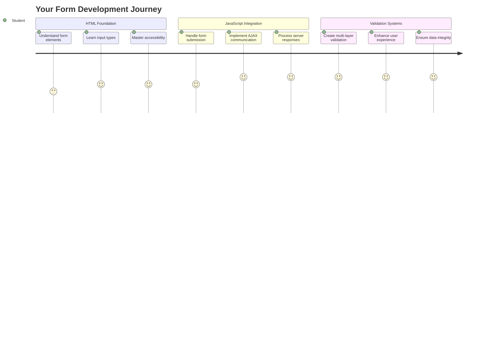
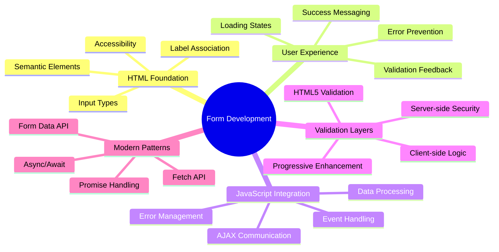
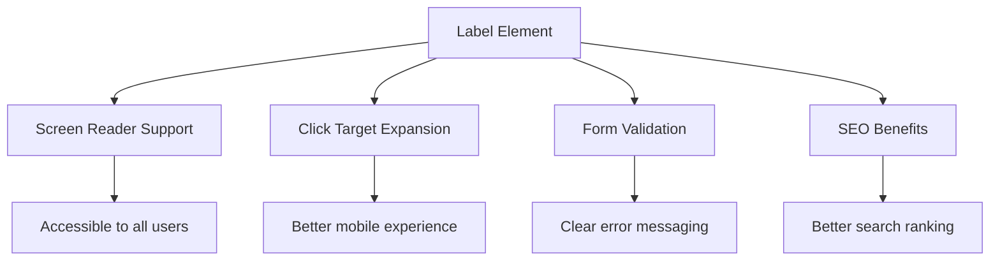
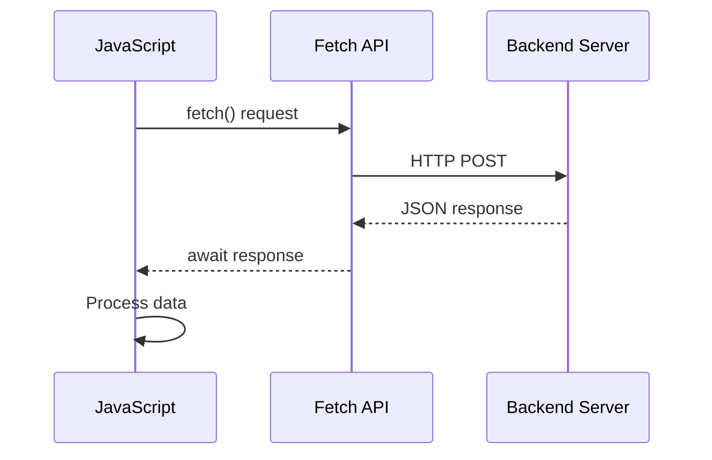
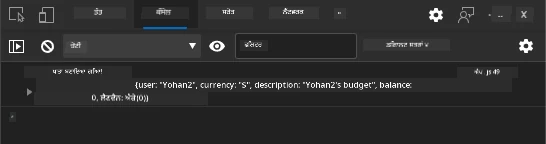
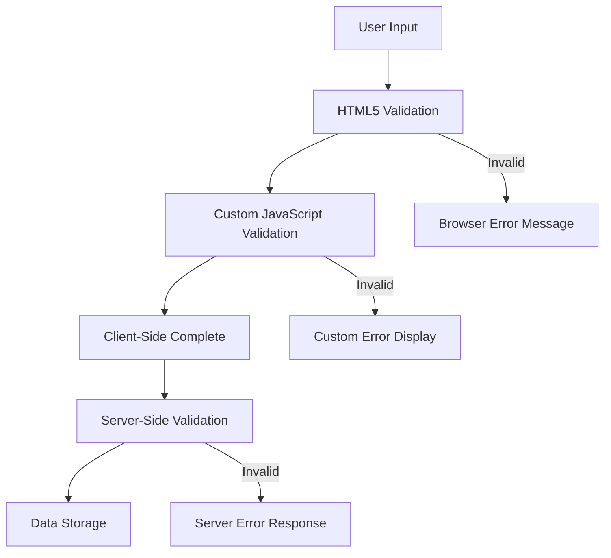

<!--
CO_OP_TRANSLATOR_METADATA:
{
  "original_hash": "7cbdbd132d39a2bb493e85bc2a9387cc",
  "translation_date": "2025-11-03T16:44:15+00:00",
  "source_file": "7-bank-project/2-forms/README.md",
  "language_code": "pa"
}
-->
# ਬੈਂਕਿੰਗ ਐਪ ਬਣਾਓ ਭਾਗ 2: ਲੌਗਇਨ ਅਤੇ ਰਜਿਸਟ੍ਰੇਸ਼ਨ ਫਾਰਮ ਬਣਾਓ



## ਲੈਕਚਰ ਤੋਂ ਪਹਿਲਾਂ ਕਵਿਜ਼

[ਲੈਕਚਰ ਤੋਂ ਪਹਿਲਾਂ ਕਵਿਜ਼](https://ff-quizzes.netlify.app/web/quiz/43)

ਕੀ ਤੁਸੀਂ ਕਦੇ ਆਨਲਾਈਨ ਫਾਰਮ ਭਰਿਆ ਹੈ ਅਤੇ ਤੁਹਾਡੇ ਈਮੇਲ ਫਾਰਮੈਟ ਨੂੰ ਰੱਦ ਕਰ ਦਿੱਤਾ ਗਿਆ? ਜਾਂ ਜਦੋਂ ਤੁਸੀਂ ਸਬਮਿਟ ਦਬਾਇਆ ਤਾਂ ਸਾਰਾ ਡਾਟਾ ਗੁਆ ਲਿਆ? ਅਸੀਂ ਸਾਰੇ ਇਹਨਾਂ ਨਿਰਾਸ਼ਾਜਨਕ ਤਜਰਬਿਆਂ ਦਾ ਸਾਹਮਣਾ ਕੀਤਾ ਹੈ।

ਫਾਰਮ ਤੁਹਾਡੇ ਯੂਜ਼ਰ ਅਤੇ ਤੁਹਾਡੇ ਐਪਲੀਕੇਸ਼ਨ ਦੀ ਕਾਰਗੁਜ਼ਾਰੀ ਦੇ ਵਿਚਕਾਰ ਪੁਲ ਹਨ। ਜਿਵੇਂ ਹਵਾਈ ਟ੍ਰੈਫਿਕ ਕੰਟਰੋਲਰ ਜਹਾਜ਼ਾਂ ਨੂੰ ਸੁਰੱਖਿਅਤ ਤਰੀਕੇ ਨਾਲ ਉਨ੍ਹਾਂ ਦੇ ਮੰਜ਼ਿਲਾਂ ਤੱਕ ਪਹੁੰਚਾਉਣ ਲਈ ਸਾਵਧਾਨੀ ਨਾਲ ਪ੍ਰੋਟੋਕੋਲ ਦੀ ਵਰਤੋਂ ਕਰਦੇ ਹਨ, ਠੀਕ ਤਰੀਕੇ ਨਾਲ ਡਿਜ਼ਾਈਨ ਕੀਤੇ ਫਾਰਮ ਸਪਸ਼ਟ ਫੀਡਬੈਕ ਦਿੰਦੇ ਹਨ ਅਤੇ ਮਹਿੰਗੇ ਗਲਤੀਆਂ ਨੂੰ ਰੋਕਦੇ ਹਨ। ਖਰਾਬ ਫਾਰਮ, ਦੂਜੇ ਪਾਸੇ, ਯੂਜ਼ਰ ਨੂੰ ਜਲਦੀ ਦੂਰ ਕਰ ਸਕਦੇ ਹਨ।

ਇਸ ਪਾਠ ਵਿੱਚ, ਅਸੀਂ ਤੁਹਾਡੇ ਸਥਿਰ ਬੈਂਕਿੰਗ ਐਪ ਨੂੰ ਇੱਕ ਇੰਟਰਐਕਟਿਵ ਐਪਲੀਕੇਸ਼ਨ ਵਿੱਚ ਬਦਲਾਂਗੇ। ਤੁਸੀਂ ਸਿੱਖੋਗੇ ਕਿ ਯੂਜ਼ਰ ਇਨਪੁਟ ਦੀ ਵੈਧਤਾ ਦੀ ਜਾਂਚ ਕਰਨ ਵਾਲੇ, ਸਰਵਰਾਂ ਨਾਲ ਸੰਚਾਰ ਕਰਨ ਵਾਲੇ ਅਤੇ ਮਦਦਗਾਰ ਫੀਡਬੈਕ ਪ੍ਰਦਾਨ ਕਰਨ ਵਾਲੇ ਫਾਰਮ ਕਿਵੇਂ ਬਣਾਉਣੇ ਹਨ। ਇਸਨੂੰ ਤੁਹਾਡੇ ਐਪਲੀਕੇਸ਼ਨ ਦੀਆਂ ਵਿਸ਼ੇਸ਼ਤਾਵਾਂ ਨੂੰ ਨੈਵੀਗੇਟ ਕਰਨ ਦੇ ਯੂਜ਼ਰ ਨੂੰ ਸਹਾਇਕ ਬਣਾਉਣ ਵਾਲੇ ਕੰਟਰੋਲ ਇੰਟਰਫੇਸ ਬਣਾਉਣ ਵਜੋਂ ਸੋਚੋ।

ਅੰਤ ਵਿੱਚ, ਤੁਹਾਡੇ ਕੋਲ ਇੱਕ ਪੂਰਾ ਲੌਗਇਨ ਅਤੇ ਰਜਿਸਟ੍ਰੇਸ਼ਨ ਸਿਸਟਮ ਹੋਵੇਗਾ ਜਿਸ ਵਿੱਚ ਵੈਧਤਾ ਹੋਵੇਗੀ ਜੋ ਯੂਜ਼ਰ ਨੂੰ ਨਿਰਾਸ਼ਾ ਦੀ ਬਜਾਏ ਸਫਲਤਾ ਵੱਲ ਦਿਸ਼ਾ ਦਿੰਦਾ ਹੈ।



## ਪੂਰਵ ਸ਼ਰਤਾਂ

ਫਾਰਮ ਬਣਾਉਣ ਤੋਂ ਪਹਿਲਾਂ, ਆਓ ਇਹ ਯਕੀਨੀ ਬਣਾਈਏ ਕਿ ਤੁਹਾਡੇ ਕੋਲ ਸਭ ਕੁਝ ਠੀਕ ਤਰੀਕੇ ਨਾਲ ਸੈਟਅਪ ਹੈ। ਇਹ ਪਾਠ ਪਿਛਲੇ ਪਾਠ ਤੋਂ ਸਿੱਧੇ ਜੁੜਦਾ ਹੈ, ਇਸ ਲਈ ਜੇ ਤੁਸੀਂ ਅੱਗੇ ਵਧ ਗਏ ਹੋ, ਤਾਂ ਤੁਸੀਂ ਪਹਿਲਾਂ ਮੁੱਢਲੀ ਚੀਜ਼ਾਂ ਨੂੰ ਸੈਟਅਪ ਕਰਨ ਲਈ ਵਾਪਸ ਜਾਣਾ ਚਾਹੁੰਦੇ ਹੋ।

### ਲੋੜੀਂਦਾ ਸੈਟਅਪ

| ਕੰਪੋਨੈਂਟ | ਸਥਿਤੀ | ਵੇਰਵਾ |
|-----------|--------|-------------|
| [HTML ਟੈਂਪਲੇਟ](../1-template-route/README.md) | ✅ ਲੋੜੀਂਦਾ | ਤੁਹਾਡੇ ਬੈਂਕਿੰਗ ਐਪ ਦੀ ਮੁੱਢਲੀ ਬਣਤਰ |
| [Node.js](https://nodejs.org) | ✅ ਲੋੜੀਂਦਾ | ਸਰਵਰ ਲਈ ਜਾਵਾਸਕ੍ਰਿਪਟ ਰਨਟਾਈਮ |
| [Bank API Server](../api/README.md) | ✅ ਲੋੜੀਂਦਾ | ਡਾਟਾ ਸਟੋਰੇਜ ਲਈ ਬੈਕਐਂਡ ਸੇਵਾ |

> 💡 **ਡਿਵੈਲਪਮੈਂਟ ਟਿਪ**: ਤੁਸੀਂ ਇੱਕ ਸਮੇਂ ਦੋ ਵੱਖਰੇ ਸਰਵਰ ਚਲਾਉਂਦੇ ਹੋ – ਇੱਕ ਤੁਹਾਡੇ ਫਰੰਟ-ਐਂਡ ਬੈਂਕਿੰਗ ਐਪ ਲਈ ਅਤੇ ਦੂਜਾ ਬੈਕਐਂਡ API ਲਈ। ਇਹ ਸੈਟਅਪ ਅਸਲ-ਜਗਤ ਦੇ ਵਿਕਾਸ ਨੂੰ ਦਰਸਾਉਂਦਾ ਹੈ ਜਿੱਥੇ ਫਰੰਟਐਂਡ ਅਤੇ ਬੈਕਐਂਡ ਸੇਵਾਵਾਂ ਅਜ਼ਾਦੀ ਨਾਲ ਕੰਮ ਕਰਦੀਆਂ ਹਨ।

### ਸਰਵਰ ਸੰਰਚਨਾ

**ਤੁਹਾਡਾ ਵਿਕਾਸ ਵਾਤਾਵਰਣ ਸ਼ਾਮਲ ਕਰੇਗਾ:**
- **ਫਰੰਟਐਂਡ ਸਰਵਰ**: ਤੁਹਾਡੇ ਬੈਂਕਿੰਗ ਐਪ ਨੂੰ ਸਰਵ ਕਰਦਾ ਹੈ (ਆਮ ਤੌਰ 'ਤੇ ਪੋਰਟ `3000`)
- **ਬੈਕਐਂਡ API ਸਰਵਰ**: ਡਾਟਾ ਸਟੋਰੇਜ ਅਤੇ ਰੀਟਰੀਵਲ ਨੂੰ ਸੰਭਾਲਦਾ ਹੈ (ਪੋਰਟ `5000`)
- **ਦੋਵੇਂ ਸਰਵਰ** ਬਿਨਾਂ ਕਿਸੇ ਟਕਰਾਅ ਦੇ ਇੱਕ ਸਮੇਂ ਚਲ ਸਕਦੇ ਹਨ

**ਤੁਹਾਡੇ API ਕਨੈਕਸ਼ਨ ਦੀ ਜਾਂਚ:**
```bash
curl http://localhost:5000/api
# Expected response: "Bank API v1.0.0"
```

**ਜੇ ਤੁਸੀਂ API ਵਰਜਨ ਦਾ ਜਵਾਬ ਵੇਖਦੇ ਹੋ, ਤਾਂ ਤੁਸੀਂ ਅੱਗੇ ਵਧਣ ਲਈ ਤਿਆਰ ਹੋ!**

---

## HTML ਫਾਰਮ ਅਤੇ ਕੰਟਰੋਲ ਨੂੰ ਸਮਝਣਾ

HTML ਫਾਰਮ ਤੁਹਾਡੇ ਵੈੱਬ ਐਪਲੀਕੇਸ਼ਨ ਨਾਲ ਯੂਜ਼ਰਾਂ ਦੇ ਸੰਚਾਰ ਦਾ ਸਾਧਨ ਹਨ। ਇਹਨਾਂ ਨੂੰ 19ਵੀਂ ਸਦੀ ਵਿੱਚ ਦੂਰ-ਦੂਰ ਦੇ ਸਥਾਨਾਂ ਨੂੰ ਜੋੜਨ ਵਾਲੇ ਟੈਲੀਗ੍ਰਾਫ ਸਿਸਟਮ ਵਜੋਂ ਸੋਚੋ – ਇਹ ਯੂਜ਼ਰ ਦੇ ਇਰਾਦੇ ਅਤੇ ਐਪਲੀਕੇਸ਼ਨ ਦੇ ਜਵਾਬ ਦੇ ਵਿਚਕਾਰ ਸੰਚਾਰ ਪ੍ਰੋਟੋਕੋਲ ਹਨ। ਜਦੋਂ ਸੋਚ-ਵਿਚਾਰ ਨਾਲ ਡਿਜ਼ਾਈਨ ਕੀਤਾ ਜਾਂਦਾ ਹੈ, ਇਹ ਗਲਤੀਆਂ ਨੂੰ ਫੜਦੇ ਹਨ, ਇਨਪੁਟ ਫਾਰਮੈਟਿੰਗ ਨੂੰ ਗਾਈਡ ਕਰਦੇ ਹਨ ਅਤੇ ਮਦਦਗਾਰ ਸੁਝਾਅ ਪ੍ਰਦਾਨ ਕਰਦੇ ਹਨ।

ਆਧੁਨਿਕ ਫਾਰਮ ਬੁਨਿਆਦੀ ਟੈਕਸਟ ਇਨਪੁਟ ਤੋਂ ਕਾਫੀ ਜ਼ਿਆਦਾ ਸੁਧਾਰਸ਼ੀਲ ਹਨ। HTML5 ਨੇ ਵਿਸ਼ੇਸ਼ ਇਨਪੁਟ ਕਿਸਮਾਂ ਦੀ ਪੇਸ਼ਕਸ਼ ਕੀਤੀ ਜੋ ਈਮੇਲ ਵੈਧਤਾ, ਨੰਬਰ ਫਾਰਮੈਟਿੰਗ ਅਤੇ ਮਿਤੀ ਚੋਣ ਨੂੰ ਆਪਣੇ ਆਪ ਸੰਭਾਲਦੇ ਹਨ। ਇਹ ਸੁਧਾਰ ਪਹੁੰਚਯੋਗਤਾ ਅਤੇ ਮੋਬਾਈਲ ਯੂਜ਼ਰ ਅਨੁਭਵਾਂ ਦੋਵਾਂ ਲਈ ਲਾਭਦਾਇਕ ਹਨ।

### ਜ਼ਰੂਰੀ ਫਾਰਮ ਤੱਤ

**ਹਰ ਫਾਰਮ ਨੂੰ ਲੋੜੀਂਦੇ ਬਲਾਕ:**

```html
<!-- Basic form structure -->
<form id="userForm" method="POST">
  <label for="username">Username</label>
  <input id="username" name="username" type="text" required>
  
  <button type="submit">Submit</button>
</form>
```

**ਇਹ ਕੋਡ ਕੀ ਕਰਦਾ ਹੈ:**
- **ਇੱਕ ਫਾਰਮ ਕੰਟੇਨਰ ਬਣਾਉਂਦਾ ਹੈ** ਜਿਸ ਵਿੱਚ ਇੱਕ ਵਿਲੱਖਣ ਪਛਾਣਕਰਤਾ ਹੁੰਦਾ ਹੈ
- **ਡਾਟਾ ਸਬਮਿਸ਼ਨ ਲਈ HTTP ਵਿਧੀ ਨਿਰਧਾਰਤ ਕਰਦਾ ਹੈ**
- **ਪਹੁੰਚਯੋਗਤਾ ਲਈ ਲੇਬਲਾਂ ਨੂੰ ਇਨਪੁਟ ਨਾਲ ਜੋੜਦਾ ਹੈ**
- **ਫਾਰਮ ਨੂੰ ਪ੍ਰਕਿਰਿਆ ਕਰਨ ਲਈ ਸਬਮਿਟ ਬਟਨ ਨੂੰ ਪਰਿਭਾਸ਼ਿਤ ਕਰਦਾ ਹੈ**

### ਆਧੁਨਿਕ ਇਨਪੁਟ ਕਿਸਮਾਂ ਅਤੇ ਗੁਣ

| ਇਨਪੁਟ ਕਿਸਮ | ਉਦੇਸ਼ | ਉਦਾਹਰਨ ਵਰਤੋਂ |
|------------|---------|---------------|
| `text` | ਆਮ ਟੈਕਸਟ ਇਨਪੁਟ | `<input type="text" name="username">` |
| `email` | ਈਮੇਲ ਵੈਧਤਾ | `<input type="email" name="email">` |
| `password` | ਲੁਕਿਆ ਹੋਇਆ ਟੈਕਸਟ ਐਂਟਰੀ | `<input type="password" name="password">` |
| `number` | ਸੰਖਿਆਵਾਂ ਦਾ ਇਨਪੁਟ | `<input type="number" name="balance" min="0">` |
| `tel` | ਫੋਨ ਨੰਬਰ | `<input type="tel" name="phone">` |

> 💡 **ਆਧੁਨਿਕ HTML5 ਫਾਇਦਾ**: ਵਿਸ਼ੇਸ਼ ਇਨਪੁਟ ਕਿਸਮਾਂ ਦੀ ਵਰਤੋਂ ਨਾਲ ਬਿਨਾਂ ਵਾਧੂ ਜਾਵਾਸਕ੍ਰਿਪਟ ਦੇ ਆਪਣੇ ਆਪ ਵੈਧਤਾ, ਉਚਿਤ ਮੋਬਾਈਲ ਕੀਬੋਰਡ ਅਤੇ ਵਧੀਆ ਪਹੁੰਚਯੋਗਤਾ ਸਹਾਇਤਾ ਪ੍ਰਦਾਨ ਹੁੰਦੀ ਹੈ!

### ਬਟਨ ਕਿਸਮਾਂ ਅਤੇ ਵਿਹਾਰ

```html
<!-- Different button behaviors -->
<button type="submit">Save Data</button>     <!-- Submits the form -->
<button type="reset">Clear Form</button>    <!-- Resets all fields -->
<button type="button">Custom Action</button> <!-- No default behavior -->
```

**ਹਰ ਬਟਨ ਕਿਸਮ ਕੀ ਕਰਦੀ ਹੈ:**
- **ਸਬਮਿਟ ਬਟਨ**: ਫਾਰਮ ਸਬਮਿਸ਼ਨ ਨੂੰ ਟ੍ਰਿਗਰ ਕਰਦਾ ਹੈ ਅਤੇ ਡਾਟਾ ਨੂੰ ਨਿਰਧਾਰਤ ਐਂਡਪੌਇੰਟ ਤੇ ਭੇਜਦਾ ਹੈ
- **ਰੀਸੈਟ ਬਟਨ**: ਸਾਰੇ ਫਾਰਮ ਫੀਲਡਾਂ ਨੂੰ ਉਨ੍ਹਾਂ ਦੀ ਸ਼ੁਰੂਆਤੀ ਸਥਿਤੀ ਵਿੱਚ ਮੁੜ ਸੈਟ ਕਰਦਾ ਹੈ
- **ਸਧਾਰਨ ਬਟਨ**: ਕੋਈ ਡਿਫਾਲਟ ਵਿਹਾਰ ਪ੍ਰਦਾਨ ਨਹੀਂ ਕਰਦਾ, ਜਿਸ ਲਈ ਵਿਸ਼ੇਸ਼ ਜਾਵਾਸਕ੍ਰਿਪਟ ਦੀ ਲੋੜ ਹੁੰਦੀ ਹੈ

> ⚠️ **ਮਹੱਤਵਪੂਰਨ ਨੋਟ**: `<input>` ਤੱਤ ਸਵੈ-ਬੰਦ ਹੈ ਅਤੇ ਬੰਦ ਕਰਨ ਵਾਲੇ ਟੈਗ ਦੀ ਲੋੜ ਨਹੀਂ ਹੁੰਦੀ। ਆਧੁਨਿਕ ਵਧੀਆ ਅਭਿਆਸ `<input>` ਨੂੰ ਬਿਨਾਂ ਸਲੈਸ਼ ਦੇ ਲਿਖਣਾ ਹੈ।

### ਤੁਹਾਡਾ ਲੌਗਇਨ ਫਾਰਮ ਬਣਾਉਣਾ

ਹੁਣ ਆਓ ਇੱਕ ਵਿਹਾਰਕ ਲੌਗਇਨ ਫਾਰਮ ਬਣਾਈਏ ਜੋ ਆਧੁਨਿਕ HTML ਫਾਰਮ ਅਭਿਆਸਾਂ ਨੂੰ ਦਰਸਾਉਂਦਾ ਹੈ। ਅਸੀਂ ਇੱਕ ਬੁਨਿਆਦੀ ਬਣਤਰ ਨਾਲ ਸ਼ੁਰੂ ਕਰਾਂਗੇ ਅਤੇ ਪਹੁੰਚਯੋਗਤਾ ਵਿਸ਼ੇਸ਼ਤਾਵਾਂ ਅਤੇ ਵੈਧਤਾ ਨਾਲ ਇਸਨੂੰ ਧੀਰੇ-ਧੀਰੇ ਸੁਧਾਰਾਂਗੇ।

```html
<template id="login">
  <h1>Bank App</h1>
  <section>
    <h2>Login</h2>
    <form id="loginForm" novalidate>
      <div class="form-group">
        <label for="username">Username</label>
        <input id="username" name="user" type="text" required 
               autocomplete="username" placeholder="Enter your username">
      </div>
      <button type="submit">Login</button>
    </form>
  </section>
</template>
```

**ਇੱਥੇ ਕੀ ਹੁੰਦਾ ਹੈ:**
- **ਸਮਾਂਜਸ HTML5 ਤੱਤਾਂ ਨਾਲ ਫਾਰਮ ਬਣਾਉਂਦਾ ਹੈ**
- **ਅਰਥਪੂਰਨ ਕਲਾਸਾਂ ਨਾਲ `div` ਕੰਟੇਨਰਾਂ ਦੀ ਵਰਤੋਂ ਕਰਕੇ ਸੰਬੰਧਿਤ ਤੱਤਾਂ ਨੂੰ ਸਮੂਹਬੱਧ ਕਰਦਾ ਹੈ**
- **ਲੇਬਲਾਂ ਨੂੰ `for` ਅਤੇ `id` ਗੁਣਾਂ ਦੀ ਵਰਤੋਂ ਕਰਕੇ ਇਨਪੁਟ ਨਾਲ ਜੋੜਦਾ ਹੈ**
- **ਵਧੀਆ UX ਲਈ `autocomplete` ਅਤੇ `placeholder` ਵਰਗੇ ਆਧੁਨਿਕ ਗੁਣ ਸ਼ਾਮਲ ਕਰਦਾ ਹੈ**
- **ਬ੍ਰਾਊਜ਼ਰ ਡਿਫਾਲਟ ਦੇ ਬਦਲੇ ਜਾਵਾਸਕ੍ਰਿਪਟ ਨਾਲ ਵੈਧਤਾ ਸੰਭਾਲਣ ਲਈ `novalidate` ਸ਼ਾਮਲ ਕਰਦਾ ਹੈ**

### ਠੀਕ ਲੇਬਲਾਂ ਦੀ ਤਾਕਤ

**ਆਧੁਨਿਕ ਵੈੱਬ ਵਿਕਾਸ ਲਈ ਲੇਬਲ ਕਿਉਂ ਮਹੱਤਵਪੂਰਨ ਹਨ:**



**ਠੀਕ ਲੇਬਲਾਂ ਕੀ ਪ੍ਰਾਪਤ ਕਰਦੀਆਂ ਹਨ:**
- **ਸਕਰੀਨ ਰੀਡਰਾਂ ਨੂੰ ਫਾਰਮ ਫੀਲਡਾਂ ਨੂੰ ਸਪਸ਼ਟ ਤੌਰ 'ਤੇ ਐਲਾਨ ਕਰਨ ਦੇ ਯੋਗ ਬਣਾਉਂਦਾ ਹੈ**
- **ਕਲਿੱਕ ਕਰਨ ਵਾਲੇ ਖੇਤਰ ਨੂੰ ਵਧਾਉਂਦਾ ਹੈ (ਲੇਬਲ 'ਤੇ ਕਲਿੱਕ ਕਰਨ ਨਾਲ ਇਨਪੁਟ ਫੋਕਸ ਹੁੰਦਾ ਹੈ)**
- **ਮੋਬਾਈਲ ਯੂਜ਼ਬਿਲਿਟੀ ਵਿੱਚ ਸੁਧਾਰ ਕਰਦਾ ਹੈ ਵੱਡੇ ਟਚ ਟਾਰਗਟਾਂ ਨਾਲ**
- **ਅਰਥਪੂਰਨ ਗਲਤੀ ਸੁਨੇਹਿਆਂ ਨਾਲ ਫਾਰਮ ਵੈਧਤਾ ਦਾ ਸਮਰਥਨ ਕਰਦਾ ਹੈ**
- **SEO ਵਿੱਚ ਸੁਧਾਰ ਕਰਦਾ ਹੈ ਫਾਰਮ ਤੱਤਾਂ ਨੂੰ ਸਮਾਂਜਸ ਅਰਥ ਪ੍ਰਦਾਨ ਕਰਕੇ**

> 🎯 **ਪਹੁੰਚਯੋਗਤਾ ਦਾ ਲਕਸ਼**: ਹਰ ਫਾਰਮ ਇਨਪੁਟ ਦਾ ਇੱਕ ਸੰਬੰਧਿਤ ਲੇਬਲ ਹੋਣਾ ਚਾਹੀਦਾ ਹੈ। ਇਹ ਸਧਾਰਨ ਅਭਿਆਸ ਤੁਹਾਡੇ ਫਾਰਮਾਂ ਨੂੰ ਹਰ ਕਿਸੇ ਲਈ ਵਰਤਣਯੋਗ ਬਣਾਉਂਦਾ ਹੈ, ਜਿਸ ਵਿੱਚ ਅਪੰਗਤਾ ਵਾਲੇ ਯੂਜ਼ਰ ਸ਼ਾਮਲ ਹਨ, ਅਤੇ ਸਾਰੇ ਯੂਜ਼ਰਾਂ ਲਈ ਅਨੁਭਵ ਵਿੱਚ ਸੁਧਾਰ ਕਰਦਾ ਹੈ।

### ਰਜਿਸਟ੍ਰੇਸ਼ਨ ਫਾਰਮ ਬਣਾਉਣਾ

ਰਜਿਸਟ੍ਰੇਸ਼ਨ ਫਾਰਮ ਨੂੰ ਪੂਰੇ ਯੂਜ਼ਰ ਅਕਾਊਂਟ ਬਣਾਉਣ ਲਈ ਹੋਰ ਵਿਸਥਾਰਿਤ ਜਾਣਕਾਰੀ ਦੀ ਲੋੜ ਹੁੰਦੀ ਹੈ। ਆਓ ਇਸਨੂੰ ਆਧੁਨਿਕ HTML5 ਵਿਸ਼ੇਸ਼ਤਾਵਾਂ ਅਤੇ ਵਧੀਕ ਪਹੁੰਚਯੋਗਤਾ ਨਾਲ ਬਣਾਈਏ।

```html
<hr/>
<h2>Register</h2>
<form id="registerForm" novalidate>
  <div class="form-group">
    <label for="user">Username</label>
    <input id="user" name="user" type="text" required 
           autocomplete="username" placeholder="Choose a username">
  </div>
  
  <div class="form-group">
    <label for="currency">Currency</label>
    <input id="currency" name="currency" type="text" value="$" 
           required maxlength="3" placeholder="USD, EUR, etc.">
  </div>
  
  <div class="form-group">
    <label for="description">Account Description</label>
    <input id="description" name="description" type="text" 
           maxlength="100" placeholder="Personal savings, checking, etc.">
  </div>
  
  <div class="form-group">
    <label for="balance">Starting Balance</label>
    <input id="balance" name="balance" type="number" value="0" 
           min="0" step="0.01" placeholder="0.00">
  </div>
  
  <button type="submit">Create Account</button>
</form>
```

**ਉਪਰੋਕਤ ਵਿੱਚ, ਅਸੀਂ:**
- **ਹਰ ਫੀਲਡ ਨੂੰ ਬਿਹਤਰ ਸਟਾਈਲਿੰਗ ਅਤੇ ਲੇਆਉਟ ਲਈ ਕੰਟੇਨਰ div ਵਿੱਚ ਸੰਗਠਿਤ ਕੀਤਾ**
- **ਬ੍ਰਾਊਜ਼ਰ ਆਟੋਫਿਲ ਸਹਾਇਤਾ ਲਈ ਉਚਿਤ `autocomplete` ਗੁਣ ਸ਼ਾਮਲ ਕੀਤੇ**
- **ਯੂਜ਼ਰ ਇਨਪੁਟ ਨੂੰ ਗਾਈਡ ਕਰਨ ਲਈ ਮਦਦਗਾਰ ਪਲੇਸਹੋਲਡਰ ਟੈਕਸਟ ਸ਼ਾਮਲ ਕੀਤਾ**
- **`value` ਗੁਣ ਦੀ ਵਰਤੋਂ ਕਰਕੇ ਸਮਝਦਾਰ ਡਿਫਾਲਟ ਸੈਟ ਕੀਤੇ**
- **ਵੈਧਤਾ ਗੁਣਾਂ ਜਿਵੇਂ `required`, `maxlength`, ਅਤੇ `min` ਲਾਗੂ ਕੀਤੇ**
- **ਦਸ਼ਮਲਵ ਸਹਾਇਤਾ ਨਾਲ ਬੈਲੈਂਸ ਫੀਲਡ ਲਈ `type="number"` ਦੀ ਵਰਤੋਂ ਕੀਤੀ**

### ਇਨਪੁਟ ਕਿਸਮਾਂ ਅਤੇ ਵਿਹਾਰ ਦੀ ਖੋਜ

**ਆਧੁਨਿਕ ਇਨਪੁਟ ਕਿਸਮਾਂ ਵਧੀਕ ਕਾਰਗੁਜ਼ਾਰੀ ਪ੍ਰਦਾਨ ਕਰਦੀਆਂ ਹਨ:**

| ਵਿਸ਼ੇਸ਼ਤਾ | ਫਾਇਦਾ | ਉਦਾਹਰਨ |
|---------|---------|----------|
| `type="number"` | ਮੋਬਾਈਲ 'ਤੇ ਨੰਬਰਿਕ ਕੀਪੈਡ | ਬੈਲੈਂਸ ਐਂਟਰੀ ਨੂੰ ਆਸਾਨ ਬਣਾਉਂਦਾ ਹੈ |
| `step="0.01"` | ਦਸ਼ਮਲਵ ਸਹੀਤਾ ਕੰਟਰੋਲ | ਮੁਦਰਾ ਵਿੱਚ ਸੈਂਟ ਦੀ ਆਗਿਆ ਦਿੰਦਾ ਹੈ |
| `autocomplete` | ਬ੍ਰਾਊਜ਼ਰ ਆਟੋਫਿਲ | ਫਾਰਮ ਪੂਰਾ ਕਰਨ ਵਿੱਚ ਤੇਜ਼ੀ |
| `placeholder` | ਸੰਦਰਭਕ ਸੁਝਾਅ | ਯੂਜ਼ਰ ਦੀ ਉਮੀਦਾਂ ਨੂੰ ਗਾਈਡ ਕਰਦਾ ਹੈ |

> 🎯 **ਪਹੁੰਚਯੋਗਤਾ ਚੁਣੌਤੀ**: ਸਿਰਫ ਆਪਣੇ ਕੀਬੋਰਡ ਦੀ ਵਰਤੋਂ ਕਰਕੇ ਫਾਰਮਾਂ ਨੂੰ ਨੈਵੀਗੇਟ ਕਰਨ ਦੀ ਕੋਸ਼ਿਸ਼ ਕਰੋ! ਫੀਲਡਾਂ ਦੇ ਵਿਚਕਾਰ ਜਾਣ ਲਈ `Tab` ਦੀ ਵਰਤੋਂ ਕਰੋ, ਚੈੱਕ ਬਾਕਸਾਂ ਨੂੰ ਚੁਣਨ ਲਈ `Space` ਅਤੇ ਸਬਮਿਟ ਕਰਨ ਲਈ `Enter`। ਇਹ ਅਨੁਭਵ ਤੁਹਾਨੂੰ ਸਮਝਣ ਵਿੱਚ ਮਦਦ ਕਰਦਾ ਹੈ ਕਿ ਸਕਰੀਨ ਰੀਡਰ ਯੂਜ਼ਰ ਤੁਹਾਡੇ ਫਾਰਮਾਂ ਨਾਲ ਕਿਵੇਂ ਸੰਚਾਰ ਕਰਦੇ ਹਨ।

### 🔄 **ਪੈਡਾਗੌਜੀਕਲ ਚੈੱਕ-ਇਨ**
**ਫਾਰਮ ਦੀ ਬੁਨਿਆਦ ਸਮਝਣਾ**: ਜਾਵਾਸਕ੍ਰਿਪਟ ਲਾਗੂ ਕਰਨ ਤੋਂ ਪਹਿਲਾਂ, ਇਹ ਯਕੀਨੀ ਬਣਾਓ ਕਿ ਤੁਸੀਂ ਸਮਝਦੇ ਹੋ:
- ✅ ਕਿਵੇਂ ਸਮਾਂਜਸ HTML ਪਹੁੰਚਯੋਗ ਫਾਰਮ ਬਣਤਰਾਂ ਬਣਾਉਂਦਾ ਹੈ
- ✅ ਕਿਉਂ ਇਨਪੁਟ ਕਿਸਮਾਂ ਮੋਬਾਈਲ ਕੀਬੋਰਡ ਅਤੇ ਵੈਧਤਾ ਲਈ ਮਹੱਤਵਪੂਰਨ ਹਨ
- ✅ ਲੇਬਲਾਂ ਅਤੇ ਫਾਰਮ ਕੰਟਰੋਲਾਂ ਦੇ ਵਿਚਕਾਰ ਸੰਬੰਧ
- ✅ ਕਿਵੇਂ ਫਾਰਮ ਗੁਣਾਂ ਡਿਫਾਲਟ ਬ੍ਰਾਊਜ਼ਰ ਵਿਹਾਰ ਨੂੰ ਪ੍ਰਭਾਵਿਤ ਕਰਦੇ ਹਨ

**ਤੁਰੰਤ ਸਵਾਲ-ਜਵਾਬ**: ਜੇ ਤੁਸੀਂ ਜਾਵਾਸਕ੍ਰਿਪਟ ਹੈਂਡਲਿੰਗ ਤੋਂ ਬਿਨਾਂ ਫਾਰਮ ਸਬਮਿਟ ਕਰੋ ਤਾਂ ਕੀ ਹੁੰਦਾ ਹੈ?
*ਜਵਾਬ: ਬ੍ਰਾਊਜ਼ਰ ਡਿਫਾਲਟ ਸਬਮਿਸ਼ਨ ਕਰਦਾ ਹੈ, ਆਮ ਤੌਰ 'ਤੇ ਐਕਸ਼ਨ URL ਤੇ ਰੀਡਾਇਰੈਕਟ ਕਰਦਾ ਹੈ*

**HTML5 ਫਾਰਮ ਫਾਇਦੇ**: ਆਧੁਨਿਕ ਫਾਰਮ ਪ੍ਰਦਾਨ ਕਰਦੇ ਹਨ:
- **ਬਿਲਟ-ਇਨ ਵੈਧਤਾ**: ਈਮੇਲ ਅਤੇ ਨੰਬਰ ਫਾਰਮੈਟ ਦੀ ਆਪਣੇ ਆਪ ਜਾਂਚ
- **ਮੋਬਾਈਲ ਅਪਟਿਮਾਈਜ਼ੇਸ਼ਨ**: ਵੱਖ-ਵੱਖ ਇਨਪੁਟ ਕਿਸਮਾਂ ਲਈ ਉਚਿਤ ਕੀਬੋਰਡ
- **ਪਹੁੰਚਯੋਗਤਾ**: ਸਕਰੀਨ ਰੀਡਰ ਸਹਾਇਤਾ ਅਤੇ ਕੀਬੋਰਡ ਨੈਵੀਗੇਸ਼ਨ
- **ਪ੍ਰੋਗਰੈਸਿਵ ਸੁਧਾਰ**: ਜਦੋਂ ਜਾਵਾਸਕ੍ਰਿਪਟ ਅਯੋਗ ਹੁੰਦਾ ਹੈ ਤਾਂ ਵੀ ਕੰਮ ਕਰਦਾ ਹੈ

## ਫਾਰਮ ਸਬਮਿਸ਼ਨ ਵਿਧੀਆਂ ਨੂੰ ਸਮਝਣਾ

ਜ
```javascript
// Example of what FormData captures
const formData = new FormData(registerForm);

// FormData automatically captures:
// {
//   "user": "john_doe",
//   "currency": "$", 
//   "description": "Personal account",
//   "balance": "100"
// }
```

**FormData API ਦੇ ਫਾਇਦੇ:**
- **ਵਿਆਪਕ ਸੰਗ੍ਰਹਿ**: ਸਾਰੇ ਫਾਰਮ ਤੱਤਾਂ ਨੂੰ ਕੈਪਚਰ ਕਰਦਾ ਹੈ ਜਿਵੇਂ ਕਿ ਟੈਕਸਟ, ਫਾਈਲਾਂ ਅਤੇ ਜਟਿਲ ਇਨਪੁਟ
- **ਟਾਈਪ ਜਾਗਰੂਕਤਾ**: ਵੱਖ-ਵੱਖ ਇਨਪੁਟ ਟਾਈਪਾਂ ਨੂੰ ਬਿਨਾਂ ਕਿਸੇ ਕਸਟਮ ਕੋਡਿੰਗ ਦੇ ਆਪਣੇ ਆਪ ਸੰਭਾਲਦਾ ਹੈ
- **ਕੁਸ਼ਲਤਾ**: ਇੱਕੋ API ਕਾਲ ਨਾਲ ਮੈਨੂਅਲ ਫੀਲਡ ਸੰਗ੍ਰਹਿ ਨੂੰ ਖਤਮ ਕਰਦਾ ਹੈ
- **ਅਨੁਕੂਲਤਾ**: ਜਦੋਂ ਫਾਰਮ ਦੀ ਬਣਤਰ ਵਿੱਚ ਤਬਦੀਲੀ ਹੁੰਦੀ ਹੈ ਤਾਂ ਕਾਰਜਸ਼ੀਲਤਾ ਨੂੰ ਬਰਕਰਾਰ ਰੱਖਦਾ ਹੈ

### ਸਰਵਰ ਸੰਚਾਰ ਫੰਕਸ਼ਨ ਬਣਾਉਣਾ

ਹੁਣ ਆਓ ਆਪਣੇ API ਸਰਵਰ ਨਾਲ ਸੰਚਾਰ ਕਰਨ ਲਈ ਇੱਕ ਮਜ਼ਬੂਤ ਫੰਕਸ਼ਨ ਬਣਾਈਏ ਜੋ ਆਧੁਨਿਕ ਜਾਵਾਸਕ੍ਰਿਪਟ ਪੈਟਰਨਾਂ ਦੀ ਵਰਤੋਂ ਕਰਦਾ ਹੈ:

```javascript
async function createAccount(account) {
  try {
    const response = await fetch('//localhost:5000/api/accounts', {
      method: 'POST',
      headers: { 
        'Content-Type': 'application/json',
        'Accept': 'application/json'
      },
      body: account
    });
    
    // Check if the response was successful
    if (!response.ok) {
      throw new Error(`HTTP error! status: ${response.status}`);
    }
    
    return await response.json();
  } catch (error) {
    console.error('Account creation failed:', error);
    return { error: error.message || 'Network error occurred' };
  }
}
```

**ਅਸਿੰਕ੍ਰੋਨਸ ਜਾਵਾਸਕ੍ਰਿਪਟ ਨੂੰ ਸਮਝਣਾ:**



**ਇਹ ਆਧੁਨਿਕ ਅਮਲ ਕੀ ਪ੍ਰਾਪਤ ਕਰਦਾ ਹੈ:**
- **ਵਰਤਦਾ ਹੈ** `async/await` ਪੜ੍ਹਨਯੋਗ ਅਸਿੰਕ੍ਰੋਨਸ ਕੋਡ ਲਈ
- **ਸ਼ਾਮਲ ਕਰਦਾ ਹੈ** ਸਹੀ ਗਲਤੀ ਸੰਭਾਲ try/catch ਬਲਾਕਾਂ ਨਾਲ
- **ਜਾਂਚਦਾ ਹੈ** ਡਾਟਾ ਪ੍ਰੋਸੈਸ ਕਰਨ ਤੋਂ ਪਹਿਲਾਂ ਰਿਸਪਾਂਸ ਸਥਿਤੀ
- **ਸੈਟ ਕਰਦਾ ਹੈ** JSON ਸੰਚਾਰ ਲਈ ਉਚਿਤ ਹੈਡਰ
- **ਪ੍ਰਦਾਨ ਕਰਦਾ ਹੈ** ਡੀਟੇਲਡ ਗਲਤੀ ਸੁਨੇਹੇ ਡੀਬੱਗਿੰਗ ਲਈ
- **ਵਾਪਸ ਕਰਦਾ ਹੈ** ਸਫਲਤਾ ਅਤੇ ਗਲਤੀ ਮਾਮਲਿਆਂ ਲਈ ਸਥਿਰ ਡਾਟਾ ਸਟ੍ਰਕਚਰ

### ਆਧੁਨਿਕ Fetch API ਦੀ ਤਾਕਤ

**ਪੁਰਾਣੇ ਤਰੀਕਿਆਂ ਦੇ ਮੁਕਾਬਲੇ Fetch API ਦੇ ਫਾਇਦੇ:**

| ਫੀਚਰ | ਫਾਇਦਾ | ਅਮਲ |
|---------|---------|----------------|
| ਪ੍ਰੋਮਿਸ-ਅਧਾਰਿਤ | ਸਾਫ ਅਸਿੰਕ ਕੋਡ | `await fetch()` |
| ਬੇਨਤੀ ਕਸਟਮਾਈਜ਼ੇਸ਼ਨ | ਪੂਰੀ HTTP ਕੰਟਰੋਲ | ਹੈਡਰ, ਤਰੀਕੇ, ਬਾਡੀ |
| ਰਿਸਪਾਂਸ ਸੰਭਾਲ | ਲਚਕਦਾਰ ਡਾਟਾ ਪਾਰਸਿੰਗ | `.json()`, `.text()`, `.blob()` |
| ਗਲਤੀ ਸੰਭਾਲ | ਵਿਆਪਕ ਗਲਤੀ ਪਕੜ | Try/catch ਬਲਾਕ |

> 🎥 **ਹੋਰ ਸਿੱਖੋ**: [Async/Await ਟਿਊਟੋਰਿਅਲ](https://youtube.com/watch?v=YwmlRkrxvkk) - ਆਧੁਨਿਕ ਵੈੱਬ ਵਿਕਾਸ ਲਈ ਅਸਿੰਕ੍ਰੋਨਸ ਜਾਵਾਸਕ੍ਰਿਪਟ ਪੈਟਰਨਾਂ ਨੂੰ ਸਮਝਣਾ।

**ਸਰਵਰ ਸੰਚਾਰ ਲਈ ਮੁੱਖ ਧਾਰਨਾਵਾਂ:**
- **ਅਸਿੰਕ ਫੰਕਸ਼ਨ** ਸਰਵਰ ਰਿਸਪਾਂਸ ਦੀ ਉਡੀਕ ਕਰਨ ਲਈ ਕਾਰਜ ਨੂੰ ਰੋਕਣ ਦੀ ਆਗਿਆ ਦਿੰਦੇ ਹਨ
- **Await ਕੀਵਰਡ** ਅਸਿੰਕ੍ਰੋਨਸ ਕੋਡ ਨੂੰ ਸਿੰਕ੍ਰੋਨਸ ਕੋਡ ਵਾਂਗ ਪੜ੍ਹਨਯੋਗ ਬਣਾਉਂਦਾ ਹੈ
- **Fetch API** ਆਧੁਨਿਕ, ਪ੍ਰੋਮਿਸ-ਅਧਾਰਿਤ HTTP ਬੇਨਤੀਆਂ ਪ੍ਰਦਾਨ ਕਰਦਾ ਹੈ
- **ਗਲਤੀ ਸੰਭਾਲ** ਯਕੀਨੀ ਬਣਾਉਂਦਾ ਹੈ ਕਿ ਤੁਹਾਡਾ ਐਪ ਨੈੱਟਵਰਕ ਸਮੱਸਿਆਵਾਂ ਲਈ ਸ਼ਾਲੀਨਤਾ ਨਾਲ ਪ੍ਰਤੀਕ੍ਰਿਆ ਕਰਦਾ ਹੈ

### ਰਜਿਸਟ੍ਰੇਸ਼ਨ ਫੰਕਸ਼ਨ ਪੂਰਾ ਕਰਨਾ

ਆਓ ਸਾਰਾ ਕੁਝ ਇਕੱਠਾ ਕਰਕੇ ਇੱਕ ਪੂਰਾ, ਉਤਪਾਦਨ-ਤਿਆਰ ਰਜਿਸਟ੍ਰੇਸ਼ਨ ਫੰਕਸ਼ਨ ਬਣਾਈਏ:

```javascript
async function register() {
  const registerForm = document.getElementById('registerForm');
  const submitButton = registerForm.querySelector('button[type="submit"]');
  
  try {
    // Show loading state
    submitButton.disabled = true;
    submitButton.textContent = 'Creating Account...';
    
    // Process form data
    const formData = new FormData(registerForm);
    const jsonData = JSON.stringify(Object.fromEntries(formData));
    
    // Send to server
    const result = await createAccount(jsonData);
    
    if (result.error) {
      console.error('Registration failed:', result.error);
      alert(`Registration failed: ${result.error}`);
      return;
    }
    
    console.log('Account created successfully!', result);
    alert(`Welcome, ${result.user}! Your account has been created.`);
    
    // Reset form after successful registration
    registerForm.reset();
    
  } catch (error) {
    console.error('Unexpected error:', error);
    alert('An unexpected error occurred. Please try again.');
  } finally {
    // Restore button state
    submitButton.disabled = false;
    submitButton.textContent = 'Create Account';
  }
}
```

**ਇਹ ਵਧੇਰੇ ਅਮਲ ਵਿੱਚ ਸ਼ਾਮਲ ਹੈ:**
- **ਦਿੰਦਾ ਹੈ** ਫਾਰਮ ਸਬਮਿਸ਼ਨ ਦੌਰਾਨ ਵਿਜ਼ੂਅਲ ਫੀਡਬੈਕ
- **ਅਯੋਗ ਕਰਦਾ ਹੈ** ਸਬਮਿਟ ਬਟਨ ਨੂੰ ਡੁਪਲੀਕੇਟ ਸਬਮਿਸ਼ਨ ਤੋਂ ਰੋਕਣ ਲਈ
- **ਸੰਭਾਲਦਾ ਹੈ** ਦੋਵੇਂ ਉਮੀਦ ਕੀਤੀਆਂ ਅਤੇ ਅਣਉਮੀਦ ਗਲਤੀਆਂ ਸ਼ਾਲੀਨਤਾ ਨਾਲ
- **ਦਿਖਾਉਂਦਾ ਹੈ** ਯੂਜ਼ਰ-ਫ੍ਰੈਂਡਲੀ ਸਫਲਤਾ ਅਤੇ ਗਲਤੀ ਸੁਨੇਹੇ
- **ਰੀਸੈਟ ਕਰਦਾ ਹੈ** ਸਫਲ ਰਜਿਸਟ੍ਰੇਸ਼ਨ ਤੋਂ ਬਾਅਦ ਫਾਰਮ
- **ਬਹਾਲ ਕਰਦਾ ਹੈ** UI ਸਥਿਤੀ ਨਤੀਜੇ ਤੋਂ ਬੇਪਰਵਾਹ

### ਤੁਹਾਡੇ ਅਮਲ ਦੀ ਜਾਂਚ ਕਰਨਾ

**ਆਪਣੇ ਬ੍ਰਾਊਜ਼ਰ ਡਿਵੈਲਪਰ ਟੂਲ ਖੋਲ੍ਹੋ ਅਤੇ ਰਜਿਸਟ੍ਰੇਸ਼ਨ ਦੀ ਜਾਂਚ ਕਰੋ:**

1. **ਖੋਲ੍ਹੋ** ਬ੍ਰਾਊਜ਼ਰ ਕਨਸੋਲ (F12 → Console ਟੈਬ)
2. **ਭਰੋ** ਰਜਿਸਟ੍ਰੇਸ਼ਨ ਫਾਰਮ
3. **ਕਲਿੱਕ ਕਰੋ** "ਅਕਾਊਂਟ ਬਣਾਓ"
4. **ਨਿਰੀਖਣ ਕਰੋ** ਕਨਸੋਲ ਸੁਨੇਹੇ ਅਤੇ ਯੂਜ਼ਰ ਫੀਡਬੈਕ



**ਤੁਹਾਨੂੰ ਕੀ ਦੇਖਣਾ ਚਾਹੀਦਾ ਹੈ:**
- **ਲੋਡਿੰਗ ਸਥਿਤੀ** ਸਬਮਿਟ ਬਟਨ 'ਤੇ ਦਿਖਾਈ ਦਿੰਦੀ ਹੈ
- **ਕਨਸੋਲ ਲਾਗ** ਪ੍ਰਕਿਰਿਆ ਬਾਰੇ ਵਿਸਤ੍ਰਿਤ ਜਾਣਕਾਰੀ ਦਿਖਾਉਂਦਾ ਹੈ
- **ਸਫਲਤਾ ਸੁਨੇਹਾ** ਅਕਾਊਂਟ ਬਣਾਉਣ ਵਿੱਚ ਸਫਲ ਹੋਣ 'ਤੇ ਦਿਖਾਈ ਦਿੰਦਾ ਹੈ
- **ਫਾਰਮ ਆਪਣੇ ਆਪ** ਸਫਲ ਸਬਮਿਸ਼ਨ ਤੋਂ ਬਾਅਦ ਰੀਸੈਟ ਹੋ ਜਾਂਦਾ ਹੈ

> 🔒 **ਸੁਰੱਖਿਆ ਵਿਚਾਰ**: ਵਰਤਮਾਨ ਵਿੱਚ, ਡਾਟਾ HTTP ਦੇ ਜ਼ਰੀਏ ਯਾਤਰਾ ਕਰਦਾ ਹੈ, ਜੋ ਉਤਪਾਦਨ ਲਈ ਸੁਰੱਖਿਅਤ ਨਹੀਂ ਹੈ। ਅਸਲ ਐਪਲੀਕੇਸ਼ਨਾਂ ਵਿੱਚ, ਹਮੇਸ਼ਾ HTTPS ਦੀ ਵਰਤੋਂ ਕਰੋ ਡਾਟਾ ਪ੍ਰਸਾਰਣ ਨੂੰ ਇਨਕ੍ਰਿਪਟ ਕਰਨ ਲਈ। [HTTPS ਸੁਰੱਖਿਆ](https://en.wikipedia.org/wiki/HTTPS) ਬਾਰੇ ਹੋਰ ਜਾਣੋ ਅਤੇ ਇਹ ਯੂਜ਼ਰ ਡਾਟਾ ਦੀ ਰੱਖਿਆ ਲਈ ਕਿਉਂ ਜ਼ਰੂਰੀ ਹੈ।

### 🔄 **ਪੈਡਾਗੌਜਿਕ ਚੈੱਕ-ਇਨ**
**ਆਧੁਨਿਕ ਜਾਵਾਸਕ੍ਰਿਪਟ ਇੰਟੀਗ੍ਰੇਸ਼ਨ**: ਆਪਣੇ ਅਸਿੰਕ੍ਰੋਨਸ ਫਾਰਮ ਹੈਂਡਲਿੰਗ ਦੀ ਸਮਝ ਦੀ ਪੁਸ਼ਟੀ ਕਰੋ:
- ✅ `event.preventDefault()` ਡਿਫਾਲਟ ਫਾਰਮ ਵਿਹਾਰ ਨੂੰ ਕਿਵੇਂ ਬਦਲਦਾ ਹੈ?
- ✅ FormData API ਮੈਨੂਅਲ ਫੀਲਡ ਸੰਗ੍ਰਹਿ ਨਾਲੋਂ ਕਿਵੇਂ ਕੁਸ਼ਲ ਹੈ?
- ✅ async/await ਪੈਟਰਨ ਕੋਡ ਪੜ੍ਹਨਯੋਗਤਾ ਵਿੱਚ ਕਿਵੇਂ ਸੁਧਾਰ ਕਰਦੇ ਹਨ?
- ✅ ਗਲਤੀ ਸੰਭਾਲ ਯੂਜ਼ਰ ਅਨੁਭਵ ਵਿੱਚ ਕਿਹੜਾ ਭੂਮਿਕਾ ਨਿਭਾਉਂਦੀ ਹੈ?

**ਸਿਸਟਮ ਆਰਕੀਟੈਕਚਰ**: ਤੁਹਾਡਾ ਫਾਰਮ ਹੈਂਡਲਿੰਗ ਦਿਖਾਉਂਦਾ ਹੈ:
- **ਇਵੈਂਟ-ਡ੍ਰਿਵਨ ਪ੍ਰੋਗਰਾਮਿੰਗ**: ਫਾਰਮ ਪੇਜ ਰੀਲੋਡ ਤੋਂ ਬਿਨਾਂ ਯੂਜ਼ਰ ਕਾਰਵਾਈਆਂ ਦਾ ਜਵਾਬ ਦਿੰਦੇ ਹਨ
- **ਅਸਿੰਕ੍ਰੋਨਸ ਸੰਚਾਰ**: ਸਰਵਰ ਬੇਨਤੀਆਂ ਯੂਜ਼ਰ ਇੰਟਰਫੇਸ ਨੂੰ ਰੋਕਦੀਆਂ ਨਹੀਂ ਹਨ
- **ਗਲਤੀ ਸੰਭਾਲ**: ਨੈੱਟਵਰਕ ਬੇਨਤੀਆਂ ਫੇਲ੍ਹ ਹੋਣ 'ਤੇ ਸ਼ਾਲੀਨਤਾ ਨਾਲ ਹੇਠਾਂ ਜਾਂਦੇ ਹਨ
- **ਸਥਿਤੀ ਪ੍ਰਬੰਧਨ**: UI ਅੱਪਡੇਟ ਸਰਵਰ ਰਿਸਪਾਂਸ ਨੂੰ ਸਹੀ ਤਰੀਕੇ ਨਾਲ ਦਰਸਾਉਂਦੇ ਹਨ
- **ਪ੍ਰੋਗਰੈਸਿਵ ਸੁਧਾਰ**: ਬੇਸ ਕਾਰਜਸ਼ੀਲਤਾ ਕੰਮ ਕਰਦੀ ਹੈ, ਜਾਵਾਸਕ੍ਰਿਪਟ ਇਸਨੂੰ ਸੁਧਾਰਦਾ ਹੈ

**ਪ੍ਰੋਫੈਸ਼ਨਲ ਪੈਟਰਨ**: ਤੁਸੀਂ ਅਮਲ ਕੀਤਾ ਹੈ:
- **ਸਿੰਗਲ ਰਿਸਪਾਂਸਬਿਲਿਟੀ**: ਫੰਕਸ਼ਨ ਸਪਸ਼ਟ, ਕੇਂਦਰਿਤ ਉਦੇਸ਼ਾਂ ਦੇ ਨਾਲ ਹਨ
- **ਗਲਤੀ ਬਾਊਂਡਰੀਜ਼**: Try/catch ਬਲਾਕ ਐਪਲੀਕੇਸ਼ਨ ਕ੍ਰੈਸ਼ ਨੂੰ ਰੋਕਦੇ ਹਨ
- **ਯੂਜ਼ਰ ਫੀਡਬੈਕ**: ਲੋਡਿੰਗ ਸਥਿਤੀਆਂ ਅਤੇ ਸਫਲਤਾ/ਗਲਤੀ ਸੁਨੇਹੇ
- **ਡਾਟਾ ਟ੍ਰਾਂਸਫਾਰਮੇਸ਼ਨ**: FormData ਤੋਂ JSON ਸਰਵਰ ਸੰਚਾਰ ਲਈ

## ਵਿਆਪਕ ਫਾਰਮ ਵੈਲੀਡੇਸ਼ਨ

ਫਾਰਮ ਵੈਲੀਡੇਸ਼ਨ ਉਸ ਤਜਰਬੇ ਨੂੰ ਰੋਕਦੀ ਹੈ ਜਿਸ ਵਿੱਚ ਗਲਤੀਆਂ ਸਿਰਫ ਸਬਮਿਸ਼ਨ ਤੋਂ ਬਾਅਦ ਹੀ ਪਤਾ ਲੱਗਦੀਆਂ ਹਨ। ਜਿਵੇਂ ਕਿ ਇੰਟਰਨੈਸ਼ਨਲ ਸਪੇਸ ਸਟੇਸ਼ਨ 'ਤੇ ਕਈ ਵਾਰਤਕ ਸਿਸਟਮ ਹਨ, ਪ੍ਰਭਾਵਸ਼ਾਲੀ ਵੈਲੀਡੇਸ਼ਨ ਕਈ ਸੁਰੱਖਿਆ ਜਾਂਚਾਂ ਦੀ ਵਰਤੋਂ ਕਰਦੀ ਹੈ।

ਸਭ ਤੋਂ ਵਧੀਆ ਪਹੁੰਚ ਬਰਾਊਜ਼ਰ-ਸਤਰ ਦੀ ਵੈਲੀਡੇਸ਼ਨ ਨੂੰ ਤੁਰੰਤ ਫੀਡਬੈਕ ਲਈ, ਜਾਵਾਸਕ੍ਰਿਪਟ ਵੈਲੀਡੇਸ਼ਨ ਨੂੰ ਵਧੇਰੇ ਯੂਜ਼ਰ ਅਨੁਭਵ ਲਈ, ਅਤੇ ਸੁਰੱਖਿਆ ਅਤੇ ਡਾਟਾ ਅਖੰਡਤਾ ਲਈ ਸਰਵਰ-ਸਤਰ ਦੀ ਵੈਲੀਡੇਸ਼ਨ ਨੂੰ ਜੋੜਦੀ ਹੈ। ਇਹ ਵਧੇਰੇ ਸੁਰੱਖਿਆ ਅਤੇ ਯੂਜ਼ਰ ਸੰਤੁਸ਼ਟੀ ਯਕੀਨੀ ਬਣਾਉਂਦੀ ਹੈ।

### ਵੈਲੀਡੇਸ਼ਨ ਲੇਅਰਾਂ ਨੂੰ ਸਮਝਣਾ



**ਮਲਟੀ-ਲੇਅਰ ਵੈਲੀਡੇਸ਼ਨ ਰਣਨੀਤੀ:**
- **HTML5 ਵੈਲੀਡੇਸ਼ਨ**: ਤੁਰੰਤ ਬਰਾਊਜ਼ਰ-ਅਧਾਰਿਤ ਜਾਂਚ
- **ਜਾਵਾਸਕ੍ਰਿਪਟ ਵੈਲੀਡੇਸ਼ਨ**: ਕਸਟਮ ਲਾਜਿਕ ਅਤੇ ਯੂਜ਼ਰ ਅਨੁਭਵ
- **ਸਰਵਰ ਵੈਲੀਡੇਸ਼ਨ**: ਅੰਤਮ ਸੁਰੱਖਿਆ ਅਤੇ ਡਾਟਾ ਅਖੰਡਤਾ ਜਾਂਚ
- **ਪ੍ਰੋਗਰੈਸਿਵ ਸੁਧਾਰ**: ਜੇ ਜਾਵਾਸਕ੍ਰਿਪਟ ਅਯੋਗ ਹੈ ਤਾਂ ਵੀ ਕੰਮ ਕਰਦਾ ਹੈ

### HTML5 ਵੈਲੀਡੇਸ਼ਨ ਐਟ੍ਰਿਬਿਊਟਸ

**ਤੁਹਾਡੇ ਕੋਲ ਆਧੁਨਿਕ ਵੈਲੀਡੇਸ਼ਨ ਟੂਲ:**

| ਐਟ੍ਰਿਬਿਊਟ | ਉਦੇਸ਼ | ਉਦਾਹਰਨ ਵਰਤੋਂ | ਬਰਾਊਜ਼ਰ ਵਿਹਾਰ |
|-----------|---------|---------------|------------------|
| `required` | ਲਾਜ਼ਮੀ ਫੀਲਡ | `<input required>` | ਖਾਲੀ ਸਬਮਿਸ਼ਨ ਨੂੰ ਰੋਕਦਾ ਹੈ |
| `minlength`/`maxlength` | ਟੈਕਸਟ ਲੰਬਾਈ ਸੀਮਾਵਾਂ | `<input maxlength="20">` | ਅੱਖਰ ਸੀਮਾਵਾਂ ਲਾਗੂ ਕਰਦਾ ਹੈ |
| `min`/`max` | ਸੰਖਿਆਤਮਕ ਸੀਮਾਵਾਂ | `<input min="0" max="1000">` | ਨੰਬਰ ਬਾਊਂਡਸ ਦੀ ਜਾਂਚ |
| `pattern` | ਕਸਟਮ ਰੈਗੈਕਸ ਨਿਯਮ | `<input pattern="[A-Za-z]+">` | ਖਾਸ ਫਾਰਮੈਟਾਂ ਨੂੰ ਮਿਲਾਉਂਦਾ ਹੈ |
| `type` | ਡਾਟਾ ਟਾਈਪ ਵੈਲੀਡੇਸ਼ਨ | `<input type="email">` | ਫਾਰਮੈਟ-ਵਿਸ਼ੇਸ਼ ਵੈਲੀਡੇਸ਼ਨ |

### CSS ਵੈਲੀਡੇਸ਼ਨ ਸਟਾਈਲਿੰਗ

**ਵੈਲੀਡੇਸ਼ਨ ਸਥਿਤੀਆਂ ਲਈ ਵਿਜ਼ੂਅਲ ਫੀਡਬੈਕ ਬਣਾਓ:**

```css
/* Valid input styling */
input:valid {
  border-color: #28a745;
  background-color: #f8fff9;
}

/* Invalid input styling */
input:invalid {
  border-color: #dc3545;
  background-color: #fff5f5;
}

/* Focus states for better accessibility */
input:focus:valid {
  box-shadow: 0 0 0 0.2rem rgba(40, 167, 69, 0.25);
}

input:focus:invalid {
  box-shadow: 0 0 0 0.2rem rgba(220, 53, 69, 0.25);
}
```

**ਇਹ ਵਿਜ਼ੂਅਲ ਸੰਕੇਤ ਕੀ ਪ੍ਰਾਪਤ ਕਰਦੇ ਹਨ:**
- **ਹਰੇ ਬਾਰਡਰ**: ਸਫਲ ਵੈਲੀਡੇਸ਼ਨ ਦਰਸਾਉਂਦੇ ਹਨ, ਜਿਵੇਂ ਕਿ ਮਿਸ਼ਨ ਕੰਟਰੋਲ ਵਿੱਚ ਹਰੀ ਲਾਈਟਾਂ
- **ਲਾਲ ਬਾਰਡਰ**: ਵੈਲੀਡੇਸ਼ਨ ਗਲਤੀਆਂ ਦਰਸਾਉਂਦੇ ਹਨ ਜਿਨ੍ਹਾਂ ਨੂੰ ਧਿਆਨ ਦੀ ਲੋੜ ਹੈ
- **ਫੋਕਸ ਹਾਈਲਾਈਟਸ**: ਮੌਜੂਦਾ ਇਨਪੁਟ ਸਥਾਨ ਲਈ ਸਪਸ਼ਟ ਵਿਜ਼ੂਅਲ ਸੰਦਰਭ ਪ੍ਰਦਾਨ ਕਰਦੇ ਹਨ
- **ਸਥਿਰ ਸਟਾਈਲਿੰਗ**: ਅਨੁਮਾਨਿਤ ਇੰਟਰਫੇਸ ਪੈਟਰਨ ਸਥਾਪਿਤ ਕਰਦੇ ਹਨ ਜੋ ਯੂਜ਼ਰ ਸਿੱਖ ਸਕਦੇ ਹਨ

> 💡 **ਪ੍ਰੋ ਟਿਪ**: `:valid` ਅਤੇ `:invalid` CSS ਪਸੂਡੋ-ਕਲਾਸਾਂ ਦੀ ਵਰਤੋਂ ਕਰੋ ਜਿਵੇਂ ਕਿ ਯੂਜ਼ਰ ਟਾਈਪ ਕਰਦੇ ਹਨ ਤੁਰੰਤ ਵਿਜ਼ੂਅਲ ਫੀਡਬੈਕ ਪ੍ਰਦਾਨ ਕਰਨ ਲਈ, ਇੱਕ ਪ੍ਰਤੀਕ੍ਰਿਆਸ਼ੀਲ ਅਤੇ ਮਦਦਗਾਰ ਇੰਟਰਫੇਸ ਬਣਾਉਣ ਲਈ।

### ਵਿਆਪਕ ਵੈਲੀਡੇਸ਼ਨ ਲਾਗੂ ਕਰਨਾ

ਆਓ ਆਪਣੇ ਰਜਿਸਟ੍ਰੇਸ਼ਨ ਫਾਰਮ ਨੂੰ ਮਜ਼ਬੂਤ ਵੈਲੀਡੇਸ਼ਨ ਨਾਲ ਸੁਧਾਰ ਕਰੀਏ ਜੋ ਸ਼ਾਨਦਾਰ ਯੂਜ਼ਰ ਅਨੁਭਵ ਅਤੇ ਡਾਟਾ ਗੁਣਵੱਤਾ ਪ੍ਰਦਾਨ ਕਰਦਾ ਹੈ:

```html
<form id="registerForm" method="POST" novalidate>
  <div class="form-group">
    <label for="user">Username <span class="required">*</span></label>
    <input id="user" name="user" type="text" required 
           minlength="3" maxlength="20" 
           pattern="[a-zA-Z0-9_]+" 
           autocomplete="username"
           title="Username must be 3-20 characters, letters, numbers, and underscores only">
    <small class="form-text">Choose a unique username (3-20 characters)</small>
  </div>
  
  <div class="form-group">
    <label for="currency">Currency <span class="required">*</span></label>
    <input id="currency" name="currency" type="text" required 
           value="$" maxlength="3" 
           pattern="[A-Z$€£¥₹]+" 
           title="Enter a valid currency symbol or code">
    <small class="form-text">Currency symbol (e.g., $, €, £)</small>
  </div>
  
  <div class="form-group">
    <label for="description">Account Description</label>
    <input id="description" name="description" type="text" 
           maxlength="100" 
           placeholder="Personal savings, checking, etc.">
    <small class="form-text">Optional description (up to 100 characters)</small>
  </div>
  
  <div class="form-group">
    <label for="balance">Starting Balance</label>
    <input id="balance" name="balance" type="number" 
           value="0" min="0" step="0.01" 
           title="Enter a positive number for your starting balance">
    <small class="form-text">Initial account balance (minimum $0.00)</small>
  </div>
  
  <button type="submit">Create Account</button>
</form>
```

**ਵਧੇਰੇ ਵੈਲੀਡੇਸ਼ਨ ਨੂੰ ਸਮਝਣਾ:**
- **ਲਾਜ਼ਮੀ ਫੀਲਡ ਸੰਕੇਤਕ** ਮਦਦਗਾਰ ਵੇਰਵੇ ਨਾਲ ਜੋੜਦਾ ਹੈ
- **ਸ਼ਾਮਲ ਕਰਦਾ ਹੈ** `pattern` ਐਟ੍ਰਿਬਿਊਟ ਫਾਰਮੈਟ ਵੈਲੀਡੇਸ਼ਨ ਲਈ
- **ਪ੍ਰਦਾਨ ਕਰਦਾ ਹੈ** `title` ਐਟ੍ਰਿਬਿਊਟ ਪਹੁੰਚਯੋਗਤਾ ਅਤੇ ਟੂਲਟਿਪਸ ਲਈ
- **ਜੋੜਦਾ ਹੈ** ਮਦਦਗਾਰ ਟੈਕਸਟ ਯੂਜ਼ਰ ਇਨਪੁਟ ਨੂੰ ਗਾਈਡ ਕਰਨ ਲਈ
- **ਵਰਤਦਾ ਹੈ** semantic HTML ਬਣਤਰ ਬਿਹਤਰ ਪਹੁੰਚਯੋਗਤਾ ਲਈ

### ਉੱਚ-ਸਤਰੀ ਵੈਲੀਡੇਸ਼ਨ ਨਿਯਮ

**ਹਰ ਵੈਲੀਡੇਸ਼ਨ ਨਿਯਮ ਕੀ ਪ੍ਰਾਪਤ ਕਰਦਾ ਹੈ:**

| ਫੀਲਡ | ਵੈਲੀਡੇਸ਼ਨ ਨਿਯਮ | ਯੂਜ਼ਰ ਫਾਇਦਾ |
|-------|------------------|--------------|
| ਯੂਜ਼ਰਨੇਮ | `required`, `minlength="3"`, `maxlength="20"`, `pattern="[a-zA-Z0-9_]+"` | ਵੈਧ, ਵਿਲੱਖਣ ਪਛਾਣਕਰਤਾ ਯਕੀਨੀ ਬਣਾਉਂਦਾ ਹੈ |
| ਕਰੰਸੀ | `required`, `maxlength="3"`, `pattern="[A-Z$€£¥₹]+"` | ਆਮ ਕਰੰਸੀ ਚਿੰਨ੍ਹਾਂ ਨੂੰ ਸਵੀਕਾਰ ਕਰਦਾ ਹੈ |
| ਬੈਲੈਂਸ | `min="0"`, `step="0.01"`, `type="number"` | ਨਕਾਰਾਤਮਕ ਬੈਲੈਂਸ ਨੂੰ ਰੋਕਦਾ ਹੈ |
| ਵੇਰਵਾ | `maxlength="100"` | ਵਾਜ਼ਿਬ ਲੰਬਾਈ ਸੀਮਾਵਾਂ |

### ਵੈਲੀਡੇਸ਼ਨ ਵਿਹਾਰ ਦੀ ਜਾਂਚ ਕਰਨਾ

**ਇਹ ਵੈਲੀਡੇਸ਼ਨ ਸਥਿਤੀਆਂ ਦੀ ਕੋਸ਼ਿਸ਼ ਕਰੋ:**
1. **ਸਬਮਿਟ ਕਰੋ** ਫਾਰਮ ਖਾਲੀ ਲਾਜ਼ਮੀ ਫੀਲਡਾਂ ਨਾਲ
2. **ਇਨਪੁਟ ਕਰੋ** 3 ਅੱਖਰਾਂ ਤੋਂ ਛੋਟਾ ਯੂਜ਼ਰਨੇਮ
3. **ਕੋਸ਼ਿਸ਼ ਕਰੋ** ਯੂਜ਼ਰਨੇਮ ਫੀਲਡ ਵਿੱਚ ਵਿਸ਼ੇਸ਼ ਅੱਖਰ
4. **ਦਾਖਲ ਕਰੋ** ਨਕਾਰਾਤਮਕ ਬੈਲੈਂਸ ਦੀ ਰਕਮ

![ਫਾਰਮ ਸਬਮਿਟ ਕਰਨ ਦੀ ਕੋਸ਼ਿਸ਼ ਕਰਨ 'ਤੇ ਵੈਲੀਡੇਸ਼ਨ ਗਲਤੀ ਦਿਖਾਉਂਦਾ ਸਕ੍ਰੀਨਸ਼ਾਟ
**ਪ੍ਰਾਂਪਟ:** ਰਜਿਸਟ੍ਰੇਸ਼ਨ ਫਾਰਮ ਲਈ ਇੱਕ ਪੂਰੀ ਫਾਰਮ ਵੈਲੀਡੇਸ਼ਨ ਸਿਸਟਮ ਬਣਾਓ ਜਿਸ ਵਿੱਚ ਸ਼ਾਮਲ ਹੋਵੇ: 1) ਜਦੋਂ ਯੂਜ਼ਰ ਟਾਈਪ ਕਰਦਾ ਹੈ ਤਾਂ ਹਰ ਫੀਲਡ ਲਈ ਰੀਅਲ-ਟਾਈਮ ਵੈਲੀਡੇਸ਼ਨ ਫੀਡਬੈਕ, 2) ਹਰ ਇਨਪੁਟ ਫੀਲਡ ਦੇ ਹੇਠਾਂ ਕਸਟਮ ਵੈਲੀਡੇਸ਼ਨ ਸੁਨੇਹੇ, 3) ਪਾਸਵਰਡ ਦੀ ਪੁਸ਼ਟੀ ਕਰਨ ਵਾਲੀ ਫੀਲਡ ਜਿਸ ਵਿੱਚ ਮੈਚਿੰਗ ਵੈਲੀਡੇਸ਼ਨ ਹੋਵੇ, 4) ਵਿਜ਼ੂਅਲ ਇੰਡੀਕੇਟਰ (ਜਿਵੇਂ ਕਿ ਸਹੀ ਫੀਲਡ ਲਈ ਹਰੇ ਚਿੰਨ੍ਹ ਅਤੇ ਗਲਤ ਫੀਲਡ ਲਈ ਲਾਲ ਚੇਤਾਵਨੀ), 5) ਇੱਕ ਸਬਮਿਟ ਬਟਨ ਜੋ ਸਿਰਫ਼ ਤਦ ਹੀ ਐਨਬਲ ਹੁੰਦਾ ਹੈ ਜਦੋਂ ਸਾਰੀਆਂ ਵੈਲੀਡੇਸ਼ਨ ਪਾਸ ਹੋ ਜਾਂਦੀਆਂ ਹਨ। HTML5 ਵੈਲੀਡੇਸ਼ਨ ਐਟ੍ਰਿਬਿਊਟਸ, CSS ਸਟਾਈਲਿੰਗ ਲਈ ਅਤੇ JavaScript ਇੰਟਰਐਕਟਿਵ ਬਿਹੇਵਿਅਰ ਲਈ ਵਰਤੋ।

[agent mode](https://code.visualstudio.com/blogs/2025/02/24/introducing-copilot-agent-mode) ਬਾਰੇ ਹੋਰ ਜਾਣੋ।

## 🚀 ਚੁਣੌਤੀ

ਜੇਕਰ ਯੂਜ਼ਰ ਪਹਿਲਾਂ ਹੀ ਮੌਜੂਦ ਹੈ ਤਾਂ HTML ਵਿੱਚ ਇੱਕ ਗਲਤੀ ਦਾ ਸੁਨੇਹਾ ਦਿਖਾਓ।

ਇਹ ਹੈ ਇੱਕ ਉਦਾਹਰਨ ਕਿ CSS ਸਟਾਈਲਿੰਗ ਦੇ ਬਾਅਦ ਅੰਤਮ ਲੌਗਇਨ ਪੇਜ ਕਿਵੇਂ ਲੱਗ ਸਕਦਾ ਹੈ:


## ਲੈਕਚਰ ਬਾਅਦ ਕਵਿਜ਼

[ਲੈਕਚਰ ਬਾਅਦ ਕਵਿਜ਼](https://ff-quizzes.netlify.app/web/quiz/44)

## ਸਮੀਖਿਆ ਅਤੇ ਸਵੈ ਅਧਿਐਨ

ਡਿਵੈਲਪਰਜ਼ ਨੇ ਆਪਣੇ ਫਾਰਮ ਬਣਾਉਣ ਦੇ ਯਤਨਾਂ ਵਿੱਚ ਬਹੁਤ ਸਿਰਜਣਾਤਮਕਤਾ ਦਿਖਾਈ ਹੈ, ਖਾਸ ਕਰਕੇ ਵੈਲੀਡੇਸ਼ਨ ਰਣਨੀਤੀਆਂ ਦੇ ਸੰਦਰਭ ਵਿੱਚ। ਵੱਖ-ਵੱਖ ਫਾਰਮ ਫਲੋਜ਼ ਬਾਰੇ ਜਾਣਨ ਲਈ [CodePen](https://codepen.com) ਦੇਖੋ; ਕੀ ਤੁਸੀਂ ਕੁਝ ਦਿਲਚਸਪ ਅਤੇ ਪ੍ਰੇਰਣਾਦਾਇਕ ਫਾਰਮ ਲੱਭ ਸਕਦੇ ਹੋ?

## ਅਸਾਈਨਮੈਂਟ

[ਆਪਣੇ ਬੈਂਕ ਐਪ ਨੂੰ ਸਟਾਈਲ ਕਰੋ](assignment.md)

---

**ਅਸਵੀਕਰਤਾ**:  
ਇਹ ਦਸਤਾਵੇਜ਼ AI ਅਨੁਵਾਦ ਸੇਵਾ [Co-op Translator](https://github.com/Azure/co-op-translator) ਦੀ ਵਰਤੋਂ ਕਰਕੇ ਅਨੁਵਾਦ ਕੀਤਾ ਗਿਆ ਹੈ। ਜਦੋਂ ਕਿ ਅਸੀਂ ਸਹੀ ਹੋਣ ਦੀ ਕੋਸ਼ਿਸ਼ ਕਰਦੇ ਹਾਂ, ਕਿਰਪਾ ਕਰਕੇ ਧਿਆਨ ਦਿਓ ਕਿ ਸਵੈਚਾਲਿਤ ਅਨੁਵਾਦਾਂ ਵਿੱਚ ਗਲਤੀਆਂ ਜਾਂ ਅਸੁੱਤੀਆਂ ਹੋ ਸਕਦੀਆਂ ਹਨ। ਮੂਲ ਦਸਤਾਵੇਜ਼ ਨੂੰ ਇਸਦੀ ਮੂਲ ਭਾਸ਼ਾ ਵਿੱਚ ਅਧਿਕਾਰਤ ਸਰੋਤ ਮੰਨਿਆ ਜਾਣਾ ਚਾਹੀਦਾ ਹੈ। ਮਹੱਤਵਪੂਰਨ ਜਾਣਕਾਰੀ ਲਈ, ਪੇਸ਼ੇਵਰ ਮਨੁੱਖੀ ਅਨੁਵਾਦ ਦੀ ਸਿਫਾਰਸ਼ ਕੀਤੀ ਜਾਂਦੀ ਹੈ। ਅਸੀਂ ਇਸ ਅਨੁਵਾਦ ਦੀ ਵਰਤੋਂ ਤੋਂ ਪੈਦਾ ਹੋਣ ਵਾਲੇ ਕਿਸੇ ਵੀ ਗਲਤ ਫਹਿਮੀ ਜਾਂ ਗਲਤ ਵਿਆਖਿਆ ਲਈ ਜ਼ਿੰਮੇਵਾਰ ਨਹੀਂ ਹਾਂ।