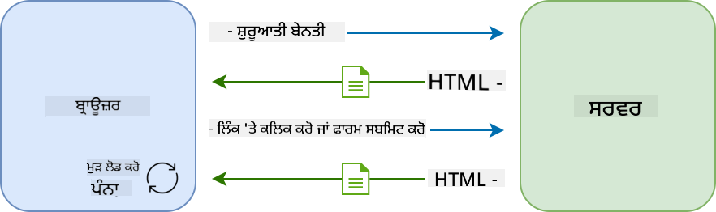
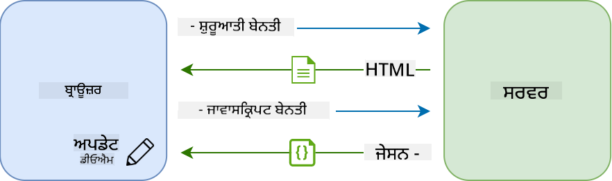

<!--
CO_OP_TRANSLATOR_METADATA:
{
  "original_hash": "f587e913e3f7c0b1c549a05dd74ee8e5",
  "translation_date": "2025-08-26T00:24:36+00:00",
  "source_file": "7-bank-project/3-data/README.md",
  "language_code": "pa"
}
-->
# ਬੈਂਕਿੰਗ ਐਪ ਬਣਾਓ ਭਾਗ 3: ਡਾਟਾ ਪ੍ਰਾਪਤ ਕਰਨ ਅਤੇ ਵਰਤਣ ਦੇ ਤਰੀਕੇ

## ਪੜ੍ਹਾਈ ਤੋਂ ਪਹਿਲਾਂ ਕਵੀਜ਼

[ਪੜ੍ਹਾਈ ਤੋਂ ਪਹਿਲਾਂ ਕਵੀਜ਼](https://ashy-river-0debb7803.1.azurestaticapps.net/quiz/45)

### ਪਰਿਚਯ

ਹਰ ਵੈੱਬ ਐਪਲੀਕੇਸ਼ਨ ਦੇ ਕੇਂਦਰ ਵਿੱਚ *ਡਾਟਾ* ਹੁੰਦਾ ਹੈ। ਡਾਟਾ ਕਈ ਰੂਪਾਂ ਵਿੱਚ ਹੋ ਸਕਦਾ ਹੈ, ਪਰ ਇਸਦਾ ਮੁੱਖ ਉਦੇਸ਼ ਹਮੇਸ਼ਾ ਉਪਭੋਗਤਾ ਨੂੰ ਜਾਣਕਾਰੀ ਦਿਖਾਉਣਾ ਹੁੰਦਾ ਹੈ। ਜਿਵੇਂ ਜਿਵੇਂ ਵੈੱਬ ਐਪਸ ਹੋਰ ਇੰਟਰਐਕਟਿਵ ਅਤੇ ਜਟਿਲ ਬਣ ਰਹੀਆਂ ਹਨ, ਉਪਭੋਗਤਾ ਜਾਣਕਾਰੀ ਤੱਕ ਕਿਵੇਂ ਪਹੁੰਚਦਾ ਹੈ ਅਤੇ ਇਸ ਨਾਲ ਕਿਵੇਂ ਸੰਚਾਰ ਕਰਦਾ ਹੈ, ਇਹ ਵੈੱਬ ਡਿਵੈਲਪਮੈਂਟ ਦਾ ਇੱਕ ਮਹੱਤਵਪੂਰਨ ਹਿੱਸਾ ਬਣ ਗਿਆ ਹੈ।

ਇਸ ਪਾਠ ਵਿੱਚ, ਅਸੀਂ ਦੇਖਾਂਗੇ ਕਿ ਸਰਵਰ ਤੋਂ ਡਾਟਾ ਅਸਿੰਕ੍ਰੋਨਸ ਤਰੀਕੇ ਨਾਲ ਕਿਵੇਂ ਪ੍ਰਾਪਤ ਕਰਨਾ ਹੈ ਅਤੇ ਇਸ ਡਾਟਾ ਨੂੰ HTML ਨੂੰ ਰੀਲੋਡ ਕੀਤੇ ਬਿਨਾਂ ਵੈੱਬ ਪੇਜ 'ਤੇ ਜਾਣਕਾਰੀ ਦਿਖਾਉਣ ਲਈ ਕਿਵੇਂ ਵਰਤਣਾ ਹੈ।

### ਪੂਰਵ ਸ਼ਰਤ

ਤੁਹਾਨੂੰ ਇਸ ਪਾਠ ਲਈ ਵੈੱਬ ਐਪ ਦਾ [ਲੌਗਿਨ ਅਤੇ ਰਜਿਸਟ੍ਰੇਸ਼ਨ ਫਾਰਮ](../2-forms/README.md) ਭਾਗ ਬਣਾਇਆ ਹੋਣਾ ਚਾਹੀਦਾ ਹੈ। ਤੁਹਾਨੂੰ [Node.js](https://nodejs.org) ਨੂੰ ਇੰਸਟਾਲ ਕਰਨਾ ਅਤੇ [ਸਰਵਰ API](../api/README.md) ਨੂੰ ਸਥਾਨਕ ਤੌਰ 'ਤੇ ਚਲਾਉਣਾ ਵੀ ਲੋੜੀਂਦਾ ਹੈ ਤਾਂ ਜੋ ਤੁਹਾਨੂੰ ਖਾਤੇ ਦਾ ਡਾਟਾ ਮਿਲ ਸਕੇ।

ਤੁਸੀਂ ਟਰਮੀਨਲ ਵਿੱਚ ਇਹ ਕਮਾਂਡ ਚਲਾ ਕੇ ਜਾਂਚ ਸਕਦੇ ਹੋ ਕਿ ਸਰਵਰ ਠੀਕ ਤਰ੍ਹਾਂ ਚੱਲ ਰਿਹਾ ਹੈ:

```sh
curl http://localhost:5000/api
# -> should return "Bank API v1.0.0" as a result
```

---

## AJAX ਅਤੇ ਡਾਟਾ ਪ੍ਰਾਪਤੀ

ਪ੍ਰੰਪਰਾਗਤ ਵੈੱਬਸਾਈਟਾਂ, ਜਦੋਂ ਉਪਭੋਗਤਾ ਕਿਸੇ ਲਿੰਕ ਨੂੰ ਚੁਣਦਾ ਹੈ ਜਾਂ ਫਾਰਮ ਰਾਹੀਂ ਡਾਟਾ ਭੇਜਦਾ ਹੈ, ਤਾਂ ਪੂਰੇ HTML ਪੇਜ ਨੂੰ ਰੀਲੋਡ ਕਰਕੇ ਸਮੱਗਰੀ ਨੂੰ ਅਪਡੇਟ ਕਰਦੀਆਂ ਹਨ। ਹਰ ਵਾਰ ਜਦੋਂ ਨਵਾਂ ਡਾਟਾ ਲੋਡ ਕਰਨ ਦੀ ਲੋੜ ਹੁੰਦੀ ਹੈ, ਵੈੱਬ ਸਰਵਰ ਇੱਕ ਨਵਾਂ HTML ਪੇਜ ਵਾਪਸ ਭੇਜਦਾ ਹੈ, ਜਿਸਨੂੰ ਬ੍ਰਾਊਜ਼ਰ ਦੁਆਰਾ ਪ੍ਰੋਸੈਸ ਕੀਤਾ ਜਾਂਦਾ ਹੈ। ਇਹ ਪ੍ਰਕਿਰਿਆ ਉਪਭੋਗਤਾ ਦੀ ਮੌਜੂਦਾ ਕਾਰਵਾਈ ਨੂੰ ਰੋਕਦੀ ਹੈ ਅਤੇ ਰੀਲੋਡ ਦੌਰਾਨ ਸੰਚਾਰ ਨੂੰ ਸੀਮਿਤ ਕਰਦੀ ਹੈ। ਇਸ ਵਰਕਫਲੋ ਨੂੰ *ਮਲਟੀ-ਪੇਜ ਐਪਲੀਕੇਸ਼ਨ* ਜਾਂ *MPA* ਕਿਹਾ ਜਾਂਦਾ ਹੈ।



ਜਦੋਂ ਵੈੱਬ ਐਪਲੀਕੇਸ਼ਨ ਹੋਰ ਜਟਿਲ ਅਤੇ ਇੰਟਰਐਕਟਿਵ ਬਣਨ ਲੱਗੀਆਂ, ਤਾਂ ਇੱਕ ਨਵੀਂ ਤਕਨੀਕ [AJAX (Asynchronous JavaScript and XML)](https://en.wikipedia.org/wiki/Ajax_(programming)) ਉਭਰੀ। ਇਹ ਤਕਨੀਕ ਵੈੱਬ ਐਪਸ ਨੂੰ ਜਾਵਾਸਕ੍ਰਿਪਟ ਦੀ ਵਰਤੋਂ ਕਰਕੇ ਸਰਵਰ ਤੋਂ ਡਾਟਾ ਅਸਿੰਕ੍ਰੋਨਸ ਤਰੀਕੇ ਨਾਲ ਭੇਜਣ ਅਤੇ ਪ੍ਰਾਪਤ ਕਰਨ ਦੀ ਆਗਿਆ ਦਿੰਦੀ ਹੈ, HTML ਪੇਜ ਨੂੰ ਰੀਲੋਡ ਕੀਤੇ ਬਿਨਾਂ। ਇਸ ਨਾਲ ਤੇਜ਼ ਅਪਡੇਟ ਅਤੇ ਹੌਲੀਅਨ ਸੰਚਾਰ ਸੰਭਵ ਹੁੰਦੇ ਹਨ। ਜਦੋਂ ਸਰਵਰ ਤੋਂ ਨਵਾਂ ਡਾਟਾ ਪ੍ਰਾਪਤ ਹੁੰਦਾ ਹੈ, ਤਾਂ ਮੌਜੂਦਾ HTML ਪੇਜ ਨੂੰ ਜਾਵਾਸਕ੍ਰਿਪਟ ਦੀ ਵਰਤੋਂ ਕਰਕੇ [DOM](https://developer.mozilla.org/docs/Web/API/Document_Object_Model) API ਰਾਹੀਂ ਅਪਡੇਟ ਕੀਤਾ ਜਾ ਸਕਦਾ ਹੈ। ਸਮੇਂ ਦੇ ਨਾਲ, ਇਹ ਤਰੀਕਾ [*ਸਿੰਗਲ-ਪੇਜ ਐਪਲੀਕੇਸ਼ਨ* ਜਾਂ *SPA*](https://en.wikipedia.org/wiki/Single-page_application) ਦੇ ਰੂਪ ਵਿੱਚ ਵਿਕਸਿਤ ਹੋਇਆ।



ਜਦੋਂ AJAX ਪਹਿਲਾਂ ਪੇਸ਼ ਕੀਤਾ ਗਿਆ ਸੀ, ਤਾਂ ਅਸਿੰਕ੍ਰੋਨਸ ਤਰੀਕੇ ਨਾਲ ਡਾਟਾ ਪ੍ਰਾਪਤ ਕਰਨ ਲਈ ਕੇਵਲ ਇੱਕ API [`XMLHttpRequest`](https://developer.mozilla.org/docs/Web/API/XMLHttpRequest/Using_XMLHttpRequest) ਉਪਲਬਧ ਸੀ। ਪਰ ਆਧੁਨਿਕ ਬ੍ਰਾਊਜ਼ਰ ਹੁਣ ਹੋਰ ਸੁਵਿਧਾਜਨਕ ਅਤੇ ਸ਼ਕਤੀਸ਼ਾਲੀ [`Fetch` API](https://developer.mozilla.org/docs/Web/API/Fetch_API) ਨੂੰ ਵੀ ਲਾਗੂ ਕਰਦੇ ਹਨ, ਜੋ ਪ੍ਰੋਮਿਸਜ਼ ਦੀ ਵਰਤੋਂ ਕਰਦਾ ਹੈ ਅਤੇ JSON ਡਾਟਾ ਨੂੰ ਮੈਨੇਜ ਕਰਨ ਲਈ ਹੋਰ ਉਚਿਤ ਹੈ।

> ਜਦੋਂ ਕਿ ਸਾਰੇ ਆਧੁਨਿਕ ਬ੍ਰਾਊਜ਼ਰ `Fetch API` ਦਾ ਸਮਰਥਨ ਕਰਦੇ ਹਨ, ਜੇ ਤੁਸੀਂ ਚਾਹੁੰਦੇ ਹੋ ਕਿ ਤੁਹਾਡੀ ਵੈੱਬ ਐਪਲੀਕੇਸ਼ਨ ਪੁਰਾਣੇ ਬ੍ਰਾਊਜ਼ਰਾਂ 'ਤੇ ਵੀ ਕੰਮ ਕਰੇ, ਤਾਂ ਪਹਿਲਾਂ [caniuse.com 'ਤੇ ਅਨੁਕੂਲਤਾ ਟੇਬਲ](https://caniuse.com/fetch) ਦੀ ਜਾਂਚ ਕਰਨਾ ਹਮੇਸ਼ਾ ਚੰਗਾ ਵਿਚਾਰ ਹੈ।

### ਕੰਮ

[ਪਿਛਲੇ ਪਾਠ](../2-forms/README.md) ਵਿੱਚ ਅਸੀਂ ਖਾਤਾ ਬਣਾਉਣ ਲਈ ਰਜਿਸਟ੍ਰੇਸ਼ਨ ਫਾਰਮ ਲਾਗੂ ਕੀਤਾ ਸੀ। ਹੁਣ ਅਸੀਂ ਮੌਜੂਦਾ ਖਾਤੇ ਨਾਲ ਲੌਗਿਨ ਕਰਨ ਅਤੇ ਇਸ ਦਾ ਡਾਟਾ ਪ੍ਰਾਪਤ ਕਰਨ ਲਈ ਕੋਡ ਸ਼ਾਮਲ ਕਰਾਂਗੇ। `app.js` ਫਾਈਲ ਖੋਲ੍ਹੋ ਅਤੇ ਇੱਕ ਨਵਾਂ `login` ਫੰਕਸ਼ਨ ਸ਼ਾਮਲ ਕਰੋ:

```js
async function login() {
  const loginForm = document.getElementById('loginForm')
  const user = loginForm.user.value;
}
```

ਇੱਥੇ ਅਸੀਂ ਪਹਿਲਾਂ `getElementById()` ਨਾਲ ਫਾਰਮ ਐਲੀਮੈਂਟ ਪ੍ਰਾਪਤ ਕਰਦੇ ਹਾਂ, ਅਤੇ ਫਿਰ `loginForm.user.value` ਨਾਲ ਇਨਪੁਟ ਤੋਂ ਯੂਜ਼ਰਨੇਮ ਪ੍ਰਾਪਤ ਕਰਦੇ ਹਾਂ। ਹਰ ਫਾਰਮ ਕੰਟਰੋਲ ਨੂੰ ਇਸਦੇ ਨਾਮ (ਜੋ HTML ਵਿੱਚ `name` ਐਟ੍ਰਿਬਿਊਟ ਦੀ ਵਰਤੋਂ ਕਰਕੇ ਸੈਟ ਕੀਤਾ ਜਾਂਦਾ ਹੈ) ਰਾਹੀਂ ਫਾਰਮ ਦੀ ਇੱਕ ਪ੍ਰਾਪਰਟੀ ਵਜੋਂ ਐਕਸੈਸ ਕੀਤਾ ਜਾ ਸਕਦਾ ਹੈ।

ਰਜਿਸਟ੍ਰੇਸ਼ਨ ਲਈ ਕੀਤੇ ਕੰਮ ਦੇ ਸਮਾਨ, ਅਸੀਂ ਸਰਵਰ ਰੀਕਵੈਸਟ ਕਰਨ ਲਈ ਇੱਕ ਹੋਰ ਫੰਕਸ਼ਨ ਬਣਾਵਾਂਗੇ, ਪਰ ਇਸ ਵਾਰ ਖਾਤੇ ਦਾ ਡਾਟਾ ਪ੍ਰਾਪਤ ਕਰਨ ਲਈ:

```js
async function getAccount(user) {
  try {
    const response = await fetch('//localhost:5000/api/accounts/' + encodeURIComponent(user));
    return await response.json();
  } catch (error) {
    return { error: error.message || 'Unknown error' };
  }
}
```

ਅਸੀਂ `fetch` API ਦੀ ਵਰਤੋਂ ਕਰਦੇ ਹਾਂ ਤਾਂ ਜੋ ਸਰਵਰ ਤੋਂ ਡਾਟਾ ਅਸਿੰਕ੍ਰੋਨਸ ਤਰੀਕੇ ਨਾਲ ਪ੍ਰਾਪਤ ਕੀਤਾ ਜਾ ਸਕੇ। ਇਸ ਵਾਰ ਸਾਨੂੰ ਸਿਰਫ ਕਾਲ ਕਰਨ ਲਈ URL ਦੀ ਲੋੜ ਹੈ, ਕਿਉਂਕਿ ਅਸੀਂ ਸਿਰਫ ਡਾਟਾ ਪ੍ਰਾਪਤ ਕਰ ਰਹੇ ਹਾਂ। ਡਿਫਾਲਟ ਰੂਪ ਵਿੱਚ, `fetch` ਇੱਕ [`GET`](https://developer.mozilla.org/docs/Web/HTTP/Methods/GET) HTTP ਰੀਕਵੈਸਟ ਬਣਾਉਂਦਾ ਹੈ, ਜੋ ਕਿ ਅਸੀਂ ਇੱਥੇ ਚਾਹੁੰਦੇ ਹਾਂ।

✅ `encodeURIComponent()` ਇੱਕ ਫੰਕਸ਼ਨ ਹੈ ਜੋ URL ਲਈ ਵਿਸ਼ੇਸ਼ ਅੱਖਰਾਂ ਨੂੰ ਐਸਕੇਪ ਕਰਦਾ ਹੈ। ਜੇ ਅਸੀਂ ਇਸ ਫੰਕਸ਼ਨ ਨੂੰ ਕਾਲ ਨਾ ਕਰੀਏ ਅਤੇ ਸਿੱਧੇ `user` ਮੁੱਲ ਨੂੰ URL ਵਿੱਚ ਵਰਤ ਲਈਏ, ਤਾਂ ਸਾਨੂੰ ਕਿਹੜੀਆਂ ਸਮੱਸਿਆਵਾਂ ਹੋ ਸਕਦੀਆਂ ਹਨ?

ਹੁਣ ਅਸੀਂ ਆਪਣੇ `login` ਫੰਕਸ਼ਨ ਨੂੰ `getAccount` ਵਰਤਣ ਲਈ ਅਪਡੇਟ ਕਰਦੇ ਹਾਂ:

```js
async function login() {
  const loginForm = document.getElementById('loginForm')
  const user = loginForm.user.value;
  const data = await getAccount(user);

  if (data.error) {
    return console.log('loginError', data.error);
  }

  account = data;
  navigate('/dashboard');
}
```

ਪਹਿਲਾਂ, ਕਿਉਂਕਿ `getAccount` ਇੱਕ ਅਸਿੰਕ੍ਰੋਨਸ ਫੰਕਸ਼ਨ ਹੈ, ਅਸੀਂ ਇਸਨੂੰ `await` ਕੀਵਰਡ ਨਾਲ ਮੇਲ ਕਰਦੇ ਹਾਂ ਤਾਂ ਜੋ ਸਰਵਰ ਦੇ ਨਤੀਜੇ ਦੀ ਉਡੀਕ ਕੀਤੀ ਜਾ ਸਕੇ। ਕਿਸੇ ਵੀ ਸਰਵਰ ਰੀਕਵੈਸਟ ਦੀ ਤਰ੍ਹਾਂ, ਸਾਨੂੰ ਗਲਤੀ ਦੇ ਮਾਮਲਿਆਂ ਨਾਲ ਵੀ ਨਜਿੱਠਣਾ ਪਵੇਗਾ। ਫਿਲਹਾਲ ਅਸੀਂ ਸਿਰਫ ਇੱਕ ਲੌਗ ਸੁਨੇਹਾ ਸ਼ਾਮਲ ਕਰਦੇ ਹਾਂ ਜੋ ਗਲਤੀ ਦਿਖਾਉਂਦਾ ਹੈ, ਅਤੇ ਇਸ 'ਤੇ ਬਾਅਦ ਵਿੱਚ ਵਾਪਸ ਆਵਾਂਗੇ।

ਫਿਰ ਸਾਨੂੰ ਡਾਟਾ ਨੂੰ ਕਿਤੇ ਸਟੋਰ ਕਰਨਾ ਪਵੇਗਾ ਤਾਂ ਜੋ ਅਸੀਂ ਇਸਨੂੰ ਬਾਅਦ ਵਿੱਚ ਡੈਸ਼ਬੋਰਡ ਜਾਣਕਾਰੀ ਦਿਖਾਉਣ ਲਈ ਵਰਤ ਸਕੀਏ। ਕਿਉਂਕਿ `account` ਵੈਰੀਏਬਲ ਅਜੇ ਤੱਕ ਮੌਜੂਦ ਨਹੀਂ ਹੈ, ਅਸੀਂ ਇਸਨੂੰ ਫਾਈਲ ਦੇ ਸਿਖਰ 'ਤੇ ਇੱਕ ਗਲੋਬਲ ਵੈਰੀਏਬਲ ਵਜੋਂ ਬਣਾਵਾਂਗੇ:

```js
let account = null;
```

ਜਦੋਂ ਯੂਜ਼ਰ ਡਾਟਾ ਨੂੰ ਇੱਕ ਵੈਰੀਏਬਲ ਵਿੱਚ ਸਟੋਰ ਕੀਤਾ ਜਾਂਦਾ ਹੈ, ਤਾਂ ਅਸੀਂ `navigate()` ਫੰਕਸ਼ਨ ਦੀ ਵਰਤੋਂ ਕਰਕੇ *ਲੌਗਿਨ* ਪੇਜ ਤੋਂ *ਡੈਸ਼ਬੋਰਡ* 'ਤੇ ਜਾ ਸਕਦੇ ਹਾਂ।

ਅਖੀਰ ਵਿੱਚ, ਜਦੋਂ ਲੌਗਿਨ ਫਾਰਮ ਸਬਮਿਟ ਕੀਤਾ ਜਾਂਦਾ ਹੈ, ਤਾਂ ਸਾਡੇ `login` ਫੰਕਸ਼ਨ ਨੂੰ ਕਾਲ ਕਰਨ ਦੀ ਲੋੜ ਹੈ। ਇਸ ਲਈ HTML ਨੂੰ ਇਸ ਤਰ੍ਹਾਂ ਸੋਧੋ:

```html
<form id="loginForm" action="javascript:login()">
```

ਨਵਾਂ ਖਾਤਾ ਰਜਿਸਟਰ ਕਰਕੇ ਅਤੇ ਉਸੇ ਖਾਤੇ ਨਾਲ ਲੌਗਿਨ ਕਰਨ ਦੀ ਕੋਸ਼ਿਸ਼ ਕਰਕੇ ਜਾਂਚ ਕਰੋ ਕਿ ਸਭ ਕੁਝ ਠੀਕ ਤਰ੍ਹਾਂ ਕੰਮ ਕਰ ਰਿਹਾ ਹੈ।

ਅਗਲੇ ਭਾਗ 'ਤੇ ਜਾਣ ਤੋਂ ਪਹਿਲਾਂ, ਅਸੀਂ ਆਪਣੇ `register` ਫੰਕਸ਼ਨ ਨੂੰ ਇਸਨੂੰ ਸ਼ਾਮਲ ਕਰਕੇ ਪੂਰਾ ਕਰ ਸਕਦੇ ਹਾਂ:

```js
account = result;
navigate('/dashboard');
```

✅ ਕੀ ਤੁਸੀਂ ਜਾਣਦੇ ਹੋ ਕਿ ਡਿਫਾਲਟ ਰੂਪ ਵਿੱਚ, ਤੁਸੀਂ ਸਿਰਫ *ਉਸੇ ਡੋਮੇਨ ਅਤੇ ਪੋਰਟ* ਤੋਂ ਸਰਵਰ API ਨੂੰ ਕਾਲ ਕਰ ਸਕਦੇ ਹੋ ਜਿਸ ਵੈੱਬ ਪੇਜ ਨੂੰ ਤੁਸੀਂ ਵੇਖ ਰਹੇ ਹੋ? ਇਹ ਬ੍ਰਾਊਜ਼ਰਾਂ ਦੁਆਰਾ ਲਾਗੂ ਕੀਤੀ ਗਈ ਸੁਰੱਖਿਆ ਪ੍ਰਣਾਲੀ ਹੈ। ਪਰ ਰੁਕੋ, ਸਾਡੀ ਵੈੱਬ ਐਪ `localhost:3000` 'ਤੇ ਚੱਲ ਰਹੀ ਹੈ ਜਦਕਿ ਸਰਵਰ API `localhost:5000` 'ਤੇ ਚੱਲ ਰਿਹਾ ਹੈ, ਤਾਂ ਇਹ ਕਿਵੇਂ ਕੰਮ ਕਰਦਾ ਹੈ? [ਕਰਾਸ-ਓਰਿਜਿਨ ਰਿਸੋਰਸ ਸ਼ੇਅਰਿੰਗ (CORS)](https://developer.mozilla.org/docs/Web/HTTP/CORS) ਨਾਮਕ ਤਕਨੀਕ ਦੀ ਵਰਤੋਂ ਕਰਕੇ, ਜੇਕਰ ਸਰਵਰ ਜਵਾਬ ਵਿੱਚ ਖਾਸ ਹੈਡਰ ਸ਼ਾਮਲ ਕਰਦਾ ਹੈ, ਤਾਂ ਇਹ ਸੰਭਵ ਹੈ ਕਿ ਖਾਸ ਡੋਮੇਨ ਲਈ ਛੋਟ ਦਿੱਤੀ ਜਾਵੇ।

> API ਬਾਰੇ ਹੋਰ ਜਾਣਕਾਰੀ ਲਈ ਇਹ [ਪਾਠ](https://docs.microsoft.com/learn/modules/use-apis-discover-museum-art/?WT.mc_id=academic-77807-sagibbon) ਲਓ

## HTML ਨੂੰ ਡਾਟਾ ਦਿਖਾਉਣ ਲਈ ਅਪਡੇਟ ਕਰੋ

ਹੁਣ ਜਦੋਂ ਸਾਡੇ ਕੋਲ ਯੂਜ਼ਰ ਡਾਟਾ ਹੈ, ਸਾਨੂੰ ਮੌਜੂਦਾ HTML ਨੂੰ ਇਸਨੂੰ ਦਿਖਾਉਣ ਲਈ ਅਪਡੇਟ ਕਰਨਾ ਪਵੇਗਾ। ਅਸੀਂ ਪਹਿਲਾਂ ਹੀ ਜਾਣਦੇ ਹਾਂ ਕਿ DOM ਤੋਂ ਕਿਸੇ ਐਲੀਮੈਂਟ ਨੂੰ ਕਿਵੇਂ ਪ੍ਰਾਪਤ ਕਰਨਾ ਹੈ, ਉਦਾਹਰਨ ਲਈ `document.getElementById()` ਦੀ ਵਰਤੋਂ ਕਰਕੇ। ਜਦੋਂ ਤੁਹਾਡੇ ਕੋਲ ਇੱਕ ਬੇਸ ਐਲੀਮੈਂਟ ਹੁੰਦਾ ਹੈ, ਤਾਂ ਇਨ੍ਹਾਂ API ਦੀ ਵਰਤੋਂ ਕਰਕੇ ਤੁਸੀਂ ਇਸਨੂੰ ਸੋਧ ਸਕਦੇ ਹੋ ਜਾਂ ਇਸ ਵਿੱਚ ਚਾਈਲਡ ਐਲੀਮੈਂਟ ਸ਼ਾਮਲ ਕਰ ਸਕਦੇ ਹੋ:

- [`textContent`](https://developer.mozilla.org/docs/Web/API/Node/textContent) ਪ੍ਰਾਪਰਟੀ ਦੀ ਵਰਤੋਂ ਕਰਕੇ ਤੁਸੀਂ ਕਿਸੇ ਐਲੀਮੈਂਟ ਦੇ ਟੈਕਸਟ ਨੂੰ ਬਦਲ ਸਕਦੇ ਹੋ। ਧਿਆਨ ਦਿਓ ਕਿ ਇਸ ਮੁੱਲ ਨੂੰ ਬਦਲਣ ਨਾਲ ਐਲੀਮੈਂਟ ਦੇ ਸਾਰੇ ਚਾਈਲਡ (ਜੇ ਕੋਈ ਹੋਣ) ਹਟ ਜਾਂਦੇ ਹਨ ਅਤੇ ਇਸਨੂੰ ਪ੍ਰਦਾਨ ਕੀਤੇ ਗਏ ਟੈਕਸਟ ਨਾਲ ਬਦਲ ਦਿੱਤਾ ਜਾਂਦਾ ਹੈ। ਇਸ ਤਰ੍ਹਾਂ, ਇਹ ਕਿਸੇ ਦਿੱਤੇ ਗਏ ਐਲੀਮੈਂਟ ਦੇ ਸਾਰੇ ਚਾਈਲਡ ਨੂੰ ਹਟਾਉਣ ਲਈ ਇੱਕ ਪ੍ਰਭਾਵਸ਼ਾਲੀ ਤਰੀਕਾ ਵੀ ਹੈ, ਸਿਰਫ ਇਸਨੂੰ ਖਾਲੀ ਸਤਰ `''` ਨਿਰਧਾਰਤ ਕਰਕੇ।

- [`document.createElement()`](https://developer.mozilla.org/docs/Web/API/Document/createElement) ਦੀ ਵਰਤੋਂ ਕਰਕੇ ਅਤੇ [`append()`](https://developer.mozilla.org/docs/Web/API/ParentNode/append) ਵਿਧੀ ਨਾਲ ਤੁਸੀਂ ਇੱਕ ਜਾਂ ਹੋਰ ਨਵੇਂ ਚਾਈਲਡ ਐਲੀਮੈਂਟ ਬਣਾਉਣ ਅਤੇ ਜੁੜਨ ਕਰ ਸਕਦੇ ਹੋ।

✅ ਕਿਸੇ ਐਲੀਮੈਂਟ ਦੀ [`innerHTML`](https://developer.mozilla.org/docs/Web/API/Element/innerHTML) ਪ੍ਰਾਪਰਟੀ ਦੀ ਵਰਤੋਂ ਕਰਕੇ ਇਸਦੇ HTML ਸਮੱਗਰੀ ਨੂੰ ਬਦਲਣਾ ਵੀ ਸੰਭਵ ਹੈ, ਪਰ ਇਸਨੂੰ ਬਚਣਾ ਚਾਹੀਦਾ ਹੈ ਕਿਉਂਕਿ ਇਹ [ਕਰਾਸ-ਸਾਈਟ ਸਕ੍ਰਿਪਟਿੰਗ (XSS)](https://developer.mozilla.org/docs/Glossary/Cross-site_scripting) ਹਮਲਿਆਂ ਲਈ ਸੰਵੇਦਨਸ਼ੀਲ ਹੈ।

### ਕੰਮ

ਡੈਸ਼ਬੋਰਡ ਸਕ੍ਰੀਨ 'ਤੇ ਜਾਣ ਤੋਂ ਪਹਿਲਾਂ, ਸਾਨੂੰ *ਲੌਗਿਨ* ਪੇਜ 'ਤੇ ਇੱਕ ਹੋਰ ਚੀਜ਼ ਕਰਨੀ ਚਾਹੀਦੀ ਹੈ। ਇਸ ਸਮੇਂ, ਜੇ ਤੁਸੀਂ ਕਿਸੇ ਅਜਿਹੇ ਯੂਜ਼ਰਨੇਮ ਨਾਲ ਲੌਗਿਨ ਕਰਨ ਦੀ ਕੋਸ਼ਿਸ਼ ਕਰਦੇ ਹੋ ਜੋ ਮੌਜੂਦ ਨਹੀਂ ਹੈ, ਤਾਂ ਕਨਸੋਲ ਵਿੱਚ ਇੱਕ ਸੁਨੇਹਾ ਦਿਖਾਇਆ ਜਾਂਦਾ ਹੈ ਪਰ ਇੱਕ ਆਮ ਉਪਭੋਗਤਾ ਲਈ ਕੁਝ ਨਹੀਂ ਬਦਲਦਾ ਅਤੇ ਤੁਹਾਨੂੰ ਪਤਾ ਨਹੀਂ ਲੱਗਦਾ ਕਿ ਕੀ ਹੋ ਰਿਹਾ ਹੈ।

ਆਓ ਲੌਗਿਨ ਫਾਰਮ ਵਿੱਚ ਇੱਕ ਪਲੇਸਹੋਲਡਰ ਐਲੀਮੈਂਟ ਸ਼ਾਮਲ ਕਰੀਏ ਜਿੱਥੇ ਲੋੜ ਪੈਣ 'ਤੇ ਅਸੀਂ ਇੱਕ ਗਲਤੀ ਸੁਨੇਹਾ ਦਿਖਾ ਸਕੀਏ। ਇੱਕ ਵਧੀਆ ਜਗ੍ਹਾ ਲੌਗਿਨ `<button>` ਤੋਂ ਥੋੜ੍ਹਾ ਪਹਿਲਾਂ ਹੋਵੇਗੀ:

```html
...
<div id="loginError"></div>
<button>Login</button>
...
```

ਇਹ `<div>` ਐਲੀਮੈਂਟ ਖਾਲੀ ਹੈ, ਜਿਸਦਾ ਅਰਥ ਹੈ ਕਿ ਜਦ ਤੱਕ ਅਸੀਂ ਇਸ ਵਿੱਚ ਕੁਝ ਸਮੱਗਰੀ ਸ਼ਾਮਲ ਨਹੀਂ ਕਰਦੇ, ਤਦ ਤੱਕ ਸਕ੍ਰੀਨ 'ਤੇ ਕੁਝ ਵੀ ਦਿਖਾਈ ਨਹੀਂ ਦੇਵੇਗਾ। ਅਸੀਂ ਇਸਨੂੰ ਇੱਕ `id` ਵੀ ਦਿੰਦੇ ਹਾਂ ਤਾਂ ਜੋ ਅਸੀਂ ਇਸਨੂੰ ਜਾਵਾਸਕ੍ਰਿਪਟ ਨਾਲ ਆਸਾਨੀ ਨਾਲ ਪ੍ਰਾਪਤ ਕਰ ਸਕੀਏ।

ਵਾਪਸ `app.js` ਫਾਈਲ 'ਤੇ ਜਾਓ ਅਤੇ ਇੱਕ ਨਵਾਂ ਹੈਲਪਰ ਫੰਕਸ਼ਨ `updateElement` ਬਣਾਓ:

```js
function updateElement(id, text) {
  const element = document.getElementById(id);
  element.textContent = text;
}
```

ਇਹ ਬਹੁਤ ਸਧਾਰਨ ਹੈ: ਦਿੱਤੇ ਗਏ ਐਲੀਮੈਂਟ *id* ਅਤੇ *text* ਦੇ ਆਧਾਰ 'ਤੇ, ਇਹ DOM ਐਲੀਮੈਂਟ ਦੇ ਮੇਲ ਖਾਣ ਵਾਲੇ `id` ਦੀ ਟੈਕਸਟ ਸਮੱਗਰੀ ਨੂੰ ਅਪਡੇਟ ਕਰੇਗਾ। ਆਓ ਇਸ ਵਿਧੀ ਦੀ ਵਰਤੋਂ `login` ਫੰਕਸ਼ਨ ਵਿੱਚ ਪਿਛਲੇ ਗਲਤੀ ਸੁਨੇਹੇ ਦੀ ਥਾਂ ਕਰੀਏ:

```js
if (data.error) {
  return updateElement('loginError', data.error);
}
```

ਹੁਣ ਜੇ ਤੁਸੀਂ ਗਲਤ ਖਾਤੇ ਨਾਲ ਲੌਗਿਨ ਕਰਨ ਦੀ ਕੋਸ਼ਿਸ਼ ਕਰਦੇ ਹੋ, ਤਾਂ ਤੁਹਾਨੂੰ ਕੁਝ ਇਸ ਤਰ੍ਹਾਂ ਦਿਖਾਈ ਦੇਵੇਗਾ:


ਹੁਣ ਸਾਡੇ ਕੋਲ ਗਲਤੀ ਦਾ ਟੈਕਸਟ ਹੈ ਜੋ ਵਿਜੁਅਲ ਤੌਰ 'ਤੇ ਦਿਖਦਾ ਹੈ, ਪਰ ਜੇ ਤੁਸੀਂ ਇਸਨੂੰ ਸਕ੍ਰੀਨ ਰੀਡਰ ਨਾਲ ਅਜ਼ਮਾਉਂਦੇ ਹੋ, ਤਾਂ ਤੁਹਾਨੂੰ ਪਤਾ ਲੱਗੇਗਾ ਕਿ ਕੁਝ ਵੀ ਐਲਾਨ ਨਹੀਂ ਕੀਤਾ ਗਿਆ। ਜਿਵੇਂ ਕਿ ਪੇਜ 'ਤੇ ਗਤੀਸ਼ੀਲ ਤੌਰ 'ਤੇ ਸ਼ਾਮਲ ਕੀਤਾ ਗਿਆ ਟੈਕਸਟ ਸਕ੍ਰੀਨ ਰੀਡਰਾਂ ਦੁਆਰਾ ਐਲਾਨਿਤ ਹੋਵੇ, ਇਸ ਲਈ ਇਸਨੂੰ [ਲਾਈਵ ਰੀਜਨ](https://developer.mozilla.org/docs/Web/Accessibility/ARIA/ARIA_Live
ਜੇ ਤੁਸੀਂ `test` ਖਾਤੇ ਦੀ ਵਰਤੋਂ ਕਰਕੇ ਲੌਗਇਨ ਕਰਨ ਦੀ ਕੋਸ਼ਿਸ਼ ਕਰੋ, ਤਾਂ ਹੁਣ ਤੁਹਾਨੂੰ ਡੈਸ਼ਬੋਰਡ 'ਤੇ ਲੈਨ-ਦੇਣ ਦੀ ਸੂਚੀ ਦਿਖਾਈ ਦੇਵੇਗੀ 🎉।

---

## 🚀 ਚੁਣੌਤੀ

ਇਕੱਠੇ ਕੰਮ ਕਰਕੇ ਡੈਸ਼ਬੋਰਡ ਪੇਜ ਨੂੰ ਇੱਕ ਅਸਲੀ ਬੈਂਕਿੰਗ ਐਪ ਵਾਂਗ ਬਣਾਓ। ਜੇ ਤੁਸੀਂ ਪਹਿਲਾਂ ਹੀ ਆਪਣੀ ਐਪ ਨੂੰ ਸਜਾਇਆ ਹੈ, ਤਾਂ ਕੋਸ਼ਿਸ਼ ਕਰੋ ਕਿ [ਮੀਡੀਆ ਕਵੈਰੀਜ਼](https://developer.mozilla.org/docs/Web/CSS/Media_Queries) ਦੀ ਵਰਤੋਂ ਕਰਕੇ ਇੱਕ [ਰਿਸਪਾਂਸਿਵ ਡਿਜ਼ਾਈਨ](https://developer.mozilla.org/docs/Web/Progressive_web_apps/Responsive/responsive_design_building_blocks) ਬਣਾਓ ਜੋ ਡੈਸਕਟਾਪ ਅਤੇ ਮੋਬਾਈਲ ਦੋਹਾਂ ਉਪਕਰਣਾਂ 'ਤੇ ਵਧੀਆ ਕੰਮ ਕਰੇ।

ਇੱਥੇ ਸਜਾਏ ਹੋਏ ਡੈਸ਼ਬੋਰਡ ਪੇਜ ਦਾ ਇੱਕ ਉਦਾਹਰਣ ਦਿੱਤਾ ਗਿਆ ਹੈ:


## ਲੈਕਚਰ ਬਾਅਦ ਕਵੀਜ਼

[ਲੈਕਚਰ ਬਾਅਦ ਕਵੀਜ਼](https://ashy-river-0debb7803.1.azurestaticapps.net/quiz/46)

## ਅਸਾਈਨਮੈਂਟ

[ਆਪਣੇ ਕੋਡ ਨੂੰ ਰੀਫੈਕਟਰ ਕਰੋ ਅਤੇ ਟਿੱਪਣੀਆਂ ਸ਼ਾਮਲ ਕਰੋ](assignment.md)

**ਅਸਵੀਕਾਰਨਾ**:  
ਇਹ ਦਸਤਾਵੇਜ਼ AI ਅਨੁਵਾਦ ਸੇਵਾ [Co-op Translator](https://github.com/Azure/co-op-translator) ਦੀ ਵਰਤੋਂ ਕਰਕੇ ਅਨੁਵਾਦ ਕੀਤਾ ਗਿਆ ਹੈ। ਜਦੋਂ ਕਿ ਅਸੀਂ ਸਹੀਤਾ ਲਈ ਯਤਨਸ਼ੀਲ ਹਾਂ, ਕਿਰਪਾ ਕਰਕੇ ਧਿਆਨ ਦਿਓ ਕਿ ਸਵੈਚਾਲਿਤ ਅਨੁਵਾਦਾਂ ਵਿੱਚ ਗਲਤੀਆਂ ਜਾਂ ਅਸੁਚਤਤਾਵਾਂ ਹੋ ਸਕਦੀਆਂ ਹਨ। ਮੂਲ ਦਸਤਾਵੇਜ਼ ਨੂੰ ਇਸਦੀ ਮੂਲ ਭਾਸ਼ਾ ਵਿੱਚ ਅਧਿਕਾਰਤ ਸਰੋਤ ਮੰਨਿਆ ਜਾਣਾ ਚਾਹੀਦਾ ਹੈ। ਮਹੱਤਵਪੂਰਨ ਜਾਣਕਾਰੀ ਲਈ, ਪੇਸ਼ੇਵਰ ਮਨੁੱਖੀ ਅਨੁਵਾਦ ਦੀ ਸਿਫਾਰਸ਼ ਕੀਤੀ ਜਾਂਦੀ ਹੈ। ਇਸ ਅਨੁਵਾਦ ਦੀ ਵਰਤੋਂ ਤੋਂ ਪੈਦਾ ਹੋਣ ਵਾਲੇ ਕਿਸੇ ਵੀ ਗਲਤਫਹਿਮੀ ਜਾਂ ਗਲਤ ਵਿਆਖਿਆ ਲਈ ਅਸੀਂ ਜ਼ਿੰਮੇਵਾਰ ਨਹੀਂ ਹਾਂ।