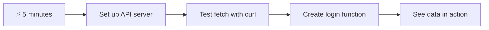
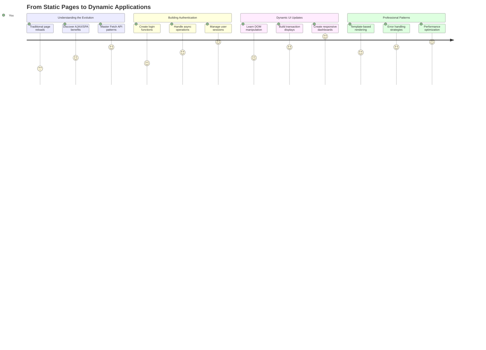
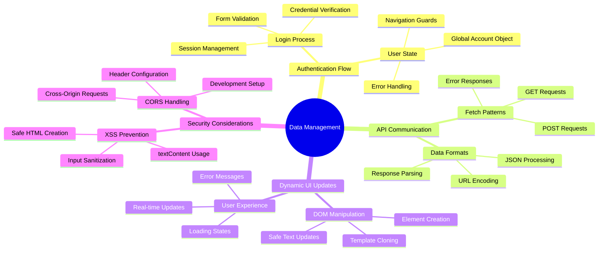
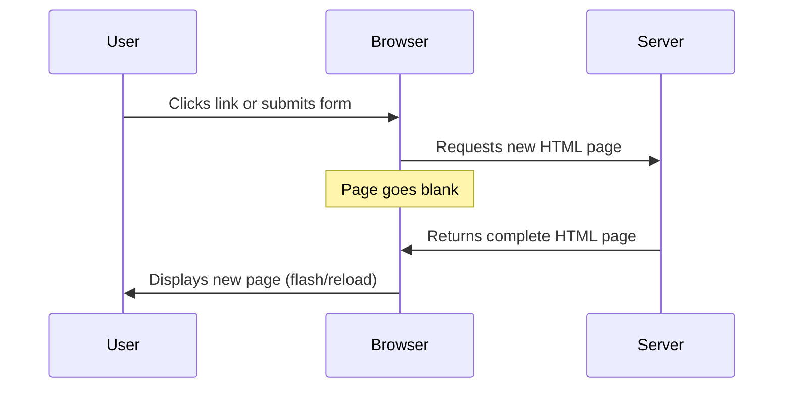
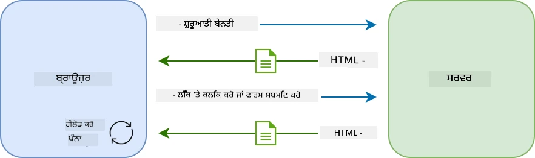
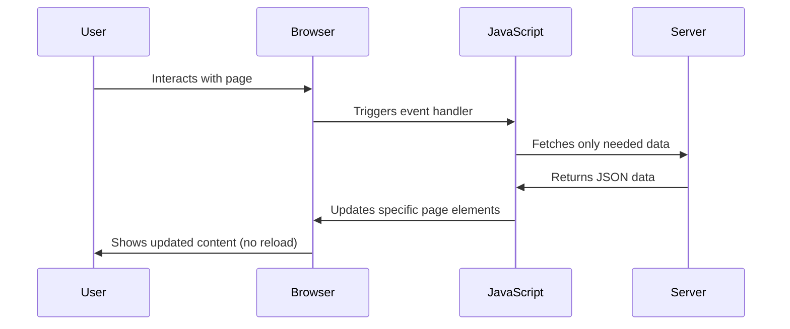
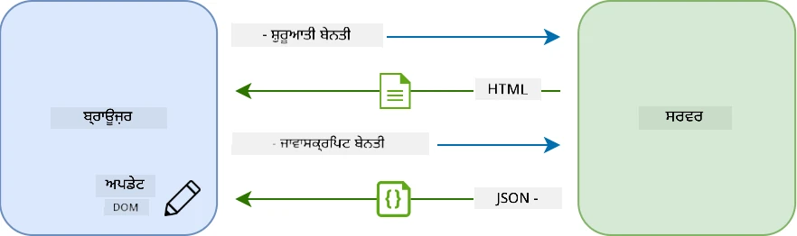
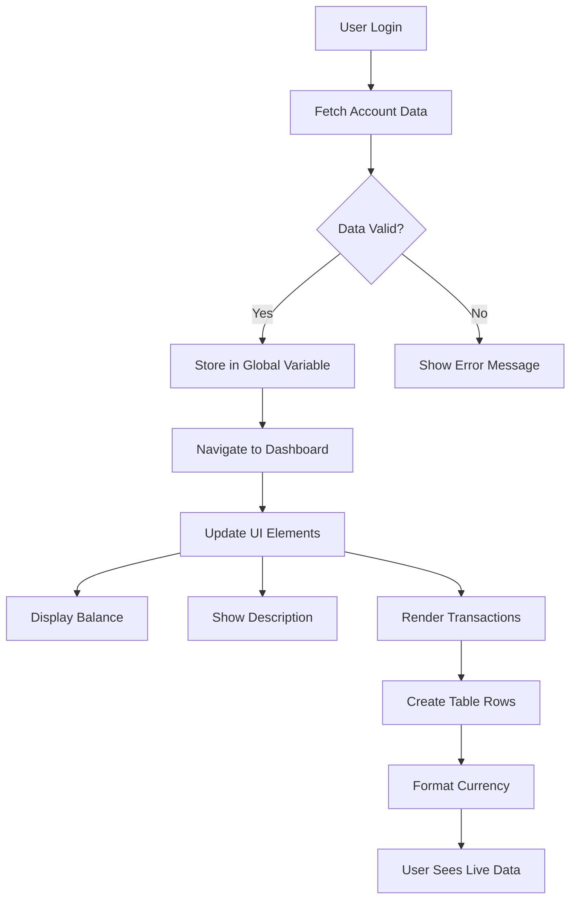
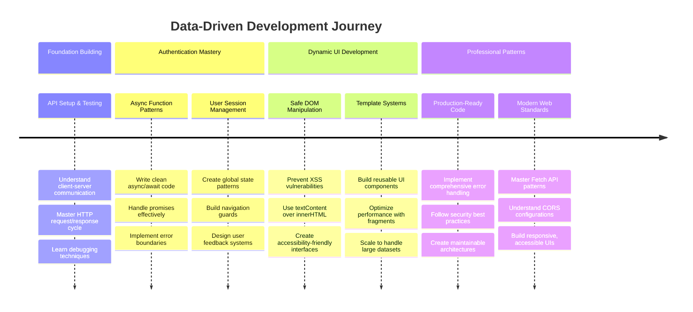
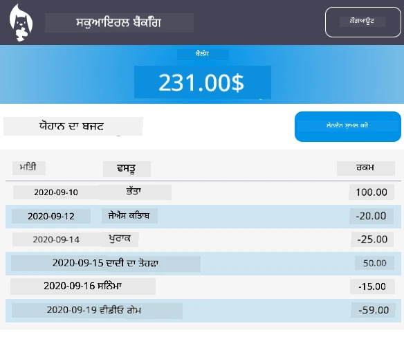

<!--
CO_OP_TRANSLATOR_METADATA:
{
  "original_hash": "86ee5069f27ea3151389d8687c95fac9",
  "translation_date": "2025-11-03T16:39:14+00:00",
  "source_file": "7-bank-project/3-data/README.md",
  "language_code": "pa"
}
-->
# ਬੈਂਕਿੰਗ ਐਪ ਬਣਾਓ ਭਾਗ 3: ਡਾਟਾ ਲੈਣ ਅਤੇ ਵਰਤਣ ਦੇ ਤਰੀਕੇ

ਸਟਾਰ ਟ੍ਰੈਕ ਵਿੱਚ ਐਂਟਰਪ੍ਰਾਈਜ਼ ਦੇ ਕੰਪਿਊਟਰ ਬਾਰੇ ਸੋਚੋ - ਜਦੋਂ ਕੈਪਟਨ ਪਿਕਾਰਡ ਜਹਾਜ਼ ਦੀ ਸਥਿਤੀ ਪੁੱਛਦਾ ਹੈ, ਜਾਣਕਾਰੀ ਤੁਰੰਤ ਪ੍ਰਗਟ ਹੁੰਦੀ ਹੈ ਬਿਨਾਂ ਪੂਰੇ ਇੰਟਰਫੇਸ ਨੂੰ ਬੰਦ ਕਰਨ ਅਤੇ ਦੁਬਾਰਾ ਬਣਾਉਣ ਦੇ। ਇਹ ਸਹੀ ਤਰੀਕੇ ਨਾਲ ਜਾਣਕਾਰੀ ਦਾ ਪ੍ਰਵਾਹ ਹੈ ਜੋ ਅਸੀਂ ਇੱਥੇ ਡਾਇਨਾਮਿਕ ਡਾਟਾ ਫੈਚਿੰਗ ਨਾਲ ਬਣਾਉਣ ਜਾ ਰਹੇ ਹਾਂ।

ਇਸ ਸਮੇਂ, ਤੁਹਾਡਾ ਬੈਂਕਿੰਗ ਐਪ ਇੱਕ ਛਪਿਆ ਹੋਇਆ ਅਖ਼ਬਾਰ ਵਰਗਾ ਹੈ - ਜਾਣਕਾਰੀ ਦੇਣ ਵਾਲਾ ਪਰ ਸਥਿਰ। ਅਸੀਂ ਇਸਨੂੰ NASA ਦੇ ਮਿਸ਼ਨ ਕੰਟਰੋਲ ਵਰਗੇ ਕੁਝ ਵਿੱਚ ਬਦਲਣ ਜਾ ਰਹੇ ਹਾਂ, ਜਿੱਥੇ ਡਾਟਾ ਲਗਾਤਾਰ ਵਗਦਾ ਹੈ ਅਤੇ ਯੂਜ਼ਰ ਦੇ ਕੰਮ ਵਿੱਚ ਰੁਕਾਵਟ ਪੈਦਾ ਕੀਤੇ ਬਿਨਾਂ ਰੀਅਲ-ਟਾਈਮ ਵਿੱਚ ਅਪਡੇਟ ਹੁੰਦਾ ਹੈ।

ਤੁਹਾਨੂੰ ਸਰਵਰਾਂ ਨਾਲ ਅਸਿੰਕ੍ਰੋਨਸ ਤਰੀਕੇ ਨਾਲ ਸੰਚਾਰ ਕਰਨ, ਵੱਖ-ਵੱਖ ਸਮਿਆਂ 'ਤੇ ਆਉਣ ਵਾਲੇ ਡਾਟਾ ਨੂੰ ਸੰਭਾਲਣ, ਅਤੇ ਕੱਚੀ ਜਾਣਕਾਰੀ ਨੂੰ ਯੂਜ਼ਰਾਂ ਲਈ ਅਰਥਪੂਰਨ ਕੁਝ ਵਿੱਚ ਬਦਲਣ ਦਾ ਤਰੀਕਾ ਸਿੱਖਣ ਨੂੰ ਮਿਲੇਗਾ। ਇਹ ਡੈਮੋ ਅਤੇ ਪ੍ਰੋਡਕਸ਼ਨ-ਤਿਆਰ ਸੌਫਟਵੇਅਰ ਵਿੱਚ ਅੰਤਰ ਹੈ।

## ⚡ ਅਗਲੇ 5 ਮਿੰਟਾਂ ਵਿੱਚ ਤੁਸੀਂ ਕੀ ਕਰ ਸਕਦੇ ਹੋ

**ਵਿਆਸਤ ਡਿਵੈਲਪਰਾਂ ਲਈ ਤੇਜ਼ ਸ਼ੁਰੂਆਤ ਦਾ ਰਾਹ**



- **ਮਿੰਟ 1-2**: ਆਪਣਾ API ਸਰਵਰ ਸ਼ੁਰੂ ਕਰੋ (`cd api && npm start`) ਅਤੇ ਕਨੈਕਸ਼ਨ ਦੀ ਜਾਂਚ ਕਰੋ
- **ਮਿੰਟ 3**: `getAccount()` ਫੰਕਸ਼ਨ ਬਣਾਓ ਜੋ ਫੈਚ ਵਰਤਦਾ ਹੈ
- **ਮਿੰਟ 4**: ਲੌਗਇਨ ਫਾਰਮ ਨੂੰ `action="javascript:login()"` ਨਾਲ ਵਾਇਰ ਕਰੋ
- **ਮਿੰਟ 5**: ਲੌਗਇਨ ਦੀ ਜਾਂਚ ਕਰੋ ਅਤੇ ਕੌਂਸੋਲ ਵਿੱਚ ਅਕਾਊਂਟ ਡਾਟਾ ਦੇਖੋ

**ਤੇਜ਼ ਟੈਸਟ ਕਮਾਂਡ**:
```bash
# Verify API is running
curl http://localhost:5000/api

# Test account data fetch
curl http://localhost:5000/api/accounts/test
```

**ਇਸਦਾ ਮਹੱਤਵ ਕਿਉਂ ਹੈ**: 5 ਮਿੰਟਾਂ ਵਿੱਚ, ਤੁਸੀਂ ਅਸਿੰਕ੍ਰੋਨਸ ਡਾਟਾ ਫੈਚਿੰਗ ਦਾ ਜਾਦੂ ਦੇਖੋਗੇ ਜੋ ਹਰ ਆਧੁਨਿਕ ਵੈੱਬ ਐਪਲੀਕੇਸ਼ਨ ਨੂੰ ਤਾਕਤ ਦੇਂਦਾ ਹੈ। ਇਹ ਉਹ ਬੁਨਿਆਦ ਹੈ ਜੋ ਐਪਸ ਨੂੰ ਜ਼ਿੰਦਾ ਅਤੇ ਪ੍ਰਤੀਕ੍ਰਿਆਸ਼ੀਲ ਮਹਿਸੂਸ ਕਰਵਾਉਂਦੀ ਹੈ।

## 🗺️ ਡਾਟਾ-ਚਲਿਤ ਵੈੱਬ ਐਪਲੀਕੇਸ਼ਨ ਦੁਆਰਾ ਤੁਹਾਡਾ ਸਿੱਖਣ ਦਾ ਸਫਰ



**ਤੁਹਾਡਾ ਸਫਰ ਦਾ ਮੰਜ਼ਿਲ**: ਇਸ ਪਾਠ ਦੇ ਅੰਤ ਤੱਕ, ਤੁਸੀਂ ਸਮਝ ਜਾਵੋਗੇ ਕਿ ਆਧੁਨਿਕ ਵੈੱਬ ਐਪਲੀਕੇਸ਼ਨ ਡਾਟਾ ਨੂੰ ਕਿਵੇਂ ਫੈਚ, ਪ੍ਰੋਸੈਸ ਅਤੇ ਡਾਇਨਾਮਿਕ ਤਰੀਕੇ ਨਾਲ ਪ੍ਰਦਰਸ਼ਿਤ ਕਰਦੇ ਹਨ, ਪੇਸ਼ੇਵਰ ਐਪਲੀਕੇਸ਼ਨ ਤੋਂ ਉਮੀਦ ਕੀਤੇ ਜਾਣ ਵਾਲੇ ਸਹੀ ਯੂਜ਼ਰ ਅਨੁਭਵ ਬਣਾਉਂਦੇ ਹਨ।

## ਪਾਠ ਤੋਂ ਪਹਿਲਾਂ ਕਵਿਜ਼

[ਪ੍ਰੀ-ਲੈਕਚਰ ਕਵਿਜ਼](https://ff-quizzes.netlify.app/web/quiz/45)

### ਪੂਰਵ ਸ਼ਰਤਾਂ

ਡਾਟਾ ਫੈਚਿੰਗ ਵਿੱਚ ਡੁੱਬਣ ਤੋਂ ਪਹਿਲਾਂ, ਇਹ ਕੰਪੋਨੈਂਟਸ ਤਿਆਰ ਰੱਖੋ:

- **ਪਿਛਲਾ ਪਾਠ**: [ਲੌਗਇਨ ਅਤੇ ਰਜਿਸਟ੍ਰੇਸ਼ਨ ਫਾਰਮ](../2-forms/README.md) ਪੂਰਾ ਕਰੋ - ਅਸੀਂ ਇਸ ਬੁਨਿਆਦ 'ਤੇ ਬਣਾਉਣ ਜਾ ਰਹੇ ਹਾਂ
- **ਲੋਕਲ ਸਰਵਰ**: [Node.js](https://nodejs.org) ਇੰਸਟਾਲ ਕਰੋ ਅਤੇ [ਸਰਵਰ API ਚਲਾਓ](../api/README.md) ਜੋ ਅਕਾਊਂਟ ਡਾਟਾ ਪ੍ਰਦਾਨ ਕਰਦਾ ਹੈ
- **API ਕਨੈਕਸ਼ਨ**: ਇਸ ਕਮਾਂਡ ਨਾਲ ਆਪਣੇ ਸਰਵਰ ਕਨੈਕਸ਼ਨ ਦੀ ਜਾਂਚ ਕਰੋ:

```bash
curl http://localhost:5000/api
# Expected response: "Bank API v1.0.0"
```

ਇਹ ਤੇਜ਼ ਟੈਸਟ ਇਹ ਯਕੀਨੀ ਬਣਾਉਂਦਾ ਹੈ ਕਿ ਸਾਰੇ ਕੰਪੋਨੈਂਟਸ ਸਹੀ ਤਰੀਕੇ ਨਾਲ ਸੰਚਾਰ ਕਰ ਰਹੇ ਹਨ:
- ਯਕੀਨੀ ਬਣਾਉਂਦਾ ਹੈ ਕਿ Node.js ਤੁਹਾਡੇ ਸਿਸਟਮ 'ਤੇ ਸਹੀ ਤਰੀਕੇ ਨਾਲ ਚੱਲ ਰਿਹਾ ਹੈ
- ਪੁਸ਼ਟੀ ਕਰਦਾ ਹੈ ਕਿ ਤੁਹਾਡਾ API ਸਰਵਰ ਸਰਗਰਮ ਹੈ ਅਤੇ ਜਵਾਬ ਦੇ ਰਿਹਾ ਹੈ
- ਪੁਸ਼ਟੀ ਕਰਦਾ ਹੈ ਕਿ ਤੁਹਾਡਾ ਐਪ ਸਰਵਰ ਤੱਕ ਪਹੁੰਚ ਸਕਦਾ ਹੈ (ਮਿਸ਼ਨ ਤੋਂ ਪਹਿਲਾਂ ਰੇਡੀਓ ਸੰਪਰਕ ਦੀ ਜਾਂਚ ਕਰਨ ਵਰਗਾ)

## 🧠 ਡਾਟਾ ਮੈਨੇਜਮੈਂਟ ਇਕੋਸਿਸਟਮ ਦਾ ਝਲਕਾ



**ਮੁੱਖ ਸਿਧਾਂਤ**: ਆਧੁਨਿਕ ਵੈੱਬ ਐਪਲੀਕੇਸ਼ਨ ਡਾਟਾ ਆਰਕੈਸਟ੍ਰੇਸ਼ਨ ਸਿਸਟਮ ਹਨ - ਇਹ ਯੂਜ਼ਰ ਇੰਟਰਫੇਸ, ਸਰਵਰ APIs, ਅਤੇ ਬ੍ਰਾਊਜ਼ਰ ਸੁਰੱਖਿਆ ਮਾਡਲਾਂ ਦੇ ਵਿਚਕਾਰ ਸਹੀ, ਪ੍ਰਤੀਕ੍ਰਿਆਸ਼ੀਲ ਅਨੁਭਵ ਬਣਾਉਣ ਲਈ ਸਹਿਕਾਰ ਕਰਦੇ ਹਨ।

---

## ਆਧੁਨਿਕ ਵੈੱਬ ਐਪਸ ਵਿੱਚ ਡਾਟਾ ਫੈਚਿੰਗ ਨੂੰ ਸਮਝਣਾ

ਪਿਛਲੇ ਦੋ ਦਹਾਕਿਆਂ ਵਿੱਚ ਵੈੱਬ ਐਪਲੀਕੇਸ਼ਨ ਡਾਟਾ ਨੂੰ ਸੰਭਾਲਣ ਦਾ ਤਰੀਕਾ ਬਹੁਤ ਬਦਲ ਗਿਆ ਹੈ। ਇਸ ਵਿਕਾਸ ਨੂੰ ਸਮਝਣਾ ਤੁਹਾਨੂੰ ਇਹ ਸਮਝਣ ਵਿੱਚ ਮਦਦ ਕਰੇਗਾ ਕਿ AJAX ਅਤੇ Fetch API ਵਰਗੇ ਆਧੁਨਿਕ ਤਕਨੀਕਾਂ ਕਿਉਂ ਸ਼ਕਤੀਸ਼ਾਲੀ ਹਨ ਅਤੇ ਕਿਉਂ ਇਹ ਵੈੱਬ ਡਿਵੈਲਪਰਾਂ ਲਈ ਜ਼ਰੂਰੀ ਸੰਦ ਬਣ ਗਏ ਹਨ।

ਆਓ ਵੇਖੀਏ ਕਿ ਰਵਾਇਤੀ ਵੈੱਬਸਾਈਟਾਂ ਕਿਵੇਂ ਕੰਮ ਕਰਦੀਆਂ ਸਨ ਅਤੇ ਅੱਜ ਅਸੀਂ ਬਣਾਉਣ ਵਾਲੀਆਂ ਡਾਇਨਾਮਿਕ, ਪ੍ਰਤੀਕ੍ਰਿਆਸ਼ੀਲ ਐਪਲੀਕੇਸ਼ਨ ਕਿਵੇਂ ਕੰਮ ਕਰਦੀਆਂ ਹਨ।

### ਰਵਾਇਤੀ ਮਲਟੀ-ਪੇਜ ਐਪਲੀਕੇਸ਼ਨ (MPA)

ਵੈੱਬ ਦੇ ਸ਼ੁਰੂਆਤੀ ਦਿਨਾਂ ਵਿੱਚ, ਹਰ ਕਲਿੱਕ ਪੁਰਾਣੇ ਟੈਲੀਵਿਜ਼ਨ 'ਤੇ ਚੈਨਲ ਬਦਲਣ ਵਰਗਾ ਸੀ - ਸਕ੍ਰੀਨ ਖਾਲੀ ਹੋ ਜਾਂਦੀ ਸੀ, ਫਿਰ ਨਵੀਂ ਸਮੱਗਰੀ ਵਿੱਚ ਧੀਰੇ-ਧੀਰੇ ਟਿਊਨ ਹੁੰਦੀ ਸੀ। ਇਹ ਸ਼ੁਰੂਆਤੀ ਵੈੱਬ ਐਪਲੀਕੇਸ਼ਨ ਦੀ ਹਕੀਕਤ ਸੀ, ਜਿੱਥੇ ਹਰ ਇੰਟਰੈਕਸ਼ਨ ਦਾ ਮਤਲਬ ਸੀ ਪੂਰੇ ਪੇਜ ਨੂੰ ਮੁੜ ਤੋਂ ਸ਼ੁਰੂ ਕਰਨਾ।





**ਇਹ ਤਰੀਕਾ ਕਿਉਂ ਅਸੁਵਿਧਾਜਨਕ ਮਹਿਸੂਸ ਹੁੰਦਾ ਸੀ:**
- ਹਰ ਕਲਿੱਕ ਦਾ ਮਤਲਬ ਸੀ ਪੂਰੇ ਪੇਜ ਨੂੰ ਮੁੜ ਤੋਂ ਬਣਾਉਣਾ
- ਯੂਜ਼ਰਾਂ ਨੂੰ ਉਹਨਾਂ ਪੇਜ ਫਲੈਸ਼ਾਂ ਦੁਆਰਾ ਵਿਚਾਰਾਂ ਵਿਚ ਰੁਕਾਵਟ ਪੈਂਦੀ ਸੀ
- ਤੁਹਾਡਾ ਇੰਟਰਨੈਟ ਕਨੈਕਸ਼ਨ ਮੁੜ-ਮੁੜ ਉਹੀ ਹੈਡਰ ਅਤੇ ਫੁੱਟਰ ਡਾਊਨਲੋਡ ਕਰਦਾ ਸੀ
- ਐਪਸ ਸੌਫਟਵੇਅਰ ਵਰਗੇ ਨਹੀਂ, ਬਲਕਿ ਫਾਈਲਿੰਗ ਕੈਬਨਿਟ ਦੇ ਕਲਿੱਕ ਕਰਨ ਵਰਗੇ ਮਹਿਸੂਸ ਹੁੰਦੇ ਸਨ

### ਆਧੁਨਿਕ ਸਿੰਗਲ-ਪੇਜ ਐਪਲੀਕੇਸ਼ਨ (SPA)

AJAX (Asynchronous JavaScript and XML) ਨੇ ਇਸ ਪੈਰਾਡਾਇਮ ਨੂੰ ਪੂਰੀ ਤਰ੍ਹਾਂ ਬਦਲ ਦਿੱਤਾ। ਜਿਵੇਂ ਇੰਟਰਨੈਸ਼ਨਲ ਸਪੇਸ ਸਟੇਸ਼ਨ ਦੀ ਮੋਡਿਊਲਰ ਡਿਜ਼ਾਈਨ, ਜਿੱਥੇ ਅਸਟਰੋਨਾਟ ਪੂਰੇ ਢਾਂਚੇ ਨੂੰ ਮੁੜ ਬਣਾਉਣ ਦੇ ਬਗੈਰ ਵਿਅਕਤੀਗਤ ਕੰਪੋਨੈਂਟਸ ਨੂੰ ਬਦਲ ਸਕਦੇ ਹਨ, AJAX ਸਾਨੂੰ ਪੂਰੇ ਪੇਜ ਨੂੰ ਮੁੜ ਲੋਡ ਕਰਨ ਦੇ ਬਗੈਰ ਵੈੱਬਪੇਜ ਦੇ ਵਿਸ਼ੇਸ਼ ਹਿੱਸਿਆਂ ਨੂੰ ਅਪਡੇਟ ਕਰਨ ਦੀ ਆਗਿਆ ਦਿੰਦਾ ਹੈ। XML ਦਾ ਜ਼ਿਕਰ ਕਰਨ ਦੇ ਬਾਵਜੂਦ, ਅਸੀਂ ਅੱਜ ਜ਼ਿਆਦਾਤਰ JSON ਵਰਤਦੇ ਹਾਂ, ਪਰ ਮੁੱਖ ਸਿਧਾਂਤ ਇਹ ਹੈ: ਸਿਰਫ ਉਹ ਅਪਡੇਟ ਕਰੋ ਜੋ ਬਦਲਣਾ ਹੈ।





**SPA ਕਿਉਂ ਬਿਹਤਰ ਮਹਿਸੂਸ ਹੁੰਦੇ ਹਨ:**
- ਸਿਰਫ ਉਹ ਹਿੱਸੇ ਜੋ ਵਾਸਤਵ ਵਿੱਚ ਬਦਲੇ ਹਨ, ਅਪਡੇਟ ਹੁੰਦੇ ਹਨ (ਸਮਝਦਾਰ, ਹੈ ਨਾ?)
- ਕੋਈ ਵਧੇਰੇ ਰੁਕਾਵਟ ਨਹੀਂ - ਤੁਹਾਡੇ ਯੂਜ਼ਰ ਆਪਣੇ ਕੰਮ ਵਿੱਚ ਲਗੇ ਰਹਿੰਦੇ ਹਨ
- ਵਾਇਰ 'ਤੇ ਘੱਟ ਡਾਟਾ ਜਾਣ ਦਾ ਮਤਲਬ ਹੈ ਤੇਜ਼ ਲੋਡਿੰਗ
- ਸਭ ਕੁਝ ਤੇਜ਼ ਅਤੇ ਪ੍ਰਤੀਕ੍ਰਿਆਸ਼ੀਲ ਮਹਿਸੂਸ ਹੁੰਦਾ ਹੈ, ਜਿਵੇਂ ਤੁਹਾਡੇ ਫੋਨ ਦੇ ਐਪਸ

### ਆਧੁਨਿਕ Fetch API ਵੱਲ ਵਿਕਾਸ

ਆਧੁਨਿਕ ਬ੍ਰਾਊਜ਼ਰ [`Fetch` API](https://developer.mozilla.org/docs/Web/API/Fetch_API) ਪ੍ਰਦਾਨ ਕਰਦੇ ਹਨ, ਜੋ ਪੁਰਾਣੇ [`XMLHttpRequest`](https://developer.mozilla.org/docs/Web/API/XMLHttpRequest/Using_XMLHttpRequest) ਨੂੰ ਬਦਲ ਦਿੰਦੇ ਹਨ। ਜਿਵੇਂ ਟੈਲੀਗ੍ਰਾਫ ਚਲਾਉਣ ਅਤੇ ਈਮੇਲ ਵਰਤਣ ਵਿੱਚ ਅੰਤਰ ਹੁੰਦਾ ਹੈ, Fetch API ਵਾਅਦਿਆਂ ਨੂੰ ਵਰਤਦਾ ਹੈ ਸਾਫ਼ ਅਸਿੰਕ੍ਰੋਨਸ ਕੋਡ ਲਈ ਅਤੇ JSON ਨੂੰ ਕੁਦਰਤੀ ਤਰੀਕੇ ਨਾਲ ਸੰਭਾਲਦਾ ਹੈ।

| ਫੀਚਰ | XMLHttpRequest | Fetch API |
|---------|----------------|----------|
| **ਸਿੰਟੈਕਸ** | ਜਟਿਲ ਕਾਲਬੈਕ-ਅਧਾਰਿਤ | ਸਾਫ਼ ਵਾਅਦਾ-ਅਧਾਰਿਤ |
| **JSON ਸੰਭਾਲਣਾ** | ਮੈਨੂਅਲ ਪਾਰਸਿੰਗ ਦੀ ਲੋੜ | ਅੰਦਰੂਨੀ `.json()` ਵਿਧੀ |
| **ਐਰਰ ਸੰਭਾਲਣਾ** | ਸੀਮਿਤ ਐਰਰ ਜਾਣਕਾਰੀ | ਵਿਸਤ੍ਰਿਤ ਐਰਰ ਵੇਰਵੇ |
| **ਆਧੁਨਿਕ ਸਹਾਇਤਾ** | ਪੁਰਾਣੀ ਅਨੁਕੂਲਤਾ | ES6+ ਵਾਅਦੇ ਅਤੇ async/await |

> 💡 **ਬ੍ਰਾਊਜ਼ਰ ਅਨੁਕੂਲਤਾ**: ਚੰਗੀ ਖ਼ਬਰ - Fetch API ਸਾਰੇ ਆਧੁਨਿਕ ਬ੍ਰਾਊਜ਼ਰਾਂ ਵਿੱਚ ਕੰਮ ਕਰਦਾ ਹੈ! ਜੇ ਤੁਸੀਂ ਖਾਸ ਵਰਜਨਾਂ ਬਾਰੇ ਜਿਗਿਆਸੂ ਹੋ, [caniuse.com](https://caniuse.com/fetch) ਵਿੱਚ ਪੂਰੀ ਅਨੁਕੂਲਤਾ ਕਹਾਣੀ ਹੈ।
> 
**ਸਾਰ:**
- Chrome, Firefox, Safari, ਅਤੇ Edge ਵਿੱਚ ਬਹੁਤ ਵਧੀਆ ਕੰਮ ਕਰਦਾ ਹੈ (ਅਸਲ ਵਿੱਚ ਜਿੱਥੇ ਤੁਹਾਡੇ ਯੂਜ਼ਰ ਹਨ)
- ਸਿਰਫ Internet Explorer ਨੂੰ ਵਾਧੂ ਮਦਦ ਦੀ ਲੋੜ ਹੈ (ਅਤੇ ਸੱਚਮੁੱਚ, IE ਨੂੰ ਛੱਡਣ ਦਾ ਸਮਾਂ ਹੈ)
- ਤੁਹਾਨੂੰ ਬਾਅਦ ਵਿੱਚ ਵਰਤਣ ਲਈ ਸੁੰਦਰ async/await ਪੈਟਰਨ ਲਈ ਬਹੁਤ ਵਧੀਆ ਤਰੀਕੇ ਨਾਲ ਸੈਟ ਕਰਦਾ ਹੈ

### ਯੂਜ਼ਰ ਲੌਗਇਨ ਅਤੇ ਡਾਟਾ ਰੀਟਰੀਵਲ ਨੂੰ ਲਾਗੂ ਕਰਨਾ

ਹੁਣ ਆਓ ਲੌਗਇਨ ਸਿਸਟਮ ਨੂੰ ਲਾਗੂ ਕਰੀਏ ਜੋ ਤੁਹਾਡੇ ਬੈਂਕਿੰਗ ਐਪ ਨੂੰ ਸਥਿਰ ਡਿਸਪਲੇ ਤੋਂ ਇੱਕ ਕਾਰਗਰ ਐਪਲੀਕੇਸ਼ਨ ਵਿੱਚ ਬਦਲ ਦਿੰਦਾ ਹੈ। ਜਿਵੇਂ ਸੁਰੱਖਿਅਤ ਸੈਨਿਕ ਸਹੂਲਤਾਂ ਵਿੱਚ ਵਰਤੀਆਂ ਜਾਣ ਵਾਲੀਆਂ ਪ੍ਰਮਾਣਿਕਤਾ ਪ੍ਰੋਟੋਕੋਲ, ਅਸੀਂ ਯੂਜ਼ਰ ਦੀ ਪਛਾਣ ਦੀ ਪੁਸ਼ਟੀ ਕਰਾਂਗੇ ਅਤੇ ਫਿਰ ਉਹਨਾਂ ਦੇ ਵਿਸ਼ੇਸ਼ ਡਾਟਾ ਤੱਕ ਪਹੁੰਚ ਪ੍ਰਦਾਨ ਕਰਾਂਗੇ।

ਅਸੀਂ ਇਸਨੂੰ ਕਦਮ-ਕਦਮ ਕਰਕੇ ਬਣਾਉਂਦੇ ਹਾਂ, ਬੁਨਿਆਦੀ ਪ੍ਰਮਾਣਿਕਤਾ ਨਾਲ ਸ਼ੁਰੂ ਕਰਦੇ ਹੋਏ ਅਤੇ ਫਿਰ ਡਾਟਾ-ਫੈਚਿੰਗ ਸਮਰੱਥਾ ਸ਼ਾਮਲ ਕਰਦੇ ਹੋਏ।

#### ਕਦਮ 1: ਲੌਗਇਨ ਫੰਕਸ਼ਨ ਦੀ ਬੁਨਿਆਦ ਬਣਾਓ

ਆਪਣੀ `app.js` ਫਾਈਲ ਖੋਲ੍ਹੋ ਅਤੇ ਇੱਕ ਨਵਾਂ `login` ਫੰਕਸ਼ਨ ਸ਼ਾਮਲ ਕਰੋ। ਇਹ ਯੂਜ਼ਰ ਪ੍ਰਮਾਣਿਕਤਾ ਪ੍ਰਕਿਰਿਆ ਨੂੰ ਸੰਭਾਲੇਗਾ:

```javascript
async function login() {
  const loginForm = document.getElementById('loginForm');
  const user = loginForm.user.value;
}
```

**ਇਸਨੂੰ ਤੋੜ ਕੇ ਸਮਝਦੇ ਹਾਂ:**
- ਉਹ `async` ਕੀਵਰਡ? ਇਹ ਜਾਵਾਸਕ੍ਰਿਪਟ ਨੂੰ ਕਹਿ ਰਿਹਾ ਹੈ "ਹੇ, ਇਹ ਫੰਕਸ਼ਨ ਸ਼ਾਇਦ ਕੁਝ ਚੀਜ਼ਾਂ ਦੀ ਉਡੀਕ ਕਰ ਸਕਦਾ ਹੈ"
- ਅਸੀਂ ਆਪਣੇ ਫਾਰਮ ਨੂੰ ਪੇਜ ਤੋਂ ਲੈ ਰਹੇ ਹਾਂ (ਕੋਈ ਫੈਂਸੀ ਚੀਜ਼ ਨਹੀਂ, ਸਿਰਫ ਇਸਦੇ ID ਦੁਆਰਾ ਲੱਭ ਰਹੇ ਹਾਂ)
- ਫਿਰ ਅਸੀਂ ਜੋ ਕੁਝ ਯੂਜ਼ਰ ਨੇ ਆਪਣਾ ਯੂਜ਼ਰਨੇਮ ਵਜੋਂ ਟਾਈਪ ਕੀਤਾ ਹੈ, ਉਸਨੂੰ ਖਿੱਚ ਰਹੇ ਹਾਂ
- ਇੱਥੇ ਇੱਕ ਵਧੀਆ ਤਰੀਕਾ: ਤੁਸੀਂ ਕਿਸੇ ਵੀ ਫਾਰਮ ਇਨਪੁਟ ਨੂੰ ਇਸਦੇ `name` ਐਟ੍ਰਿਬਿਊਟ ਦੁਆਰਾ ਪਹੁੰਚ ਸਕਦੇ ਹੋ - ਵਾਧੂ getElementById ਕਾਲਾਂ ਦੀ ਲੋੜ ਨਹੀਂ!

> 💡 **ਫਾਰਮ ਐਕਸੈਸ ਪੈਟਰਨ**: ਹਰ ਫਾਰਮ ਕੰਟਰੋਲ ਨੂੰ ਇਸਦੇ ਨਾਮ (HTML ਵਿੱਚ `name` ਐਟ੍ਰਿਬਿਊਟ ਵਰਤ ਕੇ ਸੈਟ ਕੀਤਾ) ਦੁਆਰਾ ਫਾਰਮ ਐਲਿਮੈਂਟ ਦੀ ਪ੍ਰਾਪਰਟੀ ਵਜੋਂ ਪਹੁੰਚਿਆ ਜਾ ਸਕਦਾ ਹੈ। ਇਹ ਫਾਰਮ ਡਾਟਾ ਪ੍ਰਾਪਤ ਕਰਨ ਦਾ ਸਾਫ਼, ਪੜ੍ਹਨਯੋਗ ਤਰੀਕਾ ਪ੍ਰਦਾਨ ਕਰਦਾ ਹੈ।

#### ਕਦਮ 2: ਅਕਾਊਂਟ ਡਾਟਾ ਫੈਚ ਕਰਨ ਵਾਲਾ ਫੰਕਸ਼ਨ ਬਣਾਓ

ਅਗਲੇ ਕਦਮ ਵਿੱਚ, ਅਸੀਂ ਸਰਵਰ ਤੋਂ ਅਕਾਊਂਟ ਡਾਟਾ ਪ੍ਰਾਪਤ ਕਰਨ ਲਈ ਇੱਕ ਸਮਰਪਿਤ ਫੰਕਸ਼ਨ ਬਣਾਉਂਦੇ ਹਾਂ। ਇਹ ਤੁਹਾਡੇ ਰਜਿਸਟ੍ਰੇਸ਼ਨ ਫੰਕਸ਼ਨ ਦੇ ਸਮਾਨ ਪੈਟਰਨ ਦੀ ਪਾਲਣਾ ਕਰਦਾ ਹੈ ਪਰ ਡਾਟਾ ਪ੍ਰਾਪਤੀ 'ਤੇ ਧਿਆਨ ਕੇਂਦਰਿਤ ਕਰਦਾ ਹੈ:

```javascript
async function getAccount(user) {
  try {
    const response = await fetch('//localhost:5000/api/accounts/' + encodeURIComponent(user));
    return await response.json();
  } catch (error) {
    return { error: error.message || 'Unknown error' };
  }
}
```

**ਇਹ ਕੋਡ ਕੀ ਪ੍ਰਾਪਤ ਕਰਦਾ ਹੈ:**
- **ਵਰਤਦਾ ਹੈ** ਆਧੁਨਿਕ `fetch` API ਡਾਟਾ ਨੂੰ ਅਸਿੰਕ੍ਰੋਨਸ ਤਰੀਕੇ ਨਾਲ ਮੰਗਣ ਲਈ
- **ਬਣਾਉਂਦਾ ਹੈ** ਇੱਕ GET ਰਿਕਵੈਸਟ URL ਯੂਜ਼ਰਨੇਮ ਪੈਰਾਮੀਟਰ ਨਾਲ
- **ਲਾਗੂ ਕਰਦਾ ਹੈ** `encodeURIComponent()` ਜੋ URLs ਵਿੱਚ ਵਿਸ਼ੇਸ਼ ਅੱਖਰਾਂ ਨੂੰ ਸੁਰੱਖਿਅਤ ਤਰੀਕੇ ਨਾਲ ਸੰਭਾਲਦਾ ਹੈ
- **ਬਦਲਦਾ ਹੈ** ਜਵਾਬ ਨੂੰ JSON ਫਾਰਮੈਟ ਵਿੱਚ ਸੌਖੀ ਡਾਟਾ ਮੈਨਿਪੂਲੇਸ਼ਨ ਲਈ
- **ਗ੍ਰੇਸਫੁਲੀ ਸੰਭਾਲਦਾ ਹੈ** ਐਰਰਜ਼ ਨੂੰ ਇੱਕ ਐਰਰ ਆਬਜੈਕਟ ਵਾਪਸ ਕਰਕੇ ਬਜਾਏ ਕਿ ਕ੍ਰੈਸ਼ ਹੋਣ ਦੇ

> ⚠️ **ਸੁਰੱਖਿਆ ਨੋਟ**: `encodeURIComponent()` ਫੰਕਸ਼ਨ URLs ਵਿੱਚ ਵਿਸ਼ੇਸ਼ ਅੱਖਰਾਂ ਨੂੰ ਸੰਭਾਲਦਾ ਹੈ। ਜਿਵੇਂ ਨਾਵਲ ਸੰਚਾਰ ਵਿੱਚ ਵਰਤੀਆਂ ਜਾਣ ਵਾਲੀਆਂ ਐਨਕੋਡਿੰਗ ਸਿਸਟਮ,
DOM ਮੈਨਿਪੁਲੇਸ਼ਨ ਉਹ ਤਕਨੀਕ ਹੈ ਜੋ ਸਥਿਰ ਵੈੱਬ ਪੰਨਿਆਂ ਨੂੰ ਗਤੀਸ਼ੀਲ ਐਪਲੀਕੇਸ਼ਨਾਂ ਵਿੱਚ ਬਦਲ ਦਿੰਦੀ ਹੈ ਜੋ ਉਪਭੋਗਤਾ ਦੀਆਂ ਕ੍ਰਿਆਵਾਂ ਅਤੇ ਸਰਵਰ ਦੇ ਜਵਾਬਾਂ ਦੇ ਆਧਾਰ 'ਤੇ ਆਪਣਾ ਸਮੱਗਰੀ ਅਪਡੇਟ ਕਰਦੀ ਹੈ।

### ਕੰਮ ਲਈ ਸਹੀ ਸਾਧਨ ਚੁਣਨਾ

ਜਦੋਂ ਤੁਸੀਂ ਜਾਵਾਸਕ੍ਰਿਪਟ ਨਾਲ ਆਪਣਾ HTML ਅਪਡੇਟ ਕਰਦੇ ਹੋ, ਤਾਂ ਤੁਹਾਡੇ ਕੋਲ ਕਈ ਵਿਕਲਪ ਹੁੰਦੇ ਹਨ। ਇਹਨਾਂ ਨੂੰ ਇੱਕ ਟੂਲਬਾਕਸ ਵਿੱਚ ਵੱਖ-ਵੱਖ ਸਾਧਨਾਂ ਵਾਂਗ ਸੋਚੋ - ਹਰ ਇੱਕ ਖਾਸ ਕੰਮਾਂ ਲਈ ਬੇਹਤਰੀਨ:

| ਤਰੀਕਾ | ਇਹ ਕਿਸ ਲਈ ਵਧੀਆ ਹੈ | ਕਦੋਂ ਇਸਨੂੰ ਵਰਤਣਾ ਹੈ | ਸੁਰੱਖਿਆ ਪੱਧਰ |
|-------|--------------------|--------------------|--------------|
| `textContent` | ਉਪਭੋਗਤਾ ਡਾਟਾ ਸੁਰੱਖਿਅਤ ਤਰੀਕੇ ਨਾਲ ਦਿਖਾਉਣਾ | ਜਦੋਂ ਵੀ ਤੁਸੀਂ ਟੈਕਸਟ ਦਿਖਾ ਰਹੇ ਹੋ | ✅ ਬਿਲਕੁਲ ਸੁਰੱਖਿਅਤ |
| `createElement()` + `append()` | ਜਟਿਲ ਲੇਆਉਟ ਬਣਾਉਣਾ | ਨਵੇਂ ਸੈਕਸ਼ਨ/ਲਿਸਟ ਬਣਾਉਣਾ | ✅ ਬਿਲਕੁਲ ਸੁਰੱਖਿਅਤ |
| `innerHTML` | HTML ਸਮੱਗਰੀ ਸੈਟ ਕਰਨਾ | ⚠️ ਇਸਨੂੰ ਟਾਲਣ ਦੀ ਕੋਸ਼ਿਸ਼ ਕਰੋ | ❌ ਖਤਰਨਾਕ |

#### ਟੈਕਸਟ ਦਿਖਾਉਣ ਦਾ ਸੁਰੱਖਿਅਤ ਤਰੀਕਾ: textContent

[`textContent`](https://developer.mozilla.org/docs/Web/API/Node/textContent) ਪ੍ਰਾਪਰਟੀ ਤੁਹਾਡਾ ਸਭ ਤੋਂ ਵਧੀਆ ਸਾਥੀ ਹੈ ਜਦੋਂ ਤੁਸੀਂ ਉਪਭੋਗਤਾ ਡਾਟਾ ਦਿਖਾ ਰਹੇ ਹੋ। ਇਹ ਤੁਹਾਡੇ ਵੈੱਬਪੇਜ ਲਈ ਇੱਕ ਬਾਊਂਸਰ ਵਾਂਗ ਹੈ - ਕੁਝ ਵੀ ਹਾਨੀਕਾਰਕ ਅੰਦਰ ਨਹੀਂ ਆ ਸਕਦਾ:

```javascript
// The safe, reliable way to update text
const balanceElement = document.getElementById('balance');
balanceElement.textContent = account.balance;
```

**textContent ਦੇ ਫਾਇਦੇ:**
- ਹਰ ਚੀਜ਼ ਨੂੰ ਸਧਾਰਨ ਟੈਕਸਟ ਵਜੋਂ ਮੰਨਦਾ ਹੈ (ਸਕ੍ਰਿਪਟ ਚਲਾਉਣ ਤੋਂ ਰੋਕਦਾ ਹੈ)
- ਮੌਜੂਦਾ ਸਮੱਗਰੀ ਨੂੰ ਆਪਣੇ ਆਪ ਸਾਫ ਕਰਦਾ ਹੈ
- ਸਧਾਰਨ ਟੈਕਸਟ ਅਪਡੇਟ ਲਈ ਕੁਸ਼ਲ
- ਖਤਰਨਾਕ ਸਮੱਗਰੀ ਤੋਂ ਸੁਰੱਖਿਆ ਪ੍ਰਦਾਨ ਕਰਦਾ ਹੈ

#### ਗਤੀਸ਼ੀਲ HTML ਤੱਤ ਬਣਾਉਣਾ

ਜਟਿਲ ਸਮੱਗਰੀ ਲਈ, [`document.createElement()`](https://developer.mozilla.org/docs/Web/API/Document/createElement) ਨੂੰ [`append()`](https://developer.mozilla.org/docs/Web/API/ParentNode/append) ਨਾਲ ਜੋੜੋ:

```javascript
// Safe way to create new elements
const transactionItem = document.createElement('div');
transactionItem.className = 'transaction-item';
transactionItem.textContent = `${transaction.date}: ${transaction.description}`;
container.append(transactionItem);
```

**ਇਸ ਤਰੀਕੇ ਨੂੰ ਸਮਝਣਾ:**
- **ਨਵੇਂ DOM ਤੱਤ** ਪ੍ਰੋਗਰਾਮਿੰਗ ਤਰੀਕੇ ਨਾਲ ਬਣਾਉਂਦਾ ਹੈ
- **ਤੱਤਾਂ ਦੇ ਗੁਣ ਅਤੇ ਸਮੱਗਰੀ** 'ਤੇ ਪੂਰਾ ਕੰਟਰੋਲ ਰੱਖਦਾ ਹੈ
- **ਜਟਿਲ, nested ਤੱਤਾਂ ਦੀ ਬਣਤਰ** ਦੀ ਇਜਾਜ਼ਤ ਦਿੰਦਾ ਹੈ
- **ਸੁਰੱਖਿਆ ਨੂੰ ਬਣਾਈ ਰੱਖਦਾ ਹੈ** ਸਮੱਗਰੀ ਨੂੰ ਬਣਤਰ ਤੋਂ ਵੱਖ ਕਰਕੇ

> ⚠️ **ਸੁਰੱਖਿਆ ਵਿਚਾਰ**: ਜਦੋਂ ਕਿ [`innerHTML`](https://developer.mozilla.org/docs/Web/API/Element/innerHTML) ਕਈ ਟਿਊਟੋਰਿਅਲ ਵਿੱਚ ਦਿਖਾਈ ਦਿੰਦਾ ਹੈ, ਇਹ embedded ਸਕ੍ਰਿਪਟ ਚਲਾ ਸਕਦਾ ਹੈ। ਜਿਵੇਂ CERN ਦੇ ਸੁਰੱਖਿਆ ਪ੍ਰੋਟੋਕੋਲ unauthorized ਕੋਡ ਚਲਾਉਣ ਤੋਂ ਰੋਕਦੇ ਹਨ, `textContent` ਅਤੇ `createElement` ਵਰਤਣਾ ਸੁਰੱਖਿਅਤ ਵਿਕਲਪ ਪ੍ਰਦਾਨ ਕਰਦਾ ਹੈ।
> 
**innerHTML ਦੇ ਖਤਰੇ:**
- ਉਪਭੋਗਤਾ ਡਾਟਾ ਵਿੱਚ ਕੋਈ ਵੀ `<script>` ਟੈਗ ਚਲਾਉਂਦਾ ਹੈ
- ਕੋਡ injection ਹਮਲਿਆਂ ਲਈ ਸੰਵੇਦਨਸ਼ੀਲ
- ਸੁਰੱਖਿਆ ਦੀਆਂ ਸੰਭਾਵਨਾਵਾਂ ਪੈਦਾ ਕਰਦਾ ਹੈ
- ਸੁਰੱਖਿਅਤ ਵਿਕਲਪ ਜੋ ਅਸੀਂ ਵਰਤ ਰਹੇ ਹਾਂ, ਸਮਾਨ ਕਾਰਜਸ਼ੀਲਤਾ ਪ੍ਰਦਾਨ ਕਰਦੇ ਹਨ

### ਗਲਤੀਆਂ ਨੂੰ ਉਪਭੋਗਤਾਵਾਂ ਲਈ ਸੌਖਾ ਬਣਾਉਣਾ

ਵਰਤਮਾਨ ਵਿੱਚ, ਲੌਗਇਨ ਗਲਤੀਆਂ ਸਿਰਫ ਬ੍ਰਾਊਜ਼ਰ ਕੌਂਸੋਲ ਵਿੱਚ ਦਿਖਾਈ ਦਿੰਦੀਆਂ ਹਨ, ਜੋ ਉਪਭੋਗਤਾਵਾਂ ਲਈ ਅਦ੍ਰਿਸ਼ ਹੈ। ਜਿਵੇਂ ਪਾਇਲਟ ਦੇ ਅੰਦਰੂਨੀ ਡਾਇਗਨੋਸਟਿਕਸ ਅਤੇ ਯਾਤਰੀ ਜਾਣਕਾਰੀ ਪ੍ਰਣਾਲੀ ਦੇ ਵਿਚਕਾਰ ਅੰਤਰ ਹੁੰਦਾ ਹੈ, ਸਾਨੂੰ ਉਚਿਤ ਚੈਨਲ ਰਾਹੀਂ ਮਹੱਤਵਪੂਰਨ ਜਾਣਕਾਰੀ ਸੰਚਾਰਿਤ ਕਰਨ ਦੀ ਲੋੜ ਹੈ।

ਦਿੱਖਣਯੋਗ ਗਲਤੀਆਂ ਦੇ ਸੁਨੇਹੇ ਲਾਗੂ ਕਰਨ ਨਾਲ ਉਪਭੋਗਤਾਵਾਂ ਨੂੰ ਤੁਰੰਤ ਫੀਡਬੈਕ ਮਿਲਦਾ ਹੈ ਕਿ ਕੀ ਗਲਤ ਹੋਇਆ ਅਤੇ ਅੱਗੇ ਕਿਵੇਂ ਵਧਣਾ ਹੈ।

#### ਕਦਮ 1: ਗਲਤੀ ਦੇ ਸੁਨੇਹਿਆਂ ਲਈ ਇੱਕ ਜਗ੍ਹਾ ਸ਼ਾਮਲ ਕਰੋ

ਸਭ ਤੋਂ ਪਹਿਲਾਂ, ਆਓ ਗਲਤੀ ਦੇ ਸੁਨੇਹਿਆਂ ਲਈ ਤੁਹਾਡੇ HTML ਵਿੱਚ ਇੱਕ ਜਗ੍ਹਾ ਬਣਾਈਏ। ਇਸਨੂੰ ਤੁਹਾਡੇ ਲੌਗਇਨ ਬਟਨ ਤੋਂ ਬਿਲਕੁਲ ਪਹਿਲਾਂ ਸ਼ਾਮਲ ਕਰੋ ਤਾਂ ਕਿ ਉਪਭੋਗਤਾ ਇਸਨੂੰ ਕੁਦਰਤੀ ਤੌਰ 'ਤੇ ਦੇਖ ਸਕਣ:

```html
<!-- This is where error messages will appear -->
<div id="loginError" role="alert"></div>
<button>Login</button>
```

**ਇੱਥੇ ਕੀ ਹੋ ਰਿਹਾ ਹੈ:**
- ਅਸੀਂ ਇੱਕ ਖਾਲੀ ਕੰਟੇਨਰ ਬਣਾ ਰਹੇ ਹਾਂ ਜੋ ਲੋੜ ਪੈਣ ਤੱਕ ਅਦ੍ਰਿਸ਼ ਰਹੇਗਾ
- ਇਹ ਉਥੇ ਸਥਿਤ ਹੈ ਜਿੱਥੇ ਉਪਭੋਗਤਾ "ਲੌਗਇਨ" ਕਲਿਕ ਕਰਨ ਤੋਂ ਬਾਅਦ ਕੁਦਰਤੀ ਤੌਰ 'ਤੇ ਦੇਖਦੇ ਹਨ
- ਉਹ `role="alert"` ਸਕ੍ਰੀਨ ਰੀਡਰਾਂ ਲਈ ਇੱਕ ਵਧੀਆ ਸਵਾਗਤ ਹੈ - ਇਹ ਸਹਾਇਕ ਤਕਨਾਲੋਜੀ ਨੂੰ ਦੱਸਦਾ ਹੈ "ਇਹ ਮਹੱਤਵਪੂਰਨ ਹੈ!"
- ਵਿਲੱਖਣ `id` ਸਾਡੀ ਜਾਵਾਸਕ੍ਰਿਪਟ ਨੂੰ ਇੱਕ ਆਸਾਨ ਟਾਰਗਟ ਦਿੰਦਾ ਹੈ

#### ਕਦਮ 2: ਇੱਕ ਸਹੂਲਤਦਾਇਕ ਸਹਾਇਕ ਫੰਕਸ਼ਨ ਬਣਾਓ

ਆਓ ਇੱਕ ਛੋਟਾ utility function ਬਣਾਈਏ ਜੋ ਕਿਸੇ ਵੀ ਤੱਤ ਦੇ ਟੈਕਸਟ ਨੂੰ ਅਪਡੇਟ ਕਰ ਸਕੇ। ਇਹ ਉਹਨਾਂ "ਇੱਕ ਵਾਰ ਲਿਖੋ, ਹਰ ਜਗ੍ਹਾ ਵਰਤੋ" ਫੰਕਸ਼ਨਾਂ ਵਿੱਚੋਂ ਇੱਕ ਹੈ ਜੋ ਤੁਹਾਡਾ ਸਮਾਂ ਬਚਾਉਂਦੇ ਹਨ:

```javascript
function updateElement(id, text) {
  const element = document.getElementById(id);
  element.textContent = text;
}
```

**ਫੰਕਸ਼ਨ ਦੇ ਫਾਇਦੇ:**
- ਸਿਰਫ ਇੱਕ ਤੱਤ ID ਅਤੇ ਟੈਕਸਟ ਸਮੱਗਰੀ ਦੀ ਲੋੜ ਵਾਲਾ ਸਧਾਰਨ ਇੰਟਰਫੇਸ
- DOM ਤੱਤਾਂ ਨੂੰ ਸੁਰੱਖਿਅਤ ਤਰੀਕੇ ਨਾਲ ਲੱਭਦਾ ਅਤੇ ਅਪਡੇਟ ਕਰਦਾ ਹੈ
- ਦੁਹਰਾਈ ਗਈ ਕੋਡ ਨੂੰ ਘਟਾਉਣ ਵਾਲਾ ਦੁਬਾਰਾ ਵਰਤਣਯੋਗ ਪੈਟਰਨ
- ਐਪਲੀਕੇਸ਼ਨ ਵਿੱਚ ਸਥਿਰ ਅਪਡੇਟਿੰਗ ਵਿਹਾਰ ਨੂੰ ਬਣਾਈ ਰੱਖਦਾ ਹੈ

#### ਕਦਮ 3: ਗਲਤੀਆਂ ਉਪਭੋਗਤਾਵਾਂ ਨੂੰ ਦਿਖਾਓ

ਹੁਣ ਆਓ ਉਸ ਲੁਕਵੇਂ ਕੌਂਸੋਲ ਸੁਨੇਹੇ ਨੂੰ ਕੁਝ ਅਜਿਹਾ ਨਾਲ ਬਦਲੋ ਜੋ ਉਪਭੋਗਤਾ ਅਸਲ ਵਿੱਚ ਦੇਖ ਸਕਦੇ ਹਨ। ਆਪਣਾ ਲੌਗਇਨ ਫੰਕਸ਼ਨ ਅਪਡੇਟ ਕਰੋ:

```javascript
// Instead of just logging to console, show the user what's wrong
if (data.error) {
  return updateElement('loginError', data.error);
}
```

**ਇਹ ਛੋਟਾ ਬਦਲਾਅ ਵੱਡਾ ਅਸਰ ਪੈਦਾ ਕਰਦਾ ਹੈ:**
- ਗਲਤੀ ਦੇ ਸੁਨੇਹੇ ਉਥੇ ਦਿਖਾਈ ਦਿੰਦੇ ਹਨ ਜਿੱਥੇ ਉਪਭੋਗਤਾ ਦੇਖ ਰਹੇ ਹਨ
- ਕੋਈ ਹੋਰ ਅਜਿਹੇ ਮੌਨ ਫੇਲ ਨਹੀਂ
- ਉਪਭੋਗਤਾਵਾਂ ਨੂੰ ਤੁਰੰਤ, ਕਾਰਵਾਈਯੋਗ ਫੀਡਬੈਕ ਮਿਲਦਾ ਹੈ
- ਤੁਹਾਡਾ ਐਪ ਪੇਸ਼ੇਵਰ ਅਤੇ ਸੋਚਵਾਨ ਮਹਿਸੂਸ ਕਰਦਾ ਹੈ

ਹੁਣ ਜਦੋਂ ਤੁਸੀਂ ਇੱਕ ਅਵੈਧ ਖਾਤੇ ਨਾਲ ਟੈਸਟ ਕਰਦੇ ਹੋ, ਤਾਂ ਤੁਹਾਨੂੰ ਪੰਨੇ 'ਤੇ ਇੱਕ ਸਹਾਇਕ ਗਲਤੀ ਸੁਨੇਹਾ ਦਿਖਾਈ ਦੇਵੇਗਾ!


#### ਕਦਮ 4: ਪਹੁੰਚਯੋਗਤਾ ਨਾਲ ਸਮਰਪਿਤ ਹੋਣਾ

ਇੱਥੇ ਕੁਝ ਵਧੀਆ ਹੈ ਜੋ ਅਸੀਂ ਪਹਿਲਾਂ ਸ਼ਾਮਲ ਕੀਤਾ `role="alert"` - ਇਹ ਸਿਰਫ ਸਜਾਵਟ ਨਹੀਂ ਹੈ! ਇਹ ਛੋਟਾ attribute [Live Region](https://developer.mozilla.org/docs/Web/Accessibility/ARIA/ARIA_Live_Regions) ਬਣਾਉਂਦਾ ਹੈ ਜੋ ਸਕ੍ਰੀਨ ਰੀਡਰਾਂ ਨੂੰ ਤੁਰੰਤ ਬਦਲਾਅ ਦਾ ਐਲਾਨ ਕਰਦਾ ਹੈ:

```html
<div id="loginError" role="alert"></div>
```

**ਇਸਦਾ ਮਹੱਤਵ ਕਿਉਂ ਹੈ:**
- ਸਕ੍ਰੀਨ ਰੀਡਰ ਉਪਭੋਗਤਾਵਾਂ ਨੂੰ ਗਲਤੀ ਸੁਨੇਹਾ ਤੁਰੰਤ ਸੁਣਾਈ ਦਿੰਦਾ ਹੈ
- ਹਰ ਕੋਈ ਮਹੱਤਵਪੂਰਨ ਜਾਣਕਾਰੀ ਪ੍ਰਾਪਤ ਕਰਦਾ ਹੈ, ਚਾਹੇ ਉਹ ਕਿਵੇਂ ਵੀ ਨੈਵੀਗੇਟ ਕਰਦੇ ਹਨ
- ਇਹ ਤੁਹਾਡਾ ਐਪ ਹੋਰ ਲੋਕਾਂ ਲਈ ਕੰਮ ਕਰਨ ਲਈ ਸੌਖਾ ਬਣਾਉਂਦਾ ਹੈ
- ਦਿਖਾਉਂਦਾ ਹੈ ਕਿ ਤੁਸੀਂ ਸਮਰਪਿਤ ਤਜਰਬੇ ਬਣਾਉਣ ਦੀ ਚਿੰਤਾ ਕਰਦੇ ਹੋ

ਇਹ ਛੋਟੀਆਂ ਛੋਟੀਆਂ ਗੱਲਾਂ ਚੰਗੇ ਡਿਵੈਲਪਰਾਂ ਨੂੰ ਮਹਾਨ ਡਿਵੈਲਪਰਾਂ ਤੋਂ ਵੱਖ ਕਰਦੀਆਂ ਹਨ!

### 🎯 ਪੈਡਾਗੌਜੀਕਲ ਚੈੱਕ-ਇਨ: ਪ੍ਰਮਾਣਿਕਤਾ ਪੈਟਰਨ

**ਰੁਕੋ ਅਤੇ ਵਿਚਾਰ ਕਰੋ**: ਤੁਸੀਂ ਹੁਣੇ ਹੀ ਇੱਕ ਪੂਰੀ ਪ੍ਰਮਾਣਿਕਤਾ ਪ੍ਰਵਾਹ ਲਾਗੂ ਕੀਤਾ ਹੈ। ਇਹ ਵੈੱਬ ਡਿਵੈਲਪਮੈਂਟ ਵਿੱਚ ਇੱਕ ਮੂਲ ਪੈਟਰਨ ਹੈ।

**ਤੁਰੰਤ ਸਵੈ-ਮੁਲਾਂਕਣ**:
- ਕੀ ਤੁਸੀਂ ਸਮਝਾ ਸਕਦੇ ਹੋ ਕਿ ਅਸੀਂ API ਕਾਲਾਂ ਲਈ async/await ਕਿਉਂ ਵਰਤਦੇ ਹਾਂ?
- ਕੀ ਹੋਵੇਗਾ ਜੇ ਅਸੀਂ `encodeURIComponent()` ਫੰਕਸ਼ਨ ਭੁੱਲ ਜਾਵਾਂ?
- ਸਾਡਾ ਗਲਤੀ ਸੰਭਾਲਣ ਉਪਭੋਗਤਾ ਅਨੁਭਵ ਨੂੰ ਕਿਵੇਂ ਸੁਧਾਰਦਾ ਹੈ?

**ਅਸਲ-ਦੁਨੀਆ ਕਨੈਕਸ਼ਨ**: ਤੁਸੀਂ ਇੱਥੇ ਸਿੱਖੇ ਪੈਟਰਨ (async ਡਾਟਾ ਫੈਚਿੰਗ, ਗਲਤੀ ਸੰਭਾਲਣ, ਉਪਭੋਗਤਾ ਫੀਡਬੈਕ) ਹਰ ਵੱਡੇ ਵੈੱਬ ਐਪਲੀਕੇਸ਼ਨ ਵਿੱਚ ਵਰਤਦੇ ਹਨ, ਜਿਵੇਂ ਕਿ ਸੋਸ਼ਲ ਮੀਡੀਆ ਪਲੇਟਫਾਰਮ ਤੋਂ ਈ-ਕਾਮਰਸ ਸਾਈਟਾਂ ਤੱਕ। ਤੁਸੀਂ ਉਤਪਾਦਨ-ਪੱਧਰ ਦੀਆਂ ਹੁਨਰਾਂ ਬਣਾਉਂਦੇ ਹੋ!

**ਚੁਣੌਤੀ ਪ੍ਰਸ਼ਨ**: ਤੁਸੀਂ ਇਸ ਪ੍ਰਮਾਣਿਕਤਾ ਪ੍ਰਣਾਲੀ ਨੂੰ ਕਈ ਉਪਭੋਗਤਾ ਭੂਮਿਕਾਵਾਂ (ਗਾਹਕ, ਐਡਮਿਨ, ਟੈਲਰ) ਨੂੰ ਸੰਭਾਲਣ ਲਈ ਕਿਵੇਂ ਸੋਧ ਸਕਦੇ ਹੋ? ਡਾਟਾ ਬਣਤਰ ਅਤੇ UI ਬਦਲਾਅ ਬਾਰੇ ਸੋਚੋ।

#### ਕਦਮ 5: ਰਜਿਸਟਰੇਸ਼ਨ 'ਤੇ ਇੱਕੋ ਪੈਟਰਨ ਲਾਗੂ ਕਰੋ

ਸਥਿਰਤਾ ਲਈ, ਆਪਣੇ ਰਜਿਸਟਰੇਸ਼ਨ ਫਾਰਮ ਵਿੱਚ ਇੱਕੋ ਜਿਹੇ ਗਲਤੀ ਸੰਭਾਲਣ ਨੂੰ ਲਾਗੂ ਕਰੋ:

1. **ਸ਼ਾਮਲ ਕਰੋ** ਰਜਿਸਟਰੇਸ਼ਨ HTML ਵਿੱਚ ਗਲਤੀ ਦਿਖਾਉਣ ਵਾਲਾ ਤੱਤ:
```html
<div id="registerError" role="alert"></div>
```

2. **ਅਪਡੇਟ ਕਰੋ** ਆਪਣਾ ਰਜਿਸਟਰ ਫੰਕਸ਼ਨ ਇੱਕੋ ਜਿਹੇ ਗਲਤੀ ਦਿਖਾਉਣ ਵਾਲੇ ਪੈਟਰਨ ਨੂੰ ਵਰਤਣ ਲਈ:
```javascript
if (data.error) {
  return updateElement('registerError', data.error);
}
```

**ਸਥਿਰ ਗਲਤੀ ਸੰਭਾਲਣ ਦੇ ਫਾਇਦੇ:**
- **ਇੱਕੋ ਜਿਹੇ** ਉਪਭੋਗਤਾ ਅਨੁਭਵ ਨੂੰ ਸਾਰੇ ਫਾਰਮਾਂ ਵਿੱਚ ਪ੍ਰਦਾਨ ਕਰਦਾ ਹੈ
- **ਮਾਨਸਿਕ ਬੋਝ ਨੂੰ ਘਟਾਉਂਦਾ ਹੈ** ਜਾਣ-ਪਛਾਣ ਵਾਲੇ ਪੈਟਰਨ ਵਰਤ ਕੇ
- **ਰਖਰਖਾਅ ਨੂੰ ਸੌਖਾ ਬਣਾਉਂਦਾ ਹੈ** ਦੁਬਾਰਾ ਵਰਤਣਯੋਗ ਕੋਡ ਨਾਲ
- **ਪਹੁੰਚਯੋਗਤਾ ਮਿਆਰਾਂ ਨੂੰ ਯਕੀਨੀ ਬਣਾਉਂਦਾ ਹੈ** ਐਪ ਵਿੱਚ

## ਆਪਣਾ ਗਤੀਸ਼ੀਲ ਡੈਸ਼ਬੋਰਡ ਬਣਾਉਣਾ

ਹੁਣ ਅਸੀਂ ਤੁਹਾਡੇ ਸਥਿਰ ਡੈਸ਼ਬੋਰਡ ਨੂੰ ਇੱਕ ਗਤੀਸ਼ੀਲ ਇੰਟਰਫੇਸ ਵਿੱਚ ਬਦਲਾਂਗੇ ਜੋ ਅਸਲ ਖਾਤੇ ਦੇ ਡਾਟਾ ਨੂੰ ਦਿਖਾਉਂਦਾ ਹੈ। ਜਿਵੇਂ ਕਿ ਛਪੇ ਹੋਏ ਫਲਾਈਟ ਸ਼ਡਿਊਲ ਅਤੇ ਹਵਾਈ ਅੱਡਿਆਂ 'ਤੇ ਲਾਈਵ ਡਿਪਾਰਚਰ ਬੋਰਡਾਂ ਦੇ ਵਿਚਕਾਰ ਅੰਤਰ ਹੁੰਦਾ ਹੈ, ਅਸੀਂ ਸਥਿਰ ਜਾਣਕਾਰੀ ਤੋਂ ਅਸਲ-ਸਮੇਂ, ਪ੍ਰਤੀਕ੍ਰਿਆਸ਼ੀਲ ਡਿਸਪਲੇਅ ਵੱਲ ਜਾ ਰਹੇ ਹਾਂ।

DOM ਮੈਨਿਪੁਲੇਸ਼ਨ ਤਕਨੀਕਾਂ ਦੀ ਵਰਤੋਂ ਕਰਕੇ, ਅਸੀਂ ਇੱਕ ਡੈਸ਼ਬੋਰਡ ਬਣਾਵਾਂਗੇ ਜੋ ਮੌਜੂਦਾ ਖਾਤੇ ਦੀ ਜਾਣਕਾਰੀ ਨਾਲ ਆਪਣੇ ਆਪ ਅਪਡੇਟ ਹੁੰਦਾ ਹੈ।

### ਤੁਹਾਡੇ ਡਾਟਾ ਨੂੰ ਜਾਣਨਾ

ਬਣਾਉਣ ਤੋਂ ਪਹਿਲਾਂ, ਆਓ ਦੇਖੀਏ ਕਿ ਤੁਹਾਡਾ ਸਰਵਰ ਕਿਸ ਤਰ੍ਹਾਂ ਦਾ ਡਾਟਾ ਵਾਪਸ ਭੇਜਦਾ ਹੈ। ਜਦੋਂ ਕੋਈ ਸਫਲਤਾਪੂਰਵਕ ਲੌਗਇਨ ਕਰਦਾ ਹੈ, ਤਾਂ ਇਹ ਹੈਰਾਨੀਜਨਕ ਜਾਣਕਾਰੀ ਹੈ ਜੋ ਤੁਹਾਨੂੰ ਕੰਮ ਕਰਨ ਲਈ ਮਿਲਦੀ ਹੈ:

```json
{
  "user": "test",
  "currency": "$",
  "description": "Test account",
  "balance": 75,
  "transactions": [
    { "id": "1", "date": "2020-10-01", "object": "Pocket money", "amount": 50 },
    { "id": "2", "date": "2020-10-03", "object": "Book", "amount": -10 },
    { "id": "3", "date": "2020-10-04", "object": "Sandwich", "amount": -5 }
  ]
}
```

**ਇਹ ਡਾਟਾ ਬਣਤਰ ਪ੍ਰਦਾਨ ਕਰਦੀ ਹੈ:**
- **`user`**: ਅਨੁਭਵ ਨੂੰ ਨਿੱਜੀ ਬਣਾਉਣ ਲਈ ਬੇਹਤਰੀਨ ("ਸਵਾਗਤ ਹੈ, ਸਾਰਾ!")
- **`currency`**: ਯਕੀਨੀ ਬਣਾਉਂਦਾ ਹੈ ਕਿ ਅਸੀਂ ਪੈਸੇ ਦੀ ਮਾਤਰਾ ਨੂੰ ਸਹੀ ਤਰੀਕੇ ਨਾਲ ਦਿਖਾਈਏ
- **`description`**: ਖਾਤੇ ਲਈ ਇੱਕ ਦੋਸਤਾਨਾ ਨਾਮ
- **`balance`**: ਸਭ ਤੋਂ ਮਹੱਤਵਪੂਰਨ ਮੌਜੂਦਾ ਬਕਾਇਆ
- **`transactions`**: ਪੂਰੀ ਲੈਣ-ਦੇਣ ਇਤਿਹਾਸ ਸਾਰੇ ਵੇਰਵੇ ਨਾਲ

ਤੁਹਾਡੇ ਲਈ ਇੱਕ ਪੇਸ਼ੇਵਰ-ਦਿੱਖ ਵਾਲਾ ਬੈਂਕਿੰਗ ਡੈਸ਼ਬੋਰਡ ਬਣਾਉਣ ਲਈ ਸਭ ਕੁਝ!



> 💡 **ਵਧੀਆ ਸੁਝਾਅ**: ਕੀ ਤੁਸੀਂ ਆਪਣਾ ਡੈਸ਼ਬੋਰਡ ਤੁਰੰਤ ਕੰਮ ਕਰਦੇ ਹੋਵੇਗਾ ਦੇਖਣਾ ਚਾਹੁੰਦੇ ਹੋ? ਲੌਗਇਨ ਕਰਦੇ ਸਮੇਂ `test` ਯੂਜ਼ਰਨੇਮ ਵਰਤੋ - ਇਹ ਪਹਿਲਾਂ ਹੀ ਨਮੂਨਾ ਡਾਟਾ ਨਾਲ ਲੋਡ ਕੀਤਾ ਹੁੰਦਾ ਹੈ ਤਾਂ ਕਿ ਤੁਸੀਂ ਸਭ ਕੁਝ ਕੰਮ ਕਰਦੇ ਹੋਵੇਗਾ ਦੇਖ ਸਕੋ ਬਿਨਾਂ ਪਹਿਲਾਂ ਲੈਣ-ਦੇਣ ਬਣਾਉਣ ਦੀ ਲੋੜ ਹੋਵੇ।

**ਟੈਸਟ ਖਾਤਾ ਕਿਉਂ ਸਹਾਇਕ ਹੈ:**
- ਪਹਿਲਾਂ ਹੀ ਹਕੀਕਤੀ ਨਮੂਨਾ ਡਾਟਾ ਨਾਲ ਲੋਡ ਕੀਤਾ ਗਿਆ ਹੈ
- ਲੈਣ-ਦੇਣ ਕਿਵੇਂ ਦਿਖਾਈ ਦਿੰਦੇ ਹਨ ਇਹ ਦੇਖਣ ਲਈ ਬੇਹਤਰੀਨ
- ਤੁਹਾਡੇ ਡੈਸ਼ਬੋਰਡ ਫੀਚਰਾਂ ਦੀ ਜਾਂਚ ਕਰਨ ਲਈ ਵਧੀਆ
- ਤੁਹਾਨੂੰ ਮੈਨੁਅਲ ਤੌਰ 'ਤੇ ਨਕਲੀ ਡਾਟਾ ਬਣਾਉਣ ਤੋਂ ਬਚਾਉਂਦਾ ਹੈ

### ਡੈਸ਼ਬੋਰਡ ਡਿਸਪਲੇਅ ਤੱਤ ਬਣਾਉਣਾ

ਆਓ ਤੁਹਾਡੇ ਡੈਸ਼ਬੋਰਡ ਇੰਟਰਫੇਸ ਨੂੰ ਕਦਮ-ਦਰ-ਕਦਮ ਬਣਾਈਏ, ਖਾਤੇ ਦੇ ਸੰਖੇਪ ਜਾਣਕਾਰੀ ਤੋਂ ਸ਼ੁਰੂ ਕਰਦੇ ਹੋਏ ਅਤੇ ਫਿਰ ਜਟਿਲ ਫੀਚਰਾਂ ਵੱਲ ਜਾ ਰਹੇ ਹਾਂ ਜਿਵੇਂ ਕਿ ਲੈਣ-ਦੇਣ ਦੀਆਂ ਸੂਚੀਆਂ।

#### ਕਦਮ 1: ਆਪਣੀ HTML ਬਣਤਰ ਨੂੰ ਅਪਡੇਟ ਕਰੋ

ਸਭ ਤੋਂ ਪਹਿਲਾਂ, ਸਥਿਰ "ਬਕਾਇਆ" ਸੈਕਸ਼ਨ ਨੂੰ ਗਤੀਸ਼ੀਲ ਪਲੇਸਹੋਲਡਰ ਤੱਤਾਂ ਨਾਲ ਬਦਲੋ ਜੋ ਤੁਹਾਡਾ ਜਾਵਾਸਕ੍ਰਿਪਟ ਭਰ ਸਕੇ:

```html
<section>
  Balance: <span id="balance"></span><span id="currency"></span>
</section>
```

ਅਗਲੇ ਕਦਮ ਵਿੱਚ, ਖ
> ⚡ **ਪ੍ਰਦਰਸ਼ਨ ਵਿੱਚ ਸੁਧਾਰ**: [`document.createDocumentFragment()`](https://developer.mozilla.org/docs/Web/API/Document/createDocumentFragment) ਬੋਇੰਗ ਦੇ ਅਸੈਂਬਲੀ ਪ੍ਰਕਿਰਿਆ ਵਾਂਗ ਕੰਮ ਕਰਦਾ ਹੈ - ਹਿੱਸੇ ਮੁੱਖ ਲਾਈਨ ਤੋਂ ਬਾਹਰ ਤਿਆਰ ਕੀਤੇ ਜਾਂਦੇ ਹਨ, ਫਿਰ ਪੂਰੇ ਯੂਨਿਟ ਵਜੋਂ ਇੰਸਟਾਲ ਕੀਤੇ ਜਾਂਦੇ ਹਨ। ਇਹ ਬੈਚਿੰਗ ਪਹੁੰਚ DOM ਰੀਫਲੋਜ਼ ਨੂੰ ਘਟਾਉਂਦੀ ਹੈ ਇੱਕੋ ਵਾਰ ਡਾਲਣ ਨਾਲ ਬਜਾਏ ਕਈ ਵੱਖ-ਵੱਖ ਕਾਰਵਾਈਆਂ ਦੇ।

### ਕਦਮ 5: ਮਿਕਸਡ ਸਮੱਗਰੀ ਲਈ ਅਪਡੇਟ ਫੰਕਸ਼ਨ ਨੂੰ ਬਿਹਤਰ ਬਣਾਓ

ਤੁਹਾਡਾ `updateElement()` ਫੰਕਸ਼ਨ ਇਸ ਸਮੇਂ ਸਿਰਫ਼ ਟੈਕਸਟ ਸਮੱਗਰੀ ਨੂੰ ਹੀ ਸੰਭਾਲਦਾ ਹੈ। ਇਸਨੂੰ ਟੈਕਸਟ ਅਤੇ DOM ਨੋਡ ਦੋਵਾਂ ਨਾਲ ਕੰਮ ਕਰਨ ਲਈ ਅਪਡੇਟ ਕਰੋ:

```javascript
function updateElement(id, textOrNode) {
  const element = document.getElementById(id);
  element.textContent = ''; // Removes all children
  element.append(textOrNode);
}
```

**ਇਸ ਅਪਡੇਟ ਵਿੱਚ ਮੁੱਖ ਸੁਧਾਰ:**
- **ਮੌਜੂਦਾ ਸਮੱਗਰੀ ਨੂੰ ਸਾਫ਼ ਕਰਦਾ ਹੈ** ਨਵੀਂ ਸਮੱਗਰੀ ਜੋੜਨ ਤੋਂ ਪਹਿਲਾਂ
- **ਟੈਕਸਟ ਸਟ੍ਰਿੰਗ ਜਾਂ DOM ਨੋਡ ਦੋਵਾਂ ਨੂੰ ਪੈਰਾਮੀਟਰ ਵਜੋਂ ਸਵੀਕਾਰਦਾ ਹੈ**
- **ਲਚਕਤਾ ਲਈ** [`append()`](https://developer.mozilla.org/docs/Web/API/ParentNode/append) ਵਿਧੀ ਦੀ ਵਰਤੋਂ ਕਰਦਾ ਹੈ
- **ਮੌਜੂਦਾ ਟੈਕਸਟ-ਅਧਾਰਿਤ ਵਰਤੋਂ ਨਾਲ ਪਿਛਲੇ ਅਨੁਕੂਲਤਾ ਨੂੰ ਬਣਾਈ ਰੱਖਦਾ ਹੈ**

### ਆਪਣੇ ਡੈਸ਼ਬੋਰਡ ਨੂੰ ਟੈਸਟ ਕਰਨ ਲਈ ਤਿਆਰ

ਸੱਚਾਈ ਦਾ ਸਮਾਂ! ਆਓ ਆਪਣੇ ਡਾਇਨਾਮਿਕ ਡੈਸ਼ਬੋਰਡ ਨੂੰ ਕਾਰਵਾਈ ਵਿੱਚ ਵੇਖੀਏ:

1. `test` ਖਾਤੇ ਨਾਲ ਲੌਗਇਨ ਕਰੋ (ਇਸ ਵਿੱਚ ਨਮੂਨਾ ਡਾਟਾ ਪਹਿਲਾਂ ਤੋਂ ਹੀ ਤਿਆਰ ਹੈ)
2. ਆਪਣੇ ਡੈਸ਼ਬੋਰਡ ਤੇ ਜਾਓ
3. ਯਕੀਨੀ ਬਣਾਓ ਕਿ ਲੈਣ-ਦੇਣ ਦੀਆਂ ਲਾਈਨਾਂ ਸਹੀ ਫਾਰਮੈਟਿੰਗ ਨਾਲ ਦਿਖਾਈ ਦੇ ਰਹੀਆਂ ਹਨ
4. ਯਕੀਨੀ ਬਣਾਓ ਕਿ ਤਾਰੀਖਾਂ, ਵੇਰਵੇ, ਅਤੇ ਰਕਮਾਂ ਸਹੀ ਦਿਖ ਰਹੀਆਂ ਹਨ

ਜੇਕਰ ਸਭ ਕੁਝ ਸਹੀ ਕੰਮ ਕਰ ਰਿਹਾ ਹੈ, ਤਾਂ ਤੁਹਾਨੂੰ ਆਪਣੇ ਡੈਸ਼ਬੋਰਡ 'ਤੇ ਪੂਰੀ ਤਰ੍ਹਾਂ ਕਾਰਗਰ ਲੈਣ-ਦੇਣ ਦੀ ਸੂਚੀ ਦਿਖਾਈ ਦੇਣੀ ਚਾਹੀਦੀ ਹੈ! 🎉

**ਤੁਹਾਡੇ ਦੁਆਰਾ ਹਾਸਲ ਕੀਤੇ ਗਏ ਕਾਰਨਾਮੇ:**
- ਇੱਕ ਡੈਸ਼ਬੋਰਡ ਬਣਾਇਆ ਜੋ ਕਿਸੇ ਵੀ ਮਾਤਰਾ ਦੇ ਡਾਟਾ ਨਾਲ ਸਕੇਲ ਕਰਦਾ ਹੈ
- ਸਥਿਰ ਫਾਰਮੈਟਿੰਗ ਲਈ ਦੁਬਾਰਾ ਵਰਤਣਯੋਗ ਟੈਂਪਲੇਟ ਬਣਾਏ
- DOM ਮੈਨਿਪੁਲੇਸ਼ਨ ਤਕਨੀਕਾਂ ਨੂੰ ਕੁਸ਼ਲਤਾ ਨਾਲ ਲਾਗੂ ਕੀਤਾ
- ਉਤਪਾਦਨ ਬੈਂਕਿੰਗ ਐਪਲੀਕੇਸ਼ਨਾਂ ਦੇ ਸਮਾਨ ਕਾਰਗਰਤਾ ਵਿਕਸਿਤ ਕੀਤੀ

ਤੁਸੀਂ ਸਥਿਰ ਵੈਬਪੇਜ ਨੂੰ ਡਾਇਨਾਮਿਕ ਵੈਬ ਐਪਲੀਕੇਸ਼ਨ ਵਿੱਚ ਬਦਲਣ ਵਿੱਚ ਸਫਲ ਹੋ ਗਏ ਹੋ।

### 🎯 ਪੈਡਾਗੌਜੀਕਲ ਚੈੱਕ-ਇਨ: ਡਾਇਨਾਮਿਕ ਸਮੱਗਰੀ ਜਨਰੇਸ਼ਨ

**ਆਰਕੀਟੈਕਚਰ ਦੀ ਸਮਝ**: ਤੁਸੀਂ ਇੱਕ ਸੁਧਾਰਸ਼ੀਲ ਡਾਟਾ-ਤੋਂ-UI ਪਾਈਪਲਾਈਨ ਲਾਗੂ ਕੀਤੀ ਹੈ ਜੋ React, Vue, ਅਤੇ Angular ਵਰਗੇ ਫਰੇਮਵਰਕ ਵਿੱਚ ਵਰਤੀਆਂ ਜਾਣ ਵਾਲੀਆਂ ਪੈਟਰਨਾਂ ਨੂੰ ਦਰਸਾਉਂਦੀ ਹੈ।

**ਮਾਸਟਰ ਕੀਤੇ ਮੁੱਖ ਸੰਕਲਪ:**
- **ਟੈਂਪਲੇਟ-ਅਧਾਰਿਤ ਰੈਂਡਰਿੰਗ**: ਦੁਬਾਰਾ ਵਰਤਣਯੋਗ UI ਕੰਪੋਨੈਂਟ ਬਣਾਉਣਾ
- **ਡਾਕੂਮੈਂਟ ਫ੍ਰੈਗਮੈਂਟ**: DOM ਪ੍ਰਦਰਸ਼ਨ ਵਿੱਚ ਸੁਧਾਰ
- **ਸੁਰੱਖਿਅਤ DOM ਮੈਨਿਪੁਲੇਸ਼ਨ**: ਸੁਰੱਖਿਆ ਖਤਰੇ ਤੋਂ ਬਚਾਉਣਾ
- **ਡਾਟਾ ਟ੍ਰਾਂਸਫਾਰਮੇਸ਼ਨ**: ਸਰਵਰ ਡਾਟਾ ਨੂੰ ਯੂਜ਼ਰ ਇੰਟਰਫੇਸ ਵਿੱਚ ਬਦਲਣਾ

**ਉਦਯੋਗ ਕਨੈਕਸ਼ਨ**: ਇਹ ਤਕਨੀਕਾਂ ਆਧੁਨਿਕ ਫਰੰਟਐਂਡ ਫਰੇਮਵਰਕ ਦਾ ਅਧਾਰ ਬਣਾਉਂਦੀਆਂ ਹਨ। React ਦਾ ਵਰਚੁਅਲ DOM, Vue ਦਾ ਟੈਂਪਲੇਟ ਸਿਸਟਮ, ਅਤੇ Angular ਦਾ ਕੰਪੋਨੈਂਟ ਆਰਕੀਟੈਕਚਰ ਸਾਰੇ ਇਨ੍ਹਾਂ ਮੁੱਖ ਸੰਕਲਪਾਂ 'ਤੇ ਬਣੇ ਹਨ।

**ਚਿੰਤਨ ਦਾ ਸਵਾਲ**: ਤੁਸੀਂ ਇਸ ਸਿਸਟਮ ਨੂੰ ਰੀਅਲ-ਟਾਈਮ ਅਪਡੇਟਸ (ਜਿਵੇਂ ਨਵੇਂ ਲੈਣ-ਦੇਣ ਆਪਣੇ ਆਪ ਦਿਖਾਈ ਦੇਣ) ਨੂੰ ਸੰਭਾਲਣ ਲਈ ਕਿਵੇਂ ਵਧਾ ਸਕਦੇ ਹੋ? WebSockets ਜਾਂ Server-Sent Events ਬਾਰੇ ਸੋਚੋ।

---

## 📈 ਤੁਹਾਡਾ ਡਾਟਾ ਮੈਨੇਜਮੈਂਟ ਮਾਹਰਤਾ ਟਾਈਮਲਾਈਨ



**🎓 ਗ੍ਰੈਜੂਏਸ਼ਨ ਮਾਈਲਸਟੋਨ**: ਤੁਸੀਂ ਆਧੁਨਿਕ ਜਾਵਾਸਕ੍ਰਿਪਟ ਪੈਟਰਨਾਂ ਦੀ ਵਰਤੋਂ ਕਰਕੇ ਇੱਕ ਪੂਰੀ ਤਰ੍ਹਾਂ ਡਾਟਾ-ਚਲਿਤ ਵੈਬ ਐਪਲੀਕੇਸ਼ਨ ਸਫਲਤਾਪੂਰਵਕ ਬਣਾਈ ਹੈ। ਇਹ ਹੁਨਰ ਸਿੱਧੇ React, Vue, ਜਾਂ Angular ਵਰਗੇ ਫਰੇਮਵਰਕ ਨਾਲ ਕੰਮ ਕਰਨ ਲਈ ਅਨੁਵਾਦ ਕਰਦੇ ਹਨ।

**🔄 ਅਗਲੇ ਪੱਧਰ ਦੀਆਂ ਯੋਗਤਾਵਾਂ**:
- ਇਨ੍ਹਾਂ ਸੰਕਲਪਾਂ 'ਤੇ ਬਣੇ ਫਰੰਟਐਂਡ ਫਰੇਮਵਰਕ ਦੀ ਖੋਜ ਕਰਨ ਲਈ ਤਿਆਰ
- WebSockets ਨਾਲ ਰੀਅਲ-ਟਾਈਮ ਫੀਚਰ ਲਾਗੂ ਕਰਨ ਲਈ ਤਿਆਰ
- ਆਫਲਾਈਨ ਯੋਗਤਾਵਾਂ ਨਾਲ ਪ੍ਰੋਗਰੈਸਿਵ ਵੈਬ ਐਪਸ ਬਣਾਉਣ ਲਈ ਤਿਆਰ
- ਉੱਚਤਮ ਸਟੇਟ ਮੈਨੇਜਮੈਂਟ ਪੈਟਰਨ ਸਿੱਖਣ ਲਈ ਅਧਾਰ ਸੈੱਟ

## GitHub Copilot Agent Challenge 🚀

Agent ਮੋਡ ਦੀ ਵਰਤੋਂ ਕਰਕੇ ਹੇਠਾਂ ਦਿੱਤੇ ਚੈਲੈਂਜ ਨੂੰ ਪੂਰਾ ਕਰੋ:

**ਵੇਰਵਾ:** ਬੈਂਕਿੰਗ ਐਪ ਵਿੱਚ ਲੈਣ-ਦੇਣ ਦੀ ਖੋਜ ਅਤੇ ਫਿਲਟਰ ਫੀਚਰ ਲਾਗੂ ਕਰੋ ਜੋ ਯੂਜ਼ਰ ਨੂੰ ਤਾਰੀਖ ਰੇਂਜ, ਰਕਮ, ਜਾਂ ਵੇਰਵੇ ਦੇ ਕੁੰਜੀਸ਼ਬਦਾਂ ਦੁਆਰਾ ਖਾਸ ਲੈਣ-ਦੇਣ ਲੱਭਣ ਦੀ ਆਗਿਆ ਦਿੰਦਾ ਹੈ।

**ਪ੍ਰੋੰਪਟ:** ਬੈਂਕਿੰਗ ਐਪ ਲਈ ਖੋਜ ਕਾਰਗਰਤਾ ਬਣਾਓ ਜਿਸ ਵਿੱਚ ਸ਼ਾਮਲ ਹੋਵੇ: 1) ਤਾਰੀਖ ਰੇਂਜ (from/to), ਘੱਟੋ-ਘੱਟ/ਵੱਧ ਤੋਂ ਵੱਧ ਰਕਮ, ਅਤੇ ਲੈਣ-ਦੇਣ ਦੇ ਵੇਰਵੇ ਦੇ ਕੁੰਜੀਸ਼ਬਦਾਂ ਲਈ ਇਨਪੁਟ ਫੀਲਡਾਂ ਵਾਲਾ ਖੋਜ ਫਾਰਮ, 2) `filterTransactions()` ਫੰਕਸ਼ਨ ਜੋ ਖੋਜ ਮਾਪਦੰਡਾਂ ਦੇ ਅਧਾਰ 'ਤੇ account.transactions ਐਰੇ ਨੂੰ ਫਿਲਟਰ ਕਰਦਾ ਹੈ, 3) `updateDashboard()` ਫੰਕਸ਼ਨ ਨੂੰ ਅਪਡੇਟ ਕਰੋ ਤਾਂ ਜੋ ਫਿਲਟਰ ਕੀਤੇ ਨਤੀਜੇ ਦਿਖਾਏ ਜਾ ਸਕਣ, ਅਤੇ 4) "Clear Filters" ਬਟਨ ਜੋ ਦ੍ਰਿਸ਼ ਨੂੰ ਰੀਸੈਟ ਕਰਦਾ ਹੈ। ਆਧੁਨਿਕ ਜਾਵਾਸਕ੍ਰਿਪਟ ਐਰੇ ਵਿਧੀਆਂ ਜਿਵੇਂ `filter()` ਦੀ ਵਰਤੋਂ ਕਰੋ ਅਤੇ ਖਾਲੀ ਖੋਜ ਮਾਪਦੰਡਾਂ ਲਈ ਐਜ ਕੇਸਾਂ ਨੂੰ ਸੰਭਾਲੋ।

Agent ਮੋਡ ਬਾਰੇ ਹੋਰ ਜਾਣੋ [ਇਥੇ](https://code.visualstudio.com/blogs/2025/02/24/introducing-copilot-agent-mode)।

## 🚀 ਚੈਲੈਂਜ

ਤਿਆਰ ਹੋ ਆਪਣੇ ਬੈਂਕਿੰਗ ਐਪ ਨੂੰ ਅਗਲੇ ਪੱਧਰ 'ਤੇ ਲਿਜਾਣ ਲਈ? ਆਓ ਇਸਨੂੰ ਕੁਝ ਅਜਿਹਾ ਬਣਾਈਏ ਜੋ ਤੁਸੀਂ ਵਾਸਤਵ ਵਿੱਚ ਵਰਤਣਾ ਚਾਹੋਗੇ। ਇੱਥੇ ਕੁਝ ਵਿਚਾਰ ਹਨ ਜੋ ਤੁਹਾਡੀ ਰਚਨਾਤਮਕਤਾ ਨੂੰ ਪ੍ਰੇਰਿਤ ਕਰ ਸਕਦੇ ਹਨ:

**ਇਸਨੂੰ ਸੁੰਦਰ ਬਣਾਓ**: CSS ਸਟਾਈਲਿੰਗ ਸ਼ਾਮਲ ਕਰੋ ਤਾਂ ਜੋ ਤੁਹਾਡਾ ਕਾਰਗਰ ਡੈਸ਼ਬੋਰਡ ਕੁਝ ਦ੍ਰਿਸ਼ੀ ਰੂਪ ਵਿੱਚ ਆਕਰਸ਼ਕ ਬਣ ਜਾਵੇ। ਸਾਫ਼ ਲਾਈਨਾਂ, ਚੰਗੀ ਸਪੇਸਿੰਗ, ਅਤੇ ਸ਼ਾਇਦ ਕੁਝ ਹੌਲੀ ਐਨੀਮੇਸ਼ਨ ਬਾਰੇ ਸੋਚੋ।

**ਇਸਨੂੰ ਰਿਸਪਾਂਸਿਵ ਬਣਾਓ**: [ਮੀਡੀਆ ਕੁਇਰੀਜ਼](https://developer.mozilla.org/docs/Web/CSS/Media_Queries) ਦੀ ਵਰਤੋਂ ਕਰਕੇ [ਰਿਸਪਾਂਸਿਵ ਡਿਜ਼ਾਈਨ](https://developer.mozilla.org/docs/Web/Progressive_web_apps/Responsive/responsive_design_building_blocks) ਬਣਾਉਣ ਦੀ ਕੋਸ਼ਿਸ਼ ਕਰੋ ਜੋ ਫੋਨ, ਟੈਬਲੇਟ, ਅਤੇ ਡੈਸਕਟਾਪ 'ਤੇ ਬਹੁਤ ਵਧੀਆ ਕੰਮ ਕਰਦਾ ਹੈ। ਤੁਹਾਡੇ ਯੂਜ਼ਰ ਤੁਹਾਡਾ ਧੰਨਵਾਦ ਕਰਨਗੇ!

**ਕੁਝ ਰੰਗਤ ਸ਼ਾਮਲ ਕਰੋ**: ਲੈਣ-ਦੇਣ ਨੂੰ ਰੰਗ-ਕੋਡ ਕਰਨ ਬਾਰੇ ਸੋਚੋ (ਆਮਦਨ ਲਈ ਹਰਾ, ਖਰਚੇ ਲਈ ਲਾਲ), ਆਈਕਨ ਸ਼ਾਮਲ ਕਰੋ, ਜਾਂ ਹੋਵਰ ਪ੍ਰਭਾਵ ਬਣਾਓ ਜੋ ਇੰਟਰਫੇਸ ਨੂੰ ਇੰਟਰਐਕਟਿਵ ਮਹਿਸੂਸ ਕਰਵਾਉਂਦੇ ਹਨ।

ਇੱਥੇ ਇੱਕ ਪਾਲਿਸ਼ਡ ਡੈਸ਼ਬੋਰਡ ਦਾ ਨਤੀਜਾ ਕਿਵੇਂ ਦਿਖ ਸਕਦਾ ਹੈ:



ਇਸਨੂੰ ਬਿਲਕੁਲ ਇਸੇ ਤਰ੍ਹਾਂ ਮਿਲਾਉਣ ਦੀ ਲੋੜ ਨਹੀਂ ਹੈ - ਇਸਨੂੰ ਪ੍ਰੇਰਣਾ ਵਜੋਂ ਵਰਤੋ ਅਤੇ ਇਸਨੂੰ ਆਪਣਾ ਬਣਾਓ!

## ਪੋਸਟ-ਲੈਕਚਰ ਕਵਿਜ਼

[ਪੋਸਟ-ਲੈਕਚਰ ਕਵਿਜ਼](https://ff-quizzes.netlify.app/web/quiz/46)

## ਅਸਾਈਨਮੈਂਟ

[ਆਪਣੇ ਕੋਡ ਨੂੰ ਰੀਫੈਕਟਰ ਕਰੋ ਅਤੇ ਟਿੱਪਣੀ ਕਰੋ](assignment.md)

---

**ਅਸਵੀਕਰਤਾ**:  
ਇਹ ਦਸਤਾਵੇਜ਼ AI ਅਨੁਵਾਦ ਸੇਵਾ [Co-op Translator](https://github.com/Azure/co-op-translator) ਦੀ ਵਰਤੋਂ ਕਰਕੇ ਅਨੁਵਾਦ ਕੀਤਾ ਗਿਆ ਹੈ। ਜਦੋਂ ਕਿ ਅਸੀਂ ਸਹੀ ਹੋਣ ਦੀ ਕੋਸ਼ਿਸ਼ ਕਰਦੇ ਹਾਂ, ਕਿਰਪਾ ਕਰਕੇ ਧਿਆਨ ਦਿਓ ਕਿ ਸਵੈਚਾਲਿਤ ਅਨੁਵਾਦਾਂ ਵਿੱਚ ਗਲਤੀਆਂ ਜਾਂ ਅਸੁਚੀਤਤਾਵਾਂ ਹੋ ਸਕਦੀਆਂ ਹਨ। ਇਸ ਦੀ ਮੂਲ ਭਾਸ਼ਾ ਵਿੱਚ ਮੂਲ ਦਸਤਾਵੇਜ਼ ਨੂੰ ਅਧਿਕਾਰਤ ਸਰੋਤ ਮੰਨਿਆ ਜਾਣਾ ਚਾਹੀਦਾ ਹੈ। ਮਹੱਤਵਪੂਰਨ ਜਾਣਕਾਰੀ ਲਈ, ਪੇਸ਼ੇਵਰ ਮਨੁੱਖੀ ਅਨੁਵਾਦ ਦੀ ਸਿਫਾਰਸ਼ ਕੀਤੀ ਜਾਂਦੀ ਹੈ। ਇਸ ਅਨੁਵਾਦ ਦੀ ਵਰਤੋਂ ਤੋਂ ਪੈਦਾ ਹੋਣ ਵਾਲੇ ਕਿਸੇ ਵੀ ਗਲਤਫਹਿਮੀ ਜਾਂ ਗਲਤ ਵਿਆਖਿਆ ਲਈ ਅਸੀਂ ਜ਼ਿੰਮੇਵਾਰ ਨਹੀਂ ਹਾਂ।