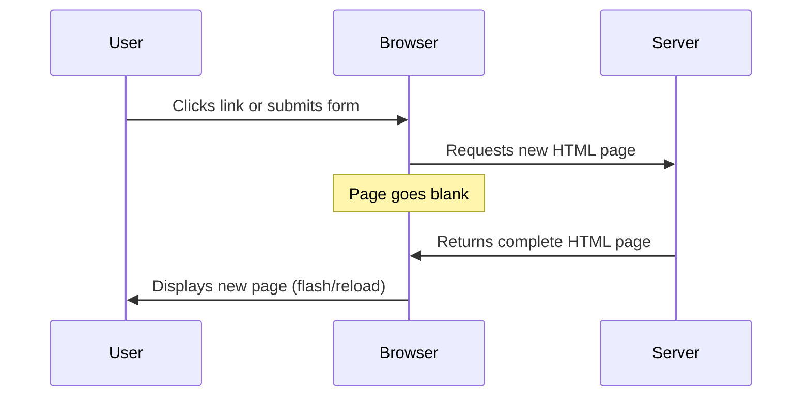
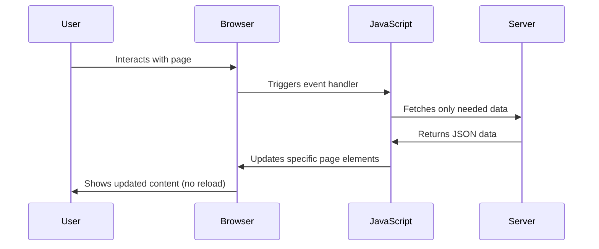

<!--
CO_OP_TRANSLATOR_METADATA:
{
  "original_hash": "2c1164912414820c8efd699b43f64954",
  "translation_date": "2025-10-22T17:55:58+00:00",
  "source_file": "7-bank-project/3-data/README.md",
  "language_code": "pa"
}
-->
# ਬੈਂਕਿੰਗ ਐਪ ਬਣਾਉਣਾ ਭਾਗ 3: ਡਾਟਾ ਪ੍ਰਾਪਤੀ ਅਤੇ ਇਸਦੇ ਉਪਯੋਗ ਦੇ ਤਰੀਕੇ

ਸਟਾਰ ਟ੍ਰੈਕ ਦੇ ਐਂਟਰਪ੍ਰਾਈਜ਼ ਕੰਪਿਊਟਰ ਬਾਰੇ ਸੋਚੋ - ਜਦੋਂ ਕੈਪਟਨ ਪਿਕਾਰਡ ਜਹਾਜ਼ ਦੀ ਸਥਿਤੀ ਬਾਰੇ ਪੁੱਛਦਾ ਹੈ, ਤਾਂ ਜਾਣਕਾਰੀ ਤੁਰੰਤ ਪ੍ਰਗਟ ਹੁੰਦੀ ਹੈ ਬਿਨਾਂ ਪੂਰੇ ਇੰਟਰਫੇਸ ਨੂੰ ਬੰਦ ਕਰਨ ਅਤੇ ਦੁਬਾਰਾ ਬਣਾਉਣ ਦੇ। ਇਹ ਸਹੀ ਤਰੀਕੇ ਨਾਲ ਜਾਣਕਾਰੀ ਦਾ ਪ੍ਰਵਾਹ ਹੈ ਜੋ ਅਸੀਂ ਇੱਥੇ ਡਾਇਨਾਮਿਕ ਡਾਟਾ ਫੈਚਿੰਗ ਨਾਲ ਬਣਾਉਣ ਜਾ ਰਹੇ ਹਾਂ।

ਇਸ ਸਮੇਂ, ਤੁਹਾਡਾ ਬੈਂਕਿੰਗ ਐਪ ਇੱਕ ਛਪੇ ਹੋਏ ਅਖ਼ਬਾਰ ਵਾਂਗ ਹੈ - ਜਾਣਕਾਰੀ ਦੇਣ ਵਾਲਾ ਪਰ ਸਥਿਰ। ਅਸੀਂ ਇਸਨੂੰ NASA ਦੇ ਮਿਸ਼ਨ ਕੰਟਰੋਲ ਵਾਂਗ ਕੁਝ ਬਦਲਣ ਜਾ ਰਹੇ ਹਾਂ, ਜਿੱਥੇ ਡਾਟਾ ਲਗਾਤਾਰ ਵਗਦਾ ਹੈ ਅਤੇ ਯੂਜ਼ਰ ਦੇ ਕੰਮ ਵਿੱਚ ਰੁਕਾਵਟ ਪੈਣ ਤੋਂ ਬਿਨਾਂ ਰੀਅਲ-ਟਾਈਮ ਵਿੱਚ ਅਪਡੇਟ ਹੁੰਦਾ ਹੈ।

ਤੁਹਾਨੂੰ ਸਰਵਰਾਂ ਨਾਲ ਅਸਿੰਕ੍ਰੋਨਸ ਤਰੀਕੇ ਨਾਲ ਸੰਚਾਰ ਕਰਨ, ਵੱਖ-ਵੱਖ ਸਮਿਆਂ 'ਤੇ ਆਉਣ ਵਾਲੇ ਡਾਟਾ ਨੂੰ ਸੰਭਾਲਣ ਅਤੇ ਕੱਚੇ ਜਾਣਕਾਰੀ ਨੂੰ ਯੂਜ਼ਰਾਂ ਲਈ ਅਰਥਪੂਰਨ ਕੁਝ ਵਿੱਚ ਬਦਲਣ ਦਾ ਤਰੀਕਾ ਸਿੱਖਣ ਨੂੰ ਮਿਲੇਗਾ। ਇਹ ਡੈਮੋ ਅਤੇ ਪ੍ਰੋਡਕਸ਼ਨ-ਤਿਆਰ ਸੌਫਟਵੇਅਰ ਦੇ ਵਿਚਕਾਰ ਅੰਤਰ ਹੈ।

## ਲੈਕਚਰ ਤੋਂ ਪਹਿਲਾਂ ਕਵਿਜ਼

[ਲੈਕਚਰ ਤੋਂ ਪਹਿਲਾਂ ਕਵਿਜ਼](https://ff-quizzes.netlify.app/web/quiz/45)

### ਪੂਰਵ ਸ਼ਰਤਾਂ

ਡਾਟਾ ਫੈਚਿੰਗ ਵਿੱਚ ਡੁੱਬਣ ਤੋਂ ਪਹਿਲਾਂ, ਇਹ ਕੰਪੋਨੈਂਟਸ ਤਿਆਰ ਰੱਖੋ:

- **ਪਿਛਲਾ ਪਾਠ**: [ਲੌਗਇਨ ਅਤੇ ਰਜਿਸਟ੍ਰੇਸ਼ਨ ਫਾਰਮ](../2-forms/README.md) ਪੂਰਾ ਕਰੋ - ਅਸੀਂ ਇਸ ਅਧਾਰ 'ਤੇ ਕੰਮ ਕਰਾਂਗੇ।
- **ਲੋਕਲ ਸਰਵਰ**: [Node.js](https://nodejs.org) ਇੰਸਟਾਲ ਕਰੋ ਅਤੇ [ਸਰਵਰ API ਚਲਾਓ](../api/README.md) ਜੋ ਖਾਤੇ ਦਾ ਡਾਟਾ ਪ੍ਰਦਾਨ ਕਰੇ।
- **API ਕਨੈਕਸ਼ਨ**: ਆਪਣੇ ਸਰਵਰ ਕਨੈਕਸ਼ਨ ਨੂੰ ਇਸ ਕਮਾਂਡ ਨਾਲ ਟੈਸਟ ਕਰੋ:

```bash
curl http://localhost:5000/api
# Expected response: "Bank API v1.0.0"
```

ਇਹ ਤੇਜ਼ ਟੈਸਟ ਇਹ ਯਕੀਨੀ ਬਣਾਉਂਦਾ ਹੈ ਕਿ ਸਾਰੇ ਕੰਪੋਨੈਂਟਸ ਸਹੀ ਤਰੀਕੇ ਨਾਲ ਸੰਚਾਰ ਕਰ ਰਹੇ ਹਨ:
- ਯਕੀਨੀ ਬਣਾਉਂਦਾ ਹੈ ਕਿ Node.js ਤੁਹਾਡੇ ਸਿਸਟਮ 'ਤੇ ਸਹੀ ਤਰੀਕੇ ਨਾਲ ਚੱਲ ਰਿਹਾ ਹੈ।
- ਪੁਸ਼ਟੀ ਕਰਦਾ ਹੈ ਕਿ ਤੁਹਾਡਾ API ਸਰਵਰ ਸਰਗਰਮ ਹੈ ਅਤੇ ਜਵਾਬ ਦੇ ਰਿਹਾ ਹੈ।
- ਯਕੀਨੀ ਬਣਾਉਂਦਾ ਹੈ ਕਿ ਤੁਹਾਡਾ ਐਪ ਸਰਵਰ ਤੱਕ ਪਹੁੰਚ ਸਕਦਾ ਹੈ (ਮਿਸ਼ਨ ਤੋਂ ਪਹਿਲਾਂ ਰੇਡੀਓ ਸੰਪਰਕ ਦੀ ਜਾਂਚ ਕਰਨ ਵਾਂਗ)।

---

## ਆਧੁਨਿਕ ਵੈੱਬ ਐਪਸ ਵਿੱਚ ਡਾਟਾ ਫੈਚਿੰਗ ਨੂੰ ਸਮਝਣਾ

ਪਿਛਲੇ ਦੋ ਦਹਾਕਿਆਂ ਵਿੱਚ ਵੈੱਬ ਐਪਲੀਕੇਸ਼ਨਸ ਡਾਟਾ ਨੂੰ ਸੰਭਾਲਣ ਦਾ ਤਰੀਕਾ ਬਹੁਤ ਬਦਲ ਗਿਆ ਹੈ। ਇਸ ਵਿਕਾਸ ਨੂੰ ਸਮਝਣਾ ਤੁਹਾਨੂੰ ਇਹ ਸਮਝਣ ਵਿੱਚ ਮਦਦ ਕਰੇਗਾ ਕਿ ਆਧੁਨਿਕ ਤਕਨੀਕਾਂ ਜਿਵੇਂ AJAX ਅਤੇ Fetch API ਕਿਉਂ ਸ਼ਕਤੀਸ਼ਾਲੀ ਹਨ ਅਤੇ ਕਿਉਂ ਇਹ ਵੈੱਬ ਡਿਵੈਲਪਰਾਂ ਲਈ ਜ਼ਰੂਰੀ ਸੰਦ ਬਣ ਗਈਆਂ ਹਨ।

ਆਓ ਪੁਰਾਣੇ ਵੈੱਬਸਾਈਟਸ ਦੇ ਕੰਮ ਕਰਨ ਦੇ ਤਰੀਕੇ ਦੀ ਤੁਲਨਾ ਕਰੀਏ ਜੋ ਅਸੀਂ ਅੱਜ ਬਣਾਉਂਦੇ ਹਾਂ।

### ਰਵਾਇਤੀ ਮਲਟੀ-ਪੇਜ ਐਪਲੀਕੇਸ਼ਨਸ (MPA)

ਵੈੱਬ ਦੇ ਸ਼ੁਰੂਆਤੀ ਦਿਨਾਂ ਵਿੱਚ, ਹਰ ਕਲਿਕ ਪੁਰਾਣੇ ਟੈਲੀਵਿਜ਼ਨ 'ਤੇ ਚੈਨਲ ਬਦਲਣ ਵਾਂਗ ਸੀ - ਸਕ੍ਰੀਨ ਖਾਲੀ ਹੋ ਜਾਂਦੀ ਸੀ, ਫਿਰ ਨਵੀਂ ਸਮੱਗਰੀ ਨੂੰ ਧੀਰੇ-ਧੀਰੇ ਟਿਊਨ ਕੀਤਾ ਜਾਂਦਾ ਸੀ। ਇਹ ਸ਼ੁਰੂਆਤੀ ਵੈੱਬ ਐਪਲੀਕੇਸ਼ਨਸ ਦੀ ਹਕੀਕਤ ਸੀ, ਜਿੱਥੇ ਹਰ ਇੰਟਰੈਕਸ਼ਨ ਦਾ ਮਤਲਬ ਸੀ ਪੂਰੇ ਪੇਜ ਨੂੰ ਮੁੜ ਤੋਂ ਬਣਾਉਣਾ।




**ਇਹ ਤਰੀਕਾ ਕਿਉਂ ਅਸੁਵਿਧਾਜਨਕ ਲੱਗਦਾ ਸੀ:**
- ਹਰ ਕਲਿਕ ਦਾ ਮਤਲਬ ਸੀ ਪੂਰੇ ਪੇਜ ਨੂੰ ਮੁੜ ਤੋਂ ਬਣਾਉਣਾ।
- ਯੂਜ਼ਰਾਂ ਨੂੰ ਉਹਨਾਂ ਦੇ ਵਿਚਾਰਾਂ ਦੇ ਵਿਚਕਾਰ ਰੁਕਾਵਟਾਂ ਦਾ ਸਾਹਮਣਾ ਕਰਨਾ ਪੈਂਦਾ ਸੀ।
- ਤੁਹਾਡਾ ਇੰਟਰਨੈਟ ਕਨੈਕਸ਼ਨ ਮੁੜ-ਮੁੜ ਉਹੀ ਹੈਡਰ ਅਤੇ ਫੁਟਰ ਡਾਊਨਲੋਡ ਕਰਦਾ ਸੀ।
- ਐਪਸ ਸੌਫਟਵੇਅਰ ਦੀ ਵਰਤੋਂ ਕਰਨ ਦੀ ਬਜਾਏ ਫਾਈਲਿੰਗ ਕੈਬਿਨੇਟ ਦੇ ਰੂਪ ਵਿੱਚ ਜ਼ਿਆਦਾ ਮਹਿਸੂਸ ਹੁੰਦੇ ਸਨ।

### ਆਧੁਨਿਕ ਸਿੰਗਲ-ਪੇਜ ਐਪਲੀਕੇਸ਼ਨਸ (SPA)

AJAX (Asynchronous JavaScript and XML) ਨੇ ਇਸ ਪੈਰਾਡਾਇਮ ਨੂੰ ਪੂਰੀ ਤਰ੍ਹਾਂ ਬਦਲ ਦਿੱਤਾ। ਜਿਵੇਂ ਇੰਟਰਨੈਸ਼ਨਲ ਸਪੇਸ ਸਟੇਸ਼ਨ ਦੀ ਮੋਡਿਊਲਰ ਡਿਜ਼ਾਈਨ, ਜਿੱਥੇ ਅਸਟਰੋਨਾਟਸ ਪੂਰੇ ਢਾਂਚੇ ਨੂੰ ਮੁੜ ਤੋਂ ਬਣਾਉਣ ਦੇ ਬਗੈਰ ਵਿਅਕਤੀਗਤ ਕੰਪੋਨੈਂਟਸ ਨੂੰ ਬਦਲ ਸਕਦੇ ਹਨ, AJAX ਸਾਨੂੰ ਪੇਜ ਦੇ ਵਿਸ਼ੇਸ਼ ਹਿੱਸਿਆਂ ਨੂੰ ਅਪਡੇਟ ਕਰਨ ਦੀ ਆਗਿਆ ਦਿੰਦਾ ਹੈ ਬਿਨਾਂ ਸਾਰਾ ਕੁਝ ਮੁੜ-ਲੋਡ ਕਰਨ ਦੇ। XML ਦਾ ਜ਼ਿਕਰ ਕਰਨ ਦੇ ਬਾਵਜੂਦ, ਅਸੀਂ ਅੱਜ ਜ਼ਿਆਦਾਤਰ JSON ਵਰਤਦੇ ਹਾਂ, ਪਰ ਮੁੱਖ ਸਿਧਾਂਤ ਇਹ ਹੈ: ਸਿਰਫ ਉਹਨਾਂ ਹਿੱਸਿਆਂ ਨੂੰ ਅਪਡੇਟ ਕਰੋ ਜੋ ਬਦਲਣ ਦੀ ਲੋੜ ਹੈ।




**SPAs ਕਿਉਂ ਬਿਹਤਰ ਮਹਿਸੂਸ ਹੁੰਦੇ ਹਨ:**
- ਸਿਰਫ ਉਹ ਹਿੱਸੇ ਜੋ ਵਾਸਤਵ ਵਿੱਚ ਬਦਲੇ ਹਨ ਅਪਡੇਟ ਹੁੰਦੇ ਹਨ (ਸਮਾਰਟ, ਹੈ ਨਾ?)
- ਕੋਈ ਰੁਕਾਵਟਾਂ ਨਹੀਂ - ਤੁਹਾਡੇ ਯੂਜ਼ਰ ਆਪਣੇ ਫਲੋ ਵਿੱਚ ਰਹਿੰਦੇ ਹਨ।
- ਵਾਇਰ 'ਤੇ ਘੱਟ ਡਾਟਾ ਜਾਣ ਦਾ ਮਤਲਬ ਹੈ ਤੇਜ਼ ਲੋਡਿੰਗ।
- ਸਭ ਕੁਝ ਸਨੈਪੀ ਅਤੇ ਰਿਸਪਾਂਸਿਵ ਮਹਿਸੂਸ ਹੁੰਦਾ ਹੈ, ਜਿਵੇਂ ਤੁਹਾਡੇ ਫੋਨ ਦੇ ਐਪਸ।

### ਆਧੁਨਿਕ Fetch API ਵੱਲ ਵਿਕਾਸ

ਆਧੁਨਿਕ ਬ੍ਰਾਊਜ਼ਰ [`Fetch` API](https://developer.mozilla.org/docs/Web/API/Fetch_API) ਪ੍ਰਦਾਨ ਕਰਦੇ ਹਨ, ਜੋ ਪੁਰਾਣੇ [`XMLHttpRequest`](https://developer.mozilla.org/docs/Web/API/XMLHttpRequest/Using_XMLHttpRequest) ਦੀ ਜਗ੍ਹਾ ਲੈਂਦਾ ਹੈ। ਜਿਵੇਂ ਟੈਲੀਗ੍ਰਾਫ ਚਲਾਉਣ ਅਤੇ ਈਮੇਲ ਵਰਤਣ ਦੇ ਵਿਚਕਾਰ ਅੰਤਰ ਹੈ, Fetch API ਵਾਅਦਿਆਂ (promises) ਨੂੰ ਸਾਫ਼ ਅਸਿੰਕ੍ਰੋਨਸ ਕੋਡ ਲਈ ਵਰਤਦਾ ਹੈ ਅਤੇ JSON ਨੂੰ ਕੁਦਰਤੀ ਤੌਰ 'ਤੇ ਸੰਭਾਲਦਾ ਹੈ।

| ਫੀਚਰ | XMLHttpRequest | Fetch API |
|---------|----------------|----------|
| **ਸਿੰਟੈਕਸ** | ਜਟਿਲ ਕਾਲਬੈਕ-ਅਧਾਰਿਤ | ਸਾਫ਼ ਵਾਅਦਾ-ਅਧਾਰਿਤ |
| **JSON ਸੰਭਾਲ** | ਮੈਨੂਅਲ ਪਾਰਸਿੰਗ ਦੀ ਲੋੜ | ਅੰਦਰੂਨੀ `.json()` ਵਿਧੀ |
| **ਐਰਰ ਸੰਭਾਲ** | ਸੀਮਿਤ ਐਰਰ ਜਾਣਕਾਰੀ | ਵਿਸਤ੍ਰਿਤ ਐਰਰ ਵੇਰਵੇ |
| **ਆਧੁਨਿਕ ਸਹਾਇਤਾ** | ਲੈਗੇਸੀ ਅਨੁਕੂਲਤਾ | ES6+ ਵਾਅਦੇ ਅਤੇ async/await |

> 💡 **ਬ੍ਰਾਊਜ਼ਰ ਅਨੁਕੂਲਤਾ**: ਚੰਗੀ ਖ਼ਬਰ - Fetch API ਸਾਰੇ ਆਧੁਨਿਕ ਬ੍ਰਾਊਜ਼ਰਾਂ ਵਿੱਚ ਕੰਮ ਕਰਦਾ ਹੈ! ਜੇ ਤੁਸੀਂ ਖਾਸ ਵਰਜਨਾਂ ਬਾਰੇ ਜ਼ਿਆਦਾ ਜਾਣਨਾ ਚਾਹੁੰਦੇ ਹੋ, [caniuse.com](https://caniuse.com/fetch) ਵਿੱਚ ਪੂਰੀ ਅਨੁਕੂਲਤਾ ਕਹਾਣੀ ਹੈ।
> 
**ਸਾਰ:**
- Chrome, Firefox, Safari, ਅਤੇ Edge ਵਿੱਚ ਬਹੁਤ ਵਧੀਆ ਕੰਮ ਕਰਦਾ ਹੈ (ਮੂਲ ਤੌਰ 'ਤੇ ਜਿੱਥੇ ਤੁਹਾਡੇ ਯੂਜ਼ਰ ਹਨ)
- ਸਿਰਫ Internet Explorer ਨੂੰ ਵਾਧੂ ਮਦਦ ਦੀ ਲੋੜ ਹੈ (ਅਤੇ ਸੱਚਮੁੱਚ, IE ਨੂੰ ਛੱਡਣ ਦਾ ਸਮਾਂ ਹੈ)
- ਤੁਹਾਨੂੰ ਸੁੰਦਰ async/await ਪੈਟਰਨ ਲਈ ਬਹੁਤ ਵਧੀਆ ਤਰੀਕੇ ਨਾਲ ਸੈਟ ਕਰਦਾ ਹੈ ਜੋ ਅਸੀਂ ਬਾਅਦ ਵਿੱਚ ਵਰਤਾਂਗੇ

### ਯੂਜ਼ਰ ਲੌਗਇਨ ਅਤੇ ਡਾਟਾ ਪ੍ਰਾਪਤੀ ਨੂੰ ਲਾਗੂ ਕਰਨਾ

ਹੁਣ ਆਓ ਲੌਗਇਨ ਸਿਸਟਮ ਨੂੰ ਲਾਗੂ ਕਰੀਏ ਜੋ ਤੁਹਾਡੇ ਬੈਂਕਿੰਗ ਐਪ ਨੂੰ ਸਥਿਰ ਡਿਸਪਲੇ ਤੋਂ ਇੱਕ ਕਾਰਗਰ ਐਪਲੀਕੇਸ਼ਨ ਵਿੱਚ ਬਦਲ ਦਿੰਦਾ ਹੈ। ਜਿਵੇਂ ਸੁਰੱਖਿਅਤ ਫੌਜੀ ਸਹੂਲਤਾਂ ਵਿੱਚ ਵਰਤੀਆਂ ਜਾਣ ਵਾਲੀਆਂ ਪ੍ਰਮਾਣਿਕਤਾ ਪ੍ਰੋਟੋਕੋਲ, ਅਸੀਂ ਯੂਜ਼ਰ ਦੀ ਪਛਾਣ ਦੀ ਪੁਸ਼ਟੀ ਕਰਾਂਗੇ ਅਤੇ ਫਿਰ ਉਹਨਾਂ ਦੇ ਵਿਸ਼ੇਸ਼ ਡਾਟਾ ਤੱਕ ਪਹੁੰਚ ਪ੍ਰਦਾਨ ਕਰਾਂਗੇ।

ਅਸੀਂ ਇਸਨੂੰ ਕਦਮ-ਦਰ-ਕਦਮ ਬਣਾਉਣਗੇ, ਬੁਨਿਆਦੀ ਪ੍ਰਮਾਣਿਕਤਾ ਤੋਂ ਸ਼ੁਰੂ ਕਰਕੇ ਅਤੇ ਫਿਰ ਡਾਟਾ-ਫੈਚਿੰਗ ਸਮਰੱਥਾ ਸ਼ਾਮਲ ਕਰਾਂਗੇ।

#### ਕਦਮ 1: ਲੌਗਇਨ ਫੰਕਸ਼ਨ ਦੀ ਬੁਨਿਆਦ ਬਣਾਉਣਾ

ਆਪਣੀ `app.js` ਫਾਈਲ ਖੋਲ੍ਹੋ ਅਤੇ ਇੱਕ ਨਵਾਂ `login` ਫੰਕਸ਼ਨ ਸ਼ਾਮਲ ਕਰੋ। ਇਹ ਯੂਜ਼ਰ ਪ੍ਰਮਾਣਿਕਤਾ ਪ੍ਰਕਿਰਿਆ ਨੂੰ ਸੰਭਾਲੇਗਾ:

```javascript
async function login() {
  const loginForm = document.getElementById('loginForm');
  const user = loginForm.user.value;
}
```

**ਇਸਨੂੰ ਤੋੜ ਕੇ ਸਮਝਦੇ ਹਾਂ:**
- ਉਹ `async` ਕੀਵਰਡ? ਇਹ JavaScript ਨੂੰ ਕਹਿ ਰਿਹਾ ਹੈ "ਹੇ, ਇਹ ਫੰਕਸ਼ਨ ਸ਼ਾਇਦ ਚੀਜ਼ਾਂ ਦੀ ਉਡੀਕ ਕਰ ਸਕਦਾ ਹੈ"
- ਅਸੀਂ ਆਪਣੇ ਫਾਰਮ ਨੂੰ ਪੇਜ ਤੋਂ ਲੈ ਰਹੇ ਹਾਂ (ਕੋਈ ਫੈਂਸੀ ਚੀਜ਼ ਨਹੀਂ, ਸਿਰਫ ਇਸਨੂੰ ਇਸਦੇ ID ਦੁਆਰਾ ਲੱਭ ਰਹੇ ਹਾਂ)
- ਫਿਰ ਅਸੀਂ ਜੋ ਕੁਝ ਯੂਜ਼ਰ ਨੇ ਆਪਣਾ ਯੂਜ਼ਰਨੇਮ ਵਜੋਂ ਟਾਈਪ ਕੀਤਾ ਹੈ, ਉਸਨੂੰ ਖਿੱਚ ਰਹੇ ਹਾਂ
- ਇੱਥੇ ਇੱਕ ਵਧੀਆ ਤਰੀਕਾ ਹੈ: ਤੁਸੀਂ ਕਿਸੇ ਵੀ ਫਾਰਮ ਇਨਪੁਟ ਤੱਕ ਇਸਦੇ `name` ਐਟ੍ਰਿਬਿਊਟ ਦੁਆਰਾ ਪਹੁੰਚ ਕਰ ਸਕਦੇ ਹੋ - ਵਾਧੂ getElementById ਕਾਲਾਂ ਦੀ ਲੋੜ ਨਹੀਂ!

> 💡 **ਫਾਰਮ ਐਕਸੈਸ ਪੈਟਰਨ**: ਹਰ ਫਾਰਮ ਕੰਟਰੋਲ ਨੂੰ ਇਸਦੇ name (HTML ਵਿੱਚ `name` ਐਟ੍ਰਿਬਿਊਟ ਦੀ ਵਰਤੋਂ ਕਰਕੇ ਸੈਟ ਕੀਤਾ ਗਿਆ) ਦੁਆਰਾ ਫਾਰਮ ਐਲੀਮੈਂਟ ਦੀ ਇੱਕ ਪ੍ਰਾਪਰਟੀ ਵਜੋਂ ਪਹੁੰਚਿਆ ਜਾ ਸਕਦਾ ਹੈ। ਇਹ ਫਾਰਮ ਡਾਟਾ ਪ੍ਰਾਪਤ ਕਰਨ ਦਾ ਇੱਕ ਸਾਫ਼, ਪੜ੍ਹਨ ਯੋਗ ਤਰੀਕਾ ਪ੍ਰਦਾਨ ਕਰਦਾ ਹੈ।

#### ਕਦਮ 2: ਖਾਤਾ ਡਾਟਾ ਪ੍ਰਾਪਤੀ ਫੰਕਸ਼ਨ ਬਣਾਉਣਾ

ਅਗਲੇ ਕਦਮ ਵਿੱਚ, ਅਸੀਂ ਸਰਵਰ ਤੋਂ ਖਾਤਾ ਡਾਟਾ ਪ੍ਰਾਪਤ ਕਰਨ ਲਈ ਇੱਕ ਸਮਰਪਿਤ ਫੰਕਸ਼ਨ ਬਣਾਉਣਗੇ। ਇਹ ਤੁਹਾਡੇ ਰਜਿਸਟ੍ਰੇਸ਼ਨ ਫੰਕਸ਼ਨ ਦੇ ਸਮਾਨ ਪੈਟਰਨ ਦੀ ਪਾਲਣਾ ਕਰਦਾ ਹੈ ਪਰ ਡਾਟਾ ਪ੍ਰਾਪਤੀ 'ਤੇ ਧਿਆਨ ਕੇਂਦਰਿਤ ਕਰਦਾ ਹੈ:

```javascript
async function getAccount(user) {
  try {
    const response = await fetch('//localhost:5000/api/accounts/' + encodeURIComponent(user));
    return await response.json();
  } catch (error) {
    return { error: error.message || 'Unknown error' };
  }
}
```

**ਇਹ ਕੋਡ ਕੀ ਹਾਸਲ ਕਰਦਾ ਹੈ:**
- **ਵਰਤਦਾ ਹੈ** ਆਧੁਨਿਕ `fetch` API ਡਾਟਾ ਨੂੰ ਅਸਿੰਕ੍ਰੋਨਸ ਤਰੀਕੇ ਨਾਲ ਮੰਗਣ ਲਈ
- **ਤਿਆਰ ਕਰਦਾ ਹੈ** ਇੱਕ GET ਰਿਕਵੈਸਟ URL ਯੂਜ਼ਰਨੇਮ ਪੈਰਾਮੀਟਰ ਨਾਲ
- **ਲਾਗੂ ਕਰਦਾ ਹੈ** `encodeURIComponent()` ਜੋ URLs ਵਿੱਚ ਵਿਸ਼ੇਸ਼ ਅੱਖਰਾਂ ਨੂੰ ਸੁਰੱਖਿਅਤ ਤਰੀਕੇ ਨਾਲ ਸੰਭਾਲਦਾ ਹੈ
- **ਰਿਸਪਾਂਸ ਨੂੰ** JSON ਫਾਰਮੈਟ ਵਿੱਚ ਬਦਲਦਾ ਹੈ ਜੋ ਡਾਟਾ ਮੈਨਿਪੂਲੇਸ਼ਨ ਲਈ ਆਸਾਨ ਹੈ
- **ਗ੍ਰੇਸਫੁਲ ਤਰੀਕੇ ਨਾਲ ਐਰਰਸ ਨੂੰ** ਸੰਭਾਲਦਾ ਹੈ ਅਤੇ ਐਰਰ ਓਬਜੈਕਟ ਵਾਪਸ ਕਰਦਾ ਹੈ ਬਜਾਏ ਕਿ ਕਰੈਸ਼ ਹੋਣ ਦੇ

> ⚠️ **ਸੁਰੱਖਿਆ ਨੋਟ**: `encodeURIComponent()` ਫੰਕਸ਼ਨ URLs ਵਿੱਚ ਵਿਸ਼ੇਸ਼ ਅੱਖਰਾਂ ਨੂੰ ਸੰਭਾਲਦਾ ਹੈ। ਜਿਵੇਂ ਨੈਵਲ ਕਮਿਊਨਿਕੇਸ਼ਨਜ਼ ਵਿੱਚ ਵਰਤੀਆਂ ਜਾਣ ਵਾਲੀਆਂ ਐਨਕੋਡਿੰਗ ਸਿਸਟਮ, ਇਹ ਯਕੀਨੀ ਬਣਾਉਂਦਾ ਹੈ ਕਿ ਤੁਹਾਡਾ ਸੁਨੇਹਾ ਬਿਲਕੁਲ ਜਿਵੇਂ ਇਰਾਦਾ ਕੀਤਾ ਗਿਆ ਹੈ ਪਹੁੰਚਦਾ ਹੈ, "#", "&" ਵਰਗੇ ਅੱਖਰਾਂ ਨੂੰ ਗਲਤ ਸਮਝਣ ਤੋਂ ਰੋਕਦਾ ਹੈ।
> 
**ਇਸਦਾ ਮਹੱਤਵ:**
- ਵਿਸ਼ੇਸ਼ ਅੱਖਰਾਂ ਨੂੰ URLs ਨੂੰ ਤੋੜਨ ਤੋਂ ਰੋਕਦਾ ਹੈ
- URL ਮੈਨਿਪੂਲੇਸ਼ਨ ਹਮਲਿਆਂ ਤੋਂ ਸੁਰੱਖਿਅਤ ਕਰਦਾ ਹੈ
- ਯਕੀਨੀ ਬਣਾਉਂਦਾ ਹੈ ਕਿ ਤੁਹਾਡਾ ਸਰਵਰ ਇਰਾਦਾ ਕੀਤਾ ਡਾਟਾ ਪ੍ਰਾਪਤ ਕਰਦਾ ਹੈ
- ਸੁਰੱਖਿਅਤ ਕੋਡਿੰਗ ਅਭਿਆਸਾਂ ਦੀ ਪਾਲਣਾ ਕਰਦਾ ਹੈ

#### HTTP GET ਰਿਕਵੈਸਟਸ ਨੂੰ ਸਮਝਣਾ

ਇਹ ਤੁਹਾਨੂੰ ਹੈਰਾਨ ਕਰ ਸਕਦਾ ਹੈ: ਜਦੋਂ ਤੁਸੀਂ `fetch` ਨੂੰ ਕਿਸੇ ਵਾਧੂ ਵਿਕਲਪਾਂ ਦੇ ਬਗੈਰ ਵਰਤਦੇ ਹੋ, ਇਹ ਆਪਣੇ ਆਪ ਇੱਕ [`GET`](https://developer.mozilla.org/docs/Web/HTTP/Methods/GET) ਰਿਕਵੈਸਟ ਬਣਾਉਂਦਾ ਹੈ। ਇਹ ਉਸ ਲਈ ਬਹੁਤ ਵਧੀਆ ਹੈ ਜੋ ਅਸੀਂ ਕਰ ਰਹੇ ਹਾਂ - ਸਰਵਰ ਨੂੰ ਪੁੱਛਣਾ "ਹੇ, ਕੀ ਮੈਂ ਇਸ ਯੂਜ਼ਰ ਦਾ ਖਾਤਾ ਡਾਟਾ ਦੇਖ ਸਕਦਾ ਹਾਂ?"

GET ਰਿਕਵੈਸਟਸ ਨੂੰ ਲਾਇਬ੍ਰੇਰੀ ਤੋਂ ਕਿਤਾਬ ਉਧਾਰ ਲੈਣ ਦੀ ਬੇਨਤੀ ਕਰਨ ਵਾਂਗ ਸੋਚੋ - ਤੁਸੀਂ ਕੁਝ ਮੌਜੂਦਾ ਚੀਜ਼ ਦੇਖਣ ਦੀ ਬੇਨਤੀ ਕਰ ਰਹੇ ਹੋ। POST ਰਿਕਵੈਸਟਸ (ਜੋ ਅਸੀਂ ਰਜਿਸਟ੍ਰੇਸ਼ਨ ਲਈ ਵਰਤੀਆਂ) ਜ਼ਿਆਦਾ ਨਵੀਂ ਕਿਤਾਬ ਨੂੰ ਸ਼ਾਮਲ ਕਰਨ ਲਈ ਭੇਜਣ ਵਰਗੀਆਂ ਹਨ।

| GET ਰਿਕਵੈਸਟ | POST ਰਿਕਵੈਸਟ |
|-------------|-------------|
| **ਉਦੇਸ਼** | ਮੌਜੂਦਾ ਡਾਟਾ ਪ੍ਰਾਪਤ ਕਰੋ | ਸਰਵਰ ਨੂੰ ਨਵਾਂ ਡਾਟਾ ਭੇਜੋ |
| **ਪੈਰਾਮੀਟਰਸ** | URL ਪਾਥ/ਕੁਐਰੀ ਸਟ੍ਰਿੰਗ ਵਿੱਚ | ਰਿਕਵੈਸਟ ਬਾਡੀ ਵਿੱਚ |
| **ਕੈਸ਼ਿੰਗ** | ਬ੍ਰਾਊਜ਼ਰਾਂ ਦੁਆਰਾ ਕੈਸ਼ ਕੀਤਾ ਜਾ ਸਕਦਾ ਹੈ | ਆਮ ਤੌਰ 'ਤੇ ਕੈਸ਼ ਨਹੀਂ ਕੀਤਾ ਜਾਂਦਾ |
| **ਸੁਰੱਖਿਆ** | URL/ਲਾਗਸ ਵਿੱਚ ਦਿਖਾਈ ਦੇਣ ਵਾਲਾ | ਰਿਕਵੈਸਟ ਬਾਡੀ ਵਿੱਚ ਲੁਕਿਆ |

#### ਕਦਮ 3: ਸਭ ਕੁਝ ਇਕੱਠੇ ਲਿਆਉਣਾ

ਹੁਣ ਸੰਤੋਸ਼ਜਨਕ ਹਿੱਸਾ - ਆਓ ਆਪਣੇ ਖਾਤਾ
ਜਟਿਲ ਸਮੱਗਰੀ ਲਈ, [`document.createElement()`](https://developer.mozilla.org/docs/Web/API/Document/createElement) ਨੂੰ [`append()`](https://developer.mozilla.org/docs/Web/API/ParentNode/append) ਵਿਧੀ ਨਾਲ ਜੋੜੋ:

```javascript
// Safe way to create new elements
const transactionItem = document.createElement('div');
transactionItem.className = 'transaction-item';
transactionItem.textContent = `${transaction.date}: ${transaction.description}`;
container.append(transactionItem);
```

**ਇਸ ਪਹੁੰਚ ਨੂੰ ਸਮਝਣਾ:**
- **ਨਵੇਂ DOM ਤੱਤਾਂ** ਨੂੰ ਪ੍ਰੋਗਰਾਮਿੰਗ ਰਾਹੀਂ ਬਣਾਉਣਾ
- **ਤੱਤਾਂ ਦੇ ਗੁਣਾਂ ਅਤੇ ਸਮੱਗਰੀ** 'ਤੇ ਪੂਰਾ ਕੰਟਰੋਲ ਰੱਖਣਾ
- **ਜਟਿਲ, nested ਤੱਤਾਂ ਦੇ ਢਾਂਚੇ** ਲਈ ਸਹਾਇਕ
- **ਸੁਰੱਖਿਆ ਨੂੰ ਯਕੀਨੀ ਬਣਾਉਣਾ** ਸਮੱਗਰੀ ਨੂੰ ਢਾਂਚੇ ਤੋਂ ਵੱਖ ਕਰਕੇ

> ⚠️ **ਸੁਰੱਖਿਆ ਦੇ ਮਸਲੇ**: ਜਦੋਂ ਕਿ [`innerHTML`](https://developer.mozilla.org/docs/Web/API/Element/innerHTML) ਕਈ ਟਿਊਟੋਰਿਅਲ ਵਿੱਚ ਦਿਖਾਈ ਦਿੰਦਾ ਹੈ, ਇਹ embedded ਸਕ੍ਰਿਪਟਾਂ ਨੂੰ ਚਲਾਉਣ ਦੀ ਸਮਰੱਥਾ ਰੱਖਦਾ ਹੈ। ਜਿਵੇਂ CERN ਦੇ ਸੁਰੱਖਿਆ ਪ੍ਰੋਟੋਕੋਲ unauthorized ਕੋਡ ਨੂੰ ਚਲਾਉਣ ਤੋਂ ਰੋਕਦੇ ਹਨ, `textContent` ਅਤੇ `createElement` ਵਰਤਣਾ ਸੁਰੱਖਿਅਤ ਵਿਕਲਪ ਪ੍ਰਦਾਨ ਕਰਦਾ ਹੈ।
> 
**innerHTML ਦੇ ਖਤਰੇ:**
- ਯੂਜ਼ਰ ਡਾਟਾ ਵਿੱਚ ਮੌਜੂਦ ਕਿਸੇ ਵੀ `<script>` ਟੈਗ ਨੂੰ ਚਲਾਉਂਦਾ ਹੈ
- ਕੋਡ injection ਹਮਲਿਆਂ ਲਈ ਸੰਵੇਦਨਸ਼ੀਲ
- ਸੁਰੱਖਿਆ ਦੇ ਸੰਭਾਵੀ ਖਤਰੇ ਪੈਦਾ ਕਰਦਾ ਹੈ
- ਅਸੀਂ ਵਰਤ ਰਹੇ ਸੁਰੱਖਿਅਤ ਵਿਕਲਪ ਸਮਾਨ ਕਾਰਗੁਜ਼ਾਰੀ ਪ੍ਰਦਾਨ ਕਰਦੇ ਹਨ

### ਗਲਤੀਆਂ ਨੂੰ ਯੂਜ਼ਰ-ਫ੍ਰੈਂਡਲੀ ਬਣਾਉਣਾ

ਵਰਤਮਾਨ ਵਿੱਚ, ਲੌਗਇਨ ਗਲਤੀਆਂ ਸਿਰਫ਼ ਬ੍ਰਾਊਜ਼ਰ ਕੌਂਸੋਲ ਵਿੱਚ ਦਿਖਾਈ ਦਿੰਦੀਆਂ ਹਨ, ਜੋ ਯੂਜ਼ਰਾਂ ਲਈ ਅਦ੍ਰਿਸ਼ ਹੈ। ਜਿਵੇਂ ਕਿ ਇੱਕ ਪਾਇਲਟ ਦੇ ਅੰਦਰੂਨੀ ਡਾਇਗਨੋਸਟਿਕਸ ਅਤੇ ਯਾਤਰੀ ਜਾਣਕਾਰੀ ਪ੍ਰਣਾਲੀ ਦੇ ਵਿਚਕਾਰ ਫਰਕ ਹੁੰਦਾ ਹੈ, ਅਸੀਂ ਸਹੀ ਚੈਨਲ ਰਾਹੀਂ ਮਹੱਤਵਪੂਰਨ ਜਾਣਕਾਰੀ ਸੰਚਾਰਿਤ ਕਰਨ ਦੀ ਲੋੜ ਹੈ।

ਦਿੱਖਤ ਗਲਤੀਆਂ ਦੇ ਸੁਨੇਹੇ ਲਾਗੂ ਕਰਨ ਨਾਲ ਯੂਜ਼ਰਾਂ ਨੂੰ ਤੁਰੰਤ ਫੀਡਬੈਕ ਮਿਲਦਾ ਹੈ ਕਿ ਕੀ ਗਲਤ ਹੋਇਆ ਅਤੇ ਅੱਗੇ ਕਿਵੇਂ ਵਧਣਾ ਹੈ।

#### ਪਹਲਾ ਕਦਮ: ਗਲਤੀ ਦੇ ਸੁਨੇਹਿਆਂ ਲਈ ਇੱਕ ਸਥਾਨ ਸ਼ਾਮਲ ਕਰੋ

ਸਭ ਤੋਂ ਪਹਿਲਾਂ, ਆਓ ਆਪਣੇ HTML ਵਿੱਚ ਗਲਤੀ ਦੇ ਸੁਨੇਹਿਆਂ ਲਈ ਇੱਕ ਸਥਾਨ ਦਿਓ। ਇਸ ਨੂੰ ਆਪਣੇ ਲੌਗਇਨ ਬਟਨ ਤੋਂ ਥੋੜ੍ਹਾ ਪਹਿਲਾਂ ਸ਼ਾਮਲ ਕਰੋ ਤਾਂ ਕਿ ਯੂਜ਼ਰ ਇਸ ਨੂੰ ਕੁਦਰਤੀ ਤੌਰ 'ਤੇ ਵੇਖ ਸਕਣ:

```html
<!-- This is where error messages will appear -->
<div id="loginError" role="alert"></div>
<button>Login</button>
```

**ਇੱਥੇ ਕੀ ਹੋ ਰਿਹਾ ਹੈ:**
- ਅਸੀਂ ਇੱਕ ਖਾਲੀ ਕੰਟੇਨਰ ਬਣਾਉਂਦੇ ਹਾਂ ਜੋ ਲੋੜ ਪੈਣ ਤੱਕ ਅਦ੍ਰਿਸ਼ ਰਹਿੰਦਾ ਹੈ
- ਇਹ ਉਸ ਸਥਾਨ 'ਤੇ ਸਥਿਤ ਹੈ ਜਿੱਥੇ ਯੂਜ਼ਰ "Login" ਕਲਿੱਕ ਕਰਨ ਤੋਂ ਬਾਅਦ ਕੁਦਰਤੀ ਤੌਰ 'ਤੇ ਵੇਖਦੇ ਹਨ
- ਉਹ `role="alert"` ਸਕ੍ਰੀਨ ਰੀਡਰਾਂ ਲਈ ਇੱਕ ਵਧੀਆ ਸਵਾਗਤ ਹੈ - ਇਹ ਸਹਾਇਕ ਤਕਨਾਲੋਜੀ ਨੂੰ ਦੱਸਦਾ ਹੈ "ਇਹ ਮਹੱਤਵਪੂਰਨ ਹੈ!"
- ਵਿਲੱਖਣ `id` ਸਾਡੇ ਜਾਵਾਸਕ੍ਰਿਪਟ ਨੂੰ ਇੱਕ ਆਸਾਨ ਟਾਰਗਟ ਦਿੰਦਾ ਹੈ

#### ਦੂਜਾ ਕਦਮ: ਇੱਕ ਸਹਾਇਕ ਫੰਕਸ਼ਨ ਬਣਾਓ

ਆਓ ਇੱਕ ਛੋਟਾ ਯੂਟਿਲਿਟੀ ਫੰਕਸ਼ਨ ਬਣਾਈਏ ਜੋ ਕਿਸੇ ਵੀ ਤੱਤ ਦੇ ਟੈਕਸਟ ਨੂੰ ਅਪਡੇਟ ਕਰ ਸਕੇ। ਇਹ ਉਹਨਾਂ "ਇੱਕ ਵਾਰ ਲਿਖੋ, ਹਰ ਜਗ੍ਹਾ ਵਰਤੋ" ਫੰਕਸ਼ਨਾਂ ਵਿੱਚੋਂ ਇੱਕ ਹੈ ਜੋ ਤੁਹਾਡੇ ਲਈ ਸਮਾਂ ਬਚਾਉਂਦੇ ਹਨ:

```javascript
function updateElement(id, text) {
  const element = document.getElementById(id);
  element.textContent = text;
}
```

**ਫੰਕਸ਼ਨ ਦੇ ਫਾਇਦੇ:**
- ਸਿਰਫ਼ ਇੱਕ ਤੱਤ ID ਅਤੇ ਟੈਕਸਟ ਸਮੱਗਰੀ ਦੀ ਲੋੜ ਵਾਲਾ ਸਧਾਰਨ ਇੰਟਰਫੇਸ
- ਸੁਰੱਖਿਅਤ ਤੌਰ 'ਤੇ DOM ਤੱਤਾਂ ਨੂੰ ਲੱਭਦਾ ਅਤੇ ਅਪਡੇਟ ਕਰਦਾ ਹੈ
- ਕੋਡ ਦੀ ਦੁਹਰਾਈ ਨੂੰ ਘਟਾਉਣ ਵਾਲਾ ਦੁਬਾਰਾ ਵਰਤਣ ਯੋਗ ਪੈਟਰਨ
- ਐਪਲੀਕੇਸ਼ਨ ਵਿੱਚ ਸਥਿਰ ਅਪਡੇਟਿੰਗ ਵਿਹਾਰ ਨੂੰ ਬਣਾਈ ਰੱਖਦਾ ਹੈ

#### ਤੀਜਾ ਕਦਮ: ਗਲਤੀਆਂ ਦਿਖਾਓ ਜਿੱਥੇ ਯੂਜ਼ਰਾਂ ਨੂੰ ਦਿਖਾਈ ਦੇਣ

ਹੁਣ ਆਓ ਉਸ ਲੁਕਾਈ ਹੋਈ ਕੌਂਸੋਲ ਸੁਨੇਹੇ ਨੂੰ ਕੁਝ ਅਜਿਹਾ ਨਾਲ ਬਦਲੋ ਜੋ ਯੂਜ਼ਰ ਵਾਸਤਵ ਵਿੱਚ ਵੇਖ ਸਕਣ। ਆਪਣੇ ਲੌਗਇਨ ਫੰਕਸ਼ਨ ਨੂੰ ਅਪਡੇਟ ਕਰੋ:

```javascript
// Instead of just logging to console, show the user what's wrong
if (data.error) {
  return updateElement('loginError', data.error);
}
```

**ਇਹ ਛੋਟਾ ਬਦਲਾਅ ਵੱਡਾ ਅੰਤਰ ਪੈਦਾ ਕਰਦਾ ਹੈ:**
- ਗਲਤੀ ਦੇ ਸੁਨੇਹੇ ਸਿੱਧੇ ਜਿੱਥੇ ਯੂਜ਼ਰ ਵੇਖ ਰਹੇ ਹਨ ਉੱਪਰ ਦਿਖਾਈ ਦਿੰਦੇ ਹਨ
- ਕੋਈ ਹੋਰ ਰਹੱਸਮਈ ਚੁੱਪ ਫੇਲ੍ਹ ਨਹੀਂ
- ਯੂਜ਼ਰਾਂ ਨੂੰ ਤੁਰੰਤ, ਕਾਰਵਾਈਯੋਗ ਫੀਡਬੈਕ ਮਿਲਦਾ ਹੈ
- ਤੁਹਾਡਾ ਐਪ ਪੇਸ਼ੇਵਰ ਅਤੇ ਸੋਚਵਾਨ ਮਹਿਸੂਸ ਕਰਦਾ ਹੈ

ਹੁਣ ਜਦੋਂ ਤੁਸੀਂ ਇੱਕ ਅਵੈਧ ਖਾਤੇ ਨਾਲ ਟੈਸਟ ਕਰਦੇ ਹੋ, ਤਾਂ ਤੁਹਾਨੂੰ ਪੇਜ 'ਤੇ ਇੱਕ ਸਹਾਇਕ ਗਲਤੀ ਸੁਨੇਹਾ ਦਿਖਾਈ ਦੇਵੇਗਾ!


#### ਚੌਥਾ ਕਦਮ: ਪਹੁੰਚਯੋਗਤਾ ਨਾਲ ਸਮਰਪਿਤ ਹੋਣਾ

ਇੱਥੇ ਕੁਝ ਵਧੀਆ ਹੈ ਜੋ ਅਸੀਂ ਪਹਿਲਾਂ ਸ਼ਾਮਲ ਕੀਤੇ `role="alert"` ਬਾਰੇ ਹੈ - ਇਹ ਸਿਰਫ਼ ਸਜਾਵਟ ਨਹੀਂ ਹੈ! ਇਹ ਛੋਟਾ ਗੁਣ ਇੱਕ [Live Region](https://developer.mozilla.org/docs/Web/Accessibility/ARIA/ARIA_Live_Regions) ਬਣਾਉਂਦਾ ਹੈ ਜੋ ਸਕ੍ਰੀਨ ਰੀਡਰਾਂ ਨੂੰ ਤੁਰੰਤ ਬਦਲਾਅ ਦੀ ਘੋਸ਼ਣਾ ਕਰਦਾ ਹੈ:

```html
<div id="loginError" role="alert"></div>
```

**ਇਸਦਾ ਮਹੱਤਵ ਕਿਉਂ ਹੈ:**
- ਸਕ੍ਰੀਨ ਰੀਡਰ ਯੂਜ਼ਰ ਗਲਤੀ ਸੁਨੇਹਾ ਸੁਣਦੇ ਹਨ ਜਿਵੇਂ ਹੀ ਇਹ ਦਿਖਾਈ ਦਿੰਦਾ ਹੈ
- ਹਰ ਕੋਈ ਮਹੱਤਵਪੂਰਨ ਜਾਣਕਾਰੀ ਪ੍ਰਾਪਤ ਕਰਦਾ ਹੈ, ਚਾਹੇ ਉਹ ਕਿਵੇਂ ਵੀ ਨੈਵੀਗੇਟ ਕਰਦੇ ਹਨ
- ਇਹ ਤੁਹਾਡੇ ਐਪ ਨੂੰ ਹੋਰ ਲੋਕਾਂ ਲਈ ਕੰਮ ਕਰਨ ਲਈ ਸਧਾਰਨ ਤਰੀਕਾ ਹੈ
- ਦਿਖਾਉਂਦਾ ਹੈ ਕਿ ਤੁਸੀਂ ਸਮੇਤਕ ਅਨੁਭਵ ਬਣਾਉਣ ਦੀ ਚਿੰਤਾ ਕਰਦੇ ਹੋ

ਇਹ ਛੋਟੀਆਂ ਛੋਟੀਆਂ ਗੱਲਾਂ ਚੰਗੇ ਡਿਵੈਲਪਰਾਂ ਨੂੰ ਵਧੀਆ ਡਿਵੈਲਪਰਾਂ ਤੋਂ ਵੱਖ ਕਰਦੀਆਂ ਹਨ!

#### ਪੰਜਵਾਂ ਕਦਮ: ਰਜਿਸਟ੍ਰੇਸ਼ਨ 'ਤੇ ਇੱਕੋ ਪੈਟਰਨ ਲਾਗੂ ਕਰੋ

ਸਥਿਰਤਾ ਲਈ, ਆਪਣੇ ਰਜਿਸਟ੍ਰੇਸ਼ਨ ਫਾਰਮ ਵਿੱਚ ਇੱਕੋ ਗਲਤੀ ਸੰਭਾਲ ਪੈਟਰਨ ਲਾਗੂ ਕਰੋ:

1. **ਸ਼ਾਮਲ ਕਰੋ** ਇੱਕ ਗਲਤੀ ਡਿਸਪਲੇ ਤੱਤ ਆਪਣੇ ਰਜਿਸਟ੍ਰੇਸ਼ਨ HTML ਵਿੱਚ:
```html
<div id="registerError" role="alert"></div>
```

2. **ਅਪਡੇਟ ਕਰੋ** ਆਪਣਾ ਰਜਿਸਟਰ ਫੰਕਸ਼ਨ ਇੱਕੋ ਗਲਤੀ ਡਿਸਪਲੇ ਪੈਟਰਨ ਵਰਤਣ ਲਈ:
```javascript
if (data.error) {
  return updateElement('registerError', data.error);
}
```

**ਸਥਿਰ ਗਲਤੀ ਸੰਭਾਲ ਦੇ ਫਾਇਦੇ:**
- **ਸਮਾਨ ਯੂਜ਼ਰ ਅਨੁਭਵ** ਸਾਰੇ ਫਾਰਮਾਂ ਵਿੱਚ ਪ੍ਰਦਾਨ ਕਰਦਾ ਹੈ
- **ਜਾਣਕਾਰੀ ਦਾ ਬੋਝ ਘਟਾਉਂਦਾ** ਹੈ ਜਾਣ-ਪਛਾਣ ਵਾਲੇ ਪੈਟਰਨ ਵਰਤ ਕੇ
- **ਰੱਖ-ਰਖਾਵ ਨੂੰ ਸਧਾਰਨ ਬਣਾਉਂਦਾ** ਦੁਬਾਰਾ ਵਰਤਣ ਯੋਗ ਕੋਡ ਨਾਲ
- **ਪਹੁੰਚਯੋਗਤਾ ਮਿਆਰਾਂ ਨੂੰ ਯਕੀਨੀ ਬਣਾਉਂਦਾ** ਐਪ ਵਿੱਚ

## ਤੁਹਾਡਾ ਡਾਇਨਾਮਿਕ ਡੈਸ਼ਬੋਰਡ ਬਣਾਉਣਾ

ਹੁਣ ਅਸੀਂ ਤੁਹਾਡੇ ਸਥਿਰ ਡੈਸ਼ਬੋਰਡ ਨੂੰ ਇੱਕ ਡਾਇਨਾਮਿਕ ਇੰਟਰਫੇਸ ਵਿੱਚ ਬਦਲਾਂਗੇ ਜੋ ਅਸਲ ਖਾਤੇ ਦੇ ਡਾਟਾ ਨੂੰ ਦਿਖਾਉਂਦਾ ਹੈ। ਜਿਵੇਂ ਕਿ ਇੱਕ ਪ੍ਰਿੰਟ ਕੀਤੀ ਗਈ ਫਲਾਈਟ ਸ਼ਡਿਊਲ ਅਤੇ ਹਵਾਈ ਅੱਡਿਆਂ 'ਤੇ ਲਾਈਵ ਡਿਪਾਰਚਰ ਬੋਰਡਾਂ ਦੇ ਵਿਚਕਾਰ ਫਰਕ ਹੁੰਦਾ ਹੈ, ਅਸੀਂ ਸਥਿਰ ਜਾਣਕਾਰੀ ਤੋਂ ਰੀਅਲ-ਟਾਈਮ, ਪ੍ਰਤੀਕ੍ਰਿਆਸ਼ੀਲ ਡਿਸਪਲੇਜ਼ ਵੱਲ ਜਾ ਰਹੇ ਹਾਂ।

ਤੁਹਾਡੇ ਸਿੱਖੇ DOM ਮੈਨਿਪੂਲੇਸ਼ਨ ਤਕਨੀਕਾਂ ਦੀ ਵਰਤੋਂ ਕਰਕੇ, ਅਸੀਂ ਇੱਕ ਡੈਸ਼ਬੋਰਡ ਬਣਾਵਾਂਗੇ ਜੋ ਮੌਜੂਦਾ ਖਾਤੇ ਦੀ ਜਾਣਕਾਰੀ ਨਾਲ ਆਪਣੇ ਆਪ ਅਪਡੇਟ ਹੁੰਦਾ ਹੈ।

### ਤੁਹਾਡੇ ਡਾਟਾ ਨੂੰ ਜਾਣਨਾ

ਅਸੀਂ ਬਣਾਉਣ ਤੋਂ ਪਹਿਲਾਂ, ਆਓ ਵੇਖੀਏ ਕਿ ਤੁਹਾਡਾ ਸਰਵਰ ਵਾਪਸ ਕੀ ਕਿਸਮ ਦਾ ਡਾਟਾ ਭੇਜਦਾ ਹੈ। ਜਦੋਂ ਕੋਈ ਸਫਲਤਾਪੂਰਵਕ ਲੌਗਇਨ ਕਰਦਾ ਹੈ, ਤਾਂ ਇਹ ਹੈ ਉਹ ਖਜ਼ਾਨਾ ਜੋ ਤੁਹਾਨੂੰ ਕੰਮ ਕਰਨ ਲਈ ਮਿਲਦਾ ਹੈ:

```json
{
  "user": "test",
  "currency": "$",
  "description": "Test account",
  "balance": 75,
  "transactions": [
    { "id": "1", "date": "2020-10-01", "object": "Pocket money", "amount": 50 },
    { "id": "2", "date": "2020-10-03", "object": "Book", "amount": -10 },
    { "id": "3", "date": "2020-10-04", "object": "Sandwich", "amount": -5 }
  ]
}
```

**ਇਹ ਡਾਟਾ ਸਟ੍ਰਕਚਰ ਪ੍ਰਦਾਨ ਕਰਦਾ ਹੈ:**
- **`user`**: ਅਨੁਭਵ ਨੂੰ ਨਿੱਜੀ ਬਣਾਉਣ ਲਈ ਬਹੁਤ ਵਧੀਆ ("Welcome back, Sarah!")
- **`currency`**: ਯਕੀਨੀ ਬਣਾਉਂਦਾ ਹੈ ਕਿ ਅਸੀਂ ਪੈਸੇ ਦੀ ਮਾਤਰਾ ਨੂੰ ਸਹੀ ਤਰੀਕੇ ਨਾਲ ਦਿਖਾਈਏ
- **`description`**: ਖਾਤੇ ਲਈ ਇੱਕ ਦੋਸਤਾਨਾ ਨਾਮ
- **`balance`**: ਸਭ ਤੋਂ ਮਹੱਤਵਪੂਰਨ ਮੌਜੂਦਾ ਬਕਾਇਆ
- **`transactions`**: ਪੂਰੀ ਲੈਣ-ਦੇਣ ਦੀ ਇਤਿਹਾਸ ਸਾਰੇ ਵੇਰਵਿਆਂ ਨਾਲ

ਤੁਹਾਡੇ ਲਈ ਇੱਕ ਪੇਸ਼ੇਵਰ-ਦਿੱਖ ਵਾਲਾ ਬੈਂਕਿੰਗ ਡੈਸ਼ਬੋਰਡ ਬਣਾਉਣ ਲਈ ਸਭ ਕੁਝ!

> 💡 **ਪ੍ਰੋ ਟਿਪ**: ਕੀ ਤੁਸੀਂ ਆਪਣਾ ਡੈਸ਼ਬੋਰਡ ਤੁਰੰਤ ਕਾਰਵਾਈ ਵਿੱਚ ਵੇਖਣਾ ਚਾਹੁੰਦੇ ਹੋ? ਜਦੋਂ ਤੁਸੀਂ ਲੌਗਇਨ ਕਰਦੇ ਹੋ ਤਾਂ ਯੂਜ਼ਰਨਾਮ `test` ਵਰਤੋ - ਇਹ ਨਮੂਨਾ ਡਾਟਾ ਨਾਲ ਪਹਿਲਾਂ ਹੀ ਲੋਡ ਕੀਤਾ ਆਉਂਦਾ ਹੈ ਤਾਂ ਕਿ ਤੁਸੀਂ ਸਭ ਕੁਝ ਕੰਮ ਕਰਦੇ ਵੇਖ ਸਕੋ ਬਿਨਾਂ ਪਹਿਲਾਂ ਲੈਣ-ਦੇਣ ਬਣਾਉਣ ਦੀ ਲੋੜ।
> 
**ਟੈਸਟ ਖਾਤਾ ਕਿਉਂ ਸਹਾਇਕ ਹੈ:**
- ਪਹਿਲਾਂ ਹੀ ਲੋਡ ਕੀਤੇ ਗਏ ਹਕੀਕਤੀ ਨਮੂਨਾ ਡਾਟਾ ਨਾਲ ਆਉਂਦਾ ਹੈ
- ਲੈਣ-ਦੇਣ ਕਿਵੇਂ ਦਿਖਾਈ ਦਿੰਦੇ ਹਨ ਇਹ ਵੇਖਣ ਲਈ ਬਹੁਤ ਵਧੀਆ
- ਤੁਹਾਡੇ ਡੈਸ਼ਬੋਰਡ ਫੀਚਰਾਂ ਦੀ ਜਾਂਚ ਕਰਨ ਲਈ ਵਧੀਆ
- ਤੁਹਾਨੂੰ ਹੱਥੋਂ ਨਕਲੀ ਡਾਟਾ ਬਣਾਉਣ ਦੀ ਲੋੜ ਨਹੀਂ

### ਡੈਸ਼ਬੋਰਡ ਡਿਸਪਲੇ ਤੱਤ ਬਣਾਉਣਾ

ਆਓ ਤੁਹਾਡੇ ਡੈਸ਼ਬੋਰਡ ਇੰਟਰਫੇਸ ਨੂੰ ਕਦਮ-ਦਰ-ਕਦਮ ਬਣਾਈਏ, ਖਾਤੇ ਦੀ ਸੰਖੇਪ ਜਾਣਕਾਰੀ ਤੋਂ ਸ਼ੁਰੂ ਕਰਕੇ ਅਤੇ ਫਿਰ ਲੈਣ-ਦੇਣ ਦੀ ਸੂਚੀ ਵਰਗੇ ਹੋਰ ਜਟਿਲ ਫੀਚਰਾਂ ਵੱਲ ਵਧਦੇ ਹੋਏ।

#### ਪਹਿਲਾ ਕਦਮ: ਆਪਣੇ HTML ਢਾਂਚੇ ਨੂੰ ਅਪਡੇਟ ਕਰੋ

ਸਭ ਤੋਂ ਪਹਿਲਾਂ, ਸਥਿਰ "Balance" ਸੈਕਸ਼ਨ ਨੂੰ ਡਾਇਨਾਮਿਕ ਪਲੇਸਹੋਲਡਰ ਤੱਤਾਂ ਨਾਲ ਬਦਲੋ ਜੋ ਤੁਹਾਡਾ ਜਾਵਾਸਕ੍ਰਿਪਟ ਭਰ ਸਕੇ:

```html
<section>
  Balance: <span id="balance"></span><span id="currency"></span>
</section>
```

ਅਗਲੇ, ਖਾਤੇ ਦੇ ਵੇਰਵੇ ਲਈ ਇੱਕ ਸੈਕਸ਼ਨ ਸ਼ਾਮਲ ਕਰੋ। ਕਿਉਂਕਿ ਇਹ ਡੈਸ਼ਬੋਰਡ ਸਮੱਗਰੀ ਲਈ ਇੱਕ ਸਿਰਲੇਖ ਵਜੋਂ ਕੰਮ ਕਰਦਾ ਹੈ, semantic HTML ਵਰਤੋ:

```html
<h2 id="description"></h2>
```

**HTML ਢਾਂਚੇ ਨੂੰ ਸਮਝਣਾ:**
- **ਅਲੱਗ `<span>` ਤੱਤਾਂ** ਨੂੰ ਬਕਾਇਆ ਅਤੇ ਮੁਦਰਾ ਲਈ ਵਿਅਕਤੀਗਤ ਕੰਟਰੋਲ ਲਈ ਵਰਤਦਾ ਹੈ
- **ਹਰ ਤੱਤ ਲਈ ਵਿਲੱਖਣ IDs** ਨੂੰ ਜਾਵਾਸਕ੍ਰਿਪਟ ਟਾਰਗਟਿੰਗ ਲਈ ਲਾਗੂ ਕਰਦਾ ਹੈ
- **semantic HTML ਦੀ ਪਾਲਣਾ ਕਰਦਾ ਹੈ** `<h2>` ਨੂੰ ਖਾਤੇ ਦੇ ਵੇਰਵੇ ਲਈ ਵਰਤ ਕੇ
- **ਸਕ੍ਰੀਨ ਰੀਡਰਾਂ ਅਤੇ SEO ਲਈ ਤਰਕਸੰਗਤ ਹਾਇਰਾਰਕੀ ਬਣਾਉਂਦਾ ਹੈ

> ✅ **ਪਹੁੰਚਯੋਗਤਾ ਦੀ ਜਾਣਕਾਰੀ**: ਖਾਤੇ ਦਾ ਵੇਰਵਾ ਡੈਸ਼ਬੋਰਡ ਸਮੱਗਰੀ ਲਈ ਸਿਰਲੇਖ ਵਜੋਂ ਕੰਮ ਕਰਦਾ ਹੈ, ਇਸ ਲਈ ਇਸ ਨੂੰ ਸਿਰਲੇਖ ਵਜੋਂ semantic ਤੌਰ 'ਤੇ ਮਾਰਕ ਕੀਤਾ ਗਿਆ ਹੈ। ਜਾਨੋ ਕਿ ਕਿਵੇਂ [heading structure](https://www.nomensa.com/blog/2017/how-structure-headings-web-accessibility) ਪਹੁੰਚਯੋਗਤਾ ਨੂੰ ਪ੍ਰਭਾਵਿਤ ਕਰਦਾ ਹੈ। ਕੀ ਤੁਸੀਂ ਆਪਣੇ ਪੇਜ 'ਤੇ ਹੋਰ ਤੱਤਾਂ ਦੀ ਪਛਾਣ ਕਰ ਸਕਦੇ ਹੋ ਜੋ ਸਿਰਲੇਖ ਟੈਗਾਂ ਤੋਂ ਲਾਭ ਪ੍ਰਾਪਤ ਕਰ ਸਕਦੇ ਹਨ?

#### ਦੂਜਾ ਕਦਮ: ਡੈਸ਼ਬੋਰਡ ਅਪਡੇਟ ਫੰਕਸ਼ਨ ਬਣਾਓ

ਹੁਣ ਇੱਕ ਫੰਕਸ਼ਨ ਬਣਾਓ ਜੋ ਤੁਹਾਡੇ ਡੈਸ਼ਬੋਰਡ ਨੂੰ ਅਸਲ ਖਾਤੇ ਦੇ ਡਾਟਾ ਨਾਲ ਭਰਦਾ ਹੈ:

```javascript
function updateDashboard() {
  if (!account) {
    return navigate('/login');
  }

  updateElement('description', account.description);
  updateElement('balance', account.balance.toFixed(2));
  updateElement('currency', account.currency);
}
```

**ਇਹ ਫੰਕਸ਼ਨ ਕੀ ਕਰਦਾ ਹੈ:**
- **ਯਕੀਨੀ ਬਣਾਉਂਦਾ ਹੈ** ਕਿ ਖਾਤੇ ਦਾ ਡਾਟਾ ਮੌਜੂਦ ਹੈ
- **Unauthenticated ਯੂਜ਼ਰਾਂ ਨੂੰ** ਵਾਪਸ ਲੌਗਇਨ ਪੇਜ 'ਤੇ ਭੇਜਦਾ ਹੈ
- **Reusable `updateElement` ਫੰਕਸ਼ਨ ਵਰਤ ਕੇ** ਖਾਤੇ ਦੇ ਵੇਰਵੇ ਨੂੰ ਅਪਡੇਟ ਕਰਦਾ ਹੈ
- **ਬਕਾਇਆ ਨੂੰ ਫਾਰਮੈਟ ਕਰਦਾ ਹੈ** ਹਮੇਸ਼ਾ ਦੋ ਦਸ਼ਮਲਵ ਸਥਾਨ ਦਿਖਾਉਣ ਲਈ
- **ਸਹੀ ਮੁਦਰਾ ਚਿੰਨ੍ਹ ਦਿਖਾਉਂਦਾ ਹੈ**

> 💰 **ਪੈਸੇ ਦੀ ਫਾਰਮੈਟਿੰਗ**: ਉਹ [`toFixed(2)`](https://developer.mozilla.org/docs/Web/JavaScript/Reference/Global_Objects/Number/toFixed) ਵਿਧੀ ਬਹੁਤ ਵਧੀਆ ਹੈ! ਇਹ ਯਕੀਨੀ ਬਣਾਉਂਦਾ ਹੈ ਕਿ ਤੁਹਾਡਾ ਬਕਾਇਆ ਹਮੇਸ਼ਾ ਅਸਲ ਪੈਸੇ ਵਾਂਗ ਦਿਖਾਈ ਦੇਵੇ - "75.00" ਬਜਾਏ ਸਿਰਫ਼ "75"। ਤੁਹਾਡੇ ਯੂਜ਼ਰਾਂ ਨੂੰ ਜਾਣ-ਪਛਾਣ ਵਾਲੀ ਮੁਦਰਾ ਫਾਰਮੈਟਿੰਗ ਵੇਖਣ ਵਿੱਚ ਮਜ਼ਾ ਆਵੇਗਾ।

#### ਤੀਜਾ ਕਦਮ: ਯਕੀਨੀ ਬਣਾਉਣਾ ਕਿ ਤੁਹਾਡਾ ਡੈਸ਼ਬੋਰਡ ਅਪਡੇਟ ਹੁੰਦਾ ਹੈ

ਯਕੀਨੀ ਬਣਾਉਣ ਲਈ ਕਿ ਤੁਹਾਡਾ ਡੈਸ਼ਬੋਰਡ ਹਰ ਵਾਰ ਜਦੋਂ ਕੋਈ ਵਿਅਕਤੀ ਇਸ ਨੂੰ ਵੇਖਦਾ ਹੈ ਤਾਜ਼ਾ ਡਾਟਾ ਨਾਲ ਰੀਫ੍ਰੈਸ਼ ਹੁੰਦਾ ਹੈ, ਸਾਨੂੰ ਤੁਹਾਡੇ ਨੈਵੀਗੇਸ਼ਨ ਸਿਸਟਮ ਵਿੱਚ ਹੁੱਕ ਕਰਨ ਦੀ ਲੋੜ ਹੈ। ਜੇ ਤੁਸੀਂ [lesson 1 assignment](../1-template-route/assignment.md) ਪੂਰਾ ਕੀਤਾ ਹੈ, ਤਾਂ ਇਹ ਜਾਣ-ਪਛਾਣ ਵਾਲਾ ਮਹਿਸੂਸ ਹੋਣਾ ਚਾਹੀਦਾ ਹੈ। ਜੇ ਨਹੀਂ, ਤਾਂ ਚਿੰਤਾ ਨਾ ਕਰੋ - ਇਹ ਹੈ ਜੋ ਤੁਹਾਨੂੰ ਲੋੜ ਹੈ:

ਇਸ ਨੂੰ ਆਪਣੇ `updateRoute()` ਫੰਕਸ਼ਨ ਦੇ ਅੰਤ ਵਿੱਚ ਸ਼ਾਮਲ ਕਰੋ:

```javascript
if (typeof route.init === 'function') {
  route.init();
}
```

ਫਿਰ ਆਪਣੇ ਰੂਟਾਂ ਨੂੰ ਡੈਸ਼ਬੋਰਡ initialization ਸ਼ਾਮਲ ਕਰਨ ਲਈ ਅਪਡੇਟ ਕਰੋ:

```javascript
const routes = {
  '/login': { templateId: 'login' },
  '/dashboard': { templateId: 'dashboard', init: updateDashboard }
};
```

**ਇਹ ਚਤੁਰ ਸੈਟਅਪ ਕੀ ਕਰਦਾ ਹੈ:**
- ਜਾਂਚਦਾ ਹੈ ਕਿ ਰੂ
**ਪ੍ਰਾਂਪਟ:** ਬੈਂਕਿੰਗ ਐਪ ਲਈ ਖੋਜ ਫੰਕਸ਼ਨਲਿਟੀ ਬਣਾਓ ਜਿਸ ਵਿੱਚ ਸ਼ਾਮਲ ਹੋਵੇ: 1) ਖੋਜ ਫਾਰਮ ਜਿਸ ਵਿੱਚ ਮਿਤੀ ਰੇਂਜ (ਤੋਂ/ਤੱਕ), ਘੱਟੋ-ਘੱਟ/ਵੱਧ ਤੋਂ ਵੱਧ ਰਕਮ, ਅਤੇ ਲੈਣ-ਦੇਣ ਦੇ ਵਰਣਨ ਕੁੰਜੀਆਂ ਲਈ ਇਨਪੁਟ ਫੀਲਡ ਹੋਣ, 2) ਇੱਕ `filterTransactions()` ਫੰਕਸ਼ਨ ਜੋ ਖੋਜ ਮਾਪਦੰਡਾਂ ਦੇ ਅਧਾਰ 'ਤੇ account.transactions ਐਰੇ ਨੂੰ ਫਿਲਟਰ ਕਰਦਾ ਹੈ, 3) `updateDashboard()` ਫੰਕਸ਼ਨ ਨੂੰ ਅਪਡੇਟ ਕਰੋ ਤਾਂ ਜੋ ਫਿਲਟਰ ਕੀਤੇ ਨਤੀਜੇ ਦਿਖਾਏ ਜਾ ਸਕਣ, ਅਤੇ 4) "ਕਲੀਅਰ ਫਿਲਟਰ" ਬਟਨ ਸ਼ਾਮਲ ਕਰੋ ਜੋ ਦ੍ਰਿਸ਼ ਨੂੰ ਰੀਸੈਟ ਕਰੇ। ਆਧੁਨਿਕ ਜਾਵਾਸਕ੍ਰਿਪਟ ਐਰੇ ਮੈਥਡ ਜਿਵੇਂ ਕਿ `filter()` ਵਰਤੋ ਅਤੇ ਖਾਲੀ ਖੋਜ ਮਾਪਦੰਡਾਂ ਲਈ ਐਜ ਕੇਸਾਂ ਨੂੰ ਸੰਭਾਲੋ।

[ਏਜੰਟ ਮੋਡ](https://code.visualstudio.com/blogs/2025/02/24/introducing-copilot-agent-mode) ਬਾਰੇ ਹੋਰ ਜਾਣੋ।

## 🚀 ਚੁਣੌਤੀ

ਤਿਆਰ ਹੋ ਜਾਓ ਆਪਣੀ ਬੈਂਕਿੰਗ ਐਪ ਨੂੰ ਅਗਲੇ ਪੱਧਰ 'ਤੇ ਲਿਜਾਣ ਲਈ? ਆਓ ਇਸਨੂੰ ਕੁਝ ਅਜਿਹਾ ਬਣਾਈਏ ਜੋ ਤੁਸੀਂ ਵਾਕਈ ਵਰਤਣਾ ਚਾਹੋਗੇ। ਇੱਥੇ ਕੁਝ ਵਿਚਾਰ ਹਨ ਜੋ ਤੁਹਾਡੀ ਰਚਨਾਤਮਕਤਾ ਨੂੰ ਪ੍ਰੇਰਿਤ ਕਰ ਸਕਦੇ ਹਨ:

**ਇਸਨੂੰ ਸੁੰਦਰ ਬਣਾਓ**: CSS ਸਟਾਈਲਿੰਗ ਸ਼ਾਮਲ ਕਰੋ ਤਾਂ ਜੋ ਤੁਹਾਡਾ ਫੰਕਸ਼ਨਲ ਡੈਸ਼ਬੋਰਡ ਕੁਝ ਦ੍ਰਿਸ਼ੀ ਰੂਪ ਵਿੱਚ ਆਕਰਸ਼ਕ ਬਣ ਜਾਵੇ। ਸਾਫ਼ ਲਾਈਨਾਂ, ਵਧੀਆ ਸਪੇਸਿੰਗ, ਅਤੇ ਸ਼ਾਇਦ ਕੁਝ ਹੌਲੀ ਐਨੀਮੇਸ਼ਨ ਬਾਰੇ ਸੋਚੋ।

**ਇਸਨੂੰ ਰਿਸਪਾਂਸਿਵ ਬਣਾਓ**: [ਮੀਡੀਆ ਕਵੈਰੀਜ਼](https://developer.mozilla.org/docs/Web/CSS/Media_Queries) ਵਰਤਣ ਦੀ ਕੋਸ਼ਿਸ਼ ਕਰੋ ਤਾਂ ਜੋ [ਰਿਸਪਾਂਸਿਵ ਡਿਜ਼ਾਈਨ](https://developer.mozilla.org/docs/Web/Progressive_web_apps/Responsive/responsive_design_building_blocks) ਬਣਾਇਆ ਜਾ ਸਕੇ ਜੋ ਫੋਨ, ਟੈਬਲੇਟ ਅਤੇ ਡੈਸਕਟਾਪ 'ਤੇ ਬਹੁਤ ਵਧੀਆ ਕੰਮ ਕਰਦਾ ਹੈ। ਤੁਹਾਡੇ ਯੂਜ਼ਰ ਤੁਹਾਡਾ ਧੰਨਵਾਦ ਕਰਨਗੇ!

**ਕੁਝ ਫਲੈਅਰ ਸ਼ਾਮਲ ਕਰੋ**: ਲੈਣ-ਦੇਣ ਨੂੰ ਰੰਗ-ਕੋਡ ਕਰਨ ਬਾਰੇ ਸੋਚੋ (ਆਮਦਨ ਲਈ ਹਰਾ, ਖਰਚੇ ਲਈ ਲਾਲ), ਆਈਕਨ ਸ਼ਾਮਲ ਕਰੋ, ਜਾਂ ਹੋਵਰ ਪ੍ਰਭਾਵ ਬਣਾਓ ਜੋ ਇੰਟਰਫੇਸ ਨੂੰ ਇੰਟਰੈਕਟਿਵ ਮਹਿਸੂਸ ਕਰਦੇ ਹਨ।

ਇੱਥੇ ਇੱਕ ਪਾਲਿਸ਼ਡ ਡੈਸ਼ਬੋਰਡ ਕਿਵੇਂ ਲੱਗ ਸਕਦਾ ਹੈ:


ਇਸਨੂੰ ਬਿਲਕੁਲ ਇਸੇ ਤਰ੍ਹਾਂ ਮਿਲਾਉਣ ਦੀ ਲੋੜ ਨਹੀਂ ਹੈ - ਇਸਨੂੰ ਪ੍ਰੇਰਣਾ ਵਜੋਂ ਵਰਤੋ ਅਤੇ ਇਸਨੂੰ ਆਪਣਾ ਬਣਾਓ!

## ਲੈਕਚਰ ਬਾਅਦ ਕਵਿਜ਼

[ਲੈਕਚਰ ਬਾਅਦ ਕਵਿਜ਼](https://ff-quizzes.netlify.app/web/quiz/46)

## ਅਸਾਈਨਮੈਂਟ

[ਆਪਣੇ ਕੋਡ ਨੂੰ ਰੀਫੈਕਟਰ ਕਰੋ ਅਤੇ ਟਿੱਪਣੀ ਕਰੋ](assignment.md)

---

**ਅਸਵੀਕਰਤਾ**:  
ਇਹ ਦਸਤਾਵੇਜ਼ AI ਅਨੁਵਾਦ ਸੇਵਾ [Co-op Translator](https://github.com/Azure/co-op-translator) ਦੀ ਵਰਤੋਂ ਕਰਕੇ ਅਨੁਵਾਦ ਕੀਤਾ ਗਿਆ ਹੈ। ਜਦੋਂ ਕਿ ਅਸੀਂ ਸਹੀ ਹੋਣ ਦਾ ਯਤਨ ਕਰਦੇ ਹਾਂ, ਕਿਰਪਾ ਕਰਕੇ ਧਿਆਨ ਦਿਓ ਕਿ ਸਵੈਚਾਲਿਤ ਅਨੁਵਾਦਾਂ ਵਿੱਚ ਗਲਤੀਆਂ ਜਾਂ ਅਸੁੱਤੀਆਂ ਹੋ ਸਕਦੀਆਂ ਹਨ। ਇਸ ਦੀ ਮੂਲ ਭਾਸ਼ਾ ਵਿੱਚ ਮੂਲ ਦਸਤਾਵੇਜ਼ ਨੂੰ ਅਧਿਕਾਰਤ ਸਰੋਤ ਮੰਨਿਆ ਜਾਣਾ ਚਾਹੀਦਾ ਹੈ। ਮਹੱਤਵਪੂਰਨ ਜਾਣਕਾਰੀ ਲਈ, ਪੇਸ਼ੇਵਰ ਮਨੁੱਖੀ ਅਨੁਵਾਦ ਦੀ ਸਿਫਾਰਸ਼ ਕੀਤੀ ਜਾਂਦੀ ਹੈ। ਇਸ ਅਨੁਵਾਦ ਦੀ ਵਰਤੋਂ ਤੋਂ ਪੈਦਾ ਹੋਣ ਵਾਲੇ ਕਿਸੇ ਵੀ ਗਲਤਫਹਿਮੀ ਜਾਂ ਗਲਤ ਵਿਆਖਿਆ ਲਈ ਅਸੀਂ ਜ਼ਿੰਮੇਵਾਰ ਨਹੀਂ ਹਾਂ।