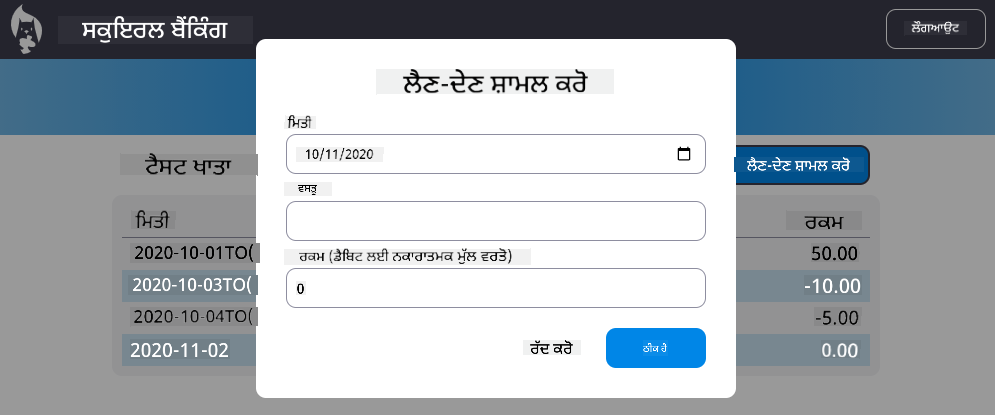

<!--
CO_OP_TRANSLATOR_METADATA:
{
  "original_hash": "923d32d2c405b709ef18e20d096f4200",
  "translation_date": "2025-10-20T22:02:03+00:00",
  "source_file": "7-bank-project/4-state-management/README.md",
  "language_code": "pa"
}
-->
# ਬੈਂਕਿੰਗ ਐਪ ਬਣਾਓ ਭਾਗ 4: ਸਟੇਟ ਮੈਨੇਜਮੈਂਟ ਦੇ ਸੰਕਲਪ

## ਪੂਰਵ-ਵਿਆਖਿਆਨ ਕਵਿਜ਼

[ਪੂਰਵ-ਵਿਆਖਿਆਨ ਕਵਿਜ਼](https://ff-quizzes.netlify.app/web/quiz/47)

### ਜਾਣ ਪਛਾਣ

ਜਿਵੇਂ ਜਿਵੇਂ ਵੈੱਬ ਐਪਲੀਕੇਸ਼ਨ ਵਧਦੀ ਹੈ, ਸਾਰੇ ਡਾਟਾ ਫਲੋਜ਼ ਦਾ ਪਤਾ ਲਗਾਉਣਾ ਇੱਕ ਚੁਣੌਤੀ ਬਣ ਜਾਂਦਾ ਹੈ। ਕਿਹੜਾ ਕੋਡ ਡਾਟਾ ਲੈਂਦਾ ਹੈ, ਕਿਹੜਾ ਪੇਜ ਇਸਨੂੰ ਵਰਤਦਾ ਹੈ, ਕਿੱਥੇ ਅਤੇ ਕਦੋਂ ਇਸਨੂੰ ਅੱਪਡੇਟ ਕਰਨ ਦੀ ਲੋੜ ਹੈ...ਇਹ ਸੌਖਾ ਹੈ ਕਿ ਅਸੀਂ ਗੁੰਝਲਦਾਰ ਕੋਡ ਵਿੱਚ ਫਸ ਜਾਈਏ ਜੋ ਸੰਭਾਲਣਾ ਮੁਸ਼ਕਲ ਹੈ। ਇਹ ਖਾਸ ਤੌਰ 'ਤੇ ਸੱਚ ਹੈ ਜਦੋਂ ਤੁਹਾਨੂੰ ਆਪਣੇ ਐਪ ਦੇ ਵੱਖ-ਵੱਖ ਪੇਜਾਂ ਵਿੱਚ ਡਾਟਾ ਸਾਂਝਾ ਕਰਨ ਦੀ ਲੋੜ ਹੁੰਦੀ ਹੈ, ਉਦਾਹਰਣ ਲਈ ਯੂਜ਼ਰ ਡਾਟਾ। *ਸਟੇਟ ਮੈਨੇਜਮੈਂਟ* ਦਾ ਸੰਕਲਪ ਹਮੇਸ਼ਾ ਹਰ ਕਿਸਮ ਦੇ ਪ੍ਰੋਗਰਾਮਾਂ ਵਿੱਚ ਮੌਜੂਦ ਰਿਹਾ ਹੈ, ਪਰ ਜਿਵੇਂ ਵੈੱਬ ਐਪਸ ਦੀ ਜਟਿਲਤਾ ਵਧਦੀ ਹੈ, ਇਹ ਹੁਣ ਵਿਕਾਸ ਦੌਰਾਨ ਸੋਚਣ ਲਈ ਇੱਕ ਮੁੱਖ ਬਿੰਦੂ ਬਣ ਗਿਆ ਹੈ।

ਇਸ ਅੰਤਮ ਭਾਗ ਵਿੱਚ, ਅਸੀਂ ਉਸ ਐਪ ਨੂੰ ਦੁਬਾਰਾ ਵੇਖਾਂਗੇ ਜੋ ਅਸੀਂ ਬਣਾਇਆ ਹੈ ਤਾਂ ਕਿ ਸਟੇਟ ਨੂੰ ਕਿਵੇਂ ਮੈਨੇਜ ਕੀਤਾ ਜਾਵੇ, ਇਸਨੂੰ ਕਿਸੇ ਵੀ ਸਮੇਂ ਬ੍ਰਾਊਜ਼ਰ ਰਿਫ੍ਰੈਸ਼ ਲਈ ਸਹਾਇਕ ਬਣਾਉਣ ਅਤੇ ਯੂਜ਼ਰ ਸੈਸ਼ਨਜ਼ ਵਿੱਚ ਡਾਟਾ ਨੂੰ ਸਥਿਰ ਕਰਨ ਦੀ ਆਗਿਆ ਦੇਣ ਲਈ।

### ਪੂਰਵ ਸ਼ਰਤ

ਤੁਹਾਨੂੰ ਇਸ ਪਾਠ ਲਈ ਵੈੱਬ ਐਪ ਦੇ [ਡਾਟਾ ਫੈਚਿੰਗ](../3-data/README.md) ਭਾਗ ਨੂੰ ਪੂਰਾ ਕਰਨਾ ਹੋਵੇਗਾ। ਤੁਹਾਨੂੰ [Node.js](https://nodejs.org) ਇੰਸਟਾਲ ਕਰਨ ਦੀ ਲੋੜ ਹੈ ਅਤੇ [ਸਰਵਰ API](../api/README.md) ਨੂੰ ਸਥਾਨਕ ਤੌਰ 'ਤੇ ਚਲਾਉਣਾ ਹੋਵੇਗਾ ਤਾਂ ਕਿ ਤੁਸੀਂ ਖਾਤੇ ਦੇ ਡਾਟਾ ਨੂੰ ਮੈਨੇਜ ਕਰ ਸਕੋ।

ਤੁਸੀਂ ਟਰਮੀਨਲ ਵਿੱਚ ਇਹ ਕਮਾਂਡ ਚਲਾ ਕੇ ਜਾਂਚ ਸਕਦੇ ਹੋ ਕਿ ਸਰਵਰ ਸਹੀ ਤਰੀਕੇ ਨਾਲ ਚੱਲ ਰਿਹਾ ਹੈ:

```sh
curl http://localhost:5000/api
# -> should return "Bank API v1.0.0" as a result
```

---

## ਸਟੇਟ ਮੈਨੇਜਮੈਂਟ ਨੂੰ ਦੁਬਾਰਾ ਸੋਚੋ

[ਪਿਛਲੇ ਪਾਠ](../3-data/README.md) ਵਿੱਚ, ਅਸੀਂ ਆਪਣੇ ਐਪ ਵਿੱਚ ਸਟੇਟ ਦੇ ਇੱਕ ਬੁਨਿਆਦੀ ਸੰਕਲਪ ਨੂੰ ਗਲੋਬਲ `account` ਵੈਰੀਏਬਲ ਦੇ ਨਾਲ ਪੇਸ਼ ਕੀਤਾ ਸੀ ਜੋ ਕਿ ਵਰਤਮਾਨ ਵਿੱਚ ਲੌਗਇਨ ਕੀਤੇ ਗਏ ਯੂਜ਼ਰ ਲਈ ਬੈਂਕ ਡਾਟਾ ਨੂੰ ਸ਼ਾਮਲ ਕਰਦਾ ਹੈ। ਹਾਲਾਂਕਿ, ਸਾਡੀ ਵਰਤਮਾਨ ਅਮਲਵਾਰੀ ਵਿੱਚ ਕੁਝ ਖਾਮੀਆਂ ਹਨ। ਡੈਸ਼ਬੋਰਡ 'ਤੇ ਹੋਣ ਸਮੇਂ ਪੇਜ ਨੂੰ ਰਿਫ੍ਰੈਸ਼ ਕਰਨ ਦੀ ਕੋਸ਼ਿਸ਼ ਕਰੋ। ਕੀ ਹੁੰਦਾ ਹੈ?

ਮੌਜੂਦਾ ਕੋਡ ਵਿੱਚ 3 ਸਮੱਸਿਆਵਾਂ ਹਨ:

- ਸਟੇਟ ਸਥਿਰ ਨਹੀਂ ਹੈ, ਕਿਉਂਕਿ ਬ੍ਰਾਊਜ਼ਰ ਰਿਫ੍ਰੈਸ਼ ਤੁਹਾਨੂੰ ਲੌਗਇਨ ਪੇਜ 'ਤੇ ਵਾਪਸ ਲੈ ਜਾਂਦਾ ਹੈ।
- ਸਟੇਟ ਨੂੰ ਬਦਲਣ ਵਾਲੀਆਂ ਕਈ ਫੰਕਸ਼ਨ ਹਨ। ਜਿਵੇਂ ਜਿਵੇਂ ਐਪ ਵਧਦਾ ਹੈ, ਇਹ ਬਦਲਾਵਾਂ ਨੂੰ ਟ੍ਰੈਕ ਕਰਨਾ ਮੁਸ਼ਕਲ ਬਣ ਸਕਦਾ ਹੈ ਅਤੇ ਇੱਕ ਨੂੰ ਅੱਪਡੇਟ ਕਰਨਾ ਭੁੱਲਣਾ ਸੌਖਾ ਹੈ।
- ਸਟੇਟ ਸਾਫ ਨਹੀਂ ਹੁੰਦੀ, ਇਸ ਲਈ ਜਦੋਂ ਤੁਸੀਂ *ਲੌਗਆਉਟ* 'ਤੇ ਕਲਿਕ ਕਰਦੇ ਹੋ ਤਾਂ ਖਾਤੇ ਦਾ ਡਾਟਾ ਅਜੇ ਵੀ ਉੱਥੇ ਹੁੰਦਾ ਹੈ ਹਾਲਾਂਕਿ ਤੁਸੀਂ ਲੌਗਇਨ ਪੇਜ 'ਤੇ ਹੋ।

ਅਸੀਂ ਆਪਣਾ ਕੋਡ ਇੱਕ-ਇੱਕ ਕਰਕੇ ਇਨ੍ਹਾਂ ਸਮੱਸਿਆਵਾਂ ਨੂੰ ਹੱਲ ਕਰਨ ਲਈ ਅੱਪਡੇਟ ਕਰ ਸਕਦੇ ਹਾਂ, ਪਰ ਇਹ ਹੋਰ ਕੋਡ ਡੁਪਲੀਕੇਸ਼ਨ ਪੈਦਾ ਕਰੇਗਾ ਅਤੇ ਐਪ ਨੂੰ ਹੋਰ ਜਟਿਲ ਅਤੇ ਸੰਭਾਲਣਾ ਮੁਸ਼ਕਲ ਬਣਾਏਗਾ। ਜਾਂ ਅਸੀਂ ਕੁਝ ਮਿੰਟਾਂ ਲਈ ਰੁਕ ਸਕਦੇ ਹਾਂ ਅਤੇ ਆਪਣੀ ਰਣਨੀਤੀ ਨੂੰ ਦੁਬਾਰਾ ਸੋਚ ਸਕਦੇ ਹਾਂ।

> ਅਸੀਂ ਇੱਥੇ ਅਸਲ ਵਿੱਚ ਕਿਹੜੀਆਂ ਸਮੱਸਿਆਵਾਂ ਹੱਲ ਕਰਨ ਦੀ ਕੋਸ਼ਿਸ਼ ਕਰ ਰਹੇ ਹਾਂ?

[ਸਟੇਟ ਮੈਨੇਜਮੈਂਟ](https://en.wikipedia.org/wiki/State_management) ਸਾਰੇ ਐਪ ਵਿੱਚ ਡਾਟਾ ਫਲੋਜ਼ ਨੂੰ ਸਮਝਣਯੋਗ ਬਣਾਉਣ ਲਈ ਇੱਕ ਵਧੀਆ ਪਹੁੰਚ ਲੱਭਣ ਬਾਰੇ ਹੈ:

- ਐਪ ਵਿੱਚ ਡਾਟਾ ਫਲੋਜ਼ ਨੂੰ ਕਿਵੇਂ ਸਮਝਣਯੋਗ ਬਣਾਇਆ ਜਾਵੇ?
- ਸਟੇਟ ਡਾਟਾ ਨੂੰ ਹਮੇਸ਼ਾ ਯੂਜ਼ਰ ਇੰਟਰਫੇਸ ਦੇ ਨਾਲ ਸਿੰਕ ਵਿੱਚ ਕਿਵੇਂ ਰੱਖਿਆ ਜਾਵੇ (ਅਤੇ ਵਿਰੋਧ)?

ਜਦੋਂ ਤੁਸੀਂ ਇਨ੍ਹਾਂ ਦੀ ਦੇਖਭਾਲ ਕਰ ਲੈਂਦੇ ਹੋ, ਕੋਈ ਹੋਰ ਸਮੱਸਿਆਵਾਂ ਜੋ ਤੁਹਾਨੂੰ ਹੋ ਸਕਦੀਆਂ ਹਨ ਉਹ ਜਾਂ ਤਾਂ ਪਹਿਲਾਂ ਹੀ ਹੱਲ ਹੋ ਸਕਦੀਆਂ ਹਨ ਜਾਂ ਹੱਲ ਕਰਨ ਲਈ ਆਸਾਨ ਹੋ ਸਕਦੀਆਂ ਹਨ। ਇਨ੍ਹਾਂ ਸਮੱਸਿਆਵਾਂ ਨੂੰ ਹੱਲ ਕਰਨ ਲਈ ਕਈ ਸੰਭਾਵਿਤ ਪਹੁੰਚਾਂ ਹਨ, ਪਰ ਅਸੀਂ ਇੱਕ ਆਮ ਹੱਲ ਦੇ ਨਾਲ ਜਾਵਾਂਗੇ ਜੋ **ਡਾਟਾ ਅਤੇ ਇਸਨੂੰ ਬਦਲਣ ਦੇ ਤਰੀਕਿਆਂ ਨੂੰ ਕੇਂਦਰੀਕ੍ਰਿਤ ਕਰਨ** 'ਤੇ ਮਲੂਕ ਹੈ। ਡਾਟਾ ਫਲੋਜ਼ ਇਸ ਤਰੀਕੇ ਨਾਲ ਜਾਵੇਗਾ:


> ਅਸੀਂ ਇੱਥੇ ਉਸ ਭਾਗ ਨੂੰ ਕਵਰ ਨਹੀਂ ਕਰਾਂਗੇ ਜਿੱਥੇ ਡਾਟਾ ਆਪਣੇ ਆਪ ਵਿਊ ਅੱਪਡੇਟ ਨੂੰ ਟ੍ਰਿਗਰ ਕਰਦਾ ਹੈ, ਕਿਉਂਕਿ ਇਹ [Reactive Programming](https://en.wikipedia.org/wiki/Reactive_programming) ਦੇ ਹੋਰ ਉੱਚੇ ਸੰਕਲਪਾਂ ਨਾਲ ਜੁੜਿਆ ਹੋਇਆ ਹੈ। ਜੇ ਤੁਸੀਂ ਡੂੰਘੀ ਖੋਜ ਕਰਨ ਲਈ ਤਿਆਰ ਹੋ ਤਾਂ ਇਹ ਇੱਕ ਵਧੀਆ ਅਗਲਾ ਵਿਸ਼ਾ ਹੈ।

✅ ਸਟੇਟ ਮੈਨੇਜਮੈਂਟ ਲਈ ਬਹੁਤ ਸਾਰੀਆਂ ਲਾਇਬ੍ਰੇਰੀਆਂ ਉਪਲਬਧ ਹਨ, [Redux](https://redux.js.org) ਇੱਕ ਪ੍ਰਸਿੱਧ ਵਿਕਲਪ ਹੈ। ਸੰਕਲਪਾਂ ਅਤੇ ਪੈਟਰਨਜ਼ ਨੂੰ ਵੇਖੋ ਕਿਉਂਕਿ ਇਹ ਅਕਸਰ ਵੱਡੇ ਵੈੱਬ ਐਪਸ ਵਿੱਚ ਤੁਹਾਨੂੰ ਪੇਸ਼ ਆਉਣ ਵਾਲੀਆਂ ਸੰਭਾਵਿਤ ਸਮੱਸਿਆਵਾਂ ਅਤੇ ਇਹ ਕਿਵੇਂ ਹੱਲ ਕੀਤੀ ਜਾ ਸਕਦੀ ਹੈ, ਬਾਰੇ ਸਿੱਖਣ ਦਾ ਇੱਕ ਵਧੀਆ ਤਰੀਕਾ ਹੁੰਦਾ ਹੈ।

### ਕੰਮ

ਅਸੀਂ ਕੁਝ ਰੀਫੈਕਟਿੰਗ ਨਾਲ ਸ਼ੁਰੂ ਕਰਾਂਗੇ। `account` ਡਿਕਲੇਰੇਸ਼ਨ ਨੂੰ ਬਦਲੋ:

```js
let account = null;
```

ਇਸ ਨਾਲ:

```js
let state = {
  account: null
};
```

ਵਿਚਾਰ ਇਹ ਹੈ ਕਿ ਸਾਰੇ ਐਪ ਡਾਟਾ ਨੂੰ ਇੱਕ ਸਟੇਟ ਆਬਜੈਕਟ ਵਿੱਚ *ਕੇਂਦਰੀਕ੍ਰਿਤ* ਕੀਤਾ ਜਾਵੇ। ਸਟੇਟ ਵਿੱਚ ਅਜੇ ਲਈ ਸਿਰਫ `account` ਹੈ ਇਸ ਲਈ ਇਹ ਬਹੁਤ ਜ਼ਿਆਦਾ ਨਹੀਂ ਬਦਲਦਾ, ਪਰ ਇਹ ਵਿਕਾਸਾਂ ਲਈ ਇੱਕ ਰਾਹ ਬਣਾਉਂਦਾ ਹੈ।

ਅਸੀਂ ਇਸਨੂੰ ਵਰਤਣ ਵਾਲੀਆਂ ਫੰਕਸ਼ਨਾਂ ਨੂੰ ਵੀ ਅੱਪਡੇਟ ਕਰਨਾ ਹੈ। `register()` ਅਤੇ `login()` ਫੰਕਸ਼ਨਾਂ ਵਿੱਚ, `account = ...` ਨੂੰ `state.account = ...` ਨਾਲ ਬਦਲੋ;

`updateDashboard()` ਫੰਕਸ਼ਨ ਦੇ ਸ਼ੁਰੂ 'ਤੇ, ਇਹ ਲਾਈਨ ਸ਼ਾਮਲ ਕਰੋ:

```js
const account = state.account;
```

ਇਹ ਰੀਫੈਕਟਿੰਗ ਆਪਣੇ ਆਪ ਵਿੱਚ ਬਹੁਤ ਸਾਰੇ ਸੁਧਾਰ ਨਹੀਂ ਲਿਆਈ, ਪਰ ਵਿਚਾਰ ਅਗਲੇ ਬਦਲਾਵਾਂ ਲਈ ਨੀਂਹ ਰੱਖਣ ਦਾ ਸੀ।

## ਡਾਟਾ ਬਦਲਾਵਾਂ ਨੂੰ ਟ੍ਰੈਕ ਕਰੋ

ਹੁਣ ਜਦੋਂ ਅਸੀਂ ਡਾਟਾ ਸਟੋਰ ਕਰਨ ਲਈ `state` ਆਬਜੈਕਟ ਨੂੰ ਸਥਾਪਿਤ ਕੀਤਾ ਹੈ, ਅਗਲਾ ਕਦਮ ਅੱਪਡੇਟਸ ਨੂੰ ਕੇਂਦਰੀਕ੍ਰਿਤ ਕਰਨਾ ਹੈ। ਉਦੇਸ਼ ਇਹ ਹੈ ਕਿ ਕਿਸੇ ਵੀ ਬਦਲਾਵਾਂ ਅਤੇ ਇਹ ਕਦੋਂ ਹੁੰਦੇ ਹਨ, ਨੂੰ ਟ੍ਰੈਕ ਕਰਨਾ ਆਸਾਨ ਬਣਾਇਆ ਜਾਵੇ।

`state` ਆਬਜੈਕਟ ਵਿੱਚ ਬਦਲਾਵਾਂ ਕਰਨ ਤੋਂ ਬਚਣ ਲਈ, ਇਸਨੂੰ [*immutable*](https://en.wikipedia.org/wiki/Immutable_object) ਮੰਨਣਾ ਵੀ ਇੱਕ ਚੰਗੀ ਅਭਿਆਸ ਹੈ, ਜਿਸਦਾ ਮਤਲਬ ਹੈ ਕਿ ਇਸਨੂੰ ਬਿਲਕੁਲ ਵੀ ਬਦਲਿਆ ਨਹੀਂ ਜਾ ਸਕਦਾ। ਇਸਦਾ ਮਤਲਬ ਇਹ ਵੀ ਹੈ ਕਿ ਜੇ ਤੁਸੀਂ ਇਸ ਵਿੱਚ ਕੁਝ ਵੀ ਬਦਲਣਾ ਚਾਹੁੰਦੇ ਹੋ ਤਾਂ ਤੁਹਾਨੂੰ ਇੱਕ ਨਵਾਂ ਸਟੇਟ ਆਬਜੈਕਟ ਬਣਾਉਣਾ ਪਵੇਗਾ। ਇਸ ਤਰੀਕੇ ਨਾਲ, ਤੁਸੀਂ ਸੰਭਾਵਿਤ ਅਣਚਾਹੇ [side effects](https://en.wikipedia.org/wiki/Side_effect_(computer_science)) ਬਾਰੇ ਸੁਰੱਖਿਆ ਬਣਾਉਂਦੇ ਹੋ, ਅਤੇ ਆਪਣੀ ਐਪ ਵਿੱਚ ਨਵੀਆਂ ਵਿਸ਼ੇਸ਼ਤਾਵਾਂ ਨੂੰ ਲਾਗੂ ਕਰਨ ਲਈ ਸੰਭਾਵਨਾਵਾਂ ਖੋਲ੍ਹਦੇ ਹੋ ਜਿਵੇਂ ਕਿ undo/redo ਨੂੰ ਲਾਗੂ ਕਰਨਾ, ਜਦੋਂ ਕਿ ਡੀਬੱਗ ਕਰਨਾ ਵੀ ਆਸਾਨ ਬਣਾਉਂਦੇ ਹੋ। ਉਦਾਹਰਣ ਲਈ, ਤੁਸੀਂ ਸਟੇਟ ਵਿੱਚ ਕੀਤੇ ਗਏ ਹਰ ਬਦਲਾਵ ਨੂੰ ਲੌਗ ਕਰ ਸਕਦੇ ਹੋ ਅਤੇ ਬੱਗ ਦੇ ਸਰੋਤ ਨੂੰ ਸਮਝਣ ਲਈ ਬਦਲਾਵਾਂ ਦਾ ਇਤਿਹਾਸ ਰੱਖ ਸਕਦੇ ਹੋ।

JavaScript ਵਿੱਚ, ਤੁਸੀਂ [`Object.freeze()`](https://developer.mozilla.org/docs/Web/JavaScript/Reference/Global_Objects/Object/freeze) ਨੂੰ ਇੱਕ ਆਬਜੈਕਟ ਦੇ immutable ਵਰਜਨ ਨੂੰ ਬਣਾਉਣ ਲਈ ਵਰਤ ਸਕਦੇ ਹੋ। ਜੇ ਤੁਸੀਂ ਇੱਕ immutable ਆਬਜੈਕਟ ਵਿੱਚ ਬਦਲਾਵ ਕਰਨ ਦੀ ਕੋਸ਼ਿਸ਼ ਕਰਦੇ ਹੋ, ਤਾਂ ਇੱਕ ਅਪਵਾਦ ਉੱਠਾਇਆ ਜਾਵੇਗਾ।

✅ ਕੀ ਤੁਸੀਂ ਜਾਣਦੇ ਹੋ ਕਿ *shallow* ਅਤੇ *deep* immutable ਆਬਜੈਕਟ ਵਿੱਚ ਕੀ ਅੰਤਰ ਹੈ? ਤੁਸੀਂ ਇਸ ਬਾਰੇ [ਇੱਥੇ](https://developer.mozilla.org/docs/Web/JavaScript/Reference/Global_Objects/Object/freeze#What_is_shallow_freeze) ਪੜ੍ਹ ਸਕਦੇ ਹੋ।

### ਕੰਮ

ਆਓ ਇੱਕ ਨਵਾਂ `updateState()` ਫੰਕਸ਼ਨ ਬਣਾਈਏ:

```js
function updateState(property, newData) {
  state = Object.freeze({
    ...state,
    [property]: newData
  });
}
```

ਇਸ ਫੰਕਸ਼ਨ ਵਿੱਚ, ਅਸੀਂ ਇੱਕ ਨਵਾਂ ਸਟੇਟ ਆਬਜੈਕਟ ਬਣਾਉਂਦੇ ਹਾਂ ਅਤੇ ਪਿਛਲੇ ਸਟੇਟ ਤੋਂ ਡਾਟਾ ਨੂੰ [*spread (`...`) operator*](https://developer.mozilla.org/docs/Web/JavaScript/Reference/Operators/Spread_syntax#Spread_in_object_literals) ਦੀ ਵਰਤੋਂ ਕਰਕੇ ਕਾਪੀ ਕਰਦੇ ਹਾਂ। ਫਿਰ ਅਸੀਂ ਸਟੇਟ ਆਬਜੈਕਟ ਦੇ ਇੱਕ ਖਾਸ ਗੁਣ ਨੂੰ [bracket notation](https://developer.mozilla.org/docs/Web/JavaScript/Guide/Working_with_Objects#Objects_and_properties) `[property]` ਦੀ ਵਰਤੋਂ ਕਰਕੇ ਨਵੇਂ ਡਾਟਾ ਨਾਲ ਓਵਰਰਾਈਡ ਕਰਦੇ ਹਾਂ। ਅੰਤ ਵਿੱਚ, ਅਸੀਂ `Object.freeze()` ਦੀ ਵਰਤੋਂ ਕਰਕੇ ਆਬਜੈਕਟ ਨੂੰ ਬਦਲਾਵਾਂ ਤੋਂ ਰੋਕਦੇ ਹਾਂ। ਸਟੇਟ ਵਿੱਚ ਅਜੇ ਲਈ ਸਿਰਫ `account` ਗੁਣ ਸਟੋਰ ਕੀਤਾ ਗਿਆ ਹੈ, ਪਰ ਇਸ ਪਹੁੰਚ ਨਾਲ ਤੁਸੀਂ ਸਟੇਟ ਵਿੱਚ ਜਿੰਨੇ ਮਰਜ਼ੀ ਗੁਣ ਸ਼ਾਮਲ ਕਰ ਸਕਦੇ ਹੋ।

ਅਸੀਂ ਇਹ ਯਕੀਨੀ ਬਣਾਉਣ ਲਈ `state` ਸ਼ੁਰੂਆਤ ਨੂੰ ਅੱਪਡੇਟ ਕਰਾਂਗੇ ਕਿ ਸ਼ੁਰੂਆਤੀ ਸਟੇਟ ਵੀ ਫ੍ਰੀਜ਼ ਕੀਤੀ ਗਈ ਹੈ:

```js
let state = Object.freeze({
  account: null
});
```

ਇਸ ਤੋਂ ਬਾਅਦ, `register` ਫੰਕਸ਼ਨ ਨੂੰ ਅੱਪਡੇਟ ਕਰੋ ਅਤੇ `state.account = result;` ਅਸਾਈਨਮੈਂਟ ਨੂੰ ਬਦਲੋ:

```js
updateState('account', result);
```

ਇਹੀ `login` ਫੰਕਸ਼ਨ ਨਾਲ ਕਰੋ, `state.account = data;` ਨੂੰ ਬਦਲੋ:

```js
updateState('account', data);
```

ਅਸੀਂ ਹੁਣ ਖਾਤੇ ਦੇ ਡਾਟਾ ਨੂੰ ਸਾਫ਼ ਕਰਨ ਦੀ ਸਮੱਸਿਆ ਨੂੰ ਹੱਲ ਕਰਨ ਦਾ ਮੌਕਾ ਲੈਂਦੇ ਹਾਂ ਜਦੋਂ ਯੂਜ਼ਰ *Logout* 'ਤੇ ਕਲਿਕ ਕਰਦਾ ਹੈ।

ਇੱਕ ਨਵਾਂ ਫੰਕਸ਼ਨ `logout()` ਬਣਾਓ:

```js
function logout() {
  updateState('account', null);
  navigate('/login');
}
```

`updateDashboard()` ਵਿੱਚ, ਰੀਡਾਇਰੈਕਸ਼ਨ `return navigate('/login');` ਨੂੰ `return logout();` ਨਾਲ ਬਦਲੋ;

ਨਵਾਂ ਖਾਤਾ ਰਜਿਸਟਰ ਕਰਨ ਦੀ ਕੋਸ਼ਿਸ਼ ਕਰੋ, ਲੌਗਆਉਟ ਅਤੇ ਦੁਬਾਰਾ ਲੌਗਇਨ ਕਰੋ ਤਾਂ ਕਿ ਇਹ ਜਾਂਚਿਆ ਜਾ ਸਕੇ ਕਿ ਸਭ ਕੁਝ ਸਹੀ ਤਰੀਕੇ ਨਾਲ ਕੰਮ ਕਰ ਰਿਹਾ ਹੈ।

> ਟਿਪ: ਤੁਸੀਂ ਬ੍ਰਾਊਜ਼ਰ ਦੇ ਵਿਕਾਸ ਟੂਲਜ਼ ਵਿੱਚ ਕੰਸੋਲ ਖੋਲ੍ਹ ਕੇ ਅਤੇ `updateState()` ਦੇ ਤਲ 'ਤੇ `console.log(state)` ਸ਼ਾਮਲ ਕਰਕੇ ਸਾਰੇ ਸਟੇਟ ਬਦਲਾਵਾਂ ਨੂੰ ਦੇਖ ਸਕਦੇ ਹੋ।

## ਸਟੇਟ ਨੂੰ ਸਥਿਰ ਕਰੋ

ਜ਼ਿਆਦਾਤਰ ਵੈੱਬ ਐਪਸ ਨੂੰ ਸਹੀ ਤਰੀਕੇ ਨਾਲ ਕੰਮ ਕਰਨ ਲਈ ਡਾਟਾ ਨੂੰ ਸਥਿਰ ਕਰਨ ਦੀ ਲੋੜ ਹੁੰਦੀ ਹੈ। ਸਾਰੇ ਮਹੱਤਵਪੂਰਨ ਡਾਟਾ ਆਮ ਤੌਰ 'ਤੇ ਡਾਟਾਬੇਸ ਵਿੱਚ ਸਟੋਰ ਕੀਤਾ ਜਾਂਦਾ ਹੈ ਅਤੇ ਸਰਵਰ API ਰਾਹੀਂ ਪਹੁੰਚਿਆ ਜਾਂਦਾ ਹੈ, ਜਿਵੇਂ ਕਿ ਸਾਡੇ ਕੇਸ ਵਿੱਚ ਯੂਜ਼ਰ ਖਾਤੇ ਦਾ ਡਾਟਾ। ਪਰ ਕਈ ਵਾਰ, ਬਿਹਤਰ ਯੂਜ਼ਰ ਅਨੁਭਵ ਜਾਂ ਲੋਡਿੰਗ ਪ੍ਰਦਰਸ਼ਨ ਨੂੰ ਸੁਧਾਰਨ ਲਈ ਬ੍ਰਾਊਜ਼ਰ ਵਿੱਚ ਚੱਲ ਰਹੇ ਕਲਾਇੰਟ ਐਪ 'ਤੇ ਕੁਝ ਡਾਟਾ ਸਥਿਰ ਕਰਨਾ ਵੀ ਦਿਲਚਸਪ ਹੁੰਦਾ ਹੈ।

ਜਦੋਂ ਤੁਸੀਂ ਆਪਣੇ ਬ੍ਰਾਊਜ਼ਰ ਵਿੱਚ ਡਾਟਾ ਸਥਿਰ ਕਰਨਾ ਚਾਹੁੰਦੇ ਹੋ, ਤਾਂ ਕੁਝ ਮਹੱਤਵਪੂਰਨ ਸਵਾਲ ਹਨ ਜੋ ਤੁਹਾਨੂੰ ਆਪਣੇ ਆਪ ਤੋਂ ਪੁੱਛਣੇ ਚਾਹੀਦੇ ਹਨ:

- *ਕੀ ਡਾਟਾ ਸੰਵੇਦਨਸ਼ੀਲ ਹੈ?* ਤੁਹਾਨੂੰ ਕਲਾਇੰਟ 'ਤੇ ਕੋਈ ਵੀ ਸੰਵੇਦਨਸ਼ੀਲ ਡਾਟਾ ਸਟੋਰ ਕਰਨ ਤੋਂ ਬਚਣਾ ਚਾਹੀਦਾ ਹੈ, ਜਿਵੇਂ ਕਿ ਯੂਜ਼ਰ ਪਾਸਵਰਡ।
- *ਤੁਹਾਨੂੰ ਇਹ ਡਾਟਾ ਕਿੰਨੇ ਸਮੇਂ ਲਈ ਰੱਖਣ ਦੀ ਲੋੜ ਹੈ?* ਕੀ ਤੁਸੀਂ ਇਸ ਡਾਟਾ ਨੂੰ ਸਿਰਫ ਮੌਜੂਦਾ ਸੈਸ਼ਨ ਲਈ ਪਹੁੰਚਣਾ ਚਾਹੁੰਦੇ ਹੋ ਜਾਂ ਤੁਸੀਂ ਇਸਨੂੰ ਹਮੇਸ਼ਾ ਲਈ ਸਟੋਰ ਕਰਨਾ ਚਾਹੁੰਦੇ ਹੋ?

ਵੈੱਬ ਐਪ ਵਿੱਚ ਜਾਣਕਾਰੀ ਸਟੋਰ ਕਰਨ ਦੇ ਕਈ ਤਰੀਕੇ ਹਨ, ਜੋ ਤੁਸੀਂ ਹਾਸਲ ਕਰਨਾ ਚਾਹੁੰਦੇ ਹੋ ਉਸ 'ਤੇ ਨਿਰਭਰ ਕਰਦੇ ਹਨ। ਉਦਾਹਰਣ ਲਈ, ਤੁਸੀਂ ਇੱਕ ਖੋਜ ਪੁੱਛਗਿੱਛ ਨੂੰ ਸਟੋਰ ਕਰਨ ਲਈ URLs ਦੀ ਵਰਤੋਂ ਕਰ ਸਕਦੇ ਹੋ, ਅਤੇ ਇਸਨੂੰ ਯੂਜ਼ਰਾਂ ਵਿੱਚ ਸਾਂਝਾ ਕਰਨ ਯੋਗ ਬਣਾਉਣ ਲਈ। ਤੁਸੀਂ [HTTP cookies](https://developer.mozilla.org/docs/Web/HTTP/Cookies) ਦੀ ਵਰਤੋਂ ਕਰ ਸਕਦੇ ਹੋ ਜੇ ਡਾਟਾ ਨੂੰ ਸਰਵਰ ਨਾਲ ਸਾਂਝਾ ਕਰਨ ਦੀ ਲੋੜ ਹੈ, ਜਿਵੇਂ ਕਿ [authentication](https://en.wikipedia.org/wiki/Authentication) ਜਾਣਕਾਰੀ।

ਇੱਕ ਹੋਰ ਵਿਕਲਪ ਹੈ ਕਿ ਡਾਟਾ ਸਟੋਰ ਕਰਨ ਲਈ ਬ੍ਰਾਊਜ਼ਰ APIs ਵਿੱਚੋਂ ਇੱਕ ਦੀ ਵਰਤੋਂ ਕੀਤੀ ਜਾਵੇ। ਦੋ ਵਿਸ਼ੇਸ਼ ਤੌਰ 'ਤੇ ਦਿਲਚਸਪ ਹਨ:

- [`localStorage`](https://developer.mozilla.org/docs/Web/API/Window/localStorage): ਇੱਕ [Key/Value store](https://en.wikipedia.org/wiki/Key%E2%80%93value_database) ਜੋ ਵੱਖ-ਵੱਖ ਸੈਸ਼ਨਜ਼ ਵਿੱਚ ਮੌਜੂਦਾ ਵੈੱਬ ਸਾਈਟ ਲਈ ਖਾਸ ਡਾਟਾ ਸਥਿਰ ਕਰਨ ਦੀ ਆਗਿਆ ਦਿੰਦਾ ਹੈ। ਇਸ ਵਿੱਚ ਸਟੋਰ ਕੀਤਾ ਡਾਟਾ ਕਦੇ ਵੀ ਸਮਾਪਤ ਨਹੀਂ ਹੁੰਦਾ।
- [`sessionStorage`](https://developer.mozilla.org/docs/Web/API/Window/sessionStorage): ਇਹ `localStorage` ਵਾਂ
**ਪ੍ਰੋੰਪਟ:** ਇੱਕ ਵਧੀਆ ਸਟੇਟ ਮੈਨੇਜਮੈਂਟ ਸਿਸਟਮ ਬਣਾਓ ਜਿਸ ਵਿੱਚ ਸ਼ਾਮਲ ਹੋਵੇ: 1) ਸਟੇਟ ਹਿਸਟਰੀ ਐਰੇ ਜੋ ਸਾਰੇ ਪਿਛਲੇ ਸਟੇਟਾਂ ਨੂੰ ਟ੍ਰੈਕ ਕਰਦਾ ਹੈ, 2) ਅੰਡੂ ਅਤੇ ਰੀਡੂ ਫੰਕਸ਼ਨ ਜੋ ਪਿਛਲੇ ਸਟੇਟਾਂ 'ਤੇ ਵਾਪਸ ਜਾ ਸਕਦੇ ਹਨ, 3) ਡੈਸ਼ਬੋਰਡ 'ਤੇ ਅੰਡੂ/ਰੀਡੂ ਆਪਰੇਸ਼ਨ ਲਈ UI ਬਟਨ, 4) ਮੈਮੋਰੀ ਸਮੱਸਿਆਵਾਂ ਤੋਂ ਬਚਣ ਲਈ 10 ਸਟੇਟਾਂ ਦੀ ਵੱਧ ਤੋਂ ਵੱਧ ਹਦ, ਅਤੇ 5) ਜਦੋਂ ਯੂਜ਼ਰ ਲੌਗ ਆਉਟ ਕਰਦਾ ਹੈ ਤਾਂ ਹਿਸਟਰੀ ਦੀ ਸਹੀ ਸਫਾਈ। ਯਕੀਨੀ ਬਣਾਓ ਕਿ ਅੰਡੂ/ਰੀਡੂ ਫੰਕਸ਼ਨਲਿਟੀ ਖਾਤੇ ਦੇ ਬੈਲੈਂਸ ਵਿੱਚ ਹੋਣ ਵਾਲੇ ਬਦਲਾਅ ਨਾਲ ਕੰਮ ਕਰਦੀ ਹੈ ਅਤੇ ਬ੍ਰਾਊਜ਼ਰ ਰੀਫ੍ਰੈਸ਼ ਹੋਣ 'ਤੇ ਵੀ ਕਾਇਮ ਰਹਿੰਦੀ ਹੈ।

## 🚀 ਚੁਣੌਤੀ

ਹੁਣ ਜਦੋਂ ਅਸੀਂ ਹਰ ਵਾਰ ਡੈਸ਼ਬੋਰਡ ਲੋਡ ਹੋਣ 'ਤੇ ਖਾਤੇ ਦੇ ਡਾਟਾ ਨੂੰ ਰੀਲੋਡ ਕਰਦੇ ਹਾਂ, ਕੀ ਤੁਸੀਂ ਸੋਚਦੇ ਹੋ ਕਿ ਅਸੀਂ ਹਾਲੇ ਵੀ *ਸਾਰੇ ਖਾਤੇ* ਦੇ ਡਾਟਾ ਨੂੰ ਸਟੋਰ ਕਰਨ ਦੀ ਲੋੜ ਹੈ?

ਇਕੱਠੇ ਕੰਮ ਕਰਨ ਦੀ ਕੋਸ਼ਿਸ਼ ਕਰੋ ਅਤੇ ਇਹ ਬਦਲੋ ਕਿ ਕੀ ਸੇਵ ਕੀਤਾ ਜਾਂਦਾ ਹੈ ਅਤੇ `localStorage` ਤੋਂ ਲੋਡ ਕੀਤਾ ਜਾਂਦਾ ਹੈ ਤਾਂ ਜੋ ਸਿਰਫ ਉਹੀ ਸ਼ਾਮਲ ਕੀਤਾ ਜਾਵੇ ਜੋ ਐਪ ਨੂੰ ਚਲਾਉਣ ਲਈ ਬਿਲਕੁਲ ਜ਼ਰੂਰੀ ਹੈ।

## ਪੋਸਟ-ਲੈਕਚਰ ਕਵਿਜ਼

[ਪੋਸਟ-ਲੈਕਚਰ ਕਵਿਜ਼](https://ff-quizzes.netlify.app/web/quiz/48)

## ਅਸਾਈਨਮੈਂਟ

["Add transaction" ਡਾਇਲਾਗ ਨੂੰ ਲਾਗੂ ਕਰੋ](assignment.md)

ਇਹ ਹੈ ਅਸਾਈਨਮੈਂਟ ਪੂਰਾ ਕਰਨ ਤੋਂ ਬਾਅਦ ਇੱਕ ਉਦਾਹਰਣ ਨਤੀਜਾ:



---

**ਅਸਵੀਕਰਤੀ**:  
ਇਹ ਦਸਤਾਵੇਜ਼ AI ਅਨੁਵਾਦ ਸੇਵਾ [Co-op Translator](https://github.com/Azure/co-op-translator) ਦੀ ਵਰਤੋਂ ਕਰਕੇ ਅਨੁਵਾਦ ਕੀਤਾ ਗਿਆ ਹੈ। ਜਦੋਂ ਕਿ ਅਸੀਂ ਸਹੀ ਹੋਣ ਦੀ ਕੋਸ਼ਿਸ਼ ਕਰਦੇ ਹਾਂ, ਕਿਰਪਾ ਕਰਕੇ ਧਿਆਨ ਦਿਓ ਕਿ ਸਵੈਚਾਲਿਤ ਅਨੁਵਾਦਾਂ ਵਿੱਚ ਗਲਤੀਆਂ ਜਾਂ ਅਸੁੱਤੀਆਂ ਹੋ ਸਕਦੀਆਂ ਹਨ। ਮੂਲ ਦਸਤਾਵੇਜ਼ ਨੂੰ ਇਸਦੀ ਮੂਲ ਭਾਸ਼ਾ ਵਿੱਚ ਅਧਿਕਾਰਤ ਸਰੋਤ ਮੰਨਿਆ ਜਾਣਾ ਚਾਹੀਦਾ ਹੈ। ਮਹੱਤਵਪੂਰਨ ਜਾਣਕਾਰੀ ਲਈ, ਪੇਸ਼ੇਵਰ ਮਨੁੱਖੀ ਅਨੁਵਾਦ ਦੀ ਸਿਫਾਰਸ਼ ਕੀਤੀ ਜਾਂਦੀ ਹੈ। ਇਸ ਅਨੁਵਾਦ ਦੀ ਵਰਤੋਂ ਤੋਂ ਪੈਦਾ ਹੋਣ ਵਾਲੇ ਕਿਸੇ ਵੀ ਗਲਤਫਹਿਮੀ ਜਾਂ ਗਲਤ ਵਿਆਖਿਆ ਲਈ ਅਸੀਂ ਜ਼ਿੰਮੇਵਾਰ ਨਹੀਂ ਹਾਂ।