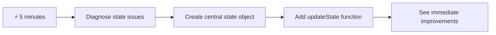
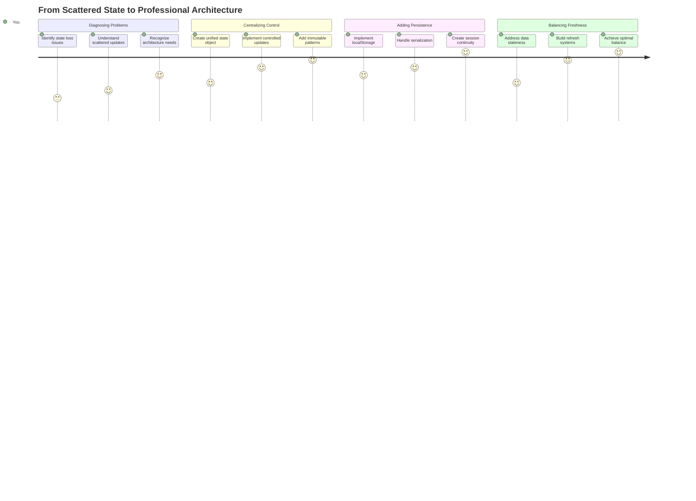
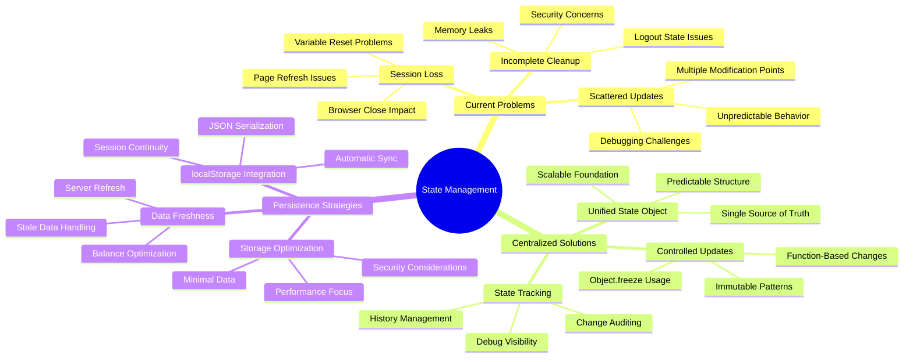
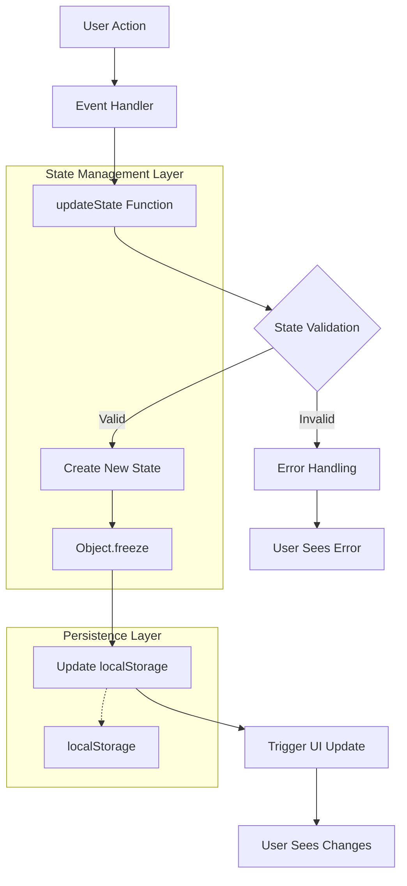
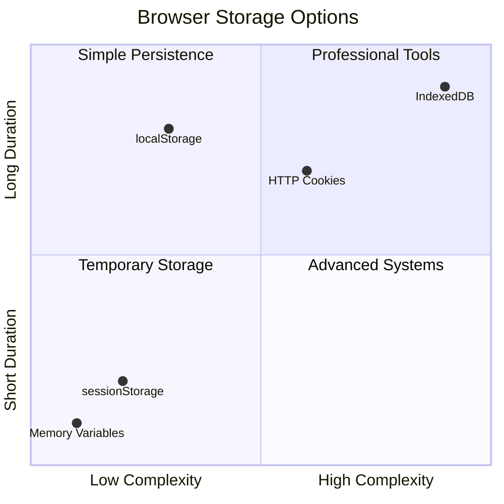

<!--
CO_OP_TRANSLATOR_METADATA:
{
  "original_hash": "b807b09df716dc48a2b750835bf8e933",
  "translation_date": "2025-11-03T16:36:53+00:00",
  "source_file": "7-bank-project/4-state-management/README.md",
  "language_code": "pa"
}
-->
# ਬੈਂਕਿੰਗ ਐਪ ਬਣਾਓ ਭਾਗ 4: ਸਟੇਟ ਮੈਨੇਜਮੈਂਟ ਦੇ ਅਸੂਲ

## ⚡ ਅਗਲੇ 5 ਮਿੰਟਾਂ ਵਿੱਚ ਤੁਸੀਂ ਕੀ ਕਰ ਸਕਦੇ ਹੋ

**ਵਿਆਸਤ ਡਿਵੈਲਪਰਾਂ ਲਈ ਤੇਜ਼ ਸ਼ੁਰੂਆਤ ਦਾ ਰਾਹ**



- **ਮਿੰਟ 1**: ਮੌਜੂਦਾ ਸਟੇਟ ਸਮੱਸਿਆ ਦੀ ਜਾਂਚ ਕਰੋ - ਲੌਗਇਨ ਕਰੋ, ਪੇਜ ਰੀਫ੍ਰੈਸ਼ ਕਰੋ, ਲੌਗਆਉਟ ਦੇਖੋ
- **ਮਿੰਟ 2**: `let account = null` ਨੂੰ `let state = { account: null }` ਨਾਲ ਬਦਲੋ
- **ਮਿੰਟ 3**: ਨਿਯੰਤਰਿਤ ਅੱਪਡੇਟਾਂ ਲਈ ਇੱਕ ਸਧਾਰਨ `updateState()` ਫੰਕਸ਼ਨ ਬਣਾਓ
- **ਮਿੰਟ 4**: ਇੱਕ ਫੰਕਸ਼ਨ ਨੂੰ ਨਵੇਂ ਪੈਟਰਨ ਦੀ ਵਰਤੋਂ ਕਰਨ ਲਈ ਅੱਪਡੇਟ ਕਰੋ
- **ਮਿੰਟ 5**: ਸੁਧਾਰਿਆ ਗਿਆ ਪੇਸ਼ਗੂਈ ਅਤੇ ਡੀਬੱਗਿੰਗ ਸਮਰੱਥਾ ਦੀ ਜਾਂਚ ਕਰੋ

**ਤੇਜ਼ ਡਾਇਗਨੋਸਟਿਕ ਟੈਸਟ**:
```javascript
// Before: Scattered state
let account = null; // Lost on refresh!

// After: Centralized state
let state = Object.freeze({ account: null }); // Controlled and trackable!
```

**ਇਸਦਾ ਮਹੱਤਵ ਕਿਉਂ ਹੈ**: 5 ਮਿੰਟਾਂ ਵਿੱਚ, ਤੁਸੀਂ ਅਨਿਯਮਿਤ ਸਟੇਟ ਮੈਨੇਜਮੈਂਟ ਤੋਂ ਪੇਸ਼ਗੂਈਯੋਗ, ਡੀਬੱਗ ਕਰਨ ਯੋਗ ਪੈਟਰਨਾਂ ਵਿੱਚ ਬਦਲਾਅ ਦਾ ਅਨੁਭਵ ਕਰੋਗੇ। ਇਹ ਉਹ ਬੁਨਿਆਦ ਹੈ ਜੋ ਜਟਿਲ ਐਪਲੀਕੇਸ਼ਨਾਂ ਨੂੰ ਸੰਭਾਲਯੋਗ ਬਣਾਉਂਦੀ ਹੈ।

## 🗺️ ਸਟੇਟ ਮੈਨੇਜਮੈਂਟ ਮਾਹਰਤਾ ਦੁਆਰਾ ਤੁਹਾਡਾ ਸਿੱਖਣ ਦਾ ਸਫਰ



**ਤੁਹਾਡਾ ਸਫਰ ਦਾ ਮਕਸਦ**: ਇਸ ਪਾਠ ਦੇ ਅੰਤ ਤੱਕ, ਤੁਸੀਂ ਇੱਕ ਪੇਸ਼ੇਵਰ-ਗੁਣਵੱਤਾ ਵਾਲਾ ਸਟੇਟ ਮੈਨੇਜਮੈਂਟ ਸਿਸਟਮ ਬਣਾਇਆ ਹੋਵੇਗਾ ਜੋ ਪੇਰਸਿਸਟੈਂਸ, ਡਾਟਾ ਤਾਜਗੀ ਅਤੇ ਪੇਸ਼ਗੂਈਯੋਗ ਅੱਪਡੇਟਾਂ ਨੂੰ ਸੰਭਾਲਦਾ ਹੈ - ਉਹੀ ਪੈਟਰਨ ਜੋ ਉਤਪਾਦਨ ਐਪਲੀਕੇਸ਼ਨਾਂ ਵਿੱਚ ਵਰਤੇ ਜਾਂਦੇ ਹਨ।

## ਪਾਠ ਤੋਂ ਪਹਿਲਾਂ ਕਵਿਜ਼

[ਪਾਠ ਤੋਂ ਪਹਿਲਾਂ ਕਵਿਜ਼](https://ff-quizzes.netlify.app/web/quiz/47)

## ਪਰਿਚਯ

ਸਟੇਟ ਮੈਨੇਜਮੈਂਟ Voyager spacecraft ਦੇ ਨੈਵੀਗੇਸ਼ਨ ਸਿਸਟਮ ਵਾਂਗ ਹੈ – ਜਦੋਂ ਸਭ ਕੁਝ ਸਹੀ ਤਰੀਕੇ ਨਾਲ ਕੰਮ ਕਰ ਰਿਹਾ ਹੁੰਦਾ ਹੈ, ਤਾਂ ਤੁਸੀਂ ਇਸਦੀ ਮੌਜੂਦਗੀ ਨੂੰ ਮੁਸ਼ਕਲ ਨਾਲ ਮਹਿਸੂਸ ਕਰਦੇ ਹੋ। ਪਰ ਜਦੋਂ ਕੁਝ ਗਲਤ ਹੁੰਦਾ ਹੈ, ਤਾਂ ਇਹ ਇੰਟਰਸਟੈਲਰ ਸਪੇਸ ਤੱਕ ਪਹੁੰਚਣ ਅਤੇ ਕੌਸਮਿਕ ਖਾਲੀ ਵਿੱਚ ਖੋ ਜਾਣ ਦੇ ਵਿਚਕਾਰ ਫਰਕ ਬਣ ਜਾਂਦਾ ਹੈ। ਵੈੱਬ ਡਿਵੈਲਪਮੈਂਟ ਵਿੱਚ, ਸਟੇਟ ਉਹ ਸਭ ਕੁਝ ਦਰਸਾਉਂਦਾ ਹੈ ਜੋ ਤੁਹਾਡੀ ਐਪਲੀਕੇਸ਼ਨ ਨੂੰ ਯਾਦ ਰੱਖਣ ਦੀ ਲੋੜ ਹੁੰਦੀ ਹੈ: ਯੂਜ਼ਰ ਲੌਗਇਨ ਸਥਿਤੀ, ਫਾਰਮ ਡਾਟਾ, ਨੈਵੀਗੇਸ਼ਨ ਇਤਿਹਾਸ, ਅਤੇ ਅਸਥਾਈ ਇੰਟਰਫੇਸ ਸਥਿਤੀਆਂ।

ਜਿਵੇਂ ਤੁਹਾਡੀ ਬੈਂਕਿੰਗ ਐਪ ਸਧਾਰਨ ਲੌਗਇਨ ਫਾਰਮ ਤੋਂ ਇੱਕ ਹੋਰ ਸੁਧਾਰਿਤ ਐਪਲੀਕੇਸ਼ਨ ਵਿੱਚ ਵਿਕਸਿਤ ਹੋਈ ਹੈ, ਤੁਸੀਂ ਸ਼ਾਇਦ ਕੁਝ ਆਮ ਚੁਣੌਤੀਆਂ ਦਾ ਸਾਹਮਣਾ ਕੀਤਾ ਹੋਵੇਗਾ। ਪੇਜ ਨੂੰ ਰੀਫ੍ਰੈਸ਼ ਕਰੋ ਅਤੇ ਯੂਜ਼ਰ ਅਣਜਾਣੇ ਤੌਰ 'ਤੇ ਲੌਗਆਉਟ ਹੋ ਜਾਂਦੇ ਹਨ। ਬ੍ਰਾਊਜ਼ਰ ਨੂੰ ਬੰਦ ਕਰੋ ਅਤੇ ਸਾਰਾ ਪ੍ਰਗਤੀ ਗਾਇਬ ਹੋ ਜਾਂਦੀ ਹੈ। ਸਮੱਸਿਆ ਨੂੰ ਡੀਬੱਗ ਕਰੋ ਅਤੇ ਤੁਸੀਂ ਕਈ ਫੰਕਸ਼ਨਾਂ ਵਿੱਚ ਖੋਜ ਕਰ ਰਹੇ ਹੋ ਜੋ ਸਾਰੇ ਵੱਖ-ਵੱਖ ਤਰੀਕਿਆਂ ਨਾਲ ਇੱਕੋ ਡਾਟਾ ਨੂੰ ਸੋਧਦੇ ਹਨ।

ਇਹ ਖਰਾਬ ਕੋਡਿੰਗ ਦੇ ਸੰਕੇਤ ਨਹੀਂ ਹਨ – ਇਹ ਕੁਦਰਤੀ ਵਿਕਾਸ ਦੇ ਦਰਦ ਹਨ ਜੋ ਉਸ ਸਮੇਂ ਹੁੰਦੇ ਹਨ ਜਦੋਂ ਐਪਲੀਕੇਸ਼ਨ ਇੱਕ ਨਿਰਧਾਰਿਤ ਜਟਿਲਤਾ ਦੀ ਸੀਮਾ ਤੱਕ ਪਹੁੰਚਦੇ ਹਨ। ਹਰ ਡਿਵੈਲਪਰ ਨੂੰ ਇਹ ਚੁਣੌਤੀਆਂ ਦਾ ਸਾਹਮਣਾ ਕਰਨਾ ਪੈਂਦਾ ਹੈ ਜਦੋਂ ਉਹਨਾਂ ਦੇ ਐਪ "ਪ੍ਰੂਫ ਆਫ ਕਾਂਸੈਪਟ" ਤੋਂ "ਪ੍ਰੋਡਕਸ਼ਨ ਰੈਡੀ" ਵਿੱਚ ਬਦਲਦੇ ਹਨ।

ਇਸ ਪਾਠ ਵਿੱਚ, ਅਸੀਂ ਇੱਕ ਕੇਂਦਰੀਕ੍ਰਿਤ ਸਟੇਟ ਮੈਨੇਜਮੈਂਟ ਸਿਸਟਮ ਲਾਗੂ ਕਰਾਂਗੇ ਜੋ ਤੁਹਾਡੀ ਬੈਂਕਿੰਗ ਐਪ ਨੂੰ ਇੱਕ ਭਰੋਸੇਯੋਗ, ਪੇਸ਼ੇਵਰ ਐਪਲੀਕੇਸ਼ਨ ਵਿੱਚ ਬਦਲ ਦਿੰਦਾ ਹੈ। ਤੁਸੀਂ ਡਾਟਾ ਫਲੋਜ਼ ਨੂੰ ਪੇਸ਼ਗੂਈਯੋਗ ਤਰੀਕੇ ਨਾਲ ਮੈਨੇਜ ਕਰਨਾ, ਯੂਜ਼ਰ ਸੈਸ਼ਨ ਨੂੰ ਢੰਗ ਨਾਲ ਪੇਰਸਿਸਟ ਕਰਨਾ, ਅਤੇ ਇੱਕ ਸੁਚਾਰੂ ਯੂਜ਼ਰ ਅਨੁਭਵ ਬਣਾਉਣਾ ਸਿੱਖੋਗੇ ਜੋ ਆਧੁਨਿਕ ਵੈੱਬ ਐਪਲੀਕੇਸ਼ਨਾਂ ਦੀ ਲੋੜ ਹੁੰਦੀ ਹੈ।

## ਪੂਰਵ ਸ਼ਰਤਾਂ

ਸਟੇਟ ਮੈਨੇਜਮੈਂਟ ਦੇ ਅਸੂਲਾਂ ਵਿੱਚ ਡੁੱਬਣ ਤੋਂ ਪਹਿਲਾਂ, ਤੁਹਾਨੂੰ ਆਪਣਾ ਡਿਵੈਲਪਮੈਂਟ ਵਾਤਾਵਰਣ ਢੰਗ ਨਾਲ ਸੈਟਅਪ ਕਰਨਾ ਹੋਵੇਗਾ ਅਤੇ ਆਪਣੀ ਬੈਂਕਿੰਗ ਐਪ ਦੀ ਬੁਨਿਆਦ ਸਥਾਪਿਤ ਕਰਨੀ ਹੋਵੇਗੀ। ਇਹ ਪਾਠ ਇਸ ਸਿਰੀਜ਼ ਦੇ ਪਿਛਲੇ ਭਾਗਾਂ ਦੇ ਅਸੂਲਾਂ ਅਤੇ ਕੋਡ 'ਤੇ ਸਿੱਧੇ ਤੌਰ 'ਤੇ ਬਣਦਾ ਹੈ।

ਅੱਗੇ ਵਧਣ ਤੋਂ ਪਹਿਲਾਂ ਇਹਨਾਂ ਕੰਪੋਨੈਂਟਾਂ ਨੂੰ ਤਿਆਰ ਰੱਖੋ:

**ਲੋੜੀਂਦਾ ਸੈਟਅਪ:**
- [ਡਾਟਾ ਫੈਚਿੰਗ ਪਾਠ](../3-data/README.md) ਪੂਰਾ ਕਰੋ - ਤੁਹਾਡੀ ਐਪ ਨੂੰ ਸਫਲਤਾਪੂਰਵਕ ਖਾਤੇ ਦੇ ਡਾਟਾ ਨੂੰ ਲੋਡ ਅਤੇ ਡਿਸਪਲੇ ਕਰਨਾ ਚਾਹੀਦਾ ਹੈ
- [Node.js](https://nodejs.org) ਨੂੰ ਆਪਣੇ ਸਿਸਟਮ 'ਤੇ ਇੰਸਟਾਲ ਕਰੋ ਬੈਕਐਂਡ API ਚਲਾਉਣ ਲਈ
- [ਸਰਵਰ API](../api/README.md) ਨੂੰ ਖਾਤੇ ਦੇ ਡਾਟਾ ਕਾਰਵਾਈਆਂ ਨੂੰ ਸੰਭਾਲਣ ਲਈ ਸਥਾਨਕ ਤੌਰ 'ਤੇ ਸ਼ੁਰੂ ਕਰੋ

**ਆਪਣੇ ਵਾਤਾਵਰਣ ਦੀ ਜਾਂਚ:**

ਇਹ ਕਮਾਂਡ ਟਰਮੀਨਲ ਵਿੱਚ ਚਲਾਕੇ ਆਪਣੇ API ਸਰਵਰ ਨੂੰ ਢੰਗ ਨਾਲ ਚਲਾਉਣ ਦੀ ਪੁਸ਼ਟੀ ਕਰੋ:

```sh
curl http://localhost:5000/api
# -> should return "Bank API v1.0.0" as a result
```

**ਇਹ ਕਮਾਂਡ ਕੀ ਕਰਦੀ ਹੈ:**
- **ਭੇਜਦੀ ਹੈ** GET ਰਿਕਵੈਸਟ ਤੁਹਾਡੇ ਸਥਾਨਕ API ਸਰਵਰ ਨੂੰ
- **ਟੈਸਟ ਕਰਦੀ ਹੈ** ਕਨੈਕਸ਼ਨ ਅਤੇ ਸਰਵਰ ਦੇ ਜਵਾਬ ਦੀ ਪੁਸ਼ਟੀ ਕਰਦੀ ਹੈ
- **ਵਾਪਸ ਕਰਦੀ ਹੈ** API ਵਰਜਨ ਜਾਣਕਾਰੀ ਜੇਕਰ ਸਭ ਕੁਝ ਢੰਗ ਨਾਲ ਕੰਮ ਕਰ ਰਿਹਾ ਹੈ

## 🧠 ਸਟੇਟ ਮੈਨੇਜਮੈਂਟ ਆਰਕੀਟੈਕਚਰ ਝਲਕ



**ਮੁੱਖ ਅਸੂਲ**: ਪੇਸ਼ੇਵਰ ਸਟੇਟ ਮੈਨੇਜਮੈਂਟ ਪੇਸ਼ਗੂਈਯੋਗਤਾ, ਪੇਰਸਿਸਟੈਂਸ ਅਤੇ ਪ੍ਰਦਰਸ਼ਨ ਨੂੰ ਸੰਤੁਲਿਤ ਕਰਦਾ ਹੈ ਤਾਂ ਜੋ ਭਰੋਸੇਯੋਗ ਯੂਜ਼ਰ ਅਨੁਭਵ ਬਣੇ ਜੋ ਸਧਾਰਨ ਇੰਟਰੈਕਸ਼ਨ ਤੋਂ ਜਟਿਲ ਐਪਲੀਕੇਸ਼ਨ ਵਰਕਫਲੋਜ਼ ਤੱਕ ਸਕੇਲ ਕਰਦੇ ਹਨ।

---

## ਮੌਜੂਦਾ ਸਟੇਟ ਸਮੱਸਿਆਵਾਂ ਦੀ ਜਾਂਚ

ਜਿਵੇਂ ਸ਼ਰਲਾਕ ਹੋਮਜ਼ ਇੱਕ ਜੁਰਮ ਦੇ ਸਥਾਨ ਦੀ ਜਾਂਚ ਕਰਦਾ ਹੈ, ਅਸੀਂ ਆਪਣੀ ਮੌਜੂਦਾ ਲਾਗੂ ਕਰਨ ਦੀ ਪੂਰੀ ਸਮਝ ਲੈਣੀ ਹੈ ਜਦੋਂ ਤੱਕ ਅਸੀਂ ਯੂਜ਼ਰ ਸੈਸ਼ਨ ਗਾਇਬ ਹੋਣ ਦੀ ਸਮੱਸਿਆ ਦਾ ਹੱਲ ਨਹੀਂ ਲੱਭ ਸਕਦੇ।

ਆਓ ਇੱਕ ਸਧਾਰਨ ਪ੍ਰਯੋਗ ਕਰੀਏ ਜੋ ਸਟੇਟ ਮੈਨੇਜਮੈਂਟ ਦੀਆਂ ਮੁੱਢਲੀ ਚੁਣੌਤੀਆਂ ਨੂੰ ਪ੍ਰਗਟ ਕਰਦਾ ਹੈ:

**🧪 ਇਹ ਡਾਇਗਨੋਸਟਿਕ ਟੈਸਟ ਕਰੋ:**
1. ਆਪਣੀ ਬੈਂਕਿੰਗ ਐਪ ਵਿੱਚ ਲੌਗਇਨ ਕਰੋ ਅਤੇ ਡੈਸ਼ਬੋਰਡ 'ਤੇ ਜਾਓ
2. ਬ੍ਰਾਊਜ਼ਰ ਪੇਜ ਨੂੰ ਰੀਫ੍ਰੈਸ਼ ਕਰੋ
3. ਦੇਖੋ ਕਿ ਤੁਹਾਡੀ ਲੌਗਇਨ ਸਥਿਤੀ ਨਾਲ ਕੀ ਹੁੰਦਾ ਹੈ

ਜੇਕਰ ਤੁਹਾਨੂੰ ਵਾਪਸ ਲੌਗਇਨ ਸਕ੍ਰੀਨ 'ਤੇ ਰੀਡਾਇਰੈਕਟ ਕੀਤਾ ਜਾਂਦਾ ਹੈ, ਤਾਂ ਤੁਸੀਂ ਕਲਾਸਿਕ ਸਟੇਟ ਪੇਰਸਿਸਟੈਂਸ ਸਮੱਸਿਆ ਦੀ ਪਛਾਣ ਕੀਤੀ ਹੈ। ਇਹ ਵਿਹਾਰ ਇਸ ਲਈ ਹੁੰਦਾ ਹੈ ਕਿਉਂਕਿ ਸਾਡੀ ਮੌਜੂਦਾ ਲਾਗੂ ਕਰਨ ਵਾਲੀ ਯੂਜ਼ਰ ਡਾਟਾ ਨੂੰ ਜਾਵਾਸਕ੍ਰਿਪਟ ਵੈਰੀਏਬਲਾਂ ਵਿੱਚ ਸਟੋਰ ਕਰਦੀ ਹੈ ਜੋ ਹਰ ਪੇਜ ਲੋਡ ਨਾਲ ਰੀਸੈਟ ਹੋ ਜਾਂਦੇ ਹਨ।

**ਮੌਜੂਦਾ ਲਾਗੂ ਕਰਨ ਵਾਲੀਆਂ ਸਮੱਸਿਆਵਾਂ:**

ਸਾਡੇ [ਪਿਛਲੇ ਪਾਠ](../3-data/README.md) ਤੋਂ ਸਧਾਰਨ `account` ਵੈਰੀਏਬਲ ਤਿੰਨ ਮਹੱਤਵਪੂਰਨ ਸਮੱਸਿਆਵਾਂ ਪੈਦਾ ਕਰਦਾ ਹੈ ਜੋ ਯੂਜ਼ਰ ਅਨੁਭਵ ਅਤੇ ਕੋਡ ਸੰਭਾਲਯੋਗਤਾ ਨੂੰ ਪ੍ਰਭਾਵਿਤ ਕਰਦੇ ਹਨ:

| ਸਮੱਸਿਆ | ਤਕਨੀਕੀ ਕਾਰਨ | ਯੂਜ਼ਰ ਪ੍ਰਭਾਵ |
|---------|--------|----------------|
| **ਸੈਸ਼ਨ ਗੁਆਚ** | ਪੇਜ ਰੀਫ੍ਰੈਸ਼ ਜਾਵਾਸਕ੍ਰਿਪਟ ਵੈਰੀਏਬਲਾਂ ਨੂੰ ਸਾਫ ਕਰਦਾ ਹੈ | ਯੂਜ਼ਰਾਂ ਨੂੰ ਵਾਰ-ਵਾਰ ਦੁਬਾਰਾ ਪ੍ਰਮਾਣਿਕਤਾ ਕਰਨੀ ਪੈਂਦੀ ਹੈ |
| **ਬਿਖਰੀਆਂ ਅੱਪਡੇਟਾਂ** | ਕਈ ਫੰਕਸ਼ਨ ਸਟੇਟ ਨੂੰ ਸਿੱਧੇ ਤੌਰ 'ਤੇ ਸੋਧਦੇ ਹਨ | ਡੀਬੱਗਿੰਗ ਬਹੁਤ ਮੁਸ਼ਕਲ ਹੋ ਜਾਂਦੀ ਹੈ |
| **ਅਧੂਰੀ ਸਾਫ਼-ਸਫਾਈ** | ਲੌਗਆਉਟ ਸਾਰੇ ਸਟੇਟ ਰਿਫਰੈਂਸਾਂ ਨੂੰ ਸਾਫ਼ ਨਹੀਂ ਕਰਦਾ | ਸੰਭਾਵਿਤ ਸੁਰੱਖਿਆ ਅਤੇ ਗੋਪਨੀਯਤਾ ਚਿੰਤਾਵਾਂ |

**ਆਰਕੀਟੈਕਚਰਲ ਚੁਣੌਤੀ:**

ਜਿਵੇਂ ਟਾਇਟੈਨਿਕ ਦੇ ਕਮਪਾਰਟਮੈਂਟਲ ਡਿਜ਼ਾਈਨ ਨੇ ਮਜ਼ਬੂਤ ਲੱਗਣ ਵਾਲਾ ਦਿਖਾਇਆ ਜਦੋਂ ਤੱਕ ਕਈ ਕਮਪਾਰਟਮੈਂਟ ਇੱਕੋ ਸਮੇਂ ਵਿੱਚ ਭਰ ਗਏ, ਇਹ ਸਮੱਸਿਆਵਾਂ ਨੂੰ ਵਿਅਕਤੀਗਤ ਤੌਰ 'ਤੇ ਠੀਕ ਕਰਨਾ ਅਧਾਰਭੂਤ ਆਰਕੀਟੈਕਚਰਲ ਸਮੱਸਿਆ ਦਾ ਹੱਲ ਨਹੀਂ ਕਰੇਗਾ। ਸਾਨੂੰ ਇੱਕ ਵਿਆਪਕ ਸਟੇਟ ਮੈਨੇਜਮੈਂਟ ਹੱਲ ਦੀ ਲੋੜ ਹੈ।

> 💡 **ਅਸੀਂ ਅਸਲ ਵਿੱਚ ਇੱਥੇ ਕੀ ਪ੍ਰਾਪਤ ਕਰਨ ਦੀ ਕੋਸ਼ਿਸ਼ ਕਰ ਰਹੇ ਹਾਂ?**

[ਸਟੇਟ ਮੈਨੇਜਮੈਂਟ](https://en.wikipedia.org/wiki/State_management) ਅਸਲ ਵਿੱਚ ਦੋ ਮੁੱਢਲੇ ਪਹੇਲੀਆਂ ਨੂੰ ਹੱਲ ਕਰਨ ਬਾਰੇ ਹੈ:

1. **ਮੇਰਾ ਡਾਟਾ ਕਿੱਥੇ ਹੈ?**: ਇਹ ਪਤਾ ਲਗਾਉਣਾ ਕਿ ਸਾਡੇ ਕੋਲ ਕਿਹੜੀ ਜਾਣਕਾਰੀ ਹੈ ਅਤੇ ਇਹ ਕਿੱਥੋਂ ਆ ਰਹੀ ਹੈ
2. **ਕੀ ਸਭ ਇੱਕੋ ਪੰਨੇ 'ਤੇ ਹਨ?**: ਇਹ ਯਕੀਨੀ ਬਣਾਉਣਾ ਕਿ ਜੋ ਯੂਜ਼ਰ ਦੇਖਦੇ ਹਨ ਉਹ ਅਸਲ ਵਿੱਚ ਹੋ ਰਹੇ ਨਾਲ ਮੇਲ ਖਾਂਦਾ ਹੈ

**ਸਾਡਾ ਖੇਡ ਯੋਜਨਾ:**

ਅਸੀਂ ਆਪਣੀ ਪੂਛ-ਪੂਛ ਕਰਨ ਦੀ ਬਜਾਏ ਇੱਕ **ਕੇਂਦਰੀਕ੍ਰਿਤ ਸਟੇਟ ਮੈਨੇਜਮੈਂਟ** ਸਿਸਟਮ ਬਣਾਉਣ ਜਾ ਰਹੇ ਹਾਂ। ਇਸਨੂੰ ਇੱਕ ਬਹੁਤ ਹੀ ਸੁਧਰੇ ਹੋਏ ਵਿਅਕਤੀ ਵਾਂਗ ਸੋਚੋ ਜੋ ਸਾਰੇ ਮਹੱਤਵਪੂਰਨ ਚੀਜ਼ਾਂ ਦਾ ਇੰਚਾਰਜ ਹੈ:




**ਇਸ ਡਾਟਾ ਫਲੋ ਨੂੰ ਸਮਝਣਾ:**
- **ਕੇਂਦਰੀਕ੍ਰਿਤ** ਸਾਰੇ ਐਪਲੀਕੇਸ਼ਨ ਸਟੇਟ ਨੂੰ ਇੱਕ ਸਥਾਨ ਵਿੱਚ
- **ਰੂਟ** ਸਾਰੇ ਸਟੇਟ ਬਦਲਾਅ ਨੂੰ ਨਿਯੰਤਰਿਤ ਫੰਕਸ਼ਨਾਂ ਦੁਆਰਾ
- **ਯਕੀਨੀ ਬਣਾਉਣਾ** ਕਿ UI ਮੌਜੂਦਾ ਸਟੇਟ ਨਾਲ ਸਿੰਕ੍ਰੋਨਾਈਜ਼ ਰਹੇ
- **ਪ੍ਰਦਾਨ ਕਰਨਾ** ਡਾਟਾ ਮੈਨੇਜਮੈਂਟ ਲਈ ਇੱਕ ਸਪਸ਼ਟ, ਪੇਸ਼ਗੂਈਯੋਗ ਪੈਟਰਨ

> 💡 **ਪੇਸ਼ੇਵਰ ਅੰਦਰੂਨੀ ਜਾਣਕਾਰੀ**: ਇਹ ਪਾਠ ਮੁੱਢਲੇ ਅਸੂਲਾਂ 'ਤੇ ਧਿਆਨ ਕੇਂਦਰਿਤ ਕਰਦਾ ਹੈ। ਜਟਿਲ ਐਪਲੀਕੇਸ਼ਨਾਂ ਲਈ, [Redux](https://redux.js.org) ਵਰਗੀਆਂ ਲਾਇਬ੍ਰੇਰੀਆਂ ਹੋਰ ਉੱਨਤ ਸਟੇਟ ਮੈਨੇਜਮੈਂਟ ਵਿਸ਼ੇਸ਼ਤਾਵਾਂ ਪ੍ਰਦਾਨ ਕਰਦੀਆਂ ਹਨ। ਇਹ ਮੁੱਢਲੇ ਅਸੂਲਾਂ ਨੂੰ ਸਮਝਣਾ ਤੁਹਾਨੂੰ ਕਿਸੇ ਵੀ ਸਟੇਟ ਮੈਨੇਜਮੈਂਟ ਲਾਇਬ੍ਰੇਰੀ ਵਿੱਚ ਮਾਹਰ ਬਣਾਉਣ ਵਿੱਚ ਮਦਦ ਕਰੇਗਾ।

> ⚠️ **ਉੱਨਤ ਵਿਸ਼ਾ**: ਅਸੀਂ ਸਟੇਟ ਬਦਲਾਅ ਦੁਆਰਾ ਸਵੈਚਾਲਕ UI ਅੱਪਡੇਟਾਂ ਨੂੰ ਕਵਰ ਨਹੀਂ ਕਰਾਂਗੇ, ਕਿਉਂਕਿ ਇਹ [Reactive Programming](https://en.wikipedia.org/wiki/Reactive_programming) ਅਸੂਲਾਂ ਨੂੰ ਸ਼ਾਮਲ ਕਰਦਾ ਹੈ। ਇਸਨੂੰ ਤੁਹਾਡੇ ਸਿੱਖਣ ਦੇ ਸਫਰ ਲਈ ਇੱਕ ਸ਼ਾਨਦਾਰ ਅਗਲਾ ਕਦਮ ਸਮਝੋ!

### ਟਾਸਕ: ਸਟੇਟ ਸਟ੍ਰਕਚਰ ਨੂੰ ਕੇਂਦਰੀਕ੍ਰਿਤ ਕਰੋ

ਆਓ ਆਪਣੀ ਬਿਖਰੀ ਸਟੇਟ ਮੈਨੇਜਮੈਂਟ ਨੂੰ ਇੱਕ ਕੇਂਦਰੀਕ੍ਰਿਤ ਸਿਸਟਮ ਵਿੱਚ ਬਦਲਣਾ ਸ਼ੁਰੂ ਕਰੀਏ। ਇਹ ਪਹਿਲਾ ਕਦਮ ਉਹਨਾਂ ਸਾਰੇ ਸੁਧਾਰਾਂ ਲਈ ਬੁਨਿਆਦ ਸਥਾਪਿਤ ਕਰਦਾ ਹੈ ਜੋ ਅੱਗੇ ਆਉਣਗੇ।

**ਕਦਮ 1: ਇੱਕ ਕੇਂਦਰੀ ਸਟੇਟ ਆਬਜੈਕਟ ਬਣਾਓ**

ਸਧਾਰਨ `account` ਡਿਕਲੇਰੇਸ਼ਨ ਨੂੰ ਬਦਲੋ:

```js
let account = null;
```

ਇੱਕ ਸਟ੍ਰਕਚਰਡ ਸਟੇਟ ਆਬਜੈਕਟ ਨਾਲ:

```js
let state = {
  account: null
};
```

**ਇਹ ਬਦਲਾਅ ਕਿਉਂ ਮਹੱਤਵਪੂਰਨ ਹੈ:**
- **ਕੇਂਦਰੀਕ੍ਰਿਤ** ਸਾਰੇ ਐਪਲੀਕੇਸ਼ਨ ਡਾਟਾ ਨੂੰ ਇੱਕ ਸਥਾਨ ਵਿੱਚ
- **ਤਿਆਰ ਕਰਦਾ ਹੈ** ਸਟ੍ਰਕਚਰ ਨੂੰ ਬਾਅਦ ਵਿੱਚ ਹੋਰ ਸਟੇਟ ਪ੍ਰਾਪਰਟੀਜ਼ ਸ਼ਾਮਲ ਕਰਨ ਲਈ
- **ਬਣਾਉਂਦਾ ਹੈ** ਸਟੇਟ ਅਤੇ ਹੋਰ ਵੈਰੀਏਬਲਾਂ ਦੇ ਵਿਚਕਾਰ ਇੱਕ ਸਪਸ਼ਟ ਸੀਮਾ
- **ਸਥਾਪਿਤ ਕਰਦਾ ਹੈ** ਇੱਕ ਪੈਟਰਨ ਜੋ ਤੁਹਾਡੀ ਐਪ ਦੇ ਵਧਣ ਦੇ ਨਾਲ ਸਕੇਲ ਕਰਦਾ ਹੈ

**ਕਦਮ 2: ਸਟੇਟ ਐਕਸੈਸ ਪੈਟਰਨਾਂ ਨੂੰ ਅੱਪਡੇਟ ਕਰੋ**

ਆਪਣੇ ਫੰਕਸ਼ਨਾਂ ਨੂੰ ਨਵੇਂ ਸਟੇਟ ਸਟ੍ਰਕਚਰ ਦੀ ਵਰਤੋਂ ਕਰਨ ਲਈ ਅੱਪਡੇਟ ਕਰੋ:

**`register()` ਅਤੇ `login()` ਫੰਕਸ਼ਨਾਂ ਵਿੱਚ**, ਬਦਲੋ:
```js
account = ...
```

ਨਾਲ:
```js
state.account = ...
```

**`updateDashboard()` ਫੰਕਸ਼ਨ ਵਿੱਚ**, ਇਹ ਲਾਈਨ ਸ਼ੁਰੂ 'ਤੇ ਸ਼ਾਮਲ ਕਰੋ:
```js
const account = state.account;
```

**ਇਹ ਅੱਪਡੇਟਾਂ ਕੀ
| **ਇਹ ਕਿੰਨਾ ਸਮਾਂ ਰਹੇ?** | ਲੌਗਇਨ ਸਟੇਟ ਵਿਰੁੱਧ ਅਸਥਾਈ UI ਪਸੰਦਾਂ | ਸਟੋਰੇਜ ਦੀ ਮਿਆਦ ਚੁਣੋ |
| **ਕੀ ਸਰਵਰ ਨੂੰ ਇਸ ਦੀ ਲੋੜ ਹੈ?** | ਪ੍ਰਮਾਣਿਕਤਾ ਟੋਕਨ ਵਿਰੁੱਧ UI ਸੈਟਿੰਗਾਂ | ਸਾਂਝੇ ਕਰਨ ਦੀਆਂ ਜ਼ਰੂਰਤਾਂ ਦਾ ਨਿਰਣਯ ਕਰੋ |

**ਬ੍ਰਾਊਜ਼ਰ ਸਟੋਰੇਜ ਵਿਕਲਪ:**

ਆਧੁਨਿਕ ਬ੍ਰਾਊਜ਼ਰ ਵੱਖ-ਵੱਖ ਸਟੋਰੇਜ ਮਕੈਨਿਜ਼ਮ ਪ੍ਰਦਾਨ ਕਰਦੇ ਹਨ, ਜੋ ਹਰ ਕਿਸਮ ਦੇ ਵਰਤੋਂ ਦੇ ਕੇਸਾਂ ਲਈ ਬਣਾਏ ਗਏ ਹਨ:

**ਮੁੱਖ ਸਟੋਰੇਜ APIs:**

1. **[`localStorage`](https://developer.mozilla.org/docs/Web/API/Window/localStorage)**: ਸਥਾਈ [ਕੀ/ਮੁੱਲ ਸਟੋਰੇਜ](https://en.wikipedia.org/wiki/Key%E2%80%93value_database)
   - **ਡਾਟਾ** ਬ੍ਰਾਊਜ਼ਰ ਸੈਸ਼ਨ ਦੇ ਦੌਰਾਨ ਅਨੰਤ ਸਮੇਂ ਲਈ ਸਥਾਈ ਰਹਿੰਦੀ ਹੈ  
   - **ਬ੍ਰਾਊਜ਼ਰ** ਰੀਸਟਾਰਟ ਅਤੇ ਕੰਪਿਊਟਰ ਰੀਬੂਟ ਤੋਂ ਬਾਅਦ ਵੀ ਸੁਰੱਖਿਅਤ ਰਹਿੰਦੀ ਹੈ
   - **ਵੈਬਸਾਈਟ ਡੋਮੇਨ** ਲਈ ਸੀਮਿਤ
   - **ਯੂਜ਼ਰ ਪਸੰਦਾਂ ਅਤੇ ਲੌਗਇਨ ਸਟੇਟ ਲਈ** ਬਹੁਤ ਵਧੀਆ

2. **[`sessionStorage`](https://developer.mozilla.org/docs/Web/API/Window/sessionStorage)**: ਅਸਥਾਈ ਸੈਸ਼ਨ ਸਟੋਰੇਜ
   - **localStorage ਵਾਂਗ** ਹੀ ਸੈਸ਼ਨ ਦੇ ਦੌਰਾਨ ਕੰਮ ਕਰਦੀ ਹੈ
   - **ਆਪਣੇ ਆਪ** ਬ੍ਰਾਊਜ਼ਰ ਟੈਬ ਬੰਦ ਹੋਣ 'ਤੇ ਸਾਫ਼ ਹੋ ਜਾਂਦੀ ਹੈ
   - **ਅਸਥਾਈ ਡਾਟਾ ਲਈ** ਬਹੁਤ ਵਧੀਆ ਜੋ ਸਥਾਈ ਨਹੀਂ ਰਹਿਣਾ ਚਾਹੀਦਾ

3. **[HTTP Cookies](https://developer.mozilla.org/docs/Web/HTTP/Cookies)**: ਸਰਵਰ-ਸਾਂਝੇ ਸਟੋਰੇਜ
   - **ਹਰ ਸਰਵਰ ਰਿਕਵੈਸਟ ਨਾਲ** ਆਪਣੇ ਆਪ ਭੇਜੀ ਜਾਂਦੀ ਹੈ
   - **ਪ੍ਰਮਾਣਿਕਤਾ ਟੋਕਨ ਲਈ** ਬਹੁਤ ਵਧੀਆ
   - **ਆਕਾਰ ਵਿੱਚ ਸੀਮਿਤ** ਅਤੇ ਪ੍ਰਦਰਸ਼ਨ 'ਤੇ ਅਸਰ ਪਾ ਸਕਦੀ ਹੈ

**ਡਾਟਾ ਸਿਰੀਅਲਾਈਜ਼ੇਸ਼ਨ ਦੀ ਲੋੜ:**

`localStorage` ਅਤੇ `sessionStorage` ਸਿਰਫ਼ [strings](https://developer.mozilla.org/docs/Web/JavaScript/Reference/Global_Objects/String) ਸਟੋਰ ਕਰਦੇ ਹਨ:

```js
// Convert objects to JSON strings for storage
const accountData = { user: 'john', balance: 150 };
localStorage.setItem('account', JSON.stringify(accountData));

// Parse JSON strings back to objects when retrieving
const savedAccount = JSON.parse(localStorage.getItem('account'));
```

**ਸਿਰੀਅਲਾਈਜ਼ੇਸ਼ਨ ਨੂੰ ਸਮਝਣਾ:**
- **JavaScript ਆਬਜੈਕਟ ਨੂੰ JSON strings ਵਿੱਚ ਬਦਲਦਾ** [`JSON.stringify()`](https://developer.mozilla.org/docs/Web/JavaScript/Reference/Global_Objects/JSON/stringify) ਦੀ ਵਰਤੋਂ ਕਰਕੇ
- **JSON ਤੋਂ ਆਬਜੈਕਟ ਨੂੰ ਮੁੜ ਬਣਾਉਂਦਾ** [`JSON.parse()`](https://developer.mozilla.org/docs/Web/JavaScript/Reference/Global_Objects/JSON/parse) ਦੀ ਵਰਤੋਂ ਕਰਕੇ
- **ਆਟੋਮੈਟਿਕ ਤੌਰ 'ਤੇ ਜਟਿਲ nested ਆਬਜੈਕਟ ਅਤੇ arrays ਨੂੰ ਹੈਂਡਲ ਕਰਦਾ ਹੈ**
- **ਫੰਕਸ਼ਨ, undefined values, ਅਤੇ circular references 'ਤੇ ਫੇਲ੍ਹ ਹੁੰਦਾ ਹੈ**

💡 **ਅਗਾਂਹ ਦਾ ਵਿਕਲਪ**: ਜਟਿਲ offline ਐਪਲੀਕੇਸ਼ਨਾਂ ਲਈ ਜਿਨ੍ਹਾਂ ਵਿੱਚ ਵੱਡੇ ਡਾਟਾਸੈਟ ਹਨ, [`IndexedDB` API](https://developer.mozilla.org/docs/Web/API/IndexedDB_API) ਨੂੰ ਵਿਚਾਰੋ। ਇਹ ਇੱਕ ਪੂਰੀ client-side ਡਾਟਾਬੇਸ ਪ੍ਰਦਾਨ ਕਰਦਾ ਹੈ ਪਰ ਇਸ ਨੂੰ ਲਾਗੂ ਕਰਨ ਲਈ ਵਧੇਰੇ ਜਟਿਲਤਾ ਦੀ ਲੋੜ ਹੁੰਦੀ ਹੈ।



### ਟਾਸਕ: localStorage Persistence ਲਾਗੂ ਕਰੋ

ਆਓ ਸਥਾਈ ਸਟੋਰੇਜ ਲਾਗੂ ਕਰੀਏ ਤਾਂ ਕਿ ਯੂਜ਼ਰ explicit ਤੌਰ 'ਤੇ ਲੌਗਆਉਟ ਕਰਨ ਤੱਕ ਲੌਗਇਨ ਰਹੇ। ਅਸੀਂ `localStorage` ਦੀ ਵਰਤੋਂ ਕਰਕੇ ਖਾਤੇ ਦੇ ਡਾਟਾ ਨੂੰ ਬ੍ਰਾਊਜ਼ਰ ਸੈਸ਼ਨ ਦੇ ਦੌਰਾਨ ਸਟੋਰ ਕਰਾਂਗੇ।

**ਪਹਿਲਾ ਕਦਮ: ਸਟੋਰੇਜ ਕਨਫਿਗਰੇਸ਼ਨ ਨੂੰ ਪਰਿਭਾਸ਼ਿਤ ਕਰੋ**

```js
const storageKey = 'savedAccount';
```

**ਇਹ constant ਕੀ ਪ੍ਰਦਾਨ ਕਰਦਾ ਹੈ:**
- **ਸਾਡੇ ਸਟੋਰ ਕੀਤੇ ਡਾਟਾ ਲਈ ਇੱਕ ਸਥਿਰ ਪਛਾਣਕਰਤਾ ਬਣਾਉਂਦਾ ਹੈ**
- **ਸਟੋਰੇਜ ਕੀ ਰਿਫਰੈਂਸ ਵਿੱਚ ਟਾਈਪੋਜ਼ ਨੂੰ ਰੋਕਦਾ ਹੈ**
- **ਸਟੋਰੇਜ ਕੀ ਨੂੰ ਬਦਲਣਾ ਆਸਾਨ ਬਣਾਉਂਦਾ ਹੈ**
- **ਮੈਂਟੇਨਬਲ ਕੋਡ ਲਈ** ਸ੍ਰੇਸ਼ਠ ਪ੍ਰਥਾਵਾਂ ਦੀ ਪਾਲਣਾ ਕਰਦਾ ਹੈ

**ਦੂਜਾ ਕਦਮ: Automatic Persistence ਸ਼ਾਮਲ ਕਰੋ**

`updateState()` ਫੰਕਸ਼ਨ ਦੇ ਅੰਤ ਵਿੱਚ ਇਹ ਲਾਈਨ ਸ਼ਾਮਲ ਕਰੋ:

```js
localStorage.setItem(storageKey, JSON.stringify(state.account));
```

**ਇੱਥੇ ਕੀ ਹੁੰਦਾ ਹੈ:**
- **ਖਾਤੇ ਦੇ ਆਬਜੈਕਟ ਨੂੰ JSON string ਵਿੱਚ ਬਦਲਦਾ ਹੈ** ਸਟੋਰੇਜ ਲਈ
- **ਸਾਡੇ ਸਥਿਰ ਸਟੋਰੇਜ ਕੀ ਦੀ ਵਰਤੋਂ ਕਰਕੇ ਡਾਟਾ ਸੇਵ ਕਰਦਾ ਹੈ**
- **ਜਦੋਂ ਵੀ ਸਟੇਟ ਵਿੱਚ ਬਦਲਾਅ ਹੁੰਦਾ ਹੈ ਤਾਂ ਆਪਣੇ ਆਪ ਚਲਦਾ ਹੈ**
- **ਸੁਨਿਸ਼ਚਿਤ ਕਰਦਾ ਹੈ ਕਿ ਸਟੋਰ ਕੀਤਾ ਡਾਟਾ ਹਮੇਸ਼ਾ ਮੌਜੂਦਾ ਸਟੇਟ ਨਾਲ ਸਿੰਕ੍ਰੋਨਾਈਜ਼ ਰਹੇ**

💡 **ਆਰਕੀਟੈਕਚਰ ਦਾ ਫਾਇਦਾ**: ਕਿਉਂਕਿ ਅਸੀਂ ਸਾਰੇ ਸਟੇਟ ਅਪਡੇਟ ਨੂੰ `updateState()` ਵਿੱਚ ਕੇਂਦਰੀਕ੍ਰਿਤ ਕੀਤਾ ਹੈ, persistence ਸ਼ਾਮਲ ਕਰਨ ਲਈ ਸਿਰਫ਼ ਇੱਕ ਲਾਈਨ ਕੋਡ ਦੀ ਲੋੜ ਸੀ। ਇਹ ਚੰਗੇ ਆਰਕੀਟੈਕਚਰਲ ਫੈਸਲੇ ਦੀ ਤਾਕਤ ਨੂੰ ਦਰਸਾਉਂਦਾ ਹੈ!

**ਤੀਜਾ ਕਦਮ: ਐਪ ਲੋਡ 'ਤੇ ਸਟੇਟ ਮੁੜ ਸਥਾਪਿਤ ਕਰੋ**

ਸੇਵ ਕੀਤੇ ਡਾਟਾ ਨੂੰ ਮੁੜ ਸਥਾਪਿਤ ਕਰਨ ਲਈ ਇੱਕ initialization ਫੰਕਸ਼ਨ ਬਣਾਓ:

```js
function init() {
  const savedAccount = localStorage.getItem(storageKey);
  if (savedAccount) {
    updateState('account', JSON.parse(savedAccount));
  }

  // Our previous initialization code
  window.onpopstate = () => updateRoute();
  updateRoute();
}

init();
```

**ਮੁੜ ਸਥਾਪਨਾ ਪ੍ਰਕਿਰਿਆ ਨੂੰ ਸਮਝਣਾ:**
- **localStorage ਤੋਂ ਪਹਿਲਾਂ ਸੇਵ ਕੀਤੇ ਖਾਤੇ ਦੇ ਡਾਟਾ ਨੂੰ ਪ੍ਰਾਪਤ ਕਰਦਾ ਹੈ**
- **JSON string ਨੂੰ ਮੁੜ JavaScript ਆਬਜੈਕਟ ਵਿੱਚ ਬਦਲਦਾ ਹੈ**
- **ਸਾਡੇ ਨਿਯੰਤਰਿਤ ਅਪਡੇਟ ਫੰਕਸ਼ਨ ਦੀ ਵਰਤੋਂ ਕਰਕੇ ਸਟੇਟ ਨੂੰ ਅਪਡੇਟ ਕਰਦਾ ਹੈ**
- **ਯੂਜ਼ਰ ਦੇ ਸੈਸ਼ਨ ਨੂੰ ਆਪਣੇ ਆਪ ਮੁੜ ਸਥਾਪਿਤ ਕਰਦਾ ਹੈ**
- **ਰੂਟ ਅਪਡੇਟ ਤੋਂ ਪਹਿਲਾਂ ਚਲਦਾ ਹੈ ਤਾਂ ਕਿ ਸਟੇਟ ਉਪਲਬਧ ਹੋਵੇ

**ਚੌਥਾ ਕਦਮ: Default Route ਨੂੰ Optimize ਕਰੋ**

Persistence ਦਾ ਫਾਇਦਾ ਲੈਣ ਲਈ default route ਨੂੰ ਅਪਡੇਟ ਕਰੋ:

`updateRoute()` ਵਿੱਚ, ਇਹ ਬਦਲੋ:
```js
// Replace: return navigate('/login');
return navigate('/dashboard');
```

**ਇਹ ਬਦਲਾਅ ਕਿਉਂ ਸਹੀ ਹੈ:**
- **ਸਾਡੇ ਨਵੇਂ persistence ਸਿਸਟਮ ਦਾ ਪ੍ਰਭਾਵਸ਼ਾਲੀ ਤੌਰ 'ਤੇ ਲਾਭ ਲੈਂਦਾ ਹੈ**
- **ਡੈਸ਼ਬੋਰਡ ਨੂੰ authentication ਚੈੱਕ ਕਰਨ ਦੀ ਆਗਿਆ ਦਿੰਦਾ ਹੈ**
- **ਜੇਕਰ ਕੋਈ ਸੇਵ ਕੀਤੀ ਸੈਸ਼ਨ ਮੌਜੂਦ ਨਹੀਂ ਹੈ ਤਾਂ ਆਪਣੇ ਆਪ ਲੌਗਇਨ 'ਤੇ ਰੀਡਾਇਰੈਕਟ ਕਰਦਾ ਹੈ**
- **ਇੱਕ ਵਧੀਆ ਯੂਜ਼ਰ ਅਨੁਭਵ ਬਣਾਉਂਦਾ ਹੈ**

**ਤੁਹਾਡੀ ਲਾਗੂ ਕੀਤੀ ਗਈ ਸਿਸਟਮ ਦੀ ਜਾਂਚ:**

1. ਆਪਣੇ ਬੈਂਕਿੰਗ ਐਪ ਵਿੱਚ ਲੌਗਇਨ ਕਰੋ
2. ਬ੍ਰਾਊਜ਼ਰ ਪੇਜ ਨੂੰ ਰੀਫ੍ਰੈਸ਼ ਕਰੋ
3. ਪੁਸ਼ਟੀ ਕਰੋ ਕਿ ਤੁਸੀਂ ਲੌਗਇਨ ਰਹੇ ਹੋ ਅਤੇ ਡੈਸ਼ਬੋਰਡ 'ਤੇ ਹੋ
4. ਬ੍ਰਾਊਜ਼ਰ ਨੂੰ ਬੰਦ ਕਰੋ ਅਤੇ ਮੁੜ ਖੋਲ੍ਹੋ
5. ਮੁੜ ਆਪਣੇ ਐਪ 'ਤੇ ਜਾਓ ਅਤੇ ਪੁਸ਼ਟੀ ਕਰੋ ਕਿ ਤੁਸੀਂ ਹਾਲੇ ਵੀ ਲੌਗਇਨ ਹੋ

🎉 **ਸਫਲਤਾ ਪ੍ਰਾਪਤ ਕੀਤੀ**: ਤੁਸੀਂ ਸਥਾਈ ਸਟੇਟ ਮੈਨੇਜਮੈਂਟ ਨੂੰ ਸਫਲਤਾਪੂਰਵਕ ਲਾਗੂ ਕੀਤਾ ਹੈ! ਹੁਣ ਤੁਹਾਡਾ ਐਪ ਇੱਕ ਪੇਸ਼ੇਵਰ ਵੈੱਬ ਐਪਲੀਕੇਸ਼ਨ ਵਾਂਗ ਕੰਮ ਕਰਦਾ ਹੈ।

---

**ਅਸਵੀਕਰਤਾ**:  
ਇਹ ਦਸਤਾਵੇਜ਼ AI ਅਨੁਵਾਦ ਸੇਵਾ [Co-op Translator](https://github.com/Azure/co-op-translator) ਦੀ ਵਰਤੋਂ ਕਰਕੇ ਅਨੁਵਾਦ ਕੀਤਾ ਗਿਆ ਹੈ। ਹਾਲਾਂਕਿ ਅਸੀਂ ਸਹੀ ਹੋਣ ਦੀ ਕੋਸ਼ਿਸ਼ ਕਰਦੇ ਹਾਂ, ਕਿਰਪਾ ਕਰਕੇ ਧਿਆਨ ਦਿਓ ਕਿ ਸਵੈਚਾਲਿਤ ਅਨੁਵਾਦਾਂ ਵਿੱਚ ਗਲਤੀਆਂ ਜਾਂ ਅਸੁੱਤੀਆਂ ਹੋ ਸਕਦੀਆਂ ਹਨ। ਮੂਲ ਦਸਤਾਵੇਜ਼ ਨੂੰ ਇਸਦੀ ਮੂਲ ਭਾਸ਼ਾ ਵਿੱਚ ਅਧਿਕਾਰਤ ਸਰੋਤ ਮੰਨਿਆ ਜਾਣਾ ਚਾਹੀਦਾ ਹੈ। ਮਹੱਤਵਪੂਰਨ ਜਾਣਕਾਰੀ ਲਈ, ਪੇਸ਼ੇਵਰ ਮਨੁੱਖੀ ਅਨੁਵਾਦ ਦੀ ਸਿਫਾਰਸ਼ ਕੀਤੀ ਜਾਂਦੀ ਹੈ। ਇਸ ਅਨੁਵਾਦ ਦੀ ਵਰਤੋਂ ਤੋਂ ਪੈਦਾ ਹੋਣ ਵਾਲੇ ਕਿਸੇ ਵੀ ਗਲਤਫਹਿਮੀ ਜਾਂ ਗਲਤ ਵਿਆਖਿਆ ਲਈ ਅਸੀਂ ਜ਼ਿੰਮੇਵਾਰ ਨਹੀਂ ਹਾਂ।