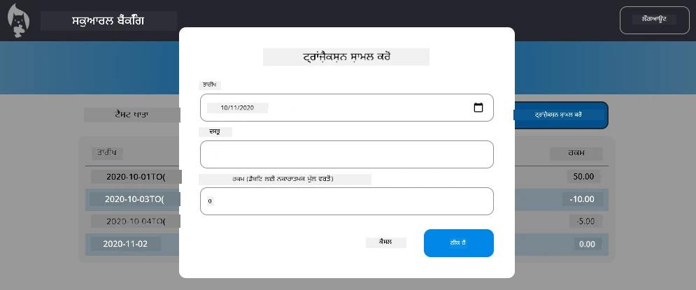

<!--
CO_OP_TRANSLATOR_METADATA:
{
  "original_hash": "50a7783473b39a2e0f133e271a102231",
  "translation_date": "2025-10-22T17:54:14+00:00",
  "source_file": "7-bank-project/4-state-management/assignment.md",
  "language_code": "pa"
}
-->
# "ਟ੍ਰਾਂਜ਼ੈਕਸ਼ਨ ਸ਼ਾਮਲ ਕਰੋ" ਡਾਇਲਾਗ ਲਾਗੂ ਕਰੋ

## ਝਲਕ

ਤੁਹਾਡੀ ਬੈਂਕਿੰਗ ਐਪ ਵਿੱਚ ਹੁਣ ਮਜ਼ਬੂਤ ਸਟੇਟ ਮੈਨੇਜਮੈਂਟ ਅਤੇ ਡਾਟਾ ਪERSISTENCE ਹੈ, ਪਰ ਇਸ ਵਿੱਚ ਇੱਕ ਮਹੱਤਵਪੂਰਨ ਫੀਚਰ ਦੀ ਕਮੀ ਹੈ ਜੋ ਅਸਲ ਬੈਂਕਿੰਗ ਐਪਸ ਵਿੱਚ ਹੁੰਦੀ ਹੈ: ਯੂਜ਼ਰਜ਼ ਨੂੰ ਆਪਣੇ ਟ੍ਰਾਂਜ਼ੈਕਸ਼ਨ ਸ਼ਾਮਲ ਕਰਨ ਦੀ ਸਮਰਥਾ। ਇਸ ਅਸਾਈਨਮੈਂਟ ਵਿੱਚ, ਤੁਸੀਂ ਇੱਕ ਪੂਰਾ "ਟ੍ਰਾਂਜ਼ੈਕਸ਼ਨ ਸ਼ਾਮਲ ਕਰੋ" ਡਾਇਲਾਗ ਲਾਗੂ ਕਰੋਗੇ ਜੋ ਤੁਹਾਡੇ ਮੌਜੂਦਾ ਸਟੇਟ ਮੈਨੇਜਮੈਂਟ ਸਿਸਟਮ ਨਾਲ ਬੇਹਤਰੀਨ ਤਰੀਕੇ ਨਾਲ ਜੁੜਦਾ ਹੈ।

ਇਹ ਅਸਾਈਨਮੈਂਟ ਤੁਹਾਡੇ ਚਾਰ ਬੈਂਕਿੰਗ ਪਾਠਾਂ ਵਿੱਚ ਸਿੱਖੇ ਗਏ ਸਭ ਕੁਝ ਨੂੰ ਇਕੱਠਾ ਕਰਦਾ ਹੈ: HTML ਟੈਮਪਲੇਟਿੰਗ, ਫਾਰਮ ਹੈਂਡਲਿੰਗ, API ਇੰਟੀਗ੍ਰੇਸ਼ਨ, ਅਤੇ ਸਟੇਟ ਮੈਨੇਜਮੈਂਟ।

## ਸਿੱਖਣ ਦੇ ਉਦੇਸ਼

ਇਸ ਅਸਾਈਨਮੈਂਟ ਨੂੰ ਪੂਰਾ ਕਰਕੇ, ਤੁਸੀਂ:
- **ਬਣਾਉਣਾ** ਡਾਟਾ ਐਂਟਰੀ ਲਈ ਇੱਕ ਯੂਜ਼ਰ-ਫ੍ਰੈਂਡਲੀ ਡਾਇਲਾਗ ਇੰਟਰਫੇਸ
- **ਲਾਗੂ ਕਰਨਾ** ਕੀਬੋਰਡ ਅਤੇ ਸਕ੍ਰੀਨ ਰੀਡਰ ਸਹਾਇਤਾ ਨਾਲ ਪਹੁੰਚਯੋਗ ਫਾਰਮ ਡਿਜ਼ਾਈਨ
- **ਇੰਟੀਗ੍ਰੇਟ ਕਰਨਾ** ਨਵੇਂ ਫੀਚਰਜ਼ ਨੂੰ ਤੁਹਾਡੇ ਮੌਜੂਦਾ ਸਟੇਟ ਮੈਨੇਜਮੈਂਟ ਸਿਸਟਮ ਨਾਲ
- **ਅਭਿਆਸ ਕਰਨਾ** API ਕਮਿਊਨਿਕੇਸ਼ਨ ਅਤੇ ਐਰਰ ਹੈਂਡਲਿੰਗ
- **ਲਾਗੂ ਕਰਨਾ** ਅਧੁਨਿਕ ਵੈੱਬ ਡਿਵੈਲਪਮੈਂਟ ਪੈਟਰਨਜ਼ ਨੂੰ ਇੱਕ ਅਸਲ-ਵਰਲਡ ਫੀਚਰ ਵਿੱਚ

## ਹਦਾਇਤਾਂ

### ਪਹਲਾ ਕਦਮ: ਟ੍ਰਾਂਜ਼ੈਕਸ਼ਨ ਸ਼ਾਮਲ ਕਰੋ ਬਟਨ

**ਬਣਾਓ** ਤੁਹਾਡੇ ਡੈਸ਼ਬੋਰਡ ਪੇਜ 'ਤੇ ਇੱਕ "ਟ੍ਰਾਂਜ਼ੈਕਸ਼ਨ ਸ਼ਾਮਲ ਕਰੋ" ਬਟਨ ਜੋ ਯੂਜ਼ਰਜ਼ ਆਸਾਨੀ ਨਾਲ ਲੱਭ ਸਕਣ ਅਤੇ ਪਹੁੰਚ ਸਕਣ।

**ਜਰੂਰਤਾਂ:**
- **ਬਟਨ** ਨੂੰ ਡੈਸ਼ਬੋਰਡ 'ਤੇ ਇੱਕ ਤਰਕਸੰਗਤ ਸਥਾਨ 'ਤੇ ਰੱਖੋ
- **ਵਰਤੋ** ਸਪਸ਼ਟ, ਕਾਰਵਾਈ-ਅਧਾਰਿਤ ਬਟਨ ਟੈਕਸਟ
- **ਸਟਾਈਲ** ਬਟਨ ਨੂੰ ਤੁਹਾਡੇ ਮੌਜੂਦਾ UI ਡਿਜ਼ਾਈਨ ਨਾਲ ਮੇਲ ਖਾਣ ਲਈ
- **ਸੁਨਿਸ਼ਚਿਤ ਕਰੋ** ਕਿ ਬਟਨ ਕੀਬੋਰਡ ਪਹੁੰਚਯੋਗ ਹੈ

### ਦੂਜਾ ਕਦਮ: ਡਾਇਲਾਗ ਲਾਗੂ ਕਰਨਾ

ਤੁਹਾਡੇ ਡਾਇਲਾਗ ਨੂੰ ਲਾਗੂ ਕਰਨ ਲਈ ਦੋ ਵਿਧੀਆਂ ਵਿੱਚੋਂ ਇੱਕ ਚੁਣੋ:

**ਵਿਕਲਪ A: ਅਲੱਗ ਪੇਜ**
- **ਬਣਾਓ** ਟ੍ਰਾਂਜ਼ੈਕਸ਼ਨ ਫਾਰਮ ਲਈ ਇੱਕ ਨਵਾਂ HTML ਟੈਮਪਲੇਟ
- **ਨਵਾਂ ਰੂਟ** ਤੁਹਾਡੇ ਰੂਟਿੰਗ ਸਿਸਟਮ ਵਿੱਚ ਸ਼ਾਮਲ ਕਰੋ
- **ਨੈਵੀਗੇਸ਼ਨ** ਫਾਰਮ ਪੇਜ 'ਤੇ ਅਤੇ ਵਾਪਸ ਲਾਗੂ ਕਰੋ

**ਵਿਕਲਪ B: ਮੋਡਲ ਡਾਇਲਾਗ (ਸੁਝਾਏ ਗਏ)**
- **ਵਰਤੋ** ਜਾਵਾਸਕ੍ਰਿਪਟ ਡੈਸ਼ਬੋਰਡ ਛੱਡਣ ਤੋਂ ਬਿਨਾਂ ਡਾਇਲਾਗ ਨੂੰ ਦਿਖਾਉਣ/ਛੁਪਾਉਣ ਲਈ
- **ਲਾਗੂ ਕਰੋ** [`hidden` property](https://developer.mozilla.org/docs/Web/HTML/Global_attributes/hidden) ਜਾਂ CSS ਕਲਾਸਾਂ ਦੀ ਵਰਤੋਂ ਕਰਕੇ
- **ਸੁਚਾਰੂ ਯੂਜ਼ਰ ਅਨੁਭਵ** ਬਣਾਓ ਸਹੀ ਫੋਕਸ ਮੈਨੇਜਮੈਂਟ ਨਾਲ

### ਤੀਜਾ ਕਦਮ: ਪਹੁੰਚਯੋਗਤਾ ਲਾਗੂ ਕਰਨਾ

**ਸੁਨਿਸ਼ਚਿਤ ਕਰੋ** ਕਿ ਤੁਹਾਡਾ ਡਾਇਲਾਗ [ਮੋਡਲ ਡਾਇਲਾਗ ਲਈ ਪਹੁੰਚਯੋਗਤਾ ਮਿਆਰਾਂ](https://developer.paciellogroup.com/blog/2018/06/the-current-state-of-modal-dialog-accessibility/) ਨੂੰ ਪੂਰਾ ਕਰਦਾ ਹੈ:

**ਕੀਬੋਰਡ ਨੈਵੀਗੇਸ਼ਨ:**
- **ਸਹਾਇਤਾ** Escape key ਨਾਲ ਡਾਇਲਾਗ ਨੂੰ ਬੰਦ ਕਰਨ ਲਈ
- **ਫੋਕਸ** ਨੂੰ ਡਾਇਲਾਗ ਵਿੱਚ ਫਸਾਓ ਜਦੋਂ ਇਹ ਖੁੱਲ੍ਹਾ ਹੋਵੇ
- **ਫੋਕਸ** ਨੂੰ ਟ੍ਰਿਗਰ ਬਟਨ 'ਤੇ ਵਾਪਸ ਲਾਓ ਜਦੋਂ ਇਹ ਬੰਦ ਹੋਵੇ

**ਸਕ੍ਰੀਨ ਰੀਡਰ ਸਹਾਇਤਾ:**
- **ਸਹੀ ARIA ਲੇਬਲ ਅਤੇ ਰੋਲ** ਸ਼ਾਮਲ ਕਰੋ
- **ਡਾਇਲਾਗ ਖੁੱਲ੍ਹਣ/ਬੰਦ ਹੋਣ ਦੀ ਘੋਸ਼ਣਾ** ਸਕ੍ਰੀਨ ਰੀਡਰਜ਼ ਨੂੰ ਕਰੋ
- **ਸਪਸ਼ਟ ਫਾਰਮ ਫੀਲਡ ਲੇਬਲ ਅਤੇ ਐਰਰ ਮੈਸੇਜ** ਪ੍ਰਦਾਨ ਕਰੋ

### ਚੌਥਾ ਕਦਮ: ਫਾਰਮ ਬਣਾਉਣਾ

**ਡਿਜ਼ਾਈਨ** ਇੱਕ HTML ਫਾਰਮ ਜੋ ਟ੍ਰਾਂਜ਼ੈਕਸ਼ਨ ਡਾਟਾ ਇਕੱਠਾ ਕਰਦਾ ਹੈ:

**ਜਰੂਰੀ ਫੀਲਡ:**
- **ਮਿਤੀ**: ਜਦੋਂ ਟ੍ਰਾਂਜ਼ੈਕਸ਼ਨ ਹੋਇਆ
- **ਵੇਰਵਾ**: ਟ੍ਰਾਂਜ਼ੈਕਸ਼ਨ ਕਿਉਂ ਸੀ
- **ਰਕਮ**: ਟ੍ਰਾਂਜ਼ੈਕਸ਼ਨ ਦੀ ਕੀਮਤ (ਆਮਦਨ ਲਈ ਸਕਾਰਾਤਮਕ, ਖਰਚੇ ਲਈ ਨਕਾਰਾਤਮਕ)

**ਫਾਰਮ ਫੀਚਰ:**
- **ਯੂਜ਼ਰ ਇਨਪੁਟ** ਨੂੰ ਸਬਮਿਟ ਕਰਨ ਤੋਂ ਪਹਿਲਾਂ ਵੈਰੀਫਾਈ ਕਰੋ
- **ਸਪਸ਼ਟ ਐਰਰ ਮੈਸੇਜ** ਪ੍ਰਦਾਨ ਕਰੋ ਜੇ ਡਾਟਾ ਗਲਤ ਹੋਵੇ
- **ਮਦਦਗਾਰ ਪਲੇਸਹੋਲਡਰ ਟੈਕਸਟ ਅਤੇ ਲੇਬਲ** ਸ਼ਾਮਲ ਕਰੋ
- **ਤੁਹਾਡੇ ਮੌਜੂਦਾ ਡਿਜ਼ਾਈਨ ਨਾਲ ਸੰਗਤ** ਸਟਾਈਲ

### ਪੰਜਵਾਂ ਕਦਮ: API ਇੰਟੀਗ੍ਰੇਸ਼ਨ

**ਤੁਹਾਡੇ ਫਾਰਮ ਨੂੰ ਬੈਕਐਂਡ API ਨਾਲ ਜੁੜੋ:**

**ਲਾਗੂ ਕਰਨ ਦੇ ਕਦਮ:**
- **[ਸਰਵਰ API ਵਿਸ਼ੇਸ਼ਤਾਵਾਂ](../api/README.md)** ਦੀ ਸਮੀਖਿਆ ਕਰੋ ਸਹੀ ਐਂਡਪੌਇੰਟ ਅਤੇ ਡਾਟਾ ਫਾਰਮੈਟ ਲਈ
- **JSON ਡਾਟਾ** ਤੁਹਾਡੇ ਫਾਰਮ ਇਨਪੁਟਸ ਤੋਂ ਬਣਾਓ
- **ਡਾਟਾ API ਨੂੰ ਭੇਜੋ** ਸਹੀ ਐਰਰ ਹੈਂਡਲਿੰਗ ਨਾਲ
- **ਸਫਲਤਾ/ਅਸਫਲਤਾ ਮੈਸੇਜ** ਯੂਜ਼ਰ ਨੂੰ ਦਿਖਾਓ
- **ਨੈਟਵਰਕ ਐਰਰਜ਼** ਨੂੰ ਸਹੀ ਤਰੀਕੇ ਨਾਲ ਹੈਂਡਲ ਕਰੋ

### ਛੇਵਾਂ ਕਦਮ: ਸਟੇਟ ਮੈਨੇਜਮੈਂਟ ਇੰਟੀਗ੍ਰੇਸ਼ਨ

**ਤੁਹਾਡੇ ਡੈਸ਼ਬੋਰਡ ਨੂੰ ਨਵੇਂ ਟ੍ਰਾਂਜ਼ੈਕਸ਼ਨ ਨਾਲ ਅਪਡੇਟ ਕਰੋ:**

**ਇੰਟੀਗ੍ਰੇਸ਼ਨ ਦੀਆਂ ਜਰੂਰਤਾਂ:**
- **ਖਾਤੇ ਦੇ ਡਾਟਾ ਨੂੰ ਰਿਫ੍ਰੈਸ਼ ਕਰੋ** ਜਦੋਂ ਟ੍ਰਾਂਜ਼ੈਕਸ਼ਨ ਸਫਲਤਾਪੂਰਵਕ ਸ਼ਾਮਲ ਕੀਤਾ ਜਾਵੇ
- **ਡੈਸ਼ਬੋਰਡ ਡਿਸਪਲੇਅ ਨੂੰ ਅਪਡੇਟ ਕਰੋ** ਬਿਨਾਂ ਪੇਜ ਰੀਲੋਡ ਕੀਤੇ
- **ਸੁਨਿਸ਼ਚਿਤ ਕਰੋ** ਕਿ ਨਵਾਂ ਟ੍ਰਾਂਜ਼ੈਕਸ਼ਨ ਤੁਰੰਤ ਦਿਖਾਈ ਦੇਵੇ
- **ਪੂਰੇ ਪ੍ਰਕਿਰਿਆ ਦੌਰਾਨ ਸਟੇਟ ਦੀ ਸੰਗਤਤਾ** ਬਣਾਈ ਰੱਖੋ

## ਤਕਨੀਕੀ ਵਿਸ਼ੇਸ਼ਤਾਵਾਂ

**API ਐਂਡਪੌਇੰਟ ਵੇਰਵੇ:**
[ਸਰਵਰ API ਡੌਕਯੂਮੈਂਟੇਸ਼ਨ](../api/README.md) ਨੂੰ ਰਿਫਰ ਕਰੋ:
- ਟ੍ਰਾਂਜ਼ੈਕਸ਼ਨ ਡਾਟਾ ਲਈ ਜਰੂਰੀ JSON ਫਾਰਮੈਟ
- HTTP ਵਿਧੀ ਅਤੇ ਐਂਡਪੌਇੰਟ URL
- ਉਮੀਦ ਕੀਤੀ ਗਈ ਜਵਾਬ ਫਾਰਮੈਟ
- ਐਰਰ ਜਵਾਬ ਹੈਂਡਲਿੰਗ

**ਉਮੀਦ ਕੀਤੀ ਨਤੀਜਾ:**
ਇਸ ਅਸਾਈਨਮੈਂਟ ਨੂੰ ਪੂਰਾ ਕਰਨ ਤੋਂ ਬਾਅਦ, ਤੁਹਾਡੀ ਬੈਂਕਿੰਗ ਐਪ ਵਿੱਚ ਇੱਕ ਪੂਰੀ ਤਰ੍ਹਾਂ ਕਾਰਗਰ "ਟ੍ਰਾਂਜ਼ੈਕਸ਼ਨ ਸ਼ਾਮਲ ਕਰੋ" ਫੀਚਰ ਹੋਣਾ ਚਾਹੀਦਾ ਹੈ ਜੋ ਪੇਸ਼ੇਵਰ ਤਰੀਕੇ ਨਾਲ ਦਿਖਾਈ ਦੇਵੇ ਅਤੇ ਕੰਮ ਕਰੇ:

## ਤੁਹਾਡੀ ਲਾਗੂ ਕਰਨ ਦੀ ਜਾਂਚ ਕਰਨਾ

**ਫੰਕਸ਼ਨਲ ਟੈਸਟਿੰਗ:**
1. **ਪੁਸ਼ਟੀ ਕਰੋ** ਕਿ "ਟ੍ਰਾਂਜ਼ੈਕਸ਼ਨ ਸ਼ਾਮਲ ਕਰੋ" ਬਟਨ ਸਪਸ਼ਟ ਤੌਰ 'ਤੇ ਦਿਖਾਈ ਦੇ ਰਿਹਾ ਹੈ ਅਤੇ ਪਹੁੰਚਯੋਗ ਹੈ
2. **ਟੈਸਟ ਕਰੋ** ਕਿ ਡਾਇਲਾਗ ਸਹੀ ਤਰੀਕੇ ਨਾਲ ਖੁਲ੍ਹਦਾ ਅਤੇ ਬੰਦ ਹੁੰਦਾ ਹੈ
3. **ਪੁਸ਼ਟੀ ਕਰੋ** ਕਿ ਫਾਰਮ ਵੈਰੀਫਿਕੇਸ਼ਨ ਸਾਰੇ ਜਰੂਰੀ ਫੀਲਡ ਲਈ ਕੰਮ ਕਰਦਾ ਹੈ
4. **ਜਾਂਚ ਕਰੋ** ਕਿ ਸਫਲ ਟ੍ਰਾਂਜ਼ੈਕਸ਼ਨ ਤੁਰੰਤ ਡੈਸ਼ਬੋਰਡ 'ਤੇ ਦਿਖਾਈ ਦਿੰਦੇ ਹਨ
5. **ਸੁਨਿਸ਼ਚਿਤ ਕਰੋ** ਕਿ ਗਲਤ ਡਾਟਾ ਅਤੇ ਨੈਟਵਰਕ ਸਮੱਸਿਆਵਾਂ ਲਈ ਐਰਰ ਹੈਂਡਲਿੰਗ ਕੰਮ ਕਰਦਾ ਹੈ

**ਪਹੁੰਚਯੋਗਤਾ ਟੈਸਟਿੰਗ:**
1. **ਸਿਰਫ਼ ਕੀਬੋਰਡ ਦੀ ਵਰਤੋਂ ਕਰਕੇ** ਪੂਰੇ ਪ੍ਰਕਿਰਿਆ ਵਿੱਚ ਨੈਵੀਗੇਟ ਕਰੋ
2. **ਸਕ੍ਰੀਨ ਰੀਡਰ ਨਾਲ ਟੈਸਟ ਕਰੋ** ਕਿ ਸਹੀ ਘੋਸ਼ਣਾਵਾਂ ਹੁੰਦੀਆਂ ਹਨ
3. **ਪੁਸ਼ਟੀ ਕਰੋ** ਕਿ ਫੋਕਸ ਮੈਨੇਜਮੈਂਟ ਸਹੀ ਤਰੀਕੇ ਨਾਲ ਕੰਮ ਕਰਦਾ ਹੈ
4. **ਜਾਂਚ ਕਰੋ** ਕਿ ਸਾਰੇ ਫਾਰਮ ਐਲਿਮੈਂਟਸ ਦੇ ਸਹੀ ਲੇਬਲ ਹਨ

## ਮੁਲਾਂਕਣ ਰੂਬ੍ਰਿਕ

| ਮਾਪਦੰਡ | ਸ਼ਾਨਦਾਰ | ਯੋਗ | ਸੁਧਾਰ ਦੀ ਲੋੜ |
| -------- | --------- | -------- | ----------------- |
| **ਫੰਕਸ਼ਨਲਿਟੀ** | ਟ੍ਰਾਂਜ਼ੈਕਸ਼ਨ ਸ਼ਾਮਲ ਕਰਨ ਦਾ ਫੀਚਰ ਬੇਹਤਰੀਨ ਯੂਜ਼ਰ ਅਨੁਭਵ ਨਾਲ ਬਿਲਕੁਲ ਸਹੀ ਕੰਮ ਕਰਦਾ ਹੈ ਅਤੇ ਪਾਠਾਂ ਦੇ ਸਾਰੇ ਬਿਹਤਰ ਅਭਿਆਸਾਂ ਦੀ ਪਾਲਣਾ ਕਰਦਾ ਹੈ | ਟ੍ਰਾਂਜ਼ੈਕਸ਼ਨ ਸ਼ਾਮਲ ਕਰਨ ਦਾ ਫੀਚਰ ਸਹੀ ਕੰਮ ਕਰਦਾ ਹੈ ਪਰ ਕੁਝ ਬਿਹਤਰ ਅਭਿਆਸਾਂ ਦੀ ਪਾਲਣਾ ਨਹੀਂ ਕਰਦਾ ਜਾਂ ਛੋਟੇ ਯੂਜ਼ਬਿਲਿਟੀ ਸਮੱਸਿਆਵਾਂ ਹਨ | ਟ੍ਰਾਂਜ਼ੈਕਸ਼ਨ ਸ਼ਾਮਲ ਕਰਨ ਦਾ ਫੀਚਰ ਅੰਸ਼ਿਕ ਤੌਰ 'ਤੇ ਕੰਮ ਕਰਦਾ ਹੈ ਜਾਂ ਮਹੱਤਵਪੂਰਨ ਯੂਜ਼ਬਿਲਿਟੀ ਸਮੱਸਿਆਵਾਂ ਹਨ |
| **ਕੋਡ ਗੁਣਵੱਤਾ** | ਕੋਡ ਚੰਗੀ ਤਰ੍ਹਾਂ ਸੰਗਠਿਤ ਹੈ, ਸਥਾਪਿਤ ਪੈਟਰਨਾਂ ਦੀ ਪਾਲਣਾ ਕਰਦਾ ਹੈ, ਸਹੀ ਐਰਰ ਹੈਂਡਲਿੰਗ ਸ਼ਾਮਲ ਕਰਦਾ ਹੈ, ਅਤੇ ਮੌਜੂਦਾ ਸਟੇਟ ਮੈਨੇਜਮੈਂਟ ਨਾਲ ਬੇਹਤਰੀਨ ਤਰੀਕੇ ਨਾਲ ਜੁੜਦਾ ਹੈ | ਕੋਡ ਕੰਮ ਕਰਦਾ ਹੈ ਪਰ ਕੁਝ ਸੰਗਠਨ ਸਮੱਸਿਆਵਾਂ ਜਾਂ ਮੌਜੂਦਾ ਕੋਡਬੇਸ ਨਾਲ ਅਸੰਗਤ ਪੈਟਰਨ ਹੋ ਸਕਦੇ ਹਨ | ਕੋਡ ਵਿੱਚ ਮਹੱਤਵਪੂਰਨ ਸੰਰਚਨਾਤਮਕ ਸਮੱਸਿਆਵਾਂ ਹਨ ਜਾਂ ਮੌਜੂਦਾ ਪੈਟਰਨਾਂ ਨਾਲ ਚੰਗੀ ਤਰ੍ਹਾਂ ਜੁੜਦਾ ਨਹੀਂ ਹੈ |
| **ਪਹੁੰਚਯੋਗਤਾ** | ਪੂਰੀ ਕੀਬੋਰਡ ਨੈਵੀਗੇਸ਼ਨ ਸਹਾਇਤਾ, ਸਕ੍ਰੀਨ ਰੀਡਰ ਅਨੁਕੂਲਤਾ, ਅਤੇ WCAG ਦਿਸ਼ਾ-ਨਿਰਦੇਸ਼ਾਂ ਦੀ ਪਾਲਣਾ ਕਰਦਾ ਹੈ ਸਹੀ ਫੋਕਸ ਮੈਨੇਜਮੈਂਟ ਨਾਲ | ਬੁਨਿਆਦੀ ਪਹੁੰਚਯੋਗਤਾ ਫੀਚਰ ਲਾਗੂ ਕੀਤੇ ਗਏ ਹਨ ਪਰ ਕੁਝ ਕੀਬੋਰਡ ਨੈਵੀਗੇਸ਼ਨ ਜਾਂ ਸਕ੍ਰੀਨ ਰੀਡਰ ਫੀਚਰ ਗੁੰਮ ਹੋ ਸਕਦੇ ਹਨ | ਸੀਮਿਤ ਜਾਂ ਕੋਈ ਪਹੁੰਚਯੋਗਤਾ ਵਿਚਾਰ ਨਹੀਂ ਲਾਗੂ ਕੀਤੇ ਗਏ |
| **ਯੂਜ਼ਰ ਅਨੁਭਵ** | ਸਪਸ਼ਟ, ਪਾਲਿਸ਼ਡ ਇੰਟਰਫੇਸ ਸਪਸ਼ਟ ਫੀਡਬੈਕ, ਸੁਚਾਰੂ ਇੰਟਰੈਕਸ਼ਨ, ਅਤੇ ਪੇਸ਼ੇਵਰ ਦਿੱਖ ਨਾਲ | ਚੰਗਾ ਯੂਜ਼ਰ ਅਨੁਭਵ ਛੋਟੇ ਸੁਧਾਰਾਂ ਦੀ ਲੋੜ ਵਾਲੇ ਖੇਤਰਾਂ ਨਾਲ | ਗੁੰਝਲਦਾਰ ਇੰਟਰਫੇਸ ਜਾਂ ਯੂਜ਼ਰ ਫੀਡਬੈਕ ਦੀ ਕਮੀ ਨਾਲ ਖਰਾਬ ਯੂਜ਼ਰ ਅਨੁਭਵ |

## ਵਾਧੂ ਚੁਣੌਤੀਆਂ (ਵਿਕਲਪਿਕ)

ਜਦੋਂ ਤੁਸੀਂ ਬੁਨਿਆਦੀ ਜਰੂਰਤਾਂ ਪੂਰੀ ਕਰ ਲੈਂਦੇ ਹੋ, ਤਾਂ ਇਹ ਸੁਧਾਰਾਂ 'ਤੇ ਵਿਚਾਰ ਕਰੋ:

**ਵਧੇਰੇ ਫੀਚਰ:**
- **ਸ਼ਾਮਲ ਕਰੋ** ਟ੍ਰਾਂਜ਼ੈਕਸ਼ਨ ਸ਼੍ਰੇਣੀਆਂ (ਭੋਜਨ, ਆਵਾਜਾਈ, ਮਨੋਰੰਜਨ, ਆਦਿ)
- **ਲਾਗੂ ਕਰੋ** ਰੀਅਲ-ਟਾਈਮ ਫੀਡਬੈਕ ਨਾਲ ਇਨਪੁਟ ਵੈਰੀਡੇਸ਼ਨ
- **ਬਣਾਓ** ਪਾਵਰ ਯੂਜ਼ਰਜ਼ ਲਈ ਕੀਬੋਰਡ ਸ਼ਾਰਟਕਟ
- **ਸ਼ਾਮਲ ਕਰੋ** ਟ੍ਰਾਂਜ਼ੈਕਸ਼ਨ ਸੰਪਾਦਨ ਅਤੇ ਮਿਟਾਉਣ ਦੀ ਸਮਰਥਾ

**ਅਗੇਤਰੀ ਇੰਟੀਗ੍ਰੇਸ਼ਨ:**
- **ਲਾਗੂ ਕਰੋ** ਹਾਲ ਹੀ ਵਿੱਚ ਸ਼ਾਮਲ ਕੀਤੇ ਗਏ ਟ੍ਰਾਂਜ਼ੈਕਸ਼ਨ ਲਈ ਅਣਡੂ ਫੰਕਸ਼ਨਲਿਟੀ
- **ਸ਼ਾਮਲ ਕਰੋ** CSV ਫਾਈਲਾਂ ਤੋਂ ਬਲਕ ਟ੍ਰਾਂਜ਼ੈਕਸ਼ਨ ਇੰਪੋਰਟ
- **ਬਣਾਓ** ਟ੍ਰਾਂਜ਼ੈਕਸ਼ਨ ਖੋਜ ਅਤੇ ਫਿਲਟਰਿੰਗ ਦੀ ਸਮਰਥਾ
- **ਲਾਗੂ ਕਰੋ** ਡਾਟਾ ਐਕਸਪੋਰਟ ਫੰਕਸ਼ਨਲਿਟੀ

ਇਹ ਵਿਕਲਪਿਕ ਫੀਚਰ ਤੁਹਾਨੂੰ ਵਧੇਰੇ ਅਗੇਤਰੀ ਵੈੱਬ ਡਿਵੈਲਪਮੈਂਟ ਸੰਕਲਪਾਂ ਦਾ ਅਭਿਆਸ ਕਰਨ ਵਿੱਚ ਮਦਦ ਕਰਦੇ ਹਨ ਅਤੇ ਇੱਕ ਹੋਰ ਪੂਰੀ ਬੈਂਕਿੰਗ ਐਪ ਬਣਾਉਣ ਵਿੱਚ ਮਦਦ ਕਰਦੇ ਹਨ!

---

**ਅਸਵੀਕਰਤਾ**:  
ਇਹ ਦਸਤਾਵੇਜ਼ AI ਅਨੁਵਾਦ ਸੇਵਾ [Co-op Translator](https://github.com/Azure/co-op-translator) ਦੀ ਵਰਤੋਂ ਕਰਕੇ ਅਨੁਵਾਦ ਕੀਤਾ ਗਿਆ ਹੈ। ਜਦੋਂ ਕਿ ਅਸੀਂ ਸਹੀ ਹੋਣ ਦੀ ਕੋਸ਼ਿਸ਼ ਕਰਦੇ ਹਾਂ, ਕਿਰਪਾ ਕਰਕੇ ਧਿਆਨ ਦਿਓ ਕਿ ਸਵੈਚਾਲਿਤ ਅਨੁਵਾਦਾਂ ਵਿੱਚ ਗਲਤੀਆਂ ਜਾਂ ਅਸੁੱਤੀਆਂ ਹੋ ਸਕਦੀਆਂ ਹਨ। ਇਸ ਦੀ ਮੂਲ ਭਾਸ਼ਾ ਵਿੱਚ ਮੂਲ ਦਸਤਾਵੇਜ਼ ਨੂੰ ਅਧਿਕਾਰਤ ਸਰੋਤ ਮੰਨਿਆ ਜਾਣਾ ਚਾਹੀਦਾ ਹੈ। ਮਹੱਤਵਪੂਰਨ ਜਾਣਕਾਰੀ ਲਈ, ਪੇਸ਼ੇਵਰ ਮਨੁੱਖੀ ਅਨੁਵਾਦ ਦੀ ਸਿਫਾਰਸ਼ ਕੀਤੀ ਜਾਂਦੀ ਹੈ। ਇਸ ਅਨੁਵਾਦ ਦੀ ਵਰਤੋਂ ਤੋਂ ਪੈਦਾ ਹੋਣ ਵਾਲੇ ਕਿਸੇ ਵੀ ਗਲਤਫਹਿਮੀ ਜਾਂ ਗਲਤ ਵਿਆਖਿਆ ਲਈ ਅਸੀਂ ਜ਼ਿੰਮੇਵਾਰ ਨਹੀਂ ਹਾਂ।