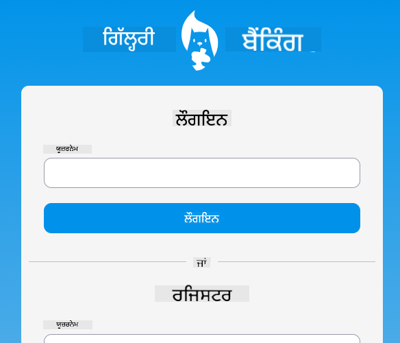
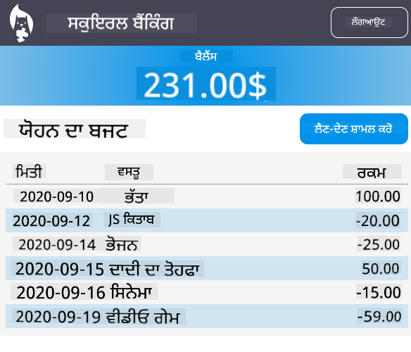

<!--
CO_OP_TRANSLATOR_METADATA:
{
  "original_hash": "830359535306594b448db6575ce5cdee",
  "translation_date": "2025-08-26T00:03:22+00:00",
  "source_file": "7-bank-project/README.md",
  "language_code": "pa"
}
-->
# :dollar: ਬੈਂਕ ਬਣਾਓ

ਇਸ ਪ੍ਰੋਜੈਕਟ ਵਿੱਚ, ਤੁਸੀਂ ਇੱਕ ਕਲਪਨਾਤਮਕ ਬੈਂਕ ਬਣਾਉਣਾ ਸਿੱਖੋਗੇ। ਇਹ ਪਾਠ ਤੁਹਾਨੂੰ ਸਿਖਾਉਣਗੇ ਕਿ ਵੈੱਬ ਐਪ ਦਾ ਲੇਆਉਟ ਕਿਵੇਂ ਬਣਾਉਣਾ ਹੈ ਅਤੇ ਰੂਟਸ ਪ੍ਰਦਾਨ ਕਰਨੇ ਹਨ, ਫਾਰਮ ਬਣਾਉਣੇ ਹਨ, ਸਟੇਟ ਨੂੰ ਮੈਨੇਜ ਕਰਨਾ ਹੈ, ਅਤੇ API ਤੋਂ ਡਾਟਾ ਫੈਚ ਕਰਨਾ ਹੈ ਜਿਸ ਤੋਂ ਤੁਸੀਂ ਬੈਂਕ ਦਾ ਡਾਟਾ ਪ੍ਰਾਪਤ ਕਰ ਸਕਦੇ ਹੋ।

|  |  |
|--------------------------------|--------------------------------|

## ਪਾਠ

1. [ਵੈੱਬ ਐਪ ਵਿੱਚ HTML ਟੈਂਪਲੇਟ ਅਤੇ ਰੂਟਸ](1-template-route/README.md)
2. [ਲੌਗਿਨ ਅਤੇ ਰਜਿਸਟ੍ਰੇਸ਼ਨ ਫਾਰਮ ਬਣਾਓ](2-forms/README.md)
3. [ਡਾਟਾ ਫੈਚ ਕਰਨ ਅਤੇ ਵਰਤਣ ਦੇ ਤਰੀਕੇ](3-data/README.md)
4. [ਸਟੇਟ ਮੈਨੇਜਮੈਂਟ ਦੇ ਸੰਕਲਪ](4-state-management/README.md)

### ਸ਼੍ਰੇਯ

ਇਹ ਪਾਠ :hearts: ਨਾਲ [ਯੋਹਾਨ ਲਾਸੋਰਸਾ](https://twitter.com/sinedied) ਦੁਆਰਾ ਲਿਖੇ ਗਏ ਹਨ।

ਜੇ ਤੁਸੀਂ ਇਹ ਸਿੱਖਣਾ ਚਾਹੁੰਦੇ ਹੋ ਕਿ ਇਸ ਪਾਠ ਵਿੱਚ ਵਰਤੀ ਗਈ [ਸਰਵਰ API](/7-bank-project/api/README.md) ਕਿਵੇਂ ਬਣਾਈ ਜਾਵੇ, ਤਾਂ ਤੁਸੀਂ [ਇਹ ਵੀਡੀਓ ਸਿਰੀਜ਼](https://aka.ms/NodeBeginner) (ਖਾਸ ਕਰਕੇ ਵੀਡੀਓ 17 ਤੋਂ 21) ਨੂੰ ਫਾਲੋ ਕਰ ਸਕਦੇ ਹੋ।

ਤੁਸੀਂ [ਇਹ ਇੰਟਰਐਕਟਿਵ ਲਰਨ ਟਿਊਟੋਰਿਅਲ](https://aka.ms/learn/express-api) ਵੀ ਦੇਖ ਸਕਦੇ ਹੋ।

**ਅਸਵੀਕਾਰਨ**:  
ਇਹ ਦਸਤਾਵੇਜ਼ AI ਅਨੁਵਾਦ ਸੇਵਾ [Co-op Translator](https://github.com/Azure/co-op-translator) ਦੀ ਵਰਤੋਂ ਕਰਕੇ ਅਨੁਵਾਦ ਕੀਤਾ ਗਿਆ ਹੈ। ਜਦੋਂ ਕਿ ਅਸੀਂ ਸਹੀਤਾ ਲਈ ਯਤਨਸ਼ੀਲ ਹਾਂ, ਕਿਰਪਾ ਕਰਕੇ ਧਿਆਨ ਦਿਓ ਕਿ ਸਵੈਚਾਲਿਤ ਅਨੁਵਾਦਾਂ ਵਿੱਚ ਗਲਤੀਆਂ ਜਾਂ ਅਸੁਚਨਾਵਾਂ ਹੋ ਸਕਦੀਆਂ ਹਨ। ਮੂਲ ਦਸਤਾਵੇਜ਼ ਨੂੰ ਇਸਦੀ ਮੂਲ ਭਾਸ਼ਾ ਵਿੱਚ ਅਧਿਕਾਰਤ ਸਰੋਤ ਮੰਨਿਆ ਜਾਣਾ ਚਾਹੀਦਾ ਹੈ। ਮਹੱਤਵਪੂਰਨ ਜਾਣਕਾਰੀ ਲਈ, ਪੇਸ਼ੇਵਰ ਮਨੁੱਖੀ ਅਨੁਵਾਦ ਦੀ ਸਿਫਾਰਸ਼ ਕੀਤੀ ਜਾਂਦੀ ਹੈ। ਇਸ ਅਨੁਵਾਦ ਦੀ ਵਰਤੋਂ ਤੋਂ ਪੈਦਾ ਹੋਣ ਵਾਲੇ ਕਿਸੇ ਵੀ ਗਲਤਫਹਿਮੀ ਜਾਂ ਗਲਤ ਵਿਆਖਿਆ ਲਈ ਅਸੀਂ ਜ਼ਿੰਮੇਵਾਰ ਨਹੀਂ ਹਾਂ।