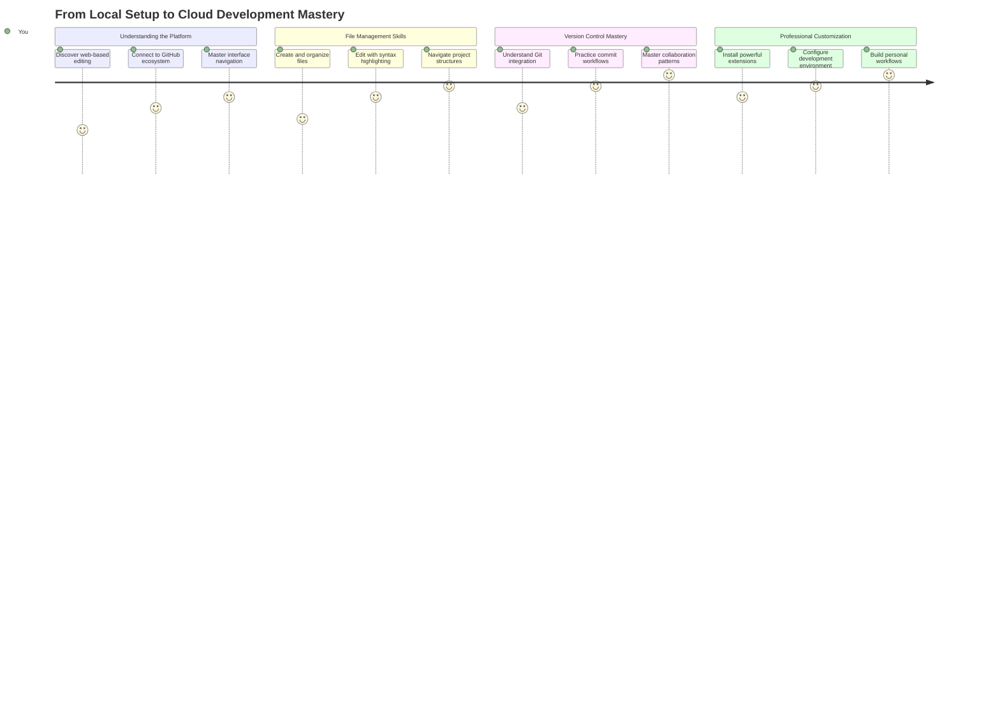
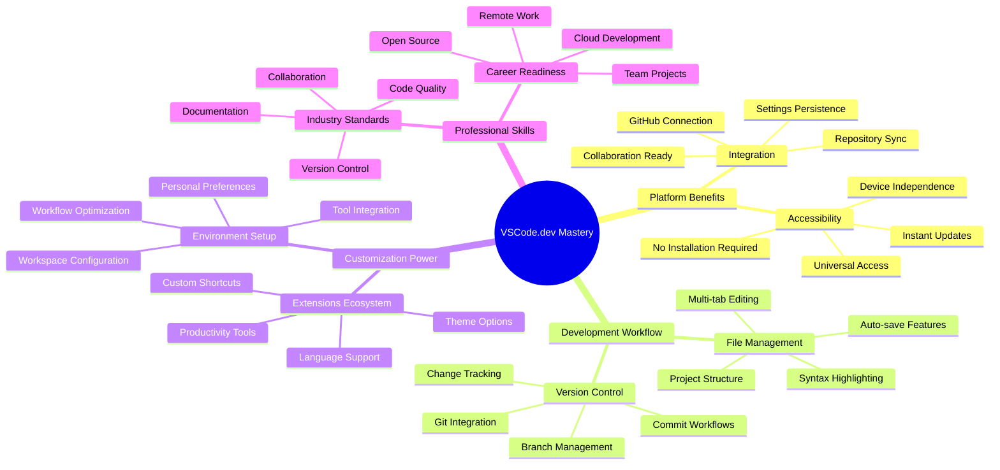
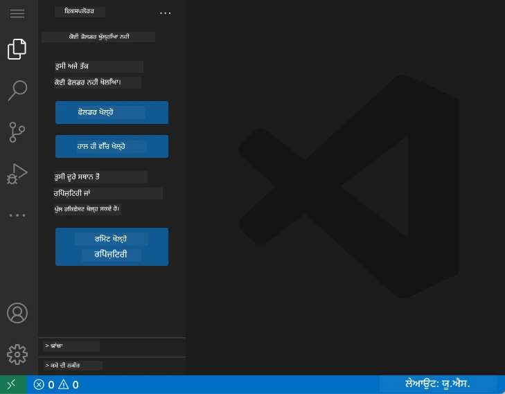
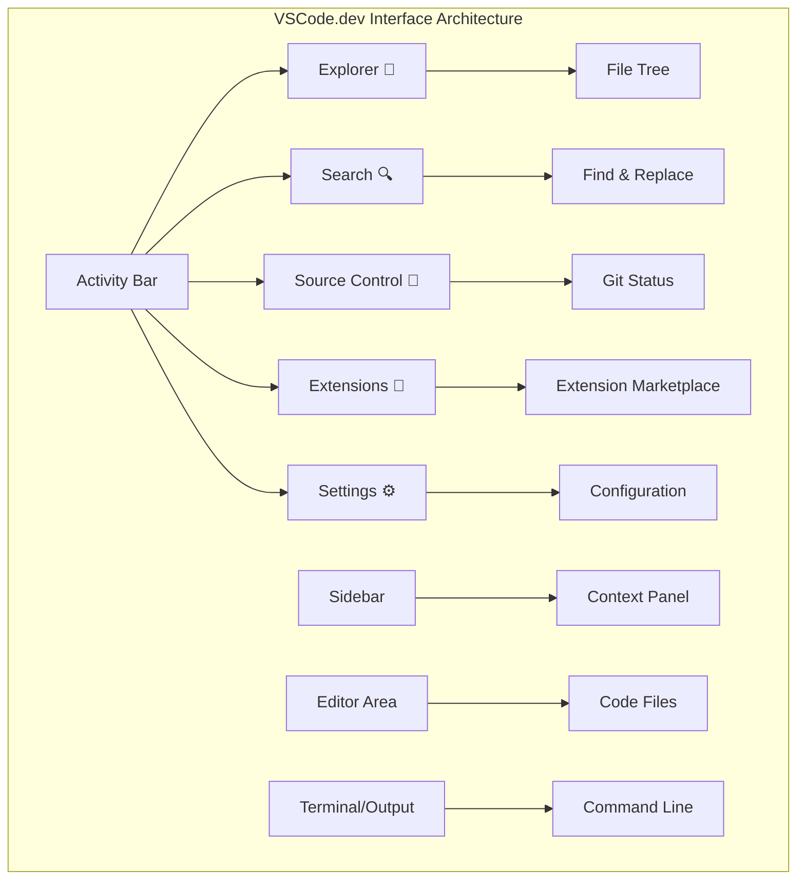
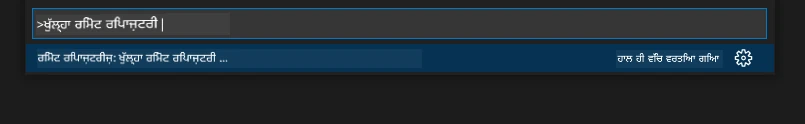

# ਕੋਡ ਐਡੀਟਰ ਦੀ ਵਰਤੋਂ: VSCode.dev ਵਿੱਚ ਮਾਹਰ ਬਣਨਾ

*ਦ ਮੈਟ੍ਰਿਕਸ* ਵਿੱਚ ਯਾਦ ਹੈ ਜਦੋਂ ਨਿਓ ਨੂੰ ਡਿਜੀਟਲ ਦੁਨੀਆ ਵਿੱਚ ਪਹੁੰਚ ਕਰਨ ਲਈ ਇੱਕ ਵੱਡੇ ਕੰਪਿਊਟਰ ਟਰਮੀਨਲ ਨਾਲ ਜੁੜਨਾ ਪਿਆ ਸੀ? ਅੱਜ ਦੇ ਵੈੱਬ ਡਿਵੈਲਪਮੈਂਟ ਟੂਲਸ ਇਸ ਦੇ ਬਿਲਕੁਲ ਉਲਟ ਹਨ - ਬੇਹੱਦ ਸ਼ਕਤੀਸ਼ਾਲੀ ਸਮਰੱਥਾਵਾਂ ਜੋ ਕਿਤੇ ਵੀ ਪਹੁੰਚਯੋਗ ਹਨ। VSCode.dev ਇੱਕ ਬ੍ਰਾਊਜ਼ਰ-ਅਧਾਰਿਤ ਕੋਡ ਐਡੀਟਰ ਹੈ ਜੋ ਕਿਸੇ ਵੀ ਇੰਟਰਨੈਟ ਕਨੈਕਸ਼ਨ ਵਾਲੇ ਡਿਵਾਈਸ 'ਤੇ ਪੇਸ਼ੇਵਰ ਡਿਵੈਲਪਮੈਂਟ ਟੂਲਸ ਲਿਆਉਂਦਾ ਹੈ।

ਜਿਵੇਂ ਪ੍ਰਿੰਟਿੰਗ ਪ੍ਰੈਸ ਨੇ ਕਿਤਾਬਾਂ ਨੂੰ ਹਰ ਕਿਸੇ ਲਈ ਪਹੁੰਚਯੋਗ ਬਣਾਇਆ, ਸਿਰਫ ਮਠਾਂ ਵਿੱਚ ਲਿਖਾਰੀ ਲਈ ਨਹੀਂ, VSCode.dev ਕੋਡਿੰਗ ਨੂੰ ਲੋਕਤੰਤਰਤਮਕ ਬਣਾਉਂਦਾ ਹੈ। ਤੁਸੀਂ ਲਾਇਬ੍ਰੇਰੀ ਕੰਪਿਊਟਰ, ਸਕੂਲ ਲੈਬ ਜਾਂ ਜਿੱਥੇ ਵੀ ਤੁਹਾਡੇ ਕੋਲ ਬ੍ਰਾਊਜ਼ਰ ਪਹੁੰਚ ਹੈ, ਉੱਥੇ ਪ੍ਰੋਜੈਕਟਾਂ 'ਤੇ ਕੰਮ ਕਰ ਸਕਦੇ ਹੋ। ਕੋਈ ਇੰਸਟਾਲੇਸ਼ਨ ਨਹੀਂ, ਕੋਈ "ਮੈਨੂੰ ਮੇਰੀ ਖਾਸ ਸੈਟਅਪ ਦੀ ਲੋੜ ਹੈ" ਦੀਆਂ ਪਾਬੰਦੀਆਂ ਨਹੀਂ।

ਇਸ ਪਾਠ ਦੇ ਅੰਤ ਤੱਕ, ਤੁਸੀਂ ਸਮਝ ਜਾਵੋਗੇ ਕਿ VSCode.dev ਨੂੰ ਕਿਵੇਂ ਨੈਵੀਗੇਟ ਕਰਨਾ ਹੈ, ਆਪਣੇ ਬ੍ਰਾਊਜ਼ਰ ਵਿੱਚ ਸਿੱਧੇ GitHub ਰਿਪੋਜ਼ਿਟਰੀਜ਼ ਖੋਲ੍ਹਣੀ ਹੈ, ਅਤੇ ਵਰਜਨ ਕੰਟਰੋਲ ਲਈ Git ਦੀ ਵਰਤੋਂ ਕਰਨੀ ਹੈ - ਇਹ ਸਾਰੀਆਂ ਕੁਸ਼ਲਤਾਵਾਂ ਜੋ ਪੇਸ਼ੇਵਰ ਡਿਵੈਲਪਰ ਰੋਜ਼ਾਨਾ ਵਰਤਦੇ ਹਨ।

## ⚡ ਅਗਲੇ 5 ਮਿੰਟਾਂ ਵਿੱਚ ਤੁਸੀਂ ਕੀ ਕਰ ਸਕਦੇ ਹੋ

**ਵਿਆਸਤ ਡਿਵੈਲਪਰਾਂ ਲਈ ਤੇਜ਼ ਸ਼ੁਰੂਆਤ ਦਾ ਰਾਹ**


- **ਮਿੰਟ 1**: [vscode.dev](https://vscode.dev) 'ਤੇ ਜਾਓ - ਕੋਈ ਇੰਸਟਾਲੇਸ਼ਨ ਦੀ ਲੋੜ ਨਹੀਂ
- **ਮਿੰਟ 2**: ਆਪਣੇ ਰਿਪੋਜ਼ਿਟਰੀਜ਼ ਨੂੰ ਕਨੈਕਟ ਕਰਨ ਲਈ GitHub ਨਾਲ ਸਾਈਨ ਇਨ ਕਰੋ
- **ਮਿੰਟ 3**: URL ਟ੍ਰਿਕ ਦੀ ਕੋਸ਼ਿਸ਼ ਕਰੋ: ਕਿਸੇ ਵੀ ਰਿਪੋ URL ਵਿੱਚ `github.com` ਨੂੰ `vscode.dev/github` ਨਾਲ ਬਦਲੋ
- **ਮਿੰਟ 4**: ਇੱਕ ਨਵੀਂ ਫਾਈਲ ਬਣਾਓ ਅਤੇ ਸਿੰਟੈਕਸ ਹਾਈਲਾਈਟਿੰਗ ਨੂੰ ਆਪਣੇ ਆਪ ਕੰਮ ਕਰਦੇ ਦੇਖੋ
- **ਮਿੰਟ 5**: ਸੋਰਸ ਕੰਟਰੋਲ ਪੈਨਲ ਰਾਹੀਂ ਇੱਕ ਬਦਲਾਅ ਕਰੋ ਅਤੇ ਇਸ ਨੂੰ ਕਮਿਟ ਕਰੋ

**ਤੇਜ਼ ਟੈਸਟ URL**:
```
# Transform this:
github.com/microsoft/Web-Dev-For-Beginners

# Into this:
vscode.dev/github/microsoft/Web-Dev-For-Beginners
```

**ਇਸ ਦਾ ਮਹੱਤਵ ਕਿਉਂ ਹੈ**: 5 ਮਿੰਟਾਂ ਵਿੱਚ, ਤੁਸੀਂ ਪੇਸ਼ੇਵਰ ਟੂਲਸ ਨਾਲ ਕਿਤੇ ਵੀ ਕੋਡਿੰਗ ਦੀ ਆਜ਼ਾਦੀ ਦਾ ਅਨੁਭਵ ਕਰੋਗੇ। ਇਹ ਵਿਕਾਸ ਦਾ ਭਵਿੱਖ ਦਰਸਾਉਂਦਾ ਹੈ - ਪਹੁੰਚਯੋਗ, ਸ਼ਕਤੀਸ਼ਾਲੀ, ਅਤੇ ਤੁਰੰਤ।

## 🗺️ ਕਲਾਉਡ-ਅਧਾਰਿਤ ਵਿਕਾਸ ਦੁਆਰਾ ਤੁਹਾਡਾ ਸਿੱਖਣ ਦਾ ਸਫਰ



**ਤੁਹਾਡਾ ਸਫਰ ਦਾ ਮੰਜ਼ਿਲ**: ਇਸ ਪਾਠ ਦੇ ਅੰਤ ਤੱਕ, ਤੁਸੀਂ ਇੱਕ ਪੇਸ਼ੇਵਰ ਕਲਾਉਡ ਵਿਕਾਸ ਵਾਤਾਵਰਣ ਵਿੱਚ ਮਾਹਰ ਹੋ ਜਾਵੋਗੇ ਜੋ ਕਿਸੇ ਵੀ ਡਿਵਾਈਸ ਤੋਂ ਕੰਮ ਕਰਦਾ ਹੈ, ਤੁਹਾਨੂੰ ਉਹੀ ਟੂਲਸ ਨਾਲ ਕੋਡ ਕਰਨ ਦੇ ਯੋਗ ਬਣਾਉਂਦਾ ਹੈ ਜੋ ਵੱਡੇ ਤਕਨਾਲੋਜੀ ਕੰਪਨੀਆਂ ਦੇ ਡਿਵੈਲਪਰ ਵਰਤਦੇ ਹਨ।

## ਤੁਸੀਂ ਕੀ ਸਿੱਖੋਗੇ

ਜਦੋਂ ਅਸੀਂ ਇਸ ਨੂੰ ਇਕੱਠੇ ਕਰਾਂਗੇ, ਤੁਸੀਂ ਇਹ ਕਰਨ ਦੇ ਯੋਗ ਹੋਵੋਗੇ:

- VSCode.dev ਨੂੰ ਆਪਣੇ ਦੂਜੇ ਘਰ ਵਾਂਗ ਨੈਵੀਗੇਟ ਕਰੋ - ਬਿਨਾਂ ਖੋ ਜਾਣ ਦੇ ਹਰ ਚੀਜ਼ ਨੂੰ ਲੱਭਣਾ
- ਕਿਸੇ ਵੀ GitHub ਰਿਪੋਜ਼ਿਟਰੀ ਨੂੰ ਆਪਣੇ ਬ੍ਰਾਊਜ਼ਰ ਵਿੱਚ ਖੋਲ੍ਹੋ ਅਤੇ ਤੁਰੰਤ ਸੰਪਾਦਨ ਸ਼ੁਰੂ ਕਰੋ (ਇਹ ਬਹੁਤ ਜਾਦੂਈ ਹੈ!)
- Git ਦੀ ਵਰਤੋਂ ਕਰਕੇ ਆਪਣੇ ਬਦਲਾਅ ਨੂੰ ਟ੍ਰੈਕ ਕਰੋ ਅਤੇ ਪੇਸ਼ੇਵਰ ਵਾਂਗ ਆਪਣੀ ਤਰੱਕੀ ਨੂੰ ਸੇਵ ਕਰੋ
- ਐਕਸਟੈਂਸ਼ਨ ਨਾਲ ਆਪਣੇ ਐਡੀਟਰ ਨੂੰ ਤੇਜ਼ ਅਤੇ ਮਜ਼ੇਦਾਰ ਬਣਾਓ
- ਪ੍ਰੋਜੈਕਟ ਫਾਈਲਾਂ ਨੂੰ ਵਿਸ਼ਵਾਸ ਨਾਲ ਬਣਾਓ ਅਤੇ ਸੰਗਠਿਤ ਕਰੋ

## ਤੁਹਾਨੂੰ ਕੀ ਚਾਹੀਦਾ ਹੈ

ਜਰੂਰਤਾਂ ਸਿੱਧੀਆਂ ਹਨ:

- ਇੱਕ ਮੁਫ਼ਤ [GitHub ਖਾਤਾ](https://github.com) (ਜੇ ਲੋੜ ਹੋਵੇ ਤਾਂ ਅਸੀਂ ਤੁਹਾਨੂੰ ਬਣਾਉਣ ਵਿੱਚ ਮਦਦ ਕਰਾਂਗੇ)
- ਵੈੱਬ ਬ੍ਰਾਊਜ਼ਰਾਂ ਨਾਲ ਬੁਨਿਆਦੀ ਜਾਣਕਾਰੀ
- GitHub Basics ਪਾਠ ਮਦਦਗਾਰ ਪਿਛੋਕੜ ਪ੍ਰਦਾਨ ਕਰਦਾ ਹੈ, ਹਾਲਾਂਕਿ ਇਹ ਜ਼ਰੂਰੀ ਨਹੀਂ ਹੈ

> 💡 **GitHub ਵਿੱਚ ਨਵੇਂ ਹੋ?** ਖਾਤਾ ਬਣਾਉਣਾ ਮੁਫ਼ਤ ਹੈ ਅਤੇ ਕੁਝ ਮਿੰਟ ਲੈਂਦਾ ਹੈ। ਜਿਵੇਂ ਕਿ ਇੱਕ ਲਾਇਬ੍ਰੇਰੀ ਕਾਰਡ ਤੁਹਾਨੂੰ ਦੁਨੀਆ ਭਰ ਦੀਆਂ ਕਿਤਾਬਾਂ ਤੱਕ ਪਹੁੰਚ ਦਿੰਦਾ ਹੈ, ਇੱਕ GitHub ਖਾਤਾ ਤੁਹਾਨੂੰ ਇੰਟਰਨੈਟ 'ਤੇ ਕੋਡ ਰਿਪੋਜ਼ਿਟਰੀਜ਼ ਤੱਕ ਪਹੁੰਚ ਦਿੰਦਾ ਹੈ।

## 🧠 ਕਲਾਉਡ ਵਿਕਾਸ ਪਰੀਵਰਣ ਦਾ ਜਾਇਜ਼ਾ



**ਮੁੱਖ ਸਿਧਾਂਤ**: ਕਲਾਉਡ-ਅਧਾਰਿਤ ਵਿਕਾਸ ਵਾਤਾਵਰਣ ਕੋਡਿੰਗ ਦਾ ਭਵਿੱਖ ਦਰਸਾਉਂਦੇ ਹਨ - ਪੇਸ਼ੇਵਰ-ਗਰੇਡ ਟੂਲਸ ਪ੍ਰਦਾਨ ਕਰਦੇ ਹਨ ਜੋ ਪਹੁੰਚਯੋਗ, ਸਹਿਕਾਰਤਮਕ, ਅਤੇ ਪਲੇਟਫਾਰਮ-ਅਜਾਦ ਹਨ।

## ਵੈੱਬ-ਅਧਾਰਿਤ ਕੋਡ ਐਡੀਟਰ ਕਿਉਂ ਮਹੱਤਵਪੂਰਨ ਹਨ

ਇੰਟਰਨੈਟ ਤੋਂ ਪਹਿਲਾਂ, ਵੱਖ-ਵੱਖ ਯੂਨੀਵਰਸਿਟੀਆਂ ਦੇ ਵਿਗਿਆਨੀ ਆਪਣੀ ਰਿਸਰਚ ਨੂੰ ਆਸਾਨੀ ਨਾਲ ਸਾਂਝਾ ਨਹੀਂ ਕਰ ਸਕਦੇ ਸਨ। ਫਿਰ 1960 ਦੇ ਦਹਾਕੇ ਵਿੱਚ ARPANET ਆਇਆ, ਜਿਸ ਨੇ ਦੂਰੀਆਂ 'ਤੇ ਕੰਪਿਊਟਰਾਂ ਨੂੰ ਜੋੜਿਆ। ਵੈੱਬ-ਅਧਾਰਿਤ ਕੋਡ ਐਡੀਟਰ ਇਸੇ ਸਿਧਾਂਤ ਦੀ ਪਾਲਣਾ ਕਰਦੇ ਹਨ - ਸ਼ਕਤੀਸ਼ਾਲੀ ਟੂਲਸ ਨੂੰ ਪਹੁੰਚਯੋਗ ਬਣਾਉਣਾ ਚਾਹੇ ਤੁਹਾਡਾ ਸਥਾਨ ਜਾਂ ਡਿਵਾਈਸ ਕੋਈ ਵੀ ਹੋਵੇ।

ਕੋਡ ਐਡੀਟਰ ਤੁਹਾਡਾ ਵਿਕਾਸ ਕਾਰਜਸਥਾਨ ਹੁੰਦਾ ਹੈ, ਜਿੱਥੇ ਤੁਸੀਂ ਕੋਡ ਫਾਈਲਾਂ ਲਿਖਦੇ, ਸੰਪਾਦਿਤ ਕਰਦੇ, ਅਤੇ ਸੰਗਠਿਤ ਕਰਦੇ ਹੋ। ਸਧਾਰਨ ਟੈਕਸਟ ਐਡੀਟਰਾਂ ਦੇ ਉਲਟ, ਪੇਸ਼ੇਵਰ ਕੋਡ ਐਡੀਟਰ ਸਿੰਟੈਕਸ ਹਾਈਲਾਈਟਿੰਗ, ਗਲਤੀ ਪਛਾਣ, ਅਤੇ ਪ੍ਰੋਜੈਕਟ ਮੈਨੇਜਮੈਂਟ ਫੀਚਰ ਪ੍ਰਦਾਨ ਕਰਦੇ ਹਨ।

VSCode.dev ਇਹ ਸਮਰੱਥਾਵਾਂ ਤੁਹਾਡੇ ਬ੍ਰਾਊਜ਼ਰ ਵਿੱਚ ਲਿਆਉਂਦਾ ਹੈ:

**ਵੈੱਬ-ਅਧਾਰਿਤ ਸੰਪਾਦਨ ਦੇ ਫਾਇਦੇ:**

| ਫੀਚਰ | ਵੇਰਵਾ | ਵਿਆਹਾਰਕ ਲਾਭ |
|---------|-------------|----------|
| **ਪਲੇਟਫਾਰਮ ਅਜਾਦਤਾ** | ਕਿਸੇ ਵੀ ਬ੍ਰਾਊਜ਼ਰ ਵਾਲੇ ਡਿਵਾਈਸ 'ਤੇ ਚੱਲਦਾ ਹੈ | ਵੱਖ-ਵੱਖ ਕੰਪਿਊਟਰਾਂ 'ਤੇ ਬਿਨਾਂ ਰੁਕਾਵਟ ਕੰਮ ਕਰੋ |
| **ਕੋਈ ਇੰਸਟਾਲੇਸ਼ਨ ਦੀ ਲੋੜ ਨਹੀਂ** | ਵੈੱਬ URL ਰਾਹੀਂ ਪਹੁੰਚ | ਸੌਫਟਵੇਅਰ ਇੰਸਟਾਲੇਸ਼ਨ ਪਾਬੰਦੀਆਂ ਨੂੰ ਬਾਈਪਾਸ ਕਰੋ |
| **ਆਟੋਮੈਟਿਕ ਅਪਡੇਟਸ** | ਹਮੇਸ਼ਾ ਨਵੀਂ ਵਰਜਨ ਚਲਦੀ ਹੈ | ਮੈਨੂਅਲ ਅਪਡੇਟਸ ਤੋਂ ਬਿਨਾਂ ਨਵੀਆਂ ਫੀਚਰਾਂ ਤੱਕ ਪਹੁੰਚ |
| **ਰਿਪੋਜ਼ਿਟਰੀ ਇੰਟੀਗ੍ਰੇਸ਼ਨ** | GitHub ਨਾਲ ਸਿੱਧੀ ਕਨੈਕਸ਼ਨ | ਸਥਾਨਕ ਫਾਈਲ ਮੈਨੇਜਮੈਂਟ ਤੋਂ ਬਿਨਾਂ ਕੋਡ ਸੰਪਾਦਿਤ ਕਰੋ |

**ਵਿਆਹਾਰਕ ਪ੍ਰਭਾਵ:**
- ਵੱਖ-ਵੱਖ ਵਾਤਾਵਰਣਾਂ ਵਿੱਚ ਕੰਮ ਦੀ ਲਗਾਤਾਰਤਾ
- ਓਪਰੇਟਿੰਗ ਸਿਸਟਮ ਤੋਂ ਬਿਨਾਂ ਸਥਿਰ ਇੰਟਰਫੇਸ
- ਤੁਰੰਤ ਸਹਿਕਾਰਤਮਕ ਸਮਰੱਥਾਵਾਂ
- ਸਥਾਨਕ ਸਟੋਰੇਜ ਦੀਆਂ ਲੋੜਾਂ ਘਟੀਆਂ

## VSCode.dev ਦੀ ਖੋਜ

ਜਿਵੇਂ ਮਾਰੀ ਕਿਊਰੀ ਦੀ ਲੈਬੋਰੇਟਰੀ ਵਿੱਚ ਇੱਕ ਸਧਾਰਨ ਜਗ੍ਹਾ ਵਿੱਚ ਸੁਧਾਰਤ ਸਾਜੋ-ਸਾਮਾਨ ਸੀ, VSCode.dev ਪੇਸ਼ੇਵਰ ਵਿਕਾਸ ਟੂਲਸ ਨੂੰ ਇੱਕ ਬ੍ਰਾਊਜ਼ਰ ਇੰਟਰਫੇਸ ਵਿੱਚ ਪੈਕ ਕਰਦਾ ਹੈ। ਇਹ ਵੈੱਬ ਐਪਲੀਕੇਸ਼ਨ ਡੈਸਕਟਾਪ ਕੋਡ ਐਡੀਟਰਾਂ ਦੇ ਉਹੀ ਮੁੱਖ ਕਾਰਜਸ਼ੀਲਤਾ ਪ੍ਰਦਾਨ ਕਰਦਾ ਹੈ।

ਸਭ ਤੋਂ ਪਹਿਲਾਂ [vscode.dev](https://vscode.dev) 'ਤੇ ਜਾਓ। ਇੰਟਰਫੇਸ ਬਿਨਾਂ ਡਾਊਨਲੋਡ ਜਾਂ ਸਿਸਟਮ ਇੰਸਟਾਲੇਸ਼ਨ ਦੇ ਲੋਡ ਹੋ ਜਾਂਦਾ ਹੈ - ਕਲਾਉਡ ਕੰਪਿਊਟਿੰਗ ਸਿਧਾਂਤਾਂ ਦਾ ਸਿੱਧਾ ਅਨੁਪ੍ਰਯੋਗ।

### ਆਪਣੇ GitHub ਖਾਤੇ ਨੂੰ ਕਨੈਕਟ ਕਰਨਾ

ਜਿਵੇਂ ਅਲੈਕਜ਼ੈਂਡਰ ਗ੍ਰਾਹਮ ਬੈਲ ਦਾ ਟੈਲੀਫੋਨ ਦੂਰੀਆਂ ਨੂੰ ਜੋੜਦਾ ਸੀ, ਆਪਣੇ GitHub ਖਾਤੇ ਨੂੰ ਜੋੜਨਾ VSCode.dev ਨੂੰ ਤੁਹਾਡੇ ਕੋਡ ਰਿਪੋਜ਼ਿਟਰੀਜ਼ ਨਾਲ ਜੋੜਦਾ ਹੈ। ਜਦੋਂ GitHub ਨਾਲ ਸਾਈਨ ਇਨ ਕਰਨ ਲਈ ਕਿਹਾ ਜਾਂਦਾ ਹੈ, ਇਸ ਕਨੈਕਸ਼ਨ ਨੂੰ ਸਵੀਕਾਰ ਕਰਨਾ ਸਿਫਾਰਸ਼ੀ ਹੈ।

**GitHub ਇੰਟੀਗ੍ਰੇਸ਼ਨ ਪ੍ਰਦਾਨ ਕਰਦਾ ਹੈ:**
- ਐਡੀਟਰ ਵਿੱਚ ਤੁਹਾਡੇ ਰਿਪੋਜ਼ਿਟਰੀਜ਼ ਤੱਕ ਸਿੱਧੀ ਪਹੁੰਚ
- ਵੱਖ-ਵੱਖ ਡਿਵਾਈਸਾਂ 'ਤੇ ਸਿੰਕ੍ਰੋਨਾਈਜ਼ਡ ਸੈਟਿੰਗਾਂ ਅਤੇ ਐਕਸਟੈਂਸ਼ਨ
- GitHub 'ਤੇ ਸੇਵ ਕਰਨ ਦਾ ਸਧਾਰਨ ਵਰਕਫਲੋ
- ਨਿੱਜੀਕ੍ਰਿਤ ਵਿਕਾਸ ਵਾਤਾਵਰਣ

### ਆਪਣੇ ਨਵੇਂ ਕਾਰਜਸਥਾਨ ਨੂੰ ਜਾਣਨਾ

ਜਦੋਂ ਸਭ ਕੁਝ ਲੋਡ ਹੋ ਜਾਂਦਾ ਹੈ, ਤੁਸੀਂ ਇੱਕ ਸੁੰਦਰ ਤੌਰ 'ਤੇ ਸਾਫ ਕਾਰਜਸਥਾਨ ਦੇਖੋਗੇ ਜੋ ਤੁਹਾਨੂੰ ਤੁਹਾਡੇ ਕੋਡ 'ਤੇ ਧਿਆਨ ਕੇਂਦਰਿਤ ਰੱਖਣ ਲਈ ਡਿਜ਼ਾਈਨ ਕੀਤਾ ਗਿਆ ਹੈ!



**ਇਹ ਹੈ ਤੁਹਾਡੇ ਪੜੋਸ ਦਾ ਦੌਰਾ:**
- **ਐਕਟਿਵਿਟੀ ਬਾਰ** (ਖੱਬੇ ਪਾਸੇ ਵਾਲੀ ਸਟ੍ਰਿਪ): ਤੁਹਾਡਾ ਮੁੱਖ ਨੈਵੀਗੇਸ਼ਨ ਜਿਸ ਵਿੱਚ Explorer 📁, Search 🔍, Source Control 🌿, Extensions 🧩, ਅਤੇ Settings ⚙️ ਸ਼ਾਮਲ ਹਨ
- **ਸਾਈਡਬਾਰ** (ਇਸ ਦੇ ਨਾਲ ਵਾਲਾ ਪੈਨਲ): ਤੁਹਾਡੇ ਚੁਣੇ ਗਏ ਅਨੁਸਾਰ ਸਬੰਧਤ ਜਾਣਕਾਰੀ ਦਿਖਾਉਣ ਲਈ ਬਦਲਦਾ ਹੈ
- **ਐਡੀਟਰ ਖੇਤਰ** (ਵੱਡੀ ਜਗ੍ਹਾ ਵਿਚਕਾਰ): ਇਹ ਹੈ ਜਿੱਥੇ ਜਾਦੂ ਹੁੰਦਾ ਹੈ - ਤੁਹਾਡਾ ਮੁੱਖ ਕੋਡਿੰਗ ਖੇਤਰ

**ਇੱਕ ਪਲ ਲਈ ਖੋਜ ਕਰੋ:**
- ਉਹਨਾਂ ਐਕਟਿਵਿਟੀ ਬਾਰ ਆਈਕਨ 'ਤੇ ਕਲਿੱਕ ਕਰੋ ਅਤੇ ਦੇਖੋ ਕਿ ਹਰ ਇੱਕ ਕੀ ਕਰਦਾ ਹੈ
- ਧਿਆਨ ਦਿਓ ਕਿ ਸਾਈਡਬਾਰ ਵੱਖ-ਵੱਖ ਜਾਣਕਾਰੀ ਦਿਖਾਉਣ ਲਈ ਕਿਵੇਂ ਅਪਡੇਟ ਹੁੰਦਾ ਹੈ - ਬਹੁਤ ਵਧੀਆ, ਹੈ ਨਾ?
- Explorer ਦ੍ਰਿਸ਼ (📁) ਸ਼ਾਇਦ ਜਿੱਥੇ ਤੁਸੀਂ ਜ਼ਿਆਦਾਤਰ ਸਮਾਂ ਬਿਤਾਉਂਦੇ ਹੋਵੋਗੇ, ਇਸ ਲਈ ਇਸ ਨਾਲ ਆਰਾਮਦਾਇਕ ਹੋ ਜਾਓ



## GitHub ਰਿਪੋਜ਼ਿਟਰੀਜ਼ ਖੋਲ੍ਹਣਾ

ਇੰਟਰਨੈਟ ਤੋਂ ਪਹਿਲਾਂ, ਖੋਜਕਰਤਿਆਂ ਨੂੰ ਦਸਤਾਵੇਜ਼ਾਂ ਤੱਕ ਪਹੁੰਚ ਕਰਨ ਲਈ ਲਾਇਬ੍ਰੇਰੀਆਂ ਵਿੱਚ ਭੌਤਿਕ ਤੌਰ 'ਤੇ ਜਾਣਾ ਪੈਂਦਾ ਸੀ। GitHub ਰਿਪੋਜ਼ਿਟਰੀਜ਼ ਇਸੇ ਤਰ੍ਹਾਂ ਕੰਮ ਕਰਦੇ ਹਨ - ਇਹ ਦੂਰ-ਦੂਰ ਸਟੋਰ ਕੀਤੇ ਕੋਡ ਦੇ ਸੰਗ੍ਰਹਿ ਹਨ। VSCode.dev ਰਿਪੋਜ਼ਿਟਰੀਜ਼ ਨੂੰ ਤੁਹਾਡੇ ਸਥਾਨਕ ਮਸ਼ੀਨ 'ਤੇ ਡਾਊਨਲੋਡ ਕਰਨ ਤੋਂ ਪਹਿਲਾਂ ਸੰਪਾਦਨ ਕਰਨ ਦੇ ਰਵਾਇਤੀ ਕਦਮ ਨੂੰ ਖਤਮ ਕਰਦਾ ਹੈ।

ਇਹ ਸਮਰੱਥਾ ਕਿਸੇ ਵੀ ਜਨਤਕ ਰਿਪੋਜ਼ਿਟਰੀ ਤੱਕ ਤੁਰੰਤ ਪਹੁੰਚ ਦੀ ਆਗਿਆ ਦਿੰਦੀ ਹੈ, ਵੇਖਣ, ਸੰਪਾਦਨ ਕਰਨ ਜਾਂ ਯੋਗਦਾਨ ਦੇਣ ਲਈ। ਰਿਪੋਜ਼ਿਟਰੀਜ਼ ਖੋਲ੍ਹਣ ਲਈ ਦੋ ਤਰੀਕੇ ਹਨ:

### ਤਰੀਕਾ 1: ਪੌਇੰਟ-ਐਂਡ-ਕਲਿੱਕ ਤਰੀਕਾ

ਇਹ ਤਦ ਜਦੋਂ ਤੁਸੀਂ VSCode.dev ਵਿੱਚ ਨਵਾਂ ਸ਼ੁਰੂ ਕਰ ਰਹੇ ਹੋ ਅਤੇ ਇੱਕ ਖਾਸ ਰਿਪੋਜ਼ਿਟਰੀ ਖੋਲ੍ਹਣਾ ਚਾਹੁੰਦੇ ਹੋ। ਇਹ ਸਿੱਧਾ ਅਤੇ ਸ਼ੁਰੂਆਤੀ-ਮਿਤਰ ਹੈ:

**ਇਹ ਕਿਵੇਂ ਕਰਨਾ ਹੈ:**

1. [vscode.dev](https://vscode.dev) 'ਤੇ ਜਾਓ ਜੇ ਤੁਸੀਂ ਪਹਿਲਾਂ ਹੀ ਉੱਥੇ ਨਹੀਂ ਹੋ
2. ਵੈਲਕਮ ਸਕ੍ਰੀਨ 'ਤੇ "Open Remote Repository" ਬਟਨ ਲੱਭੋ ਅਤੇ ਇਸ 'ਤੇ ਕਲਿੱਕ ਕਰੋ

   

3. ਕਿਸੇ ਵੀ GitHub ਰਿਪੋਜ਼ਿਟਰੀ URL ਨੂੰ ਪੇਸਟ ਕਰੋ (ਇਸ ਨੂੰ ਕੋਸ਼ਿਸ਼ ਕਰੋ: `https://github.com/microsoft/Web-Dev-For-Beginners`)
4. Enter ਦਬਾਓ ਅਤੇ ਜਾਦੂ ਦੇਖੋ!

**ਪ੍ਰੋ ਟਿਪ - ਕਮਾਂਡ ਪੈਲੇਟ ਸ਼ਾਰਟਕਟ:**

ਤੁਹਾਨੂੰ ਕੋਡਿੰਗ ਜਾਦੂਗਰ ਵਾਂਗ ਮਹਿਸੂਸ ਕਰਨਾ ਹੈ? ਇਹ ਕੀਬੋਰਡ ਸ਼ਾਰਟਕਟ ਦੀ ਕੋਸ਼ਿਸ਼ ਕਰੋ: Ctrl+Shift+P (ਜਾਂ Mac 'ਤੇ Cmd+Shift+P) ਕਮਾਂਡ ਪੈਲੇਟ ਖੋਲ੍ਹਣ ਲਈ:



**ਕਮਾਂਡ ਪੈਲੇਟ ਇਹ ਹੈ ਜਿਵੇਂ ਤੁਹਾਡੇ ਲਈ ਹਰ ਚੀਜ਼ ਲਈ ਇੱਕ ਖੋਜ ਇੰਜਨ ਹੋਵੇ:**
- "open remote" ਟਾਈਪ ਕਰੋ ਅਤੇ ਇਹ ਤੁਹਾਡੇ ਲਈ ਰਿਪੋਜ਼ਿਟਰੀ ਓਪਨਰ ਲੱਭੇਗਾ
- ਇਹ ਤੁਹਾਡੇ ਦੁਆਰਾ ਹਾਲ ਹੀ ਵਿੱਚ ਖੋਲ੍ਹੇ ਗਏ ਰਿਪੋਜ਼ਿਟਰੀਜ਼ ਨੂੰ ਯਾਦ ਰੱਖਦਾ ਹੈ (ਬਹੁਤ ਹੀ ਸਹਾਇਕ!)
- ਜਦੋਂ ਤੁਸੀਂ ਇਸ ਨਾਲ ਆਦਤ ਬਣਾਉਂਦੇ ਹੋ, ਤੁਸੀਂ ਬਿਜਲੀ ਦੀ ਗਤੀ ਨਾਲ ਕੋਡਿੰਗ ਮਹਿਸੂਸ ਕਰੋਗੇ
- ਇਹ ਬੁਨਿਆਦੀ ਤੌਰ 'ਤੇ VSCode.dev ਦਾ "ਹੇ ਸਿਰੀ, ਪਰ ਕੋਡਿੰਗ ਲਈ" ਵਰਜਨ ਹੈ

### ਤਰੀਕਾ 2: URL ਮੋਡੀਫਿਕੇਸ਼ਨ ਤਕਨੀਕ

ਜਿਵੇਂ HTTP ਅਤੇ HTTPS ਵੱਖ-ਵੱਖ ਪ੍ਰੋਟੋਕੋਲ ਵਰਤਦੇ ਹਨ ਜਦੋਂ ਕਿ ਉਹੀ ਡੋਮੇਨ ਸਟ੍ਰਕਚਰ ਨੂੰ ਬਣਾਈ ਰੱਖਦੇ ਹਨ, VSCode.dev ਇੱਕ URL ਪੈਟਰਨ ਵਰਤਦਾ ਹੈ ਜੋ GitHub ਦੇ ਪਤੇ ਦੇ ਸਿਸਟਮ ਨੂੰ ਦਰਸਾਉਂਦਾ ਹੈ। ਕਿਸੇ ਵੀ GitHub ਰਿਪੋਜ਼ਿਟਰੀ URL ਨੂੰ VSCode.dev ਵਿੱਚ ਸਿੱਧੇ ਖੋਲ੍ਹਣ ਲਈ ਬਦਲਿਆ ਜਾ ਸਕਦਾ ਹੈ।

**URL ਤਬਦੀਲੀ ਪੈਟ
- ਯਕੀਨੀ ਬਣਾਓ ਕਿ ਤੁਸੀਂ ਆਪਣੇ ਸਾਰੇ staged ਤਬਦੀਲੀਆਂ ਨਾਲ ਸੰਤੁਸ਼ਟ ਹੋ
- ਇੱਕ ਛੋਟਾ ਨੋਟ ਲਿਖੋ ਜਿਸ ਵਿੱਚ ਦੱਸੋ ਕਿ ਤੁਸੀਂ ਕੀ ਕੀਤਾ (ਇਹ ਤੁਹਾਡਾ "commit message" ਹੈ)
- ਸਭ ਕੁਝ GitHub 'ਤੇ ਸੇਵ ਕਰਨ ਲਈ checkmark ਬਟਨ 'ਤੇ ਕਲਿਕ ਕਰੋ
- ਜੇ ਤੁਸੀਂ ਕਿਸੇ ਚੀਜ਼ ਬਾਰੇ ਆਪਣਾ ਮਨ ਬਦਲਦੇ ਹੋ, ਤਾਂ undo ਆਈਕਨ ਤੁਹਾਨੂੰ ਤਬਦੀਲੀਆਂ ਨੂੰ ਰੱਦ ਕਰਨ ਦੀ ਆਗਿਆ ਦਿੰਦਾ ਹੈ

**ਵਧੀਆ commit messages ਲਿਖਣਾ (ਇਹ ਤੁਹਾਨੂੰ ਆਸਾਨ ਲੱਗੇਗਾ!):**
- ਸਿਰਫ ਦੱਸੋ ਕਿ ਤੁਸੀਂ ਕੀ ਕੀਤਾ, ਜਿਵੇਂ "Add contact form" ਜਾਂ "Fix broken navigation"
- ਇਸਨੂੰ ਛੋਟਾ ਅਤੇ ਸਧਾਰਨ ਰੱਖੋ – ਟਵੀਟ ਦੀ ਲੰਬਾਈ ਸੋਚੋ, ਨਿਬੰਧ ਨਹੀਂ
- ਕਾਰਵਾਈ ਦੇ ਸ਼ਬਦਾਂ ਨਾਲ ਸ਼ੁਰੂ ਕਰੋ ਜਿਵੇਂ "Add", "Fix", "Update", ਜਾਂ "Remove"
- **ਵਧੀਆ ਉਦਾਹਰਨਾਂ**: "Add responsive navigation menu", "Fix mobile layout issues", "Update colors for better accessibility"

> 💡 **ਤੁਰੰਤ ਨੈਵੀਗੇਸ਼ਨ ਟਿਪ**: ਆਪਣੇ GitHub ਰਿਪੋਜ਼ਿਟਰੀ 'ਤੇ ਵਾਪਸ ਜਾਣ ਲਈ ਅਤੇ ਆਪਣੇ committed ਤਬਦੀਲੀਆਂ ਨੂੰ ਆਨਲਾਈਨ ਦੇਖਣ ਲਈ ਉੱਪਰ ਖੱਬੇ ਪਾਸੇ hamburger menu (☰) ਦੀ ਵਰਤੋਂ ਕਰੋ। ਇਹ ਤੁਹਾਡੇ ਸੰਪਾਦਨ ਵਾਤਾਵਰਣ ਅਤੇ ਤੁਹਾਡੇ ਪ੍ਰੋਜੈਕਟ ਦੇ ਘਰ GitHub ਦੇ ਵਿਚਕਾਰ ਇੱਕ portal ਵਰਗਾ ਹੈ!

## ਫੰਕਸ਼ਨਲਿਟੀ ਨੂੰ ਵਧਾਉਣਾ Extensions ਨਾਲ

ਜਿਵੇਂ ਕਿ ਇੱਕ ਕਾਰੀਗਰ ਦੇ ਵਰਕਸ਼ਾਪ ਵਿੱਚ ਵੱਖ-ਵੱਖ ਕੰਮਾਂ ਲਈ ਵਿਸ਼ੇਸ਼ ਟੂਲ ਹੁੰਦੇ ਹਨ, VSCode.dev ਨੂੰ extensions ਨਾਲ ਕਸਟਮਾਈਜ਼ ਕੀਤਾ ਜਾ ਸਕਦਾ ਹੈ ਜੋ ਖਾਸ ਸਮਰੱਥਾਵਾਂ ਸ਼ਾਮਲ ਕਰਦੇ ਹਨ। ਇਹ community-developed plugins ਆਮ ਵਿਕਾਸ ਦੀਆਂ ਜ਼ਰੂਰਤਾਂ ਨੂੰ address ਕਰਦੇ ਹਨ ਜਿਵੇਂ code formatting, live preview, ਅਤੇ enhanced Git integration।

Extension marketplace ਵਿੱਚ ਦੁਨੀਆ ਭਰ ਦੇ developers ਦੁਆਰਾ ਬਣਾਏ ਗਏ ਹਜ਼ਾਰਾਂ ਮੁਫ਼ਤ ਟੂਲ ਹਨ। ਹਰ extension ਖਾਸ workflow ਚੁਣੌਤੀਆਂ ਦਾ ਹੱਲ ਦਿੰਦਾ ਹੈ, ਤੁਹਾਨੂੰ ਇੱਕ personal development environment ਬਣਾਉਣ ਦੀ ਆਗਿਆ ਦਿੰਦਾ ਹੈ ਜੋ ਤੁਹਾਡੇ ਖਾਸ ਜ਼ਰੂਰਤਾਂ ਅਤੇ ਪਸੰਦਾਂ ਲਈ ਉਚਿਤ ਹੈ।

### ਆਪਣੇ Perfect Extensions ਲੱਭਣਾ

Extension marketplace ਬਹੁਤ ਹੀ ਚੰਗੀ ਤਰ੍ਹਾਂ ਸੰਗਠਿਤ ਹੈ, ਇਸ ਲਈ ਤੁਹਾਨੂੰ ਜੋ ਚਾਹੀਦਾ ਹੈ ਉਹ ਲੱਭਣ ਵਿੱਚ ਮੁਸ਼ਕਲ ਨਹੀਂ ਹੋਵੇਗੀ। ਇਹ ਤੁਹਾਨੂੰ ਖਾਸ ਟੂਲਾਂ ਅਤੇ ਕੁਝ ਮਜ਼ੇਦਾਰ ਚੀਜ਼ਾਂ ਦੀ ਖੋਜ ਕਰਨ ਵਿੱਚ ਮਦਦ ਕਰਦਾ ਹੈ ਜੋ ਤੁਹਾਨੂੰ ਪਤਾ ਵੀ ਨਹੀਂ ਸੀ ਕਿ ਮੌਜੂਦ ਹਨ!

**Marketplace 'ਤੇ ਜਾਣਾ:**

1. Activity Bar ਵਿੱਚ Extensions icon (🧩) 'ਤੇ ਕਲਿਕ ਕਰੋ
2. Browse ਕਰੋ ਜਾਂ ਕੁਝ ਖਾਸ ਲੱਭਣ ਲਈ search ਕਰੋ
3. ਜੋ ਕੁਝ ਦਿਲਚਸਪ ਲੱਗੇ ਉਸ 'ਤੇ ਕਲਿਕ ਕਰੋ ਇਸ ਬਾਰੇ ਹੋਰ ਜਾਣਨ ਲਈ

**ਤੁਹਾਨੂੰ ਇੱਥੇ ਕੀ ਦੇਖਣ ਨੂੰ ਮਿਲੇਗਾ:**

| Section | What's Inside | Why It's Helpful |
|----------|---------|----------|
| **Installed** | Extensions ਜੋ ਤੁਸੀਂ ਪਹਿਲਾਂ ਹੀ ਜੋੜੇ ਹਨ | ਤੁਹਾਡਾ personal coding toolkit |
| **Popular** | ਸਭ ਤੋਂ ਪਸੰਦੀਦਾ | ਜੋ ਜ਼ਿਆਦਾਤਰ developers ਪਸੰਦ ਕਰਦੇ ਹਨ |
| **Recommended** | ਤੁਹਾਡੇ ਪ੍ਰੋਜੈਕਟ ਲਈ ਸਮਾਰਟ ਸੁਝਾਅ | VSCode.dev ਦੇ ਮਦਦਗਾਰ ਸੁਝਾਅ |

**Browsing ਨੂੰ ਆਸਾਨ ਬਣਾਉਣ ਵਾਲੀਆਂ ਚੀਜ਼ਾਂ:**
- ਹਰ extension ratings, download counts, ਅਤੇ real user reviews ਦਿਖਾਉਂਦਾ ਹੈ
- ਤੁਹਾਨੂੰ screenshots ਅਤੇ ਸਪਸ਼ਟ descriptions ਮਿਲਦੇ ਹਨ ਕਿ ਹਰ ਇੱਕ ਕੀ ਕਰਦਾ ਹੈ
- Compatibility info ਸਪਸ਼ਟ ਤੌਰ 'ਤੇ ਦਰਸਾਇਆ ਜਾਂਦਾ ਹੈ
- Similar extensions ਦੀ ਸਲਾਹ ਦਿੱਤੀ ਜਾਂਦੀ ਹੈ ਤਾਂ ਜੋ ਤੁਸੀਂ options ਦੀ ਤੁਲਨਾ ਕਰ ਸਕੋ

### Extensions Install ਕਰਨਾ (ਇਹ ਬਹੁਤ ਆਸਾਨ ਹੈ!)

ਤੁਹਾਡੇ editor ਵਿੱਚ ਨਵੀਆਂ ਸਮਰੱਥਾਵਾਂ ਸ਼ਾਮਲ ਕਰਨਾ ਸਿਰਫ ਇੱਕ ਬਟਨ 'ਤੇ ਕਲਿਕ ਕਰਨ ਜਿਤਨਾ ਆਸਾਨ ਹੈ। Extensions ਸੈਕਿੰਡਾਂ ਵਿੱਚ install ਹੁੰਦੇ ਹਨ ਅਤੇ ਤੁਰੰਤ ਕੰਮ ਕਰਨਾ ਸ਼ੁਰੂ ਕਰਦੇ ਹਨ – ਕੋਈ restarts ਨਹੀਂ, ਕੋਈ ਇੰਤਜ਼ਾਰ ਨਹੀਂ।

**ਇਹ ਹੈ ਜੋ ਤੁਹਾਨੂੰ ਕਰਨ ਦੀ ਜ਼ਰੂਰਤ ਹੈ:**

1. ਜੋ ਤੁਸੀਂ ਚਾਹੁੰਦੇ ਹੋ ਉਸ ਲਈ search ਕਰੋ (ਜਿਵੇਂ "live server" ਜਾਂ "prettier" ਲੱਭਣ ਦੀ ਕੋਸ਼ਿਸ਼ ਕਰੋ)
2. ਜੋ ਚੰਗਾ ਲੱਗੇ ਉਸ 'ਤੇ ਕਲਿਕ ਕਰੋ ਹੋਰ ਵੇਰਵੇ ਦੇਖਣ ਲਈ
3. ਪੜ੍ਹੋ ਕਿ ਇਹ ਕੀ ਕਰਦਾ ਹੈ ਅਤੇ ratings ਚੈੱਕ ਕਰੋ
4. ਉਸ ਨੀਲੇ "Install" ਬਟਨ 'ਤੇ ਕਲਿਕ ਕਰੋ ਅਤੇ ਤੁਸੀਂ ਹੋ ਗਏ!

**ਪਿੱਛੇ ਕੀ ਹੁੰਦਾ ਹੈ:**
- Extension download ਹੁੰਦਾ ਹੈ ਅਤੇ ਆਪਣੇ ਆਪ ਨੂੰ ਸੈਟ ਕਰਦਾ ਹੈ
- ਨਵੀਆਂ ਵਿਸ਼ੇਸ਼ਤਾਵਾਂ ਤੁਹਾਡੇ interface ਵਿੱਚ ਤੁਰੰਤ ਆ ਜਾਂਦੀਆਂ ਹਨ
- ਸਭ ਕੁਝ ਤੁਰੰਤ ਕੰਮ ਕਰਨਾ ਸ਼ੁਰੂ ਕਰਦਾ ਹੈ (ਸੱਚਮੁੱਚ, ਇਹ ਬਹੁਤ ਤੇਜ਼ ਹੈ!)
- ਜੇ ਤੁਸੀਂ signed in ਹੋ, ਤਾਂ extension ਤੁਹਾਡੇ ਸਾਰੇ devices 'ਤੇ sync ਕਰਦਾ ਹੈ

**ਕੁਝ extensions ਜੋ ਮੈਂ ਸ਼ੁਰੂ ਕਰਨ ਲਈ ਸਿਫਾਰਸ਼ ਕਰਾਂਗਾ:**
- **Live Server**: ਜਦੋਂ ਤੁਸੀਂ code ਕਰਦੇ ਹੋ ਤਾਂ ਆਪਣੀ website ਨੂੰ real-time ਵਿੱਚ update ਹੁੰਦੇ ਦੇਖੋ (ਇਹ ਜਾਦੂਈ ਹੈ!)
- **Prettier**: ਤੁਹਾਡਾ code ਸਵੱਛ ਅਤੇ professional ਬਣਾਉਂਦਾ ਹੈ
- **Auto Rename Tag**: ਇੱਕ HTML tag ਨੂੰ ਬਦਲੋ ਅਤੇ ਇਸਦਾ ਸਾਥੀ ਵੀ update ਹੁੰਦਾ ਹੈ
- **Bracket Pair Colorizer**: ਤੁਹਾਡੇ brackets ਨੂੰ color-code ਕਰਦਾ ਹੈ ਤਾਂ ਜੋ ਤੁਸੀਂ ਕਦੇ ਗੁੰਮ ਨਾ ਹੋਵੋ
- **GitLens**: ਤੁਹਾਡੇ Git features ਨੂੰ ਬਹੁਤ ਸਾਰੀਆਂ ਮਦਦਗਾਰ ਜਾਣਕਾਰੀਆਂ ਨਾਲ supercharge ਕਰਦਾ ਹੈ

### ਆਪਣੇ Extensions ਨੂੰ Customise ਕਰਨਾ

ਜ਼ਿਆਦਾਤਰ extensions ਵਿੱਚ settings ਹੁੰਦੀਆਂ ਹਨ ਜੋ ਤੁਸੀਂ ਆਪਣੇ workflow ਲਈ ਬਿਲਕੁਲ ਸਹੀ ਬਣਾਉਣ ਲਈ tweak ਕਰ ਸਕਦੇ ਹੋ। ਇਸਨੂੰ ਇੱਕ ਕਾਰ ਵਿੱਚ ਸੀਟ ਅਤੇ ਸ਼ੀਸ਼ੇ adjust ਕਰਨ ਵਾਂਗ ਸੋਚੋ – ਹਰ ਕਿਸੇ ਦੀਆਂ ਆਪਣੀਆਂ ਪਸੰਦਾਂ ਹੁੰਦੀਆਂ ਹਨ!

**Extension settings ਨੂੰ tweak ਕਰਨਾ:**

1. Extensions panel ਵਿੱਚ ਆਪਣੇ installed extension ਨੂੰ ਲੱਭੋ
2. ਇਸਦੇ ਨਾਮ ਦੇ ਨਾਲ ਛੋਟੇ gear icon (⚙️) ਨੂੰ ਲੱਭੋ ਅਤੇ ਇਸ 'ਤੇ ਕਲਿਕ ਕਰੋ
3. Dropdown ਵਿੱਚੋਂ "Extension Settings" ਚੁਣੋ
4. ਚੀਜ਼ਾਂ ਨੂੰ adjust ਕਰੋ ਜਦ ਤੱਕ ਇਹ ਤੁਹਾਡੇ workflow ਲਈ ਬਿਲਕੁਲ ਸਹੀ ਮਹਿਸੂਸ ਨਾ ਹੋਵੇ

**ਆਮ ਚੀਜ਼ਾਂ ਜੋ ਤੁਸੀਂ adjust ਕਰਨਾ ਚਾਹੁੰਦੇ ਹੋ:**
- ਤੁਹਾਡਾ code ਕਿਵੇਂ format ਹੁੰਦਾ ਹੈ (tabs vs spaces, line length, ਆਦਿ)
- ਕਿਹੜੇ keyboard shortcuts ਵੱਖ-ਵੱਖ actions ਨੂੰ trigger ਕਰਦੇ ਹਨ
- ਕਿਹੜੇ file types 'ਤੇ extension ਕੰਮ ਕਰਨਾ ਚਾਹੁੰਦਾ ਹੈ
- ਖਾਸ features ਨੂੰ ਚਾਲੂ ਜਾਂ ਬੰਦ ਕਰਨਾ ਤਾਂ ਜੋ ਚੀਜ਼ਾਂ ਸਾਫ ਰਹਿਣ

### ਆਪਣੇ Extensions ਨੂੰ ਸੰਗਠਿਤ ਰੱਖਣਾ

ਜਿਵੇਂ ਤੁਸੀਂ ਹੋਰ ਮਜ਼ੇਦਾਰ extensions ਦੀ ਖੋਜ ਕਰਦੇ ਹੋ, ਤੁਸੀਂ ਆਪਣੀ collection ਨੂੰ ਸਾਫ ਅਤੇ smoothly ਚਲਾਉਣਾ ਚਾਹੋਗੇ। VSCode.dev ਇਸਨੂੰ manage ਕਰਨਾ ਬਹੁਤ ਆਸਾਨ ਬਣਾਉਂਦਾ ਹੈ।

**ਤੁਹਾਡੇ extension management options:**

| What You Can Do | When It's Helpful | Pro Tip |
|--------|---------|----------|
| **Disable** | Check ਕਰਨਾ ਕਿ ਕੋਈ extension issues ਪੈਦਾ ਕਰ ਰਿਹਾ ਹੈ | Uninstall ਕਰਨ ਤੋਂ ਬਿਹਤਰ ਜੇ ਤੁਸੀਂ ਇਸਨੂੰ ਵਾਪਸ ਚਾਹੁੰਦੇ ਹੋ |
| **Uninstall** | ਉਹ extensions ਪੂਰੀ ਤਰ੍ਹਾਂ ਹਟਾਉਣਾ ਜੋ ਤੁਹਾਨੂੰ ਲੋੜ ਨਹੀਂ | ਤੁਹਾਡੇ environment ਨੂੰ ਸਾਫ ਅਤੇ ਤੇਜ਼ ਰੱਖਦਾ ਹੈ |
| **Update** | ਨਵੀਆਂ ਵਿਸ਼ੇਸ਼ਤਾਵਾਂ ਅਤੇ bug fixes ਪ੍ਰਾਪਤ ਕਰਨਾ | ਆਮ ਤੌਰ 'ਤੇ ਆਪਣੇ ਆਪ ਹੁੰਦਾ ਹੈ, ਪਰ ਚੈੱਕ ਕਰਨਾ ਵਧੀਆ ਹੈ |

**ਮੈਂ extensions ਨੂੰ manage ਕਰਨ ਦਾ ਤਰੀਕਾ:**
- ਹਰ ਕੁਝ ਮਹੀਨੇ, ਮੈਂ ਜੋ install ਕੀਤਾ ਹੈ ਉਸ ਦੀ ਸਮੀਖਿਆ ਕਰਦਾ ਹਾਂ ਅਤੇ ਜੋ ਮੈਂ ਵਰਤ ਨਹੀਂ ਰਿਹਾ ਉਸਨੂੰ ਹਟਾ ਦਿੰਦਾ ਹਾਂ
- ਮੈਂ extensions ਨੂੰ updated ਰੱਖਦਾ ਹਾਂ ਤਾਂ ਜੋ ਮੈਨੂੰ ਨਵੀਆਂ ਸੁਧਾਰਾਂ ਅਤੇ security fixes ਮਿਲਣ
- ਜੇ ਕੁਝ slow ਲੱਗਦਾ ਹੈ, ਤਾਂ ਮੈਂ ਅਸਥਾਈ ਤੌਰ 'ਤੇ extensions ਨੂੰ disable ਕਰਦਾ ਹਾਂ ਇਹ ਦੇਖਣ ਲਈ ਕਿ ਕੀ ਕੋਈ ਇਸਦਾ ਕਾਰਨ ਹੈ
- ਜਦੋਂ extensions ਨੂੰ major updates ਮਿਲਦੇ ਹਨ, ਮੈਂ update notes ਪੜ੍ਹਦਾ ਹਾਂ – ਕਈ ਵਾਰ ਨਵੀਆਂ ਮਜ਼ੇਦਾਰ ਵਿਸ਼ੇਸ਼ਤਾਵਾਂ ਹੁੰਦੀਆਂ ਹਨ!

> ⚠️ **Performance tip**: Extensions ਸ਼ਾਨਦਾਰ ਹਨ, ਪਰ ਬਹੁਤ ਜ਼ਿਆਦਾ ਹੋਣ ਨਾਲ ਚੀਜ਼ਾਂ slow ਹੋ ਸਕਦੀਆਂ ਹਨ। ਉਹਨਾਂ 'ਤੇ ਧਿਆਨ ਦਿਓ ਜੋ ਸੱਚਮੁੱਚ ਤੁਹਾਡੀ ਜ਼ਿੰਦਗੀ ਆਸਾਨ ਬਣਾਉਂਦੀਆਂ ਹਨ ਅਤੇ ਉਹਨਾਂ ਨੂੰ uninstall ਕਰਨ ਤੋਂ ਨਾ ਡਰੋ ਜੋ ਤੁਸੀਂ ਕਦੇ ਵਰਤਦੇ ਨਹੀਂ।

### 🎯 ਪੈਡਾਗੌਜੀਕਲ Check-in: Development Environment Customization

**Architecture Understanding**: ਤੁਸੀਂ community-created extensions ਦੀ ਵਰਤੋਂ ਕਰਕੇ ਇੱਕ professional development environment ਨੂੰ customize ਕਰਨਾ ਸਿੱਖਿਆ ਹੈ। ਇਹ ਉਸ ਤਰੀਕੇ ਨੂੰ ਦਰਸਾਉਂਦਾ ਹੈ ਜਿਵੇਂ enterprise development teams standardized toolchains ਬਣਾਉਂਦੀਆਂ ਹਨ।

**Key Concepts Mastered**:
- **Extension Discovery**: ਖਾਸ development ਚੁਣੌਤੀਆਂ ਦਾ ਹੱਲ ਲੱਭਣਾ
- **Environment Configuration**: ਟੂਲਾਂ ਨੂੰ personal ਜਾਂ team preferences ਦੇ ਅਨੁਸਾਰ customize ਕਰਨਾ
- **Performance Optimization**: functionality ਅਤੇ system performance ਦੇ ਵਿਚਕਾਰ ਸੰਤੁਲਨ ਬਣਾਉਣਾ
- **Community Collaboration**: ਦੁਨੀਆ ਭਰ ਦੇ developer community ਦੁਆਰਾ ਬਣਾਏ ਟੂਲਾਂ ਦੀ ਵਰਤੋਂ

**Industry Connection**: Extension ecosystems ਵੱਡੇ development platforms ਜਿਵੇਂ VS Code, Chrome DevTools, ਅਤੇ modern IDEs ਨੂੰ ਤਾਕਤ ਦਿੰਦੇ ਹਨ। Extensions ਨੂੰ evaluate, install, ਅਤੇ configure ਕਰਨ ਦਾ ਸਮਝਣਾ professional development workflows ਲਈ ਜ਼ਰੂਰੀ ਹੈ।

**Reflection Question**: ਤੁਸੀਂ 10 developers ਦੀ ਇੱਕ team ਲਈ ਇੱਕ standardized development environment ਸੈਟ ਕਰਨ ਦਾ ਤਰੀਕਾ ਕਿਵੇਂ ਅਪਣਾਉਗੇ? Consistency, performance, ਅਤੇ individual preferences ਨੂੰ ਧਿਆਨ ਵਿੱਚ ਰੱਖੋ।

## 📈 ਤੁਹਾਡਾ Cloud Development Mastery Timeline

**🎓 Graduation Milestone**: ਤੁਸੀਂ cloud-based development ਨੂੰ ਸਫਲਤਾਪੂਰਵਕ ਸਿੱਖ ਲਿਆ ਹੈ ਜੋ professional developers ਦੁਆਰਾ ਵੱਡੇ tech companies ਵਿੱਚ ਵਰਤਿਆ ਜਾਂਦਾ ਹੈ। ਇਹ skills software development ਦਾ ਭਵਿੱਖ ਦਰਸਾਉਂਦੀਆਂ ਹਨ।

**🔄 Next Level Capabilities**:
- Advanced cloud development platforms (Codespaces, GitPod) ਦੀ ਖੋਜ ਕਰਨ ਲਈ ਤਿਆਰ
- Distributed development teams ਵਿੱਚ ਕੰਮ ਕਰਨ ਲਈ ਤਿਆਰ
- ਦੁਨੀਆ ਭਰ ਦੇ open source projects ਵਿੱਚ ਯੋਗਦਾਨ ਦੇਣ ਲਈ ਸਜਗ
- Modern DevOps ਅਤੇ continuous integration practices ਲਈ ਮਜ਼ਬੂਤ ​​ਅਧਾਰ ਸੈਟ

## GitHub Copilot Agent Challenge 🚀

NASA ਦੇ space missions ਲਈ structured approach ਵਰਗਾ, ਇਹ challenge VSCode.dev skills ਨੂੰ ਇੱਕ ਪੂਰੇ workflow scenario ਵਿੱਚ systematic ਤਰੀਕੇ ਨਾਲ ਲਾਗੂ ਕਰਨ ਵਿੱਚ ਸ਼ਾਮਲ ਹੈ।

**Objective:** VSCode.dev ਦੀ proficiency ਨੂੰ ਦਰਸਾਉਣਾ ਇੱਕ comprehensive web development workflow ਸਥਾਪਿਤ ਕਰਕੇ।

**Project requirements:** Agent mode assistance ਦੀ ਵਰਤੋਂ ਕਰਕੇ ਇਹ tasks ਪੂਰੇ ਕਰੋ:
1. ਇੱਕ ਮੌਜੂਦਾ repository ਨੂੰ fork ਕਰੋ ਜਾਂ ਇੱਕ ਨਵਾਂ ਬਣਾਓ
2. HTML, CSS, ਅਤੇ JavaScript files ਨਾਲ ਇੱਕ functional project structure ਸਥਾਪਿਤ ਕਰੋ
3. ਤਿੰਨ development-enhancing extensions install ਅਤੇ configure ਕਰੋ
4. Descriptive commit messages ਨਾਲ version control ਦਾ ਅਭਿਆਸ ਕਰੋ
5. Feature branch creation ਅਤੇ modification ਨਾਲ experiment ਕਰੋ
6. README.md file ਵਿੱਚ process ਅਤੇ learnings ਨੂੰ document ਕਰੋ

ਇਹ exercise ਸਾਰੇ VSCode.dev concepts ਨੂੰ ਇੱਕ practical workflow ਵਿੱਚ consolidate ਕਰਦਾ ਹੈ ਜੋ ਭਵਿੱਖ ਦੇ development projects 'ਤੇ ਲਾਗੂ ਕੀਤਾ ਜਾ ਸਕਦਾ ਹੈ।

Learn more about [agent mode](https://code.visualstudio.com/blogs/2025/02/24/introducing-copilot-agent-mode) here.

## Assignment

ਇਹ skills ਨੂੰ ਇੱਕ ਹਕੀਕਤੀ test drive ਲਈ ਲੈਣ ਦਾ ਸਮਾਂ! ਮੇਰੇ ਕੋਲ ਇੱਕ hands-on project ਹੈ ਜੋ ਤੁਹਾਨੂੰ ਸਿੱਖੇ ਗਏ ਸਭ ਕੁਝ ਅਭਿਆਸ ਕਰਨ ਦੇਵੇਗਾ: [Create a resume website using VSCode.dev](./assignment.md)

ਇਹ assignment ਤੁਹਾਨੂੰ browser ਵਿੱਚ entirely ਇੱਕ professional resume website ਬਣਾਉਣ ਵਿੱਚ ਗਾਈਡ ਕਰਦਾ ਹੈ। ਤੁਸੀਂ ਸਾਰੇ VSCode.dev features ਦੀ ਵਰਤੋਂ ਕਰੋਗੇ ਜੋ ਅਸੀਂ ਖੋਜ ਕੀਤੇ ਹਨ, ਅਤੇ ਅੰਤ ਵਿੱਚ, ਤੁਹਾਡੇ ਕੋਲ ਇੱਕ ਵਧੀਆ-looking website ਅਤੇ ਤੁਹਾਡੇ ਨਵੇਂ workflow ਵਿੱਚ ਪੱਕਾ ਵਿਸ਼ਵਾਸ ਹੋਵੇਗਾ।

## Keep Exploring and Growing Your Skills

ਤੁਹਾਡੇ ਕੋਲ ਹੁਣ ਇੱਕ ਮਜ਼ਬੂਤ ​​ਅਧਾਰ ਹੈ, ਪਰ ਖੋਜ ਕਰਨ ਲਈ ਬਹੁਤ ਕੁਝ ਹੋਰ ਮਜ਼ੇਦਾਰ ਚੀਜ਼ਾਂ ਹਨ! ਇੱਥੇ ਕੁਝ resources ਅਤੇ ideas ਹਨ ਜੋ ਤੁਹਾਡੇ VSCode.dev skills ਨੂੰ ਅਗਲੇ ਪੱਧਰ 'ਤੇ ਲੈ ਜਾਣ ਲਈ ਹਨ:

**Official docs worth bookmarking:**
- [VSCode Web Documentation](https://code.visualstudio.com/docs/editor/vscode-web?WT.mc_id=academic-0000-alfredodeza) – Browser-based editing ਲਈ complete guide
- [GitHub Codespaces](https://docs.github.com/en/codespaces) – ਜਦੋਂ ਤੁਸੀਂ cloud ਵਿੱਚ ਹੋਰ power ਚਾਹੁੰਦੇ ਹੋ

**Cool features to experiment with next:**
- **Keyboard Shortcuts**: ਉਹ key combos ਸਿੱਖੋ ਜੋ ਤੁਹਾਨੂੰ coding ninja ਮਹਿਸੂਸ ਕਰਵਾਉਣਗੇ
- **Workspace Settings**: ਵੱਖ-ਵੱਖ projects ਲਈ ਵੱਖ-ਵੱਖ environments ਸੈਟ ਕਰੋ
- **Multi-root Workspaces**: ਇੱਕ ਸਮੇਂ ਵਿੱਚ ਕਈ repositories 'ਤੇ ਕੰਮ ਕਰੋ (ਬਹੁਤ ਹੀ ਸਹਾਇਕ!)
- **Terminal Integration**: Command-line tools ਨੂੰ ਸਿੱਧੇ ਆਪਣੇ browser ਵਿੱਚ access ਕਰੋ

**Ideas for practicing:**
- ਕੁਝ open-source projects ਵਿੱਚ jump ਕਰੋ ਅਤੇ VSCode.dev ਦੀ ਵਰਤੋਂ ਕਰਕੇ ਯੋਗਦਾਨ ਦਿਓ – ਇਹ ਵਾਪਸ ਦੇਣ ਦਾ ਇੱਕ ਵਧੀਆ ਤਰੀਕਾ ਹੈ!
- ਵੱਖ-ਵੱਖ extensions ਦੀ ਕੋਸ਼ਿਸ਼ ਕਰੋ ਆਪਣਾ perfect setup ਲੱਭਣ ਲਈ
- ਉਹ project templates ਬਣਾਓ ਜੋ ਤੁਸੀਂ ਜ਼ਿਆਦਾਤਰ build ਕਰਦੇ ਹੋ
- Git workflows ਜਿਵੇਂ branching ਅਤੇ merging ਦਾ ਅਭਿਆਸ ਕਰੋ – ਇਹ skills team projects ਵਿੱਚ ਸੋਨੇ ਵਰਗੀਆਂ ਹਨ

---

**ਤੁਸੀਂ browser-based development 'ਤੇ ਮਾਹਰ ਹੋ ਗਏ ਹੋ!** 🎉 ਜਿਵੇਂ portable instruments ਦੀ ਖੋਜ ਨੇ scientists ਨੂੰ ਦੂਰ-ਦੂਰ ਦੇ ਸਥਾਨਾਂ 'ਤੇ research ਕਰਨ ਦੀ ਆਗਿਆ ਦਿੱਤੀ, VSCode.dev ਤੁਹਾਨੂੰ ਕਿਸੇ ਵੀ internet-connected device ਤੋਂ professional coding ਕਰਨ ਦੀ ਆਗਿਆ ਦਿੰਦਾ ਹੈ।

ਇਹ skills ਮੌਜੂਦਾ industry practices ਨੂੰ ਦਰਸਾਉਂਦੀਆਂ ਹਨ – ਬਹੁਤ ਸਾਰੇ professional developers cloud-based development environments ਦੀ ਵਰਤੋਂ ਕਰਦੇ ਹਨ ਉਹਨਾਂ ਦੀ flexibility ਅਤੇ accessibility ਲਈ। ਤੁਸੀਂ ਇੱਕ workflow ਸਿੱਖਿਆ ਹੈ ਜੋ individual projects ਤੋਂ ਵੱਡੇ team collaborations ਤੱਕ scale ਕਰਦਾ ਹੈ।

ਇਹ techniques ਨੂੰ ਆਪਣੇ ਅਗਲੇ development project 'ਤੇ ਲਾਗੂ ਕਰੋ! 🚀

---

**ਅਸਵੀਕਰਤਾ**:  
ਇਹ ਦਸਤਾਵੇਜ਼ AI ਅਨੁਵਾਦ ਸੇਵਾ [Co-op Translator](https://github.com/Azure/co-op-translator) ਦੀ ਵਰਤੋਂ ਕਰਕੇ ਅਨੁਵਾਦ ਕੀਤਾ ਗਿਆ ਹੈ। ਹਾਲਾਂਕਿ ਅਸੀਂ ਸਹੀ ਹੋਣ ਦੀ ਕੋਸ਼ਿਸ਼ ਕਰਦੇ ਹਾਂ, ਕਿਰਪਾ ਕਰਕੇ ਧਿਆਨ ਦਿਓ ਕਿ ਸਵੈਚਾਲਿਤ ਅਨੁਵਾਦਾਂ ਵਿੱਚ ਗਲਤੀਆਂ ਜਾਂ ਅਸੁੱਤੀਆਂ ਹੋ ਸਕਦੀਆਂ ਹਨ। ਮੂਲ ਦਸਤਾਵੇਜ਼ ਨੂੰ ਇਸਦੀ ਮੂਲ ਭਾਸ਼ਾ ਵਿੱਚ ਅਧਿਕਾਰਤ ਸਰੋਤ ਮੰਨਿਆ ਜਾਣਾ ਚਾਹੀਦਾ ਹੈ। ਮਹੱਤਵਪੂਰਨ ਜਾਣਕਾਰੀ ਲਈ, ਪੇਸ਼ੇਵਰ ਮਨੁੱਖੀ ਅਨੁਵਾਦ ਦੀ ਸਿਫਾਰਸ਼ ਕੀਤੀ ਜਾਂਦੀ ਹੈ। ਇਸ ਅਨੁਵਾਦ ਦੀ ਵਰਤੋਂ ਤੋਂ ਪੈਦਾ ਹੋਣ ਵਾਲੇ ਕਿਸੇ ਵੀ ਗਲਤਫਹਿਮੀ ਜਾਂ ਗਲਤ ਵਿਆਖਿਆ ਲਈ ਅਸੀਂ ਜ਼ਿੰਮੇਵਾਰ ਨਹੀਂ ਹਾਂ।