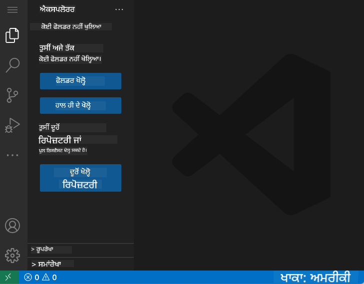

<!--
CO_OP_TRANSLATOR_METADATA:
{
  "original_hash": "cfd4a15974168ca426d50c67682ab9d4",
  "translation_date": "2025-10-22T17:26:59+00:00",
  "source_file": "8-code-editor/1-using-a-code-editor/README.md",
  "language_code": "pa"
}
-->
# ਕੋਡ ਐਡੀਟਰ ਦੀ ਵਰਤੋਂ: VSCode.dev ਵਿੱਚ ਮਾਹਰ ਬਣਨਾ

*ਦ ਮੈਟ੍ਰਿਕਸ* ਵਿੱਚ ਯਾਦ ਹੈ ਜਦੋਂ ਨਿਓ ਨੂੰ ਡਿਜੀਟਲ ਦੁਨੀਆ ਤੱਕ ਪਹੁੰਚ ਕਰਨ ਲਈ ਇੱਕ ਵੱਡੇ ਕੰਪਿਊਟਰ ਟਰਮੀਨਲ ਨਾਲ ਜੁੜਨਾ ਪਿਆ ਸੀ? ਅੱਜ ਦੇ ਵੈੱਬ ਡਿਵੈਲਪਮੈਂਟ ਟੂਲ ਇਸ ਦੇ ਬਿਲਕੁਲ ਉਲਟ ਹਨ - ਬੇਹੱਦ ਸ਼ਕਤੀਸ਼ਾਲੀ ਸਮਰੱਥਾਵਾਂ ਜੋ ਕਿਤੇ ਵੀ ਪਹੁੰਚਯੋਗ ਹਨ। VSCode.dev ਇੱਕ ਬ੍ਰਾਊਜ਼ਰ-ਅਧਾਰਤ ਕੋਡ ਐਡੀਟਰ ਹੈ ਜੋ ਕਿਸੇ ਵੀ ਇੰਟਰਨੈਟ ਕਨੈਕਸ਼ਨ ਵਾਲੇ ਡਿਵਾਈਸ 'ਤੇ ਪੇਸ਼ੇਵਰ ਵਿਕਾਸ ਟੂਲ ਲਿਆਉਂਦਾ ਹੈ।

ਜਿਵੇਂ ਪ੍ਰਿੰਟਿੰਗ ਪ੍ਰੈਸ ਨੇ ਕਿਤਾਬਾਂ ਨੂੰ ਹਰ ਕਿਸੇ ਲਈ ਪਹੁੰਚਯੋਗ ਬਣਾਇਆ, ਸਿਰਫ ਮਠਾਂ ਵਿੱਚ ਲੇਖਕਾਂ ਲਈ ਨਹੀਂ, VSCode.dev ਕੋਡਿੰਗ ਨੂੰ ਲੋਕਤੰਤਰਕਰਣ ਕਰਦਾ ਹੈ। ਤੁਸੀਂ ਲਾਇਬ੍ਰੇਰੀ ਕੰਪਿਊਟਰ, ਸਕੂਲ ਲੈਬ ਜਾਂ ਜਿੱਥੇ ਵੀ ਤੁਹਾਡੇ ਕੋਲ ਬ੍ਰਾਊਜ਼ਰ ਪਹੁੰਚ ਹੈ, ਉੱਥੇ ਪ੍ਰੋਜੈਕਟਾਂ 'ਤੇ ਕੰਮ ਕਰ ਸਕਦੇ ਹੋ। ਕੋਈ ਇੰਸਟਾਲੇਸ਼ਨ ਨਹੀਂ, ਕੋਈ "ਮੈਨੂੰ ਮੇਰੀ ਖਾਸ ਸੈਟਅੱਪ ਦੀ ਲੋੜ ਹੈ" ਦੀ ਪਾਬੰਦੀ ਨਹੀਂ।

ਇਸ ਪਾਠ ਦੇ ਅੰਤ ਤੱਕ, ਤੁਸੀਂ ਸਮਝ ਜਾਵੋਗੇ ਕਿ VSCode.dev ਨੂੰ ਕਿਵੇਂ ਨੈਵੀਗੇਟ ਕਰਨਾ ਹੈ, ਆਪਣੇ ਬ੍ਰਾਊਜ਼ਰ ਵਿੱਚ ਸਿੱਧੇ GitHub ਰਿਪੋਜ਼ਿਟਰੀਜ਼ ਖੋਲ੍ਹਣੀ ਹੈ, ਅਤੇ ਵਰਜਨ ਕੰਟਰੋਲ ਲਈ Git ਦੀ ਵਰਤੋਂ ਕਰਨੀ ਹੈ - ਇਹ ਸਾਰੀਆਂ ਹੁਨਰਾਂ ਜੋ ਪੇਸ਼ੇਵਰ ਡਿਵੈਲਪਰ ਰੋਜ਼ਾਨਾ ਵਰਤਦੇ ਹਨ।

## ਤੁਸੀਂ ਕੀ ਸਿੱਖੋਗੇ

ਜਦੋਂ ਅਸੀਂ ਇਸ ਨੂੰ ਇਕੱਠੇ ਕਰਾਂਗੇ, ਤੁਸੀਂ ਇਹ ਕਰਨ ਦੇ ਯੋਗ ਹੋਵੋਗੇ:

- VSCode.dev ਨੂੰ ਇਸ ਤਰ੍ਹਾਂ ਨੈਵੀਗੇਟ ਕਰੋ ਕਿ ਇਹ ਤੁਹਾਡਾ ਦੂਜਾ ਘਰ ਬਣ ਜਾਵੇ - ਬਿਨਾਂ ਖੋ ਜਾਣ ਦੇ ਤੁਹਾਨੂੰ ਜੋ ਕੁਝ ਚਾਹੀਦਾ ਹੈ ਉਹ ਲੱਭੋ
- ਆਪਣੇ ਬ੍ਰਾਊਜ਼ਰ ਵਿੱਚ ਕੋਈ ਵੀ GitHub ਰਿਪੋਜ਼ਿਟਰੀ ਖੋਲ੍ਹੋ ਅਤੇ ਤੁਰੰਤ ਸੋਧ ਕਰਨਾ ਸ਼ੁਰੂ ਕਰੋ (ਇਹ ਬਹੁਤ ਜਾਦੂਈ ਹੈ!)
- Git ਦੀ ਵਰਤੋਂ ਕਰਕੇ ਆਪਣੇ ਬਦਲਾਅ ਨੂੰ ਟ੍ਰੈਕ ਕਰੋ ਅਤੇ ਪੇਸ਼ੇਵਰ ਦੀ ਤਰ੍ਹਾਂ ਆਪਣੀ ਤਰੱਕੀ ਨੂੰ ਸੇਵ ਕਰੋ
- ਐਕਸਟੈਂਸ਼ਨ ਨਾਲ ਆਪਣੇ ਐਡੀਟਰ ਨੂੰ ਸੁਪਰਚਾਰਜ ਕਰੋ ਜੋ ਕੋਡਿੰਗ ਨੂੰ ਤੇਜ਼ ਅਤੇ ਮਜ਼ੇਦਾਰ ਬਣਾਉਂਦੇ ਹਨ
- ਪ੍ਰੋਜੈਕਟ ਫਾਈਲਾਂ ਨੂੰ ਭਰੋਸੇ ਨਾਲ ਬਣਾਓ ਅਤੇ ਸੰਗਠਿਤ ਕਰੋ

## ਤੁਹਾਨੂੰ ਕੀ ਚਾਹੀਦਾ ਹੈ

ਜਰੂਰਤਾਂ ਸਿੱਧੀਆਂ ਹਨ:

- ਇੱਕ ਮੁਫ਼ਤ [GitHub ਖਾਤਾ](https://github.com) (ਜੇ ਲੋੜ ਹੋਵੇ ਤਾਂ ਅਸੀਂ ਤੁਹਾਨੂੰ ਬਣਾਉਣ ਵਿੱਚ ਮਦਦ ਕਰਾਂਗੇ)
- ਵੈੱਬ ਬ੍ਰਾਊਜ਼ਰਾਂ ਨਾਲ ਬੁਨਿਆਦੀ ਜਾਣਕਾਰੀ
- GitHub Basics ਪਾਠ ਮਦਦਗਾਰ ਪਿਛੋਕੜ ਪ੍ਰਦਾਨ ਕਰਦਾ ਹੈ, ਹਾਲਾਂਕਿ ਇਹ ਜ਼ਰੂਰੀ ਨਹੀਂ ਹੈ

> 💡 **GitHub ਵਿੱਚ ਨਵੇਂ ਹੋ?** ਖਾਤਾ ਬਣਾਉਣਾ ਮੁਫ਼ਤ ਹੈ ਅਤੇ ਕੁਝ ਮਿੰਟ ਲੈਂਦਾ ਹੈ। ਜਿਵੇਂ ਕਿ ਇੱਕ ਲਾਇਬ੍ਰੇਰੀ ਕਾਰਡ ਤੁਹਾਨੂੰ ਦੁਨੀਆ ਭਰ ਵਿੱਚ ਕਿਤਾਬਾਂ ਤੱਕ ਪਹੁੰਚ ਦਿੰਦਾ ਹੈ, ਇੱਕ GitHub ਖਾਤਾ ਤੁਹਾਨੂੰ ਇੰਟਰਨੈਟ 'ਤੇ ਕੋਡ ਰਿਪੋਜ਼ਿਟਰੀਜ਼ ਤੱਕ ਪਹੁੰਚ ਦਿੰਦਾ ਹੈ।

## ਵੈੱਬ-ਅਧਾਰਤ ਕੋਡ ਐਡੀਟਰ ਕਿਉਂ ਮਹੱਤਵਪੂਰਨ ਹਨ

ਇੰਟਰਨੈਟ ਤੋਂ ਪਹਿਲਾਂ, ਵੱਖ-ਵੱਖ ਯੂਨੀਵਰਸਿਟੀਆਂ ਦੇ ਵਿਗਿਆਨੀ ਆਸਾਨੀ ਨਾਲ ਖੋਜ ਸਾਂਝੀ ਨਹੀਂ ਕਰ ਸਕਦੇ ਸਨ। ਫਿਰ 1960 ਦੇ ਦਹਾਕੇ ਵਿੱਚ ARPANET ਆਇਆ, ਜੋ ਦੂਰੀਆਂ ਵਿੱਚ ਕੰਪਿਊਟਰਾਂ ਨੂੰ ਜੋੜਦਾ ਹੈ। ਵੈੱਬ-ਅਧਾਰਤ ਕੋਡ ਐਡੀਟਰ ਇਸੇ ਸਿਧਾਂਤ ਦੀ ਪਾਲਣਾ ਕਰਦੇ ਹਨ - ਸ਼ਕਤੀਸ਼ਾਲੀ ਟੂਲਾਂ ਨੂੰ ਪਹੁੰਚਯੋਗ ਬਣਾਉਣਾ ਚਾਹੇ ਤੁਹਾਡੀ ਭੌਤਿਕ ਸਥਿਤੀ ਜਾਂ ਡਿਵਾਈਸ ਕੋਈ ਵੀ ਹੋਵੇ।

ਕੋਡ ਐਡੀਟਰ ਤੁਹਾਡੇ ਵਿਕਾਸ ਕਾਰਜਸਥਾਨ ਵਜੋਂ ਕੰਮ ਕਰਦਾ ਹੈ, ਜਿੱਥੇ ਤੁਸੀਂ ਕੋਡ ਫਾਈਲਾਂ ਲਿਖਦੇ ਹੋ, ਸੋਧਦੇ ਹੋ ਅਤੇ ਸੰਗਠਿਤ ਕਰਦੇ ਹੋ। ਸਧਾਰਨ ਟੈਕਸਟ ਐਡੀਟਰਾਂ ਦੇ ਵਿਰੁੱਧ, ਪੇਸ਼ੇਵਰ ਕੋਡ ਐਡੀਟਰ ਸਿੰਟੈਕਸ ਹਾਈਲਾਈਟਿੰਗ, ਗਲਤੀ ਪਛਾਣ ਅਤੇ ਪ੍ਰੋਜੈਕਟ ਮੈਨੇਜਮੈਂਟ ਫੀਚਰ ਪ੍ਰਦਾਨ ਕਰਦੇ ਹਨ।

VSCode.dev ਇਹ ਸਮਰੱਥਾਵਾਂ ਤੁਹਾਡੇ ਬ੍ਰਾਊਜ਼ਰ ਵਿੱਚ ਲਿਆਉਂਦਾ ਹੈ:

**ਵੈੱਬ-ਅਧਾਰਤ ਸੋਧ ਦੇ ਫਾਇਦੇ:**

| ਫੀਚਰ | ਵੇਰਵਾ | ਪ੍ਰਯੋਗਤਮ ਲਾਭ |
|---------|-------------|----------|
| **ਪਲੇਟਫਾਰਮ ਅਜ਼ਾਦੀ** | ਕਿਸੇ ਵੀ ਡਿਵਾਈਸ 'ਤੇ ਬ੍ਰਾਊਜ਼ਰ ਨਾਲ ਚੱਲਦਾ ਹੈ | ਵੱਖ-ਵੱਖ ਕੰਪਿਊਟਰਾਂ ਤੋਂ ਬਿਨਾਂ ਰੁਕਾਵਟ ਕੰਮ ਕਰੋ |
| **ਕੋਈ ਇੰਸਟਾਲੇਸ਼ਨ ਦੀ ਲੋੜ ਨਹੀਂ** | ਵੈੱਬ URL ਰਾਹੀਂ ਪਹੁੰਚ | ਸੌਫਟਵੇਅਰ ਇੰਸਟਾਲੇਸ਼ਨ ਪਾਬੰਦੀਆਂ ਨੂੰ ਪਾਰ ਕਰੋ |
| **ਆਟੋਮੈਟਿਕ ਅੱਪਡੇਟਸ** | ਹਮੇਸ਼ਾ ਨਵੀਂ ਵਰਜਨ ਚੱਲਦੀ ਹੈ | ਮੈਨੂਅਲ ਅੱਪਡੇਟਾਂ ਤੋਂ ਬਿਨਾਂ ਨਵੇਂ ਫੀਚਰਾਂ ਤੱਕ ਪਹੁੰਚ |
| **ਰਿਪੋਜ਼ਿਟਰੀ ਇੰਟੀਗ੍ਰੇਸ਼ਨ** | GitHub ਨਾਲ ਸਿੱਧੀ ਕਨੈਕਸ਼ਨ | ਸਥਾਨਕ ਫਾਈਲ ਮੈਨੇਜਮੈਂਟ ਤੋਂ ਬਿਨਾਂ ਕੋਡ ਸੋਧੋ |

**ਪ੍ਰਯੋਗਤਮ ਪ੍ਰਭਾਵ:**
- ਵੱਖ-ਵੱਖ ਵਾਤਾਵਰਣਾਂ ਵਿੱਚ ਕੰਮ ਦੀ ਲਗਾਤਾਰਤਾ
- ਓਪਰੇਟਿੰਗ ਸਿਸਟਮ ਤੋਂ ਬਿਨਾਂ ਸਥਿਰ ਇੰਟਰਫੇਸ
- ਤੁਰੰਤ ਸਹਿਯੋਗ ਸਮਰੱਥਾਵਾਂ
- ਘਟਾਈ ਸਥਾਨਕ ਸਟੋਰੇਜ ਦੀ ਲੋੜ

## VSCode.dev ਦੀ ਖੋਜ ਕਰਨਾ

ਜਿਵੇਂ ਮੈਰੀ ਕਿਊਰੀ ਦੀ ਲੈਬੋਰੇਟਰੀ ਵਿੱਚ ਇੱਕ ਸਧਾਰਨ ਸਥਾਨ ਵਿੱਚ ਸੁਧਰੇ ਹੋਏ ਉਪਕਰਣ ਸਨ, VSCode.dev ਪੇਸ਼ੇਵਰ ਵਿਕਾਸ ਟੂਲਾਂ ਨੂੰ ਇੱਕ ਬ੍ਰਾਊਜ਼ਰ ਇੰਟਰਫੇਸ ਵਿੱਚ ਪੇਸ਼ ਕਰਦਾ ਹੈ। ਇਹ ਵੈੱਬ ਐਪਲੀਕੇਸ਼ਨ ਡੈਸਕਟਾਪ ਕੋਡ ਐਡੀਟਰਾਂ ਦੇ ਸਮੇਤ ਮੁੱਖ ਫੰਕਸ਼ਨਲਿਟੀ ਪ੍ਰਦਾਨ ਕਰਦਾ ਹੈ।

[VSCode.dev](https://vscode.dev) ਵਿੱਚ ਆਪਣੇ ਬ੍ਰਾਊਜ਼ਰ ਵਿੱਚ ਨੈਵੀਗੇਟ ਕਰਕੇ ਸ਼ੁਰੂ ਕਰੋ। ਇੰਟਰਫੇਸ ਡਾਊਨਲੋਡ ਜਾਂ ਸਿਸਟਮ ਇੰਸਟਾਲੇਸ਼ਨ ਤੋਂ ਬਿਨਾਂ ਲੋਡ ਹੁੰਦਾ ਹੈ - ਕਲਾਉਡ ਕੰਪਿਊਟਿੰਗ ਸਿਧਾਂਤਾਂ ਦੀ ਸਿੱਧੀ ਅਰਜ਼ੀ।

### ਆਪਣੇ GitHub ਖਾਤੇ ਨੂੰ ਕਨੈਕਟ ਕਰਨਾ

ਜਿਵੇਂ ਅਲੈਕਜ਼ੈਂਡਰ ਗ੍ਰਾਹਮ ਬੈੱਲ ਦਾ ਟੈਲੀਫੋਨ ਦੂਰੀ ਸਥਾਨਾਂ ਨੂੰ ਜੋੜਦਾ ਹੈ, ਤੁਹਾਡੇ GitHub ਖਾਤੇ ਨੂੰ ਜੋੜਨਾ VSCode.dev ਨੂੰ ਤੁਹਾਡੇ ਕੋਡ ਰਿਪੋਜ਼ਿਟਰੀਜ਼ ਨਾਲ ਜੋੜਦਾ ਹੈ। ਜਦੋਂ GitHub ਨਾਲ ਸਾਈਨ ਇਨ ਕਰਨ ਲਈ ਕਿਹਾ ਜਾਂਦਾ ਹੈ, ਇਸ ਕਨੈਕਸ਼ਨ ਨੂੰ ਸਵੀਕਾਰ ਕਰਨਾ ਸਿਫਾਰਸ਼ੀ ਹੈ।

**GitHub ਇੰਟੀਗ੍ਰੇਸ਼ਨ ਪ੍ਰਦਾਨ ਕਰਦਾ ਹੈ:**
- ਐਡੀਟਰ ਵਿੱਚ ਤੁਹਾਡੇ ਰਿਪੋਜ਼ਿਟਰੀਜ਼ ਤੱਕ ਸਿੱਧੀ ਪਹੁੰਚ
- ਵੱਖ-ਵੱਖ ਡਿਵਾਈਸਾਂ ਵਿੱਚ ਸਿੰਕ੍ਰੋਨਾਈਜ਼ਡ ਸੈਟਿੰਗਾਂ ਅਤੇ ਐਕਸਟੈਂਸ਼ਨ
- GitHub ਤੱਕ ਸੇਵ ਕਰਨ ਦਾ ਸਧਾਰਨ ਵਰਕਫਲੋ
- ਨਿੱਜੀਕਰਤ ਵਿਕਾਸ ਵਾਤਾਵਰਣ

### ਆਪਣੇ ਨਵੇਂ ਵਰਕਸਪੇਸ ਨੂੰ ਜਾਣਨਾ

ਜਦੋਂ ਸਭ ਕੁਝ ਲੋਡ ਹੋ ਜਾਂਦਾ ਹੈ, ਤੁਸੀਂ ਇੱਕ ਸੁੰਦਰ ਤੌਰ 'ਤੇ ਸਾਫ ਵਰਕਸਪੇਸ ਦੇਖੋਗੇ ਜੋ ਤੁਹਾਨੂੰ ਇਸ ਗੱਲ 'ਤੇ ਧਿਆਨ ਕੇਂਦਰਿਤ ਰੱਖਣ ਲਈ ਡਿਜ਼ਾਈਨ ਕੀਤਾ ਗਿਆ ਹੈ - ਤੁਹਾਡਾ ਕੋਡ!

**ਇਹ ਰਿਹਾਇਸ਼ ਦਾ ਦੌਰਾ ਹੈ:**
- **ਐਕਟਿਵਿਟੀ ਬਾਰ** (ਖੱਬੇ ਪਾਸੇ ਵਾਲੀ ਸਟ੍ਰਿਪ): ਤੁਹਾਡੀ ਮੁੱਖ ਨੈਵੀਗੇਸ਼ਨ ਜਿਸ ਵਿੱਚ ਐਕਸਪਲੋਰਰ 📁, ਖੋਜ 🔍, ਸੋਰਸ ਕੰਟਰੋਲ 🌿, ਐਕਸਟੈਂਸ਼ਨ 🧩, ਅਤੇ ਸੈਟਿੰਗ ⚙️ ਸ਼ਾਮਲ ਹਨ
- **ਸਾਈਡਬਾਰ** (ਇਸਦੇ ਨਾਲ ਵਾਲਾ ਪੈਨਲ): ਤੁਹਾਡੇ ਦੁਆਰਾ ਚੁਣੇ ਗਏ ਅਨੁਸਾਰ ਸਬੰਧਤ ਜਾਣਕਾਰੀ ਦਿਖਾਉਣ ਲਈ ਬਦਲ ਜਾਂਦਾ ਹੈ
- **ਐਡੀਟਰ ਖੇਤਰ** (ਵੱਡਾ ਸਪੇਸ ਵਿਚਕਾਰ): ਇਹ ਜਿੱਥੇ ਜਾਦੂ ਹੁੰਦਾ ਹੈ - ਤੁਹਾਡਾ ਮੁੱਖ ਕੋਡਿੰਗ ਖੇਤਰ

**ਇਸਨੂੰ ਖੋਜਣ ਲਈ ਸਮਾਂ ਲਓ:**
- ਉਹਨਾਂ ਐਕਟਿਵਿਟੀ ਬਾਰ ਆਈਕਾਨਾਂ 'ਤੇ ਕਲਿਕ ਕਰੋ ਅਤੇ ਦੇਖੋ ਕਿ ਹਰ ਇੱਕ ਕੀ ਕਰਦਾ ਹੈ
- ਧਿਆਨ ਦਿਓ ਕਿ ਸਾਈਡਬਾਰ ਕਿਵੇਂ ਵੱਖ-ਵੱਖ ਜਾਣਕਾਰੀ ਦਿਖਾਉਣ ਲਈ ਅੱਪਡੇਟ ਹੁੰਦੀ ਹੈ - ਬਹੁਤ ਵਧੀਆ, ਹੈ ਨਾ?
- ਐਕਸਪਲੋਰਰ ਦ੍ਰਿਸ਼ (📁) ਸ਼ਾਇਦ ਜਿੱਥੇ ਤੁਸੀਂ ਜ਼ਿਆਦਾਤਰ ਸਮਾਂ ਬਿਤਾਉਂਦੇ ਹੋ, ਇਸ ਲਈ ਇਸ ਨਾਲ ਆਰਾਮਦਾਇਕ ਹੋ ਜਾਓ

## GitHub ਰਿਪੋਜ਼ਿਟਰੀਜ਼ ਖੋਲ੍ਹਣਾ

ਇੰਟਰਨੈਟ ਤੋਂ ਪਹਿਲਾਂ, ਖੋਜਕਰਤਾ ਦਸਤਾਵੇਜ਼ਾਂ ਤੱਕ ਪਹੁੰਚ ਕਰਨ ਲਈ ਲਾਇਬ੍ਰੇਰੀਆਂ ਵਿੱਚ ਭੌਤਿਕ ਤੌਰ 'ਤੇ ਜਾਣ ਲਈ ਮਜਬੂਰ ਸਨ। GitHub ਰਿਪੋਜ਼ਿਟਰੀਜ਼ ਇਸੇ ਤਰ੍ਹਾਂ ਕੰਮ ਕਰਦੇ ਹਨ - ਇਹ ਦੂਰ ਸਥਿਤ ਕੋਡ ਦੇ ਸੰਗ੍ਰਹਿ ਹਨ। VSCode.dev ਰਿਪੋਜ਼ਿਟਰੀਜ਼ ਨੂੰ ਤੁਹਾਡੇ ਸਥਾਨਕ ਕੰਪਿਊਟਰ 'ਤੇ ਡਾਊਨਲੋਡ ਕਰਨ ਤੋਂ ਪਹਿਲਾਂ ਸੋਧ ਕਰਨ ਦੀ ਰਵਾਇਤੀ ਕਦਮ ਨੂੰ ਖਤਮ ਕਰਦਾ ਹੈ।

ਇਹ ਸਮਰੱਥਾ ਕਿਸੇ ਵੀ ਜਨਤਕ ਰਿਪੋਜ਼ਿਟਰੀ ਤੱਕ ਤੁਰੰਤ ਪਹੁੰਚ ਦੀ ਸਹੂਲਤ ਦਿੰਦੀ ਹੈ ਤਾਂ ਜੋ ਵੇਖਣ, ਸੋਧਣ ਜਾਂ ਯੋਗਦਾਨ ਦੇ ਸਕੇ। ਇੱਥੇ ਦੋ ਤਰੀਕੇ ਹਨ ਰਿਪੋਜ਼ਿਟਰੀਜ਼ ਖੋਲ੍ਹਣ ਦੇ:

### ਤਰੀਕਾ 1: ਪੌਇੰਟ-ਐਂਡ-ਕਲਿਕ ਤਰੀਕਾ

ਇਹ ਉਸ ਸਮੇਂ ਲਈ ਬਹੁਤ ਵਧੀਆ ਹੈ ਜਦੋਂ ਤੁਸੀਂ VSCode.dev ਵਿੱਚ ਨਵਾਂ ਸ਼ੁਰੂ ਕਰ ਰਹੇ ਹੋ ਅਤੇ ਇੱਕ ਖਾਸ ਰਿਪੋਜ਼ਿਟਰੀ ਖੋਲ੍ਹਣਾ ਚਾਹੁੰਦੇ ਹੋ। ਇਹ ਸਿੱਧਾ ਅਤੇ ਸ਼ੁਰੂਆਤੀ-ਦੋਸਤਾਨਾ ਹੈ:

**ਇਹ ਕਿਵੇਂ ਕਰਨਾ ਹੈ:**

1. [vscode.dev](https://vscode.dev) 'ਤੇ ਜਾਓ ਜੇ ਤੁਸੀਂ ਪਹਿਲਾਂ ਹੀ ਉੱਥੇ ਨਹੀਂ ਹੋ
2. ਵੈਲਕਮ ਸਕ੍ਰੀਨ 'ਤੇ "Open Remote Repository" ਬਟਨ ਲੱਭੋ ਅਤੇ ਇਸ 'ਤੇ ਕਲਿਕ ਕਰੋ

   

3. ਕਿਸੇ ਵੀ GitHub ਰਿਪੋਜ਼ਿਟਰੀ URL ਨੂੰ ਪੇਸਟ ਕਰੋ (ਇਹ ਕੋਸ਼ਿਸ਼ ਕਰੋ: `https://github.com/microsoft/Web-Dev-For-Beginners`)
4. Enter ਦਬਾਓ ਅਤੇ ਜਾਦੂ ਦੇਖੋ!

**ਪ੍ਰੋ ਟਿਪ - ਕਮਾਂਡ ਪੈਲੇਟ ਸ਼ਾਰਟਕੱਟ:**

ਕੀ ਤੁਸੀਂ ਆਪਣੇ ਆਪ ਨੂੰ ਕੋਡਿੰਗ ਜਾਦੂਗਰ ਵਾਂਗ ਮਹਿਸੂਸ ਕਰਨਾ ਚਾਹੁੰਦੇ ਹੋ? ਇਹ ਕੀਬੋਰਡ ਸ਼ਾਰਟਕੱਟ ਕੋਸ਼ਿਸ਼ ਕਰੋ: Ctrl+Shift+P (ਜਾਂ Mac 'ਤੇ Cmd+Shift+P) ਕਮਾਂਡ ਪੈਲੇਟ ਖੋਲ੍ਹਣ ਲਈ:

**ਕਮਾਂਡ ਪੈਲੇਟ ਇਸ ਤਰ੍ਹਾਂ ਹੈ ਜਿਵੇਂ ਤੁਸੀਂ ਜੋ ਕੁਝ ਕਰ ਸਕਦੇ ਹੋ ਉਸ ਲਈ ਇੱਕ ਖੋਜ ਇੰਜਣ ਹੈ:**
- "open remote" ਟਾਈਪ ਕਰੋ ਅਤੇ ਇਹ ਤੁਹਾਡੇ ਲਈ ਰਿਪੋਜ਼ਿਟਰੀ ਓਪਨਰ ਲੱਭੇਗਾ
- ਇਹ ਉਹ ਰਿਪੋਜ਼ਿਟਰੀਜ਼ ਯਾਦ ਰੱਖਦਾ ਹੈ ਜੋ ਤੁਸੀਂ ਹਾਲ ਹੀ ਵਿੱਚ ਖੋਲ੍ਹੇ ਹਨ (ਬਹੁਤ ਹੀ ਸਹੂਲਤਦਾਇਕ!)
- ਜਦੋਂ ਤੁਸੀਂ ਇਸਨੂੰ ਵਰਤਣ ਦੀ ਆਦਤ ਪਾ ਲੈਂਦੇ ਹੋ, ਤਾਂ ਤੁਸੀਂ ਆਪਣੇ ਆਪ ਨੂੰ ਬਿਜਲੀ ਦੀ ਗਤੀ ਨਾਲ ਕੋਡਿੰਗ ਕਰਦੇ ਹੋਏ ਮਹਿਸੂਸ ਕਰੋਗੇ
- ਇਹ ਅਸਲ ਵਿੱਚ VSCode.dev ਦਾ "ਹੇ ਸਿਰੀ, ਪਰ ਕੋਡਿੰਗ ਲਈ" ਵਰਜਨ ਹੈ

### ਤਰੀਕਾ 2: URL ਮੋਡੀਫਿਕੇਸ਼ਨ ਤਕਨੀਕ

ਜਿਵੇਂ HTTP ਅਤੇ HTTPS ਵੱਖ-ਵੱਖ ਪ੍ਰੋਟੋਕੋਲਾਂ ਦੀ ਵਰਤੋਂ ਕਰਦੇ ਹਨ ਜਦੋਂ ਕਿ ਉਹੀ ਡੋਮੇਨ ਸਟ੍ਰਕਚਰ ਨੂੰ ਬਰਕਰਾਰ ਰੱਖਦੇ ਹਨ, VSCode.dev ਇੱਕ URL ਪੈਟਰਨ ਦੀ ਵਰਤੋਂ ਕਰਦਾ ਹੈ ਜੋ GitHub ਦੇ ਪਤੇ ਦੇ ਸਿਸਟਮ ਨੂੰ ਦਰਸਾਉਂਦਾ ਹੈ। ਕੋਈ ਵੀ GitHub ਰਿਪੋਜ਼ਿਟਰੀ URL ਨੂੰ VSCode.dev ਵਿੱਚ ਸਿੱਧੇ ਖੋਲ੍ਹਣ ਲਈ ਬਦਲਿਆ ਜਾ ਸਕਦਾ ਹੈ।

**URL ਤਬਦੀਲੀ ਪੈਟਰਨ:**

| ਰਿਪੋਜ਼ਿਟਰੀ ਕਿਸਮ | GitHub URL | VSCode.dev URL |
|----------------|---------------------|----------------|
| **ਜਨਤਕ ਰਿਪੋਜ਼ਿਟਰੀ** | `github.com/microsoft/Web-Dev-For-Beginners` | `vscode.dev/github/microsoft/Web-Dev-For-Beginners` |
| **ਨਿੱਜੀ ਪ੍ਰੋਜੈਕਟ** | `github.com/your-username/my-project` | `vscode.dev/github/your-username/my-project` |
| **ਕੋਈ ਵੀ ਪਹੁੰਚਯੋਗ ਰਿਪੋ** | `github.com/their-username/awesome-repo` | `vscode.dev/github/their-username/awesome-repo` |

**ਲਾਗੂ ਕਰਨਾ:**
- `github.com` ਨੂੰ `vscode.dev/github` ਨਾਲ ਬਦਲੋ
- ਸਾਰੇ ਹੋਰ URL ਘਟਕਾਂ ਨੂੰ ਬਦਲੋ ਨਾ
- ਕਿਸੇ ਵੀ ਜਨਤਕ ਪਹੁੰਚਯੋਗ ਰਿਪੋਜ਼ਿਟਰੀ ਨਾਲ ਕੰਮ ਕਰਦਾ ਹੈ
- ਤੁਰੰਤ ਸੋਧ ਪਹੁੰਚ ਪ੍ਰਦਾਨ ਕਰਦਾ ਹੈ

> 💡 **ਜੀਵਨ ਬਦਲਣ ਵਾਲੀ ਟਿਪ**: ਆਪਣੇ ਮਨਪਸੰਦ ਰਿਪੋਜ਼ਿਟਰੀਜ਼ ਦੇ VSCode.dev ਵਰਜਨ ਨੂੰ ਬੁੱਕਮਾਰਕ ਕਰੋ। ਮੇਰੇ ਕੋਲ "Edit My Portfolio" ਅਤੇ "Fix Documentation" ਵਰਗੇ ਬੁੱਕਮਾਰਕ ਹਨ ਜੋ ਮੈਨੂੰ ਸਿੱਧੇ ਸੋਧ ਕਰਨ ਦੇ ਮੋਡ ਵਿੱਚ ਲੈ ਜਾਂਦੇ ਹਨ!

**ਤੁਸੀਂ ਕਿਹੜਾ ਤਰੀਕਾ ਵਰਤਣਾ ਚਾਹੁੰਦੇ ਹੋ?**
- **ਇੰਟਰਫੇਸ ਤਰੀਕਾ**: ਵਧੀਆ ਜਦੋਂ ਤੁਸੀਂ ਖੋਜ ਕਰ ਰਹੇ ਹੋ ਜਾਂ ਸਹੀ ਰਿਪੋਜ਼ਿਟਰੀ ਨਾਮ ਯਾਦ ਨਹੀਂ ਹੈ
- **URL ਚਾਲਾਕੀ**: ਜਦੋਂ ਤੁਸੀਂ ਬਿਲਕੁਲ ਜਾਣਦੇ ਹੋ ਕਿ ਤੁਸੀਂ ਕਿੱਥੇ ਜਾ ਰਹੇ ਹੋ, ਤਾਂ ਬਿਜਲੀ ਦੀ ਗਤੀ ਨਾਲ ਪਹੁੰਚ ਲਈ ਬਹੁਤ ਵਧੀਆ

## ਫਾਈਲਾਂ ਅਤੇ ਪ੍ਰੋਜੈਕਟਾਂ ਨਾਲ ਕੰਮ ਕਰਨਾ

ਹੁਣ ਜਦੋਂ ਤੁਸੀਂ ਇੱਕ ਰਿਪੋਜ਼ਿਟਰੀ ਖੋਲ੍ਹ ਲਈ ਹੈ, ਆਓ ਬਣਾਉਣਾ ਸ਼ੁਰੂ ਕਰੀਏ! VSCode.dev ਤੁਹਾਨੂੰ ਉਹ ਸਭ ਕੁਝ ਦਿੰਦਾ ਹੈ
- ਹਰ ਐਕਸਟੈਂਸ਼ਨ ਰੇਟਿੰਗ, ਡਾਊਨਲੋਡ ਗਿਣਤੀ, ਅਤੇ ਅਸਲ ਯੂਜ਼ਰ ਰਿਵਿਊਜ਼ ਦਿਖਾਉਂਦੀ ਹੈ
- ਤੁਹਾਨੂੰ ਸਕ੍ਰੀਨਸ਼ਾਟ ਅਤੇ ਸਪਸ਼ਟ ਵਰਣਨ ਮਿਲਦੇ ਹਨ ਕਿ ਹਰ ਇੱਕ ਕੀ ਕਰਦਾ ਹੈ
- ਸਭ ਕੁਝ ਸਪਸ਼ਟ ਤੌਰ 'ਤੇ ਅਨੁਕੂਲਤਾ ਜਾਣਕਾਰੀ ਨਾਲ ਚਿੰਨ੍ਹਿਤ ਹੈ
- ਸਮਾਨ ਐਕਸਟੈਂਸ਼ਨ ਸੁਝਾਏ ਜਾਂਦੇ ਹਨ ਤਾਂ ਜੋ ਤੁਸੀਂ ਵਿਕਲਪਾਂ ਦੀ ਤੁਲਨਾ ਕਰ ਸਕੋ

### ਐਕਸਟੈਂਸ਼ਨ ਇੰਸਟਾਲ ਕਰਨਾ (ਇਹ ਬਹੁਤ ਆਸਾਨ ਹੈ!)

ਤੁਹਾਡੇ ਐਡੀਟਰ ਵਿੱਚ ਨਵੀਆਂ ਖੁਬੀਆਂ ਸ਼ਾਮਲ ਕਰਨਾ ਸਿਰਫ ਇੱਕ ਬਟਨ 'ਤੇ ਕਲਿਕ ਕਰਨ ਜਿਤਨਾ ਆਸਾਨ ਹੈ। ਐਕਸਟੈਂਸ਼ਨ ਸੈਕਿੰਡਾਂ ਵਿੱਚ ਇੰਸਟਾਲ ਹੁੰਦੇ ਹਨ ਅਤੇ ਤੁਰੰਤ ਕੰਮ ਕਰਨਾ ਸ਼ੁਰੂ ਕਰਦੇ ਹਨ – ਨਾ ਕੋਈ ਰੀਸਟਾਰਟ, ਨਾ ਕੋਈ ਉਡੀਕ।

**ਤੁਹਾਨੂੰ ਸਿਰਫ ਇਹ ਕਰਨਾ ਹੈ:**

1. ਜੋ ਤੁਸੀਂ ਚਾਹੁੰਦੇ ਹੋ ਉਸ ਦੀ ਖੋਜ ਕਰੋ (ਜਿਵੇਂ "live server" ਜਾਂ "prettier" ਖੋਜੋ)
2. ਜੋ ਚੰਗਾ ਲੱਗੇ ਉਸ 'ਤੇ ਕਲਿਕ ਕਰੋ ਤਾਂ ਜੋ ਹੋਰ ਵੇਰਵੇ ਦੇਖ ਸਕੋ
3. ਪੜ੍ਹੋ ਕਿ ਇਹ ਕੀ ਕਰਦਾ ਹੈ ਅਤੇ ਰੇਟਿੰਗ ਚੈੱਕ ਕਰੋ
4. ਉਸ ਨੀਲੇ "Install" ਬਟਨ 'ਤੇ ਕਲਿਕ ਕਰੋ ਅਤੇ ਤੁਸੀਂ ਤਿਆਰ ਹੋ!

**ਪਿੱਛੇ ਕੀ ਹੁੰਦਾ ਹੈ:**
- ਐਕਸਟੈਂਸ਼ਨ ਆਪਣੇ ਆਪ ਡਾਊਨਲੋਡ ਅਤੇ ਸੈਟਅਪ ਕਰ ਲੈਂਦਾ ਹੈ
- ਨਵੀਆਂ ਖੁਬੀਆਂ ਤੁਹਾਡੇ ਇੰਟਰਫੇਸ ਵਿੱਚ ਤੁਰੰਤ ਦਿਖਾਈ ਦਿੰਦੀ ਹਨ
- ਸਭ ਕੁਝ ਤੁਰੰਤ ਕੰਮ ਕਰਨਾ ਸ਼ੁਰੂ ਕਰਦਾ ਹੈ (ਵਾਕਈ, ਇਹ ਇੰਨਾ ਤੇਜ਼ ਹੈ!)
- ਜੇ ਤੁਸੀਂ ਸਾਈਨ-ਇਨ ਹੋ, ਤਾਂ ਐਕਸਟੈਂਸ਼ਨ ਤੁਹਾਡੇ ਸਾਰੇ ਡਿਵਾਈਸਾਂ 'ਤੇ ਸਿੰਕ ਕਰਦਾ ਹੈ

**ਕੁਝ ਐਕਸਟੈਂਸ਼ਨ ਜੋ ਮੈਂ ਸ਼ੁਰੂ ਕਰਨ ਲਈ ਸਿਫਾਰਸ਼ ਕਰਾਂਗਾ:**
- **Live Server**: ਜਦੋਂ ਤੁਸੀਂ ਕੋਡ ਕਰਦੇ ਹੋ ਤਾਂ ਆਪਣੀ ਵੈਬਸਾਈਟ ਨੂੰ ਰੀਅਲ-ਟਾਈਮ ਵਿੱਚ ਅਪਡੇਟ ਹੁੰਦਾ ਦੇਖੋ (ਇਹ ਜਾਦੂ ਵਰਗਾ ਹੈ!)
- **Prettier**: ਤੁਹਾਡੇ ਕੋਡ ਨੂੰ ਸਵੈਚਾਰ ਅਤੇ ਪੇਸ਼ੇਵਰ ਬਣਾਉਂਦਾ ਹੈ
- **Auto Rename Tag**: ਇੱਕ HTML ਟੈਗ ਬਦਲੋ ਅਤੇ ਇਸਦਾ ਸਾਥੀ ਵੀ ਅਪਡੇਟ ਹੁੰਦਾ ਹੈ
- **Bracket Pair Colorizer**: ਤੁਹਾਡੇ ਬ੍ਰੈਕਟ ਨੂੰ ਰੰਗ-ਕੋਡ ਕਰਦਾ ਹੈ ਤਾਂ ਜੋ ਤੁਸੀਂ ਕਦੇ ਗੁੰਮ ਨਾ ਹੋਵੋ
- **GitLens**: ਤੁਹਾਡੇ Git ਫੀਚਰਾਂ ਨੂੰ ਬਹੁਤ ਸਾਰੀਆਂ ਮਦਦਗਾਰ ਜਾਣਕਾਰੀਆਂ ਨਾਲ ਸੁਪਰਚਾਰਜ ਕਰਦਾ ਹੈ

### ਆਪਣੇ ਐਕਸਟੈਂਸ਼ਨ ਨੂੰ ਕਸਟਮਾਈਜ਼ ਕਰਨਾ

ਅਧਿਕਤਰ ਐਕਸਟੈਂਸ਼ਨ ਸੈਟਿੰਗਾਂ ਨਾਲ ਆਉਂਦੇ ਹਨ ਜਿਨ੍ਹਾਂ ਨੂੰ ਤੁਸੀਂ ਆਪਣੇ ਕੰਮ ਦੇ ਤਰੀਕੇ ਅਨੁਸਾਰ ਢਾਲ ਸਕਦੇ ਹੋ। ਇਸਨੂੰ ਕਾਰ ਵਿੱਚ ਸੀਟ ਅਤੇ ਸ਼ੀਸ਼ੇ ਢਾਲਣ ਵਰਗਾ ਸੋਚੋ – ਹਰ ਕਿਸੇ ਦੀਆਂ ਆਪਣੀਆਂ ਪਸੰਦਾਂ ਹੁੰਦੀਆਂ ਹਨ!

**ਐਕਸਟੈਂਸ਼ਨ ਸੈਟਿੰਗਾਂ ਢਾਲਣਾ:**

1. ਐਕਸਟੈਂਸ਼ਨ ਪੈਨਲ ਵਿੱਚ ਆਪਣੇ ਇੰਸਟਾਲ ਕੀਤੇ ਐਕਸਟੈਂਸ਼ਨ ਨੂੰ ਲੱਭੋ
2. ਇਸਦੇ ਨਾਮ ਦੇ ਨਾਲ ਛੋਟੇ ਗੀਅਰ ਆਈਕਨ (⚙️) ਨੂੰ ਲੱਭੋ ਅਤੇ ਇਸ 'ਤੇ ਕਲਿਕ ਕਰੋ
3. ਡ੍ਰਾਪਡਾਊਨ ਵਿੱਚੋਂ "Extension Settings" ਚੁਣੋ
4. ਚੀਜ਼ਾਂ ਨੂੰ ਢਾਲੋ ਜਦੋਂ ਤੱਕ ਇਹ ਤੁਹਾਡੇ ਕੰਮ ਦੇ ਤਰੀਕੇ ਲਈ ਸਹੀ ਮਹਿਸੂਸ ਨਾ ਕਰੇ

**ਆਮ ਚੀਜ਼ਾਂ ਜੋ ਤੁਸੀਂ ਢਾਲਣਾ ਚਾਹੋਗੇ:**
- ਤੁਹਾਡਾ ਕੋਡ ਕਿਵੇਂ ਫਾਰਮੈਟ ਕੀਤਾ ਜਾਂਦਾ ਹੈ (tabs vs spaces, line length, ਆਦਿ)
- ਕਿਹੜੇ ਕੀਬੋਰਡ ਸ਼ਾਰਟਕਟ ਵੱਖ-ਵੱਖ ਕਾਰਵਾਈਆਂ ਨੂੰ ਟ੍ਰਿਗਰ ਕਰਦੇ ਹਨ
- ਕਿਹੜੇ ਫਾਈਲ ਟਾਈਪਸ 'ਤੇ ਐਕਸਟੈਂਸ਼ਨ ਕੰਮ ਕਰਨਾ ਚਾਹੀਦਾ ਹੈ
- ਖਾਸ ਫੀਚਰਾਂ ਨੂੰ ਚਾਲੂ ਜਾਂ ਬੰਦ ਕਰਨਾ ਤਾਂ ਜੋ ਚੀਜ਼ਾਂ ਸਾਫ ਰਹਿਣ

### ਆਪਣੇ ਐਕਸਟੈਂਸ਼ਨ ਨੂੰ ਸੰਗਠਿਤ ਰੱਖਣਾ

ਜਿਵੇਂ ਤੁਸੀਂ ਹੋਰ ਸ਼ਾਨਦਾਰ ਐਕਸਟੈਂਸ਼ਨ ਲੱਭਦੇ ਹੋ, ਤੁਸੀਂ ਆਪਣੀ ਕਲੈਕਸ਼ਨ ਨੂੰ ਸਾਫ ਅਤੇ ਸੁਚਾਰੂ ਰੱਖਣਾ ਚਾਹੋਗੇ। VSCode.dev ਇਸਨੂੰ ਮੈਨੇਜ ਕਰਨਾ ਬਹੁਤ ਆਸਾਨ ਬਣਾਉਂਦਾ ਹੈ।

**ਤੁਹਾਡੇ ਐਕਸਟੈਂਸ਼ਨ ਮੈਨੇਜਮੈਂਟ ਵਿਕਲਪ:**

| ਤੁਸੀਂ ਕੀ ਕਰ ਸਕਦੇ ਹੋ | ਇਹ ਕਦੋਂ ਮਦਦਗਾਰ ਹੁੰਦਾ ਹੈ | ਪ੍ਰੋ ਟਿਪ |
|--------|---------|----------|
| **Disable** | ਜਾਂਚਣਾ ਕਿ ਕੀ ਕੋਈ ਐਕਸਟੈਂਸ਼ਨ ਸਮੱਸਿਆ ਪੈਦਾ ਕਰ ਰਿਹਾ ਹੈ | ਇਸਨੂੰ ਅਨਇੰਸਟਾਲ ਕਰਨ ਤੋਂ ਬਿਹਤਰ ਜੇ ਤੁਸੀਂ ਇਸਨੂੰ ਵਾਪਸ ਚਾਹ ਸਕਦੇ ਹੋ |
| **Uninstall** | ਉਹ ਐਕਸਟੈਂਸ਼ਨ ਪੂਰੀ ਤਰ੍ਹਾਂ ਹਟਾਉਣਾ ਜੋ ਤੁਹਾਨੂੰ ਲੋੜੀਂਦੇ ਨਹੀਂ | ਤੁਹਾਡੇ ਵਾਤਾਵਰਣ ਨੂੰ ਸਾਫ ਅਤੇ ਤੇਜ਼ ਰੱਖਦਾ ਹੈ |
| **Update** | ਨਵੀਆਂ ਖੁਬੀਆਂ ਅਤੇ ਬੱਗ ਫਿਕਸ ਪ੍ਰਾਪਤ ਕਰਨਾ | ਆਮ ਤੌਰ 'ਤੇ ਆਪਣੇ ਆਪ ਹੁੰਦਾ ਹੈ, ਪਰ ਚੈੱਕ ਕਰਨਾ ਵਧੀਆ ਹੈ |

**ਮੈਂ ਐਕਸਟੈਂਸ਼ਨ ਨੂੰ ਕਿਵੇਂ ਮੈਨੇਜ ਕਰਦਾ ਹਾਂ:**
- ਹਰ ਕੁਝ ਮਹੀਨੇ, ਮੈਂ ਜੋ ਇੰਸਟਾਲ ਕੀਤਾ ਹੈ ਉਸ ਦੀ ਸਮੀਖਿਆ ਕਰਦਾ ਹਾਂ ਅਤੇ ਜੋ ਮੈਂ ਵਰਤ ਨਹੀਂ ਰਿਹਾ ਉਸਨੂੰ ਹਟਾ ਦਿੰਦਾ ਹਾਂ
- ਮੈਂ ਐਕਸਟੈਂਸ਼ਨ ਨੂੰ ਅਪਡੇਟ ਰੱਖਦਾ ਹਾਂ ਤਾਂ ਜੋ ਮੈਨੂੰ ਨਵੀਆਂ ਸੁਧਾਰਾਂ ਅਤੇ ਸੁਰੱਖਿਆ ਫਿਕਸ ਮਿਲਣ
- ਜੇ ਕੁਝ ਹੌਲੀ ਲੱਗਦਾ ਹੈ, ਤਾਂ ਮੈਂ ਅਸਥਾਈ ਤੌਰ 'ਤੇ ਐਕਸਟੈਂਸ਼ਨ ਨੂੰ ਅਯੋਗ ਕਰਦਾ ਹਾਂ ਤਾਂ ਜੋ ਦੇਖ ਸਕਾਂ ਕਿ ਕੀ ਉਹਨਾਂ ਵਿੱਚੋਂ ਕੋਈ ਕਾਰਨ ਹੈ
- ਜਦੋਂ ਐਕਸਟੈਂਸ਼ਨ ਨੂੰ ਵੱਡੇ ਅਪਡੇਟ ਮਿਲਦੇ ਹਨ, ਮੈਂ ਅਪਡੇਟ ਨੋਟਸ ਪੜ੍ਹਦਾ ਹਾਂ – ਕਈ ਵਾਰ ਉਥੇ ਸ਼ਾਨਦਾਰ ਨਵੀਆਂ ਖੁਬੀਆਂ ਹੁੰਦੀਆਂ ਹਨ!

> ⚠️ **ਪਰਫਾਰਮੈਂਸ ਟਿਪ**: ਐਕਸਟੈਂਸ਼ਨ ਸ਼ਾਨਦਾਰ ਹਨ, ਪਰ ਬਹੁਤ ਜ਼ਿਆਦਾ ਹੋਣ ਨਾਲ ਚੀਜ਼ਾਂ ਹੌਲੀ ਹੋ ਸਕਦੀਆਂ ਹਨ। ਉਹਨਾਂ 'ਤੇ ਧਿਆਨ ਦਿਓ ਜੋ ਸੱਚਮੁੱਚ ਤੁਹਾਡੀ ਜ਼ਿੰਦਗੀ ਆਸਾਨ ਬਣਾਉਂਦੇ ਹਨ ਅਤੇ ਉਹਨਾਂ ਨੂੰ ਅਨਇੰਸਟਾਲ ਕਰਨ ਤੋਂ ਨਾ ਡਰੋ ਜੋ ਤੁਸੀਂ ਕਦੇ ਵਰਤਦੇ ਨਹੀਂ।

## GitHub Copilot Agent Challenge 🚀

ਜਿਵੇਂ NASA ਆਪਣੇ ਅੰਤਰਿਕਸ਼ ਮਿਸ਼ਨਾਂ ਲਈ ਸੰਰਚਿਤ ਤਰੀਕੇ ਦੀ ਵਰਤੋਂ ਕਰਦੀ ਹੈ, ਇਹ ਚੁਣੌਤੀ VSCode.dev ਦੇ ਹੁਨਰਾਂ ਨੂੰ ਪੂਰੇ ਵਰਕਫਲੋ ਸਿਨੇਰੀਓ ਵਿੱਚ ਲਾਗੂ ਕਰਨ ਦੀ ਮੰਗ ਕਰਦੀ ਹੈ।

**ਉਦੇਸ਼:** VSCode.dev ਨਾਲ ਪ੍ਰਵਾਨਿਤ ਵੈੱਬ ਡਿਵੈਲਪਮੈਂਟ ਵਰਕਫਲੋ ਸਥਾਪਿਤ ਕਰਕੇ ਪ੍ਰਵਾਨਿਤਤਾ ਦਿਖਾਓ।

**ਪ੍ਰੋਜੈਕਟ ਦੀਆਂ ਲੋੜਾਂ:** Agent mode ਦੀ ਮਦਦ ਨਾਲ, ਇਹ ਕੰਮ ਪੂਰੇ ਕਰੋ:
1. ਮੌਜੂਦਾ ਰਿਪੋਜ਼ਟਰੀ ਨੂੰ ਫੋਰਕ ਕਰੋ ਜਾਂ ਨਵਾਂ ਬਣਾਓ
2. HTML, CSS, ਅਤੇ JavaScript ਫਾਈਲਾਂ ਨਾਲ ਇੱਕ ਕਾਰਗਰ ਪ੍ਰੋਜੈਕਟ ਸਟ੍ਰਕਚਰ ਸਥਾਪਿਤ ਕਰੋ
3. ਤਿੰਨ ਡਿਵੈਲਪਮੈਂਟ-ਵਧਾਉਣ ਵਾਲੇ ਐਕਸਟੈਂਸ਼ਨ ਇੰਸਟਾਲ ਅਤੇ ਕਨਫਿਗਰ ਕਰੋ
4. ਵਰਜਨ ਕੰਟਰੋਲ ਦਾ ਅਭਿਆਸ ਕਰੋ ਜਿਵੇਂ ਕਿ ਵੇਰਵੇਵਾਲੇ commit messages
5. ਫੀਚਰ ਬ੍ਰਾਂਚ ਬਣਾਉਣ ਅਤੇ ਸੋਧ ਕਰਨ ਦਾ ਅਭਿਆਸ ਕਰੋ
6. README.md ਫਾਈਲ ਵਿੱਚ ਪ੍ਰਕਿਰਿਆ ਅਤੇ ਸਿੱਖਣਾਂ ਦਾ ਦਸਤਾਵੇਜ਼ ਬਣਾਓ

ਇਹ ਅਭਿਆਸ ਸਾਰੇ VSCode.dev ਸੰਕਲਪਾਂ ਨੂੰ ਇੱਕ ਵਿਹਾਰਕ ਵਰਕਫਲੋ ਵਿੱਚ ਇਕੱਠਾ ਕਰਦਾ ਹੈ ਜੋ ਭਵਿੱਖ ਦੇ ਡਿਵੈਲਪਮੈਂਟ ਪ੍ਰੋਜੈਕਟਾਂ 'ਤੇ ਲਾਗੂ ਕੀਤਾ ਜਾ ਸਕਦਾ ਹੈ।

[agent mode](https://code.visualstudio.com/blogs/2025/02/24/introducing-copilot-agent-mode) ਬਾਰੇ ਹੋਰ ਜਾਣੋ।

## ਅਸਾਈਨਮੈਂਟ

ਹੁਣ ਇਹ ਹੁਨਰਾਂ ਨੂੰ ਅਸਲ ਵਿੱਚ ਅਜ਼ਮਾਉਣ ਦਾ ਸਮਾਂ ਹੈ! ਮੇਰੇ ਕੋਲ ਇੱਕ ਹੈਂਡਸ-ਆਨ ਪ੍ਰੋਜੈਕਟ ਹੈ ਜੋ ਤੁਹਾਨੂੰ ਸਿਖਾਈ ਗਈਆਂ ਸਾਰੀਆਂ ਚੀਜ਼ਾਂ ਦਾ ਅਭਿਆਸ ਕਰਨ ਦੇਵੇਗਾ: [VSCode.dev ਦੀ ਵਰਤੋਂ ਕਰਕੇ ਇੱਕ ਰਿਜ਼ੂਮ ਵੈੱਬਸਾਈਟ ਬਣਾਓ](./assignment.md)

ਇਹ ਅਸਾਈਨਮੈਂਟ ਤੁਹਾਨੂੰ ਪੂਰੀ ਤਰ੍ਹਾਂ ਆਪਣੇ ਬ੍ਰਾਊਜ਼ਰ ਵਿੱਚ ਇੱਕ ਪੇਸ਼ੇਵਰ ਰਿਜ਼ੂਮ ਵੈੱਬਸਾਈਟ ਬਣਾਉਣ ਦਾ ਰਾਹ ਦਿਖਾਉਂਦੀ ਹੈ। ਤੁਸੀਂ ਜਿਹੜੀਆਂ ਵੀ VSCode.dev ਫੀਚਰਾਂ ਦੀ ਖੋਜ ਕੀਤੀ ਹੈ, ਉਹ ਸਾਰੀਆਂ ਵਰਤੋਂ ਵਿੱਚ ਲਿਆਉਗੇ, ਅਤੇ ਅੰਤ ਤੱਕ ਤੁਹਾਡੇ ਕੋਲ ਇੱਕ ਸ਼ਾਨਦਾਰ ਦਿਖਾਈ ਦੇਣ ਵਾਲੀ ਵੈੱਬਸਾਈਟ ਅਤੇ ਆਪਣੇ ਨਵੇਂ ਵਰਕਫਲੋ ਵਿੱਚ ਪੱਕਾ ਵਿਸ਼ਵਾਸ ਹੋਵੇਗਾ।

## ਹੋਰ ਖੋਜ ਕਰੋ ਅਤੇ ਆਪਣੇ ਹੁਨਰਾਂ ਨੂੰ ਵਧਾਓ

ਤੁਹਾਡੇ ਕੋਲ ਹੁਣ ਇੱਕ ਮਜ਼ਬੂਤ ਬੁਨਿਆਦ ਹੈ, ਪਰ ਖੋਜ ਕਰਨ ਲਈ ਹੋਰ ਬਹੁਤ ਕੁਝ ਸ਼ਾਨਦਾਰ ਚੀਜ਼ਾਂ ਹਨ! ਇੱਥੇ ਕੁਝ ਸਰੋਤ ਅਤੇ ਵਿਚਾਰ ਹਨ ਜੋ ਤੁਹਾਡੇ VSCode.dev ਹੁਨਰਾਂ ਨੂੰ ਅਗਲੇ ਪੱਧਰ 'ਤੇ ਲੈ ਜਾਣ ਲਈ ਹਨ:

**ਬੁੱਕਮਾਰਕ ਕਰਨ ਲਈ ਅਧਿਕਾਰਤ ਦਸਤਾਵੇਜ਼:**
- [VSCode Web Documentation](https://code.visualstudio.com/docs/editor/vscode-web?WT.mc_id=academic-0000-alfredodeza) – ਬ੍ਰਾਊਜ਼ਰ-ਅਧਾਰਿਤ ਐਡੀਟਿੰਗ ਲਈ ਪੂਰੀ ਗਾਈਡ
- [GitHub Codespaces](https://docs.github.com/en/codespaces) – ਜਦੋਂ ਤੁਸੀਂ ਕਲਾਉਡ ਵਿੱਚ ਹੋਰ ਸ਼ਕਤੀ ਚਾਹੁੰਦੇ ਹੋ

**ਅਗਲੇ ਅਨੁਭਵ ਕਰਨ ਲਈ ਸ਼ਾਨਦਾਰ ਫੀਚਰ:**
- **Keyboard Shortcuts**: ਉਹ ਕੁੰਜੀਆਂ ਦੇ ਕੌਂਬੋ ਸਿੱਖੋ ਜੋ ਤੁਹਾਨੂੰ ਕੋਡਿੰਗ ਨਿੰਜਾ ਮਹਿਸੂਸ ਕਰਵਾਉਣਗੇ
- **Workspace Settings**: ਵੱਖ-ਵੱਖ ਪ੍ਰੋਜੈਕਟਾਂ ਲਈ ਵੱਖ-ਵੱਖ ਵਾਤਾਵਰਣ ਸੈਟਅਪ ਕਰੋ
- **Multi-root Workspaces**: ਇੱਕ ਸਮੇਂ ਵਿੱਚ ਕਈ ਰਿਪੋਜ਼ਟਰੀ 'ਤੇ ਕੰਮ ਕਰੋ (ਬਹੁਤ ਹੀ ਸਹਾਇਕ!)
- **Terminal Integration**: ਆਪਣੇ ਬ੍ਰਾਊਜ਼ਰ ਵਿੱਚ ਹੀ ਕਮਾਂਡ-ਲਾਈਨ ਟੂਲਾਂ ਤੱਕ ਪਹੁੰਚ ਕਰੋ

**ਅਭਿਆਸ ਕਰਨ ਲਈ ਵਿਚਾਰ:**
- ਕੁਝ ਓਪਨ-ਸੋਰਸ ਪ੍ਰੋਜੈਕਟਾਂ ਵਿੱਚ ਸ਼ਾਮਲ ਹੋਵੋ ਅਤੇ VSCode.dev ਦੀ ਵਰਤੋਂ ਕਰਕੇ ਯੋਗਦਾਨ ਪਾਉ – ਇਹ ਵਾਪਸ ਦੇਣ ਦਾ ਇੱਕ ਸ਼ਾਨਦਾਰ ਤਰੀਕਾ ਹੈ!
- ਵੱਖ-ਵੱਖ ਐਕਸਟੈਂਸ਼ਨ ਦੀ ਕੋਸ਼ਿਸ਼ ਕਰੋ ਤਾਂ ਜੋ ਆਪਣਾ ਪਸੰਦੀਦਾ ਸੈਟਅਪ ਲੱਭ ਸਕੋ
- ਉਹ ਪ੍ਰੋਜੈਕਟ ਟੈਂਪਲੇਟ ਬਣਾਓ ਜੋ ਤੁਸੀਂ ਸਭ ਤੋਂ ਵੱਧ ਬਣਾਉਂਦੇ ਹੋ
- Git ਵਰਕਫਲੋ ਜਿਵੇਂ ਬ੍ਰਾਂਚਿੰਗ ਅਤੇ ਮਰਜਿੰਗ ਦਾ ਅਭਿਆਸ ਕਰੋ – ਇਹ ਹੁਨਰ ਟੀਮ ਪ੍ਰੋਜੈਕਟਾਂ ਵਿੱਚ ਸੋਨੇ ਵਰਗੇ ਹਨ

---

**ਤੁਸੀਂ ਬ੍ਰਾਊਜ਼ਰ-ਅਧਾਰਿਤ ਡਿਵੈਲਪਮੈਂਟ ਵਿੱਚ ਮਾਹਰ ਹੋ ਗਏ ਹੋ!** 🎉 ਜਿਵੇਂ ਪੋਰਟੇਬਲ ਸੰਦਾਂ ਦੀ ਖੋਜ ਨੇ ਵਿਗਿਆਨੀਆਂ ਨੂੰ ਦੂਰ-ਦਰਾਜ ਸਥਾਨਾਂ ਵਿੱਚ ਖੋਜ ਕਰਨ ਦੀ ਆਗਿਆ ਦਿੱਤੀ, VSCode.dev ਤੁਹਾਨੂੰ ਕਿਸੇ ਵੀ ਇੰਟਰਨੈਟ-ਜੁੜੇ ਡਿਵਾਈਸ ਤੋਂ ਪੇਸ਼ੇਵਰ ਕੋਡਿੰਗ ਕਰਨ ਦੀ ਆਗਿਆ ਦਿੰਦਾ ਹੈ।

ਇਹ ਹੁਨਰ ਮੌਜੂਦਾ ਉਦਯੋਗ ਅਭਿਆਸਾਂ ਨੂੰ ਦਰਸਾਉਂਦੇ ਹਨ – ਬਹੁਤ ਸਾਰੇ ਪੇਸ਼ੇਵਰ ਡਿਵੈਲਪਰ ਲਚਕਦਾਰਤਾ ਅਤੇ ਪਹੁੰਚਯੋਗਤਾ ਲਈ ਕਲਾਉਡ-ਅਧਾਰਿਤ ਡਿਵੈਲਪਮੈਂਟ ਵਾਤਾਵਰਣਾਂ ਦੀ ਵਰਤੋਂ ਕਰਦੇ ਹਨ। ਤੁਸੀਂ ਇੱਕ ਵਰਕਫਲੋ ਸਿੱਖਿਆ ਹੈ ਜੋ ਵਿਅਕਤੀਗਤ ਪ੍ਰੋਜੈਕਟਾਂ ਤੋਂ ਵੱਡੇ ਟੀਮ ਸਹਿਯੋਗਾਂ ਤੱਕ ਵਧਦਾ ਹੈ।

ਇਹ ਤਕਨੀਕਾਂ ਆਪਣੇ ਅਗਲੇ ਡਿਵੈਲਪਮੈਂਟ ਪ੍ਰੋਜੈਕਟ 'ਤੇ ਲਾਗੂ ਕਰੋ! 🚀

---

**ਅਸਵੀਕਰਤਾ**:  
ਇਹ ਦਸਤਾਵੇਜ਼ AI ਅਨੁਵਾਦ ਸੇਵਾ [Co-op Translator](https://github.com/Azure/co-op-translator) ਦੀ ਵਰਤੋਂ ਕਰਕੇ ਅਨੁਵਾਦ ਕੀਤਾ ਗਿਆ ਹੈ। ਜਦੋਂ ਕਿ ਅਸੀਂ ਸਹੀ ਹੋਣ ਦੀ ਕੋਸ਼ਿਸ਼ ਕਰਦੇ ਹਾਂ, ਕਿਰਪਾ ਕਰਕੇ ਧਿਆਨ ਦਿਓ ਕਿ ਸਵੈਚਾਲਿਤ ਅਨੁਵਾਦਾਂ ਵਿੱਚ ਗਲਤੀਆਂ ਜਾਂ ਅਸੁੱਤੀਆਂ ਹੋ ਸਕਦੀਆਂ ਹਨ। ਇਸ ਦੀ ਮੂਲ ਭਾਸ਼ਾ ਵਿੱਚ ਮੂਲ ਦਸਤਾਵੇਜ਼ ਨੂੰ ਅਧਿਕਾਰਤ ਸਰੋਤ ਮੰਨਿਆ ਜਾਣਾ ਚਾਹੀਦਾ ਹੈ। ਮਹੱਤਵਪੂਰਨ ਜਾਣਕਾਰੀ ਲਈ, ਪੇਸ਼ੇਵਰ ਮਨੁੱਖੀ ਅਨੁਵਾਦ ਦੀ ਸਿਫਾਰਸ਼ ਕੀਤੀ ਜਾਂਦੀ ਹੈ। ਇਸ ਅਨੁਵਾਦ ਦੀ ਵਰਤੋਂ ਤੋਂ ਪੈਦਾ ਹੋਣ ਵਾਲੇ ਕਿਸੇ ਵੀ ਗਲਤਫਹਿਮੀ ਜਾਂ ਗਲਤ ਵਿਆਖਿਆ ਲਈ ਅਸੀਂ ਜ਼ਿੰਮੇਵਾਰ ਨਹੀਂ ਹਾਂ।