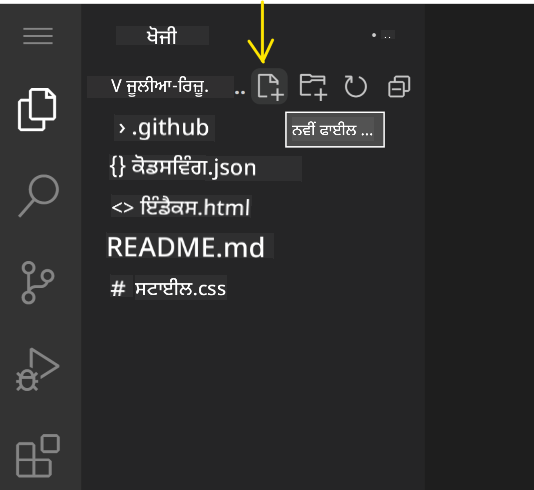
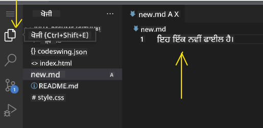
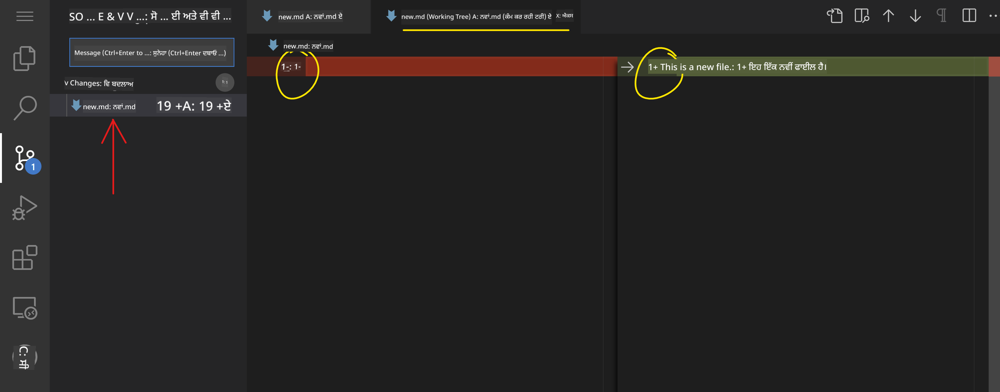
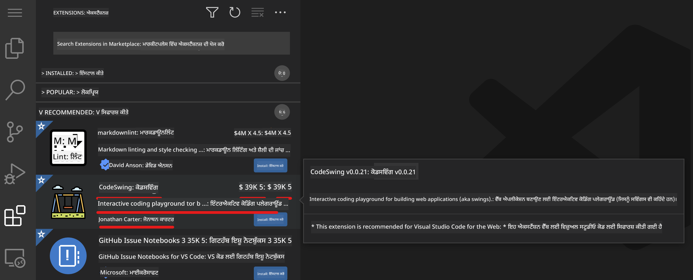
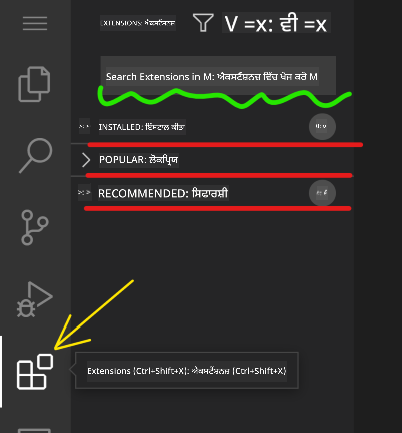

<!--
CO_OP_TRANSLATOR_METADATA:
{
  "original_hash": "7aa6e4f270d38d9cb17f2b5bd86b863d",
  "translation_date": "2025-08-25T23:18:39+00:00",
  "source_file": "8-code-editor/1-using-a-code-editor/README.md",
  "language_code": "pa"
}
-->
# ਕੋਡ ਐਡੀਟਰ ਦੀ ਵਰਤੋਂ

ਇਹ ਪਾਠ [VSCode.dev](https://vscode.dev) ਦੇ ਬੁਨਿਆਦੀ ਪਹਲੂਆਂ ਨੂੰ ਕਵਰ ਕਰਦਾ ਹੈ, ਜੋ ਕਿ ਇੱਕ ਵੈੱਬ-ਅਧਾਰਿਤ ਕੋਡ ਐਡੀਟਰ ਹੈ। ਇਸ ਦੀ ਵਰਤੋਂ ਕਰਕੇ ਤੁਸੀਂ ਆਪਣੇ ਕੋਡ ਵਿੱਚ ਤਬਦੀਲੀਆਂ ਕਰ ਸਕਦੇ ਹੋ ਅਤੇ ਕਿਸੇ ਪ੍ਰੋਜੈਕਟ ਵਿੱਚ ਯੋਗਦਾਨ ਪਾ ਸਕਦੇ ਹੋ ਬਿਨਾਂ ਆਪਣੇ ਕੰਪਿਊਟਰ 'ਤੇ ਕੁਝ ਇੰਸਟਾਲ ਕੀਤੇ।

## ਸਿੱਖਣ ਦੇ ਉਦੇਸ਼

ਇਸ ਪਾਠ ਵਿੱਚ, ਤੁਸੀਂ ਸਿੱਖੋਗੇ ਕਿ:

- ਕੋਡ ਪ੍ਰੋਜੈਕਟ ਵਿੱਚ ਕੋਡ ਐਡੀਟਰ ਦੀ ਵਰਤੋਂ ਕਿਵੇਂ ਕਰਨੀ ਹੈ
- ਵਰਜਨ ਕੰਟਰੋਲ ਨਾਲ ਤਬਦੀਲੀਆਂ ਦਾ ਟ੍ਰੈਕ ਰੱਖਣਾ
- ਵਿਕਾਸ ਲਈ ਐਡੀਟਰ ਨੂੰ ਕਸਟਮਾਈਜ਼ ਕਰਨਾ

### ਪੂਰਵ-ਸ਼ਰਤਾਂ

ਸ਼ੁਰੂ ਕਰਨ ਤੋਂ ਪਹਿਲਾਂ, ਤੁਹਾਨੂੰ [GitHub](https://github.com) ਨਾਲ ਇੱਕ ਖਾਤਾ ਬਣਾਉਣ ਦੀ ਲੋੜ ਹੋਵੇਗੀ। [GitHub](https://github.com/) 'ਤੇ ਜਾਓ ਅਤੇ ਜੇਕਰ ਤੁਸੀਂ ਪਹਿਲਾਂ ਹੀ ਖਾਤਾ ਨਹੀਂ ਬਣਾਇਆ ਹੈ ਤਾਂ ਇੱਕ ਖਾਤਾ ਬਣਾਓ।

### ਪਰਿਚਯ

ਕੋਡ ਐਡੀਟਰ ਪ੍ਰੋਗਰਾਮ ਲਿਖਣ ਅਤੇ ਮੌਜੂਦਾ ਕੋਡਿੰਗ ਪ੍ਰੋਜੈਕਟਾਂ ਨਾਲ ਸਹਿਯੋਗ ਕਰਨ ਲਈ ਇੱਕ ਜ਼ਰੂਰੀ ਸਾਧਨ ਹੈ। ਜਦੋਂ ਤੁਸੀਂ ਐਡੀਟਰ ਦੇ ਬੁਨਿਆਦੀ ਪਹਲੂਆਂ ਨੂੰ ਸਮਝ ਲੈਂਦੇ ਹੋ ਅਤੇ ਇਸ ਦੀਆਂ ਵਿਸ਼ੇਸ਼ਤਾਵਾਂ ਦੀ ਵਰਤੋਂ ਕਰਦੇ ਹੋ, ਤਾਂ ਤੁਸੀਂ ਇਹਨਾਂ ਨੂੰ ਕੋਡ ਲਿਖਣ ਸਮੇਂ ਲਾਗੂ ਕਰ ਸਕਦੇ ਹੋ।

## VSCode.dev ਨਾਲ ਸ਼ੁਰੂਆਤ

[VSCode.dev](https://vscode.dev) ਵੈੱਬ 'ਤੇ ਇੱਕ ਕੋਡ ਐਡੀਟਰ ਹੈ। ਇਸ ਦੀ ਵਰਤੋਂ ਕਰਨ ਲਈ ਤੁਹਾਨੂੰ ਕੁਝ ਵੀ ਇੰਸਟਾਲ ਕਰਨ ਦੀ ਲੋੜ ਨਹੀਂ ਹੈ, ਇਹ ਸਿਰਫ ਕਿਸੇ ਹੋਰ ਵੈੱਬਸਾਈਟ ਨੂੰ ਖੋਲ੍ਹਣ ਵਾਂਗ ਹੈ। ਐਡੀਟਰ ਨਾਲ ਸ਼ੁਰੂ ਕਰਨ ਲਈ, ਹੇਠਾਂ ਦਿੱਤੇ ਲਿੰਕ ਨੂੰ ਖੋਲ੍ਹੋ: [https://vscode.dev](https://vscode.dev)। ਜੇਕਰ ਤੁਸੀਂ [GitHub](https://github.com/) ਵਿੱਚ ਸਾਈਨ-ਇਨ ਨਹੀਂ ਹੋਏ ਹੋ, ਤਾਂ ਸਾਈਨ-ਇਨ ਕਰਨ ਜਾਂ ਨਵਾਂ ਖਾਤਾ ਬਣਾਉਣ ਲਈ ਹਦਾਇਤਾਂ ਦੀ ਪਾਲਣਾ ਕਰੋ ਅਤੇ ਫਿਰ ਸਾਈਨ-ਇਨ ਕਰੋ।

ਜਦੋਂ ਇਹ ਲੋਡ ਹੋਵੇਗਾ, ਤਾਂ ਇਹ ਹੇਠਾਂ ਦਿੱਤੀ ਚਿੱਤਰ ਵਾਂਗ ਲੱਗੇਗਾ:


ਤਿੰਨ ਮੁੱਖ ਸੈਕਸ਼ਨ ਹਨ, ਖੱਬੇ ਤੋਂ ਸੱਜੇ ਵੱਲ:

1. _ਐਕਟਿਵਿਟੀ ਬਾਰ_, ਜਿਸ ਵਿੱਚ ਕੁਝ ਆਈਕਨ ਸ਼ਾਮਲ ਹਨ, ਜਿਵੇਂ ਕਿ ਮੈਗਨੀਫਾਇੰਗ ਗਲਾਸ 🔎, ਗੀਅਰ ⚙️, ਅਤੇ ਕੁਝ ਹੋਰ।
1. ਵਧਾਇਆ ਗਿਆ ਐਕਟਿਵਿਟੀ ਬਾਰ, ਜੋ ਡਿਫਾਲਟ ਤੌਰ 'ਤੇ _ਐਕਸਪਲੋਰਰ_ ਹੈ, ਜਿਸਨੂੰ _ਸਾਈਡ ਬਾਰ_ ਕਿਹਾ ਜਾਂਦਾ ਹੈ।
1. ਅਤੇ ਆਖਿਰਕਾਰ, ਸੱਜੇ ਵੱਲ ਕੋਡ ਖੇਤਰ।

ਹਰ ਆਈਕਨ 'ਤੇ ਕਲਿਕ ਕਰੋ ਤਾਂ ਜੋ ਵੱਖ-ਵੱਖ ਮੀਨੂ ਦਿਖਾਈ ਦੇਣ। ਜਦੋਂ ਤੁਸੀਂ ਕਰ ਲਵੋ, ਤਾਂ _ਐਕਸਪਲੋਰਰ_ 'ਤੇ ਕਲਿਕ ਕਰੋ ਤਾਂ ਜੋ ਤੁਸੀਂ ਵਾਪਸ ਸ਼ੁਰੂਆਤ ਵਾਲੇ ਸਥਾਨ 'ਤੇ ਆ ਜਾਓ।

ਜਦੋਂ ਤੁਸੀਂ ਕੋਡ ਬਣਾਉਣਾ ਸ਼ੁਰੂ ਕਰਦੇ ਹੋ ਜਾਂ ਮੌਜੂਦਾ ਕੋਡ ਵਿੱਚ ਤਬਦੀਲੀਆਂ ਕਰਦੇ ਹੋ, ਤਾਂ ਇਹ ਸਭ ਤੋਂ ਵੱਡੇ ਖੇਤਰ ਵਿੱਚ ਸੱਜੇ ਵੱਲ ਹੋਵੇਗਾ। ਤੁਸੀਂ ਇਸ ਖੇਤਰ ਦੀ ਵਰਤੋਂ ਮੌਜੂਦਾ ਕੋਡ ਨੂੰ ਦ੍ਰਿਸ਼ਮਾਨ ਕਰਨ ਲਈ ਵੀ ਕਰੋਗੇ, ਜੋ ਤੁਸੀਂ ਅਗਲੇ ਕਦਮ ਵਿੱਚ ਕਰੋਗੇ।

## GitHub ਰਿਪੋਜ਼ਟਰੀ ਖੋਲ੍ਹੋ

ਸਭ ਤੋਂ ਪਹਿਲਾਂ ਤੁਹਾਨੂੰ ਇੱਕ GitHub ਰਿਪੋਜ਼ਟਰੀ ਖੋਲ੍ਹਣ ਦੀ ਲੋੜ ਹੈ। ਰਿਪੋਜ਼ਟਰੀ ਖੋਲ੍ਹਣ ਦੇ ਕਈ ਤਰੀਕੇ ਹਨ। ਇਸ ਸੈਕਸ਼ਨ ਵਿੱਚ ਤੁਸੀਂ ਦੋ ਵੱਖ-ਵੱਖ ਤਰੀਕੇ ਦੇਖੋਗੇ ਜਿਨ੍ਹਾਂ ਨਾਲ ਤੁਸੀਂ ਰਿਪੋਜ਼ਟਰੀ ਖੋਲ੍ਹ ਸਕਦੇ ਹੋ ਅਤੇ ਤਬਦੀਲੀਆਂ 'ਤੇ ਕੰਮ ਕਰ ਸਕਦੇ ਹੋ।

### 1. ਐਡੀਟਰ ਨਾਲ

ਦੂਰ-ਦਰਾਜ ਦੀ ਰਿਪੋਜ਼ਟਰੀ ਖੋਲ੍ਹਣ ਲਈ ਖੁਦ ਐਡੀਟਰ ਦੀ ਵਰਤੋਂ ਕਰੋ। ਜੇਕਰ ਤੁਸੀਂ [VSCode.dev](https://vscode.dev) 'ਤੇ ਜਾਓਗੇ ਤਾਂ ਤੁਹਾਨੂੰ _"Open Remote Repository"_ ਬਟਨ ਦਿਖਾਈ ਦੇਵੇਗਾ:


ਤੁਸੀਂ ਕਮਾਂਡ ਪੈਲੇਟ ਦੀ ਵੀ ਵਰਤੋਂ ਕਰ ਸਕਦੇ ਹੋ। ਕਮਾਂਡ ਪੈਲੇਟ ਇੱਕ ਇਨਪੁਟ ਬਾਕਸ ਹੈ ਜਿੱਥੇ ਤੁਸੀਂ ਕਿਸੇ ਕਮਾਂਡ ਜਾਂ ਕਾਰਵਾਈ ਦਾ ਹਿੱਸਾ ਹੋਣ ਵਾਲਾ ਕੋਈ ਵੀ ਸ਼ਬਦ ਟਾਈਪ ਕਰ ਸਕਦੇ ਹੋ ਤਾਂ ਜੋ ਸਹੀ ਕਮਾਂਡ ਨੂੰ ਚਲਾਇਆ ਜਾ ਸਕੇ। ਮੀਨੂ ਨੂੰ ਖੱਬੇ-ਉੱਪਰ ਜਾਓ, ਫਿਰ _View_ ਚੁਣੋ, ਅਤੇ ਫਿਰ _Command Palette_ ਚੁਣੋ, ਜਾਂ ਹੇਠਾਂ ਦਿੱਤੇ ਕੀਬੋਰਡ ਸ਼ਾਰਟਕਟ ਦੀ ਵਰਤੋਂ ਕਰੋ: Ctrl-Shift-P (MacOS 'ਤੇ ਇਹ Command-Shift-P ਹੋਵੇਗਾ)।


ਜਦੋਂ ਮੀਨੂ ਖੁਲ੍ਹੇ, _open remote repository_ ਟਾਈਪ ਕਰੋ, ਅਤੇ ਫਿਰ ਪਹਿਲਾ ਵਿਕਲਪ ਚੁਣੋ। ਕਈ ਰਿਪੋਜ਼ਟਰੀਆਂ ਜਿਨ੍ਹਾਂ ਦਾ ਤੁਸੀਂ ਹਿੱਸਾ ਹੋ ਜਾਂ ਜੋ ਤੁਸੀਂ ਹਾਲ ਹੀ ਵਿੱਚ ਖੋਲ੍ਹੀਆਂ ਹਨ, ਦਿਖਾਈ ਦੇਣਗੀਆਂ। ਤੁਸੀਂ ਪੂਰਾ GitHub URL ਵੀ ਵਰਤ ਸਕਦੇ ਹੋ। ਹੇਠਾਂ ਦਿੱਤੇ URL ਦੀ ਵਰਤੋਂ ਕਰੋ ਅਤੇ ਇਸਨੂੰ ਬਾਕਸ ਵਿੱਚ ਪੇਸਟ ਕਰੋ:

```
https://github.com/microsoft/Web-Dev-For-Beginners
```

✅ ਜੇਕਰ ਸਫਲ ਹੋਵੇ, ਤਾਂ ਤੁਸੀਂ ਇਸ ਰਿਪੋਜ਼ਟਰੀ ਦੇ ਸਾਰੇ ਫਾਈਲਾਂ ਨੂੰ ਟੈਕਸਟ ਐਡੀਟਰ ਵਿੱਚ ਲੋਡ ਹੋਇਆ ਦੇਖੋਗੇ।

### 2. URL ਦੀ ਵਰਤੋਂ ਕਰਕੇ

ਤੁਸੀਂ ਰਿਪੋਜ਼ਟਰੀ ਨੂੰ ਲੋਡ ਕਰਨ ਲਈ ਸਿੱਧੇ URL ਦੀ ਵਰਤੋਂ ਕਰ ਸਕਦੇ ਹੋ। ਉਦਾਹਰਣ ਲਈ, ਮੌਜੂਦਾ ਰਿਪੋ ਦਾ ਪੂਰਾ URL [https://github.com/microsoft/Web-Dev-For-Beginners](https://github.com/microsoft/Web-Dev-For-Beginners) ਹੈ, ਪਰ ਤੁਸੀਂ GitHub ਡੋਮੇਨ ਨੂੰ `VSCode.dev/github` ਨਾਲ ਬਦਲ ਸਕਦੇ ਹੋ ਅਤੇ ਰਿਪੋਜ਼ਟਰੀ ਨੂੰ ਸਿੱਧੇ ਲੋਡ ਕਰ ਸਕਦੇ ਹੋ। resulting URL ਹੋਵੇਗਾ [https://vscode.dev/github/microsoft/Web-Dev-For-Beginners](https://vscode.dev/github/microsoft/Web-Dev-For-Beginners)।

## ਫਾਈਲਾਂ ਨੂੰ ਸੰਪਾਦਿਤ ਕਰੋ

ਜਦੋਂ ਤੁਸੀਂ ਰਿਪੋਜ਼ਟਰੀ ਨੂੰ ਬ੍ਰਾਊਜ਼ਰ/ vscode.dev 'ਤੇ ਖੋਲ੍ਹ ਲੈਂਦੇ ਹੋ, ਤਾਂ ਅਗਲਾ ਕਦਮ ਪ੍ਰੋਜੈਕਟ ਵਿੱਚ ਅਪਡੇਟ ਜਾਂ ਤਬਦੀਲੀਆਂ ਕਰਨਾ ਹੋਵੇਗਾ।

### 1. ਨਵੀਂ ਫਾਈਲ ਬਣਾਓ

ਤੁਸੀਂ ਮੌਜੂਦਾ ਫੋਲਡਰ ਵਿੱਚ ਜਾਂ ਰੂਟ ਡਾਇਰੈਕਟਰੀ/ਫੋਲਡਰ ਵਿੱਚ ਫਾਈਲ ਬਣਾਉਣ ਦੀ ਚੋਣ ਕਰ ਸਕਦੇ ਹੋ। ਨਵੀਂ ਫਾਈਲ ਬਣਾਉਣ ਲਈ, ਉਸ ਸਥਾਨ/ਡਾਇਰੈਕਟਰੀ ਨੂੰ ਖੋਲ੍ਹੋ ਜਿੱਥੇ ਤੁਸੀਂ ਫਾਈਲ ਨੂੰ ਸੇਵ ਕਰਨਾ ਚਾਹੁੰਦੇ ਹੋ ਅਤੇ ਐਕਟਿਵਿਟੀ ਬਾਰ _(ਖੱਬੇ)_ 'ਤੇ _'New file ...'_ ਆਈਕਨ ਚੁਣੋ, ਇਸਨੂੰ ਇੱਕ ਨਾਮ ਦਿਓ ਅਤੇ ਐਂਟਰ ਦਬਾਓ।



### 2. ਰਿਪੋਜ਼ਟਰੀ 'ਤੇ ਫਾਈਲ ਨੂੰ ਸੰਪਾਦਿਤ ਕਰੋ ਅਤੇ ਸੇਵ ਕਰੋ

vscode.dev ਦੀ ਵਰਤੋਂ ਤੁਹਾਡੇ ਪ੍ਰੋਜੈਕਟ ਵਿੱਚ ਤੇਜ਼ੀ ਨਾਲ ਅਪਡੇਟ ਕਰਨ ਲਈ ਮਦਦਗਾਰ ਹੈ ਬਿਨਾਂ ਕਿਸੇ ਸਾਫਟਵੇਅਰ ਨੂੰ ਲੋਕਲ ਲੋਡ ਕੀਤੇ।  
ਤੁਹਾਡੇ ਕੋਡ ਨੂੰ ਅਪਡੇਟ ਕਰਨ ਲਈ, ਐਕਟਿਵਿਟੀ ਬਾਰ 'ਤੇ 'Explorer' ਆਈਕਨ 'ਤੇ ਕਲਿਕ ਕਰੋ ਤਾਂ ਜੋ ਰਿਪੋਜ਼ਟਰੀ ਵਿੱਚ ਫਾਈਲਾਂ ਅਤੇ ਫੋਲਡਰ ਨੂੰ ਵੇਖ ਸਕੋ।  
ਕੋਈ ਫਾਈਲ ਚੁਣੋ ਤਾਂ ਜੋ ਇਹ ਕੋਡ ਖੇਤਰ ਵਿੱਚ ਖੁਲ੍ਹੇ, ਤਬਦੀਲੀਆਂ ਕਰੋ ਅਤੇ ਸੇਵ ਕਰੋ।



ਜਦੋਂ ਤੁਸੀਂ ਆਪਣੇ ਪ੍ਰੋਜੈਕਟ ਨੂੰ ਅਪਡੇਟ ਕਰ ਲੈਂਦੇ ਹੋ, ਤਾਂ _`source control`_ ਆਈਕਨ ਚੁਣੋ ਜਿਸ ਵਿੱਚ ਤੁਹਾਡੇ ਰਿਪੋਜ਼ਟਰੀ ਵਿੱਚ ਕੀਤੀਆਂ ਸਾਰੀਆਂ ਨਵੀਆਂ ਤਬਦੀਲੀਆਂ ਸ਼ਾਮਲ ਹਨ।

ਤੁਹਾਡੇ ਪ੍ਰੋਜੈਕਟ ਵਿੱਚ ਕੀਤੀਆਂ ਤਬਦੀਲੀਆਂ ਨੂੰ ਵੇਖਣ ਲਈ, ਵਧਾਏ ਗਏ ਐਕਟਿਵਿਟੀ ਬਾਰ ਵਿੱਚ `Changes` ਫੋਲਡਰ ਵਿੱਚ ਫਾਈਲ(ਆਂ) ਚੁਣੋ। ਇਹ ਤੁਹਾਡੇ ਲਈ 'Working Tree' ਖੋਲ੍ਹੇਗਾ ਤਾਂ ਜੋ ਤੁਸੀਂ ਦ੍ਰਿਸ਼ਮਾਨ ਤੌਰ 'ਤੇ ਫਾਈਲ ਵਿੱਚ ਕੀਤੀਆਂ ਤਬਦੀਲੀਆਂ ਨੂੰ ਵੇਖ ਸਕੋ। ਲਾਲ ਰੰਗ ਪ੍ਰੋਜੈਕਟ ਵਿੱਚ ਇੱਕ ਹਟਾਉਣ ਨੂੰ ਦਰਸਾਉਂਦਾ ਹੈ, ਜਦੋਂ ਕਿ ਹਰਾ ਰੰਗ ਇੱਕ ਸ਼ਾਮਲ ਕਰਨ ਨੂੰ ਦਰਸਾਉਂਦਾ ਹੈ।



ਜੇਕਰ ਤੁਸੀਂ ਕੀਤੀਆਂ ਤਬਦੀਲੀਆਂ ਨਾਲ ਸੰਤੁਸ਼ਟ ਹੋ, ਤਾਂ `Changes` ਫੋਲਡਰ 'ਤੇ ਹਵਾਵਾਂ ਦਿਓ ਅਤੇ ਤਬਦੀਲੀਆਂ ਨੂੰ ਸਟੇਜ ਕਰਨ ਲਈ `+` ਬਟਨ 'ਤੇ ਕਲਿਕ ਕਰੋ। ਸਟੇਜਿੰਗ ਦਾ ਸਿਰਫ਼ ਮਤਲਬ ਹੈ ਕਿ ਤੁਸੀਂ ਆਪਣੀਆਂ ਤਬਦੀਲੀਆਂ ਨੂੰ GitHub 'ਤੇ ਕਮਿਟ ਕਰਨ ਲਈ ਤਿਆਰ ਕਰ ਰਹੇ ਹੋ।

ਜੇਕਰ ਤੁਸੀਂ ਕੁਝ ਤਬਦੀਲੀਆਂ ਨਾਲ ਅਸੁਵਿਧਾ ਮਹਿਸੂ ਕਰਦੇ ਹੋ ਅਤੇ ਤੁਸੀਂ ਉਹਨਾਂ ਨੂੰ ਰੱਦ ਕਰਨਾ ਚਾਹੁੰਦੇ ਹੋ, ਤਾਂ `Changes` ਫੋਲਡਰ 'ਤੇ ਹਵਾਵਾਂ ਦਿਓ ਅਤੇ `undo` ਆਈਕਨ ਚੁਣੋ।

ਫਿਰ, ਇੱਕ `commit message` _(ਤਬਦੀਲੀ ਦਾ ਵੇਰਵਾ ਜੋ ਤੁਸੀਂ ਪ੍ਰੋਜੈਕਟ ਵਿੱਚ ਕੀਤੀ ਹੈ)_ ਟਾਈਪ ਕਰੋ, `check icon` 'ਤੇ ਕਲਿਕ ਕਰੋ ਤਾਂ ਜੋ ਕਮਿਟ ਅਤੇ ਪੁਸ਼ ਕੀਤਾ ਜਾ ਸਕੇ।

ਜਦੋਂ ਤੁਸੀਂ ਆਪਣੇ ਪ੍ਰੋਜੈਕਟ 'ਤੇ ਕੰਮ ਕਰਨਾ ਖਤਮ ਕਰ ਲੈਂਦੇ ਹੋ, ਤਾਂ ਖੱਬੇ-ਉੱਪਰ `hamburger menu icon` ਚੁਣੋ ਤਾਂ ਜੋ github.com 'ਤੇ ਰਿਪੋਜ਼ਟਰੀ 'ਤੇ ਵਾਪਸ ਜਾ ਸਕੋ।


## ਐਕਸਟੈਂਸ਼ਨ ਦੀ ਵਰਤੋਂ

VSCode 'ਤੇ ਐਕਸਟੈਂਸ਼ਨ ਇੰਸਟਾਲ ਕਰਨਾ ਤੁਹਾਨੂੰ ਆਪਣੇ ਐਡੀਟਰ 'ਤੇ ਨਵੀਆਂ ਵਿਸ਼ੇਸ਼ਤਾਵਾਂ ਅਤੇ ਕਸਟਮਾਈਜ਼ਡ ਵਿਕਾਸ ਵਾਤਾਵਰਣ ਵਿਕਲਪਾਂ ਨੂੰ ਸ਼ਾਮਲ ਕਰਨ ਦੀ ਆਗਿਆ ਦਿੰਦਾ ਹੈ। ਇਹ ਐਕਸਟੈਂਸ਼ਨ ਤੁਹਾਡੇ ਵਿਕਾਸ ਵਰਕਫਲੋ ਨੂੰ ਸੁਧਾਰਨ ਲਈ ਮਦਦ ਕਰਦੇ ਹਨ। ਇਹ ਕਈ ਪ੍ਰੋਗਰਾਮਿੰਗ ਭਾਸ਼ਾਵਾਂ ਲਈ ਸਹਾਇਤਾ ਸ਼ਾਮਲ ਕਰਨ ਵਿੱਚ ਮਦਦ ਕਰਦੇ ਹਨ ਅਤੇ ਅਕਸਰ ਜਨਰਲ ਐਕਸਟੈਂਸ਼ਨ ਜਾਂ ਭਾਸ਼ਾ-ਅਧਾਰਿਤ ਐਕਸਟੈਂਸ਼ਨ ਹੁੰਦੇ ਹਨ।

ਸਭ ਉਪਲਬਧ ਐਕਸਟੈਂਸ਼ਨ ਦੀ ਸੂਚੀ ਨੂੰ ਬ੍ਰਾਊਜ਼ ਕਰਨ ਲਈ, ਐਕਟਿਵਿਟੀ ਬਾਰ 'ਤੇ _`Extensions icon`_ 'ਤੇ ਕਲਿਕ ਕਰੋ ਅਤੇ _'Search Extensions in Marketplace'_ ਲੇਬਲ ਵਾਲੇ ਟੈਕਸਟ ਫੀਲਡ ਵਿੱਚ ਐਕਸਟੈਂਸ਼ਨ ਦਾ ਨਾਮ ਟਾਈਪ ਕਰਨਾ ਸ਼ੁਰੂ ਕਰੋ।  
ਤੁਹਾਨੂੰ ਐਕਸਟੈਂਸ਼ਨ ਦੀ ਸੂਚੀ ਦਿਖਾਈ ਦੇਵੇਗੀ, ਜਿਸ ਵਿੱਚ **ਐਕਸਟੈਂਸ਼ਨ ਦਾ ਨਾਮ, ਪ੍ਰਕਾਸ਼ਕ ਦਾ ਨਾਮ, ਇੱਕ ਵਾਕ ਦਾ ਵੇਰਵਾ, ਡਾਊਨਲੋਡ ਦੀ ਗਿਣਤੀ** ਅਤੇ **ਸਟਾਰ ਰੇਟਿੰਗ** ਸ਼ਾਮਲ ਹੈ।



ਤੁਸੀਂ ਸਾਰੇ ਪਹਿਲਾਂ ਇੰਸਟਾਲ ਕੀਤੇ ਐਕਸਟੈਂਸ਼ਨ ਨੂੰ _`Installed folder`_ ਵਿੱਚ, ਜ਼ਿਆਦਾਤਰ ਡਿਵੈਲਪਰਾਂ ਦੁਆਰਾ ਵਰਤੇ ਜਾਣ ਵਾਲੇ ਪ੍ਰਸਿੱਧ ਐਕਸਟੈਂਸ਼ਨ ਨੂੰ _`Popular folder`_ ਵਿੱਚ ਅਤੇ ਤੁਹਾਡੇ ਲਈ ਸਿਫਾਰਸ਼ੀ ਐਕਸਟੈਂਸ਼ਨ ਨੂੰ _`recommended folder`_ ਵਿੱਚ ਵੇਖ ਸਕਦੇ ਹੋ। ਇਹ ਸਿਫਾਰਸ਼ਾਂ ਵਰਕਸਪੇਸ ਵਿੱਚ ਉਪਭੋਗਤਾਵਾਂ ਦੁਆਰਾ ਜਾਂ ਹਾਲ ਹੀ ਵਿੱਚ ਖੋਲ੍ਹੀਆਂ ਗਈਆਂ ਫਾਈਲਾਂ ਦੇ ਅਧਾਰ 'ਤੇ ਕੀਤੀਆਂ ਜਾਂਦੀਆਂ ਹਨ।



### 1. ਐਕਸਟੈਂਸ਼ਨ ਇੰਸਟਾਲ ਕਰੋ

ਐਕਸਟੈਂਸ਼ਨ ਨੂੰ ਇੰਸਟਾਲ ਕਰਨ ਲਈ, ਖੋਜ ਫੀਲਡ ਵਿੱਚ ਐਕਸਟੈਂਸ਼ਨ ਦਾ ਨਾਮ ਟਾਈਪ ਕਰੋ ਅਤੇ ਜਦੋਂ ਇਹ ਵਧਾਏ ਗਏ ਐਕਟਿਵਿਟੀ ਬਾਰ 'ਤੇ ਦਿਖਾਈ ਦੇਵੇ, ਤਾਂ ਇਸਨੂੰ ਚੁਣੋ ਤਾਂ ਜੋ ਕੋਡ ਖੇਤਰ ਵਿੱਚ ਐਕਸਟੈਂਸ਼ਨ ਬਾਰੇ ਵਧੇਰੇ ਜਾਣਕਾਰੀ ਵੇਖ ਸਕੋ।

ਤੁਸੀਂ ਵਧਾਏ ਗਏ ਐਕਟਿਵਿਟੀ ਬਾਰ 'ਤੇ ਨੀਲੇ ਇੰਸਟਾਲ ਬਟਨ 'ਤੇ ਕਲਿਕ ਕਰਕੇ ਇੰਸਟਾਲ ਕਰ ਸਕਦੇ ਹੋ ਜਾਂ ਜਦੋਂ ਤੁਸੀਂ ਐਕਸਟੈਂਸ਼ਨ ਨੂੰ ਚੁਣਦੇ ਹੋ ਤਾਂ ਕੋਡ ਖੇਤਰ ਵਿੱਚ ਦਿਖਾਈ ਦੇਣ ਵਾਲੇ ਇੰਸਟਾਲ ਬਟਨ ਦੀ ਵਰਤੋਂ ਕਰ ਸਕਦੇ ਹੋ।


### 2. ਐਕਸਟੈਂਸ਼ਨ ਨੂੰ ਕਸਟਮਾਈਜ਼ ਕਰੋ

ਐਕਸਟੈਂਸ਼ਨ ਨੂੰ ਇੰਸਟਾਲ ਕਰਨ ਤੋਂ ਬਾਅਦ, ਤੁਹਾਨੂੰ ਇਸਦੇ ਵਿਹਾਰ ਨੂੰ ਸੋਧਣ ਅਤੇ ਇਸਨੂੰ ਆਪਣੇ ਪਸੰਦਾਂ ਦੇ ਅਨੁਸਾਰ ਕਸਟਮਾਈਜ਼ ਕਰਨ ਦੀ ਲੋੜ ਹੋ ਸਕਦੀ ਹੈ।  
ਇਹ ਕਰਨ ਲਈ, ਐਕਸਟੈਂਸ਼ਨ ਆਈਕਨ ਚੁਣੋ, ਅਤੇ ਇਸ ਵਾਰ, ਤੁਹਾਡਾ ਐਕਸਟੈਂਸ਼ਨ _Installed folder_ ਵਿੱਚ ਦਿਖਾਈ ਦੇਵੇਗਾ। _**Gear icon**_ 'ਤੇ ਕਲਿਕ ਕਰੋ ਅਤੇ _Extensions Setting_ 'ਤੇ ਜਾਓ।


### 3. ਐਕਸਟੈਂਸ਼ਨ ਨੂੰ ਪ੍ਰਬੰਧਿਤ ਕਰੋ

ਐਕਸਟੈਂਸ਼ਨ ਨੂੰ ਇੰਸਟਾਲ ਅਤੇ ਵਰਤਣ ਤੋਂ ਬਾਅਦ, vscode.dev ਵੱਖ-ਵੱਖ ਜ਼ਰੂਰਤਾਂ ਦੇ ਅਧਾਰ 'ਤੇ ਤੁਹਾਡੇ ਐਕਸਟੈਂਸ਼ਨ ਨੂੰ ਪ੍ਰਬੰਧਿਤ ਕਰਨ ਦੇ ਵਿਕਲਪ ਪੇਸ਼ ਕਰਦਾ ਹੈ। ਉਦਾਹਰਣ ਲਈ, ਤੁਸੀਂ ਚੁਣ ਸਕਦੇ ਹੋ:

- **Disable:** _(ਤੁਸੀਂ ਇੱਕ ਐਕਸਟੈਂਸ਼ਨ ਨੂੰ ਅਸਥਾਈ ਤੌਰ 'ਤੇ ਅਯੋਗ ਕਰ ਸਕਦੇ ਹੋ ਜਦੋਂ ਤੁਹਾਨੂੰ ਇਸਦੀ ਲੋੜ ਨਹੀਂ ਹੁੰਦੀ ਪਰ ਇਸਨੂੰ ਪੂਰੀ ਤਰ੍ਹਾਂ ਅਨਇੰਸਟਾਲ ਨਹੀਂ ਕਰਨਾ ਚਾਹੁੰਦੇ)_

    ਵਧਾਏ ਗਏ ਐਕਟਿਵਿਟੀ ਬਾਰ 'ਤੇ ਇੰਸਟਾਲ ਕੀਤੇ ਐਕਸਟੈਂਸ਼ਨ ਨੂੰ ਚੁਣੋ > Gear icon 'ਤੇ ਕਲਿਕ ਕਰੋ > 'Disable' ਜਾਂ 'Disable (Workspace)' ਚੁਣੋ **ਜਾਂ** ਐਕਸਟੈਂਸ਼ਨ ਨੂੰ ਕੋਡ ਖੇਤਰ ਵਿੱਚ ਖੋਲ੍ਹੋ ਅਤੇ ਨੀਲੇ Disable ਬਟਨ 'ਤੇ ਕਲਿਕ ਕਰੋ।

- **Uninstall:** ਵਧਾਏ ਗਏ ਐਕਟਿਵਿਟੀ ਬਾਰ 'ਤੇ ਇੰਸਟਾਲ ਕੀਤੇ ਐਕਸਟੈਂਸ਼ਨ ਨੂੰ ਚੁਣੋ > Gear icon 'ਤੇ ਕਲਿਕ ਕਰੋ > 'Uninstall' ਚੁਣੋ **ਜਾਂ** ਐਕਸਟੈਂਸ਼ਨ ਨੂੰ ਕੋਡ ਖੇਤਰ ਵਿੱਚ ਖੋਲ੍ਹੋ ਅਤੇ ਨੀਲੇ Uninstall ਬਟਨ 'ਤੇ ਕਲਿਕ ਕਰੋ।

---

## ਅਸਾਈਨਮੈਂਟ

[vscode.dev ਦੀ ਵਰਤੋਂ ਕਰਕੇ ਇੱਕ ਰਿਜ਼ੂਮੇ ਵੈੱਬਸਾਈਟ ਬਣਾਓ](https://github.com/microsoft/Web-Dev-For-Beginners/blob/main/8-code-editor/1-using-a-code-editor/assignment.md)

## ਸਮੀਖਿਆ ਅਤੇ ਸਵੈ-ਅਧਿਐਨ

[VSCode.dev](https://code.visualstudio.com/docs/editor/vscode-web?WT.mc_id=academic-0000-alfredodeza) ਅਤੇ

**ਅਸਵੀਕਾਰਨ**:  
ਇਹ ਦਸਤਾਵੇਜ਼ AI ਅਨੁਵਾਦ ਸੇਵਾ [Co-op Translator](https://github.com/Azure/co-op-translator) ਦੀ ਵਰਤੋਂ ਕਰਕੇ ਅਨੁਵਾਦ ਕੀਤਾ ਗਿਆ ਹੈ। ਜਦੋਂ ਕਿ ਅਸੀਂ ਸਹੀਤਾ ਲਈ ਯਤਨਸ਼ੀਲ ਹਾਂ, ਕਿਰਪਾ ਕਰਕੇ ਧਿਆਨ ਦਿਓ ਕਿ ਸਵੈਚਾਲਿਤ ਅਨੁਵਾਦਾਂ ਵਿੱਚ ਗਲਤੀਆਂ ਜਾਂ ਅਸੁਚਨਾਵਾਂ ਹੋ ਸਕਦੀਆਂ ਹਨ। ਮੂਲ ਦਸਤਾਵੇਜ਼ ਨੂੰ ਇਸਦੀ ਮੂਲ ਭਾਸ਼ਾ ਵਿੱਚ ਅਧਿਕਾਰਤ ਸਰੋਤ ਮੰਨਿਆ ਜਾਣਾ ਚਾਹੀਦਾ ਹੈ। ਮਹੱਤਵਪੂਰਨ ਜਾਣਕਾਰੀ ਲਈ, ਪੇਸ਼ੇਵਰ ਮਨੁੱਖੀ ਅਨੁਵਾਦ ਦੀ ਸਿਫਾਰਸ਼ ਕੀਤੀ ਜਾਂਦੀ ਹੈ। ਇਸ ਅਨੁਵਾਦ ਦੀ ਵਰਤੋਂ ਤੋਂ ਪੈਦਾ ਹੋਣ ਵਾਲੇ ਕਿਸੇ ਵੀ ਗਲਤਫਹਿਮੀ ਜਾਂ ਗਲਤ ਵਿਆਖਿਆ ਲਈ ਅਸੀਂ ਜ਼ਿੰਮੇਵਾਰ ਨਹੀਂ ਹਾਂ।