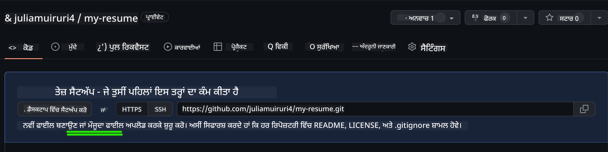
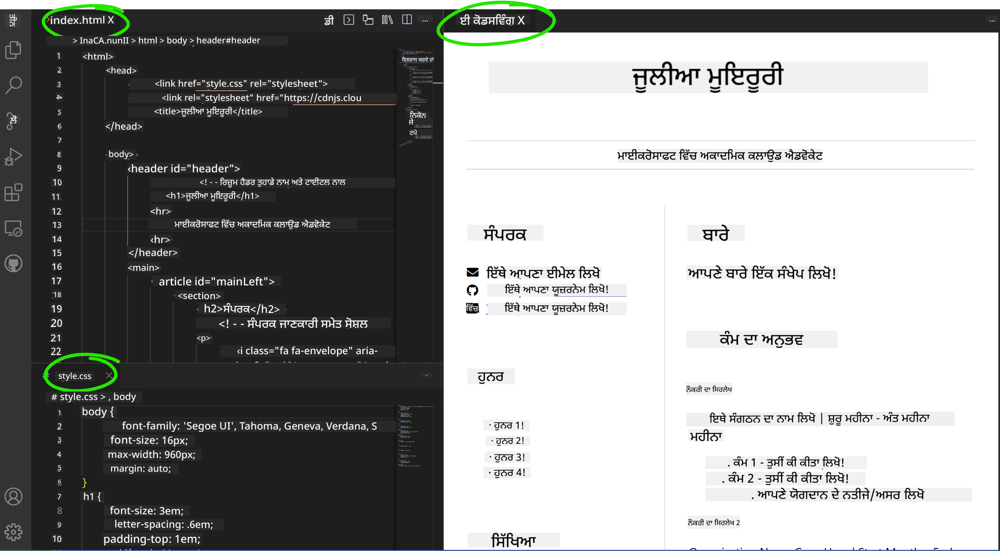

<!--
CO_OP_TRANSLATOR_METADATA:
{
  "original_hash": "2fcb983b8dbadadb1bc2e97f8c12dac5",
  "translation_date": "2025-08-25T23:23:45+00:00",
  "source_file": "8-code-editor/1-using-a-code-editor/assignment.md",
  "language_code": "pa"
}
-->
# vscode.dev ਦੀ ਵਰਤੋਂ ਕਰਕੇ ਇੱਕ ਰਿਜ਼ੂਮੇ-ਵੈਬਸਾਈਟ ਬਣਾਓ

_ਕਿੰਨਾ ਵਧੀਆ ਹੋਵੇਗਾ ਜੇ ਕੋਈ ਰਿਕਰੂਟਰ ਤੁਹਾਡੇ ਰਿਜ਼ੂਮੇ ਦੀ ਮੰਗ ਕਰੇ ਅਤੇ ਤੁਸੀਂ ਉਨ੍ਹਾਂ ਨੂੰ ਇੱਕ URL ਭੇਜੋ?_ 😎

## ਉਦੇਸ਼

ਇਸ ਅਸਾਈਨਮੈਂਟ ਤੋਂ ਬਾਅਦ, ਤੁਸੀਂ ਸਿੱਖੋਗੇ ਕਿ:

- ਆਪਣੇ ਰਿਜ਼ੂਮੇ ਨੂੰ ਦਰਸਾਉਣ ਲਈ ਇੱਕ ਵੈਬਸਾਈਟ ਕਿਵੇਂ ਬਣਾਈ ਜਾਵੇ

### ਪੂਰਵ ਸ਼ਰਤਾਂ

1. ਇੱਕ GitHub ਖਾਤਾ। [GitHub](https://github.com/) ਤੇ ਜਾਓ ਅਤੇ ਜੇ ਤੁਹਾਡੇ ਕੋਲ ਪਹਿਲਾਂ ਤੋਂ ਖਾਤਾ ਨਹੀਂ ਹੈ ਤਾਂ ਇੱਕ ਬਣਾਓ।

## ਕਦਮ

**ਕਦਮ 1:** ਇੱਕ ਨਵਾਂ GitHub ਰਿਪੋਜ਼ਟਰੀ ਬਣਾਓ ਅਤੇ ਇਸ ਨੂੰ `my-resume` ਨਾਮ ਦਿਓ।

**ਕਦਮ 2:** ਆਪਣੇ ਰਿਪੋਜ਼ਟਰੀ ਵਿੱਚ ਇੱਕ `index.html` ਫਾਈਲ ਬਣਾਓ। ਅਸੀਂ ਘੱਟੋ-ਘੱਟ ਇੱਕ ਫਾਈਲ github.com 'ਤੇ ਹੀ ਸ਼ਾਮਲ ਕਰਾਂਗੇ ਕਿਉਂਕਿ ਤੁਸੀਂ vscode.dev 'ਤੇ ਖਾਲੀ ਰਿਪੋਜ਼ਟਰੀ ਨਹੀਂ ਖੋਲ੍ਹ ਸਕਦੇ।

`creating a new file` ਲਿੰਕ 'ਤੇ ਕਲਿੱਕ ਕਰੋ, ਨਾਮ `index.html` ਟਾਈਪ ਕਰੋ ਅਤੇ `Commit new file` ਬਟਨ ਚੁਣੋ।



**ਕਦਮ 3:** [VSCode.dev](https://vscode.dev) ਖੋਲ੍ਹੋ ਅਤੇ `Open Remote Repository` ਬਟਨ ਚੁਣੋ।

ਤੁਹਾਡੇ ਰਿਜ਼ੂਮੇ ਸਾਈਟ ਲਈ ਹੁਣੇ ਬਣਾਏ ਗਏ ਰਿਪੋਜ਼ਟਰੀ ਦਾ URL ਕਾਪੀ ਕਰੋ ਅਤੇ ਇਸਨੂੰ ਇਨਪੁਟ ਬਾਕਸ ਵਿੱਚ ਪੇਸਟ ਕਰੋ:

_`your-username` ਨੂੰ ਆਪਣੇ GitHub ਯੂਜ਼ਰਨੇਮ ਨਾਲ ਬਦਲੋ_

```
https://github.com/your-username/my-resume
```

✅ ਜੇ ਸਫਲ ਹੋਵੇ, ਤਾਂ ਤੁਸੀਂ ਆਪਣਾ ਪ੍ਰੋਜੈਕਟ ਅਤੇ index.html ਫਾਈਲ ਬ੍ਰਾਊਜ਼ਰ ਵਿੱਚ ਟੈਕਸਟ ਐਡੀਟਰ 'ਤੇ ਖੁੱਲ੍ਹੀ ਹੋਈ ਦੇਖੋਗੇ।


**ਕਦਮ 4:** `index.html` ਫਾਈਲ ਖੋਲ੍ਹੋ, ਹੇਠਾਂ ਦਿੱਤਾ ਕੋਡ ਆਪਣੇ ਕੋਡ ਖੇਤਰ ਵਿੱਚ ਪੇਸਟ ਕਰੋ ਅਤੇ ਸੇਵ ਕਰੋ।

<details>
    <summary><b>ਤੁਹਾਡੇ ਰਿਜ਼ੂਮੇ ਵੈਬਸਾਈਟ ਦੇ ਸਮੱਗਰੀ ਲਈ HTML ਕੋਡ।</b></summary>
    
        <html>

            <head>
                <link href="style.css" rel="stylesheet">
                <link rel="stylesheet" href="https://cdnjs.cloudflare.com/ajax/libs/font-awesome/5.15.4/css/all.min.css">
                <title>ਤੁਹਾਡਾ ਨਾਮ ਇੱਥੇ ਲਿਖੋ!</title>
            </head>
            <body>
                <header id="header">
                    <!-- ਰਿਜ਼ੂਮੇ ਹੈਡਰ ਤੁਹਾਡੇ ਨਾਮ ਅਤੇ ਟਾਈਟਲ ਨਾਲ -->
                    <h1>ਤੁਹਾਡਾ ਨਾਮ ਇੱਥੇ ਲਿਖੋ!</h1>
                    <hr>
                    ਤੁਹਾਡਾ ਰੋਲ!
                    <hr>
                </header>
                <main>
                    <article id="mainLeft">
                        <section>
                            <h2>ਸੰਪਰਕ</h2>
                            <!-- ਸੰਪਰਕ ਜਾਣਕਾਰੀ ਸਮੇਤ ਸੋਸ਼ਲ ਮੀਡੀਆ -->
                            <p>
                                <i class="fa fa-envelope" aria-hidden="true"></i>
                                <a href="mailto:username@domain.top-level domain">ਆਪਣਾ ਈਮੇਲ ਇੱਥੇ ਲਿਖੋ</a>
                            </p>
                            <p>
                                <i class="fab fa-github" aria-hidden="true"></i>
                                <a href="github.com/yourGitHubUsername">ਆਪਣਾ ਯੂਜ਼ਰਨੇਮ ਇੱਥੇ ਲਿਖੋ!</a>
                            </p>
                            <p>
                                <i class="fab fa-linkedin" aria-hidden="true"></i>
                                <a href="linkedin.com/yourLinkedInUsername">ਆਪਣਾ ਯੂਜ਼ਰਨੇਮ ਇੱਥੇ ਲਿਖੋ!</a>
                            </p>
                        </section>
                        <section>
                            <h2>ਹੁਨਰ</h2>
                            <!-- ਤੁਹਾਡੇ ਹੁਨਰ -->
                            <ul>
                                <li>ਹੁਨਰ 1!</li>
                                <li>ਹੁਨਰ 2!</li>
                                <li>ਹੁਨਰ 3!</li>
                                <li>ਹੁਨਰ 4!</li>
                            </ul>
                        </section>
                        <section>
                            <h2>ਸਿੱਖਿਆ</h2>
                            <!-- ਤੁਹਾਡੀ ਸਿੱਖਿਆ -->
                            <h3>ਆਪਣਾ ਕੋਰਸ ਇੱਥੇ ਲਿਖੋ!</h3>
                            <p>
                                ਆਪਣਾ ਸੰਸਥਾਨ ਇੱਥੇ ਲਿਖੋ!
                            </p>
                            <p>
                                ਸ਼ੁਰੂ - ਖਤਮ ਮਿਤੀ
                            </p>
                        </section>            
                    </article>
                    <article id="mainRight">
                        <section>
                            <h2>ਬਾਰੇ</h2>
                            <!-- ਤੁਹਾਡੇ ਬਾਰੇ -->
                            <p>ਆਪਣੇ ਬਾਰੇ ਕੁਝ ਲਿਖੋ!</p>
                        </section>
                        <section>
                            <h2>ਕੰਮ ਦਾ ਤਜਰਬਾ</h2>
                            <!-- ਤੁਹਾਡਾ ਕੰਮ ਦਾ ਤਜਰਬਾ -->
                            <h3>ਨੌਕਰੀ ਦਾ ਟਾਈਟਲ</h3>
                            <p>
                                ਸੰਸਥਾ ਦਾ ਨਾਮ ਇੱਥੇ ਲਿਖੋ | ਸ਼ੁਰੂ ਮਹੀਨਾ – ਖਤਮ ਮਹੀਨਾ
                            </p>
                            <ul>
                                    <li>ਟਾਸਕ 1 - ਤੁਸੀਂ ਕੀ ਕੀਤਾ!</li>
                                    <li>ਟਾਸਕ 2 - ਤੁਸੀਂ ਕੀ ਕੀਤਾ!</li>
                                    <li>ਤੁਹਾਡੇ ਯੋਗਦਾਨ ਦੇ ਨਤੀਜੇ/ਅਸਰ ਲਿਖੋ</li>
                                    
                            </ul>
                            <h3>ਨੌਕਰੀ ਦਾ ਟਾਈਟਲ 2</h3>
                            <p>
                                ਸੰਸਥਾ ਦਾ ਨਾਮ ਇੱਥੇ ਲਿਖੋ | ਸ਼ੁਰੂ ਮਹੀਨਾ – ਖਤਮ ਮਹੀਨਾ
                            </p>
                            <ul>
                                    <li>ਟਾਸਕ 1 - ਤੁਸੀਂ ਕੀ ਕੀਤਾ!</li>
                                    <li>ਟਾਸਕ 2 - ਤੁਸੀਂ ਕੀ ਕੀਤਾ!</li>
                                    <li>ਤੁਹਾਡੇ ਯੋਗਦਾਨ ਦੇ ਨਤੀਜੇ/ਅਸਰ ਲਿਖੋ</li>
                                    
                            </ul>
                        </section>
                    </article>
                </main>
            </body>
        </html>
</details>

ਆਪਣੇ ਰਿਜ਼ੂਮੇ ਦੇ ਵੇਰਵੇ _placeholder text_ ਨਾਲ ਬਦਲੋ।

**ਕਦਮ 5:** My-Resume ਫੋਲਡਰ 'ਤੇ ਹਵਰ ਕਰੋ, `New File ...` ਆਈਕਨ 'ਤੇ ਕਲਿੱਕ ਕਰੋ ਅਤੇ ਆਪਣੇ ਪ੍ਰੋਜੈਕਟ ਵਿੱਚ 2 ਨਵੀਆਂ ਫਾਈਲਾਂ ਬਣਾਓ: `style.css` ਅਤੇ `codeswing.json` ਫਾਈਲਾਂ।

**ਕਦਮ 6:** `style.css` ਫਾਈਲ ਖੋਲ੍ਹੋ, ਹੇਠਾਂ ਦਿੱਤਾ ਕੋਡ ਪੇਸਟ ਕਰੋ ਅਤੇ ਸੇਵ ਕਰੋ।

<details>
        <summary><b>ਸਾਈਟ ਦੇ ਲੇਆਉਟ ਨੂੰ ਫਾਰਮੈਟ ਕਰਨ ਲਈ CSS ਕੋਡ।</b></summary>
            
            body {
                font-family: 'Segoe UI', Tahoma, Geneva, Verdana, sans-serif;
                font-size: 16px;
                max-width: 960px;
                margin: auto;
            }
            h1 {
                font-size: 3em;
                letter-spacing: .6em;
                padding-top: 1em;
                padding-bottom: 1em;
            }

            h2 {
                font-size: 1.5em;
                padding-bottom: 1em;
            }

            h3 {
                font-size: 1em;
                padding-bottom: 1em;
            }
            main { 
                display: grid;
                grid-template-columns: 40% 60%;
                margin-top: 3em;
            }
            header {
                text-align: center;
                margin: auto 2em;
            }

            section {
                margin: auto 1em 4em 2em;
            }

            i {
                margin-right: .5em;
            }

            p {
                margin: .2em auto
            }

            hr {
                border: none;
                background-color: lightgray;
                height: 1px;
            }

            h1, h2, h3 {
                font-weight: 100;
                margin-bottom: 0;
            }
            #mainLeft {
                border-right: 1px solid lightgray;
            }
            
</details>

**ਕਦਮ 6:** `codeswing.json` ਫਾਈਲ ਖੋਲ੍ਹੋ, ਹੇਠਾਂ ਦਿੱਤਾ ਕੋਡ ਪੇਸਟ ਕਰੋ ਅਤੇ ਸੇਵ ਕਰੋ।

    {
    "scripts": [],
    "styles": []
    }

**ਕਦਮ 7:** `Codeswing extension` ਇੰਸਟਾਲ ਕਰੋ ਤਾਂ ਜੋ ਤੁਸੀਂ ਕੋਡ ਖੇਤਰ ਵਿੱਚ ਰਿਜ਼ੂਮੇ ਵੈਬਸਾਈਟ ਨੂੰ ਵੇਖ ਸਕੋ।

_`Extensions`_ ਆਈਕਨ 'ਤੇ ਕਲਿੱਕ ਕਰੋ ਅਤੇ Codeswing ਟਾਈਪ ਕਰੋ। ਜਾਂ ਤਾਂ ਵਧੇਰੇ ਜਾਣਕਾਰੀ ਲੋਡ ਕਰਨ ਲਈ ਐਕਸਟੈਂਸ਼ਨ ਨੂੰ ਚੁਣਨ 'ਤੇ ਕੋਡ ਖੇਤਰ ਵਿੱਚ ਦਿਖਾਈ ਦੇਣ ਵਾਲੇ _ਬਲੂ ਇੰਸਟਾਲ ਬਟਨ_ 'ਤੇ ਕਲਿੱਕ ਕਰੋ। ਐਕਸਟੈਂਸ਼ਨ ਇੰਸਟਾਲ ਕਰਨ ਤੋਂ ਬਾਅਦ, ਆਪਣੇ ਪ੍ਰੋਜੈਕਟ ਵਿੱਚ ਹੋਏ ਬਦਲਾਵਾਂ ਨੂੰ ਦੇਖੋ 😃।


ਇਹ ਤੁਹਾਡੇ ਸਕ੍ਰੀਨ 'ਤੇ ਦਿਖਾਈ ਦੇਵੇਗਾ ਜਦੋਂ ਤੁਸੀਂ ਐਕਸਟੈਂਸ਼ਨ ਇੰਸਟਾਲ ਕਰ ਲਵੋਗੇ।



ਜੇ ਤੁਸੀਂ ਕੀਤੇ ਬਦਲਾਵਾਂ ਨਾਲ ਸੰਤੁਸ਼ਟ ਹੋ, ਤਾਂ `Changes` ਫੋਲਡਰ 'ਤੇ ਹਵਰ ਕਰੋ ਅਤੇ ਬਦਲਾਵਾਂ ਨੂੰ ਸਟੇਜ ਕਰਨ ਲਈ `+` ਬਟਨ 'ਤੇ ਕਲਿੱਕ ਕਰੋ।

ਕਮਿਟ ਮੈਸੇਜ _(ਪ੍ਰੋਜੈਕਟ ਵਿੱਚ ਕੀਤੇ ਬਦਲਾਵਾਂ ਦਾ ਵੇਰਵਾ)_ ਟਾਈਪ ਕਰੋ ਅਤੇ `check` 'ਤੇ ਕਲਿੱਕ ਕਰਕੇ ਆਪਣੇ ਬਦਲਾਵਾਂ ਨੂੰ ਕਮਿਟ ਕਰੋ। ਜਦੋਂ ਪ੍ਰੋਜੈਕਟ 'ਤੇ ਕੰਮ ਮੁਕੰਮਲ ਹੋ ਜਾਵੇ, ਤਾਂ GitHub 'ਤੇ ਰਿਪੋਜ਼ਟਰੀ 'ਤੇ ਵਾਪਸ ਜਾਣ ਲਈ ਉੱਪਰ ਖੱਬੇ ਹਿਸੇ ਵਿੱਚ ਹੈਮਬਰਗਰ ਮੀਨੂ ਆਈਕਨ ਚੁਣੋ।

ਵਧਾਈਆਂ 🎉 ਤੁਸੀਂ ਕੁਝ ਕਦਮਾਂ ਵਿੱਚ vscode.dev ਦੀ ਵਰਤੋਂ ਕਰਕੇ ਆਪਣੀ ਰਿਜ਼ੂਮੇ ਵੈਬਸਾਈਟ ਬਣਾਈ ਹੈ।

## 🚀 ਚੁਣੌਤੀ

ਕਿਸੇ ਰਿਮੋਟ ਰਿਪੋਜ਼ਟਰੀ ਨੂੰ ਖੋਲ੍ਹੋ ਜਿਸ 'ਤੇ ਤੁਹਾਨੂੰ ਬਦਲਾਵ ਕਰਨ ਦੀ ਇਜਾਜ਼ਤ ਹੈ ਅਤੇ ਕੁਝ ਫਾਈਲਾਂ ਅਪਡੇਟ ਕਰੋ। ਅਗਲੇ ਕਦਮ ਵਿੱਚ, ਆਪਣੇ ਬਦਲਾਵਾਂ ਨਾਲ ਇੱਕ ਨਵੀਂ ਸ਼ਾਖਾ ਬਣਾਉ ਅਤੇ ਇੱਕ ਪੁਲ ਰਿਕਵੇਸਟ ਬਣਾਉ।

## ਸਮੀਖਿਆ ਅਤੇ ਸਵੈ ਅਧਿਐਨ

[VSCode.dev](https://code.visualstudio.com/docs/editor/vscode-web?WT.mc_id=academic-0000-alfredodeza) ਬਾਰੇ ਹੋਰ ਪੜ੍ਹੋ ਅਤੇ ਇਸ ਦੀਆਂ ਹੋਰ ਵਿਸ਼ੇਸ਼ਤਾਵਾਂ।

**ਅਸਵੀਕਾਰਨ**:  
ਇਹ ਦਸਤਾਵੇਜ਼ AI ਅਨੁਵਾਦ ਸੇਵਾ [Co-op Translator](https://github.com/Azure/co-op-translator) ਦੀ ਵਰਤੋਂ ਕਰਕੇ ਅਨੁਵਾਦ ਕੀਤਾ ਗਿਆ ਹੈ। ਜਦੋਂ ਕਿ ਅਸੀਂ ਸਹੀਤਾ ਲਈ ਯਤਨਸ਼ੀਲ ਹਾਂ, ਕਿਰਪਾ ਕਰਕੇ ਧਿਆਨ ਦਿਓ ਕਿ ਸਵੈਚਾਲਿਤ ਅਨੁਵਾਦਾਂ ਵਿੱਚ ਗਲਤੀਆਂ ਜਾਂ ਅਸੁਚਨਾਵਾਂ ਹੋ ਸਕਦੀਆਂ ਹਨ। ਮੂਲ ਦਸਤਾਵੇਜ਼ ਨੂੰ ਇਸਦੀ ਮੂਲ ਭਾਸ਼ਾ ਵਿੱਚ ਅਧਿਕਾਰਤ ਸਰੋਤ ਮੰਨਿਆ ਜਾਣਾ ਚਾਹੀਦਾ ਹੈ। ਮਹੱਤਵਪੂਰਨ ਜਾਣਕਾਰੀ ਲਈ, ਪੇਸ਼ੇਵਰ ਮਨੁੱਖੀ ਅਨੁਵਾਦ ਦੀ ਸਿਫਾਰਸ਼ ਕੀਤੀ ਜਾਂਦੀ ਹੈ। ਇਸ ਅਨੁਵਾਦ ਦੀ ਵਰਤੋਂ ਤੋਂ ਪੈਦਾ ਹੋਣ ਵਾਲੇ ਕਿਸੇ ਵੀ ਗਲਤਫਹਿਮੀ ਜਾਂ ਗਲਤ ਵਿਆਖਿਆ ਲਈ ਅਸੀਂ ਜ਼ਿੰਮੇਵਾਰ ਨਹੀਂ ਹਾਂ।