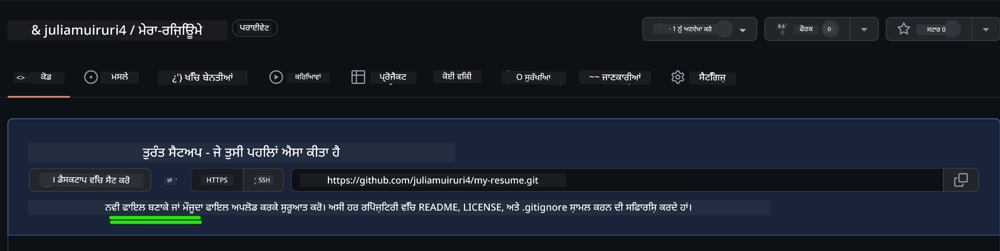
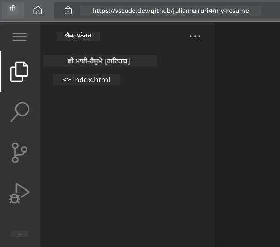

<!--
CO_OP_TRANSLATOR_METADATA:
{
  "original_hash": "effe56ba51c38d7bdfad1ea38288666b",
  "translation_date": "2025-10-22T17:28:31+00:00",
  "source_file": "8-code-editor/1-using-a-code-editor/assignment.md",
  "language_code": "pa"
}
-->
# VSCode.dev ਦੀ ਵਰਤੋਂ ਕਰਕੇ ਰਿਜ਼ਿਊਮ ਵੈਬਸਾਈਟ ਬਣਾਓ

ਇੱਕ ਇੰਟਰਐਕਟਿਵ ਅਤੇ ਆਧੁਨਿਕ ਫਾਰਮੈਟ ਵਿੱਚ ਆਪਣੀ ਕਾਬਲਿਯਤ ਅਤੇ ਤਜਰਬੇ ਨੂੰ ਦਰਸਾਉਣ ਵਾਲੀ ਪ੍ਰੋਫੈਸ਼ਨਲ ਰਿਜ਼ਿਊਮ ਵੈਬਸਾਈਟ ਬਣਾਕੇ ਆਪਣੇ ਕਰੀਅਰ ਦੇ ਮੌਕਿਆਂ ਨੂੰ ਬਦਲੋ। ਰਵਾਇਤੀ PDF ਭੇਜਣ ਦੀ ਬਜਾਏ, ਸੋਚੋ ਕਿ ਰਿਕਰੂਟਰਾਂ ਨੂੰ ਇੱਕ ਸਲੀਕ ਅਤੇ ਜਵਾਬਦੇਹ ਵੈਬਸਾਈਟ ਪ੍ਰਦਾਨ ਕਰਦੇ ਹੋ ਜੋ ਤੁਹਾਡੇ ਗੁਣਾਂ ਅਤੇ ਵੈਬ ਡਿਵੈਲਪਮੈਂਟ ਦੀ ਯੋਗਤਾ ਦਿਖਾਉਂਦੀ ਹੈ।

ਇਹ ਹੱਥ-ਵਰਤੋਂ ਅਸਾਈਨਮੈਂਟ ਤੁਹਾਡੇ ਸਾਰੇ VSCode.dev ਹੁਨਰਾਂ ਨੂੰ ਅਮਲ ਵਿੱਚ ਲਿਆਉਂਦੀ ਹੈ ਜਦੋਂ ਤੁਸੀਂ ਆਪਣੇ ਕਰੀਅਰ ਲਈ ਸੱਚਮੁੱਚ ਲਾਭਦਾਇਕ ਕੁਝ ਬਣਾਉਂਦੇ ਹੋ। ਤੁਸੀਂ ਪੂਰੇ ਵੈਬ ਡਿਵੈਲਪਮੈਂਟ ਵਰਕਫਲੋ ਦਾ ਅਨੁਭਵ ਕਰੋਗੇ - ਰਿਪੋਜ਼ਟਰੀ ਬਣਾਉਣ ਤੋਂ ਲੈ ਕੇ ਡਿਪਲੌਇਮੈਂਟ ਤੱਕ - ਸਾਰਾ ਕੰਮ ਆਪਣੇ ਬ੍ਰਾਊਜ਼ਰ ਵਿੱਚ।

ਇਸ ਪ੍ਰੋਜੈਕਟ ਨੂੰ ਪੂਰਾ ਕਰਕੇ, ਤੁਹਾਡੇ ਕੋਲ ਇੱਕ ਪ੍ਰੋਫੈਸ਼ਨਲ ਆਨਲਾਈਨ ਪ੍ਰਜ਼ੈਂਸ ਹੋਵੇਗੀ ਜਿਸਨੂੰ ਸੰਭਾਵਿਤ ਨੌਕਰੀਦਾਤਿਆਂ ਨਾਲ ਸਾਂਝਾ ਕੀਤਾ ਜਾ ਸਕੇ, ਤੁਹਾਡੇ ਹੁਨਰਾਂ ਦੇ ਵਧਣ ਦੇ ਨਾਲ ਅਪਡੇਟ ਕੀਤਾ ਜਾ ਸਕੇ ਅਤੇ ਤੁਹਾਡੇ ਨਿੱਜੀ ਬ੍ਰਾਂਡ ਨਾਲ ਮੇਲ ਖਾਣ ਲਈ ਕਸਟਮਾਈਜ਼ ਕੀਤਾ ਜਾ ਸਕੇ। ਇਹ ਬਿਲਕੁਲ ਉਹ ਪ੍ਰੈਕਟਿਕਲ ਪ੍ਰੋਜੈਕਟ ਹੈ ਜੋ ਅਸਲ ਦੁਨੀਆ ਦੇ ਵੈਬ ਡਿਵੈਲਪਮੈਂਟ ਹੁਨਰਾਂ ਨੂੰ ਦਰਸਾਉਂਦਾ ਹੈ।

## ਸਿੱਖਣ ਦੇ ਉਦੇਸ਼

ਇਸ ਅਸਾਈਨਮੈਂਟ ਨੂੰ ਪੂਰਾ ਕਰਨ ਤੋਂ ਬਾਅਦ, ਤੁਸੀਂ ਇਹ ਕਰਨ ਦੇ ਯੋਗ ਹੋਵੋਗੇ:

- **ਬਣਾਉਣਾ** ਅਤੇ VSCode.dev ਦੀ ਵਰਤੋਂ ਕਰਕੇ ਇੱਕ ਪੂਰਾ ਵੈਬ ਡਿਵੈਲਪਮੈਂਟ ਪ੍ਰੋਜੈਕਟ ਪ੍ਰਬੰਧਿਤ ਕਰਨਾ
- **ਸੰਰਚਨਾ** ਇੱਕ ਪ੍ਰੋਫੈਸ਼ਨਲ ਵੈਬਸਾਈਟ ਨੂੰ ਸੈਮਾਂਟਿਕ HTML ਤੱਤਾਂ ਦੀ ਵਰਤੋਂ ਕਰਕੇ
- **ਸਟਾਈਲ** ਜਵਾਬਦੇਹ ਲੇਆਉਟਸ ਨੂੰ ਆਧੁਨਿਕ CSS ਤਕਨੀਕਾਂ ਨਾਲ
- **ਲਾਗੂ ਕਰਨਾ** ਬੁਨਿਆਦੀ ਵੈਬ ਤਕਨਾਲੋਜੀਆਂ ਦੀ ਵਰਤੋਂ ਕਰਕੇ ਇੰਟਰਐਕਟਿਵ ਫੀਚਰ
- **ਡਿਪਲੌਇ ਕਰਨਾ** ਇੱਕ ਲਾਈਵ ਵੈਬਸਾਈਟ ਜੋ ਸਾਂਝਾ ਕਰਨ ਯੋਗ URL ਦੁਆਰਾ ਪਹੁੰਚਯੋਗ ਹੈ
- **ਦਿਖਾਉਣਾ** ਵਿਕਾਸ ਪ੍ਰਕਿਰਿਆ ਦੌਰਾਨ ਵਰਜਨ ਕੰਟਰੋਲ ਦੀਆਂ ਵਧੀਆ ਪ੍ਰਥਾਵਾਂ

## ਪੂਰਵ-ਸ਼ਰਤਾਂ

ਇਸ ਅਸਾਈਨਮੈਂਟ ਨੂੰ ਸ਼ੁਰੂ ਕਰਨ ਤੋਂ ਪਹਿਲਾਂ, ਇਹ ਯਕੀਨੀ ਬਣਾਓ ਕਿ ਤੁਹਾਡੇ ਕੋਲ ਹੈ:

- ਇੱਕ GitHub ਖਾਤਾ ([github.com](https://github.com/) 'ਤੇ ਬਣਾਓ ਜੇ ਲੋੜ ਹੋਵੇ)
- VSCode.dev ਪਾਠ ਦੀ ਪੂਰੀ ਕੀਤੀ ਗਈ ਸਿਖਲਾਈ ਜੋ ਇੰਟਰਫੇਸ ਨੈਵੀਗੇਸ਼ਨ ਅਤੇ ਬੁਨਿਆਦੀ ਕਾਰਵਾਈਆਂ ਨੂੰ ਕਵਰ ਕਰਦੀ ਹੈ
- HTML ਸੰਰਚਨਾ ਅਤੇ CSS ਸਟਾਈਲਿੰਗ ਸੰਕਲਪਾਂ ਦੀ ਬੁਨਿਆਦੀ ਸਮਝ

## ਪ੍ਰੋਜੈਕਟ ਸੈਟਅਪ ਅਤੇ ਰਿਪੋਜ਼ਟਰੀ ਬਣਾਉਣਾ

ਆਓ ਆਪਣੇ ਪ੍ਰੋਜੈਕਟ ਦੀ ਬੁਨਿਆਦ ਸੈਟਅਪ ਕਰਕੇ ਸ਼ੁਰੂ ਕਰੀਏ। ਇਹ ਪ੍ਰਕਿਰਿਆ ਅਸਲ ਦੁਨੀਆ ਦੇ ਵਿਕਾਸ ਵਰਕਫਲੋਜ਼ ਨੂੰ ਦਰਸਾਉਂਦੀ ਹੈ ਜਿੱਥੇ ਪ੍ਰੋਜੈਕਟ ਸਹੀ ਰਿਪੋਜ਼ਟਰੀ ਸ਼ੁਰੂਆਤ ਅਤੇ ਸੰਰਚਨਾ ਦੀ ਯੋਜਨਾ ਨਾਲ ਸ਼ੁਰੂ ਹੁੰਦੇ ਹਨ।

### ਕਦਮ 1: ਆਪਣਾ GitHub ਰਿਪੋਜ਼ਟਰੀ ਬਣਾਓ

ਇੱਕ ਸਮਰਪਿਤ ਰਿਪੋਜ਼ਟਰੀ ਸੈਟਅਪ ਕਰਨਾ ਯਕੀਨੀ ਬਣਾਉਂਦਾ ਹੈ ਕਿ ਤੁਹਾਡਾ ਪ੍ਰੋਜੈਕਟ ਸ਼ੁਰੂ ਤੋਂ ਹੀ ਸਹੀ ਢੰਗ ਨਾਲ ਸੰਗਠਿਤ ਅਤੇ ਵਰਜਨ-ਨਿਯੰਤਰਿਤ ਹੈ।

1. [GitHub.com](https://github.com) 'ਤੇ ਜਾਓ ਅਤੇ ਆਪਣੇ ਖਾਤੇ ਵਿੱਚ ਸਾਈਨ ਇਨ ਕਰੋ
2. ਹਰੇ "New" ਬਟਨ ਜਾਂ ਉੱਪਰ-ਸੱਜੇ ਕੋਨੇ ਵਿੱਚ "+" ਆਈਕਨ 'ਤੇ ਕਲਿਕ ਕਰੋ
3. ਆਪਣੇ ਰਿਪੋਜ਼ਟਰੀ ਨੂੰ `my-resume` ਨਾਮ ਦਿਓ (ਜਾਂ `john-smith-resume` ਵਰਗਾ ਨਿੱਜੀਕਰਤ ਨਾਮ ਚੁਣੋ)
4. ਇੱਕ ਛੋਟਾ ਵੇਰਵਾ ਸ਼ਾਮਲ ਕਰੋ: "HTML ਅਤੇ CSS ਨਾਲ ਬਣਾਈ ਗਈ ਪ੍ਰੋਫੈਸ਼ਨਲ ਰਿਜ਼ਿਊਮ ਵੈਬਸਾਈਟ"
5. "Public" ਚੁਣੋ ਤਾਂ ਜੋ ਤੁਹਾਡੀ ਰਿਜ਼ਿਊਮ ਸੰਭਾਵਿਤ ਨੌਕਰੀਦਾਤਿਆਂ ਲਈ ਪਹੁੰਚਯੋਗ ਹੋਵੇ
6. "Add a README file" ਚੈੱਕ ਕਰੋ ਤਾਂ ਜੋ ਇੱਕ ਸ਼ੁਰੂਆਤੀ ਪ੍ਰੋਜੈਕਟ ਵੇਰਵਾ ਬਣੇ
7. "Create repository" 'ਤੇ ਕਲਿਕ ਕਰਕੇ ਸੈਟਅਪ ਨੂੰ ਅੰਤਮ ਰੂਪ ਦਿਓ

> 💡 **ਰਿਪੋਜ਼ਟਰੀ ਨਾਮਕਰਨ ਟਿੱਪ**: ਵਰਣਨਾਤਮਕ, ਪ੍ਰੋਫੈਸ਼ਨਲ ਨਾਮਾਂ ਦੀ ਵਰਤੋਂ ਕਰੋ ਜੋ ਪ੍ਰੋਜੈਕਟ ਦੇ ਉਦੇਸ਼ ਨੂੰ ਸਪਸ਼ਟ ਤੌਰ 'ਤੇ ਦਰਸਾਉਂਦੇ ਹਨ। ਇਹ ਨੌਕਰੀਦਾਤਿਆਂ ਨਾਲ ਸਾਂਝਾ ਕਰਨ ਜਾਂ ਪੋਰਟਫੋਲਿਓ ਸਮੀਖਿਆ ਦੌਰਾਨ ਮਦਦ ਕਰਦਾ ਹੈ।

### ਕਦਮ 2: ਪ੍ਰੋਜੈਕਟ ਸੰਰਚਨਾ ਸ਼ੁਰੂ ਕਰੋ

ਕਿਉਂਕਿ VSCode.dev ਨੂੰ ਰਿਪੋਜ਼ਟਰੀ ਖੋਲ੍ਹਣ ਲਈ ਘੱਟੋ-ਘੱਟ ਇੱਕ ਫਾਈਲ ਦੀ ਲੋੜ ਹੁੰਦੀ ਹੈ, ਅਸੀਂ GitHub 'ਤੇ ਸਿੱਧੇ ਹੀ ਆਪਣੀ ਮੁੱਖ HTML ਫਾਈਲ ਬਣਾਵਾਂਗੇ।

1. ਆਪਣੇ ਨਵੇਂ ਰਿਪੋਜ਼ਟਰੀ ਵਿੱਚ "creating a new file" ਲਿੰਕ 'ਤੇ ਕਲਿਕ ਕਰੋ
2. ਫਾਈਲ ਨਾਮ ਦੇ ਤੌਰ 'ਤੇ `index.html` ਟਾਈਪ ਕਰੋ
3. ਇਹ ਸ਼ੁਰੂਆਤੀ HTML ਸੰਰਚਨਾ ਸ਼ਾਮਲ ਕਰੋ:

```html
<!DOCTYPE html>
<html lang="en">
<head>
    <meta charset="UTF-8">
    <meta name="viewport" content="width=device-width, initial-scale=1.0">
    <title>Your Name - Professional Resume</title>
</head>
<body>
    <h1>Your Name</h1>
    <p>Professional Resume Website</p>
</body>
</html>
```

4. ਇੱਕ ਕਮਿਟ ਸੁਨੇਹਾ ਲਿਖੋ: "Add initial HTML structure"
5. "Commit new file" 'ਤੇ ਕਲਿਕ ਕਰਕੇ ਆਪਣੇ ਬਦਲਾਅ ਸੇਵ ਕਰੋ



**ਇਹ ਸ਼ੁਰੂਆਤੀ ਸੈਟਅਪ ਕੀ ਪ੍ਰਾਪਤ ਕਰਦਾ ਹੈ:**
- **ਸਥਾਪਿਤ ਕਰਦਾ ਹੈ** ਸਹੀ HTML5 ਦਸਤਾਵੇਜ਼ ਸੰਰਚਨਾ ਸੈਮਾਂਟਿਕ ਤੱਤਾਂ ਨਾਲ
- **ਸ਼ਾਮਲ ਕਰਦਾ ਹੈ** viewport meta tag ਜਵਾਬਦੇਹ ਡਿਜ਼ਾਈਨ ਅਨੁਕੂਲਤਾ ਲਈ
- **ਸੈਟ ਕਰਦਾ ਹੈ** ਇੱਕ ਵਰਣਨਾਤਮਕ ਪੇਜ ਟਾਈਟਲ ਜੋ ਬ੍ਰਾਊਜ਼ਰ ਟੈਬ ਵਿੱਚ ਦਿਖਾਈ ਦਿੰਦਾ ਹੈ
- **ਬਣਾਉਂਦਾ ਹੈ** ਪ੍ਰੋਫੈਸ਼ਨਲ ਸਮੱਗਰੀ ਸੰਗਠਨ ਲਈ ਬੁਨਿਆਦ

## VSCode.dev ਵਿੱਚ ਕੰਮ ਕਰਨਾ

ਹੁਣ ਜਦੋਂ ਤੁਹਾਡੀ ਰਿਪੋਜ਼ਟਰੀ ਦੀ ਬੁਨਿਆਦ ਸਥਾਪਿਤ ਹੋ ਗਈ ਹੈ, ਆਓ ਮੁੱਖ ਵਿਕਾਸ ਕੰਮ ਲਈ VSCode.dev ਵਿੱਚ ਤਬਦੀਲ ਹੋਈਏ। ਇਹ ਵੈਬ-ਅਧਾਰਿਤ ਐਡੀਟਰ ਪ੍ਰੋਫੈਸ਼ਨਲ ਵੈਬ ਡਿਵੈਲਪਮੈਂਟ ਲਈ ਸਾਰੇ ਸੰਦ ਪ੍ਰਦਾਨ ਕਰਦਾ ਹੈ।

### ਕਦਮ 3: ਆਪਣਾ ਪ੍ਰੋਜੈਕਟ VSCode.dev ਵਿੱਚ ਖੋਲ੍ਹੋ

1. [vscode.dev](https://vscode.dev) 'ਤੇ ਇੱਕ ਨਵੇਂ ਬ੍ਰਾਊਜ਼ਰ ਟੈਬ ਵਿੱਚ ਜਾਓ
2. ਵੈਲਕਮ ਸਕ੍ਰੀਨ 'ਤੇ "Open Remote Repository" 'ਤੇ ਕਲਿਕ ਕਰੋ
3. GitHub ਤੋਂ ਆਪਣਾ ਰਿਪੋਜ਼ਟਰੀ URL ਕਾਪੀ ਕਰੋ ਅਤੇ ਇਨਪੁਟ ਫੀਲਡ ਵਿੱਚ ਪੇਸਟ ਕਰੋ

   ਫਾਰਮੈਟ: `https://github.com/your-username/my-resume`
   
   *`your-username` ਨੂੰ ਆਪਣੇ ਅਸਲ GitHub ਯੂਜ਼ਰਨੇਮ ਨਾਲ ਬਦਲੋ*

4. **Enter ਦਬਾਓ** ਆਪਣਾ ਪ੍ਰੋਜੈਕਟ ਲੋਡ ਕਰਨ ਲਈ

✅ **ਸਫਲਤਾ ਸੂਚਕ**: ਤੁਹਾਨੂੰ ਆਪਣੇ ਪ੍ਰੋਜੈਕਟ ਫਾਈਲਾਂ Explorer ਸਾਈਡਬਾਰ ਵਿੱਚ ਅਤੇ `index.html` ਮੁੱਖ ਐਡੀਟਰ ਖੇਤਰ ਵਿੱਚ ਐਡੀਟ ਕਰਨ ਲਈ ਉਪਲਬਧ ਹੋਣੀਆਂ ਚਾਹੀਦੀਆਂ ਹਨ।



**ਇੰਟਰਫੇਸ ਵਿੱਚ ਤੁਸੀਂ ਕੀ ਦੇਖੋਗੇ:**
- **Explorer sidebar**: **ਤੁਹਾਡੇ ਰਿਪੋਜ਼ਟਰੀ ਫਾਈਲਾਂ ਅਤੇ ਫੋਲਡਰ ਸੰਰਚਨਾ ਦਿਖਾਉਂਦਾ ਹੈ**
- **Editor area**: **ਚੁਣੀ ਗਈ ਫਾਈਲਾਂ ਦੀ ਸਮੱਗਰੀ ਐਡੀਟ ਕਰਨ ਲਈ ਦਿਖਾਉਂਦਾ ਹੈ**
- **Activity bar**: **Source Control ਅਤੇ Extensions ਵਰਗੇ ਫੀਚਰਾਂ ਤੱਕ ਪਹੁੰਚ ਪ੍ਰਦਾਨ ਕਰਦਾ ਹੈ**
- **Status bar**: **ਕਨੈਕਸ਼ਨ ਸਥਿਤੀ ਅਤੇ ਮੌਜੂਦਾ ਸ਼ਾਖਾ ਜਾਣਕਾਰੀ ਦਰਸਾਉਂਦਾ ਹੈ**

### ਕਦਮ 4: ਆਪਣੀ ਰਿਜ਼ਿਊਮ ਸਮੱਗਰੀ ਬਣਾਓ

`index.html` ਵਿੱਚ ਪਲੇਸਹੋਲਡਰ ਸਮੱਗਰੀ ਨੂੰ ਇੱਕ ਵਿਸਤ੍ਰਿਤ ਰਿਜ਼ਿਊਮ ਸੰਰਚਨਾ ਨਾਲ ਬਦਲੋ। ਇਹ HTML ਤੁਹਾਡੇ ਗੁਣਾਂ ਦੀ ਪ੍ਰੋਫੈਸ਼ਨਲ ਪੇਸ਼ਕਸ਼ ਲਈ ਬੁਨਿਆਦ ਪ੍ਰਦਾਨ ਕਰਦਾ ਹੈ।

<details>
<summary><b>ਪੂਰੀ HTML ਰਿਜ਼ਿਊਮ ਸੰਰਚਨਾ</b></summary>

```html
<!DOCTYPE html>
<html lang="en">
<head>
    <meta charset="UTF-8">
    <meta name="viewport" content="width=device-width, initial-scale=1.0">
    <link href="style.css" rel="stylesheet">
    <link rel="stylesheet" href="https://cdnjs.cloudflare.com/ajax/libs/font-awesome/5.15.4/css/all.min.css">
    <title>Your Name - Professional Resume</title>
</head>
<body>
    <header id="header">
        <h1>Your Full Name</h1>
        <hr>
        <p class="role">Your Professional Title</p>
        <hr>
    </header>
    
    <main>
        <article id="mainLeft">
            <section>
                <h2>CONTACT</h2>
                <p>
                    <i class="fa fa-envelope" aria-hidden="true"></i>
                    <a href="mailto:your.email@domain.com">your.email@domain.com</a>
                </p>
                <p>
                    <i class="fab fa-github" aria-hidden="true"></i>
                    <a href="https://github.com/your-username">github.com/your-username</a>
                </p>
                <p>
                    <i class="fab fa-linkedin" aria-hidden="true"></i>
                    <a href="https://linkedin.com/in/your-profile">linkedin.com/in/your-profile</a>
                </p>
            </section>
            
            <section>
                <h2>SKILLS</h2>
                <ul>
                    <li>HTML5 & CSS3</li>
                    <li>JavaScript (ES6+)</li>
                    <li>Responsive Web Design</li>
                    <li>Version Control (Git)</li>
                    <li>Problem Solving</li>
                </ul>
            </section>
            
            <section>
                <h2>EDUCATION</h2>
                <h3>Your Degree or Certification</h3>
                <p>Institution Name</p>
                <p>Start Date - End Date</p>
            </section>
        </article>
        
        <article id="mainRight">
            <section>
                <h2>ABOUT</h2>
                <p>Write a compelling summary that highlights your passion for web development, key achievements, and career goals. This section should give employers insight into your personality and professional approach.</p>
            </section>
            
            <section>
                <h2>WORK EXPERIENCE</h2>
                <div class="job">
                    <h3>Job Title</h3>
                    <p class="company">Company Name | Start Date – End Date</p>
                    <ul>
                        <li>Describe a key accomplishment or responsibility</li>
                        <li>Highlight specific skills or technologies used</li>
                        <li>Quantify impact where possible (e.g., "Improved efficiency by 25%")</li>
                    </ul>
                </div>
                
                <div class="job">
                    <h3>Previous Job Title</h3>
                    <p class="company">Previous Company | Start Date – End Date</p>
                    <ul>
                        <li>Focus on transferable skills and achievements</li>
                        <li>Demonstrate growth and learning progression</li>
                        <li>Include any leadership or collaboration experiences</li>
                    </ul>
                </div>
            </section>
            
            <section>
                <h2>PROJECTS</h2>
                <div class="project">
                    <h3>Project Name</h3>
                    <p>Brief description of what the project accomplishes and technologies used.</p>
                    <a href="#" target="_blank">View Project</a>
                </div>
            </section>
        </article>
    </main>
</body>
</html>
```
</details>

**ਕਸਟਮਾਈਜ਼ੇਸ਼ਨ ਦਿਸ਼ਾ-ਨਿਰਦੇਸ਼:**
- **ਸਾਰੇ ਪਲੇਸਹੋਲਡਰ ਟੈਕਸਟ ਨੂੰ** ਆਪਣੇ ਅਸਲ ਜਾਣਕਾਰੀ ਨਾਲ ਬਦਲੋ
- **ਸੈਕਸ਼ਨਾਂ ਨੂੰ** ਆਪਣੇ ਤਜਰਬੇ ਦੇ ਪੱਧਰ ਅਤੇ ਕਰੀਅਰ ਫੋਕਸ ਦੇ ਅਧਾਰ 'ਤੇ ਸਮਾਅਤ ਕਰੋ
- **ਲੋੜ ਅਨੁਸਾਰ** ਸੈਕਸ਼ਨਾਂ ਨੂੰ ਸ਼ਾਮਲ ਕਰੋ ਜਾਂ ਹਟਾਓ (ਜਿਵੇਂ ਕਿ, ਸਰਟੀਫਿਕੇਸ਼ਨ, ਵੋਲੰਟੀਅਰ ਵਰਕ, ਭਾਸ਼ਾਵਾਂ)
- **ਆਪਣੇ ਅਸਲ ਪ੍ਰੋਫਾਈਲਾਂ ਅਤੇ ਪ੍ਰੋਜੈਕਟਾਂ ਲਈ** ਲਿੰਕ ਸ਼ਾਮਲ ਕਰੋ

### ਕਦਮ 5: ਸਹਾਇਕ ਫਾਈਲਾਂ ਬਣਾਓ

ਪ੍ਰੋਫੈਸ਼ਨਲ ਵੈਬਸਾਈਟਾਂ ਨੂੰ ਸੰਗਠਿਤ ਫਾਈਲ ਸੰਰਚਨਾ ਦੀ ਲੋੜ ਹੁੰਦੀ ਹੈ। CSS ਸਟਾਈਲਸ਼ੀਟ ਅਤੇ ਕਨਫਿਗਰੇਸ਼ਨ ਫਾਈਲਾਂ ਬਣਾਓ ਜੋ ਇੱਕ ਪੂਰੇ ਪ੍ਰੋਜੈਕਟ ਲਈ ਲੋੜੀਂਦੀਆਂ ਹਨ।

1. **Explorer sidebar ਵਿੱਚ** ਆਪਣੇ ਪ੍ਰੋਜੈਕਟ ਫੋਲਡਰ ਨਾਮ 'ਤੇ ਹਵਰ ਕਰੋ
2. **"New File" ਆਈਕਨ (📄+)** 'ਤੇ ਕਲਿਕ ਕਰੋ ਜੋ ਦਿਖਾਈ ਦਿੰਦਾ ਹੈ
3. **ਇਹ ਫਾਈਲਾਂ ਇੱਕ-ਇੱਕ ਕਰਕੇ ਬਣਾਓ:**
   - `style.css` (ਸਟਾਈਲਿੰਗ ਅਤੇ ਲੇਆਉਟ ਲਈ)
   - `codeswing.json` (ਪ੍ਰੀਵਿਊ ਐਕਸਟੈਂਸ਼ਨ ਕਨਫਿਗਰੇਸ਼ਨ ਲਈ)

**CSS ਫਾਈਲ ਬਣਾਉਣਾ (`style.css`):**

<details>
<summary><b>ਪ੍ਰੋਫੈਸ਼ਨਲ CSS ਸਟਾਈਲਿੰਗ</b></summary>

```css
/* Modern Resume Styling */
body {
    font-family: 'Segoe UI', Tahoma, Geneva, Verdana, sans-serif;
    font-size: 16px;
    line-height: 1.6;
    max-width: 960px;
    margin: 0 auto;
    padding: 20px;
    color: #333;
    background-color: #f9f9f9;
}

/* Header Styling */
header {
    text-align: center;
    margin-bottom: 3em;
    padding: 2em;
    background: linear-gradient(135deg, #667eea 0%, #764ba2 100%);
    color: white;
    border-radius: 10px;
    box-shadow: 0 4px 6px rgba(0, 0, 0, 0.1);
}

h1 {
    font-size: 3em;
    letter-spacing: 0.1em;
    margin-bottom: 0.2em;
    font-weight: 300;
}

.role {
    font-size: 1.3em;
    font-weight: 300;
    margin: 1em 0;
}

/* Main Content Layout */
main {
    display: grid;
    grid-template-columns: 35% 65%;
    gap: 3em;
    margin-top: 3em;
    background: white;
    padding: 2em;
    border-radius: 10px;
    box-shadow: 0 2px 10px rgba(0, 0, 0, 0.1);
}

/* Typography */
h2 {
    font-size: 1.4em;
    font-weight: 600;
    margin-bottom: 1em;
    color: #667eea;
    border-bottom: 2px solid #667eea;
    padding-bottom: 0.3em;
}

h3 {
    font-size: 1.1em;
    font-weight: 600;
    margin-bottom: 0.5em;
    color: #444;
}

/* Section Styling */
section {
    margin-bottom: 2.5em;
}

#mainLeft {
    border-right: 1px solid #e0e0e0;
    padding-right: 2em;
}

/* Contact Links */
section a {
    color: #667eea;
    text-decoration: none;
    transition: color 0.3s ease;
}

section a:hover {
    color: #764ba2;
    text-decoration: underline;
}

/* Icons */
i {
    margin-right: 0.8em;
    width: 20px;
    text-align: center;
    color: #667eea;
}

/* Lists */
ul {
    list-style: none;
    padding-left: 0;
}

li {
    margin: 0.5em 0;
    padding: 0.3em 0;
    position: relative;
}

li:before {
    content: "▸";
    color: #667eea;
    margin-right: 0.5em;
}

/* Work Experience */
.job, .project {
    margin-bottom: 2em;
    padding-bottom: 1.5em;
    border-bottom: 1px solid #f0f0f0;
}

.company {
    font-style: italic;
    color: #666;
    margin-bottom: 0.5em;
}

/* Responsive Design */
@media (max-width: 768px) {
    main {
        grid-template-columns: 1fr;
        gap: 2em;
    }
    
    #mainLeft {
        border-right: none;
        border-bottom: 1px solid #e0e0e0;
        padding-right: 0;
        padding-bottom: 2em;
    }
    
    h1 {
        font-size: 2.2em;
    }
    
    body {
        padding: 10px;
    }
}

/* Print Styles */
@media print {
    body {
        background: white;
        color: black;
        font-size: 12pt;
    }
    
    header {
        background: none;
        color: black;
        box-shadow: none;
    }
    
    main {
        box-shadow: none;
    }
}
```
</details>

**ਕਨਫਿਗਰੇਸ਼ਨ ਫਾਈਲ ਬਣਾਉਣਾ (`codeswing.json`):**

```json
{
    "scripts": [],
    "styles": []
}
```

**CSS ਫੀਚਰਾਂ ਦੀ ਸਮਝ:**
- **CSS Grid ਦੀ ਵਰਤੋਂ ਕਰਦਾ ਹੈ** ਜਵਾਬਦੇਹ, ਪ੍ਰੋਫੈਸ਼ਨਲ ਲੇਆਉਟ ਸੰਰਚਨਾ ਲਈ
- **ਆਧੁਨਿਕ ਰੰਗ ਸਕੀਮਾਂ ਲਾਗੂ ਕਰਦਾ ਹੈ** ਗ੍ਰੇਡੀਅੰਟ ਹੈਡਰਾਂ ਨਾਲ
- **ਹੋਵਰ ਪ੍ਰਭਾਵ ਅਤੇ ਸਮੂਥ ਟ੍ਰਾਂਜ਼ੀਸ਼ਨ ਸ਼ਾਮਲ ਕਰਦਾ ਹੈ** ਇੰਟਰਐਕਟਿਵਿਟੀ ਲਈ
- **ਜਵਾਬਦੇਹ ਡਿਜ਼ਾਈਨ ਪ੍ਰਦਾਨ ਕਰਦਾ ਹੈ** ਜੋ ਸਾਰੇ ਡਿਵਾਈਸ ਆਕਾਰਾਂ 'ਤੇ ਕੰਮ ਕਰਦਾ ਹੈ
- **ਪ੍ਰਿੰਟ-ਫ੍ਰੈਂਡਲੀ ਸਟਾਈਲ ਸ਼ਾਮਲ ਕਰਦਾ ਹੈ** PDF ਜਨਰੇਸ਼ਨ ਲਈ

### ਕਦਮ 6: ਐਕਸਟੈਂਸ਼ਨ ਇੰਸਟਾਲ ਅਤੇ ਕਨਫਿਗਰ ਕਰੋ

ਐਕਸਟੈਂਸ਼ਨ ਤੁਹਾਡੇ ਵਿਕਾਸ ਅਨੁਭਵ ਨੂੰ ਵਧਾਉਂਦੇ ਹਨ ਜਿਵੇਂ ਕਿ ਲਾਈਵ ਪ੍ਰੀਵਿਊ ਸਮਰੱਥਾ ਅਤੇ ਸੁਧਾਰਿਆ ਵਰਕਫਲੋ ਸੰਦ। CodeSwing ਐਕਸਟੈਂਸ਼ਨ ਵੈਬ ਡਿਵੈਲਪਮੈਂਟ ਪ੍ਰੋਜੈਕਟਾਂ ਲਈ ਖਾਸ ਤੌਰ 'ਤੇ ਲਾਭਦਾਇਕ ਹੈ।

**CodeSwing ਐਕਸਟੈਂਸ਼ਨ ਇੰਸਟਾਲ ਕਰਨਾ:**

1. **Activity Bar ਵਿੱਚ** ਐਕਸਟੈਂਸ਼ਨ ਆਈਕਨ (🧩) 'ਤੇ ਕਲ
- **ਪਹੁੰਚਯੋਗਤਾ**: ਸਮਾਵੇਸ਼ੀ ਵੈੱਬ ਡਿਜ਼ਾਈਨ ਲਈ WCAG ਦਿਸ਼ਾ-ਨਿਰਦੇਸ਼ ਸਿੱਖੋ  
- **ਪ੍ਰਦਰਸ਼ਨ**: ਆਪਟੀਮਾਈਜ਼ੇਸ਼ਨ ਲਈ Lighthouse ਵਰਗੇ ਟੂਲਜ਼ ਦੀ ਖੋਜ ਕਰੋ  
- **SEO**: ਸਰਚ ਇੰਜਨ ਆਪਟੀਮਾਈਜ਼ੇਸ਼ਨ ਦੇ ਮੂਲ ਸਿਧਾਂਤ ਸਮਝੋ  

**ਪੇਸ਼ੇਵਰ ਵਿਕਾਸ:**  
- **ਪੋਰਟਫੋਲਿਓ ਬਣਾਉਣਾ**: ਵੱਖ-ਵੱਖ ਹੁਨਰਾਂ ਨੂੰ ਦਰਸਾਉਣ ਲਈ ਵਾਧੂ ਪ੍ਰੋਜੈਕਟ ਬਣਾਓ  
- **ਓਪਨ ਸੋਰਸ**: ਮੌਜੂਦਾ ਪ੍ਰੋਜੈਕਟਾਂ ਵਿੱਚ ਯੋਗਦਾਨ ਪਾਉਣ ਲਈ ਸਹਿਯੋਗ ਦਾ ਅਨੁਭਵ ਪ੍ਰਾਪਤ ਕਰੋ  
- **ਨੈਟਵਰਕਿੰਗ**: ਡਿਵੈਲਪਰ ਕਮਿਊਨਿਟੀਆਂ ਵਿੱਚ ਆਪਣੀ ਰਿਜ਼ੂਮੇ ਵੈੱਬਸਾਈਟ ਸਾਂਝੀ ਕਰੋ ਅਤੇ ਫੀਡਬੈਕ ਲਵੋ  
- **ਲਗਾਤਾਰ ਸਿੱਖਣਾ**: ਵੈੱਬ ਡਿਵੈਲਪਮੈਂਟ ਦੇ ਰੁਝਾਨਾਂ ਅਤੇ ਤਕਨਾਲੋਜੀਆਂ ਨਾਲ ਅੱਪਡੇਟ ਰਹੋ  

---

**ਤੁਹਾਡੇ ਅਗਲੇ ਕਦਮ:** ਆਪਣੀ ਰਿਜ਼ੂਮੇ ਵੈੱਬਸਾਈਟ ਦੋਸਤਾਂ, ਪਰਿਵਾਰ ਜਾਂ ਮੈਨਟਰਾਂ ਨਾਲ ਸਾਂਝੀ ਕਰੋ ਫੀਡਬੈਕ ਲਈ। ਉਨ੍ਹਾਂ ਦੇ ਸੁਝਾਅ ਦੀ ਵਰਤੋਂ ਕਰਕੇ ਆਪਣੇ ਡਿਜ਼ਾਈਨ ਵਿੱਚ ਸੁਧਾਰ ਕਰੋ। ਯਾਦ ਰੱਖੋ, ਇਹ ਪ੍ਰੋਜੈਕਟ ਸਿਰਫ਼ ਇੱਕ ਰਿਜ਼ੂਮੇ ਨਹੀਂ ਹੈ - ਇਹ ਤੁਹਾਡੇ ਵੈੱਬ ਡਿਵੈਲਪਰ ਵਜੋਂ ਵਿਕਾਸ ਦਾ ਪ੍ਰਦਰਸ਼ਨ ਹੈ!

---

**ਅਸਵੀਕਰਤਾ**:  
ਇਹ ਦਸਤਾਵੇਜ਼ AI ਅਨੁਵਾਦ ਸੇਵਾ [Co-op Translator](https://github.com/Azure/co-op-translator) ਦੀ ਵਰਤੋਂ ਕਰਕੇ ਅਨੁਵਾਦ ਕੀਤਾ ਗਿਆ ਹੈ। ਜਦੋਂ ਕਿ ਅਸੀਂ ਸਹੀ ਹੋਣ ਦੀ ਕੋਸ਼ਿਸ਼ ਕਰਦੇ ਹਾਂ, ਕਿਰਪਾ ਕਰਕੇ ਧਿਆਨ ਦਿਓ ਕਿ ਸਵੈਚਾਲਿਤ ਅਨੁਵਾਦਾਂ ਵਿੱਚ ਗਲਤੀਆਂ ਜਾਂ ਅਸੁੱਤੀਆਂ ਹੋ ਸਕਦੀਆਂ ਹਨ। ਮੂਲ ਦਸਤਾਵੇਜ਼ ਨੂੰ ਇਸਦੀ ਮੂਲ ਭਾਸ਼ਾ ਵਿੱਚ ਅਧਿਕਾਰਤ ਸਰੋਤ ਮੰਨਿਆ ਜਾਣਾ ਚਾਹੀਦਾ ਹੈ। ਮਹੱਤਵਪੂਰਨ ਜਾਣਕਾਰੀ ਲਈ, ਪੇਸ਼ੇਵਰ ਮਨੁੱਖੀ ਅਨੁਵਾਦ ਦੀ ਸਿਫਾਰਸ਼ ਕੀਤੀ ਜਾਂਦੀ ਹੈ। ਇਸ ਅਨੁਵਾਦ ਦੀ ਵਰਤੋਂ ਤੋਂ ਪੈਦਾ ਹੋਣ ਵਾਲੇ ਕਿਸੇ ਵੀ ਗਲਤਫਹਿਮੀ ਜਾਂ ਗਲਤ ਵਿਆਖਿਆ ਲਈ ਅਸੀਂ ਜ਼ਿੰਮੇਵਾਰ ਨਹੀਂ ਹਾਂ।