# ਚੈਟ ਅਸਿਸਟੈਂਟ ਬਣਾਓ AI ਨਾਲ

ਸਟਾਰ ਟ੍ਰੈਕ ਵਿੱਚ ਯਾਦ ਹੈ ਜਦੋਂ ਕ੍ਰੂ ਜਹਾਜ਼ ਦੇ ਕੰਪਿਊਟਰ ਨਾਲ ਆਸਾਨੀ ਨਾਲ ਗੱਲਬਾਤ ਕਰਦੇ ਸਨ, ਉਸ ਨੂੰ ਜਟਿਲ ਸਵਾਲ ਪੁੱਛਦੇ ਸਨ ਅਤੇ ਸੋਚਵਿਚਾਰ ਵਾਲੇ ਜਵਾਬ ਲੈਂਦੇ ਸਨ? 1960 ਦੇ ਦਹਾਕੇ ਵਿੱਚ ਜੋ ਸਿਰਫ਼ ਵਿਗਿਆਨਕ ਕਲਪਨਾ ਜਾਪਦਾ ਸੀ, ਉਹ ਹੁਣ ਕੁਝ ਹੈ ਜੋ ਤੁਸੀਂ ਵੈੱਬ ਤਕਨਾਲੋਜੀਆਂ ਦੀ ਵਰਤੋਂ ਕਰਕੇ ਬਣਾਉਣ ਦੇ ਯੋਗ ਹੋ।

ਇਸ ਪਾਠ ਵਿੱਚ, ਅਸੀਂ HTML, CSS, JavaScript ਅਤੇ ਕੁਝ ਬੈਕਐਂਡ ਇੰਟੀਗ੍ਰੇਸ਼ਨ ਦੀ ਵਰਤੋਂ ਕਰਦੇ ਹੋਏ ਇੱਕ AI ਚੈਟ ਅਸਿਸਟੈਂਟ ਬਣਾਉਣ ਜਾ ਰਹੇ ਹਾਂ। ਤੁਸੀਂ ਜਾਣੋਗੇ ਕਿ ਤੁਸੀਂ ਸਿੱਖ ਰਹੇ ਹੋ ਉਹੀ ਹੁਨਰ ਸ਼ਕਤੀਸ਼ਾਲੀ AI ਸੇਵਾਵਾਂ ਨਾਲ ਕਿਵੇਂ ਜੁੜ ਸਕਦੇ ਹਨ ਜੋ ਸੰਦਰਭ ਨੂੰ ਸਮਝ ਸਕਦੇ ਹਨ ਅਤੇ ਅਰਥਪੂਰਨ ਜਵਾਬ ਪੈਦਾ ਕਰ ਸਕਦੇ ਹਨ।

AI ਨੂੰ ਇੱਕ ਵੱਡੇ ਪੁਸਤਕਾਲ ਦੇ ਤੌਰ 'ਤੇ ਸੋਚੋ ਜੋ ਸਿਰਫ਼ ਜਾਣਕਾਰੀ ਨਹੀਂ ਲੱਭ ਸਕਦਾ, ਸਗੋਂ ਇਸ ਨੂੰ ਤੁਹਾਡੇ ਵਿਸ਼ੇਸ਼ ਸਵਾਲਾਂ ਲਈ ਉਚਿਤ ਜਵਾਬਾਂ ਵਿੱਚ ਸਮਰਥਿਤ ਕਰ ਸਕਦਾ ਹੈ। ਹਜ਼ਾਰਾਂ ਪੰਨਿਆਂ ਵਿੱਚੋਂ ਖੋਜ ਕਰਨ ਦੀ ਬਜਾਏ, ਤੁਹਾਨੂੰ ਸਿੱਧੇ, ਸੰਦਰਭਕ ਜਵਾਬ ਮਿਲਦੇ ਹਨ।

ਇਹ ਇੰਟੀਗ੍ਰੇਸ਼ਨ ਜਾਣ-ਪਛਾਣ ਵਾਲੀਆਂ ਵੈੱਬ ਤਕਨਾਲੋਜੀਆਂ ਦੇ ਸਹਿਯੋਗ ਨਾਲ ਹੁੰਦੀ ਹੈ। HTML ਚੈਟ ਇੰਟਰਫੇਸ ਬਣਾਉਂਦਾ ਹੈ, CSS ਵਿਜ਼ੂਅਲ ਡਿਜ਼ਾਈਨ ਦਾ ਧਿਆਨ ਰੱਖਦਾ ਹੈ, JavaScript ਯੂਜ਼ਰ ਇੰਟਰੈਕਸ਼ਨ ਨੂੰ ਸੰਭਾਲਦਾ ਹੈ, ਅਤੇ ਇੱਕ ਬੈਕਐਂਡ API ਸਾਰੀਆਂ ਚੀਜ਼ਾਂ ਨੂੰ AI ਸੇਵਾਵਾਂ ਨਾਲ ਜੋੜਦਾ ਹੈ। ਇਹ ਕੁਝ ਇਸ ਤਰ੍ਹਾਂ ਹੈ ਜਿਵੇਂ ਇੱਕ ਆਰਕੈਸਟਰਾ ਦੇ ਵੱਖ-ਵੱਖ ਸੈਕਸ਼ਨ ਇੱਕ ਸਿੰਫਨੀ ਬਣਾਉਣ ਲਈ ਇਕੱਠੇ ਕੰਮ ਕਰਦੇ ਹਨ।

ਅਸੀਂ ਅਸਲ ਵਿੱਚ ਕੁਦਰਤੀ ਮਨੁੱਖੀ ਸੰਚਾਰ ਅਤੇ ਮਸ਼ੀਨ ਪ੍ਰੋਸੈਸਿੰਗ ਦੇ ਵਿਚਕਾਰ ਇੱਕ ਪੁਲ ਬਣਾਉਣ ਜਾ ਰਹੇ ਹਾਂ। ਤੁਸੀਂ AI ਸੇਵਾ ਇੰਟੀਗ੍ਰੇਸ਼ਨ ਦੀ ਤਕਨੀਕੀ ਲਾਗੂ ਕਰਨ ਦੀ ਪ੍ਰਕਿਰਿਆ ਅਤੇ ਉਹ ਡਿਜ਼ਾਈਨ ਪੈਟਰਨ ਸਿੱਖੋਗੇ ਜੋ ਇੰਟਰੈਕਸ਼ਨ ਨੂੰ ਸੁਵਿਧਾਜਨਕ ਬਣਾਉਂਦੇ ਹਨ।

ਇਸ ਪਾਠ ਦੇ ਅੰਤ ਤੱਕ, AI ਇੰਟੀਗ੍ਰੇਸ਼ਨ ਤੁਹਾਨੂੰ ਇੱਕ ਰਹੱਸਮਈ ਪ੍ਰਕਿਰਿਆ ਵਜੋਂ ਨਹੀਂ, ਸਗੋਂ ਇੱਕ ਹੋਰ API ਵਜੋਂ ਮਹਿਸੂਸ ਹੋਵੇਗੀ ਜਿਸ ਨਾਲ ਤੁਸੀਂ ਕੰਮ ਕਰ ਸਕਦੇ ਹੋ। ਤੁਸੀਂ ਉਹ ਬੁਨਿਆਦੀ ਪੈਟਰਨ ਸਮਝੋਗੇ ਜੋ ChatGPT ਅਤੇ Claude ਵਰਗੇ ਐਪਲੀਕੇਸ਼ਨਾਂ ਨੂੰ ਸ਼ਕਤੀ ਦੇਣ ਵਾਲੇ ਹਨ, ਉਹੀ ਵੈੱਬ ਡਿਵੈਲਪਮੈਂਟ ਸਿਧਾਂਤਾਂ ਦੀ ਵਰਤੋਂ ਕਰਦੇ ਹੋਏ ਜੋ ਤੁਸੀਂ ਸਿੱਖ ਰਹੇ ਹੋ।

## ⚡ ਅਗਲੇ 5 ਮਿੰਟਾਂ ਵਿੱਚ ਤੁਸੀਂ ਕੀ ਕਰ ਸਕਦੇ ਹੋ

**ਵਿਆਸਤ ਡਿਵੈਲਪਰਾਂ ਲਈ ਤੇਜ਼ ਸ਼ੁਰੂਆਤ ਦਾ ਰਸਤਾ**

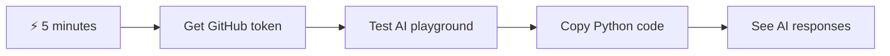

- **ਮਿੰਟ 1**: [GitHub Models Playground](https://github.com/marketplace/models/azure-openai/gpt-4o-mini/playground) 'ਤੇ ਜਾਓ ਅਤੇ ਇੱਕ ਪੈਰਸਨਲ ਐਕਸੈਸ ਟੋਕਨ ਬਣਾਓ
- **ਮਿੰਟ 2**: ਪਲੇਗਰਾਊਂਡ ਇੰਟਰਫੇਸ ਵਿੱਚ ਸਿੱਧੇ AI ਇੰਟਰੈਕਸ਼ਨ ਟੈਸਟ ਕਰੋ
- **ਮਿੰਟ 3**: "Code" ਟੈਬ 'ਤੇ ਕਲਿਕ ਕਰੋ ਅਤੇ Python ਸਨਿਪਟ ਕਾਪੀ ਕਰੋ
- **ਮਿੰਟ 4**: ਆਪਣੇ ਟੋਕਨ ਨਾਲ ਕੋਡ ਨੂੰ ਲੋਕਲ ਰਨ ਕਰੋ: `GITHUB_TOKEN=your_token python test.py`
- **ਮਿੰਟ 5**: ਆਪਣੇ ਕੋਡ ਤੋਂ ਪਹਿਲਾ AI ਜਵਾਬ ਪੈਦਾ ਹੁੰਦਾ ਦੇਖੋ

**ਤੁਰੰਤ ਟੈਸਟ ਕੋਡ**:
```python
import os
from openai import OpenAI

client = OpenAI(
    base_url="https://models.github.ai/inference",
    api_key="your_token_here"
)

response = client.chat.completions.create(
    messages=[{"role": "user", "content": "Hello AI!"}],
    model="openai/gpt-4o-mini"
)

print(response.choices[0].message.content)
```

**ਇਸਦਾ ਮਹੱਤਵ ਕਿਉਂ ਹੈ**: 5 ਮਿੰਟਾਂ ਵਿੱਚ, ਤੁਸੀਂ ਪ੍ਰੋਗਰਾਮੈਟਿਕ AI ਇੰਟਰੈਕਸ਼ਨ ਦਾ ਜਾਦੂ ਅਨੁਭਵ ਕਰੋਗੇ। ਇਹ ਉਹ ਬੁਨਿਆਦੀ ਇਮਾਰਤ ਹੈ ਜੋ ਹਰ AI ਐਪਲੀਕੇਸ਼ਨ ਨੂੰ ਸ਼ਕਤੀ ਦੇਣ ਵਾਲੀ ਹੈ ਜੋ ਤੁਸੀਂ ਵਰਤਦੇ ਹੋ।

ਤੁਹਾਡਾ ਤਿਆਰ ਪ੍ਰੋਜੈਕਟ ਕੁਝ ਇਸ ਤਰ੍ਹਾਂ ਦੇਖਾਈ ਦੇਵੇਗਾ:

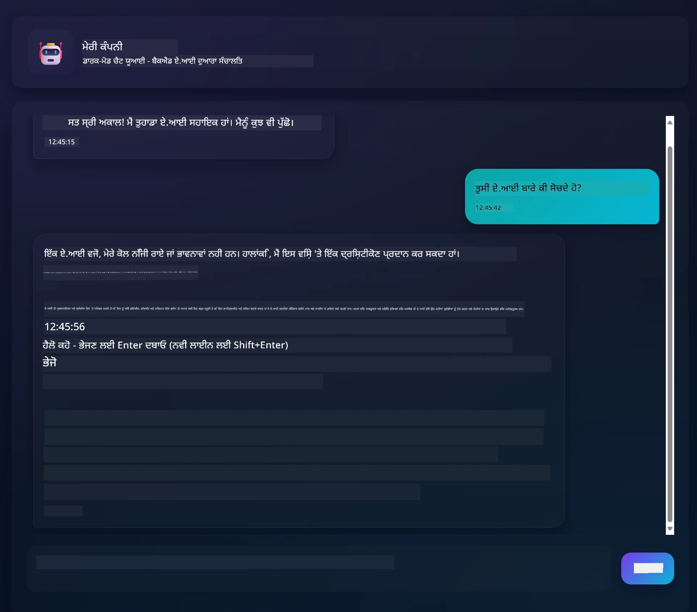

## 🗺️ AI ਐਪਲੀਕੇਸ਼ਨ ਡਿਵੈਲਪਮੈਂਟ ਦੁਆਰਾ ਤੁਹਾਡਾ ਸਿੱਖਣ ਦਾ ਸਫਰ

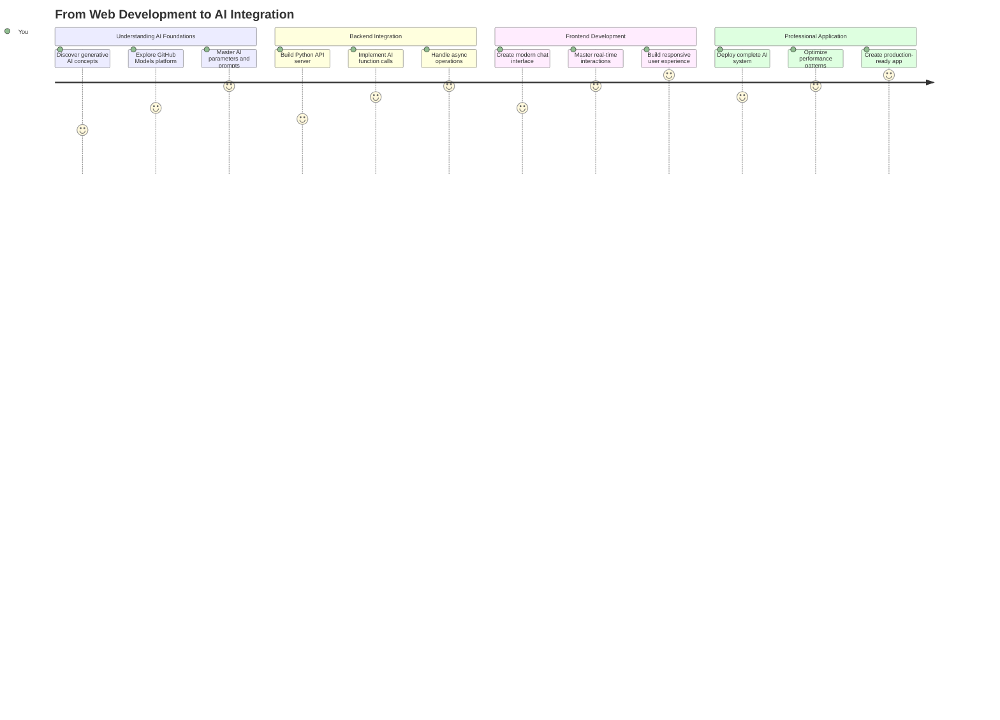

**ਤੁਹਾਡਾ ਸਫਰ ਦਾ ਮੰਜ਼ਿਲ**: ਇਸ ਪਾਠ ਦੇ ਅੰਤ ਤੱਕ, ਤੁਸੀਂ ਇੱਕ ਪੂਰੀ AI-ਸ਼ਕਤੀ ਵਾਲੀ ਐਪਲੀਕੇਸ਼ਨ ਬਣਾਈ ਹੋਵੇਗੀ ਜੋ ਉਹੀ ਤਕਨਾਲੋਜੀਆਂ ਅਤੇ ਪੈਟਰਨ ਦੀ ਵਰਤੋਂ ਕਰਦੀ ਹੈ ਜੋ ਆਧੁਨਿਕ AI ਅਸਿਸਟੈਂਟਾਂ ਨੂੰ ਸ਼ਕਤੀ ਦੇਣ ਵਾਲੇ ਹਨ ਜਿਵੇਂ ChatGPT, Claude, ਅਤੇ Google Bard।

## AI ਨੂੰ ਸਮਝਣਾ: ਰਹੱਸ ਤੋਂ ਮਾਹਰਤਾ ਤੱਕ

ਕੋਡ ਵਿੱਚ ਡੁੱਬਣ ਤੋਂ ਪਹਿਲਾਂ, ਆਓ ਸਮਝੀਏ ਕਿ ਅਸੀਂ ਕੀ ਕਰ ਰਹੇ ਹਾਂ। ਜੇ ਤੁਸੀਂ APIs ਦੀ ਵਰਤੋਂ ਕੀਤੀ ਹੈ, ਤਾਂ ਤੁਹਾਨੂੰ ਬੁਨਿਆਦੀ ਪੈਟਰਨ ਪਤਾ ਹੋਵੇਗਾ: ਇੱਕ ਬੇਨਤੀ ਭੇਜੋ, ਇੱਕ ਜਵਾਬ ਪ੍ਰਾਪਤ ਕਰੋ।

AI APIs ਇੱਕ ਸਮਾਨ ਢਾਂਚੇ ਦੀ ਪਾਲਣਾ ਕਰਦੇ ਹਨ, ਪਰ ਡਾਟਾਬੇਸ ਤੋਂ ਪਹਿਲਾਂ ਤੋਂ ਸਟੋਰ ਕੀਤੇ ਡਾਟਾ ਨੂੰ ਪ੍ਰਾਪਤ ਕਰਨ ਦੀ ਬਜਾਏ, ਉਹ ਨਵੇਂ ਜਵਾਬ ਪੈਦਾ ਕਰਦੇ ਹਨ ਜੋ ਵੱਡੇ ਪੱਧਰ ਦੇ ਟੈਕਸਟ ਤੋਂ ਸਿੱਖੇ ਗਏ ਪੈਟਰਨਾਂ ਦੇ ਆਧਾਰ 'ਤੇ ਹੁੰਦੇ ਹਨ। ਇਸਨੂੰ ਇੱਕ ਲਾਇਬ੍ਰੇਰੀ ਕੈਟਾਲੌਗ ਸਿਸਟਮ ਅਤੇ ਇੱਕ ਜਾਣਕਾਰ ਲਾਇਬ੍ਰੇਰੀਅਨ ਦੇ ਵਿਚਕਾਰ ਅੰਤਰ ਵਾਂਗ ਸੋਚੋ ਜੋ ਕਈ ਸਰੋਤਾਂ ਤੋਂ ਜਾਣਕਾਰੀ ਨੂੰ ਸਮਰਥਿਤ ਕਰ ਸਕਦਾ ਹੈ।

### "Generative AI" ਅਸਲ ਵਿੱਚ ਕੀ ਹੈ?

ਸੋਚੋ ਕਿ ਰੋਸੇਟਾ ਸਟੋਨ ਨੇ ਮਿਸਰੀ ਹਾਇਰੋਗਲਿਫਿਕਸ ਨੂੰ ਸਮਝਣ ਲਈ ਪੈਟਰਨ ਲੱਭਣ ਵਿੱਚ ਵਿਦਵਾਨਾਂ ਦੀ ਮਦਦ ਕੀਤੀ, AI ਮਾਡਲ ਇਸੇ ਤਰ੍ਹਾਂ ਕੰਮ ਕਰਦੇ ਹਨ – ਉਹ ਵੱਡੇ ਪੱਧਰ ਦੇ ਟੈਕਸਟ ਵਿੱਚ ਪੈਟਰਨ ਲੱਭਦੇ ਹਨ ਕਿ ਭਾਸ਼ਾ ਕਿਵੇਂ ਕੰਮ ਕਰਦੀ ਹੈ, ਫਿਰ ਉਹ ਪੈਟਰਨਾਂ ਦੀ ਵਰਤੋਂ ਕਰਦੇ ਹਨ ਨਵੇਂ ਸਵਾਲਾਂ ਦੇ ਉਚਿਤ ਜਵਾਬ ਪੈਦਾ ਕਰਨ ਲਈ।

**ਇਸਨੂੰ ਇੱਕ ਸਧਾਰਨ ਤੁਲਨਾ ਨਾਲ ਸਮਝਾਉਣ ਦੀ ਕੋਸ਼ਿਸ਼ ਕਰਦਾ ਹਾਂ:**
- **ਪ੍ਰੰਪਰਾਗਤ ਡਾਟਾਬੇਸ**: ਜਿਵੇਂ ਤੁਹਾਡਾ ਜਨਮ ਸਰਟੀਫਿਕੇਟ ਮੰਗਣਾ – ਤੁਹਾਨੂੰ ਹਰ ਵਾਰ ਉਹੀ ਦਸਤਾਵੇਜ਼ ਮਿਲਦਾ ਹੈ
- **ਸਰਚ ਇੰਜਨ**: ਜਿਵੇਂ ਇੱਕ ਲਾਇਬ੍ਰੇਰੀਅਨ ਨੂੰ ਬਿੱਲੀਆਂ ਬਾਰੇ ਕਿਤਾਬਾਂ ਲੱਭਣ ਲਈ ਕਹਿਣਾ – ਉਹ ਤੁਹਾਨੂੰ ਦਿਖਾਉਂਦੇ ਹਨ ਕਿ ਕੀ ਉਪਲਬਧ ਹੈ
- **Generative AI**: ਜਿਵੇਂ ਇੱਕ ਜਾਣਕਾਰ ਦੋਸਤ ਨੂੰ ਬਿੱਲੀਆਂ ਬਾਰੇ ਪੁੱਛਣਾ – ਉਹ ਤੁਹਾਨੂੰ ਦਿਲਚਸਪ ਚੀਜ਼ਾਂ ਆਪਣੇ ਸ਼ਬਦਾਂ ਵਿੱਚ ਦੱਸਦੇ ਹਨ, ਜੋ ਤੁਹਾਡੇ ਜਾਣਨ ਦੀ ਇੱਛਾ ਦੇ ਅਨੁਕੂਲ ਹੁੰਦੇ ਹਨ

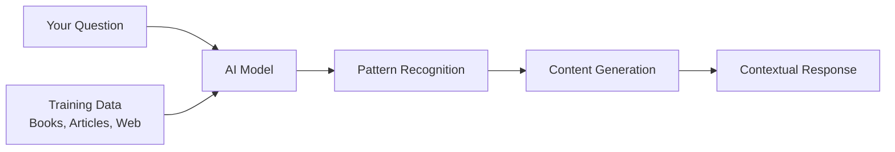

### AI ਮਾਡਲ ਕਿਵੇਂ ਸਿੱਖਦੇ ਹਨ (ਸਧਾਰਨ ਵਰਜਨ)

AI ਮਾਡਲ ਵੱਡੇ ਪੱਧਰ ਦੇ ਡਾਟਾਸੈਟਾਂ ਦੇ ਸੰਪਰਕ ਦੁਆਰਾ ਸਿੱਖਦੇ ਹਨ ਜੋ ਕਿਤਾਬਾਂ, ਲੇਖਾਂ ਅਤੇ ਗੱਲਬਾਤਾਂ ਵਿੱਚ ਟੈਕਸਟ ਸ਼ਾਮਲ ਕਰਦੇ ਹਨ। ਇਸ ਪ੍ਰਕਿਰਿਆ ਦੁਆਰਾ, ਉਹ ਪੈਟਰਨਾਂ ਦੀ ਪਛਾਣ ਕਰਦੇ ਹਨ:
- ਲਿਖਤ ਸੰਚਾਰ ਵਿੱਚ ਵਿਚਾਰ ਕਿਵੇਂ ਬਣਦੇ ਹਨ
- ਕਿਹੜੇ ਸ਼ਬਦ ਆਮ ਤੌਰ 'ਤੇ ਇਕੱਠੇ ਆਉਂਦੇ ਹਨ
- ਗੱਲਬਾਤਾਂ ਆਮ ਤੌਰ 'ਤੇ ਕਿਵੇਂ ਵਗਦੀਆਂ ਹਨ
- ਅਧਿਕਾਰਕ ਅਤੇ ਅਨੌਪਚਾਰਿਕ ਸੰਚਾਰ ਦੇ ਵਿਚਕਾਰ ਸੰਦਰਭਕ ਅੰਤਰ

**ਇਹ ਕੁਝ ਇਸ ਤਰ੍ਹਾਂ ਹੈ ਜਿਵੇਂ ਪੁਰਾਤੱਤਵ ਵਿਦਾਂਤੀਆਂ ਪ੍ਰਾਚੀਨ ਭਾਸ਼ਾਵਾਂ ਨੂੰ ਡਿਕੋਡ ਕਰਦੇ ਹਨ**: ਉਹ ਹਜ਼ਾਰਾਂ ਉਦਾਹਰਣਾਂ ਦਾ ਵਿਸ਼ਲੇਸ਼ਣ ਕਰਦੇ ਹਨ ਤਾਂ ਜੋ ਵਿਆਕਰਨ, ਸ਼ਬਦਾਵਲੀ ਅਤੇ ਸੱਭਿਆਚਾਰਕ ਸੰਦਰਭ ਨੂੰ ਸਮਝ ਸਕਣ, ਆਖਰਕਾਰ ਉਹ ਸਿੱਖੇ ਪੈਟਰਨਾਂ ਦੀ ਵਰਤੋਂ ਕਰਕੇ ਨਵੇਂ ਟੈਕਸਟਾਂ ਦੀ ਵਿਆਖਿਆ ਕਰਨ ਦੇ ਯੋਗ ਹੋ ਜਾਂਦੇ ਹਨ।

### GitHub ਮਾਡਲ ਕਿਉਂ?

ਅਸੀਂ GitHub ਮਾਡਲਾਂ ਦੀ ਵਰਤੋਂ ਕਰ ਰਹੇ ਹਾਂ ਇੱਕ ਕਾਫ਼ੀ ਵਿਆਹਕ ਕਾਰਨ ਲਈ – ਇਹ ਸਾਨੂੰ ਆਪਣਾ AI ਢਾਂਚਾ ਸੈਟਅਪ ਕਰਨ ਦੀ ਲੋੜ ਬਿਨਾਂ ਐਂਟਰਪ੍ਰਾਈਜ਼-ਪੱਧਰ ਦੇ AI ਤੱਕ ਪਹੁੰਚ ਪ੍ਰਦਾਨ ਕਰਦਾ ਹੈ (ਜੋ, ਮੈਨੂੰ ਵਿਸ਼ਵਾਸ ਕਰੋ, ਤੁਸੀਂ ਇਸ ਸਮੇਂ ਨਹੀਂ ਕਰਨਾ ਚਾਹੁੰਦੇ!). ਇਸਨੂੰ ਮੌਸਮ API ਦੀ ਵਰਤੋਂ ਕਰਨ ਵਾਂਗ ਸੋਚੋ ਬਜਾਏ ਕਿ ਹਰ ਜਗ੍ਹਾ ਮੌਸਮ ਸਟੇਸ਼ਨ ਸੈਟਅਪ ਕਰਕੇ ਮੌਸਮ ਦੀ ਪੇਸ਼ਗੂਈ ਕਰਨ ਦੀ ਕੋਸ਼ਿਸ਼ ਕਰਨਾ।

ਇਹ ਅਸਲ ਵਿੱਚ "AI-as-a-Service" ਹੈ, ਅਤੇ ਸਭ ਤੋਂ ਵਧੀਆ ਗੱਲ? ਸ਼ੁਰੂਆਤ ਕਰਨ ਲਈ ਇਹ ਮੁਫ਼ਤ ਹੈ, ਤਾਂ ਜੋ ਤੁਸੀਂ ਵੱਡੇ ਬਿੱਲ ਦੀ ਚਿੰਤਾ ਕੀਤੇ ਬਿਨਾਂ ਪ੍ਰਯੋਗ ਕਰ ਸਕੋ।

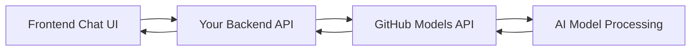

ਅਸੀਂ ਆਪਣੇ ਬੈਕਐਂਡ ਇੰਟੀਗ੍ਰੇਸ਼ਨ ਲਈ GitHub ਮਾਡਲਾਂ ਦੀ ਵਰਤੋਂ ਕਰਾਂਗੇ, ਜੋ ਡਿਵੈਲਪਰ-ਫ੍ਰੈਂਡਲੀ ਇੰਟਰਫੇਸ ਦੁਆਰਾ ਪੇਸ਼ੇਵਰ-ਗੁਣਵੱਤਾ ਵਾਲੇ AI ਸਮਰੱਥਾ ਤੱਕ ਪਹੁੰਚ ਪ੍ਰਦਾਨ ਕਰਦਾ ਹੈ। [GitHub Models Playground](https://github.com/marketplace/models/azure-openai/gpt-4o-mini/playground) ਇੱਕ ਟੈਸਟਿੰਗ ਵਾਤਾਵਰਣ ਵਜੋਂ ਕੰਮ ਕਰਦਾ ਹੈ ਜਿੱਥੇ ਤੁਸੀਂ ਵੱਖ-ਵੱਖ AI ਮਾਡਲਾਂ ਨਾਲ ਪ੍ਰਯੋਗ ਕਰ ਸਕਦੇ ਹੋ ਅਤੇ ਉਹਨਾਂ ਦੀ ਸਮਰੱਥਾ ਨੂੰ ਕੋਡ ਵਿੱਚ ਲਾਗੂ ਕਰਨ ਤੋਂ ਪਹਿਲਾਂ ਸਮਝ ਸਕਦੇ ਹੋ।

## 🧠 AI ਐਪਲੀਕੇਸ਼ਨ ਡਿਵੈਲਪਮੈਂਟ ਇਕੋਸਿਸਟਮ

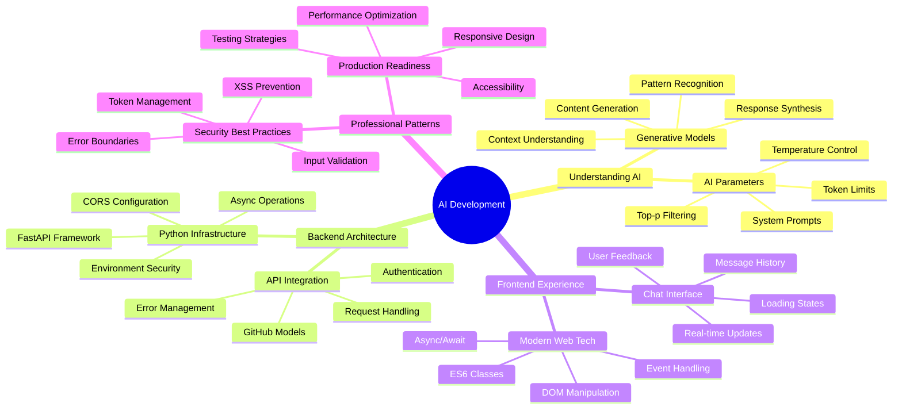

**ਮੁੱਖ ਸਿਧਾਂਤ**: AI ਐਪਲੀਕੇਸ਼ਨ ਡਿਵੈਲਪਮੈਂਟ ਰਵਾਇਤੀ ਵੈੱਬ ਡਿਵੈਲਪਮੈਂਟ ਹੁਨਰਾਂ ਨੂੰ AI ਸੇਵਾ ਇੰਟੀਗ੍ਰੇਸ਼ਨ ਨਾਲ ਜੋੜਦਾ ਹੈ, ਬੁੱਧੀਮਾਨ ਐਪਲੀਕੇਸ਼ਨ ਬਣਾਉਂਦਾ ਹੈ ਜੋ ਯੂਜ਼ਰਾਂ ਲਈ ਕੁਦਰਤੀ ਅਤੇ ਪ੍ਰਤੀਕ੍ਰਿਆਸ਼ੀਲ ਮਹਿਸੂਸ ਹੁੰਦੇ ਹਨ।

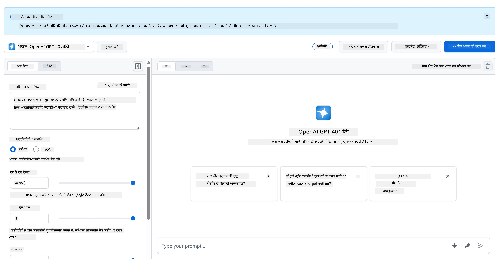

**ਇਹ ਪਲੇਗਰਾਊਂਡ ਨੂੰ ਕਿੰਨਾ ਲਾਭਕਾਰੀ ਬਣਾਉਂਦਾ ਹੈ:**
- **ਵੱਖ-ਵੱਖ AI ਮਾਡਲਾਂ ਦੀ ਜਾਂਚ ਕਰੋ** ਜਿਵੇਂ GPT-4o-mini, Claude, ਅਤੇ ਹੋਰ (ਸਭ ਮੁਫ਼ਤ!)
- **ਆਪਣੇ ਵਿਚਾਰਾਂ ਅਤੇ ਪ੍ਰਸ਼ਨਾਂ ਦੀ ਜਾਂਚ ਕਰੋ** ਜੇਕਰ ਤੁਸੀਂ ਕੋਈ ਕੋਡ ਨਹੀਂ ਲਿਖਦੇ
- **ਤਿਆਰ-ਵਰਤਣਯੋਗ ਕੋਡ ਸਨਿਪਟ ਪ੍ਰਾਪਤ ਕਰੋ** ਤੁਹਾਡੇ ਮਨਪਸੰਦ ਪ੍ਰੋਗਰਾਮਿੰਗ ਭਾਸ਼ਾ ਵਿੱਚ
- **ਸੈਟਿੰਗਾਂ ਨੂੰ ਠੀਕ ਕਰੋ** ਜਿਵੇਂ ਕ੍ਰੀਏਟਿਵਿਟੀ ਪੱਧਰ ਅਤੇ ਜਵਾਬ ਦੀ ਲੰਬਾਈ ਦੇਖਣ ਲਈ ਕਿ ਉਹ ਨਤੀਜੇ 'ਤੇ ਕਿਵੇਂ ਪ੍ਰਭਾਵ ਪਾਉਂਦੇ ਹਨ

ਜਦੋਂ ਤੁਸੀਂ ਕੁਝ ਖੇਡ ਲੈਂਦੇ ਹੋ, ਸਿਰਫ਼ "Code" ਟੈਬ 'ਤੇ ਕਲਿਕ ਕਰੋ ਅਤੇ ਆਪਣੀ ਪ੍ਰੋਗਰਾਮਿੰਗ ਭਾਸ਼ਾ ਚੁਣੋ ਤਾਂ ਜੋ ਤੁਹਾਨੂੰ ਲਾਗੂ ਕਰਨ ਲਈ ਲੋੜੀਂਦਾ ਕੋਡ ਮਿਲੇ।


## Python ਬੈਕਐਂਡ ਇੰਟੀਗ੍ਰੇਸ਼ਨ ਸੈਟਅਪ ਕਰਨਾ

ਹੁਣ ਆਓ Python ਦੀ ਵਰਤੋਂ ਕਰਕੇ AI ਇੰਟੀਗ੍ਰੇਸ਼ਨ ਲਾਗੂ ਕਰੀਏ। Python AI ਐਪਲੀਕੇਸ਼ਨਾਂ ਲਈ ਸ਼ਾਨਦਾਰ ਹੈ ਕਿਉਂਕਿ ਇਸਦਾ ਸਧਾਰਨ ਸਿੰਟੈਕਸ ਅਤੇ ਸ਼ਕਤੀਸ਼ਾਲੀ ਲਾਇਬ੍ਰੇਰੀਆਂ ਹਨ। ਅਸੀਂ GitHub Models ਪਲੇਗਰਾਊਂਡ ਤੋਂ ਕੋਡ ਨਾਲ ਸ਼ੁਰੂ ਕਰਾਂਗੇ ਅਤੇ ਫਿਰ ਇਸਨੂੰ ਇੱਕ ਦੁਬਾਰਾ ਵਰਤਣਯੋਗ, ਉਤਪਾਦਨ-ਤਿਆਰ ਫੰਕਸ਼ਨ ਵਿੱਚ ਰਿਫੈਕਟਰ ਕਰਾਂਗੇ।

### ਬੇਸ ਇੰਪਲੀਮੈਂਟੇਸ਼ਨ ਨੂੰ ਸਮਝਣਾ

ਜਦੋਂ ਤੁਸੀਂ ਪਲੇਗਰਾਊਂਡ ਤੋਂ Python ਕੋਡ ਲੈਂਦੇ ਹੋ, ਤੁਹਾਨੂੰ ਕੁਝ ਇਸ ਤਰ੍ਹਾਂ ਮਿਲੇਗਾ। ਚਿੰਤਾ ਨਾ ਕਰੋ ਜੇ ਇਹ ਪਹਿਲਾਂ ਵਧੇਰੇ ਜਾਪਦਾ ਹੈ – ਆਓ ਇਸਨੂੰ ਟੁਕੜੇ-ਟੁਕੜੇ ਵਿੱਚ ਸਮਝੀਏ:

```python
"""Run this model in Python

> pip install openai
"""
import os
from openai import OpenAI

# To authenticate with the model you will need to generate a personal access token (PAT) in your GitHub settings. 
# Create your PAT token by following instructions here: https://docs.github.com/en/authentication/keeping-your-account-and-data-secure/managing-your-personal-access-tokens
client = OpenAI(
    base_url="https://models.github.ai/inference",
    api_key=os.environ["GITHUB_TOKEN"],
)

response = client.chat.completions.create(
    messages=[
        {
            "role": "system",
            "content": "",
        },
        {
            "role": "user",
            "content": "What is the capital of France?",
        }
    ],
    model="openai/gpt-4o-mini",
    temperature=1,
    max_tokens=4096,
    top_p=1
)

print(response.choices[0].message.content)
```

**ਇਸ ਕੋਡ ਵਿੱਚ ਕੀ ਹੋ ਰਿਹਾ ਹੈ:**
- **ਅਸੀਂ ਉਹ ਟੂਲਜ਼ ਇੰਪੋਰਟ ਕਰਦੇ ਹਾਂ** ਜਿਨ੍ਹਾਂ ਦੀ ਲੋੜ ਹੈ: `os` ਵਾਤਾਵਰਣ ਵੈਰੀਏਬਲਾਂ ਨੂੰ ਪੜ੍ਹਨ ਲਈ ਅਤੇ `OpenAI` AI ਨਾਲ ਗੱਲ ਕਰਨ ਲਈ
- **ਅਸੀਂ OpenAI ਕਲਾਇੰਟ ਸੈਟਅਪ ਕਰਦੇ ਹਾਂ** ਤਾਂ ਜੋ GitHub ਦੇ AI ਸਰਵਰਾਂ ਨੂੰ ਸਿੱਧਾ ਪੋਇੰਟ ਕਰ ਸਕੇ
- **ਅਸੀਂ ਪ੍ਰਮਾਣਿਕਤਾ ਕਰਦੇ ਹਾਂ** ਇੱਕ ਵਿਸ਼ੇਸ਼ GitHub ਟੋਕਨ ਦੀ ਵਰਤੋਂ ਕਰਕੇ (ਇਸ ਬਾਰੇ ਹੋਰ ਬਾਅਦ ਵਿੱਚ!)
- **ਅਸੀਂ ਆਪਣੀ ਗੱਲਬਾਤ ਨੂੰ ਬਣਾਉਂਦੇ ਹਾਂ** ਵੱਖ-ਵੱਖ "ਰੋਲ" ਨਾਲ – ਇਸਨੂੰ ਇੱਕ ਨਾਟਕ ਲਈ ਸਟੇਜ ਸੈਟ ਕਰਨ ਵਾਂਗ ਸੋਚੋ
- **ਅਸੀਂ ਆਪਣੀ ਬੇਨਤੀ AI ਨੂੰ ਭੇਜਦੇ ਹਾਂ** ਕੁਝ ਫਾਈਨ-ਟੂਨਿੰਗ ਪੈਰਾਮੀਟਰਾਂ ਨਾਲ
- **ਅਸੀਂ ਅਸਲ ਜਵਾਬ ਟੈਕਸਟ ਨੂੰ ਕੱਢਦੇ ਹਾਂ** ਸਾਰੇ ਡਾਟਾ ਵਿੱਚੋਂ ਜੋ ਵਾਪਸ ਆਉਂਦਾ ਹੈ

### ਮੈਸੇਜ ਰੋਲ ਨੂੰ ਸਮਝਣਾ: AI ਗੱਲਬਾਤ ਦਾ ਢਾਂਚਾ

AI ਗੱਲਬਾਤਾਂ ਇੱਕ ਵਿਸ਼ੇਸ਼ ਢਾਂਚੇ ਦੀ ਵਰਤੋਂ ਕਰਦੀਆਂ ਹਨ ਜਿਸ ਵਿੱਚ ਵੱਖ-ਵੱਖ "ਰੋਲ" ਹੁੰਦੇ ਹਨ ਜੋ ਵੱਖ-ਵੱਖ ਉਦੇਸ਼ਾਂ ਦੀ ਸੇਵਾ ਕਰਦੇ ਹਨ:

```python
messages=[
    {
        "role": "system",
        "content": "You are a helpful assistant who explains things simply."
    },
    {
        "role": "user", 
        "content": "What is machine learning?"
    }
]
```

**ਇਸਨੂੰ ਇੱਕ ਨਾਟਕ ਨੂੰ ਡਾਇਰੈਕਟ ਕਰਨ ਵਾਂਗ ਸੋਚੋ:**
- **ਸਿਸਟਮ ਰੋਲ**: ਜਿਵੇਂ ਇੱਕ ਅਦਾਕਾਰ ਲਈ ਸਟੇਜ ਦਿਸ਼ਾ-ਨਿਰਦੇਸ਼ – ਇਹ AI ਨੂੰ ਦੱਸਦਾ ਹੈ ਕਿ ਕਿਵੇਂ ਵਿਹਾਰ ਕਰਨਾ ਹੈ, ਕਿਹੜੀ ਸ਼ਖਸੀਅਤ ਹੋਣੀ ਹੈ, ਅਤੇ ਕਿਵੇਂ ਜਵਾਬ ਦੇਣਾ ਹੈ
- **ਯੂਜ਼ਰ ਰੋਲ**: ਅਸਲ ਸਵਾਲ ਜਾਂ ਸੁਨੇਹਾ ਜੋ ਤੁਹਾਡੇ ਐਪਲੀਕੇਸ਼ਨ ਨੂੰ ਵਰਤਣ ਵਾਲੇ ਵਿਅਕਤੀ ਤੋਂ ਆਉਂਦਾ ਹੈ
- **ਅਸਿਸਟੈਂਟ ਰੋਲ**: AI ਦਾ ਜਵਾਬ (ਤੁਸੀਂ ਇਹ ਨਹੀਂ ਭੇਜਦੇ
**2. ਆਉਟਪੁੱਟ ਫਾਰਮੈਟਿੰਗ**: AI ਨੂੰ ਦੱਸੋ ਕਿ ਜਵਾਬਾਂ ਨੂੰ ਕਿਵੇਂ ਢਾਂਚੇਬੱਧ ਕਰਨਾ ਹੈ  
```python
system_prompt = """
You are a technical mentor. Always structure your responses as:
1. Quick Answer (1-2 sentences)
2. Detailed Explanation 
3. Code Example
4. Common Pitfalls to Avoid
5. Next Steps for Learning
"""
```
  
**3. ਪਾਬੰਦੀ ਸੈਟਿੰਗ**: AI ਨੂੰ ਦੱਸੋ ਕਿ ਕੀ ਨਹੀਂ ਕਰਨਾ  
```python
system_prompt = """
You are a coding tutor focused on teaching best practices. Never write complete 
solutions for the user - instead, guide them with hints and questions so they 
learn by doing. Always explain the 'why' behind coding decisions.
"""
```
  
#### ਤੁਹਾਡੇ ਚੈਟ ਅਸਿਸਟੈਂਟ ਲਈ ਇਹ ਕਿਉਂ ਮਹੱਤਵਪੂਰਨ ਹੈ  

ਸਿਸਟਮ ਪ੍ਰੋੰਪਟਸ ਨੂੰ ਸਮਝਣਾ ਤੁਹਾਨੂੰ ਵਿਸ਼ੇਸ਼ਤਾਈ AI ਅਸਿਸਟੈਂਟ ਬਣਾਉਣ ਦੀ ਸ਼ਕਤੀ ਦਿੰਦਾ ਹੈ:  
- **ਕਸਟਮਰ ਸਰਵਿਸ ਬੋਟ**: ਮਦਦਗਾਰ, ਧੀਰਜਵਾਨ, ਨੀਤੀ-ਜਾਗਰੂਕ  
- **ਸਿੱਖਣ ਵਾਲਾ ਟਿਊਟਰ**: ਉਤਸ਼ਾਹਿਤ ਕਰਨ ਵਾਲਾ, ਕਦਮ-ਦਰ-ਕਦਮ, ਸਮਝਣ ਦੀ ਜਾਂਚ ਕਰਦਾ ਹੈ  
- **ਕ੍ਰਿਏਟਿਵ ਸਾਥੀ**: ਕਲਪਨਾਤਮਕ, ਵਿਚਾਰਾਂ 'ਤੇ ਕੰਮ ਕਰਦਾ ਹੈ, "ਕੀ ਹੋਵੇ ਜੇ?" ਪੁੱਛਦਾ ਹੈ  
- **ਤਕਨੀਕੀ ਵਿਸ਼ੇਸ਼ਗਿਆਨ**: ਸਹੀ, ਵਿਸਤ੍ਰਿਤ, ਸੁਰੱਖਿਆ-ਜਾਗਰੂਕ  

**ਮੁੱਖ ਅੰਕ**: ਤੁਸੀਂ ਸਿਰਫ AI API ਨੂੰ ਕਾਲ ਨਹੀਂ ਕਰ ਰਹੇ ਹੋ – ਤੁਸੀਂ ਇੱਕ ਕਸਟਮ AI ਪੁਰਸ਼ਾਰਥ ਬਣਾਉਣ ਦੀ ਕੋਸ਼ਿਸ਼ ਕਰ ਰਹੇ ਹੋ ਜੋ ਤੁਹਾਡੇ ਵਿਸ਼ੇਸ਼ ਉਪਯੋਗ ਮਾਮਲੇ ਦੀ ਸੇਵਾ ਕਰਦਾ ਹੈ। ਇਹ ਹੀ ਆਧੁਨਿਕ AI ਐਪਲੀਕੇਸ਼ਨਾਂ ਨੂੰ ਆਮ ਬਜਾਏ ਵਿਸ਼ੇਸ਼ ਅਤੇ ਲਾਭਦਾਇਕ ਮਹਿਸੂਸ ਕਰਦਾ ਹੈ।  

### 🎯 ਸਿੱਖਣ ਲਈ ਜਾਂਚ: AI ਪੁਰਸ਼ਾਰਥ ਪ੍ਰੋਗਰਾਮਿੰਗ  

**ਰੁਕੋ ਅਤੇ ਵਿਚਾਰ ਕਰੋ**: ਤੁਸੀਂ ਹੁਣ ਸਿਸਟਮ ਪ੍ਰੋੰਪਟਸ ਰਾਹੀਂ AI ਪੁਰਸ਼ਾਰਥਾਂ ਨੂੰ ਪ੍ਰੋਗਰਾਮ ਕਰਨ ਦਾ ਸਿਖਿਆ ਹੈ। ਇਹ ਆਧੁਨਿਕ AI ਐਪਲੀਕੇਸ਼ਨ ਵਿਕਾਸ ਵਿੱਚ ਇੱਕ ਮੂਲਭੂਤ ਹੁਨਰ ਹੈ।  

**ਤੁਰੰਤ ਸਵੈ-ਮੁਲਾਂਕਣ**:  
- ਕੀ ਤੁਸੀਂ ਸਮਝਾ ਸਕਦੇ ਹੋ ਕਿ ਸਿਸਟਮ ਪ੍ਰੋੰਪਟਸ ਆਮ ਯੂਜ਼ਰ ਸੁਨੇਹਿਆਂ ਤੋਂ ਕਿਵੇਂ ਵੱਖਰੇ ਹਨ?  
- ਤਾਪਮਾਨ ਅਤੇ top_p ਪੈਰਾਮੀਟਰਾਂ ਵਿੱਚ ਕੀ ਅੰਤਰ ਹੈ?  
- ਤੁਸੀਂ ਕਿਸੇ ਵਿਸ਼ੇਸ਼ ਉਪਯੋਗ ਮਾਮਲੇ (ਜਿਵੇਂ ਕਿ ਕੋਡਿੰਗ ਟਿਊਟਰ) ਲਈ ਸਿਸਟਮ ਪ੍ਰੋੰਪਟ ਕਿਵੇਂ ਬਣਾਉਂਦੇ ਹੋ?  

**ਅਸਲ-ਦੁਨੀਆ ਕਨੈਕਸ਼ਨ**: ਸਿਸਟਮ ਪ੍ਰੋੰਪਟ ਤਕਨੀਕਾਂ ਜੋ ਤੁਸੀਂ ਸਿੱਖੀਆਂ ਹਨ, ਹਰ ਵੱਡੀ AI ਐਪਲੀਕੇਸ਼ਨ ਵਿੱਚ ਵਰਤੀਆਂ ਜਾਂਦੀਆਂ ਹਨ - GitHub Copilot ਦੀ ਕੋਡਿੰਗ ਮਦਦ ਤੋਂ ਲੈ ਕੇ ChatGPT ਦੀ ਗੱਲਬਾਤ ਇੰਟਰਫੇਸ ਤੱਕ। ਤੁਸੀਂ ਉਹੀ ਪੈਟਰਨ ਸਿੱਖ ਰਹੇ ਹੋ ਜੋ ਵੱਡੇ ਟੈਕ ਕੰਪਨੀਆਂ ਦੇ AI ਉਤਪਾਦ ਟੀਮਾਂ ਦੁਆਰਾ ਵਰਤੇ ਜਾਂਦੇ ਹਨ।  

**ਚੁਣੌਤੀ ਸਵਾਲ**: ਤੁਸੀਂ ਵੱਖ-ਵੱਖ ਯੂਜ਼ਰ ਕਿਸਮਾਂ (ਸ਼ੁਰੂਆਤੀ ਬਨਾਮ ਮਾਹਰ) ਲਈ ਵੱਖ-ਵੱਖ AI ਪੁਰਸ਼ਾਰਥਾਂ ਕਿਵੇਂ ਡਿਜ਼ਾਈਨ ਕਰ ਸਕਦੇ ਹੋ? ਸੋਚੋ ਕਿ ਕਿਵੇਂ ਉਹੀ ਅਧਾਰਭੂਤ AI ਮਾਡਲ ਪ੍ਰੋੰਪਟ ਇੰਜੀਨੀਅਰਿੰਗ ਰਾਹੀਂ ਵੱਖ-ਵੱਖ ਦਰਸ਼ਕਾਂ ਦੀ ਸੇਵਾ ਕਰ ਸਕਦਾ ਹੈ।  

## FastAPI ਨਾਲ ਵੈੱਬ API ਬਣਾਉਣਾ: ਤੁਹਾਡਾ ਉੱਚ-ਪ੍ਰਦਰਸ਼ਨ AI ਸੰਚਾਰ ਹੱਬ  

ਹੁਣ ਆਓ ਬੈਕਐਂਡ ਬਣਾਈਏ ਜੋ ਤੁਹਾਡੇ ਫਰੰਟਐਂਡ ਨੂੰ AI ਸੇਵਾਵਾਂ ਨਾਲ ਜੋੜਦਾ ਹੈ। ਅਸੀਂ FastAPI ਵਰਤਾਂਗੇ, ਇੱਕ ਆਧੁਨਿਕ Python ਫਰੇਮਵਰਕ ਜੋ AI ਐਪਲੀਕੇਸ਼ਨਾਂ ਲਈ APIs ਬਣਾਉਣ ਵਿੱਚ ਸ਼ਾਨਦਾਰ ਹੈ।  

FastAPI ਇਸ ਪ੍ਰਕਾਰ ਦੇ ਪ੍ਰੋਜੈਕਟ ਲਈ ਕਈ ਫਾਇਦੇ ਪੇਸ਼ ਕਰਦਾ ਹੈ: ਸਮਕਾਲੀ ਬੇਨਤੀ ਸੰਭਾਲਣ ਲਈ ਬਣਾਈ ਗਈ async ਸਹਾਇਤਾ, ਸਵੈਚਾਲਿਤ API ਦਸਤਾਵੇਜ਼ੀਕਰਨ ਜਨਰੇਸ਼ਨ, ਅਤੇ ਸ਼ਾਨਦਾਰ ਪ੍ਰਦਰਸ਼ਨ। ਤੁਹਾਡਾ FastAPI ਸਰਵਰ ਇੱਕ ਮੱਧਵਰਗ ਦੇ ਤੌਰ 'ਤੇ ਕੰਮ ਕਰਦਾ ਹੈ ਜੋ ਫਰੰਟਐਂਡ ਤੋਂ ਬੇਨਤੀਆਂ ਪ੍ਰਾਪਤ ਕਰਦਾ ਹੈ, AI ਸੇਵਾਵਾਂ ਨਾਲ ਸੰਚਾਰ ਕਰਦਾ ਹੈ, ਅਤੇ ਫਾਰਮੈਟ ਕੀਤੇ ਜਵਾਬ ਵਾਪਸ ਕਰਦਾ ਹੈ।  

### AI ਐਪਲੀਕੇਸ਼ਨਾਂ ਲਈ FastAPI ਕਿਉਂ?  

ਤੁਸੀਂ ਸੋਚ ਰਹੇ ਹੋ: "ਕੀ ਮੈਂ ਸਿੱਧੇ ਆਪਣੇ ਫਰੰਟਐਂਡ ਜਾਵਾਸਕ੍ਰਿਪਟ ਤੋਂ AI ਨੂੰ ਕਾਲ ਨਹੀਂ ਕਰ ਸਕਦਾ?" ਜਾਂ "FastAPI ਬਜਾਏ Flask ਜਾਂ Django ਕਿਉਂ?" ਵਧੀਆ ਸਵਾਲ!  

**ਇਸ ਲਈ FastAPI ਸਾਡੇ ਬਣਾਉਣ ਲਈ ਬਿਹਤਰ ਹੈ:**  
- **Async ਡਿਫਾਲਟ ਦੁਆਰਾ**: ਕਈ AI ਬੇਨਤੀਆਂ ਨੂੰ ਇੱਕੋ ਸਮੇਂ ਸੰਭਾਲ ਸਕਦਾ ਹੈ ਬਿਨਾਂ ਰੁਕਣ ਦੇ  
- **ਸਵੈਚਾਲਿਤ ਦਸਤਾਵੇਜ਼**: `/docs` 'ਤੇ ਜਾਓ ਅਤੇ ਇੱਕ ਸੁੰਦਰ, ਇੰਟਰਐਕਟਿਵ API ਦਸਤਾਵੇਜ਼ੀਕਰਨ ਪੇਜ਼ ਮੁਫ਼ਤ ਪ੍ਰਾਪਤ ਕਰੋ  
- **ਬਿਲਟ-ਇਨ ਵੈਲੀਡੇਸ਼ਨ**: ਗਲਤੀਆਂ ਨੂੰ ਸਮੱਸਿਆ ਬਣਨ ਤੋਂ ਪਹਿਲਾਂ ਪਕੜਦਾ ਹੈ  
- **ਬਿਜਲੀ ਦੀ ਗਤੀ**: ਸਭ ਤੋਂ ਤੇਜ਼ Python ਫਰੇਮਵਰਕ ਵਿੱਚੋਂ ਇੱਕ  
- **ਆਧੁਨਿਕ Python**: Python ਦੀਆਂ ਸਾਰੀਆਂ ਨਵੀਆਂ ਅਤੇ ਸ਼ਾਨਦਾਰ ਵਿਸ਼ੇਸ਼ਤਾਵਾਂ ਵਰਤਦਾ ਹੈ  

**ਅਤੇ ਇਹ ਹੈ ਕਿ ਸਾਨੂੰ ਬੈਕਐਂਡ ਦੀ ਲੋੜ ਕਿਉਂ ਹੈ:**  

**ਸੁਰੱਖਿਆ**: ਤੁਹਾਡੀ AI API ਕੁੰਜੀ ਇੱਕ ਪਾਸਵਰ ਵਰਗੀ ਹੈ – ਜੇ ਤੁਸੀਂ ਇਸਨੂੰ ਫਰੰਟਐਂਡ ਜਾਵਾਸਕ੍ਰਿਪਟ ਵਿੱਚ ਰੱਖਦੇ ਹੋ, ਤਾਂ ਕੋਈ ਵੀ ਜੋ ਤੁਹਾਡੀ ਵੈੱਬਸਾਈਟ ਦੇ ਸਰੋਤ ਕੋਡ ਨੂੰ ਵੇਖਦਾ ਹੈ, ਇਸਨੂੰ ਚੋਰੀ ਕਰ ਸਕਦਾ ਹੈ ਅਤੇ ਤੁਹਾਡੇ AI ਕ੍ਰੈਡਿਟਸ ਦੀ ਵਰਤੋਂ ਕਰ ਸਕਦਾ ਹੈ। ਬੈਕਐਂਡ ਸੰਵੇਦਨਸ਼ੀਲ ਪ੍ਰਮਾਣ ਪੱਤਰਾਂ ਨੂੰ ਸੁਰੱਖਿਅਤ ਰੱਖਦਾ ਹੈ।  

**ਰੇਟ ਲਿਮਿਟਿੰਗ ਅਤੇ ਕੰਟਰੋਲ**: ਬੈਕਐਂਡ ਤੁਹਾਨੂੰ ਇਹ ਨਿਯੰਤਰਿਤ ਕਰਨ ਦਿੰਦਾ ਹੈ ਕਿ ਯੂਜ਼ਰ ਕਿੰਨੀ ਵਾਰ ਬੇਨਤੀ ਕਰ ਸਕਦੇ ਹਨ, ਯੂਜ਼ਰ ਪ੍ਰਮਾਣਿਕਤਾ ਲਾਗੂ ਕਰ ਸਕਦੇ ਹਨ, ਅਤੇ ਵਰਤੋਂ ਨੂੰ ਟ੍ਰੈਕ ਕਰਨ ਲਈ ਲੌਗਿੰਗ ਸ਼ਾਮਲ ਕਰ ਸਕਦੇ ਹਨ।  

**ਡਾਟਾ ਪ੍ਰੋਸੈਸਿੰਗ**: ਤੁਸੀਂ ਗੱਲਬਾਤਾਂ ਨੂੰ ਸੁਰੱਖਿਅਤ ਕਰਨਾ, ਅਣਚਾਹੀ ਸਮੱਗਰੀ ਨੂੰ ਫਿਲਟਰ ਕਰਨਾ, ਜਾਂ ਕਈ AI ਸੇਵਾਵਾਂ ਨੂੰ ਜੋੜਨਾ ਚਾਹੁੰਦੇ ਹੋ। ਇਹ ਤਰਕ ਬੈਕਐਂਡ ਵਿੱਚ ਹੁੰਦਾ ਹੈ।  

**ਆਰਕੀਟੈਕਚਰ ਗਾਹਕ-ਸਰਵਰ ਮਾਡਲ ਵਰਗ ਹੈ:**  
- **ਫਰੰਟਐਂਡ**: ਇੰਟਰਫੇਸ ਪਰਤ ਸੰਚਾਰ ਲਈ  
- **ਬੈਕਐਂਡ API**: ਬੇਨਤੀ ਪ੍ਰੋਸੈਸਿੰਗ ਅਤੇ ਰੂਟਿੰਗ ਪਰਤ  
- **AI ਸੇਵਾ**: ਬਾਹਰੀ ਗਣਨਾ ਅਤੇ ਜਵਾਬ ਜਨਰੇਸ਼ਨ  
- **ਵਾਤਾਵਰਣ ਵੈਰੀਏਬਲ**: ਸੁਰੱਖਿਅਤ ਸੰਰਚਨਾ ਅਤੇ ਪ੍ਰਮਾਣ ਪੱਤਰ ਸਟੋਰੇਜ  

### ਬੇਨਤੀ-ਜਵਾਬ ਪ੍ਰਵਾਹ ਨੂੰ ਸਮਝਣਾ  

ਆਓ ਪਤਾ ਲਗਾਈਏ ਕਿ ਜਦੋਂ ਕੋਈ ਯੂਜ਼ਰ ਸੁਨੇਹਾ ਭੇਜਦਾ ਹੈ ਤਾਂ ਕੀ ਹੁੰਦਾ ਹੈ:  

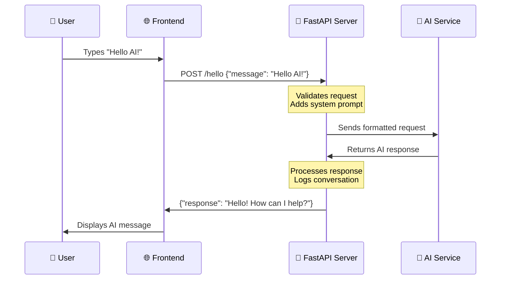
  
**ਹਰ ਕਦਮ ਨੂੰ ਸਮਝਣਾ:**  
1. **ਯੂਜ਼ਰ ਸੰਚਾਰ**: ਵਿਅਕਤੀ ਚੈਟ ਇੰਟਰਫੇਸ ਵਿੱਚ ਟਾਈਪ ਕਰਦਾ ਹੈ  
2. **ਫਰੰਟਐਂਡ ਪ੍ਰੋਸੈਸਿੰਗ**: ਜਾਵਾਸਕ੍ਰਿਪਟ ਇਨਪੁਟ ਨੂੰ ਕੈਪਚਰ ਕਰਦਾ ਹੈ ਅਤੇ ਇਸਨੂੰ JSON ਦੇ ਰੂਪ ਵਿੱਚ ਫਾਰਮੈਟ ਕਰਦਾ ਹੈ  
3. **API ਵੈਲੀਡੇਸ਼ਨ**: FastAPI Pydantic ਮਾਡਲਾਂ ਦੀ ਵਰਤੋਂ ਕਰਕੇ ਬੇਨਤੀ ਨੂੰ ਸਵੈਚਾਲਿਤ ਤੌਰ 'ਤੇ ਵੈਲੀਡੇਟ ਕਰਦਾ ਹੈ  
4. **AI ਇੰਟੀਗ੍ਰੇਸ਼ਨ**: ਬੈਕਐਂਡ ਸੰਦਰਭ (ਸਿਸਟਮ ਪ੍ਰੋੰਪਟ) ਸ਼ਾਮਲ ਕਰਦਾ ਹੈ ਅਤੇ AI ਸੇਵਾ ਨੂੰ ਕਾਲ ਕਰਦਾ ਹੈ  
5. **ਜਵਾਬ ਸੰਭਾਲਣਾ**: API AI ਜਵਾਬ ਪ੍ਰਾਪਤ ਕਰਦਾ ਹੈ ਅਤੇ ਜ਼ਰੂਰਤ ਪੈਣ 'ਤੇ ਇਸਨੂੰ ਸੋਧ ਸਕਦਾ ਹੈ  
6. **ਫਰੰਟਐਂਡ ਡਿਸਪਲੇਅ**: ਜਾਵਾਸਕ੍ਰਿਪਟ ਚੈਟ ਇੰਟਰਫੇਸ ਵਿੱਚ ਜਵਾਬ ਦਿਖਾਉਂਦਾ ਹੈ  

### API ਆਰਕੀਟੈਕਚਰ ਨੂੰ ਸਮਝਣਾ  

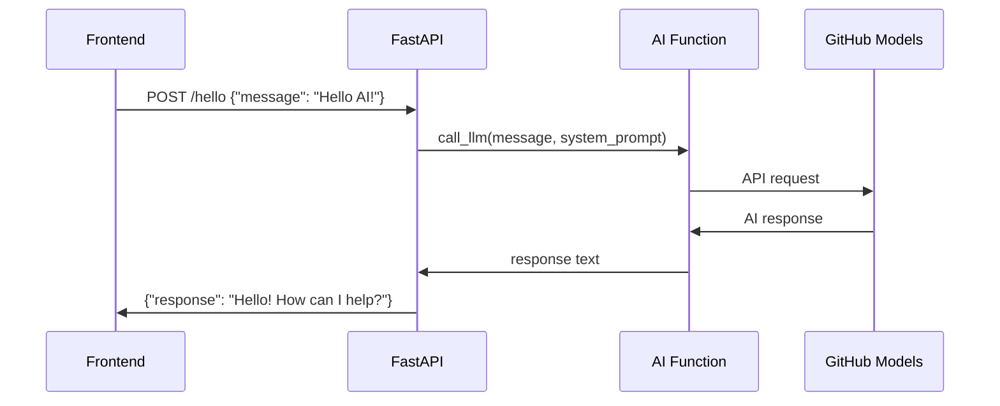
  
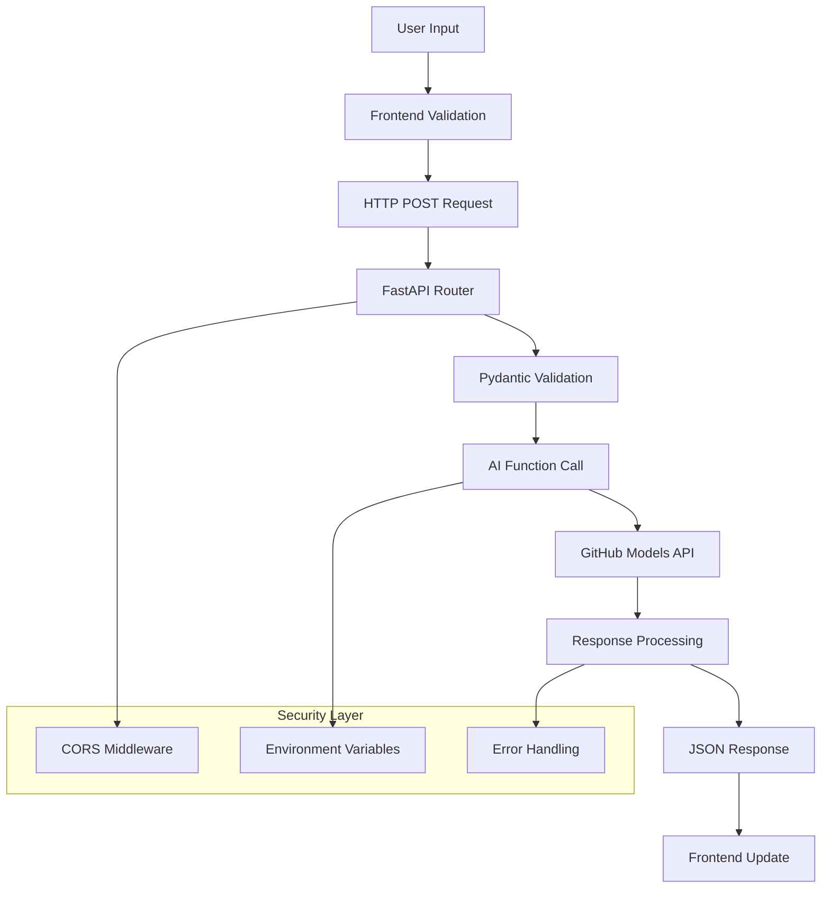
  
### FastAPI ਐਪਲੀਕੇਸ਼ਨ ਬਣਾਉਣਾ  

ਆਓ ਆਪਣੀ API ਕਦਮ-ਦਰ-ਕਦਮ ਬਣਾਈਏ। `api.py` ਨਾਮਕ ਫਾਈਲ ਬਣਾਓ ਜਿਸ ਵਿੱਚ ਹੇਠਾਂ ਦਿੱਤਾ FastAPI ਕੋਡ ਹੋਵੇ:  

```python
# api.py
from fastapi import FastAPI, HTTPException
from fastapi.middleware.cors import CORSMiddleware
from pydantic import BaseModel
from llm import call_llm
import logging

# Configure logging
logging.basicConfig(level=logging.INFO)
logger = logging.getLogger(__name__)

# Create FastAPI application
app = FastAPI(
    title="AI Chat API",
    description="A high-performance API for AI-powered chat applications",
    version="1.0.0"
)

# Configure CORS
app.add_middleware(
    CORSMiddleware,
    allow_origins=["*"],  # Configure appropriately for production
    allow_credentials=True,
    allow_methods=["*"],
    allow_headers=["*"],
)

# Pydantic models for request/response validation
class ChatMessage(BaseModel):
    message: str

class ChatResponse(BaseModel):
    response: str

@app.get("/")
async def root():
    """Root endpoint providing API information."""
    return {
        "message": "Welcome to the AI Chat API",
        "docs": "/docs",
        "health": "/health"
    }

@app.get("/health")
async def health_check():
    """Health check endpoint."""
    return {"status": "healthy", "service": "ai-chat-api"}

@app.post("/hello", response_model=ChatResponse)
async def chat_endpoint(chat_message: ChatMessage):
    """Main chat endpoint that processes messages and returns AI responses."""
    try:
        # Extract and validate message
        message = chat_message.message.strip()
        if not message:
            raise HTTPException(status_code=400, detail="Message cannot be empty")
        
        logger.info(f"Processing message: {message[:50]}...")
        
        # Call AI service (note: call_llm should be made async for better performance)
        ai_response = await call_llm_async(message, "You are a helpful and friendly assistant.")
        
        logger.info("AI response generated successfully")
        return ChatResponse(response=ai_response)
        
    except HTTPException:
        raise
    except Exception as e:
        logger.error(f"Error processing chat message: {str(e)}")
        raise HTTPException(status_code=500, detail="Internal server error")

if __name__ == "__main__":
    import uvicorn
    uvicorn.run(app, host="0.0.0.0", port=5000, reload=True)
```
  
**FastAPI ਅਮਲ ਨੂੰ ਸਮਝਣਾ:**  
- **ਇੰਪੋਰਟ ਕਰਦਾ ਹੈ** FastAPI ਆਧੁਨਿਕ ਵੈੱਬ ਫਰੇਮਵਰਕ ਕਾਰਗੁਜ਼ਾਰੀ ਲਈ ਅਤੇ Pydantic ਡਾਟਾ ਵੈਲੀਡੇਸ਼ਨ ਲਈ  
- **ਸਵੈਚਾਲਿਤ API ਦਸਤਾਵੇਜ਼ੀਕਰਨ ਬਣਾਉਂਦਾ ਹੈ** (ਜਦੋਂ ਸਰਵਰ ਚਲਦਾ ਹੈ `/docs` 'ਤੇ ਉਪਲਬਧ)  
- **CORS ਮਿਡਲਵੇਅਰ ਨੂੰ ਯੋਗ ਕਰਦਾ ਹੈ** ਵੱਖਰੇ ਮੂਲਾਂ ਤੋਂ ਫਰੰਟਐਂਡ ਬੇਨਤੀਆਂ ਦੀ ਆਗਿਆ ਦੇਣ ਲਈ  
- **Pydantic ਮਾਡਲਾਂ ਨੂੰ ਪਰਿਭਾਸ਼ਿਤ ਕਰਦਾ ਹੈ** ਸਵੈਚਾਲਿਤ ਬੇਨਤੀ/ਜਵਾਬ ਵੈਲੀਡੇਸ਼ਨ ਅਤੇ ਦਸਤਾਵੇਜ਼ੀਕਰਨ ਲਈ  
- **async ਐਂਡਪੋਇੰਟਸ ਦੀ ਵਰਤੋਂ ਕਰਦਾ ਹੈ** ਸਮਕਾਲੀ ਬੇਨਤੀਆਂ ਨਾਲ ਬਿਹਤਰ ਕਾਰਗੁਜ਼ਾਰੀ ਲਈ  
- **HTTP ਸਥਿਤੀ ਕੋਡ ਅਤੇ ਗਲਤੀ ਸੰਭਾਲਣ ਨੂੰ ਲਾਗੂ ਕਰਦਾ ਹੈ** HTTPException ਨਾਲ  
- **ਸੰਰਚਿਤ ਲੌਗਿੰਗ ਸ਼ਾਮਲ ਕਰਦਾ ਹੈ** ਨਿਗਰਾਨੀ ਅਤੇ ਡਿਬੱਗਿੰਗ ਲਈ  
- **ਸੇਵਾ ਸਥਿਤੀ ਦੀ ਨਿਗਰਾਨੀ ਲਈ ਸਿਹਤ ਜਾਂਚ ਐਂਡਪੋਇੰਟ ਪ੍ਰਦਾਨ ਕਰਦਾ ਹੈ**  

**ਪ੍ਰੰਪਰਾਗਤ ਫਰੇਮਵਰਕਸ ਦੇ ਉਪਰ FastAPI ਦੇ ਮੁੱਖ ਫਾਇਦੇ:**  
- **ਸਵੈਚਾਲਿਤ ਵੈਲੀਡੇਸ਼ਨ**: Pydantic ਮਾਡਲ ਪ੍ਰੋਸੈਸਿੰਗ ਤੋਂ ਪਹਿਲਾਂ ਡਾਟਾ ਦੀ ਅਖੰਡਤਾ ਨੂੰ ਯਕੀਨੀ ਬਣਾਉਂਦੇ ਹਨ  
- **ਇੰਟਰਐਕਟਿਵ ਦਸਤਾਵੇਜ਼**: `/docs` 'ਤੇ ਜਾਓ ਸਵੈ-ਜਨਰੇਟ ਕੀਤੇ, ਟੈਸਟ ਕਰਨ ਯੋਗ API ਦਸਤਾਵੇਜ਼ ਲਈ  
- **ਟਾਈਪ ਸੁਰੱਖਿਆ**: Python ਟਾਈਪ ਹਿੰਟਸ ਰਨਟਾਈਮ ਗਲਤੀਆਂ ਨੂੰ ਰੋਕਦੇ ਹਨ ਅਤੇ ਕੋਡ ਗੁਣਵੱਤਾ ਵਿੱਚ ਸੁਧਾਰ ਕਰਦੇ ਹਨ  
- **Async ਸਹਾਇਤਾ**: ਕਈ AI ਬੇਨਤੀਆਂ ਨੂੰ ਇੱਕੋ ਸਮੇਂ ਸੰਭਾਲੋ ਬਿਨਾਂ ਰੁਕਣ ਦੇ  
- **ਕਾਰਗੁਜ਼ਾਰੀ**: ਰੀਅਲ-ਟਾਈਮ ਐਪਲੀਕੇਸ਼ਨਾਂ ਲਈ ਬੇਨਤੀ ਪ੍ਰੋਸੈਸਿੰਗ ਵਿੱਚ ਕਾਫ਼ੀ ਤੇਜ਼  

### CORS ਨੂੰ ਸਮਝਣਾ: ਵੈੱਬ ਦਾ ਸੁਰੱਖਿਆ ਗਾਰਡ  

CORS (Cross-Origin Resource Sharing) ਇੱਕ ਸੁਰੱਖਿਆ ਗਾਰਡ ਵਰਗਾ ਹੈ ਜੋ ਜਾਂਚਦਾ ਹੈ ਕਿ ਕੀ ਵਿਜ਼ਟਰਾਂ ਨੂੰ ਅੰਦਰ ਆਉਣ ਦੀ ਆਗਿਆ ਹੈ। ਆਓ ਸਮਝੀਏ ਕਿ ਇਹ ਕਿਉਂ ਮਹੱਤਵਪੂਰਨ ਹੈ ਅਤੇ ਇਹ ਤੁਹਾਡੇ ਐਪਲੀਕੇਸ਼ਨ ਨੂੰ ਕਿਵੇਂ ਪ੍ਰਭਾਵਿਤ ਕਰਦਾ ਹੈ।  

#### CORS ਕੀ ਹੈ ਅਤੇ ਇਹ ਕਿਉਂ ਮੌਜੂਦ ਹੈ?  

**ਸਮੱਸਿਆ**: ਕਲਪਨਾ ਕਰੋ ਕਿ ਜੇ ਕੋਈ ਵੀ ਵੈੱਬਸਾਈਟ ਤੁਹਾਡੇ ਬੈਂਕ ਦੀ ਵੈੱਬਸਾਈਟ ਨੂੰ ਤੁਹਾਡੇ ਬਿਨਾਂ ਇਜਾਜ਼ਤ ਦੇ ਬੇਨਤੀਆਂ ਕਰ ਸਕਦੀ। ਇਹ ਇੱਕ ਸੁਰੱਖਿਆ ਦੁਰਘਟਨਾ ਹੋਵੇਗੀ! ਬ੍ਰਾਊਜ਼ਰ ਇਸਨੂੰ "Same-Origin Policy" ਰਾਹੀਂ ਡਿਫਾਲਟ ਦੁਆਰਾ ਰੋਕਦੇ ਹਨ।  

**Same-Origin Policy**: ਬ੍ਰਾਊਜ਼ਰ ਸਿਰਫ ਉਹ ਵੈੱਬ ਪੇਜਾਂ ਨੂੰ ਬੇਨਤੀਆਂ ਕਰਨ ਦੀ ਆਗਿਆ ਦਿੰਦੇ ਹਨ ਜੋ ਉਸੇ ਡੋਮੇਨ, ਪੋਰਟ, ਅਤੇ ਪ੍ਰੋਟੋਕੋਲ ਤੋਂ ਲੋਡ ਕੀਤੇ ਗਏ ਸਨ।  

**ਅਸਲ-ਦੁਨੀਆ ਦੀ ਉਦਾਹਰਨ**: ਇਹ ਅਪਾਰਟਮੈਂਟ ਬਿਲਡਿੰਗ ਸੁਰੱਖਿਆ ਵਰਗਾ ਹੈ – ਸਿਰਫ਼ ਰਹਿਣ ਵਾਲੇ (ਉਹੀ ਮੂਲ) ਡਿਫਾਲਟ ਦੁਆਰਾ ਬਿਲਡਿੰਗ ਤੱਕ ਪਹੁੰਚ ਕਰ ਸਕਦੇ ਹਨ। ਜੇ ਤੁਸੀਂ ਕਿਸੇ ਦੋਸਤ (ਵੱਖਰੇ ਮੂਲ) ਨੂੰ ਮਿਲਣ ਦੇਣਾ ਚਾਹੁੰਦੇ ਹੋ, ਤਾਂ ਤੁਹਾਨੂੰ ਸੁਰੱਖਿਆ ਨੂੰ ਸਪਸ਼ਟ ਤੌਰ 'ਤੇ ਦੱਸਣਾ ਪਵੇਗਾ ਕਿ ਇਹ ਠੀਕ ਹੈ।  

#### ਤੁਹਾਡੇ ਵਿਕਾਸ ਵਾਤਾਵਰਣ ਵਿੱਚ CORS  

ਵਿਕਾਸ ਦੌਰਾਨ, ਤੁਹਾਡਾ ਫਰੰਟਐਂਡ ਅਤੇ ਬੈਕਐਂਡ ਵੱਖਰੇ ਪੋਰਟਾਂ 'ਤੇ ਚੱਲਦੇ ਹਨ:  
- ਫਰੰਟਐਂਡ: `http://localhost:3000` (ਜਾਂ file:// ਜੇ HTML ਨੂੰ ਸਿੱਧੇ ਖੋਲ੍ਹਦੇ ਹੋ)  
- ਬੈਕਐਂਡ: `http://localhost:5000`  

ਇਹ "ਵੱਖਰੇ ਮੂਲ" ਮੰਨੇ ਜਾਂਦੇ ਹਨ ਭਾਵੇਂ ਕਿ ਇਹ ਇੱਕੋ ਕੰਪਿਊਟਰ 'ਤੇ ਹਨ!  

```python
from fastapi.middleware.cors import CORSMiddleware

app = FastAPI(__name__)
CORS(app)   # This tells browsers: "It's okay for other origins to make requests to this API"
```
  
**ਅਮਲ ਵਿੱਚ CORS ਸੰਰਚਨਾ ਕੀ ਕਰਦੀ ਹੈ:**  
- **ਵਿਸ਼ੇਸ਼ HTTP ਹੈਡਰਜ਼ ਸ਼ਾਮਲ ਕਰਦੀ ਹੈ** API ਜਵਾਬਾਂ ਵਿੱਚ ਜੋ ਬ੍ਰਾਊਜ਼ਰਾਂ ਨੂੰ ਦੱਸਦੇ ਹਨ "ਇਹ ਕ੍ਰਾਸ-ਮੂਲ ਬੇਨਤੀ ਦੀ ਆਗਿਆ ਹੈ"  
- **"ਪ੍ਰੀਫਲਾਈਟ" ਬੇਨਤੀਆਂ ਨੂੰ ਸੰਭਾਲਦੀ ਹੈ** (ਬ੍ਰਾਊਜ਼ਰ ਕਈ ਵਾਰ ਅਸਲ ਬੇਨਤੀ ਭੇਜਣ ਤੋਂ ਪਹਿਲਾਂ ਆਗਿਆ ਦੀ ਜਾਂਚ ਕਰਦੇ ਹਨ)  
- **ਬ੍ਰਾਊਜ਼ਰ ਕਨਸੋਲ ਵਿੱਚ "CORS ਨੀਤੀ ਦੁਆਰਾ ਰੋਕਿਆ ਗਿਆ" ਗਲਤੀ** ਨੂੰ ਰੋਕਦੀ ਹੈ  

#### CORS ਸੁਰੱਖਿਆ: ਵਿਕਾਸ ਬਨਾਮ ਉਤਪਾਦਨ  

```python
# 🚨 Development: Allows ALL origins (convenient but insecure)
CORS(app)

# ✅ Production: Only allow your specific frontend domain
CORS(app, origins=["https://yourdomain.com", "https://www.yourdomain.com"])

# 🔒 Advanced: Different origins for different environments
if app.debug:  # Development mode
    CORS(app, origins=["http://localhost:3000", "http://127.0.0.1:3000"])
else:  # Production mode
    CORS(app, origins=["https://yourdomain.com"])
```
  
**ਇਹ ਕਿਉਂ ਮਹੱਤਵਪੂਰਨ ਹੈ**: ਵਿਕਾਸ ਵਿੱਚ, `CORS(app)` ਤੁਹਾਡੇ ਸਾਹਮਣੇ ਦਰਵਾਜ਼ਾ ਖੁੱਲ੍ਹਾ ਛੱਡਣ ਵਰਗਾ ਹੈ – ਸੁਵਿਧਾਜਨਕ ਪਰ ਸੁਰੱਖਿਅਤ ਨਹੀਂ। ਉਤਪਾਦਨ ਵਿੱਚ, ਤੁਸੀਂ ਸਪਸ਼ਟ ਤੌਰ 'ਤੇ ਦੱਸਣਾ ਚਾਹੁੰਦੇ ਹੋ ਕਿ ਕਿਹੜੀਆਂ ਵੈੱਬਸਾਈਟਾਂ ਤੁਹਾਡੇ API ਨਾਲ ਗੱਲਬਾਤ ਕਰ ਸਕਦੀਆਂ ਹਨ।  

#### ਆਮ CORS ਸਥਿਤੀਆਂ ਅਤੇ ਹੱਲ  

| ਸਥਿਤੀ | ਸਮੱਸਿਆ | ਹੱਲ |  
|----------|---------|----------|  
| **ਸਥਾਨਕ ਵਿਕਾਸ** | ਫਰੰਟਐਂਡ ਬੈਕਐਂਡ ਤੱਕ ਨਹੀਂ ਪਹੁੰਚ ਸਕਦਾ | FastAPI ਵਿੱਚ CORSMiddleware ਸ਼ਾਮਲ ਕਰੋ |  
| **GitHub Pages + Heroku** | ਤੈਨਾਤ ਫਰੰਟਐਂਡ API ਤੱਕ ਨਹੀਂ ਪਹੁੰਚ ਸਕਦਾ | ਆਪਣੇ GitHub Pages URL ਨੂੰ CORS ਮੂਲਾਂ ਵਿੱਚ ਸ਼ਾਮਲ ਕਰੋ |  
| **ਕਸਟਮ ਡੋਮੇਨ** | ਉਤਪਾਦਨ ਵਿੱਚ CORS ਗਲਤੀਆਂ | CORS ਮੂਲਾਂ ਨੂੰ ਆਪਣੇ ਡੋਮੇਨ ਨਾਲ ਅਪਡੇਟ ਕਰੋ |  
| **ਮੋਬਾਈਲ ਐਪ** | ਐਪ ਵੈੱਬ API
ਹੁਣ ਆਉਂਦਾ ਹੈ ਰੋਮਾਂਚਕ ਪਲ - ਆਪਣਾ FastAPI ਵਿਕਾਸ ਸਰਵਰ ਸ਼ੁਰੂ ਕਰਨਾ ਅਤੇ ਆਪਣੀ AI ਇੰਟੀਗ੍ਰੇਸ਼ਨ ਨੂੰ ਜਿੰਦਾ ਦੇਖਣਾ! FastAPI Uvicorn ਵਰਤਦਾ ਹੈ, ਜੋ ਕਿ ਇੱਕ ਬਿਜਲੀ ਦੀ ਗਤੀ ਵਾਲਾ ASGI ਸਰਵਰ ਹੈ, ਜੋ ਖਾਸ ਤੌਰ 'ਤੇ async Python ਐਪਲੀਕੇਸ਼ਨਾਂ ਲਈ ਡਿਜ਼ਾਈਨ ਕੀਤਾ ਗਿਆ ਹੈ।

#### FastAPI ਸਰਵਰ ਸ਼ੁਰੂ ਕਰਨ ਦੀ ਪ੍ਰਕਿਰਿਆ ਨੂੰ ਸਮਝਣਾ

```bash
# Method 1: Direct Python execution (includes auto-reload)
python api.py

# Method 2: Using Uvicorn directly (more control)
uvicorn api:app --host 0.0.0.0 --port 5000 --reload
```

ਜਦੋਂ ਤੁਸੀਂ ਇਹ ਕਮਾਂਡ ਚਲਾਉਂਦੇ ਹੋ, ਤਾਂ ਪਿੱਛੇ ਕੀ ਹੁੰਦਾ ਹੈ:

**1. Python ਤੁਹਾਡੀ FastAPI ਐਪਲੀਕੇਸ਼ਨ ਨੂੰ ਲੋਡ ਕਰਦਾ ਹੈ**:
- ਸਾਰੀਆਂ ਲੋੜੀਂਦੀਆਂ ਲਾਇਬ੍ਰੇਰੀਆਂ (FastAPI, Pydantic, OpenAI, ਆਦਿ) ਨੂੰ ਇੰਪੋਰਟ ਕਰਦਾ ਹੈ
- ਤੁਹਾਡੇ `.env` ਫਾਇਲ ਤੋਂ ਵਾਤਾਵਰਣ ਵੈਰੀਏਬਲ ਲੋਡ ਕਰਦਾ ਹੈ
- FastAPI ਐਪਲੀਕੇਸ਼ਨ ਇੰਸਟੈਂਸ ਬਣਾਉਂਦਾ ਹੈ ਜਿਸ ਵਿੱਚ ਆਟੋਮੈਟਿਕ ਡੌਕੂਮੈਂਟੇਸ਼ਨ ਹੁੰਦੀ ਹੈ

**2. Uvicorn ASGI ਸਰਵਰ ਨੂੰ ਕਨਫਿਗਰ ਕਰਦਾ ਹੈ**:
- async ਰਿਕਵੈਸਟ ਹੈਂਡਲਿੰਗ ਸਮਰੱਥਾ ਨਾਲ ਪੋਰਟ 5000 ਨੂੰ ਬਾਈਂਡ ਕਰਦਾ ਹੈ
- ਆਟੋਮੈਟਿਕ ਵੈਲੀਡੇਸ਼ਨ ਨਾਲ ਰਿਕਵੈਸਟ ਰੂਟਿੰਗ ਸੈਟ ਕਰਦਾ ਹੈ
- ਵਿਕਾਸ ਲਈ ਹੌਟ ਰੀਲੋਡ ਨੂੰ ਯੋਗ ਕਰਦਾ ਹੈ (ਫਾਇਲ ਬਦਲਣ 'ਤੇ ਰੀਸਟਾਰਟ ਕਰਦਾ ਹੈ)
- ਇੰਟਰਐਕਟਿਵ API ਡੌਕੂਮੈਂਟੇਸ਼ਨ ਜਨਰੇਟ ਕਰਦਾ ਹੈ

**3. ਸਰਵਰ ਸੁਣਨਾ ਸ਼ੁਰੂ ਕਰਦਾ ਹੈ**:
- ਤੁਹਾਡੇ ਟਰਮੀਨਲ ਵਿੱਚ ਦਿਖਾਈ ਦੇਵੇਗਾ: `INFO: Uvicorn running on http://0.0.0.0:5000`
- ਸਰਵਰ ਕਈ ਸਮਕਾਲੀ AI ਰਿਕਵੈਸਟਾਂ ਨੂੰ ਹੈਂਡਲ ਕਰ ਸਕਦਾ ਹੈ
- ਤੁਹਾਡਾ API `http://localhost:5000/docs` 'ਤੇ ਆਟੋਮੈਟਿਕ ਡੌਕੂਮੈਂਟੇਸ਼ਨ ਨਾਲ ਤਿਆਰ ਹੈ

#### ਜਦੋਂ ਸਭ ਕੁਝ ਸਹੀ ਕੰਮ ਕਰਦਾ ਹੈ ਤਾਂ ਤੁਹਾਨੂੰ ਕੀ ਦੇਖਣਾ ਚਾਹੀਦਾ ਹੈ

```bash
$ python api.py
INFO:     Will watch for changes in these directories: ['/your/project/path']
INFO:     Uvicorn running on http://0.0.0.0:5000 (Press CTRL+C to quit)
INFO:     Started reloader process [12345] using WatchFiles
INFO:     Started server process [12346]
INFO:     Waiting for application startup.
INFO:     Application startup complete.
```

**FastAPI ਆਉਟਪੁੱਟ ਨੂੰ ਸਮਝਣਾ**:
- **ਬਦਲਾਅ ਦੇਖੇਗਾ**: ਵਿਕਾਸ ਲਈ ਆਟੋ-ਰੀਲੋਡ ਯੋਗ ਹੈ
- **Uvicorn ਚੱਲ ਰਿਹਾ ਹੈ**: ਉੱਚ-ਪ੍ਰਦਰਸ਼ਨ ASGI ਸਰਵਰ ਐਕਟਿਵ ਹੈ
- **ਰੀਲੋਡਰ ਪ੍ਰਕਿਰਿਆ ਸ਼ੁਰੂ ਕੀਤੀ**: ਆਟੋਮੈਟਿਕ ਰੀਸਟਾਰਟ ਲਈ ਫਾਇਲ ਵਾਚਰ
- **ਐਪਲੀਕੇਸ਼ਨ ਸ਼ੁਰੂਆਤ ਪੂਰੀ**: FastAPI ਐਪ ਸਫਲਤਾਪੂਰਵਕ ਸ਼ੁਰੂ ਹੋਇਆ
- **ਇੰਟਰਐਕਟਿਵ ਡੌਕਸ ਉਪਲਬਧ**: ਆਟੋਮੈਟਿਕ API ਡੌਕੂਮੈਂਟੇਸ਼ਨ ਲਈ `/docs` 'ਤੇ ਜਾਓ

#### ਆਪਣਾ FastAPI ਟੈਸਟ ਕਰਨਾ: ਕਈ ਸ਼ਕਤੀਸ਼ਾਲੀ ਤਰੀਕੇ

FastAPI ਤੁਹਾਡੇ API ਨੂੰ ਟੈਸਟ ਕਰਨ ਦੇ ਕਈ ਸਹੂਲਤਮੰਦ ਤਰੀਕੇ ਪ੍ਰਦਾਨ ਕਰਦਾ ਹੈ, ਜਿਸ ਵਿੱਚ ਆਟੋਮੈਟਿਕ ਇੰਟਰਐਕਟਿਵ ਡੌਕੂਮੈਂਟੇਸ਼ਨ ਸ਼ਾਮਲ ਹੈ:

**ਤਰੀਕਾ 1: ਇੰਟਰਐਕਟਿਵ API ਡੌਕੂਮੈਂਟੇਸ਼ਨ (ਸਿਫਾਰਸ਼ ਕੀਤੀ ਗਈ)**  
1. ਆਪਣਾ ਬ੍ਰਾਊਜ਼ਰ ਖੋਲ੍ਹੋ ਅਤੇ `http://localhost:5000/docs` 'ਤੇ ਜਾਓ  
2. ਤੁਹਾਨੂੰ Swagger UI ਵਿੱਚ ਤੁਹਾਡੇ ਸਾਰੇ ਐਂਡਪੌਇੰਟਸ ਡੌਕੂਮੈਂਟ ਕੀਤੇ ਹੋਏ ਦਿਖਾਈ ਦੇਣਗੇ  
3. `/hello` 'ਤੇ ਕਲਿਕ ਕਰੋ → "Try it out" → ਇੱਕ ਟੈਸਟ ਸੁਨੇਹਾ ਦਰਜ ਕਰੋ → "Execute"  
4. ਬ੍ਰਾਊਜ਼ਰ ਵਿੱਚ ਸਹੀ ਫਾਰਮੈਟਿੰਗ ਨਾਲ ਜਵਾਬ ਦੇਖੋ  

**ਤਰੀਕਾ 2: ਬੇਸਿਕ ਬ੍ਰਾਊਜ਼ਰ ਟੈਸਟ**  
1. ਰੂਟ ਐਂਡਪੌਇੰਟ ਲਈ `http://localhost:5000` 'ਤੇ ਜਾਓ  
2. ਸਰਵਰ ਦੀ ਸਿਹਤ ਦੀ ਜਾਂਚ ਕਰਨ ਲਈ `http://localhost:5000/health` 'ਤੇ ਜਾਓ  
3. ਇਹ ਪੁਸ਼ਟੀ ਕਰਦਾ ਹੈ ਕਿ ਤੁਹਾਡਾ FastAPI ਸਰਵਰ ਸਹੀ ਤਰੀਕੇ ਨਾਲ ਚੱਲ ਰਿਹਾ ਹੈ  

**ਤਰੀਕਾ 3: ਕਮਾਂਡ ਲਾਈਨ ਟੈਸਟ (ਅਡਵਾਂਸਡ)**  
```bash
# Test with curl (if available)
curl -X POST http://localhost:5000/hello \
  -H "Content-Type: application/json" \
  -d '{"message": "Hello AI!"}'

# Expected response:
# {"response": "Hello! I'm your AI assistant. How can I help you today?"}
```
  
**ਤਰੀਕਾ 4: Python ਟੈਸਟ ਸਕ੍ਰਿਪਟ**  
```python
# test_api.py - Create this file to test your API
import requests
import json

# Test the API endpoint
url = "http://localhost:5000/hello"
data = {"message": "Tell me a joke about programming"}

response = requests.post(url, json=data)
if response.status_code == 200:
    result = response.json()
    print("AI Response:", result['response'])
else:
    print("Error:", response.status_code, response.text)
```
  

#### ਆਮ ਸ਼ੁਰੂਆਤੀ ਸਮੱਸਿਆਵਾਂ ਦਾ ਨਿਪਟਾਰਾ

| ਐਰਰ ਮੈਸੇਜ | ਇਸਦਾ ਕੀ ਅਰਥ ਹੈ | ਇਸਨੂੰ ਕਿਵੇਂ ਠੀਕ ਕਰਨਾ ਹੈ |
|---------------|---------------|------------|
| `ModuleNotFoundError: No module named 'fastapi'` | FastAPI ਇੰਸਟਾਲ ਨਹੀਂ ਹੈ | ਆਪਣੇ ਵਰਚੁਅਲ ਐਨਵਾਇਰਮੈਂਟ ਵਿੱਚ `pip install fastapi uvicorn` ਚਲਾਓ |
| `ModuleNotFoundError: No module named 'uvicorn'` | ASGI ਸਰਵਰ ਇੰਸਟਾਲ ਨਹੀਂ ਹੈ | ਆਪਣੇ ਵਰਚੁਅਲ ਐਨਵਾਇਰਮੈਂਟ ਵਿੱਚ `pip install uvicorn` ਚਲਾਓ |
| `KeyError: 'GITHUB_TOKEN'` | ਵਾਤਾਵਰਣ ਵੈਰੀਏਬਲ ਨਹੀਂ ਮਿਲਿਆ | ਆਪਣੀ `.env` ਫਾਇਲ ਅਤੇ `load_dotenv()` ਕਾਲ ਦੀ ਜਾਂਚ ਕਰੋ |
| `Address already in use` | ਪੋਰਟ 5000 ਵਿਅਸਤ ਹੈ | ਪੋਰਟ 5000 ਵਰਤ ਰਹੀਆਂ ਹੋਰ ਪ੍ਰਕਿਰਿਆਵਾਂ ਨੂੰ ਮਾਰੋ ਜਾਂ ਪੋਰਟ ਬਦਲੋ |
| `ValidationError` | ਰਿਕਵੈਸਟ ਡਾਟਾ Pydantic ਮਾਡਲ ਨਾਲ ਮੇਲ ਨਹੀਂ ਖਾਂਦਾ | ਆਪਣੀ ਰਿਕਵੈਸਟ ਫਾਰਮੈਟ ਦੀ ਜਾਂਚ ਕਰੋ ਕਿ ਕੀ ਇਹ ਉਮੀਦ ਕੀਤੇ ਸਕੀਮਾ ਨਾਲ ਮੇਲ ਖਾਂਦਾ ਹੈ |
| `HTTPException 422` | ਅਪ੍ਰਕਿਰਿਆਸ਼ੀਲ ਇਕਾਈ | ਰਿਕਵੈਸਟ ਵੈਲੀਡੇਸ਼ਨ ਫੇਲ੍ਹ ਹੋਇਆ, ਸਹੀ ਫਾਰਮੈਟ ਲਈ `/docs` ਦੀ ਜਾਂਚ ਕਰੋ |
| `OpenAI API error` | AI ਸੇਵਾ ਪ੍ਰਮਾਣਿਕਤਾ ਫੇਲ੍ਹ | ਯਕੀਨੀ ਬਣਾਓ ਕਿ ਤੁਹਾਡਾ GitHub ਟੋਕਨ ਸਹੀ ਹੈ ਅਤੇ ਇਸਦੇ ਕੋਲ ਸਹੀ ਅਧਿਕਾਰ ਹਨ |

#### ਵਿਕਾਸ ਲਈ ਵਧੀਆ ਅਭਿਆਸ

**ਹੌਟ ਰੀਲੋਡਿੰਗ**: FastAPI Uvicorn ਨਾਲ ਆਟੋਮੈਟਿਕ ਰੀਲੋਡਿੰਗ ਪ੍ਰਦਾਨ ਕਰਦਾ ਹੈ ਜਦੋਂ ਤੁਸੀਂ ਆਪਣੇ Python ਫਾਇਲਾਂ ਵਿੱਚ ਬਦਲਾਅ ਸੇਵ ਕਰਦੇ ਹੋ। ਇਸਦਾ ਮਤਲਬ ਹੈ ਕਿ ਤੁਸੀਂ ਆਪਣਾ ਕੋਡ ਬਦਲ ਸਕਦੇ ਹੋ ਅਤੇ ਬਿਨਾਂ ਹੱਥੋਂ ਰੀਸਟਾਰਟ ਕੀਤੇ ਤੁਰੰਤ ਟੈਸਟ ਕਰ ਸਕਦੇ ਹੋ।

```python
# Enable hot reloading explicitly
if __name__ == "__main__":
    app.run(host="0.0.0.0", port=5000, debug=True)  # debug=True enables hot reload
```
  
**ਵਿਕਾਸ ਲਈ ਲੌਗਿੰਗ**: ਸਮਝਣ ਲਈ ਲੌਗਿੰਗ ਸ਼ਾਮਲ ਕਰੋ ਕਿ ਕੀ ਹੋ ਰਿਹਾ ਹੈ:

```python
import logging

# Set up logging
logging.basicConfig(level=logging.INFO)
logger = logging.getLogger(__name__)

@app.route("/hello", methods=["POST"])
def hello():
    data = request.get_json()
    message = data.get("message", "")
    
    logger.info(f"Received message: {message}")
    
    if not message:
        logger.warning("Empty message received")
        return jsonify({"error": "Message field is required"}), 400
    
    try:
        response = call_llm(message, "You are a helpful and friendly assistant.")
        logger.info(f"AI response generated successfully")
        return jsonify({"response": response})
    except Exception as e:
        logger.error(f"AI API error: {str(e)}")
        return jsonify({"error": "AI service temporarily unavailable"}), 500
```
  
**ਲੌਗਿੰਗ ਕਿਵੇਂ ਮਦਦ ਕਰਦਾ ਹੈ**: ਵਿਕਾਸ ਦੌਰਾਨ, ਤੁਸੀਂ ਸਹੀ ਤਰੀਕੇ ਨਾਲ ਦੇਖ ਸਕਦੇ ਹੋ ਕਿ ਕਿਹੜੀਆਂ ਰਿਕਵੈਸਟਾਂ ਆ ਰਹੀਆਂ ਹਨ, AI ਕੀ ਜਵਾਬ ਦੇ ਰਿਹਾ ਹੈ, ਅਤੇ ਕਿੱਥੇ ਗਲਤੀਆਂ ਹੋ ਰਹੀਆਂ ਹਨ। ਇਸ ਨਾਲ ਡੀਬੱਗਿੰਗ ਕਾਫ਼ੀ ਤੇਜ਼ ਹੋ ਜਾਂਦੀ ਹੈ।

### GitHub Codespaces ਲਈ ਕਨਫਿਗਰ ਕਰਨਾ: ਕਲਾਉਡ ਵਿਕਾਸ ਨੂੰ ਆਸਾਨ ਬਣਾਉਣਾ

GitHub Codespaces ਇੱਕ ਸ਼ਕਤੀਸ਼ਾਲੀ ਵਿਕਾਸ ਕੰਪਿਊਟਰ ਵਰਗਾ ਹੈ ਜੋ ਤੁਸੀਂ ਕਿਸੇ ਵੀ ਬ੍ਰਾਊਜ਼ਰ ਤੋਂ ਐਕਸੈਸ ਕਰ ਸਕਦੇ ਹੋ। ਜੇ ਤੁਸੀਂ Codespaces ਵਿੱਚ ਕੰਮ ਕਰ ਰਹੇ ਹੋ, ਤਾਂ ਤੁਹਾਡੇ ਬੈਕਐਂਡ ਨੂੰ ਤੁਹਾਡੇ ਫਰੰਟਐਂਡ ਲਈ ਪਹੁੰਚਯੋਗ ਬਣਾਉਣ ਲਈ ਕੁਝ ਵਾਧੂ ਕਦਮ ਲੈਣੇ ਪੈਣਗੇ।

#### Codespaces ਨੈਟਵਰਕਿੰਗ ਨੂੰ ਸਮਝਣਾ

ਇੱਕ ਸਥਾਨਕ ਵਿਕਾਸ ਵਾਤਾਵਰਣ ਵਿੱਚ, ਸਭ ਕੁਝ ਇੱਕੋ ਕੰਪਿਊਟਰ 'ਤੇ ਚੱਲਦਾ ਹੈ:
- ਬੈਕਐਂਡ: `http://localhost:5000`
- ਫਰੰਟਐਂਡ: `http://localhost:3000` (ਜਾਂ file://)

Codespaces ਵਿੱਚ, ਤੁਹਾਡਾ ਵਿਕਾਸ ਵਾਤਾਵਰਣ GitHub ਦੇ ਸਰਵਰਾਂ 'ਤੇ ਚੱਲਦਾ ਹੈ, ਇਸ ਲਈ "localhost" ਦਾ ਅਰਥ ਵੱਖਰਾ ਹੁੰਦਾ ਹੈ। GitHub ਆਪਣੇ ਆਪ ਤੁਹਾਡੇ ਸੇਵਾਵਾਂ ਲਈ ਜਨਤਕ URLs ਬਣਾਉਂਦਾ ਹੈ, ਪਰ ਤੁਹਾਨੂੰ ਉਨ੍ਹਾਂ ਨੂੰ ਠੀਕ ਤਰੀਕੇ ਨਾਲ ਕਨਫਿਗਰ ਕਰਨ ਦੀ ਲੋੜ ਹੈ।

#### Codespaces ਕਨਫਿਗਰੇਸ਼ਨ ਲਈ ਕਦਮ-ਦਰ-ਕਦਮ

**1. ਆਪਣਾ ਬੈਕਐਂਡ ਸਰਵਰ ਸ਼ੁਰੂ ਕਰੋ**:
```bash
cd backend
python api.py
```
  
ਤੁਹਾਨੂੰ ਜਾਣੂ FastAPI/Uvicorn ਸ਼ੁਰੂਆਤੀ ਸੁਨੇਹਾ ਦਿਖਾਈ ਦੇਵੇਗਾ, ਪਰ ਧਿਆਨ ਦਿਓ ਕਿ ਇਹ Codespace ਵਾਤਾਵਰਣ ਵਿੱਚ ਚੱਲ ਰਿਹਾ ਹੈ।

**2. ਪੋਰਟ ਵਿਸ਼ੇਸ਼ਤਾ ਕਨਫਿਗਰ ਕਰੋ**:
- VS Code ਦੇ ਹੇਠਲੇ ਪੈਨਲ ਵਿੱਚ "Ports" ਟੈਬ ਦੀ ਭਾਲ ਕਰੋ
- ਸੂਚੀ ਵਿੱਚ ਪੋਰਟ 5000 ਨੂੰ ਲੱਭੋ
- ਪੋਰਟ 5000 'ਤੇ ਰਾਈਟ-ਕਲਿਕ ਕਰੋ
- "Port Visibility" → "Public" ਚੁਣੋ

**ਇਸਨੂੰ ਜਨਤਕ ਕਿਉਂ ਬਣਾਓ?** ਆਮ ਤੌਰ 'ਤੇ, Codespace ਪੋਰਟਾਂ ਨਿੱਜੀ ਹੁੰਦੀਆਂ ਹਨ (ਸਿਰਫ ਤੁਹਾਡੇ ਲਈ ਪਹੁੰਚਯੋਗ)। ਇਸਨੂੰ ਜਨਤਕ ਬਣਾਉਣ ਨਾਲ ਤੁਹਾਡਾ ਫਰੰਟਐਂਡ (ਜੋ ਬ੍ਰਾਊਜ਼ਰ ਵਿੱਚ ਚੱਲਦਾ ਹੈ) ਤੁਹਾਡੇ ਬੈਕਐਂਡ ਨਾਲ ਸੰਚਾਰ ਕਰ ਸਕਦਾ ਹੈ।

**3. ਆਪਣਾ ਜਨਤਕ URL ਪ੍ਰਾਪਤ ਕਰੋ**:
ਪੋਰਟ ਨੂੰ ਜਨਤਕ ਬਣਾਉਣ ਤੋਂ ਬਾਅਦ, ਤੁਹਾਨੂੰ ਇੱਕ URL ਜਿਵੇਂ ਦਿਖਾਈ ਦੇਵੇਗਾ:
```
https://your-codespace-name-5000.app.github.dev
```
  
**4. ਆਪਣੀ ਫਰੰਟਐਂਡ ਕਨਫਿਗਰੇਸ਼ਨ ਅਪਡੇਟ ਕਰੋ**:
```javascript
// In your frontend app.js, update the BASE_URL:
this.BASE_URL = "https://your-codespace-name-5000.app.github.dev";
```
  

#### Codespace URLs ਨੂੰ ਸਮਝਣਾ

Codespace URLs ਇੱਕ ਪੇਸ਼ਕਸ਼ੀ ਪੈਟਰਨ ਦੀ ਪਾਲਣਾ ਕਰਦੇ ਹਨ:
```
https://[codespace-name]-[port].app.github.dev
```
  
**ਇਸਨੂੰ ਤੋੜ ਕੇ ਸਮਝਣਾ**:
- `codespace-name`: ਤੁਹਾਡੇ Codespace ਲਈ ਇੱਕ ਵਿਲੱਖਣ ਪਛਾਣਕਰਤਾ (ਆਮ ਤੌਰ 'ਤੇ ਤੁਹਾਡੇ ਯੂਜ਼ਰਨੇਮ ਨੂੰ ਸ਼ਾਮਲ ਕਰਦਾ ਹੈ)
- `port`: ਪੋਰਟ ਨੰਬਰ ਜਿਸ 'ਤੇ ਤੁਹਾਡੀ ਸੇਵਾ ਚੱਲ ਰਹੀ ਹੈ (ਸਾਡੇ FastAPI ਐਪ ਲਈ 5000)
- `app.github.dev`: Codespace ਐਪਲੀਕੇਸ਼ਨਾਂ ਲਈ GitHub ਦਾ ਡੋਮੇਨ

#### ਆਪਣੀ Codespace ਸੈਟਅੱਪ ਦੀ ਜਾਂਚ ਕਰਨਾ

**1. ਬੈਕਐਂਡ ਨੂੰ ਸਿੱਧੇ ਟੈਸਟ ਕਰੋ**:
ਆਪਣੇ ਜਨਤਕ URL ਨੂੰ ਇੱਕ ਨਵੇਂ ਬ੍ਰਾਊਜ਼ਰ ਟੈਬ ਵਿੱਚ ਖੋਲ੍ਹੋ। ਤੁਹਾਨੂੰ ਇਹ ਦਿਖਾਈ ਦੇਣਾ ਚਾਹੀਦਾ ਹੈ:
```
Welcome to the AI Chat API. Send POST requests to /hello with JSON payload containing 'message' field.
```
  
**2. ਬ੍ਰਾਊਜ਼ਰ ਡਿਵੈਲਪਰ ਟੂਲਜ਼ ਨਾਲ ਟੈਸਟ ਕਰੋ**:
```javascript
// Open browser console and test your API
fetch('https://your-codespace-name-5000.app.github.dev/hello', {
  method: 'POST',
  headers: {'Content-Type': 'application/json'},
  body: JSON.stringify({message: 'Hello from Codespaces!'})
})
.then(response => response.json())
.then(data => console.log(data));
```
  

#### Codespaces ਅਤੇ ਸਥਾਨਕ ਵਿਕਾਸ ਦੀ ਤੁਲਨਾ

| ਪਹਲੂ | ਸਥਾਨਕ ਵਿਕਾਸ | GitHub Codespaces |
|--------|-------------------|-------------------|
| **ਸੈਟਅੱਪ ਸਮਾਂ** | ਲੰਬਾ (Python, dependencies ਇੰਸਟਾਲ ਕਰੋ) | ਤੁਰੰਤ (ਪ੍ਰੀ-ਕਨਫਿਗਰਡ ਵਾਤਾਵਰਣ) |
| **URL ਪਹੁੰਚ** | `http://localhost:5000` | `https://xyz-5000.app.github.dev` |
| **ਪੋਰਟ ਕਨਫਿਗਰੇਸ਼ਨ** | ਆਟੋਮੈਟਿਕ | ਮੈਨੂਅਲ (ਪੋਰਟਾਂ ਨੂੰ ਜਨਤਕ ਬਣਾਓ) |
| **ਫਾਇਲ ਪERSISTENCE** | ਸਥਾਨਕ ਮਸ਼ੀਨ | GitHub ਰਿਪੋਜ਼ਟਰੀ |
| **ਸਹਿਕਾਰਤਾ** | ਵਾਤਾਵਰਣ ਸਾਂਝਾ ਕਰਨਾ ਮੁਸ਼ਕਲ | Codespace ਲਿੰਕ ਸਾਂਝਾ ਕਰਨਾ ਆਸਾਨ |
| **ਇੰਟਰਨੈਟ ਨਿਰਭਰਤਾ** | ਸਿਰਫ AI API ਕਾਲਾਂ ਲਈ | ਸਭ ਕੁਝ ਲਈ ਲੋੜੀਂਦਾ |

#### Codespace ਵਿਕਾਸ ਟਿੱਪਸ

**Codespaces ਵਿੱਚ ਵਾਤਾਵਰਣ ਵੈਰੀਏਬਲ**:
ਤੁਹਾਡੀ `.env` ਫਾਇਲ Codespaces ਵਿੱਚ ਇੱਕੋ ਤਰੀਕੇ ਨਾਲ ਕੰਮ ਕਰਦੀ ਹੈ, ਪਰ ਤੁਸੀਂ ਵਾਤਾਵਰਣ ਵੈਰੀਏਬਲਾਂ ਨੂੰ ਸਿੱਧੇ Codespace ਵਿੱਚ ਸੈਟ ਕਰ ਸਕਦੇ ਹੋ:

```bash
# Set environment variable for the current session
export GITHUB_TOKEN="your_token_here"

# Or add to your .bashrc for persistence
echo 'export GITHUB_TOKEN="your_token_here"' >> ~/.bashrc
```
  
**ਪੋਰਟ ਮੈਨੇਜਮੈਂਟ**:
- Codespaces ਆਪਣੇ ਆਪ ਪਤਾ ਲਗਾਉਂਦਾ ਹੈ ਜਦੋਂ ਤੁਹਾਡੀ ਐਪਲੀਕੇਸ਼ਨ ਕਿਸੇ ਪੋਰਟ 'ਤੇ ਸੁਣਨਾ ਸ਼ੁਰੂ ਕਰਦੀ ਹੈ
- ਤੁਸੀਂ ਇੱਕ ਸਮੇਂ ਵਿੱਚ ਕਈ ਪੋਰਟਾਂ ਨੂੰ ਅੱਗੇ ਵਧਾ ਸਕਦੇ ਹੋ (ਜਦੋਂ ਤੁਸੀਂ ਬਾਅਦ ਵਿੱਚ ਡਾਟਾਬੇਸ ਸ਼ਾਮਲ ਕਰਦੇ ਹੋ ਤਾਂ ਲਾਭਦਾਇਕ)
- ਪੋਰਟਾਂ ਤਦ ਤੱਕ ਪਹੁੰਚਯੋਗ ਰਹਿੰਦੀਆਂ ਹਨ ਜਦੋਂ ਤੱਕ ਤੁਹਾਡਾ Codespace ਚੱਲ ਰਿਹਾ ਹੈ

**ਵਿਕਾਸ ਵਰਕਫਲੋ**:
1. VS Code ਵਿੱਚ ਕੋਡ ਬਦਲਾਅ ਕਰੋ
2. FastAPI ਆਟੋ-ਰੀਲੋਡ ਕਰਦਾ ਹੈ (Uvicorn ਦੇ ਰੀਲੋਡ ਮੋਡ ਦੇ ਕਾਰਨ)
3. ਜਨਤਕ URL ਰਾਹੀਂ ਤੁਰੰਤ ਬਦਲਾਅ ਟੈਸਟ ਕਰੋ
4. ਜਦੋਂ ਤਿਆਰ ਹੋਵੇ, ਕਮਿਟ ਅਤੇ ਪੁਸ਼ ਕਰੋ

> 💡 **ਪ੍ਰੋ ਟਿੱਪ**: ਵਿਕਾਸ ਦੌਰਾਨ ਆਪਣੇ Codespace ਬੈਕਐਂਡ URL ਨੂੰ ਬੁੱਕਮਾਰਕ ਕਰੋ। ਕਿਉਂਕਿ Codespace ਨਾਮ ਸਥਿਰ ਹੁੰਦੇ ਹਨ, URL ਤਦ ਤੱਕ ਨਹੀਂ ਬਦਲੇਗਾ ਜਦੋਂ ਤੱਕ ਤੁਸੀਂ ਇੱਕੋ Codespace ਵਰਤ ਰਹੇ ਹੋ।

## ਫਰੰਟਐਂਡ ਚੈਟ ਇੰਟਰਫੇਸ ਬਣਾਉਣਾ: ਜਿੱਥੇ ਮਨੁੱਖ AI ਨਾਲ ਮਿਲਦੇ ਹਨ

ਹੁਣ ਅਸੀਂ ਯੂਜ਼ਰ ਇੰਟਰਫੇਸ ਬਣਾਉਣ ਜਾ ਰਹੇ ਹਾਂ - ਉਹ ਹਿੱਸਾ ਜੋ ਇਹ ਨਿਰਧਾਰਤ ਕਰਦਾ ਹੈ ਕਿ ਲੋਕ ਤੁਹਾਡੇ AI ਸਹਾਇਕ ਨਾਲ ਕਿਵੇਂ ਸੰਚਾਰ ਕਰਦੇ ਹਨ। ਜਿਵੇਂ ਮੂਲ iPhone ਦੇ ਇੰਟਰਫੇਸ ਦੀ ਡਿਜ਼ਾਈਨ, ਅਸੀਂ ਜਟਿਲ ਤਕਨਾਲੋਜੀ ਨੂੰ ਸਹਜ ਅਤੇ ਵਰਤਣ ਵਿੱਚ ਆਸਾਨ ਬਣਾਉਣ 'ਤੇ ਧਿਆਨ ਦੇ ਰਹੇ ਹਾਂ।

### ਆਧੁਨਿਕ ਫਰੰਟਐਂਡ ਆਰਕੀਟੈਕਚਰ ਨੂੰ ਸਮਝਣਾ

ਸਾਡਾ ਚੈਟ ਇੰਟਰਫੇਸ "Single Page Application" ਜਾਂ SPA ਹੋਵੇਗਾ। ਪੁਰਾਣੇ ਤਰੀਕੇ ਦੇ ਬਦਲੇ, ਜਿੱਥੇ ਹਰ ਕਲਿੱਕ ਨਾਲ ਇੱਕ ਨਵਾਂ ਪੇਜ ਲੋਡ ਹੁੰਦਾ ਹੈ, ਸਾਡਾ ਐਪ ਸਮੂਥ ਅਤੇ ਤੁਰੰਤ ਅਪਡੇਟ ਕਰਦਾ ਹੈ:

**ਪੁਰਾਣੀਆਂ ਵੈਬਸਾਈਟਾਂ**: ਇੱਕ ਕਿਤਾਬ ਪੜ੍ਹਨ ਵਰਗਾ - ਤੁਸੀਂ ਪੂਰੇ ਨਵੇਂ ਪੇਜਾਂ 'ਤੇ ਜਾ ਰਹੇ ਹੋ  
**ਸਾਡਾ ਚੈਟ ਐਪ**: ਆਪਣੇ ਫੋਨ ਵਰਗਾ - ਸਭ ਕੁਝ ਸਹਜਤਾ ਨਾਲ ਵਗਦਾ ਹੈ ਅਤੇ ਅਪਡੇਟ ਹੁੰਦਾ ਹੈ  

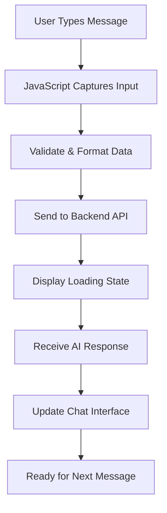
  
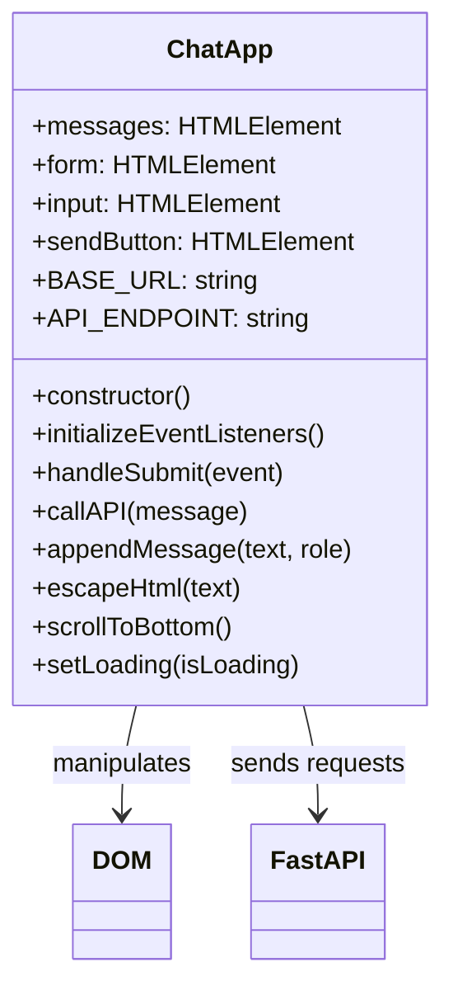
  

### ਫਰੰਟਐਂਡ ਵਿਕਾਸ ਦੇ ਤਿੰਨ ਸਥੰਭ

ਹਰ ਫਰੰਟਐਂਡ ਐਪਲੀਕੇਸ਼ਨ - ਸਧਾਰਨ ਵੈਬਸਾਈਟਾਂ ਤੋਂ ਲੈ ਕੇ Discord ਜਾਂ Slack ਵਰਗੀਆਂ ਜਟਿਲ ਐਪਸ ਤੱਕ - ਤਿੰਨ ਮੁੱਖ ਤਕਨਾਲੋਜੀਆਂ 'ਤੇ ਬਣੀ ਹੁੰਦੀ ਹੈ। ਇਹਨਾਂ ਨੂੰ ਵੈਬ 'ਤੇ ਤੁਹਾਡੇ ਵੇਖਣ ਅਤੇ ਸੰਚਾਰ ਕਰਨ ਵਾਲੇ ਸਭ ਕੁਝ ਦੇ ਅਧਾਰ ਵਜੋਂ ਸੋਚੋ:

**HTML (ਸੰਰਚਨਾ)**: ਇਹ ਤੁਹਾਡਾ ਅਧਾਰ ਹੈ  
- ਨਿਰਧਾਰਤ ਕਰਦਾ ਹੈ ਕਿ ਕਿਹੜੇ ਤੱਤ ਮੌਜੂਦ ਹਨ (
ਹੁਣ ਆਓ ਜਾਵਾਸਕ੍ਰਿਪਟ ਬਣਾਈਏ ਜੋ ਸਾਡੇ ਚੈਟ ਇੰਟਰਫੇਸ ਨੂੰ ਜ਼ਿੰਦਗੀ ਦੇਵੇ। ਅਸੀਂ ਆਧੁਨਿਕ ਜਾਵਾਸਕ੍ਰਿਪਟ ਪੈਟਰਨ ਵਰਤਾਂਗੇ ਜੋ ਤੁਹਾਨੂੰ ਪੇਸ਼ੇਵਰ ਵੈੱਬ ਵਿਕਾਸ ਵਿੱਚ ਮਿਲਦੇ ਹਨ, ਜਿਸ ਵਿੱਚ ES6 ਕਲਾਸਾਂ, async/await, ਅਤੇ ਇਵੈਂਟ-ਚਲਿਤ ਪ੍ਰੋਗਰਾਮਿੰਗ ਸ਼ਾਮਲ ਹਨ।

#### ਆਧੁਨਿਕ ਜਾਵਾਸਕ੍ਰਿਪਟ ਆਰਕੀਟੈਕਚਰ ਨੂੰ ਸਮਝਣਾ

ਪ੍ਰਕਿਰਿਆਵਾਦੀ ਕੋਡ ਲਿਖਣ ਦੀ ਬਜਾਏ (ਫੰਕਸ਼ਨਾਂ ਦੀ ਲੜੀ ਜੋ ਕ੍ਰਮਵਾਰ ਚਲਦੀ ਹੈ), ਅਸੀਂ **ਕਲਾਸ-ਅਧਾਰਿਤ ਆਰਕੀਟੈਕਚਰ** ਬਣਾਉਣ ਜਾ ਰਹੇ ਹਾਂ। ਇੱਕ ਕਲਾਸ ਨੂੰ ਵਸਤੂਆਂ ਬਣਾਉਣ ਲਈ ਬਲੂਪ੍ਰਿੰਟ ਵਜੋਂ ਸੋਚੋ – ਜਿਵੇਂ ਕਿ ਇੱਕ ਆਰਕੀਟੈਕਟ ਦਾ ਬਲੂਪ੍ਰਿੰਟ ਕਈ ਘਰ ਬਣਾਉਣ ਲਈ ਵਰਤਿਆ ਜਾ ਸਕਦਾ ਹੈ।

**ਵੈੱਬ ਐਪਲੀਕੇਸ਼ਨਾਂ ਲਈ ਕਲਾਸਾਂ ਕਿਉਂ ਵਰਤੀਆਂ ਜਾਂਦੀਆਂ ਹਨ?**
- **ਸੰਗਠਨ**: ਸਾਰਾ ਸੰਬੰਧਿਤ ਫੰਕਸ਼ਨਲਿਟੀ ਇਕੱਠੇ ਗਰੁੱਪ ਕੀਤੀ ਜਾਂਦੀ ਹੈ
- **ਪੁਨ:ਵਰਤੋਂਯੋਗਤਾ**: ਤੁਸੀਂ ਇੱਕ ਹੀ ਪੰਨੇ 'ਤੇ ਕਈ ਚੈਟ ਇੰਸਟੈਂਸ ਬਣਾਉਣ ਦੇ ਯੋਗ ਹੋ ਸਕਦੇ ਹੋ
- **ਰੱਖ-ਰਖਾਵ ਯੋਗਤਾ**: ਖਾਸ ਫੀਚਰਾਂ ਨੂੰ ਡੀਬੱਗ ਅਤੇ ਸੋਧਣਾ ਆਸਾਨ ਹੈ
- **ਪੇਸ਼ੇਵਰ ਮਿਆਰ**: ਇਹ ਪੈਟਰਨ React, Vue, ਅਤੇ Angular ਵਰਗੇ ਫਰੇਮਵਰਕ ਵਿੱਚ ਵਰਤਿਆ ਜਾਂਦਾ ਹੈ

`app.js` ਬਣਾਓ ਇਸ ਆਧੁਨਿਕ, ਚੰਗੀ ਤਰ੍ਹਾਂ ਸੰਰਚਿਤ ਜਾਵਾਸਕ੍ਰਿਪਟ ਨਾਲ:

```javascript
// app.js - Modern chat application logic

class ChatApp {
    constructor() {
        // Get references to DOM elements we'll need to manipulate
        this.messages = document.getElementById("messages");
        this.form = document.getElementById("chatForm");
        this.input = document.getElementById("messageInput");
        this.sendButton = document.getElementById("sendBtn");
        
        // Configure your backend URL here
        this.BASE_URL = "http://localhost:5000"; // Update this for your environment
        this.API_ENDPOINT = `${this.BASE_URL}/hello`;
        
        // Set up event listeners when the chat app is created
        this.initializeEventListeners();
    }
    
    initializeEventListeners() {
        // Listen for form submission (when user clicks Send or presses Enter)
        this.form.addEventListener("submit", (e) => this.handleSubmit(e));
        
        // Also listen for Enter key in the input field (better UX)
        this.input.addEventListener("keypress", (e) => {
            if (e.key === "Enter" && !e.shiftKey) {
                e.preventDefault();
                this.handleSubmit(e);
            }
        });
    }
    
    async handleSubmit(event) {
        event.preventDefault(); // Prevent form from refreshing the page
        
        const messageText = this.input.value.trim();
        if (!messageText) return; // Don't send empty messages
        
        // Provide user feedback that something is happening
        this.setLoading(true);
        
        // Add user message to chat immediately (optimistic UI)
        this.appendMessage(messageText, "user");
        
        // Clear input field so user can type next message
        this.input.value = '';
        
        try {
            // Call the AI API and wait for response
            const reply = await this.callAPI(messageText);
            
            // Add AI response to chat
            this.appendMessage(reply, "assistant");
        } catch (error) {
            console.error('API Error:', error);
            this.appendMessage("Sorry, I'm having trouble connecting right now. Please try again.", "error");
        } finally {
            // Re-enable the interface regardless of success or failure
            this.setLoading(false);
        }
    }
    
    async callAPI(message) {
        const response = await fetch(this.API_ENDPOINT, {
            method: "POST",
            headers: { 
                "Content-Type": "application/json" 
            },
            body: JSON.stringify({ message })
        });
        
        if (!response.ok) {
            throw new Error(`HTTP error! status: ${response.status}`);
        }
        
        const data = await response.json();
        return data.response;
    }
    
    appendMessage(text, role) {
        const messageElement = document.createElement("div");
        messageElement.className = `message ${role}`;
        messageElement.innerHTML = `
            <div class="message-content">
                <span class="message-text">${this.escapeHtml(text)}</span>
                <span class="message-time">${new Date().toLocaleTimeString()}</span>
            </div>
        `;
        
        this.messages.appendChild(messageElement);
        this.scrollToBottom();
    }
    
    escapeHtml(text) {
        const div = document.createElement('div');
        div.textContent = text;
        return div.innerHTML;
    }
    
    scrollToBottom() {
        this.messages.scrollTop = this.messages.scrollHeight;
    }
    
    setLoading(isLoading) {
        this.sendButton.disabled = isLoading;
        this.input.disabled = isLoading;
        this.sendButton.textContent = isLoading ? "Sending..." : "Send";
    }
}

// Initialize the chat application when the page loads
document.addEventListener("DOMContentLoaded", () => {
    new ChatApp();
});
```

#### ਹਰ ਜਾਵਾਸਕ੍ਰਿਪਟ ਸੰਕਲਪ ਨੂੰ ਸਮਝਣਾ

**ES6 ਕਲਾਸ ਸੰਰਚਨਾ**:
```javascript
class ChatApp {
    constructor() {
        // This runs when you create a new ChatApp instance
        // It's like the "setup" function for your chat
    }
    
    methodName() {
        // Methods are functions that belong to the class
        // They can access class properties using "this"
    }
}
```

**Async/Await ਪੈਟਰਨ**:
```javascript
// Old way (callback hell):
fetch(url)
  .then(response => response.json())
  .then(data => console.log(data))
  .catch(error => console.error(error));

// Modern way (async/await):
try {
    const response = await fetch(url);
    const data = await response.json();
    console.log(data);
} catch (error) {
    console.error(error);
}
```

**ਇਵੈਂਟ-ਚਲਿਤ ਪ੍ਰੋਗਰਾਮਿੰਗ**:
ਕਿਸੇ ਚੀਜ਼ ਦੇ ਹੋਣ ਦੀ ਲਗਾਤਾਰ ਜਾਂਚ ਕਰਨ ਦੀ ਬਜਾਏ, ਅਸੀਂ "ਇਵੈਂਟਾਂ" ਲਈ ਸੁਣਦੇ ਹਾਂ:
```javascript
// When form is submitted, run handleSubmit
this.form.addEventListener("submit", (e) => this.handleSubmit(e));

// When Enter key is pressed, also run handleSubmit
this.input.addEventListener("keypress", (e) => { /* ... */ });
```

**DOM ਮੈਨਿਪੂਲੇਸ਼ਨ**:
```javascript
// Create new elements
const messageElement = document.createElement("div");

// Modify their properties
messageElement.className = "message user";
messageElement.innerHTML = "Hello world!";

// Add to the page
this.messages.appendChild(messageElement);
```

#### ਸੁਰੱਖਿਆ ਅਤੇ ਵਧੀਆ ਅਭਿਆਸ

**XSS ਰੋਕਥਾਮ**:
```javascript
escapeHtml(text) {
    const div = document.createElement('div');
    div.textContent = text;  // This automatically escapes HTML
    return div.innerHTML;
}
```

**ਇਹ ਕਿਉਂ ਮਹੱਤਵਪੂਰਨ ਹੈ**: ਜੇਕਰ ਕੋਈ ਯੂਜ਼ਰ `<script>alert('hack')</script>` ਟਾਈਪ ਕਰਦਾ ਹੈ, ਤਾਂ ਇਹ ਫੰਕਸ਼ਨ ਇਹ ਯਕੀਨੀ ਬਣਾਉਂਦਾ ਹੈ ਕਿ ਇਹ ਕੋਡ ਵਜਾਇ ਟੈਕਸਟ ਵਜੋਂ ਦਿਖਾਈ ਦੇਵੇ।

**ਗਲਤੀ ਸੰਭਾਲ**:
```javascript
try {
    const reply = await this.callAPI(messageText);
    this.appendMessage(reply, "assistant");
} catch (error) {
    // Show user-friendly error instead of breaking the app
    this.appendMessage("Sorry, I'm having trouble...", "error");
}
```

**ਯੂਜ਼ਰ ਅਨੁਭਵ ਵਿਚਾਰ**:
- **ਆਪਟੀਮਿਸਟਿਕ UI**: ਯੂਜ਼ਰ ਦਾ ਸੁਨੇਹਾ ਤੁਰੰਤ ਸ਼ਾਮਲ ਕਰੋ, ਸਰਵਰ ਦੇ ਜਵਾਬ ਦੀ ਉਡੀਕ ਨਾ ਕਰੋ
- **ਲੋਡਿੰਗ ਸਟੇਟਸ**: ਬਟਨ ਨੂੰ ਅਯੋਗ ਕਰੋ ਅਤੇ "ਭੇਜ ਰਿਹਾ ਹੈ..." ਦਿਖਾਓ ਜਦੋਂ ਉਡੀਕ ਕਰ ਰਹੇ ਹੋ
- **ਆਟੋ-ਸਕ੍ਰੋਲ**: ਨਵੇਂ ਸੁਨੇਹੇ ਦਿਖਾਓ
- **ਇਨਪੁਟ ਵੈਧਤਾ**: ਖਾਲੀ ਸੁਨੇਹੇ ਨਾ ਭੇਜੋ
- **ਕੀਬੋਰਡ ਸ਼ਾਰਟਕੱਟ**: ਐਂਟਰ ਕੀ ਨਾਲ ਸੁਨੇਹੇ ਭੇਜੋ (ਅਸਲ ਚੈਟ ਐਪਸ ਵਾਂਗ)

#### ਐਪਲੀਕੇਸ਼ਨ ਫਲੋ ਨੂੰ ਸਮਝਣਾ

1. **ਪੰਨਾ ਲੋਡ ਹੁੰਦਾ ਹੈ** → `DOMContentLoaded` ਇਵੈਂਟ ਚਲਦਾ ਹੈ → `new ChatApp()` ਬਣਾਇਆ ਜਾਂਦਾ ਹੈ
2. **ਕੰਸਟ੍ਰਕਟਰ ਚਲਦਾ ਹੈ** → DOM ਐਲੀਮੈਂਟ ਰਿਫਰੈਂਸ ਲੈਂਦਾ ਹੈ → ਇਵੈਂਟ ਲਿਸਨਰ ਸੈਟ ਕਰਦਾ ਹੈ
3. **ਯੂਜ਼ਰ ਸੁਨੇਹਾ ਟਾਈਪ ਕਰਦਾ ਹੈ** → ਐਂਟਰ ਦਬਾਉਂਦਾ ਹੈ ਜਾਂ ਭੇਜਣ 'ਤੇ ਕਲਿਕ ਕਰਦਾ ਹੈ → `handleSubmit` ਚਲਦਾ ਹੈ
4. **handleSubmit** → ਇਨਪੁਟ ਦੀ ਜਾਂਚ ਕਰਦਾ ਹੈ → ਲੋਡਿੰਗ ਸਟੇਟ ਦਿਖਾਉਂਦਾ ਹੈ → API ਨੂੰ ਕਾਲ ਕਰਦਾ ਹੈ
5. **API ਜਵਾਬ ਦਿੰਦਾ ਹੈ** → ਚੈਟ ਵਿੱਚ AI ਸੁਨੇਹਾ ਸ਼ਾਮਲ ਕਰੋ → ਇੰਟਰਫੇਸ ਨੂੰ ਮੁੜ ਯੋਗ ਬਣਾਓ
6. **ਅਗਲੇ ਸੁਨੇਹੇ ਲਈ ਤਿਆਰ** → ਯੂਜ਼ਰ ਚੈਟਿੰਗ ਜਾਰੀ ਰੱਖ ਸਕਦਾ ਹੈ

ਇਹ ਆਰਕੀਟੈਕਚਰ ਸਕੇਲਯੋਗ ਹੈ – ਤੁਸੀਂ ਸੁਨੇਹਾ ਸੋਧ, ਫਾਈਲ ਅਪਲੋਡ, ਜਾਂ ਕਈ ਗੱਲਬਾਤਾਂ ਦੇ ਧਾਗੇ ਵਰਗੇ ਫੀਚਰਾਂ ਨੂੰ ਮੁੱਖ ਸੰਰਚਨਾ ਨੂੰ ਦੁਬਾਰਾ ਲਿਖਣ ਤੋਂ ਬਿਨਾਂ ਆਸਾਨੀ ਨਾਲ ਸ਼ਾਮਲ ਕਰ ਸਕਦੇ ਹੋ।

### 🎯 ਪੈਡਾਗੌਜੀਕਲ ਚੈੱਕ-ਇਨ: ਆਧੁਨਿਕ ਫਰੰਟਐਂਡ ਆਰਕੀਟੈਕਚਰ

**ਆਰਕੀਟੈਕਚਰ ਸਮਝਣਾ**: ਤੁਸੀਂ ਆਧੁਨਿਕ ਜਾਵਾਸਕ੍ਰਿਪਟ ਪੈਟਰਨ ਵਰਤ ਕੇ ਇੱਕ ਪੂਰੀ ਸਿੰਗਲ-ਪੇਜ ਐਪਲੀਕੇਸ਼ਨ ਲਾਗੂ ਕੀਤੀ ਹੈ। ਇਹ ਪੇਸ਼ੇਵਰ-ਸਤਰ ਦੇ ਫਰੰਟਐਂਡ ਵਿਕਾਸ ਦਾ ਪ੍ਰਤੀਨਿਧਿਤਾ ਕਰਦਾ ਹੈ।

**ਮੁੱਖ ਸੰਕਲਪਾਂ ਵਿੱਚ ਮਾਹਰਤਾ**:
- **ES6 ਕਲਾਸ ਆਰਕੀਟੈਕਚਰ**: ਸੰਗਠਿਤ, ਰੱਖ-ਰਖਾਵ ਯੋਗ ਕੋਡ ਸੰਰਚਨਾ
- **Async/Await ਪੈਟਰਨ**: ਆਧੁਨਿਕ ਅਸਿੰਕ੍ਰੋਨਸ ਪ੍ਰੋਗਰਾਮਿੰਗ
- **ਇਵੈਂਟ-ਚਲਿਤ ਪ੍ਰੋਗਰਾਮਿੰਗ**: ਪ੍ਰਤੀਕ੍ਰਿਆਸ਼ੀਲ ਯੂਜ਼ਰ ਇੰਟਰਫੇਸ ਡਿਜ਼ਾਈਨ
- **ਸੁਰੱਖਿਆ ਦੇ ਵਧੀਆ ਅਭਿਆਸ**: XSS ਰੋਕਥਾਮ ਅਤੇ ਇਨਪੁਟ ਵੈਧਤਾ

**ਉਦਯੋਗ ਕਨੈਕਸ਼ਨ**: ਤੁਸੀਂ ਸਿੱਖੇ ਪੈਟਰਨ (ਕਲਾਸ-ਅਧਾਰਿਤ ਆਰਕੀਟੈਕਚਰ, ਅਸਿੰਕ੍ਰੋਨਸ ਕਾਰਵਾਈਆਂ, DOM ਮੈਨਿਪੂਲੇਸ਼ਨ) ਆਧੁਨਿਕ ਫਰੇਮਵਰਕਾਂ ਜਿਵੇਂ React, Vue, ਅਤੇ Angular ਵਿੱਚ ਵਰਤੀਆਂ ਜਾਂਦੀਆਂ ਹਨ। ਤੁਸੀਂ ਉਹੀ ਆਰਕੀਟੈਕਚਰਲ ਸੋਚ ਨਾਲ ਬਣਾਉਣ ਕਰ ਰਹੇ ਹੋ ਜੋ ਉਤਪਾਦਨ ਐਪਲੀਕੇਸ਼ਨਾਂ ਵਿੱਚ ਵਰਤੀ ਜਾਂਦੀ ਹੈ।

**ਚਿੰਤਨ ਦਾ ਸਵਾਲ**: ਤੁਸੀਂ ਇਸ ਚੈਟ ਐਪਲੀਕੇਸ਼ਨ ਨੂੰ ਕਈ ਗੱਲਬਾਤਾਂ ਜਾਂ ਯੂਜ਼ਰ ਪ੍ਰਮਾਣਿਕਤਾ ਨੂੰ ਸੰਭਾਲਣ ਲਈ ਕਿਵੇਂ ਵਧਾਉਂਗੇ? ਜ਼ਰੂਰੀ ਆਰਕੀਟੈਕਚਰਲ ਬਦਲਾਅ ਅਤੇ ਕਲਾਸ ਸੰਰਚਨਾ ਕਿਵੇਂ ਵਿਕਸਿਤ ਹੋਵੇਗੀ, ਇਸ ਬਾਰੇ ਵਿਚਾਰ ਕਰੋ।

### ਆਪਣੇ ਚੈਟ ਇੰਟਰਫੇਸ ਨੂੰ ਸਜਾਉਣਾ

ਹੁਣ ਆਓ CSS ਨਾਲ ਇੱਕ ਆਧੁਨਿਕ, ਦ੍ਰਿਸ਼ਟੀਗਤ ਤੌਰ 'ਤੇ ਆਕਰਸ਼ਕ ਚੈਟ ਇੰਟਰਫੇਸ ਬਣਾਈਏ। ਚੰਗੀ ਸਟਾਈਲਿੰਗ ਤੁਹਾਡੇ ਐਪਲੀਕੇਸ਼ਨ ਨੂੰ ਪੇਸ਼ੇਵਰ ਮਹਿਸੂਸ ਕਰਦੀ ਹੈ ਅਤੇ ਸਮੁੱਚੇ ਯੂਜ਼ਰ ਅਨੁਭਵ ਨੂੰ ਸੁਧਾਰਦੀ ਹੈ। ਅਸੀਂ Flexbox, CSS Grid, ਅਤੇ ਕਸਟਮ ਪ੍ਰਾਪਰਟੀਜ਼ ਵਰਗੇ ਆਧੁਨਿਕ CSS ਫੀਚਰਾਂ ਨੂੰ ਵਰਤਾਂਗੇ ਜੋ ਇੱਕ ਪ੍ਰਤੀਕ੍ਰਿਆਸ਼ੀਲ, ਸਹਿਜ ਡਿਜ਼ਾਈਨ ਲਈ ਹਨ।

`styles.css` ਬਣਾਓ ਇਨ੍ਹਾਂ ਵਿਸਤ੍ਰਿਤ ਸਟਾਈਲਾਂ ਨਾਲ:

```css
/* styles.css - Modern chat interface styling */

:root {
    --primary-color: #2563eb;
    --secondary-color: #f1f5f9;
    --user-color: #3b82f6;
    --assistant-color: #6b7280;
    --error-color: #ef4444;
    --text-primary: #1e293b;
    --text-secondary: #64748b;
    --border-radius: 12px;
    --shadow: 0 4px 6px -1px rgba(0, 0, 0, 0.1);
}

* {
    margin: 0;
    padding: 0;
    box-sizing: border-box;
}

body {
    font-family: -apple-system, BlinkMacSystemFont, 'Segoe UI', Roboto, sans-serif;
    background: linear-gradient(135deg, #667eea 0%, #764ba2 100%);
    min-height: 100vh;
    display: flex;
    align-items: center;
    justify-content: center;
    padding: 20px;
}

.chat-container {
    width: 100%;
    max-width: 800px;
    height: 600px;
    background: white;
    border-radius: var(--border-radius);
    box-shadow: var(--shadow);
    display: flex;
    flex-direction: column;
    overflow: hidden;
}

.chat-header {
    background: var(--primary-color);
    color: white;
    padding: 20px;
    text-align: center;
}

.chat-header h1 {
    font-size: 1.5rem;
    margin-bottom: 5px;
}

.chat-header p {
    opacity: 0.9;
    font-size: 0.9rem;
}

.chat-messages {
    flex: 1;
    padding: 20px;
    overflow-y: auto;
    display: flex;
    flex-direction: column;
    gap: 15px;
    background: var(--secondary-color);
}

.message {
    display: flex;
    max-width: 80%;
    animation: slideIn 0.3s ease-out;
}

.message.user {
    align-self: flex-end;
}

.message.user .message-content {
    background: var(--user-color);
    color: white;
    border-radius: var(--border-radius) var(--border-radius) 4px var(--border-radius);
}

.message.assistant {
    align-self: flex-start;
}

.message.assistant .message-content {
    background: white;
    color: var(--text-primary);
    border-radius: var(--border-radius) var(--border-radius) var(--border-radius) 4px;
    border: 1px solid #e2e8f0;
}

.message.error .message-content {
    background: var(--error-color);
    color: white;
    border-radius: var(--border-radius);
}

.message-content {
    padding: 12px 16px;
    box-shadow: var(--shadow);
    position: relative;
}

.message-text {
    display: block;
    line-height: 1.5;
    word-wrap: break-word;
}

.message-time {
    display: block;
    font-size: 0.75rem;
    opacity: 0.7;
    margin-top: 5px;
}

.chat-form {
    padding: 20px;
    border-top: 1px solid #e2e8f0;
    background: white;
}

.input-group {
    display: flex;
    gap: 10px;
    align-items: center;
}

#messageInput {
    flex: 1;
    padding: 12px 16px;
    border: 2px solid #e2e8f0;
    border-radius: var(--border-radius);
    font-size: 1rem;
    outline: none;
    transition: border-color 0.2s ease;
}

#messageInput:focus {
    border-color: var(--primary-color);
}

#messageInput:disabled {
    background: #f8fafc;
    opacity: 0.6;
    cursor: not-allowed;
}

#sendBtn {
    padding: 12px 24px;
    background: var(--primary-color);
    color: white;
    border: none;
    border-radius: var(--border-radius);
    font-size: 1rem;
    font-weight: 600;
    cursor: pointer;
    transition: background-color 0.2s ease;
    min-width: 80px;
}

#sendBtn:hover:not(:disabled) {
    background: #1d4ed8;
}

#sendBtn:disabled {
    background: #94a3b8;
    cursor: not-allowed;
}

@keyframes slideIn {
    from {
        opacity: 0;
        transform: translateY(10px);
    }
    to {
        opacity: 1;
        transform: translateY(0);
    }
}

/* Responsive design for mobile devices */
@media (max-width: 768px) {
    body {
        padding: 10px;
    }
    
    .chat-container {
        height: calc(100vh - 20px);
        border-radius: 8px;
    }
    
    .message {
        max-width: 90%;
    }
    
    .input-group {
        flex-direction: column;
        gap: 10px;
    }
    
    #messageInput {
        width: 100%;
    }
    
    #sendBtn {
        width: 100%;
    }
}

/* Accessibility improvements */
@media (prefers-reduced-motion: reduce) {
    .message {
        animation: none;
    }
    
    * {
        transition: none !important;
    }
}

/* Dark mode support */
@media (prefers-color-scheme: dark) {
    .chat-container {
        background: #1e293b;
        color: #f1f5f9;
    }
    
    .chat-messages {
        background: #0f172a;
    }
    
    .message.assistant .message-content {
        background: #334155;
        color: #f1f5f9;
        border-color: #475569;
    }
    
    .chat-form {
        background: #1e293b;
        border-color: #475569;
    }
    
    #messageInput {
        background: #334155;
        color: #f1f5f9;
        border-color: #475569;
    }
}
```

**CSS ਆਰਕੀਟੈਕਚਰ ਨੂੰ ਸਮਝਣਾ:**
- **ਵਰਤਦਾ ਹੈ** CSS ਕਸਟਮ ਪ੍ਰਾਪਰਟੀਜ਼ (ਵੈਰੀਏਬਲ) ਸਥਿਰ ਥੀਮਿੰਗ ਅਤੇ ਆਸਾਨ ਰੱਖ-ਰਖਾਵ ਲਈ
- **ਲਾਗੂ ਕਰਦਾ ਹੈ** Flexbox ਲੇਆਉਟ ਪ੍ਰਤੀਕ੍ਰਿਆਸ਼ੀਲ ਡਿਜ਼ਾਈਨ ਅਤੇ ਸਹੀ ਸੰਰਚਨਾ ਲਈ
- **ਸ਼ਾਮਲ ਕਰਦਾ ਹੈ** ਸੁਨੇਹਾ ਦਿਖਾਈ ਦੇਣ ਲਈ ਹੌਲੀ ਹੌਲੀ ਐਨੀਮੇਸ਼ਨ
- **ਪ੍ਰਦਾਨ ਕਰਦਾ ਹੈ** ਯੂਜ਼ਰ ਸੁਨੇਹਿਆਂ, AI ਜਵਾਬਾਂ, ਅਤੇ ਗਲਤੀ ਸਥਿਤੀਆਂ ਵਿੱਚ ਦ੍ਰਿਸ਼ਟੀਗਤ ਅੰਤਰ
- **ਸਹਾਇਕ ਹੈ** ਪ੍ਰਤੀਕ੍ਰਿਆਸ਼ੀਲ ਡਿਜ਼ਾਈਨ ਜੋ ਡੈਸਕਟਾਪ ਅਤੇ ਮੋਬਾਈਲ ਡਿਵਾਈਸਾਂ 'ਤੇ ਕੰਮ ਕਰਦਾ ਹੈ
- **ਵਿਚਾਰ ਕਰਦਾ ਹੈ** ਪਹੁੰਚਯੋਗਤਾ ਨੂੰ ਘਟਾਈ ਗਤੀਸ਼ੀਲਤਾ ਪਸੰਦਾਂ ਅਤੇ ਸਹੀ ਕਾਂਟ੍ਰਾਸਟ ਅਨੁਪਾਤਾਂ ਨਾਲ
- **ਪੇਸ਼ ਕਰਦਾ ਹੈ** ਯੂਜ਼ਰ ਦੇ ਸਿਸਟਮ ਪਸੰਦਾਂ ਦੇ ਅਧਾਰ 'ਤੇ ਡਾਰਕ ਮੋਡ ਸਹਾਇਤਾ

### ਆਪਣੇ ਬੈਕਐਂਡ URL ਨੂੰ ਕਨਫਿਗਰ ਕਰਨਾ

ਅੰਤਮ ਕਦਮ ਤੁਹਾਡੇ ਜਾਵਾਸਕ੍ਰਿਪਟ ਵਿੱਚ `BASE_URL` ਨੂੰ ਅਪਡੇਟ ਕਰਨਾ ਹੈ ਤਾਂ ਜੋ ਇਹ ਤੁਹਾਡੇ ਬੈਕਐਂਡ ਸਰਵਰ ਨਾਲ ਮੇਲ ਖਾਏ:

```javascript
// For local development
this.BASE_URL = "http://localhost:5000";

// For GitHub Codespaces (replace with your actual URL)
this.BASE_URL = "https://your-codespace-name-5000.app.github.dev";
```

**ਤੁਹਾਡੇ ਬੈਕਐਂਡ URL ਨੂੰ ਨਿਰਧਾਰਤ ਕਰਨਾ:**
- **ਲੋਕਲ ਵਿਕਾਸ**: ਜੇਕਰ ਫਰੰਟਐਂਡ ਅਤੇ ਬੈਕਐਂਡ ਦੋਨੋ ਨੂੰ ਲੋਕਲ ਤੌਰ 'ਤੇ ਚਲਾਇਆ ਜਾ ਰਿਹਾ ਹੈ ਤਾਂ `http://localhost:5000` ਵਰਤੋ
- **ਕੋਡਸਪੇਸ**: ਪੋਰਟ 5000 ਨੂੰ ਪਬਲਿਕ ਬਣਾਉਣ ਤੋਂ ਬਾਅਦ ਪੋਰਟ ਟੈਬ ਵਿੱਚ ਆਪਣੇ ਬੈਕਐਂਡ URL ਨੂੰ ਲੱਭੋ
- **ਪ੍ਰੋਡਕਸ਼ਨ**: ਹੋਸਟਿੰਗ ਸੇਵਾ 'ਤੇ ਡਿਪਲੌਇ ਕਰਨ ਸਮੇਂ ਆਪਣੇ ਅਸਲ ਡੋਮੇਨ ਨਾਲ ਬਦਲੋ

> 💡 **ਟੈਸਟਿੰਗ ਟਿਪ**: ਤੁਸੀਂ ਆਪਣੇ ਬੈਕਐਂਡ ਨੂੰ ਸਿੱਧੇ ਤੌਰ 'ਤੇ ਆਪਣੇ ਬ੍ਰਾਊਜ਼ਰ ਵਿੱਚ ਰੂਟ URL 'ਤੇ ਜਾ ਕੇ ਟੈਸਟ ਕਰ ਸਕਦੇ ਹੋ। ਤੁਹਾਨੂੰ ਆਪਣੇ FastAPI ਸਰਵਰ ਤੋਂ ਸਵਾਗਤ ਸੁਨੇਹਾ ਦਿਖਾਈ ਦੇਣਾ ਚਾਹੀਦਾ ਹੈ।

## ਟੈਸਟਿੰਗ ਅਤੇ ਡਿਪਲੌਇਮੈਂਟ

ਹੁਣ ਜਦੋਂ ਤੁਹਾਡੇ ਕੋਲ ਫਰੰਟਐਂਡ ਅਤੇ ਬੈਕਐਂਡ ਕੰਪੋਨੈਂਟ ਬਣੇ ਹੋਏ ਹਨ, ਆਓ ਟੈਸਟ ਕਰੀਏ ਕਿ ਸਭ ਕੁਝ ਇਕੱਠੇ ਕੰਮ ਕਰਦਾ ਹੈ ਅਤੇ ਡਿਪਲੌਇਮੈਂਟ ਵਿਕਲਪਾਂ ਦੀ ਪੜਚੋਲ ਕਰੀਏ ਤਾਂ ਜੋ ਆਪਣੇ ਚੈਟ ਅਸਿਸਟੈਂਟ ਨੂੰ ਹੋਰਾਂ ਨਾਲ ਸਾਂਝਾ ਕੀਤਾ ਜਾ ਸਕੇ।

### ਲੋਕਲ ਟੈਸਟਿੰਗ ਵਰਕਫਲੋ

ਤੁਹਾਡੇ ਪੂਰੇ ਐਪਲੀਕੇਸ਼ਨ ਨੂੰ ਟੈਸਟ ਕਰਨ ਲਈ ਇਹ ਕਦਮ ਅਪਣਾਓ:

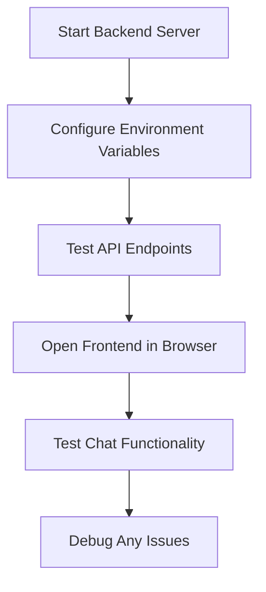

**ਕਦਮ-ਦਰ-ਕਦਮ ਟੈਸਟਿੰਗ ਪ੍ਰਕਿਰਿਆ:**

1. **ਆਪਣਾ ਬੈਕਐਂਡ ਸਰਵਰ ਸ਼ੁਰੂ ਕਰੋ**:
   ```bash
   cd backend
   source venv/bin/activate  # or venv\Scripts\activate on Windows
   python api.py
   ```

2. **API ਕੰਮ ਕਰ ਰਿਹਾ ਹੈ ਇਹ ਯਕੀਨੀ ਬਣਾਓ**:
   - `http://localhost:5000` ਨੂੰ ਆਪਣੇ ਬ੍ਰਾਊਜ਼ਰ ਵਿੱਚ ਖੋਲ੍ਹੋ
   - ਤੁਹਾਨੂੰ ਆਪਣੇ FastAPI ਸਰਵਰ ਤੋਂ ਸਵਾਗਤ ਸੁਨੇਹਾ ਦਿਖਾਈ ਦੇਣਾ ਚਾਹੀਦਾ ਹੈ

3. **ਆਪਣਾ ਫਰੰਟਐਂਡ ਖੋਲ੍ਹੋ**:
   - ਆਪਣੇ ਫਰੰਟਐਂਡ ਡਾਇਰੈਕਟਰੀ ਵਿੱਚ ਜਾਓ
   - `index.html` ਨੂੰ ਆਪਣੇ ਵੈੱਬ ਬ੍ਰਾਊਜ਼ਰ ਵਿੱਚ ਖੋਲ੍ਹੋ
   - ਜਾਂ ਵਿਕਾਸ ਦੇ ਬਿਹਤਰ ਅਨੁਭਵ ਲਈ VS Code ਦੇ Live Server ਐਕਸਟੈਂਸ਼ਨ ਨੂੰ ਵਰਤੋ

4. **ਚੈਟ ਫੰਕਸ਼ਨਲਿਟੀ ਟੈਸਟ ਕਰੋ**:
   - ਇਨਪੁਟ ਫੀਲਡ ਵਿੱਚ ਸੁਨੇਹਾ ਟਾਈਪ ਕਰੋ
   - "ਭੇਜੋ" 'ਤੇ ਕਲਿਕ ਕਰੋ ਜਾਂ ਐਂਟਰ ਦਬਾਓ
   - ਯਕੀਨੀ ਬਣਾਓ ਕਿ AI ਸਹੀ ਤਰੀਕੇ ਨਾਲ ਜਵਾਬ ਦਿੰਦਾ ਹੈ
   - ਜਾਵਾਸਕ੍ਰਿਪਟ ਗਲਤੀਆਂ ਲਈ ਬ੍ਰਾਊਜ਼ਰ ਕਨਸੋਲ ਦੀ ਜਾਂਚ ਕਰੋ

### ਆਮ ਸਮੱਸਿਆਵਾਂ ਦਾ ਨਿਪਟਾਰਾ

| ਸਮੱਸਿਆ | ਲੱਛਣ | ਹੱਲ |
|---------|----------|----------|
| **CORS ਗਲਤੀ** | ਫਰੰਟਐਂਡ ਬੈਕਐਂਡ ਤੱਕ ਨਹੀਂ ਪਹੁੰਚ ਸਕਦਾ | ਯਕੀਨੀ ਬਣਾਓ ਕਿ FastAPI CORSMiddleware ਸਹੀ ਤਰੀਕੇ ਨਾਲ ਕਨਫਿਗਰ ਕੀਤਾ ਗਿਆ ਹੈ |
| **API ਕੁੰਜੀ ਗਲਤੀ** | 401 Unauthorized ਜਵਾਬ | ਆਪਣੇ `GITHUB_TOKEN` ਵਾਤਾਵਰਣ ਚਰਿੱਤਰ ਦੀ ਜਾਂਚ ਕਰੋ |
| **ਕਨੈਕਸ਼ਨ ਰਿਫਿਊਜ਼ਡ** | ਫਰੰਟਐਂਡ ਵਿੱਚ ਨੈੱਟਵਰਕ ਗਲਤੀਆਂ | ਬੈਕਐਂਡ URL ਅਤੇ Flask ਸਰਵਰ ਚੱਲ ਰਿਹਾ ਹੈ ਇਹ ਯਕੀਨੀ ਬਣਾਓ |
| **ਕੋਈ AI ਜਵਾਬ ਨਹੀਂ** | ਖਾਲੀ ਜਾਂ ਗਲਤੀ ਜਵਾਬ | API ਕੋਟਾ ਜਾਂ ਪ੍ਰਮਾਣਿਕਤਾ ਸਮੱਸਿਆਵਾਂ ਲਈ ਬੈਕਐਂਡ ਲਾਗ ਦੀ ਜਾਂਚ ਕਰੋ |

**ਆਮ ਡੀਬੱਗਿੰਗ ਕਦਮ:**
- **ਜਾਂਚ ਕਰੋ** ਬ੍ਰਾਊਜ਼ਰ ਡਿਵੈਲਪਰ ਟੂਲਜ਼ ਕਨਸੋਲ ਜਾਵਾਸਕ੍ਰਿਪਟ ਗਲਤੀਆਂ ਲਈ
- **ਯਕੀਨੀ ਬਣਾਓ** ਨੈੱਟਵਰਕ ਟੈਬ ਸਫਲ API ਬੇਨਤੀ ਅਤੇ ਜਵਾਬ ਦਿਖਾਉਂਦਾ ਹੈ
- **ਸਮੀਖਿਆ ਕਰੋ** ਬੈਕਐਂਡ ਟਰਮੀਨਲ ਆਉਟਪੁੱਟ ਪਾਈਥਨ ਗਲਤੀਆਂ ਜਾਂ API ਸਮੱਸਿਆਵਾਂ ਲਈ
- **ਪੁਸ਼ਟੀ ਕਰੋ** ਵਾਤਾਵਰਣ ਚਰਿੱਤਰ ਸਹੀ ਤਰੀਕੇ ਨਾਲ ਲੋਡ ਅਤੇ ਪਹੁੰਚਯੋਗ ਹਨ

## 📈 ਤੁਹਾਡੀ AI ਐਪਲੀਕੇਸ਼ਨ ਵਿਕਾਸ ਮਾਹਰਤਾ ਟਾਈਮਲਾਈਨ

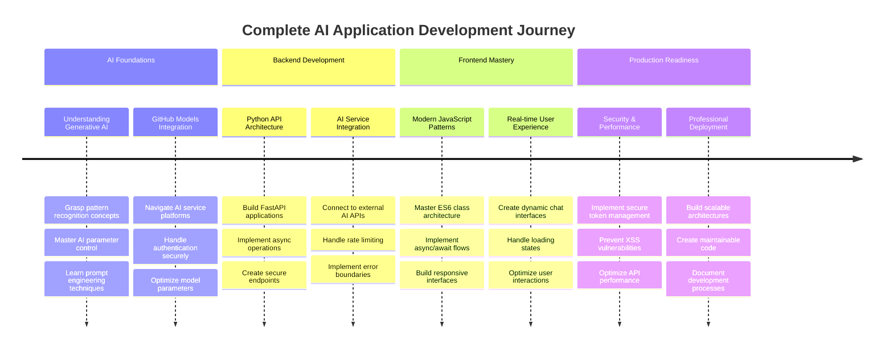

**🎓 ਗ੍ਰੈਜੂਏਸ਼ਨ ਮੀਲਸਟੋਨ**: ਤੁਸੀਂ ਸਫਲਤਾਪੂਰਵਕ ਆਧੁਨਿਕ ਤਕਨਾਲੋਜੀਆਂ ਅਤੇ ਆਰਕੀਟੈਕਚਰਲ ਪੈਟਰਨਾਂ ਦੀ ਵਰਤੋਂ ਕਰਕੇ ਇੱਕ ਪੂਰੀ AI-ਚਲਿਤ ਐਪਲੀਕੇਸ਼ਨ ਬਣਾਈ ਹੈ। ਇਹ ਹੁਨਰ ਆਧੁਨਿਕ AI ਸਹਾਇਕਾਂ ਦੇ ਵਿਕਾਸ ਅਤੇ ਇੰਟੀਗ੍ਰੇਸ਼ਨ ਦਾ ਅਧਾਰ ਹੈ।

**🔄 ਅਗਲੇ ਪੱਧਰ ਦੀ ਯੋਗਤਾਵਾਂ**:
- ਉੱਚ-ਸਤਰੀ AI ਫਰੇਮਵਰਕ (LangChain, LangGraph) ਦੀ ਖੋਜ ਕਰਨ ਲਈ ਤਿਆਰ
- ਬਹੁ-ਮੋਡਲ AI ਐਪਲੀਕੇਸ਼ਨ (ਟੈਕਸਟ, ਚਿੱਤਰ, ਆਵਾਜ਼) ਬਣਾਉਣ ਲਈ ਤਿਆਰ
- ਵੈਕਟਰ ਡਾਟਾਬੇਸ ਅਤੇ ਰੀਟਰੀਵਲ ਸਿਸਟਮ ਲਾਗੂ ਕਰਨ ਲਈ ਸਜਗ
- ਮਸ਼ੀਨ ਲਰਨਿੰਗ ਅਤੇ AI ਮਾਡਲ ਫਾਈਨ-ਟਿਊਨਿੰਗ ਲਈ ਮਜ਼ਬੂਤ ​​ਅਧਾਰ

## GitHub Copilot Agent ਚੈਲੈਂਜ 🚀

Agent ਮੋਡ ਦੀ ਵਰਤੋਂ ਕਰਕੇ ਹੇਠਾਂ ਦਿੱਤੇ ਚੈਲੈਂਜ ਨੂੰ ਪੂਰਾ ਕਰੋ:

**ਵੇਰਵਾ:** ਗੱਲਬਾਤ ਦਾ ਇਤਿਹਾਸ ਅਤੇ ਸੁਨੇਹਾ ਸਥਿਰਤਾ ਸ਼ਾਮਲ ਕਰਕੇ ਚੈਟ ਸਹਾਇਕ ਨੂੰ ਵਧਾਓ।
- **ਸਮਾਰਟ ਸੁਝਾਅ** ਗੱਲਬਾਤ ਦੇ ਵਿਸ਼ੇ ਅਨੁਸਾਰ ਲਾਗੂ ਕਰੋ  
- **ਆਮ ਸਵਾਲਾਂ ਲਈ** ਤੇਜ਼ ਜਵਾਬ ਬਟਨ ਬਣਾਓ  

> 🎯 **ਸਿੱਖਣ ਦਾ ਉਦੇਸ਼**: ਇਹ ਬੋਨਸ ਚੁਣੌਤੀਆਂ ਤੁਹਾਨੂੰ ਉੱਚ-ਪੱਧਰੀ ਵੈੱਬ ਵਿਕਾਸ ਪੈਟਰਨ ਅਤੇ AI ਇੰਟੀਗ੍ਰੇਸ਼ਨ ਤਕਨੀਕਾਂ ਨੂੰ ਸਮਝਣ ਵਿੱਚ ਮਦਦ ਕਰਦੀਆਂ ਹਨ ਜੋ ਉਤਪਾਦਨ ਐਪਲੀਕੇਸ਼ਨਾਂ ਵਿੱਚ ਵਰਤੀਆਂ ਜਾਂਦੀਆਂ ਹਨ।  

## ਸਾਰ ਅਤੇ ਅਗਲੇ ਕਦਮ  

ਵਧਾਈ ਹੋਵੇ! ਤੁਸੀਂ ਸਫਲਤਾਪੂਰਵਕ ਸ਼ੁਰੂ ਤੋਂ ਇੱਕ ਪੂਰਾ AI-ਚਾਲਤ ਚੈਟ ਸਹਾਇਕ ਬਣਾਇਆ ਹੈ। ਇਸ ਪ੍ਰੋਜੈਕਟ ਨੇ ਤੁਹਾਨੂੰ ਆਧੁਨਿਕ ਵੈੱਬ ਵਿਕਾਸ ਤਕਨਾਲੋਜੀਆਂ ਅਤੇ AI ਇੰਟੀਗ੍ਰੇਸ਼ਨ ਨਾਲ ਹੱਥ-ਅਨੁਭਵ ਦਿੱਤਾ ਹੈ – ਜੋ ਅੱਜ ਦੇ ਤਕਨਾਲੋਜੀ ਦ੍ਰਿਸ਼ ਵਿੱਚ ਬਹੁਤ ਕੀਮਤੀ ਹੁਨਰ ਹਨ।  

### ਤੁਸੀਂ ਕੀ ਹਾਸਲ ਕੀਤਾ ਹੈ  

ਇਸ ਪਾਠ ਦੌਰਾਨ, ਤੁਸੀਂ ਕਈ ਮਹੱਤਵਪੂਰਨ ਤਕਨਾਲੋਜੀਆਂ ਅਤੇ ਧਾਰਨਾਵਾਂ ਵਿੱਚ ਮਾਹਰਤਾ ਹਾਸਲ ਕੀਤੀ ਹੈ:  

**ਬੈਕਐਂਡ ਵਿਕਾਸ:**  
- **GitHub Models API** ਨਾਲ AI ਫੰਕਸ਼ਨਲਿਟੀ ਲਈ ਇੰਟੀਗ੍ਰੇਟ ਕੀਤਾ  
- **Flask** ਦੀ ਵਰਤੋਂ ਕਰਕੇ RESTful API ਬਣਾਇਆ ਜਿਸ ਵਿੱਚ ਸਹੀ ਤਰੀਕੇ ਨਾਲ ਗਲਤੀ ਸੰਭਾਲਣ ਦੀ ਵਿਵਸਥਾ ਹੈ  
- **ਪ੍ਰੋਟੈਕਟਡ ਆਥੰਟੀਕੇਸ਼ਨ** ਨੂੰ ਇੰਵਾਇਰਮੈਂਟ ਵੈਰੀਏਬਲਾਂ ਦੀ ਵਰਤੋਂ ਕਰਕੇ ਲਾਗੂ ਕੀਤਾ  
- **CORS** ਨੂੰ ਫਰੰਟਐਂਡ ਅਤੇ ਬੈਕਐਂਡ ਦੇ ਵਿਚਕਾਰ ਕ੍ਰਾਸ-ਓਰਿਜਨ ਰਿਕਵੈਸਟਾਂ ਲਈ ਕਨਫਿਗਰ ਕੀਤਾ  

**ਫਰੰਟਐਂਡ ਵਿਕਾਸ:**  
- **ਸੈਮੈਂਟਿਕ HTML** ਦੀ ਵਰਤੋਂ ਕਰਕੇ ਇੱਕ ਰਿਸਪਾਂਸਿਵ ਚੈਟ ਇੰਟਰਫੇਸ ਬਣਾਇਆ  
- **ਮਾਡਰਨ ਜਾਵਾਸਕ੍ਰਿਪਟ** async/await ਅਤੇ ਕਲਾਸ-ਅਧਾਰਤ ਆਰਕੀਟੈਕਚਰ ਨਾਲ ਲਾਗੂ ਕੀਤਾ  
- **CSS Grid, Flexbox ਅਤੇ ਐਨੀਮੇਸ਼ਨ** ਨਾਲ ਇੱਕ ਆਕਰਸ਼ਕ ਯੂਜ਼ਰ ਇੰਟਰਫੇਸ ਡਿਜ਼ਾਈਨ ਕੀਤਾ  
- **ਐਕਸੈਸਬਿਲਿਟੀ ਫੀਚਰ** ਅਤੇ ਰਿਸਪਾਂਸਿਵ ਡਿਜ਼ਾਈਨ ਪ੍ਰਿੰਸਿਪਲਾਂ ਸ਼ਾਮਲ ਕੀਤੇ  

**ਫੁੱਲ-ਸਟੈਕ ਇੰਟੀਗ੍ਰੇਸ਼ਨ:**  
- **HTTP API ਕਾਲਾਂ** ਰਾਹੀਂ ਫਰੰਟਐਂਡ ਅਤੇ ਬੈਕਐਂਡ ਨੂੰ ਜੋੜਿਆ  
- **ਰਿਅਲ-ਟਾਈਮ ਯੂਜ਼ਰ ਇੰਟਰੈਕਸ਼ਨ** ਅਤੇ ਅਸਿੰਕ੍ਰੋਨਸ ਡਾਟਾ ਫਲੋ ਸੰਭਾਲਿਆ  
- **ਗਲਤੀ ਸੰਭਾਲਣ** ਅਤੇ ਐਪਲੀਕੇਸ਼ਨ ਵਿੱਚ ਯੂਜ਼ਰ ਫੀਡਬੈਕ ਲਾਗੂ ਕੀਤਾ  
- **ਯੂਜ਼ਰ ਇਨਪੁਟ ਤੋਂ AI ਜਵਾਬ ਤੱਕ ਪੂਰੇ ਐਪਲੀਕੇਸ਼ਨ ਵਰਕਫਲੋ ਦੀ ਜਾਂਚ ਕੀਤੀ**  

### ਮੁੱਖ ਸਿੱਖਣ ਦੇ ਨਤੀਜੇ  

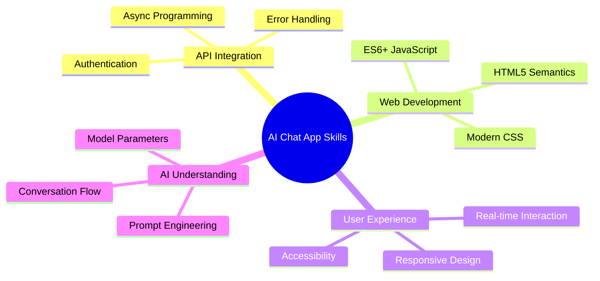
  
ਇਸ ਪ੍ਰੋਜੈਕਟ ਨੇ ਤੁਹਾਨੂੰ AI-ਚਾਲਤ ਐਪਲੀਕੇਸ਼ਨ ਬਣਾਉਣ ਦੇ ਮੂਲ ਸਿਧਾਂਤਾਂ ਨਾਲ ਜਾਣੂ ਕਰਵਾਇਆ ਹੈ, ਜੋ ਵੈੱਬ ਵਿਕਾਸ ਦਾ ਭਵਿੱਖ ਦਰਸਾਉਂਦਾ ਹੈ। ਹੁਣ ਤੁਸੀਂ ਸਮਝਦੇ ਹੋ ਕਿ ਕਿਵੇਂ ਰਵਾਇਤੀ ਵੈੱਬ ਐਪਲੀਕੇਸ਼ਨਾਂ ਵਿੱਚ AI ਸਮਰਥਨ ਸ਼ਾਮਲ ਕਰਨਾ ਹੈ, ਜੋ ਬੁੱਧੀਮਾਨ ਅਤੇ ਜਵਾਬਦੇਹ ਯੂਜ਼ਰ ਅਨੁਭਵ ਪੈਦਾ ਕਰਦੇ ਹਨ।  

### ਪੇਸ਼ੇਵਰ ਅਰਜ਼ੀਆਂ  

ਇਸ ਪਾਠ ਵਿੱਚ ਵਿਕਸਿਤ ਕੀਤੇ ਗਏ ਹੁਨਰ ਆਧੁਨਿਕ ਸੌਫਟਵੇਅਰ ਵਿਕਾਸ ਕਰੀਅਰਾਂ ਲਈ ਸਿੱਧੇ ਤੌਰ 'ਤੇ ਲਾਗੂ ਹੁੰਦੇ ਹਨ:  

- **ਮਾਡਰਨ ਫਰੇਮਵਰਕ ਅਤੇ APIs** ਦੀ ਵਰਤੋਂ ਕਰਕੇ ਫੁੱਲ-ਸਟੈਕ ਵੈੱਬ ਵਿਕਾਸ  
- **ਵੈੱਬ ਅਤੇ ਮੋਬਾਈਲ ਐਪਲੀਕੇਸ਼ਨਾਂ ਵਿੱਚ AI ਇੰਟੀਗ੍ਰੇਸ਼ਨ**  
- **ਮਾਈਕ੍ਰੋਸਰਵਿਸ ਆਰਕੀਟੈਕਚਰ ਲਈ API ਡਿਜ਼ਾਈਨ ਅਤੇ ਵਿਕਾਸ**  
- **ਐਕਸੈਸਬਿਲਿਟੀ ਅਤੇ ਰਿਸਪਾਂਸਿਵ ਡਿਜ਼ਾਈਨ 'ਤੇ ਧਿਆਨ ਦੇ ਨਾਲ ਯੂਜ਼ਰ ਇੰਟਰਫੇਸ ਵਿਕਾਸ**  
- **ਡੈਵਓਪਸ ਪ੍ਰੈਕਟਿਸ** ਜਿਸ ਵਿੱਚ ਇੰਵਾਇਰਮੈਂਟ ਕਨਫਿਗਰੇਸ਼ਨ ਅਤੇ ਡਿਪਲੌਇਮੈਂਟ ਸ਼ਾਮਲ ਹਨ  

### ਆਪਣੀ AI ਵਿਕਾਸ ਯਾਤਰਾ ਜਾਰੀ ਰੱਖਣਾ  

**ਅਗਲੇ ਸਿੱਖਣ ਦੇ ਕਦਮ:**  
- **ਵਧੇਰੇ ਉੱਚ-ਪੱਧਰੀ AI ਮਾਡਲ ਅਤੇ APIs (GPT-4, Claude, Gemini)** ਦੀ ਖੋਜ ਕਰੋ  
- **AI ਜਵਾਬਾਂ ਨੂੰ ਬਿਹਤਰ ਬਣਾਉਣ ਲਈ ਪ੍ਰੋਮਪਟ ਇੰਜੀਨੀਅਰਿੰਗ ਤਕਨੀਕਾਂ ਸਿੱਖੋ**  
- **ਗੱਲਬਾਤ ਡਿਜ਼ਾਈਨ ਅਤੇ ਚੈਟਬੋਟ ਯੂਜ਼ਰ ਅਨੁਭਵ ਸਿਧਾਂਤਾਂ ਦਾ ਅਧਿਐਨ ਕਰੋ**  
- **AI ਸੁਰੱਖਿਆ, ਨੈਤਿਕਤਾ ਅਤੇ ਜ਼ਿੰਮੇਵਾਰ AI ਵਿਕਾਸ ਅਭਿਆਸਾਂ ਦੀ ਜਾਂਚ ਕਰੋ**  
- **ਗੱਲਬਾਤ ਮੈਮੋਰੀ ਅਤੇ ਸੰਦਰਭ ਜਾਗਰੂਕਤਾ ਨਾਲ ਵਧੇਰੇ ਜਟਿਲ ਐਪਲੀਕੇਸ਼ਨ ਬਣਾਓ**  

**ਉੱਚ-ਪੱਧਰੀ ਪ੍ਰੋਜੈਕਟ ਵਿਚਾਰ:**  
- AI ਮਾਡਰੇਸ਼ਨ ਨਾਲ ਮਲਟੀ-ਯੂਜ਼ਰ ਚੈਟ ਰੂਮ  
- AI-ਚਾਲਤ ਗਾਹਕ ਸੇਵਾ ਚੈਟਬੋਟ  
- ਵਿਅਕਤੀਗਤ ਸਿੱਖਣ ਨਾਲ ਸਿੱਖਿਆ ਟਿਊਟੋਰਿੰਗ ਸਹਾਇਕ  
- ਵੱਖ-ਵੱਖ AI ਪੁਰਸ਼ਨਾਲਿਟੀਜ਼ ਨਾਲ ਰਚਨਾਤਮਕ ਲਿਖਤ ਸਹਿਯੋਗੀ  
- ਡਿਵੈਲਪਰਾਂ ਲਈ ਤਕਨੀਕੀ ਦਸਤਾਵੇਜ਼ ਸਹਾਇਕ  

## GitHub Codespaces ਨਾਲ ਸ਼ੁਰੂਆਤ  

ਕੀ ਤੁਸੀਂ ਇਸ ਪ੍ਰੋਜੈਕਟ ਨੂੰ ਕਲਾਉਡ ਵਿਕਾਸ ਵਾਤਾਵਰਣ ਵਿੱਚ ਅਜ਼ਮਾਉਣਾ ਚਾਹੁੰਦੇ ਹੋ? GitHub Codespaces ਤੁਹਾਡੇ ਬ੍ਰਾਊਜ਼ਰ ਵਿੱਚ ਇੱਕ ਪੂਰਾ ਵਿਕਾਸ ਸੈਟਅਪ ਪ੍ਰਦਾਨ ਕਰਦਾ ਹੈ, ਜੋ AI ਐਪਲੀਕੇਸ਼ਨਾਂ ਨੂੰ ਬਿਨਾਂ ਸਥਾਨਕ ਸੈਟਅਪ ਦੀ ਲੋੜ ਦੇ ਅਜ਼ਮਾਉਣ ਲਈ ਬਹੁਤ ਵਧੀਆ ਹੈ।  

### ਆਪਣੇ ਵਿਕਾਸ ਵਾਤਾਵਰਣ ਨੂੰ ਸੈਟਅਪ ਕਰਨਾ  

**ਪਹਿਲਾ ਕਦਮ: ਟੈਂਪਲੇਟ ਤੋਂ ਬਣਾਓ**  
- **[Web Dev For Beginners repository](https://github.com/microsoft/Web-Dev-For-Beginners)** 'ਤੇ ਜਾਓ  
- **"Use this template"** ਬਟਨ 'ਤੇ ਕਲਿੱਕ ਕਰੋ (ਸੁਨਿਸ਼ਚਿਤ ਕਰੋ ਕਿ ਤੁਸੀਂ GitHub ਵਿੱਚ ਲੌਗਇਨ ਹੋ)  

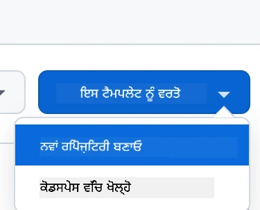  

**ਦੂਜਾ ਕਦਮ: Codespaces ਲਾਂਚ ਕਰੋ**  
- **ਆਪਣੇ ਨਵੇਂ ਬਣਾਏ ਗਏ ਰਿਪੋਜ਼ਟਰੀ ਨੂੰ ਖੋਲ੍ਹੋ**  
- **ਹਰੇ "Code" ਬਟਨ 'ਤੇ ਕਲਿੱਕ ਕਰੋ ਅਤੇ "Codespaces" ਚੁਣੋ**  
- **"Create codespace on main" ਚੁਣੋ** ਆਪਣੇ ਵਿਕਾਸ ਵਾਤਾਵਰਣ ਨੂੰ ਸ਼ੁਰੂ ਕਰਨ ਲਈ  

  

**ਤੀਜਾ ਕਦਮ: ਵਾਤਾਵਰਣ ਕਨਫਿਗਰੇਸ਼ਨ**  
ਜਦੋਂ ਤੁਹਾਡਾ Codespace ਲੋਡ ਹੁੰਦਾ ਹੈ, ਤੁਹਾਨੂੰ ਪਹੁੰਚ ਮਿਲੇਗੀ:  
- **ਪਹਿਲਾਂ ਤੋਂ ਇੰਸਟਾਲ ਕੀਤੇ Python, Node.js ਅਤੇ ਸਾਰੇ ਜ਼ਰੂਰੀ ਵਿਕਾਸ ਟੂਲ**  
- **ਵੈੱਬ ਵਿਕਾਸ ਲਈ ਐਕਸਟੈਂਸ਼ਨ ਨਾਲ VS Code ਇੰਟਰਫੇਸ**  
- **ਬੈਕਐਂਡ ਅਤੇ ਫਰੰਟਐਂਡ ਸਰਵਰ ਚਲਾਉਣ ਲਈ ਟਰਮੀਨਲ ਪਹੁੰਚ**  
- **ਆਪਣੇ ਐਪਲੀਕੇਸ਼ਨਾਂ ਦੀ ਜਾਂਚ ਲਈ ਪੋਰਟ ਫਾਰਵਰਡਿੰਗ**  

**Codespaces ਕੀ ਪ੍ਰਦਾਨ ਕਰਦਾ ਹੈ:**  
- **ਸਥਾਨਕ ਵਾਤਾਵਰਣ ਸੈਟਅਪ ਅਤੇ ਕਨਫਿਗਰੇਸ਼ਨ ਸਮੱਸਿਆਵਾਂ ਨੂੰ ਖਤਮ ਕਰਦਾ ਹੈ**  
- **ਵੱਖ-ਵੱਖ ਡਿਵਾਈਸਾਂ 'ਤੇ ਸਥਿਰ ਵਿਕਾਸ ਵਾਤਾਵਰਣ ਪ੍ਰਦਾਨ ਕਰਦਾ ਹੈ**  
- **ਵੈੱਬ ਵਿਕਾਸ ਲਈ ਪਹਿਲਾਂ ਤੋਂ ਕਨਫਿਗਰ ਕੀਤੇ ਟੂਲ ਅਤੇ ਐਕਸਟੈਂਸ਼ਨ ਸ਼ਾਮਲ ਕਰਦਾ ਹੈ**  
- **ਵਰਜਨ ਕੰਟਰੋਲ ਅਤੇ ਸਹਿਯੋਗ ਲਈ GitHub ਨਾਲ ਸਹੀ ਇੰਟੀਗ੍ਰੇਸ਼ਨ ਪ੍ਰਦਾਨ ਕਰਦਾ ਹੈ**  

> 🚀 **ਪ੍ਰੋ ਟਿਪ**: Codespaces ਸਿੱਖਣ ਅਤੇ ਪ੍ਰੋਟੋਟਾਈਪਿੰਗ AI ਐਪਲੀਕੇਸ਼ਨਾਂ ਲਈ ਬਹੁਤ ਵਧੀਆ ਹੈ ਕਿਉਂਕਿ ਇਹ ਸਾਰੇ ਜਟਿਲ ਵਾਤਾਵਰਣ ਸੈਟਅਪ ਨੂੰ ਆਪਣੇ ਆਪ ਸੰਭਾਲਦਾ ਹੈ, ਤੁਹਾਨੂੰ ਸਿਰਫ਼ ਬਣਾਉਣ ਅਤੇ ਸਿੱਖਣ 'ਤੇ ਧਿਆਨ ਦੇਣ ਦਿੰਦਾ ਹੈ।  

---

**ਅਸਵੀਕਰਤੀ**:  
ਇਹ ਦਸਤਾਵੇਜ਼ AI ਅਨੁਵਾਦ ਸੇਵਾ [Co-op Translator](https://github.com/Azure/co-op-translator) ਦੀ ਵਰਤੋਂ ਕਰਕੇ ਅਨੁਵਾਦ ਕੀਤਾ ਗਿਆ ਹੈ। ਜਦੋਂ ਕਿ ਅਸੀਂ ਸਹੀ ਹੋਣ ਦਾ ਯਤਨ ਕਰਦੇ ਹਾਂ, ਕਿਰਪਾ ਕਰਕੇ ਧਿਆਨ ਦਿਓ ਕਿ ਸਵੈਚਾਲਿਤ ਅਨੁਵਾਦਾਂ ਵਿੱਚ ਗਲਤੀਆਂ ਜਾਂ ਅਸੁੱਤੀਆਂ ਹੋ ਸਕਦੀਆਂ ਹਨ। ਮੂਲ ਦਸਤਾਵੇਜ਼ ਨੂੰ ਇਸਦੀ ਮੂਲ ਭਾਸ਼ਾ ਵਿੱਚ ਅਧਿਕਾਰਤ ਸਰੋਤ ਮੰਨਿਆ ਜਾਣਾ ਚਾਹੀਦਾ ਹੈ। ਮਹੱਤਵਪੂਰਨ ਜਾਣਕਾਰੀ ਲਈ, ਪੇਸ਼ੇਵਰ ਮਨੁੱਖੀ ਅਨੁਵਾਦ ਦੀ ਸਿਫਾਰਸ਼ ਕੀਤੀ ਜਾਂਦੀ ਹੈ। ਇਸ ਅਨੁਵਾਦ ਦੀ ਵਰਤੋਂ ਤੋਂ ਪੈਦਾ ਹੋਣ ਵਾਲੇ ਕਿਸੇ ਵੀ ਗਲਤਫਹਿਮੀ ਜਾਂ ਗਲਤ ਵਿਆਖਿਆ ਲਈ ਅਸੀਂ ਜ਼ਿੰਮੇਵਾਰ ਨਹੀਂ ਹਾਂ।