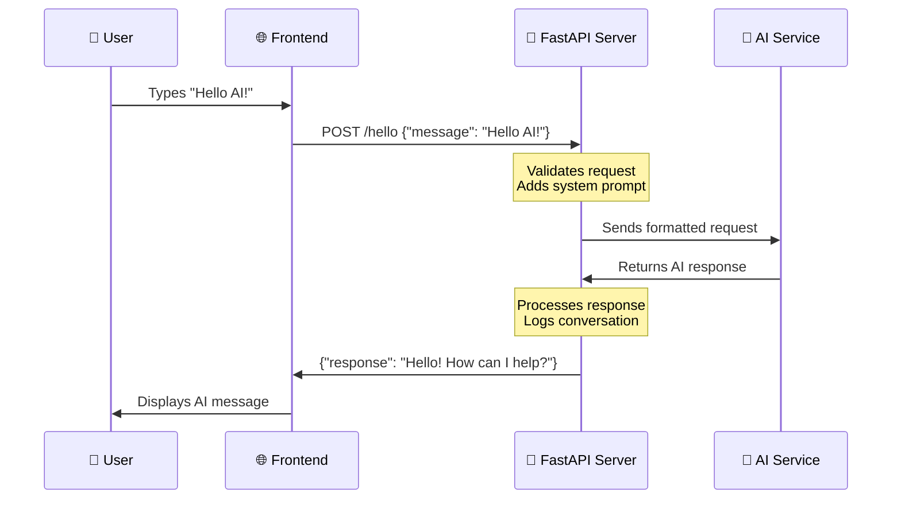
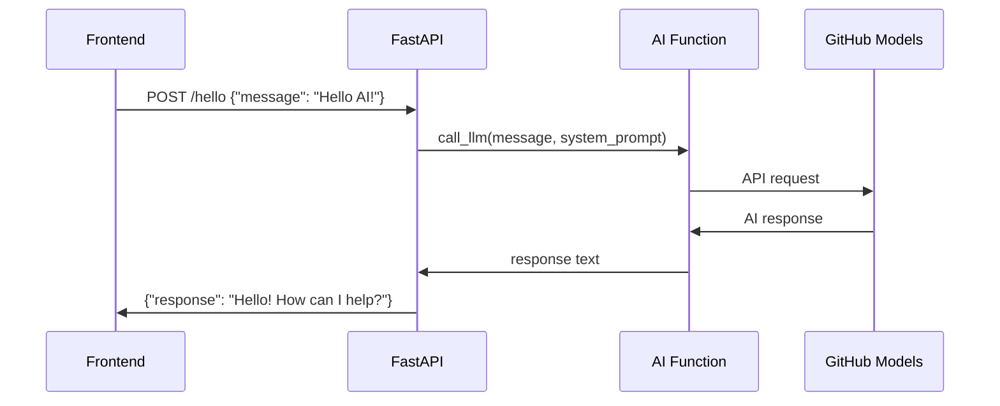
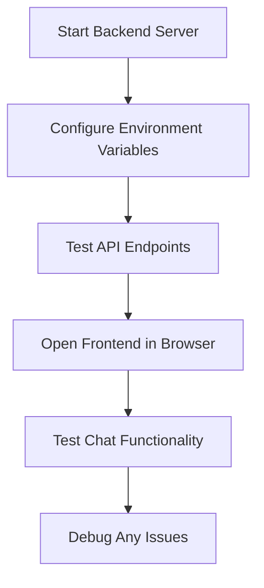

<!--
CO_OP_TRANSLATOR_METADATA:
{
  "original_hash": "46d665af66e51524598af34a42b9b663",
  "translation_date": "2025-10-22T17:43:50+00:00",
  "source_file": "9-chat-project/README.md",
  "language_code": "pa"
}
-->
# AI ਨਾਲ ਚੈਟ ਅਸਿਸਟੈਂਟ ਬਣਾਓ

ਸਟਾਰ ਟ੍ਰੈਕ ਵਿੱਚ ਯਾਦ ਹੈ ਜਦੋਂ ਕ੍ਰੂ ਜਹਾਜ਼ ਦੇ ਕੰਪਿਊਟਰ ਨਾਲ ਆਰਾਮਦਾਇਕ ਗੱਲਬਾਤ ਕਰਦੇ ਸਨ, ਉਸ ਨੂੰ ਜਟਿਲ ਸਵਾਲ ਪੁੱਛਦੇ ਸਨ ਅਤੇ ਸੋਚਵਿਚਾਰ ਵਾਲੇ ਜਵਾਬ ਪ੍ਰਾਪਤ ਕਰਦੇ ਸਨ? 1960 ਦੇ ਦਹਾਕੇ ਵਿੱਚ ਜੋ ਖਾਲੀ ਵਿਗਿਆਨਕ ਕਲਪਨਾ ਜਾਪਦਾ ਸੀ, ਉਹ ਹੁਣ ਕੁਝ ਐਸਾ ਹੈ ਜੋ ਤੁਸੀਂ ਵੈੱਬ ਤਕਨਾਲੋਜੀ ਦੀ ਵਰਤੋਂ ਕਰਕੇ ਬਣਾਉਣ ਦੇ ਯੋਗ ਹੋ।

ਇਸ ਪਾਠ ਵਿੱਚ, ਅਸੀਂ HTML, CSS, JavaScript ਅਤੇ ਕੁਝ ਬੈਕਐਂਡ ਇੰਟੀਗ੍ਰੇਸ਼ਨ ਦੀ ਵਰਤੋਂ ਕਰਕੇ ਇੱਕ AI ਚੈਟ ਅਸਿਸਟੈਂਟ ਬਣਾਉਣ ਜਾ ਰਹੇ ਹਾਂ। ਤੁਸੀਂ ਜਾਣੋਗੇ ਕਿ ਤੁਸੀਂ ਸਿੱਖ ਰਹੇ ਹੋਏ ਉਹੀ ਹੁਨਰ ਸ਼ਕਤੀਸ਼ਾਲੀ AI ਸੇਵਾਵਾਂ ਨਾਲ ਕਿਵੇਂ ਜੁੜ ਸਕਦੇ ਹਨ ਜੋ ਸੰਦਰਭ ਨੂੰ ਸਮਝ ਸਕਦੇ ਹਨ ਅਤੇ ਅਰਥਪੂਰਨ ਜਵਾਬ ਪੈਦਾ ਕਰ ਸਕਦੇ ਹਨ।

AI ਨੂੰ ਇੱਕ ਵੱਡੇ ਪੁਸਤਕਾਲ ਵਾਂਗ ਸੋਚੋ ਜੋ ਸਿਰਫ ਜਾਣਕਾਰੀ ਹੀ ਨਹੀਂ ਲੱਭ ਸਕਦਾ, ਸਗੋਂ ਇਸ ਨੂੰ ਤੁਹਾਡੇ ਵਿਸ਼ੇਸ਼ ਸਵਾਲਾਂ ਲਈ ਲਾਗੂ ਜਵਾਬਾਂ ਵਿੱਚ ਸਮਰਥਿਤ ਕਰ ਸਕਦਾ ਹੈ। ਹਜ਼ਾਰਾਂ ਪੰਨਿਆਂ ਵਿੱਚ ਖੋਜ ਕਰਨ ਦੀ ਬਜਾਏ, ਤੁਹਾਨੂੰ ਸਿੱਧੇ, ਸੰਦਰਭਤ ਜਵਾਬ ਮਿਲਦੇ ਹਨ।

ਇੰਟੀਗ੍ਰੇਸ਼ਨ ਜਾਣ-ਪਛਾਣ ਵਾਲੇ ਵੈੱਬ ਤਕਨਾਲੋਜੀ ਦੁਆਰਾ ਹੁੰਦੀ ਹੈ। HTML ਚੈਟ ਇੰਟਰਫੇਸ ਬਣਾਉਂਦਾ ਹੈ, CSS ਵਿਜ਼ੂਅਲ ਡਿਜ਼ਾਈਨ ਨੂੰ ਸੰਭਾਲਦਾ ਹੈ, JavaScript ਉਪਭੋਗਤਾ ਇੰਟਰੈਕਸ਼ਨ ਨੂੰ ਪ੍ਰਬੰਧਿਤ ਕਰਦਾ ਹੈ, ਅਤੇ ਇੱਕ ਬੈਕਐਂਡ API ਸਾਰੀਆਂ ਚੀਜ਼ਾਂ ਨੂੰ AI ਸੇਵਾਵਾਂ ਨਾਲ ਜੋੜਦਾ ਹੈ। ਇਹ ਕੁਝ ਇਸ ਤਰ੍ਹਾਂ ਹੈ ਜਿਵੇਂ ਕਿ ਇੱਕ ਸਿੰਫਨੀ ਬਣਾਉਣ ਲਈ ਵੱਖ-ਵੱਖ ਸੰਗੀਤਕ ਭਾਗ ਇਕੱਠੇ ਕੰਮ ਕਰਦੇ ਹਨ।

ਅਸੀਂ ਅਸਲ ਵਿੱਚ ਕੁਦਰਤੀ ਮਨੁੱਖੀ ਸੰਚਾਰ ਅਤੇ ਮਸ਼ੀਨ ਪ੍ਰੋਸੈਸਿੰਗ ਦੇ ਵਿਚਕਾਰ ਇੱਕ ਪੁਲ ਬਣਾਉਣ ਜਾ ਰਹੇ ਹਾਂ। ਤੁਸੀਂ AI ਸੇਵਾ ਇੰਟੀਗ੍ਰੇਸ਼ਨ ਦੇ ਤਕਨੀਕੀ ਕਾਰਜਨੁਮਾਂ ਅਤੇ ਡਿਜ਼ਾਈਨ ਪੈਟਰਨ ਸਿੱਖੋਗੇ ਜੋ ਇੰਟਰੈਕਸ਼ਨ ਨੂੰ ਬਹੁਤ ਹੀ ਸਹਜ ਬਣਾਉਂਦੇ ਹਨ।

ਇਸ ਪਾਠ ਦੇ ਅੰਤ ਤੱਕ, AI ਇੰਟੀਗ੍ਰੇਸ਼ਨ ਤੁਹਾਨੂੰ ਇੱਕ ਰਹੱਸਮਈ ਪ੍ਰਕਿਰਿਆ ਵਾਂਗ ਨਹੀਂ ਲੱਗੇਗੀ, ਸਗੋਂ ਇੱਕ ਹੋਰ API ਵਾਂਗ ਲੱਗੇਗੀ ਜਿਸ ਨਾਲ ਤੁਸੀਂ ਕੰਮ ਕਰ ਸਕਦੇ ਹੋ। ਤੁਸੀਂ ਉਹ ਬੁਨਿਆਦੀ ਪੈਟਰਨ ਸਮਝੋਗੇ ਜੋ ChatGPT ਅਤੇ Claude ਵਰਗੇ ਐਪਲੀਕੇਸ਼ਨਾਂ ਨੂੰ ਸ਼ਕਤੀਸ਼ਾਲੀ ਬਣਾਉਂਦੇ ਹਨ, ਉਹੀ ਵੈੱਬ ਵਿਕਾਸ ਦੇ ਸਿਧਾਂਤਾਂ ਦੀ ਵਰਤੋਂ ਕਰਦੇ ਹੋਏ ਜੋ ਤੁਸੀਂ ਸਿੱਖ ਰਹੇ ਹੋ।

ਇਹ ਹੈ ਕਿ ਤੁਹਾਡਾ ਤਿਆਰ ਪ੍ਰੋਜੈਕਟ ਕਿਵੇਂ ਲੱਗੇਗਾ:


## AI ਨੂੰ ਸਮਝਣਾ: ਰਹੱਸ ਤੋਂ ਮਾਹਰਤਾ ਤੱਕ

ਕੋਡ ਵਿੱਚ ਡੁੱਬਣ ਤੋਂ ਪਹਿਲਾਂ, ਆਓ ਸਮਝੀਏ ਕਿ ਅਸੀਂ ਕਿਸ ਨਾਲ ਕੰਮ ਕਰ ਰਹੇ ਹਾਂ। ਜੇ ਤੁਸੀਂ ਪਹਿਲਾਂ API ਦੀ ਵਰਤੋਂ ਕੀਤੀ ਹੈ, ਤਾਂ ਤੁਸੀਂ ਬੁਨਿਆਦੀ ਪੈਟਰਨ ਜਾਣਦੇ ਹੋ: ਇੱਕ ਬੇਨਤੀ ਭੇਜੋ, ਇੱਕ ਜਵਾਬ ਪ੍ਰਾਪਤ ਕਰੋ।

AI APIs ਇੱਕ ਸਮਾਨ ਢਾਂਚੇ ਦੀ ਪਾਲਣਾ ਕਰਦੇ ਹਨ, ਪਰ ਡਾਟਾਬੇਸ ਤੋਂ ਪਹਿਲਾਂ ਤੋਂ ਸਟੋਰ ਕੀਤੇ ਡਾਟਾ ਨੂੰ ਪ੍ਰਾਪਤ ਕਰਨ ਦੀ ਬਜਾਏ, ਉਹ ਵੱਡੇ ਪੱਧਰ ਦੇ ਟੈਕਸਟ ਤੋਂ ਸਿੱਖੇ ਪੈਟਰਨਾਂ ਦੇ ਆਧਾਰ 'ਤੇ ਨਵੇਂ ਜਵਾਬ ਪੈਦਾ ਕਰਦੇ ਹਨ। ਇਸ ਨੂੰ ਕੁਝ ਇਸ ਤਰ੍ਹਾਂ ਸੋਚੋ ਜਿਵੇਂ ਕਿ ਇੱਕ ਪੁਸਤਕਾਲ ਸੂਚੀ ਪ੍ਰਣਾਲੀ ਅਤੇ ਇੱਕ ਜਾਣਕਾਰੀ ਵਾਲੇ ਲਾਇਬ੍ਰੇਰੀਅਨ ਦੇ ਵਿਚਕਾਰ ਅੰਤਰ ਹੈ ਜੋ ਕਈ ਸਰੋਤਾਂ ਤੋਂ ਜਾਣਕਾਰੀ ਨੂੰ ਸਮਰਥਿਤ ਕਰ ਸਕਦਾ ਹੈ।

### "ਜਨਰੇਟਿਵ AI" ਅਸਲ ਵਿੱਚ ਕੀ ਹੈ?

ਸੋਚੋ ਕਿ ਰੋਸੇਟਾ ਸਟੋਨ ਨੇ ਵਿਦਵਾਨਾਂ ਨੂੰ ਮਿਸਰੀ ਹਾਇਰੋਗਲਿਫਿਕਸ ਨੂੰ ਸਮਝਣ ਦੀ ਆਗਿਆ ਦਿੱਤੀ ਸੀ, ਜਾਣੇ-ਅਣਜਾਣ ਭਾਸ਼ਾਵਾਂ ਦੇ ਵਿਚਕਾਰ ਪੈਟਰਨ ਲੱਭ ਕੇ। AI ਮਾਡਲ ਇਸੇ ਤਰ੍ਹਾਂ ਕੰਮ ਕਰਦੇ ਹਨ – ਉਹ ਵੱਡੇ ਪੱਧਰ ਦੇ ਟੈਕਸਟ ਵਿੱਚ ਪੈਟਰਨ ਲੱਭਦੇ ਹਨ ਕਿ ਭਾਸ਼ਾ ਕਿਵੇਂ ਕੰਮ ਕਰਦੀ ਹੈ, ਫਿਰ ਉਹ ਪੈਟਰਨਾਂ ਦੀ ਵਰਤੋਂ ਕਰਕੇ ਨਵੇਂ ਸਵਾਲਾਂ ਲਈ ਉਚਿਤ ਜਵਾਬ ਪੈਦਾ ਕਰਦੇ ਹਨ।

**ਇਸ ਨੂੰ ਇੱਕ ਸਧਾਰਨ ਤੁਲਨਾ ਨਾਲ ਸਮਝਾਉਣ ਦਿਓ:**
- **ਪ੍ਰੰਪਰਾਗਤ ਡਾਟਾਬੇਸ**: ਜਿਵੇਂ ਕਿ ਆਪਣਾ ਜਨਮ ਸਰਟੀਫਿਕੇਟ ਮੰਗਣਾ – ਤੁਹਾਨੂੰ ਹਰ ਵਾਰ ਉਹੀ ਦਸਤਾਵੇਜ਼ ਮਿਲਦਾ ਹੈ
- **ਸਰਚ ਇੰਜਨ**: ਜਿਵੇਂ ਕਿ ਲਾਇਬ੍ਰੇਰੀਅਨ ਨੂੰ ਬਿੱਲੀਆਂ ਬਾਰੇ ਕਿਤਾਬਾਂ ਲੱਭਣ ਲਈ ਕਹਿਣਾ – ਉਹ ਤੁਹਾਨੂੰ ਦੱਸਦੇ ਹਨ ਕਿ ਕੀ ਉਪਲਬਧ ਹੈ
- **ਜਨਰੇਟਿਵ AI**: ਜਿਵੇਂ ਕਿ ਇੱਕ ਜਾਣਕਾਰੀ ਵਾਲੇ ਦੋਸਤ ਨੂੰ ਬਿੱਲੀਆਂ ਬਾਰੇ ਪੁੱਛਣਾ – ਉਹ ਤੁਹਾਨੂੰ ਦੱਸਦੇ ਹਨ ਕਿ ਤੁਹਾਨੂੰ ਕੀ ਜਾਣਨ ਦੀ ਲੋੜ ਹੈ

### AI ਮਾਡਲ ਕਿਵੇਂ ਸਿੱਖਦੇ ਹਨ (ਸਧਾਰਨ ਵਰਜਨ)

AI ਮਾਡਲ ਵੱਡੇ ਪੱਧਰ ਦੇ ਡਾਟਾਸੈਟਾਂ ਦੇ ਸੰਪਰਕ ਦੁਆਰਾ ਸਿੱਖਦੇ ਹਨ ਜੋ ਕਿਤਾਬਾਂ, ਲੇਖਾਂ ਅਤੇ ਗੱਲਬਾਤਾਂ ਵਿੱਚ ਟੈਕਸਟ ਸ਼ਾਮਲ ਕਰਦੇ ਹਨ। ਇਸ ਪ੍ਰਕਿਰਿਆ ਦੁਆਰਾ, ਉਹ ਪੈਟਰਨਾਂ ਦੀ ਪਛਾਣ ਕਰਦੇ ਹਨ:
- ਲਿਖਤੀ ਸੰਚਾਰ ਵਿੱਚ ਵਿਚਾਰ ਕਿਵੇਂ ਬਣਦੇ ਹਨ
- ਕਿਹੜੇ ਸ਼ਬਦ ਆਮ ਤੌਰ 'ਤੇ ਇਕੱਠੇ ਆਉਂਦੇ ਹਨ
- ਗੱਲਬਾਤਾਂ ਆਮ ਤੌਰ 'ਤੇ ਕਿਵੇਂ ਚੱਲਦੀਆਂ ਹਨ
- ਆਧਿਕਾਰਿਕ ਅਤੇ ਅਨੌਪਚਾਰਿਕ ਸੰਚਾਰ ਦੇ ਵਿਚਕਾਰ ਸੰਦਰਭਤ ਅੰਤਰ

**ਇਹ ਕੁਝ ਇਸ ਤਰ੍ਹਾਂ ਹੈ ਜਿਵੇਂ ਕਿ ਪੁਰਾਤੱਤਵ ਵਿਦਵਾਨ ਪ੍ਰਾਚੀਨ ਭਾਸ਼ਾਵਾਂ ਨੂੰ ਡਿਕੋਡ ਕਰਦੇ ਹਨ**: ਉਹ ਵਿਆਖਿਆ, ਸ਼ਬਦਾਵਲੀ ਅਤੇ ਸੱਭਿਆਚਾਰਕ ਸੰਦਰਭ ਨੂੰ ਸਮਝਣ ਲਈ ਹਜ਼ਾਰਾਂ ਉਦਾਹਰਣਾਂ ਦਾ ਵਿਸ਼ਲੇਸ਼ਣ ਕਰਦੇ ਹਨ, ਆਖਿਰਕਾਰ ਉਹ ਪੈਟਰਨਾਂ ਦੀ ਵਰਤੋਂ ਕਰਕੇ ਨਵੇਂ ਟੈਕਸਟਾਂ ਦੀ ਵਿਆਖਿਆ ਕਰਨ ਦੇ ਯੋਗ ਬਣ ਜਾਂਦੇ ਹਨ।

### ਕਿਉਂ GitHub ਮਾਡਲ?

ਅਸੀਂ GitHub ਮਾਡਲਾਂ ਦੀ ਵਰਤੋਂ ਕਰ ਰਹੇ ਹਾਂ ਕਿਉਂਕਿ ਇਹ ਸਾਨੂੰ ਆਪਣਾ AI ਢਾਂਚਾ ਸੈਟਅੱਪ ਕਰਨ ਦੀ ਲੋੜ ਤੋਂ ਬਿਨਾਂ ਐਂਟਰਪ੍ਰਾਈਜ਼-ਪੱਧਰ ਦੇ AI ਤੱਕ ਪਹੁੰਚ ਪ੍ਰਦਾਨ ਕਰਦਾ ਹੈ (ਜੋ, ਮੈਨੂੰ ਯਕੀਨ ਕਰੋ, ਤੁਸੀਂ ਇਸ ਸਮੇਂ ਨਹੀਂ ਕਰਨਾ ਚਾਹੁੰਦੇ!)। ਇਹ ਅਸਲ ਵਿੱਚ "AI-ਐਜ਼-ਏ-ਸਰਵਿਸ" ਹੈ, ਅਤੇ ਸਭ ਤੋਂ ਵਧੀਆ ਗੱਲ ਕੀ ਹੈ? ਇਹ ਸ਼ੁਰੂ ਕਰਨ ਲਈ ਮੁਫ਼ਤ ਹੈ, ਇਸ ਲਈ ਤੁਸੀਂ ਵੱਡੇ ਬਿੱਲ ਦੀ ਚਿੰਤਾ ਕੀਤੇ ਬਿਨਾਂ ਪ੍ਰਯੋਗ ਕਰ ਸਕਦੇ ਹੋ।


ਅਸੀਂ GitHub ਮਾਡਲਾਂ ਦੀ ਵਰਤੋਂ ਕਰਾਂਗੇ ਆਪਣੇ ਬੈਕਐਂਡ ਇੰਟੀਗ੍ਰੇਸ਼ਨ ਲਈ, ਜੋ ਕਿ ਡਿਵੈਲਪਰ-ਫ੍ਰੈਂਡਲੀ ਇੰਟਰਫੇਸ ਦੁਆਰਾ ਪੇਸ਼ੇਵਰ-ਗ੍ਰੇਡ AI ਸਮਰੱਥਾਵਾਂ ਤੱਕ ਪਹੁੰਚ ਪ੍ਰਦਾਨ ਕਰਦਾ ਹੈ। [GitHub ਮਾਡਲ ਪਲੇਗਰਾਊਂਡ](https://github.com/marketplace/models/azure-openai/gpt-4o-mini/playground) ਇੱਕ ਟੈਸਟਿੰਗ ਵਾਤਾਵਰਣ ਵਜੋਂ ਕੰਮ ਕਰਦਾ ਹੈ ਜਿੱਥੇ ਤੁਸੀਂ ਵੱਖ-ਵੱਖ AI ਮਾਡਲਾਂ ਨਾਲ ਪ੍ਰਯੋਗ ਕਰ ਸਕਦੇ ਹੋ ਅਤੇ ਕੋਡ ਵਿੱਚ ਲਾਗੂ ਕਰਨ ਤੋਂ ਪਹਿਲਾਂ ਉਨ੍ਹਾਂ ਦੀਆਂ ਸਮਰੱਥਾਵਾਂ ਨੂੰ ਸਮਝ ਸਕਦੇ ਹੋ।


**ਇਹ ਪਲੇਗਰਾਊਂਡ ਨੂੰ ਬਹੁਤ ਹੀ ਲਾਭਦਾਇਕ ਬਣਾਉਂਦਾ ਹੈ:**
- **ਵੱਖ-ਵੱਖ AI ਮਾਡਲਾਂ** ਨੂੰ ਜਿਵੇਂ GPT-4o-mini, Claude ਆਦਿ (ਸਭ ਮੁਫ਼ਤ!) ਦੀ ਜਾਂਚ ਕਰੋ
- **ਆਪਣੇ ਵਿਚਾਰਾਂ ਅਤੇ ਪ੍ਰੋਮਪਟਾਂ** ਨੂੰ ਕੋਡ ਲਿਖਣ ਤੋਂ ਪਹਿਲਾਂ ਟੈਸਟ ਕਰੋ
- **ਤਿਆਰ-ਵਰਤਣਯੋਗ ਕੋਡ ਸਨਿੱਪਟਸ** ਪ੍ਰਾਪਤ ਕਰੋ ਆਪਣੇ ਮਨਪਸੰਦ ਪ੍ਰੋਗਰਾਮਿੰਗ ਭਾਸ਼ਾ ਵਿੱਚ
- **ਸੈਟਿੰਗਾਂ ਨੂੰ ਢਾਲੋ** ਜਿਵੇਂ ਰਚਨਾਤਮਕਤਾ ਪੱਧਰ ਅਤੇ ਜਵਾਬ ਦੀ ਲੰਬਾਈ ਦੇਖਣ ਲਈ ਕਿ ਉਹ ਨਤੀਜਿਆਂ ਨੂੰ ਕਿਵੇਂ ਪ੍ਰਭਾਵਿਤ ਕਰਦੇ ਹਨ

ਜਦੋਂ ਤੁਸੀਂ ਕੁਝ ਸਮਾਂ ਖੇਡਦੇ ਹੋ, ਸਿਰਫ "ਕੋਡ" ਟੈਬ 'ਤੇ ਕਲਿੱਕ ਕਰੋ ਅਤੇ ਆਪਣੀ ਪ੍ਰੋਗਰਾਮਿੰਗ ਭਾਸ਼ਾ ਚੁਣੋ ਤਾਂ ਜੋ ਤੁਹਾਨੂੰ ਲਾਗੂ ਕਰਨ ਲਈ ਲੋੜੀਂਦਾ ਕੋਡ ਮਿਲੇ।


## Python ਬੈਕਐਂਡ ਇੰਟੀਗ੍ਰੇਸ਼ਨ ਸੈਟਅੱਪ ਕਰਨਾ

ਹੁਣ ਆਓ Python ਦੀ ਵਰਤੋਂ ਕਰਕੇ AI ਇੰਟੀਗ੍ਰੇਸ਼ਨ ਨੂੰ ਲਾਗੂ ਕਰੀਏ। Python AI ਐਪਲੀਕੇਸ਼ਨਾਂ ਲਈ ਸ਼ਾਨਦਾਰ ਹੈ ਕਿਉਂਕਿ ਇਸਦਾ ਸਧਾਰਨ ਸਿੰਟੈਕਸ ਅਤੇ ਸ਼ਕਤੀਸ਼ਾਲੀ ਲਾਇਬ੍ਰੇਰੀਆਂ ਹਨ। ਅਸੀਂ GitHub ਮਾਡਲ ਪਲੇਗਰਾਊਂਡ ਤੋਂ ਕੋਡ ਨਾਲ ਸ਼ੁਰੂ ਕਰਾਂਗੇ ਅਤੇ ਫਿਰ ਇਸ ਨੂੰ ਇੱਕ ਦੁਬਾਰਾ ਵਰਤਣਯੋਗ, ਉਤਪਾਦਨ-ਤਿਆਰ ਫੰਕਸ਼ਨ ਵਿੱਚ ਰਿਫੈਕਟਰ ਕਰਾਂਗੇ।

### ਬੇਸ ਇੰਪਲੀਮੈਂਟੇਸ਼ਨ ਨੂੰ ਸਮਝਣਾ

ਜਦੋਂ ਤੁਸੀਂ ਪਲੇਗਰਾਊਂਡ ਤੋਂ Python ਕੋਡ ਲੈਂਦੇ ਹੋ, ਤੁਹਾਨੂੰ ਕੁਝ ਇਸ ਤਰ੍ਹਾਂ ਦੇਖਣ ਨੂੰ ਮਿਲੇਗਾ। ਜੇ ਇਹ ਪਹਿਲਾਂ ਬਹੁਤ ਜ਼ਿਆਦਾ ਜਾਪਦਾ ਹੈ ਤਾਂ ਚਿੰਤਾ ਨਾ ਕਰੋ – ਆਓ ਇਸ ਨੂੰ ਹਰੇਕ ਹਿੱਸੇ ਵਿੱਚ ਸਮਝੀਏ:

```python
"""Run this model in Python

> pip install openai
"""
import os
from openai import OpenAI

# To authenticate with the model you will need to generate a personal access token (PAT) in your GitHub settings. 
# Create your PAT token by following instructions here: https://docs.github.com/en/authentication/keeping-your-account-and-data-secure/managing-your-personal-access-tokens
client = OpenAI(
    base_url="https://models.github.ai/inference",
    api_key=os.environ["GITHUB_TOKEN"],
)

```python
response = client.chat.completions.create(
    messages=[
        {
            "role": "system",
            "content": "",
        },
        {
            "role": "user",
            "content": "What is the capital of France?",
        }
    ],
    model="openai/gpt-4o-mini",
    temperature=1,
    max_tokens=4096,
    top_p=1
)

print(response.choices[0].message.content)
```

**ਇਸ ਕੋਡ ਵਿੱਚ ਕੀ ਹੋ ਰਿਹਾ ਹੈ:**
- **ਅਸੀਂ ਉਹ ਟੂਲਜ਼ ਇੰਪੋਰਟ ਕਰਦੇ ਹਾਂ** ਜਿਨ੍ਹਾਂ ਦੀ ਲੋੜ ਹੈ: `os` ਵਾਤਾਵਰਣ ਵੈਰੀਏਬਲਾਂ ਨੂੰ ਪੜ੍ਹਨ ਲਈ ਅਤੇ `OpenAI` AI ਨਾਲ ਗੱਲਬਾਤ ਕਰਨ ਲਈ
- **ਅਸੀਂ OpenAI ਕਲਾਇੰਟ ਸੈਟਅਪ ਕਰਦੇ ਹਾਂ** ਤਾਂ ਜੋ GitHub ਦੇ AI ਸਰਵਰਾਂ ਨੂੰ ਸਿੱਧਾ OpenAI ਦੀ ਬਜਾਏ ਪੋਇੰਟ ਕਰ ਸਕੇ
- **ਅਸੀਂ GitHub ਟੋਕਨ ਦੀ ਵਰਤੋਂ ਕਰਕੇ ਪ੍ਰਮਾਣਿਕਤਾ ਕਰਦੇ ਹਾਂ**
- **ਅਸੀਂ ਆਪਣੀ ਗੱਲਬਾਤ ਨੂੰ ਵੱਖ-ਵੱਖ "ਰੋਲ" ਨਾਲ ਬਣਾਉਂਦੇ ਹਾਂ – ਇਸ ਨੂੰ ਇੱਕ ਨਾਟਕ ਲਈ ਸਟੇਜ ਸੈਟ ਕਰਨ ਵਾਂਗ ਸੋਚੋ
- **ਅਸੀਂ AI ਨੂੰ ਆਪਣੀ ਬੇਨਤੀ ਭੇਜਦੇ ਹਾਂ ਕੁਝ ਫਾਈਨ-ਟਿਊਨਿੰਗ ਪੈਰਾਮੀਟਰਾਂ ਨਾਲ
- **ਅਸੀਂ ਸਾਰੇ ਡਾਟਾ ਵਿੱਚੋਂ ਅਸਲ ਜਵਾਬ ਟੈਕਸਟ ਨੂੰ ਕੱਢਦੇ ਹਾਂ

### ਗੱਲਬਾਤ ਰੋਲਾਂ ਨੂੰ ਸਮਝਣਾ: AI ਗੱਲਬਾਤ ਫਰੇਮਵਰਕ

AI ਗੱਲਬਾਤਾਂ ਇੱਕ ਵਿਸ਼ੇਸ਼ ਢਾਂਚੇ ਦੀ ਵਰਤੋਂ ਕਰਦੀਆਂ ਹਨ ਜਿਸ ਵਿੱਚ ਵੱਖ-ਵੱਖ "ਰੋਲ" ਹੁੰਦੇ ਹਨ ਜੋ ਵੱਖ-ਵੱਖ ਉਦੇਸ਼ਾਂ ਦੀ ਸੇਵਾ ਕਰਦੇ ਹਨ:

```python
messages=[
    {
        "role": "system",
        "content": "You are a helpful assistant who explains things simply."
    },
    {
        "role": "user", 
        "content": "What is machine learning?"
    }
]
```

**ਇਸ ਨੂੰ ਇੱਕ ਨਾਟਕ ਦਾ ਦਿਸ਼ਾ-ਨਿਰਦੇਸ਼ ਦੇਣ ਵਾਂਗ ਸੋਚੋ:**
- **ਸਿਸਟਮ ਰੋਲ**: ਜਿਵੇਂ ਕਿ ਇੱਕ ਅਭਿਨੇਤਾ ਲਈ ਸਟੇਜ ਦਿਸ਼ਾ-ਨਿਰਦੇਸ਼ – ਇਹ AI ਨੂੰ ਦੱਸਦਾ ਹੈ ਕਿ ਕਿਵੇਂ ਵਰਤਾਰਾ ਕਰਨਾ ਹੈ, ਕਿਹੜੀ ਪਛਾਣ ਹੋਣੀ ਚਾਹੀਦੀ ਹੈ, ਅਤੇ ਕਿਵੇਂ ਜਵਾਬ ਦੇਣਾ ਹੈ
- **ਉਪਭੋਗਤਾ ਰੋਲ**: ਉਹ ਅਸਲ ਸਵਾਲ ਜਾਂ ਸੁਨੇਹਾ ਜੋ ਤੁਹਾਡੀ ਐਪਲੀਕੇਸ਼ਨ ਵਰਤਣ ਵਾਲੇ ਵਿਅਕਤੀ ਤੋਂ ਆਉਂਦਾ ਹੈ
- **ਅਸਿਸਟੈਂਟ ਰੋਲ**: AI ਦਾ ਜਵਾਬ (ਤੁਸੀਂ ਇਹ ਨਹੀਂ ਭੇਜਦੇ, ਪਰ ਇਹ ਗੱਲਬਾਤ ਦੇ ਇਤਿਹਾਸ ਵਿੱਚ ਦਿਖਾਈ ਦਿੰਦਾ ਹੈ)

**ਅਸਲ ਜ਼ਿੰਦਗੀ ਦੀ ਤੁਲਨਾ**: ਸੋਚੋ ਤੁਸੀਂ ਇੱਕ ਦੋਸਤ ਨੂੰ ਪਾਰਟੀ ਵਿੱਚ ਕਿਸੇ ਨਾਲ ਮਿਲਾਉਂਦੇ ਹੋ:
- **ਸਿਸਟਮ ਸੁਨੇਹਾ**: "ਇਹ ਮੇਰੀ ਦੋਸਤ ਸਾਰਾ ਹੈ, ਉਹ ਇੱਕ ਡਾਕਟਰ ਹੈ ਜੋ ਮੈਡੀਕਲ ਸੰਕਲਪਾਂ ਨੂੰ ਸਧਾਰਨ ਸ਼ਬਦਾਂ ਵਿੱਚ ਸਮਝਾਉਣ ਵਿੱਚ ਮਹਾਨ ਹੈ"
- **ਉਪਭੋਗਤਾ ਸੁਨੇਹਾ**: "ਕੀ ਤੁਸੀਂ ਦੱਸ ਸਕਦੇ ਹੋ ਕਿ ਟੀਕੇ ਕਿਵੇਂ ਕੰਮ ਕਰਦੇ ਹਨ?"
- **ਅਸਿਸਟੈਂਟ ਜਵਾਬ**: ਸਾਰਾ ਇੱਕ ਦੋਸਤਾਨਾ ਡਾਕਟਰ ਵਾਂਗ ਜਵਾਬ ਦਿੰਦੀ ਹੈ, ਨਾ ਕਿ ਇੱਕ ਵਕੀਲ ਜਾਂ ਰਸੋਈਏ ਵਾਂਗ

### AI ਪੈਰਾਮੀਟਰਾਂ ਨੂੰ ਸਮਝਣਾ: ਜਵਾਬ ਦੇ ਵਰਤਾਰਾ ਨੂੰ ਸੁਧਾਰਨਾ

AI API ਕਾਲਾਂ ਵਿੱਚ ਗਿਣਤੀ ਪੈਰਾਮੀਟਰ ਮਾਡਲ ਨੂੰ ਜਵਾਬ ਪੈਦਾ ਕਰਨ ਦੇ ਤਰੀਕੇ ਨੂੰ ਨਿਯੰਤਰਿਤ ਕਰਦੇ ਹਨ। ਇਹ ਸੈਟਿੰਗਾਂ ਤੁਹਾਨੂੰ ਵੱਖ-ਵੱਖ ਵਰਤੋਂ ਦੇ ਕੇਸਾਂ ਲਈ AI ਦੇ ਵਰਤਾਰਾ ਨੂੰ ਢਾਲਣ ਦੀ ਆਗਿਆ ਦਿੰਦੀਆਂ ਹਨ:

#### ਟੈਂਪਰੇਚਰ (0.0 ਤੋਂ 2.0): ਰਚਨਾਤਮਕਤਾ ਦਾ ਡਾਇਲ

**ਇਹ ਕੀ ਕਰਦਾ ਹੈ**: AI ਦੇ ਜਵਾਬਾਂ ਨੂੰ ਕਿੰਨਾ ਰਚਨਾਤਮਕ ਜਾਂ ਪੂਰਨਵਿਰਾਮ ਬਣਾਉਂਦਾ ਹੈ।

**ਇਸ ਨੂੰ ਇੱਕ ਜੈਜ਼ ਸੰਗੀਤਕਾਰ ਦੇ ਇੰਪ੍ਰੋਵਾਈਜ਼ੇਸ਼ਨ ਪੱਧਰ ਵਾਂਗ ਸੋਚੋ:**
- **ਟੈਂਪਰੇਚਰ = 0.1**: ਹਰ ਵਾਰ ਬਿਲਕੁਲ ਉਹੀ ਧੁਨ ਵਜਾਉਣਾ (ਬਹੁਤ ਹੀ ਪੂਰਨਵਿਰਾਮ)
- **ਟੈਂਪਰੇਚਰ = 0.7**: ਕੁਝ ਸੁੰਦਰ ਵੈਰੀਏਸ਼ਨ ਸ਼ਾਮਲ ਕਰਨਾ ਜਦੋਂ ਕਿ ਪਛਾਣਯੋਗ ਰਹਿਣਾ (ਸੰਤੁਲਿਤ ਰਚਨਾਤਮਕਤਾ)
- **ਟੈਂਪਰੇਚਰ = 1.5**: ਪੂਰੀ ਤਰ੍ਹਾਂ ਪ੍ਰਯੋਗਾਤਮਕ ਜੈਜ਼ ਅਣਪਛਾਤੇ ਮੋੜਾਂ ਨਾਲ (ਬਹੁਤ ਹੀ ਅਣਪਛਾਤਾ)

```python
# Very predictable responses (good for factual questions)
response = client.chat.completions.create(
    messages=[{"role": "user", "content": "What is 2+2?"}],
    temperature=0.1  # Will almost always say "4"
)

# Creative responses (good for brainstorming)
response = client.chat.completions.create(
    messages=[{"role": "user", "content": "Write a creative story opening"}],
    temperature=1.2  # Will generate unique, unexpected stories
)
```

#### ਮੈਕਸ ਟੋਕਨ (1 ਤੋਂ 4096+): ਜਵਾਬ ਦੀ ਲੰਬਾਈ ਦਾ ਨਿਯੰਤਰਕ

**ਇਹ ਕੀ ਕਰਦਾ ਹੈ**: AI ਦੇ ਜਵਾਬ ਦੀ ਲੰਬਾਈ 'ਤੇ ਸੀਮਾ ਸੈਟ ਕਰਦਾ ਹੈ।

**ਟੋਕਨ ਨੂੰ ਲਗਭਗ ਸ਼ਬਦਾਂ ਦੇ ਬਰਾਬਰ ਸੋਚੋ** (ਅੰਗਰੇਜ਼ੀ ਵਿੱਚ ਲਗਭਗ 1 ਟੋਕਨ = 0.75 ਸ਼ਬਦ):
- **max_tokens=50**: ਛੋਟਾ ਅਤੇ ਸਧਾਰਨ (ਜਿਵੇਂ ਇੱਕ ਟੈਕਸਟ ਸੁਨੇਹਾ)
- **max_tokens=500**: ਇੱਕ ਚੰਗ
**ਇਹ ਹੈ ਕਿ ਕਿਉਂ FastAPI ਸਾਡੇ ਪ੍ਰੋਜੈਕਟ ਲਈ ਬੇਹਤਰੀਨ ਹੈ:**
- **ਡਿਫਾਲਟ async**: ਇੱਕ ਸਮੇਂ ਵਿੱਚ ਕਈ AI ਬੇਨਤੀਆਂ ਨੂੰ ਸੰਭਾਲ ਸਕਦਾ ਹੈ ਬਿਨਾਂ ਰੁਕਾਵਟ ਦੇ
- **ਆਟੋਮੈਟਿਕ ਡੌਕਸ**: `/docs` 'ਤੇ ਜਾਓ ਅਤੇ ਸੁੰਦਰ, ਇੰਟਰਐਕਟਿਵ API ਡੌਕੂਮੈਂਟੇਸ਼ਨ ਪੇਜ ਮੁਫ਼ਤ ਵਿੱਚ ਪ੍ਰਾਪਤ ਕਰੋ
- **ਬਿਲਟ-ਇਨ ਵੈਲੀਡੇਸ਼ਨ**: ਗਲਤੀਆਂ ਨੂੰ ਸਮੱਸਿਆ ਬਣਨ ਤੋਂ ਪਹਿਲਾਂ ਹੀ ਪਕੜ ਲੈਂਦਾ ਹੈ
- **ਬਿਜਲੀ ਦੀ ਗਤੀ**: Python ਦੇ ਸਭ ਤੋਂ ਤੇਜ਼ ਫਰੇਮਵਰਕ ਵਿੱਚੋਂ ਇੱਕ
- **ਆਧੁਨਿਕ Python**: Python ਦੇ ਨਵੇਂ ਅਤੇ ਸ਼ਾਨਦਾਰ ਫੀਚਰਾਂ ਦੀ ਵਰਤੋਂ ਕਰਦਾ ਹੈ

**ਅਤੇ ਇਹ ਹੈ ਕਿ ਸਾਨੂੰ ਬੈਕਐਂਡ ਦੀ ਲੋੜ ਕਿਉਂ ਹੈ:**

**ਸੁਰੱਖਿਆ**: ਤੁਹਾਡਾ AI API ਕੁੰਜੀ ਇੱਕ ਪਾਸਵਰਡ ਵਾਂਗ ਹੈ – ਜੇ ਤੁਸੀਂ ਇਸਨੂੰ ਫਰੰਟਐਂਡ ਜਾਵਾਸਕ੍ਰਿਪਟ ਵਿੱਚ ਰੱਖਦੇ ਹੋ, ਤਾਂ ਕੋਈ ਵੀ ਜੋ ਤੁਹਾਡੀ ਵੈਬਸਾਈਟ ਦੇ ਸੋਰਸ ਕੋਡ ਨੂੰ ਵੇਖਦਾ ਹੈ ਇਸਨੂੰ ਚੋਰੀ ਕਰ ਸਕਦਾ ਹੈ ਅਤੇ ਤੁਹਾਡੇ AI ਕ੍ਰੈਡਿਟਸ ਦੀ ਵਰਤੋਂ ਕਰ ਸਕਦਾ ਹੈ। ਬੈਕਐਂਡ ਸੰਵੇਦਨਸ਼ੀਲ ਸਾਧਨਾਂ ਨੂੰ ਸੁਰੱਖਿਅਤ ਰੱਖਦਾ ਹੈ।

**ਰੇਟ ਲਿਮਿਟਿੰਗ ਅਤੇ ਕੰਟਰੋਲ**: ਬੈਕਐਂਡ ਤੁਹਾਨੂੰ ਯੂਜ਼ਰਾਂ ਦੀ ਬੇਨਤੀ ਦੀ ਗਿਣਤੀ ਨੂੰ ਕੰਟਰੋਲ ਕਰਨ, ਯੂਜ਼ਰ ਪ੍ਰਮਾਣਿਕਤਾ ਲਾਗੂ ਕਰਨ ਅਤੇ ਵਰਤੋਂ ਨੂੰ ਟ੍ਰੈਕ ਕਰਨ ਲਈ ਲੌਗਿੰਗ ਸ਼ਾਮਲ ਕਰਨ ਦੀ ਆਗਿਆ ਦਿੰਦਾ ਹੈ।

**ਡਾਟਾ ਪ੍ਰੋਸੈਸਿੰਗ**: ਤੁਸੀਂ ਗੱਲਬਾਤਾਂ ਨੂੰ ਸੇਵ ਕਰਨਾ, ਅਣਚਾਹੀ ਸਮੱਗਰੀ ਨੂੰ ਫਿਲਟਰ ਕਰਨਾ, ਜਾਂ ਕਈ AI ਸੇਵਾਵਾਂ ਨੂੰ ਜੋੜਨਾ ਚਾਹੁੰਦੇ ਹੋ। ਇਹ ਸਾਰਾ ਲਾਜਿਕ ਬੈਕਐਂਡ ਵਿੱਚ ਹੁੰਦਾ ਹੈ।

**ਆਰਕੀਟੈਕਚਰ ਕਲਾਇੰਟ-ਸਰਵਰ ਮਾਡਲ ਵਰਗਾ ਹੈ:**
- **ਫਰੰਟਐਂਡ**: ਇੰਟਰਫੇਸ ਲੇਅਰ ਯੂਜ਼ਰ ਇੰਟਰਐਕਸ਼ਨ ਲਈ
- **ਬੈਕਐਂਡ API**: ਬੇਨਤੀ ਪ੍ਰੋਸੈਸਿੰਗ ਅਤੇ ਰੂਟਿੰਗ ਲੇਅਰ
- **AI ਸੇਵਾ**: ਬਾਹਰੀ ਗਣਨਾ ਅਤੇ ਜਵਾਬ ਪੈਦਾ ਕਰਨ
- **ਇਨਵਾਇਰਮੈਂਟ ਵੈਰੀਏਬਲ**: ਸੁਰੱਖਿਅਤ ਸੰਰਚਨਾ ਅਤੇ ਸਾਧਨਾਂ ਦਾ ਸਟੋਰੇਜ

### ਬੇਨਤੀ-ਜਵਾਬ ਪ੍ਰਕਿਰਿਆ ਨੂੰ ਸਮਝਣਾ

ਆਓ ਵੇਖੀਏ ਕਿ ਜਦੋਂ ਕੋਈ ਯੂਜ਼ਰ ਸੁਨੇਹਾ ਭੇਜਦਾ ਹੈ ਤਾਂ ਕੀ ਹੁੰਦਾ ਹੈ:



**ਹਰ ਕਦਮ ਨੂੰ ਸਮਝਣਾ:**
1. **ਯੂਜ਼ਰ ਇੰਟਰਐਕਸ਼ਨ**: ਵਿਅਕਤੀ ਚੈਟ ਇੰਟਰਫੇਸ ਵਿੱਚ ਟਾਈਪ ਕਰਦਾ ਹੈ
2. **ਫਰੰਟਐਂਡ ਪ੍ਰੋਸੈਸਿੰਗ**: ਜਾਵਾਸਕ੍ਰਿਪਟ ਇਨਪੁਟ ਨੂੰ ਕੈਪਚਰ ਕਰਦਾ ਹੈ ਅਤੇ ਇਸਨੂੰ JSON ਵਜੋਂ ਫਾਰਮੈਟ ਕਰਦਾ ਹੈ
3. **API ਵੈਲੀਡੇਸ਼ਨ**: FastAPI Pydantic ਮਾਡਲਾਂ ਦੀ ਵਰਤੋਂ ਕਰਕੇ ਬੇਨਤੀ ਨੂੰ ਆਟੋਮੈਟਿਕ ਤੌਰ 'ਤੇ ਵੈਲੀਡੇਟ ਕਰਦਾ ਹੈ
4. **AI ਇੰਟੀਗ੍ਰੇਸ਼ਨ**: ਬੈਕਐਂਡ ਸੰਦਰਭ (ਸਿਸਟਮ ਪ੍ਰੌਮਪਟ) ਸ਼ਾਮਲ ਕਰਦਾ ਹੈ ਅਤੇ AI ਸੇਵਾ ਨੂੰ ਕਾਲ ਕਰਦਾ ਹੈ
5. **ਜਵਾਬ ਸੰਭਾਲਣਾ**: API AI ਜਵਾਬ ਪ੍ਰਾਪਤ ਕਰਦਾ ਹੈ ਅਤੇ ਜਰੂਰਤ ਪੈਣ 'ਤੇ ਇਸਨੂੰ ਸੋਧ ਸਕਦਾ ਹੈ
6. **ਫਰੰਟਐਂਡ ਡਿਸਪਲੇਅ**: ਜਾਵਾਸਕ੍ਰਿਪਟ ਚੈਟ ਇੰਟਰਫੇਸ ਵਿੱਚ ਜਵਾਬ ਦਿਖਾਉਂਦਾ ਹੈ

### API ਆਰਕੀਟੈਕਚਰ ਨੂੰ ਸਮਝਣਾ



### FastAPI ਐਪਲੀਕੇਸ਼ਨ ਬਣਾਉਣਾ

ਆਓ ਆਪਣੀ API ਨੂੰ ਕਦਮ-ਦਰ-ਕਦਮ ਬਣਾਈਏ। `api.py` ਨਾਮਕ ਫਾਈਲ ਬਣਾਓ ਜਿਸ ਵਿੱਚ ਹੇਠਾਂ ਦਿੱਤਾ FastAPI ਕੋਡ ਹੋਵੇ:

```python
# api.py
from fastapi import FastAPI, HTTPException
from fastapi.middleware.cors import CORSMiddleware
from pydantic import BaseModel
from llm import call_llm
import logging

# Configure logging
logging.basicConfig(level=logging.INFO)
logger = logging.getLogger(__name__)

# Create FastAPI application
app = FastAPI(
    title="AI Chat API",
    description="A high-performance API for AI-powered chat applications",
    version="1.0.0"
)

# Configure CORS
app.add_middleware(
    CORSMiddleware,
    allow_origins=["*"],  # Configure appropriately for production
    allow_credentials=True,
    allow_methods=["*"],
    allow_headers=["*"],
)

# Pydantic models for request/response validation
class ChatMessage(BaseModel):
    message: str

class ChatResponse(BaseModel):
    response: str

@app.get("/")
async def root():
    """Root endpoint providing API information."""
    return {
        "message": "Welcome to the AI Chat API",
        "docs": "/docs",
        "health": "/health"
    }

@app.get("/health")
async def health_check():
    """Health check endpoint."""
    return {"status": "healthy", "service": "ai-chat-api"}

@app.post("/hello", response_model=ChatResponse)
async def chat_endpoint(chat_message: ChatMessage):
    """Main chat endpoint that processes messages and returns AI responses."""
    try:
        # Extract and validate message
        message = chat_message.message.strip()
        if not message:
            raise HTTPException(status_code=400, detail="Message cannot be empty")
        
        logger.info(f"Processing message: {message[:50]}...")
        
        # Call AI service (note: call_llm should be made async for better performance)
        ai_response = await call_llm_async(message, "You are a helpful and friendly assistant.")
        
        logger.info("AI response generated successfully")
        return ChatResponse(response=ai_response)
        
    except HTTPException:
        raise
    except Exception as e:
        logger.error(f"Error processing chat message: {str(e)}")
        raise HTTPException(status_code=500, detail="Internal server error")

if __name__ == "__main__":
    import uvicorn
    uvicorn.run(app, host="0.0.0.0", port=5000, reload=True)
```

**FastAPI ਇੰਪਲੀਮੈਂਟੇਸ਼ਨ ਨੂੰ ਸਮਝਣਾ:**
- **FastAPI ਨੂੰ ਇੰਪੋਰਟ ਕਰਦਾ ਹੈ** ਆਧੁਨਿਕ ਵੈਬ ਫਰੇਮਵਰਕ ਫੰਕਸ਼ਨਲਿਟੀ ਲਈ ਅਤੇ Pydantic ਨੂੰ ਡਾਟਾ ਵੈਲੀਡੇਸ਼ਨ ਲਈ
- **ਆਟੋਮੈਟਿਕ API ਡੌਕੂਮੈਂਟੇਸ਼ਨ ਬਣਾਉਂਦਾ ਹੈ** (ਜਦੋਂ ਸਰਵਰ ਚੱਲਦਾ ਹੈ ਤਾਂ `/docs` 'ਤੇ ਉਪਲਬਧ)
- **CORS ਮਿਡਲਵੇਅਰ ਨੂੰ ਯੋਗ ਕਰਦਾ ਹੈ** ਵੱਖ-ਵੱਖ ਥਾਵਾਂ ਤੋਂ ਫਰੰਟਐਂਡ ਬੇਨਤੀਆਂ ਦੀ ਆਗਿਆ ਦੇਣ ਲਈ
- **Pydantic ਮਾਡਲਾਂ ਨੂੰ ਪਰਿਭਾਸ਼ਿਤ ਕਰਦਾ ਹੈ** ਆਟੋਮੈਟਿਕ ਬੇਨਤੀ/ਜਵਾਬ ਵੈਲੀਡੇਸ਼ਨ ਅਤੇ ਡੌਕੂਮੈਂਟੇਸ਼ਨ ਲਈ
- **async ਐਂਡਪੌਇੰਟਸ ਦੀ ਵਰਤੋਂ ਕਰਦਾ ਹੈ** ਬਿਹਤਰ ਪ੍ਰਦਰਸ਼ਨ ਲਈ
- **ਸਹੀ HTTP ਸਟੇਟਸ ਕੋਡ ਅਤੇ ਗਲਤੀ ਸੰਭਾਲਣ ਲਾਗੂ ਕਰਦਾ ਹੈ** HTTPException ਨਾਲ
- **ਸੰਰਚਿਤ ਲੌਗਿੰਗ ਸ਼ਾਮਲ ਕਰਦਾ ਹੈ** ਮਾਨੀਟਰਿੰਗ ਅਤੇ ਡਿਬੱਗਿੰਗ ਲਈ
- **ਸੇਵਾ ਸਥਿਤੀ ਦੀ ਨਿਗਰਾਨੀ ਲਈ ਹੈਲਥ ਚੈੱਕ ਐਂਡਪੌਇੰਟ ਪ੍ਰਦਾਨ ਕਰਦਾ ਹੈ**

**ਪ੍ਰੰਪਰਾਗਤ ਫਰੇਮਵਰਕਸ ਦੇ ਉੱਤੇ FastAPI ਦੇ ਮੁੱਖ ਫਾਇਦੇ:**
- **ਆਟੋਮੈਟਿਕ ਵੈਲੀਡੇਸ਼ਨ**: Pydantic ਮਾਡਲ ਡਾਟਾ ਦੀ ਸਹੀਤਾ ਨੂੰ ਪ੍ਰੋਸੈਸਿੰਗ ਤੋਂ ਪਹਿਲਾਂ ਯਕੀਨੀ ਬਣਾਉਂਦੇ ਹਨ
- **ਇੰਟਰਐਕਟਿਵ ਡੌਕਸ**: `/docs` 'ਤੇ ਜਾਓ ਆਟੋ-ਜਨਰੇਟ ਕੀਤੇ, ਟੈਸਟ ਕਰਨ ਯੋਗ API ਡੌਕੂਮੈਂਟੇਸ਼ਨ ਲਈ
- **ਟਾਈਪ ਸੇਫਟੀ**: Python ਟਾਈਪ ਹਿੰਟਸ ਰਨਟਾਈਮ ਗਲਤੀਆਂ ਨੂੰ ਰੋਕਦੇ ਹਨ ਅਤੇ ਕੋਡ ਦੀ ਗੁਣਵੱਤਾ ਨੂੰ ਸੁਧਾਰਦੇ ਹਨ
- **async ਸਪੋਰਟ**: ਕਈ AI ਬੇਨਤੀਆਂ ਨੂੰ ਇੱਕ ਸਮੇਂ ਵਿੱਚ ਸੰਭਾਲੋ ਬਿਨਾਂ ਰੁਕਾਵਟ ਦੇ
- **ਪ੍ਰਦਰਸ਼ਨ**: ਰੀਅਲ-ਟਾਈਮ ਐਪਲੀਕੇਸ਼ਨ ਲਈ ਬੇਨਤੀ ਪ੍ਰੋਸੈਸਿੰਗ ਨੂੰ ਕਾਫ਼ੀ ਤੇਜ਼ੀ ਨਾਲ ਸੁਧਾਰਦਾ ਹੈ

### CORS ਨੂੰ ਸਮਝਣਾ: ਵੈਬ ਦੀ ਸੁਰੱਖਿਆ ਗਾਰਡ

CORS (Cross-Origin Resource Sharing) ਇੱਕ ਸੁਰੱਖਿਆ ਗਾਰਡ ਵਾਂਗ ਹੈ ਜੋ ਜਾਂਚਦਾ ਹੈ ਕਿ ਕੀ ਵਿਜ਼ਟਰਾਂ ਨੂੰ ਇਮਾਰਤ ਵਿੱਚ ਦਾਖਲ ਹੋਣ ਦੀ ਆਗਿਆ ਹੈ। ਆਓ ਸਮਝੀਏ ਕਿ ਇਹ ਕਿਉਂ ਮਹੱਤਵਪੂਰਨ ਹੈ ਅਤੇ ਇਹ ਤੁਹਾਡੇ ਐਪਲੀਕੇਸ਼ਨ ਨੂੰ ਕਿਵੇਂ ਪ੍ਰਭਾਵਿਤ ਕਰਦਾ ਹੈ।

#### CORS ਕੀ ਹੈ ਅਤੇ ਇਹ ਕਿਉਂ ਮੌਜੂਦ ਹੈ?

**ਸਮੱਸਿਆ**: ਸੋਚੋ ਕਿ ਜੇ ਕੋਈ ਵੀ ਵੈਬਸਾਈਟ ਤੁਹਾਡੇ ਬੈਂਕ ਦੀ ਵੈਬਸਾਈਟ 'ਤੇ ਤੁਹਾਡੇ ਬਿਨਾਂ ਇਜਾਜ਼ਤ ਦੇ ਬੇਨਤੀ ਕਰ ਸਕਦੀ ਹੈ। ਇਹ ਇੱਕ ਸੁਰੱਖਿਆ ਦਾ ਦੁਖਦਾਈ ਸਪਨਾ ਹੁੰਦਾ! ਬ੍ਰਾਊਜ਼ਰ ਇਸਨੂੰ "ਸੇਮ-ਓਰਿਜਨ ਪਾਲਿਸੀ" ਰਾਹੀਂ ਡਿਫਾਲਟ ਤੌਰ 'ਤੇ ਰੋਕਦੇ ਹਨ।

**ਸੇਮ-ਓਰਿਜਨ ਪਾਲਿਸੀ**: ਬ੍ਰਾਊਜ਼ਰ ਸਿਰਫ਼ ਉਹ ਵੈਬ ਪੇਜਾਂ ਨੂੰ ਬੇਨਤੀਆਂ ਕਰਨ ਦੀ ਆਗਿਆ ਦਿੰਦੇ ਹਨ ਜੋ ਉਸੇ ਡੋਮੇਨ, ਪੋਰਟ, ਅਤੇ ਪ੍ਰੋਟੋਕੋਲ ਤੋਂ ਲੋਡ ਕੀਤੇ ਗਏ ਹਨ।

**ਅਸਲ-ਜਗਤ ਦੀ ਉਦਾਹਰਣ**: ਇਹ ਇੱਕ ਅਪਾਰਟਮੈਂਟ ਇਮਾਰਤ ਦੀ ਸੁਰੱਖਿਆ ਵਾਂਗ ਹੈ – ਸਿਰਫ਼ ਰਹਿਣ ਵਾਲੇ (ਸੇਮ ਓਰਿਜਨ) ਡਿਫਾਲਟ ਤੌਰ 'ਤੇ ਇਮਾਰਤ ਵਿੱਚ ਦਾਖਲ ਹੋ ਸਕਦੇ ਹਨ। ਜੇ ਤੁਸੀਂ ਕਿਸੇ ਦੋਸਤ (ਵੱਖਰੇ ਓਰਿਜਨ) ਨੂੰ ਬੁਲਾਉਣਾ ਚਾਹੁੰਦੇ ਹੋ, ਤਾਂ ਤੁਹਾਨੂੰ ਸੁਰੱਖਿਆ ਨੂੰ ਸਪਸ਼ਟ ਤੌਰ 'ਤੇ ਦੱਸਣਾ ਪਵੇਗਾ ਕਿ ਇਹ ਠੀਕ ਹੈ।

#### ਤੁਹਾਡੇ ਵਿਕਾਸ ਦੇ ਮਾਹੌਲ ਵਿੱਚ CORS

ਵਿਕਾਸ ਦੌਰਾਨ, ਤੁਹਾਡਾ ਫਰੰਟਐਂਡ ਅਤੇ ਬੈਕਐਂਡ ਵੱਖਰੇ ਪੋਰਟਾਂ 'ਤੇ ਚੱਲਦੇ ਹਨ:
- ਫਰੰਟਐਂਡ: `http://localhost:3000` (ਜਾਂ file:// ਜੇ HTML ਨੂੰ ਸਿੱਧਾ ਖੋਲ੍ਹਿਆ ਜਾਵੇ)
- ਬੈਕਐਂਡ: `http://localhost:5000`

ਇਹ "ਵੱਖਰੇ ਓਰਿਜਨ" ਮੰਨੇ ਜਾਂਦੇ ਹਨ ਭਾਵੇਂ ਇਹ ਇੱਕੋ ਕੰਪਿਊਟਰ 'ਤੇ ਹਨ!

```python
from fastapi.middleware.cors import CORSMiddleware

app = FastAPI(__name__)
CORS(app)   # This tells browsers: "It's okay for other origins to make requests to this API"
```

**ਅਮਲ ਵਿੱਚ CORS ਸੰਰਚਨਾ ਕੀ ਕਰਦੀ ਹੈ:**
- **ਖਾਸ HTTP ਹੈਡਰ ਸ਼ਾਮਲ ਕਰਦੀ ਹੈ** API ਜਵਾਬਾਂ ਵਿੱਚ ਜੋ ਬ੍ਰਾਊਜ਼ਰਾਂ ਨੂੰ ਦੱਸਦੇ ਹਨ "ਇਹ ਕ੍ਰਾਸ-ਓਰਿਜਨ ਬੇਨਤੀ ਮਨਜ਼ੂਰ ਹੈ"
- **"ਪ੍ਰੀਫਲਾਈਟ" ਬੇਨਤੀਆਂ ਨੂੰ ਸੰਭਾਲਦੀ ਹੈ** (ਕਈ ਵਾਰ ਬ੍ਰਾਊਜ਼ਰ ਅਸਲ ਬੇਨਤੀ ਭੇਜਣ ਤੋਂ ਪਹਿਲਾਂ ਇਜਾਜ਼ਤ ਦੀ ਜਾਂਚ ਕਰਦੇ ਹਨ)
- **ਤੁਹਾਡੇ ਬ੍ਰਾਊਜ਼ਰ ਕਨਸੋਲ ਵਿੱਚ "CORS ਪਾਲਿਸੀ ਦੁਆਰਾ ਰੋਕਿਆ ਗਿਆ" ਗਲਤੀ** ਨੂੰ ਰੋਕਦੀ ਹੈ

#### CORS ਸੁਰੱਖਿਆ: ਵਿਕਾਸ ਵਿਰੁੱਧ ਉਤਪਾਦਨ

```python
# 🚨 Development: Allows ALL origins (convenient but insecure)
CORS(app)

# ✅ Production: Only allow your specific frontend domain
CORS(app, origins=["https://yourdomain.com", "https://www.yourdomain.com"])

# 🔒 Advanced: Different origins for different environments
if app.debug:  # Development mode
    CORS(app, origins=["http://localhost:3000", "http://127.0.0.1:3000"])
else:  # Production mode
    CORS(app, origins=["https://yourdomain.com"])
```

**ਇਹ ਕਿਉਂ ਮਹੱਤਵਪੂਰਨ ਹੈ**: ਵਿਕਾਸ ਵਿੱਚ, `CORS(app)` ਤੁਹਾਡੇ ਸਾਹਮਣੇ ਦਰਵਾਜ਼ਾ ਖੁੱਲ੍ਹਾ ਛੱਡਣ ਵਾਂਗ ਹੈ – ਸੁਵਿਧਾਜਨਕ ਪਰ ਸੁਰੱਖਿਅਤ ਨਹੀਂ। ਉਤਪਾਦਨ ਵਿੱਚ, ਤੁਸੀਂ ਸਪਸ਼ਟ ਤੌਰ 'ਤੇ ਦੱਸਣਾ ਚਾਹੁੰਦੇ ਹੋ ਕਿ ਕਿਹੜੀਆਂ ਵੈਬਸਾਈਟਾਂ ਤੁਹਾਡੇ API ਨਾਲ ਗੱਲਬਾਤ ਕਰ ਸਕਦੀਆਂ ਹਨ।

#### ਆਮ CORS ਸਥਿਤੀਆਂ ਅਤੇ ਹੱਲ

| ਸਥਿਤੀ | ਸਮੱਸਿਆ | ਹੱਲ |
|----------|---------|----------|
| **ਸਥਾਨਕ ਵਿਕਾਸ** | ਫਰੰਟਐਂਡ ਬੈਕਐਂਡ ਤੱਕ ਨਹੀਂ ਪਹੁੰਚ ਸਕਦਾ | FastAPI ਵਿੱਚ CORSMiddleware ਸ਼ਾਮਲ ਕਰੋ |
| **GitHub Pages + Heroku** | ਡਿਪਲੌਇਡ ਫਰੰਟਐਂਡ API ਤੱਕ ਨਹੀਂ ਪਹੁੰਚ ਸਕਦਾ | ਆਪਣੇ GitHub Pages URL ਨੂੰ CORS ਓਰਿਜਨ ਵਿੱਚ ਸ਼ਾਮਲ ਕਰੋ |
| **ਕਸਟਮ ਡੋਮੇਨ** | ਉਤਪਾਦਨ ਵਿੱਚ CORS ਗਲਤੀਆਂ | CORS ਓਰਿਜਨ ਨੂੰ ਆਪਣੇ ਡੋਮੇਨ ਨਾਲ ਅਪਡੇਟ ਕਰੋ |
| **ਮੋਬਾਈਲ ਐਪ** | ਐਪ ਵੈਬ API ਤੱਕ ਨਹੀਂ ਪਹੁੰਚ ਸਕਦੀ | ਆਪਣੇ ਐਪ ਦੇ ਡੋਮੇਨ ਨੂੰ ਸ਼ਾਮਲ ਕਰੋ ਜਾਂ `*` ਦੀ ਸਾਵਧਾਨੀ ਨਾਲ ਵਰਤੋਂ ਕਰੋ |

**ਪ੍ਰੋ ਟਿਪ**: ਤੁਸੀਂ ਆਪਣੇ ਬ੍ਰਾਊਜ਼ਰ ਦੇ ਡਿਵੈਲਪਰ ਟੂਲਜ਼ ਵਿੱਚ ਨੈਟਵਰਕ ਟੈਬ ਦੇ ਹੇਠਾਂ CORS ਹੈਡਰਾਂ ਦੀ ਜਾਂਚ ਕਰ ਸਕਦੇ ਹੋ। ਜਵਾਬ ਵਿੱਚ `Access-Control-Allow-Origin` ਵਰਗੇ ਹੈਡਰਾਂ ਨੂੰ ਵੇਖੋ।

### ਗਲਤੀ ਸੰਭਾਲਣਾ ਅਤੇ ਵੈਲੀਡੇਸ਼ਨ

ਨੋਟ ਕਰੋ ਕਿ ਕਿਵੇਂ ਸਾਡੀ API ਵਿੱਚ ਸਹੀ ਗਲਤੀ ਸੰਭਾਲਣ ਸ਼ਾਮਲ ਹੈ:

```python
# Validate that we received a message
if not message:
    return jsonify({"error": "Message field is required"}), 400
```

**ਮੁੱਖ ਵੈਲੀਡੇਸ਼ਨ ਸਿਧਾਂਤ:**
- **ਲੋੜੀਂਦੇ ਖੇਤਰਾਂ ਦੀ ਜਾਂਚ ਕਰਦਾ ਹੈ** ਬੇਨਤੀਆਂ ਨੂੰ ਪ੍ਰੋਸੈਸ ਕਰਨ ਤੋਂ ਪਹਿਲਾਂ
- **ਮਹੱਤਵਪੂਰਨ ਗਲਤੀ ਸੁਨੇਹੇ JSON ਫਾਰਮੈਟ ਵਿੱਚ ਵਾਪਸ ਕਰਦਾ ਹੈ**
- **ਸਹੀ HTTP ਸਟੇਟਸ ਕੋਡ ਦੀ ਵਰਤੋਂ ਕਰਦਾ ਹੈ** (ਖਰਾਬ ਬੇਨਤੀਆਂ ਲਈ 400)
- **ਸਪਸ਼ਟ ਫੀਡਬੈਕ ਪ੍ਰਦਾਨ ਕਰਦਾ ਹੈ** ਫਰੰਟਐਂਡ ਡਿਵੈਲਪਰਾਂ ਨੂੰ ਸਮੱਸਿਆਵਾਂ ਨੂੰ ਡਿਬੱਗ ਕਰਨ ਵਿੱਚ ਮਦਦ ਕਰਨ ਲਈ

## ਆਪਣਾ ਬੈਕਐਂਡ ਸੈਟਅੱਪ ਕਰਨਾ ਅਤੇ ਚਲਾਉਣਾ

ਹੁਣ ਜਦੋਂ ਸਾਡੀ AI ਇੰਟੀਗ੍ਰੇਸ਼ਨ ਅਤੇ FastAPI ਸਰਵਰ ਤਿਆਰ ਹੈ, ਆਓ ਸਭ ਕੁਝ ਚਲਾਉਣ ਲਈ ਸੈਟਅੱਪ ਕਰੀਏ। ਸੈਟਅੱਪ ਪ੍ਰਕਿਰਿਆ ਵਿੱਚ Python dependencies ਨੂੰ ਇੰਸਟਾਲ ਕਰਨਾ, ਇਨਵਾਇਰਮੈਂਟ ਵੈਰੀਏਬਲਾਂ ਨੂੰ ਸੰਰਚਿਤ ਕਰਨਾ, ਅਤੇ ਆਪਣਾ ਵਿਕਾਸ ਸਰਵਰ ਸ਼ੁਰੂ ਕਰਨਾ ਸ਼ਾਮਲ ਹੈ।

### Python ਇਨਵਾਇਰਮੈਂਟ ਸੈਟਅੱਪ

ਆਪਣੇ Python ਵਿਕਾਸ ਦੇ ਮਾਹੌਲ ਨੂੰ ਸੈਟਅੱਪ ਕਰੀਏ। ਵਰਚੁਅਲ ਇਨਵਾਇਰਮੈਂਟਸ ਮੈਨਹੈਟਨ ਪ੍ਰੋਜੈਕਟ ਦੇ compartmentalized ਦ੍ਰਿਸ਼ਟੀਕੋਣ ਵਾਂਗ ਹਨ – ਹਰ ਪ੍ਰੋਜੈਕਟ ਨੂੰ ਆਪਣਾ ਅਲੱਗ ਜਗ੍ਹਾ ਮਿਲਦੀ ਹੈ ਜਿਸ ਵਿੱਚ ਖਾਸ ਟੂਲ ਅਤੇ dependencies ਹੁੰਦੇ ਹਨ, ਵੱਖ-ਵੱਖ ਪ੍ਰੋਜੈਕਟਾਂ ਦੇ ਵਿਚਕਾਰ ਟਕਰਾਅ ਨੂੰ ਰੋਕਦੇ ਹਨ।

```bash
# Navigate to your backend directory
cd backend

# Create a virtual environment (like creating a clean room for your project)
python -m venv venv

# Activate it (Linux/Mac)
source ./venv/bin/activate

# On Windows, use:
# venv\Scripts\activate

# Install the good stuff
pip install openai fastapi uvicorn python-dotenv
```

**ਅਸੀਂ ਹੁਣੇ ਕੀ ਕੀਤਾ:**
- **ਆਪਣਾ ਖੁਦ ਦਾ ਛੋਟਾ Python ਬੁਬਲ ਬਣਾਇਆ** ਜਿੱਥੇ ਅਸੀਂ ਪੈਕੇਜਾਂ ਨੂੰ ਇੰਸਟਾਲ ਕਰ ਸਕਦੇ ਹਾਂ ਬਿਨਾਂ ਕਿਸੇ ਹੋਰ ਚੀਜ਼ ਨੂੰ ਪ੍ਰਭਾਵਿਤ ਕੀਤੇ
- **ਇਸਨੂੰ ਐਕਟੀਵੇਟ ਕੀਤਾ** ਤਾਂ ਕਿ ਸਾਡਾ ਟਰਮੀਨਲ ਜਾਣੇ ਕਿ ਇਸ ਖਾਸ ਮਾਹੌਲ ਦੀ ਵਰਤੋਂ ਕਰਨੀ ਹੈ
- **ਆਵਸ਼ਕ ਚੀਜ਼ਾਂ ਨੂੰ ਇੰਸਟਾਲ ਕੀਤਾ**: OpenAI AI ਮੈਜਿਕ ਲਈ, FastAPI ਵੈਬ API ਲਈ, Uvicorn ਇਸਨੂੰ ਚਲਾਉਣ ਲਈ, ਅਤੇ python-dotenv ਸੁਰੱਖਿਅਤ ਸਾਧਨਾਂ ਦੇ ਪ੍ਰਬੰਧਨ ਲਈ

**ਮੁੱਖ dependencies ਦੀ ਵਿਆਖਿਆ:**
- **FastAPI**: ਆਧੁਨਿਕ, ਤੇਜ਼ ਵੈਬ ਫਰੇਮਵਰਕ ਆਟੋਮੈਟਿਕ API ਡੌਕੂਮੈਂਟੇਸ਼ਨ ਨਾਲ
- **Uvicorn**: ਬਿਜਲੀ ਦੀ ਗਤੀ ਨਾਲ ASGI ਸਰਵਰ ਜੋ FastAPI ਐਪਲੀਕੇਸ਼ਨ ਚਲਾਉਂਦਾ ਹੈ
- **OpenAI**: GitHub ਮਾਡਲਾਂ ਅਤੇ OpenAI API ਇੰਟੀਗ੍ਰੇਸ਼ਨ ਲਈ ਅਧਿਕਾਰਤ ਲਾਇਬ੍ਰੇਰੀ
- **python-dotenv**: .env ਫਾਈਲਾਂ ਤੋਂ ਸੁਰੱਖਿਅਤ ਇਨਵਾਇਰਮੈਂਟ ਵੈਰੀਏਬਲ ਲੋਡ ਕਰਨਾ

### ਇਨਵਾਇਰਮੈਂਟ ਸੰਰਚਨਾ: ਸੁਰੱਖਿਅਤ ਸਾਧਨਾਂ ਨੂੰ ਸੁਰੱਖਿਅਤ ਰੱਖਣਾ

API ਸ਼ੁਰੂ ਕਰਨ ਤੋਂ ਪਹਿਲਾਂ, ਆਓ ਵੈੱਬ ਵਿਕਾਸ ਵਿੱਚ ਸਭ ਤੋਂ ਮਹੱਤਵਪੂਰਨ ਸਬਕ ਬਾਰੇ ਗੱਲ ਕਰੀਏ: ਆਪਣੇ ਸਾਧਨਾਂ ਨੂੰ ਸੱਚਮੁੱਚ ਸੁਰੱਖਿਅਤ ਕਿਵੇਂ ਰੱਖਣਾ।
#### ਆਮ ਸਟਾਰਟਅਪ ਸਮੱਸਿਆਵਾਂ ਦਾ ਹੱਲ

| ਗਲਤੀ ਦਾ ਸੁਨੇਹਾ | ਇਸਦਾ ਕੀ ਅਰਥ ਹੈ | ਇਸਨੂੰ ਕਿਵੇਂ ਠੀਕ ਕਰਨਾ ਹੈ |
|----------------|----------------|-------------------------|
| `ModuleNotFoundError: No module named 'fastapi'` | FastAPI ਇੰਸਟਾਲ ਨਹੀਂ ਹੈ | ਆਪਣੇ ਵਰਚੁਅਲ ਐਨਵਾਇਰਮੈਂਟ ਵਿੱਚ `pip install fastapi uvicorn` ਚਲਾਓ |
| `ModuleNotFoundError: No module named 'uvicorn'` | ASGI ਸਰਵਰ ਇੰਸਟਾਲ ਨਹੀਂ ਹੈ | ਆਪਣੇ ਵਰਚੁਅਲ ਐਨਵਾਇਰਮੈਂਟ ਵਿੱਚ `pip install uvicorn` ਚਲਾਓ |
| `KeyError: 'GITHUB_TOKEN'` | ਐਨਵਾਇਰਮੈਂਟ ਵੈਰੀਏਬਲ ਨਹੀਂ ਮਿਲਿਆ | ਆਪਣੀ `.env` ਫਾਈਲ ਅਤੇ `load_dotenv()` ਕਾਲ ਦੀ ਜਾਂਚ ਕਰੋ |
| `Address already in use` | ਪੋਰਟ 5000 ਵਿਅਸਤ ਹੈ | ਹੋਰ ਪ੍ਰੋਸੈਸ ਨੂੰ ਮਾਰੋ ਜੋ ਪੋਰਟ 5000 ਵਰਤ ਰਹੇ ਹਨ ਜਾਂ ਪੋਰਟ ਬਦਲੋ |
| `ValidationError` | ਰਿਕਵੈਸਟ ਡਾਟਾ Pydantic ਮਾਡਲ ਨਾਲ ਮੇਲ ਨਹੀਂ ਖਾਂਦਾ | ਆਪਣੀ ਰਿਕਵੈਸਟ ਫਾਰਮੈਟ ਦੀ ਜਾਂਚ ਕਰੋ ਕਿ ਇਹ ਉਮੀਦਵਾਰ ਸਕੀਮਾ ਨਾਲ ਮੇਲ ਖਾਂਦਾ ਹੈ |
| `HTTPException 422` | ਅਪ੍ਰਕਿਰਿਆਸ਼ੀਲ ਇਕਾਈ | ਰਿਕਵੈਸਟ ਵੈਰੀਫਿਕੇਸ਼ਨ ਫੇਲ੍ਹ ਹੋਇਆ, `/docs` ਵਿੱਚ ਸਹੀ ਫਾਰਮੈਟ ਦੀ ਜਾਂਚ ਕਰੋ |
| `OpenAI API error` | AI ਸੇਵਾ ਪ੍ਰਮਾਣਿਕਤਾ ਫੇਲ੍ਹ ਹੋਈ | ਯਕੀਨੀ ਬਣਾਓ ਕਿ ਤੁਹਾਡਾ GitHub ਟੋਕਨ ਸਹੀ ਹੈ ਅਤੇ ਇਸਦੇ ਕੋਲ ਸਹੀ ਅਧਿਕਾਰ ਹਨ |

#### ਵਿਕਾਸ ਦੇ ਸਰਵੋਤਮ ਅਭਿਆਸ

**ਹੌਟ ਰੀਲੋਡਿੰਗ**: FastAPI ਨਾਲ Uvicorn ਤੁਹਾਡੇ Python ਫਾਈਲਾਂ ਵਿੱਚ ਬਦਲਾਅ ਸੇਵ ਕਰਨ 'ਤੇ ਆਟੋਮੈਟਿਕ ਰੀਲੋਡਿੰਗ ਪ੍ਰਦਾਨ ਕਰਦਾ ਹੈ। ਇਸਦਾ ਮਤਲਬ ਹੈ ਕਿ ਤੁਸੀਂ ਆਪਣਾ ਕੋਡ ਤੁਰੰਤ ਬਦਲ ਸਕਦੇ ਹੋ ਅਤੇ ਟੈਸਟ ਕਰ ਸਕਦੇ ਹੋ ਬਿਨਾਂ ਹੱਥੋਂ ਰੀਸਟਾਰਟ ਕਰਨ ਦੇ।

**ਡਿਵੈਲਪਮੈਂਟ ਲਈ ਲੌਗਿੰਗ**: ਸਮਝਣ ਲਈ ਲੌਗਿੰਗ ਸ਼ਾਮਲ ਕਰੋ ਕਿ ਕੀ ਹੋ ਰਿਹਾ ਹੈ:

**ਲੌਗਿੰਗ ਕਿਵੇਂ ਮਦਦ ਕਰਦੀ ਹੈ**: ਵਿਕਾਸ ਦੌਰਾਨ, ਤੁਸੀਂ ਦੇਖ ਸਕਦੇ ਹੋ ਕਿ ਕਿਹੜੀਆਂ ਰਿਕਵੈਸਟਾਂ ਆ ਰਹੀਆਂ ਹਨ, AI ਕਿਵੇਂ ਜਵਾਬ ਦੇ ਰਿਹਾ ਹੈ, ਅਤੇ ਗਲਤੀਆਂ ਕਿੱਥੇ ਹੋ ਰਹੀਆਂ ਹਨ। ਇਸ ਨਾਲ ਡਿਬੱਗਿੰਗ ਤੇਜ਼ ਹੋ ਜਾਂਦੀ ਹੈ।

### GitHub Codespaces ਲਈ ਸੰਰਚਨਾ: ਕਲਾਉਡ ਵਿਕਾਸ ਨੂੰ ਆਸਾਨ ਬਣਾਉਣਾ

GitHub Codespaces ਇੱਕ ਸ਼ਕਤੀਸ਼ਾਲੀ ਵਿਕਾਸ ਕੰਪਿਊਟਰ ਵਰਗਾ ਹੈ ਜੋ ਤੁਸੀਂ ਕਿਸੇ ਵੀ ਬ੍ਰਾਊਜ਼ਰ ਤੋਂ ਐਕਸੈਸ ਕਰ ਸਕਦੇ ਹੋ। ਜੇ ਤੁਸੀਂ Codespaces ਵਿੱਚ ਕੰਮ ਕਰ ਰਹੇ ਹੋ, ਤਾਂ ਤੁਹਾਡੇ ਬੈਕਐਂਡ ਨੂੰ ਤੁਹਾਡੇ ਫਰੰਟਐਂਡ ਲਈ ਪਹੁੰਚਯੋਗ ਬਣਾਉਣ ਲਈ ਕੁਝ ਵਾਧੂ ਕਦਮ ਹਨ।

#### Codespaces ਨੈਟਵਰਕਿੰਗ ਨੂੰ ਸਮਝਣਾ

ਇੱਕ ਸਥਾਨਕ ਵਿਕਾਸ ਵਾਤਾਵਰਣ ਵਿੱਚ, ਸਭ ਕੁਝ ਇੱਕੋ ਕੰਪਿਊਟਰ 'ਤੇ ਚਲਦਾ ਹੈ:
- ਬੈਕਐਂਡ: `http://localhost:5000`
- ਫਰੰਟਐਂਡ: `http://localhost:3000` (ਜਾਂ file://)

Codespaces ਵਿੱਚ, ਤੁਹਾਡਾ ਵਿਕਾਸ ਵਾਤਾਵਰਣ GitHub ਦੇ ਸਰਵਰਾਂ 'ਤੇ ਚਲਦਾ ਹੈ, ਇਸ ਲਈ "localhost" ਦਾ ਅਰਥ ਵੱਖਰਾ ਹੈ। GitHub ਤੁਹਾਡੀ ਸੇਵਾਵਾਂ ਲਈ ਆਟੋਮੈਟਿਕ ਪਬਲਿਕ URLs ਬਣਾਉਂਦਾ ਹੈ, ਪਰ ਤੁਹਾਨੂੰ ਇਹਨਾਂ ਨੂੰ ਠੀਕ ਤਰੀਕੇ ਨਾਲ ਸੰਰਚਿਤ ਕਰਨ ਦੀ ਲੋੜ ਹੈ।

#### Codespaces ਸੰਰਚਨਾ ਦੇ ਕਦਮ-ਦਰ-ਕਦਮ

**1. ਆਪਣਾ ਬੈਕਐਂਡ ਸਰਵਰ ਸ਼ੁਰੂ ਕਰੋ**:
ਤੁਹਾਨੂੰ ਜਾਣੂ FastAPI/Uvicorn ਸਟਾਰਟਅਪ ਸੁਨੇਹਾ ਦੇਖਣ ਨੂੰ ਮਿਲੇਗਾ, ਪਰ ਧਿਆਨ ਦਿਓ ਕਿ ਇਹ Codespace ਵਾਤਾਵਰਣ ਵਿੱਚ ਚਲ ਰਿਹਾ ਹੈ।

**2. ਪੋਰਟ ਵਿਖਣਯੋਗਤਾ ਸੰਰਚਿਤ ਕਰੋ**:
- VS Code ਦੇ ਹੇਠਲੇ ਪੈਨਲ ਵਿੱਚ "Ports" ਟੈਬ ਦੀ ਭਾਲ ਕਰੋ
- ਪੋਰਟ 5000 ਨੂੰ ਸੂਚੀ ਵਿੱਚ ਲੱਭੋ
- ਪੋਰਟ 5000 'ਤੇ ਰਾਈਟ-ਕਲਿੱਕ ਕਰੋ
- "Port Visibility" → "Public" ਚੁਣੋ

**ਇਸਨੂੰ ਪਬਲਿਕ ਕਿਉਂ ਬਣਾਓ?** ਡਿਫਾਲਟ ਰੂਪ ਵਿੱਚ, Codespace ਪੋਰਟ ਪ੍ਰਾਈਵੇਟ ਹੁੰਦੇ ਹਨ (ਸਿਰਫ ਤੁਹਾਡੇ ਲਈ ਪਹੁੰਚਯੋਗ)। ਇਸਨੂੰ ਪਬਲਿਕ ਬਣਾਉਣ ਨਾਲ ਤੁਹਾਡਾ ਫਰੰਟਐਂਡ (ਜੋ ਬ੍ਰਾਊਜ਼ਰ ਵਿੱਚ ਚਲਦਾ ਹੈ) ਤੁਹਾਡੇ ਬੈਕਐਂਡ ਨਾਲ ਸੰਚਾਰ ਕਰ ਸਕਦਾ ਹੈ।

**3. ਆਪਣਾ ਪਬਲਿਕ URL ਪ੍ਰਾਪਤ ਕਰੋ**:
ਪੋਰਟ ਨੂੰ ਪਬਲਿਕ ਬਣਾਉਣ ਤੋਂ ਬਾਅਦ, ਤੁਹਾਨੂੰ ਇੱਕ URL ਜਿਵੇਂ ਦੇਖਣ ਨੂੰ ਮਿਲੇਗਾ:

**4. ਆਪਣੀ ਫਰੰਟਐਂਡ ਸੰਰਚਨਾ ਅਪਡੇਟ ਕਰੋ**:

#### Codespace URLs ਨੂੰ ਸਮਝਣਾ

Codespace URLs ਇੱਕ ਪੇਸ਼ਕਸ ਪੈਟਰਨ ਦੀ ਪਾਲਣਾ ਕਰਦੇ ਹਨ:

**ਇਸਨੂੰ ਤੋੜ ਕੇ ਸਮਝਣਾ**:
- `codespace-name`: ਤੁਹਾਡੇ Codespace ਲਈ ਇੱਕ ਵਿਲੱਖਣ ਪਛਾਣਕਰਤਾ (ਆਮ ਤੌਰ 'ਤੇ ਤੁਹਾਡੇ ਯੂਜ਼ਰਨੇਮ ਨੂੰ ਸ਼ਾਮਲ ਕਰਦਾ ਹੈ)
- `port`: ਪੋਰਟ ਨੰਬਰ ਜਿਸ 'ਤੇ ਤੁਹਾਡੀ ਸੇਵਾ ਚਲ ਰਹੀ ਹੈ (ਸਾਡੇ FastAPI ਐਪ ਲਈ 5000)
- `app.github.dev`: Codespace ਐਪਲੀਕੇਸ਼ਨਾਂ ਲਈ GitHub ਦਾ ਡੋਮੇਨ

#### ਆਪਣੀ Codespace ਸੰਰਚਨਾ ਦੀ ਜਾਂਚ ਕਰਨਾ

**1. ਬੈਕਐਂਡ ਨੂੰ ਸਿੱਧੇ ਤੌਰ 'ਤੇ ਟੈਸਟ ਕਰੋ**:
ਆਪਣੇ ਪਬਲਿਕ URL ਨੂੰ ਇੱਕ ਨਵੇਂ ਬ੍ਰਾਊਜ਼ਰ ਟੈਬ ਵਿੱਚ ਖੋਲ੍ਹੋ। ਤੁਹਾਨੂੰ ਇਹ ਦੇਖਣ ਨੂੰ ਮਿਲੇਗਾ:

**2. ਬ੍ਰਾਊਜ਼ਰ ਡਿਵੈਲਪਰ ਟੂਲਜ਼ ਨਾਲ ਟੈਸਟ ਕਰੋ**:

#### Codespaces ਬਨਾਮ ਸਥਾਨਕ ਵਿਕਾਸ

| ਪਹਲੂ | ਸਥਾਨਕ ਵਿਕਾਸ | GitHub Codespaces |
|------|-------------|-------------------|
| **ਸੈਟਅਪ ਸਮਾਂ** | ਲੰਬਾ (Python, dependencies ਇੰਸਟਾਲ ਕਰੋ) | ਤੁਰੰਤ (ਪੂਰਵ-ਸੰਰਚਿਤ ਵਾਤਾਵਰਣ) |
| **URL ਪਹੁੰਚ** | `http://localhost:5000` | `https://xyz-5000.app.github.dev` |
| **ਪੋਰਟ ਸੰਰਚਨਾ** | ਆਟੋਮੈਟਿਕ | ਮੈਨੁਅਲ (ਪੋਰਟਾਂ ਨੂੰ ਪਬਲਿਕ ਬਣਾਓ) |
| **ਫਾਈਲ ਸਟੋਰੇਜ** | ਸਥਾਨਕ ਮਸ਼ੀਨ | GitHub ਰਿਪੋਜ਼ਟਰੀ |
| **ਸਹਿਯੋਗ** | ਵਾਤਾਵਰਣ ਸਾਂਝਾ ਕਰਨਾ ਮੁਸ਼ਕਲ | Codespace ਲਿੰਕ ਸਾਂਝਾ ਕਰਨਾ ਆਸਾਨ |
| **ਇੰਟਰਨੈਟ ਨਿਰਭਰਤਾ** | ਸਿਰਫ AI API ਕਾਲਾਂ ਲਈ | ਹਰ ਚੀਜ਼ ਲਈ ਲੋੜੀਂਦਾ |

#### Codespace ਵਿਕਾਸ ਟਿੱਪਸ

**Codespaces ਵਿੱਚ ਐਨਵਾਇਰਮੈਂਟ ਵੈਰੀਏਬਲ**:
ਤੁਹਾਡੀ `.env` ਫਾਈਲ Codespaces ਵਿੱਚ ਇੱਕੋ ਤਰੀਕੇ ਨਾਲ ਕੰਮ ਕਰਦੀ ਹੈ, ਪਰ ਤੁਸੀਂ Codespace ਵਿੱਚ ਸਿੱਧੇ ਐਨਵਾਇਰਮੈਂਟ ਵੈਰੀਏਬਲ ਵੀ ਸੈਟ ਕਰ ਸਕਦੇ ਹੋ।

**ਪੋਰਟ ਪ੍ਰਬੰਧਨ**:
- Codespaces ਆਟੋਮੈਟਿਕ ਪਤਾ ਲਗਾਉਂਦਾ ਹੈ ਜਦੋਂ ਤੁਹਾਡਾ ਐਪਲੀਕੇਸ਼ਨ ਕਿਸੇ ਪੋਰਟ 'ਤੇ ਸੁਣਨਾ ਸ਼ੁਰੂ ਕਰਦਾ ਹੈ
- ਤੁਸੀਂ ਇੱਕ ਸਮੇਂ ਵਿੱਚ ਕਈ ਪੋਰਟਾਂ ਨੂੰ ਅੱਗੇ ਵਧਾ ਸਕਦੇ ਹੋ (ਜਦੋਂ ਤੁਸੀਂ ਬਾਅਦ ਵਿੱਚ ਡਾਟਾਬੇਸ ਸ਼ਾਮਲ ਕਰਦੇ ਹੋ ਤਾਂ ਇਹ ਲਾਭਦਾਇਕ ਹੁੰਦਾ ਹੈ)
- ਪੋਰਟਾਂ ਤਦ ਤੱਕ ਪਹੁੰਚਯੋਗ ਰਹਿੰਦੇ ਹਨ ਜਦੋਂ ਤੱਕ ਤੁਹਾਡਾ Codespace ਚਲ ਰਿਹਾ ਹੈ

**ਵਿਕਾਸ ਵਰਕਫਲੋ**:
1. VS Code ਵਿੱਚ ਕੋਡ ਬਦਲਾਅ ਕਰੋ
2. FastAPI ਆਟੋਮੈਟਿਕ ਰੀਲੋਡ ਕਰਦਾ ਹੈ (Uvicorn ਦੇ ਰੀਲੋਡ ਮੋਡ ਦੇ ਕਾਰਨ)
3. ਤੁਰੰਤ ਬਦਲਾਅ ਨੂੰ ਪਬਲਿਕ URL ਰਾਹੀਂ ਟੈਸਟ ਕਰੋ
4. ਜਦੋਂ ਤਿਆਰ ਹੋ ਜਾਓ ਤਾਂ ਕਮਿਟ ਅਤੇ ਪੁਸ਼ ਕਰੋ

> 💡 **ਪ੍ਰੋ ਟਿੱਪ**: ਵਿਕਾਸ ਦੌਰਾਨ ਆਪਣੇ Codespace ਬੈਕਐਂਡ URL ਨੂੰ ਬੁੱਕਮਾਰਕ ਕਰੋ। ਕਿਉਂਕਿ Codespace ਨਾਮ ਸਥਿਰ ਹੁੰਦੇ ਹਨ, URL ਤਦ ਤੱਕ ਨਹੀਂ ਬਦਲੇਗਾ ਜਦੋਂ ਤੱਕ ਤੁਸੀਂ ਇੱਕੋ Codespace ਵਰਤ ਰਹੇ ਹੋ।

## ਫਰੰਟਐਂਡ ਚੈਟ ਇੰਟਰਫੇਸ ਬਣਾਉਣਾ: ਜਿੱਥੇ ਮਨੁੱਖ AI ਨਾਲ ਮਿਲਦੇ ਹਨ

ਹੁਣ ਅਸੀਂ ਯੂਜ਼ਰ ਇੰਟਰਫੇਸ ਬਣਾਉਣ ਜਾ ਰਹੇ ਹਾਂ – ਉਹ ਹਿੱਸਾ ਜੋ ਨਿਰਧਾਰਤ ਕਰਦਾ ਹੈ ਕਿ ਲੋਕ ਤੁਹਾਡੇ AI ਸਹਾਇਕ ਨਾਲ ਕਿਵੇਂ ਸੰਚਾਰ ਕਰਦੇ ਹਨ। ਜਿਵੇਂ ਕਿ ਮੂਲ iPhone ਦੇ ਇੰਟਰਫੇਸ ਦੇ ਡਿਜ਼ਾਈਨ ਦਾ ਧਿਆਨ ਰੱਖਿਆ ਗਿਆ ਸੀ, ਅਸੀਂ ਜਟਿਲ ਤਕਨਾਲੋਜੀ ਨੂੰ ਬਹੁਤ ਹੀ ਸੌਖਾ ਅਤੇ ਕੁਦਰਤੀ ਬਣਾਉਣ 'ਤੇ ਧਿਆਨ ਦੇ ਰਹੇ ਹਾਂ।

### ਆਧੁਨਿਕ ਫਰੰਟਐਂਡ ਆਰਕੀਟੈਕਚਰ ਨੂੰ ਸਮਝਣਾ

ਸਾਡਾ ਚੈਟ ਇੰਟਰਫੇਸ "Single Page Application" ਜਾਂ SPA ਹੋਵੇਗਾ। ਪੁਰਾਣੇ ਤਰੀਕੇ ਦੇ ਬਦਲੇ ਜਿੱਥੇ ਹਰ ਕਲਿੱਕ ਨਾਲ ਇੱਕ ਨਵੀਂ ਪੇਜ ਲੋਡ ਹੁੰਦੀ ਹੈ, ਸਾਡਾ ਐਪ ਸੌਖੇ ਅਤੇ ਤੁਰੰਤ ਅਪਡੇਟ ਹੁੰਦਾ ਹੈ:

**ਪੁਰਾਣੀਆਂ ਵੈਬਸਾਈਟਾਂ**: ਜਿਵੇਂ ਇੱਕ ਕਿਤਾਬ ਪੜ੍ਹਨਾ – ਤੁਸੀਂ ਪੂਰੀ ਤਰ੍ਹਾਂ ਨਵੀਆਂ ਪੇਜਾਂ 'ਤੇ ਜਾ ਰਹੇ ਹੋ
**ਸਾਡਾ ਚੈਟ ਐਪ**: ਜਿਵੇਂ ਆਪਣਾ ਫੋਨ ਵਰਤਣਾ – ਸਭ ਕੁਝ ਸੌਖੇ ਅਤੇ ਸਲਸਲੇਵਾਰ ਅਪਡੇਟ ਹੁੰਦਾ ਹੈ

### ਫਰੰਟਐਂਡ ਵਿਕਾਸ ਦੇ ਤਿੰਨ ਸਥੰਭ

ਹਰ ਫਰੰਟਐਂਡ ਐਪਲੀਕੇਸ਼ਨ – ਸਧਾਰਨ ਵੈਬਸਾਈਟਾਂ ਤੋਂ ਲੈ ਕੇ Discord ਜਾਂ Slack ਵਰਗੀਆਂ ਜਟਿਲ ਐਪਸ ਤੱਕ – ਤਿੰਨ ਮੁੱਖ ਤਕਨਾਲੋਜੀਆਂ 'ਤੇ ਬਣੀ ਹੁੰਦੀ ਹੈ। ਇਹਨਾਂ ਨੂੰ ਉਹ ਅਧਾਰ ਸਮਝੋ ਜਿਸ 'ਤੇ ਤੁਸੀਂ ਵੈਬ 'ਤੇ ਜੋ ਕੁਝ ਵੀ ਦੇਖਦੇ ਹੋ ਅਤੇ ਸੰਚਾਰ ਕਰਦੇ ਹੋ:

**HTML (ਸੰਰਚਨਾ)**: ਇਹ ਤੁਹਾਡਾ ਅਧਾਰ ਹੈ
- ਨਿਰਧਾਰਤ ਕਰਦਾ ਹੈ ਕਿ ਕਿਹੜੇ ਤੱਤ ਮੌਜੂਦ ਹਨ (ਬਟਨ, ਟੈਕਸਟ ਏਰੀਆ, ਕੰਟੇਨਰ)
- ਸਮੱਗਰੀ ਨੂੰ ਮਤਲਬ ਦਿੰਦਾ ਹੈ (ਇਹ ਹੈਡਰ ਹੈ, ਇਹ ਫਾਰਮ ਹੈ, ਆਦਿ)
- ਬੁਨਿਆਦੀ ਸੰਰਚਨਾ ਬਣਾਉਂਦਾ ਹੈ ਜਿਸ 'ਤੇ ਹੋਰ ਸਭ ਕੁਝ ਬਣਦਾ ਹੈ

**CSS (ਪੇਸ਼ਕਸ਼)**: ਇਹ ਤੁਹਾਡਾ ਅੰਦਰੂਨੀ ਡਿਜ਼ਾਈਨਰ ਹੈ
- ਸਭ ਕੁਝ ਸੁੰਦਰ ਬਣਾਉਂਦਾ ਹੈ (ਰੰਗ, ਫੌਂਟ, ਲੇਆਉਟ)
- ਵੱਖ-ਵੱਖ ਸਕ੍ਰੀਨ ਸਾਈਜ਼ਾਂ ਨੂੰ ਸੰਭਾਲਦਾ ਹੈ (ਫੋਨ ਬਨਾਮ ਲੈਪਟੌਪ ਬਨਾਮ ਟੈਬਲੇਟ)
- ਸੌਖੀਆਂ ਐਨੀਮੇਸ਼ਨ ਅਤੇ ਵਿਜ਼ੁਅਲ ਫੀਡਬੈਕ ਬਣਾਉਂਦਾ ਹੈ

**JavaScript (ਵਿਹਾਰ)**: ਇਹ ਤੁਹਾਡਾ ਦਿਮਾਗ ਹੈ
- ਜੋ ਯੂਜ਼ਰ ਕਰਦੇ ਹਨ ਉਸ 'ਤੇ ਪ੍ਰਤੀਕਿਰਿਆ ਦਿੰਦਾ ਹੈ (ਕਲਿੱਕ, ਟਾਈਪਿੰਗ, ਸਕ੍ਰੋਲਿੰਗ)
- ਤੁਹਾਡੇ ਬੈਕਐਂਡ ਨਾਲ ਗੱਲ ਕਰਦਾ ਹੈ ਅਤੇ ਪੇਜ ਨੂੰ ਅਪਡੇਟ ਕਰਦਾ ਹੈ
- ਸਭ ਕੁਝ ਇੰਟਰਐਕਟਿਵ ਅਤੇ ਡਾਇਨਾਮਿਕ ਬਣਾਉਂਦਾ ਹੈ

**ਇਸਨੂੰ ਆਰਕੀਟੈਕਚਰਲ ਡਿਜ਼ਾਈਨ ਵਾਂਗ ਸੋਚੋ:**
- **HTML**: ਸੰਰਚਨਾਤਮਕ ਬਲੂਪ੍ਰਿੰਟ (ਸਥਾਨਾਂ ਅਤੇ ਸੰਬੰਧਾਂ ਨੂੰ ਨਿਰਧਾਰਤ ਕਰਨਾ)
- **CSS**: ਸੌੰਦਰਤਾ ਅਤੇ ਵਾਤਾਵਰਣ ਡਿਜ਼ਾਈਨ (ਦ੍ਰਿਸ਼ਟੀਗਤ ਸ਼ੈਲੀ ਅਤੇ ਯੂਜ਼ਰ ਅਨੁਭਵ)
- **JavaScript**: ਮਕੈਨਿਕਲ ਸਿਸਟਮ (ਫੰਕਸ਼ਨਲਿਟੀ ਅਤੇ ਇੰਟਰਐਕਟਿਵਿਟੀ)

### ਆਧੁਨਿਕ JavaScript ਆਰਕੀਟੈਕਚਰ ਕਿਉਂ ਮਹੱਤਵਪੂਰਨ ਹੈ

ਸਾਡਾ ਚੈਟ ਐਪਲੀਕੇਸ਼ਨ ਆਧੁਨਿਕ JavaScript ਪੈਟਰਨਾਂ ਦੀ ਵਰਤੋਂ ਕਰੇਗਾ ਜੋ ਤੁਸੀਂ ਪੇਸ਼ੇਵਰ ਐਪਲੀਕੇਸ਼ਨਾਂ ਵਿੱਚ ਦੇਖੋਗੇ। ਇਹਨਾਂ ਧਾਰਨਾਵਾਂ ਨੂੰ ਸਮਝਣਾ ਤੁਹਾਡੀ ਵਿਕਾਸ ਯਾਤਰਾ ਵਿੱਚ ਮਦਦ ਕਰੇਗਾ:

**ਕਲਾਸ-ਅਧਾਰਿਤ ਆਰਕੀਟੈਕਚਰ**: ਅਸੀਂ ਆਪਣਾ ਕੋਡ ਕਲਾਸਾਂ ਵਿੱਚ ਸੰਗਠਿਤ ਕਰਾਂਗੇ, ਜੋ ਕਿ ਵਸਤੂਆਂ ਲਈ ਬਲੂਪ੍ਰਿੰਟ ਬਣਾਉਣ ਵਰਗਾ ਹੈ
**Async/Await**: ਉਹ ਆਧੁਨਿਕ ਤਰੀਕਾ ਜੋ ਸਮਾਂ ਲੈਣ ਵਾਲੀਆਂ ਕਾਰਵਾਈਆਂ (ਜਿਵੇਂ API ਕਾਲਾਂ) ਨੂੰ ਸੰਭਾਲਦਾ ਹੈ
**ਇਵੈਂਟ-ਡ੍ਰਿਵਨ ਪ੍ਰੋਗਰਾਮਿੰਗ**: ਸਾਡਾ ਐਪ ਯੂਜ਼ਰ ਦੀਆਂ ਕਾਰਵਾਈਆਂ (ਕਲਿੱਕ, ਕੀ ਪ੍ਰੈਸ) 'ਤੇ ਪ੍ਰਤੀਕਿਰਿਆ ਦਿੰਦਾ ਹੈ ਬਜਾਏ ਇੱਕ ਲੂਪ ਵਿੱਚ ਚਲਣ ਦੇ
**DOM ਮੈਨਿਪੂਲੇਸ਼ਨ**: ਯੂਜ਼ਰ ਇੰਟਰੈਕਸ਼ਨ ਅਤੇ API ਜਵਾਬਾਂ ਦੇ ਅਧਾਰ 'ਤੇ ਵੈਬਪੇਜ ਸਮੱਗਰੀ ਨੂੰ ਡਾਇਨਾਮਿਕ ਤਰੀਕੇ ਨਾਲ ਅਪਡੇਟ ਕਰਨਾ

### ਪ੍ਰੋਜੈਕਟ ਸੰਰਚਨਾ ਸੈਟਅਪ

ਫਰੰਟਐਂਡ ਡਾਇਰੈਕਟਰੀ ਬਣਾਓ ਜਿਸ ਵਿੱਚ ਇਹ ਸੰਗਠਿਤ ਸੰਰਚਨਾ ਹੋਵੇ:

**ਆਰਕੀਟੈਕਚਰ ਨੂੰ ਸਮਝਣਾ**:
- **ਵੱਖ-ਵੱਖ** ਸੰਰਚਨਾ (HTML), ਵਿਹਾਰ (JavaScript), ਅਤੇ ਪੇਸ਼ਕਸ਼ (CSS) ਦੇ ਵਿਚਕਾਰ
- **ਸਧਾਰਨ** ਫਾਈਲ ਸੰਰਚਨਾ ਜੋ ਨੈਵੀਗੇਟ ਅਤੇ ਬਦਲਣ ਲਈ ਆਸਾਨ ਹੈ
- **ਵੈਬ ਵਿਕਾਸ ਦੇ ਸਰਵੋਤਮ ਅਭਿਆਸਾਂ ਦੀ ਪਾਲਣਾ** ਸੰਗਠਨ ਅਤੇ ਰੱਖ-ਰਖਾਅ ਲਈ

### HTML ਅਧਾਰ ਬਣਾਉਣਾ: ਪਹੁੰਚਯੋਗਤਾ ਲਈ ਸੈਮਾਂਟਿਕ ਸੰਰਚਨਾ

ਆਓ HTML ਸੰਰਚਨਾ ਨਾਲ ਸ਼ੁਰੂ ਕਰੀਏ। ਆਧੁਨਿਕ ਵੈਬ ਵਿਕਾਸ "ਸੈਮਾਂਟਿਕ HTML" 'ਤੇ ਜ਼ੋਰ ਦਿੰਦਾ ਹੈ – HTML ਤੱਤਾਂ ਦੀ ਵਰਤੋਂ ਕਰਨਾ ਜੋ ਸਪਸ਼ਟ ਤੌਰ 'ਤੇ ਉਨ੍ਹਾਂ ਦੇ ਉਦੇਸ਼ ਨੂੰ ਦਰਸਾਉਂਦੇ ਹਨ, ਸਿਰਫ਼ ਉਨ੍ਹਾਂ ਦੇ ਦਿੱਖ ਨੂੰ ਨਹੀਂ। ਇਹ ਤੁਹਾਡੀ ਐਪਲੀਕੇਸ਼ਨ ਨੂੰ ਸਕ੍ਰੀਨ ਰੀਡਰਾਂ, ਸੇਰਚ ਇੰਜਨਾਂ, ਅਤੇ ਹੋਰ ਟੂਲਾਂ ਲਈ ਪਹੁੰਚਯੋਗ ਬਣਾਉਂਦਾ ਹੈ।

**ਸੈਮਾਂਟਿਕ HTML ਕਿਉਂ ਮਹੱਤਵਪੂਰਨ ਹੈ**: ਕਲਪਨਾ ਕਰੋ ਕਿ ਤੁਸੀਂ ਆਪਣੇ ਚੈਟ ਐਪ ਨੂੰ ਕਿਸੇ ਨੂੰ ਫੋਨ 'ਤੇ ਵਰਣਨ ਕਰ ਰਹੇ ਹੋ। ਤੁਸੀਂ ਕਹੋਗੇ "ਇੱਕ ਹੈਡਰ ਹੈ ਜਿਸ ਵਿੱਚ ਸਿਰਲੇਖ ਹੈ, ਇੱਕ ਮੁੱਖ ਖੇਤਰ ਜਿੱਥੇ ਗੱਲਬਾਤਾਂ ਦਿਖਾਈ ਦਿੰਦੀ ਹੈ, ਅਤੇ ਹੇਠਾਂ ਇੱਕ ਫਾਰਮ ਹੈ ਜਿਸ ਵਿੱਚ ਸੁਨੇਹੇ ਟਾਈਪ ਕਰਨ ਲਈ।" ਸੈਮਾਂਟਿਕ HTML ਉਹ ਤੱਤਾਂ ਦੀ ਵਰਤੋਂ ਕਰਦਾ ਹੈ ਜੋ ਇਸ ਕੁਦਰਤੀ ਵਰਣਨ ਨਾਲ ਮੇ
ਇਹ ਆਰਕੀਟੈਕਚਰ ਸਕੇਲਬਲ ਹੈ – ਤੁਸੀਂ ਬਿਨਾਂ ਕੋਰ ਸਟ੍ਰਕਚਰ ਨੂੰ ਦੁਬਾਰਾ ਲਿਖੇ ਸੁਨੇਹਾ ਸੰਪਾਦਨ, ਫਾਈਲ ਅੱਪਲੋਡ, ਜਾਂ ਕਈ ਗੱਲਬਾਤ ਥ੍ਰੈਡ ਵਰਗੇ ਫੀਚਰ ਆਸਾਨੀ ਨਾਲ ਸ਼ਾਮਲ ਕਰ ਸਕਦੇ ਹੋ।

### ਆਪਣੇ ਚੈਟ ਇੰਟਰਫੇਸ ਨੂੰ ਸਜਾਉਣਾ

ਹੁਣ CSS ਦੀ ਮਦਦ ਨਾਲ ਇੱਕ ਆਧੁਨਿਕ, ਦ੍ਰਿਸ਼ਟੀਗਤ ਤੌਰ 'ਤੇ ਆਕਰਸ਼ਕ ਚੈਟ ਇੰਟਰਫੇਸ ਬਣਾਉਣ ਦੀ ਕੋਸ਼ਿਸ਼ ਕਰਦੇ ਹਾਂ। ਚੰਗੀ ਸਟਾਈਲਿੰਗ ਤੁਹਾਡੇ ਐਪਲੀਕੇਸ਼ਨ ਨੂੰ ਪੇਸ਼ੇਵਰ ਮਹਿਸੂਸ ਕਰਵਾਉਂਦੀ ਹੈ ਅਤੇ ਸਮੁੱਚੇ ਯੂਜ਼ਰ ਅਨੁਭਵ ਨੂੰ ਸੁਧਾਰਦੀ ਹੈ। ਅਸੀਂ Flexbox, CSS Grid, ਅਤੇ ਕਸਟਮ ਪ੍ਰਾਪਰਟੀ ਵਰਗੇ ਆਧੁਨਿਕ CSS ਫੀਚਰਾਂ ਦੀ ਵਰਤੋਂ ਕਰਾਂਗੇ ਇੱਕ ਰਿਸਪਾਂਸਿਵ ਅਤੇ ਐਕਸੈਸਿਬਲ ਡਿਜ਼ਾਈਨ ਲਈ।

`styles.css` ਬਣਾਓ ਇਨ੍ਹਾਂ ਵਿਸਥਾਰਿਤ ਸਟਾਈਲਾਂ ਨਾਲ:

```css
/* styles.css - Modern chat interface styling */

:root {
    --primary-color: #2563eb;
    --secondary-color: #f1f5f9;
    --user-color: #3b82f6;
    --assistant-color: #6b7280;
    --error-color: #ef4444;
    --text-primary: #1e293b;
    --text-secondary: #64748b;
    --border-radius: 12px;
    --shadow: 0 4px 6px -1px rgba(0, 0, 0, 0.1);
}

* {
    margin: 0;
    padding: 0;
    box-sizing: border-box;
}

body {
    font-family: -apple-system, BlinkMacSystemFont, 'Segoe UI', Roboto, sans-serif;
    background: linear-gradient(135deg, #667eea 0%, #764ba2 100%);
    min-height: 100vh;
    display: flex;
    align-items: center;
    justify-content: center;
    padding: 20px;
}

.chat-container {
    width: 100%;
    max-width: 800px;
    height: 600px;
    background: white;
    border-radius: var(--border-radius);
    box-shadow: var(--shadow);
    display: flex;
    flex-direction: column;
    overflow: hidden;
}

.chat-header {
    background: var(--primary-color);
    color: white;
    padding: 20px;
    text-align: center;
}

.chat-header h1 {
    font-size: 1.5rem;
    margin-bottom: 5px;
}

.chat-header p {
    opacity: 0.9;
    font-size: 0.9rem;
}

.chat-messages {
    flex: 1;
    padding: 20px;
    overflow-y: auto;
    display: flex;
    flex-direction: column;
    gap: 15px;
    background: var(--secondary-color);
}

.message {
    display: flex;
    max-width: 80%;
    animation: slideIn 0.3s ease-out;
}

.message.user {
    align-self: flex-end;
}

.message.user .message-content {
    background: var(--user-color);
    color: white;
    border-radius: var(--border-radius) var(--border-radius) 4px var(--border-radius);
}

.message.assistant {
    align-self: flex-start;
}

.message.assistant .message-content {
    background: white;
    color: var(--text-primary);
    border-radius: var(--border-radius) var(--border-radius) var(--border-radius) 4px;
    border: 1px solid #e2e8f0;
}

.message.error .message-content {
    background: var(--error-color);
    color: white;
    border-radius: var(--border-radius);
}

.message-content {
    padding: 12px 16px;
    box-shadow: var(--shadow);
    position: relative;
}

.message-text {
    display: block;
    line-height: 1.5;
    word-wrap: break-word;
}

.message-time {
    display: block;
    font-size: 0.75rem;
    opacity: 0.7;
    margin-top: 5px;
}

.chat-form {
    padding: 20px;
    border-top: 1px solid #e2e8f0;
    background: white;
}

.input-group {
    display: flex;
    gap: 10px;
    align-items: center;
}

#messageInput {
    flex: 1;
    padding: 12px 16px;
    border: 2px solid #e2e8f0;
    border-radius: var(--border-radius);
    font-size: 1rem;
    outline: none;
    transition: border-color 0.2s ease;
}

#messageInput:focus {
    border-color: var(--primary-color);
}

#messageInput:disabled {
    background: #f8fafc;
    opacity: 0.6;
    cursor: not-allowed;
}

#sendBtn {
    padding: 12px 24px;
    background: var(--primary-color);
    color: white;
    border: none;
    border-radius: var(--border-radius);
    font-size: 1rem;
    font-weight: 600;
    cursor: pointer;
    transition: background-color 0.2s ease;
    min-width: 80px;
}

#sendBtn:hover:not(:disabled) {
    background: #1d4ed8;
}

#sendBtn:disabled {
    background: #94a3b8;
    cursor: not-allowed;
}

@keyframes slideIn {
    from {
        opacity: 0;
        transform: translateY(10px);
    }
    to {
        opacity: 1;
        transform: translateY(0);
    }
}

/* Responsive design for mobile devices */
@media (max-width: 768px) {
    body {
        padding: 10px;
    }
    
    .chat-container {
        height: calc(100vh - 20px);
        border-radius: 8px;
    }
    
    .message {
        max-width: 90%;
    }
    
    .input-group {
        flex-direction: column;
        gap: 10px;
    }
    
    #messageInput {
        width: 100%;
    }
    
    #sendBtn {
        width: 100%;
    }
}

/* Accessibility improvements */
@media (prefers-reduced-motion: reduce) {
    .message {
        animation: none;
    }
    
    * {
        transition: none !important;
    }
}

/* Dark mode support */
@media (prefers-color-scheme: dark) {
    .chat-container {
        background: #1e293b;
        color: #f1f5f9;
    }
    
    .chat-messages {
        background: #0f172a;
    }
    
    .message.assistant .message-content {
        background: #334155;
        color: #f1f5f9;
        border-color: #475569;
    }
    
    .chat-form {
        background: #1e293b;
        border-color: #475569;
    }
    
    #messageInput {
        background: #334155;
        color: #f1f5f9;
        border-color: #475569;
    }
}
```

**CSS ਆਰਕੀਟੈਕਚਰ ਨੂੰ ਸਮਝਣਾ:**
- **ਵਰਤੋਂ ਕਰਦਾ ਹੈ** CSS ਕਸਟਮ ਪ੍ਰਾਪਰਟੀ (ਵੈਰੀਏਬਲ) ਸਥਿਰ ਥੀਮਿੰਗ ਅਤੇ ਆਸਾਨ ਰੱਖ-ਰਖਾਅ ਲਈ
- **ਲਾਗੂ ਕਰਦਾ ਹੈ** Flexbox ਲੇਆਉਟ ਰਿਸਪਾਂਸਿਵ ਡਿਜ਼ਾਈਨ ਅਤੇ ਸਹੀ ਸੰਰਚਨਾ ਲਈ
- **ਸ਼ਾਮਲ ਕਰਦਾ ਹੈ** ਸੁਨੇਹਾ ਦਿਖਾਈ ਦੇਣ ਲਈ ਹੌਲੀ ਹੌਲੀ ਐਨੀਮੇਸ਼ਨ ਬਿਨਾਂ ਧਿਆਨ ਭੰਗ ਕੀਤੇ
- **ਪੇਸ਼ ਕਰਦਾ ਹੈ** ਯੂਜ਼ਰ ਸੁਨੇਹਿਆਂ, AI ਜਵਾਬਾਂ, ਅਤੇ ਗਲਤੀ ਦੀ ਸਥਿਤੀ ਵਿੱਚ ਦ੍ਰਿਸ਼ਟੀਗਤ ਅੰਤਰ
- **ਸਹਾਇਕ ਹੈ** ਰਿਸਪਾਂਸਿਵ ਡਿਜ਼ਾਈਨ ਜੋ ਡੈਸਕਟਾਪ ਅਤੇ ਮੋਬਾਈਲ ਡਿਵਾਈਸਾਂ ਦੋਵਾਂ 'ਤੇ ਕੰਮ ਕਰਦਾ ਹੈ
- **ਵਿਚਾਰ ਕਰਦਾ ਹੈ** ਐਕਸੈਸਿਬਿਲਟੀ ਨੂੰ ਘਟਾਈ ਗਤੀਸ਼ੀਲਤਾ ਪਸੰਦਾਂ ਅਤੇ ਸਹੀ ਕਾਂਟ੍ਰਾਸਟ ਅਨੁਪਾਤਾਂ ਨਾਲ
- **ਪੇਸ਼ ਕਰਦਾ ਹੈ** ਡਾਰਕ ਮੋਡ ਸਪੋਰਟ ਯੂਜ਼ਰ ਦੇ ਸਿਸਟਮ ਪਸੰਦਾਂ ਦੇ ਅਧਾਰ 'ਤੇ

### ਆਪਣੇ ਬੈਕਐਂਡ URL ਨੂੰ ਕਨਫਿਗਰ ਕਰਨਾ

ਅੰਤਮ ਕਦਮ ਤੁਹਾਡੇ ਜਾਵਾਸਕ੍ਰਿਪਟ ਵਿੱਚ `BASE_URL` ਨੂੰ ਤੁਹਾਡੇ ਬੈਕਐਂਡ ਸਰਵਰ ਨਾਲ ਮੇਲ ਕਰਨ ਲਈ ਅਪਡੇਟ ਕਰਨਾ ਹੈ:

```javascript
// For local development
this.BASE_URL = "http://localhost:5000";

// For GitHub Codespaces (replace with your actual URL)
this.BASE_URL = "https://your-codespace-name-5000.app.github.dev";
```

**ਤੁਹਾਡੇ ਬੈਕਐਂਡ URL ਨੂੰ ਨਿਰਧਾਰਤ ਕਰਨਾ:**
- **ਲੋਕਲ ਵਿਕਾਸ**: `http://localhost:5000` ਦੀ ਵਰਤੋਂ ਕਰੋ ਜੇ ਫਰੰਟਐਂਡ ਅਤੇ ਬੈਕਐਂਡ ਦੋਵਾਂ ਨੂੰ ਲੋਕਲ ਚਲਾਇਆ ਜਾ ਰਿਹਾ ਹੈ
- **Codespaces**: ਪੋਰਟ 5000 ਨੂੰ ਪਬਲਿਕ ਬਣਾਉਣ ਤੋਂ ਬਾਅਦ ਪੋਰਟਸ ਟੈਬ ਵਿੱਚ ਤੁਹਾਡੇ ਬੈਕਐਂਡ URL ਨੂੰ ਲੱਭੋ
- **ਪ੍ਰੋਡਕਸ਼ਨ**: ਹੋਸਟਿੰਗ ਸੇਵਾ 'ਤੇ ਡਿਪਲੋਇੰਗ ਕਰਦੇ ਸਮੇਂ ਆਪਣੇ ਅਸਲ ਡੋਮੇਨ ਨਾਲ ਬਦਲੋ

> 💡 **ਟੈਸਟਿੰਗ ਟਿਪ**: ਤੁਸੀਂ ਆਪਣੇ ਬੈਕਐਂਡ ਨੂੰ ਸਿੱਧੇ ਆਪਣੇ ਬ੍ਰਾਊਜ਼ਰ ਵਿੱਚ ਰੂਟ URL 'ਤੇ ਜਾ ਕੇ ਟੈਸਟ ਕਰ ਸਕਦੇ ਹੋ। ਤੁਹਾਨੂੰ ਆਪਣੇ FastAPI ਸਰਵਰ ਤੋਂ ਸਵਾਗਤ ਸੁਨੇਹਾ ਦਿਖਾਈ ਦੇਣਾ ਚਾਹੀਦਾ ਹੈ।

## ਟੈਸਟਿੰਗ ਅਤੇ ਡਿਪਲੋਇਮੈਂਟ

ਹੁਣ ਜਦੋਂ ਤੁਹਾਡੇ ਕੋਲ ਫਰੰਟਐਂਡ ਅਤੇ ਬੈਕਐਂਡ ਕੰਪੋਨੈਂਟ ਬਣੇ ਹੋਏ ਹਨ, ਆਓ ਇਹ ਯਕੀਨੀ ਬਣਾਈਏ ਕਿ ਸਭ ਕੁਝ ਇਕੱਠੇ ਕੰਮ ਕਰਦਾ ਹੈ ਅਤੇ ਆਪਣੇ ਚੈਟ ਅਸਿਸਟੈਂਟ ਨੂੰ ਹੋਰਾਂ ਨਾਲ ਸਾਂਝਾ ਕਰਨ ਲਈ ਡਿਪਲੋਇਮੈਂਟ ਵਿਕਲਪਾਂ ਦੀ ਪੜਚੋਲ ਕਰਦੇ ਹਾਂ।

### ਲੋਕਲ ਟੈਸਟਿੰਗ ਵਰਕਫਲੋ

ਇਹ ਕਦਮਾਂ ਦੀ ਪਾਲਣਾ ਕਰੋ ਆਪਣੀ ਪੂਰੀ ਐਪਲੀਕੇਸ਼ਨ ਦੀ ਜਾਂਚ ਕਰਨ ਲਈ:



**ਕਦਮ-ਦਰ-ਕਦਮ ਟੈਸਟਿੰਗ ਪ੍ਰਕਿਰਿਆ:**

1. **ਆਪਣਾ ਬੈਕਐਂਡ ਸਰਵਰ ਸ਼ੁਰੂ ਕਰੋ**:
   ```bash
   cd backend
   source venv/bin/activate  # or venv\Scripts\activate on Windows
   python api.py
   ```

2. **API ਦੀ ਜਾਂਚ ਕਰੋ**:
   - `http://localhost:5000` ਨੂੰ ਆਪਣੇ ਬ੍ਰਾਊਜ਼ਰ ਵਿੱਚ ਖੋਲ੍ਹੋ
   - ਤੁਹਾਨੂੰ ਆਪਣੇ FastAPI ਸਰਵਰ ਤੋਂ ਸਵਾਗਤ ਸੁਨੇਹਾ ਦਿਖਾਈ ਦੇਣਾ ਚਾਹੀਦਾ ਹੈ

3. **ਆਪਣਾ ਫਰੰਟਐਂਡ ਖੋਲ੍ਹੋ**:
   - ਆਪਣੇ ਫਰੰਟਐਂਡ ਡਾਇਰੈਕਟਰੀ ਵਿੱਚ ਜਾਓ
   - `index.html` ਨੂੰ ਆਪਣੇ ਵੈੱਬ ਬ੍ਰਾਊਜ਼ਰ ਵਿੱਚ ਖੋਲ੍ਹੋ
   - ਜਾਂ ਵਧੀਆ ਵਿਕਾਸ ਅਨੁਭਵ ਲਈ VS Code ਦੇ Live Server ਐਕਸਟੈਂਸ਼ਨ ਦੀ ਵਰਤੋਂ ਕਰੋ

4. **ਚੈਟ ਫੰਕਸ਼ਨਾਲਿਟੀ ਦੀ ਜਾਂਚ ਕਰੋ**:
   - ਇਨਪੁਟ ਫੀਲਡ ਵਿੱਚ ਸੁਨੇਹਾ ਟਾਈਪ ਕਰੋ
   - "Send" 'ਤੇ ਕਲਿਕ ਕਰੋ ਜਾਂ Enter ਦਬਾਓ
   - ਯਕੀਨੀ ਬਣਾਓ ਕਿ AI ਸਹੀ ਤਰੀਕੇ ਨਾਲ ਜਵਾਬ ਦਿੰਦਾ ਹੈ
   - ਜਾਵਾਸਕ੍ਰਿਪਟ ਗਲਤੀਆਂ ਲਈ ਬ੍ਰਾਊਜ਼ਰ ਕਨਸੋਲ ਦੀ ਜਾਂਚ ਕਰੋ

### ਆਮ ਸਮੱਸਿਆਵਾਂ ਦਾ ਨਿਪਟਾਰਾ

| ਸਮੱਸਿਆ | ਲੱਛਣ | ਹੱਲ |
|---------|----------|----------|
| **CORS Error** | ਫਰੰਟਐਂਡ ਬੈਕਐਂਡ ਤੱਕ ਨਹੀਂ ਪਹੁੰਚ ਸਕਦਾ | ਯਕੀਨੀ ਬਣਾਓ ਕਿ FastAPI CORSMiddleware ਸਹੀ ਤਰੀਕੇ ਨਾਲ ਕਨਫਿਗਰ ਕੀਤਾ ਗਿਆ ਹੈ |
| **API Key Error** | 401 Unauthorized ਜਵਾਬ | ਆਪਣੇ `GITHUB_TOKEN` ਐਨਵਾਇਰਮੈਂਟ ਵੈਰੀਏਬਲ ਦੀ ਜਾਂਚ ਕਰੋ |
| **Connection Refused** | ਫਰੰਟਐਂਡ ਵਿੱਚ ਨੈੱਟਵਰਕ ਗਲਤੀਆਂ | ਬੈਕਐਂਡ URL ਅਤੇ Flask ਸਰਵਰ ਚੱਲ ਰਿਹਾ ਹੈ ਜਾਂ ਨਹੀਂ ਦੀ ਪੁਸ਼ਟੀ ਕਰੋ |
| **No AI Response** | ਖਾਲੀ ਜਾਂ ਗਲਤੀ ਜਵਾਬ | API ਕੋਟਾ ਜਾਂ ਪ੍ਰਮਾਣਿਕਤਾ ਸਮੱਸਿਆਵਾਂ ਲਈ ਬੈਕਐਂਡ ਲਾਗ ਦੀ ਜਾਂਚ ਕਰੋ |

**ਆਮ ਡੀਬੱਗਿੰਗ ਕਦਮ:**
- **ਜਾਂਚ ਕਰੋ** ਬ੍ਰਾਊਜ਼ਰ ਡਿਵੈਲਪਰ ਟੂਲਜ਼ ਕਨਸੋਲ ਵਿੱਚ ਜਾਵਾਸਕ੍ਰਿਪਟ ਗਲਤੀਆਂ
- **ਪੁਸ਼ਟੀ ਕਰੋ** ਨੈੱਟਵਰਕ ਟੈਬ ਸਫਲ API ਰਿਕਵੈਸਟ ਅਤੇ ਜਵਾਬ ਦਿਖਾਉਂਦਾ ਹੈ
- **ਸਮੀਖਿਆ ਕਰੋ** ਬੈਕਐਂਡ ਟਰਮੀਨਲ ਆਉਟਪੁੱਟ ਪਾਇਥਨ ਗਲਤੀਆਂ ਜਾਂ API ਸਮੱਸਿਆਵਾਂ ਲਈ
- **ਪੁਸ਼ਟੀ ਕਰੋ** ਐਨਵਾਇਰਮੈਂਟ ਵੈਰੀਏਬਲ ਸਹੀ ਤਰੀਕੇ ਨਾਲ ਲੋਡ ਕੀਤੇ ਗਏ ਹਨ ਅਤੇ ਪਹੁੰਚਯੋਗ ਹਨ

## GitHub Copilot Agent ਚੈਲੈਂਜ 🚀

Agent ਮੋਡ ਦੀ ਵਰਤੋਂ ਕਰਕੇ ਹੇਠਾਂ ਦਿੱਤੇ ਚੈਲੈਂਜ ਨੂੰ ਪੂਰਾ ਕਰੋ:

**ਵੇਰਵਾ:** ਗੱਲਬਾਤ ਦਾ ਇਤਿਹਾਸ ਅਤੇ ਸੁਨੇਹਾ ਸਥਿਰਤਾ ਸ਼ਾਮਲ ਕਰਕੇ ਚੈਟ ਅਸਿਸਟੈਂਟ ਨੂੰ ਵਧਾਓ। ਇਹ ਚੈਲੈਂਜ ਤੁਹਾਨੂੰ ਚੈਟ ਐਪਲੀਕੇਸ਼ਨਾਂ ਵਿੱਚ ਸਟੇਟ ਨੂੰ ਮੈਨੇਜ ਕਰਨ ਅਤੇ ਡਾਟਾ ਸਟੋਰੇਜ ਨੂੰ ਲਾਗੂ ਕਰਨ ਦੀ ਸਮਝ ਵਿੱਚ ਮਦਦ ਕਰੇਗਾ।

**ਪ੍ਰੋੰਪਟ:** ਚੈਟ ਐਪਲੀਕੇਸ਼ਨ ਨੂੰ ਸੋਧੋ ਤਾਂ ਜੋ ਗੱਲਬਾਤ ਦਾ ਇਤਿਹਾਸ ਸੈਸ਼ਨ ਦੇ ਦੌਰਾਨ ਸਥਿਰ ਰਹੇ। ਚੈਟ ਸੁਨੇਹਿਆਂ ਨੂੰ ਲੋਕਲ ਸਟੋਰੇਜ ਵਿੱਚ ਸੇਵ ਕਰਨ, ਪੰਨਾ ਲੋਡ ਹੋਣ 'ਤੇ ਗੱਲਬਾਤ ਦਾ ਇਤਿਹਾਸ ਦਿਖਾਉਣ, ਅਤੇ "Clear History" ਬਟਨ ਸ਼ਾਮਲ ਕਰਨ ਦੀ ਵਿਵਸਥਾ ਸ਼ਾਮਲ ਕਰੋ। ਚੈਟ ਅਨੁਭਵ ਨੂੰ ਹੋਰ ਹਕੀਕਤਮਈ ਬਣਾਉਣ ਲਈ ਟਾਈਪਿੰਗ ਇੰਡਿਕੇਟਰ ਅਤੇ ਸੁਨੇਹਾ ਟਾਈਮਸਟੈਂਪ ਵੀ ਸ਼ਾਮਲ ਕਰੋ।

[agent mode](https://code.visualstudio.com/blogs/2025/02/24/introducing-copilot-agent-mode) ਬਾਰੇ ਹੋਰ ਜਾਣੋ।

## ਅਸਾਈਨਮੈਂਟ: ਆਪਣਾ ਨਿੱਜੀ AI ਅਸਿਸਟੈਂਟ ਬਣਾਓ

ਹੁਣ ਤੁਸੀਂ ਆਪਣਾ AI ਅਸਿਸਟੈਂਟ ਲਾਗੂ ਕਰਨ ਜਾ ਰਹੇ ਹੋ। ਸਿਰਫ ਟਿਊਟੋਰਿਅਲ ਕੋਡ ਨੂੰ ਦੁਹਰਾਉਣ ਦੀ ਬਜਾਏ, ਇਹ ਤੁਹਾਡੇ ਆਪਣੇ ਰੁਚੀਆਂ ਅਤੇ ਵਰਤੋਂ ਦੇ ਕੇਸਾਂ ਨੂੰ ਦਰਸਾਉਣ ਵਾਲੀ ਚੀਜ਼ ਬਣਾਉਣ ਦਾ ਮੌਕਾ ਹੈ।

### ਪ੍ਰੋਜੈਕਟ ਦੀਆਂ ਲੋੜਾਂ

ਆਓ ਆਪਣੇ ਪ੍ਰੋਜੈਕਟ ਨੂੰ ਇੱਕ ਸਾਫ਼, ਸੁਗਠਿਤ ਸਟ੍ਰਕਚਰ ਨਾਲ ਸੈਟਅਪ ਕਰੀਏ:

```text
my-ai-assistant/
├── backend/
│   ├── api.py          # Your FastAPI server
│   ├── llm.py          # AI integration functions
│   ├── .env            # Your secrets (keep this safe!)
│   └── requirements.txt # Python dependencies
├── frontend/
│   ├── index.html      # Your chat interface
│   ├── app.js          # The JavaScript magic
│   └── styles.css      # Make it look amazing
└── README.md           # Tell the world about your creation
```

### ਕੋਰ ਲਾਗੂ ਕਰਨ ਦੇ ਕੰਮ

**ਬੈਕਐਂਡ ਵਿਕਾਸ:**
- **ਲਓ** ਸਾਡਾ FastAPI ਕੋਡ ਅਤੇ ਇਸਨੂੰ ਆਪਣਾ ਬਣਾਓ
- **ਬਣਾਓ** ਇੱਕ ਵਿਲੱਖਣ AI ਪੁਰਸ਼ – ਸ਼ਾਇਦ ਇੱਕ ਮਦਦਗਾਰ ਖਾਣਾ ਬਣਾਉਣ ਵਾਲਾ ਸਹਾਇਕ, ਇੱਕ ਰਚਨਾਤਮਕ ਲਿਖਣ ਵਾਲਾ ਸਾਥੀ, ਜਾਂ ਇੱਕ ਪੜ੍ਹਾਈ ਸਾਥੀ?
- **ਸ਼ਾਮਲ ਕਰੋ** ਮਜ਼ਬੂਤ ਗਲਤੀ ਸੰਭਾਲਣ ਤਾਂ ਜੋ ਤੁਹਾਡਾ ਐਪ ਗਲਤੀਆਂ ਹੋਣ 'ਤੇ ਟੁੱਟੇ ਨਾ
- **ਲਿਖੋ** ਸਪਸ਼ਟ ਦਸਤਾਵੇਜ਼ੀਕਰਨ ਜੋ ਕਿਸੇ ਨੂੰ ਸਮਝਣ ਵਿੱਚ ਮਦਦ ਕਰੇ ਕਿ ਤੁਹਾਡਾ API ਕਿਵੇਂ ਕੰਮ ਕਰਦਾ ਹੈ

**ਫਰੰਟਐਂਡ ਵਿਕਾਸ:**
- **ਬਣਾਓ** ਇੱਕ ਚੈਟ ਇੰਟਰਫੇਸ ਜੋ ਸਹੀ ਅਤੇ ਸੁਹਜ ਮਹਿਸੂਸ ਕਰਦਾ ਹੈ
- **ਲਿਖੋ** ਸਾਫ਼, ਆਧੁਨਿਕ ਜਾਵਾਸਕ੍ਰਿਪਟ ਜੋ ਤੁਸੀਂ ਹੋਰ ਡਿਵੈਲਪਰਾਂ ਨੂੰ ਦਿਖਾਉਣ 'ਤੇ ਮਾਣ ਕਰਦੇ ਹੋ
- **ਡਿਜ਼ਾਈਨ ਕਰੋ** ਕਸਟਮ ਸਟਾਈਲਿੰਗ ਜੋ ਤੁਹਾਡੇ AI ਦੀ ਪੁਰਸ਼ਤਾ ਨੂੰ ਦਰਸਾਉਂਦੀ ਹੈ – ਮਜ਼ੇਦਾਰ ਅਤੇ ਰੰਗੀਨ? ਸਾਫ਼ ਅਤੇ ਘੱਟੋ ਘੱਟ? ਪੂਰੀ ਤਰ੍ਹਾਂ ਤੁਹਾਡੇ ਉੱਤੇ ਨਿਰਭਰ ਕਰਦਾ ਹੈ!
- **ਯਕੀਨੀ ਬਣਾਓ** ਇਹ ਦੋਵਾਂ ਫੋਨ ਅਤੇ ਕੰਪਿਊਟਰਾਂ 'ਤੇ ਵਧੀਆ ਕੰਮ ਕਰਦਾ ਹੈ

**ਪ੍ਰਸਿੱਧੀ ਦੀਆਂ ਲੋੜਾਂ:**
- **ਚੁਣੋ** ਆਪਣੇ AI ਅਸਿਸਟੈਂਟ ਲਈ ਇੱਕ ਵਿਲੱਖਣ ਨਾਮ ਅਤੇ ਪੁਰਸ਼ਤਾ – ਸ਼ਾਇਦ ਕੁਝ ਜੋ ਤੁਹਾਡੇ ਰੁਚੀਆਂ ਜਾਂ ਤੁਹਾਡੇ ਹੱਲ ਕਰਨ ਵਾਲੀਆਂ ਸਮੱਸਿਆਵਾਂ ਨੂੰ ਦਰਸਾਉਂਦਾ ਹੈ
- **ਕਸਟਮਾਈਜ਼ ਕਰੋ** ਵਿਜ਼ੂਅਲ ਡਿਜ਼ਾਈਨ ਜੋ ਤੁਹਾਡੇ ਅਸਿਸਟੈਂਟ ਦੇ ਮੂਡ ਨਾਲ ਮੇਲ ਖਾਂਦਾ ਹੈ
- **ਲਿਖੋ** ਇੱਕ ਆਕਰਸ਼ਕ ਸਵਾਗਤ ਸੁਨੇਹਾ ਜੋ ਲੋਕਾਂ ਨੂੰ ਗੱਲਬਾਤ ਸ਼ੁਰੂ ਕਰਨ ਲਈ ਪ੍ਰੇਰਿਤ ਕਰਦਾ ਹੈ
- **ਟੈਸਟ ਕਰੋ** ਆਪਣੇ ਅਸਿਸਟੈਂਟ ਨੂੰ ਵੱਖ-ਵੱਖ ਕਿਸਮ ਦੇ ਸਵਾਲਾਂ ਨਾਲ ਇਹ ਦੇਖਣ ਲਈ ਕਿ ਇਹ ਕਿਵੇਂ ਜਵਾਬ ਦਿੰਦਾ ਹੈ

### ਵਧੇਰੇ ਸੁਝਾਅ (ਵਿਕਲਪਿਕ)

ਤੁਹਾਡੇ ਪ੍ਰੋਜੈਕਟ ਨੂੰ ਅਗਲੇ ਪੱਧਰ 'ਤੇ ਲਿਜਾਣਾ ਚਾਹੁੰਦੇ ਹੋ? ਇੱਥੇ ਕੁਝ ਮਜ਼ੇਦਾਰ ਵਿਚਾਰ ਹਨ:

| ਫੀਚਰ | ਵੇਰਵਾ | ਤੁਹਾਨੂੰ ਆਉਣ ਵਾਲੀਆਂ ਕੁਸ਼ਲਤਾਵਾਂ |
|---------|-------------|------------------------|
| **ਸੁਨੇਹਾ ਇਤਿਹਾਸ** | ਪੰਨਾ ਰੀਫ੍ਰੈਸ਼ ਤੋਂ ਬਾਅਦ ਵੀ ਗੱਲਬਾਤ ਨੂੰ ਯਾਦ ਰੱਖੋ | localStorage ਨਾਲ ਕੰਮ ਕਰਨਾ, JSON ਹੈਂਡਲਿੰਗ |
| **ਟਾਈਪਿੰਗ ਇੰਡਿਕੇਟਰ** | "AI is typing..." ਦਿਖਾਓ ਜਦੋਂ ਜਵਾਬ ਦੀ ਉਡੀਕ ਕਰ ਰਹੇ ਹੋ | CSS ਐਨੀਮੇਸ਼ਨ, async ਪ੍ਰੋਗਰਾਮਿੰਗ |
| **ਸੁਨੇਹਾ ਟਾਈਮਸਟੈਂਪ** | ਦਿਖਾਓ ਕਿ ਹਰ ਸੁਨੇਹਾ ਕਦੋਂ ਭੇਜਿਆ ਗਿਆ ਸੀ | ਮਿਤੀ/ਸਮਾਂ ਫਾਰਮੈਟਿੰਗ, UX ਡਿਜ਼ਾਈਨ |
| **ਚੈਟ ਐਕਸਪੋਰਟ ਕਰੋ** | ਯੂਜ਼ਰਾਂ ਨੂੰ ਆਪਣੀ ਗੱਲਬਾਤ ਡਾਊਨਲੋਡ ਕਰਨ ਦਿਓ | ਫਾਈਲ ਹੈਂਡਲਿੰਗ, ਡਾਟਾ ਐਕਸਪੋਰਟ |
| **ਥੀਮ ਸਵਿੱਚਿੰਗ** | ਲਾਈਟ/ਡਾਰਕ ਮੋਡ ਟੌਗਲ | CSS ਵੈਰੀਏਬਲ, ਯੂਜ਼ਰ ਪਸੰਦਾਂ |
| **ਵਾਇਸ ਇਨਪੁਟ** | ਸਪੀਚ-ਟੂ-ਟੈਕਸਟ ਫੰਕਸ਼ਨਾਲਿਟੀ ਸ਼ਾਮਲ ਕਰੋ | ਵੈੱਬ APIs, ਐਕਸੈਸਿਬਿਲਟੀ |

### ਟੈਸਟਿੰਗ ਅਤੇ ਦਸਤਾਵੇਜ਼ੀਕਰਨ

**ਕੁਆਲਿਟੀ ਅਸ਼ੋਰੈਂਸ:**
- **ਟੈਸਟ ਕਰੋ** ਆਪਣੀ ਐਪਲੀਕੇਸ਼ਨ ਨੂੰ ਵੱਖ-ਵੱਖ ਇਨਪੁਟ ਕਿਸਮਾਂ ਅਤੇ ਐਜ ਕੇਸਾਂ ਨਾਲ
- **ਪੁਸ਼ਟੀ ਕਰੋ** ਰਿਸਪਾਂਸਿਵ ਡਿਜ਼ਾਈਨ ਵੱਖ-ਵੱਖ ਸਕ੍ਰੀਨ ਸਾਈਜ਼ਾਂ 'ਤੇ ਕੰਮ ਕਰਦਾ ਹੈ
- **ਜਾਂਚ ਕਰੋ** ਐਕਸੈਸਿਬਿਲਟੀ ਨੂੰ ਕੀਬੋਰਡ ਨੈਵੀਗੇਸ਼ਨ ਅਤੇ ਸਕ੍ਰੀਨ ਰੀਡਰਾਂ ਨਾਲ
- **ਵੈਰੀਫਾਈ ਕਰੋ** HTML ਅਤੇ CSS ਮਿਆਰਾਂ ਦੀ ਪਾਲਣਾ ਕਰਦੇ ਹਨ

**ਦਸਤਾਵੇਜ਼ੀਕਰਨ ਦੀਆਂ ਲੋੜਾਂ:**
- **ਲਿਖੋ** ਇੱਕ README.md ਜੋ ਤੁਹਾਡੇ ਪ੍ਰੋਜੈਕਟ ਅਤੇ ਇਸਨੂੰ ਕਿਵੇਂ ਚਲਾਉਣਾ ਹੈ, ਦਾ ਵੇਰਵਾ ਦਿੰਦਾ ਹੈ
- **ਸ਼ਾਮਲ ਕਰੋ** ਤੁਹਾਡੇ ਚੈਟ ਇੰਟਰਫੇਸ ਦੇ ਕਾਰਵਾਈ ਵਿੱਚ ਸਕ੍ਰੀਨਸ਼ਾਟ
- **ਦਸਤਾਵੇਜ਼ ਕਰੋ** ਕੋਈ ਵੀ ਵਿਲੱਖਣ ਫੀਚਰ ਜਾਂ ਕਸਟਮਾਈਜ਼ੇਸ਼ਨ ਜੋ ਤੁਸੀਂ ਸ਼ਾਮਲ ਕੀਤੇ ਹਨ
- **ਪੇਸ਼ ਕਰੋ** ਹੋਰ ਡਿਵੈਲਪਰਾਂ ਲਈ ਸਪਸ਼ਟ ਸੈਟਅਪ ਨਿਰਦੇਸ਼

### ਸਬਮਿਸ਼ਨ ਦਿਸ਼ਾ-ਨਿਰਦੇਸ਼

**ਪ੍ਰੋਜੈਕਟ ਡਿਲੀਵਰੇਬਲਜ਼:**
1. ਸਾਰੇ ਸਰੋਤ ਕੋਡ ਨਾਲ ਪੂਰਾ ਪ੍ਰੋਜੈਕਟ ਫੋਲਡਰ
2. README.md ਪ੍ਰੋਜੈਕਟ ਵੇਰਵਾ ਅਤੇ ਸੈਟਅਪ ਨਿਰਦੇਸ਼ਾਂ ਨਾਲ
3. ਤੁਹਾਡੇ ਚੈਟ ਅਸਿਸਟੈਂਟ ਨੂੰ ਕਾਰਵਾਈ ਵਿੱਚ ਦਿਖਾਉਣ ਵਾਲੇ ਸਕ੍ਰੀਨਸ਼ਾਟ
4. ਤੁਸੀਂ ਕੀ ਸਿੱਖਿਆ ਅਤੇ ਤੁਹਾਨੂੰ ਕਿਹੜੀਆਂ ਚੁਣੌਤੀਆਂ ਦਾ ਸਾਹਮਣਾ ਕਰਨਾ ਪਿਆ, ਇਸ 'ਤੇ ਛੋਟਾ ਵਿਚਾਰ

**ਮੁਲਾਂਕਣ ਮਾਪਦੰਡ:**
- **ਫੰਕਸ਼ਨਾਲਿਟੀ**: ਕੀ ਚੈਟ ਅਸਿਸਟੈਂਟ ਉਮੀਦ ਦੇ ਅਨੁਸਾਰ ਕੰਮ ਕਰਦਾ ਹੈ?
- **ਕੋਡ ਗੁਣਵੱਤਾ**: ਕੀ ਕੋਡ ਚੰਗੀ ਤਰ੍ਹਾਂ ਸੁਗਠਿਤ, ਟਿੱਪਣੀ ਕੀਤੀ ਗਈ ਹੈ, ਅਤੇ ਰੱਖ-ਰਖਾਅਯੋਗ ਹੈ?
- **ਡਿਜ਼ਾਈਨ**: ਕੀ ਇੰਟਰਫੇਸ ਦ੍ਰਿਸ਼ਟੀਗਤ ਤੌਰ 'ਤੇ ਆਕਰਸ਼ਕ ਅਤੇ ਯੂਜ਼ਰ-ਫ੍ਰੈਂਡਲੀ ਹੈ?
- **ਰਚਨਾਤਮਕਤਾ**: ਤੁਹਾਡੀ ਲਾਗੂ ਕਰਨ ਦੀ ਵਿਲੱਖਣਤਾ ਅਤੇ ਵਿਅਕਤੀਗਤਤਾ ਕਿੰਨੀ ਹੈ?
- **ਦਸਤਾਵੇਜ਼ੀਕਰਨ**: ਕੀ ਸੈਟਅਪ ਨਿਰਦੇਸ਼ ਸਪਸ਼ਟ ਅਤੇ ਪੂਰੇ ਹਨ?

> 💡 **ਸਫਲਤਾ ਟਿਪ**: ਪਹਿਲਾਂ ਮੂਲ ਲੋੜਾਂ ਨਾਲ ਸ਼ੁਰੂ ਕਰੋ, ਫਿਰ ਵਧੇਰੇ ਸੁਧਾਰ ਸ਼ਾਮਲ ਕਰੋ ਜਦੋਂ ਸਭ ਕੁਝ ਕੰਮ ਕਰ ਰਿਹਾ ਹੋ
- **ਪੋਰਟ ਫਾਰਵਰਡਿੰਗ** ਆਪਣੇ ਐਪਲੀਕੇਸ਼ਨ ਦੀ ਜਾਂਚ ਕਰਨ ਲਈ

**ਕੋਡਸਪੇਸ ਕੀ ਪ੍ਰਦਾਨ ਕਰਦਾ ਹੈ:**
- **ਖਤਮ ਕਰਦਾ ਹੈ** ਸਥਾਨਕ ਵਾਤਾਵਰਣ ਸੈਟਅਪ ਅਤੇ ਕਨਫਿਗਰੇਸ਼ਨ ਸਮੱਸਿਆਵਾਂ
- **ਪ੍ਰਦਾਨ ਕਰਦਾ ਹੈ** ਵੱਖ-ਵੱਖ ਡਿਵਾਈਸਾਂ 'ਤੇ ਇੱਕੋ ਜਿਹਾ ਵਿਕਾਸ ਵਾਤਾਵਰਣ
- **ਸ਼ਾਮਲ ਕਰਦਾ ਹੈ** ਵੈੱਬ ਡਿਵੈਲਪਮੈਂਟ ਲਈ ਪਹਿਲਾਂ ਤੋਂ ਕਨਫਿਗਰ ਕੀਤੇ ਟੂਲ ਅਤੇ ਐਕਸਟੈਂਸ਼ਨ
- **ਪੇਸ਼ ਕਰਦਾ ਹੈ** ਵਰਜਨ ਕੰਟਰੋਲ ਅਤੇ ਸਹਿਯੋਗ ਲਈ GitHub ਨਾਲ ਬੇਹਤਰੀਨ ਇੰਟੀਗ੍ਰੇਸ਼ਨ

> 🚀 **ਪ੍ਰੋ ਟਿਪ**: ਕੋਡਸਪੇਸ AI ਐਪਲੀਕੇਸ਼ਨ ਸਿੱਖਣ ਅਤੇ ਪ੍ਰੋਟੋਟਾਈਪ ਬਣਾਉਣ ਲਈ ਬਹੁਤ ਵਧੀਆ ਹੈ ਕਿਉਂਕਿ ਇਹ ਸਾਰੇ ਜਟਿਲ ਵਾਤਾਵਰਣ ਸੈਟਅਪ ਨੂੰ ਆਪਣੇ ਆਪ ਸੰਭਾਲਦਾ ਹੈ, ਜਿਸ ਨਾਲ ਤੁਸੀਂ ਕਨਫਿਗਰੇਸ਼ਨ ਦੀ ਸਮੱਸਿਆਵਾਂ ਦੇ ਬਜਾਏ ਬਣਾਉਣ ਅਤੇ ਸਿੱਖਣ 'ਤੇ ਧਿਆਨ ਦੇ ਸਕਦੇ ਹੋ।

---

**ਅਸਵੀਕਰਤੀ**:  
ਇਹ ਦਸਤਾਵੇਜ਼ AI ਅਨੁਵਾਦ ਸੇਵਾ [Co-op Translator](https://github.com/Azure/co-op-translator) ਦੀ ਵਰਤੋਂ ਕਰਕੇ ਅਨੁਵਾਦ ਕੀਤਾ ਗਿਆ ਹੈ। ਜਦੋਂ ਕਿ ਅਸੀਂ ਸਹੀ ਹੋਣ ਦਾ ਯਤਨ ਕਰਦੇ ਹਾਂ, ਕਿਰਪਾ ਕਰਕੇ ਧਿਆਨ ਦਿਓ ਕਿ ਸਵੈਚਾਲਿਤ ਅਨੁਵਾਦਾਂ ਵਿੱਚ ਗਲਤੀਆਂ ਜਾਂ ਅਸੁੱਤੀਆਂ ਹੋ ਸਕਦੀਆਂ ਹਨ। ਮੂਲ ਦਸਤਾਵੇਜ਼ ਨੂੰ ਇਸਦੀ ਮੂਲ ਭਾਸ਼ਾ ਵਿੱਚ ਅਧਿਕਾਰਤ ਸਰੋਤ ਮੰਨਿਆ ਜਾਣਾ ਚਾਹੀਦਾ ਹੈ। ਮਹੱਤਵਪੂਰਨ ਜਾਣਕਾਰੀ ਲਈ, ਪੇਸ਼ੇਵਰ ਮਨੁੱਖੀ ਅਨੁਵਾਦ ਦੀ ਸਿਫਾਰਸ਼ ਕੀਤੀ ਜਾਂਦੀ ਹੈ। ਇਸ ਅਨੁਵਾਦ ਦੀ ਵਰਤੋਂ ਤੋਂ ਪੈਦਾ ਹੋਣ ਵਾਲੇ ਕਿਸੇ ਵੀ ਗਲਤਫਹਿਮੀ ਜਾਂ ਗਲਤ ਵਿਆਖਿਆ ਲਈ ਅਸੀਂ ਜ਼ਿੰਮੇਵਾਰ ਨਹੀਂ ਹਾਂ।