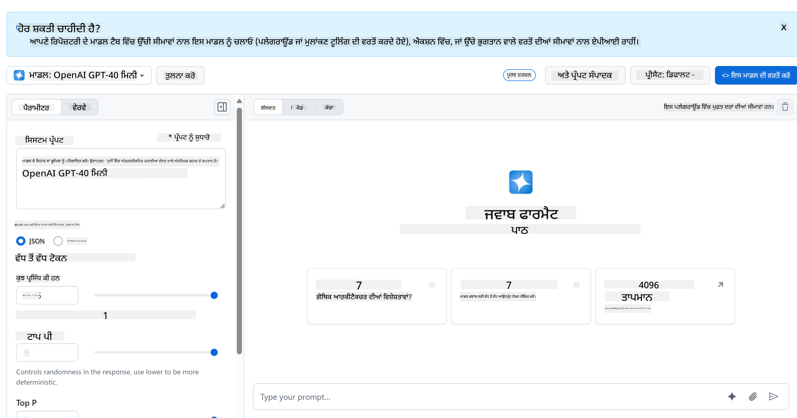

<!--
CO_OP_TRANSLATOR_METADATA:
{
  "original_hash": "51406271f80e4b452de0023147809658",
  "translation_date": "2025-10-20T21:58:55+00:00",
  "source_file": "9-chat-project/README.md",
  "language_code": "pa"
}
-->
# ਚੈਟ ਪ੍ਰੋਜੈਕਟ

ਇਹ ਚੈਟ ਪ੍ਰੋਜੈਕਟ ਦਿਖਾਉਂਦਾ ਹੈ ਕਿ GitHub ਮਾਡਲਾਂ ਦੀ ਵਰਤੋਂ ਕਰਕੇ ਚੈਟ ਅਸਿਸਟੈਂਟ ਕਿਵੇਂ ਬਣਾਇਆ ਜਾ ਸਕਦਾ ਹੈ।

ਇਹ ਹੈ ਕਿ ਤਿਆਰ ਪ੍ਰੋਜੈਕਟ ਕਿਵੇਂ ਦਿਖਾਈ ਦੇਵੇਗਾ:


ਕੁਝ ਸੰਦਰਭ, ਜਨਰੇਟਿਵ AI ਦੀ ਵਰਤੋਂ ਕਰਕੇ ਚੈਟ ਅਸਿਸਟੈਂਟ ਬਣਾਉਣਾ AI ਬਾਰੇ ਸਿੱਖਣ ਦੀ ਸ਼ੁਰੂਆਤ ਕਰਨ ਦਾ ਇੱਕ ਵਧੀਆ ਤਰੀਕਾ ਹੈ। ਇਸ ਪਾਠ ਦੌਰਾਨ ਤੁਸੀਂ ਸਿੱਖੋਗੇ ਕਿ ਜਨਰੇਟਿਵ AI ਨੂੰ ਵੈੱਬ ਐਪ ਵਿੱਚ ਕਿਵੇਂ ਜੋੜਨਾ ਹੈ, ਚਲੋ ਸ਼ੁਰੂ ਕਰੀਏ।

## ਜਨਰੇਟਿਵ AI ਨਾਲ ਕਨੈਕਟ ਕਰਨਾ

ਬੈਕਐਂਡ ਲਈ, ਅਸੀਂ GitHub ਮਾਡਲਾਂ ਦੀ ਵਰਤੋਂ ਕਰ ਰਹੇ ਹਾਂ। ਇਹ ਇੱਕ ਵਧੀਆ ਸੇਵਾ ਹੈ ਜੋ ਤੁਹਾਨੂੰ ਮੁਫ਼ਤ ਵਿੱਚ AI ਦੀ ਵਰਤੋਂ ਕਰਨ ਦੀ ਆਗਿਆ ਦਿੰਦੀ ਹੈ। ਇਸਦੇ ਪਲੇਗਰਾਊਂਡ ਤੇ ਜਾਓ ਅਤੇ ਉਹ ਕੋਡ ਲਵੋ ਜੋ ਤੁਹਾਡੇ ਚੁਣੇ ਹੋਏ ਬੈਕਐਂਡ ਭਾਸ਼ਾ ਨਾਲ ਸਬੰਧਿਤ ਹੈ। ਇਹ [GitHub Models Playground](https://github.com/marketplace/models/azure-openai/gpt-4o-mini/playground) 'ਤੇ ਇਸ ਤਰ੍ਹਾਂ ਦਿਖਾਈ ਦਿੰਦਾ ਹੈ।



ਜਿਵੇਂ ਅਸੀਂ ਕਿਹਾ, "Code" ਟੈਬ ਅਤੇ ਆਪਣੀ ਚੁਣੀ ਹੋਈ ਰਨਟਾਈਮ ਚੁਣੋ।


### ਪਾਇਥਨ ਦੀ ਵਰਤੋਂ ਕਰਨਾ

ਇਸ ਮਾਮਲੇ ਵਿੱਚ ਅਸੀਂ ਪਾਇਥਨ ਚੁਣਦੇ ਹਾਂ, ਜਿਸਦਾ ਮਤਲਬ ਹੈ ਕਿ ਅਸੀਂ ਇਹ ਕੋਡ ਚੁਣਦੇ ਹਾਂ:

```python
"""Run this model in Python

> pip install openai
"""
import os
from openai import OpenAI

# To authenticate with the model you will need to generate a personal access token (PAT) in your GitHub settings. 
# Create your PAT token by following instructions here: https://docs.github.com/en/authentication/keeping-your-account-and-data-secure/managing-your-personal-access-tokens
client = OpenAI(
    base_url="https://models.github.ai/inference",
    api_key=os.environ["GITHUB_TOKEN"],
)

response = client.chat.completions.create(
    messages=[
        {
            "role": "system",
            "content": "",
        },
        {
            "role": "user",
            "content": "What is the capital of France?",
        }
    ],
    model="openai/gpt-4o-mini",
    temperature=1,
    max_tokens=4096,
    top_p=1
)

print(response.choices[0].message.content)
```

ਆਓ ਇਸ ਕੋਡ ਨੂੰ ਕੁਝ ਸਾਫ ਕਰੀਏ ਤਾਂ ਜੋ ਇਹ ਦੁਬਾਰਾ ਵਰਤਣਯੋਗ ਹੋਵੇ:

```python
def call_llm(prompt: str, system_message: str):
    response = client.chat.completions.create(
        messages=[
            {
                "role": "system",
                "content": system_message,
            },
            {
                "role": "user",
                "content": prompt,
            }
        ],
        model="openai/gpt-4o-mini",
        temperature=1,
        max_tokens=4096,
        top_p=1
    )

    return response.choices[0].message.content
```

ਇਸ ਫੰਕਸ਼ਨ `call_llm` ਨਾਲ ਅਸੀਂ ਹੁਣ ਇੱਕ ਪ੍ਰੋਮਪਟ ਅਤੇ ਸਿਸਟਮ ਪ੍ਰੋਮਪਟ ਲੈ ਸਕਦੇ ਹਾਂ ਅਤੇ ਫੰਕਸ਼ਨ ਅੰਤ ਵਿੱਚ ਨਤੀਜਾ ਵਾਪਸ ਕਰਦਾ ਹੈ।

### AI ਅਸਿਸਟੈਂਟ ਨੂੰ ਕਸਟਮਾਈਜ਼ ਕਰੋ

ਜੇ ਤੁਸੀਂ AI ਅਸਿਸਟੈਂਟ ਨੂੰ ਕਸਟਮਾਈਜ਼ ਕਰਨਾ ਚਾਹੁੰਦੇ ਹੋ ਤਾਂ ਤੁਸੀਂ ਸਿਸਟਮ ਪ੍ਰੋਮਪਟ ਨੂੰ ਇਸ ਤਰ੍ਹਾਂ ਭਰ ਕੇ ਇਸਦੀ ਵਰਤਾਰਾ ਨੂੰ ਨਿਰਧਾਰਤ ਕਰ ਸਕਦੇ ਹੋ:

```python
call_llm("Tell me about you", "You're Albert Einstein, you only know of things in the time you were alive")
```

## ਇਸਨੂੰ ਵੈੱਬ API ਰਾਹੀਂ ਉਜਾਗਰ ਕਰੋ

ਵਧੀਆ, ਅਸੀਂ AI ਭਾਗ ਕਰ ਲਿਆ ਹੈ, ਆਓ ਵੇਖੀਏ ਕਿ ਅਸੀਂ ਇਸਨੂੰ ਵੈੱਬ API ਵਿੱਚ ਕਿਵੇਂ ਜੋੜ ਸਕਦੇ ਹਾਂ। ਵੈੱਬ API ਲਈ, ਅਸੀਂ Flask ਦੀ ਵਰਤੋਂ ਕਰ ਰਹੇ ਹਾਂ, ਪਰ ਕੋਈ ਵੀ ਵੈੱਬ ਫਰੇਮਵਰਕ ਚੰਗਾ ਹੋਣਾ ਚਾਹੀਦਾ ਹੈ। ਆਓ ਇਸਦਾ ਕੋਡ ਵੇਖੀਏ:

### ਪਾਇਥਨ ਦੀ ਵਰਤੋਂ ਕਰਨਾ

```python
# api.py
from flask import Flask, request, jsonify
from llm import call_llm
from flask_cors import CORS

app = Flask(__name__)
CORS(app)   # *   example.com

@app.route("/", methods=["GET"])
def index():
    return "Welcome to this API. Call POST /hello with 'message': 'my message' as JSON payload"


@app.route("/hello", methods=["POST"])
def hello():
    # get message from request body  { "message": "do this taks for me" }
    data = request.get_json()
    message = data.get("message", "")

    response = call_llm(message, "You are a helpful assistant.")
    return jsonify({
        "response": response
    })

if __name__ == "__main__":
    app.run(host="0.0.0.0", port=5000)
```

ਇਥੇ, ਅਸੀਂ ਇੱਕ ਫਲਾਸਕ API ਬਣਾਉਂਦੇ ਹਾਂ ਅਤੇ ਇੱਕ ਡਿਫਾਲਟ ਰੂਟ "/" ਅਤੇ "/chat" ਨੂੰ ਪਰਿਭਾਸ਼ਿਤ ਕਰਦੇ ਹਾਂ। ਦੂਜਾ ਰੂਟ ਸਾਡੇ ਫਰੰਟਐਂਡ ਦੁਆਰਾ ਇਸਨੂੰ ਸਵਾਲਾਂ ਪਾਸ ਕਰਨ ਲਈ ਵਰਤਿਆ ਜਾਣਾ ਹੈ।

*llm.py* ਨੂੰ ਜੋੜਨ ਲਈ ਇਹ ਹੈ ਜੋ ਅਸੀਂ ਕਰਨ ਦੀ ਲੋੜ ਹੈ:

- `call_llm` ਫੰਕਸ਼ਨ ਨੂੰ ਇੰਪੋਰਟ ਕਰੋ:

   ```python
   from llm import call_llm
   from flask import Flask, request
   ```

- ਇਸਨੂੰ "/chat" ਰੂਟ ਤੋਂ ਕਾਲ ਕਰੋ:

   ```python
   @app.route("/hello", methods=["POST"])
   def hello():
      # get message from request body  { "message": "do this taks for me" }
      data = request.get_json()
      message = data.get("message", "")

      response = call_llm(message, "You are a helpful assistant.")
      return jsonify({
         "response": response
      })
   ```

   ਇਥੇ ਅਸੀਂ ਆਉਣ ਵਾਲੀ ਬੇਨਤੀ ਨੂੰ ਪਾਰਸ ਕਰਦੇ ਹਾਂ ਤਾਂ ਜੋ JSON ਬਾਡੀ ਤੋਂ `message` ਪ੍ਰਾਪਰਟੀ ਪ੍ਰਾਪਤ ਕੀਤੀ ਜਾ ਸਕੇ। ਇਸ ਤੋਂ ਬਾਅਦ ਅਸੀਂ LLM ਨੂੰ ਇਸ ਕਾਲ ਨਾਲ ਕਾਲ ਕਰਦੇ ਹਾਂ:

   ```python
   response = call_llm(message, "You are a helpful assistant")

   # return the response as JSON
   return jsonify({
      "response": response 
   })
   ```

ਵਧੀਆ, ਹੁਣ ਅਸੀਂ ਜੋ ਲੋੜ ਸੀ ਉਹ ਕਰ ਲਿਆ ਹੈ।

## Cors ਕਨਫਿਗਰ ਕਰੋ

ਅਸੀਂ ਇਹ ਕਹਿਣਾ ਚਾਹੁੰਦੇ ਹਾਂ ਕਿ ਅਸੀਂ ਕੁਝ Cors ਸੈਟਅਪ ਕੀਤਾ ਹੈ, ਜੋ ਕਿ ਕ੍ਰਾਸ-ਓਰਿਜਨ ਰਿਸੋਰਸ ਸ਼ੇਅਰਿੰਗ ਹੈ। ਇਸਦਾ ਮਤਲਬ ਹੈ ਕਿ ਕਿਉਂਕਿ ਸਾਡਾ ਬੈਕਐਂਡ ਅਤੇ ਫਰੰਟਐਂਡ ਵੱਖ-ਵੱਖ ਪੋਰਟਾਂ 'ਤੇ ਚੱਲੇਗਾ, ਸਾਨੂੰ ਫਰੰਟਐਂਡ ਨੂੰ ਬੈਕਐਂਡ ਵਿੱਚ ਕਾਲ ਕਰਨ ਦੀ ਆਗਿਆ ਦੇਣੀ ਪਵੇਗੀ।

### ਪਾਇਥਨ ਦੀ ਵਰਤੋਂ ਕਰਨਾ

*api.py* ਵਿੱਚ ਇੱਕ ਕੋਡ ਦਾ ਟੁਕੜਾ ਹੈ ਜੋ ਇਸਨੂੰ ਸੈਟਅਪ ਕਰਦਾ ਹੈ:

```python
from flask_cors import CORS

app = Flask(__name__)
CORS(app)   # *   example.com
```

ਇਸ ਸਮੇਂ ਇਹ "*" ਨੂੰ ਆਗਿਆ ਦੇਣ ਲਈ ਸੈਟਅਪ ਕੀਤਾ ਗਿਆ ਹੈ ਜੋ ਕਿ ਸਾਰੇ ਓਰਿਜਿਨ ਹਨ ਅਤੇ ਇਹ ਕੁਝ ਅਸੁਰੱਖਿਅਤ ਹੈ, ਅਸੀਂ ਇਸਨੂੰ ਪ੍ਰੋਡਕਸ਼ਨ ਵਿੱਚ ਜਾਣ ਤੋਂ ਬਾਅਦ ਸੀਮਿਤ ਕਰਨਾ ਚਾਹੀਦਾ ਹੈ।

## ਆਪਣਾ ਪ੍ਰੋਜੈਕਟ ਚਲਾਓ

ਆਪਣੇ ਪ੍ਰੋਜੈਕਟ ਨੂੰ ਚਲਾਉਣ ਲਈ, ਤੁਹਾਨੂੰ ਪਹਿਲਾਂ ਆਪਣਾ ਬੈਕਐਂਡ ਅਤੇ ਫਿਰ ਆਪਣਾ ਫਰੰਟਐਂਡ ਸ਼ੁਰੂ ਕਰਨ ਦੀ ਲੋੜ ਹੈ।

### ਪਾਇਥਨ ਦੀ ਵਰਤੋਂ ਕਰਨਾ

ਠੀਕ ਹੈ, ਤਾਂ ਅਸੀਂ *llm.py* ਅਤੇ *api.py* ਹੈ, ਅਸੀਂ ਇਸਨੂੰ ਬੈਕਐਂਡ ਨਾਲ ਕਿਵੇਂ ਕੰਮ ਕਰ ਸਕਦੇ ਹਾਂ? ਖੈਰ, ਦੋ ਚੀਜ਼ਾਂ ਹਨ ਜੋ ਅਸੀਂ ਕਰਨ ਦੀ ਲੋੜ ਹੈ:

- Dependencies ਇੰਸਟਾਲ ਕਰੋ:

   ```sh
   cd backend
   python -m venv venv
   source ./venv/bin/activate

   pip install openai flask flask-cors openai
   ```

- API ਸ਼ੁਰੂ ਕਰੋ

   ```sh
   python api.py
   ```

   ਜੇ ਤੁਸੀਂ Codespaces ਵਿੱਚ ਹੋ ਤਾਂ ਤੁਹਾਨੂੰ ਐਡੀਟਰ ਦੇ ਹੇਠਲੇ ਹਿੱਸੇ ਵਿੱਚ ਪੋਰਟਸ 'ਤੇ ਜਾਣ ਦੀ ਲੋੜ ਹੈ, ਇਸ 'ਤੇ ਰਾਈਟ-ਕਲਿਕ ਕਰੋ ਅਤੇ "Port Visibility" 'ਤੇ ਕਲਿਕ ਕਰੋ ਅਤੇ "Public" ਚੁਣੋ।

### ਫਰੰਟਐਂਡ 'ਤੇ ਕੰਮ ਕਰੋ

ਹੁਣ ਕਿ ਸਾਡੇ ਕੋਲ API ਚੱਲ ਰਹੀ ਹੈ, ਆਓ ਇਸ ਲਈ ਇੱਕ ਫਰੰਟਐਂਡ ਬਣਾਈਏ। ਇੱਕ ਬੇਸਿਕ ਫਰੰਟਐਂਡ ਜੋ ਅਸੀਂ ਕਦਮ-ਦਰ-ਕਦਮ ਸੁਧਾਰਾਂਗੇ। *frontend* ਫੋਲਡਰ ਵਿੱਚ, ਹੇਠਾਂ ਦਿੱਤੇ ਅਨੁਸਾਰ ਬਣਾਓ:

```text
backend/
frontend/
index.html
app.js
styles.css
```

ਆਓ **index.html** ਨਾਲ ਸ਼ੁਰੂ ਕਰੀਏ:

```html
<html>
    <head>
        <link rel="stylesheet" href="styles.css">
    </head>
    <body>
      <form>
        <textarea id="messages"></textarea>
        <input id="input" type="text" />
        <button type="submit" id="sendBtn">Send</button>  
      </form>  
      <script src="app.js" />
    </body>
</html>    
```

ਉਪਰੋਕਤ ਚੈਟ ਵਿੰਡੋ ਨੂੰ ਸਹਾਇਕ ਕਰਨ ਲਈ ਬਿਲਕੁਲ ਘੱਟੋ-ਘੱਟ ਹੈ, ਕਿਉਂਕਿ ਇਸ ਵਿੱਚ ਇੱਕ ਟੈਕਸਟਏਰੀਆ ਸ਼ਾਮਲ ਹੈ ਜਿੱਥੇ ਸੁਨੇਹੇ ਰੇਂਡਰ ਕੀਤੇ ਜਾਣਗੇ, ਇੱਕ ਇਨਪੁਟ ਜਿੱਥੇ ਸੁਨੇਹਾ ਟਾਈਪ ਕੀਤਾ ਜਾਵੇਗਾ ਅਤੇ ਇੱਕ ਬਟਨ ਜੋ ਤੁਹਾਡੇ ਸੁਨੇਹੇ ਨੂੰ ਬੈਕਐਂਡ ਵਿੱਚ ਭੇਜਣ ਲਈ ਹੈ। ਆਓ *app.js* ਵਿੱਚ ਅਗਲੇ ਜਾਵਾਸਕ੍ਰਿਪਟ ਨੂੰ ਵੇਖੀਏ।

**app.js**

```js
// app.js

(function(){
  // 1. set up elements  
  const messages = document.getElementById("messages");
  const form = document.getElementById("form");
  const input = document.getElementById("input");

  const BASE_URL = "change this";
  const API_ENDPOINT = `${BASE_URL}/hello`;

  // 2. create a function that talks to our backend
  async function callApi(text) {
    const response = await fetch(API_ENDPOINT, {
      method: "POST",
      headers: { "Content-Type": "application/json" },
      body: JSON.stringify({ message: text })
    });
    let json = await response.json();
    return json.response;
  }

  // 3. add response to our textarea
  function appendMessage(text, role) {
    const el = document.createElement("div");
    el.className = `message ${role}`;
    el.innerHTML = text;
    messages.appendChild(el);
  }

  // 4. listen to submit events
  form.addEventListener("submit", async(e) => {
    e.preventDefault();
   // someone clicked the button in the form
   
   // get input
   const text = input.value.trim();

   appendMessage(text, "user")

   // reset it
   input.value = '';

   const reply = await callApi(text);

   // add to messages
   appendMessage(reply, "assistant");

  })
})();
```

ਆਓ ਕੋਡ ਨੂੰ ਹਰੇਕ ਸੈਕਸ਼ਨ ਦੇ ਅਨੁਸਾਰ ਵੇਖੀਏ:

- 1) ਇਥੇ ਅਸੀਂ ਆਪਣੇ ਸਾਰੇ ਐਲੀਮੈਂਟਸ ਲਈ ਇੱਕ ਰਿਫਰੈਂਸ ਲੈਂਦੇ ਹਾਂ ਜਿਸਦਾ ਅਸੀਂ ਕੋਡ ਵਿੱਚ ਬਾਅਦ ਵਿੱਚ ਹਵਾਲਾ ਦੇਵਾਂਗੇ।
- 2) ਇਸ ਸੈਕਸ਼ਨ ਵਿੱਚ, ਅਸੀਂ ਇੱਕ ਫੰਕਸ਼ਨ ਬਣਾਉਂਦੇ ਹਾਂ ਜੋ ਬਿਲਟ-ਇਨ `fetch` ਮੈਥਡ ਦੀ ਵਰਤੋਂ ਕਰਦਾ ਹੈ ਜੋ ਸਾਡੇ ਬੈਕਐਂਡ ਨੂੰ ਕਾਲ ਕਰਦਾ ਹੈ।
- 3) `appendMessage` ਸਹਾਇਕ ਅਤੇ ਤੁਹਾਡੇ ਵਜੋਂ ਜੋ ਤੁਸੀਂ ਟਾਈਪ ਕਰਦੇ ਹੋ ਉਸਨੂੰ ਜੋੜਨ ਵਿੱਚ ਮਦਦ ਕਰਦਾ ਹੈ।
- 4) ਇਥੇ ਅਸੀਂ submit ਇਵੈਂਟ ਨੂੰ ਸੁਣਦੇ ਹਾਂ ਅਤੇ ਅਸੀਂ ਇਨਪੁਟ ਫੀਲਡ ਨੂੰ ਪੜ੍ਹਦੇ ਹਾਂ, ਯੂਜ਼ਰ ਦਾ ਸੁਨੇਹਾ ਟੈਕਸਟਏਰੀਆ ਵਿੱਚ ਰੱਖਦੇ ਹਾਂ, API ਨੂੰ ਕਾਲ ਕਰਦੇ ਹਾਂ, ਉਸ ਜਵਾਬ ਨੂੰ ਟੈਕਸਟਏਰੀਆ ਵਿੱਚ ਰੇਂਡਰ ਕਰਦੇ ਹਾਂ।

ਆਓ ਅਗਲੇ ਸਟਾਈਲਿੰਗ ਨੂੰ ਵੇਖੀਏ, ਇਥੇ ਤੁਸੀਂ ਵਾਕਈ ਕ੍ਰੇਜ਼ੀ ਹੋ ਸਕਦੇ ਹੋ ਅਤੇ ਇਸਨੂੰ ਆਪਣੀ ਪਸੰਦ ਦੇ ਅਨੁਸਾਰ ਬਣਾਉਣ ਲਈ, ਪਰ ਇਥੇ ਕੁਝ ਸੁਝਾਅ ਹਨ:

**styles.css**

```
.message {
    background: #222;
    box-shadow: 0 0 0 10px orange;
    padding: 10px:
    margin: 5px;
}

.message.user {
    background: blue;
}

.message.assistant {
    background: grey;
} 
```

ਇਹਨਾਂ ਤਿੰਨ ਕਲਾਸਾਂ ਨਾਲ, ਤੁਸੀਂ ਸੁਨੇਹਿਆਂ ਨੂੰ ਵੱਖ-ਵੱਖ ਸਟਾਈਲ ਕਰ ਸਕਦੇ ਹੋ ਇਸ ਗੱਲ 'ਤੇ ਨਿਰਭਰ ਕਰਦੇ ਹੋਏ ਕਿ ਉਹ ਕਿੱਥੋਂ ਆਉਂਦੇ ਹਨ - ਸਹਾਇਕ ਤੋਂ ਜਾਂ ਤੁਹਾਡੇ ਵਜੋਂ। ਜੇ ਤੁਸੀਂ ਪ੍ਰੇਰਿਤ ਹੋਣਾ ਚਾਹੁੰਦੇ ਹੋ, ਤਾਂ `solution/frontend/styles.css` ਫੋਲਡਰ ਨੂੰ ਚੈੱਕ ਕਰੋ।

### ਬੇਸ URL ਬਦਲੋ

ਇਥੇ ਇੱਕ ਚੀਜ਼ ਸੀ ਜੋ ਅਸੀਂ ਸੈਟ ਨਹੀਂ ਕੀਤੀ ਸੀ ਅਤੇ ਉਹ ਸੀ `BASE_URL`, ਇਹ ਤਦ ਤੱਕ ਪਤਾ ਨਹੀਂ ਹੁੰਦਾ ਜਦ ਤੱਕ ਤੁਹਾਡਾ ਬੈਕਐਂਡ ਸ਼ੁਰੂ ਨਹੀਂ ਹੁੰਦਾ। ਇਸਨੂੰ ਸੈਟ ਕਰਨ ਲਈ:

- ਜੇ ਤੁਸੀਂ API ਨੂੰ ਲੋਕਲ ਚਲਾਉਂਦੇ ਹੋ, ਤਾਂ ਇਹ ਕੁਝ ਇਸ ਤਰ੍ਹਾਂ ਹੋਣਾ ਚਾਹੀਦਾ ਹੈ `http://localhost:5000`.
- ਜੇ Codespaces ਵਿੱਚ ਚਲਾਇਆ ਜਾਵੇ, ਤਾਂ ਇਹ ਕੁਝ ਇਸ ਤਰ੍ਹਾਂ ਦਿਖਾਈ ਦੇਵੇਗਾ "[name]app.github.dev".

## GitHub Copilot Agent Challenge 🚀

Agent ਮੋਡ ਦੀ ਵਰਤੋਂ ਕਰਕੇ ਹੇਠਾਂ ਦਿੱਤੇ ਚੈਲੈਂਜ ਨੂੰ ਪੂਰਾ ਕਰੋ:

**ਵੇਰਵਾ:** ਚੈਟ ਅਸਿਸਟੈਂਟ ਨੂੰ ਵਧਾ ਕੇ ਗੱਲਬਾਤ ਦਾ ਇਤਿਹਾਸ ਅਤੇ ਸੁਨੇਹਾ ਸਥਿਰਤਾ ਸ਼ਾਮਲ ਕਰੋ। ਇਹ ਚੈਲੈਂਜ ਤੁਹਾਨੂੰ ਚੈਟ ਐਪਲੀਕੇਸ਼ਨਾਂ ਵਿੱਚ ਸਟੇਟ ਨੂੰ ਮੈਨੇਜ ਕਰਨ ਅਤੇ ਬਿਹਤਰ ਯੂਜ਼ਰ ਅਨੁਭਵ ਲਈ ਡਾਟਾ ਸਟੋਰੇਜ ਨੂੰ ਲਾਗੂ ਕਰਨ ਦਾ ਮੌਕਾ ਦੇਵੇਗਾ।

**ਪ੍ਰੋਮਪਟ:** ਚੈਟ ਐਪਲੀਕੇਸ਼ਨ ਨੂੰ ਸੋਧੋ ਤਾਂ ਜੋ ਗੱਲਬਾਤ ਦਾ ਇਤਿਹਾਸ ਸ਼ਾਮਲ ਕੀਤਾ ਜਾ ਸਕੇ ਜੋ ਸੈਸ਼ਨ ਦੇ ਵਿਚਕਾਰ ਸਥਿਰ ਰਹੇ। ਚੈਟ ਸੁਨੇਹਿਆਂ ਨੂੰ ਲੋਕਲ ਸਟੋਰੇਜ ਵਿੱਚ ਸੇਵ ਕਰਨ ਦੀ ਕਾਰਗੁਜ਼ਾਰੀ ਸ਼ਾਮਲ ਕਰੋ, ਪੇਜ ਲੋਡ ਹੋਣ 'ਤੇ ਗੱਲਬਾਤ ਦਾ ਇਤਿਹਾਸ ਦਿਖਾਓ, ਅਤੇ "Clear History" ਬਟਨ ਸ਼ਾਮਲ ਕਰੋ। ਚੈਟ ਅਨੁਭਵ ਨੂੰ ਹੋਰ ਹਕੀਕਤੀ ਬਣਾਉਣ ਲਈ ਟਾਈਪਿੰਗ ਇੰਡੀਕੇਟਰ ਅਤੇ ਸੁਨੇਹਾ ਟਾਈਮਸਟੈਂਪਸ ਨੂੰ ਵੀ ਲਾਗੂ ਕਰੋ।

## ਅਸਾਈਨਮੈਂਟ

ਆਪਣਾ ਫੋਲਡਰ *project* ਬਣਾਓ ਜਿਸ ਵਿੱਚ ਹੇਠਾਂ ਦਿੱਤੇ ਅਨੁਸਾਰ ਸਮੱਗਰੀ ਹੋਵੇ:

```text
project/
  frontend/
    index.html
    app.js
    styles.css
  backend/
    ...
```

ਉਪਰ ਦਿੱਤੇ ਨਿਰਦੇਸ਼ਾਂ ਤੋਂ ਸਮੱਗਰੀ ਕਾਪੀ ਕਰੋ ਪਰ ਆਪਣੀ ਪਸੰਦ ਅਨੁਸਾਰ ਕਸਟਮਾਈਜ਼ ਕਰਨ ਲਈ ਸੁਤੰਤਰ ਹੋਵੋ।

## ਹੱਲ

[Solution](./solution/README.md)

## ਬੋਨਸ

AI ਅਸਿਸਟੈਂਟ ਦੀ ਪਸੰਦ ਨੂੰ ਬਦਲਣ ਦੀ ਕੋਸ਼ਿਸ਼ ਕਰੋ।

### ਪਾਇਥਨ ਲਈ

ਜਦੋਂ ਤੁਸੀਂ *api.py* ਵਿੱਚ `call_llm` ਨੂੰ ਕਾਲ ਕਰਦੇ ਹੋ ਤਾਂ ਤੁਸੀਂ ਦੂਜੇ ਪੈਰਾਮੀਟਰ ਨੂੰ ਆਪਣੀ ਪਸੰਦ ਅਨੁਸਾਰ ਬਦਲ ਸਕਦੇ ਹੋ, ਉਦਾਹਰਣ ਲਈ:

```python
call_llm(message, "You are Captain Picard")
```

### ਫਰੰਟਐਂਡ

CSS ਅਤੇ ਟੈਕਸਟ ਨੂੰ ਆਪਣੀ ਪਸੰਦ ਅਨੁਸਾਰ ਬਦਲੋ, ਇਸ ਲਈ *index.html* ਅਤੇ *styles.css* ਵਿੱਚ ਬਦਲਾਅ ਕਰੋ।

## ਸਾਰ

ਵਧੀਆ, ਤੁਸੀਂ ਸ਼ੁਰੂ ਤੋਂ ਸਿੱਖਿਆ ਕਿ AI ਦੀ ਵਰਤੋਂ ਕਰਕੇ ਇੱਕ ਪੈਰਸਨਲ ਅਸਿਸਟੈਂਟ ਕਿਵੇਂ ਬਣਾਇਆ ਜਾਵੇ। ਅਸੀਂ ਇਹ GitHub ਮਾਡਲਾਂ ਦੀ ਵਰਤੋਂ ਕਰਕੇ, ਪਾਇਥਨ ਵਿੱਚ ਬੈਕਐਂਡ ਅਤੇ HTML, CSS ਅਤੇ ਜਾਵਾਸਕ੍ਰਿਪਟ ਵਿੱਚ ਫਰੰਟਐਂਡ ਦੀ ਵਰਤੋਂ ਕਰਕੇ ਕੀਤਾ।

## Codespaces ਨਾਲ ਸੈਟਅਪ ਕਰੋ

- ਜਾਓ: [Web Dev For Beginners repo](https://github.com/microsoft/Web-Dev-For-Beginners)
- ਇੱਕ ਟੈਂਪਲੇਟ ਤੋਂ ਬਣਾਓ (ਯਕੀਨੀ ਬਣਾਓ ਕਿ ਤੁਸੀਂ GitHub ਵਿੱਚ ਲੌਗਇਨ ਹੋ):

    

- ਜਦੋਂ ਤੁਸੀਂ ਆਪਣੇ ਰਿਪੋ ਵਿੱਚ ਹੋ, ਤਾਂ ਇੱਕ Codespace ਬਣਾਓ:

    

    ਇਹ ਇੱਕ ਵਾਤਾਵਰਣ ਸ਼ੁਰੂ ਕਰਨਾ ਚਾਹੀਦਾ ਹੈ ਜਿਸ ਨਾਲ ਤੁਸੀਂ ਹੁਣ ਕੰਮ ਕਰ ਸਕਦੇ ਹੋ।

---

**ਅਸਵੀਕਰਤਾ**:  
ਇਹ ਦਸਤਾਵੇਜ਼ AI ਅਨੁਵਾਦ ਸੇਵਾ [Co-op Translator](https://github.com/Azure/co-op-translator) ਦੀ ਵਰਤੋਂ ਕਰਕੇ ਅਨੁਵਾਦ ਕੀਤਾ ਗਿਆ ਹੈ। ਜਦੋਂ ਕਿ ਅਸੀਂ ਸਹੀ ਹੋਣ ਦੀ ਕੋਸ਼ਿਸ਼ ਕਰਦੇ ਹਾਂ, ਕਿਰਪਾ ਕਰਕੇ ਧਿਆਨ ਦਿਓ ਕਿ ਸਵੈਚਾਲਿਤ ਅਨੁਵਾਦਾਂ ਵਿੱਚ ਗਲਤੀਆਂ ਜਾਂ ਅਸੁੱਤੀਆਂ ਹੋ ਸਕਦੀਆਂ ਹਨ। ਮੂਲ ਦਸਤਾਵੇਜ਼ ਨੂੰ ਇਸਦੀ ਮੂਲ ਭਾਸ਼ਾ ਵਿੱਚ ਅਧਿਕਾਰਤ ਸਰੋਤ ਮੰਨਿਆ ਜਾਣਾ ਚਾਹੀਦਾ ਹੈ। ਮਹੱਤਵਪੂਰਨ ਜਾਣਕਾਰੀ ਲਈ, ਪੇਸ਼ੇਵਰ ਮਨੁੱਖੀ ਅਨੁਵਾਦ ਦੀ ਸਿਫਾਰਸ਼ ਕੀਤੀ ਜਾਂਦੀ ਹੈ। ਇਸ ਅਨੁਵਾਦ ਦੀ ਵਰਤੋਂ ਤੋਂ ਪੈਦਾ ਹੋਣ ਵਾਲੇ ਕਿਸੇ ਵੀ ਗਲਤਫਹਿਮੀ ਜਾਂ ਗਲਤ ਵਿਆਖਿਆ ਲਈ ਅਸੀਂ ਜ਼ਿੰਮੇਵਾਰ ਨਹੀਂ ਹਾਂ।