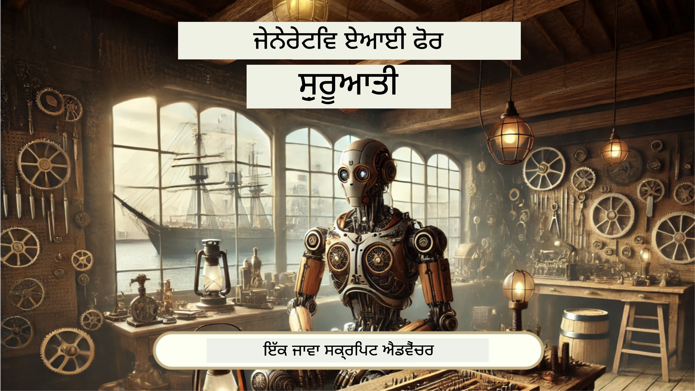
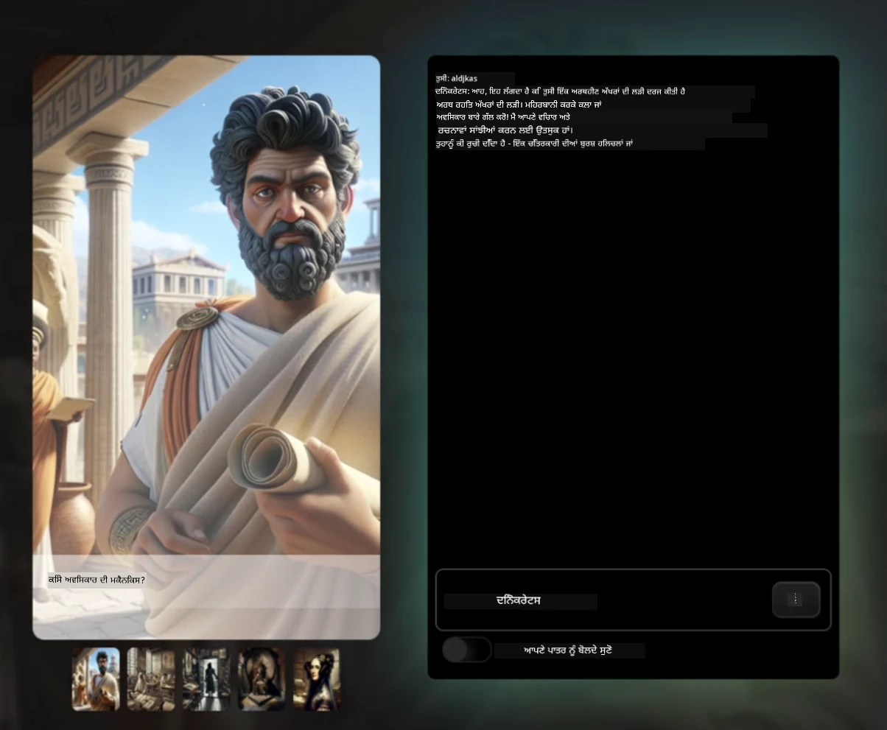
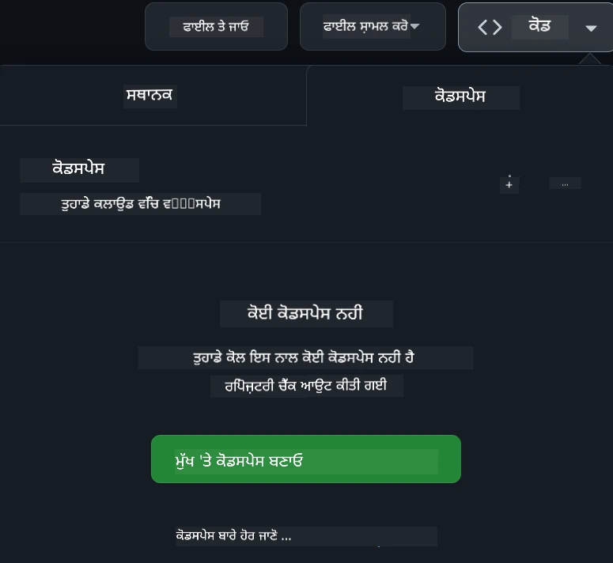

[](https://github.com/microsoft/Web-Dev-For-Beginners/blob/master/LICENSE)
[](https://GitHub.com/microsoft/Web-Dev-For-Beginners/graphs/contributors/)
[](https://GitHub.com/microsoft/Web-Dev-For-Beginners/issues/)
[](https://GitHub.com/microsoft/Web-Dev-For-Beginners/pulls/)
[](http://makeapullrequest.com) 

[](https://GitHub.com/microsoft/Web-Dev-For-Beginners/watchers/)
[](https://GitHub.com/microsoft/Web-Dev-For-Beginners/network/)
[](https://GitHub.com/microsoft/Web-Dev-For-Beginners/stargazers/)

[](https://discord.gg/nTYy5BXMWG)

# ਬਿਗਿਨਰਜ਼ ਲਈ ਵੈੱਬ ਵਿਕਾਸ - ਇੱਕ ਕਰਿਕੁਲਮ

Microsoft Cloud Advocates ਵਲੋਂ ਸਾਡਾ 12 ਹਫ਼ਤੇ ਦਾ ਵਿਸ਼ਤ੍ਰਿਤ ਕੋਰਸ ਨਾਲ ਵੈੱਬ ਡਿਵੈਲਪਮੈਂਟ ਦੇ ਮੂਲ ਤੱਤ ਸਿੱਖੋ। 24 ਪਾਠਾਂ ਵਿੱਚੋਂ ਹਰ ਇੱਕ ਜਾਵਾਸਕ੍ਰਿਪਟ, CSS, ਅਤੇ HTML ਨੂੰ ਹੱਥ-ਵਾਲੇ ਪ੍ਰੋਜੈਕਟਸ ਜਿਵੇਂ ਕਿ ਟੈਰੇਰੀਅਮ, ਬ੍ਰਾਊਜ਼ਰ ਐਕਸਟੈਂਸ਼ਨ, ਅਤੇ ਸਪੇਸ ਗੇਮਜ਼ ਦੇ ਜ਼ਰੀਏ ਗਹਿਰਾਈ ਨਾਲ ਸਮਝਾਉਂਦਾ ਹੈ। ਕਵਿਜ਼, ਚਰਚਾ ਅਤੇ ਕਾਰਗਰ ਅਸਾਈਨਮੈਂਟਸ ਨਾਲ ਗਤੀਸ਼ੀਲ ਰੁਜ਼ਗਾਰ ਕਰੋ। ਆਪਣੀਆਂ ਹੁਨਰਾਂ ਵਿੱਚ ਸੁਧਾਰ ਕਰੋ ਅਤੇ ਸਾਡੀ ਪ੍ਰਭਾਵਸ਼ালী ਪ੍ਰੋਜੈਕਟ-ਆਧਾਰਿਤ ਪੈਡਾਗੋਜੀ ਨਾਲ ਆਪਣੀ ਜਾਣਕਾਰੀ ਦਾ ਰੀਟੇਂਸ਼ਨ ਵਧਾਓ। ਆਪਣਾ ਕੋਡਿੰਗ ਜ਼ਿੰਦਗੀ ਅੱਜ ਤੋਂ ਸ਼ੁਰੂ ਕਰੋ!

Azure AI Foundry Discord ਕਮਿਊਨਿਟੀ ਵਿੱਚ ਸ਼ਾਮਲ ਹੋਵੋ

[](https://discord.gg/nTYy5BXMWG)

ਇਹ ਸ੍ਰੋਤ ਵਰਤਣ ਲਈ ਇਹ ਕਦਮ ਫੋਲੋ ਕਰੋ:
1. **ਰੀਪੋਜ਼ਟਰੀ ਫੋਰਕ ਕਰੋ**:  ਕਲਿੱਕ ਕਰੋ [](https://GitHub.com/microsoft/Web-Dev-For-Beginners/fork)
2. **ਰੀਪੋਜ਼ਟਰੀ ਕਲੋਨ ਕਰੋ**:   `git clone https://github.com/microsoft/Web-Dev-For-Beginners.git`
3. [**Azure AI Foundry Discord ਵਿੱਚ ਸ਼ਾਮਲ ਹੋਵੋ ਅਤੇ ਮਾਹਿਰਾਂ ਅਤੇ ਹੋਰ ਡਿਵੈਲਪਰਾਂ ਨਾਲ ਮਿਲੋ**](https://discord.com/invite/ByRwuEEgH4)

### 🌐 ਬਹੁਭਾਸ਼ੀ ਸਹਾਇਤਾ

#### GitHub Action ਰਾਹੀਂ ਸਮਰਥਿਤ (ਆਟੋਮੈਟਿਕ ਅਤੇ ਹਮੇਸ਼ਾਂ ਅਪ-ਟੂ-ਡੇਟ)

<!-- CO-OP TRANSLATOR LANGUAGES TABLE START -->
[Arabic](../ar/README.md) | [Bengali](../bn/README.md) | [Bulgarian](../bg/README.md) | [Burmese (Myanmar)](../my/README.md) | [Chinese (Simplified)](../zh-CN/README.md) | [Chinese (Traditional, Hong Kong)](../zh-HK/README.md) | [Chinese (Traditional, Macau)](../zh-MO/README.md) | [Chinese (Traditional, Taiwan)](../zh-TW/README.md) | [Croatian](../hr/README.md) | [Czech](../cs/README.md) | [Danish](../da/README.md) | [Dutch](../nl/README.md) | [Estonian](../et/README.md) | [Finnish](../fi/README.md) | [French](../fr/README.md) | [German](../de/README.md) | [Greek](../el/README.md) | [Hebrew](../he/README.md) | [Hindi](../hi/README.md) | [Hungarian](../hu/README.md) | [Indonesian](../id/README.md) | [Italian](../it/README.md) | [Japanese](../ja/README.md) | [Kannada](../kn/README.md) | [Korean](../ko/README.md) | [Lithuanian](../lt/README.md) | [Malay](../ms/README.md) | [Malayalam](../ml/README.md) | [Marathi](../mr/README.md) | [Nepali](../ne/README.md) | [Nigerian Pidgin](../pcm/README.md) | [Norwegian](../no/README.md) | [Persian (Farsi)](../fa/README.md) | [Polish](../pl/README.md) | [Portuguese (Brazil)](../pt-BR/README.md) | [Portuguese (Portugal)](../pt-PT/README.md) | [Punjabi (Gurmukhi)](./README.md) | [Romanian](../ro/README.md) | [Russian](../ru/README.md) | [Serbian (Cyrillic)](../sr/README.md) | [Slovak](../sk/README.md) | [Slovenian](../sl/README.md) | [Spanish](../es/README.md) | [Swahili](../sw/README.md) | [Swedish](../sv/README.md) | [Tagalog (Filipino)](../tl/README.md) | [Tamil](../ta/README.md) | [Telugu](../te/README.md) | [Thai](../th/README.md) | [Turkish](../tr/README.md) | [Ukrainian](../uk/README.md) | [Urdu](../ur/README.md) | [Vietnamese](../vi/README.md)

> **ਕੀ ਤੁਸੀਂ ਲੋਕਲ ਤੌਰ 'ਤੇ ਕਲੋਨ ਕਰਨਾ ਪਸੰਦ ਕਰਦੇ ਹੋ?**

> ਇਸ ਰੀਪੋਜ਼ਟਰੀ ਵਿੱਚ 50+ ਭਾਸ਼ਾਈ ਅਨੁਵਾਦ ਸ਼ਾਮਿਲ ਹਨ ਜੋ ਡਾਊਨਲੋਡ ਆਕਾਰ ਨੂੰ ਕਾਫੀ ਵਧਾ ਦਿੰਦੇ ਹਨ। ਬਿਨਾ ਅਨੁਵਾਦ ਦੇ ਕਲੋਨ ਕਰਨ ਲਈ, sparse checkout ਵਰਤੋਂ ਕਰੋ:
> ```bash
> git clone --filter=blob:none --sparse https://github.com/microsoft/Web-Dev-For-Beginners.git
> cd Web-Dev-For-Beginners
> git sparse-checkout set --no-cone '/*' '!translations' '!translated_images'
> ```
> ਇਹ ਤੁਹਾਨੂੰ ਉਹ ਸਾਰਾ ਕੁਝ ਦਿੰਦਾ ਹੈ ਜੋ ਤੁਹਾਨੂੰ ਕੋਰਸ ਪੂਰਾ ਕਰਨ ਲਈ ਚਾਹੀਦਾ ਹੈ, ਬਹੁਤ ਤੇਜ਼ ਡਾਊਨਲੋਡ ਦੇ ਨਾਲ।
<!-- CO-OP TRANSLATOR LANGUAGES TABLE END -->

**ਜੇ ਤੁਸੀਂ ਹੋਰ ਅਨੁਵਾਦ ਭਾਸ਼ਾਵਾਂ ਚਾਹੁੰਦੇ ਹੋ ਜੋ ਸਮਰਥਿਤ ਹਨ ਉਹ [ਇੱਥੇ](https://github.com/Azure/co-op-translator/blob/main/getting_started/supported-languages.md) ਦਿੱਖਾਈ ਗਈਆਂ ਹਨ**

[](https://open.vscode.dev/microsoft/Web-Dev-For-Beginners)

#### 🧑‍🎓 _ਕੀ ਤੁਸੀਂ ਵਿਦਿਆਰਥੀ ਹੋ?_

[**Student Hub ਪੇਜ਼**](https://docs.microsoft.com/learn/student-hub/?WT.mc_id=academic-77807-sagibbon) 'ਤੇ ਜਾਓ ਜਿੱਥੇ ਤੁਸੀਂ ਬਿਗਿਨਰ ਸੰਸਾਧਨ, ਵਿਦਿਆਰਥੀ ਪੈਕ ਅਤੇ ਇੱਥੇ ਤੱਕ ਕਿ ਮੁਫ਼ਤ ਸਰਟੀਫਿਕੇਟ ਵੌਉਚਰ ਪ੍ਰਾਪਤ ਕਰਨ ਦੇ ਤਰੀਕੇ ਲੱਭੋਗੇ। ਇਹ ਉਹ ਪੇਜ਼ ਹੈ ਜਿਸਨੂੰ ਤੁਹਾਨੂੰ ਬੁੱਕਮਾਰਕ ਕਰਨਾ ਚਾਹੀਦਾ ਹੈ ਅਤੇ ਸਮੇਂ-ਸਮੇਂ 'ਤੇ ਵੇਖਦੇ ਰਹਿਣਾ ਚਾਹੀਦਾ ਹੈ ਕਿਉਂਕਿ ਅਸੀਂ ਹਰ ਮਹੀਨੇ ਸਮੱਗਰੀ ਬਦਲਦੇ ਹਾਂ।

### 📣 ਐਲਾਨ - ਨਵੇਂ GitHub Copilot Agent ਮੋਡ ਚੈਲੰਜ ਪੂਰੇ ਕਰੋ!

ਨਵਾਂ ਚੈਲੰਜ ਸ਼ਾਮਿਲ ਕੀਤਾ ਗਿਆ ਹੈ, ਜ਼ਿਆਦਾਤਰ ਅਧਿਆਇਆਂ ਵਿੱਚ "GitHub Copilot Agent Challenge 🚀" ਲੱਭੋ। ਇਹ ਤੁਹਾਡੇ ਲਈ GitHub Copilot ਅਤੇ Agent ਮੋਡ ਵਰਤ ਕੇ ਪੂਰਾ ਕਰਨ ਲਈ ਨਵਾਂ ਚੈਲੰਜ ਹੈ। ਜੇ ਤੁਸੀਂ ਪਹਿਲਾਂ Agent ਮੋਡ ਨਹੀਂ ਵਰਤਿਆ ਤਾਂ ਇਹ ਸਿਰਫ ਟੈਕਸਟ ਤਿਆਰ ਕਰਨ ਵਾਲਾ ਹੀ ਨਹੀਂ, ਸਗੋਂ ਫਾਈਲਾਂ ਬਣਾਉਣ ਅਤੇ ਸੋਧਣ, ਕਮਾਂਡ ਰਨ ਕਰਨ ਅਤੇ ਹੋਰ ਵੀ ਕਰ ਸਕਦਾ ਹੈ।

### 📣 ਐਲਾਨ - _Generative AI ਵਰਤ ਕੇ ਨਵਾਂ ਪ੍ਰੋਜੈਕਟ ਬਣਾਓ_

ਨਵਾਂ AI Assistant ਪ੍ਰੋਜੈਕਟ ਅਬ ਸ਼ਾਮਿਲ ਕੀਤਾ ਗਿਆ ਹੈ, ਜਾਓ ਅਤੇ ਦੇਖੋ [project](./9-chat-project/README.md)

### 📣 ਐਲਾਨ - _JavaScript ਲਈ ਨਵਾਂ Generative AI ਕਰਿਕੁਲਮ ਜਾਰੀ ਹੋਇਆ ਹੈ_

ਸਾਡਾ ਨਵਾਂ Generative AI ਕਰਿਕੁਲਮ ਨਾ ਗਵਾਓ!

ਸ਼ੁਰੂ ਕਰਨ ਲਈ ਜਾਓ [https://aka.ms/genai-js-course](https://aka.ms/genai-js-course)!



- ਬੇਸਿਕ ਤੋਂ ਲੈ ਕੇ RAG ਤੱਕ ਸਭ ਕੁਝ ਸਮੇਤ ਪਾਠ।
- ਇਤਿਹਾਸਕ ਪਾਤਰਾਂ ਨਾਲ GenAI ਅਤੇ ਸਾਡੇ ਸਾਥੀ ਐਪ ਦੀ ਵਰਤੋਂ ਕਰਕੇ ਗੱਲਬਾਤ ਕਰੋ।
- ਮਜ਼ੇਦਾਰ ਅਤੇ ਮਨੋਹਰ ਕਥਾ, ਤੁਸੀਂ ਸਮਾਂ ਯਾਤਰਾ ਕਰ ਰਹੇ ਹੋਗੇ!




ਹਰ ਪਾਠ ਵਿੱਚ ਇੱਕ ਅਸਾਈਨਮੈਂਟ, ਗਿਆਨ ਚੈਕ ਅਤੇ ਚੈਲੰਜ ਸ਼ਾਮਿਲ ਹੁੰਦਾ ਹੈ ਜੋ ਤੁਹਾਨੂੰ ਇਹ ਸਿੱਖਣ ਵਿੱਚ ਮਦਦ ਕਰਦਾ ਹੈ ਕਿ:
- ਪ੍ਰਾਮਪਟਿੰਗ ਅਤੇ ਪ੍ਰਾਮਪਟ ਇੰਜੀਨੀਅਰਿੰਗ
- ਟੈਕਸਟ ਅਤੇ ਚਿੱਤਰ ਐਪ ਤਿਆਰ ਕਰਨਾ
- ਖੋਜ ਐਪਸ

ਸ਼ੁਰੂ ਕਰਨ ਲਈ ਜਾਓ [https://aka.ms/genai-js-course](https://aka.ms/genai-js-course)!


## 🌱 ਸ਼ੁਰੂਆਤ ਕਰਨ ਲਈ

> **ਅਧਿਆਪਕਾਂ ਲਈ**, ਅਸੀਂ [ਕੁਝ ਸੁਧਾਰ](for-teachers.md) ਸ਼ਾਮਿਲ ਕੀਤੇ ਹਨ ਕਿ ਇਸ ਕਰਿਕੁਲਮ ਨੂੰ ਕਿਵੇਂ ਵਰਤਣਾ ਹੈ। ਅਸੀਂ ਤੁਹਾਡੇ ਫੀਡਬੈਕ ਦਾ ਇੰਤਜ਼ਾਰ ਕਰਾਂਗੇ [ਸਾਡੇ ਚਰਚਾ ਫੋਰਮ](https://github.com/microsoft/Web-Dev-For-Beginners/discussions/categories/teacher-corner) ਵਿੱਚ)!

**[ਸਿੱਖਣ ਵਾਲੇ](https://aka.ms/student-page/?WT.mc_id=academic-77807-sagibbon)**, ਹਰ ਪਾਠ ਲਈ, ਪਹਿਲਾਂ ਪ੍ਰੀ-ਲੈਕਚਰ ਕਵਿਜ਼ ਨਾਲ ਸ਼ੁਰੂ ਕਰੋ ਅਤੇ ਫਿਰ ਲੈਕਚਰ ਸਮੱਗਰੀ ਪੜ੍ਹੋ, ਵੱਖ-ਵੱਖ ਗਤੀਵਿਧੀਆਂ ਪੂਰੀਆਂ ਕਰੋ ਅਤੇ ਪੋਸਟ-ਲੈਕਚਰ ਕਵਿਜ਼ ਨਾਲ ਆਪਣੀ ਸਮਝ ਦੀ ਜਾਂਚ ਕਰੋ।

ਆਪਣੇ ਸਿੱਖਣ ਦੇ ਤਜ਼ਰਬੇ ਨੂੰ ਬਹਿਤਰ ਬਣਾਉਣ ਲਈ, ਆਪਣਿਆਂ ਸਾਥੀਆਂ ਨਾਲ ਮਿਲ ਕੇ ਪ੍ਰੋਜੈਕਟਾਂ 'ਤੇ ਕੰਮ ਕਰੋ! ਚਰਚਾ ਲਈ ਸਾਡੇ [ਚਰਚਾ ਫੋਰਮ](https://github.com/microsoft/Web-Dev-For-Beginners/discussions) ਦਾ ਸਦਕਾ ਲਵੋ ਜਿੱਥੇ ਸਾਡੇ ਮਾਡਰੇਟਰ ਟੀਮ ਤੁਹਾਡੇ ਸਵਾਲਾਂ ਦੇ ਜਵਾਬ ਦੇਣ ਲਈ ਉਪਲਬਧ ਹੋਵੇਗੀ।

ਆਪਣੀ ਸਿੱਖਿਆ ਨੂੰ ਅਗੇ ਵਧਾਉਣ ਲਈ, ਅਸੀਂ [Microsoft Learn](https://learn.microsoft.com/users/wirelesslife/collections/p1ddcy5jwy0jkm?WT.mc_id=academic-77807-sagibbon) 'ਤੇ ਹੋਰ ਅਧਿਐਨ ਸਮੱਗਰੀ ਖੋਜਣ ਦੀ ਬਲੈਕ ਸਿਫ਼ਾਰਸ਼ ਕਰਦੇ ਹਾਂ।

### 📋 ਆਪਣਾ ਵਾਤਾਵਰਣ ਸੈਟ ਅਪ ਕਰਨਾ

ਇਸ ਕਰਿਕੁਲਮ ਲਈ ਇੱਕ ਵਿਕਾਸ ਵਾਤਾਵਰਣ ਤਿਆਰ ਹੈ! ਜਦੋਂ ਤੁਸੀਂ ਸ਼ੁਰੂ ਕਰ ਰਹੇ ਹੋ ਤਾਂ ਤੁਸੀਂ ਇਸ ਕਰਿਕੁਲਮ ਨੂੰ [Codespace](https://github.com/features/codespaces/) (ਇੱਕ ਬ੍ਰਾਊਜ਼ਰ-ਅਧਾਰਿਤ, ਬਿਨਾ ਸਥਾਪਨਾ ਵਾਲਾ ਵਾਤਾਵਰਣ) ਵਿੱਚ ਜਾਂ ਆਪਣੇ ਕੰਪਿਊਟਰ 'ਤੇ ਕਿਸੇ ਟੈਕਸਟ ਐਡੀਟਰ ਜਿਵੇਂ ਕਿ [Visual Studio Code](https://code.visualstudio.com/?WT.mc_id=academic-77807-sagibbon) ਨਾਲ ਹਲ ਕਰ ਸਕਦੇ ਹੋ।

#### ਆਪਣਾ ਰੀਪੋਜ਼ਟਰੀ ਬਣਾਓ
ਆਪਣਾ ਕੰਮ ਬਚਾਉਣ ਲਈ, ਸਿਫ਼ਾਰਸ਼ ਹੈ ਕਿ ਤੁਸੀਂ ਇਸ ਰੀਪੋਜ਼ਟਰੀ ਦੀ ਆਪਣੀ ਕਾਪੀ ਬਣਾਓ। ਤੁਸੀਂ ਇਹ ਕਰ ਸਕਦੇ ਹੋ ਸਫ਼ੇ ਦੇ ਉੱਪਰ ਦਿੱਖ ਰਹੇ **Use this template** ਬਟਨ ਨੂੰ ਦਬਾ ਕੇ। ਇਸ ਨਾਲ ਤੁਹਾਡੇ GitHub ਖਾਤੇ ਵਿੱਚ ਇਸ ਕਰਿਕੁਲਮ ਦੀ ਕਾਪੀ ਨਾਲ ਇੱਕ ਨਵਾਂ ਰੀਪੋਜ਼ਟਰੀ ਬਣੇਗਾ।

ਇਹ ਕਦਮ ਫੋਲੋ ਕਰੋ:
1. **ਰੀਪੋਜ਼ਟਰੀ ਫੋਰਕ ਕਰੋ**: ਇੱਥੇ ਸਫ਼ੇ ਦੇ ਸੱਜੇ-ਧਰ ਕੌਨੇ ਵਿੱਚ "Fork" ਬਟਨ 'ਤੇ ਕਲਿੱਕ ਕਰੋ।
2. **ਰੀਪੋਜ਼ਟਰੀ ਕਲੋਨ ਕਰੋ**:   `git clone https://github.com/microsoft/Web-Dev-For-Beginners.git`

#### Codespace ਵਿੱਚ ਕਰਿਕੁਲਮ ਚਲਾਉਣਾ

ਆਪਣੀ ਬਣਾਈ ਹੋਈ ਕਾਪੀ ਵਿੱਚ, **Code** ਬਟਨ 'ਤੇ ਕਲਿੱਕ ਕਰੋ ਅਤੇ **Open with Codespaces** ਚੁਣੋ। ਇਸ ਨਾਲ ਤੁਹਾਡੇ ਲਈ ਇੱਕ ਨਵਾਂ Codespace ਬਣੇਗਾ ਜਿੱਥੇ ਤੁਸੀਂ ਕੰਮ ਕਰ ਸਕੋਗੇ।



#### ਆਪਣੇ ਕੰਪਿਊਟਰ ‘ਤੇ ਕਰਿਕੁਲਮ ਚਲਾਉਣਾ

ਇਸ ਕਰਿਕੁਲਮ ਨੂੰ ਆਪਣੇ ਕੰਪਿਊਟਰ ‘ਤੇ ਚਲਾਉਣ ਲਈ, ਤੁਹਾਨੂੰ ਇੱਕ ਟੈਕਸਟ ਐਡੀਟਰ, ਇਕ ਬ੍ਰਾਊਜ਼ਰ ਅਤੇ ਇਕ ਕਮਾਂਡ ਲਾਈਨ ਟੂਲ ਦੀ ਲੋੜ ਹੋਵੇਗੀ। ਸਾਡਾ ਪਹਿਲਾ ਪਾਠ, [Introduction to Programming Languages and Tools of the Trade](../../1-getting-started-lessons/1-intro-to-programming-languages), ਤੁਹਾਡੇ ਲਈ ਹਰ ਕਿਸਮ ਦੇ ਇਸ ਟੂਲ ਦੀਆਂ ਵਿਕਲਪ ਸਪੱਸਟ ਕੀਤਾ ਹੈ ਤਾਂ ਜੋ ਤੁਸੀਂ ਆਪਣੇ ਲਈ ਸਭ ਤੋਂ ਵਧੀਆ ਚੁਣ ਸਕੋ।

ਸਾਡੀ ਸਿਫਾਰਸ਼ ਹੈ ਕਿ ਤੁਸੀਂ [Visual Studio Code](https://code.visualstudio.com/?WT.mc_id=academic-77807-sagibbon) ਵਰਤੋਂ, ਜਿਸ ਵਿੱਚ ਇੱਕ ਬਿਲਟ-ਇਨ [Terminal](https://code.visualstudio.com/docs/terminal/basics/?WT.mc_id=academic-77807-sagibbon) ਵੀ ਹੈ। ਤੁਸੀਂ Visual Studio Code ਨੂੰ [ਇੱਥੇ](https://code.visualstudio.com/?WT.mc_id=academic-77807-sagibbon) ਤੋਂ ਡਾਊਨਲੋਡ ਕਰ ਸਕਦੇ ਹੋ।


1. ਆਪਣਾ ਰੀਪੋਜ਼ਟਰੀ ਆਪਣੇ ਕੰਪਿਊਟਰ ਤੇ ਕਲੋਨ ਕਰੋ। ਤੁਸੀਂ ਇਹ ਇਸ ਤਰ੍ਹਾਂ ਕਰ ਸਕਦੇ ਹੋ ਕਿ **Code** ਬਟਨ 'ਤੇ ਕਲਿੱਕ ਕਰਕੇ URL ਦੀ ਨਕਲ ਕਰੋ:

    [CodeSpace](./images/createcodespace.png)
    ਫਿਰ, [Visual Studio Code](https://code.visualstudio.com/?WT.mc_id=academic-77807-sagibbon) ਵਿੱਚ [Terminal](https://code.visualstudio.com/docs/terminal/basics/?WT.mc_id=academic-77807-sagibbon) ਖੋਲ੍ਹੋ ਅਤੇ ਹੇਠਾਂ ਦਿੱਤਾ ਕਮਾਂਡ ਚਲਾਓ, `<your-repository-url>` ਨੂੰ ਉਸ URL ਨਾਲ ਬਦਲਦੇ ਹੋਏ ਜੋ ਤੁਸੀਂ ਹੁਣੀ ਕਾਪੀ ਕੀਤਾ ਹੈ:

    ```bash 
    git clone <your-repository-url>
    ```

2. Visual Studio Code ਵਿੱਚ ਫੋਲਡਰ ਖੋਲ੍ਹੋ। ਤੁਸੀਂ ਇਹ **File** > **Open Folder** 'ਤੇ ਕਲਿੱਕ ਕਰਕੇ ਅਤੇ ਤੁਸੀਂ ਹੁਣੀ ਕਲੋਨ ਕੀਤਾ ਫੋਲਡਰ ਚੁਣ ਕੇ ਕਰ ਸਕਦੇ ਹੋ।


>  ਸਿਫਾਰਸ਼ੀ Visual Studio Code ਐਕਸਟੈਂਸ਼ਨ:
>
> * [Live Server](https://marketplace.visualstudio.com/items?itemName=ritwickdey.LiveServer&WT.mc_id=academic-77807-sagibbon) - Visual Studio Code ਵਿੱਚ HTML ਪੰਨਿਆਂ ਦਾ ਪ੍ਰੀਵਿਊ ਕਰਨ ਲਈ
> * [Copilot](https://marketplace.visualstudio.com/items?itemName=GitHub.copilot&WT.mc_id=academic-77807-sagibbon) - ਤੁਹਾਡੇ ਕੋਡ ਨੂੰ ਤੇਜ਼ੀ ਨਾਲ ਲਿਖਣ ਵਿੱਚ ਮਦਦ ਕਰਨ ਲਈ

## 📂 ਹਰ ਸਬਕ ਵਿੱਚ ਸ਼ਾਮਲ ਹੈ:

- ਵਿਕਲਪਿਕ ਸਕੈਚਨੋਟ
- ਵਿਕਲਪਿਕ ਸਹਾਇਕ ਵੀਡੀਓ
- ਪੂਰਵ ਸਬਕ ਵਾਰਮਅਪ ਕੁਇਜ਼
- ਲਿਖਤੀ ਸਬਕ
- ਪ੍ਰੋਜੈਕਟ ਅਧਾਰਿਤ ਸਬਕਾਂ ਲਈ ਪ੍ਰੋਜੈਕਟ ਬਣਾਉਣ ਬਾਰੇ ਕਦਮ-ਦਰ-ਕਦਮ ਗਾਈਡਜ਼
- ਗਿਆਨ ਜਾਂਚਾਂ
- ਇੱਕ ਚੈਲੈਂਜ
- ਸਹਾਇਕ ਪੜ੍ਹਾਈ
- ਅਸਾਈਨਮੈਂਟ
- [ਪੋਸਟ-ਸਬਕ ਕੁਇਜ਼](https://ff-quizzes.netlify.app/web/)

> **ਕੁਇਜ਼ ਬਾਰੇ ਇੱਕ ਨੋਟ**: ਸਾਰੇ ਕੁਇਜ਼ Quiz-app ਫੋਲਡਰ ਵਿੱਚ ਹਨ, ਟੋਟਲ 48 ਕੁਇਜ਼ ਪ੍ਰਤੀ ਕਿੱਸੇ 3 ਸਵਾਲਾਂ ਨਾਲ। ਇਹ [ਇਥੇ](https://ff-quizzes.netlify.app/web/) ਉਪਲਬਧ ਹਨ। ਕੁਇਜ਼ ਐਪ ਨੂੰ ਲੋਕਲੀ ਚਲਾਇਆ ਜਾ ਸਕਦਾ ਹੈ ਜਾਂ Azure 'ਤੇ ਡਿਪਲੌਇ ਕੀਤਾ ਜਾ ਸਕਦਾ ਹੈ; `quiz-app` ਫੋਲਡਰ ਵਿੱਚ ਦਿੱਤੀਆਂ ਹਦਾਇਤਾਂ ਦਾ ਪਾਲਣ ਕਰੋ।

## 🗃️ ਸਬਕ

|     |                       ਪ੍ਰੋਜੈਕਟ ਦਾ ਨਾਮ                       |                            ਸਿੱਖਾਏ ਗਏ ਸਿਧਾਂਤ                             | ਸਿੱਖਣ ਦੇ ਲਕੜੇ                                                                                                                 |                                                         ਲਿੰਕਡ ਸਬਕ                                                          |         ਲੇਖਕ          |
| :-: | :------------------------------------------------------: | :--------------------------------------------------------------------: | ----------------------------------------------------------------------------------------------------------------------------------- | :----------------------------------------------------------------------------------------------------------------------------: | :---------------------: |
| 01  |                     ਸ਼ੁਰੂਆਤ ਕਰਨਾ                      |           ਪ੍ਰੋਗ੍ਰਾਮਿੰਗ ਅਤੇ ਉਪਕਰਣਾਂ ਦਾ ਪਰਚਿਆ                              | ਜ਼ਿਆਦਾਤਰ ਪ੍ਰੋਗ੍ਰਾਮਿੰਗ ਭਾਸ਼ਾਵਾਂ ਦੇ ਮੂਲ ਸਿਧਾਂਤ ਅਤੇ ਸਾਫਟਵੇਅਰ ਬਾਰੇ ਸਿੱਖੋ ਜੋ ਪ੍ਰੋਫੈਸ਼ਨਲ ਡਿਵੈਲਪਰਾਂ ਨੂੰ ਕੰਮ ਕਰਨ ਵਿੱਚ ਮਦਦ ਕਰਦਾ ਹੈ | [Intro to Programming Languages and Tools of the Trade](./1-getting-started-lessons/1-intro-to-programming-languages/README.md) |         ਜੈਸਮੀਨ         |
| 02  |                     ਸ਼ੁਰੂਆਤ ਕਰਨਾ                      |             GitHub ਦਾ ਮੂਲ, ਟੀਮ ਨਾਲ ਕੰਮ ਕਰਨ ਸਮੇਤ                       | ਆਪਣੇ ਪ੍ਰੋਜੈਕਟ ਵਿੱਚ GitHub ਨੂੰ ਕਿਵੇਂ ਵਰਤਣਾ ਹੈ, ਵੱਖ-ਵੱਖ ਲੋਕਾਂ ਨਾਲ ਕੋਡ ਬੇਸ ਤੇ ਸਹਿਯੋਗ ਕਿਵੇਂ ਕਰਨਾ ਹੈ                                   |                            [Intro to GitHub](./1-getting-started-lessons/2-github-basics/README.md)                             |          ਫਲੋਰ          |
| 03  |                     ਸ਼ੁਰੂਆਤ ਕਰਨਾ                      |                             ਪਹੁੰਚਯੋਗਤਾ                                 | ਵੈੱਬ ਪਹੁੰਚਯੋਗਤਾ ਦੀਆਂ ਬੁਨਿਆਦੀ ਜਾਣਕਾਰੀਆਂ ਸਿੱਖੋ                                                                                 |                       [Accessibility Fundamentals](./1-getting-started-lessons/3-accessibility/README.md)                       |       ਕ੍ਰਿਸਟੋਫਰ       |
| 04  |                        JS ਬੁਨਿਆਦੀ                        |                         ਜਾਵਾਸਕ੍ਰਿਪਟ ਡਾਟਾ ਕਿਸਮਾਂ                           | ਜਾਵਾਸਕ੍ਰਿਪਟ ਡਾਟਾ ਕਿਸਮਾਂ ਦੀ ਬੁਨਿਆਦ                                                                                              |                                       [Data Types](./2-js-basics/1-data-types/README.md)                                        |         ਜੈਸਮੀਨ         |
| 05  |                        JS ਬੁਨਿਆਦੀ                        |                         ਫੰਕਸ਼ਨ ਅਤੇ ਮੈਥਡ                                | ਫੰਕਸ਼ਨਾਂ ਅਤੇ ਮੈਥਡਾਂ ਬਾਰੇ ਸਿੱਖੋ ਜਿਹੜੇ ਐਪਲੀਕੇਸ਼ਨ ਦੀ ਲਾਜਿਕ ਫ਼ਲੋ ਨੂੰ ਸੰਭਾਲਦੇ ਹਨ                                                      |                              [Functions and Methods](./2-js-basics/2-functions-methods/README.md)                               | ਜੈਸਮੀਨ ਅਤੇ ਕ੍ਰਿਸਟੋਫਰ  |
| 06  |                        JS ਬੁਨਿਆਦੀ                        |                        JS ਨਾਲ ਫੈਸਲੇ ਲੈਣਾ                                | ਆਪਣੇ ਕੋਡ ਵਿੱਚ ਫੈਸਲੇ ਲੈਣ ਵਾਲੀਆਂ ਸ਼ਰਤਾਂ ਬਣਾਉਣਾ ਸਿੱਖੋ                                                                               |                                 [Making Decisions](./2-js-basics/3-making-decisions/README.md)                                  |         ਜੈਸਮੀਨ         |
| 07  |                        JS ਬੁਨਿਆਦੀ                        |                            ਐਰੇ ਅਤੇ ਲੂਪ                               | ਜਾਵਾਸਕ੍ਰਿਪਟ ਵਿੱਚ ਐਰੇ ਅਤੇ ਲੂਪ ਵਰਤ ਕੇ ਡਾਟਾ ਨਾਲ ਕੰਮ ਕਰਨਾ                                                                           |                                   [Arrays and Loops](./2-js-basics/4-arrays-loops/README.md)                                    |         ਜੈਸਮੀਨ         |
| 08  |       [Terrarium](./3-terrarium/solution/README.md)       |                            HTML ਦਾ ਅਭਿਆਸ                             | ਇੱਕ ਔਨਲਾਈਨ ਟੇਰਾਰਿਯਮ ਬਣਾਉਣ ਲਈ HTML ਤਿਆਰ ਕਰੋ, ਖਾਸ ਕਰਕੇ ਲੇਆਊਟ ਬਣਾਉਣ 'ਤੇ ਧਿਆਨ                                                        |                                 [Introduction to HTML](./3-terrarium/1-intro-to-html/README.md)                                 |           ਜਿਨ           |
| 09  |       [Terrarium](./3-terrarium/solution/README.md)       |                            CSS ਦਾ ਅਭਿਆਸ                              | ਔਨਲਾਈਨ ਟੇਰਾਰਿਯਮ ਨੂੰ ਸਜਾਉਣ ਲਈ CSS ਬਣਾਉਣ 'ਤੇ ਧਿਆਨ ਦਿੰਦਾ ਹੈ ਜਿਸ ਵਿੱਚ ਸੀਐਸਐਸ ਦੀਆਂ ਮੂਲ ਗੱਲਾਂ ਸ਼ਾਮਲ ਹਨ ਅਤੇ ਪੇਜ ਨੂੰ ਜਵਾਬਦੇਹ ਬਣਾਉਣਾ ਹੁੰਦਾ ਹੈ   |                                  [Introduction to CSS](./3-terrarium/2-intro-to-css/README.md)                                  |           ਜਿਨ           |
| 10  |            [Terrarium](./3-terrarium/solution/README.md)            |                 ਜਾਵਾਸਕ੍ਰਿਪਟ ਕਲੋਜ਼ਰ, ਡੋਮ ਮੈਨਿਪੂਲੇਸ਼ਨ                      | ਜਾਵਾਸਕ੍ਰਿਪਟ ਬਣਾਓ ਜੋ ਟੇਰਾਰਿਯਮ ਨੂੰ ਡ੍ਰੈਗ/ਡ੍ਰਾਪ ਇੰਟਰਫੇਸ ਵਾਂਗ ਕੰਮ ਕਰਵਾਏ, ਕਲੋਜ਼ਰ ਅਤੇ ਡੋਮ ਮੈਨਿਪੂਲੇਸ਼ਨ 'ਤੇ ਧਿਆਨ                                                                             |                  [JavaScript Closures, DOM manipulation](./3-terrarium/3-intro-to-DOM-and-closures/README.md)                   |           ਜਿਨ           |
| 11  |          [Typing Game](./4-typing-game/solution/README.md)          |                          ਟਾਇਪਿੰਗ ਗੇਮ ਬਣਾਉਣਾ                            | ਆਪਣੇ ਜਾਵਾਸਕ੍ਰਿਪਟ ਐਪ ਦੀ ਲਾਜਿਕ ਚਲਾਉਣ ਲਈ ਕੀਬੋਰਡ ਇਵੈਂਟਸ ਨੂੰ ਕਿਵੇਂ ਵਰਤਣਾ ਹੈ ਸਿੱਖੋ                                                    |                                [Event-Driven Programming](./4-typing-game/typing-game/README.md)                                |       ਕ੍ਰਿਸਟੋਫਰ       |
| 12  | [Green Browser Extension](./5-browser-extension/solution/README.md) |                         ਬ੍ਰਾਊਜ਼ਰ ਨਾਲ ਕੰਮ ਕਰਨਾ                          | ਬ੍ਰਾਊਜ਼ਰ ਕਿਸ ਤਰ੍ਹਾਂ ਕੰਮ ਕਰਦੇ ਹਨ, ਉਨ੍ਹਾਂ ਦਾ ਇਤਿਹਾਸ ਅਤੇ ਇੱਕ ਬ੍ਰਾਊਜ਼ਰ ਐਕਸਟੈਨਸ਼ਨ ਦੇ ਪਹਿਲੇ ਢਾਂਚੇ ਨੂੰ ਬਣਾ ਰਹੇ ਹਨ ਸਿੱਖੋ                          |                               [About Browsers](./5-browser-extension/1-about-browsers/README.md)                                |           ਜਿਨ           |
| 13  | [Green Browser Extension](./5-browser-extension/solution/README.md) | ਫਾਰਮ ਬਣਾਉਣਾ, API ਕਾਲ ਕਰਨਾ ਅਤੇ ਲੋਕਲ ਸਟੋਰੇਜ ਵਿੱਚ ਵੈਰੀਏਬਲ ਸਟੋਰ ਕਰਨਾ         | ਆਪਣੇ ਬ੍ਰਾਊਜ਼ਰ ਐਕਸਟੈਂਸ਼ਨ ਦੇ ਜਾਵਾਸਕ੍ਰਿਪਟ ਤੱਤ ਬਣਾਉ ਜੋ ਲੋਕਲ ਸਟੋਰੇਜ ਵਿੱਚ ਸਟੋਰ ਕੀਤੇ ਵੈਰੀਏਬਲ ਵਰਤ ਕੇ API ਨੂੰ ਕਾਲ ਕਰਦਾ ਹੈ                  |                [APIs, Forms, and Local Storage](./5-browser-extension/2-forms-browsers-local-storage/README.md)                 |           ਜਿਨ           |
| 14  | [Green Browser Extension](./5-browser-extension/solution/README.md) |          ਬ੍ਰਾਊਜ਼ਰ ਵਿਚ ਪਿਛੋਕੜ ਪ੍ਰਕਿਰਿਆਵਾਂ, ਵੈੱਬ ਪ੍ਰਦਰਸ਼ਨ                  | ਐਕਸਟੈਂਸ਼ਨ ਦੇ ਆਇਕਨ ਨੂੰ ਮੇਨੇਜ ਕਰਨ ਲਈ ਬ੍ਰਾਊਜ਼ਰ ਦੀ ਪਿਛੋਕੜ ਪ੍ਰਕਿਰਿਆਵਾਂ ਦੀ ਵਰਤੋਂ ਕਰੋ; ਵੈੱਬ ਪ੍ਰਦਰਸ਼ਨ ਬਾਰੇ ਸਿੱਖੋ ਅਤੇ ਕੁਝ ਸੁਧਾਰਾਂ ਬਾਰੇ ਜਾਣੋ          |             [Background Tasks and Performance](./5-browser-extension/3-background-tasks-and-performance/README.md)              |           ਜਿਨ           |
| 15  |           [Space Game](./6-space-game/solution/README.md)           |             ਜਾਵਾਸਕ੍ਰਿਪਟ ਨਾਲ ਹੋਰ ਉੱਨਤ ਗੇਮ ਵਿਕਾਸ                          | ਕਲਾਸਾਂ ਅਤੇ ਸੰਯੋਜਨ ਦੋਨੋਂ ਦੀ ਵਰਤੋਂ ਕਰਕੇ ਇਨਹੈਰੀਟੈਂਸ ਅਤੇ ਪਬ/ਸੱਬ ਪੈਟਰਨ ਬਾਰੇ ਸਿੱਖੋ, ਇੱਕ ਗੇਮ ਬਣਾਉਣ ਲਈ ਤਿਆਰੀ म्हणून                        |                      [Introduction to Advanced Game Development](./6-space-game/1-introduction/README.md)                       |          ਕ੍ਰਿਸ          |
| 16  |           [Space Game](./6-space-game/solution/README.md)           |                           ਕੈਨਵਸ ਤੇ ਡ੍ਰਾਇੰਗ                               | ਕੈਨਵਸ API ਬਾਰੇ ਸਿੱਖੋ ਜੋ ਸਕਰੀਨ 'ਤੇ ਤੱਤ ਖਿੱਚਣ ਲਈ ਵਰਤੀ ਜਾਂਦੀ ਹੈ                                                                      |                                [Drawing to Canvas](./6-space-game/2-drawing-to-canvas/README.md)                                |          ਕ੍ਰਿਸ          |
| 17  |           [Space Game](./6-space-game/solution/README.md)           |                   ਸਕਰੀਨ 'ਤੇ ਤੱਤਾਂ ਨੂੰ ਹਿਲਾਉਣਾ                          | ਜਨਕਾਰੀ ਮਿਲਦੀ ਹੈ ਕਿ ਤੱਤ ਕਿਸ ਤਰ੍ਹਾਂ ਕਾਰਟੀਸ਼ੀਅਨ ਕੋਆਰਡੀਨੇਟ ਅਤੇ ਕੈਨਵਸ API ਦੀ ਵਰਤੋਂ ਨਾਲ ਗਤੀ ਕਰ ਸਕਦੇ ਹਨ                                  |                           [Moving Elements Around](./6-space-game/3-moving-elements-around/README.md)                           |          ਕ੍ਰਿਸ          |
| 18  |           [Space Game](./6-space-game/solution/README.md)           |                          ਟਕਰਾਉ ਦੀ ਪਛਾਣ                                | ਤੱਤਾਂ ਨੂੰ ਟਕਰਾਉਂ ਅਤੇ ਕਕੀਪ੍ਰੈੱਸ ਦੀ ਵਰਤੋਂ ਕਰਕੇ ਇੱਕ-ਦੂਜੇ 'ਤੇ ਪ੍ਰਭਾਵਿਤ ਕਰਨ ਲਈ ਬਣਾਓ ਅਤੇ ਗੇਮ ਦੀ ਪ੍ਰਦਰਸ਼ਨ ਯਕੀਨੀ ਬਣਾਉਣ ਲਈ ਕੁਲਡਾਊਨ ਫੰਕਸ਼ਨ ਦਿਉ |                              [Collision Detection](./6-space-game/4-collision-detection/README.md)                              |          ਕ੍ਰਿਸ          |
| 19  |           [Space Game](./6-space-game/solution/README.md)           |                             ਸਕੋਰ ਰੱਖਣਾ                                  | ਗੇਮ ਦੀ ਸਥਿਤੀ ਅਤੇ ਪ੍ਰਦਰਸ਼ਨ ਅਧਾਰਿਤ ਗਣਿਤੀ ਕਾਰਵਾਈ ਕਰਨਾ                                                                                 |                                    [Keeping Score](./6-space-game/5-keeping-score/README.md)                                    |          ਕ੍ਰਿਸ          |
| 20  |           [Space Game](./6-space-game/solution/README.md)           |                    ਗੇਮ ਖਤਮ ਕਰਨਾ ਅਤੇ ਦੁਬਾਰਾ ਸ਼ੁਰੂ ਕਰਨਾ                  | ਗੇਮ ਖਤਮ ਕਰਨ ਅਤੇ ਦੁਬਾਰਾ ਸ਼ੁਰੂ ਕਰਨ ਬਾਰੇ ਸਿੱਖੋ, ਸੰਪਤੀ ਨੂੰ ਸਾਫ਼ ਕਰਨ ਅਤੇ ਵੈਰੀਏਬਲ ਮੁੱਲਾਂ ਨੂੰ ਰੀਸੈੱਟ ਕਰਨ ਸਮੇਤ                          |                                [The Ending Condition](./6-space-game/6-end-condition/README.md)                                 |          ਕ੍ਰਿਸ          |
| 21  |         [Banking App](./7-bank-project/solution/README.md)          |                 ਵੈੱਬ ਐਪ ਵਿੱਚ HTML ਟੈਂਪਲੇਟ ਅਤੇ ਰੂਟ                      | ਰੂਟਿੰਗ ਅਤੇ HTML ਟੈਂਪਲੇਟ ਦੀ ਵਰਤੋਂ ਕਰਕੇ ਇੱਕ ਬਹੁ-ਪੰਨੇ ਵਾਲੀ ਵੈੱਬਸਾਈਟ ਦੀ ਬਣਤਰ ਬਣਾਉਣਾ ਸਿੱਖੋ                                                 |                            [HTML Templates and Routes](./7-bank-project/1-template-route/README.md)                             |          ਯੋਹਾਨ          |
| 22  |         [Banking App](./7-bank-project/solution/README.md)          |                  ਲਾਗਇਨ ਅਤੇ ਰਜਿਸਟ੍ਰੇਸ਼ਨ ਫਾਰਮ ਬਣਾਉਣਾ                    | ਫਾਰਮ ਬਣਾਉਣ ਅਤੇ ਵੈਧਤਾ ਰੂਟੀਨ ਨੂੰ ਸੰਭਾਲਣ ਬਾਰੇ ਸਿੱਖੋ                                                                                   |                                           [Forms](./7-bank-project/2-forms/README.md)                                           |          ਯੋਹਾਨ          |
| 23  |         [Banking App](./7-bank-project/solution/README.md)          |                   ਡਾਟਾ ਪ੍ਰਾਪਤੀ ਅਤੇ ਵਰਤੋਂ ਦੇ ਤਰੀਕੇ                      | ਤੁਹਾਡੇ ਐਪ ਵਿੱਚ ਡਾਟਾ ਕਿਵੇਂ ਆਉਂਦਾ ਅਤੇ ਜਾਂਦਾ ਹੈ, ਇਸਨੂੰ ਕਿਵੇਂ ਪ੍ਰਾਪਤ ਕਰਨਾ, ਸਟੋਰ ਕਰਨਾ ਅਤੇ ਖ਼ਤਮ ਕਰਨਾ ਹੈ                                  |                                            [Data](./7-bank-project/3-data/README.md)                                            |          ਯੋਹਾਨ          |
| 24  |         [Banking App](./7-bank-project/solution/README.md)          |                      ਸਟੇਟ ਪ੍ਰਬੰਧਨ ਦੇ ਸਿਧਾਂਤ                          | ਤੁਹਾਡਾ ਐਪ ਕਿਵੇਂ ਸਟੇਟ ਰੱਖਦਾ ਹੈ ਅਤੇ ਇਸ ਨੂੰ ਪ੍ਰੋਗਰਾਮਿੰਗ ਤੌਰ 'ਤੇ ਕਿਵੇਂ ਸੰਭਾਲਣਾ ਹੈ ਸਿੱਖੋ                                                |                                [State Management](./7-bank-project/4-state-management/README.md)                                |          ਯੋਹਾਨ          |
| 25 | [Browser/VScode Code](../../8-code-editor) | VScode ਨਾਲ ਕੰਮ ਕਰਨਾ | ਕੋਡ ਐਡੀਟਰ ਵਰਤਣਾ ਸਿੱਖੋ| [Use VScode Code Editor](./8-code-editor/1-using-a-code-editor/README.md) | ਕ੍ਰਿਸ |
| 26 | [AI Assistants](./9-chat-project/README.md) | AI ਨਾਲ ਕੰਮ ਕਰਨਾ | ਆਪਣਾ ਖੁਦ ਦਾ AI ਮਦਦਗਾਰ ਬਣਾਉਣਾ ਸਿੱਖੋ | [AI Assistant project](./9-chat-project/README.md) | ਕ੍ਰਿਸ |

## 🏫 ਪੈਡਾਗੋਗੀ

ਸਾਡਾ ਪਾਠਕ੍ਰਮ ਦੋ ਮੁੱਖ ਪੈਡਾਗੋਗੀਕਲ ਸਿਧਾਂਤਾਂ ਤੇ ਆਧਾਰਿਤ ਹੈ:
* ਪ੍ਰੋਜੈਕਟ-ਅਧਾਰਿਤ ਸਿੱਖਿਆ
* ਬਾਰੰਬਾਰ ਕੁਇਜ਼

ਇਹ ਪ੍ਰੋਗਰਾਮ ਜਾਵਾਸਕ੍ਰਿਪਟ, HTML ਅਤੇ CSS ਦੇ ਬੁਨਿਆਦੀ ਸਿਧਾਂਤ ਸਿਖਾਉਂਦਾ ਹੈ, ਨਾਲ ਹੀ ਅੱਜ ਦੇ ਵੈੱਬ ਵਿਕਾਸਕਾਰਾਂ ਵੱਲੋਂ ਵਰਤੇ ਜਾਂਦੇ ਨਵੇਂ ਉਪਕਰਣ ਅਤੇ ਤਕਨੀਕਾਂ। ਵਿਦਿਆਰਥੀਆਂ ਨੂੰ ਹੱਥਾਂ-ਹੱਥ ਤਜ਼ਰਬਾ ਪ੍ਰਾਪਤ ਕਰਨ ਦਾ ਮੌਕਾ ਮਿਲੇਗਾ ਜਿਵੇਂ ਕਿ ਟਾਈਪਿੰਗ ਗੇਮ, ਵਰਚੂਅਲ ਟੇਰਾਰਿਯਮ, ਪਰਿਆਵਰਣ-ਦੋਸਤ ਬ੍ਰਾਊਜ਼ਰ ਐਕਸਟੈਂਸ਼ਨ, ਸਪੇਸ-ਇਨਵੇਡਰ-ਸਟਾਈਲ ਗੇਮ ਅਤੇ ਕਾਰੋਬਾਰ ਲਈ ਬੈਂਕਿੰਗ ਐਪ ਬਣਾਉਣਾ। ਲੜੀ ਦੇ ਅੰਤ ਤੱਕ, ਵਿਦਿਆਰਥੀਆਂ ਕੋਲ ਵੈੱਬ ਵਿਕਾਸ ਦੀ ਪਕੜ ਹੋ ਜਾਵੇਗੀ।

> 🎓 ਤੁਸੀਂ ਇਸ ਪਾਠਕ੍ਰਮ ਦੇ ਪਹਿਲੇ ਕੁਝ ਸਬਕਾਂ ਨੂੰ ਮਾਈਕ੍ਰੋਸਾਫਟ ਲਰਨ ਉੱਤੇ [Learn Path](https://docs.microsoft.com/learn/paths/web-development-101/?WT.mc_id=academic-77807-sagibbon) ਵਜੋਂ ਕਰ ਸਕਦੇ ਹੋ!

ਜਦੋਂ ਸਮੱਗਰੀ ਪ੍ਰੋਜੈਕਟਾਂ ਨਾਲ ਮੇਲ ਖਾਂਦੀ ਹੈ ਤਾਂ ਵਿਦਿਆਰਥੀਆਂ ਲਈ ਸਿਖਣ ਦੀ ਪ੍ਰਕਿਰਿਆ ਰੁਚਿਕਰ ਹੋ ਜਾਂਦੀ ਹੈ ਅਤੇ ਸਿਧਾਂਤਾਂ ਦੀ ਪਕੜ ਵਧਦੀ ਹੈ। ਅਸੀਂ ਕੁਝ ਸ਼ੁਰੂਆਤੀ ਸਬਕ ਜਾਵਾਸਕ੍ਰਿਪਟ ਬੁਨਿਆਦੀ ਵਿੱਚ ਲਿਖੇ ਹਨ ਜਿਹਨਾਂ ਨਾਲ "[Beginners Series to: JavaScript](https://channel9.msdn.com/Series/Beginners-Series-to-JavaScript/?WT.mc_id=academic-77807-sagibbon)" ਵੀਡੀਓ ਟਿਊਟੋਰਿਯਲ ਸੀਰੀਜ਼ ਦੇ ਇੱਕ ਵੀਡੀਓ ਨਾਲ ਜੋੜਿਆ ਗਿਆ ਹੈ, ਜਿਸ ਦੇ ਲੇਖਕਾਂ ਨੇ ਵੀ ਇਸ ਪਾਠਕ੍ਰਮ ਵਿੱਚ ਯੋਗਦਾਨ ਦਿੱਤਾ ਹੈ।

ਇਸ ਤੋਂ ਇਲਾਵਾ, ਇਕ ਘੱਟ-ਦਬਾਅ ਵਾਲਾ ਕੁਇਜ਼ ਕਲਾਸ ਤੋਂ ਪਹਿਲਾਂ ਵਿਦਿਆਰਥੀ ਦੀ ਮਨਸਾ ਸੈੱਟ ਕਰਦਾ ਹੈ, ਜਦਕਿ ਦੂਜਾ ਕੁਇਜ਼ ਕਲਾਸ ਤੋਂ ਬਾਦ ਸਿੱਖਣ ਦੀ ਪਕੜ ਨੂੰ ਸੁਨਿਸ਼ਚਿਤ ਕਰਦਾ ਹੈ। ਇਹ ਪਾਠਕ੍ਰਮ ਲਚਕੀਲਾ ਅਤੇ ਮਨੋਰੰਜਕ ਬਣਾਉਣ ਲਈ ਡਿਜ਼ਾਇਨ ਕੀਤਾ ਗਿਆ ਹੈ ਅਤੇ ਇਸ ਨੂੰ ਪੂਰੀ ਤਰ੍ਹਾਂ ਜਾਂ ਹਿੱਸੇ ਵਜੋਂ ਕੀਤਾ ਜਾ ਸਕਦਾ ਹੈ। ਪ੍ਰੋਜੈਕਟ ਛੋਟੇ ਤੋਂ ਸ਼ੁਰੂ ਹੁੰਦਿਆਂ 12 ਹਫਤਿਆਂ ਦੀ ਚੱਕਰ ਦੇ ਅੰਤ ਤੱਕ ਵੱਧ-ਵੱਧ ਜਟਿਲ ਹੋ ਜਾਂਦੇ ਹਨ।

ਜਦੋਂ ਕਿ ਅਸੀਂ ਜਾਣਬੂਝ ਕੇ ਜਾਵਾਸਕ੍ਰਿਪਟ ਫਰੇਮਵਰਕ ਜਾਣੂ ਕਰਨ ਤੋਂ ਗੁਰੇਜ਼ ਕੀਤਾ ਹੈ ਤਾਂ ਜੋ ਵੈੱਬ ਡਿਵੈਲਪਰ ਬਣਨ ਲਈ ਬੁਨਿਆਦੀ ਹੁਨਰਾਂ 'ਤੇ ਧਿਆਨ ਦਿੱਤਾ ਜਾਵੇ, ਇਸ ਪਾਠਕ੍ਰਮ ਨੂੰ ਪੂਰਾ ਕਰਨ ਦਾ ਅਗਲਾ ਵਧੀਆ ਕਦਮ Node.js ਬਾਰੇ ਸਿੱਖਣਾ ਹੋਵੇਗਾ, ਜੋ ਇਨ੍ਹਾਂ ਵੀਡੀਓ ਸੰਗ੍ਰਹਿ ਵੱਲੋਂ ਕੀਤਾ ਜਾ ਸਕਦਾ ਹੈ: "[Beginner Series to: Node.js](https://channel9.msdn.com/Series/Beginners-Series-to-Nodejs/?WT.mc_id=academic-77807-sagibbon)".

> ਸਾਡੀ [Code of Conduct](CODE_OF_CONDUCT.md) ਅਤੇ [Contributing](CONTRIBUTING.md) ਹਦਾਇਤਾਂ ਦਾ ਪਠਨ ਕਰੋ। ਅਸੀਂ ਤੁਹਾਡੇ ਸੰਰਚਨਾਤਮਕ ਪ੍ਰਤੀਕਰਮ ਦੀ ਸਵਾਗਤ ਕਰਦੇ ਹਾਂ！


## 🧭 ਆਫਲਾਈਨ ਪਹੁੰਚ

ਤੁਸੀਂ [Docsify](https://docsify.js.org/#/) ਦੀ ਵਰਤੋਂ ਕਰਕੇ ਇਹ ਦਸਤਾਵੇਜ਼ ਆਫਲਾਈਨ ਚਲਾ ਸਕਦੇ ਹੋ। ਇਸ ਰਿਪੋ ਨੂੰ ਫੋਰਕ ਕਰੋ, ਆਪਣੇ ਸਥਾਨੀ ਮਸ਼ੀਨ 'ਤੇ [Docsify ਇੰਸਟਾਲ ਕਰੋ](https://docsify.js.org/#/quickstart), ਅਤੇ ਇਸ ਰਿਪੋ ਦੇ ਰੂਟ ਫੋਲਡਰ ਵਿੱਚ ਟਾਈਪ ਕਰੋ `docsify serve`। ਵੈੱਬਸਾਈਟ ਤੁਹਾਡੇ ਲੋਕਲ ਹੋਸਟ ਦੇ ਪੋਰਟ 3000 'ਤੇ ਸਰਵ ਹੋਏਗੀ: `localhost:3000`।

## 📘 PDF

ਸਾਰੇ ਸਬਕਾਂ ਦੀ ਇੱਕ PDF [ਇਥੇ](https://microsoft.github.io/Web-Dev-For-Beginners/pdf/readme.pdf) ਮਿਲ ਸਕਦੀ ਹੈ।


## 🎒 ਹੋਰ ਕੋਰਸز
ਸਾਡੀ ਟੀਮ ਹੋਰ ਕੋਰਸ ਵੀ ਤਿਆਰ ਕਰਦੀ ਹੈ! ਵੇਖੋ:

<!-- CO-OP TRANSLATOR OTHER COURSES START -->
### LangChain
[](https://aka.ms/langchain4j-for-beginners)
[](https://aka.ms/langchainjs-for-beginners?WT.mc_id=m365-94501-dwahlin)
[](https://github.com/microsoft/langchain-for-beginners?WT.mc_id=m365-94501-dwahlin)
---

### Azure / Edge / MCP / Agents
[](https://github.com/microsoft/AZD-for-beginners?WT.mc_id=academic-105485-koreyst)
[](https://github.com/microsoft/edgeai-for-beginners?WT.mc_id=academic-105485-koreyst)
[](https://github.com/microsoft/mcp-for-beginners?WT.mc_id=academic-105485-koreyst)
[](https://github.com/microsoft/ai-agents-for-beginners?WT.mc_id=academic-105485-koreyst)

---
 
### Generative AI Series
[](https://github.com/microsoft/generative-ai-for-beginners?WT.mc_id=academic-105485-koreyst)
[-9333EA?style=for-the-badge&labelColor=E5E7EB&color=9333EA)](https://github.com/microsoft/Generative-AI-for-beginners-dotnet?WT.mc_id=academic-105485-koreyst)
[-C084FC?style=for-the-badge&labelColor=E5E7EB&color=C084FC)](https://github.com/microsoft/generative-ai-for-beginners-java?WT.mc_id=academic-105485-koreyst)
[-E879F9?style=for-the-badge&labelColor=E5E7EB&color=E879F9)](https://github.com/microsoft/generative-ai-with-javascript?WT.mc_id=academic-105485-koreyst)

---
 
### Core Learning
[](https://aka.ms/ml-beginners?WT.mc_id=academic-105485-koreyst)
[](https://aka.ms/datascience-beginners?WT.mc_id=academic-105485-koreyst)
[](https://aka.ms/ai-beginners?WT.mc_id=academic-105485-koreyst)
[](https://github.com/microsoft/Security-101?WT.mc_id=academic-96948-sayoung)
[](https://aka.ms/webdev-beginners?WT.mc_id=academic-105485-koreyst)
[](https://aka.ms/iot-beginners?WT.mc_id=academic-105485-koreyst)
[](https://github.com/microsoft/xr-development-for-beginners?WT.mc_id=academic-105485-koreyst)

---
 
### Copilot Series
[](https://aka.ms/GitHubCopilotAI?WT.mc_id=academic-105485-koreyst)
[](https://github.com/microsoft/mastering-github-copilot-for-dotnet-csharp-developers?WT.mc_id=academic-105485-koreyst)
[](https://github.com/microsoft/CopilotAdventures?WT.mc_id=academic-105485-koreyst)
<!-- CO-OP TRANSLATOR OTHER COURSES END -->

## ਮਦਦ ਪ੍ਰਾਪਤ ਕਰਨਾ

ਜੇ ਤੁਸੀਂ ਫਸ ਜਾਂਦੇ ਹੋ ਜਾਂ AI ਐਪਸ ਬਣਾਉਣ ਬਾਰੇ ਕੋਈ ਸਵਾਲ ਹੋਵੇ। MCP ਬਾਰੇ ਚਰਚਾ ਵਿਚ ਸਾਥੀ ਸਿੱਖਣ ਵਾਲਿਆਂ ਅਤੇ ਅਨੁਭਵੀ ਵਿਕਾਸਕਾਰਾਂ ਨਾਲ ਜੁੜੋ। ਇਹ ਇੱਕ ਸਮਰਥਕ ਕਮਿਊਨਿਟੀ ਹੈ ਜਿੱਥੇ ਸਵਾਲ ਸੁਆਗਤਯੋਗ ਹਨ ਅਤੇ ਗਿਆਨ ਆਜ਼ਾਦੀ ਨਾਲ ਸਾਂਝਾ ਕੀਤਾ ਜਾਂਦਾ ਹੈ।

[](https://discord.gg/nTYy5BXMWG)

ਜੇ ਤੁਹਾਡੇ ਕੋਲ ਕਿਸੇ ਉਤਪਾਦ ਬਾਰੇ ਫੀਡਬੈਕ ਜਾਂ ਗਲਤੀਆਂ ਹਨ ਤਾਂ ਇੱਥੇ ਜਾਓ:

[](https://aka.ms/foundry/forum)

## ਲਾਇਸੰਸ

ਇਹ ਰਿਪੋਜ਼ਟਰੀ MIT ਲਾਇਸੰਸ ਤਹਿਤ ਲਾਇਸੰਸ ਪ੍ਰਾਪਤ ਹੈ। ਹੋਰ ਜਾਣਕਾਰੀ ਲਈ [LICENSE](../../LICENSE) ਫਾਇਲ ਵੇਖੋ।

---

<!-- CO-OP TRANSLATOR DISCLAIMER START -->
**ਅਸਵੀਕਾਰਿਆ ਗਿਆ**:  
ਇਹ ਦਸਤਾਵੇਜ਼ ਏਆਈ ਅਨੁਵਾਦ ਸੇਵਾ [Co-op Translator](https://github.com/Azure/co-op-translator) ਦੀ ਵਰਤੋਂ ਕਰਕੇ ਅਨੁਵਾਦ ਕੀਤਾ ਗਿਆ ਹੈ। ਜਦੋਂ ਕਿ ਅਸੀਂ ਸਹੀਤ ਲਈ ਕੋਸ਼ਿਸ਼ ਕਰਦੇ ਹਾਂ, ਕਿਰਪਾ ਕਰਕੇ ਧਿਆਨ ਰੱਖੋ ਕਿ ਆਪਣੇ ਆਪ ਹੋਣ ਵਾਲੇ ਅਨੁਵਾਦਾਂ ਵਿੱਚ ਗਲਤੀਆਂ ਜਾਂ ਅਣਸਹੀਤੀਆਂ ਹੋ ਸਕਦੀਆਂ ਹਨ। ਮੂਲ ਦਸਤਾਵੇਜ਼ ਆਪਣੀ ਮੂਲ ਭਾਸ਼ਾ ਵਿੱਚ ਪ੍ਰਮੁੱਖ ਸਰੋਤ ਵਜੋਂ ਮੰਨਿਆ ਜਾਣਾ ਚਾਹੀਦਾ ਹੈ। ਜ਼ਰੂਰੀ ਜਾਣਕਾਰੀ ਲਈ, ਪੇਸ਼ੇਵਰ ਮਨੁੱਖੀ ਅਨੁਵਾਦ ਸਿਫਾਰਸ਼ੀ ਹੈ। ਅਸੀਂ ਇਸ ਅਨੁਵਾਦ ਦੀ ਵਰਤੋਂ ਕਰਕੇ ਪੈਦਾ ਹੋਣ ਵਾਲੀਆਂ ਕਿਸੇ ਵੀ ਗਲਤ ਸਮਝ ਜਾਂ ਭ੍ਰਮ ਲਈ ਜਿੰਮੇਵਾਰ ਨਹੀਂ ਹਾਂ।
<!-- CO-OP TRANSLATOR DISCLAIMER END -->