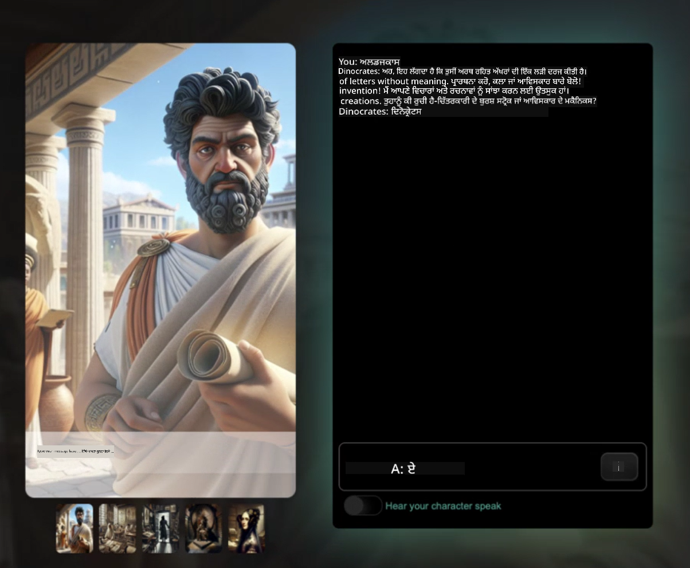
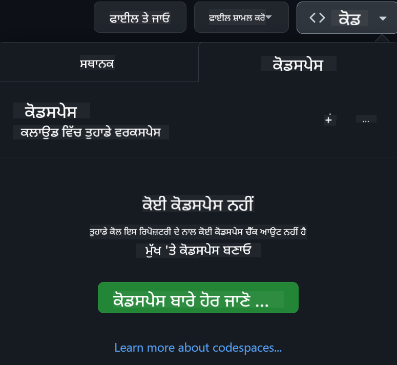

<!--
CO_OP_TRANSLATOR_METADATA:
{
  "original_hash": "3bea83a071750b68d3c8755f1155f805",
  "translation_date": "2025-10-03T09:24:36+00:00",
  "source_file": "README.md",
  "language_code": "pa"
}
-->
[](https://github.com/microsoft/Web-Dev-For-Beginners/blob/master/LICENSE)  
[](https://GitHub.com/microsoft/Web-Dev-For-Beginners/graphs/contributors/)  
[](https://GitHub.com/microsoft/Web-Dev-For-Beginners/issues/)  
[](https://GitHub.com/microsoft/Web-Dev-For-Beginners/pulls/)  
[](http://makeapullrequest.com)  

[](https://GitHub.com/microsoft/Web-Dev-For-Beginners/watchers/)  
[](https://GitHub.com/microsoft/Web-Dev-For-Beginners/network/)  
[](https://GitHub.com/microsoft/Web-Dev-For-Beginners/stargazers/)  

[](https://discord.gg/zxKYvhSnVp?WT.mc_id=academic-000002-leestott)  

[](https://open.vscode.dev/microsoft/Web-Dev-For-Beginners)  

[](https://discord.com/invite/ByRwuEEgH4)  

ਇਹ ਸਰੋਤਾਂ ਨੂੰ ਵਰਤਣ ਦੀ ਸ਼ੁਰੂਆਤ ਕਰਨ ਲਈ ਹੇਠਾਂ ਦਿੱਤੇ ਕਦਮਾਂ ਦੀ ਪਾਲਣਾ ਕਰੋ:  
1. **ਰੇਪੋਜ਼ਟਰੀ ਨੂੰ ਫੋਰਕ ਕਰੋ**: ਕਲਿਕ ਕਰੋ [](https://GitHub.com/microsoft/Web-Dev-For-Beginners/fork)  
2. **ਰੇਪੋਜ਼ਟਰੀ ਨੂੰ ਕਲੋਨ ਕਰੋ**:   `git clone https://github.com/microsoft/Web-Dev-For-Beginners.git`  
3. [**Azure AI Foundry Discord 'ਚ ਸ਼ਾਮਲ ਹੋਵੋ ਅਤੇ ਮਾਹਰਾਂ ਅਤੇ ਹੋਰ ਡਿਵੈਲਪਰਾਂ ਨਾਲ ਮਿਲੋ**](https://discord.com/invite/ByRwuEEgH4)  

# ਸ਼ੁਰੂਆਤੀ ਲਈ ਵੈੱਬ ਡਿਵੈਲਪਮੈਂਟ - ਇੱਕ ਕੋਰਸ  

ਮਾਈਕਰੋਸਾਫਟ ਕਲਾਉਡ ਐਡਵੋਕੇਟਸ ਵੱਲੋਂ 12 ਹਫ਼ਤਿਆਂ ਦੇ ਵਿਸਤ੍ਰਿਤ ਕੋਰਸ ਨਾਲ ਵੈੱਬ ਡਿਵੈਲਪਮੈਂਟ ਦੇ ਮੁੱਢਲੇ ਸਿਧਾਂਤ ਸਿੱਖੋ। ਹਰ ਇੱਕ 24 ਪਾਠਾਂ ਵਿੱਚ ਜਾਵਾਸਕ੍ਰਿਪਟ, CSS, ਅਤੇ HTML ਨੂੰ ਹੱਥ-ਵਰਤੋਂ ਪ੍ਰਾਜੈਕਟਾਂ ਜਿਵੇਂ ਕਿ ਟੈਰੇਰੀਅਮ, ਬ੍ਰਾਊਜ਼ਰ ਐਕਸਟੈਂਸ਼ਨ, ਅਤੇ ਸਪੇਸ ਗੇਮਾਂ ਰਾਹੀਂ ਸਮਝਾਇਆ ਗਿਆ ਹੈ। ਕਵਿਜ਼, ਚਰਚਾ ਅਤੇ ਪ੍ਰੈਕਟਿਕਲ ਅਸਾਈਨਮੈਂਟਾਂ ਨਾਲ ਸ਼ਾਮਲ ਹੋਵੋ। ਪ੍ਰਾਜੈਕਟ-ਅਧਾਰਤ ਪੈਡਾਗੌਜੀ ਨਾਲ ਆਪਣੇ ਹੁਨਰਾਂ ਨੂੰ ਵਧਾਓ ਅਤੇ ਆਪਣੇ ਗਿਆਨ ਨੂੰ ਮਜ਼ਬੂਤ ਕਰੋ। ਅੱਜ ਹੀ ਆਪਣੀ ਕੋਡਿੰਗ ਯਾਤਰਾ ਸ਼ੁਰੂ ਕਰੋ!  

### 🌐 ਬਹੁ-ਭਾਸ਼ਾਈ ਸਹਾਇਤਾ  

#### GitHub Action ਰਾਹੀਂ ਸਹਾਇਕ (ਆਟੋਮੈਟਿਕ ਅਤੇ ਹਮੇਸ਼ਾ ਅਪ-ਟੂ-ਡੇਟ)  

[ਫਰੈਂਚ](../fr/README.md) | [ਸਪੈਨਿਸ਼](../es/README.md) | [ਜਰਮਨ](../de/README.md) | [ਰੂਸੀ](../ru/README.md) | [ਅਰਬੀ](../ar/README.md) | [ਫ਼ਾਰਸੀ](../fa/README.md) | [ਉਰਦੂ](../ur/README.md) | [ਚੀਨੀ (ਸਰਲ)](../zh/README.md) | [ਚੀਨੀ (ਰਵਾਇਤੀ, ਮਕਾਉ)](../mo/README.md) | [ਚੀਨੀ (ਰਵਾਇਤੀ, ਹਾਂਗਕਾਂਗ)](../hk/README.md) | [ਚੀਨੀ (ਰਵਾਇਤੀ, ਤਾਈਵਾਨ)](../tw/README.md) | [ਜਾਪਾਨੀ](../ja/README.md) | [ਕੋਰੀਅਨ](../ko/README.md) | [ਹਿੰਦੀ](../hi/README.md) | [ਬੰਗਾਲੀ](../bn/README.md) | [ਮਰਾਠੀ](../mr/README.md) | [ਨੇਪਾਲੀ](../ne/README.md) | [ਪੰਜਾਬੀ (ਗੁਰਮੁਖੀ)](./README.md) | [ਪੁਰਤਗਾਲੀ (ਪੁਰਤਗਾਲ)](../pt/README.md) | [ਪੁਰਤਗਾਲੀ (ਬ੍ਰਾਜ਼ੀਲ)](../br/README.md) | [ਇਟਾਲੀਅਨ](../it/README.md) | [ਪੋਲਿਸ਼](../pl/README.md) | [ਤੁਰਕੀ](../tr/README.md) | [ਗ੍ਰੀਕ](../el/README.md) | [ਥਾਈ](../th/README.md) | [ਸਵੀਡਿਸ਼](../sv/README.md) | [ਡੈਨਿਸ਼](../da/README.md) | [ਨਾਰਵੇਜੀਅਨ](../no/README.md) | [ਫਿਨਿਸ਼](../fi/README.md) | [ਡੱਚ](../nl/README.md) | [ਹਿਬਰੂ](../he/README.md) | [ਵਿਯਤਨਾਮੀ](../vi/README.md) | [ਇੰਡੋਨੇਸ਼ੀਆਈ](../id/README.md) | [ਮਲੇ](../ms/README.md) | [ਟੈਗਾਲੋਗ (ਫਿਲੀਪੀਨੋ)](../tl/README.md) | [ਸਵਾਹਿਲੀ](../sw/README.md) | [ਹੰਗਰੀਅਨ](../hu/README.md) | [ਚੈਕ](../cs/README.md) | [ਸਲੋਵਾਕ](../sk/README.md) | [ਰੋਮਾਨੀਅਨ](../ro/README.md) | [ਬੁਲਗਾਰੀਆਈ](../bg/README.md) | [ਸਰਬੀਅਨ (ਸਿਰਿਲਿਕ)](../sr/README.md) | [ਕਰੋਏਸ਼ੀਆਈ](../hr/README.md) | [ਸਲੋਵੇਨੀਅਨ](../sl/README.md) | [ਯੂਕਰੇਨੀਅਨ](../uk/README.md) | [ਬਰਮੀ (ਮਿਆਂਮਾਰ)](../my/README.md)  

**ਜੇ ਤੁਸੀਂ ਹੋਰ ਭਾਸ਼ਾਵਾਂ ਵਿੱਚ ਅਨੁਵਾਦ ਕਰਵਾਉਣਾ ਚਾਹੁੰਦੇ ਹੋ, ਤਾਂ ਸਹਾਇਕ ਭਾਸ਼ਾਵਾਂ ਦੀ ਸੂਚੀ [ਇੱਥੇ](https://github.com/Azure/co-op-translator/blob/main/getting_started/supported-languages.md) ਮਿਲੇਗੀ।**  

#### 🧑‍🎓 _ਕੀ ਤੁਸੀਂ ਵਿਦਿਆਰਥੀ ਹੋ?_  

[**ਵਿਦਿਆਰਥੀ ਹੱਬ ਪੇਜ**](https://docs.microsoft.com/learn/student-hub/?WT.mc_id=academic-77807-sagibbon) 'ਤੇ ਜਾਓ ਜਿੱਥੇ ਤੁਹਾਨੂੰ ਸ਼ੁਰੂਆਤੀ ਸਰੋਤ, ਵਿਦਿਆਰਥੀ ਪੈਕ ਅਤੇ ਮੁਫ਼ਤ ਸਰਟੀਫਿਕੇਟ ਵਾਊਚਰ ਪ੍ਰਾਪਤ ਕਰਨ ਦੇ ਤਰੀਕੇ ਮਿਲਣਗੇ। ਇਹ ਪੇਜ ਬੁੱਕਮਾਰਕ ਕਰਨ ਯੋਗ ਹੈ ਅਤੇ ਸਮੇਂ-ਸਮੇਂ 'ਤੇ ਚੈੱਕ ਕਰਨ ਲਈ ਹੈ ਕਿਉਂਕਿ ਅਸੀਂ ਮਹੀਨਾਵਾਰ ਸਮੱਗਰੀ ਬਦਲਦੇ ਹਾਂ।  

### 📣 ਐਲਾਨ - _ਜਨਰੇਟਿਵ AI ਵਰਤ ਕੇ ਨਵਾਂ ਪ੍ਰਾਜੈਕਟ ਬਣਾਓ_  

ਨਵਾਂ AI ਸਹਾਇਕ ਪ੍ਰਾਜੈਕਟ ਸ਼ਾਮਲ ਕੀਤਾ ਗਿਆ ਹੈ, ਇਸਨੂੰ [ਪ੍ਰਾਜੈਕਟ](./09-chat-project/README.md) ਵਿੱਚ ਵੇਖੋ।  

### 📣 ਐਲਾਨ - ਜਨਰੇਟਿਵ AI ਲਈ ਜਾਵਾਸਕ੍ਰਿਪਟ 'ਤੇ ਨਵਾਂ ਕੋਰਸ ਜਾਰੀ ਕੀਤਾ ਗਿਆ ਹੈ  

ਸਾਡੇ ਨਵੇਂ ਜਨਰੇਟਿਵ AI ਕੋਰਸ ਨੂੰ ਨਾ ਗਵਾਓ!  

ਸ਼ੁਰੂ ਕਰਨ ਲਈ [https://aka.ms/genai-js-course](https://aka.ms/genai-js-course) 'ਤੇ ਜਾਓ!  

  

- ਪਾਠਾਂ ਜੋ ਬੁਨਿਆਦ ਤੋਂ RAG ਤੱਕ ਸਭ ਕੁਝ ਕਵਰ ਕਰਦੇ ਹਨ।  
- GenAI ਅਤੇ ਸਾਡੇ ਸਾਥੀ ਐਪ ਦੀ ਵਰਤੋਂ ਕਰਕੇ ਇਤਿਹਾਸਕ ਪਾਤਰਾਂ ਨਾਲ ਗੱਲਬਾਤ ਕਰੋ।  
- ਮਜ਼ੇਦਾਰ ਅਤੇ ਰੁਚਿਕਰ ਕਹਾਣੀ, ਤੁਸੀਂ ਸਮੇਂ ਦੀ ਯਾਤਰਾ ਕਰ ਰਹੇ ਹੋਵੋਗੇ!  

  

ਹਰ ਪਾਠ ਵਿੱਚ ਸ਼ਾਮਲ ਹੈ:  
- ਪ੍ਰਾਪਟਿੰਗ ਅਤੇ ਪ੍ਰਾਪਟ ਇੰਜੀਨੀਅਰਿੰਗ  
- ਟੈਕਸਟ ਅਤੇ ਚਿੱਤਰ ਐਪ ਜਨਰੇਸ਼ਨ  
- ਖੋਜ ਐਪਸ  

ਸ਼ੁਰੂ ਕਰਨ ਲਈ [https://aka.ms/genai-js-course](https://aka.ms/genai-js-course) 'ਤੇ ਜਾਓ!  

## 🌱 ਸ਼ੁਰੂਆਤ ਕਰਨਾ  

> **ਅਧਿਆਪਕ**, ਅਸੀਂ ਇਸ ਕੋਰਸ ਨੂੰ ਵਰਤਣ ਲਈ ਕੁਝ ਸੁਝਾਵ [ਇੱਥੇ](for-teachers.md) ਸ਼ਾਮਲ ਕੀਤੇ ਹਨ। ਸਾਡੇ [ਚਰਚਾ ਫੋਰਮ](https://github.com/microsoft/Web-Dev-For-Beginners/discussions/categories/teacher-corner) ਵਿੱਚ ਤੁਹਾਡੀ ਪ੍ਰਤੀਕਿਰਿਆ ਦੀ ਉਡੀਕ ਹੈ!  

**[ਵਿਦਿਆਰਥੀ](https://aka.ms/student-page/?WT.mc_id=academic-77807-sagibbon)**, ਹਰ ਪਾਠ ਲਈ, ਪ੍ਰੀ-ਲੈਕਚਰ ਕਵਿਜ਼ ਨਾਲ ਸ਼ੁਰੂ ਕਰੋ ਅਤੇ ਲੈਕਚਰ ਸਮੱਗਰੀ ਪੜ੍ਹਨ, ਵੱਖ-ਵੱਖ ਗਤੀਵਿਧੀਆਂ ਪੂਰੀ ਕਰਨ ਅਤੇ ਪੋਸਟ-ਲੈਕਚਰ ਕਵਿਜ਼ ਨਾਲ ਆਪਣੀ ਸਮਝ ਦੀ ਜਾਂਚ ਕਰਨ ਨਾਲ ਜਾਰੀ ਰੱਖੋ।  

ਤੁਹਾਡੇ ਸਿੱਖਣ ਦੇ ਤਜਰਬੇ ਨੂੰ ਵਧੀਆ ਬਣਾਉਣ ਲਈ, ਆਪਣੇ ਸਾਥੀਆਂ ਨਾਲ ਪ੍ਰਾਜੈਕਟਾਂ 'ਤੇ ਕੰਮ ਕਰਨ ਲਈ ਜੁੜੋ! ਸਾਡੇ [ਚਰਚਾ ਫੋਰਮ](https://github.com/microsoft/Web-Dev-For-Beginners/discussions) ਵਿੱਚ ਚਰਚਾ ਨੂੰ ਉਤਸ਼ਾਹਿਤ ਕੀਤਾ ਜਾਂਦਾ ਹੈ ਜਿੱਥੇ ਸਾਡੇ ਮਾਡਰੇਟਰਾਂ ਦੀ ਟੀਮ ਤੁਹਾਡੇ ਸਵਾਲਾਂ ਦੇ ਜਵਾਬ ਦੇਣ ਲਈ ਉਪਲਬਧ ਹੋਵੇਗੀ।  

ਆਪਣੀ ਸਿੱਖਿਆ ਨੂੰ ਹੋਰ ਅੱਗੇ ਵਧਾਉਣ ਲਈ, ਅਸੀਂ [Microsoft Learn](https://learn.microsoft.com/users/wirelesslife/collections/p1ddcy5jwy0jkm?WT.mc_id=academic-77807-sagibbon) ਦੀ ਪੜਚੋਲ ਕਰਨ ਦੀ ਸਿਫਾਰਸ਼ ਕਰਦੇ ਹਾਂ ਜੋ ਵਾਧੂ ਅਧਿਐਨ ਸਮੱਗਰੀ ਲਈ ਹੈ।  

### 📋 ਆਪਣੇ ਵਾਤਾਵਰਣ ਨੂੰ ਸੈਟ ਕਰਨਾ  

ਇਸ ਕੋਰਸ ਵਿੱਚ ਇੱਕ ਵਿਕਾਸ ਵਾਤਾਵਰਣ ਤਿਆਰ ਹੈ! ਜਦੋਂ ਤੁਸੀਂ ਸ਼ੁਰੂ ਕਰਦੇ ਹੋ, ਤੁਸੀਂ ਇਸ ਕੋਰਸ ਨੂੰ [Codespace](https://github.com/features/codespaces/) (_ਇੱਕ ਬ੍ਰਾਊਜ਼ਰ-ਅਧਾਰਤ, ਕੋਈ ਇੰਸਟਾਲੇਸ਼ਨ ਦੀ ਲੋੜ ਨਹੀਂ_) ਜਾਂ ਆਪਣੇ ਕੰਪਿਊਟਰ 'ਤੇ ਸਥਾਨਕ ਤੌਰ 'ਤੇ ਇੱਕ ਟੈਕਸਟ ਐਡੀਟਰ ਵਰਗਾ [Visual Studio Code](https://code.visualstudio.com/?WT.mc_id=academic-77807-sagibbon) ਵਰਤ ਕੇ ਚਲਾਉਣ ਦੀ ਚੋਣ ਕਰ ਸਕਦੇ ਹੋ।  

#### ਆਪਣੀ ਰੇਪੋਜ਼ਟਰੀ ਬਣਾਓ  
ਆਪਣੇ ਕੰਮ ਨੂੰ ਆਸਾਨੀ ਨਾਲ ਸੁਰੱਖਿਅਤ ਕਰਨ ਲਈ, ਇਹ ਸਿਫਾਰਸ਼ ਕੀਤੀ ਜਾਂਦੀ ਹੈ ਕਿ ਤੁਸੀਂ ਇਸ ਰੇਪੋਜ਼ਟਰੀ ਦੀ ਆਪਣੀ ਕਾਪੀ ਬਣਾਓ। ਤੁਸੀਂ ਇਸ ਪੰਨੇ ਦੇ ਉੱਪਰ "Use this template" ਬਟਨ 'ਤੇ ਕਲਿਕ ਕਰਕੇ ਇਹ ਕਰ ਸਕਦੇ ਹੋ। ਇਹ ਤੁਹਾਡੇ GitHub ਖਾਤੇ ਵਿੱਚ ਕੋਰਸ ਦੀ ਇੱਕ ਨਵੀਂ ਰੇਪੋਜ਼ਟਰੀ ਬਣਾਏਗਾ।  

ਇਹ ਕਦਮਾਂ ਦੀ ਪਾਲਣਾ ਕਰੋ:  
1. **ਰੇਪੋਜ਼ਟਰੀ ਨੂੰ ਫੋਰਕ ਕਰੋ**: ਇਸ ਪੰਨੇ ਦੇ ਉੱਪਰ-ਸੱਜੇ ਕੋਨੇ ਵਿੱਚ "Fork" ਬਟਨ 'ਤੇ ਕਲਿਕ ਕਰੋ।  
2. **ਰੇਪੋਜ਼ਟਰੀ ਨੂੰ ਕਲੋਨ ਕਰੋ**:   `git clone https://github.com/microsoft/Web-Dev-For-Beginners.git`  

#### Codespace ਵਿੱਚ ਕੋਰਸ ਚਲਾਉਣਾ  

ਤੁਹਾਡੇ ਦੁਆਰਾ ਬਣਾਈ ਗਈ ਇਸ ਰੇਪੋਜ਼ਟਰੀ ਦੀ ਕਾਪੀ ਵਿੱਚ, **Code** ਬਟਨ 'ਤੇ ਕਲਿਕ ਕਰੋ ਅਤੇ **Open with Codespaces** ਚੁਣੋ। ਇਹ ਤੁਹਾਡੇ ਲਈ ਕੰਮ ਕਰਨ ਲਈ ਇੱਕ ਨਵਾਂ Codespace ਬਣਾਏਗਾ।  

  

#### ਆਪਣੇ ਕੰਪਿਊਟਰ 'ਤੇ ਸਥਾਨਕ ਤੌਰ 'ਤੇ ਕੋਰਸ ਚਲਾਉਣਾ  

ਆਪਣੇ ਕੰਪਿਊਟਰ 'ਤੇ ਇਸ ਕੋਰਸ ਨੂੰ ਚਲਾਉਣ ਲਈ, ਤੁਹਾਨੂੰ ਇੱਕ ਟੈਕਸਟ ਐਡੀਟਰ, ਇੱਕ ਬ੍ਰਾਊਜ਼ਰ ਅਤੇ ਇੱਕ ਕਮਾਂਡ ਲਾਈਨ ਟੂਲ ਦੀ ਲੋੜ ਹੋਵੇਗੀ। ਸਾਡਾ ਪਹਿਲਾ ਪਾਠ, [ਪ੍ਰੋਗਰਾਮਿੰਗ ਭਾਸ਼ਾਵਾਂ ਅਤੇ ਟੂਲਜ਼ ਦਾ ਪਰਿਚਯ](../../1-getting-started-lessons/1-intro-to-programming-languages), ਤੁਹਾਨੂੰ ਹਰ ਇੱਕ ਟੂਲ ਲਈ ਵੱਖ-ਵੱਖ ਵਿਕਲਪਾਂ ਰਾਹੀਂ ਲੈ ਜਾਵੇਗਾ ਤਾਂ ਜੋ ਤੁਸੀਂ ਆਪਣੇ ਲਈ ਸਭ ਤੋਂ ਵਧੀਆ ਚੁਣ ਸਕੋ।  

ਸਾਡੀ ਸਿਫਾਰਸ਼ ਹੈ ਕਿ ਤੁਸੀਂ [Visual Studio Code](https://code.visualstudio.com/?WT.mc_id=academic-77807-sagibbon) ਨੂੰ ਆਪਣੇ ਐਡੀਟਰ ਵਜੋਂ ਵਰਤੋ, ਜਿਸ ਵਿੱਚ ਇੱਕ ਅੰਦਰੂਨੀ [ਟਰਮਿਨਲ](https://code.visualstudio.com/docs/terminal/basics/?WT.mc_id=academic-77807-sagibbon) ਵੀ ਹੈ। ਤੁਸੀਂ [ਇੱਥੇ](https://code.visualstudio.com/?WT.mc_id=academic-77807-sagibbon) Visual Studio Code ਡਾਊਨਲੋਡ ਕਰ ਸਕਦੇ ਹੋ।  

1. ਆਪਣੀ ਰੇਪੋਜ਼ਟਰੀ ਨੂੰ ਆਪਣੇ ਕੰਪਿਊਟਰ 'ਤੇ ਕਲੋਨ ਕਰੋ। ਤੁਸੀਂ ਇਹ **Code** ਬਟਨ 'ਤੇ ਕਲਿਕ ਕਰਕੇ ਅਤੇ URL ਕਾਪੀ ਕਰਕੇ ਕਰ ਸਕਦੇ ਹੋ:  

    [CodeSpace](./images/createcodespace.png)  

    ਫਿਰ, [Visual Studio Code](https://code.visualstudio.com/?WT.mc_id=academic-77807-sagibbon) ਵਿੱਚ [ਟਰਮਿਨਲ](https://code.visualstudio.com/docs/terminal/basics/?WT.mc_id=academic-77807-sagibbon) ਖੋਲ੍ਹੋ ਅਤੇ ਹੇਠਾਂ ਦਿੱਤੇ ਕਮਾਂਡ ਨੂੰ ਚਲਾਓ, `<your-repository-url>` ਨੂੰ ਆਪਣੇ ਕਾਪੀ ਕੀਤੇ URL ਨਾਲ ਬਦਲੋ:  

    ```bash 
    git clone <your-repository-url>
    ```
  
2. ਫੋਲਡਰ ਨੂੰ Visual Studio Code ਵਿੱਚ ਖੋਲ੍ਹੋ। ਤੁਸੀਂ ਇਹ **File** > **Open Folder** 'ਤੇ ਕਲਿਕ ਕਰਕੇ ਅਤੇ ਉਸ ਫੋਲਡਰ ਨੂੰ ਚੁਣ ਕੇ ਕਰ ਸਕਦੇ ਹੋ ਜੋ ਤੁਸੀਂ ਹੁਣੇ ਕਲੋਨ ਕੀਤਾ ਹੈ।  

>  ਸਿਫਾਰਸ਼ ਕੀਤੇ Visual Studio Code ਐਕਸਟੈਂਸ਼ਨ:  
>  
> * [Live Server](https://marketplace.visualstudio.com/items?itemName=ritwickdey.LiveServer&WT.mc_id=academic-77807-sagibbon) - Visual Studio Code ਵਿੱਚ HTML ਪੰਨਿਆਂ ਨੂੰ ਪ੍ਰੀਵਿਊ ਕਰਨ ਲਈ  
> * [Copilot](https://marketplace.visualstudio.com/items?itemName=GitHub.copilot&WT.mc_id=academic-77807-sagibbon) - ਤੁਹਾਨੂੰ ਤੇਜ਼ੀ ਨਾਲ ਕੋਡ ਲਿਖਣ ਵਿੱਚ ਮਦਦ ਕਰਨ ਲਈ  

## 📂 ਹਰ ਪਾਠ ਵਿੱਚ ਸ਼ਾਮਲ ਹੈ:  

- ਵਿਕਲਪਿਕ
> **ਕੁਇਜ਼ ਬਾਰੇ ਇੱਕ ਨੋਟ**: ਸਾਰੇ ਕੁਇਜ਼ `Quiz-app` ਫੋਲਡਰ ਵਿੱਚ ਹਨ, ਕੁੱਲ 48 ਕੁਇਜ਼ ਹਨ, ਹਰ ਇੱਕ ਵਿੱਚ ਤਿੰਨ ਪ੍ਰਸ਼ਨ ਹਨ। ਇਹ [ਇਥੇ](https://ff-quizzes.netlify.app/web/) ਉਪਲਬਧ ਹਨ। ਕੁਇਜ਼ ਐਪ ਨੂੰ ਸਥਾਨਕ ਤੌਰ 'ਤੇ ਚਲਾਇਆ ਜਾ ਸਕਦਾ ਹੈ ਜਾਂ Azure 'ਤੇ ਡਿਪਲੌਇ ਕੀਤਾ ਜਾ ਸਕਦਾ ਹੈ; `quiz-app` ਫੋਲਡਰ ਵਿੱਚ ਦਿੱਤੇ ਨਿਰਦੇਸ਼ਾਂ ਦੀ ਪਾਲਣਾ ਕਰੋ।

## 🗃️ ਪਾਠ

|     |                       ਪ੍ਰੋਜੈਕਟ ਦਾ ਨਾਮ                       |                            ਸਿੱਖਣ ਵਾਲੇ ਸੰਕਲਪ                             | ਸਿੱਖਣ ਦੇ ਉਦੇਸ਼                                                                                                                 |                                                         ਜੁੜਿਆ ਪਾਠ                                                          |         ਲੇਖਕ          |
| :-: | :------------------------------------------------------: | :--------------------------------------------------------------------: | ----------------------------------------------------------------------------------------------------------------------------------- | :----------------------------------------------------------------------------------------------------------------------------: | :---------------------: |
| 01  |                     ਸ਼ੁਰੂਆਤ                      |           ਪ੍ਰੋਗ੍ਰਾਮਿੰਗ ਅਤੇ ਟੂਲਜ਼ ਦੀ ਜਾਣਕਾਰੀ           | ਜ਼ਿਆਦਾਤਰ ਪ੍ਰੋਗ੍ਰਾਮਿੰਗ ਭਾਸ਼ਾਵਾਂ ਦੇ ਮੁੱਢਲੇ ਅਧਾਰਾਂ ਅਤੇ ਉਹ ਸੌਫਟਵੇਅਰ ਬਾਰੇ ਸਿੱਖੋ ਜੋ ਪੇਸ਼ੇਵਰ ਡਿਵੈਲਪਰਾਂ ਦੀ ਮਦਦ ਕਰਦਾ ਹੈ | [ਪ੍ਰੋਗ੍ਰਾਮਿੰਗ ਭਾਸ਼ਾਵਾਂ ਅਤੇ ਟੂਲਜ਼ ਦੀ ਜਾਣਕਾਰੀ](./1-getting-started-lessons/1-intro-to-programming-languages/README.md) |         Jasmine         |
| 02  |                     ਸ਼ੁਰੂਆਤ                      |             GitHub ਦੇ ਮੁੱਢਲੇ ਅਧਾਰ, ਟੀਮ ਨਾਲ ਕੰਮ ਕਰਨ ਦੀ ਸਮੇਤ             | ਆਪਣੇ ਪ੍ਰੋਜੈਕਟ ਵਿੱਚ GitHub ਦੀ ਵਰਤੋਂ ਕਿਵੇਂ ਕਰਨੀ ਹੈ, ਕੋਡ ਬੇਸ 'ਤੇ ਹੋਰ ਲੋਕਾਂ ਨਾਲ ਸਹਿਯੋਗ ਕਿਵੇਂ ਕਰਨਾ ਹੈ                                                    |                            [GitHub ਦੀ ਜਾਣਕਾਰੀ](./1-getting-started-lessons/2-github-basics/README.md)                             |          Floor          |
| 03  |                     ਸ਼ੁਰੂਆਤ                      |                             ਪਹੁੰਚਯੋਗਤਾ                              | ਵੈੱਬ ਪਹੁੰਚਯੋਗਤਾ ਦੇ ਮੁੱਢਲੇ ਅਧਾਰ ਸਿੱਖੋ                                                                                               |                       [ਪਹੁੰਚਯੋਗਤਾ ਦੇ ਮੁੱਢਲੇ ਅਧਾਰ](./1-getting-started-lessons/3-accessibility/README.md)                       |       Christopher       |
| 04  |                        JS ਮੁੱਢਲੇ ਅਧਾਰ                         |                         JavaScript ਡਾਟਾ ਟਾਈਪ                          | JavaScript ਡਾਟਾ ਟਾਈਪ ਦੇ ਮੁੱਢਲੇ ਅਧਾਰ                                                                                                 |                                       [ਡਾਟਾ ਟਾਈਪ](./2-js-basics/1-data-types/README.md)                                        |         Jasmine         |
| 05  |                        JS ਮੁੱਢਲੇ ਅਧਾਰ                         |                         ਫੰਕਸ਼ਨ ਅਤੇ ਮੈਥਡ                          | ਐਪਲੀਕੇਸ਼ਨ ਦੇ ਲਾਜਿਕ ਫਲੋ ਨੂੰ ਸੰਭਾਲਣ ਲਈ ਫੰਕਸ਼ਨ ਅਤੇ ਮੈਥਡ ਬਾਰੇ ਸਿੱਖੋ                                                             |                              [ਫੰਕਸ਼ਨ ਅਤੇ ਮੈਥਡ](./2-js-basics/2-functions-methods/README.md)                               | Jasmine and Christopher |
| 06  |                        JS ਮੁੱਢਲੇ ਅਧਾਰ                         |                        JS ਨਾਲ ਫੈਸਲੇ ਲੈਣਾ                        | ਫੈਸਲੇ ਲੈਣ ਦੇ ਤਰੀਕਿਆਂ ਦੀ ਵਰਤੋਂ ਕਰਕੇ ਆਪਣੇ ਕੋਡ ਵਿੱਚ ਸ਼ਰਤਾਂ ਬਣਾਉਣ ਦਾ ਤਰੀਕਾ ਸਿੱਖੋ                                                           |                                 [ਫੈਸਲੇ ਲੈਣਾ](./2-js-basics/3-making-decisions/README.md)                                  |         Jasmine         |
| 07  |                        JS ਮੁੱਢਲੇ ਅਧਾਰ                         |                            ਐਰੇ ਅਤੇ ਲੂਪ                            | JavaScript ਵਿੱਚ ਡਾਟਾ ਨਾਲ ਕੰਮ ਕਰਨ ਲਈ ਐਰੇ ਅਤੇ ਲੂਪ ਦੀ ਵਰਤੋਂ                                                                                 |                                   [ਐਰੇ ਅਤੇ ਲੂਪ](./2-js-basics/4-arrays-loops/README.md)                                    |         Jasmine         |
| 08  |       [Terrarium](./3-terrarium/solution/README.md)       |                            HTML ਦਾ ਅਭਿਆਸ                            | ਆਨਲਾਈਨ ਟੈਰੇਰੀਅਮ ਬਣਾਉਣ ਲਈ HTML ਬਣਾਓ, ਲੇਆਉਟ ਬਣਾਉਣ 'ਤੇ ਧਿਆਨ ਦਿਓ                                                         |                                 [HTML ਦੀ ਜਾਣਕਾਰੀ](./3-terrarium/1-intro-to-html/README.md)                                 |           Jen           |
| 09  |       [Terrarium](./3-terrarium/solution/README.md)       |                            CSS ਦਾ ਅਭਿਆਸ                             | ਆਨਲਾਈਨ ਟੈਰੇਰੀਅਮ ਨੂੰ ਸਟਾਈਲ ਕਰਨ ਲਈ CSS ਬਣਾਓ, CSS ਦੇ ਮੁੱਢਲੇ ਅਧਾਰਾਂ 'ਤੇ ਧਿਆਨ ਦਿਓ, ਸਹੀ ਪੇਜ ਬਣਾਉਣ ਸਮੇਤ                     |                                  [CSS ਦੀ ਜਾਣਕਾਰੀ](./3-terrarium/2-intro-to-css/README.md)                                  |           Jen           |
| 10  |            [Terrarium](./3-terrarium/solution/README.md)            |                 JavaScript Closures, DOM ਮੈਨਿਪੂਲੇਸ਼ਨ                  | JavaScript ਬਣਾਓ ਤਾਂ ਜੋ ਟੈਰੇਰੀਅਮ ਡ੍ਰੈਗ/ਡ੍ਰੌਪ ਇੰਟਰਫੇਸ ਵਜੋਂ ਕੰਮ ਕਰੇ, Closures ਅਤੇ DOM ਮੈਨਿਪੂਲੇਸ਼ਨ 'ਤੇ ਧਿਆਨ ਦਿਓ             |                  [JavaScript Closures, DOM ਮੈਨਿਪੂਲੇਸ਼ਨ](./3-terrarium/3-intro-to-DOM-and-closures/README.md)                   |           Jen           |
| 11  |          [Typing Game](./4-typing-game/solution/README.md)          |                          ਟਾਈਪਿੰਗ ਗੇਮ ਬਣਾਉਣਾ                           | ਆਪਣੇ JavaScript ਐਪ ਦੀ ਲਾਜਿਕ ਨੂੰ ਚਲਾਉਣ ਲਈ ਕੀਬੋਰਡ ਇਵੈਂਟ ਦੀ ਵਰਤੋਂ ਕਰਨ ਦਾ ਤਰੀਕਾ ਸਿੱਖੋ                                                          |                                [ਇਵੈਂਟ-ਡ੍ਰਿਵਨ ਪ੍ਰੋਗ੍ਰਾਮਿੰਗ](./4-typing-game/typing-game/README.md)                                |       Christopher       |
| 12  | [Green Browser Extension](./5-browser-extension/solution/README.md) |                         ਬ੍ਰਾਊਜ਼ਰ ਨਾਲ ਕੰਮ ਕਰਨਾ                          | ਬ੍ਰਾਊਜ਼ਰ ਕਿਵੇਂ ਕੰਮ ਕਰਦੇ ਹਨ, ਉਨ੍ਹਾਂ ਦਾ ਇਤਿਹਾਸ, ਅਤੇ ਬ੍ਰਾਊਜ਼ਰ ਐਕਸਟੈਂਸ਼ਨ ਦੇ ਪਹਿਲੇ ਤੱਤਾਂ ਨੂੰ ਕਿਵੇਂ ਬਣਾਉਣਾ ਹੈ                               |                               [ਬ੍ਰਾਊਜ਼ਰ ਬਾਰੇ](./5-browser-extension/1-about-browsers/README.md)                                |           Jen           |
| 13  | [Green Browser Extension](./5-browser-extension/solution/README.md) | ਫਾਰਮ ਬਣਾਉਣਾ, API ਨੂੰ ਕਾਲ ਕਰਨਾ ਅਤੇ ਲੋਕਲ ਸਟੋਰੇਜ ਵਿੱਚ ਵੈਰੀਏਬਲ ਸਟੋਰ ਕਰਨਾ | ਬ੍ਰਾਊਜ਼ਰ ਐਕਸਟੈਂਸ਼ਨ ਦੇ JavaScript ਤੱਤਾਂ ਨੂੰ ਬਣਾਓ ਤਾਂ ਜੋ ਲੋਕਲ ਸਟੋਰੇਜ ਵਿੱਚ ਸਟੋਰ ਕੀਤੇ ਵੈਰੀਏਬਲ ਦੀ ਵਰਤੋਂ ਕਰਕੇ API ਨੂੰ ਕਾਲ ਕੀਤਾ ਜਾ ਸਕੇ                      |                [APIs, ਫਾਰਮ, ਅਤੇ ਲੋਕਲ ਸਟੋਰੇਜ](./5-browser-extension/2-forms-browsers-local-storage/README.md)                 |           Jen           |
| 14  | [Green Browser Extension](./5-browser-extension/solution/README.md) |          ਬ੍ਰਾਊਜ਼ਰ ਵਿੱਚ ਬੈਕਗ੍ਰਾਊਂਡ ਪ੍ਰੋਸੈਸ, ਵੈੱਬ ਪ੍ਰਦਰਸ਼ਨ          | ਐਕਸਟੈਂਸ਼ਨ ਦੇ ਆਈਕਨ ਨੂੰ ਸੰਭਾਲਣ ਲਈ ਬ੍ਰਾਊਜ਼ਰ ਦੇ ਬੈਕਗ੍ਰਾਊਂਡ ਪ੍ਰੋਸੈਸ ਦੀ ਵਰਤੋਂ ਕਰੋ; ਵੈੱਬ ਪ੍ਰਦਰਸ਼ਨ ਬਾਰੇ ਸਿੱਖੋ ਅਤੇ ਕੁਝ ਅਪਟਿਮਾਈਜ਼ੇਸ਼ਨ |             [ਬੈਕਗ੍ਰਾਊਂਡ ਟਾਸਕ ਅਤੇ ਪ੍ਰਦਰਸ਼ਨ](./5-browser-extension/3-background-tasks-and-performance/README.md)              |           Jen           |
| 15  |           [Space Game](./6-space-game/solution/README.md)           |             JavaScript ਨਾਲ ਹੋਰ ਅਗਰਸਰ ਗੇਮ ਡਿਵੈਲਪਮੈਂਟ             | ਕਲਾਸਾਂ ਅਤੇ ਕੰਪੋਜ਼ੀਸ਼ਨ ਅਤੇ Pub/Sub ਪੈਟਰਨ ਦੀ ਵਰਤੋਂ ਕਰਕੇ ਵਾਰਸਾ ਬਾਰੇ ਸਿੱਖੋ, ਗੇਮ ਬਣਾਉਣ ਦੀ ਤਿਆਰੀ ਵਿੱਚ              |                      [ਅਗਰਸਰ ਗੇਮ ਡਿਵੈਲਪਮੈਂਟ ਦੀ ਜਾਣਕਾਰੀ](./6-space-game/1-introduction/README.md)                       |          Chris          |
| 16  |           [Space Game](./6-space-game/solution/README.md)           |                           ਕੈਨਵਾਸ 'ਤੇ ਡ੍ਰਾਇੰਗ                            | ਕੈਨਵਾਸ API ਬਾਰੇ ਸਿੱਖੋ, ਜੋ ਸਕ੍ਰੀਨ 'ਤੇ ਤੱਤਾਂ ਨੂੰ ਡ੍ਰਾਇ ਕਰਨ ਲਈ ਵਰਤਿਆ ਜਾਂਦਾ ਹੈ                                                                       |                                [ਕੈਨਵਾਸ 'ਤੇ ਡ੍ਰਾਇੰਗ](./6-space-game/2-drawing-to-canvas/README.md)                                |          Chris          |
| 17  |           [Space Game](./6-space-game/solution/README.md)           |                   ਸਕ੍ਰੀਨ 'ਤੇ ਤੱਤਾਂ ਨੂੰ ਹਿਲਾਉਣਾ                    | ਪਤਾ ਲਗਾਓ ਕਿ ਤੱਤ ਕਿਵੇਂ ਕਾਰਟੀਸ਼ੀਅਨ ਕੋਆਰਡੀਨੇਟਸ ਅਤੇ ਕੈਨਵਾਸ API ਦੀ ਵਰਤੋਂ ਕਰਕੇ ਮੋਸ਼ਨ ਪ੍ਰਾਪਤ ਕਰ ਸਕਦੇ ਹਨ                                            |                           [ਤੱਤਾਂ ਨੂੰ ਹਿਲਾਉਣਾ](./6-space-game/3-moving-elements-around/README.md)                           |          Chris          |
| 18  |           [Space Game](./6-space-game/solution/README.md)           |                          ਟਕਰਾਅ ਦੀ ਪਛਾਣ                           | ਤੱਤਾਂ ਨੂੰ ਟਕਰਾਉਣ ਅਤੇ ਇੱਕ-ਦੂਜੇ ਨਾਲ ਪ੍ਰਤੀਕ੍ਰਿਆ ਕਰਨ ਲਈ ਕੀਪ੍ਰੈਸ ਦੀ ਵਰਤੋਂ ਕਰੋ ਅਤੇ ਗੇਮ ਦੀ ਪ੍ਰਦਰਸ਼ਨਸ਼ੀਲਤਾ ਨੂੰ ਯਕੀਨੀ ਬਣਾਉਣ ਲਈ ਕੂਲਡਾਊਨ ਫੰਕਸ਼ਨ ਪ੍ਰਦਾਨ ਕਰੋ    |                              [ਟਕਰਾਅ ਦੀ ਪਛਾਣ](./6-space-game/4-collision-detection/README.md)                              |          Chris          |
| 19  |           [Space Game](./6-space-game/solution/README.md)           |                             ਸਕੋਰ ਰੱਖਣਾ                              | ਗੇਮ ਦੀ ਸਥਿਤੀ ਅਤੇ ਪ੍ਰਦਰਸ਼ਨ ਦੇ ਅਧਾਰ 'ਤੇ ਗਣਨਾ ਕਰੋ                                                                |                                    [ਸਕੋਰ ਰੱਖਣਾ](./6-space-game/5-keeping-score/README.md)                                    |          Chris          |
| 20  |           [Space Game](./6-space-game/solution/README.md)           |                     ਗੇਮ ਨੂੰ ਖਤਮ ਅਤੇ ਮੁੜ ਸ਼ੁਰੂ ਕਰਨਾ                     | ਗੇਮ ਨੂੰ ਖਤਮ ਅਤੇ ਮੁੜ ਸ਼ੁਰੂ ਕਰਨ ਬਾਰੇ ਸਿੱਖੋ, ਜਿਸ ਵਿੱਚ ਐਸੈਟਾਂ ਨੂੰ ਸਾਫ ਕਰਨਾ ਅਤੇ ਵੈਰੀਏਬਲ ਮੁੱਲਾਂ ਨੂੰ ਰੀਸੈਟ ਕਰਨਾ ਸ਼ਾਮਲ ਹੈ                              |                                [ਅੰਤ ਦੀ ਸਥਿਤੀ](./6-space-game/6-end-condition/README.md)                                 |          Chris          |
| 21  |         [Banking App](./7-bank-project/solution/README.md)          |                 HTML ਟੈਂਪਲੇਟ ਅਤੇ ਵੈੱਬ ਐਪ ਵਿੱਚ ਰੂਟ                 | ਰੂਟਿੰਗ ਅਤੇ HTML ਟੈਂਪਲੇਟ ਦੀ ਵਰਤੋਂ ਕਰਕੇ ਮਲਟੀਪੇਜ ਵੈੱਬਸਾਈਟ ਦੇ ਆਰਕੀਟੈਕਚਰ ਦਾ ਖਾਕਾ ਬਣਾਉਣ ਦਾ ਤਰੀਕਾ ਸਿੱਖੋ                             |                            [HTML ਟੈਂਪਲੇਟ ਅਤੇ ਰੂਟ](./7-bank-project/1-template-route/README.md)                             |          Yohan          |
| 22  |         [Banking App](./7-bank-project/solution/README.md)          |                  ਲੌਗਇਨ ਅਤੇ ਰਜਿਸਟ੍ਰੇਸ਼ਨ ਫਾਰਮ ਬਣਾਉਣਾ                   | ਫਾਰਮ ਬਣਾਉਣ ਅਤੇ ਵੈਧਤਾ ਰੂਟੀਨ ਨੂੰ ਸੰਭਾਲਣ ਬਾਰੇ ਸਿੱਖੋ                                                                          |                                           [ਫਾਰਮ](./7-bank-project/2-forms/README.md)                                           |          Yohan          |
| 23  |         [Banking App](./7-bank-project/solution/README.md)          |                   ਡਾਟਾ ਨੂੰ ਫੈਚ ਕਰਨ ਅਤੇ ਵਰਤਣ ਦੇ ਤਰੀਕੇ                   | ਡਾਟਾ ਤੁਹਾਡੇ ਐਪ ਵਿੱਚ ਕਿਵੇਂ ਆਉਂਦਾ ਹੈ ਅਤੇ ਬਾਹਰ ਜਾਂਦਾ ਹੈ, ਇਸ ਨੂੰ ਕਿਵੇਂ ਫੈਚ ਕਰਨਾ, ਸਟੋਰ ਕਰਨਾ ਅਤੇ ਖਤਮ ਕਰਨਾ                                                 |                                            [ਡਾਟਾ](./7-bank-project/3-data/README.md)                                            |          Yohan          |
| 24  |         [Banking App](./7-bank-project/solution/README.md)          |                      ਸਟੇਟ ਮੈਨੇਜਮੈਂਟ ਦੇ ਸੰਕਲਪ                      | ਤੁਹਾਡਾ ਐਪ ਸਟੇਟ ਨੂੰ ਕਿਵੇਂ ਰੱਖਦਾ ਹੈ ਅਤੇ ਇਸ ਨੂੰ ਪ੍ਰੋਗਰਾਮਿੰਗ ਤਰੀਕੇ ਨਾਲ ਕਿਵੇਂ ਸੰਭਾਲਣਾ ਹੈ                                                              |                                [ਸਟੇਟ ਮੈਨੇਜਮੈਂਟ](./7-bank-project/4-state-management/README.md)                                |          Yohan          |
| 25 | [Browser/VScode Code](../../8-code-editor) | VScode ਨਾਲ ਕੰਮ ਕਰਨਾ | ਕੋਡ ਐਡੀਟਰ ਦੀ ਵਰਤੋਂ ਕਰਨ ਦਾ ਤਰੀਕਾ ਸਿੱਖੋ| [VScode ਕੋਡ ਐਡੀਟਰ ਦੀ ਵਰਤੋਂ](./8-code-editor/1-using-a-code-editor/README.md) | Chris |
| 26 | [AI Assistants](./9-chat-project/README.md) | AI ਨਾਲ ਕੰਮ ਕਰਨਾ | ਆਪਣਾ AI ਅਸਿਸਟੈਂਟ ਬਣਾਉਣ ਦਾ ਤਰੀਕਾ ਸਿੱਖੋ | [AI ਅਸਿਸਟੈਂਟ ਪ੍ਰੋਜੈਕਟ](./9-chat-project/README.md) | Chris |

## 🏫 ਪੈਡਾਗੌਜੀ

ਸਾਡਾ ਕਰਿਕੁਲਮ ਦੋ ਮੁੱਖ ਪੈਡਾਗੌਜੀਕਲ ਸਿਧਾਂਤਾਂ ਨੂੰ ਧਿਆਨ ਵਿੱਚ ਰੱਖ ਕੇ ਤਿਆਰ ਕੀਤਾ ਗਿਆ ਹੈ:
* ਪ੍ਰੋਜੈਕਟ-ਅਧਾਰਿਤ ਸਿੱਖਿਆ
* ਵਾਰੰ-ਵਾਰ ਕੁਇਜ਼

ਇਹ ਪ੍ਰੋਗਰਾਮ JavaScript, HTML, ਅਤੇ CSS ਦੇ ਮੁੱਢਲੇ ਅਧਾਰਾਂ ਦੇ ਨਾਲ-ਨਾਲ ਅੱਜ ਦੇ ਵੈੱਬ ਡਿਵੈਲਪਰਾਂ ਦੁਆਰਾ ਵਰਤੇ ਜਾਂਦੇ ਨਵੇਂ ਟੂਲ ਅਤੇ ਤਕਨੀਕਾਂ ਸਿਖਾਉਂਦਾ ਹੈ। ਵਿਦਿਆਰਥੀਆਂ ਨੂੰ ਟਾਈਪਿੰਗ ਗੇਮ, ਵਰਚੁਅਲ ਟੈਰੇਰੀਅਮ, ਪਰਿਆਵਰਣ-ਅਨੁਕੂਲ ਬ੍ਰਾਊਜ਼ਰ ਐਕਸਟੈਂਸ਼ਨ, ਸਪੇਸ-ਇਨਵੇਡਰ-ਸਟਾਈਲ ਗੇਮ, ਅਤੇ ਕਾਰੋਬਾਰਾਂ ਲਈ ਬੈਂਕਿੰਗ ਐਪ ਬਣਾਉਣ ਦੁਆਰਾ ਹੱਥ-ਅਭਿਆਸ ਕਰਨ ਦਾ ਮੌਕਾ ਮਿਲੇਗਾ। ਸਿਰੇ 'ਤੇ, ਵਿਦਿਆਰਥੀਆਂ ਵੈੱਬ ਡਿਵੈਲਪਮੈਂਟ ਦੀ ਮਜ਼ਬੂਤ ਸਮਝ ਪ੍ਰਾਪਤ ਕਰ ਲੈਣਗੇ।

> 🎓 ਤੁਸੀਂ ਇਸ ਕਰਿਕੁਲਮ ਦੇ ਪਹਿਲੇ ਕੁਝ ਪਾਠਾਂ ਨੂੰ Microsoft Learn 'ਤੇ [Learn Path](https://docs.microsoft.com/learn/paths/web-development-101/?WT.mc_id=academic-77807-sagibbon) ਵਜੋਂ ਲੈ ਸਕਦੇ ਹੋ!

ਪ੍ਰੋਜੈਕਟਾਂ ਨਾਲ ਸਮੱਗਰੀ ਨੂੰ ਸਿੱਧ ਕਰਕੇ, ਵਿਦਿਆਰਥੀਆਂ ਲਈ ਪ੍ਰਕਿਰਿਆ ਨੂੰ ਹੋਰ ਰੁਚਿਕਰ ਬਣਾਇਆ ਜਾਂਦਾ ਹੈ ਅਤੇ ਸੰਕਲਪਾਂ ਦੀ ਯਾਦਸ਼ਕਤੀ ਨੂੰ ਵਧਾਇਆ ਜਾਵੇਗਾ। ਅਸੀਂ JavaScript ਦੇ ਮੁੱਢਲੇ ਅਧਾਰਾਂ ਵਿੱਚ ਕਈ ਸ਼ੁਰੂਆਤੀ ਪਾਠ ਲਿਖੇ ਹਨ ਤਾਂ ਜੋ ਸੰਕਲਪਾਂ ਨੂੰ ਪੇਸ਼ ਕੀਤਾ ਜਾ ਸਕੇ, "[Beginners Series to: JavaScript](https://channel9.msdn.com/Series/Beginners-Series-to-JavaScript/?WT.mc_id=academic-77807-sagibbon)" ਵੀਡੀਓ ਟਿਊਟੋਰਿਅਲਾਂ ਦੇ ਸੰਗ੍ਰਹਿ ਵਿੱਚੋਂ ਇੱਕ ਵੀਡੀਓ ਦੇ ਨਾਲ ਜੋੜਿਆ ਗਿਆ ਹੈ, ਜਿਸ ਦੇ ਕੁਝ ਲੇਖਕਾਂ ਨੇ ਇਸ ਕਰਿਕੁਲਮ ਵਿੱਚ ਯੋਗਦਾਨ ਪਾਇਆ ਹੈ।

ਇਸ ਤੋਂ ਇਲਾਵਾ, ਕਲਾਸ ਤੋਂ ਪਹਿਲਾਂ ਇੱਕ ਘੱਟ-ਦਬਾਅ ਵਾਲਾ ਕੁਇਜ਼ ਵਿਦਿਆਰਥੀ ਦੇ ਧਿਆਨ ਨੂੰ ਵਿਸ਼ੇ ਦੀ ਸਿੱਖਿਆ ਵੱਲ ਲਾਉਂਦਾ ਹੈ, ਜਦਕਿ ਕਲਾਸ ਤੋਂ ਬਾਅਦ ਦੂਜਾ ਕੁਇਜ਼ ਹੋਰ ਯਾਦਸ਼ਕਤੀ ਨੂੰ ਯਕੀਨੀ ਬਣਾਉਂਦਾ ਹੈ। ਇਹ ਕਰਿਕੁਲਮ ਲਚਕੀਲਾ ਅਤੇ ਮਜ਼ੇਦਾਰ ਬਣਾਇਆ ਗਿਆ ਸੀ ਅਤੇ ਇਸਨੂੰ ਪੂਰੇ ਜਾਂ ਅੰਸ਼ਿਕ ਤੌਰ 'ਤੇ ਲਿਆ ਜਾ ਸਕਦਾ ਹੈ। ਪ੍ਰੋਜੈਕਟ ਛੋਟੇ ਤੋਂ ਸ਼ੁਰੂ ਹੁੰਦੇ ਹਨ ਅਤੇ 12-ਹਫ਼ਤੇ ਦੇ ਚੱਕਰ ਦੇ ਅੰਤ ਤੱਕ ਵਧਦੇ ਹਨ।

ਜਦਕਿ ਅਸੀਂ ਜ਼ਰੂਰੀ ਤੌਰ 'ਤੇ JavaScript ਫਰੇਮਵਰਕਾਂ ਨੂੰ ਪੇਸ਼ ਕਰਨ ਤੋਂ ਬਚਿਆ ਹੈ ਤਾਂ ਜੋ ਫਰੇਮਵਰਕ ਨੂੰ ਅਪਣਾਉਣ ਤੋਂ ਪਹਿਲਾਂ ਵੈੱਬ ਡਿਵੈਲਪਰ ਵਜੋਂ ਲੋੜੀਂਦੇ ਮੁੱਢਲੇ ਹੁਨਰਾਂ 'ਤੇ ਧਿਆਨ ਦਿੱਤਾ ਜਾ ਸਕੇ, ਇਸ ਕਰਿਕੁਲਮ ਨੂੰ ਪੂਰਾ ਕਰਨ ਲਈ ਇੱਕ ਚੰਗਾ ਅਗਲਾ ਕਦਮ Node.js ਬਾਰੇ ਸਿੱਖਣਾ ਹੋਵੇਗਾ, ਇੱਕ ਹੋਰ ਵੀਡੀਓ ਸੰਗ੍ਰਹਿ ਦੁਆਰਾ: "[Beginner Series to: Node.js](https://channel9.msdn.com/Series/Beginners-Series-to-Nodejs/?WT.mc_id=academic-77807-sagibbon)"।

> ਸਾਡੇ [Code of Conduct](CODE_OF_CONDUCT.md) ਅਤੇ [Contributing](CONTR
- [ਆਪਣੇ ਕੋਪਾਇਲਟ ਅਡਵੈਂਚਰ ਚੁਣੋ](https://github.com/microsoft/CopilotAdventures)

## ਮਦਦ ਪ੍ਰਾਪਤ ਕਰਨਾ

ਜੇ ਤੁਸੀਂ ਫਸ ਜਾਂਦੇ ਹੋ ਜਾਂ AI ਐਪਸ ਬਣਾਉਣ ਬਾਰੇ ਕੋਈ ਸਵਾਲ ਹੈ, ਤਾਂ ਸ਼ਾਮਲ ਹੋਵੋ:

[](https://aka.ms/foundry/discord)

ਜੇ ਤੁਹਾਨੂੰ ਉਤਪਾਦ ਫੀਡਬੈਕ ਦੇਣੀ ਹੈ ਜਾਂ ਬਣਾਉਣ ਦੌਰਾਨ ਕੋਈ ਗਲਤੀ ਆਉਂਦੀ ਹੈ, ਤਾਂ ਜਾਓ:

[](https://aka.ms/foundry/forum)

## ਲਾਇਸੰਸ

ਇਹ ਰਿਪੋਜ਼ਿਟਰੀ MIT ਲਾਇਸੰਸ ਅਧੀਨ ਹੈ। ਹੋਰ ਜਾਣਕਾਰੀ ਲਈ [LICENSE](../../LICENSE) ਫਾਈਲ ਵੇਖੋ।

---

**ਅਸਵੀਕਰਤਾ**:  
ਇਹ ਦਸਤਾਵੇਜ਼ AI ਅਨੁਵਾਦ ਸੇਵਾ [Co-op Translator](https://github.com/Azure/co-op-translator) ਦੀ ਵਰਤੋਂ ਕਰਕੇ ਅਨੁਵਾਦ ਕੀਤਾ ਗਿਆ ਹੈ। ਜਦੋਂ ਕਿ ਅਸੀਂ ਸਹੀ ਹੋਣ ਦੀ ਕੋਸ਼ਿਸ਼ ਕਰਦੇ ਹਾਂ, ਕਿਰਪਾ ਕਰਕੇ ਧਿਆਨ ਦਿਓ ਕਿ ਸਵੈਚਾਲਿਤ ਅਨੁਵਾਦਾਂ ਵਿੱਚ ਗਲਤੀਆਂ ਜਾਂ ਅਸੁਚਤਤਾਵਾਂ ਹੋ ਸਕਦੀਆਂ ਹਨ। ਇਸ ਦੀ ਮੂਲ ਭਾਸ਼ਾ ਵਿੱਚ ਮੂਲ ਦਸਤਾਵੇਜ਼ ਨੂੰ ਅਧਿਕਾਰਤ ਸਰੋਤ ਮੰਨਿਆ ਜਾਣਾ ਚਾਹੀਦਾ ਹੈ। ਮਹੱਤਵਪੂਰਨ ਜਾਣਕਾਰੀ ਲਈ, ਪੇਸ਼ੇਵਰ ਮਨੁੱਖੀ ਅਨੁਵਾਦ ਦੀ ਸਿਫਾਰਸ਼ ਕੀਤੀ ਜਾਂਦੀ ਹੈ। ਇਸ ਅਨੁਵਾਦ ਦੀ ਵਰਤੋਂ ਤੋਂ ਪੈਦਾ ਹੋਣ ਵਾਲੇ ਕਿਸੇ ਵੀ ਗਲਤਫਹਿਮੀ ਜਾਂ ਗਲਤ ਵਿਆਖਿਆ ਲਈ ਅਸੀਂ ਜ਼ਿੰਮੇਵਾਰ ਨਹੀਂ ਹਾਂ।