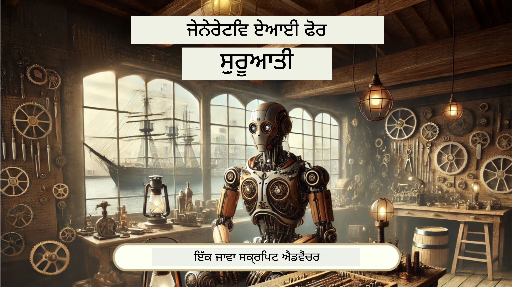
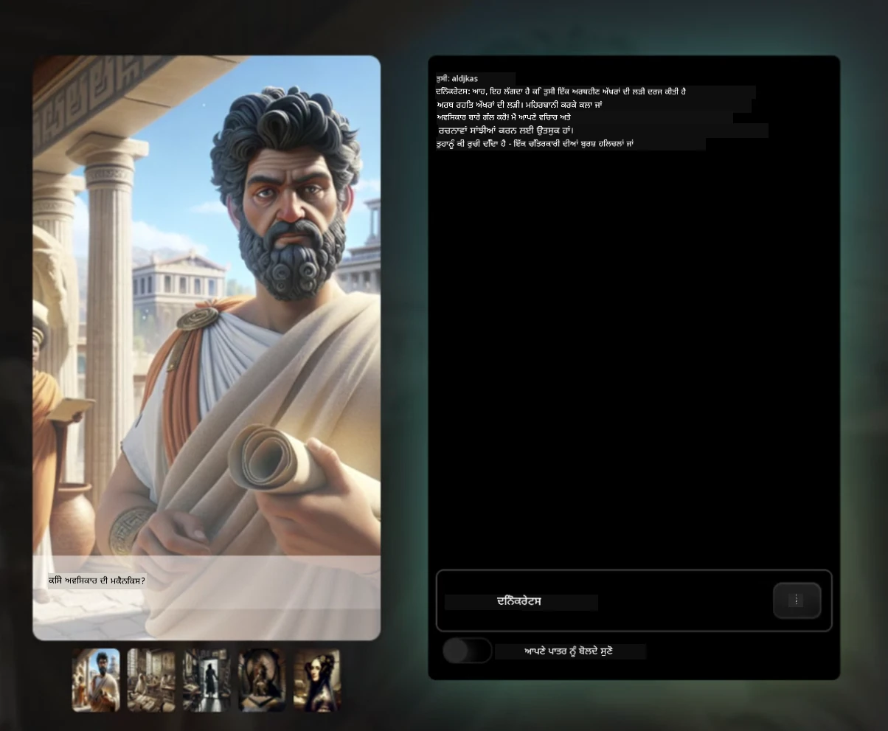
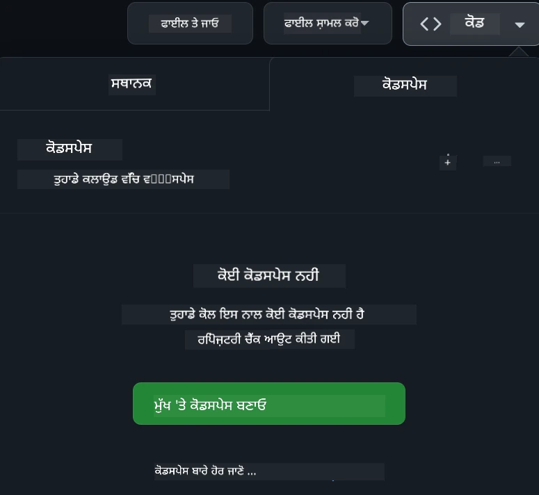

[](https://github.com/microsoft/Web-Dev-For-Beginners/blob/master/LICENSE)
[](https://GitHub.com/microsoft/Web-Dev-For-Beginners/graphs/contributors/)
[](https://GitHub.com/microsoft/Web-Dev-For-Beginners/issues/)
[](https://GitHub.com/microsoft/Web-Dev-For-Beginners/pulls/)
[](http://makeapullrequest.com) 

[](https://GitHub.com/microsoft/Web-Dev-For-Beginners/watchers/)
[](https://GitHub.com/microsoft/Web-Dev-For-Beginners/network/)
[](https://GitHub.com/microsoft/Web-Dev-For-Beginners/stargazers/)

[](https://discord.gg/nTYy5BXMWG)

# ਬਿਗਿਨਰਜ਼ ਲਈ ਵੈੱਬ ਡਿਵੈਲਪਮੈਂਟ - ਇੱਕ ਸਿਲੇਬਸ

ਮਾਇਕ੍ਰੋਸੌਫਟ ਕਲਾਉਡ ਅਡਵੋਕੇਟਸ ਵੱਲੋਂ ਸਾਡੇ 12 ਹਫਤਿਆਂ ਦੇ ਵਿਸਥਾਰਪੂਰਨ ਕੋਰਸ ਨਾਲ ਵੈੱਬ ਡਿਵੈਲਪਮੈਂਟ ਦੇ ਮੂਲ ਸਿਧਾਂਤ ਸਿੱਖੋ। 24 ਪਾਠਾਂ ਵਿੱਚੋਂ ਹਰ ਇੱਕ ਹਥਿਆਰ-ਵਿੱਚ-ਪ੍ਰੋਜੈਕਟਾਂ ਜਿਵੇਂ ਕਿ ਟੈਰੇਰੀਅਮ, ਬ੍ਰਾਊਜ਼ਰ ਵਿਸ਼ਤਾਰ ਅਤੇ ਅੰਤਰਿਕਸ਼ ਖੇਡਾਂ ਰਾਹੀਂ ਜਾਵਾਸਕ੍ਰਿਪਟ, CSS ਅਤੇ HTML ਨੂੰ ਪਰਖਦਾ ਹੈ। ਕਵਿਜ਼, ਚਰਚਾ ਅਤੇ ਪ੍ਰਯੋਗਕਾਰੀ ਕਾਰਜਾਂ ਵਿੱਚ ਸ਼ਾਮਲ ਹੋਵੋ। ਸਾਡੇ ਪ੍ਰਭਾਵਸ਼ਾਲੀ ਪ੍ਰੋਜੈਕਟ-ਅਧਾਰਤ ਪੇਡਾਗੋਜੀ ਨਾਲ ਆਪਣੀਆਂ ਕੌਸ਼ਲਾਂ ਨੂੰ ਬਿਹਤਰ ਬਨਾਓ ਅਤੇ ਆਪਣੀ ਗਿਆਨ ਸਥਾਈਤਾ ਨੂੰ ਸਧਾਰੋ। ਆਪਣੀ ਕੋਡਿੰਗ ਯਾਤਰਾ ਅੱਜ ਹੀ ਸ਼ੁਰੂ ਕਰੋ!

ਐਜ਼ਯੂਰ ਏਆਈ ਫਾਊਂਡਰੀ ਡਿਸਕੋਰਡ ਕਮਿਊਨਿਟੀ ਨਾਲ ਜੁੜੋ

[](https://discord.gg/nTYy5BXMWG)

ਇਹ ਸਾਧਨਾਂ ਦੀ ਵਰਤੋਂ ਸ਼ੁਰੂ ਕਰਨ ਲਈ ਇਹ ਕਦਮ ਫੋਲੋ ਕਰੋ:
1. **ਰਿਪੋਜ਼ਟਰੀ ਫੋਰਕ ਕਰੋ**: [](https://GitHub.com/microsoft/Web-Dev-For-Beginners/fork) ਤੇ ਕਲਿੱਕ ਕਰੋ
2. **ਰਿਪੋਜ਼ਟਰੀ ਕਲੋਨ ਕਰੋ**:   `git clone https://github.com/microsoft/Web-Dev-For-Beginners.git`
3. [**ਐਜ਼ਯੂਰ ਏਆਈ ਫਾਊਂਡਰੀ ਡਿਸਕੋਰਡ ਵਿੱਚ ਸ਼ਾਮਲ ਹੋਵੋ ਅਤੇ ਮਾਹਿਰਾਂ ਅਤੇ ਸਾਥੀ ਡਿਵੈਲਪਰਾਂ ਨਾਲ ਮਿਲੋ**](https://discord.com/invite/ByRwuEEgH4)

### 🌐 ਬਹੁ-ਭਾਸ਼ਾਈ ਸਹਾਇਤਾ

#### GitHub ਐਕਸ਼ਨ ਰਾਹੀਂ ਸਹਾਇਤਾ (ਆਟੋਮੇਟਿਕ ਅਤੇ ਸਦਾ ਅੱਪ-ਟੂ-ਡੇਟ)

<!-- CO-OP TRANSLATOR LANGUAGES TABLE START -->
[Arabic](../ar/README.md) | [Bengali](../bn/README.md) | [Bulgarian](../bg/README.md) | [Burmese (Myanmar)](../my/README.md) | [Chinese (Simplified)](../zh-CN/README.md) | [Chinese (Traditional, Hong Kong)](../zh-HK/README.md) | [Chinese (Traditional, Macau)](../zh-MO/README.md) | [Chinese (Traditional, Taiwan)](../zh-TW/README.md) | [Croatian](../hr/README.md) | [Czech](../cs/README.md) | [Danish](../da/README.md) | [Dutch](../nl/README.md) | [Estonian](../et/README.md) | [Finnish](../fi/README.md) | [French](../fr/README.md) | [German](../de/README.md) | [Greek](../el/README.md) | [Hebrew](../he/README.md) | [Hindi](../hi/README.md) | [Hungarian](../hu/README.md) | [Indonesian](../id/README.md) | [Italian](../it/README.md) | [Japanese](../ja/README.md) | [Kannada](../kn/README.md) | [Khmer](../km/README.md) | [Korean](../ko/README.md) | [Lithuanian](../lt/README.md) | [Malay](../ms/README.md) | [Malayalam](../ml/README.md) | [Marathi](../mr/README.md) | [Nepali](../ne/README.md) | [Nigerian Pidgin](../pcm/README.md) | [Norwegian](../no/README.md) | [Persian (Farsi)](../fa/README.md) | [Polish](../pl/README.md) | [Portuguese (Brazil)](../pt-BR/README.md) | [Portuguese (Portugal)](../pt-PT/README.md) | [Punjabi (Gurmukhi)](./README.md) | [Romanian](../ro/README.md) | [Russian](../ru/README.md) | [Serbian (Cyrillic)](../sr/README.md) | [Slovak](../sk/README.md) | [Slovenian](../sl/README.md) | [Spanish](../es/README.md) | [Swahili](../sw/README.md) | [Swedish](../sv/README.md) | [Tagalog (Filipino)](../tl/README.md) | [Tamil](../ta/README.md) | [Telugu](../te/README.md) | [Thai](../th/README.md) | [Turkish](../tr/README.md) | [Ukrainian](../uk/README.md) | [Urdu](../ur/README.md) | [Vietnamese](../vi/README.md)

> **ਕੀ ਤੁਸੀਂ ਸਥਾਨਕ ਤੌਰ 'ਤੇ ਕਲੋਨ ਕਰਨਾ ਪ੍ਰਾਥਮਿਕ ਕਰਦੇ ਹੋ?**
>
> ਇਸ ਰਿਪੋਜ਼ਟਰੀ ਵਿੱਚ 50+ ਭਾਸ਼ਾਈ ਅਨੁਵਾਦ ਸ਼ਾਮਲ ਹਨ ਜੋ ਡਾਊਨਲੋਡ ਦੇ ਆਕਾਰ ਨੂੰ ਕਾਫੀ ਵਧਾਉਂਦੇ ਹਨ। ਅਨੁਵਾਦਾਂ ਦੇ ਬਿਨਾ ਕਲੋਨ ਕਰਨ ਲਈ, ਸਪਾਰਸ ਚੈਕਆਊਟ ਦੀ ਵਰਤੋਂ ਕਰੋ:
>
> **Bash / macOS / Linux:**
> ```bash
> git clone --filter=blob:none --sparse https://github.com/microsoft/Web-Dev-For-Beginners.git
> cd Web-Dev-For-Beginners
> git sparse-checkout set --no-cone '/*' '!translations' '!translated_images'
> ```
>
> **CMD (Windows):**
> ```cmd
> git clone --filter=blob:none --sparse https://github.com/microsoft/Web-Dev-For-Beginners.git
> cd Web-Dev-For-Beginners
> git sparse-checkout set --no-cone "/*" "!translations" "!translated_images"
> ```
>
> ਇਹ ਤੁਹਾਨੂੰ ਕੋਰਸ ਪੂਰਾ ਕਰਨ ਲਈ ਸਭ ਕੁਝ ਤੇਜ਼ੀ ਨਾਲ ਡਾਊਨਲੋਡ ਕਰਕੇ ਪ੍ਰਦਾਨ ਕਰਦਾ ਹੈ।
<!-- CO-OP TRANSLATOR LANGUAGES TABLE END -->

**ਜੇ ਤੁਸੀਂ ਹੋਰ ਅਨੁਵਾਦ ਭਾਸ਼ਾਵਾਂ ਦੀ ਸਹਾਇਤਾ ਚਾਹੁੰਦੇ ਹੋ ਤਾਂ ਉਹ [ਇੱਥੇ](https://github.com/Azure/co-op-translator/blob/main/getting_started/supported-languages.md) ਦਿੱਤੀ ਗਈ ਹੈ**

[](https://open.vscode.dev/microsoft/Web-Dev-For-Beginners)

#### 🧑‍🎓 _ਕੀ ਤੁਸੀਂ ਵਿਦਿਆਰਥੀ ਹੋ?_

[**ਸਟੂਡੈਂਟ ਹੱਬ ਪੇਜ**](https://docs.microsoft.com/learn/student-hub/?WT.mc_id=academic-77807-sagibbon) ਤੇ ਜਾਓ ਜਿੱਥੇ ਤੁਸੀਂ ਬਿਗਿਨਰ ਰਿਸੋਰਸਜ਼, ਸਟੂਡੈਂਟ ਪੈਕਸ ਅਤੇ ਇੱਕ ਮੁਫ਼ਤ ਸਰਟੀਫਿਕੇਟ ਵਾਊਚਰ ਪ੍ਰਾਪਤ ਕਰਨ ਦੇ ਤਰੀਕੇ ਵੀ ਲੱਭੋਗੇ। ਇਹ ਉਹ ਪੇਜ ਹੈ ਜਿਸਨੂੰ ਤੁਸੀਂ ਆਪਣੇ ਬੁੱਕਮਾਰਕ ਵਿੱਚ ਰੱਖਣਾ ਚਾਹੁੰਦੇ ਹੋ ਅਤੇ ਮਹੀਨਾਵਾਰ ਸਮੱਗਰੀ ਬਦਲਦੇ ਸਮੇਂ ਤੁਹਾਡੇ ਲਈ ਜ਼ਰੂਰੀ ਹੈ।

### 📣 ਐਲਾਨ - ਨਵੇਂ GitHub ਕੋਪਾਇਲਟ ਏਜੰਟ ਮੋਡ ਚੈਲੰਜ ਮੁਕੰਮਲ ਕਰਨ ਲਈ!

ਨਵਾਂ ਚੈਲੰਜ ਜੋੜਿਆ ਗਿਆ ਹੈ, ਬਹੁਤ ਸਾਰੇ ਅਧਿਆਆਾਂ ਵਿੱਚ "GitHub Copilot Agent Challenge 🚀" ਲੱਭੋ। ਇਹ ਤੁਹਾਡੇ ਲਈ GitHub Copilot ਅਤੇ ਏਜੰਟ ਮੋਡ ਦੀ ਵਰਤੋਂ ਕਰਕੇ ਪੂਰਾ ਕਰਨ ਲਈ ਇੱਕ ਨਵਾਂ ਚੈਲੰਜ ਹੈ। ਜੇ ਤੁਸੀਂ ਪਹਿਲਾਂ ਕਦੇ ਏਜੰਟ ਮੋਡ ਦੀ ਵਰਤੋਂ ਨਹੀ ਕਿਤੀ ਤਾਂ ਇਹ ਕੇਵਲ ਲਿਖਤ ਹੀ ਨਹੀਂ ਬਣਾਉਂਦਾ, ਬਲਕਿ ਫਾਈਲਾਂ ਬਣਾਉਣ ਅਤੇ ਸੰਪਾਦਨ, ਕਮਾਂਡ ਚਲਾਉਣ ਅਤੇ ਹੋਰ ਵੀ ਕਰ ਸਕਦਾ ਹੈ।

### 📣 ਐਲਾਨ - _ਜਨਰੇਟਿਵ ਏਆਈ ਦੀ ਵਰਤੋਂ ਕਰਕੇ ਨਵਾਂ ਪ੍ਰੋਜੈਕਟ ਬਣਾਓ_ 

ਨਵਾਂ ਏਆਈ ਅਸਿਸਟੈਂਟ ਪ੍ਰੋਜੈਕਟ ਜੋੜਿਆ ਗਿਆ ਹੈ, ਇਸਨੂੰ ਵੇਖੋ [ਪ੍ਰੋਜੈਕਟ](./9-chat-project/README.md)

### 📣 ਐਲਾਨ - _ਜਨਰੇਟਿਵ ਏਆਈ ਲਈ ਨਵਾਂ ਸਿਲੇਬਸ_ ਜਾਵਾਸਕ੍ਰਿਪਟ ਲਈ ਹੁਣ ਜਾਰੀ ਹੋਇਆ

ਸਾਡੇ ਨਵੇਂ ਜਨਰੇਟਿਵ ਏਆਈ ਸਿਲੇਬਸ ਨੂੰ ਨਾ ਗਵਾਓ!

ਸ਼ੁਰੂ ਕਰਨ ਲਈ ਜਾਓ [https://aka.ms/genai-js-course](https://aka.ms/genai-js-course)!



- ਬੇਸਿਕ ਤੋਂ ਲੈ ਕੇ RAG ਤੱਕ ਸਾਰਿਆਂ ਵਿਸ਼ਿਆਂ ਤੇ ਪਾਠ।
- ਜਨਏਆਈ ਅਤੇ ਸਾਡੇ ਸਾਥੀ ਐਪ ਨਾਲ ਇਤਿਹਾਸਕ ਪ੍ਰਸਿੱਧੀਆਂ ਨਾਲ ਗੱਲਬਾਤ ਕਰੋ।
- ਮਜ਼ੇਦਾਰ ਅਤੇ ਮਨੋਰੰਜਕ ਕਹਾਣੀ, ਤੁਸੀਂ ਸਮੇਂ ਦੀ ਯਾਤਰਾ ਕਰ ਰਹੇ ਹੋ!




ਹਰ ਪਾਠ ਵਿੱਚ ਇੱਕ ਅਸਾਈਨਮੈਂਟ, ਗਿਆਨ ਚੈੱਕ ਅਤੇ ਇੱਕ ਚੈਲੰਜ ਸ਼ਾਮਲ ਹੈ ਜੋ ਤੁਹਾਨੂੰ ਹੇਠਾਂ ਦਿੱਤੇ ਵਿਸ਼ਿਆਂ ਵਿੱਚ ਸਿੱਖਣ ਲਈ ਮਦਦ ਕਰਦਾ ਹੈ:
- ਪ੍ਰਾਂਪਟਿੰਗ ਅਤੇ ਪ੍ਰਾਂਪਟ ਇੰਜੀਨੀਅਰਿੰਗ
- ਲਿਖਤ ਅਤੇ ਚਿੱਤਰ ਐਪ ਬਣਾਉਣਾ
- ਖੋਜ ਐਪ

ਸ਼ੁਰੂ ਕਰਨ ਲਈ ਜਾਓ [https://aka.ms/genai-js-course](https://aka.ms/genai-js-course)!


## 🌱 ਸ਼ੁਰੂਆਤ

> **ਅਧਿਆਪਕ**, ਅਸੀਂ [ਇਸ ਸਿਲੇਬਸ ਦੀ ਵਰਤੋਂ ਦੇ ਤੱਤਾਂ](for-teachers.md) ਦੀ ਸਿਫਾਰਸ਼ ਕੀਤੀ ਹੈ। ਸਾਨੂੰ ਤੁਹਾਡਾ ਫੀਡਬੈਕ [ਸਾਡੇ ਚਰਚਾ ਫੋਰਮ](https://github.com/microsoft/Web-Dev-For-Beginners/discussions/categories/teacher-corner) ਵਿੱਚ ਮਿਲੇਗਾ!

**[ਛਾਤਰ](https://aka.ms/student-page/?WT.mc_id=academic-77807-sagibbon)**, ਹਰ ਪਾਠ ਲਈ, ਪਹਿਲਾਂ ਪ੍ਰੀ-ਲੈਕਚਰ ਕਵਿਜ਼ ਨਾਲ ਸ਼ੁਰੂ ਕਰੋ ਅਤੇ ਫਿਰ ਲੈਕਚਰ ਸਮੱਗਰੀ ਨੂੰ ਪੜ੍ਹੋ, ਵੱਖ-ਵੱਖ ਕਿਰਿਆਸ਼ੀਲਤਾਵਾਂ ਨੂੰ ਪੂਰਾ ਕਰੋ ਅਤੇ ਪੋਸਟ-ਲੈਕਚਰ ਕਵਿਜ਼ ਨਾਲ ਆਪਣੀ ਸਮਝ ਦੀ ਜਾਂਚ ਕਰੋ।

ਆਪਣੇ ਸਿੱਖਣ ਦੇ ਅਨੁਭਵ ਨੂੰ ਵਧਾਉਣ ਲਈ, ਆਪਣੇ ਸਾਥੀਆਂ ਨਾਲ ਪ੍ਰੋਜੈਕਟਾਂ ਉੱਤੇ ਮਿਲ ਕੇ ਕੰਮ ਕਰਨਾ ਸ਼ੁਰੂ ਕਰੋ! ਚਰਚਾ ਸਾਡੇ [ਚਰਚਾ ਫੋਰਮ](https://github.com/microsoft/Web-Dev-For-Beginners/discussions) ਵਿੱਚ ਉਤਸ਼ਾਹਿਤ ਕੀਤੀ ਜਾਂਦੀ ਹੈ ਜਿੱਥੇ ਸਾਡੇ ਮਾਡਰੇਟਰਾਂ ਦੀ ਟੀਮ ਤੁਹਾਡੇ ਪ੍ਰਸ਼ਨਾਂ ਦੇ ਜਵਾਬ ਦੇਣ ਲਈ ਉਪਲਬਧ ਰਹਿੰਦੀ ਹੈ।

ਆਪਣੀ ਸਿੱਖਿਆ ਨੂੰ ਹੋਰ ਅੱਗੇ ਵਧਾਉਣ ਲਈ, ਅਸੀਂ ਸ਼ਿਫਾਰਸ਼ ਕਰਦੇ ਹਾਂ ਕਿ ਤੁਸੀਂ [Microsoft Learn](https://learn.microsoft.com/users/wirelesslife/collections/p1ddcy5jwy0jkm?WT.mc_id=academic-77807-sagibbon) ਵਿੱਚ ਹੋਰ ਅਧਿਐਨ ਸਮੱਗਰੀ ਦੀ ਖੋਜ ਕਰੋ।

### 📋 ਆਪਣਾ ਵਾਤਾਵਰਣ ਸੈੱਟ ਕਰੋ

ਇਸ ਸਿਲੇਬਸ ਲਈ ਵਿਕਾਸ ਦਾ ਵਾਤਾਵਰਣ ਤਿਆਰ ਹੈ! ਜਦੋਂ ਤੁਸੀਂ ਸ਼ੁਰੂ ਕਰ ਰਹੇ ਹੋ ਤਾਂ ਤੁਸੀਂ ਕੋਰਸ ਨੂੰ ਇੱਕ [Codespace](https://github.com/features/codespaces/) (_ਇੱਕ ਬਰਾਊਜ਼ਰ ਆਧਾਰਿਤ, ਕਿਸੇ ਸਥਾਪਨਾ ਦੀ ਲੋੜ ਨਹੀਂ ਵਾਤਾਵਰਣ_) ਵਿੱਚ ਚਲਾ ਸਕਦੇ ਹੋ, ਜਾਂ ਆਪਣੇ ਕੰਪਿਊਟਰ 'ਤੇ ਟੈਕਸਟ ਐਡੀਟਰ ਜਿਵੇਂ [Visual Studio Code](https://code.visualstudio.com/?WT.mc_id=academic-77807-sagibbon) ਨਾਲ ਸਥਾਨਕ ਤੌਰ 'ਤੇ ਚਲਾ ਸਕਦੇ ਹੋ।

#### ਆਪਣੀ ਰਿਪੋਜ਼ਟਰੀ ਬਣਾਓ
ਆਪਣਾ ਕੰਮ ਆਸਾਨੀ ਨਾਲ ਸੇਵ ਕਰਨ ਲਈ, ਸਾਡੇ ਵਲੋਂ ਇਹ ਸੁਝਾਇਆ ਜਾਂਦਾ ਹੈ ਕਿ ਤੁਸੀਂ ਇਸ ਰਿਪੋਜ਼ਟਰੀ ਦੀ ਆਪਣੀ ਨਕਲ ਬਣਾਓ। ਇਹ ਕਰਨ ਲਈ, ਸਫ਼ੇ ਦੇ ਸਿਖਰ ਵਿੱਚ ਮੌਜੂਦ **Use this template** ਬਟਨ ਤੇ ਕਲਿਕ ਕਰੋ। ਇਸ ਨਾਲ ਤੁਹਾਡੇ GitHub ਖਾਤੇ ਵਿੱਚ ਇਸ ਕੋਰਸ ਦੀ ਇੱਕ ਨਕਲ ਵਾਲੀ ਨਵੀਂ ਰਿਪੋਜ਼ਟਰੀ ਬਣ ਜਾਵੇਗੀ।

ਹੇਠਾਂ ਦਿੱਤੇ ਕਦਮਾਂ ਦਾ ਪਾਲਣ ਕਰੋ:
1. **ਰਿਪੋਜ਼ਟਰੀ ਫੋਰਕ ਕਰੋ**: ਇਸ ਪੇਜ ਦੇ ਸੱਜੇ-ਉੱਪਰਲੇ ਕੋਣ 'Fork' ਬਟਨ ਤੇ ਕਲਿਕ ਕਰੋ।
2. **ਰਿਪੋਜ਼ਟਰੀ ਕਲੋਨ ਕਰੋ**:   `git clone https://github.com/microsoft/Web-Dev-For-Beginners.git`

#### ਕੋਡਸਪੇਸ ਵਿੱਚ ਕੋਰਸ ਚਲਾਉਣਾ

ਜੋ ਰਿਪੋਜ਼ਟਰੀ ਤੁਸੀਂ ਬਣਾਈ ਹੈ, ਉਸ ਵਿੱਚ **Code** ਬਟਨ 'ਤੇ ਕਲਿੱਕ ਕਰੋ ਅਤੇ **Open with Codespaces** ਚੁਣੋ। ਇਹ ਤੁਹਾਡੇ ਲਈ ਇੱਕ ਨਵਾਂ Codespace ਬਣਾਏਗਾ।



#### ਆਪਣੇ ਕੰਪਿਊਟਰ ‘ਤੇ ਸਥਾਨਕ ਤੌਰ ‘ਤੇ ਕੋਰਸ ਚਲਾਉਣਾ

ਇਸ ਕੋਰਸ ਨੂੰ ਆਪਣੇ ਕੰਪਿਊਟਰ ‘ਤੇ ਚਲਾਉਣ ਲਈ, ਤੁਹਾਨੂੰ ਇੱਕ ਟੈਕਸਟ ਐਡੀਟਰ, ਇੱਕ ਬਰਾਊਜ਼ਰ ਅਤੇ ਇੱਕ ਕਮਾਂਡ ਲਾਈਨ ਟੂਲ ਦੀ ਲੋੜ ਪਏਗੀ। ਸਾਡਾ ਪਹਿਲਾ ਪਾਠ, [ਟ੍ਰੇਡ ਦੇ ਪ੍ਰੋਗਰਾਮਿੰਗ ਭਾਸ਼ਾਵਾਂ ਅਤੇ ਸੰਦਾਂ ਦਾ ਪਰਿਚਯ](../../1-getting-started-lessons/1-intro-to-programming-languages), ਤੁਹਾਡੇ ਲਈ ਹਰ ਜ਼ਰੂਰੀ ਵਾਪਰ ਅਤੇ ਵਿਕਲਪਾਂ ਨੂੰ ਪਰਤਾਲੇਗਾ ਤਾਂ ਜੋ ਤੁਸੀਂ ਆਪਣੇ ਲਈ ਸਭ ਤੋਂ ਵਧੀਆ ਅਸਲੀ ਟੂਲ ਚੁਣ ਸਕੋ।

ਸਾਡੇ ਸੁਝਾਅ ਹੈ ਕਿ ਤੁਸੀਂ ਆਪਣੇ ਐਡੀਟਰ ਵਜੋਂ [Visual Studio Code](https://code.visualstudio.com/?WT.mc_id=academic-77807-sagibbon) ਦੀ ਵਰਤੋਂ ਕਰੋ, ਜਿਸ ਵਿੱਚ ਇੱਕ ਬਿਲਟ-ਇਨ [ਟਰਮੀਨਲ](https://code.visualstudio.com/docs/terminal/basics/?WT.mc_id=academic-77807-sagibbon) ਵੀ ਹੁੰਦਾ ਹੈ। ਤੁਸੀਂ Visual Studio Code ਨੂੰ ਇਥੇ ਡਾਊਨਲੋਡ ਕਰ ਸਕਦੇ ਹੋ: [https://code.visualstudio.com/?WT.mc_id=academic-77807-sagibbon](https://code.visualstudio.com/?WT.mc_id=academic-77807-sagibbon)।
1. ਆਪਣੀ ਰਿਪੋਜ਼ਟਰੀ ਨੂੰ ਆਪਣੇ ਕੰਪਿਊਟਰ 'ਤੇ ਕਲੋਨ ਕਰੋ। ਤੁਸੀਂ ਇਹ **Code** ਬਟਨ 'ਤੇ ਕਲਿੱਕ ਕਰਕੇ ਅਤੇ URL ਨਕਲ ਕਰਕੇ ਕਰ ਸਕਦੇ ਹੋ:

    [CodeSpace](./images/createcodespace.png)

    ਫਿਰ, [Visual Studio Code](https://code.visualstudio.com/?WT.mc_id=academic-77807-sagibbon) ਵਿੱਚ [Terminal](https://code.visualstudio.com/docs/terminal/basics/?WT.mc_id=academic-77807-sagibbon) ਖੋਲ੍ਹੋ ਅਤੇ ਹੇਠਾਂ ਦਿੱਤਾ ਕਮਾਂਡ ਚਲਾਓ, `<your-repository-url>` ਨੂੰ ਉਸ URL ਨਾਲ ਬਦਲਦੇ ਹੋਏ ਜੋ ਤੁਸੀਂ ਹਾਲ ਹੀ ਵਿੱਚ ਕਾਪੀ ਕੀਤਾ ਹੈ:

    ```bash 
    git clone <your-repository-url>
    ```

2. ਫੋਲਡਰ ਨੂੰ Visual Studio Code ਵਿੱਚ ਖੋਲ੍ਹੋ। ਤੁਸੀਂ ਇਹ **File** > **Open Folder** 'ਤੇ ਕਲਿੱਕ ਕਰਕੇ ਅਤੇ ਜੋ ਫੋਲਡਰ ਤੁਸੀਂ ਕਲੋਨ ਕੀਤਾ ਹੈ, ਉਸਨੂੰ ਚੁਣ ਕੇ ਕਰ ਸਕਦੇ ਹੋ।


>  ਸਿਫਾਰਸ਼ੀ Visual Studio Code ਐਕਸਟੇਂਸ਼ਨ:
>
> * [Live Server](https://marketplace.visualstudio.com/items?itemName=ritwickdey.LiveServer&WT.mc_id=academic-77807-sagibbon) - Visual Studio Code ਵਿੱਚ HTML ਪੇਜ ਦੇਖਣ ਲਈ
> * [Copilot](https://marketplace.visualstudio.com/items?itemName=GitHub.copilot&WT.mc_id=academic-77807-sagibbon) - ਤੁਹਾਨੂੰ ਜ਼ਿਆਦਾ ਤੇਜ਼ੀ ਨਾਲ ਕੋਡ ਲਿਖਣ ਵਿੱਚ ਮਦਦ ਲਈ

## 📂 ਹਰ ਪਾਠ ਵਿੱਚ ਸ਼ਾਮਲ ਹੈ:

- ਵਿਕਲਪਿਕ ਸਕੈਚਨੋਟ
- ਵਿਕਲਪਿਕ ਸਹਾਇਕ ਵੀਡੀਓ
- ਪਾਠ ਤੋਂ ਪਹਿਲਾਂ ਤਿਆਰੀ ਕਵਿਜ਼
- ਲਿਖਿਆ ਹੋਇਆ ਪਾਠ
- ਪ੍ਰੋਜੈਕਟ-ਆਧਾਰਿਤ ਪਾਠਾਂ ਲਈ, ਪ੍ਰੋਜੈਕਟ ਬਣਾਉਣ ਲਈ ਕਦਮ-ਦਰ-कਦਮ ਗਾਈਡਾਂ
- ਗਿਆਨ ਦੀ ਜਾਂਚਾਂ
- ਇੱਕ ਚੁਣੌਤੀ
- ਸਹਾਇਕ ਪੜ੍ਹਾਈ
- ਅਸਾਈਨਮੈਂਟ
- [ਪਾਠ ਬਾਅਦ ਵਾਲਾ ਕਵਿਜ਼](https://ff-quizzes.netlify.app/web/)

> **ਕਵਿਜ਼ ਬਾਰੇ ਇੱਕ ਨੋਟ**: ਸਾਰੇ ਕਵਿਜ਼ Quiz-app ਫੋਲਡਰ ਵਿੱਚ ਹਨ, ਕੁੱਲ 48 ਕਵਿਜ਼ ਤਿੰਨ ਸਵਾਲਾਂ ਦੇ ਹਨ। ਉਹ ਇੱਥੇ ਉਪਲਬਧ ਹਨ [ਇੱਥੇ](https://ff-quizzes.netlify.app/web/)। ਕਵਿਜ਼ ਐਪ ਨੂੰ ਲੋਕਲ ਚਲਾਇਆ ਜਾ ਸਕਦਾ ਹੈ ਜਾਂ ਐਜ਼ੂਰ 'ਤੇ ਡਿਪਲੌਯ ਕੀਤਾ ਜਾ ਸਕਦਾ ਹੈ; `quiz-app` ਫੋਲਡਰ ਵਿੱਚ ਦੀਆਂ ਹਦਾਇਤਾਂ ਨੂੰ ਫਾਲੋ ਕਰੋ।

## 🗃️ ਪਾਠ

|     |                       ਪ੍ਰੋਜੈਕਟ ਦਾ ਨਾਮ                       |                            ਸਿੱਖਾਏ ਗਏ ਸਿਧਾਂਤ                             | ਸਿੱਖਣ ਦੇ ਉਦੇਸ਼                                                                                                                 |                                                         ਲਿੰਕ ਕੀਤਾ ਪਾਠ                                                          |         ਲੇਖਕ            |
| :-: | :------------------------------------------------------: | :--------------------------------------------------------------------: | ----------------------------------------------------------------------------------------------------------------------------------- | :----------------------------------------------------------------------------------------------------------------------------: | :---------------------: |
| 01  |                     ਸ਼ੁਰੂਆਤ ਕਰਨਾ                      |           ਪ੍ਰੋਗ੍ਰਾਮਿੰਗ ਅਤੇ ਟੂਲਜ਼ ਦਾ ਪਰਿਚય           | ਜ਼ਿਆਦਾਤਰ ਪ੍ਰੋਗ੍ਰਾਮਿੰਗ ਭਾਸ਼ਾਵਾਂ ਦੇ ਮੂਲ ਸਿਧਾਂਤ ਅਤੇ ਉਹ ਸਾਫਟਵੇਅਰ ਜਿਸ ਨਾਲ ਪੇਸ਼ੇਵਰ ਡਿਵੈਲਪਰ ਆਪਣਾ ਕੰਮ ਕਰਦੇ ਹਨ ਨੂੰ ਸਮਝੋ | [Intro to Programming Languages and Tools of the Trade](./1-getting-started-lessons/1-intro-to-programming-languages/README.md) |         Jasmine         |
| 02  |                     ਸ਼ੁਰੂਆਤ ਕਰਨਾ                      |             GitHub ਦੇ ਬੁਨਿਆਦੀ, ਟੀਮ ਨਾਲ ਕੰਮ ਕਰਨ ਸਮੇਤ             | ਆਪਣੇ ਪ੍ਰੋਜੈਕਟ ਵਿੱਚ GitHub ਦੀ ਵਰਤੋਂ ਕਿਵੇਂ ਕਰਨੀ ਹੈ, ਇੱਕ ਕੋਡ ਆਧਾਰ 'ਤੇ ਦੂਜਿਆਂ ਨਾਲ ਸਹਿਯੋਗ ਕਿਵੇਂ ਕਰਨਾ ਹੈ                                                    |                            [Intro to GitHub](./1-getting-started-lessons/2-github-basics/README.md)                             |          Floor          |
| 03  |                     ਸ਼ੁਰੂਆਤ ਕਰਨਾ                      |                             ਐਕਸੈੱਸਬਿਲਿਟੀ                              | ਵੈੱਬ ਐਕਸੈੱਸਬਿਲਿਟੀ ਦੇ ਮੂਢ ਸਿੱਧਾਂਤ ਸਿੱਖੋ                                                                                               |                       [Accessibility Fundamentals](./1-getting-started-lessons/3-accessibility/README.md)                       |       Christopher       |
| 04  |                        JS ਬੁਨਿਆਦੀ                         |                         ਜਾਵਾਸਕ੍ਰਿਪਟ ਡਾਟਾ ਟਾਈਪ                          | ਜਾਵਾਸਕ੍ਰਿਪਟ ਡਾਟਾ ਟਾਈਪ ਦੇ ਬੁਨਿਆਦੀ                                                                                                 |                                       [Data Types](./2-js-basics/1-data-types/README.md)                                        |         Jasmine         |
| 05  |                        JS ਬੁਨਿਆਦੀ                         |                         ਫੰਕਸ਼ਨ ਅਤੇ ਮੈਥਡ                          | ਐਪਲੀਕੇਸ਼ਨ ਦੀ ਲੌਜਿਕ ਫਲੋ ਨੂੰ ਪ੍ਰਬੰਧਿਤ ਕਰਨ ਲਈ ਫੰਕਸ਼ਨ ਅਤੇ ਮੈਥਡ ਬਾਰੇ ਸਿੱਖੋ                                                             |                              [Functions and Methods](./2-js-basics/2-functions-methods/README.md)                               | Jasmine ਅਤੇ Christopher |
| 06  |                        JS ਬੁਨਿਆਦੀ                         |                        JS ਨਾਲ ਫੈਸਲੇ ਲੈਣਾ                        | ਫੈਸਲੇ ਲੈਣ ਦੇ ਤਰੀਕੇ ਵਰਤ ਕੇ ਆਪਣੇ ਕੋਡ ਵਿੱਚ ਸ਼ਰਤਾਂ ਕਿਵੇਂ ਬਣਾਉਣੀਆਂ ਹਨ ਸਿੱਖੋ                                                           |                                 [Making Decisions](./2-js-basics/3-making-decisions/README.md)                                  |         Jasmine         |
| 07  |                        JS ਬੁਨਿਆਦੀ                         |                            ਐਰੇ ਅਤੇ ਲੂਪ                            | ਜਾਵਾਸਕ੍ਰਿਪਟ ਵਿੱਚ ਐਰੇ ਅਤੇ ਲੂਪ ਦੀ ਵਰਤੋਂ ਕਰਕੇ ਡਾਟਾ ਨਾਲ ਕੰਮ ਕਰੋ                                                                                 |                                   [Arrays and Loops](./2-js-basics/4-arrays-loops/README.md)                                    |         Jasmine         |
| 08  |       [Terrarium](./3-terrarium/solution/README.md)       |                            HTML ਅਮਲੀਅਤ ਵਿੱਚ                            | ਇੱਕ ਔਨਲਾਈਨ ਟੇਰੀਰੀਅਮ ਬਣਾਉਣ ਲਈ HTML ਤਿਆਰ ਕਰੋ, ਖਾਸ ਤੌਰ 'ਤੇ ਲੇਆਉਟ 'ਤੇ ਧਿਆਨ ਕੇਂਦ੍ਰਿਤ ਕਰਕੇ                                                         |                                 [Introduction to HTML](./3-terrarium/1-intro-to-html/README.md)                                 |           Jen           |
| 09  |       [Terrarium](./3-terrarium/solution/README.md)       |                            CSS ਅਮਲੀਅਤ ਵਿੱਚ                             | ਔਨਲਾਈਨ ਟੇਰੀਰੀਅਮ ਨੂੰ ਸਜਾਉਣ ਲਈ CSS ਤਿਆਰ ਕਰੋ, CSS ਦੇ ਮੁਢਲੀ ਅਸਲੀਅਤ ਸਮੇਤ ਪੰਨਾ ਰਿਸਪਾਂਸਿਵ ਬਣਾਉਣ 'ਤੇ ਧਿਆਨ ਕੇਂਦ੍ਰਿਤ ਕਰਕੇ                     |                                  [Introduction to CSS](./3-terrarium/2-intro-to-css/README.md)                                  |           Jen           |
| 10  |            [Terrarium](./3-terrarium/solution/README.md)            |                 ਜਾਵਾਸਕ੍ਰਿਪਟ ਕਲੋਜ਼ਰ, DOM ਪਰਬੰਧਨ                  | ਟੇਰੀਰੀਅਮ ਨੂੰ ਡਰੈਗ/ਡ੍ਰਾਪ ਇੰਟਰਫੇਸ ਵਜੋਂ ਕੰਮ ਕਰਨ ਲਈ ਜਾਵਾਸਕ੍ਰਿਪਟ ਬਣਾਓ, ਕਲੋਜ਼ਰ ਅਤੇ DOM ਪਰਬੰਧਨ 'ਤੇ ਧਿਆਨ ਕੇਂਦ੍ਰਿਤ ਕਰਕੇ             |                  [JavaScript Closures, DOM manipulation](./3-terrarium/3-intro-to-DOM-and-closures/README.md)                   |           Jen           |
| 11  |          [Typing Game](./4-typing-game/solution/README.md)          |                          ਟਾਈਪਿੰਗ ਗੇਮ ਬਣਾਉਣਾ                           | ਕੀਬੋਰਡ ਇਵੈਂਟ ਦੀ ਵਰਤੋਂ ਕਰਕੇ ਆਪਣੀ ਜਾਵਾਸਕ੍ਰਿਪਟ ਐਪ ਦੀ ਲਾਜਿਕ ਚਲਾਉਣਾ ਸਿੱਖੋ                                                          |                                [Event-Driven Programming](./4-typing-game/typing-game/README.md)                                |       Christopher       |
| 12  | [Green Browser Extension](./5-browser-extension/solution/README.md) |                         ਬਰਾਊਜ਼ਰਾਂ ਨਾਲ ਕੰਮ ਕਰਨਾ                          | ਬਰਾਊਜ਼ਰ ਕਿਵੇਂ ਕੰਮ ਕਰਦੇ ਹਨ, ਉਹਨਾਂ ਦਾ ਇਤਿਹਾਸ, ਅਤੇ ਇੱਕ ਬਰਾਊਜ਼ਰ ਵਿਸਥਾਰ ਦੇ ਪਹਿਲੇ ਤੱਤਾਂ ਨੂੰ ਕਿਵੇਂ ਤਿਆਰ ਕਰਨਾ ਸਿੱਖੋ                               |                               [About Browsers](./5-browser-extension/1-about-browsers/README.md)                                |           Jen           |
| 13  | [Green Browser Extension](./5-browser-extension/solution/README.md) | ਫਾਰਮ ਬਣਾਉਣਾ, API ਕਾਲ ਕਰਨਾ ਅਤੇ ਲੋਕਲ ਸਟੋਰੇਜ ਵਿੱਚ ਵੇਰੀਏਬਲ ਸੰਭਾਲਣਾ | ਆਪਣੇ ਬਰਾਊਜ਼ਰ ਵਿਸਥਾਰ ਦੇ ਜਾਵਾਸਕ੍ਰਿਪਟ ਤੱਤ ਬਣਾਓ ਅਤੇ ਲੋਕਲ ਸਟੋਰੇਜ਼ ਵਿੱਚ ਸੰਭਾਲੇ ਵੇਰੀਏਬਲ ਦੀ ਵਰਤੋਂ ਕਰਕੇ API ਕਾਲ ਕਰੋ                      |                [APIs, Forms, and Local Storage](./5-browser-extension/2-forms-browsers-local-storage/README.md)                 |           Jen           |
| 14  | [Green Browser Extension](./5-browser-extension/solution/README.md) |          ਬਰਾਊਜ਼ਰ ਦੀ ਪਿਛੋਕੜ ਦੀ ਪ੍ਰਕਿਰਿਆਵਾਂ, ਵੈੱਬ ਪ੍ਰਦਰਸ਼ਨ          | ਵਰਸਤਾਰ ਦੇ ਆਈਕਨ ਨੂੰ ਪ੍ਰਬੰਧਿਤ ਕਰਨ ਲਈ ਬਰਾਊਜ਼ਰ ਦੀ ਪਿਛੋਕੜ ਦੀ ਪ੍ਰਕਿਰਿਆਵਾਂ ਦੀ ਵਰਤੋਂ ਕਰੋ; ਵੈੱਬ ਪ੍ਰਦਰਸ਼ਨ ਬਾਰੇ ਜਾਣੋ ਅਤੇ ਕੁਝOptਮਾਈਜ਼ੇਸ਼ਨ ਬਾਰੇ ਵੀ ਸਿੱਖੋ   |             [Background Tasks and Performance](./5-browser-extension/3-background-tasks-and-performance/README.md)              |           Jen           |
| 15  |           [Space Game](./6-space-game/solution/README.md)           |             ਜਾਵਾਸਕ੍ਰਿਪਟ ਨਾਲ ਹੋਰ ਉੱਚ ਪੱਧਰ ਦਾ ਗੇਮ ਵਿਕਾਸ             | ਇਨਹੈਰੀਟੈਂਸ ਬਾਰੇ ਜਾਣੋ ਜੋ ਕਲਾਸਾਂ ਅਤੇ ਕੰਪੋਜ਼ੀਸ਼ਨ ਨਾਲ ਵਰਤੀ ਜਾਂਦੀ ਹੈ ਅਤੇ ਪਬ/ਸਬ ਪੈਟਰਨ, ਗੇਮ ਬਣਾਉਣ ਦੀ ਤਿਆਰੀ ਲਈ              |                      [Introduction to Advanced Game Development](./6-space-game/1-introduction/README.md)                       |          Chris          |
| 16  |           [Space Game](./6-space-game/solution/README.md)           |                           ਕੈਨਵਸ 'ਤੇ ਡ੍ਰਾਇਇੰਗ                            | ਕੈਨਵਸ API ਬਾਰੇ ਜਾਣੋ, ਜੋ ਸਕ੍ਰੀਨ 'ਤੇ ਤੱਤਾਂ ਨੂੰ ਡ੍ਰਾਇ ਕਰਦਾ ਹੈ                                                                       |                                [Drawing to Canvas](./6-space-game/2-drawing-to-canvas/README.md)                                |          Chris          |
| 17  |           [Space Game](./6-space-game/solution/README.md)           |                   ਸਕ੍ਰੀਨ ਦੇ ਆਲੇ-ਦੁਆਲੇ ਤੱਤਾਂ ਨੂੰ ਹਿਲਾਉਣਾ                    | ਦਿਖੋ ਕਿ ਤੱਤ Cartesian ਕੋਆਰਡੀਨੇਟ ਅਤੇ ਕੈਨਵਸ API ਦੀ ਵਰਤੋਂ ਕਰਕੇ ਕਿਵੇਂ ਮੋਸ਼ਨ ਪ੍ਰਾਪਤ ਕਰ ਸਕਦੇ ਹਨ                                            |                           [Moving Elements Around](./6-space-game/3-moving-elements-around/README.md)                           |          Chris          |
| 18  |           [Space Game](./6-space-game/solution/README.md)           |                          ਟਕਰਾਅ ਦੀ ਪਛਾਣ                           | ਤੱਤਾਂ ਨੂੰ ਇੱਕ-ਦੂਜੇ ਨਾਲ ਟਕਰਾਉਣ ਅਤੇ ਪ੍ਰਤੀਕਿਰਿਆ ਕਰਨ ਲਈ ਕੀ-ਪ੍ਰੈੱਸ ਦੀ ਵਰਤੋਂ ਕਰੋ ਅਤੇ ਇੱਕ ਕੂਲਡਾਊਨ ਫੰਕਸ਼ਨ ਪ੍ਰਦਾਨ ਕਰੋ ਤਾਂ ਜੋ ਗੇਮ ਦੀ ਕਾਰਗੁਜ਼ਾਰੀ ਯਕੀਨੀ ਹੋ ਜਾਵੇ    |                              [Collision Detection](./6-space-game/4-collision-detection/README.md)                              |          Chris          |
| 19  |           [Space Game](./6-space-game/solution/README.md)           |                             ਸਕੋਰ ਰੱਖਣਾ                              | ਗੇਮ ਦੀ ਸਥਿਤੀ ਅਤੇ ਕਾਰਗੁਜ਼ਾਰੀ ਦੇ ਆਧਾਰ 'ਤੇ ਗਣਿਤ ਮੁਕੰਮਲ ਕਰੋ                                                                |                                    [Keeping Score](./6-space-game/5-keeping-score/README.md)                                    |          Chris          |
| 20  |           [Space Game](./6-space-game/solution/README.md)           |                     ਗੇਮ ਦਾ ਅੰਤ ਅਤੇ ਮੁੜ ਸ਼ੁਰੂ ਕਰਨਾ                     | ਗੇਮ ਖਤਮ ਕਰਨ ਅਤੇ ਮੁੜ ਸ਼ੁਰੂ ਕਰਨ ਬਾਰੇ ਸਿੱਖੋ, ਜਿਸ ਵਿੱਚ ਅਧਾਰਸ਼ਾਂ ਸਾਫ਼ ਕਰਨਾ ਅਤੇ ਵੇਰੀਏਬਲ ਮੁੱਲ ਰੀਸੈੱਟ ਕਰਨਾ ਸ਼ਾਮਲ ਹੈ                              |                                [The Ending Condition](./6-space-game/6-end-condition/README.md)                                 |          Chris          |
| 21  |         [Banking App](./7-bank-project/solution/README.md)          |                 ਵੈੱਬ ਐਪ ਵਿੱਚ HTML ਟੈਂਪਲੇਟ ਅਤੇ ਰੂਟਸ                 | ਰੂਟਿੰਗ ਅਤੇ HTML ਟੈਂਪਲੇਟ ਦੀ ਵਰਤੋਂ ਕਰਕੇ ਬਹੁ-ਪੰਨਾ ਵੈੱਬਸਾਈਟ ਦੀ ਢਾਂਚਾ ਬਣਾਉਣਾ ਸਿੱਖੋ                             |                            [HTML Templates and Routes](./7-bank-project/1-template-route/README.md)                             |          Yohan          |
| 22  |         [Banking App](./7-bank-project/solution/README.md)          |                  ਲਾਗਇਨ ਅਤੇ ਰਜਿਸਟ੍ਰੇਸ਼ਨ ਫਾਰਮ ਬਣਾਉਣਾ                   | ਫਾਰਮ ਬਣਾਉਣ ਅਤੇ ਵੈਧਤਾ ਚਲਾਉਣ ਬਾਰੇ ਸਿੱਖੋ                                                                          |                                           [Forms](./7-bank-project/2-forms/README.md)                                           |          Yohan          |
| 23  |         [Banking App](./7-bank-project/solution/README.md)          |                   ਡਾਟਾ ਲੈਣ ਅਤੇ ਵਰਤਣ ਦੇ ਤਰੀਕੇ                   | ਤੁਹਾਡੇ ਐਪ ਵਿੱਚ ਡਾਟਾ ਕਿਵੇਂ ਆਉਂਦਾ ਅਤੇ ਜਾਂਦਾ ਹੈ, ਇਸਨੂੰ ਕਿਵੇਂ ਪ੍ਰਾਪਤ ਕਰਨਾ, ਸਟੋਰ ਕਰਨਾ ਅਤੇ ਖਤਮ ਕਰਨਾ ਸਿੱਖੋ                                                 |                                            [Data](./7-bank-project/3-data/README.md)                                            |          Yohan          |
| 24  |         [Banking App](./7-bank-project/solution/README.md)          |                      ਸਟੇਟ ਪ੍ਰਬੰਧਨ ਦੇ ਸਿਧਾਂਤ                      | ਜਾਣੋ ਕਿ ਤੁਹਾਡਾ ਐਪ ਸਟੇਟ ਨੂੰ ਕਿਵੇਂ ਰੱਖਦਾ ਹੈ ਅਤੇ ਪ੍ਰੋਗਰਾਮਾਤਮਕ ਤੌਰ 'ਤੇ ਇਸਦਾ ਪ੍ਰਬੰਧਨ ਕਿਵੇਂ ਕਰਨਾ ਹੈ                                                              |                                [State Management](./7-bank-project/4-state-management/README.md)                                |          Yohan          |
| 25 | [Browser/VScode Code](../../8-code-editor) | VScode ਨਾਲ ਕੰਮ ਕਰਨਾ | ਜਾਣੋ ਕਿਵੇਂ ਇੱਕ ਕੋਡ ਐਡੀਟਰ ਦੀ ਵਰਤੋਂ ਕਰਨੀ ਹੈ | [Use VScode Code Editor](./8-code-editor/1-using-a-code-editor/README.md) | Chris |
| 26 | [AI Assistants](./9-chat-project/README.md) | AI ਨਾਲ ਕੰਮ ਕਰਨਾ | ਆਪਣਾ ਖੁਦ ਦਾ AI ਸਹਾਇਕ ਬਣਾਉਣਾ ਸਿੱਖੋ | [AI Assistant project](./9-chat-project/README.md) | Chris |

## 🏫 ਪੈਡਾਗੋਜੀ

ਸਾਡੇ ਕੋਰਸ ਨੂੰ ਦੋ ਮੁੱਖ ਪੈਡਾਗੋਜੀਕਲ ਸਿਧਾਂਤਾਂ ਦੇ ਧਿਆਨ ਨਾਲ ਤਿਆਰ ਕੀਤਾ ਗਿਆ ਹੈ:
* ਪ੍ਰੋਜੈਕਟ-ਆਧਾਰਿਤ ਸਿੱਖਿਆ
* ਬਾਰੰਬਾਰ ਕਵਿਜ਼

ਇਹ ਕਾਰਜਕ੍ਰਮ ਜਾਵਾਸਕ੍ਰਿਪਟ, HTML, ਅਤੇ CSS ਦੇ ਮੂਲ ਤੱਤ ਅਤੇ ਅੱਜ ਦੇ ਵੈੱਬ ਡਿਵੈਲਪਰਾਂ ਵੱਲੋਂ ਇਸਤੇਮਾਲ ਹੋਣ ਵਾਲੇ ਤਾਜ਼ਾ ਟੂਲ ਅਤੇ ਤਕਨੀਕਾਂ ਸਿੱਖਾਉਂਦਾ ਹੈ। ਵਿਦਿਆਰਥੀਆਂ ਨੂੰ ਹੱਥ-ਮੇਂਹਦੇ ਤਜਰਬਾ ਪ੍ਰਾਪਤ ਕਰਨ ਦਾ ਮੌਕਾ ਮਿਲੇਗਾ, ਜਿਸ ਵਿੱਚ ਇਕ ਟਾਈਪਿੰਗ ਗੇਮ, ਵਰਚੁਅਲ ਟੇਰੀਰੀਅਮ, ਪਰਿਵਾਰਕ ਬਰਾਊਜ਼ਰ ਵਿਸਥਾਰ, ਸਪੇਸ-ਇਨਵੇਡਰ-ਸਟੀਲ ਗੇਮ, ਅਤੇ ਵਿਅਵਸਾਈਆਂ ਲਈ ਬੈਂਕਿੰਗ ਐਪ ਤਿਆਰ ਕਰਨਾ ਸ਼ਾਮਲ ਹੈ। ਸਿਰੀਜ਼ ਦੇ ਅੰਤ ਤੱਕ, ਵਿਦਿਆਰਥੀ ਵੈੱਬ ਵਿਕਾਸ ਬਾਰੇ ਪੱਕੀ ਸਮਝ ਪ੍ਰਾਪਤ ਕਰ ਚੁੱਕਣਗੇ।

> 🎓 ਤੁਸੀਂ ਇਸ ਕੋਰਸ ਦੇ ਪਹਿਲੇ ਕੁਝ ਪਾਠਾਂ ਨੂੰ Microsoft Learn 'ਤੇ [Learn Path](https://docs.microsoft.com/learn/paths/web-development-101/?WT.mc_id=academic-77807-sagibbon) ਵਜੋਂ ਵੀ ਲੈ ਸਕਦੇ ਹੋ!

ਜਦੋਂ ਸਮੱਗਰੀ ਪ੍ਰੋਜੈਕਟਾਂ ਨਾਲ ਸੰਗਤ ਹੁੰਦੀ ਹੈ, ਤਦ ਪ੍ਰਕਿਰਿਆ ਵਿਦਿਆਰਥੀਆਂ ਲਈ ਹੋਰ ਰੁਚਿਕਰ ਬਣਦੀ ਹੈ ਅਤੇ ਸਿਧਾਂਤਾਂ ਦਾ ਧਿਆਨ ਜ਼ਿਆਦਾ ਸਮੇਂ ਤੱਕ ਰਹਿੰਦਾ ਹੈ। ਅਸੀਂ ਜਾਵਾਸਕ੍ਰਿਪਟ ਦੇ ਬੁਨਿਆਦੀ ਪਾਠਾਂ ਦੀਆਂ ਕਈ ਸ਼ੁਰੂਆਤੀ ਪਾਠਾਂ ਲਿਖੀਆਂ ਹਨ, ਜੋ ਕੁਝ ਵੀਡੀਓਜ਼ "[Beginners Series to: JavaScript](https://channel9.msdn.com/Series/Beginners-Series-to-JavaScript/?WT.mc_id=academic-77807-sagibbon)" ਤੋਂ ਮਿਲ ਕੇ ਸਿੱਖਦੇ ਹਨ, ਜਿਨ੍ਹਾਂ ਦੇ ਲੇਖਕਾਂ ਨੇ ਇਸ ਕੋਰਸ ਵਿੱਚ ਯੋਗਦਾਨ ਦਿੱਤਾ ਹੈ।

ਇਸ ਤੋਂ ਇਲਾਵਾ, ਕਲਾਸ ਤੋਂ ਪਹਿਲਾਂ ਇੱਕ ਘੱਟ-ਦਬਾਅ ਵਾਲਾ ਕਵਿਜ਼ ਵਿਦਿਆਰਥੀ ਦੇ ਸਿੱਖਣ ਦਾ ਮਕਸਦ ਸੈਟ ਕਰਦਾ ਹੈ, ਜਦਕਿ ਕਲਾਸ ਤੋਂ ਬਾਅਦ ਦੂਜਾ ਕਵਿਜ਼ ਹੋਰ ਕਨਸੈਪਟਾਂ ਦੀ ਸਮਝ ਯਕੀਨੀ ਬਣਾਉਂਦਾ ਹੈ। ਇਹ ਕੋਰਸ ਲਚਕੀਲਾ ਅਤੇ ਮਨੋਰੰਜਕ ਬਣਾਉਣ ਲਈ ਬਣਾਇਆ ਗਿਆ ਹੈ ਅਤੇ ਇਸਨੂੰ ਪੂਰਾ ਜਾਂ ਹਿੱਸਾ-ਹਿੱਸਾ ਲਿਆ ਜਾ ਸਕਦਾ ਹੈ। ਪ੍ਰੋਜੈਕਟ ਛੋਟੇ ਸ਼ੁਰੂ ਹੁੰਦੇ ਹਨ ਅਤੇ 12 ਹਫਤਿਆਂ ਦੇ ਚੱਕਰ ਦੇ ਅੰਤ ਤੱਕ ਵੱਧ ਸਖ਼ਤ ਹੋ ਜਾਂਦੇ ਹਨ।

ਜਦ ਕਿ ਅਸੀਂ ਜਾਵਾਸਕ੍ਰਿਪਟ ਫਰੇਮਵਰਕਾਂ ਨੂੰ ਜਾਣ-ਬੁਝ ਕੇ ਇਸ ਕੋਰਸ ਵਿੱਚ ਸ਼ਾਮਲ ਨਹੀਂ ਕੀਤਾ ਤਾਕਿ ਇੱਕ ਵੈੱਬ ਡਿਵੈਲਪਰ ਲਈ ਬੁਨਿਆਦੀ ਕੌਸ਼ਲਾਂ ਉੱਤੇ ਧਿਆਨ ਦਿੱਤਾ ਜਾ ਸਕੇ, ਇਸ ਕੋਰਸ ਨੂੰ ਪੂਰਾ ਕਰਨ ਦਾ ਅਗਲਾ ਵਧੀਆ ਕਦਮ ਹੋਵੇਗਾ Node.js ਬਾਰੇ ਹੋਰ ਵੀਡੀਓਜ਼ ਦੀ ਕਲੈਕਸ਼ਨ "[Beginner Series to: Node.js](https://channel9.msdn.com/Series/Beginners-Series-to-Nodejs/?WT.mc_id=academic-77807-sagibbon)" ਤੋਂ ਸਿੱਖਣਾ।

> ਸਾਡੇ [Code of Conduct](CODE_OF_CONDUCT.md) ਅਤੇ [Contributing](CONTRIBUTING.md) ਨਿਦੇਸ਼ਾਂ ਨੂੰ ਜ਼ਰੂਰ ਵੇਖੋ। ਅਸੀਂ ਤੁਹਾਡੇ ਸਰਗਰਮ ਸੁਝਾਵਾਂ ਦਾ ਸਵਾਗਤ ਕਰਦੇ ਹਾਂ!


## 🧭 ਆਫਲਾਈਨ ਪਹੁੰਚ

ਤੁਸੀਂ [Docsify](https://docsify.js.org/#/) ਦੀ ਵਰਤੋਂ ਕਰਕੇ ਇਸ ਡੌਕਯੂਮੈਂਟੇਸ਼ਨ ਨੂੰ ਆਫਲਾਈਨ ਚਲਾ ਸਕਦੇ ਹੋ। ਇਸ ਰਿਪੋ ਨੂੰ ਫੋਰਕ ਕਰੋ, [Docsify ਇੰਸਟਾਲ ਕਰੋ](https://docsify.js.org/#/quickstart) ਆਪਣੇ ਲੋਕਲ ਮਸ਼ੀਨ 'ਤੇ, ਅਤੇ ਫਿਰ ਇਸ ਰਿਪੋ ਦੇ ਰੂਟ ਫੋਲਡਰ ਵਿੱਚ `docsify serve` ਲਿਖੋ। ਵੈੱਬਸਾਈਟ ਤੁਹਾਡੇ ਲੋਕਲਸਰਵਰ 'ਤੇ ਪੋਰਟ 3000 'ਤੇ ਚਲੇਗੀ: `localhost:3000`।

## 📘 PDF
ਸਾਰੇ ਪਾਠਾਂ ਦੀ PDF ਤੁਸੀਂ [ਇਥੇ](https://microsoft.github.io/Web-Dev-For-Beginners/pdf/readme.pdf) ਲੱਭ ਸਕਦੇ ਹੋ।


## 🎒 ਹੋਰ ਕੋਰਸ

ਸਾਡੀ ਟੀਮ ਹੋਰ ਕੋਰਸ ਵੀ ਬਣਾਉਂਦੀ ਹੈ! ਚੈੱਕ ਕਰੋ:

<!-- CO-OP TRANSLATOR OTHER COURSES START -->
### LangChain
[](https://aka.ms/langchain4j-for-beginners)
[](https://aka.ms/langchainjs-for-beginners?WT.mc_id=m365-94501-dwahlin)
[](https://github.com/microsoft/langchain-for-beginners?WT.mc_id=m365-94501-dwahlin)
---

### Azure / Edge / MCP / Agents
[](https://github.com/microsoft/AZD-for-beginners?WT.mc_id=academic-105485-koreyst)
[](https://github.com/microsoft/edgeai-for-beginners?WT.mc_id=academic-105485-koreyst)
[](https://github.com/microsoft/mcp-for-beginners?WT.mc_id=academic-105485-koreyst)
[](https://github.com/microsoft/ai-agents-for-beginners?WT.mc_id=academic-105485-koreyst)

---
 
### Generative AI Series
[](https://github.com/microsoft/generative-ai-for-beginners?WT.mc_id=academic-105485-koreyst)
[-9333EA?style=for-the-badge&labelColor=E5E7EB&color=9333EA)](https://github.com/microsoft/Generative-AI-for-beginners-dotnet?WT.mc_id=academic-105485-koreyst)
[-C084FC?style=for-the-badge&labelColor=E5E7EB&color=C084FC)](https://github.com/microsoft/generative-ai-for-beginners-java?WT.mc_id=academic-105485-koreyst)
[-E879F9?style=for-the-badge&labelColor=E5E7EB&color=E879F9)](https://github.com/microsoft/generative-ai-with-javascript?WT.mc_id=academic-105485-koreyst)

---
 
### ਕੋਰ ਸਿੱਖਿਆ
[](https://aka.ms/ml-beginners?WT.mc_id=academic-105485-koreyst)
[](https://aka.ms/datascience-beginners?WT.mc_id=academic-105485-koreyst)
[](https://aka.ms/ai-beginners?WT.mc_id=academic-105485-koreyst)
[](https://github.com/microsoft/Security-101?WT.mc_id=academic-96948-sayoung)
[](https://aka.ms/webdev-beginners?WT.mc_id=academic-105485-koreyst)
[](https://aka.ms/iot-beginners?WT.mc_id=academic-105485-koreyst)
[](https://github.com/microsoft/xr-development-for-beginners?WT.mc_id=academic-105485-koreyst)

---
 
### ਕੋਪਾਇਲਟ ਸੀਰੀਜ਼
[](https://aka.ms/GitHubCopilotAI?WT.mc_id=academic-105485-koreyst)
[](https://github.com/microsoft/mastering-github-copilot-for-dotnet-csharp-developers?WT.mc_id=academic-105485-koreyst)
[](https://github.com/microsoft/CopilotAdventures?WT.mc_id=academic-105485-koreyst)
<!-- CO-OP TRANSLATOR OTHER COURSES END -->

## ਮਦਦ ਪ੍ਰਾਪਤ ਕਰਨਾ

ਜੇ ਤੁਸੀਂ ਫਸ ਜਾਂਦੇ ਹੋ ਜਾਂ AI ਐਪ ਬਣਾਉਣ ਬਾਰੇ ਕੋਈ ਸਵਾਲ ਹੈ, ਤਾਂ MCP ਬਾਰੇ ਚਰਚਾਵਾਂ ਵਿੱਚ ਸਿਖਿਅਰਥੀਆਂ ਅਤੇ ਅਨੁਭਵੀ ਵਿਕਾਸਕਾਰਾਂ ਨਾਲ ਜੁੜੋ। ਇਹ ਇਕ ਸਮਰਥਕ ਸਮੁਦਾਇ ਹੈ ਜਿੱਥੇ ਸਵਾਲ ਸਵਾਗਤਯੋਗ ਹਨ ਅਤੇ ਗਿਆਨ ਖੁੱਲ੍ਹੇ ਮਨ ਨਾਲ ਸਾਂਝਾ ਕੀਤਾ ਜਾਂਦਾ ਹੈ।

[](https://discord.gg/nTYy5BXMWG)

ਜੇ ਤੁਹਾਡੇ ਕੋਲ ਉਤਪਾਦ ਫੀਡਬੈਕ ਜਾਂ ਬਨਾਉਣ ਦੌਰਾਨ ਕੋਈ ਗਲਤੀਆਂ ਹਨ ਤਾਂ ਦੇਖੋ:

[ ਦੀ ਵਰਤੋਂ ਕਰਕੇ ਅਨੁਵਾਦਿਤ ਕੀਤਾ ਗਿਆ ਹੈ। ਜਦੋਂ ਕਿ ਅਸੀਂ ਸਹੀਤਾ ਲਈ ਕੋਸ਼ਿਸ਼ ਕਰਦੇ ਹਾਂ, ਕਿਰਪਾ ਕਰਕੇ ਧਿਆਨ ਵਿੱਚ ਰੱਖੋ ਕਿ ਸਵਚਾਲਿਤ ਅਨੁਵਾਦਾਂ ਵਿੱਚ ਗਲਤੀਆਂ ਜਾਂ ਅਸੂਚਨਾਵਾਂ ਹੋ ਸਕਦੀਆਂ ਹਨ। ਮੂਲ ਦਸਤਾਵੇਜ਼ ਜਿਸਦੀ ਆਪਣੀ ਮੂਲ ਭਾਸ਼ਾ ਹੈ, ਉਸਨੂੰ ਪ੍ਰਧਾਨ ਸਰੋਤ ਮੰਨਿਆ ਜਾਣਾ ਚਾਹੀਦਾ ਹੈ। ਜਰੂਰੀ ਜਾਣਕਾਰੀ ਲਈ, ਪੇਸ਼ੇਵਰ ਮਨੁੱਖੀ ਅਨੁਵਾਦ ਦੀ ਸਿਫਾਰਿਸ਼ ਕੀਤੀ ਜਾਂਦੀ ਹੈ। ਇਸ ਅਨੁਵਾਦ ਦੀ ਵਰਤੋਂ ਨਾਲ ਪੈਦਾ ਹੋਣ ਵਾਲੀਆਂ ਕਿਸੇ ਵੀ ਗਲਤਫਹਿਮੀਆਂ ਜਾਂ ਗਲਤ ਵਿਆਖਿਆਵਾਂ ਲਈ ਅਸੀਂ ਜ਼ਿੰਮੇਵਾਰ ਨਹੀਂ ਹਾਂ।
<!-- CO-OP TRANSLATOR DISCLAIMER END -->