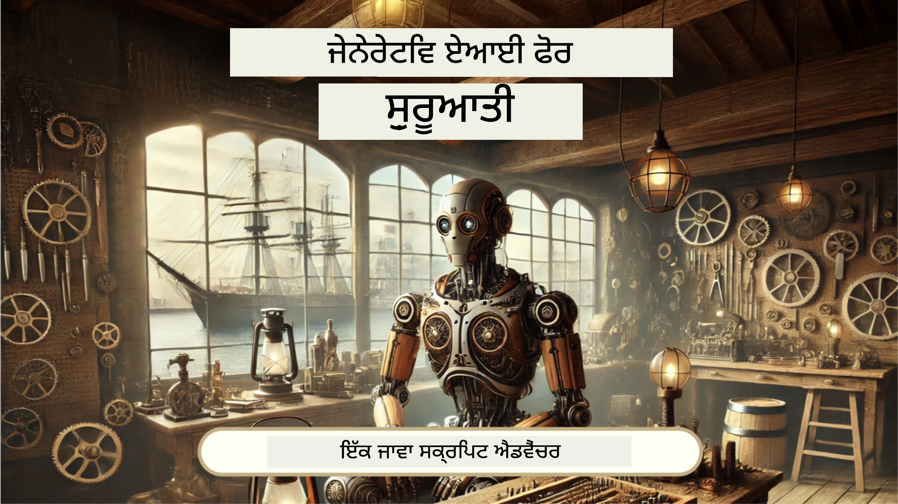
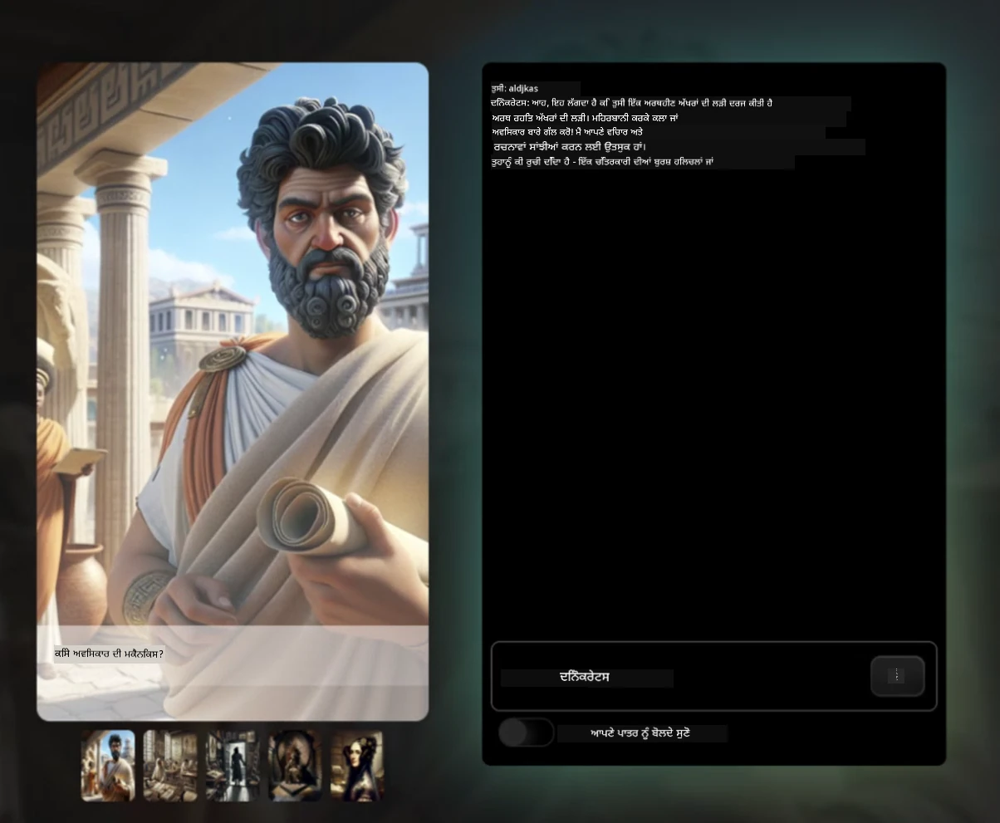
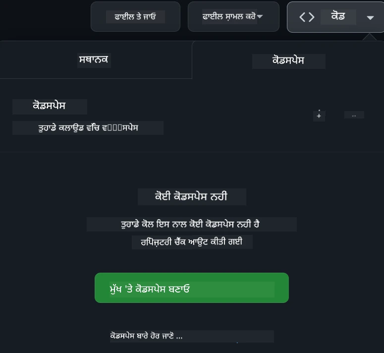

[](https://github.com/microsoft/Web-Dev-For-Beginners/blob/master/LICENSE)
[](https://GitHub.com/microsoft/Web-Dev-For-Beginners/graphs/contributors/)
[](https://GitHub.com/microsoft/Web-Dev-For-Beginners/issues/)
[](https://GitHub.com/microsoft/Web-Dev-For-Beginners/pulls/)
[](http://makeapullrequest.com) 

[](https://GitHub.com/microsoft/Web-Dev-For-Beginners/watchers/)
[](https://GitHub.com/microsoft/Web-Dev-For-Beginners/network/)
[](https://GitHub.com/microsoft/Web-Dev-For-Beginners/stargazers/)

[](https://discord.gg/nTYy5BXMWG)

# ਬੇਗ਼ਿਨਰਜ਼ ਲਈ ਵੈੱਬ ਡਿਵੈਲਪਮੈਂਟ - ਇਕ ਸਿਲੇਬਸ

ਸਾਡੇ 12-ਹਫ਼ਤੇ ਦੇ ਵਿਸਤ੍ਰਿਤ ਕੋਰਸ ਨਾਲ ਵੈੱਬ ਡਿਵੈਲਪਮੈਂਟ ਦੇ ਮੁੱਢਲੇ ਸਿਧਾਂਤ ਸਿੱਖੋ ਜੋ ਮਾਈਕਰੋਸਾਫਟ ਕਲਾਊਡ ਐਡਵੋਕੇਟਸ ਵਲੋਂ ਤਿਆਰ ਕੀਤਾ ਗਿਆ ਹੈ। 24 ਪਾਠਾਂ ਵਿੱਚੋਂ ਹਰ ਇੱਕ ਜਾਵਾਸਕ੍ਰਿਪਟ, ਸੀਐੱਸਐਸ ਅਤੇ ਐਚ.ਟੀ.ਐਮ.ਐਲ ਨੂੰ ਟੇਰਰੀਰੀਅਮਜ਼, ਬਰਾਊਜ਼ਰ ਐਕਸਟੈਂਸ਼ਨਜ਼ ਅਤੇ ਸਪੇਸ ਗੇਮਜ਼ ਵਰਗੇ ਹੱਥ-ਵਰਤੇ ਪ੍ਰੋਜੈਕਟਾਂ ਰਾਹੀਂ ਸਮਝਾਉਂਦਾ ਹੈ। ਕੁਇਜ਼, ਚਰਚਾਂ ਅਤੇ ਪ੍ਰਯੋਗਕਾਰੀ ਅਸਾਈਨਮੈਂਟਾਂ ਵਿੱਚ ਹੈਸਾ ਲਵੋ। ਸਾਡੀ ਪ੍ਰਭਾਵਸ਼ਾਲੀ ਪ੍ਰੋਜੈਕਟ-ਅਧਾਰਿਤ ਪੇਡਾਗੋਗੀ ਨਾਲ ਆਪਣੀਆਂ ਕੌਸ਼ਲਾਂ ਨੂੰ ਵਧਾਓ ਅਤੇ ਆਪਣੀ ਜਾਣਕਾਰੀ ਨੂੰ ਸੁਧਾਰੋ। ਅੱਜ ਹੀ ਆਪਣੇ ਕੋਡਿੰਗ ਯਾਤਰਾ ਦੀ ਸ਼ੁਰੂਆਤ ਕਰੋ!

ਅਜ਼ੁਰ ਏ.ਆਈ. ਫਾਊਂਡਰੀ ਡਿਸਕੋਰਡ ਵਿੱਚ ਸ਼ਾਮਲ ਹੋਵੋ ਅਤੇ ਮਾਹਿਰਾਂ ਅਤੇ ਹੋਰ ਵਿਕਾਸਕਾਰਾਂ ਨਾਲ ਮਿਲੋ।

[](https://discord.gg/nTYy5BXMWG)

ਇਹ ਸਰੋਤ ਵਰਤਣ ਦੀ ਸ਼ੁਰੂਆਤ ਕਰਨ ਲਈ ਹੇਠ ਲਿਖੇ ਕਦਮਾਂ ਦੀ ਪਾਲਣਾ ਕਰੋ:
1. **ਰਿਪੋਜ਼ਟਰੀ ਫੋਰਕ ਕਰੋ**: [](https://GitHub.com/microsoft/Web-Dev-For-Beginners/fork) 'ਤੇ ਕਲਿਕ ਕਰੋ
2. **ਰਿਪੋਜ਼ਟਰੀ ਕਲੋਨ ਕਰੋ**:   `git clone https://github.com/microsoft/Web-Dev-For-Beginners.git`
3. [**ਅਜ਼ੁਰ ਏ.ਆਈ. ਫਾਊਂਡਰੀ ਡਿਸਕੋਰਡ ਵਿੱਚ ਸ਼ਾਮਲ ਹੋਵੋ ਅਤੇ ਮਾਹਿਰਾਂ ਅਤੇ ਹੋਰ ਵਿਕਾਸਕਾਰਾਂ ਨਾਲ ਮਿਲੋ**](https://discord.com/invite/ByRwuEEgH4)

### 🌐 ਬਹੁ-ਭਾਸ਼ਾ ਸਮਰਥਨ

#### GitHub Action ਰਾਹੀਂ ਸਮਰਥਤ (ਸਵਚਾਲਿਤ ਅਤੇ ਸਦਾ ਅੱਪ-ਟੂ-ਡੇਟ)

<!-- CO-OP TRANSLATOR LANGUAGES TABLE START -->
[Arabic](../ar/README.md) | [Bengali](../bn/README.md) | [Bulgarian](../bg/README.md) | [Burmese (Myanmar)](../my/README.md) | [Chinese (Simplified)](../zh-CN/README.md) | [Chinese (Traditional, Hong Kong)](../zh-HK/README.md) | [Chinese (Traditional, Macau)](../zh-MO/README.md) | [Chinese (Traditional, Taiwan)](../zh-TW/README.md) | [Croatian](../hr/README.md) | [Czech](../cs/README.md) | [Danish](../da/README.md) | [Dutch](../nl/README.md) | [Estonian](../et/README.md) | [Finnish](../fi/README.md) | [French](../fr/README.md) | [German](../de/README.md) | [Greek](../el/README.md) | [Hebrew](../he/README.md) | [Hindi](../hi/README.md) | [Hungarian](../hu/README.md) | [Indonesian](../id/README.md) | [Italian](../it/README.md) | [Japanese](../ja/README.md) | [Kannada](../kn/README.md) | [Khmer](../km/README.md) | [Korean](../ko/README.md) | [Lithuanian](../lt/README.md) | [Malay](../ms/README.md) | [Malayalam](../ml/README.md) | [Marathi](../mr/README.md) | [Nepali](../ne/README.md) | [Nigerian Pidgin](../pcm/README.md) | [Norwegian](../no/README.md) | [Persian (Farsi)](../fa/README.md) | [Polish](../pl/README.md) | [Portuguese (Brazil)](../pt-BR/README.md) | [Portuguese (Portugal)](../pt-PT/README.md) | [Punjabi (Gurmukhi)](./README.md) | [Romanian](../ro/README.md) | [Russian](../ru/README.md) | [Serbian (Cyrillic)](../sr/README.md) | [Slovak](../sk/README.md) | [Slovenian](../sl/README.md) | [Spanish](../es/README.md) | [Swahili](../sw/README.md) | [Swedish](../sv/README.md) | [Tagalog (Filipino)](../tl/README.md) | [Tamil](../ta/README.md) | [Telugu](../te/README.md) | [Thai](../th/README.md) | [Turkish](../tr/README.md) | [Ukrainian](../uk/README.md) | [Urdu](../ur/README.md) | [Vietnamese](../vi/README.md)

> **ਕੀ ਤੁਸੀਂ ਇਸਨੂੰ ਲੋਕਲੀ ਕਲੋਨ ਕਰਨਾ ਚਾਹੁੰਦੇ ਹੋ?**
>
> ਇਸ ਰਿਪੋਜ਼ਟਰੀ ਵਿੱਚ 50+ ਭਾਸ਼ਾ ਅਨੁਵਾਦ ਹਨ ਜੋ ਡਾਊਨਲੋਡ ਦਾ ਆਕਾਰ ਵੱਡਾ ਕਰਦੇ ਹਨ। ਬਿਨਾਂ ਅਨੁਵਾਦਾਂ ਦੇ ਕਲੋਨ ਕਰਨ ਲਈ ਸਪਾਰਸ ਚੈੱਕਆਊਟ ਵਰਤੋ:
>
> **ਬੈਸ਼ / ਮੈਕਓਐਸ / ਲਿਨਕਸ:**
> ```bash
> git clone --filter=blob:none --sparse https://github.com/microsoft/Web-Dev-For-Beginners.git
> cd Web-Dev-For-Beginners
> git sparse-checkout set --no-cone '/*' '!translations' '!translated_images'
> ```
>
> **CMD (ਵਿੰਡੋਜ਼):**
> ```cmd
> git clone --filter=blob:none --sparse https://github.com/microsoft/Web-Dev-For-Beginners.git
> cd Web-Dev-For-Beginners
> git sparse-checkout set --no-cone "/*" "!translations" "!translated_images"
> ```
>
> ਇਸ ਤਰ੍ਹਾਂ ਤੁਹਾਨੂੰ ਕੋਰਸ ਪੂਰਾ ਕਰਨ ਲਈ ਸਾਰਾ ਕੁਝ ਤੇਜ਼ ਡਾਊਨਲੋਡ ਮਿਲੇਗਾ।
<!-- CO-OP TRANSLATOR LANGUAGES TABLE END -->

**ਜੇ ਤੁਸੀਂ ਹੋਰ ਅਨੁਵਾਦ ਚਾਹੁੰਦੇ ਹੋ ਤਾਂ ਸਮਰਥਿਤ ਭਾਸ਼ਾਵਾਂ ਇੱਥੇ ਲਿਸਟ ਕੀਤੀਆਂ ਹਨ। [ਇੱਥੇ](https://github.com/Azure/co-op-translator/blob/main/getting_started/supported-languages.md)**

[](https://open.vscode.dev/microsoft/Web-Dev-For-Beginners)

#### 🧑‍🎓 _ਕੀ ਤੁਸੀਂ ਵਿਦਿਆਰਥੀ ਹੋ?_

[**ਸਟੂਡੈਂਟ ਹੱਬ ਪੇਜ**](https://docs.microsoft.com/learn/student-hub/?WT.mc_id=academic-77807-sagibbon) 'ਤੇ ਜਾਓ ਜਿੱਥੇ ਤੁਹਾਨੂੰ ਬੇਗਿਨਰ ਸਰੋਤ, ਸਟੂਡੈਂਟ ਪੈਕ ਅਤੇ ਮੁਫ਼ਤ ਸਰਟੀਫਿਕੇਟ ਵਾਊਚਰ ਪ੍ਰਾਪਤ ਕਰਨ ਦੇ ਤਰੀਕੇ ਮਿਲਣਗੇ। ਇਹ ਪੇਜ ਤੁਹਾਨੂੰ ਬੁੱਕਮਾਰਕ ਕਰਨੀ ਚاهيਦੀ ਹੈ ਅਤੇ ਸਮੇਂ-ਸਮੇਂ ਤੇ ਜਾਂਚਣੀ ਚਾਹੀਦੀ ਹੈ ਕਿਉਂਕਿ ਹਰ ਮਹੀਨੇ ਸਮੱਗਰੀ ਬਦਲੀ ਜਾਂਦੀ ਹੈ।

### 📣 ਐਲਾਨ - ਨਵੇਂ GitHub Copilot ਏਜੰਟ ਮੋਡ ਚੈਲੇਂਜ ਪੂਰੇ ਕਰੋ!

ਨਵਾਂ ਚੈਲੇਂਜ ਸ਼ਾਮਲ ਕੀਤਾ ਗਿਆ ਹੈ, ਜ਼ਿਆਦਾਤਰ ਅਧਿਆਯਾਂ ਵਿੱਚ "GitHub Copilot Agent Challenge 🚀" ਵੇਖੋ। ਇਹ ਤੁਹਾਡੇ ਲਈ ਇੱਕ ਨਵਾਂ ਚੈਲੇਂਜ ਹੈ ਜੋ ਤੁਸੀਂ GitHub Copilot ਅਤੇ Agent ਮੋਡ ਦਾ ਉਪਯੋਗ ਕਰਕੇ ਪੂਰਾ ਕਰ ਸਕਦੇ ਹੋ। ਜੇ ਤੁਸੀਂ ਪਹਿਲਾਂ Agent ਮੋਡ ਵਰਤਿਆ ਨਹੀਂ ਹੈ ਤਾਂ ਇਹ ਸਿਰਫ਼ ਲਿਖਤ ਹੀ ਨਹੀਂ ਬਣਾਉਂਦਾ ਪਰ ਫਾਇਲਾਂ ਬਣਾਉਂਦਾ, ਸੋਧਦਾ ਅਤੇ ਕਮਾਂਡਾਂ ਚਲਾ ਸਕਦਾ ਹੈ।

### 📣 ਐਲਾਨ - _ਜਨਰੇਟਿਵ AI ਦੀ ਵਰਤੋਂ ਨਾਲ ਨਵਾਂ ਪ੍ਰੋਜੈਕਟ ਬਣਾਓ_ 

ਨਵਾਂ AI ਸਹਾਇਕ ਪ੍ਰੋਜੈਕਟ ਹਾਲ ਹੀ ਵਿੱਚ ਸ਼ਾਮਲ ਕੀਤਾ ਗਿਆ, ਇਸ ਨੂੰ ਦੇਖੋ [ਪ੍ਰੋਜੈਕਟ](./9-chat-project/README.md)

### 📣 ਐਲਾਨ - _ਜਨਰੇਟਿਵ AI ਲਈ ਜਾਵਾਸਕ੍ਰਿਪਟ ਉਪਰ ਨਵਾਂ ਸਿਲੇਬਸ ਜਾਰੀ ਹੋਇਆ ਹੈ_

ਸਾਡੇ ਨਵੇਂ ਜਨਰੇਟਿਵ AI ਸਿਲੇਬਸ ਨੂੰ ਨਾ ਗਵਾਓ!

ਆਰੰਭ ਕਰਨ ਲਈ [https://aka.ms/genai-js-course](https://aka.ms/genai-js-course) 'ਤੇ ਜਾਓ!



- ਮੁੱਢਲੇ ਤੋਂ ਲੈ ਕੇ RAG ਤੱਕ ਸਾਰੇ ਪਾਠ
- ਜਨਰੇਟਿਵ AI ਅਤੇ ਸਾਡੇ ਸਾਥੀ ਐਪ ਨਾਲ ਇਤਿਹਾਸਕ ਪਾਤਰਾਂ ਨਾਲ ਸੰਵਾਦ ਕਰੋ
- ਮਜ਼ੇਦਾਰ ਅਤੇ ਰੋਚਕ ਕਥਾ, ਤੁਸੀਂ ਸਮੇਂ ਦੀ ਯਾਤਰਾ ਕਰ ਰਹੇ ਹੋਵੋਗੇ!




ਹਰ ਪਾਠ ਵਿੱਚ ਅਸਾਈਨਮੈਂਟ, ਗਿਆਨ ਜਾਂਚ ਅਤੇ ਚੈਲੇਂਜ ਸ਼ਾਮਲ ਹੁੰਦਾ ਹੈ ਜੋ ਤੁਹਾਨੂੰ ਸਿੱਖਣ ਵਾਲੇ ਵਿਸ਼ਿਆਂ ਵਿੱਚ ਮਦਦ ਕਰਦਾ ਹੈ, ਜਿਵੇਂ ਕਿ:
- ਪ੍ਰੌਮਪਟਿੰਗ ਅਤੇ ਪ੍ਰੌਮਪਟ ਇੰਜੀਨੀਅਰਿੰਗ
- ਲਿਖਤ ਅਤੇ ਚਿੱਤਰ ਐਪ ਜਨਰੇਸ਼ਨ
- ਖੋਜ ਐਪ

ਆਰੰਭ ਕਰਨ ਲਈ [https://aka.ms/genai-js-course](https://aka.ms/genai-js-course) 'ਤੇ ਜਾਓ!


## 🌱 ਸ਼ੁਰੂਆਤ

> **ਅਧਿਆਪਕ**, ਅਸੀਂ [ਕੁਝ ਸੁਝਾਅ ਸ਼ਾਮਲ ਕੀਤੇ ਹਨ](for-teachers.md) ਕਿ ਇਸ ਸਿਲੇਬਸ ਨੂੰ ਕਿਵੇਂ ਵਰਤਣਾ ਹੈ। ਸਾਡੀ ਚਰਚਾ ਫੋਰਮ ਵਿੱਚ ਆਪਣੀ ਪ੍ਰਤੀਕ੍ਰਿਆ ਦਿਓ [ਇੱਥੇ](https://github.com/microsoft/Web-Dev-For-Beginners/discussions/categories/teacher-corner)!

**[ਵਿਦਿਆਰਥੀ](https://aka.ms/student-page/?WT.mc_id=academic-77807-sagibbon)**, ਹਰ ਪਾਠ ਲਈ, ਪੜ੍ਹਾਈ ਤੋਂ ਪਹਿਲਾਂ ਇੱਕ ਕੁਇਜ਼ ਸੋਲ੍ਹੋ ਅਤੇ ਫਿਰ ਲੈਕਚਰ ਮੈਟੀਰੀਅਲ ਪੜ੍ਹੋ, ਵੱਖਰੇ ਕਾਰਜ ਪੂਰੇ ਕਰੋ ਅਤੇ ਪਾਠ ਦੇ ਬਾਅਦ ਕੁਇਜ਼ ਦੇ ਨਾਲ ਆਪਣੀ ਸਮਝ ਦੀ ਜਾਂਚ ਕਰੋ।

ਆਪਣੇ ਸਿੱਖਣ ਦੇ ਤਜਰਬੇ ਨੂੰ ਵਧਾਉਣ ਲਈ, ਆਪਣੀ ਟੀਮ ਦੇ ਨਾਲ ਮਿਲ ਕੇ ਪ੍ਰੋਜੈਕਟਾਂ ’ਤੇ ਕੰਮ ਕਰੋ! ਸਾਡੀ [ਚਰਚਾ ਫੋਰਮ](https://github.com/microsoft/Web-Dev-For-Beginners/discussions) ਵਿੱਚ ਚਰਚਾ ਕਰਨੀ ਪ੍ਰੋਤਸਾਹਿਤ ਕੀਤੀ ਜਾਂਦੀ ਹੈ ਜਿੱਥੇ ਸਾਡੇ ਮੋਡਰੇਟਰ ਟੀਮ ਤੁਹਾਡੇ ਸਵਾਲਾਂ ਦੇ ਜਵਾਬ ਦੇਣ ਲਈ ਮੌਜੂਦ ਰਹੇਗੀ।

ਹੋਰ ਅਧਿਐਨ ਲਈ, ਅਸੀਂ ਸਿਫਾਰਸ਼ ਕਰਦੇ ਹਾਂ ਕਿ ਤੁਸੀਂ ਵਧੀਆ ਅਧਿਐਨ ਸਮੱਗਰੀ ਲਈ [Microsoft Learn](https://learn.microsoft.com/users/wirelesslife/collections/p1ddcy5jwy0jkm?WT.mc_id=academic-77807-sagibbon) ਦਾ ਅਧਿਐਨ ਕਰੋ।

### 📋 ਆਪਣਾ ਵਾਤਾਵਰਣ ਸੈਟਅਪ ਕਰਨਾ

ਇਸ ਸਿਲੇਬਸ ਲਈ ਵਿਕਾਸ ਵਾਤਾਵਰਣ ਪਹਿਲਾਂ ਹੀ ਤਿਆਰ ਹੈ! ਜਦੋਂ ਤੁਸੀਂ ਸ਼ੁਰੂ ਕਰਦੇ ਹੋ, ਤਾਂ ਤੁਸੀਂ [Codespace](https://github.com/features/codespaces/) (_ਇੱਕ ਬਰਾਊਜ਼ਰ-ਅਧਾਰਿਤ, ਬਿਨਾਂ ਇੰਸਟਾਲੇਸ਼ਨ ਵਾਲਾ ਵਾਤਾਵਰਣ_) ਦੌੜਾ ਸਕਦੇ ਹੋ ਜਾਂ ਆਪਣੀ ਮਸ਼ੀਨ 'ਤੇ ਕਿਸੇ ਟੈਕਸਟ ਐਡੀਟਰ ਜਿਵੇਂ ਕਿ [Visual Studio Code](https://code.visualstudio.com/?WT.mc_id=academic-77807-sagibbon) ਨਾਲ ਸਥਾਨਕ ਤੌਰ ਤੇ ਚਲਾ ਸਕਦੇ ਹੋ।

#### ਆਪਣਾ ਰਿਪੋਜ਼ਟਰੀ ਬਣਾਉਣਾ
ਆਪਣੇ ਕੰਮ ਨੂੰ ਆਸਾਨੀ ਨਾਲ ਸੰਭਾਲਣ ਲਈ, ਇਹ ਸਿਫਾਰਸ਼ ਕੀਤੀ ਜਾਂਦੀ ਹੈ ਕਿ ਤੁਸੀਂ ਇਸ ਰਿਪੋਜ਼ਟਰੀ ਦੀ ਆਪਣੀ ਕਾਪੀ ਬਣਾਓ। ਤੁਸੀਂ ਪੰਨੇ ਦੇ ਉੱਪਰ "Use this template" ਬਟਨ 'ਤੇ ਕਲਿਕ ਕਰਕੇ ਇਹ ਕਰ ਸਕਦੇ ਹੋ। ਇਹ ਤੁਹਾਡੇ GitHub ਖਾਤੇ ਵਿੱਚ ਸਿਲੇਬਸ ਦੀ ਕਾਪੀ ਦੇ ਨਾਲ ਇੱਕ ਨਵਾਂ ਰਿਪੋਜ਼ਟਰੀ ਬਣਾਏਗਾ।

ਇਹ ਕਦਮ ਪ徧ੋ:
1. **ਰਿਪੋਜ਼ਟਰੀ ਫੋਰਕ ਕਰੋ**: ਇਸ ਪੰਨੇ ਦੇ ਸੱਜੇ-ਉੱਪਰ ਕੋਨੇ ਵਿੱਚ "Fork" ਬਟਨ 'ਤੇ ਕਲਿਕ ਕਰੋ।
2. **ਰਿਪੋਜ਼ਟਰੀ ਕਲੋਨ ਕਰੋ**:   `git clone https://github.com/microsoft/Web-Dev-For-Beginners.git`

#### Codespace ਵਿੱਚ ਸਿਲੇਬਸ ਚਲਾਉਣਾ

ਤੁਹਾਡੇ ਬਣਾਏ ਗਏ ਰਿਪੋਜ਼ਟਰੀ ਕਾਪੀ ਵਿੱਚ, "Code" ਬਟਨ 'ਤੇ ਕਲਿਕ ਕਰੋ ਅਤੇ "Open with Codespaces" ਚੁਣੋ। ਇਹ ਤੁਹਾਡੇ ਲਈ ਇੱਕ ਨਵਾਂ Codespace ਬਣਾਏਗਾ ਜਿਸ ‘ਚ ਕੰਮ ਕੀਤਾ ਜਾ ਸਕਦਾ ਹੈ।



#### ਸਥਾਨਕ ਤੌਰ ‘ਤੇ ਸਿਲੇਬਸ ਚਲਾਉਣਾ

ਆਪਣੀ ਮਸ਼ੀਨ 'ਤੇ ਇਹ ਸਿਲੇਬਸ ਚਲਾਉਣ ਲਈ, ਤੁਹਾਨੂੰ ਇੱਕ ਟੈਕਸਟ ਐਡੀਟਰ, ਇੱਕ ਬਰਾਊਜ਼ਰ ਅਤੇ ਇੱਕ ਕਮਾਂਡ ਲਾਈਨ ਟੂਲ ਦੀ ਲੋੜ ਹੋਵੇਗੀ। ਸਾਡਾ ਪਹਿਲਾ ਪਾਠ, [ਪ੍ਰੋਗਰਾਮਿੰਗ ਭਾਸ਼ਾਵਾਂ ਅਤੇ ਸੰਦਾਂ ਦਾ ਪਰਚਿਆ](../../1-getting-started-lessons/1-intro-to-programming-languages), ਤੁਹਾਨੂੰ ਇਹਨਾਂ ਵਿੱਚੋਂ ਹਰ ਇੱਕ ਲਈ ਵੱਖ-ਵੱਖ ਵਿਕਲਪ ਦੱਸਕੇ ਤੁਹਾਡੇ ਲਈ ਸਭ ਤੋਂ ਵਧੀਆ ਚੁਣਨ ਵਿੱਚ ਮਦਦ ਕਰੇਗਾ।

ਸਾਡੀ ਸਿਫਾਰਸ਼ ਹੈ ਕਿ ਤੁਸੀਂ ਆਪਣੇ ਐਡੀਟਰ ਵੱਜੋਂ [Visual Studio Code](https://code.visualstudio.com/?WT.mc_id=academic-77807-sagibbon) ਵਰਤੋਂ, ਜਿਸ ਵਿੱਚ ਇੱਕ ਅੰਦਰੂਨੀ [ਟਰਮੀਨਲ](https://code.visualstudio.com/docs/terminal/basics/?WT.mc_id=academic-77807-sagibbon) ਵੀ ਸ਼ਾਮਲ ਹੈ। ਤੁਸੀਂ Visual Studio Code [ਇਥੇ](https://code.visualstudio.com/?WT.mc_id=academic-77807-sagibbon) ਤੋਂ ਡਾਊਨਲੋਡ ਕਰ ਸਕਦੇ ਹੋ।
1. ਆਪਣਾ ਰਿਪੋਜੀਟਰੀ ਆਪਣੇ ਕੰਪਿਊਟਰ 'ਤੇ ਕਲੋਨ ਕਰੋ। ਤੁਸੀਂ ਇਹ **Code** ਬਟਨ 'ਤੇ ਕਲਿੱਕ ਕਰਕੇ ਅਤੇ URL ਕਾਪੀ ਕਰਕੇ ਕਰ ਸਕਦੇ ਹੋ:

    [CodeSpace](./images/createcodespace.png)

    ਫਿਰ, [Visual Studio Code](https://code.visualstudio.com/?WT.mc_id=academic-77807-sagibbon) ਵਿੱਚ [Terminal](https://code.visualstudio.com/docs/terminal/basics/?WT.mc_id=academic-77807-sagibbon) ਖੋਲ੍ਹੋ ਅਤੇ ਹੇਠਾਂ ਦਿੱਤਾ ਕਮਾਂਡ ਚਲਾਓ, ਜਿਸ ਵਿੱਚ `<your-repository-url>` ਨੂੰ ਤੁਸੀਂ ਹੁਣੇ ਕਾਪੀ ਕੀਤਾ URL ਨਾਲ ਬਦਲੋ:

    ```bash 
    git clone <your-repository-url>
    ```

2. Visual Studio Code ਵਿੱਚ ਫੋਲਡਰ ਖੋਲ੍ਹੋ। ਤੁਸੀਂ ਇਹ **File** > **Open Folder** 'ਤੇ ਕਲਿੱਕ ਕਰਕੇ ਅਤੇ ਹੁਣੇ ਕਲੋਨ ਕੀਤਾ ਫੋਲਡਰ ਚੁਣ ਕੇ ਕਰ ਸਕਦੇ ਹੋ।

>  ਸਿਫਾਰਸ਼ੀ Visual Studio Code ਐਕਸਟੈਨਸ਼ਨਜ਼:
>
> * [Live Server](https://marketplace.visualstudio.com/items?itemName=ritwickdey.LiveServer&WT.mc_id=academic-77807-sagibbon) - Visual Studio Code ਵਿੱਚ HTML ਪੇਜ਼ਾਂ ਦਾ ਪ੍ਰੀਵਿਊ ਕਰਨ ਲਈ
> * [Copilot](https://marketplace.visualstudio.com/items?itemName=GitHub.copilot&WT.mc_id=academic-77807-sagibbon) - ਤੁਹਾਨੂੰ ਤੇਜ਼ੀ ਨਾਲ ਕੋਡ ਲਿਖਣ ਵਿੱਚ ਮਦਦ ਕਰਨ ਲਈ

## 📂 ਹਰ ਪਾਠ ਵਿੱਚ ਸ਼ਾਮਲ ਹਨ:

- ਵਿਕਲਪਿਕ ਸਕੇਚਨੋਟ
- ਵਿਕਲਪਿਕ ਸਹਾਇਕ ਵੀਡੀਓ
- ਪੂਰਵ-ਪਾਠ ਵਰਮਅੱਪ ਕੁਇਜ਼
- ਲਿਖਤੀ ਪਾਠ
- ਪ੍ਰੋਜੈਕਟ ਆਧਾਰਿਤ ਪਾਠਾਂ ਲਈ, ਪ੍ਰੋਜੈਕਟ ਬਣਾਉਣ ਲਈ ਕਦਮ-ਦਰ-কਦਮ ਮਾਰਗਦਰਸ਼ਨ
- ਗਿਆਨ ਦੀ ਜਾਂਚ
- ਇੱਕ ਚੈਲنج
- ਸਹਾਇਕ ਪਾਠ
- ਕਿਸੇ ਅਸਾਈਨਮੈਂਟ
- [ਪੋਸਟ-ਪਾਠ ਕੁਇਜ਼](https://ff-quizzes.netlify.app/web/)

> **ਕੁਇਜ਼ਾਂ ਬਾਰੇ ਇੱਕ ਨੋਟ**: ਸਾਰੇ ਕੁਇਜ਼ Quiz-app ਫੋਲਡਰ ਵਿੱਚ ਹਨ, ਕੁੱਲ 48 ਕੁਇਜ਼, ਹਰ ਇੱਕ ਵਿੱਚ ਤਿੰਨ ਸਵਾਲ ਹਨ। ਇਹ ਇੱਥੇ ਉਪਲਬਧ ਹਨ [ਇਥੇ](https://ff-quizzes.netlify.app/web/) ਅਤੇ ਕੁਇਜ਼ ਐਪ ਨੂੰ ਲੋਕਲ ਤੌਰ 'ਤੇ ਚਲਾਇਆ ਜਾ ਸਕਦਾ ਹੈ ਜਾਂ Azure ਤੇ ਡਿਪਲੋਇ ਕੀਤਾ ਜਾ ਸਕਦਾ ਹੈ; ਹਦਾਇਤਾਂ `quiz-app` ਫੋਲਡਰ ਵਿੱਚ ਮੌਜੂਦ ਹਨ।

## 🗃️ ਪਾਠ

|     |                       ਪ੍ਰੋਜੈਕਟ ਦਾ ਨਾਮ                       |                            ਸਿੱਖੇ ਗਏ ਧਾਰਣਾਵਾਂ                             | ਸਿੱਖਣ ਦੇ мақਸਦ                                                                                                                 |                                                         ਲਿੰਕਡ ਪਾਠ                                                           |         ਲੇਖਕ          |
| :-: | :------------------------------------------------------: | :--------------------------------------------------------------------: | ----------------------------------------------------------------------------------------------------------------------------------- | :----------------------------------------------------------------------------------------------------------------------------: | :---------------------: |
| 01  |                     Getting Started                      |           ਪ੍ਰੋਗ੍ਰਾਮਿੰਗ ਅਤੇ ਟੂਲਾਂ ਦਾ ਪਰਚਾਰਕ ਤਾਰੂਫ           | ਜ਼ਿਆਦਾਤਰ ਪ੍ਰੋਗ੍ਰਾਮਿੰਗ ਭਾਸ਼ਾਵਾਂ ਦੇ ਮੂਲ ਤੱਤ ਅਤੇ ਸਾਫਟਵੇਅਰ ਦੀ ਜਾਣਕਾਰੀ, ਜੋ ਪੇਸ਼ੇਵਰ ਡਿਵੈਲਪਰਾਂ ਦੀ ਮਦਦ ਕਰਦੇ ਹਨ | [Intro to Programming Languages and Tools of the Trade](./1-getting-started-lessons/1-intro-to-programming-languages/README.md) |         Jasmine         |
| 02  |                     Getting Started                      |             GitHub ਦੇ ਬੁਨਿਆਦੀ ਤੱਤ, ਟੀਮ ਨਾਲ ਕੰਮ ਕਰਨ ਸਮੇਤ             | ਪ੍ਰੋਜੈਕਟ ਵਿੱਚ GitHub ਦੀ ਵਰਤੋਂ ਕਿਵੇਂ ਕਰੀਏ, ਹੋਰਾਂ ਨਾਲ ਸਾਂਝੇਦਾਰੀ ਕਿਵੇਂ ਕੀਤੀ ਜਾਵੇ                                                    |                            [Intro to GitHub](./1-getting-started-lessons/2-github-basics/README.md)                             |          Floor          |
| 03  |                     Getting Started                      |                             ਸਹੂਲਤਮੰਦਤਾ                              | ਵੈੱਬ ਉਪਲੱਬਧਤਾਦਾਰਤਾ ਦੇ ਬੁਨਿਆਦੀ ਤੱਤ ਸਿੱਖੋ                                                                                               |                       [Accessibility Fundamentals](./1-getting-started-lessons/3-accessibility/README.md)                       |       Christopher       |
| 04  |                        JS Basics                         |                         ਜਾਵਾਸਕ੍ਰਿਪਟ ਡੇਟਾ ਕਿਸਮਾਂ                          | ਜਾਵਾਸਕ੍ਰਿਪਟ ਡੇਟਾ ਕਿਸਮਾਂ ਦੇ ਬੁਨਿਆਦੀ ਤੱਤ                                                                                                 |                                       [Data Types](./2-js-basics/1-data-types/README.md)                                        |         Jasmine         |
| 05  |                        JS Basics                         |                         ਫੰਕਸ਼ਨ ਅਤੇ ਮੈਥਡ                          | ਐਪਲੀਕੇਸ਼ਨ ਦੇ ਲੋਜਿਕ ਫਲੋ ਨੂੰ ਸੰਭਾਲਨ ਲਈ ਫੰਕਸ਼ਨਾਂ ਅਤੇ ਮੈਥਡਾਂ ਬਾਰੇ ਸਿੱਖੋ                                                             |                              [Functions and Methods](./2-js-basics/2-functions-methods/README.md)                               | Jasmine and Christopher |
| 06  |                        JS Basics                         |                        ਜਾਵਾਸਕ੍ਰਿਪਟ ਨਾਲ ਫੈਸਲੇ ਕਰਨਾ                        | ਆਪਣੇ ਕੋਡ ਵਿੱਚ ਫੈਸਲਾ ਬਣਾਉਣ ਦੀਆਂ ਵਿਧੀਆਂ ਵਰਤ ਕੇ ਸ਼ਰਤਾਂ ਬਣਾਉਣ ਸਿੱਖੋ                                                           |                                 [Making Decisions](./2-js-basics/3-making-decisions/README.md)                                  |         Jasmine         |
| 07  |                        JS Basics                         |                            ਐਰੇ ਅਤੇ ਲੂਪ                            | ਜਾਵਾਸਕ੍ਰਿਪਟ ਵਿੱਚ ਡੇਟਾ ਨਾਲ ਕੰਮ ਕਰਨ ਲਈ ਐਰੇ ਅਤੇ ਲੂਪ ਵਰਤੋਂ                                                                                 |                                   [Arrays and Loops](./2-js-basics/4-arrays-loops/README.md)                                    |         Jasmine         |
| 08  |       [Terrarium](./3-terrarium/solution/README.md)       |                            ਸਹੀ ਤਰੀਕੇ ਨਾਲ HTML                            | ਔਨਲਾਈਨ ਟੈਰੀਰਿਯਮ ਬਣਾਉਣ ਲਈ HTML ਦੇਣ ਵਾਲਾ ਕੋਡ ਬਣਾਓ, ਜੋ ਲੇਆਉਟ ਬਣਾਉਣ 'ਤੇ ਧਿਆਨ ਕੇਂਦਰਿਤ ਕਰੇ                                                         |                                 [Introduction to HTML](./3-terrarium/1-intro-to-html/README.md)                                 |           Jen           |
| 09  |       [Terrarium](./3-terrarium/solution/README.md)       |                            ਸਹੀ ਤਰੀਕੇ ਨਾਲ CSS                             | ਔਨਲਾਈਨ ਟੈਰੀਰਿਯਮ ਨੂੰ ਸਜਾਉਣ ਲਈ CSS ਬਣਾਓ, CSS ਦੇ ਬੁਨਿਆਦੀ ਤੱਤਾਂ ਸਮੇਤ ਪੇਜ ਨੂੰ ਰਿਸਪਾਂਸਿਵ ਬਣਾਉਣ 'ਤੇ ਧਿਆਨ ਕੇਂਦਰਿਤ ਕਰਦੇ ਹੋਏ                     |                                  [Introduction to CSS](./3-terrarium/2-intro-to-css/README.md)                                  |           Jen           |
| 10  |            [Terrarium](./3-terrarium/solution/README.md)            |                 ਜਾਵਾਸਕ੍ਰਿਪਟ ਕਲੋਜ਼ਰ, DOM ਨੂੰ ਬਦਲਣਾ                  | ਟੈਰੀਰਿਯਮ ਨੂੰ ਡ੍ਰੈਗ/ਡ੍ਰਾਪ ਇੰਟਰਫੇਸ ਵਜੋਂ ਕੰਮ ਕਰਨ ਲਈ ਜਾਵਾਸਕ੍ਰਿਪਟ ਬਣਾਓ, ਕਲੋਜ਼ਰ ਅਤੇ DOM ਮੈਨਿਪੂਲੇਸ਼ਨ 'ਤੇ ਧਿਆਨ ਕੇਂਦਰਿਤ             |                  [JavaScript Closures, DOM manipulation](./3-terrarium/3-intro-to-DOM-and-closures/README.md)                   |           Jen           |
| 11  |          [Typing Game](./4-typing-game/solution/README.md)          |                          ਟਾਈਪਿੰਗ ਗੇਮ ਬਣਾਉਣਾ                           | ਆਪਣੇ ਜਾਵਾਸਕ੍ਰਿਪਟ ਐਪ ਦੀ ਲੋਜਿਕ ਚਲਾਉਣ ਲਈ ਕੀਬੋਰਡ ਘਟਨਾਵਾਂ ਦੀ ਵਰਤੋਂ ਕਿਵੇਂ ਕਰਨੀ ਹੈ ਸਿੱਖੋ                                                          |                                [Event-Driven Programming](./4-typing-game/typing-game/README.md)                                |       Christopher       |
| 12  | [Green Browser Extension](./5-browser-extension/solution/README.md) |                         ਬ੍ਰਾਉਜ਼ਰਾਂ ਨਾਲ ਕੰਮ                            | ਬ੍ਰਾਉਜ਼ਰ ਕਿਵੇਂ ਕੰਮ ਕਰਦੇ ਹਨ, ਇਤਿਹਾਸ ਅਤੇ ਬ੍ਰਾਉਜ਼ਰ ਐਕਸਟੈਂਸ਼ਨ ਦੇ ਪਹਿਲੇ ਤੱਤਾਂ ਨੂੰ ਤਿਆਰ ਕਰਨ ਬਾਰੇ ਸਿੱਖੋ                               |                               [About Browsers](./5-browser-extension/1-about-browsers/README.md)                                |           Jen           |
| 13  | [Green Browser Extension](./5-browser-extension/solution/README.md) | ਫਾਰਮ ਬਣਾਉਣਾ, API ਕਾਲ ਕਰਨਾ ਅਤੇ ਸਥਾਨਕ ਸਟੋਰੇਜ ਵਿੱਚ ਵੈਰੀਏਬਲ ਸੰਭਾਲਣਾ | ਆਪਣੇ ਬ੍ਰਾਉਜ਼ਰ ਐਕਸਟੈਂਸ਼ਨ ਦੇ ਜਾਵਾਸਕ੍ਰਿਪਟ ਤੱਤ ਬਣਾਓ ਜੋ ਇੱਕ API ਕਾਲ ਕਰਨ ਲਈ ਸਥਾਨਕ ਸਟੋਰੇਜ ਵਰਤਦੇ ਹਨ                      |                [APIs, Forms, and Local Storage](./5-browser-extension/2-forms-browsers-local-storage/README.md)                 |           Jen           |
| 14  | [Green Browser Extension](./5-browser-extension/solution/README.md) |          ਬ੍ਰਾਉਜ਼ਰ ਵਿੱਚ ਬੈਕਗ੍ਰਾਊਂਡ ਪਰੋਸੈਸ, ਵੈੱਬ ਪ੍ਰਦਰਸ਼ਨ          | ਐਕਸਟੈਂਸ਼ਨ ਦੇ ਆਇਕਨ ਨੂੰ ਪ੍ਰਬੰਧਿਤ ਕਰਨ ਲਈ ਬ੍ਰਾਉਜ਼ਰ ਦੇ ਬੈਕਗ੍ਰਾਊਂਡ ਤਹਿ ਕਰਮ ਵਰਤੋ; ਵੈੱਬ ਪ੍ਰਦਰਸ਼ਨ ਅਤੇ ਕੁਝ ਸੁਧਾਰਾਂ ਬਾਰੇ ਜਾਣੋ   |             [Background Tasks and Performance](./5-browser-extension/3-background-tasks-and-performance/README.md)              |           Jen           |
| 15  |           [Space Game](./6-space-game/solution/README.md)           |             ਜਾਵਾਸਕ੍ਰਿਪਟ ਨਾਲ ਹੋਰ ਵਿਕਸਿਤ ਗੇਮ ਵਿਕਾਸ             | ਕਲਾਸ ਅਤੇ ਕੰਪੋਜ਼ੀਸ਼ਨ ਦੋਹਾਂ ਦੀ ਵਰਤੋਂ ਅਤੇ ਪਬ/ਸਬ ਪੈਟਰਨ ਬਾਰੇ ਜਾਣੋ, ਜੋ ਕਿ ਇੱਕ ਗੇਮ ਬਣਾਉਣ ਦੀ ਤਿਆਰੀ ਵਿੱਚ ਹੈ              |                      [Introduction to Advanced Game Development](./6-space-game/1-introduction/README.md)                       |          Chris          |
| 16  |           [Space Game](./6-space-game/solution/README.md)           |                           ਕੈਨਵਾਸ 'ਤੇ ਡਰਾਇੰਗ                            | ਕੈਨਵਾਸ API ਬਾਰੇ ਸਿੱਖੋ, ਜੋ ਸਕਰੀਨ 'ਤੇ ਤੱਤਾਂ ਨੂੰ ਡਰਾਇ ਕਰਦਾ ਹੈ                                                                       |                                [Drawing to Canvas](./6-space-game/2-drawing-to-canvas/README.md)                                |          Chris          |
| 17  |           [Space Game](./6-space-game/solution/README.md)           |                   ਸਕਰੀਨ 'ਤੇ ਤੱਤਾਂ ਨੂੰ ਹਿਲਾਉਣਾ                    | ਸਿੱਖੋ ਕਿ ਕਿਵੇਂ ਤੱਤ ਕਾਰਟੀਸੀਅਨ ਕੋਆਰਡੀਨੇਟਸ ਅਤੇ ਕੈਨਵਾਸ API ਲਈ ਮੋਸ਼ਨ ਪ੍ਰਾਪਤ ਕਰ ਸਕਦੇ ਹਨ                                            |                           [Moving Elements Around](./6-space-game/3-moving-elements-around/README.md)                           |          Chris          |
| 18  |           [Space Game](./6-space-game/solution/README.md)           |                          ਟੱਕਰ ਦੀ ਪਛਾਣ                           | ਤੱਤਾਂ ਨੂੰ ਦਰਮਿਆਨ ਟੱਕਰ ਅਤੇ ਪਰਤੀਕਿਰਿਆ ਕਰਨ ਲਈ ਬਣਾਓ, ਕੀਪ੍ਰੈੱਸ ਸਹਾਇਤਾ ਨਾਲ ਅਤੇ ਪ੍ਰਦਰਸ਼ਨ ਲਈ ਠੰਡੀ ਸਮੇਂ ਦਾ ਫੰਕਸ਼ਨ ਦਿਓ    |                              [Collision Detection](./6-space-game/4-collision-detection/README.md)                              |          Chris          |
| 19  |           [Space Game](./6-space-game/solution/README.md)           |                             ਅੰਕ ਸਟੋਰ ਕਰਨਾ                              | ਖੇਡ ਦੀ ਸਥਿਤੀ ਅਤੇ ਪ੍ਰਦਰਸ਼ਨ ਦੇ ਅਧਾਰ 'ਤੇ ਗਣਿਤ ਕਰਨਗੇ                                                                |                                    [Keeping Score](./6-space-game/5-keeping-score/README.md)                                    |          Chris          |
| 20  |           [Space Game](./6-space-game/solution/README.md)           |                     ਖੇਡ ਖਤਮ ਕਰਨਾ ਅਤੇ ਦੁਬਾਰਾ ਸ਼ੁਰੂ ਕਰਨਾ                     | ਖੇਡ ਖਤਮ ਕਰਨ ਅਤੇ ਦੁਬਾਰਾ ਸ਼ੁਰੂ ਕਰਨ ਬਾਰੇ ਸਿੱਖੋ, ਸਾਥ ਹੀ ਐਸੈਟਸ ਨੂੰ ਸਾਫ਼ ਕਰਨ ਅਤੇ ਵੈਰੀਏਬਲ ਮੁਲਿਆਂ ਨੂੰ ਰੀਸੈਟ ਕਰਨ ਬਾਰੇ                              |                                [The Ending Condition](./6-space-game/6-end-condition/README.md)                                 |          Chris          |
| 21  |         [Banking App](./7-bank-project/solution/README.md)          |                 ਵੈੱਬ ਐਪ ਵਿੱਚ HTML ਟੈਂਪਲੇਟ ਅਤੇ ਰੂਟ                 | ਮਲਟੀਪੇਜ ਵੈੱਬਸਾਈਟ ਦਾ ਡھانਚਾ ਬਣਾਉਣ ਲਈ ਰੂਟਿੰਗ ਅਤੇ HTML ਟੈਂਪਲੇਟ ਦੇ ਜ਼ਰੀਏ ਜਾਨੋ                             |                            [HTML Templates and Routes](./7-bank-project/1-template-route/README.md)                             |          Yohan          |
| 22  |         [Banking App](./7-bank-project/solution/README.md)          |                  ਲੌਗਇਨ ਅਤੇ ਰਜਿਸਟਰ ਫਾਰਮ ਬਣਾਉਣਾ                   | ਫਾਰਮ ਬਣਾਉਣਾ ਅਤੇ ਵੈਧਤਾ ਚੈੱਕ ਕਰਨ ਦੇ ਰੂਟੀਆਂ ਬਾਰੇ ਸਿੱਖੋ                                                                          |                                           [Forms](./7-bank-project/2-forms/README.md)                                           |          Yohan          |
| 23  |         [Banking App](./7-bank-project/solution/README.md)          |                   ਡੇਟਾ ਪ੍ਰਾਪਤ ਕਰਨ ਅਤੇ ਵਰਤਣ ਦੇ ਤਰੀਕੇ                   | ਸਮਝੋ ਕਿ ਤੁਹਾਡੇ ਐਪ ਵਿੱਚ ਡੇਟਾ ਕਿਵੇਂ ﬇ਲਦਾ ਹੈ, ਕਿਵੇਂ ਪ੍ਰਾਪਤ ਕਰੋ, ਸਟੋਰ ਕਰੋ ਅਤੇ ਨਿਕਾਸ ਕਰੋ                                                 |                                            [Data](./7-bank-project/3-data/README.md)                                            |          Yohan          |
| 24  |         [Banking App](./7-bank-project/solution/README.md)          |                      ਸਟੇਟ ਮੈਨੇਜਮੈਂਟ ਦੇ ਧਾਰਣਾਏਂ                      | ਸਮਝੋ ਕਿ ਤੁਹਾਡਾ ਐਪ ਸਥਿਤੀ ਕਿਵੇਂ ਰੱਖਦਾ ਹੈ ਅਤੇ ਇਸ ਦੀ ਪ੍ਰੋਗ੍ਰਾਮਿੰਗ ਨਾਲ ਕਿਵੇਂ ਪ੍ਰਬੰਧਨ ਕਰਦੇ ਹਨ                                                              |                                [State Management](./7-bank-project/4-state-management/README.md)                                |          Yohan          |
| 25 | [Browser/VScode Code](../../8-code-editor) | VSCode ਨਾਲ ਕੰਮ ਕਰਨਾ | ਇੱਕ ਕੋਡ ਐਡੀਟਰ ਦੀ ਵਰਤੋਂ ਕਿਵੇਂ ਕਰਨੀ ਹੈ | [Use VScode Code Editor](./8-code-editor/1-using-a-code-editor/README.md) | Chris |
| 26 | [AI Assistants](./9-chat-project/README.md) | AI ਨਾਲ ਕੰਮ ਕਰਨਾ | ਆਪਣਾ ਖੁਦ ਦਾ AI ਸਹਾਇਕ ਬਣਾਉਣਾ ਸਿੱਖੋ | [AI Assistant project](./9-chat-project/README.md) | Chris |

## 🏫 ਪੈਡਾਗੋਜੀ

ਸਾਡਾ ਕੋਰਸ ਦੋ ਮੁੱਖ ਪੈਡਾਗੋਗੀ ਸਿਧਾਂਤਾਂ 'ਤੇ ਆਧਾਰਿਤ ਹੈ:
* ਪ੍ਰੋਜੈਕਟ ਆਧਾਰਿਤ ਸਿੱਖਣਾ
* ਬਾਰੰਬਾਰ ਕੁਇਜ਼

ਇਹ ਪ੍ਰੋਗ੍ਰਾਮ ਜਾਵਾਸਕ੍ਰਿਪਟ, HTML, ਅਤੇ CSS ਦੇ ਮੂਲ ਤੱਤ ਸਿਖਾਉਂਦਾ ਹੈ, ਨਾਲ ਹੀ ਅੱਜ ਦੇ ਵੈੱਬ ਡਿਵੈਲਪਰਾਂ ਵੱਲੋਂ ਵਰਤੀਆਂ ਜਾਂਦੀਆਂ ਨਵੀਂ ਟੂਲਾਂ ਅਤੇ ਤਕਨੀਕਾਂ ਵੀ ਸਿੱਖਾਉਂਦਾ ਹੈ। ਵਿਦਿਆਰਥੀਆਂ ਨੂੰ ਹੱਥੋਂ-ਹੱਥ ਅਨੁਭਵ ਮਿਲੇਗਾ ਜਿਵੇਂ ਕਿ ਟਾਈਪਿੰਗ ਗੇਮ, ਵਰਚੁਅਲ ਟੈਰੀਰਿਯਮ, ਈਕੋ-ਫ੍ਰੈਂਡਲੀ ਬ੍ਰਾਉਜ਼ਰ ਐਕਸਟੈਂਸ਼ਨ, ਸਪੇਸ-ਇਨਵੇਡਰ-ਸਟਾਈਲ ਗੇਮ, ਅਤੇ ਕਾਰੋਬਾਰੀ ਬੈਂਕਿੰਗ ਐਪ ਬਣਾਉਂਦੇ ਹੋਏ। ਸਿਰਿਜ਼ ਦੇ ਅੰਤ ਵਿੱਚ, ਵਿਦਿਆਰਥੀ ਵੈੱਬ ਵਿਕਾਸ ਦੀ ਮਜ਼ਬੂਤ ਸਮਝ ਪ੍ਰਾਪਤ ਕਰਨਗੇ।

> 🎓 ਤੁਸੀਂ ਇਸ ਕੋਰਸ ਦੇ ਪਹਿਲੇ ਕੁਝ ਪਾਠਾਂ ਨੂੰ Microsoft Learn 'ਤੇ ਇੱਕ [Learn Path](https://docs.microsoft.com/learn/paths/web-development-101/?WT.mc_id=academic-77807-sagibbon) ਵਜੋਂ ਵੀ ਕਰ ਸਕਦੇ ਹੋ!

ਉਹਨਾਂ ਨੂੰ ਪ੍ਰੋਜੈਕਟਾਂ ਨਾਲ ਜੋੜ ਕੇ, ਪ੍ਰਕਿਰਿਆ ਨੂੰ ਵਿਦਿਆਰਥੀਆਂ ਲਈ ਹੋਰ ਰੁਚਿਕਰ ਬਣਾਇਆ ਜਾਂਦਾ ਹੈ ਅਤੇ ਧਾਰਣਾਵਾਂ ਦੀ ਸਮਝ ਬਰਕਰਾਰ ਰਹਿੰਦੀ ਹੈ। ਅਸੀਂ ਕੁਝ ਜਾਵਾਸਕ੍ਰਿਪਟ ਬੇਸਿਕਸ ਦੇ ਸ਼ੁਰੂਆਤੀ ਪਾਠ ਵੀ ਲਿਖੇ ਹਨ ਜੋ ਧਾਰਣਾਵਾਂ ਪੇਸ਼ ਕਰਦੇ ਹਨ, ਜਿਹੜੇ "[Beginners Series to: JavaScript](https://channel9.msdn.com/Series/Beginners-Series-to-JavaScript/?WT.mc_id=academic-77807-sagibbon)" ਵੀਡੀਓ ਟਿਊਟੋਰਿਅਲ ਕਲੈਕਸ਼ਨ ਤੋਂ ਇਕ ਵੀਡੀਓ ਨਾਲ ਜੋੜੇ ਗਏ ਹਨ, ਜਿਨ੍ਹਾਂ ਦੇ ਕੁਝ ਲੇਖਕਾਂ ਨੇ ਇਸ ਕੋਰਸ ਦੇ ਵਿਕਾਸ ਵਿੱਚ ਯੋਗਦਾਨ ਦਿੱਤਾ ਹੈ।

ਇਸਦੇ ਨਾਲ-ਨਾਲ, ਇੱਕ ਘٽ-ਦਾਅਵਾ ਵਾਲਾ ਕੁਇਜ਼ ਕਲਾਸ ਤੋਂ ਪਹਿਲਾਂ ਵਿਦਿਆਰਥੀ ਨੂੰ ਵਿਸ਼ਾ ਸਿੱਖਣ ਲਈ ਪ੍ਰੇਰਿਤ ਕਰਦਾ ਹੈ, ਅਤੇ ਦੂਜਾ ਕੁਇਜ਼ ਕਲਾਸ ਤੋਂ ਬਾਅਦ ਵਧੀਕ ਸਮਝਦਾਰੀ ਯਕੀਨੀ ਬਣਾਉਂਦਾ ਹੈ। ਇਹ ਕੋਰਸ ਲਚੀਲਾ ਅਤੇ ਮਨੋਰੰਜਕ ਬਣਾਉਣ ਲਈ ਤਿਆਰ ਕੀਤਾ ਗਿਆ ਹੈ ਅਤੇ ਪੂਰਾ ਜਾਂ ਕਿਸੇ ਹਿੱਸੇ ਵਜੋਂ ਲਿਆ ਜਾ ਸਕਦਾ ਹੈ। ਪ੍ਰੋਜੈਕਟ ਛੋਟੇ ਸ਼ੁਰੂ ਹੁੰਦੇ ਹਨ ਅਤੇ 12 ਹਫ਼ਤੇ ਦੇ ਪਹਿਰੇ ਦੇ ਅੰਤ ਤੱਕ ਵੱਧ-ਵਧੀਕ ਕਰਮਾਤਮਕ ਬਣ ਜਾਂਦੇ ਹਨ।

ਜਦੋਂ ਕਿ ਅਸੀਂ ਜਾਵਾਸਕ੍ਰਿਪਟ ਫਰੇਮਵਰਕਸ ਲਿਆਉਣ ਤੋਂ ਸਾਵਧਾਨ ਰਹੇ ਕਿਉਂਕਿ ਵੈੱਬ ਡਿਵੈਲਪਰ ਬਣਨ ਲਈ ਬੁਨਿਆਦੀ ਸਿੱਖਿਆ ਤੇ ਧਿਆਨ ਕੇਂਦਰਿਤ ਕਰਨ ਲਈ, ਇੱਕ ਵਧੀਆ ਅਗਲਾ ਕਦਮ Node.js ਬਾਰੇ ਵਧੀਆ ਸਿੱਖਣਾ ਹੋਵੇਗਾ ਜੋ "[Beginner Series to: Node.js](https://channel9.msdn.com/Series/Beginners-Series-to-Nodejs/?WT.mc_id=academic-77807-sagibbon)" ਵੀਡੀਓ ਕਲੈਕਸ਼ਨ ਰਾਹੀਂ ਮਿਲਦਾ ਹੈ।

> ਸਾਡੇ [Code of Conduct](CODE_OF_CONDUCT.md) ਅਤੇ [Contributing](CONTRIBUTING.md) ਨਿਰਦੇਸ਼ਾਂ ਨੂੰ ਵੇਖੋ। ਅਸੀਂ ਤੁਹਾਡਾ ਰचनਾਤਮਕ ਫੀਡਬੈਕ ਸਵਾਗਤ ਕਰਦੇ ਹਾਂ!

## 🧭 ਆਫਲਾਈਨ ਪਹੁੰਚ

ਤੁਸੀਂ ਇਸ ਡੌਕਯੂਮੈਂਟੇਸ਼ਨ ਨੂੰ ਆਫਲਾਈਨ ਚਲਾ ਸਕਦੇ ਹੋ [Docsify](https://docsify.js.org/#/) ਦੀ ਵਰਤੋਂ ਕਰਕੇ। ਇਸ ਰਿਪੋ ਨੂੰ ਫੋਰਕ ਕਰੋ, ਆਪਣੇ ਲੋਕਲ ਮਸ਼ੀਨ 'ਤੇ [Docsify ਇੰਸਟਾਲ](https://docsify.js.org/#/quickstart) ਕਰੋ, ਅਤੇ ਫਿਰ ਇਸ ਰਿਪੋ ਦੇ ਰੂਟ ਫੋਲਡਰ ਵਿੱਚ `docsify serve` ਟਾਈਪ ਕਰੋ। ਵੈੱਬਸਾਈਟ ਤੁਹਾਡੇ ਲੋਕਲਹੋਸਟ `localhost:3000` ਦੇ ਪੋਰਟ 3000 'ਤੇ ਸੇਵਾ ਕੀਤੀ ਜਾਵੇਗੀ।

## 📘 PDF
ਸਾਰੇ ਪਾਠਾਂ ਦੀ ਇੱਕ PDF ਇੱਥੇ ਮਿਲ ਸਕਦੀ ਹੈ [here](https://microsoft.github.io/Web-Dev-For-Beginners/pdf/readme.pdf)।

## 🎒 ਹੋਰ ਕੋਰਸ

ਸਾਡੀ ਟੀਮ ਹੋਰ ਕੋਰਸ ਵੀ ਤਿਆਰ ਕਰਦੀ ਹੈ! ਵੇਖੋ:

<!-- CO-OP TRANSLATOR OTHER COURSES START -->
### LangChain
[](https://aka.ms/langchain4j-for-beginners)
[](https://aka.ms/langchainjs-for-beginners?WT.mc_id=m365-94501-dwahlin)
[](https://github.com/microsoft/langchain-for-beginners?WT.mc_id=m365-94501-dwahlin)
---

### Azure / Edge / MCP / Agents
[](https://github.com/microsoft/AZD-for-beginners?WT.mc_id=academic-105485-koreyst)
[](https://github.com/microsoft/edgeai-for-beginners?WT.mc_id=academic-105485-koreyst)
[](https://github.com/microsoft/mcp-for-beginners?WT.mc_id=academic-105485-koreyst)
[](https://github.com/microsoft/ai-agents-for-beginners?WT.mc_id=academic-105485-koreyst)

---
 
### Generative AI Series
[](https://github.com/microsoft/generative-ai-for-beginners?WT.mc_id=academic-105485-koreyst)
[-9333EA?style=for-the-badge&labelColor=E5E7EB&color=9333EA)](https://github.com/microsoft/Generative-AI-for-beginners-dotnet?WT.mc_id=academic-105485-koreyst)
[-C084FC?style=for-the-badge&labelColor=E5E7EB&color=C084FC)](https://github.com/microsoft/generative-ai-for-beginners-java?WT.mc_id=academic-105485-koreyst)
[-E879F9?style=for-the-badge&labelColor=E5E7EB&color=E879F9)](https://github.com/microsoft/generative-ai-with-javascript?WT.mc_id=academic-105485-koreyst)

---
 
### ਮੁੱਖ ਸਿੱਖਿਆ
[](https://aka.ms/ml-beginners?WT.mc_id=academic-105485-koreyst)
[](https://aka.ms/datascience-beginners?WT.mc_id=academic-105485-koreyst)
[](https://aka.ms/ai-beginners?WT.mc_id=academic-105485-koreyst)
[](https://github.com/microsoft/Security-101?WT.mc_id=academic-96948-sayoung)
[](https://aka.ms/webdev-beginners?WT.mc_id=academic-105485-koreyst)
[](https://aka.ms/iot-beginners?WT.mc_id=academic-105485-koreyst)
[](https://github.com/microsoft/xr-development-for-beginners?WT.mc_id=academic-105485-koreyst)

---
 
### Copilot ਸੀਰੀਜ਼
[](https://aka.ms/GitHubCopilotAI?WT.mc_id=academic-105485-koreyst)
[](https://github.com/microsoft/mastering-github-copilot-for-dotnet-csharp-developers?WT.mc_id=academic-105485-koreyst)
[](https://github.com/microsoft/CopilotAdventures?WT.mc_id=academic-105485-koreyst)
<!-- CO-OP TRANSLATOR OTHER COURSES END -->

## ਮਦਦ ਪ੍ਰਾਪਤ ਕਰਨਾ

ਜੇ ਤੁਸੀਂ ਫਸ ਜਾਂਦੇ ਹੋ ਜਾਂ AI অ্যਪ ਬਣਾਉਣ ਬਾਰੇ ਕੋਈ ਸਵਾਲ ਹੈ, ਤਾਂ MCP ਬਾਰੇ ਚਰਚਾਵਾਂ ਵਿੱਚ ਹੋਰ ਸਿੱਖਣ ਵਾਲੇ ਅਤੇ ਤਜ਼ਰਬੇਕਾਰ ਵਿਕਾਸਕਾਰਾਂ ਨਾਲ ਜੁੜੋ। ਇਹ ਇੱਕ ਸਮਰਥਨਸ਼ੀਲ ਭਾਈਚਾਰਾ ਹੈ ਜਿੱਥੇ ਸਵਾਲਾਂ ਦਾ ਸਵਾਗਤ ਹੈ ਅਤੇ ਗਿਆਨ ਖੁੱਲ੍ਹ ਕੇ ਸਾਂਝਾ ਕੀਤਾ ਜਾਂਦਾ ਹੈ।

[](https://discord.gg/nTYy5BXMWG)

ਜੇ ਤੁਹਾਡੇ ਕੋਲ ਉਤਪਾਦ ਫੀਡਬੈਕ ਜਾਂ ਤਿਆਰ ਕਰਦੇ ਸਮੇਂ ਕੋਈ ਗਲਤੀ ਹੋਵੇ ਤਾਂ ਦਰਜ ਕਰੋ:

[](https://aka.ms/foundry/forum)

## ਲਾਇਸੈਂਸ

ਇਹ ਰਿਪੋਜ਼ਟਰੀ MIT ਲਾਇਸੈਂਸ ਹੇਠ ਲਾਇਸੈਂਸ ਹੈ। ਹੋਰ ਜਾਣਕਾਰੀ ਲਈ [LICENSE](../../LICENSE) ਫਾਈਲ ਵੇਖੋ।

---

<!-- CO-OP TRANSLATOR DISCLAIMER START -->
**ਅਸਵੀਕਾਰੋक्ति**:  
ਇਹ ਦਸਤਾਵੇਜ਼ AI ਅਨੁਵਾਦ ਸੇਵਾ [Co-op Translator](https://github.com/Azure/co-op-translator) ਦੀ ਵਰਤੋਂ ਕਰਕੇ ਅਨੁਵਾਦਿਤ ਕੀਤਾ ਗਿਆ ਹੈ। ਜਦੋਂ ਕਿ ਅਸੀ ਸਹੀਤਾ ਲਈ ਕੋਸ਼ਿਸ਼ ਕਰਦੇ ਹਾਂ, ਕਿਰਪਾ ਕਰਕੇ ਜਾਣੋਂ ਕਿ ਸਵੈਚਾਲਿਤ ਅਨੁਵਾਦਾਂ ਵਿੱਚ ਗਲਤੀਆਂ ਜਾਂ ਅਸਤੀਕਤਾ ਹੋ ਸਕਦੀ ਹੈ। ਮੂਲ ਦਸਤਾਵੇਜ਼ ਆਪਣੇ ਮੁੱਖ ਭਾਸ਼ਾ ਵਿੱਚ ਅਧਿਕਾਰਤ ਸਰੋਤ ਮੰਨਿਆ ਜਾਣਾ ਚਾਹੀਦਾ ਹੈ। ਮਹੱਤਵਪੂਰਣ ਜਾਣਕਾਰੀ ਲਈ, ਪੇਸ਼ਾਵਰ ਮਨੁੱਖੀ ਅਨੁਵਾਦ ਦੀ ਸਿਫਾਰਸ਼ ਕੀਤੀ ਜਾਂਦੀ ਹੈ। ਇਸ ਅਨੁਵਾਦ ਦੀ ਵਰਤੋਂ ਕਰਕੇ ਹੋਣ ਵਾਲੀਆਂ ਕਿਸੇ ਵੀ ਗਲਤ ਫਹਿਮੀਆਂ ਜਾਂ ਗਲਤ ਵਿਆਖਿਆਵਾਂ ਲਈ ਅਸੀਂ ਜ਼ਿੰਮੇਵਾਰ ਨਹੀਂ ਹਾਂ।
<!-- CO-OP TRANSLATOR DISCLAIMER END -->