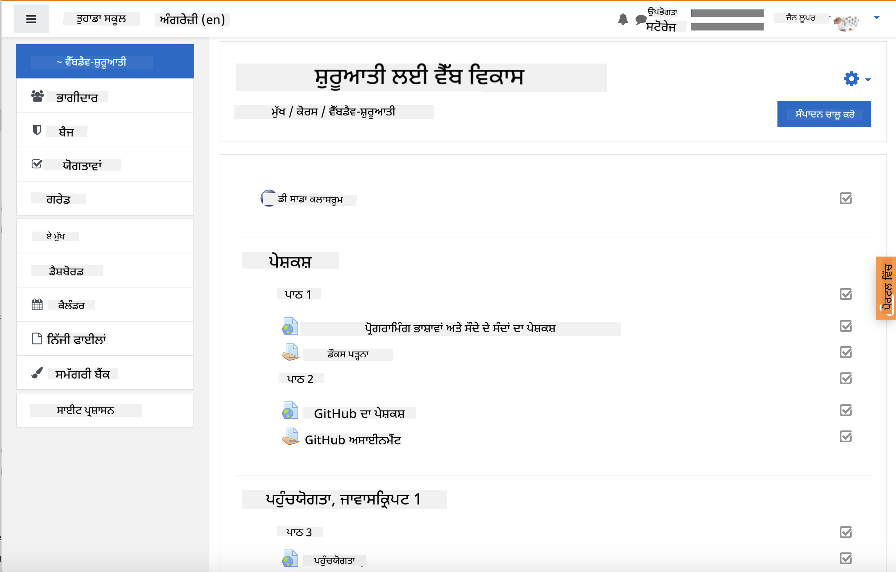

<!--
CO_OP_TRANSLATOR_METADATA:
{
  "original_hash": "75cb51f7ca9ea0b097ef4a1287e9290c",
  "translation_date": "2025-08-25T20:56:45+00:00",
  "source_file": "for-teachers.md",
  "language_code": "pa"
}
-->
## ਸਿੱਖਿਆਕਾਰਾਂ ਲਈ

ਕੀ ਤੁਸੀਂ ਇਸ ਪਾਠਕ੍ਰਮ ਨੂੰ ਆਪਣੇ ਕਲਾਸਰੂਮ ਵਿੱਚ ਵਰਤਣਾ ਚਾਹੋਗੇ? ਬਿਲਕੁਲ, ਇਸਨੂੰ ਵਰਤਣ ਲਈ ਆਗੇ ਵਧੋ!

ਅਸਲ ਵਿੱਚ, ਤੁਸੀਂ ਇਸਨੂੰ GitHub ਵਿੱਚ ਹੀ GitHub Classroom ਦੀ ਮਦਦ ਨਾਲ ਵਰਤ ਸਕਦੇ ਹੋ।

ਇਸ ਲਈ, ਇਸ ਰਿਪੋਜ਼ਟਰੀ ਨੂੰ ਫੋਰਕ ਕਰੋ। ਤੁਹਾਨੂੰ ਹਰ ਪਾਠ ਲਈ ਇੱਕ ਅਲੱਗ ਰਿਪੋ ਬਣਾਉਣ ਦੀ ਲੋੜ ਹੋਵੇਗੀ, ਇਸ ਲਈ ਤੁਹਾਨੂੰ ਹਰ ਫੋਲਡਰ ਨੂੰ ਇੱਕ ਅਲੱਗ ਰਿਪੋ ਵਿੱਚ ਕੱਢਣਾ ਪਵੇਗਾ। ਇਸ ਤਰੀਕੇ ਨਾਲ, [GitHub Classroom](https://classroom.github.com/classrooms) ਹਰ ਪਾਠ ਨੂੰ ਵੱਖਰੇ ਤੌਰ 'ਤੇ ਪਛਾਣ ਸਕੇਗਾ।

ਇਹ [ਪੂਰੀਆਂ ਹਦਾਇਤਾਂ](https://github.blog/2020-03-18-set-up-your-digital-classroom-with-github-classroom/) ਤੁਹਾਨੂੰ ਦੱਸਣਗੀਆਂ ਕਿ ਆਪਣੇ ਕਲਾਸਰੂਮ ਨੂੰ ਕਿਵੇਂ ਸੈਟਅੱਪ ਕਰਨਾ ਹੈ।

## Moodle, Canvas ਜਾਂ Blackboard ਵਿੱਚ ਇਸਨੂੰ ਵਰਤਣਾ

ਇਹ ਪਾਠਕ੍ਰਮ ਇਨ੍ਹਾਂ Learning Management Systems ਵਿੱਚ ਬਹੁਤ ਵਧੀਆ ਕੰਮ ਕਰਦਾ ਹੈ! ਪੂਰੇ ਸਮੱਗਰੀ ਲਈ [Moodle ਅੱਪਲੋਡ ਫਾਈਲ](../../../../../../../teaching-files/webdev-moodle.mbz) ਵਰਤੋ, ਜਾਂ [Common Cartridge ਫਾਈਲ](../../../../../../../teaching-files/webdev-common-cartridge.imscc) ਦੀ ਕੋਸ਼ਿਸ਼ ਕਰੋ ਜਿਸ ਵਿੱਚ ਕੁਝ ਸਮੱਗਰੀ ਸ਼ਾਮਲ ਹੈ। Moodle Cloud ਪੂਰੇ Common Cartridge ਐਕਸਪੋਰਟਸ ਦਾ ਸਮਰਥਨ ਨਹੀਂ ਕਰਦਾ, ਇਸ ਲਈ Moodle ਡਾਊਨਲੋਡ ਫਾਈਲ ਨੂੰ ਵਰਤਣਾ ਬਿਹਤਰ ਹੈ, ਜਿਸਨੂੰ Canvas ਵਿੱਚ ਅੱਪਲੋਡ ਕੀਤਾ ਜਾ ਸਕਦਾ ਹੈ। ਕਿਰਪਾ ਕਰਕੇ ਸਾਨੂੰ ਦੱਸੋ ਕਿ ਅਸੀਂ ਇਸ ਅਨੁਭਵ ਨੂੰ ਕਿਵੇਂ ਬਿਹਤਰ ਬਣਾ ਸਕਦੇ ਹਾਂ।

  
> Moodle ਕਲਾਸਰੂਮ ਵਿੱਚ ਪਾਠਕ੍ਰਮ

  
> Canvas ਵਿੱਚ ਪਾਠਕ੍ਰਮ

## ਰਿਪੋਜ਼ਟਰੀ ਨੂੰ ਜਿਵੇਂ ਹੈ ਤਿਵੇਂ ਵਰਤਣਾ

ਜੇ ਤੁਸੀਂ ਇਸ ਰਿਪੋਜ਼ਟਰੀ ਨੂੰ ਇਸਦੇ ਮੌਜੂਦਾ ਰੂਪ ਵਿੱਚ ਹੀ ਵਰਤਣਾ ਚਾਹੁੰਦੇ ਹੋ, ਬਿਨਾਂ GitHub Classroom ਦੀ ਵਰਤੋਂ ਕੀਤੇ, ਤਾਂ ਇਹ ਵੀ ਸੰਭਵ ਹੈ। ਤੁਹਾਨੂੰ ਆਪਣੇ ਵਿਦਿਆਰਥੀਆਂ ਨਾਲ ਸੰਚਾਰ ਕਰਨਾ ਪਵੇਗਾ ਕਿ ਕਿਹੜੇ ਪਾਠ 'ਤੇ ਇਕੱਠੇ ਕੰਮ ਕਰਨਾ ਹੈ।

ਆਨਲਾਈਨ ਫਾਰਮੈਟ (Zoom, Teams ਜਾਂ ਹੋਰ) ਵਿੱਚ, ਤੁਸੀਂ ਕਵਿਜ਼ਾਂ ਲਈ ਬ੍ਰੇਕਆਉਟ ਰੂਮ ਬਣਾਉਣਗੇ ਅਤੇ ਵਿਦਿਆਰਥੀਆਂ ਨੂੰ ਸਿੱਖਣ ਲਈ ਤਿਆਰ ਕਰਨ ਵਿੱਚ ਮਦਦ ਕਰ ਸਕਦੇ ਹੋ। ਫਿਰ ਵਿਦਿਆਰਥੀਆਂ ਨੂੰ ਕਵਿਜ਼ਾਂ ਵਿੱਚ ਸ਼ਾਮਲ ਹੋਣ ਲਈ ਬੁਲਾਓ ਅਤੇ ਇੱਕ ਨਿਰਧਾਰਿਤ ਸਮੇਂ 'ਤੇ ਆਪਣੇ ਜਵਾਬ 'issues' ਵਜੋਂ ਜਮ੍ਹਾਂ ਕਰਵਾਓ। ਜੇ ਤੁਸੀਂ ਚਾਹੁੰਦੇ ਹੋ ਕਿ ਵਿਦਿਆਰਥੀ ਖੁੱਲੇ ਤੌਰ 'ਤੇ ਸਹਿਯੋਗੀ ਤਰੀਕੇ ਨਾਲ ਕੰਮ ਕਰਨ, ਤਾਂ ਅਸਾਈਨਮੈਂਟਸ ਲਈ ਵੀ ਇਹੀ ਤਰੀਕਾ ਅਪਣਾ ਸਕਦੇ ਹੋ।

ਜੇ ਤੁਸੀਂ ਇੱਕ ਜ਼ਿਆਦਾ ਨਿੱਜੀ ਫਾਰਮੈਟ ਨੂੰ ਤਰਜੀਹ ਦਿੰਦੇ ਹੋ, ਤਾਂ ਆਪਣੇ ਵਿਦਿਆਰਥੀਆਂ ਨੂੰ ਪਾਠਕ੍ਰਮ ਨੂੰ ਪਾਠ ਦਰ ਪਾਠ ਆਪਣੇ GitHub ਰਿਪੋਜ਼ਟਰੀਜ਼ ਵਿੱਚ ਫੋਰਕ ਕਰਨ ਲਈ ਕਹੋ, ਜੋ ਕਿ ਨਿੱਜੀ ਰਿਪੋਜ਼ਟਰੀਜ਼ ਹੋਣ। ਫਿਰ ਉਹ ਕਵਿਜ਼ਾਂ ਅਤੇ ਅਸਾਈਨਮੈਂਟਸ ਨੂੰ ਨਿੱਜੀ ਤੌਰ 'ਤੇ ਪੂਰਾ ਕਰ ਸਕਦੇ ਹਨ ਅਤੇ ਤੁਹਾਨੂੰ ਆਪਣੇ ਕਲਾਸਰੂਮ ਰਿਪੋ 'ਤੇ 'issues' ਰਾਹੀਂ ਜਮ੍ਹਾਂ ਕਰਵਾ ਸਕਦੇ ਹਨ।

ਆਨਲਾਈਨ ਕਲਾਸਰੂਮ ਫਾਰਮੈਟ ਵਿੱਚ ਇਸਨੂੰ ਕੰਮਯੋਗ ਬਣਾਉਣ ਦੇ ਕਈ ਤਰੀਕੇ ਹਨ। ਕਿਰਪਾ ਕਰਕੇ ਸਾਨੂੰ ਦੱਸੋ ਕਿ ਤੁਹਾਡੇ ਲਈ ਸਭ ਤੋਂ ਵਧੀਆ ਕੀ ਕੰਮ ਕਰਦਾ ਹੈ!

## ਕਿਰਪਾ ਕਰਕੇ ਸਾਨੂੰ ਆਪਣੀ ਰਾਏ ਦਿਓ!

ਅਸੀਂ ਚਾਹੁੰਦੇ ਹਾਂ ਕਿ ਇਹ ਪਾਠਕ੍ਰਮ ਤੁਹਾਡੇ ਅਤੇ ਤੁਹਾਡੇ ਵਿਦਿਆਰਥੀਆਂ ਲਈ ਲਾਭਦਾਇਕ ਹੋਵੇ। ਸਾਡੇ ਨਾਲ [ਅਧਿਆਪਕ ਕੋਨੇ](https://github.com/microsoft/Web-Dev-For-Beginners/discussions/categories/teacher-corner) 'ਤੇ ਜੁੜੋ ਅਤੇ ਕਿਸੇ ਵੀ ਬੇਨਤੀ, ਬੱਗ ਜਾਂ ਫੀਡਬੈਕ ਲਈ ਇੱਕ [**ਨਵਾਂ ਮਸਲਾ**](https://github.com/microsoft/Web-Dev-For-Beginners/issues/new/choose) ਖੋਲ੍ਹੋ।

**ਅਸਵੀਕਾਰਨਾ**:  
ਇਹ ਦਸਤਾਵੇਜ਼ AI ਅਨੁਵਾਦ ਸੇਵਾ [Co-op Translator](https://github.com/Azure/co-op-translator) ਦੀ ਵਰਤੋਂ ਕਰਕੇ ਅਨੁਵਾਦ ਕੀਤਾ ਗਿਆ ਹੈ। ਜਦੋਂ ਕਿ ਅਸੀਂ ਸਹੀਤਾ ਲਈ ਯਤਨਸ਼ੀਲ ਹਾਂ, ਕਿਰਪਾ ਕਰਕੇ ਧਿਆਨ ਦਿਓ ਕਿ ਸਵੈਚਾਲਿਤ ਅਨੁਵਾਦਾਂ ਵਿੱਚ ਗਲਤੀਆਂ ਜਾਂ ਅਸੁਚਤਤਾਵਾਂ ਹੋ ਸਕਦੀਆਂ ਹਨ। ਮੂਲ ਦਸਤਾਵੇਜ਼ ਨੂੰ ਇਸਦੀ ਮੂਲ ਭਾਸ਼ਾ ਵਿੱਚ ਅਧਿਕਾਰਤ ਸਰੋਤ ਮੰਨਿਆ ਜਾਣਾ ਚਾਹੀਦਾ ਹੈ। ਮਹੱਤਵਪੂਰਨ ਜਾਣਕਾਰੀ ਲਈ, ਪੇਸ਼ੇਵਰ ਮਨੁੱਖੀ ਅਨੁਵਾਦ ਦੀ ਸਿਫਾਰਸ਼ ਕੀਤੀ ਜਾਂਦੀ ਹੈ। ਇਸ ਅਨੁਵਾਦ ਦੀ ਵਰਤੋਂ ਤੋਂ ਪੈਦਾ ਹੋਣ ਵਾਲੇ ਕਿਸੇ ਵੀ ਗਲਤ ਫਹਿਮੀ ਜਾਂ ਗਲਤ ਵਿਆਖਿਆ ਲਈ ਅਸੀਂ ਜ਼ਿੰਮੇਵਾਰ ਨਹੀਂ ਹਾਂ।