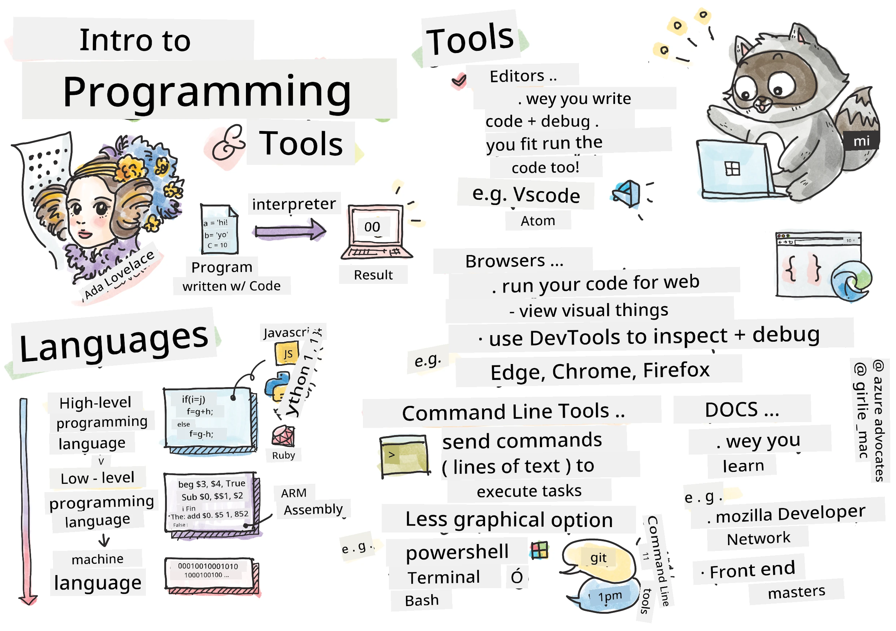
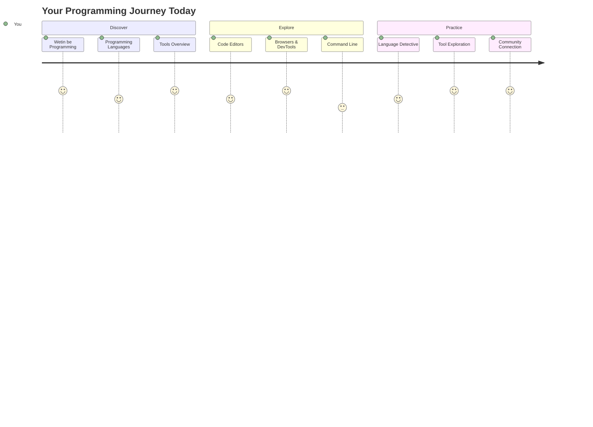
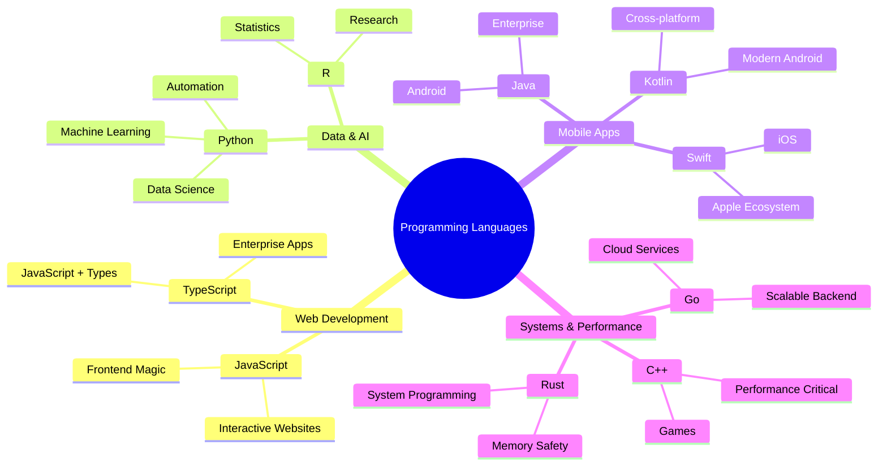
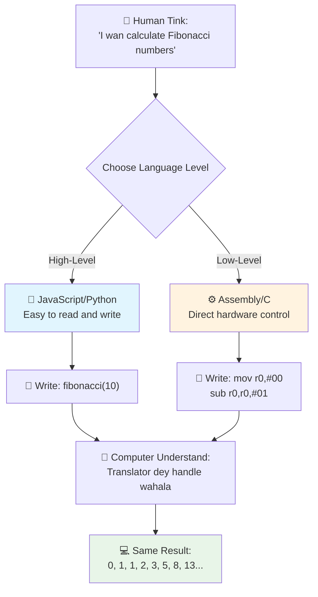
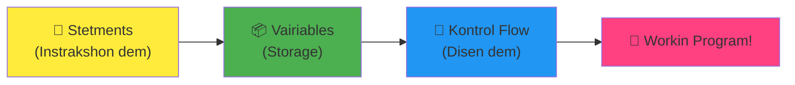
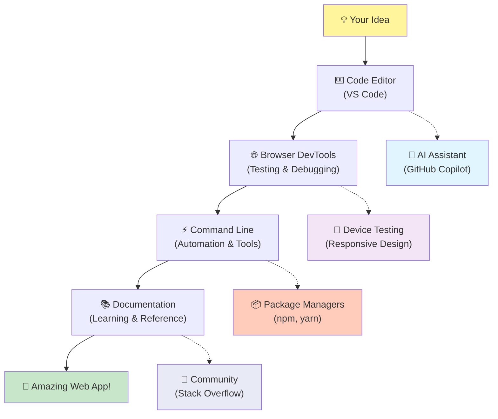
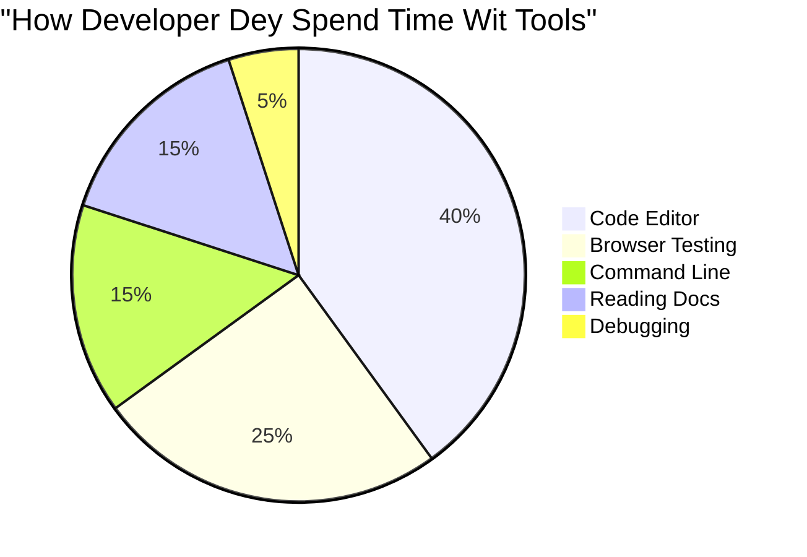
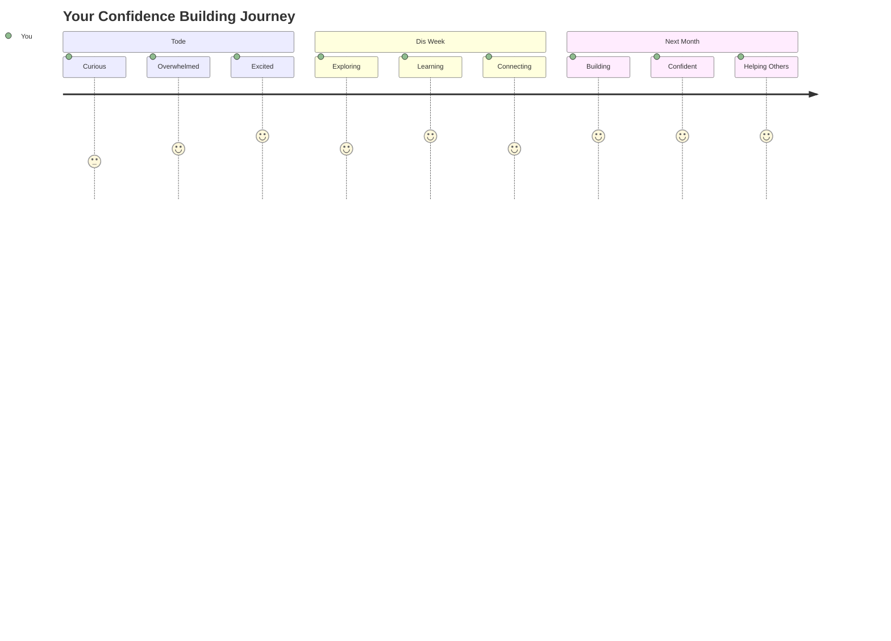

# Introduction to Programming Languages and Modern Developer Tools
 
Hey deh, future developer! 👋 Make I tell you sometin wey dey give me chills every single day? You dey go discover say programming no be only computer thing – e be like say you get actual superpowers to bring your wildest ideas come life!

You sabi dat moment wen you dey use your favourite app and everytin just click perfectly? Wen you tap button and sometin magical just happen wey make you talk "wow, how dem DO dat?" Well, one person like you – probably dey their favourite coffee shop for 2 AM dey sip their third espresso – na im write dat code wey create dat magic. And here na wetin go make your mind blow: by the end of dis lesson, you no go only sabi how dem do am, but you go dey itching to try am yourself!

Look, I totally understand if programming dey intimidate you now. Wen I first start, I really think say you need to be some kind math genius or dey code since you be five years old. But wetin change how I see am be say: programming na just like learning how to talk for new language. You start with "hello" and "thank you," then you go on order coffee, and before you know am, you dey do deep philosophical talks! But for dis case, you dey talk to computers, and honestly? Dem be the most patient people wey you fit ever talk to – dem no dey judge your mistakes and dem always dey excited to try again!

Today, we go explore the amazing tools wey dey make modern web development no be only possible, but e dey seriously addictive. I dey talk about the same editors, browsers, and workflows wey developers wey dey Netflix, Spotify, and your favourite indie app studio dey use everyday. And here na the part wey go make you do happy dance: most of these professional-grade, industry-standard tools na free!


> Sketchnote by [Tomomi Imura](https://twitter.com/girlie_mac)


```mermaid
journey
    title Your Programming Journey Today
    section Discover
      Wetin be Programming: 5: You
      Programming Languages: 4: You
      Tools Overview: 5: You
    section Explore
      Code Editors: 4: You
      Browsers & DevTools: 5: You
      Command Line: 3: You
    section Practice
      Language Detective: 4: You
      Tool Exploration: 5: You
      Community Connection: 5: You
```
## Make We See Wetin You Don Know Already!

Before we jump into the fun stuff, I dey curious – wetin you don sabi about this programming world? And listen, if you dey look these questions dey think "I no sabi anything for this," no wahala, e perfect! E mean say you dey exactly the right place. Think am like you dey stretch before workout – we just dey warm up brain muscles!

[Take the pre-lesson quiz](https://ff-quizzes.netlify.app/web/)


## The Adventure We Wan Go Together

Okay, I really dey excited about wetin we go explore today! Seriously, I wish I fit see your face wen some of these concepts just click. Here na the incredible journey we dey go together:

- **Wetin programming really be (and why e be the coolest tin ever!)** – We go discover how code be like invisible magic wey dey power everything wey dey around you, from that alarm wey sabi say na Monday morning to algorithm wey dey choose your Netflix suggestions perfectly
- **Programming languages and their amazing personalities** – Imagine say you enter party and every person get different superpowers and ways to solve problems. Na so programming language world be, and you go like meet dem!
- **The fundamental building blocks wey dey make digital magic happen** – Think of dem as ultimate creative LEGO set. Once you sabi how these pieces join together, you go realize say you fit build anything wey your imagination fit dream
- **Professional tools wey go make you feel like say person give you wizard wand** – I no dey joke here – these tools go really make you feel say you get superpowers, and the best part? Na the same ones pros dey use!

> 💡 **Make you sabi**: No even try memorize everything today! Right now, I just want make you feel that spark of excitement about wetin fit happen. The details go stick naturally as we practice together – na so real learning dey happen!

> You fit take this lesson on [Microsoft Learn](https://learn.microsoft.com/en-us/learn/modules/web-development-101/introduction-programming/?WT.mc_id=academic-77807-sagibbon)!

## So Wetin Programming *Really Be*?

Alright, make we tackle this big-big question: wetin programming be, really?

I go give you one story wey change how I dey think about am. Last week, I dey try explain to my mama how to use our new smart TV remote. I catch myself dey talk things like "Press the red button, but no be the big red button, the small red button for left... no, your other left... okay, now hold am for two seconds, no be one, no be three..." You don see am before? 😅

Na programming be that! Na the art of giving very detailed, step-by-step instructions to sometin wey powerful but need everything dey very clear. But instead of talk to your mama (wey fit ask "which red button?"), you dey explain to computer (wey dey do exactly wetin you talk, even if wetin you talk no be wetin you mean).

Wetin blow my mind wen I first learn this na say: computers really simple for their core. Dem only sabi two things – 1 and 0, wey mean "yes" and "no" or "on" and "off." Na im! But the magic part be say – we no need talk with 1s and 0s like say we dey The Matrix. Na programming languages dey come rescue us. Dem be like best translator wey fit take your normal human thoughts turn am to computer language.

And na wetin still dey give me chills every morning wen I wake up be this: literally *everything* wey digital for your life start from person like you, probably dey their pajamas with cup of coffee, dey type code for laptop. That Instagram filter wey make you fine? Somebody code am. The recommendation wey lead you to your new favourite song? Developer build that algorithm. The app wey dey help you divide dinner money with friends? Yes, somebody think say "this thing annoying, I fit fix am" and dem fix am!

When you learn to program, you no just dey pick new skill – you dey join incredible community of problem-solvers wey dey spend their days dey think, "What if I fit build sometin wey fit make somebody day better small?" Honestly, anything pass that cool?

✅ **Fun Fact Hunt**: Here na sometin cool to check when you get free time – who you think be world first computer programmer? I go give you hint: no go be who you dey expect! The story behind that person dey fascinating and e show say programming na always about creative problem-solving and thinking outside the box.

### 🧠 **Check-in Time: How You Dey Feel?**

**Take small time reflect:**
- E make sense to you to "give instructions to computers" now?
- Fit you think of daily task wey you want automate with programming?
- Wetin questions dey bubble for your mind about this whole programming tin?

> **Remember**: E normal if some concepts go still dey confuse you now. Learning programming na like learning new language – e go take time make your brain build neural pathways. You dey do well!

## Programming Languages Dem Be Like Different Flavors of Magic

Okay, this one go sound funny but hold on me – programming languages na like different music styles. Think am: you get jazz wey smooth and improvised, rock wey powerful and straightforward, classical wey elegant and structured, and hip-hop wey creative and expressive. Each style get its own vibe, community of fans, and each one perfect for different moods and occasions.

Programming languages work same way! You no go use same language build fun mobile game wey you go use chop big climate data, just like you no go play death metal for yoga class (well, most yoga classes anyway! 😄).

But wetin always blow my mind every time I think am be say: these languages be like the most patient, clever interpreter in the world dey seat beside you. You fit express your ideas in way wey natural to your human brain, and dem go do all the complex work to translate am to 1s and 0s wey computer dey speak. E be like you get friend wey sabi both "human creativity" and "computer logic" perfectly – and dem no dey tire, no need coffee break, and no go judge you if you ask same question twice!

### Popular Programming Languages and How Dem Dey Use Dem


```mermaid
mindmap
  root((Programming Languages))
    Web Development
      JavaScript
        Frontend Magic
        Interactive Websites
      TypeScript
        JavaScript + Types
        Enterprise Apps
    Data & AI
      Python
        Data Science
        Machine Learning
        Automation
      R
        Statistics
        Research
    Mobile Apps
      Java
        Android
        Enterprise
      Swift
        iOS
        Apple Ecosystem
      Kotlin
        Modern Android
        Cross-platform
    Systems & Performance
      C++
        Games
        Performance Critical
      Rust
        Memory Safety
        System Programming
      Go
        Cloud Services
        Scalable Backend
```
| Language | Best For | Why E Popular |
|----------|----------|------------------|
| **JavaScript** | Web development, user interfaces | E dey run for browsers and power interactive websites |
| **Python** | Data science, automation, AI | Easy to read and learn, powerful libraries |
| **Java** | Enterprise applications, Android apps | Platform-independent, strong for big systems |
| **C#** | Windows applications, game development | Strong Microsoft ecosystem support |
| **Go** | Cloud services, backend systems | Fast, simple, designed for modern computing |

### High-Level vs. Low-Level Languages

Okay, dis one na wetin break my brain wen I first dey learn, so I go share analogy wey make am clear to me – hope e go help you too!

Imagine say you dey visit country wey you no sabi language, and you need find bathroom quick (na all of us don experience am, right? 😅):

- **Low-level programming** na like you learn local dialect well well so you fit talk with grandmother wey dey sell fruit for corner with correct cultural talk, slang and insider jokes wey only person wey grow for there go understand. E impressive and very efficient... if you sabi am well! But e fit overwhelm you if na just bathroom you dey find.

- **High-level programming** na like you get correct local friend wey understand you well. You fit talk "I need restroom now" for plain English, and e go translate all the cultural stuff give you directions wey your non-local brain go understand well.

For programming term:
- **Low-level languages** (like Assembly or C) dey let you talk detailed talk with computer hardware, but you go need think like machine, which be... big brain change!
- **High-level languages** (like JavaScript, Python, or C#) dey let you think like human while dem do machine talk for back. Plus, dem get friendly communities full of people wey remember how e be to be new and dem really want help!

Guess which one I go tell you make you start with? 😉 High-level languages na like training wheels wey you no even want remove because dem make learning enjoyable!


```mermaid
flowchart TB
    A["👤 Human Tink:<br/>'I wan calculate Fibonacci numbers'"] --> B{Choose Language Level}
    
    B -->|High-Level| C["🌟 JavaScript/Python<br/>Easy to read and write"]
    B -->|Low-Level| D["⚙️ Assembly/C<br/>Direct hardware control"]
    
    C --> E["📝 Write: fibonacci(10)"]
    D --> F["📝 Write: mov r0,#00<br/>sub r0,r0,#01"]
    
    E --> G["🤖 Computer Understand:<br/>Translator dey handle wahala"]
    F --> G
    
    G --> H["💻 Same Result:<br/>0, 1, 1, 2, 3, 5, 8, 13..."]
    
    style C fill:#e1f5fe
    style D fill:#fff3e0
    style H fill:#e8f5e8
```
### Make I Show You Why High-Level Languages Dey More Friendly

Alright, I go show you something wey go prove why I love high-level languages, but first – I need you promise me one thing. Wen you see that first code example, no panic! E dey supposed look intimidating. Na so e suppose be!

We go look the same task write for two different styles. Both go create wetin dem call Fibonacci sequence – na beautiful math pattern wey every number na sum of two before am: 0, 1, 1, 2, 3, 5, 8, 13... (Fun fact: you go find this pattern everywhere for nature – sunflower seed spirals, pinecone patterns, even galaxies shape!)

Ready to see the difference? Make we go!

**High-level language (JavaScript) – Human-friendly:**

```javascript
// Step 1: Basic Fibonacci setup
const fibonacciCount = 10;
let current = 0;
let next = 1;

console.log('Fibonacci sequence:');
```

**Here na wetin dis code dey do:**
- **Declare** constant to show how many Fibonacci numbers we wan generate
- **Initialize** two variables to track current and next numbers for sequence
- **Set up** starting values (0 and 1) wey define Fibonacci pattern
- **Display** header message to identify our output

```javascript
// Step 2: Make de sequence wit one loop
for (let i = 0; i < fibonacciCount; i++) {
  console.log(`Position ${i + 1}: ${current}`);
  
  // Find de next number for inside de sequence
  const sum = current + next;
  current = next;
  next = sum;
}
```

**Break down wetin dey happen here:**
- **Loop** through each position with `for` loop
- **Display** each number with position using template literals
- **Calculate** next Fibonacci number by adding current and next values
- **Update** tracking variables to move to next iteration

```javascript
// Step 3: Modern functional approach
const generateFibonacci = (count) => {
  const sequence = [0, 1];
  
  for (let i = 2; i < count; i++) {
    sequence[i] = sequence[i - 1] + sequence[i - 2];
  }
  
  return sequence;
};

// Usage example
const fibSequence = generateFibonacci(10);
console.log(fibSequence);
```

**For above, we:**
- **Create** reusable function with modern arrow function style
- **Build** array to hold whole sequence instead of showing one by one
- **Use** array index to calculate each new number from old values
- **Return** whole sequence for flexible use elsewhere in program

**Low-level language (ARM Assembly) – Computer-friendly:**

```assembly
 area ascen,code,readonly
 entry
 code32
 adr r0,thumb+1
 bx r0
 code16
thumb
 mov r0,#00
 sub r0,r0,#01
 mov r1,#01
 mov r4,#10
 ldr r2,=0x40000000
back add r0,r1
 str r0,[r2]
 add r2,#04
 mov r3,r0
 mov r0,r1
 mov r1,r3
 sub r4,#01
 cmp r4,#00
 bne back
 end
```

You fit see say JavaScript version read almost like English instructions, while Assembly version get cryptic commands wey directly control computer processor. Both do same task, but high-level language easier for humans to understand, write, and maintain.

**Key differences wey you fit notice:**
- **Readability**: JavaScript dey use descriptive names like `fibonacciCount` but Assembly dey use cryptic labels like `r0`, `r1`
- **Comments**: High-level languages dey encourage explanatory comments wey dey make code self-documenting
- **Structure**: JavaScript logical flow dey match how humans dey think about problems step-by-step
- **Maintenance**: Updating the JavaScript version for different requirements easy and clear

✅ **About the Fibonacci sequence**: Dis absolutely beautiful number pattern (wey every number na di sum of di two wey dey front am: 0, 1, 1, 2, 3, 5, 8...) dey show everywhere for nature! You go find am for sunflower spirals, pinecone patterns, how nautilus shells con curve, and even how tree branches dey grow. E dey really mind-blowing how math and code fit help us understand and recreate di patterns wey nature dey use to create beauty!


## The Building Blocks Weh Make Di Magic Happen

Alright, now wey you don see how programming languages dey work for action, make we break down di basic parts wey dey make up every program wey dem ever write. Think of dem like di essential ingredients for your favorite recipe – once you sabi wetin each one dey do, you go fit read and write code for almost any language!

Dis one be like learning di grammar of programming. You remember for school when you learn about nouns, verbs, and how to put sentences together? Programming get im own grammar, and honestly, e dey more logical and easy pass English grammar! 😄

### Statements: Di Step-by-Step Instructions

Make we start with **statements** – dem be like individual sentences wey you dey use talk to your computer. Each statement dey tell the computer to do one particular thing, like to give directions: "Turn left here," "Stop for di red light," "Park for that spot."

Wetin I like about statements na how readable dem dey be normally. Check this one out:

```javascript
// Simple talk dem wey dey do one tin only
const userName = "Alex";                    
console.log("Hello, world!");              
const sum = 5 + 3;                         
```

**Na wetin dis code dey do:**
- **Declare** one constant variable to store user name
- **Display** greeting message for console output
- **Calculate** and store result of one mathematical operation

```javascript
// Stetments wey dey interact wit web pages
document.title = "My Awesome Website";      
document.body.style.backgroundColor = "lightblue";
```

**Step by step, na wetin dey happen:**
- **Modify** webpage title wey dey appear for browser tab
- **Change** background color for di whole page body

### Variables: Your Program Memory System

Okay, **variables** na one of my favorite concepts to teach because dem dey so much like tins wey you dey use every day!

Think about your phone contact list small. You no dey memorize everybody phone number – you save "Mom," "Best Friend," or "Pizza Place Weh De Deliver Till 2 AM" and your phone go remember di actual numbers. Variables dey work exactly like dat! Dem be like containers with label wey your program fit put information and collect am later with name wey dey make sense.

Wetin dey really cool be say: variables fit change as your program dey run (dat na why dem call am "variable" – you see wetin dem do?). Just like how you fit update pizza place contact when you find better one, variables fit update as your program learn new tins or as things change!

Make I show you how simple and beautiful dis one fit be:

```javascript
// Step 1: Dem dey create basic variables
const siteName = "Weather Dashboard";        
let currentWeather = "sunny";               
let temperature = 75;                       
let isRaining = false;                      
```

**Understanding these concepts:**
- **Store** unchanging values for `const` variables (like site name)
- **Use** `let` for values wey fit change for your program
- **Assign** different data types: strings (text), numbers, and booleans (true/false)
- **Choose** descriptive names wey explain wetin each variable get inside

```javascript
// Step 2: Wok wit objek dem to group di related data
const weatherData = {                       
  location: "San Francisco",
  humidity: 65,
  windSpeed: 12
};
```

**For di code up top, we:**
- **Created** one object to group related weather information together
- **Organized** many pieces of data under one variable name
- **Used** key-value pairs to label each piece of information well well

```javascript
// Step 3: Di way wey you go use and update variables
console.log(`${siteName}: Today is ${currentWeather} and ${temperature}°F`);
console.log(`Wind speed: ${weatherData.windSpeed} mph`);

// How to update di variables wey fit change
currentWeather = "cloudy";                  
temperature = 68;                          
```

**Make we understand each part:**
- **Display** info using template literals wey get `${}` syntax
- **Access** object properties using dot notation (`weatherData.windSpeed`)
- **Update** variables wey dem declare with `let` to show changing conditions
- **Combine** many variables to create meaningful messages

```javascript
// Step 4: Modern destructuring to make code beta and clean
const { location, humidity } = weatherData; 
console.log(`${location} humidity: ${humidity}%`);
```

**Wetin you need sabi:**
- **Extract** specific properties from objects using destructuring assignment
- **Create** new variables automatically wey get same names as object keys
- **Simplify** code by avoiding repetitive dot notation

### Control Flow: Teach Your Program How To Think

Okay, dis na where programming go really blow your mind! **Control flow** na to teach your program how to make smart decisions, just like how you dey do every day without even dey think well.

Imagine dis: dis morning you probably do something like "If e dey rain, I go carry umbrella. If e cold, I go wear jacket. If I late, I go skip breakfast and grab coffee sef." Your brain dey naturally follow this if-then logic plenty times every day!

Na dis one dey make programs look smart and alive, no be like say dem dey just follow boring, predictable script. Dem fit actually look situation, check wetin dey happen, and respond well. E just be like you give your program brain wey fit adapt and choose!

You wan see how beautiful dis work? Make I show you:

```javascript
// Step 1: Simple if-else ting dem
const userAge = 17;

if (userAge >= 18) {
  console.log("You can vote!");
} else {
  const yearsToWait = 18 - userAge;
  console.log(`You'll be able to vote in ${yearsToWait} year(s).`);
}
```

**Na wetin dis code dey do:**
- **Check** if user age meet voting age
- **Execute** different code blocks based on wetin condition show
- **Calculate** and show how long e go be before person fit vote if e under 18
- **Give** specific and helpful feedback for each situation

```javascript
// Step 2: Plenti condition wit logical operators
const userAge = 17;
const hasPermission = true;

if (userAge >= 18 && hasPermission) {
  console.log("Access granted: You can enter the venue.");
} else if (userAge >= 16) {
  console.log("You need parent permission to enter.");
} else {
  console.log("Sorry, you must be at least 16 years old.");
}
```

**Break down wetin happen here:**
- **Combine** many conditions with `&&` (and) operator
- **Create** hierarchy of conditions using `else if` for many scenarios
- **Handle** all possible cases with final `else` statement
- **Give** clear and actionable feedback for all different situations

```javascript
// Step 3: Short condition wit ternary operator
const votingStatus = userAge >= 18 ? "Can vote" : "Cannot vote yet";
console.log(`Status: ${votingStatus}`);
```

**Wetin you need remember:**
- **Use** ternary operator (`? :`) for simple two-option conditions
- **Write** condition first, then `?`, then true result, then `:`, then false result
- **Apply** dis pattern when you want assign values based on condition

```javascript
// Step 4: Dey handle plenti spesifik case dem
const dayOfWeek = "Tuesday";

switch (dayOfWeek) {
  case "Monday":
  case "Tuesday":
  case "Wednesday":
  case "Thursday":
  case "Friday":
    console.log("It's a weekday - time to work!");
    break;
  case "Saturday":
  case "Sunday":
    console.log("It's the weekend - time to relax!");
    break;
  default:
    console.log("Invalid day of the week");
}
```

**Dis code dey do dis kain tins:**
- **Match** variable value against many specific cases
- **Group** similar cases together (weekdays versus weekends)
- **Execute** correct code block when match show
- **Include** `default` case to handle unexpected values
- **Use** `break` statement to make code no continue go next case

> 💡 **Real-world analogy**: Think of control flow like di most patient GPS wey dey give directions. E fit talk "If traffic dey Main Street, make you use highway. If construction block highway, try scenic route." Programs dey use same kind conditional logic to respond smartly to different situations and always give users best experience.

### 🎯 **Concept Check: Building Blocks Mastery**

**Make we see how you dey do for fundamentals:**
- You fit explain difference between variable and statement for your own words?
- Think of real-world case where you go use if-then decision (like our voting example)
- Wetin one thing about programming logic wey surprise you?

**Quick confidence booster:**

```mermaid
flowchart LR
    A["📝 Stetments<br/>(Instrakshon dem)"] --> B["📦 Vairiables<br/>(Storage)"] --> C["🔀 Kontrol Flow<br/>(Disen dem)"] --> D["🎉 Workin Program!"]
    
    style A fill:#ffeb3b
    style B fill:#4caf50
    style C fill:#2196f3
    style D fill:#ff4081
```
✅ **Wet in dey come next**: We go really enjoy am as we dey go deeper inside dis concepts together! Now, just focus on the excitement about all di amazing tins wey dey front of you. The skills and techniques go naturally stick as we practice together – I promise say dis one go fun pass wetin you fit expect!

## Tools of the Trade

Alright, dis na where I go really excited until I near burst! 🚀 We go yan about di incredible tools wey go make you feel like you hold di keys to one digital spaceship.

You sabi how chef get balanced knives wey feel like part of their hands? Or how musician get one guitar wey dey sing the moment dem hold am? Well, developers get our own version of dis magical tools, and wetin go really surprise you be say most of dem na complete free!

I dey almost jump for joy thinking about sharing dis with you because dem don change how we dey build software completely. We dey talk AI-powered coding assistants wey fit help write your code (I no dey joke o!), cloud environments where you fit build full applications from anywhere wey get Wi-Fi, and debugging tools wey dey so sophisticated dem be like X-ray vision for your programs.

And one kain way wey I still dey shiver be say: these no be "beginner tools" wey you go soon outgrow. These ones na exact professional-grade tools wey Google, Netflix, and that indie app studio wey you love dey use now. You go feel like real pro as you dey use dem!


```mermaid
graph TD
    A["💡 Your Idea"] --> B["⌨️ Code Editor<br/>(VS Code)"] 
    B --> C["🌐 Browser DevTools<br/>(Testing & Debugging)"]
    C --> D["⚡ Command Line<br/>(Automation & Tools)"]
    D --> E["📚 Documentation<br/>(Learning & Reference)"]
    E --> F["🚀 Amazing Web App!"]
    
    B -.-> G["🤖 AI Assistant<br/>(GitHub Copilot)"]
    C -.-> H["📱 Device Testing<br/>(Responsive Design)"]
    D -.-> I["📦 Package Managers<br/>(npm, yarn)"]
    E -.-> J["👥 Community<br/>(Stack Overflow)"]
    
    style A fill:#fff59d
    style F fill:#c8e6c9
    style G fill:#e1f5fe
    style H fill:#f3e5f5
    style I fill:#ffccbc
    style J fill:#e8eaf6
```
### Code Editors and IDEs: Your New Digital Best Friends

Make we yan about code editors – dem go soon become your favorite places to hang out! Think of dem as your personal coding sanctuary where you go spend most time dey craft and improve your digital work.

But wetin magical about modern editors be say: dem no be just fine text editors. Dem be like di most brilliant, supportive coding mentor wey dey beside you 24/7. Dem go catch your typos before you notice dem, dem go suggest better ways to improve wey go make you look like genius, help you understand wetin every code do, and some fit even predict wetin you wan type next and suggest to complete your thought!

I remember when I first find auto-completion – I really feel like say I dey live for future. You start to type something, and your editor go say, "Hey, na dis function you mean wey do exactly wetin you want?" E be like you get mind reader as coding buddy!

**Wet make these editors dey so incredible?**

Modern code editors get plenty powerful features wey go boost your productivity:

| Feature | What E Dey Do | Why E Help |
|---------|--------------|------------|
| **Syntax Highlighting** | Color different parts of your code | Make code easier to read and spot errors |
| **Auto-completion** | Suggest code as you type | Speed up coding and reduce typos |
| **Debugging Tools** | Help you find and fix errors | Save you hours of troubleshooting time |
| **Extensions** | Add special features | Customize your editor for any technology |
| **AI Assistants** | Suggest code and explain | Make learning and work faster |

> 🎥 **Video Resource**: You wan see these tools for action? Check this [Tools of the Trade video](https://youtube.com/watch?v=69WJeXGBdxg) for full overview.

#### Recommended Editors for Web Development

**[Visual Studio Code](https://code.visualstudio.com/?WT.mc_id=academic-77807-sagibbon)** (Free)
- Di most popular for web developers
- Excellent extension ecosystem
- Built-in terminal and Git integration
- **Must-have extensions**:
  - [GitHub Copilot](https://marketplace.visualstudio.com/items?itemName=GitHub.copilot) - AI code suggestions
  - [Live Share](https://marketplace.visualstudio.com/items?itemName=MS-vsliveshare.vsliveshare) - Real-time collaboration
  - [Prettier](https://marketplace.visualstudio.com/items?itemName=esbenp.prettier-vscode) - Automatic code formatting
  - [Code Spell Checker](https://marketplace.visualstudio.com/items?itemName=streetsidesoftware.code-spell-checker) - Catch typos for your code

**[JetBrains WebStorm](https://www.jetbrains.com/webstorm/)** (Paid, free for students)
- Advanced debugging and testing tools
- Intelligent code completion
- Built-in version control

**Cloud-Based IDEs** (Various prices)
- [GitHub Codespaces](https://github.com/features/codespaces) - Full VS Code inside browser
- [Replit](https://replit.com/) - Great for learning and sharing code
- [StackBlitz](https://stackblitz.com/) - Instant full-stack web development

> 💡 **Getting Started Tip**: Start with Visual Studio Code – e dey free, many people dey use am, and e get big community wey dey create tutorials and extensions.


### Web Browsers: Your Secret Development Laboratory

Okay, ready to blow your mind fully! You sabi say you dey use browsers to scroll social media and watch videos? But e turn out say dem don dey hide one incredible secret developer lab all dis time, just waiting for you to find am!

Every time you right-click for a webpage and choose "Inspect Element," you dey open hidden developer tools world wey really get more power pass some expensive software wey I used to pay hundreds dollars for. E be like say your normal kitchen dey hide professional chef laboratory behind secret panel!
Di first time wey pesin show me browser DevTools, I spend like three hours just dey click around and dey para "WAIT, E FIT DO DAT TOO?!" You fit literally change any website for real-time, see how e dey load fast fast, test how your site go be for different devices, and even debug JavaScript like pro. E seriously dey blow mind!

**Na why browser na your secret weapon be dis:**

When you dey create website or web application, you need make you see how e go look and behave for real world. Browsers no only dey show your work but e dey give you correct feedback about performance, accessibility, and any wahala wey fit show.

#### Browser Developer Tools (DevTools)

Modern browsers get full development tools dem:

| Tool Category | Wetin E Dey Do | Example Use Case |
|---------------|----------------|-----------------|
| **Element Inspector** | View and change HTML/CSS in real-time | Adjust style to see result sharp sharp |
| **Console** | See error messages and try JavaScript | Debug problems and play with code |
| **Network Monitor** | Track how resources dey load | Make load time beta and sharp |
| **Accessibility Checker** | Test to make sure design dey inclusive | Make sure your site fit work for everybody |
| **Device Simulator** | Preview for different screen sizes | Test responsive design without many devices |

#### Browsers wey I recommend for Development

- **[Chrome](https://developers.google.com/web/tools/chrome-devtools/)** - Industry-standard DevTools with many documentation
- **[Firefox](https://developer.mozilla.org/docs/Tools)** - Beta CSS Grid and accessibility tools
- **[Edge](https://docs.microsoft.com/microsoft-edge/devtools-guide-chromium/?WT.mc_id=academic-77807-sagibbon)** - Based on Chromium with Microsoft developer resources

> ⚠️ **Important Testing Tip**: Always test your websites inside different browsers! Wetin work well for Chrome fit waka different for Safari or Firefox. Pro developers test their work for all main browsers to make sure user experience dey consistent.

### Command Line Tools: Your Gateway to Developer Superpowers

Okay, make we yarn tori honest about command line, because I wan make you hear am from person wey sabi. The first time wey I see am – na just black scary screen wey dey blink text – I dey think, "No way, no way! Dis one big scary movie kind thing from 1980s hacker film, and I no be that kind person for this!" 😅

But wetin I wish pesin talk to me that time, and which I dey tell you now be say: command line no scary – na like you dey talk directly to your computer. Think am like the difference between ordering food with nice app wey get pictures and menu (easy ehn) versus waka go your favorite local restaurant where chef sabi wetin you like and fit cook better food just based on the words "surprise me."

Command line na where developers dey feel like real wizards. You go type some magical words (no be magic, na command, but e dey feel like magic!), press enter, and BOOM – you don create whole project box, install strong tools from all over, or deploy your app to internet for millions to see. Once you taste that power, e go sweet you die!

**Why command line go be your favorite tool:**

Even though GUI tools good for many things, command line sharp for automation, precision, and speed. Plenty development tools mainly dey work through command line, and if you sabi use am well, e fit boost your productivity well well.

```bash
# Step 1: Make and waka go project folder
mkdir my-awesome-website
cd my-awesome-website
```

**Wetin dis code dey do:**
- **Create** new folder wey dem call "my-awesome-website" for your project
- **Navigate** enter new folder to start work

```bash
# Step 2: Start di project wit package.json
npm init -y

# Install beta development tools
npm install --save-dev vite prettier eslint
npm install --save-dev @eslint/js
```

**Step by step, wetin dey happen:**
- **Initialize** new Node.js project with default settings using `npm init -y`
- **Install** Vite as modern build tool for fast development and production builds
- **Add** Prettier for automatic code formatting and ESLint for code quality check
- **Use** `--save-dev` flag to mark dem as only development dependencies

```bash
# Step 3: Make di project structure and files
mkdir src assets
echo '<!DOCTYPE html><html><head><title>My Site</title></head><body><h1>Hello World</h1></body></html>' > index.html

# Start di development server
npx vite
```

**For above, we don:**
- **Organize** our project by making separate folders for source code and assets
- **Generate** simple HTML file with correct document structure
- **Start** Vite development server for live reload and hot module replacement

#### Essential Command Line Tools for Web Development

| Tool | Purpose | Why You Need Am |
|------|---------|-----------------|
| **[Git](https://git-scm.com/)** | Version control | Track changes, work with others, backup your work |
| **[Node.js & npm](https://nodejs.org/)** | JavaScript runtime & package management | Run JavaScript outside browser, install modern dev tools |
| **[Vite](https://vitejs.dev/)** | Build tool & dev server | Fast development with hot module replacement |
| **[ESLint](https://eslint.org/)** | Code quality | Find and fix JavaScript issues automatically |
| **[Prettier](https://prettier.io/)** | Code formatting | Make sure your code consistent and readable |

#### Platform-Specific Options

**Windows:**
- **[Windows Terminal](https://docs.microsoft.com/windows/terminal/?WT.mc_id=academic-77807-sagibbon)** - Modern terminal with many features
- **[PowerShell](https://docs.microsoft.com/powershell/?WT.mc_id=academic-77807-sagibbon)** 💻 - Strong scripting environment
- **[Command Prompt](https://learn.microsoft.com/windows-server/administration/windows-commands/windows-commands)** 💻 - Old school Windows command line

**macOS:**
- **[Terminal](https://support.apple.com/guide/terminal/)** 💻 - Inbuilt terminal app
- **[iTerm2](https://iterm2.com/)** - Better terminal with advanced features

**Linux:**
- **[Bash](https://www.gnu.org/software/bash/)** 💻 - Standard Linux shell
- **[KDE Konsole](https://docs.kde.org/trunk5/en/konsole/konsole/index.html)** - Advanced terminal emulator

> 💻 = Pre-installed for operating system

> 🎯 **Learning Path**: Start with basics like `cd` (change directory), `ls` or `dir` (list files), and `mkdir` (make folder). Try modern workflow commands like `npm install`, `git status`, and `code .` (open current folder on VS Code). As you go, you go naturally sabi advanced commands and automation.

### Documentation: Your Always-Available Learning Mentor

Okay, make I share small secret wey go make you feel beta as beginner: even the best developers spend plenty time dey read documentation. E no be because dem no sabi, na because e be like wisdom!

Think documentation na teachers wey get plenty patience, sabi well, and dem dey 24/7. You get wahala 2 AM? Documentation go dey there like warm hug and answer wey correct. You wan learn new feature wey everybody dey talk about? Documentation go show you step by step example. You wan understand why something dey work the way e be? Documentation ready to explain am make e clear.

One thing wey change how I take see am be say: web development movement dey fast well, and nobody go dey remember everything. I don see senior developers wey get 15+ years experience still dey check basic syntax, and e no shame. E no be about perfect memory; na about sabi where you go find correct answer fast and how to take apply am.

**Here na where real magic dey happen:**

Pro developers spend big part of their time dey read documentation – no be because dem no sabi, but because web development changes so fast, you gats dey learn continuously. Great documentation go help you understand not just *how* but *why* and *when* to use something.

#### Essential Documentation Resources

**[Mozilla Developer Network (MDN)](https://developer.mozilla.org/docs/Web)**  
- Di gold standard for web tech documentation  
- Full guide for HTML, CSS, and JavaScript  
- Get browser compatibility info  
- Get practical examples and interactive demos  

**[Web.dev](https://web.dev)** (by Google)  
- Modern web dev best practices  
- Performance optimization guides  
- Accessibility and inclusive design rules  
- Case studies from real projects  

**[Microsoft Developer Documentation](https://docs.microsoft.com/microsoft-edge/#microsoft-edge-for-developers)**  
- Edge browser dev resources  
- Progressive Web App guides  
- Cross-platform dev insight  

**[Frontend Masters Learning Paths](https://frontendmasters.com/learn/)**  
- Structured learning programs  
- Video courses from pros  
- Hands-on coding exercises  

> 📚 **Study Strategy**: No try memorize documentation – instead, learn how to waka inside am well. Bookmark common references and practice how to use search to find info fast.

### 🔧 **Tool Mastery Check: Wetin You Feel?**

**Think small:**  
- Which tool you dey eager to try first? (No wrong answer!)  
- Command line still dey scary, or you dey curious?  
- Fit imagine using browser DevTools to see wetin dey happen for your favorite websites?


```mermaid
pie title "How Developer Dey Spend Time Wit Tools"
    "Code Editor" : 40
    "Browser Testing" : 25
    "Command Line" : 15
    "Reading Docs" : 15
    "Debugging" : 5
```  
> **Fun insight**: Most developers spend about 40% of their time for code editor, but see how much time dem spend for testing, learning, and problem-solving. Programming no just about writing code – na about creating experience!

✅ **Food for thought**: Think about how tools for building websites (development) fit different from tools for designing how e go look (design)? Na like difference between architect wey design beta house and contractor wey build am. Both important but dem get different toolbox! This kind thinking go help you see better picture of how websites dey come to life.

## GitHub Copilot Agent Challenge 🚀

Use Agent mode to complete the challenge below:

**Description:** Explore features of modern code editor or IDE and show how e fit improve your workflow as web developer.

**Prompt:** Choose code editor or IDE (like Visual Studio Code, WebStorm, or cloud IDE). List three features or extensions wey help you write, debug, or maintain code well. Give short explanation how each one help your workflow.

---

## 🚀 Challenge

**Okay detective, ready for your first case?**

Now wey you don get this solid foundation, I get adventure wey go show you how programming world sweet and different. And no worry – no need write code yet! Think yourself as programming language detective for your first exciting case!

**Your mission, if you accept:**
1. **Become language explorer**: Pick three programming languages from different places – maybe one wey build websites, one wey build mobile apps, and one wey dey crunch data for scientists. Find sample same simple task for all 3 languages. I promise you go shocked how different dem be even though dem do same thing!

2. **Uncover origin stories**: Wetin make each language special? Every language come because pesin think, "Make I solve this problem better." Try find out what problems dem solve. Some stories sweet die!

3. **Meet communities**: Check how welcoming and passionate each language community be. Some get millions of devs wey share knowledge and help each other, some small but tight and supportive. You go enjoy their different style.

4. **Follow your gut feeling**: Which language you feel easiest now? No stress for perfect choice – just listen your heart! No wrong answer, you fit always explore another later.

**Bonus detective work**: Find major website or app wey each language power. You go shock find out wetin make Instagram, Netflix or that mobile game you no fit stop to dey play!

> 💡 **Remember**: No try be expert today. You just dey find your way around before you settle. Take your time, enjoy am, and let curiosity guide you!

## Make We Celebrate Wetin You Don Learnt!

Wow! You don gather plenty beta info today! I happy to see how much for this amazing journey don stick with you. And remember – no be test make you get everything perfect. Na celebration of all di cool things wey you don learn about this fascinating world wey you dey ready enter!

[Take the post-lesson quiz](https://ff-quizzes.netlify.app/web/)

## Review & Self Study

**Take your time explore and enjoy am!**
You don cover plenty ground today, and dat na sometin wey you suppose dey proud of! Now na di fun part dey come – to explore di topics wey spark your curiosity. Make you remember, dis no be homework – na adventure!

**Dive deeper into wetin dey excite you:**

**Get hands-on wit programming languages:**
- Visit di official websites of 2-3 languages wey catch your eye. Each one get dia own personality and story!
- Try some online coding playgrounds like [CodePen](https://codepen.io/), [JSFiddle](https://jsfiddle.net/), or [Replit](https://replit.com/). No fear to experiment – you no fit spoil anything!
- Read about how your favorite language come be. Seriously, some of these origin stories dey fascinating and e go help you understand why languages dey work di way dem dey.

**Get comfortable wit your new tools:**
- Download Visual Studio Code if you never do am – e free and you go love am!
- Spend small time dey browse di Extensions marketplace. E be like app store for your code editor!
- Open your browser Developer Tools and just dey click around. No worry about understanding everything – just try get familiar wit wetin dey dia.

**Join di community:**
- Follow some developer communities for [Dev.to](https://dev.to/), [Stack Overflow](https://stackoverflow.com/), or [GitHub](https://github.com/). Di programming community dey very welcoming to newcomers!
- Watch some beginner-friendly coding videos for YouTube. Plenty better creators dey wey still sabi di feeling when dem just dey start.
- Consider to join local meetups or online communities. Trust me, developers like to help people wey dey start!

> 🎯 **Listen, na wetin I want make you remember be dis**: No be say you go become coding wizard overnight! Right now, na just to dey learn about this amazing new world wey you dey enter. Take your time, enjoy di journey, and no forget – every single developer wey you admire bin once dey where you dey now, dey feel excited and maybe small scared. Na normal thing, and e mean say you dey do am correct!


## Assignment

[Reading the Docs](assignment.md)

> 💡 **Small push for your assignment**: I go like see you explore some tools we never talk about yet! No use di editors, browsers, and command line tools wey we don yan before – plenty beta development tools dey wey dey wait make you find dem. Look for ones wey dem dey maintain well and get strong, helpful communities (dem dey usually get the best tutorials and most supportive people when you block and need help).

---

## 🚀 Your Programming Journey Timeline

### ⚡ **Wetn You Fit Do for Next 5 Minutes**
- [ ] Bookmark 2-3 programming language websites wey catch your eye
- [ ] Download Visual Studio Code if you never do
- [ ] Open your browser DevTools (F12) and click around any website
- [ ] Join one programming community (Dev.to, Reddit r/webdev, or Stack Overflow)

### ⏰ **Wetn You Fit Do This Hour**
- [ ] Finish di post-lesson quiz and think about your answers
- [ ] Set up VS Code wit di GitHub Copilot extension
- [ ] Try one "Hello World" example for 2 different programming languages online
- [ ] Watch one "Day in di Life of a Developer" video for YouTube
- [ ] Start your programming language detective work (from di challenge)

### 📅 **Your Week-Long Adventure**
- [ ] Finish di assignment and explore 3 new development tools
- [ ] Follow 5 developers or programming accounts on social media
- [ ] Try build small tin for CodePen or Replit (even na just "Hello, [Your Name]!")
- [ ] Read one developer blog post about how person journey for coding be
- [ ] Join virtual meetup or watch programming talk
- [ ] Start to learn your chosen language wit online tutorials

### 🗓️ **Your Month-Long Transformation**
- [ ] Build your first small project (even simple webpage count!)
- [ ] Contribute to open-source project (start wit documentation fixes)
- [ ] Mentor person wey just dey start their programming journey
- [ ] Create your developer portfolio website
- [ ] Connect wit local developer communities or study groups
- [ ] Plan your next learning milestone

### 🎯 **Final Reflection Check-in**

**Before you move on, take small time celebrate:**
- Wetin be one tin about programming wey excite you today?
- Which tool or concept you wan explore first?
- How you feel about starting this programming journey?
- Wetin be one question you go like ask developer right now?


```mermaid
journey
    title Your Confidence Building Journey
    section Tode
      Curious: 3: You
      Overwhelmed: 4: You
      Excited: 5: You
    section Dis Week
      Exploring: 4: You
      Learning: 5: You
      Connecting: 4: You
    section Next Month
      Building: 5: You
      Confident: 5: You
      Helping Others: 5: You
```
> 🌟 **Remember**: Every expert bin once be beginner. Every senior developer once feel exactly how you dey feel now – excited, maybe small overwhelmed, and definitely curious about wetin fit possible. You dey better company, and dis journey go sweet well well. Welcome to di wonderful world of programming! 🎉

---

<!-- CO-OP TRANSLATOR DISCLAIMER START -->
**Disclaimer**:  
Dis document don translate wit AI translation service wey dem dey call [Co-op Translator](https://github.com/Azure/co-op-translator). Even though we dey try make am correct, abeg sabi say automated translations fit get errors or wahala inside. Di original document wey e original language na di correct original source. If na serious information, e better make person wey sabi translate am human do am. We no go hold ourselves responsible for any misunderstanding or wrong meaning wey fit happen from using dis translation.
<!-- CO-OP TRANSLATOR DISCLAIMER END -->