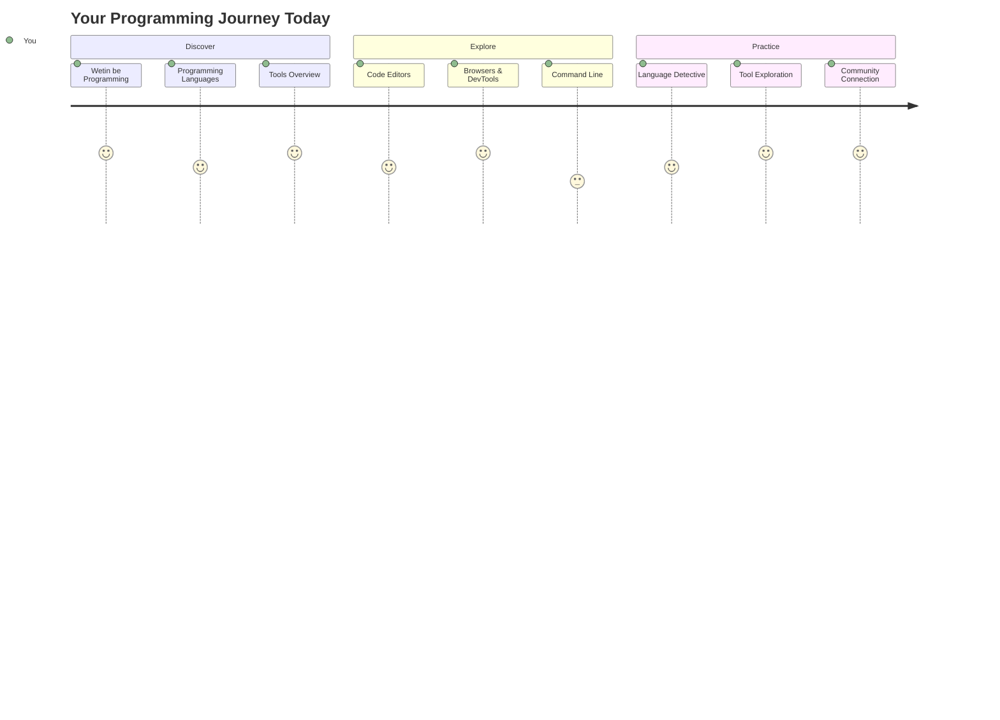
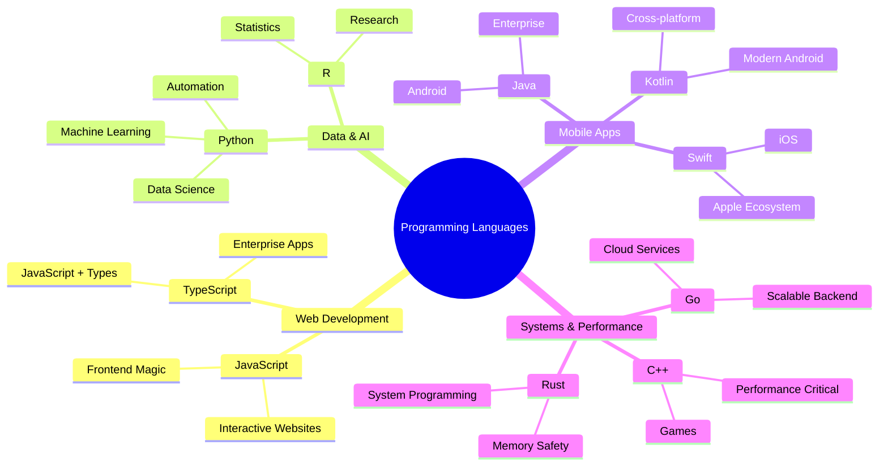
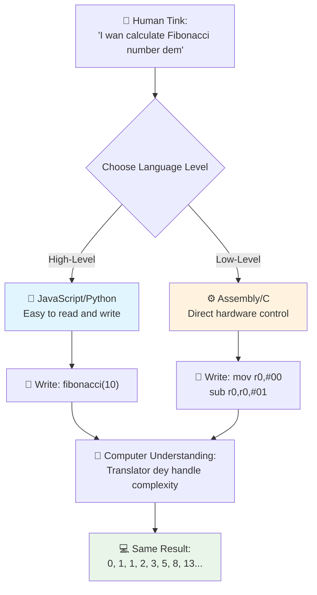
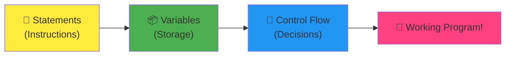
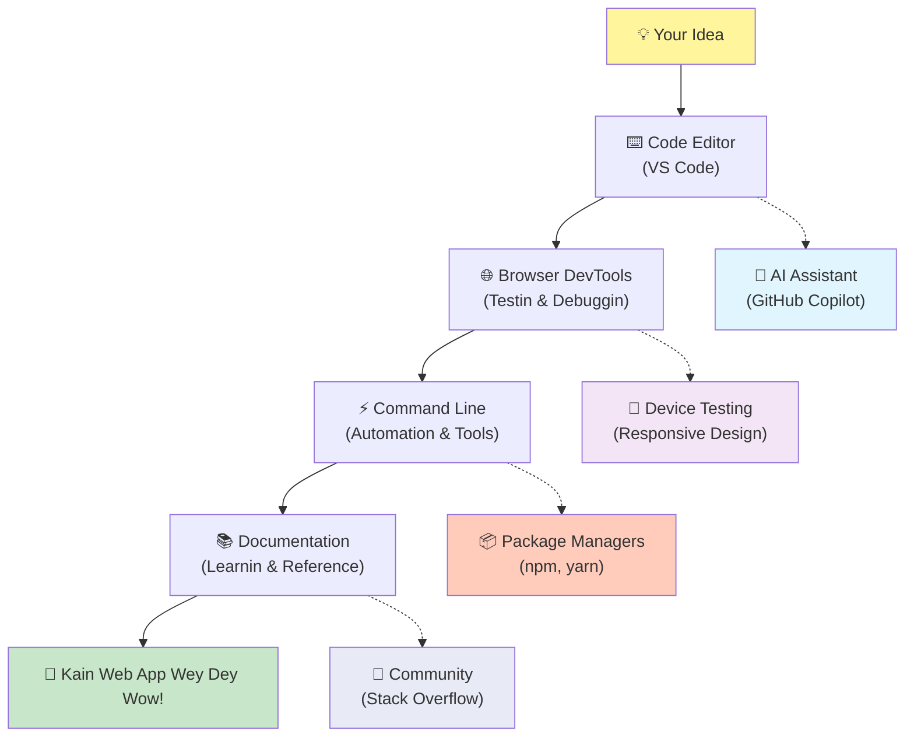
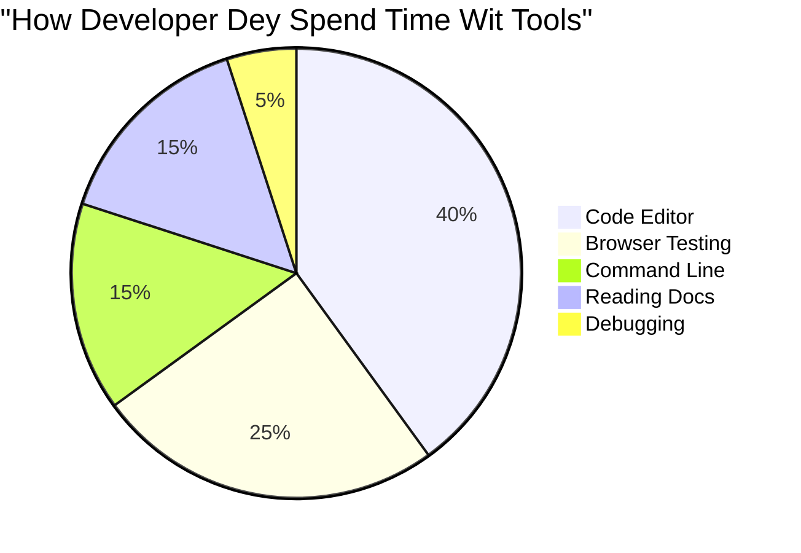

# Introduction to Programming Languages and Modern Developer Tools
 
Hey deh, oga developer wey go be! 👋 Make I yan you sometin wey dey always give me goosebumps everyday? You dey go discover say programming no be just about computers – na like you get real superpowers to make your wildest ideas come alive!

You sabi dat moment wen you dey use your favourite app and everytin just dey work perfectly? Wen you tap button and sometin magical happen wey make you yan "wow, how dem take DO am?" Well, pesin wey be like you – fit dey their favourite coffee shop for 2 AM with their third espresso – na im write di code wey make dat magic happen. And dis one go scatter your brain: by di end of dis lesson, you no go only sabi how dem do am, but you go dey itching to try am by yourself!

Look, I totally understand if programming dey scary now. Wen I first start, I truth truth believe say you need to be some kind math genius or don dey code since you be pikin. But dis one change my mind: programming na like how you dey learn to yarn for new language. You start with "hello" and "thank you," then you fit order coffee, and before you know am, you dey yarn serious deep philosophical talk! But for here, you dey yarn with computers, and truth be say? Dem be the most patient people wey you get – dem no dey judge your mistake and dem dey always happy to try again!

Today, we go explore the beta tools wey make modern web development no just possible, but e dey addictive serious. I dey talk about the exact editors, browsers, and workflows wey developers for Netflix, Spotify, and your favourite indie app studio dey use everyday. And here be di part wey go make you do happy dance: most of dis professional-grade, industry-standard tools na free!


> Sketchnote by [Tomomi Imura](https://twitter.com/girlie_mac)


```mermaid
journey
    title Your Programming Journey Today
    section Discover
      Wetin be Programming: 5: You
      Programming Languages: 4: You
      Tools Overview: 5: You
    section Explore
      Code Editors: 4: You
      Browsers & DevTools: 5: You
      Command Line: 3: You
    section Practice
      Language Detective: 4: You
      Tool Exploration: 5: You
      Community Connection: 5: You
```
## Make We See Wetin You Don Sabi!

Before we jump enter di fun tin dem, I dey curious – wetin you don sabi about dis programming world? And listen, if you dey look these question dem dey think "I no get any clue at all about any of dis," dat no be problem, e perfect! E mean say you dey exactly the right place. Treat this quiz like warm up before workout – na to ginger those brain muscles!

[Take the pre-lesson quiz](https://ff-quizzes.netlify.app/web/)


## The Adventure Wey We Dey Go Enter Together

Okay, I full ground with excitement for wetin we go explore today! Seriously, I wish I fit see your face wen some of these concepts click. Here na the beta journey we dey go together:

- **Wetn programming really be (and why e be the coolest tins ever!)** – We go discover how code be the invisible magic wey power everytin around you, from that alarm wey sabi say na Monday morning, to the algorithm wey dey select correct Netflix recommendations for you
- **Programming languages and their amazing personalities** – Imagine say you enter party wey every pesin get different superpowers and ways to solve problem. Dat na how programming language world be, and you go enjoy to meet dem!
- **The fundamental building blocks wey make digital magic happen** – Think of dem like ultimate creative LEGO set. Once you sabi how dem pieces take join, you go realize say you fit build anything wey your imagination fit dream up
- **Professional tools wey go make you feel like say dem give you wizard wand** – I no dey exaggerate here – these tools go really make you feel like say you get superpowers, and di beta part? Na the same ones pros dey use!

> 💡 **Listen here**: No try memorise everytin today! Right now, I just want make you feel that excitement spark about wetin fit happen. The details go stick naturally as we dey practice – na so real learning dey happen!

> You fit do this lesson for [Microsoft Learn](https://learn.microsoft.com/en-us/learn/modules/web-development-101/introduction-programming/?WT.mc_id=academic-77807-sagibbon)!

## So Wetin Exactly *Be* Programming?

Alright, make we handle di million-dollar question: wetin be programming, really?

I go tell you story wey change how I take think. Last week, I try tell my mama how to use our new smart TV remote. I catch myself yan like "Press di red button, but no di big red button, na di small red button for left... no, your oda left... okay, now hold am for two seconds, no be one, no be three..." You don ever hear dat kain tin? 😅

Dat na programming! Na art of giving extra-detailed instructions, step-by-step to somtin wey powerful but dem need say everytin suppose clear like dat. But instead of tell your mama (wey fit ask "which red button?!"), you dey explain to computer (wey go do exactly wetin you talk, even if na small mistake you make).

The thing wey shock me when I first learn dis: computers na simple tins for inside. Dem only sabi two tins – 1 and 0, wey be like “yes” and “no” or “on” and “off.” Na dat one! But e get the magic part – we no need talk 1 and 0 like we dey for The Matrix. Na so **programming languages** dey help. Dem be like best translator wey fit take your normal human talk, convert am to computer language.

And dis one still dey give me chills every morning wen I wake up: literally *everytin* digital for your life start with pesin wey be like you, fit dey pajamas with cup of coffee, dey type code for laptop. That Instagram filter wey make you fine? Somebody code am. The recommendation wey show you new favourite song? Developer build dat algorithm. The app wey help you share dinner bill? Yes o, person think "dis one dey annoying, I fit fix am" and dem do am!

When you learn programming, you no dey just pick new skill – you dey join amazing community of problem-solvers wey dey think, "Wetin if I build sometin to make somebody day better small?" Honestly, nothing beta pass dat.

✅ **Fun Fact Hunt**: Make you find time look this one – who you think be world first computer programmer? I go give you hint: e fit no be who you dey expect! The story behind dis pesin na jara gidigba, e show say programming don always be about creative problem-solving and thinking outside the box.

### 🧠 **Check-in Time: How You Dey Feel?**

**Take little time reflect:**
- The idea say "you dey give instructions to computers" make sense to you so?
- Fit think daily task wey you go like automate with programming?
- Wetin questions dey your mind about dis whole programming thing?

> **Remember**: E normal make some tin dem dey fuzzy for now. Learning programming na like learning new language – e go take your brain time to build those neural pathway dem. You dey do well!

## Programming Languages Na Different Flavors of Magic

Okay, dis one go sound strange small, but abeg follow me – programming languages dem resemble different kinds music. Think about am: you get jazz wey smooth and spontaneous, rock wey powerful and straightforward, classical wey elegant and arranged, and hip-hop wey creative and expressive. Every style get im own vibe, community of fans wey like am, and every one beta for different mood and occasion.

Programming languages dey work same way! You no go use the same language build mobile game wey go be fun as you go use take crunch heavy climate data, same way you no go play death metal for yoga class (well, most yoga classes o! 😄).

But this one dey always blow my mind: these languages be like the most patient, smartest interpreter for world dey beside you. You fit express your idea in way wey go feel natural to your human brain, and dem go do all the complex work to change am to 1s and 0s wey computers sabi. E be like friend wey sabi both “human creativity” and “computer logic” well well – and dem no ever tire, dem no need coffee break, and dem no go shout you if you ask same question twice!

### Popular Programming Languages and Their Uses


```mermaid
mindmap
  root((Programming Languages))
    Web Development
      JavaScript
        Frontend Magic
        Interactive Websites
      TypeScript
        JavaScript + Types
        Enterprise Apps
    Data & AI
      Python
        Data Science
        Machine Learning
        Automation
      R
        Statistics
        Research
    Mobile Apps
      Java
        Android
        Enterprise
      Swift
        iOS
        Apple Ecosystem
      Kotlin
        Modern Android
        Cross-platform
    Systems & Performance
      C++
        Games
        Performance Critical
      Rust
        Memory Safety
        System Programming
      Go
        Cloud Services
        Scalable Backend
```
| Language | Best For | Why It's Popular |
|----------|----------|------------------|
| **JavaScript** | Web development, user interfaces | Makes browsers run and builds interactive website dem |
| **Python** | Data science, automation, AI | Easy to read and learn, power libraries |
| **Java** | Enterprise applications, Android apps | Works anywhere, strong for big systems |
| **C#** | Windows applications, game development | Strong Microsoft support |
| **Go** | Cloud services, backend systems | Fast, simple, made for modern computing |

### High-Level vs. Low-Level Languages

Okay, dis one be the concept wey confuse me well when I first start learning, so I go share analogy wey finally make am clear for me – I hope e still help you!

Imagine say you dey visit country wey you no sabi language, and you basically need find bathroom quick quick (everybody don haf been there, abi? 😅):

- **Low-level programming** be like you sabi local language well, so you fit yarn with old woman wey dey sell fruit for corner, with inside jokes, local slang wey only person wey grow inside country go understand. Na beta level and dey quick if you sabi well! But e heavy if na only bathroom you dey find.

- **High-level programming** be like that your local friend wey just dey understand you well well. You fit talk "I need find bathroom" for plain English, and dem go translate everything and give you direction wey your non-local brain go understand.

For programming:
- **Low-level languages** (like Assembly or C) let you yarn detailed talk with computer hardware, but you gats think like machine, which be big change for brain!
- **High-level languages** (like JavaScript, Python, or C#) let you think like human as dem handle machine talk for background. Plus, dem get huge communities wey remember say dem bi newb and dem dey willing to help!

Guess which ones I go recommend you start with? 😉 High-level languages na like training wheels wey you no go ever want remove because dem make everything beta!


```mermaid
flowchart TB
    A["👤 Human Tink:<br/>'I wan calculate Fibonacci number dem'"] --> B{Choose Language Level}
    
    B -->|High-Level| C["🌟 JavaScript/Python<br/>Easy to read and write"]
    B -->|Low-Level| D["⚙️ Assembly/C<br/>Direct hardware control"]
    
    C --> E["📝 Write: fibonacci(10)"]
    D --> F["📝 Write: mov r0,#00<br/>sub r0,r0,#01"]
    
    E --> G["🤖 Computer Understanding:<br/>Translator dey handle complexity"]
    F --> G
    
    G --> H["💻 Same Result:<br/>0, 1, 1, 2, 3, 5, 8, 13..."]
    
    style C fill:#e1f5fe
    style D fill:#fff3e0
    style H fill:#e8f5e8
```
### Make I Show You Why High-Level Languages Dey Friendlier

Alright, I go show you something where e clear why I fall in love with high-level languages, but first – make you promise me one tin. When you see the first code example, no panic! E suppose look scary. Na exactly wetin I dey try show!

We go look same task wey dem write for two different styles. Both na to create Fibonacci sequence – na beta mathematical pattern wey every number na sum of two previous: 0, 1, 1, 2, 3, 5, 8, 13... (Fun fact: you fit find this pattern everywhere for nature – sunflower seed spirals, pinecone patterns, even galaxy shape!)

Ready to see difference? Make we go!

**High-level language (JavaScript) – Human-friendly:**

```javascript
// Step 1: Simple Fibonacci arrangement
const fibonacciCount = 10;
let current = 0;
let next = 1;

console.log('Fibonacci sequence:');
```

**Wetin this code dey do:**
- **Declare** constant to show how many Fibonacci numbers we wan generate
- **Initialize** two variables to dey track current and next numbers inside sequence
- **Set up** starting values (0 and 1) wey define Fibonacci pattern
- **Display** header message to show our output

```javascript
// Step 2: Make di sequence wit one loop
for (let i = 0; i < fibonacciCount; i++) {
  console.log(`Position ${i + 1}: ${current}`);
  
  // Find di next number for di sequence
  const sum = current + next;
  current = next;
  next = sum;
}
```

**Break down wetin dey happen here:**
- **Loop** through every position for our sequence with `for` loop
- **Display** every number plus im position with template literal format
- **Calculate** next Fibonacci number by adding current and next values
- **Update** our tracking variables to move to next round

```javascript
// Step 3: Modern functional way to do am
const generateFibonacci = (count) => {
  const sequence = [0, 1];
  
  for (let i = 2; i < count; i++) {
    sequence[i] = sequence[i - 1] + sequence[i - 2];
  }
  
  return sequence;
};

// How to take use am example
const fibSequence = generateFibonacci(10);
console.log(fibSequence);
```

**Inside dis one, we don:**
- **Create** reusable function with modern arrow syntax
- **Build** array to keep full sequence instead of showing one by one
- **Use** array indexing to calculate new number from previous ones
- **Return** full sequence for flexible use for other parts of program

**Low-level language (ARM Assembly) – Computer-friendly:**

```assembly
 area ascen,code,readonly
 entry
 code32
 adr r0,thumb+1
 bx r0
 code16
thumb
 mov r0,#00
 sub r0,r0,#01
 mov r1,#01
 mov r4,#10
 ldr r2,=0x40000000
back add r0,r1
 str r0,[r2]
 add r2,#04
 mov r3,r0
 mov r0,r1
 mov r1,r3
 sub r4,#01
 cmp r4,#00
 bne back
 end
```

Notice say JavaScript version read like English instruction, while Assembly version use secret commands to control processor directly. Both dey do same work, but high-level language easy for humans to understand, write, and maintain.

**Main differences wey you go notice:**
- **Readability**: JavaScript dey use descriptive names like `fibonacciCount` while Assembly dey use cryptic labels like `r0`, `r1`
- **Comments**: High-level languages dey encourage explanatory comments wey dey make code self-documenting
- **Structure**: JavaScript logical flow dey match how human being dey think about problems step-by-step
- **Maintenance**: Updating the JavaScript version for different requirements na straightforward and clear

✅ **About the Fibonacci sequence**: Dis absolutely beautiful number pattern (wey each number be di sum of di two wey dey before am: 0, 1, 1, 2, 3, 5, 8...) dey show up literally *everywhere* for nature! You go find am for sunflower spirals, pinecone patterns, how nautilus shells curve, and even how tree branches dey grow. E sure me die how math and code fit help us understand and recreate di patterns wey nature dey use take create beauty!

## The Building Blocks That Make the Magic Happen

Alright, now wey you don see how programming languages dey work, make we break down di fundamental pieces wey dey make literally every program wey dem don write. Think of dem as di essential ingredients for your favorite recipe – once you understand wetin each one dey do, you go fit read and write code for almost any language!

Dis one be like learning di grammar of programming. You remember back when you for school wey you learn about nouns, verbs, and how to put sentences together? Programming get e own version of grammar, and honestly, e dey way more logical and forgiving than English grammar ever be! 😄

### Statements: The Step-by-Step Instructions

Make we start with **statements** – dem be like individual sentences for conversation with your computer. Each statement dey tell computer to do one specific tin, like to give directions: "Turn left here," "Stop at the red light," "Park for dat spot."

Wetin I like about statements be how dem dey readable mostly. Check dis out:

```javascript
// Basic talk wey dey do one kine action only
const userName = "Alex";                    
console.log("Hello, world!");              
const sum = 5 + 3;                         
```
  
**Dis na wetin dis code dey do:**  
- **Declare** constant variable to store person name  
- **Display** greeting message to di console output  
- **Calculate** and store di result of mathematical operation

```javascript
// Statements wey dey interact wit web pages
document.title = "My Awesome Website";      
document.body.style.backgroundColor = "lightblue";
```
  
**Step by step, dis na wetin dey happen:**  
- **Modify** di webpage title wey dey show for browser tab  
- **Change** di background color of di whole page body

### Variables: Your Program's Memory System

Okay, **variables** be one of my absolute favorite concepts to teach because dem dey so much like tins wey you dey use every single day!

Think about your phone contact list for small. You no dey memorize everybody phone number – you go save "Mom," "Best Friend," or "Pizza Place Wey Dey Deliver Till 2 AM" and make your phone remember the real numbers. Variables dey work exactly like dat! Dem be like labelled containers where your program fit store information and later use name wey make sense take find am.

Wetin dey really cool be say variables fit change as your program dey run (na why dem call am "variable" – you see wetin dem do?). Just like you fit update that pizza place contact when you find better place, variables fit update as your program learn new tins or as situation change!

Make I show you how e simple:

```javascript
// Step 1: Make di basic variable dem
const siteName = "Weather Dashboard";        
let currentWeather = "sunny";               
let temperature = 75;                       
let isRaining = false;                      
```
  
**Understanding dis concepts:**  
- **Store** unchanging values for `const` variables (like site name)  
- **Use** `let` for values wey fit change for your program  
- **Assign** different data types: strings (text), numbers, and booleans (true/false)  
- **Choose** descriptive names wey explain wetin each variable get inside

```javascript
// Step 2: Di work wit object dem to group related data
const weatherData = {                       
  location: "San Francisco",
  humidity: 65,
  windSpeed: 12
};
```
  
**For above, we don:**  
- **Create** object to group related weather information together  
- **Organize** many pieces of data under one variable name  
- **Use** key-value pairs to label each piece of information clear clear

```javascript
// Step 3: De use and update di variables
console.log(`${siteName}: Today is ${currentWeather} and ${temperature}°F`);
console.log(`Wind speed: ${weatherData.windSpeed} mph`);

// Update di variables wey fit change
currentWeather = "cloudy";                  
temperature = 68;                          
```
  
**Make we understand each part:**  
- **Display** information using template literals with `${}` syntax  
- **Access** object properties using dot notation (`weatherData.windSpeed`)  
- **Update** variables wey declare with `let` as conditions change  
- **Combine** multiple variables to create meaningful messages

```javascript
// Step 4: Modern destructuring make code dey clean well well
const { location, humidity } = weatherData; 
console.log(`${location} humidity: ${humidity}%`);
```
  
**Wetin you need sabi:**  
- **Extract** specific properties from objects with destructuring assignment  
- **Create** new variables automatically with same names as object keys  
- **Simplify** code by avoiding repetitive dot notation

### Control Flow: Teaching Your Program to Think

Okay, dis na where programming go mind-blow you! **Control flow** na basically to teach your program how to make correct decisions, just like you dey do every day without even dey reason am.

Imagine this one: dis morning you probably do like "If e dey rain, I go carry umbrella. If e cold, I go wear jacket. If I dey late, I go skip breakfast, carry coffee for road." Your brain dey naturally follow dis if-then logic plenty times every day!

Dis na wetin make programs dey feel like dem get intelligence and life, no be like some boring predictable script. Dem fit look situation, sabi wetin dey happen, and respond well well. E be like you give your program brain wey fit adapt and make choices!

You want see how e sweet? Make I show you:

```javascript
// Step 1: Simple condition ting wey dey check
const userAge = 17;

if (userAge >= 18) {
  console.log("You can vote!");
} else {
  const yearsToWait = 18 - userAge;
  console.log(`You'll be able to vote in ${yearsToWait} year(s).`);
}
```
  
**Dis na wetin dis code dey do:**  
- **Check** if user's age reach voting age  
- **Run** different code blocks based on the condition result  
- **Calculate** and show how long dem go wait if dem no reach 18  
- **Give** specific, helpful feedback for each case

```javascript
// Step 2: Plenty conditions wit logical operators
const userAge = 17;
const hasPermission = true;

if (userAge >= 18 && hasPermission) {
  console.log("Access granted: You can enter the venue.");
} else if (userAge >= 16) {
  console.log("You need parent permission to enter.");
} else {
  console.log("Sorry, you must be at least 16 years old.");
}
```
  
**Break down wetin dey happen:**  
- **Join** multiple conditions with `&&` (and) operator  
- **Create** hierarchy with `else if` for multiple scenarios  
- **Handle** all possible cases with `else` statement  
- **Give** clear, actionable feedback for each different situation

```javascript
// Step 3: Short conditional wit ternary operator
const votingStatus = userAge >= 18 ? "Can vote" : "Cannot vote yet";
console.log(`Status: ${votingStatus}`);
```
  
**Wetin to remember:**  
- **Use** ternary operator (`? :`) for simple two-option choice  
- **Write** condition first, then `?`, then true result, then `:`, then false result  
- **Apply** this pattern when you want assign values based on conditions

```javascript
// Step 4: Dealing wit many spesific tins dem
const dayOfWeek = "Tuesday";

switch (dayOfWeek) {
  case "Monday":
  case "Tuesday":
  case "Wednesday":
  case "Thursday":
  case "Friday":
    console.log("It's a weekday - time to work!");
    break;
  case "Saturday":
  case "Sunday":
    console.log("It's the weekend - time to relax!");
    break;
  default:
    console.log("Invalid day of the week");
}
```
  
**Dis code dey do dis:**  
- **Match** variable values with multiple specific cases  
- **Group** similar cases (weekdays vs. weekends)  
- **Run** correct code block when match found  
- **Use** `default` case to handle unexpected values  
- **Use** `break` make code no run go next case

> 💡 **Real-world analogy**: Think of control flow like make GPS wey patient well-well dey give you directions. E fit talk "If traffic dey for Main Street, use highway instead. If highway block, try scenic route." Programs dey use same kind of conditional logic take respond smartly to different cases and always give users best experience.

### 🎯 **Concept Check: Building Blocks Mastery**

**Make we check how you dey do for fundamentals:**  
- Fit explain difference between variable and statement with your own words?  
- Think of real life case wey you go use if-then decision (like our voting example)  
- Wetin surprise you about programming logic?

**Small confidence booster:**  

```mermaid
flowchart LR
    A["📝 Statements<br/>(Instructions)"] --> B["📦 Variables<br/>(Storage)"] --> C["🔀 Control Flow<br/>(Decisions)"] --> D["🎉 Working Program!"]
    
    style A fill:#ffeb3b
    style B fill:#4caf50
    style C fill:#2196f3
    style D fill:#ff4081
```  
✅ **Wetin go happen next**: We go enjoy as we dive deeper into these concepts as we continue this amazing journey together! For now, focus on the excitement for all the wonderful possibilities ahead. Di specific skills and techniques go naturally stick as we practice together – I promise dis go more fun than you expect!

## Tools of the Trade

Alright, dis na where I nearly dey burst with excitement! 🚀 We dey talk about di incredible tools wey go make you feel like sey dem don give you keys to digital spaceship.

You sabi how chef get those perfectly balanced knives wey feel like extension of their hands? Or how musician get one guitar wey sound as dem touch am? Well, developers get our own magical tools and here be wetin go blow your mind – most of dem na free free!

I dey almost jump for joy dey think about to share these because dem don totally change how we build software. We dey talk AI-powered coding assistants wey fit help write your code (no be joke!), cloud environments wey you fit build whole apps anywhere wey get Wi-Fi, and debugging tools so powerful, e be like say you get X-ray vision for your programs.

And dis one still dey give me shivers: these no be "beginner tools" wey you go soon stop to use. Na exact same correct professional tools wey developers for Google, Netflix, and that indie app studio you love dey use now now. You go feel like pro when you start use dem!


```mermaid
graph TD
    A["💡 Your Idea"] --> B["⌨️ Code Editor<br/>(VS Code)"] 
    B --> C["🌐 Browser DevTools<br/>(Testin & Debuggin)"]
    C --> D["⚡ Command Line<br/>(Automation & Tools)"]
    D --> E["📚 Documentation<br/>(Learnin & Reference)"]
    E --> F["🚀 Kain Web App Wey Dey Wow!"]
    
    B -.-> G["🤖 AI Assistant<br/>(GitHub Copilot)"]
    C -.-> H["📱 Device Testing<br/>(Responsive Design)"]
    D -.-> I["📦 Package Managers<br/>(npm, yarn)"]
    E -.-> J["👥 Community<br/>(Stack Overflow)"]
    
    style A fill:#fff59d
    style F fill:#c8e6c9
    style G fill:#e1f5fe
    style H fill:#f3e5f5
    style I fill:#ffccbc
    style J fill:#e8eaf6
```  
### Code Editors and IDEs: Your New Digital Best Friends

Make we talk about code editors – dem go soon be your favorite places to chill! Think of dem as personal coding sanctuary where you go spend most time dey create and improve your digital projects.

But wetin dey magical about modern editors be say dem no be ordinary text editors. Dem be like di smartest, most supportive coding mentor wey dey sit beside you 24/7. Dem dey catch your typos before you notice, suggest improvements wey make you look like genius, dey help you understand wetin every piece of code dey do, and some fit even guess wetin you wan type and finish your thoughts for you!

I remember the first time I see auto-completion – I literally feel like say I dey live for future. You start to type, and your editor go be like, "Hey, were you thinking about dis function wey do exactly wetin you need?" E be like have mind reader as your coding buddy!

**Wetyn make these editors special?**

Modern code editors get plenty features wey dey boost your productivity:

| Feature | Wetin E Dey Do | Why E Dey Help |
|---------|----------------|----------------|
| **Syntax Highlighting** | Color different parts of your code | Make code easy to read and spot errors |
| **Auto-completion** | Suggest code as you type | Make coding faster and reduce typos |
| **Debugging Tools** | Help find and fix errors | Save time for troubleshooting |
| **Extensions** | Add special features | Customize your editor for any technology |
| **AI Assistants** | Suggest code and explanations | Boost learning and productivity |

> 🎥 **Video Resource**: You want see these tools for action? Check dis [Tools of the Trade video](https://youtube.com/watch?v=69WJeXGBdxg) for detailed overview.

#### Recommended Editors for Web Development

**[Visual Studio Code](https://code.visualstudio.com/?WT.mc_id=academic-77807-sagibbon)** (Free)  
- Na popular choice for web developers  
- Plenty extensions  
- Built-in terminal and Git support  
- **Must-have extensions**:  
  - [GitHub Copilot](https://marketplace.visualstudio.com/items?itemName=GitHub.copilot) - AI powered code suggestions  
  - [Live Share](https://marketplace.visualstudio.com/items?itemName=MS-vsliveshare.vsliveshare) - Real-time collaboration  
  - [Prettier](https://marketplace.visualstudio.com/items?itemName=esbenp.prettier-vscode) - Automatic code formatting  
  - [Code Spell Checker](https://marketplace.visualstudio.com/items?itemName=streetsidesoftware.code-spell-checker) - Catch typos in your code

**[JetBrains WebStorm](https://www.jetbrains.com/webstorm/)** (Paid, free for students)  
- Advanced debugging and testing tools  
- Intelligent code completion  
- Built-in version control

**Cloud-Based IDEs** (Various pricing)  
- [GitHub Codespaces](https://github.com/features/codespaces) - Full VS Code for your browser  
- [Replit](https://replit.com/) - Great for learning and sharing code  
- [StackBlitz](https://stackblitz.com/) - Instant, full-stack web development

> 💡 **Getting Started Tip**: Start with Visual Studio Code – e free, widely used for industry, and get huge community wey dey create tutorials and extensions.

### Web Browsers: Your Secret Development Laboratory

Okay, prepare for your mind to bubble full ground! You sabi how you dey use browsers to scroll social media and watch videos? Well, e turn say dem dey hide one correct secret developer laboratory all dis time, just waiting gidigba for you to discover!

Every time you right-click on webpage and choose "Inspect Element," you dey open hidden world of developer tools wey seriously powerful pass some expensive software wey I dey pay hundreds dollars for before. E be like say your normal kitchen dey hide professional chef laboratory behind secret panel!
Di first time oly person show me browser DevTools, I spend like three wata dem hours just dey click everywhere and dey shout "WAIT, E FIT DO DAT TOO?!" You fit edit any website for real-time, see how fast everytin dey load, test how your site dey look for different kain devices, and even debug JavaScript like certified pro. E too much for brain!

**Na why browsers be your secret weapon:**

When you make website or web app, you go need see how e go look and behave for real world. Browsers no just dey show your work but e go also give detailed feedback about performance, accessibility, and any wahala wey fit dey.

#### Browser Developer Tools (DevTools)

Modern browsers get full set of development tools:

| Tool Category | Wetin E Dey Do | Example Use Case |
|---------------|----------------|-----------------|
| **Element Inspector** | View and edit HTML/CSS for real-time | Adjust styling make you see result sharp-sharp |
| **Console** | View error messages and test JavaScript | Debug problems and try code experiments |
| **Network Monitor** | Track how resources dey load | Make performance and loading times better |
| **Accessibility Checker** | Test for inclusive design | Make sure say your site dey work for everybody |
| **Device Simulator** | Preview on different screen sizes | Test responsive design without many devices |

#### Browsers Wey Dem Recommend for Development

- **[Chrome](https://developers.google.com/web/tools/chrome-devtools/)** - Industry-standard DevTools with plenty documentation
- **[Firefox](https://developer.mozilla.org/docs/Tools)** - Better CSS Grid and accessibility tools
- **[Edge](https://docs.microsoft.com/microsoft-edge/devtools-guide-chromium/?WT.mc_id=academic-77807-sagibbon)** - Based on Chromium with Microsoft developer resources

> ⚠️ **Important Testing Tip**: Always test your websites for different browsers! Wetin dey perfect for Chrome fit look different for Safari or Firefox. Pro developers test for all big browsers to make sure user experience dey consistent.

### Command Line Tools: Na Your Gateway to Developer Superpowers

Make we yarn honest talk about command line because I want make you hear am from person wey really sabi. The first time I see am – na scary black screen wey dey blink text – I come think, "No way, e no be for me! E dey look like 1980s hacker movie, and I no too sabi this one!" 😅

But wetin I wish dem tell me then, and wetin I dey tell you now be dis: command line no scary – na like you dey talk direct with your computer. E be like the difference between order food using app wey get pictures and menu (wey easy) versus waka enter your local restaurant where the chef sabi wetin you like, and fit make better food with just you say "surprise me something sweet."

Command line na where developers feel like total wizards. You type some magical words (okay, na commands but dem dey feel magical!), press enter, and BOOM – you fit create whole project structure, install powerful tools from anywhere, or deploy your app for internet make millions people see. Once you taste that power, e sweet well-well!

**Why command line go be your favorite tool:**

While graphical interfaces better for many work, command line sharp for automation, precision, and speed. Many development tools dey use am first, and to sabi use am well fit boost your productivity low-low.

```bash
# Step 1: Make and waka go the project folder
mkdir my-awesome-website
cd my-awesome-website
```

**Wetin dis code dey do:**
- **Create** new directory wey dem call "my-awesome-website" for your project
- **Navigate** go inside the new directory to start work

```bash
# Step 2: Begin project wit package.json
npm init -y

# Install beta development tools
npm install --save-dev vite prettier eslint
npm install --save-dev @eslint/js
```

**Step by step, dis na wetin dey happen:**
- **Initialize** new Node.js project with default settings using `npm init -y`
- **Install** Vite as modern build tool for fast development and production build
- **Add** Prettier for automatic code formatting and ESLint for code quality check
- **Use** `--save-dev` flag to mark dem as development-only dependencies

```bash
# Step 3: Make di project structure and files
mkdir src assets
echo '<!DOCTYPE html><html><head><title>My Site</title></head><body><h1>Hello World</h1></body></html>' > index.html

# Start di development server
npx vite
```

**For above, we don:**
- **Organize** our project by creating separate folders for source code and assets
- **Generate** basic HTML file with proper document structure
- **Start** Vite development server for live reload and hot module replacement

#### Essential Command Line Tools for Web Development

| Tool | Purpose | Why You Need Am |
|------|---------|-----------------|
| **[Git](https://git-scm.com/)** | Version control | Track changes, collaborate with others, backup your work |
| **[Node.js & npm](https://nodejs.org/)** | JavaScript runtime & package management | Run JavaScript outside browsers, install modern development tools |
| **[Vite](https://vitejs.dev/)** | Build tool & dev server | Lightning-fast development with hot module replacement |
| **[ESLint](https://eslint.org/)** | Code quality | Automatically find and fix problems for your JavaScript |
| **[Prettier](https://prettier.io/)** | Code formatting | Keep your code consistently formatted and easy to read |

#### Platform-Specific Options

**Windows:**
- **[Windows Terminal](https://docs.microsoft.com/windows/terminal/?WT.mc_id=academic-77807-sagibbon)** - Modern, features full terminal
- **[PowerShell](https://docs.microsoft.com/powershell/?WT.mc_id=academic-77807-sagibbon)** 💻 - Powerful scripting environment
- **[Command Prompt](https://docs.microsoft.com/windows-server/administration/windows-commands/?WT.mc_id=academic-77807-sagibbon)** 💻 - Old school Windows command line

**macOS:**
- **[Terminal](https://support.apple.com/guide/terminal/)** 💻 - Built-in terminal app
- **[iTerm2](https://iterm2.com/)** - Better terminal with more features

**Linux:**
- **[Bash](https://www.gnu.org/software/bash/)** 💻 - Standard Linux shell
- **[KDE Konsole](https://docs.kde.org/trunk5/en/konsole/konsole/index.html)** - Advanced terminal emulator

> 💻 = Pre-installed for the operating system

> 🎯 **Learning Path**: Start with simple commands like `cd` (change directory), `ls` or `dir` (list files), and `mkdir` (create folder). Practice with modern workflow commands like `npm install`, `git status`, and `code .` (open current directory for VS Code). As you sabi well, you go naturally sabi advanced commands and automation tricks.

### Documentation: Your Always-Available Learning Mentor

Okay, make I share small secret wey go make you feel better as beginner: even the pro developers spend big time dey read documentation. Na no be because dem no sabi, na because e mean say dem dey wise!

Think documentation like say na world most patient, sabi teachers wey dey available 24/7. You catch problem for 2 AM? Documentation go give you warm virtual hug plus answer wey you need. You wan learn about new feature wey everybody dey talk? Documentation get your back with step-by-step example. You dey try understand why something dey work like that? You don guess am – documentation dey ready to explain am so e go make sense!

Wetin change my mind: web development world dey move fast gan, and nobody (I mean nobody!) dey keep everything for memory. I don see senior developers wey get 15+ years of experience dey look up basic syntax, and you know wetin? E no shame – e be smart move! E no be about perfect memory but to sabi where to find correct answer fast and sabi how to apply am.

**Na here real magic dey happen:**

Pro developers spend plenty time dey read documentation – no be because dem no sabi, but because web development dey change quick and to dey up to date you must dey learn well well. Better documentation go help you understand not just *how* to use something, but *why* and *when* to use am.

#### Essential Documentation Resources

**[Mozilla Developer Network (MDN)](https://developer.mozilla.org/docs/Web)**
- The gold standard for web technology documentation
- Complete guides for HTML, CSS, and JavaScript
- Include browser compatibility info
- Get practical examples and interactive demos

**[Web.dev](https://web.dev)** (by Google)
- Modern web development best practices
- Guides for performance optimization
- Accessibility and inclusive design principles
- Real-world project case studies

**[Microsoft Developer Documentation](https://docs.microsoft.com/microsoft-edge/#microsoft-edge-for-developers)**
- Edge browser development resources
- Progressive Web App guides
- Cross-platform development insights

**[Frontend Masters Learning Paths](https://frontendmasters.com/learn/)**
- Structured learning curriculum
- Video courses from industry experts
- Hands-on coding exercises

> 📚 **Study Strategy**: No try to memorize documentation – instead, learn how to use am well. Bookmark your frequently-used references and sabi how to search quick quick for info.

### 🔧 **Tool Mastery Check: Wetin De Resonate With You?**

**Take small time think:**
- Which tool you dey most eager try first? (No wrong answer here!)
- Command line still dey fear you, or you dey curious?
- You fit imagine using browser DevTools to look behind your favorite websites curtain?


```mermaid
pie title "How Developer Dey Spend Time Wit Tools"
    "Code Editor" : 40
    "Browser Testing" : 25
    "Command Line" : 15
    "Reading Docs" : 15
    "Debugging" : 5
```
> **Fun insight**: Most developers spend about 40% of their time for their code editor, but dem go spend plenty time dey test, learn, and solve problems. Programming no be just writing code – na about crafting experiences!

✅ **Food for thought**: This one interesting to reason – how you think say tools for building websites (development) fit differ from tools for designing how e go look (design)? E be like the difference between architect wey design fine house and contractor wey actually build am. Both important, but dem need different toolboxes! This kind thinking go help you see big picture of how websites dey come alive.

## GitHub Copilot Agent Challenge 🚀

Use Agent mode to complete dis challenge:

**Description:** Explore features of modern code editor or IDE and show how e fit improve your workflow as web developer.

**Prompt:** Choose code editor or IDE (like Visual Studio Code, WebStorm, or cloud-based IDE). List three features or extensions wey dey help you write, debug, or maintain code better. For each, give short explanation how e benefit your workflow.

---

## 🚀 Challenge

**Alright, detective, you ready for your first case?**

Now wey you get this solid foundation, I get adventure wey go help you see how diverse and interesting programming world really be. And listen – no be to write code yet, so no pressure! Think of yourself as programming language detective for your first interesting case!

**Your mission, if you want accept am:**
1. **Become language explorer**: Pick three programming languages from completely different world – maybe one wey build websites, one wey create mobile apps, and one wey dey crunch data for scientists. Find examples of same simple task for each language. I promise you go shock to see how different dem fit be but still dey do same tin!

2. **Uncover their origin stories**: Wetin make each language special? Here na cool fact – every programming language create because person think, "I think say better way dey to solve this problem." Fit try find wetin those problems be! Some stories beta well-well!

3. **Meet the communities**: Check how friendly and passionate each language community be. Some get millions developers wey dey share knowledge and help each other, some small but tight and supportive. You go enjoy to see their different personalities!

4. **Follow your gut feeling**: Which language you feel say e dey easy for you now? No need stress to choose perfect one – just follow your instinct! No wrong answer here, and you fit explore others later too.

**Bonus detective work**: Try find out which big websites or apps dem build with each language. I sure say you go shock to find out what dey power Instagram, Netflix, or that mobile game you no fit stop to play!

> 💡 **Remember**: You no try become expert today. You just dey waka around the neighborhood before you decide where you want settle. Take your time, enjoy am, and make curiosity guide you!

## Make We Celebrate Wetin You Don Discover!

Holy moly, you don learn plenti amazing tins today! I dey happy to see how much of this journey don stick for your mind. And remember – no be test where you need get everything perfect. Na celebration of all the cool tins wey you don learn about this interesting world wey you dey enter!

[Take the post-lesson quiz](https://ff-quizzes.netlify.app/web/)

## Review & Self Study

**Take your time explore and enjoy am!**
You don cover plenti ground today, an dat na sometin to dey proud of! Now na di fun part – to explore di topics wey spark your curiosity. Make you remember, dis no be homework – na adventure!

**Deep dive into wetin dey excite you:**

**Try hands-on with programming languages:**
- Visit di official websites of 2-3 languages wey catch your eye. Each one get im own personality and story!
- Try some online coding playgrounds like [CodePen](https://codepen.io/), [JSFiddle](https://jsfiddle.net/), or [Replit](https://replit.com/). No fear to experiment – you no fit spoil anytin!
- Read about how your favourite language start. Seriously, some of dis origin stories dey fascinating and e go help you understand why languages dey work the way dem dey.

**Make yourself comfortable with your new tools:**
- Download Visual Studio Code if you never do am – e free and you go like am!
- Spend few minutes dey browse di Extensions marketplace. E be like app store for your code editor!
- Open your browser Developer Tools and just click everywhere. No worry to understand everything – just make you familiar with wetin dey dia.

**Join di community:**
- Follow some developer communities on [Dev.to](https://dev.to/), [Stack Overflow](https://stackoverflow.com/), or [GitHub](https://github.com/). Di programming community dey very welcoming to newcomers!
- Watch some beginner-friendly coding videos for YouTube. Plenty great creators dey dia wey remember how e be to just dey start.
- Think about to join local meetups or online communities. Trust me, developers love to help beginners!

> 🎯 **Listen, wetin I want make you remember be dis**: Nobody expect you go become coding wizard overnight! Right now, you just dey get to know dis amazing new world wey you about join. Take your time, enjoy di journey, and remember – every single developer wey you admire bin dey where you dey now, dey feel excited and maybe small confuse. Dat na normal, an e mean say you dey do am well!


## Assignment

[Reading the Docs](assignment.md)

> 💡 **Small push for your assignment**: I go really like to see you explore tools we never talk about before! No go use editors, browsers, and command line tools we don yarn about – dis one get whole world of amazing development tools wey dey wait make you discover dem. Find ones wey still dey maintained well and get plenty active, helpful communities (dem get best tutorials and di most supportive people wen you get stuck and need friendly hand).

---

## 🚀 Your Programming Journey Timeline

### ⚡ **Wetin you fit do for next 5 minutes**
- [ ] Bookmark 2-3 programming language websites wey catch your eye
- [ ] Download Visual Studio Code if you never do am yet
- [ ] Open your browser DevTools (F12) and click everywhere for any website
- [ ] Join one programming community (Dev.to, Reddit r/webdev, or Stack Overflow)

### ⏰ **Wetin you fit achieve dis hour**
- [ ] Complete di post-lesson quiz and reflect on your answers
- [ ] Set up VS Code wit di GitHub Copilot extension
- [ ] Try "Hello World" example for 2 different programming languages online
- [ ] Watch "Day in the Life of a Developer" video for YouTube
- [ ] Start your programming language detective work (from di challenge)

### 📅 **Your week-long adventure**
- [ ] Complete di assignment and explore 3 new development tools
- [ ] Follow 5 developers or programming accounts on social media
- [ ] Try build sometin small for CodePen or Replit (even just "Hello, [Your Name]!")
- [ ] Read one developer blog post about person coding journey
- [ ] Join virtual meetup or watch programming talk
- [ ] Start learning your chosen language wit online tutorials

### 🗓️ **Your month-long transformation**
- [ ] Build your first small project (even simple webpage count!)
- [ ] Contribute to open-source project (start wit documentation fixes)
- [ ] Mentor person wey just dey start their programming journey
- [ ] Create your developer portfolio website
- [ ] Connect wit local developer communities or study groups
- [ ] Start planning your next learning milestone

### 🎯 **Final reflection check-in**

**Before you move on, take moment to celebrate:**
- Wetin be one tin about programming wey excite you today?
- Which tool or concept you wan explore first?
- How you feel about to start dis programming journey?
- Wetin be one question wey you like ask developer right now?


```mermaid
journey
    title Your Confidence Building Journey
    section Today
      Curious: 3: You
      Overwhelmed: 4: You
      Excited: 5: You
    section This Week
      Exploring: 4: You
      Learning: 5: You
      Connecting: 4: You
    section Next Month
      Building: 5: You
      Confident: 5: You
      Helping Others: 5: You
```
> 🌟 **Remember**: Every expert bin once be beginner. Every senior developer bin feel just like you feel now – excited, maybe small overwhelmed, and definitely curious about wetin fit happen. You dey correct company, and dis journey go be amazing. Welcome to di wonderful world of programming! 🎉

---

<!-- CO-OP TRANSLATOR DISCLAIMER START -->
**Disclaimer**:
Dis document don translate wit AI translation service wey dem call [Co-op Translator](https://github.com/Azure/co-op-translator). Even tho we dey try make am correct, abeg sabi say automated translation fit get mistakes or no too correct. Di original document wey e dey for im own language na im be di correct source. If na important info, e good make professional human translation do am. We no go take responsibility if pesin no understand well or misinterpret anytin wey come from dis translation.
<!-- CO-OP TRANSLATOR DISCLAIMER END -->