<!--
CO_OP_TRANSLATOR_METADATA:
{
  "original_hash": "d45ddcc54eb9232a76d08328b09d792e",
  "translation_date": "2026-01-08T20:01:06+00:00",
  "source_file": "1-getting-started-lessons/1-intro-to-programming-languages/README.md",
  "language_code": "pcm"
}
-->
# Introduction to Programming Languages and Modern Developer Tools
 
Hey deh, future developer! 👋 Make I yan you wetin dey always give me goosebumps every single day? You dey ready to sabi say programming no be only about computers – e be like say you get actual superpowers to bring your wildest ideas come life!

You sabi dat moment wen you dey use your favorite app and e just dey work perfectly? Wen you tap one button and something magical happen wey go make you talk "wow, how dem take DO am?" Well, na person just like you – fit be wey dey sit for dem favorite coffee shop for 2 AM with their third espresso – na im write the code wey create that magic. And make I yan you wetin go scatter your brain: by the end of this lesson, you no go only understand how dem take do am, you go dey excited to try am yourself!

Look, I understand am if programming fit dey scare you now. When I first start, I really believe say you need to be some kind math genius or say you don dey code since you be small pikin. But wetin change my mind completely be say: programming na just like learning how to talk for new language. You go start with "hello" and "thank you," then you go move go ordering coffee, and before you know am, you dey talk serious tori! But for this case, na computer you dey talk to, and honestly? Dem be the most patient padi wey you fit get – dem no dey judge your mistake and dem dey ready to try again anytime!

Today, we go explore the correct tools wey dey make modern web development no be only possible, but e also dey very addictive. I dey talk about the same editors, browsers, and workflows wey developers for Netflix, Spotify, and your favorite indie app studio dey use every single day. And here na the part wey go make you dance with joy: most of these professional-grade, industry-standard tools na totally free!


> Sketchnote by [Tomomi Imura](https://twitter.com/girlie_mac)


## Make We See Wetin You Sabi Before!

Before we jump enter di fun matter dem, I dey curious – wetin you don sabi about dis programming world? And make you hear me, if you dey look these questions dey think "I no understand anything about any of dis," no wahala at all, e perfect! That one mean say you dey exactly the correct place. Make you think of dis quiz like exercise before workout – we dey just warm up brain muscles!

[Take the pre-lesson quiz](https://forms.office.com/r/dru4TE0U9n?origin=lprLink)


## The Adventure We Dey Go Together

Okay, I dey really happy for wetin we go explore today! Seriously, I wish say I fit see your face wen some of these things go click for your head. Here na the amazing journey we go take together:

- **Wetin programming really be (and why e be the coolest thing ever!)** – We go learn how code na the invisible magic wey dey power everything for your side, from that alarm wey sabi say na Monday morning be this, to the algorithm wey beta arrange your Netflix recommendations
- **Programming languages and their different personalities** – Imagine say you dey waka enter party and everybody get different superpowers and ways to solve problem. That na how programming language world dey be, and you go enjoy to meet dem!
- **The basic building blocks wey make digital magic happen** – Think am like the best creative LEGO set. Once you sabi how these parts join together, you go realize say you fit build anything way your imagination talk
- **Professional tools wey go make you feel like person wey get wizard wand** – I no dey exaggerate here – these tools go really make you feel say you get superpowers, and the best part? Na the same ones pros dey use!

> 💡 **Here na the mata**: No even try memorize everything today! Now now, I just want make you see the excitement about wetin fit happen. The small small details go sure naturally as we dey practice together – na so real learning dey happen!

> You fit do this lesson for [Microsoft Learn](https://docs.microsoft.com/learn/modules/web-development-101/introduction-programming/?WT.mc_id=academic-77807-sagibbon)!

## So Wetin Exactly *Be* Programming?

Alright, make we tackle the big question: wetin be programming, really?

I go tell you story wey totally change how I dey see this matter. Last week, I dey try explain to my mama how to use our new smart TV remote. I catch myself dey talk like "Press the red button, but no be the big red button, na the small red button for left... no, your other left... okay, hold am for two seconds, no be one, no be three..." E sound familiar? 😅

That na programming! Na art of giving very detailed, step by step instructions to something wey powerful but need make you talk am well well. Except say no be to your mama you dey explain (wey fit ask "which red button?!"), na computer you dey talk to (wey just dey do exactly wetin you talk, even if wetin you talk no be wetin you mean).

Make I talk wetin scatter my mind when I first learn this: computers be actually pretty simple for inside. Dem only sabi two things – 1 and 0, wey be basically "yes" and "no" or "on" and "off." Na im e be! But the magic come be say – we no need talk 1 and 0 like say we dey The Matrix. Na so programming languages enter the matter. Dem be like say you get the best translator wey dey take your normal human brain talk and turn am to computer language.

And the thing wey still dey give me goosebumps every morning when I wake up be say: everything digital for your life start from person wey just like you, fit dey with pajamas, sip coffee, dey type code for laptop. That Instagram filter wey make you fine? Somebody code am. The recommendation wey bring your new favorite song? Developer build that algorithm. The app wey help you divide dinner bills with your padi dem? Ehn, person talk say "this one dey bother, I fit fix am" and then... dem fix am!

When you learn programming, you no dey just gain new skill – you join one amazing community of people wey dey solve problem. Dem dey spend dia days dey think, "Wetin if I fit build something wey go make person day better small?" Honestly, e get anything wey sweet pass that?

✅ **Fun Fact Hunt**: Here na some beta tins to check when you get free time – who you think na the world’s first computer programmer? I go give you hint: e no fit be who you expect! The story behind this person na fascinating one and e show say programming don always be about creative problem-solving and thinking outside the box.

### 🧠 **Check-in Time: How You Dey Feel?**

**Take small time to think:**
- E make sense to you now say "giving instructions to computers" mean?
- You fit think of one daily work wey you fit automate with programming?
- Wetin questions dey your mind about this whole programming matter?

> **Remember**: E normal if some of the ideas dey confuse you now. Learning programming na like learning new language – e take time make your brain build the pathways. You dey do well!

## Programming Languages Be Like Different Flavors Of Magic

Okay, this one go sound funny, but stay with me – programming languages dey like different types of music. Think am: you get jazz wey smooth and free style, rock wey powerful and straight forward, classical wey sophisticated and arranged well, plus hip-hop wey creative and expressive. Each style get dia own vibe, dia own fans wey full passion, and each one perfect for different mood and occasion.

Programming languages dey work same way! You no go use the same language to build fun mobile game wey you go use to process plenty climate data, just like you no go play death metal for yoga class (well, most yoga classes sef! 😄).

But wetin dey scatter my mind every time I think about am be say: these languages be like say you get the patientst, smartest interpreter for di world wey sidon gidigba beside you. You fit express your ideas naturally as human, and dem go do all the waka to turn am into 1s and 0s wey computer sabi talk. E be like say you get padi wey fluent for both "human creativity" and "computer logic" – and dem no dey tire, no dey need coffee break, and dem no ever dey judge you if you ask same question two times!

### Popular Programming Languages and Their Uses


| Language | Best For | Why It's Popular |
|----------|----------|------------------|
| **JavaScript** | Web development, user interfaces | E dey run for browsers and e dey power interactive websites |
| **Python** | Data science, automation, AI | Easy to read and sabi, powerful libraries |
| **Java** | Enterprise applications, Android apps | E no depend on platform, e strong for big big systems |
| **C#** | Windows applications, game development | E get strong Microsoft ecosystem support |
| **Go** | Cloud services, backend systems | Fast, simple, e design for modern computing |

### High-Level vs. Low-Level Languages

Okay, this one na the concept wey scatter my brain when I first start learning, so I go tell you analogy wey make am clear for me – I hope e help you also!

Imagine say you dey visit country wey you no sabi language, and you really need find nearest toilet (everybodi don waka this road, abi? 😅):

- **Low-level programming** na like say you sabi the local dialect well well, so you fit yan the old woman wey dey sell fruit corner this corner wit cultural things, local slang, and inside jokes wey only person wey grow there go understand. E sweet and very efficient... if you fluent! But e go just stress you if na only restroom you dey find.

- **High-level programming** na like say you get beta local padi wey understand you well. You fit talk "I really need to find restroom" for plain English, and e go translate everything and carry you go the toilet in way wey your non-local brain go understand.

For programming:
- **Low-level languages** (like Assembly or C) dey allow you talk detailed talk with computer actual hardware, but you must reason like machine, which be... ehn, make we just say e big mental adjustment!
- **High-level languages** (like JavaScript, Python, or C#) dey let you think like human while dem dey do all the machine talk for back scenes. Plus, dem get communities full of people wey remember when dem be new and dey really ready to help!

Guess which one I go tell you make you start with? 😉 High-level languages na like training wheels wey you no even want remove because dem just dey make am better to learn!

```mermaid
flowchart TB
    A["👤 Human Thought:<br/>'I wan calculate Fibonacci numbers'"] --> B{Choose Language Level}
    
    B -->|High-Level| C["🌟 JavaScript/Python<br/>Easy to read and write"]
    B -->|Low-Level| D["⚙️ Assembly/C<br/>Direct hardware control"]
    
    C --> E["📝 Write: fibonacci(10)"]
    D --> F["📝 Write: mov r0,#00<br/>sub r0,r0,#01"]
    
    E --> G["🤖 Computer Understanding:<br/>Translator dey handle complexity"]
    F --> G
    
    G --> H["💻 Same Result:<br/>0, 1, 1, 2, 3, 5, 8, 13..."]
    
    style C fill:#e1f5fe
    style D fill:#fff3e0
    style H fill:#e8f5e8
```


### Make I Show You Why High-Level Languages Dey More Friendly

Alright, I go show you something wey go show why I fall in love with high-level languages, but first – make you promise me one thing. When you see that first code example, no fear! E suppose look like say e heavy. Na exactly wetin I dey yan be that!

We go look the same task wey write for two complete different styles. Both go create wetin dem dey call Fibonacci sequence – na beautiful mathematical pattern wey every number na the sum of the two number before am: 0, 1, 1, 2, 3, 5, 8, 13... (Fun fact: you go find this pattern everywhere for nature – like sunflower seed spirals, pine cone shapes, even galaxy way dem form!)

Ready to see di difference? Make we go!

**High-level language (JavaScript) – Human-friendly:**

```javascript
// Step 1: Basic Fibonacci setup na so we go start Fibonacci setup
const fibonacciCount = 10;
let current = 0;
let next = 1;

console.log('Fibonacci sequence:');
```

**Dis code dey do this:**
- **Declare** constant wey go talk how many Fibonacci number we go generate
- **Initialize** two variables to track current and next number for sequence
- **Set up** starting values (0 and 1) wey define Fibonacci pattern
- **Show** one header message to identify our output

```javascript
// Step 2: Make di sequence wit loop
for (let i = 0; i < fibonacciCount; i++) {
  console.log(`Position ${i + 1}: ${current}`);
  
  // Calculate di next number for di sequence
  const sum = current + next;
  current = next;
  next = sum;
}
```

**Make we break down wetin dey happen here:**
- **Loop** through every position for our sequence using `for` loop
- **Show** each number with im position using template literal formatting
- **Calculate** next Fibonacci number by adding current and next values
- **Update** our tracking variables to move to next number

```javascript
// Step 3: How we dey do am wit new style
const generateFibonacci = (count) => {
  const sequence = [0, 1];
  
  for (let i = 2; i < count; i++) {
    sequence[i] = sequence[i - 1] + sequence[i - 2];
  }
  
  return sequence;
};

// How you go take use am example
const fibSequence = generateFibonacci(10);
console.log(fibSequence);
```

**For this one, we:**
- **Create** reusable function using modern arrow function syntax
- **Build** array to store complete sequence instead of showing one by one
- **Use** array indexing to calculate each new number from previous ones
- **Return** complete sequence to use anyhow for other parts of program

**Low-level language (ARM Assembly) – Computer-friendly:**

```assembly
 area ascen,code,readonly
 entry
 code32
 adr r0,thumb+1
 bx r0
 code16
thumb
 mov r0,#00
 sub r0,r0,#01
 mov r1,#01
 mov r4,#10
 ldr r2,=0x40000000
back add r0,r1
 str r0,[r2]
 add r2,#04
 mov r3,r0
 mov r0,r1
 mov r1,r3
 sub r4,#01
 cmp r4,#00
 bne back
 end
```

Notice how JavaScript version read like English instructions, but Assembly version get secret commands wey control computer processor directly. Both do the exact same work, but the high-level language easy for humans to understand, write, and maintain.

**Key difference wey you go notice:**
- **Readability**: JavaScript dey use names like `fibonacciCount` wey clear, but Assembly dey use codes like `r0`, `r1`
- **Comments**: High-level languages dey encourage explanatory comments wey dey make code self-documenting
- **Structure**: JavaScript logical flow dey match how humans dey think about problems step-by-step
- **Maintenance**: Updating the JavaScript version for different requirements easy and clear

✅ **About the Fibonacci sequence**: Dis absolutely beautiful number pattern (where each number equals di sum of di two before am: 0, 1, 1, 2, 3, 5, 8...) dey show up literally *everywhere* for nature! You go find am for sunflower spirals, pinecone patterns, di way nautilus shells dey curve, and even for how tree branches grow. E dey pretty mind-blowing how math and code fit help us understand and recreate di patterns wey nature dey use to create beauty!


## The Building Blocks That Make the Magic Happen

Alright, now wey you don see how programming languages dey act, make we break down di fundamental pieces wey dey make up literally every program wey dem don write. Think of these as di essential ingredients for your favorite recipe – once you sabi wetin each one dey do, you go fit read and write code for almost any language!

Dis na like learning di grammar of programming. Remember for school when you learn about nouns, verbs, and how to put sentences together? Programming get him own version of grammar, and honestly, e dey way more logical and forgiving pass English grammar! 😄

### Statements: The Step-by-Step Instructions

Make we start with **statements** – dem be like individual sentences wey you dey yarn with your computer. Each statement dey tell di computer to do one specific thing, just like giving directions: "Turn left here," "Stop for di red light," "Park for that spot."

Wetin I like about statements na how dem dey readable most times. Check dis out:

```javascript
// Simple talk wey dey do one kain work only
const userName = "Alex";                    
console.log("Hello, world!");              
const sum = 5 + 3;                         
```

**Dis na wetin dis code dey do:**
- **Declare** one constant variable to store user name
- **Display** greeting message for di console output
- **Calculate** and store di result of one mathematical operation

```javascript
// Di talk dem wey dey interact wit web pages
document.title = "My Awesome Website";      
document.body.style.backgroundColor = "lightblue";
```

**Step by step, dis na wetin dey happen:**
- **Modify** di webpage title wey dey appear for di browser tab
- **Change** di background color of di whole page body

### Variables: Your Program's Memory System

Okay, **variables** be one of my absolute favorite concepts to teach because dem dey just like things you dey use everyday!

Think about your phone contact list for one second. You no dey memorize everybody phone numbers – you dey save "Mom," "Best Friend," or "Pizza Place Wey Dey Deliver Till 2 AM" and your phone dey remember di actual numbers. Variables dey work like dat! Dem be like labeled containers where your program fit store info and retrieve am later with one name wey make sense.

Wetin make am really cool: variables fit change as your program dey run (na why dem call am "variable" – you see wetin dem do there?). Just like how you fit update dat pizza place contact if you find better one, variables fit dey updated as your program learn new info or as situation change!

Make I show you how simple e fit be:

```javascript
// Step 1: Di creating basic variables
const siteName = "Weather Dashboard";        
let currentWeather = "sunny";               
let temperature = 75;                       
let isRaining = false;                      
```

**Make you understand dis concepts:**
- **Store** values wey no go change for `const` variables (like site name)
- **Use** `let` for values wey fit change during your program
- **Assign** different data types: strings (text), numbers, and booleans (true/false)
- **Choose** descriptive names wey explain wetin each variable get inside

```javascript
// Step 2: Dey wok wit objects to group tings wey relate togeda
const weatherData = {                       
  location: "San Francisco",
  humidity: 65,
  windSpeed: 12
};
```

**For di above, we:**
- **Create** one object to group related weather information
- **Organize** plenty pieces of data under one variable name
- **Use** key-value pairs to label each info clearly

```javascript
// Step 3: Di way wey you go take use an update di variables
console.log(`${siteName}: Today is ${currentWeather} and ${temperature}°F`);
console.log(`Wind speed: ${weatherData.windSpeed} mph`);

// How to update di variables wey fit change
currentWeather = "cloudy";                  
temperature = 68;                          
```

**Make we understand each part:**
- **Display** info with template literals using `${}` syntax
- **Access** object properties with dot notation (`weatherData.windSpeed`)
- **Update** variables wey dem declare with `let` to show changing conditions
- **Combine** multiple variables to create meaningful messages

```javascript
// Step 4: Modern destructuring make di code clean well well
const { location, humidity } = weatherData; 
console.log(`${location} humidity: ${humidity}%`);
```

**Wetin you need sabi:**
- **Extract** specific properties from objects with destructuring assignment
- **Create** new variables automatically wey get same names as object keys
- **Simplify** code by avoiding repetitive dot notation

### Control Flow: Teaching Your Program to Think

Okay, na here programming go dey mind-blowing! **Control flow** na teaching your program how to make smart decisions, just like how you dey do every day without even think.

Imagine dis: this morning you for do something like "If e dey rain, I go carry umbrella. If e cold, I go wear jacket. If I late, I go skip breakfast and grab coffee on di way." Your brain naturally dey follow dis if-then logic many times every day!

Dis na wetin dey make programs dey feel intelligent and alive, no be only to follow boring, predictable script. Dem fit look situation, reason wetin dey happen, and respond well well. E be like giving your program brain wey fit adapt and make choices!

You want see how dis work nicely? Make I show you:

```javascript
// Step 1: Simple if-else ting dem
const userAge = 17;

if (userAge >= 18) {
  console.log("You can vote!");
} else {
  const yearsToWait = 18 - userAge;
  console.log(`You'll be able to vote in ${yearsToWait} year(s).`);
}
```

**Dis na wetin dis code dey do:**
- **Check** if user age reach di voting requirement
- **Execute** different code blocks based on condition result
- **Calculate** and display how long before dem fit vote if dem still under 18
- **Provide** specific, helpful feedback for each case

```javascript
// Step 2: Plenty conditions wit logical operators
const userAge = 17;
const hasPermission = true;

if (userAge >= 18 && hasPermission) {
  console.log("Access granted: You can enter the venue.");
} else if (userAge >= 16) {
  console.log("You need parent permission to enter.");
} else {
  console.log("Sorry, you must be at least 16 years old.");
}
```

**Break down wetin dey happen:**
- **Combine** multiple conditions with `&&` (and) operator
- **Create** hierarchy of conditions with `else if` for many scenarios
- **Handle** all possible cases with final `else` statement
- **Provide** clear and actionable feedback for each different situation

```javascript
// Step 3: Short condition wit ternary operator
const votingStatus = userAge >= 18 ? "Can vote" : "Cannot vote yet";
console.log(`Status: ${votingStatus}`);
```

**Wetin you need remember:**
- **Use** ternary operator (`? :`) for simple two-option conditions
- **Write** condition first, then `?`, then true result, then `:`, then false result
- **Apply** dis pattern when you want assign values based on conditions

```javascript
// Step 4: Dealing wit plenti particular kain cases
const dayOfWeek = "Tuesday";

switch (dayOfWeek) {
  case "Monday":
  case "Tuesday":
  case "Wednesday":
  case "Thursday":
  case "Friday":
    console.log("It's a weekday - time to work!");
    break;
  case "Saturday":
  case "Sunday":
    console.log("It's the weekend - time to relax!");
    break;
  default:
    console.log("Invalid day of the week");
}
```

**Dis code dey do:**
- **Match** variable value against multiple specific cases
- **Group** similar cases together (weekdays vs weekends)
- **Execute** correct code block when match dey
- **Include** `default` case to handle unexpected values
- **Use** `break` statements to prevent code from running to next case

> 💡 **Real-world analogy**: Think of control flow like di world most patient GPS wey dey gimme directions. E go talk "If traffic dey Main Street, take highway instead. If construction block highway, try scenic route." Programs dey use same conditional logic make dem respond smartly to different things and always give user di best experience.

### 🎯 **Concept Check: Building Blocks Mastery**

**Make we see how you dey with fundamentals:**
- Fit explain difference between variable and statement with your own words?
- Think of real-world place where you fit use if-then decision (like our voting example)
- Wetin one thing about programming logic wey surprise you?

**Quick confidence booster:**

```mermaid
flowchart LR
    A["📝 Statements<br/>(Instructions dem)"] --> B["📦 Variables<br/>(Storage)"] --> C["🔀 Control Flow<br/>(Decisions)"] --> D["🎉 Working Program!"]
    
    style A fill:#ffeb3b
    style B fill:#4caf50
    style C fill:#2196f3
    style D fill:#ff4081
```

✅ **Wet tin dey come next**: We go enjoy as we dive deeper into these concepts for this incredible journey! Right now, just focus on that excitement about all di amazing possibilities wey dey front of you. Di specific skills and techniques go naturally stick as we practice together – I promise say dis go sweet pass wetin you expect!

## Tools of the Trade

Okay, na here I dey really excited wey I fit barely contain! 🚀 We go talk about the amazing tools wey go make you feel like say dem don give you di keys to digital spaceship.

You sabi how chef get knives wey balance well well wey feel like part of im hand? Or how musician get guitar wey dey sing the moment dem touch am? Well, developers get our own magical tools, and here na wetin go blow your mind – most of dem dey free!

I dey bounce for my chair just dey think about to share this with you because dem don change how we dey build software completely. We dey talk about AI-powered coding assistants wey fit help write your code (I no dey joke!), cloud environments where you fit build complete applications from anywhere with Wi-Fi, and debugging tools so waka deep dem be like X-ray vision for your programs.

And this one still get me chills: these no be beginner tools wey you go soon comot. Na the exact professional-grade tools wey developers for Google, Netflix, and that indie app studio wey you like dey use now now. You go feel like real pro using them!

```mermaid
graph TD
    A["💡 Your Idea"] --> B["⌨️ Code Editor<br/>(VS Code)"] 
    B --> C["🌐 Browser DevTools<br/>(Testing & Debugging)"]
    C --> D["⚡ Command Line<br/>(Automation & Tools)"]
    D --> E["📚 Documentation<br/>(Learning & Reference)"]
    E --> F["🚀 Amazing Web App!"]
    
    B -.-> G["🤖 AI Assistant<br/>(GitHub Copilot)"]
    C -.-> H["📱 Device Testing<br/>(Responsive Design)"]
    D -.-> I["📦 Package Managers<br/>(npm, yarn)"]
    E -.-> J["👥 Community<br/>(Stack Overflow)"]
    
    style A fill:#fff59d
    style F fill:#c8e6c9
    style G fill:#e1f5fe
    style H fill:#f3e5f5
    style I fill:#ffccbc
    style J fill:#e8eaf6
```


### Code Editors and IDEs: Your New Digital Best Friends

Make we talk about code editors – dem go soon become your favorite places to hang out! Think of dem as your personal coding sanctuary where you go spend most of your time crafting and perfecting your digital work.

But dis one dey magical about modern editors: no be only fine text editors. Dem be like having best, most supportive coding mentor sit right beside you 24/7. Dem go catch your typo before you even sabi dem, suggest ways to make you look genius, help you understand every piece of code, and some even fit predict wetin you wan type next and offer to finish your mind!

I remember when I first find auto-completion – I feel like I dey live for future. You go start to type, then your editor go talk, "Hey, you dey think about dis function wey go do wetin you need?" E be like say your coding buddy sabi your mind before you talk am!

**Wetin make these editors so incredible?**

Modern code editors get plenty features wey go boost your work productivity:

| Feature | What E Dey Do | Why E Dey Help |
|---------|--------------|--------------|
| **Syntax Highlighting** | Dey color different parts of your code | Make code easier to read and spot mistakes |
| **Auto-completion** | Dey suggest code as you type | Speed coding and reduce typos |
| **Debugging Tools** | Dey help find and fix errors | Save you many hours of troubleshooting |
| **Extensions** | Add special features | Customize your editor for any technology |
| **AI Assistants** | Suggest code and explanations | Fast learning and better productivity |

> 🎥 **Video Resource**: Want see these tools for action? Check dis [Tools of the Trade video](https://youtube.com/watch?v=69WJeXGBdxg) for full overview.

#### Recommended Editors for Web Development

**[Visual Studio Code](https://code.visualstudio.com/?WT.mc_id=academic-77807-sagibbon)** (Free)
- Most popular for web developers
- Excellent extension ecosystem
- Built-in terminal and Git integration
- **Must-have extensions**:
  - [GitHub Copilot](https://marketplace.visualstudio.com/items?itemName=GitHub.copilot) - AI-powered code suggestions
  - [Live Share](https://marketplace.visualstudio.com/items?itemName=MS-vsliveshare.vsliveshare) - Real-time collaboration
  - [Prettier](https://marketplace.visualstudio.com/items?itemName=esbenp.prettier-vscode) - Automatic code formatting
  - [Code Spell Checker](https://marketplace.visualstudio.com/items?itemName=streetsidesoftware.code-spell-checker) - Catch typos inside your code

**[JetBrains WebStorm](https://www.jetbrains.com/webstorm/)** (Paid, free for students)
- Advanced debugging and testing tools
- Intelligent code completion
- Built-in version control

**Cloud-Based IDEs** (Different pricing)
- [GitHub Codespaces](https://github.com/features/codespaces) - Full VS Code for your browser
- [Replit](https://replit.com/) - Great for learning and sharing code
- [StackBlitz](https://stackblitz.com/) - Instant, full-stack web development

> 💡 **Getting Started Tip**: Start with Visual Studio Code – e free, e dey widely used for industry, and get big community wey dey create helpful tutorials and extensions.


### Web Browsers: Your Secret Development Laboratory

Okay, get ready to get your mind blow! You know how you dey use browsers to scroll social media and watch videos? Well, e turn out say browsers hide incredible secret developer laboratory all dis time, just dey wait make you find am!

Every time you right-click on webpage and choose "Inspect Element," na so you dey open one hidden world of developer tools wey really powerful pass some expensive software wey I use pay hundreds of dollars for before. E be like say your normal kitchen get professional chef laboratory behind secret panel!
Di fọs taim pesin show me browser DevTools, ah spent like three awas jus dey click around an dey talk "WAIT, E FIT DO DAT TOO?!" You fit edit any website for real-time, see exactly how fast everytin dey load, test how your site dey look for different devices, an even debug JavaScript like total pro. E really blow mind!

**Na why browsers be your secret weapon:**

When you dey create website or web application, you go need see how e dey look an behave for real life. Browsers no just show your work, dem dey give you detailed feedback about performance, accessibility, an potential wahala.

#### Browser Developer Tools (DevTools)

Modern browsers get full development suite:

| Tool Category | Wetin E Dey Do | Example Use Case |
|---------------|----------------|------------------|
| **Element Inspector** | View an edit HTML/CSS for real-time | Change style make you see quick result |
| **Console** | View error messages an test JavaScript | Debug gbege an try code |
| **Network Monitor** | Track how resources dey load | Make performance an loading sharp |
| **Accessibility Checker** | Test for inclusive design | Make sure say your site dey work for everybody |
| **Device Simulator** | Preview on different screen sizes | Test responsive design without many devices |

#### Recommended Browsers for Development

- **[Chrome](https://developers.google.com/web/tools/chrome-devtools/)** - Industry-standard DevTools wit full documentation
- **[Firefox](https://developer.mozilla.org/docs/Tools)** - Beta CSS Grid an accessibility tools
- **[Edge](https://docs.microsoft.com/microsoft-edge/devtools-guide-chromium/?WT.mc_id=academic-77807-sagibbon)** - Build on Chromium wit Microsoft developer resources

> ⚠️ **Important Testing Tip**: Always test your websites inside multiple browsers! Wetin work well for Chrome fit look different for Safari or Firefox. Professional developers dey test for all major browsers so user experience go dey consistent.

### Command Line Tools: Your Gateway to Developer Superpowers

Okay, mek we dey real here about command line, because I want make you hear from person wey understand am well well. When I first see am – just dis scary black screen with blinking text – I really think, "Nope, no way! E be like witchcraft from 1980s hacker movie, and I no smart reach dat level!" 😅

But na wetin I wish person don tell me back then an wat I dey tell you now be: command line no dey scary – e be like direct talk with your computer. E be like differenc between ordering food from fancy app wit picture an menu (wey sweet an easy) versus enter your local restaurant where chef sabi wetin you like an fit make correct food when you just say "surprise me with something great."

Command line na where developers go feel like real wizards. You just type few magic words (okay na commands, but e dey feel magic!), press enter, an BOOM – you don create whole project structure, install strong tools from anywhere, or deploy your app to internet for millions people to see. When you get first taste of dat power, e be like chain wey no fit break!

**Why command line go be your best tool:**

Even though GUI dey good for many tasks, command line dey excel for automation, precision, an speed. Plenty dev tools dey work mainly with command line interface, an learning how to use dem well fit boost your productivity no be small.

```bash
# Step 1: Make and waka go project folder
mkdir my-awesome-website
cd my-awesome-website
```

**Dis code dey do:**
- **Create** one new directory wey dem call "my-awesome-website" for your project
- **Navigate** inside dat new directory to start work

```bash
# Step 2: Start di project wit package.json
npm init -y

# Install beta development tools
npm install --save-dev vite prettier eslint
npm install --save-dev @eslint/js
```

**Step by step, dis na wetin dey happen:**
- **Initialize** new Node.js project with default settings using `npm init -y`
- **Install** Vite as modern build tool for fast development and production build
- **Add** Prettier for automatic code formatting an ESLint for code quality check
- **Use** `--save-dev` flag to mark these as development-only dependencies

```bash
# Step 3: Build di project structure and files
mkdir src assets
echo '<!DOCTYPE html><html><head><title>My Site</title></head><body><h1>Hello World</h1></body></html>' > index.html

# Start di development server
npx vite
```

**For above, we don:**
- **Organize** our project by creating separate folders for source code an assets
- **Generate** basic HTML file wit correct document structure
- **Start** Vite development server for live reload an hot module replacement

#### Essential Command Line Tools for Web Development

| Tool | Purpose | Why You Need Am |
|------|---------|-----------------|
| **[Git](https://git-scm.com/)** | Version control | Track changes, collaborate an backup work |
| **[Node.js & npm](https://nodejs.org/)** | JavaScript runtime & package management | Run JavaScript outside browser, install modern dev tools |
| **[Vite](https://vitejs.dev/)** | Build tool & dev server | Fast development wit hot module replacement |
| **[ESLint](https://eslint.org/)** | Code quality | Automatically find an fix problems for your JavaScript |
| **[Prettier](https://prettier.io/)** | Code formatting | Keep code consistent an easy to read |

#### Platform-Specific Options

**Windows:**
- **[Windows Terminal](https://docs.microsoft.com/windows/terminal/?WT.mc_id=academic-77807-sagibbon)** - Modern, feature-rich terminal
- **[PowerShell](https://docs.microsoft.com/powershell/?WT.mc_id=academic-77807-sagibbon)** 💻 - Powerful scripting environment
- **[Command Prompt](https://docs.microsoft.com/windows-server/administration/windows-commands/?WT.mc_id=academic-77807-sagibbon)** 💻 - Traditional Windows command line

**macOS:**
- **[Terminal](https://support.apple.com/guide/terminal/)** 💻 - Built-in terminal app
- **[iTerm2](https://iterm2.com/)** - Enhanced terminal wit advanced features

**Linux:**
- **[Bash](https://www.gnu.org/software/bash/)** 💻 - Standard Linux shell
- **[KDE Konsole](https://docs.kde.org/trunk5/en/konsole/konsole/index.html)** - Advanced terminal emulator

> 💻 = Pre-installed for operating system

> 🎯 **Learning Path**: Start wit basic commands like `cd` (change directory), `ls` or `dir` (list files), an `mkdir` (create folder). Practice wit modern workflow commands like `npm install`, `git status`, an `code .` (opens current directory in VS Code). As you dey comfortable, you go naturally learn advanced commands an automation techniques.

### Documentation: Your Always-Available Learning Mentor

Okay, mek I share small secret wey go make you feel better about being beginner: even the most experienced developers spend plenty time dey read documentation. An no be because dem no sabi wetin dem dey do – e mean say dem dey wise!

Think documentation like you get access to world most patient, knowledgeable teacher wey dey available 24/7. You jam gbege for 2 AM? Documentation dey give you warm virtual hug an exactly di answer wey you need. You want learn about beta new thing wey everybody dey talk? Documentation get your back wit step-by-step example. You dey try sabi why something dey work like dat? You don guess am – documentation ready to explain am so e go clear finally!

Here na wetin change my mind: web development world dey move sharp sharp, an nobody (I mean nobody!) fit remember everything. I don watch senior devs with 15+ years experience dey look basic syntax, and you know? E no shame – na smart thing be dat! E no mean say memory perfect; na to sabi where to find correct answer fast an understand how to apply am.

**Na here di real magic dey:**

Professional developers spend big part of their time dey read documentation – no be because dem no sabi, but because web development landscape dey change fast so dem need dey learn continuously. Great documentation go help you understand not just *how* to use somtin, but *why* an *when* to use am.

#### Essential Documentation Resources

**[Mozilla Developer Network (MDN)](https://developer.mozilla.org/docs/Web)**
- Gold standard for web technology documentation
- Comprehensive guides for HTML, CSS an JavaScript
- Browser compatibility info inside
- Get practical examples an interactive demos

**[Web.dev](https://web.dev)** (by Google)
- Modern web development best practices
- Performance optimization guides
- Accessibility an inclusive design principles
- Case studies from real projects

**[Microsoft Developer Documentation](https://docs.microsoft.com/microsoft-edge/#microsoft-edge-for-developers)**
- Edge browser development resources
- Progressive Web App guides
- Cross-platform dev insights

**[Frontend Masters Learning Paths](https://frontendmasters.com/learn/)**
- Structured learning curricula
- Video courses from industry experts
- Hands-on coding exercises

> 📚 **Study Strategy**: No try memorize documentation – better learn how to navigate am well. Bookmark references you use dey-time to time an practice to find info fast with search.

### 🔧 **Tool Mastery Check: Wetin Dey Resonate With You?**

**Take small time to think:**
- Which tool you dey excited to try first? (No wrong answer!)
- Command line still dey scare you or you get curiosity about am?
- You go fit use browser DevTools to peek behind curtain for your favorite websites?


> **Fun insight**: Majority developers spend about 40% of their time for their code editor, but observe how much time dey go for testing, learning, an problem-solving. Programming no be only to write code – na to create experience!

✅ **Food for thought**: Think about dis – how tools for building websites (development) dey different from tools for designing how dem go look (design)? E be like differenc between architect wey design beautiful house an contractor wey build am. Both important, but need different tools! Dis kind thinking go help you see bigger picture of how websites dem come alive.

## GitHub Copilot Agent Challenge 🚀

Use Agent mode complete dis challenge:

**Description:** Explore features of modern code editor or IDE an show how e fit improve your workflow as web developer.

**Prompt:** Choose code editor or IDE (like Visual Studio Code, WebStorm, or cloud-based IDE). List three features or extensions wey help you write, debug, or maintain code fast. For each, give short explanation how e benefit your workflow.

---

## 🚀 Challenge

**Alright detective, you ready for your first case?**

Now wey you get this solid foundation, I get adventure wey go help you see how diverse an fascinating programming world be. And listen – no be to write code yet, so no pressure! Think of yourself as programming language detective on your first exciting case!

**Your mission, if you accept am:**
1. **Become language explorer**: Pick three programming languages wey from different worlds – maybe one for building websites, one for mobile apps, an one for crunching scientific data. Find example of same simple task written for every language. I promise you go shock how different dem go look but e still do same tins!

2. **Discover dem origin story**: Wetin make each language special? One cool fact – every programming language come because pesin believe “I think sey beta way dey solve dis kind problem.” Fit you know wetin those problems be? Some story dey really interesting!

3. **Meet the communities**: Check how friendly an passionate each language community be. Some get millions dev dey share knowledge an help each other, others small but tight an supportive. You go enjoy see dem different personalities!

4. **Follow your gut feeling**: Which language you feel more comfortable wit? No stress to pick perfect one – just listen to your heart! No wrong answer here, you fit explore more later.

**Bonus detective work**: Try find out which big websites or apps dem build with each language. I garranty sey you go shock to sabi wetin power Instagram, Netflix, or that mobile game wey you no fit stop to play!

> 💡 **Remember**: You no dey try become expert for any language today. You just dey sabi neighborhood before you choose where you want build. Take your time, enjoy am, an follow your curiosity!

## Make We Celebrate Wetin You Don Learn!

Holy moly, you don absorb plenty correct info today! I happy to see how much of this journey don stick for your head. And remember – no be test wey you must get everything correct. Na celebration of all the beta tins you don learn about dis beautiful world you dey prepare to enter!

[Take the post-lesson quiz](https://ff-quizzes.netlify.app/web/)
## Review & Self Study

**Take your time to explore and have fun with it!**

You don cover beta tins today, and dat one na beta tins to dey proud of! Now na di fun part – to explore di tins wey catch your mind. Make you remember, dis no be homework – na adventure!

**Dive deeper into what excites you:**

**Make you try di programming languages:**
- Visit di official websites of 2-3 languages wey catch your eye. Each get im own character and story!
- Try some online coding playgrounds like [CodePen](https://codepen.io/), [JSFiddle](https://jsfiddle.net/), or [Replit](https://replit.com/). No fear to try – you no fit spoil anything!
- Read how your favorite language take start. True true, some origin stories beta well well and e go help you understand why languages dey work like dat.

**Make you sabi di new tools:**
- Download Visual Studio Code if you never download – e free and you go like am!
- Spend small time to waka inside di Extensions marketplace. E bi like app store for your code editor!
- Open your browser Developer Tools and just dey click around. No worry to sabi everything – just dey familiar with wetin dey.

**Join di community:**
- Follow some developer communities for [Dev.to](https://dev.to/), [Stack Overflow](https://stackoverflow.com/), or [GitHub](https://github.com/). Di programming community dey very friendly to new people!
- Watch beginner coding videos for YouTube. Plenty beta creators wey sabi how e be to just start.
- Think about to join local meetups or online communities. Believe me, developers love to help new pipo!

> 🎯 **Listen, na wetin I want you to remember be dis**: No expect to become coding wizard overnight! Now, you just dey know dis amazing new world wey you about enter. Take your time, enjoy di journey, and remember – every developer wey you sabi dey admire, dem bin dey your same place before, excited and maybe small confuse. E normal, and e mean say you dey do well! 


## Assignment

[Reading the Docs](assignment.md)

> 💡 **Small push for your assignment**: I go like see you explore some tools we never talk before! No look editors, browsers, and command line tools wey we don yam – plenty beta development tools dey wey you fit discover. Find ones wey dey actively maintained and get strong, helpful communities (dem get best tutorials and most supportive pipo when you jam problem and need help).

---

## 🚀 Your Programming Journey Timeline

### ⚡ **Wetin you fit do for next 5 minutes**
- [ ] Bookmark 2-3 programming language websites wey catch your eye
- [ ] Download Visual Studio Code if you never download
- [ ] Open your browser DevTools (F12) and just click around any website
- [ ] Join one programming community (Dev.to, Reddit r/webdev, or Stack Overflow)

### ⏰ **Wetin you fit complete this hour**
- [ ] Finish di post-lesson quiz and think about your answers
- [ ] Set up VS Code with di GitHub Copilot extension
- [ ] Try "Hello World" example for 2 different programming languages online
- [ ] Watch "Day in the Life of a Developer" video for YouTube
- [ ] Start your programming language detective work (from di challenge)

### 📅 **Your week-long adventure**
- [ ] Finish di assignment and explore 3 new development tools
- [ ] Follow 5 developers or programming accounts for social media
- [ ] Try build small tin for CodePen or Replit (even just "Hello, [Your Name]!")
- [ ] Read one developer blog post about coding journey
- [ ] Join virtual meetup or watch one programming talk
- [ ] Start learning your chosen language with online tutorials

### 🗓️ **Your month-long transformation**
- [ ] Build your first small project (even simple webpage counts!)
- [ ] Contribute to open-source project (start with documentation fixes)
- [ ] Mentor person wey just start their programming journey
- [ ] Create your developer portfolio website
- [ ] Connect with local developer communities or study groups
- [ ] Start to plan your next learning milestone

### 🎯 **Final reflection check-in**

**Before you move on, celebrate small:**  
- Wetin be one thing about programming wey excited you today?  
- Which tool or concept you want explore first?  
- How you feel about starting dis programming journey?  
- Wetin be one question you go like ask developer now?


> 🌟 **Remember**: Every expert bin be beginner once. Every senior developer bin feel just like you dey feel now – excited, maybe small confuse, and sure about wetin fit happen. You dey beta company, and dis journey go sweet well well. Welcome to di wonderful world of programming! 🎉

---

<!-- CO-OP TRANSLATOR DISCLAIMER START -->
**Disclaimer**:
Dis document don get AI translation from [Co-op Translator](https://github.com/Azure/co-op-translator). Even though we try make e correct, abeg sabi say automated translation fit get mistake or no proper. Di original document for dia language na di correct one to trust. If na serious information, better make professional human person translate am. We no gree take responsibility if person no understand well or if person miss the meaning because of dis translation.
<!-- CO-OP TRANSLATOR DISCLAIMER END -->