# Introduction to GitHub

Hey dia, future developer! 👋 Ready to join millions of coders all over di world? I truly dey excited to introduce you to GitHub – make you think am as social media platform for programmers, but instead of dey share pictures of your lunch, we dey share code and dey build amazing tins together!

Dis na wetin really anni blow my mind: every app for your phone, every website wey you dey visit, and most of di tools wey you go learn to use, na teams of developers collaborate for platforms like GitHub build dem. That music app wey you like? Person like you contribute for am. That game wey you no fit drop? Yes, e fit be sey dem build am with GitHub collaboration. And now YOU go learn how to join dat wonderful community!

I sabi sey e fit feel like plenti tins at first – heck, I remember sey I look my first GitHub page dey wonder "Wetin dis tins mean for ground?" But here be di koko: every single developer start exactly where you dey right now. By di end of dis lesson, you go get your own GitHub repository (think am as your personal project showcase for cloud), and you go sabi how to save your work, share am with oda people, and even join contribute for projects wey millions of people dey use.

We go take dis travel together, one step at a time. No rush, no pressure – na just you, me, and some really cool tools wey go turn your new best friends!


> Sketchnote by [Tomomi Imura](https://twitter.com/girlie_mac)


## Pre-Lecture Quiz
[Pre-lecture quiz](https://ff-quizzes.netlify.app)

## Introduction

Before we jump enter really exciting tins, make we ready your computer for some GitHub magic! Think am like sey you dey organize your art supplies before you begin create tori masterpiece – when your tools dey ready, everything go dey smooth and fun well well.

I go waka you through every setup step personally, and I promise sey e no fit too scary as e fit look for first. If anything no clear immediately, no wahala! I remember sey I set up my first development environment and e be like sey I dey try read ancient hieroglyphics. Every single developer don dey exactly where you dey now, dey wonder if dem dey do am correct. Spoiler alert: if you dey here dey learn, you don dey do am correct already! 🌟

For dis lesson, we go cover:

- how to track the work wey you do for your machine
- how to work on projects with oda people
- how to contribute to open source software

### Prerequisites

Make we ready your computer for some GitHub magic! No worry – dis setup na tin wey you go do once, then you go dey ready for your whole coding journey.

Okay, make we start with di foundation! First, we need check if Git already dey your computer. Git na like super-smart assistant wey dey remember every change you make to your code – better well pass to dey press Ctrl+S every two seconds (we don all do am!).

Make we see if Git don install by typing dis magic command for your terminal:
`git --version`

If Git never dey there yet, no wahala! Just go [download Git](https://git-scm.com/downloads) and grab am. After you don install am, we need show Git who you be properly:

> 💡 **First Time Setup**: These commands go tell Git who you be. Dis info go join every commit wey you make, so choose name and email wey you comfortable to show publicly.

```bash
git config --global user.name "your-name"
git config --global user.email "your-email"
```

To check if Git don configure already you fit type:
```bash
git config --list
```

You go also need GitHub account, code editor (like Visual Studio Code), and you go need open your terminal (or: command prompt).

Go [github.com](https://github.com/) and create account if you never create before, or log in and fill your profile.

💡 **Modern tip**: Try set up [SSH keys](https://docs.github.com/en/authentication/connecting-to-github-with-ssh) or use [GitHub CLI](https://cli.github.com/) to make authentication easy without need password.

✅ GitHub no be di only code repository for world; others dey, but GitHub na di most known

### Preparation

You go need folder with code project for your local machine (laptop or PC), plus public repository for GitHub, wey go serve as example how to contribute to projects of others.

### Keeping Your Code Safe

Make we yan about security small – but no worry, we no go drown you for scary tins! Think of these security habits like you dey lock your car or house. Na simple habits wey go become part of your routine and go protect your hard work.

We go show you modern, secure ways to work with GitHub from start. This way, you go develop good habits wey go serve you well for your whole coding career.

When you dey work with GitHub, e important to follow security best practices:

| Security Area | Best Practice | Why It Matters |
|---------------|---------------|----------------|
| **Authentication** | Use SSH keys or Personal Access Tokens | Passwords no too secure again and dem dey phase them out |
| **Two-Factor Authentication** | Enable 2FA for your GitHub account | E add extra protection layer for your account |
| **Repository Security** | No ever commit sensitive info | API keys and passwords no suppose dey public repos |
| **Dependency Management** | Enable Dependabot for updates | E dey keep your dependencies secure and updated |

> ⚠️ **Critical Security Reminder**: No ever commit API keys, passwords, or any sensitive info to any repo. Use environment variables and `.gitignore` files to protect sensitive data.

**Modern Authentication Setup:**

```bash
# Make SSH key (new ed25519 algorithm)
ssh-keygen -t ed25519 -C "your_email@example.com"

# Arrange Git make e use SSH
git remote set-url origin git@github.com:username/repository.git
```

> 💡 **Pro Tip**: SSH keys mean say you no need dey enter password every time and dem dey more secure than old-fashioned authentication ways.

---

## Managing Your Code Like a Pro

Okay, THIS na where tins dey get really exciting! 🎉 We go learn how to track and manage your code like pros, and honestly, na one of my favorite tins to teach because e dey change how you work well well.

Imagine say you dey write amazing tori, and you want to keep track of every draft, every fine edit, and every "wait, na genius!" moment for di way. Na wetin Git dey do for your code! E be like say you get the best time-traveling notebook wey dey remember EVERYTHING – every keystroke, every change, every "oops, I spoil tins" moment wey you fit instantly undo.

I go talk true – e fit feel overwhelming at first. When I start, I think "Why I no fit just save my files like normal?" But trust me: when Git start make sense to you (e go!), you go get one of those lightbulb moments wey you go think "How I EVER dey code without am?" E be like you discover say you fit fly after you dey waka everywhere your whole life!

Make we say you get folder this side with some code project and you want start to track your progress with git - the version control system. Some people talk sey to use git na like write love letter to your future self. When you read your commit messages days/wks/months later, you go fit remember why you make decision, or "rollback" change – dat mean if you write good "commit messages".

```mermaid
flowchart TD
    A[📁 Your Project Files] --> B{Na Git Repository?}
    B -->|No| C[git init]
    B -->|Yes| D[Make Changes]
    C --> D
    D --> E[git add .]
    E --> F["git commit -m 'message'"]
    F --> G[git push]
    G --> H[🌟 Code for GitHub!]
    
    H --> I{You wan collaborate?}
    I -->|Yes| J[Fork & Clone]
    I -->|No| D
    J --> K[Create Branch]
    K --> L[Make Changes]
    L --> M[Pull Request]
    M --> N[🎉 Contributing!]
    
    style A fill:#fff59d
    style H fill:#c8e6c9
    style N fill:#ff4081,color:#fff
```


### Task: Create Your First Repository!

> 🎯 **Your Mission (and I dey excited for you!)**: We go create your very first GitHub repository together! By the time we finish here, you go get your own little corner for internet wey your code dey live, and you go don make your first "commit" (na developer way to talk sey you save your work smart-smart).
>
> Dis na really special moment – you dey ready to officially join di global developers community! I still remember di joy when I create my first repo and think "Wow, I really dey do dis!"

Make we waka through dis journey together, step by step. Take your time for each tin – no be who rush go win, and I promise every step go clear. Remember, every coding superstar wey you dey look up to, dem once dey exactly where you dey, about to create their first repository. How beta na dat?

> Check video
> 
> [](https://www.youtube.com/watch?v=9R31OUPpxU4)

**Make We Do Am Together:**

1. **Create your repository for GitHub**. Go GitHub.com and find dat bright green **New** button (or the **+** sign for top right). Click am and select **New repository**.

   Here na wetin to do:
   1. Give your repository name – make am meaningful to you!
   1. Add description if you want (dis help oda people understand what your project be)
   1. Decide if you want am public (everybody fit see am) or private (na only you)
   1. I recommend make you check box to add README file – e be like project front page
   1. Click **Create repository** and celebrate – you don create your first repo! 🎉

2. **Go your project folder**. Now make we open your terminal (no worry, e no too scary). We need tell your computer where your project files dey. Type this command:

   ```bash
   cd [name of your folder]
   ```

   **Wetin we dey do here:**
   - We dey basically tell computer "Hey, carry me go my project folder"
   - E be like you open specific folder for desktop but we dey do am with text commands
   - Change `[name of your folder]` to your actual project folder name

3. **Turn your folder to Git repository**. Na here the magic happen! Type:

   ```bash
   git init
   ```

   **Here na wetin just happen (cool stuff!):**
   - Git just create hidden `.git` folder inside your project – you no go see am but e dey
   - Your normal folder don turn repository wey fit track every change you do
   - Think am like you give folder superpowers to remember all tins

4. **Check wetin dey happen**. Make we see wetin Git dey talk about your project now:

   ```bash
   git status
   ```

   **Understand wetin Git dey talk:**
   
   You fit see something like dis:

   ```output
   Changes not staged for commit:
   (use "git add <file>..." to update what will be committed)
   (use "git restore <file>..." to discard changes in working directory)

        modified:   file.txt
        modified:   file2.txt
   ```

   **No panic! Dis na wetin e mean:**
   - Files wey red mean say dem get changes but dem never ready to save yet
   - Files wey green (if you see dem) mean dem ready for save
   - Git dey help you by telling wetin you fit do next

   > 💡 **Pro tip**: `git status` na your best friend! Use am anytime you no sabi wetin dey happen. Na like you dey ask Git "Hey, how tings be now?"

5. **Prepare your files to save** (dis na "staging"):

   ```bash
   git add .
   ```

   **Wetin we just do:**
   - We tell Git "Hey, I want include ALL my files for next save"
   - `.` mean "everything for this folder"
   - Now your files dey staged and ready for next step

   **You want more selective?** You fit add only specific files:

   ```bash
   git add [file or folder name]
   ```

   **Why you fit want do dis?**
   - Sometimes you want group related changes
   - E help you organize work in logical chunks
   - Make am easy to understand what change and when

   **Change your mind?** No wahala! You fit unstage files like dis:

   ```bash
   # Comot everything from staging
   git reset
   
   # Comot only one file from staging
   git reset [file name]
   ```

   No worry – dis no go delete your work, e just remove files from "ready to save" group.

6. **Save your work permanently** (make your first commit!):

   ```bash
   git commit -m "first commit"
   ```

   **🎉 Congratulations! You just make your first commit!**
   
   **Here na wetin just happen:**
   - Git take "snapshot" of all your staged files for this exact time
   - Your commit message "first commit" explain wetin this save point mean
   - Git give dis snapshot unique ID so you fit find am later
   - You don officially start to track your project history!

   > 💡 **Future commit messages**: For next commits, try dey more descriptive! Instead of "updated stuff", fit try "Add contact form to homepage" or "Fix navigation menu bug". Your future self go thank you!

7. **Connect your local project to GitHub**. Right now your project dey only for your computer. Make we connect am enter your GitHub repository so you fit share am with world!

   First, go your GitHub repository page and copy the URL. Then come back here and type:

   ```bash
   git remote add origin https://github.com/username/repository_name.git
   ```
   
   (Replace dat URL with your actual repository URL!)

   **Wetin we just do:**
   - We create one connection between your local project and your GitHub repository
   - "Origin" na just one nickname for your GitHub repository – e be like if you add contact for your phone
   - Now your local Git sabi where to send your code when you ready to share am

   💡 **Easier way**: If you get GitHub CLI install, you fit do this for one command:
   ```bash
   gh repo create my-repo --public --push --source=.
   ```

8. **Send your code go GitHub** (na the big moment!):

   ```bash
   git push -u origin main
   ```

   **🚀 Na so e be! You dey upload your code go GitHub!**
   
   **Wetin dey happen:**
   - Your commits dey travel from your computer go GitHub
   - The `-u` flag dey set up permanent connection so future pushes go easier
   - "main" na the name of your primary branch (like the main folder)
   - After this, you fit just type `git push` for future uploads!

   💡 **Quick note**: If your branch get different name (like "master"), use that name instead. You fit check am with `git branch --show-current`.

9. **Your new daily coding rhythm** (na here e go start to dey addictive!):

   From now, anytime you make changes to your project, you get this simple three-step dance:

   ```bash
   git add .
   git commit -m "describe what you changed"
   git push
   ```

   **Na this your coding heartbeat go be:**
   - Make some correct changes to your code ✨
   - Stage dem with `git add` ("Hey Git, pay attention to these changes!")
   - Save dem with `git commit` plus one descriptive message (future you go thank you!)
   - Share dem with the world using `git push` 🚀
   - Rinse and repeat – no lie, e go become natural like to breathe!

   I like this workflow because e be like say you get multiple save points for video game. You change wey you like? Commit am! You wan try something wey risk? No wahala – you fit always go back to your last commit if thing spoil!

   > 💡 **Tip**: You fit also want use `.gitignore` file to stop files wey you no want track from dey appear for GitHub - like that notes file wey you keep for the same folder but no need for public repository. You fit find templates for `.gitignore` files for [.gitignore templates](https://github.com/github/gitignore) or make your own using [gitignore.io](https://www.toptal.com/developers/gitignore).

### 🧠 **First Repository Check-in: How You Feel?**

**Take small time celebrate and think:**
- How e take feel to see your code show for GitHub the first time?
- Which step confuse you pass, and which no dey hard at all?
- You fit explain the difference between `git add`, `git commit`, and `git push` with your own words?

```mermaid
stateDiagram-v2
    [*] --> LocalFiles: Create project
    LocalFiles --> Staged: git add .
    Staged --> Committed: git commit
    Committed --> GitHub: git push
    GitHub --> [*]: Success! 🎉
    
    note right of Staged
        Files don ready to save
    end note
    
    note right of Committed
        Snapshot don create
    end note
```


> **Remember**: Even experienced developers sef sometimes forget the correct commands. To make this workflow muscle memory need practice - you dey do well!

#### Modern Git workflows

Try adopt these modern ways:

- **Conventional Commits**: Use one standardized commit message format like `feat:`, `fix:`, `docs:`, and so on. Learn more for [conventionalcommits.org](https://www.conventionalcommits.org/)
- **Atomic commits**: Make each commit represent only one logical change
- **Frequent commits**: Commit often with good messages rather than large, rare commits

#### Commit messages

The correct Git commit subject line complete this sentence:
If apply am, this commit go <your subject line here>

For the subject, use imperative, present tense: "change" no be "changed" or "changes". 
Even for the body (optional), use imperative, present tense. The body suppose include why you make the change and compare am with how e be before. You dey explain the `why`, no be the `how`.

✅ Take few minutes surf GitHub. Fit find one beta commit message? Fit find one wey short? Which kind info you think important pass to talk for commit message?

## Working with Others (The Fun Part!)

Hold your hat well because NA HERE GitHub go become magical! 🪄 You don master to manage your own code, but now we dey enter my favorite part – to collaborate with good people from all countries.

Imagine say: tomorrow you wake up and see say person for Tokyo improve your code while you dey sleep. Then person for Berlin fix bug wey don jam you. By afternoon, developer for São Paulo don add one feature you never think of. That no be sci-fi – na normal Tuesday for GitHub universe!

Wetin dey excite me be say the collaboration skills you go learn now? Na the very same workflows wey Google, Microsoft, and your favorite startups dey use every day. You no dey learn just cool tool – you dey learn the secret language wey make the whole software world work together.

No joke, once you feel the rush wey person merge your first pull request, you go understand why developers like open source so much. E be like to dey part of the world biggest, most creative team project!

> Check the video
>
> [](https://www.youtube.com/watch?v=bFCM-PC3cu8)

The main reason why we put things on GitHub na to make am possible to collaborate with other developers.


For your repository, go `Insights > Community` to see how your project take compare to recommended community standards.

You want make your repository look professional and welcoming? Go your repository and click on `Insights > Community`. This cool feature go show you how your project take match wetin GitHub community consider "good repository practices."

> 🎯 **Make Your Project Shine**: One well-organized repository with correct documentation na like one clean, welcoming storefront. E show say you dey serious about your work and e dey make others want to contribute!

**These na wetin make repository beta:**

| Wetin to Add | Why E Important | Wetin E Go Do For You |
|-------------|-----------------|-----------------------|
| **Description** | First impression dey important! | People go sabi quickly wetin your project dey do |
| **README** | Na your project's front page | Like friendly tour guide for new visitors |
| **Contributing Guidelines** | Show say you dey welcome help | People go understand how dem fit help you |
| **Code of Conduct** | Create friendly space | Everybody go feel welcome to participate |
| **License** | Legal clarity | Others go know how dem fit use your code |
| **Security Policy** | Show say you dey responsible | E dey show say you dey professional |

> 💡 **Pro Tip**: GitHub get templates for all these files. When you dey create new repository, check the boxes to generate these files automatically.

**Modern GitHub Features to Explore:**

🤖 **Automation & CI/CD:**
- **GitHub Actions** for automated testing and deployment
- **Dependabot** for automatic dependency updates

💬 **Community & Project Management:**
- **GitHub Discussions** for community conversations beyond issues
- **GitHub Projects** for kanban-style project management
- **Branch protection rules** to enforce code quality standards


All these things go help new team members settle well. And na these kind things new contributors dey check before dem even look your code, to find out if your project good place for their time.

✅ README files, even though dem take time to prepare, busy maintainers dey sometimes neglect dem. Fit find example of one wey descriptive well? Note: some [tools to help create good READMEs](https://www.makeareadme.com/) fit interest you.

### Task: Merge some code

Contributing docs dey help people contribute to project. E explain the kind contributions wey you want and how the process go be. Contributors go need do some steps before dem fit contribute for your repo on GitHub:


1. **Forking your repo** You probably want people to _fork_ your project. Forking mean say dem create replica of your repository on their GitHub profile.
1. **Clone**. Dem go clone the project to their local machine.
1. **Create a branch**. You want tell dem to create _branch_ for their work.
1. **Focus their change on one area**. Tell contributors to put contributions together one matter at a time - so the chance to _merge_ their work go high. Imagine say dem write bug fix, add new feature, and update plenty tests - what if you want or fit only add 2 from 3 or 1 from 3?

✅ Imagine situation where branches dey very important for writing and shipping good code. Which use cases you fit think of?

> Note, be the change you want for world, create branches for your own work too. Any commit you make go happen for branch wey you dey "checked out" to. Use `git status` to see which branch that be.

Make we go through contributor workflow. Assume say contributor don already _fork_ and _clone_ the repo so dem get Git repo to work on for their local machine:

1. **Create a branch**. Use command `git branch` to create branch wey go hold the changes dem wan contribute:

   ```bash
   git branch [branch-name]
   ```

   > 💡 **Modern Approach**: You fit also create and switch to new branch with one command:
   ```bash
   git switch -c [branch-name]
   ```

1. **Switch to working branch**. Switch go the branch and update your working directory with `git switch`:

   ```bash
   git switch [branch-name]
   ```

   > 💡 **Modern Note**: `git switch` na the new way replace `git checkout` when changing branches. E clear and safer for beginners.

1. **Do work**. Now you wan add your changes. No forget tell Git about am with these commands:

   ```bash
   git add .
   git commit -m "my changes"
   ```

   > ⚠️ **Commit Message Quality**: Make sure give your commit correct name, for your own sake and maintainer of repo wey you dey help. Be specific about wetin you change!

1. **Combine your work with the `main` branch**. When you finish work, you want combine your work with `main` branch. `main` branch fit don change meanwhile so first update am to latest with commands below:

   ```bash
   git switch main
   git pull
   ```

   Now you want make sure say any _conflicts_, where Git no fit easily _combine_ changes, happen for your working branch. So run these commands:

   ```bash
   git switch [branch_name]
   git merge main
   ```

   The `git merge main` command go bring all changes from `main` into your branch. Hope say you fit just continue. If no, VS Code go tell you where Git dey _confused_ so you go just change the files to show the correct content.

   💡 **Modern alternative**: You fit try `git rebase` for cleaner history:
   ```bash
   git rebase main
   ```
   E replay your commits on top of the latest main branch, make history linear.

1. **Send your work to GitHub**. Sending work go GitHub mean two things. Push your branch to your repo and then open PR (Pull Request).

   ```bash
   git push --set-upstream origin [branch-name]
   ```

   The above command go create the branch on your forked repo.

### 🤝 **Collaboration Skills Check: Ready to Work with Others?**

**Make we see how you feel about collaboration:**
- You understand forking and pull requests now?
- Which one about working with branches you wan practice more?
- How you feel about contributing to person else project?


> **Confidence booster**: Every single developer wey you admire bin nervous about their first pull request once. GitHub community dey very welcoming to newcomers!

1. **Open a PR**. Next, you want open PR. You do that by going your forked repo for GitHub. You go see one indication for GitHub wey go ask if you want create new PR, click am and you go reach interface wey you fit change commit message title and give better description. Now maintainer of the repo you forked go see this PR and _fingers crossed_ dem go appreciate and _merge_ your PR. You don become contributor, yay :)

   💡 **Modern tip**: You fit also create PRs with GitHub CLI:
   ```bash
   gh pr create --title "Your PR title" --body "Description of changes"
   ```

   🔧 **Best practices for PRs**:
   - Link related issues with keywords like "Fixes #123"
   - Add screenshots for UI changes
   - Request specific reviewers
   - Use draft PRs for work-in-progress
   - Make sure all CI checks pass before you ask for review
1. **Clean up**. E dey considered beta practice to _clean up_ afta you don merge PR well. You go wan clean up both your local branch and di branch wey you push go GitHub. First make we delete am for your local machine wit dis command: 

   ```bash
   git branch -d [branch-name]
   ```

   Make sure say you go the GitHub page for di forked repo next and comot di remote branch wey you just push reach.

`Pull request` dey sound like joke but true talk be say you really wan push your changes go di project. But di maintainer (project owner) or core team need check your changes well before dem fit merge am with di project's "main" branch, so you really dey request say make maintainer decide about di change.  

Pull request na di place wey you fit compare and discuss di differences wey dem add for one branch wit reviews, comments, integrated tests, and more. Beta pull request dey follow roughly di same rules like commit message. You fit add reference to one issue for di issue tracker, wen your work for example fix one issue. Dis one na by using `#` plus di number of your issue. Example be `#97`.

🤞Leg cross say all checks go pass and di project owner(s) go merge your changes to the project🤞

Update your current local working branch wit all new commits from di corresponding remote branch for GitHub:

`git pull`

## Contributing to Open Source (Your Chance to Make an Impact!)

You ready for somtin wey go for blow your mind fully? 🤯 Make we yan about how to contribute to open source projects – and I dey get goosebumps just to think say I go share this with you!

Na your chance to become part of somtin wey really special. Imagine say you fit betta di tools wey millions of developers dey use everyday, or fix bug for app wey your friends like. Dis no be only dream – na wetin open source contribution really mean!

Dis na wetin dey give me chills anytime I think am: every tool wey you don dey learn wit – your code editor, di frameworks wey we go explore, even di browser wey you dey read dis one – start from somebody like you wey make dem first contribution. Dat better developer wey build your favorite VS Code extension? Dem be once beginner too wey dey click "create pull request" wit shaking hand, just like you dey go do.

And di beta part be say: di open source community na like internet biggest group hug. Most projects dey find newcomers and get issues wey dem tag "good first issue" specially for people like you! Maintainers dey happy well well wen dem see new contributors because na dem dey remember their own first step.

```mermaid
flowchart TD
    A[🔍 Explore GitHub] --> B[🏷️ Find "good first issue"]
    B --> C[📖 Read Contributing Guidelines]
    C --> D[🍴 Fork Repository]
    D --> E[💻 Set Up Local Environment]
    E --> F[🌿 Create Feature Branch]
    F --> G[✨ Make Your Contribution]
    G --> H[🧪 Test Your Changes]
    H --> I[📝 Write Clear Commit]
    I --> J[📤 Push & Create PR]
    J --> K[💬 Engage with Feedback]
    K --> L[🎉 Don merge! You be Contributor!]
    L --> M[🌟 Find Another Issue]
    
    style A fill:#e1f5fe
    style L fill:#c8e6c9
    style M fill:#fff59d
```
You no just dey learn how to code here – you dey prepare to join worldwide family of builders wey dey wake up every day dey think "How we fit make digital world better small?" Welcome to di club! 🌟

First, make we find one repository (or **repo**) for GitHub wey you like and wey you want contribute change. You go wan copy di contents give your machine.

✅ Better way to find 'beginner-friendly' repos na to [search by di tag 'good-first-issue'](https://github.blog/2020-01-22-browse-good-first-issues-to-start-contributing-to-open-source/).


Plenti way dey to copy code. One way na to "clone" di contents of di repository, using HTTPS, SSH, or GitHub CLI (Command Line Interface). 

Open your terminal make you clone the repository like dis:
```bash
# Dey use HTTPS
git clone https://github.com/ProjectURL

# Dey use SSH (need SSH key setup)
git clone git@github.com:username/repository.git

# Dey use GitHub CLI
gh repo clone username/repository
```

To work on di project, switch go di right folder:
`cd ProjectURL`

You fit also open di whole project using:
- **[GitHub Codespaces](https://github.com/features/codespaces)** - GitHub cloud development environment with VS Code for browser
- **[GitHub Desktop](https://desktop.github.com/)** - GUI app for Git operations  
- **[GitHub.dev](https://github.dev)** - Press `.` key for any GitHub repo to open VS Code in browser
- **VS Code** wit GitHub Pull Requests extension

Finally, you fit download di code inside zipped folder. 

### Small tin dem about GitHub wey interesting

You fit star, watch and/or "fork" any public repository for GitHub. You fit find your starred repositories for di top-right drop-down menu. Na like bookmarking but na for code.

Projects get issue tracker, mostly for GitHub for "Issues" tab unless dem talk otherwise, where people dey discuss issues wey concern di project. And Pull Requests tab na where people dey discuss and review changes wey dey progress.

Projects fit also get discussions for forums, mailing lists, or chat channels like Slack, Discord or IRC.

🔧 **Modern GitHub features**:
- **GitHub Discussions** - Inside forum for community talk
- **GitHub Sponsors** - Support maintainers with money  
- **Security tab** - Make vulnerability reports and security advisories available
- **Actions tab** - See automated workflows and CI/CD pipelines
- **Insights tab** - Analytics about contributors, commits, and health of project
- **Projects tab** - GitHub built-in project management tools

✅ Make you look your new GitHub repo well well and try few tings, like edit settings, add info for your repo, create project (like Kanban board), and set GitHub Actions for automation. Plenty tins you fit do!

---

## 🚀 Challenge 

Okay, na time to test your new GitHub powers! 🚀 Here be challenge wey go make everything clear in one sweet way:

Carry your friend (or dat family member wey always dey ask wetin you dey do with all dis "computer stuff") come do collaborative coding adventure together! Na dis one be where real magic dey happen – create project, mek dem fork am, make branches, and merge changes like pros wey you dey become.

I no go lie – you go laugh for some moment (especially wen una both dey try change di same line), maybe scratch your head in confusion, but you go get all those "aha!" moments wey make all di learning worth am. Plus, something special dey for sharing dat first successful merge wit another person – na small celebration of how far you don waka!

No get coding buddy yet? No wahala at all! GitHub community full with people wey dey super welcoming and remember how e be to dey new. Find repositories with "good first issue" labels – dem dey basically yan "Hey beginners, come learn with us!" How cool be that?

## Post-Lecture Quiz
[Post-lecture quiz](https://ff-quizzes.netlify.app/web/en/)

## Review & Keep Learning

Whew! 🎉 Look you – you don conquer GitHub basics like champion! If your brain feel kinda full now, no worry, e normal and na good sign. You don learn tools wey e take me weeks to feel comfortable with when I start.

Git and GitHub powerful well well (like, seriously powerful), and every developer wey I sabi – even those wey be like wizards now – dem bin need practice and stumble small before e make sense. The fact say you don pass this lesson mean say you dey on your way to sabi some of di most important tools for developer toolkit.

Here some plenty beta resources to help you practice and become even more better:

- [Contributing to open source software guide](https://opensource.guide/how-to-contribute/#how-to-submit-a-contribution) – Your roadmap to make difference
- [Git cheatsheet](https://training.github.com/downloads/github-git-cheat-sheet/) – Keep am handy for quick reference!

And remember: practice dey make progress, no be perfection! Di more you use Git and GitHub, di more e go dey natural. GitHub don create beta interactive courses wey go let you practice for safe environment:

- [Introduction to GitHub](https://github.com/skills/introduction-to-github)
- [Communicate using Markdown](https://github.com/skills/communicate-using-markdown)  
- [GitHub Pages](https://github.com/skills/github-pages)
- [Managing merge conflicts](https://github.com/skills/resolve-merge-conflicts)

**Feel like adventure? Check out dis modern tools:**
- [GitHub CLI documentation](https://cli.github.com/manual/) – If you wan feel like command-line wizard
- [GitHub Codespaces documentation](https://docs.github.com/en/codespaces) – Code for cloud!
- [GitHub Actions documentation](https://docs.github.com/en/actions) – Automate all tings
- [Git best practices](https://www.atlassian.com/git/tutorials/comparing-workflows) – Level up your workflow game 

## GitHub Copilot Agent Challenge 🚀

Use Agent mode to complete dis challenge:

**Description:** Create collaborative web development project wey show di complete GitHub workflow wey you don learn for dis lesson. Dis challenge go help you practice repository creation, collaboration features, and modern Git workflows inside real-world scenario.

**Prompt:** Create new public GitHub repository for simple "Web Development Resources" project. Di repository suppose get well-structured README.md file wey dey list beta web development tools and resources, organized by categories (HTML, CSS, JavaScript, etc.). Set up di repository wit proper community standards including license, contributing guidelines, and code of conduct. Create at least two feature branches: one for adding CSS resources and another one for JavaScript resources. Make commits for each branch wit descriptive commit messages, then create pull requests make e merge changes back go main. Enable GitHub features like Issues, Discussions, and setup basic GitHub Actions workflow for automated checks.

## Assignment 

Your mission, if you choose accept am: Complete [Introduction to GitHub](https://github.com/skills/introduction-to-github) course for GitHub Skills. Dis interactive course go allow you practice everything wey you learn for safe, guided environment. Plus, you go collect beta badge when you finish! 🏅

**Feel ready for more challenges?**
- Set up SSH authentication for your GitHub account (no password again!)
- Try use GitHub CLI for your daily Git operations
- Create repository with GitHub Actions workflow
- Explore GitHub Codespaces by opening dis same repository in cloud-based editor

---

## 🚀 Your GitHub Mastery Timeline

### ⚡ **Wetin You Fit Do Next 5 Minutes**
- [ ] Star dis repository and 3 other projects wey interest you
- [ ] Set up two-factor authentication for your GitHub account
- [ ] Create simple README for your first repository
- [ ] Follow 5 developers wey their work inspire you

### 🎯 **Wetin You Fit Accomplish This Hour**
- [ ] Complete post-lesson quiz and reflect on your GitHub journey
- [ ] Set up SSH keys for password-free GitHub authentication
- [ ] Create your first meaningful commit wit beta commit message
- [ ] Explore GitHub "Explore" tab to discover trending projects
- [ ] Practice forking repository and make small changes

### 📅 **Your Week-Long GitHub Adventure**
- [ ] Complete GitHub Skills courses (Introduction to GitHub, Markdown)
- [ ] Make your first pull request to open source project
- [ ] Set up GitHub Pages site to showcase your work
- [ ] Join GitHub Discussions on projects wey you dey interested for
- [ ] Create repository wit proper community standards (README, License, etc.)
- [ ] Try GitHub Codespaces for cloud-based development

### 🌟 **Your Month-Long Transformation**
- [ ] Contribute to 3 different open source projects
- [ ] Mentor new person for GitHub (pay am forward!)
- [ ] Set up automated workflows wit GitHub Actions
- [ ] Build portfolio wey showcase your GitHub contributions
- [ ] Participate for Hacktoberfest or similar community events
- [ ] Become maintainer for your own project wey others go contribute to

### 🎓 **Final GitHub Mastery Check-in**

**Celebrate how far you don waka:**
- Wetin be your favorite thing about using GitHub?
- Which collaboration feature dey excite you pass?
- How confident you dey feel about contributing to open source now?
- Wetin be di first project wey you want contribute to?


> 🌍 **Welcome to global developer community!** Now you get di tools to collaborate wit millions of developers worldwide. Your first contribution fit look small, but remember - every big open source project start wit somebody making their first commit. Di question no be if you go make impact, but wetin beta project go benefit from your unique perspective first! 🚀

Remember: every expert na once beginner. You get am! 💪

---

<!-- CO-OP TRANSLATOR DISCLAIMER START -->
**Disclaimer**:  
Dis document don translate wit AI translation service [Co-op Translator](https://github.com/Azure/co-op-translator). Even though we dey try make everything correct, abeg sabi say automated translation fit get mistakes or no too accurate. Di original document wey dey im own language na di correct one wey you suppose trust. If na important matter, e good make professional human translator do am. We no go take responsibility if person no understand well or misinterpret because of this translation.
<!-- CO-OP TRANSLATOR DISCLAIMER END -->