<!--
CO_OP_TRANSLATOR_METADATA:
{
  "original_hash": "7f2c48e04754724123ea100a822765e5",
  "translation_date": "2026-01-08T19:31:02+00:00",
  "source_file": "1-getting-started-lessons/3-accessibility/README.md",
  "language_code": "pcm"
}
-->
# Creating Accessible Webpages


> Sketchnote by [Tomomi Imura](https://twitter.com/girlie_mac)


## Pre-Lecture Quiz
[Pre-lecture quiz](https://ff-quizzes.netlify.app/web/)

> Di power wey dey inside di Web na im universality be. Make everybody fit access am no matter say dem get any disability na very important tin.
>
> \- Sir Timothy Berners-Lee, W3C Director and inventor of di World Wide Web

Dis one fit surprise you: wen you dey build accessible website dem, you no dey help only people wey get disability—na him dey make di web beta for everybody!

You don ever notice those curb cuts for street corner dem? Dem originally design am for wheelchair users, but now dem dey help people wey get stroller, delivery people wey dey carry dolly, travelers wey dey carry rolling luggage, plus cyclists too. Na so accessible web design dey work—solution wey help one group fit help everybody. E sweet no be?

For dis lesson, we go explore how to create website dem wey actually work for everybody, no matter how dem dey use di web. You go learn beta methods wey dem don already put for web standards, you go try testing tools, plus you go see how accessibility fit make your sites dey easy to use for all users.

By di end of dis lesson, you go get confidence to make accessibility part of how you dey develop. You ready to see how correct design choices fit open di web to billions of people? Make we start!


> You fit take dis lesson for [Microsoft Learn](https://docs.microsoft.com/learn/modules/web-development-101/accessibility/?WT.mc_id=academic-77807-sagibbon)!

## Understanding Assistive Technologies

Before we begin to code, make we take small time understand how people wey get different abilities dey experience di web. No be just theory—understanding how dem dey navigate for real life go make you beta developer!

Assistive technologies na beta tools wey dey help people with disability interact with websites in ways wey fit surprise you. Once you understand how these technologies dey work, e go sweet you to create accessible web experience. Na like sey you dey see your code through another person eye.

### Screen readers

[Screen readers](https://en.wikipedia.org/wiki/Screen_reader) na technology wey strong wella wey dey turn digital text into speech or braille output. Although na beta for people with visual impairment, dem still help people wey get learning disabilities like dyslexia.

I like to think sey screen reader be like smart narrator wey dey read book to you. E dey read content aloud in correct order, e dey announcement interactive elements like "button" or "link," plus e get keyboard shortcuts wey make you fit jump around on top page. But na here e serious—screen reader fit only shine if we build website get correct structure and good content. Na you as developer go do dis work!

**Popular screen readers wey dey for different platforms:**
- **Windows**: [NVDA](https://www.nvaccess.org/about-nvda/) (free and di most popular), [JAWS](https://webaim.org/articles/jaws/), [Narrator](https://support.microsoft.com/windows/complete-guide-to-narrator-e4397a0d-ef4f-b386-d8ae-c172f109bdb1/?WT.mc_id=academic-77807-sagibbon) (in-built)
- **macOS/iOS**: [VoiceOver](https://support.apple.com/guide/voiceover/welcome/10) (in-built and powerful)
- **Android**: [TalkBack](https://support.google.com/accessibility/android/answer/6283677) (in-built)
- **Linux**: [Orca](https://wiki.gnome.org/Projects/Orca) (free, open source)

**How screen readers dey navigate web content:**

Screen readers get plenty ways wey dem fit use navigate wey dey make am easy for experienced users:
- **Sequential reading**: E dey read from top reach bottom like sey you dey follow book
- **Landmark navigation**: You fit jump between page parts (header, nav, main, footer)
- **Heading navigation**: You fit skip between headings make you understand page structure
- **Link lists**: E fit generate list of all links make e quick to find
- **Form controls**: E fit navigate straight to input fields and buttons

> 💡 **One tin wey shock me**: 68% of screen reader users dey navigate mostly by headings ([WebAIM Survey](https://webaim.org/projects/screenreadersurvey9/#finding)). This one mean sey your heading structure na like road map for users—if you do am well, you dey help people find their way quick for your content!

### Building your testing workflow

Here beta news—effective accessibility testing no suppose stress you! You go want combine automated tools (dem strong to catch obvious wahala) with some hands-on testing. Here na plan wey I don find wey dey catch most mata without waste your whole day:

**Important manual testing workflow:**

```mermaid
flowchart TD
    A[🚀 Strat Testin] --> B{⌨️ Keyboard Navigation}
    B --> C[Tab tru all interactive elements]
    C --> D{🎧 Screen Reader Testin}
    D --> E[Test wit NVDA/VoiceOver]
    E --> F{🔍 Zoom Testin}
    F --> G[Zoom to 200% an test functionality]
    G --> H{🎨 Color/Contrast Check}
    H --> I[Make sure all text meet contrast ratios]
    I --> J{👁️ Focus Management}
    J --> K[Make sure focus indicators dey visible]
    K --> L[✅ Testin Don Finish]
    
    style A fill:#e3f2fd
    style L fill:#e8f5e8
    style B fill:#fff3e0
    style D fill:#f3e5f5
    style F fill:#e0f2f1
    style H fill:#fce4ec
    style J fill:#e8eaf6
```


**Step-by-step testing checklist:**
1. **Keyboard navigation**: Use only Tab, Shift+Tab, Enter, Space, and Arrow keys
2. **Screen reader testing**: Turn on NVDA, VoiceOver, or Narrator and try navigate with eyes close
3. **Zoom testing**: Test for 200% and 400% zoom levels
4. **Color contrast verification**: Check all text and UI parts well
5. **Focus indicator testing**: Make sure all interactive parts get visible focus states

✅ **Start with Lighthouse**: Open your browser DevTools, run Lighthouse accessibility audit, then use the results guide your manual testing focus.

### Zoom and magnification tools

You sabi how sometimes you dey pinch to zoom for your phone wen text too small, or you dey squint your eye for laptop screen wen sun too bright? Plenty people dey use magnification tools every day to make content readable. This one include people with low vision, old people, and anybody wey don try read website for outside.

Modern zoom technology no just make things big again. If you understand how these tools dey work, e go help you create responsive design wey still dey function and fine at any magnification level.

**Modern browser zoom features:**
- **Page zoom**: E dey scale all content proportional (text, pictures, layout) - na di best method
- **Text-only zoom**: E increase font size but keep layout original
- **Pinch-to-zoom**: Mobile gesture wey support temporary magnification
- **Browser support**: All modern browsers fit zoom up to 500% without breaking anything

**Special magnification software:**
- **Windows**: [Magnifier](https://support.microsoft.com/windows/use-magnifier-to-make-things-on-the-screen-easier-to-see-414948ba-8b1c-d3bd-8615-0e5e32204198) (in-built), [ZoomText](https://www.freedomscientific.com/training/zoomtext/getting-started/)
- **macOS/iOS**: [Zoom](https://www.apple.com/accessibility/mac/vision/) (in-built with advanced features)

> ⚠️ **Design Consideration**: WCAG talk say make content still dey work well wen zoom reach 200%. For that level, horizontal scrolling suppose dey small, and all interactive things suppose still dey accessible.

✅ **Test your responsive design**: Zoom your browser to 200% and 400%. Your layout still dey adapt well? You fit still access all functionality without too much scrolling?

## Modern Accessibility Testing Tools

Now wey you don understand how people dey use assistive technologies navigate web, make we look tools wey go help you build and test accessible website dem.

Think am like dis: automated tools good to catch obvious wahala (like missing alt text), but hands-on testing make sure your site feel beta to use for real life. Both together go give you surety say your sites dey work for everybody.

### Color contrast testing

Beta news: color contrast na one of di commonest accessibility issues, but e easy wella to fix. Good contrast dey help everybody—from people wey get visual problems to people wey dey try read their phones for beach sun.

**WCAG contrast requirements:**

| Text Type | WCAG AA (Minimum) | WCAG AAA (Enhanced) |
|-----------|-------------------|---------------------|
| **Normal text** (under 18pt) | 4.5:1 contrast ratio | 7:1 contrast ratio |
| **Large text** (18pt+ or 14pt+ bold) | 3:1 contrast ratio | 4.5:1 contrast ratio |
| **UI components** (buttons, form borders) | 3:1 contrast ratio | 3:1 contrast ratio |

**Important testing tools:**
- [Colour Contrast Analyser](https://www.tpgi.com/color-contrast-checker/) - Desktop app wey get color picker
- [WebAIM Contrast Checker](https://webaim.org/resources/contrastchecker/) - Web-based with instant feedback
- [Stark](https://www.getstark.co/) - Design tool plugin for Figma, Sketch, Adobe XD
- [Accessible Colors](https://accessible-colors.com/) - Find accessible color palettes

✅ **Build better color palettes**: Start with your brand colors and use contrast checkers to make accessible variations. Write them down as your design system's accessible color tokens.

### Comprehensive accessibility auditing

The best accessibility testing use plenty approach join. No one tool fit catch everything, so to build testing routine with different methods go make sure say you cover all tins.

**Browser-based testing (inside DevTools):**
- **Chrome/Edge**: Lighthouse accessibility audit + Accessibility panel
- **Firefox**: Accessibility Inspector with detailed tree view
- **Safari**: Audit tab inside Web Inspector with VoiceOver simulation

**Professional testing extensions:**
- [axe DevTools](https://www.deque.com/axe/devtools/) - Industry-standard automated testing tool
- [WAVE](https://wave.webaim.org/extension/) - Visual feedback with error highlights
- [Accessibility Insights](https://accessibilityinsights.io/) - Microsoft comprehensive testing suite

**Command-line and CI/CD integration:**
- [axe-core](https://github.com/dequelabs/axe-core) - JavaScript library for automated testing
- [Pa11y](https://pa11y.org/) - Command-line accessibility testing tool
- [Lighthouse CI](https://github.com/GoogleChrome/lighthouse-ci) - Automated accessibility scoring

> 🎯 **Testing Goal**: Try to aim Lighthouse accessibility score of 95+ as your baseline. Remember, automated tools fit only catch about 30-40% of accessibility issues—manual testing still dey very necessary!

### 🧠 **Testing Skills Check: You Ready to See Issues?**

**Make we check how you dey feel about accessibility testing:**
- Which testing method you feel say e easier to use now?
- You fit imagine to use keyboard only navigation for full day?
- Which one accessibility barrier you personally don experience online?


> **Confidence booster**: Professional accessibility testers dey use exactly these methods join. You dey learn top industry practices!

## Building Accessibility from the Ground Up

To succeed for accessibility na to build am from ground floor. I know say e dey tempting to talk "I go add accessibility later," but na like try add ramp to house after e don built. Possible? Yes. Easy? No be so.

Think of accessibility like planning house—e beta make you include wheelchair access for your first architectural plan than to add am later.

### The POUR principles: Your accessibility foundation

Web Content Accessibility Guidelines (WCAG) dey based on four important principles wey spell POUR. No worry—dem no be hard academic tins! Dem be real practical guidance to make content wey work for everybody.

Once you understand POUR, decisions about accessibility go dey easier. Na like checklist wey dey guide your design choices. Make we break am:


**🔍 Perceivable**: Information suppose to dey presentable in ways wey users fit perceive with their senses

- Provide text alternatives for non-text content (pictures, videos, sound)
- Make sure color contrast enough for all text and UI parts
- Provide captions and transcripts for multimedia content
- Design content so e still dey work when resized till 200%
- Use plenty sensory signs (no only color) to give information

**🎮 Operable**: All interface parts must fit operate with available input methods

- Make all functions accessible through keyboard navigation
- Give users enought time to read and interact with content
- Avoid content wey fit cause seizures or vestibular problems
- Help users navigate well with clear structure and landmark
- Make interactive parts get big enough target size (minimum 44px)

**📖 Understandable**: Information and UI operation must dey clear and make sense

- Use clear, simple language wey fit your audience
- Make content appear and behave in expected, consistent way
- Give clear instructions and error messages when user enter data
- Help users understand and fix mistake for forms
- Organize content with logical reading order and good info hierarchy

**💪 Robust**: Content must work properly across different technology and assistive devices

- **Use correct, semantic HTML as your foundation**
- **Make sure e fit work with current and future assistive technologies**
- **Follow web standards and best practices for markup**
- **Test for different browsers, devices, and assistive tools**
- **Arrange content so e no go spoil well when advance features no dey supported**

### 🎯 **POUR Principles Check: Make Am Stick**

**Quick reflection on di foundation dem:**
- You fit think of website feature wey no dey follow each POUR principle?
- Which principle dey feel natural to you as developer?
- How these principles fit improve design for everybody, no be only disabled users?


> **Remember**: Start with high-impact, low-effort improvements. Semantic HTML and alt text dey give you the biggest accessibility boost for the least effort!

## How to Create Accessible Visual Design

Good visual design and accessibility dey work hand in hand. When you design with accessibility for mind, you go discover say these constraints go lead to cleaner, better solutions wey benefit all users.

Make we explore how to create designs wey dey nice to eye and work for everybody, no matter their visual ability or how dem dey view your content.

### Color and visual accessibility strategies

Color get power for communication, but no suppose be the only way you take convey important info. Designing wey no just rely on color go create better, inclusive experience wey go work for more situations.

**Design for color vision differences:**

About 8% of men and 0.5% of women get some form of color vision difference (dem dey call am "color blindness"). Di common type na:
- **Deuteranopia**: Wahala to sabi red and green
- **Protanopia**: Red dey look dim
- **Tritanopia**: Wahala with blue and yellow (rare)

**Inclusive color strategies:**

```css
/* ❌ Bad: Using only color to indicate status */
.error { color: red; }
.success { color: green; }

/* ✅ Good: Color plus icons and context */
.error {
  color: #d32f2f;
  border-left: 4px solid #d32f2f;
}
.error::before {
  content: "⚠️";
  margin-right: 8px;
}

.success {
  color: #2e7d32;
  border-left: 4px solid #2e7d32;
}
.success::before {
  content: "✅";
  margin-right: 8px;
}
```

**Beyond basic contrast requirements:**
- Test your color choices with color blind simulators
- Use patterns, textures, or shapes alongside color coding
- Make sure interactive states still clear even without color
- Think of how your design go look for high contrast mode

✅ **Test your color accessibility**: Use tools like [Coblis](https://www.color-blindness.com/coblis-color-blindness-simulator/) to see how your site dey show for users with different types of color vision.

### Focus indicators and interaction design

Focus indicators na the digital version of cursor—dem dey show keyboard users where dem dey for di page. Good focus indicators dey make interaction clear and easy for everybody.

**Modern focus indicator best practices:**

```css
/* Enhanced focus styles that work across browsers */
button:focus-visible {
  outline: 2px solid #0066cc;
  outline-offset: 2px;
  box-shadow: 0 0 0 4px rgba(0, 102, 204, 0.25);
}

/* Remove focus outline for mouse users, preserve for keyboard users */
button:focus:not(:focus-visible) {
  outline: none;
}

/* Focus-within for complex components */
.card:focus-within {
  box-shadow: 0 0 0 3px rgba(74, 144, 164, 0.5);
  border-color: #4A90A4;
}

/* Ensure focus indicators meet contrast requirements */
.custom-focus:focus-visible {
  outline: 3px solid #ffffff;
  outline-offset: 2px;
  box-shadow: 0 0 0 6px #000000;
}
```

**Focus indicator requirements:**
- **Visibility**: Must get at least 3:1 contrast ratio with surrounding things
- **Width**: Minimum 2px thickness around the whole element
- **Persistence**: Must stay visible until focus move go another place
- **Distinction**: Must look different from other UI states

> 💡 **Design Tip**: Better focus indicators dey use outline, box-shadow, and color changes to make sure dem clear for different backgrounds and context.

✅ **Audit focus indicators**: Try tab through your website and check which elements get clear focus indicators. Any wey hard to see or missing?

### Semantic HTML: Di foundation of accessibility

Semantic HTML na like GPS system you dey give to assistive technologies for your website. When you use correct HTML element for their proper use, you dey provide screen readers, keyboards, and other tools detailed roadmap to help users navigate well.

Here be analogy wey make sense: semantic HTML na like well-organized library with clear categories and helpful signs, no be warehouse wey books scatter anyhow. Both get same books but which one you go prefer use find book? Na exactly!

```mermaid
flowchart TD
    A[🏠 HTML Document] --> B[📰 header]
    A --> C[🧭 nav]
    A --> D[📄 main]
    A --> E[📋 footer]
    
    B --> B1[h1: Site Name<br/>Logo & branding]
    C --> C1[ul: Navigation<br/>Primary links]
    D --> D1[article: Content<br/>section: Subsections]
    D --> D2[aside: Sidebar<br/>Related content]
    E --> E1[nav: Footer links<br/>Copyright info]
    
    D1 --> D1a[h1: Page title<br/>h2: Major sections<br/>h3: Subsections]
    
    style A fill:#e3f2fd
    style B fill:#e8f5e8
    style C fill:#fff3e0
    style D fill:#f3e5f5
    style E fill:#e0f2f1
```


**Building blocks of accessible page structure:**

```html
<!-- Landmark elements provide page navigation structure -->
<header>
  <h1>Your Site Name</h1>
  <nav aria-label="Main navigation">
    <ul>
      <li><a href="/home">Home</a></li>
      <li><a href="/about">About</a></li>
      <li><a href="/services">Services</a></li>
    </ul>
  </nav>
</header>

<main>
  <article>
    <header>
      <h1>Article Title</h1>
      <p>Published on <time datetime="2024-10-14">October 14, 2024</time></p>
    </header>
    
    <section>
      <h2>First Section</h2>
      <p>Content that relates to this section...</p>
    </section>
    
    <section>
      <h2>Second Section</h2>
      <p>More related content...</p>
    </section>
  </article>
  
  <aside>
    <h2>Related Links</h2>
    <nav aria-label="Related articles">
      <ul>
        <li><a href="/related-1">First related article</a></li>
        <li><a href="/related-2">Second related article</a></li>
      </ul>
    </nav>
  </aside>
</main>

<footer>
  <p>&copy; 2024 Your Site Name. All rights reserved.</p>
  <nav aria-label="Footer links">
    <ul>
      <li><a href="/privacy">Privacy Policy</a></li>
      <li><a href="/contact">Contact Us</a></li>
    </ul>
  </nav>
</footer>
```

**Why semantic HTML dey transform accessibility:**

| Semantic Element | Purpose | Screen Reader Benefit |
|------------------|---------|----------------------|
| `<header>` | Page or section header | "Banner landmark" - quick navigation to top |
| `<nav>` | Navigation links | "Navigation landmark" - list of nav sections |
| `<main>` | Primary page content | "Main landmark" - skip straight to content |
| `<article>` | Self-contained content | Announce article boundaries |
| `<section>` | Themed content groups | Provide content structure |
| `<aside>` | Related sidebar content | "Complementary landmark" |
| `<footer>` | Page or section footer | "Contentinfo landmark" |

**Screen reader superpowers with semantic HTML:**
- **Landmark navigation**: Jump between main page sections sharp sharp
- **Heading outlines**: Generate table of contents from your heading structure
- **Element lists**: Make lists of all links, buttons, or form controls
- **Context awareness**: Understand relationship between content sections

> 🎯 **Quick Test**: Try navigate your site with screen reader using landmark shortcuts (D for landmark, H for heading, K for link for NVDA/JAWS). Di navigation dey clear?

### 🏗️ **Semantic HTML Mastery Check: Building Strong Foundations**

**Make we check your semantic understanding:**
- You fit identify di landmarks for webpage just by looking di HTML?
- How you go explain difference between `<section>` and `<div>` to padi?
- Wetin be first thing you go check if screen reader user complain say navigation no work well?


> **Pro insight**: Better semantic HTML solve about 70% of accessibility problems automatically. Master this foundation and you dey on correct path!

✅ **Audit your semantic structure**: Use the Accessibility panel for your browser DevTools to view accessibility tree and confirm your markup get logical structure.

### Heading hierarchy: Make logical content outline

Headings dey very important for accessible content—dem be like spine wey hold everything together. Screen reader users rely on headings well well to understand and waka your content. E be like table of contents for your page.

**Golden rule for headings:**
No skip levels. Always follow proper order from `<h1>` to `<h2>` to `<h3>`, and so on. Remember how outline dey done for school? E be exactly like that—you no go jump from "I. Main Point" to "C. Sub-sub-point" without first "A. Sub-point", abi?

**Perfect heading structure example:**

```html
<!-- ✅ Excellent: Logical, hierarchical progression -->
<main>
  <h1>Complete Guide to Web Accessibility</h1>
  
  <section>
    <h2>Understanding Screen Readers</h2>
    <p>Introduction to screen reader technology...</p>
    
    <h3>Popular Screen Reader Software</h3>
    <p>NVDA, JAWS, and VoiceOver comparison...</p>
    
    <h3>Testing with Screen Readers</h3>
    <p>Step-by-step testing instructions...</p>
  </section>
  
  <section>
    <h2>Color and Contrast Guidelines</h2>
    <p>Designing with sufficient contrast...</p>
    
    <h3>WCAG Contrast Requirements</h3>
    <p>Understanding the different contrast levels...</p>
    
    <h3>Testing Tools and Techniques</h3>
    <p>Tools for verifying contrast ratios...</p>
  </section>
</main>
```

```html
<!-- ❌ Problematic: Skipping levels, inconsistent structure -->
<h1>Page Title</h1>
<h3>Subsection</h3> <!-- Skipped h2 -->
<h2>This should come before h3</h2>
<h1>Another main heading?</h1> <!-- Multiple h1s -->
```

**Heading best practices:**
- **One `<h1>` per page**: Usually your main page title or main content heading
- **Logical progression**: No skip levels (h1 → h2 → h3, no h1 → h3)
- **Descriptive content**: Make headings meaningful even if you read am alone
- **Visual styling with CSS**: Use CSS for appearance, HTML levels for structure

**Screen reader navigation statistics:**
- 68% of screen reader users dey navigate by headings ([WebAIM Survey](https://webaim.org/projects/screenreadersurvey9/#finding))
- Users expect to find logical heading outline
- Headings na di fastest way to understand page structure

> 💡 **Pro Tip**: Use browser extensions like "HeadingsMap" to show your heading structure. E suppose read like well-organized table of contents.

✅ **Test your heading structure**: Use screen reader heading navigation (H key for NVDA) to waka through your headings. Di progression dey tell your content story logically?

### Advanced visual accessibility techniques

After basics like contrast and color, some sophisticated techniques dey help create truly inclusive visual experiences. Dem make sure say your content go work well for different viewing condition and assistive technology.

**Important visual communication strategies:**

- **Multi-modal feedback**: Combine visual, textual, and sometimes audio cues
- **Progressive disclosure**: Show information small small
- **Consistent interaction patterns**: Use familiar UI ways
- **Responsive typography**: Set text size well for different devices
- **Loading and error states**: Give clear feedback for all user actions

**CSS utilities for better accessibility:**

```css
/* Screen reader only text - visually hidden but accessible */
.sr-only {
  position: absolute;
  width: 1px;
  height: 1px;
  padding: 0;
  margin: -1px;
  overflow: hidden;
  clip: rect(0, 0, 0, 0);
  white-space: nowrap;
  border: 0;
}

/* Skip link for keyboard navigation */
.skip-link {
  position: absolute;
  top: -40px;
  left: 6px;
  background: #000000;
  color: #ffffff;
  padding: 8px 16px;
  text-decoration: none;
  border-radius: 4px;
  font-weight: bold;
  transition: top 0.3s ease;
  z-index: 1000;
}

.skip-link:focus {
  top: 6px;
}

/* Reduced motion respect */
@media (prefers-reduced-motion: reduce) {
  .skip-link {
    transition: none;
  }
  
  * {
    animation-duration: 0.01ms !important;
    animation-iteration-count: 1 !important;
    transition-duration: 0.01ms !important;
  }
}

/* High contrast mode support */
@media (prefers-contrast: high) {
  .button {
    border: 2px solid;
  }
}
```

> 🎯 **Accessibility Pattern**: "skip link" dey very important for keyboard users. E suppose be first focusable element for your page and e go jump direct to main content.

✅ **Implement skip navigation**: Add skip links to your pages and test by pressing Tab as soon as page load. Dem go show and allow you jump go main content.

## How To Make Meaningful Link Text

Links na like highway for web, but poorly written link text na like road signs wey just talk "Place" instead of "Downtown Chicago." No too helpful na?

Here be something wey shock me when I learn am: screen readers fit take all links for page put am one big list. Imagine say person give you directory of every link for your page. Each one go make sense on im own? Na that test your link text must pass!

### Understanding link navigation patterns

Screen readers get powerful link navigation wey need well written link text:

**Link navigation methods:**
- **Sequential reading**: Links dey read as part of content flow
- **Link list generation**: All page links dey compiled as searchable directory
- **Quick navigation**: Jump between links with keyboard shortcuts (K for NVDA)
- **Search functionality**: Find links by typing part of text

**Why context matter:**
When screen reader users generate link list, dem go see something like this:
- "Download report"
- "Learn more"
- "Click here"
- "Privacy policy"
- "Click here"

Only two of these links provide useful info when read outside context!

> 📊 **User Impact**: Screen reader users dey scan link lists to understand page content fast. Generic link text force dem to waka back go each link context, slow their browsing well well.

### Common link text mistakes wey you suppose avoid

Knowing wetin no work dey help you fix accessibility issues for content wey dey already.

**❌ Generic link text wey no give context:**

```html
<!-- Meaningless when read from a link list -->
<p>Our sustainability efforts are detailed in our recent report. 
   <a href="/sustainability-2024.pdf">Click here</a> to view it.</p>

<!-- Repeated generic text throughout the page -->
<div class="article-card">
  <h3>Web Accessibility Guide</h3>
  <p>Learn the fundamentals...</p>
  <a href="/accessibility-guide">Read more</a>
</div>
<div class="article-card">
  <h3>Color Contrast Tips</h3>
  <p>Improve your design...</p>
  <a href="/color-contrast">Read more</a>
</div>

<!-- URLs as link text (difficult for screen readers to announce) -->
<p>Visit https://www.w3.org/WAI/WCAG21/quickref/ for WCAG guidelines.</p>

<!-- Vague action words -->
<a href="/contact">Go</a> | <a href="/about">See</a> | <a href="/help">View</a>
```

**Why these patterns no work:**
- **"Click here"** no tell users where dem go
- **"Read more"** wey appear many times go cause confusion
- **Raw URLs** hard for screen readers to pronounce clear
- **Single words** like "Go" or "See" no get descriptive context

### How to write excellent link text

Descriptive link text benefit everybody—people wey sight fit quick scan links, screen reader users fit know where links go sharp sharp.

**✅ Clear, descriptive link text examples:**

```html
<!-- Descriptive text that explains the destination -->
<p>Our comprehensive <a href="/sustainability-2024.pdf">2024 sustainability report (PDF, 2.1MB)</a> details our environmental initiatives.</p>

<!-- Specific, unique link text for each card -->
<div class="article-card">
  <h3>Web Accessibility Guide</h3>
  <p>Learn the fundamentals of inclusive design...</p>
  <a href="/accessibility-guide">Read our complete web accessibility guide</a>
</div>
<div class="article-card">
  <h3>Color Contrast Tips</h3>
  <p>Improve your design with better color choices...</p>
  <a href="/color-contrast">Explore color contrast best practices</a>
</div>

<!-- Meaningful text instead of raw URLs -->
<p>The <a href="https://www.w3.org/WAI/WCAG21/quickref/">WCAG 2.1 Quick Reference guide</a> provides comprehensive accessibility guidelines.</p>

<!-- Descriptive action links -->
<a href="/contact">Contact our support team</a> | 
<a href="/about">About our company</a> | 
<a href="/help">Get help with your account</a>
```

**Link text best practices:**
- **Be specific**: "Download the quarterly financial report" no be just "Download"
- **Include file type and size**: "(PDF, 1.2MB)" for files wey dem fit download
- **Mention if links open externally**: "(opens in new window)" when e dey apply
- **Use active language**: "Contact us" no be "Contact page"
- **Keep am short**: Aim for 2-8 words if you fit

### Advanced link accessibility patterns

Sometimes visual design or technical needs require special solutions. Here be sophisticated techniques for common tough situations:

**Using ARIA for more context:**

```html
<!-- When button text must be short but needs more context -->
<a href="/report.pdf" 
   aria-label="Download 2024 annual financial report, PDF format, 2.3MB">
  Download Report
</a>

<!-- When the full context comes from surrounding content -->
<h3 id="sustainability-heading">Sustainability Initiative</h3>
<p>Our efforts to reduce environmental impact...</p>
<a href="/sustainability-details" 
   aria-labelledby="sustainability-heading"
   aria-describedby="sustainability-summary">
  Learn more
</a>
<p id="sustainability-summary">Detailed breakdown of our 2024 environmental goals and achievements</p>
```

**Show file types and external destinations:**

```html
<!-- Method 1: Include information in visible link text -->
<a href="/annual-report.pdf">
  Download our 2024 annual report (PDF, 2.3MB)
</a>

<!-- Method 2: Use screen reader-only text for file details -->
<a href="/annual-report.pdf">
  Download our 2024 annual report
  <span class="sr-only">(PDF format, 2.3MB)</span>
</a>

<!-- Method 3: External link indication -->
<a href="https://example.com" 
   target="_blank" 
   aria-describedby="external-link-warning">
  Visit external resource
</a>
<span id="external-link-warning" class="sr-only">
  (opens in new window)
</span>

<!-- Method 4: Using CSS for visual indicators -->
<a href="https://example.com" class="external-link">
  External resource
</a>
```

```css
/* Visual indicator for external links */
.external-link::after {
  content: " ↗";
  font-size: 0.8em;
  color: #666;
}

/* Screen reader announcement for external links */
.external-link::before {
  content: "External link: ";
  position: absolute;
  left: -10000px;
  width: 1px;
  height: 1px;
  overflow: hidden;
}
```

> ⚠️ **Important**: When you use `target="_blank"`, always tell users say di link dey open for new window or tab. Unexpected navigation fit confuse dem.

✅ **Test your link context**: Use your browser developer tools to list all links on your page. You fit understand each link purpose without any surrounding context?

## ARIA: Make HTML Accessibility Strong Pass

[Accessible Rich Internet Applications (ARIA)](https://developer.mozilla.org/docs/Web/Accessibility/ARIA) na like universal translator between your complex web apps and assistive technologies. When HTML alone no fit talk everything your interactive components dey do, ARIA na im go fill the gap.

I like think say ARIA na like you dey add helpful notes for your HTML—like stage directions for play script wey dey help actors understand their roles and relationship.

**Most important rule about ARIA**: Always use semantic HTML first, then add ARIA to make am better. Think of ARIA as seasoning, no be main dish. E suppose clear and enhance your HTML structure, no suppose replace am. Make sure your foundation strong first!

### Strategic ARIA implementation

ARIA strong, but with power come responsibility. Wrong ARIA fit make accessibility worse than no ARIA at all. Here be when and how to use am well:

**✅ Use ARIA when:**
- Creating custom interactive widgets (accordions, tabs, carousels)
- Building dynamic content wey dey change without page reload
- Giving extra context for complex UI relationships
- Showing loading states or live content updates
- Making app-like interfaces with custom controls

**❌ Avoid ARIA when:**
- Standard HTML elements already get needed semantics
- You no sure how to use am well
- E dey repeat info wey semantic HTML already provide
- You never test am with real assistive technology

> 🎯 **ARIA Golden Rule**: "No change semantics unless e necessary, always ensure keyboard accessibility, and test with real assistive technology."

**Di five categories for ARIA:**

1. **Roles**: Wetin dis element be? (`button`, `tab`, `dialog`)
2. **Properties**: Wetin e get? (`aria-required`, `aria-haspopup`)
3. **States**: How e dey now? (`aria-expanded`, `aria-checked`)
4. **Landmarks**: Where e dey for di page? (`banner`, `navigation`, `main`)
5. **Live regions**: How dem go announce changes? (`aria-live`, `aria-atomic`)

### Essential ARIA patterns for modern web apps

Dis patterns dey solve di most common accessibility wahala for interactive web applications:

**Naming and describing elements:**

```html
<!-- aria-label: Provides accessible name when visible text isn't sufficient -->
<button aria-label="Close newsletter subscription dialog">×</button>

<!-- aria-labelledby: References existing text as the accessible name -->
<section aria-labelledby="news-heading">
  <h2 id="news-heading">Latest News</h2>
  <!-- news content -->
</section>

<!-- aria-describedby: Links to additional descriptive text -->
<input type="password" 
       aria-describedby="pwd-requirements pwd-strength"
       required>
<div id="pwd-requirements">
  Password must contain at least 8 characters, including uppercase, lowercase, and numbers.
</div>
<div id="pwd-strength" aria-live="polite">
  <!-- Dynamic password strength indicator -->
</div>
```

**Live regions for dynamic content:**

```html
<!-- Polite announcements (don't interrupt current speech) -->
<div aria-live="polite" id="status-updates">
  <!-- Status messages appear here -->
</div>

<!-- Assertive announcements (interrupt and announce immediately) -->
<div aria-live="assertive" id="urgent-alerts">
  <!-- Error messages and critical alerts -->
</div>

<!-- Loading states with live regions -->
<button id="submit-btn" aria-describedby="loading-status">
  Submit Application
</button>
<div id="loading-status" aria-live="polite" aria-atomic="true">
  <!-- "Processing your application..." appears here -->
</div>
```

**Interactive widget example (accordion):**

```html
<div class="accordion">
  <h3>
    <button aria-expanded="false" 
            aria-controls="panel-1" 
            id="accordion-trigger-1"
            class="accordion-trigger">
      Accessibility Guidelines
    </button>
  </h3>
  <div id="panel-1" 
       role="region"
       aria-labelledby="accordion-trigger-1" 
       hidden>
    <p>WCAG 2.1 provides comprehensive guidelines...</p>
  </div>
</div>
```

```javascript
// JavaScript wey dey manage accordion state
function toggleAccordion(trigger) {
  const panel = document.getElementById(trigger.getAttribute('aria-controls'));
  const isExpanded = trigger.getAttribute('aria-expanded') === 'true';
  
  // Toggle states
  trigger.setAttribute('aria-expanded', !isExpanded);
  panel.hidden = isExpanded;
  
  // Tell change reach screen readers
  const status = document.getElementById('status-updates');
  status.textContent = isExpanded ? 'Section collapsed' : 'Section expanded';
}
```

### ARIA implementation best practices

ARIA powerful but e need careful implementation. Follow dis guidelines go help make sure say your ARIA go improve accessibility no go spoil am:

**🛡️ Core principles:**

```mermaid
flowchart TD
    A[🚀 Start wit semantic HTML] --> B{HTML dey provide needed semantics?}
    B -->|Yes| C[✅ Use HTML only]
    B -->|No| D[Consider ARIA enhancement]
    D --> E{You fit do am wit simpler means?}
    E -->|Yes| F[🔄 Simplify approach]
    E -->|No| G[📝 Implement ARIA carefully]
    G --> H[🧪 Test wit real AT]
    H --> I{E dey work as e suppose?}
    I -->|No| J[🔧 Debug and fix]
    I -->|Yes| K[✅ Success!]
    J --> H
    F --> C
    
    style A fill:#e3f2fd
    style C fill:#e8f5e8
    style K fill:#e8f5e8
    style G fill:#fff3e0
    style H fill:#f3e5f5
```


1. **Semantic HTML first**: Always choose `<button>` pass `<div role="button">`
2. **No spoil semantics**: No override existing HTML meaning (no use `<h1 role="button">`)
3. **Make keyboard accessibility steady**: All interactive ARIA elements suppose dey fully keyboard accessible
4. **Test with real users**: ARIA support different for different assistive technologies
5. **Start simple**: Complex ARIA implementations get higher chance to get errors

**🔍 Testing workflow:**


**🚫 Common ARIA mistakes wey you for avoid:**

- **Conflicting information**: No contradict HTML semantics
- **Too much labeling**: Too much ARIA info dey confuse users
- **Static ARIA**: Forget update ARIA states when content change
- **Untested implementations**: ARIA wey work for theory but no work for practice
- **Missing keyboard support**: ARIA roles without keyboard interaction

> 💡 **Testing Resources**: Use tools like [accessibility-checker](https://www.npmjs.com/package/accessibility-checker) for automated ARIA validation, but always test with real screen readers for the complete experience.

### 🎭 **ARIA Skills Check: Ready for Complex Interactions?**

**Gauge your ARIA confidence:**
- When you go choose ARIA pass semantic HTML? (Hint: almost never!)
- Fit explain why `<div role="button">` dey usually worse pass `<button>`?
- Wetin be the most important thing to remember when you dey test ARIA?


> **Key insight**: Most ARIA use na for labeling and describing elements. Complex widget patterns no too common like you think!

✅ **Learn from experts**: Study the [ARIA Authoring Practices Guide](https://w3c.github.io/aria-practices/) for battle-tested patterns and implementations of complex interactive widgets.

## Making Images and Media Accessible

Visual and audio content na important part of modern web experiences, but dem fit cause wahala if you no implement am well. The goal na to make sure say di information and emotional impact of your media reach every user. When you understand am well, e go become second nature.

Different kinds of media need different accessibility ways. Na like cooking—you no go treat delicate fish same way you go treat big steak. To sabi dis difference go help you pick correct solution for each case.

### Strategic image accessibility

Every image wey dey your website get purpose. To sabi the purpose go help you write better alternative text and create better inclusive experience.

**Four kinds of images and their alt text plans:**

**Informative images** - dey show important info:
```html

```

**Decorative images** - na for beauty, no get info value:
```html

```

**Functional images** - dey act as buttons or controls:
```html
<button>
  
</button>
```

**Complex images** - charts, diagrams, infographics:
```html

<div id="chart-description">
  <p>Detailed description: Sales data shows a steady increase across all quarters...</p>
</div>
```

### Video and audio accessibility

**Video requirements:**
- **Captions**: Text version of wetin person talk and sound effects
- **Audio descriptions**: Narrate visual elements for blind users
- **Transcripts**: Complete text version of all audio and visual content

```html
<video controls>
  <source src="video.mp4" type="video/mp4">
  <track kind="captions" src="captions.vtt" srclang="en" label="English">
  <track kind="descriptions" src="descriptions.vtt" srclang="en" label="Audio descriptions">
</video>
```

**Audio requirements:**
- **Transcripts**: Text version of all spoken content
- **Visual indicators**: For audio-only content, give visual signs

### Modern image techniques

**Using CSS for decorative images:**
```css
.hero-section {
  background-image: url('decorative-hero.jpg');
  /* Decorative images in CSS don't need alt text */
}
```

**Responsive images with accessibility:**
```html
<picture>
  <source media="(min-width: 800px)" srcset="large-chart.png">
  <source media="(min-width: 400px)" srcset="medium-chart.png">
  
</picture>
```

✅ **Test image accessibility**: Use screen reader to waka page with images. You dey get enough info to understand di content?

## Keyboard navigation and focus management

Plenty people dey navigate web only with keyboard. Dis include people wey get motor disabilities, power users wey find keyboard faster than mouse, and anyone wey mouse spoil. To make sure website work well with keyboard na important thing and e dey make website better for everybody.

```mermaid
flowchart LR
    A[⌨️ Keyboard Navigation] --> B[Tab Order]
    A --> C[Focus Indicators]
    A --> D[Skip Links]
    A --> E[Keyboard Shortcuts]
    
    B --> B1[Logical sequence<br/>All interactive elements<br/>No tab traps]
    C --> C1[Visible outlines<br/>High contrast<br/>Clear boundaries]
    D --> D1[Skip to main<br/>Skip to nav<br/>Bypass repetitive]
    E --> E1[Escape to close<br/>Enter to activate<br/>Arrows in groups]
    
    style A fill:#e3f2fd
    style B fill:#e8f5e8
    style C fill:#fff3e0
    style D fill:#f3e5f5
    style E fill:#e0f2f1
```


### Essential keyboard navigation patterns

**Standard keyboard interactions:**
- **Tab**: Move focus forward inside interactive elements
- **Shift + Tab**: Move focus backward
- **Enter**: Activate buttons and links
- **Space**: Activate buttons, check checkbox
- **Arrow keys**: Move inside groups like radio buttons, menus
- **Escape**: Close modals, dropdowns, or cancel

### Focus management best practices

**Visible focus indicators:**
```css
/* Ensure focus is always visible */
button:focus-visible {
  outline: 2px solid #4A90A4;
  outline-offset: 2px;
}

/* Custom focus styles for different components */
.card:focus-within {
  box-shadow: 0 0 0 3px rgba(74, 144, 164, 0.5);
}
```

**Skip links for easy navigation:**
```html
<a href="#main-content" class="skip-link">Skip to main content</a>
<a href="#navigation" class="skip-link">Skip to navigation</a>

<nav id="navigation">
  <!-- navigation content -->
</nav>
<main id="main-content">
  <!-- main content -->
</main>
```

**Proper tab order:**
```html
<!-- Use semantic HTML for natural tab order -->
<form>
  <label for="name">Name:</label>
  <input type="text" id="name" tabindex="0">
  
  <label for="email">Email:</label>
  <input type="email" id="email" tabindex="0">
  
  <button type="submit" tabindex="0">Submit</button>
</form>
```

### Focus trapping in modals

When you open modal dialogs, focus suppose dey inside modal:

```javascript
// Modern focus trap implementation
function trapFocus(element) {
  const focusableElements = element.querySelectorAll(
    'button, [href], input, select, textarea, [tabindex]:not([tabindex="-1"])'
  );
  
  const firstElement = focusableElements[0];
  const lastElement = focusableElements[focusableElements.length - 1];

  element.addEventListener('keydown', (e) => {
    if (e.key === 'Tab') {
      if (e.shiftKey && document.activeElement === firstElement) {
        e.preventDefault();
        lastElement.focus();
      } else if (!e.shiftKey && document.activeElement === lastElement) {
        e.preventDefault();
        firstElement.focus();
      }
    }
    
    if (e.key === 'Escape') {
      closeModal();
    }
  });
  
  // Make first element get focus wen modal open
  firstElement.focus();
}
```

✅ **Test keyboard navigation**: Try navigate your website only with Tab key. You fit reach all interactive elements? The focus order dey logical? Focus indicators dey clear?

## Form accessibility

Forms na key for user interaction and need special attention for accessibility.

### Label and form control association

**Every form control need label:**
```html
<!-- Explicit labeling (preferred) -->
<label for="username">Username:</label>
<input type="text" id="username" name="username" required>

<!-- Implicit labeling -->
<label>
  Password:
  <input type="password" name="password" required>
</label>

<!-- Using aria-label when visual label isn't desired -->
<input type="search" aria-label="Search products" placeholder="Search...">
```

### Error handling and validation

**Accessible error messages:**
```html
<label for="email">Email Address:</label>
<input type="email" id="email" name="email" 
       aria-describedby="email-error" 
       aria-invalid="true" required>
<div id="email-error" role="alert">
  Please enter a valid email address
</div>
```

**Form validation best practices:**
- Use `aria-invalid` to show invalid fields
- Give clear, specific error messages
- Use `role="alert"` for important error announcements
- Show errors quickly and on form submit

### Fieldsets and grouping

**Group form controls wey relate:**
```html
<fieldset>
  <legend>Shipping Address</legend>
  <label for="street">Street Address:</label>
  <input type="text" id="street" name="street">
  
  <label for="city">City:</label>
  <input type="text" id="city" name="city">
</fieldset>

<fieldset>
  <legend>Preferred Contact Method</legend>
  <input type="radio" id="contact-email" name="contact" value="email">
  <label for="contact-email">Email</label>
  
  <input type="radio" id="contact-phone" name="contact" value="phone">
  <label for="contact-phone">Phone</label>
</fieldset>
```

## Your Accessibility Journey: Key Takeaways

Congrats! You don gain basic knowledge to create truly inclusive web experience. Dis na very exciting thing! Web accessibility no be just to check compliance box—na to sabi different ways people dey use digital content and design for that big complexity.

You don join big community wey developers wey sabi say beta design suppose work for everybody. Welcome to the club!

**🎯 Your accessibility toolkit now get:**

| Core Principle | Implementation | Impact |
|----------------|----------------|---------|
| **Semantic HTML Foundation** | Use correct HTML elements for correct purpose | Screen readers fit navigate well, keyboards work fine |
| **Inclusive Visual Design** | Enough contrast, good color use, visible focus indicators | Clear for everybody anywhere |
| **Descriptive Content** | Good link text, alt text, headings | Users fit understand content without seeing am |
| **Keyboard Accessibility** | Tab order, keyboard shortcuts, focus management | Motor accessibility and power user efficiency |
| **ARIA Enhancement** | Use smartly to fill semantic gaps | Complex apps work well with assistive tech |
| **Comprehensive Testing** | Automated tools + manual checks + real user testing | Catch wahala before users see am |

**🚀 Your next steps:**

1. **Build accessibility into workflow**: Make testing part of everyday development
2. **Learn from real users**: Ask feedback from people wey use assistive tech
3. **Stay current**: Accessibility ways dey evolve with new tech and standards
4. **Advocate for inclusion**: Share your knowledge, make accessibility team priority

> 💡 **Remember**: Accessibility limits sometimes lead to creative, fine solutions wey help everybody. Curb cuts, captions, voice controls all start as accessibility things but become normal improvements.

**The business case dey clear**: Accessible websites reach more users, get better search engine ranking, cost less for maintenance, and avoid legal wahala. But the real reason to care about accessibility deep well. Accessible websites represent the best values of the web — open, inclusive, and say everybody deserve equal information access.

You don ready to build inclusive web wey go better future. Every accessible site you create dey make internet better for everybody. Na really amazing when you reason am!

## Additional Resources

Continue your accessibility learning journey with these essential resources:

**📚 Official Standards and Guidelines:**
- [WCAG 2.1 Guidelines](https://www.w3.org/WAI/WCAG21/quickref/) - Official accessibility standard with quick reference
- [ARIA Authoring Practices Guide](https://w3c.github.io/aria-practices/) - Complete patterns for interactive widgets
- [WebAIM Guidelines](https://webaim.org/) - Practical, beginner-friendly accessibility advice

**🛠️ Tools and Testing Resources:**
- [axe DevTools](https://www.deque.com/axe/devtools/) - Trusted accessibility testing
- [A11y Project Checklist](https://www.a11yproject.com/checklist/) - Step-by-step accessibility checking
- [Accessibility Insights](https://accessibilityinsights.io/) - Microsoft’s complete testing kit
- [Color Oracle](https://colororacle.org/) - Color blindness simulator for design testing

**🎓 Learning and Community:**
- [WebAIM Screen Reader Survey](https://webaim.org/projects/screenreadersurvey9/) - Real user preferences and habits
- [Inclusive Components](https://inclusive-components.design/) - Modern accessible component patterns
- [A11y Coffee](https://a11y.coffee/) - Quick accessibility tips
- [Web Accessibility Initiative (WAI)](https://www.w3.org/WAI/) - W3C’s total accessibility resources

**🎥 Hands-on Learning:**
- [Accessibility Developer Guide](https://www.accessibility-developer-guide.com/) - Practical implementation guide
- [Deque University](https://dequeuniversity.com/) - Professional accessibility trainings

## GitHub Copilot Agent Challenge 🚀

Use Agent mode to complete di challenge:

**Description:** Create accessible modal dialog component wey show proper focus management, ARIA attributes, and keyboard navigation patterns.

**Prompt:** Build complete modal dialog wit HTML, CSS, and JavaScript wey get proper focus trap, ESC key close, click outside close, ARIA attributes for screen readers, and visible focus indicators. Modal suppose get form wit proper labels and error handling. Make sure component meet WCAG 2.1 AA standards.

## 🚀 Challenge

Take dis HTML and rewrite am to be as accessible as possible, based on the strategies wey you learn.

```html
<!DOCTYPE html>
<html lang="en">
  <head>
    <meta charset="UTF-8">
    <meta name="viewport" content="width=device-width, initial-scale=1.0">
    <title>Turtle Ipsum - The World's Premier Turtle Fan Club</title>
    <link href='../assets/style.css' rel='stylesheet' type='text/css'>
  </head>
  <body>
    <header class="site-header">
      <h1 class="site-title">Turtle Ipsum</h1>
      <p class="site-subtitle">The World's Premier Turtle Fan Club</p>
    </header>
    
    <nav class="main-nav" aria-label="Main navigation">
      <h2 class="nav-header">Resources</h2>
      <ul class="nav-list">
        <li><a href="https://www.youtube.com/watch?v=CMNry4PE93Y">"I like turtles" video</a></li>
        <li><a href="https://en.wikipedia.org/wiki/Turtle">Basic turtle information</a></li>
        <li><a href="https://en.wikipedia.org/wiki/Turtles_(chocolate)">Chocolate turtles candy</a></li>
      </ul>
    </nav>
    
    <main class="main-content">
      <article>
        <h1>Welcome to Turtle Ipsum</h1>
        <p class="intro">
          <a href="/about">Learn more about our turtle community</a> and discover fascinating facts about these amazing creatures.
        </p>
        <p class="article-text">
          Turtle ipsum dolor sit amet, consectetur adipiscing elit, sed do eiusmod tempor incididunt ut labore et dolore magna aliqua. Ut enim ad minim veniam, quis nostrud exercitation ullamco laboris nisi ut aliquip ex ea commodo consequat. Duis aute irure dolor in reprehenderit in voluptate velit esse cillum dolore eu fugiat nulla pariatur. Excepteur sint occaecat cupidatat non proident, sunt in culpa qui officia deserunt mollit anim id est laborum.
        </p>
      </article>
    </main>
    
    <footer class="footer">
      <section class="newsletter-signup">
        <h2>Stay Updated</h2>
        <button type="button" onclick="showNewsletterForm()">Sign up for turtle news</button>
      </section>
      
      <nav class="footer-nav" aria-label="Footer navigation">
        <h2>Site Pages</h2>
        <ul>
          <li><a href="../">Home</a></li>
          <li><a href="../semantic">Semantic HTML example</a></li>
        </ul>
      </nav>
      
      <p class="footer-copyright">&copy; 2024 Instrument. All rights reserved.</p>
    </footer>
  </body>
</html>
```

**Key improvements wey dem do:**
- Add proper semantic HTML structure
- Fix heading hierarchy (single h1, logical progression)
- Add meaningful link text not just say "click here"
- Include proper ARIA labels for navigation
- Add lang attribute and proper meta tags
- Use button element for interactive stuff
- Structure footer content wit proper landmarks

## Post-Lecture Quiz
[Post-lecture quiz](https://ff-quizzes.netlify.app/web/en/)

## Review & Self Study

Plenty governments get laws about accessibility requirements. Read your country accessibility laws. Wetin dem cover, wetin dem no cover? One example na [this government web site](https://accessibility.blog.gov.uk/).

## Assignment
 
[Analyze a non-accessible web site](assignment.md)

Credits: [Turtle Ipsum](https://github.com/Instrument/semantic-html-sample) by Instrument

---

## 🚀 Your Accessibility Mastery Timeline

### ⚡ **Wetin You Fit Do for Next 5 Minutes**
- [ ] Install axe DevTools extension for your browser
- [ ] Run Lighthouse accessibility audit on your favorite website
- [ ] Try to navigate any website using only Tab key
- [ ] Test your browser built-in screen reader (Narrator/VoiceOver)

### 🎯 **Wetin You Fit Accomplish This Hour**
- [ ] Complete post-lesson quiz and reflect on accessibility insights
- [ ] Practice writing meaningful alt text for 10 different images
- [ ] Audit website heading structure with HeadingsMap extension
- [ ] Fix accessibility issues wey you find inside challenge HTML
- [ ] Test color contrast on your current project with WebAIM tool

### 📅 **Your Week-Long Accessibility Journey**
- [ ] Complete assignment analyzing non-accessible website
- [ ] Set up development environment with accessibility testing tools
- [ ] Practice keyboard navigation for 5 different complex websites
- [ ] Build simple form with correct labels, error handling, and ARIA
- [ ] Join accessibility community (A11y Slack, WebAIM forum)
- [ ] Watch real users wey get disabilities dey navigate websites (YouTube get better examples)

### 🌟 **Your Month-Long Transformation**
- [ ] Add accessibility testing join your development workflow
- [ ] Contribute to open source project by fixing accessibility wahala
- [ ] Do usability testing with person wey dey use assistive technology
- [ ] Build accessible component library for your team
- [ ] Promote accessibility for your workplace or community
- [ ] Mentor person wey new to accessibility concepts

### 🏆 **Final Accessibility Champion Check-in**

**Celebrate your accessibility journey:**
- Wetin be the most surprising thing wey you learn about how people take use the web?
- Which accessibility principle dey resonate most with your development style?
- How learning about accessibility don change how you see design?
- Wetin be the first accessibility improvement wey you wan make for real project?


> 🌍 **You don turn accessibility champion now!** You sabi say better web experience suppose work for everybody, no matter how dem dey access the web. Every accessible feature wey you build dey make internet inclusive pass. The web need developers like you wey dey see accessibility no be as restriction, but as opportunity to create better experience for all users. Welcome to the movement! 🎉

---

<!-- CO-OP TRANSLATOR DISCLAIMER START -->
**Warning**:
Dis document don translate wit AI translation service wey dem dey call [Co-op Translator](https://github.com/Azure/co-op-translator). Even tho we dey try make am correct, make you sabi say automatic translation fit get some yawa or mistake. Di original document wey dem write for dia own language na di correct one wey you suppose use. If na serious mata, e good make person wey sabi translate am check am well well. We no go carry last if person no understand or misunderstand sometin because of dis translation.
<!-- CO-OP TRANSLATOR DISCLAIMER END -->