<!--
CO_OP_TRANSLATOR_METADATA:
{
  "original_hash": "3925b6a1c31c60755eaae4d578232c25",
  "translation_date": "2026-01-08T10:49:01+00:00",
  "source_file": "10-ai-framework-project/README.md",
  "language_code": "pcm"
}
-->
# AI Framework

You ever been confuse tryna build AI applications from scratch? You no dey alone! AI frameworks na like Swiss Army knife for AI development - dem be powerful tools wey fit save you time and stress when you dey build smart applications. Think am like one well-organized library: e dey provide pre-built parts, standard APIs, and smart abstractions so you fit focus on solving wahala instead of struggling with implementation details.

For this lesson, we go explore how frameworks like LangChain fit change wahala AI integration work wey dey complex before to clean, easy-to-read code. You go sabi how to handle real-life challenges like keeping track of conversations, implementing tool calling, and handling different AI models inside one unified interface.

By the time we finish, you go know when to pick frameworks instead of raw API calls, how to use their abstractions well well, and how to build AI applications wey ready for real-world use. Make we explore wetin AI frameworks fit do for your projects.

## ⚡ Wetin You Fit Do for Next 5 Minutes

**Quick Start Pathway for Busy Developers**

```mermaid
flowchart LR
    A[⚡ 5 minutes] --> B[Install LangChain]
    B --> C[Create ChatOpenAI client]
    C --> D[Send first prompt]
    D --> E[See framework power]
```


- **Minute 1**: Install LangChain: `pip install langchain langchain-openai`
- **Minute 2**: Arrange your GitHub token and import the ChatOpenAI client
- **Minute 3**: Create simple conversation with system and human messages
- **Minute 4**: Add basic tool (like add function) and see AI tool calling
- **Minute 5**: Feel difference between raw API calls and framework abstraction

**Quick Test Code**:
```python
from langchain_openai import ChatOpenAI
from langchain_core.messages import SystemMessage, HumanMessage

llm = ChatOpenAI(
    api_key=os.environ["GITHUB_TOKEN"],
    base_url="https://models.github.ai/inference",
    model="openai/gpt-4o-mini"
)

response = llm.invoke([
    SystemMessage(content="You are a helpful coding assistant"),
    HumanMessage(content="Explain Python functions briefly")
])
print(response.content)
```

**Why This Matter**: For 5 minutes, you go see how AI frameworks dey turn complex AI integration to simple method calls. Na this thing dem dey use build production AI apps.

## Why You Go Choose Framework?

So you dey ready to build AI app - correct! But make I yan you: you get plenty ways wey you fit take, and each one get im own plus and minus. E be like say you dey choose whether you go waka, use bike, or drive car - all of dem go reach the place, but the experience (and wahala) go differ.

Make we break down the three main ways you fit put AI for your projects:

| Approach | Advantages | Best For | Considerations |
|----------|------------|----------|--------------|
| **Direct HTTP Requests** | Full control, no dependencies | Simple queries, learn basics | More code, handle errors yourself |
| **SDK Integration** | Less boilerplate, model-specific optimization | Single model apps | Limited to certain providers |
| **AI Frameworks** | Unified API, built-in abstractions | Multi-model apps, complex workflows | Need small time to learn, sometimes too abstract |

### Framework Benefits for Real Work


**Why frameworks dey important:**
- **Combine** many AI providers through one interface
- **Handle** conversation memory automatically
- **Provide** ready-made tools for common tasks like embeddings and function calling
- **Manage** error handling and retry system
- **Change** complex workflows into easy method calls

> 💡 **Pro Tip**: Use frameworks when you dey switch AI models or build complex things like agents, memory, or tool calling. Stick to direct APIs when you dey learn basics or build simple apps.

**Bottom line**: E be like say na specialized tools plus complete workshop you dey choose between - e depend how serious the work be. Frameworks dey better for complex, feature-rich apps, but direct APIs good for simple things.

## 🗺️ Your Learning Journey Inside AI Framework Mastery


**Your Destination**: By end of this lesson, you go sabi AI framework development well and fit build advanced AI apps wey fit compete with commercial AI assistants.

## Introduction

For this lesson, we go learn:

- How to use common AI framework.
- Solve common problems like chat conversations, tool use, memory and context.
- Use this knowledge to build AI apps.

## 🧠 AI Framework Development Ecosystem


**Core Principle**: AI frameworks dey put complexity for side while dem get powerful abstractions for conversation handling, tool integration, and document processing, so developers fit build advanced AI apps with clean, easy to maintain code.

## Your first AI prompt

Make we start with basics by creating your first AI app wey go send question and receive answer back. Like Archimedes wey discover principle of displacement for im bath, small things fit lead to strong insights - and frameworks dey make these insights easy access.

### Setting up LangChain with GitHub Models

We go use LangChain connect to GitHub Models, wey sweet because e give you free access to different AI models. The best part? You just need small simple configurations to start:

```python
from langchain_openai import ChatOpenAI
import os

llm = ChatOpenAI(
    api_key=os.environ["GITHUB_TOKEN"],
    base_url="https://models.github.ai/inference",
    model="openai/gpt-4o-mini",
)

# Send simple prompt na
response = llm.invoke("What's the capital of France?")
print(response.content)
```

**Make we break wetin dey do here:**
- **Create** LangChain client wey use `ChatOpenAI` class - na your gate to AI!
- **Configure** connection to GitHub Models with your token
- **Pick** which AI model to use (`gpt-4o-mini`) - like choosing your AI assistant
- **Send** your question using `invoke()` method - na here the magic happen
- **Extract** and show response - and tada, you dey chat with AI!

> 🔧 **Setup Note**: If you dey use GitHub Codespaces, you lucky - `GITHUB_TOKEN` don set ready! You dey work locally? No worry, just create personal access token with correct permissions.

**Expected output:**
```text
The capital of France is Paris.
```


```mermaid
sequenceDiagram
    participant App as Your Python App
    participant LC as LangChain
    participant GM as GitHub Models
    participant AI as GPT-4o-mini
    
    App->>LC: llm.invoke("Wet nɔ de capital for France?")
    LC->>GM: HTTP request wit prompt
    GM->>AI: Process prompt
    AI->>GM: Generated response
    GM->>LC: Return response
    LC->>App: response.content
```

## Building conversational AI

That first example show the basics, but na just one exchange be that - you ask question, get answer, finish. For real apps, you want your AI to remember wetin una don yarn before, like Watson and Holmes wey dey build their investigation talk over time.

Na here LangChain help wella. E get different message types wey help structure conversations and let your AI get personality. You go build chat wey hold context and character.

### Understanding message types

Think these message types like different "hats" wey people wear for conversation. LangChain get different message classes to know who dey talk what:

| Message Type | Purpose | Example Use Case |
|--------------|---------|------------------|
| `SystemMessage` | Define AI personality and behavior | "You be helpful coding assistant" |
| `HumanMessage` | Represent user input | "Explain how functions work" |
| `AIMessage` | Keep AI responses | Previous AI answers for conversation |

### Creating your first conversation

Make we create conversation where our AI carry one special role. We go turn am to Captain Picard - character wey sabi diplomatic wisdom and leadership:

```python
messages = [
    SystemMessage(content="You are Captain Picard of the Starship Enterprise"),
    HumanMessage(content="Tell me about you"),
]
```

**How this conversation setup take be:**
- **Set** AI role and personality through `SystemMessage`
- **Give** first user query via `HumanMessage`
- **Create** base for multi-turn conversation

The full code for this one look like this:

```python
from langchain_core.messages import HumanMessage, SystemMessage
from langchain_openai import ChatOpenAI
import os

llm = ChatOpenAI(
    api_key=os.environ["GITHUB_TOKEN"],
    base_url="https://models.github.ai/inference",
    model="openai/gpt-4o-mini",
)

messages = [
    SystemMessage(content="You are Captain Picard of the Starship Enterprise"),
    HumanMessage(content="Tell me about you"),
]


# de wok
response  = llm.invoke(messages)
print(response.content)
```

You go see result like:

```text
I am Captain Jean-Luc Picard, the commanding officer of the USS Enterprise (NCC-1701-D), a starship in the United Federation of Planets. My primary mission is to explore new worlds, seek out new life and new civilizations, and boldly go where no one has gone before. 

I believe in the importance of diplomacy, reason, and the pursuit of knowledge. My crew is diverse and skilled, and we often face challenges that test our resolve, ethics, and ingenuity. Throughout my career, I have encountered numerous species, grappled with complex moral dilemmas, and have consistently sought peaceful solutions to conflicts.

I hold the ideals of the Federation close to my heart, believing in the importance of cooperation, understanding, and respect for all sentient beings. My experiences have shaped my leadership style, and I strive to be a thoughtful and just captain. How may I assist you further?
```

To keep conversation flowing (no reset context every time), you need to keep add responses to your message list. Like oral stories wey dem keep for generations, this na how you build lasting memory:

```python
from langchain_core.messages import HumanMessage, SystemMessage
from langchain_openai import ChatOpenAI
import os

llm = ChatOpenAI(
    api_key=os.environ["GITHUB_TOKEN"],
    base_url="https://models.github.ai/inference",
    model="openai/gpt-4o-mini",
)

messages = [
    SystemMessage(content="You are Captain Picard of the Starship Enterprise"),
    HumanMessage(content="Tell me about you"),
]


# dey work
response  = llm.invoke(messages)

print(response.content)

print("---- Next ----")

messages.append(response)
messages.append(HumanMessage(content="Now that I know about you, I'm Chris, can I be in your crew?"))

response  = llm.invoke(messages)

print(response.content)

```

Pretty correct, abi? Wetin dey happen be say we dey call LLM two times - first time na with just initial two messages, then again with full conversation history. Na like say AI dey follow our chat gidigba!

When you run this code, second response fit sound like:

```text
Welcome aboard, Chris! It's always a pleasure to meet those who share a passion for exploration and discovery. While I cannot formally offer you a position on the Enterprise right now, I encourage you to pursue your aspirations. We are always in need of talented individuals with diverse skills and backgrounds. 

If you are interested in space exploration, consider education and training in the sciences, engineering, or diplomacy. The values of curiosity, resilience, and teamwork are crucial in Starfleet. Should you ever find yourself on a starship, remember to uphold the principles of the Federation: peace, understanding, and respect for all beings. Your journey can lead you to remarkable adventures, whether in the stars or on the ground. Engage!
```


I go accept that as "maybe" ;)

## Streaming responses

You don notice how ChatGPT dey "type" e responses live? Na streaming na im be that. Like you dey watch calligrapher dey write stroke by stroke - no just appear sharp sharp - streaming make interaction soft and e give immediate feedback.

### Implement streaming with LangChain

```python
from langchain_openai import ChatOpenAI
import os

llm = ChatOpenAI(
    api_key=os.environ["GITHUB_TOKEN"],
    base_url="https://models.github.ai/inference",
    model="openai/gpt-4o-mini",
    streaming=True
)

# Make e dey flow the response
for chunk in llm.stream("Write a short story about a robot learning to code"):
    print(chunk.content, end="", flush=True)
```

**Why streaming sweet:**
- **Show** content as e dey create - no more strange waiting!
- **Make** users feel say something dey happen
- **Feel** faster, even if e no really fast
- **Allow** users start to read while AI still dey "think"

> 💡 **User Experience Tip**: Streaming best for long responses like code explanation, creative writing, or detailed tutorial. Your users go like see progress instead of blank screen!

### 🎯 Pedagogical Check-in: Framework Abstraction Benefits

**Pause and Reflect**: You don feel power of AI framework abstractions. Compare wetin you learn to raw API calls from before.

**Quick Self-Assessment**:
- How LangChain simplify conversation management versus manual message tracking?
- Wetin be difference between `invoke()` and `stream()`, when you go use each?
- How the framework message type system organize code better?

**Real-World Connection**: The abstraction patterns you learn (message types, streaming, conversation memory) dey for all big AI apps - from ChatGPT interface to GitHub Copilot code help. You dey master same architecture professional AI devel teams use.

**Challenge Question**: How you go design framework abstraction to handle different AI model providers (OpenAI, Anthropic, Google) with one interface? Think about benefits and downsides.

## Prompt templates

Prompt templates work like rhetorical patterns for classical oratory - think how Cicero style am to fit different audiences but keep same persuasive way. Dem let you create reusable prompts where you fit swap information without to rewrite everything. Once you set the template, na just fill variables with values.

### Creating reusable prompts

```python
from langchain_core.prompts import ChatPromptTemplate

# Define one template for explain code
template = ChatPromptTemplate.from_messages([
    ("system", "You are an expert programming instructor. Explain concepts clearly with examples."),
    ("human", "Explain {concept} in {language} with a practical example for {skill_level} developers")
])

# Use the template wit different values
questions = [
    {"concept": "functions", "language": "JavaScript", "skill_level": "beginner"},
    {"concept": "classes", "language": "Python", "skill_level": "intermediate"},
    {"concept": "async/await", "language": "JavaScript", "skill_level": "advanced"}
]

for question in questions:
    prompt = template.format_messages(**question)
    response = llm.invoke(prompt)
    print(f"Topic: {question['concept']}\n{response.content}\n---\n")
```

**Why you go like templates:**
- **Keep** your prompts consistent all over your app
- **No more** messy string joins - just clean variable use
- **Your AI** behave steady because structure no change
- **Updates** easy - change template once, e fix everywhere

## Structured output

You ever vex tryna parse AI responses wey be unstructured text? Structured output na like to teach your AI the systematic way Linnaeus take classify living things - well organized, predictable, and easy to handle. You fit ask for JSON, specific data structures or any format wey you need.

### Defining output schemas

```python
from langchain_core.prompts import ChatPromptTemplate
from langchain_core.output_parsers import JsonOutputParser
from pydantic import BaseModel, Field

class CodeReview(BaseModel):
    score: int = Field(description="Code quality score from 1-10")
    strengths: list[str] = Field(description="List of code strengths")
    improvements: list[str] = Field(description="List of suggested improvements")
    overall_feedback: str = Field(description="Summary feedback")

# Arrange di parser
parser = JsonOutputParser(pydantic_object=CodeReview)

# Mak di prompt wit format instructions
prompt = ChatPromptTemplate.from_messages([
    ("system", "You are a code reviewer. {format_instructions}"),
    ("human", "Review this code: {code}")
])

# Format di prompt wit di instructions
chain = prompt | llm | parser

# Comot structured response
code_sample = """
def calculate_average(numbers):
    return sum(numbers) / len(numbers)
"""

result = chain.invoke({
    "code": code_sample,
    "format_instructions": parser.get_format_instructions()
})

print(f"Score: {result['score']}")
print(f"Strengths: {', '.join(result['strengths'])}")
```

**Why structured output dey powerful:**
- **No more** guess the format you go get - e always consistent
- **Plug** directly into your databases and APIs no wahala
- **Catch** weird AI responses before e spoil your app
- **Make** your code clean cos you sure wetin you dey work with

## Tool calling

Now we reach one powerful feature: tools. Na so you fit give your AI practical powers pass just talk. Like how medieval guilds get special tools for different crafts, you fit give your AI focused instruments. You talk wetin tools dey available, and when person ask wetin match, your AI fit act.

### Using Python

Make we add tools like this:

```python
from typing_extensions import Annotated, TypedDict

class add(TypedDict):
    """Add two integers."""

    # Annotations mus get di type and fit also get default value and description (for dat order).
    a: Annotated[int, ..., "First integer"]
    b: Annotated[int, ..., "Second integer"]

tools = [add]

functions = {
    "add": lambda a, b: a + b
}
```

So wetin dey happen? We dey create blueprint for tool wey dem call `add`. By inheriting from `TypedDict` and using those `Annotated` types for `a` and `b`, we dey give the LLM clear picture of wetin this tool do and wetin e need. The `functions` dictionary be like our toolbox - e talk to code exactly wetin to do when AI wan use one tool.

Make we see how we call LLM with this tool next:

```python
llm = ChatOpenAI(
    api_key=os.environ["GITHUB_TOKEN"],
    base_url="https://models.github.ai/inference",
    model="openai/gpt-4o-mini",
)

llm_with_tools = llm.bind_tools(tools)
```

Here we call `bind_tools` with `tools` array and the LLM `llm_with_tools` now sabi this tool.

To use this new LLM, write this kind code:

```python
query = "What is 3 + 12?"

res = llm_with_tools.invoke(query)
if(res.tool_calls):
    for tool in res.tool_calls:
        print("TOOL CALL: ", functions[tool["name"]](../../../10-ai-framework-project/**tool["args"]))
print("CONTENT: ",res.content)
```

Now we call `invoke` on this new llm wey get tools, we fit get property `tool_calls` full. If so, any tool wey dem find get `name` and `args` wey identify which tool to call and with what arguments. Full code look like this:

```python
from langchain_core.messages import HumanMessage, SystemMessage
from langchain_openai import ChatOpenAI
import os
from typing_extensions import Annotated, TypedDict

class add(TypedDict):
    """Add two integers."""

    # Annotations gòt get di type and e fit also get default value and description (for dat order).
    a: Annotated[int, ..., "First integer"]
    b: Annotated[int, ..., "Second integer"]

tools = [add]

functions = {
    "add": lambda a, b: a + b
}

llm = ChatOpenAI(
    api_key=os.environ["GITHUB_TOKEN"],
    base_url="https://models.github.ai/inference",
    model="openai/gpt-4o-mini",
)

llm_with_tools = llm.bind_tools(tools)

query = "What is 3 + 12?"

res = llm_with_tools.invoke(query)
if(res.tool_calls):
    for tool in res.tool_calls:
        print("TOOL CALL: ", functions[tool["name"]](../../../10-ai-framework-project/**tool["args"]))
print("CONTENT: ",res.content)
```

When you run this code, output go look like:

```text
TOOL CALL:  15
CONTENT: 
```

AI check "What is 3 + 12" and know say na task for the `add` tool. Like librarian wey sabi which reference to check based on question type, e decide from tool name, description, and field specs. Result of 15 come from our `functions` dictionary wey perform the tool:

```python
print("TOOL CALL: ", functions[tool["name"]](../../../10-ai-framework-project/**tool["args"]))
```

### More interesting tool wey call web API
Adding numbers show how tori dey work, but real tools normal dey do gbege chook-chook, like dey call web APIs. Make we extend our example make AI fit fetch content from internet - like how telegraph operators before dey connect far places:

```python
class joke(TypedDict):
    """Tell a joke."""

    # Annotations gats get di type and fit also get default value and description (for dat kain order).
    category: Annotated[str, ..., "The joke category"]

def get_joke(category: str) -> str:
    response = requests.get(f"https://api.chucknorris.io/jokes/random?category={category}", headers={"Accept": "application/json"})
    if response.status_code == 200:
        return response.json().get("value", f"Here's a {category} joke!")
    return f"Here's a {category} joke!"

functions = {
    "add": lambda a, b: a + b,
    "joke": lambda category: get_joke(category)
}

query = "Tell me a joke about animals"

# di res of di code dey same
```

Now if you run this code you go get response wey go talk sometin like:

```text
TOOL CALL:  Chuck Norris once rode a nine foot grizzly bear through an automatic car wash, instead of taking a shower.
CONTENT:  
```

```mermaid
flowchart TD
    A[User Query: "Tell me a joke about animals"] --> B[LangChain Analysis]
    B --> C{Tool Available?}
    C -->|Yes| D[Select joke tool]
    C -->|No| E[Generate direct response]
    
    D --> F[Extract Parameters]
    F --> G[Call joke(category="animals")]
    G --> H[API Request to chucknorris.io]
    H --> I[Return joke content]
    I --> J[Display to user]
    
    E --> K[AI-generated response]
    K --> J
    
    subgraph "Tool Definition Layer"
        L[TypedDict Schema]
        M[Function Implementation]
        N[Parameter Validation]
    end
    
    D --> L
    F --> N
    G --> M
```
Here na di full code:

```python
from langchain_openai import ChatOpenAI
import requests
import os
from typing_extensions import Annotated, TypedDict

class add(TypedDict):
    """Add two integers."""

    # Annotations for get di type an fit also get default value an description (for dat order).
    a: Annotated[int, ..., "First integer"]
    b: Annotated[int, ..., "Second integer"]

class joke(TypedDict):
    """Tell a joke."""

    # Annotations for get di type an fit also get default value an description (for dat order).
    category: Annotated[str, ..., "The joke category"]

tools = [add, joke]

def get_joke(category: str) -> str:
    response = requests.get(f"https://api.chucknorris.io/jokes/random?category={category}", headers={"Accept": "application/json"})
    if response.status_code == 200:
        return response.json().get("value", f"Here's a {category} joke!")
    return f"Here's a {category} joke!"

functions = {
    "add": lambda a, b: a + b,
    "joke": lambda category: get_joke(category)
}

llm = ChatOpenAI(
    api_key=os.environ["GITHUB_TOKEN"],
    base_url="https://models.github.ai/inference",
    model="openai/gpt-4o-mini",
)

llm_with_tools = llm.bind_tools(tools)

query = "Tell me a joke about animals"

res = llm_with_tools.invoke(query)
if(res.tool_calls):
    for tool in res.tool_calls:
        # print("TOOL CALL: ", tool)
        print("TOOL CALL: ", functions[tool["name"]](../../../10-ai-framework-project/**tool["args"]))
print("CONTENT: ",res.content)
```

## Embeddings and document processing

Embeddings na one of di fine fine solution wey dey modern AI. Make you imagine say you fit tek any kian text come turn am into number coordinates wey go sabi di meaning. Na im embeddings dey do - dem dey change text to points for space wey get many dimensions wey look alike matter go cluster together. E be like seh you get coordinate system for ideas, like how Mendeleev organize periodic table by atomic properties.

### Creating and using embeddings

```python
from langchain_openai import OpenAIEmbeddings
from langchain_community.vectorstores import FAISS
from langchain_community.document_loaders import TextLoader
from langchain.text_splitter import CharacterTextSplitter

# Start di embeddings
embeddings = OpenAIEmbeddings(
    api_key=os.environ["GITHUB_TOKEN"],
    base_url="https://models.github.ai/inference",
    model="text-embedding-3-small"
)

# Load and chop documents
loader = TextLoader("documentation.txt")
documents = loader.load()

text_splitter = CharacterTextSplitter(chunk_size=1000, chunk_overlap=0)
texts = text_splitter.split_documents(documents)

# Make vector store
vectorstore = FAISS.from_documents(texts, embeddings)

# Do similarity search
query = "How do I handle user authentication?"
similar_docs = vectorstore.similarity_search(query, k=3)

for doc in similar_docs:
    print(f"Relevant content: {doc.page_content[:200]}...")
```

### Document loaders for various formats

```python
from langchain_community.document_loaders import (
    PyPDFLoader,
    CSVLoader,
    JSONLoader,
    WebBaseLoader
)

# Load different kain document dem
pdf_loader = PyPDFLoader("manual.pdf")
csv_loader = CSVLoader("data.csv")
json_loader = JSONLoader("config.json")
web_loader = WebBaseLoader("https://example.com/docs")

# Process all di documents dem
all_documents = []
for loader in [pdf_loader, csv_loader, json_loader, web_loader]:
    docs = loader.load()
    all_documents.extend(docs)
```

**Wetin you fit do with embeddings:**
- **Build** search wey for real go understand wetin you dey talk, no be only keyword matching
- **Create** AI wey fit answer questions about your documents
- **Make** recommendation systems wey go suggest content wey really relate
- **Automatically** organize and categorize your content

```mermaid
flowchart LR
    A[Documents] --> B[Text Splitter]
    B --> C[Create Embeddings]
    C --> D[Vector Store]
    
    E[User Query] --> F[Query Embedding]
    F --> G[Similarity Search]
    G --> D
    D --> H[Relevant Documents]
    H --> I[AI Response]
    
    subgraph "Vector Space"
        J[Document A: [0.1, 0.8, 0.3...]]
        K[Document B: [0.2, 0.7, 0.4...]]
        L[Query: [0.15, 0.75, 0.35...]]
    end
    
    C --> J
    C --> K
    F --> L
    G --> J
    G --> K
```
## Building a complete AI application

Now we go join all wetin you don learn together into one complete application - a coding assistant wey fit answer questions, use tools, and remember conversation tori. Like how the printing press join tins wey dey before (movable type, ink, paper, and pressure) into one beta machine, we go join our AI parts make e useful.

### Complete application example

```python
from langchain_openai import ChatOpenAI, OpenAIEmbeddings
from langchain_core.prompts import ChatPromptTemplate
from langchain_core.messages import HumanMessage, SystemMessage, AIMessage
from langchain_community.vectorstores import FAISS
from typing_extensions import Annotated, TypedDict
import os
import requests

class CodingAssistant:
    def __init__(self):
        self.llm = ChatOpenAI(
            api_key=os.environ["GITHUB_TOKEN"],
            base_url="https://models.github.ai/inference",
            model="openai/gpt-4o-mini"
        )
        
        self.conversation_history = [
            SystemMessage(content="""You are an expert coding assistant. 
            Help users learn programming concepts, debug code, and write better software.
            Use tools when needed and maintain a helpful, encouraging tone.""")
        ]
        
        # Define tools
        self.setup_tools()
    
    def setup_tools(self):
        class web_search(TypedDict):
            """Search for programming documentation or examples."""
            query: Annotated[str, "Search query for programming help"]
        
        class code_formatter(TypedDict):
            """Format and validate code snippets."""
            code: Annotated[str, "Code to format"]
            language: Annotated[str, "Programming language"]
        
        self.tools = [web_search, code_formatter]
        self.llm_with_tools = self.llm.bind_tools(self.tools)
    
    def chat(self, user_input: str):
        # Add user message to conversation
        self.conversation_history.append(HumanMessage(content=user_input))
        
        # Get AI response
        response = self.llm_with_tools.invoke(self.conversation_history)
        
        # Handle tool calls if any
        if response.tool_calls:
            for tool_call in response.tool_calls:
                tool_result = self.execute_tool(tool_call)
                print(f"🔧 Tool used: {tool_call['name']}")
                print(f"📊 Result: {tool_result}")
        
        # Add AI response to conversation
        self.conversation_history.append(response)
        
        return response.content
    
    def execute_tool(self, tool_call):
        tool_name = tool_call['name']
        args = tool_call['args']
        
        if tool_name == 'web_search':
            return f"Found documentation for: {args['query']}"
        elif tool_name == 'code_formatter':
            return f"Formatted {args['language']} code: {args['code'][:50]}..."
        
        return "Tool execution completed"

# Usage example
assistant = CodingAssistant()

print("🤖 Coding Assistant Ready! Type 'quit' to exit.\n")

while True:
    user_input = input("You: ")
    if user_input.lower() == 'quit':
        break
    
    response = assistant.chat(user_input)
    print(f"🤖 Assistant: {response}\n")
```

**Application architecture:**


**Main tins we don do:**
- **Remember** your whole conversation for context sake
- **Dey perform actions** by calling tools, no be only talk
- **Follow** pattern wey people fit understand well
- **Dey manage** error and gbege wey heavy automatically

### 🎯 Pedagogical Check-in: Production AI Architecture

**Architecture Understanding**: You don build complete AI app wey join conversation management, tool calling, and workflow wey structured. Na production-level AI app development dis be.

**Main Ideas We You Don Master**:
- **Class-Based Architecture**: Organized, easy to maintain AI app structure
- **Tool Integration**: Custom functions wey pass normal conversation
- **Memory Management**: Conversation context wey dey last
- **Error Handling**: Strong app behavior

**Industry Connection**: Di architecture pattern wey you use (conversation classes, tool system, memory management) na di same wey big company AI applications like Slack AI assistant, GitHub Copilot, and Microsoft Copilot dey use. You dey build with professional level mind.

**Reflection Question**: How you go fit extend dis app make e handle multiple users, storage wey go last, or connect with other databases? Think about how you go make am scale and handle state well.

## Assignment: Build your own AI-powered study assistant

**Goal**: Make one AI app wey go help students learn programming concepts by giving explanations, code examples, and interactive quizzes.

### Requirements

**Main Features (Required):**
1. **Conversational Interface**: Build chat system wey go keep context for many questions
2. **Educational Tools**: Build at least two tools wey go help learning:
   - Code explanation tool
   - Concept quiz generator
3. **Personalized Learning**: Use system messages make responses adjust to different skill levels
4. **Response Formatting**: Build structured answer for quiz questions

### Implementation Steps

**Step 1: Setup your environment**
```bash
pip install langchain langchain-openai
```

**Step 2: Basic chat work**
- Build `StudyAssistant` class
- Add conversation memory
- Add personality config for education

**Step 3: Add educational tools**
- **Code Explainer**: Break code into simple parts
- **Quiz Generator**: Make questions about programming concepts
- **Progress Tracker**: Track topics we don go through

**Step 4: Extra features (Optional)**
- Make streaming responses for better user experience
- Add document loading for course materials
- Make embeddings to find similar content

### Evaluation Criteria

| Feature | Excellent (4) | Good (3) | Satisfactory (2) | Needs Work (1) |
|---------|---------------|----------|------------------|----------------|
| **Conversation Flow** | Natural, sabi context well | Good context retention | Basic conversation | No memory between talks |
| **Tool Integration** | Many useful tools dey work well | 2+ tools implemented correct | 1-2 basic tools | Tools no dey work |
| **Code Quality** | Clean, well explained, dey handle errors | Good structure, some docs | Basic work dey | Bad structure, no error handling |
| **Educational Value** | Really help for learning, adaptive | Good learning support | Basic explanation | Small benefit for education |

### Sample code structure

```python
class StudyAssistant:
    def __init__(self, skill_level="beginner"):
        # Start di LLM, tools, an conversation memory
        pass
    
    def explain_code(self, code, language):
        # Tool: Tok how di code dey work
        pass
    
    def generate_quiz(self, topic, difficulty):
        # Tool: Make practice questions
        pass
    
    def chat(self, user_input):
        # Main conversation interface
        pass

# Example how to use am
assistant = StudyAssistant(skill_level="intermediate")
response = assistant.chat("Explain how Python functions work")
```

**Bonus Challenges:**
- Add voice input/output ability
- Build web interface with Streamlit or Flask
- Make knowledge base from course materials with embeddings
- Add progress tracking and personalized learning path

## 📈 Your AI Framework Development Mastery Timeline


**🎓 Graduation Milestone**: You don conquer AI framework development using same tools and patterns wey power modern AI apps. These skills na di cutting edge for AI app development and go ready you to build smart enterprise systems.

**🔄 Next Level Skills**:
- Ready to explore advanced AI architecture (agents, multi-agent systems)
- Fit build RAG systems with vector databases
- Fit create multi-modal AI apps
- Base set for AI app scaling and optimization

## Summary

🎉 You don master di basics of AI framework development and learn how to build sophisticated AI apps using LangChain. Like complete proper training, you don get big toolkit of skills. Make we check wetin you don do.

### Wetin you don learn

**Core Framework Concepts:**
- **Framework Benefits**: When to use framework instead of direct API calls
- **LangChain Basics**: How to setup and connect AI models
- **Message Types**: Use `SystemMessage`, `HumanMessage`, and `AIMessage` for structured talks

**Advanced Features:**
- **Tool Calling**: Build and fix tools for strong AI functions
- **Conversation Memory**: Hold context for many talks
- **Streaming Responses**: Real time answers
- **Prompt Templates**: Build reusable prompts wey change
- **Structured Output**: Make sure AI answers consistent and easy to parse
- **Embeddings**: Make semantic search and doc processing

**Practical Applications:**
- **Build Complete Apps**: Join features into production apps
- **Error Handling**: Implement strong error control
- **Tool Integration**: Build custom tools for AI power up

### Main takeaway

> 🎯 **Remember**: AI frameworks like LangChain na your correct friends wey hide complexity and get many features. Dem perfect if you want conversation memory, tool calling, or to work with many AI models without wahala.

**Decision framework for AI integration:**


### Where you fit go from here?

**Start to build now:**
- Use these ideas build anything wey go excite YOU!
- Play with AI models for LangChain - e be like playground of AI models
- Build tools wey fit solve real wahala for your work or projects

**Ready for next level?**
- **AI Agents**: Build AI wey fit plan and do gbege on im own
- **RAG (Retrieval-Augmented Generation)**: Join AI with your own knowledge base for strong apps
- **Multi-Modal AI**: Work with text, pictures, and sound together - no limit!
- **Production Deployment**: Learn how to scale your AI apps and watch dem for real life

**Join di community:**
- LangChain community dey good for update and best practice learning
- GitHub Models give you access to sharp AI power - good for experiments
- Keep practice for different use cases - each project go teach you new tin

You get knowledge to build smart conversational apps wey fit help people solve real problem. Like Renaissance craftsmen wey join art with skill, you fit now join AI power with real use. Question be: wetin you go build? 🚀

## GitHub Copilot Agent Challenge 🚀

Use Agent mode to complete dis challenge:

**Description:** Build advanced AI-powered code review assistant wey join many LangChain features including tool calling, structured output, conversation memory to give full feedback on code.

**Prompt:** Build CodeReviewAssistant class wey go do:
1. Tool to analyze code complexity and suggest improvements
2. Tool to check code against best practice
3. Structured output with Pydantic models for consistent review format
4. Conversation memory to track review sessions
5. Main chat interface wey fit handle code submissions and give detailed, actionable feedback

The assistant suppose fit review code in many programming languages, keep context across many code submissions during session, and give summary scores plus detailed improvement suggestions.

Learn more about [agent mode](https://code.visualstudio.com/blogs/2025/02/24/introducing-copilot-agent-mode) here.

---

<!-- CO-OP TRANSLATOR DISCLAIMER START -->
**Disclaimer**:  
Dis dokument don translate by AI translation service wey dem call [Co-op Translator](https://github.com/Azure/co-op-translator). Even though we dey try make everything correct, make you sabi say automated translations fit get some errors or mistakes. Di original dokument wey dey di native language na im be di real correct source. For important tori, e better make human professional do di translation. We no go responsible if pesin no understand well or if dem misinterpret anything wey come from dis translation.
<!-- CO-OP TRANSLATOR DISCLAIMER END -->