<!--
CO_OP_TRANSLATOR_METADATA:
{
  "original_hash": "672b0bb6e8b431075f3bdb7130590d2d",
  "translation_date": "2026-01-08T12:31:40+00:00",
  "source_file": "2-js-basics/1-data-types/README.md",
  "language_code": "pcm"
}
-->
# JavaScript Basics: Data Types


> Sketchnote by [Tomomi Imura](https://twitter.com/girlie_mac)


Data types na one of di basic concepts for JavaScript wey you go see for every program wey you go write. Make you think data types like di filing system wey old librarians for Alexandria use – dem get special places for scrolls wey dey hold poetry, mathematics, and historical records. JavaScript organize information like that but e get different categories for different kain data.

For dis lesson, we go explore di main data types wey dey make JavaScript work. You go learn how to handle numbers, text, true/false values, and sabi why e good to pick correct type for your programs. Dis ideas fit look like say dem hard first, but as you dey practice, e go become easy.

To sabi data types go make everything for JavaScript clear. Like how architects need to sabi different building materials before dem go build big church, these basics go support everything you go build later.

## Pre-Lecture Quiz
[Pre-lecture quiz](https://ff-quizzes.netlify.app/web/)

Dis lesson cover basics of JavaScript, di language wey dey give interactivity for web.

> You fit do dis lesson for [Microsoft Learn](https://docs.microsoft.com/learn/modules/web-development-101-variables/?WT.mc_id=academic-77807-sagibbon)!

[](https://youtube.com/watch?v=JNIXfGiDWM8 "Variables in JavaScript")

[](https://youtube.com/watch?v=AWfA95eLdq8 "Data Types in JavaScript")

> 🎥 Click di pictures wey dey over for videos about variables and data types

Make we start with variables and di data types wey dem dey carry!


## Variables

Variables na di basic building blocks for programming. Like di labeled jars wey old alchemists for middle age use to store different tins, variables dey let you store information and give am name wey make sense so you fit use am later. You want remember person age? Store am for variable wey dem call `age`. You want track user name? Put am for variable wey dem call `userName`.

We go focus on di modern way to create variables for JavaScript. Di ways wey you go learn here na beta practices and years wey language don take improve.

To create and **declare** variable get dis syntax: **[keyword] [name]**. E get two parts:

- **Keyword**. Use `let` for variables wey fit change, or `const` for values wey no gree change.
- **The variable name**, dis na the descriptive name you go choose.

✅ Di keyword `let` come from ES6 and e give your variable so called _block scope_. Dem recommend say make you use `let` or `const` instead of di old `var` keyword. We go talk more about block scopes for later parts.

### Task - working with variables

1. **Declare a variable**. Make we start by creating our first variable:

    ```javascript
    let myVariable;
    ```

   **Wetin dis one dey do:**
   - E tell JavaScript say make e create storage place wey dem call `myVariable`
   - JavaScript go allocate space for dis variable for memory
   - Di variable no get value yet (undefined)

2. **Give am value**. Now make we put somtin inside our variable:

    ```javascript
    myVariable = 123;
    ```

   **How assignment dey work:**
   - Di `=` operator assign di value 123 to our variable
   - Di variable now get dis value, no be undefined again
   - You fit call dis value anywhere for your code using `myVariable`

   > Note: di use of `=` for dis lesson mean say we dey use "assignment operator", wey dem dey use put value for variable. E no mean equality.

3. **Do am di smart way**. Actually, make we combine di two steps:

    ```javascript
    let myVariable = 123;
    ```

    **Dis approach dey more efficient:**
    - You dey declare variable and assign value inside one statement
    - Na standard practice wey developers dey use
    - E reduce length of code but still clear

4. **Change your mind**. Wetin if we want store another number?

   ```javascript
   myVariable = 321;
   ```

   **Understanding reassignment:**
   - Di variable now get 321 instead of 123
   - Di old value don commot – variables fit store only one value at once
   - Dis mutability na di main feature of variables wey dem declare with `let`

   ✅ Try am! You fit write JavaScript for your browser. Open browser window go Developer Tools. For console, you go see prompt; type `let myVariable = 123`, press enter, then type `myVariable`. Wetin go happen? Note say you go learn more about dis matter for lessons wey go follow.

### 🧠 **Variables Mastery Check: Getting Comfortable**

**Make we check how you dey understand variables:**
- You fit explain difference between declaring and assigning variable?
- Wetin go happen if you try use variable before you declare am?
- When you go choose `let` over `const` for variable?


> **Quick tip**: Think of variables like labeled storage boxes. You create di box (`let`), put somtin inside (`=`), and fit change di content later if you want!

## Constants

Sometimes you need store information wey no suppose change at all while program dey run. Think of constants like mathematical rules Euclid establish for ancient Greece – once dem prove am and write am down, e no change again for future.

Constants dey work almost like variables, but with big restriction: once you assign value, you no fit change am. Dis immutability dey prevent you from making mistake wey fit change important values inside your program.

To declare and initialize constant get same idea like variable, but you go use `const` keyword. Constants dey usually declared with all uppercase letters.

```javascript
const MY_VARIABLE = 123;
```

**Wetin dis code dey do:**
- **Create** constant wey dem name `MY_VARIABLE` get value 123
- **Use** uppercase letters for constant names
- **No gree** make anybody change dis value later

Constants get two big rules:

- **You must assign dem value immediately** – no empty constant dey allowed!
- **You no fit change dat value** – JavaScript go throw error if you try. Make we see wetin I mean:

   **Simple value** - This one na NO NO:
   
      ```javascript
      const PI = 3;
      PI = 4; // no gree
      ```

   **Wet wey you must remember:**
   - **Try to reassign constant dey cause error**
   - **E protect important values from wrong change**
   - **E make sure di value remain same for whole your program**
 
   **Object reference protected** - Dis one NO NO:
   
      ```javascript
      const obj = { a: 3 };
      obj = { b: 5 } // no gree
      ```

   **Wetin dis mean:**
   - **E no gree make you replace whole object with new one**
   - **E protect di reference to original object**
   - **E maintain di object's identity inside memory**

    **Object value no protected** - Dis one DEY ALLOW:
    
      ```javascript
      const obj = { a: 3 };
      obj.a = 5;  // e dey allowed
      ```

      **Wetin dey happen here:**
      - **E dey modify di property inside di object**
      - **E dey keep di same object reference**
      - **E show say object contents fit change even if reference no change**

   > Note, `const` mean say di reference protect from reassignment. But di value no _immutable_ as e fit change, especially if na complex construct like object.

## Data Types

JavaScript organize information into different groups wey we dey call data types. Dis concept like how old scholars classify knowledge – Aristotle separate types of reasoning, sabi say logical principles no fit work same way for poetry, mathematics, and natural philosophy.

Data types matter because different operations dey work with different kind information. Like you no fit do number maths on person name, or arrange alphabet for mathematical formula, JavaScript need correct data type for each operation. To sabi dis go prevent errors and make your code better.

Variables fit hold many different kind values like numbers and text. These different kinds na di **data type**. Data types matter for software development because e help developers decide how code suppose be written and how software suppose run. Some data types get special features wey dey help to transform or get extra info from value.

✅ Data Types still dey call JavaScript data primitives, because dem be di lowest-level data types wey language provide. E get 7 primitive data types: string, number, bigint, boolean, undefined, null, and symbol. Take small time make you imagine wetin each of these primitives fit mean. Wetin be `zebra`? How about `0`? `true`?

### Numbers

Numbers na di most straightforward data type for JavaScript. Whether you dey work with whole numbers like 42, decimals like 3.14, or negative numbers like -5, JavaScript treat dem all the same.

Remember our variable from earlier? That 123 we put na number data type:

```javascript
let myVariable = 123;
```

**Key characteristics:**
- JavaScript automatically sabi numeric values
- You fit do mathematical operations with these variables
- No need to tell type explicitly

Variables fit hold all types number including decimals or negative numbers. Numbers fit also use with arithmetic operators, wey we go talk later for [next section](../../../../2-js-basics/1-data-types).

```mermaid
flowchart LR
    A["🔢 Numbers"] --> B["➕ Add"]
    A --> C["➖ Subtract"]
    A --> D["✖️ Multiply"]
    A --> E["➗ Divide"]
    A --> F["📊 Remainder %"]
    
    B --> B1["1 + 2 = 3"]
    C --> C1["5 - 3 = 2"]
    D --> D1["4 * 3 = 12"]
    E --> E1["10 / 2 = 5"]
    F --> F1["7 % 3 = 1"]
    
    style A fill:#e3f2fd
    style B fill:#e8f5e8
    style C fill:#fff3e0
    style D fill:#f3e5f5
    style E fill:#e0f2f1
    style F fill:#fce4ec
```


### Arithmetic Operators

Arithmetic operators na operators wey let you do maths calculations for JavaScript. These operators follow same rules wey mathematicians don dey use for centuries – same symbols wey scholars like Al-Khwarizmi use for algebra.

Operators dey work like normal maths: plus for add, minus for subtract and so on.

E get plenty operators for arithmetic functions, some of dem be:

| Symbol | Description                                                              | Example                          |
| ------ | ------------------------------------------------------------------------ | -------------------------------- |
| `+`    | **Addition**: Calculate sum of two numbers                              | `1 + 2 //expected answer be 3`   |
| `-`    | **Subtraction**: Calculate difference of two numbers                   | `1 - 2 //expected answer be -1`  |
| `*`    | **Multiplication**: Calculate product of two numbers                   | `1 * 2 //expected answer be 2`   |
| `/`    | **Division**: Calculate quotient of two numbers                        | `1 / 2 //expected answer be 0.5` |
| `%`    | **Remainder**: Calculate remainder from division of two numbers        | `1 % 2 //expected answer be 1`   |

✅ Try am! Try do arithmetic operation for your browser console. Di result go shock you?

### 🧮 **Math Skills Check: Calculating with Confidence**

**Test your arithmetic skills:**
- Wetin be difference between `/` (division) and `%` (remainder)?
- Can you predict wetin `10 % 3` go be? (Hint: e no be 3.33...)
- Why remainder operator dey useful for programming?


> **Real-world insight**: Remainder operator (%) dey very useful to check if number be even or odd, create patterns, or move through arrays!

### Strings

For JavaScript, text data na strings. Di word "string" mean characters wey dem join one after another, like how scribes for old monasteries put letters together to form words and sentences.

Strings na very important for web development. Every piece of text for website – usernames, buttons, error messages, content – all na string. To understand strings dey important if you want build functional user interfaces.

Strings na set of characters wey dem put for single or double quotes.

```javascript
'This is a string'
"This is also a string"
let myString = 'This is a string value stored in a variable';
```

**Understanding dis concepts:**
- **Uses** either single quotes `'` or double quotes `"` to mark strings
- **Stores** text data wey fit contain letters, numbers, symbols
- **Assigns** string values to variables to use later
- **Need** quotes to show say na text, no be variable name

Remember to use quotes when you dey write string, otherwise JavaScript go think say na variable name.

```mermaid
flowchart TD
    A["📝 Strings"] --> B["Single Quotes"]
    A --> C["Double Quotes"]
    A --> D["Template Literals"]
    
    B --> B1["'Hello World'"]
    C --> C1["\"Hello World\""]
    D --> D1["`Hello \${name}`"]
    
    E["String Palava Dem"] --> F["Join Dem Together"]
    E --> G["Put Template Inside"]
    E --> H["Length & Methods"]
    
    F --> F1["'Hello' + ' ' + 'World'"]
    G --> G1["`Hello \${firstName} \${lastName}`"]
    H --> H1["myString.length"]
    
    style A fill:#e3f2fd
    style E fill:#fff3e0
    style D fill:#e8f5e8
    style G fill:#e8f5e8
```


### Formatting Strings

String manipulation dey allow you join text, put variables inside text, and create dynamic content wey fit change as program dey run. Dis technique dey help you build text with code.

Sometimes you need to join many strings together – dis process na concatenation.
To **join** two or more strings together, or put dem join, use the `+` operator.

```javascript
let myString1 = "Hello";
let myString2 = "World";

myString1 + myString2 + "!"; //HelloWorld!
myString1 + " " + myString2 + "!"; //Hello World!
myString1 + ", " + myString2 + "!"; //Hello, World!
```

**Step by step, na wetin dey happen:**
- **Join** plenty strings together using the `+` operator
- **Put** strings together straight without space for di first example
- **Add** space characters `" "` between strings to make am easy to read
- **Put** punctuation like commas to make correct formatting

✅ Why e be like say `1 + 1 = 2` for JavaScript, but `'1' + '1' = 11?` Think am. Wetin about `'1' + 1`?

**Template literals** be another way to format strings, but e no dey use quotes, e dey use backtick. Anything wey no be plain text gats dey inside placeholders `${ }`. Dis one include any variables wey fit be strings.

```javascript
let myString1 = "Hello";
let myString2 = "World";

`${myString1} ${myString2}!` //Hello World!
`${myString1}, ${myString2}!` //Hello, World!
```

**Make we understand each part:**
- **Use** backticks `` ` `` instead of normal quotes to create template literals
- **Put** variables directly using `${}` placeholder syntax
- **Maintain** spaces and formatting exactly like e write
- **Give** better way to create complex strings with variables

You fit do your formatting goals with any method, but template literals go respect all spaces and line breaks.

✅ When you go use template literal vs. plain string?

### 🔤 **String Mastery Check: Text Manipulation Confidence**

**Check how you sabi strings:**
- Fit explain why `'1' + '1'` be `'11'` no be `2`?
- Which string method you find juicy: concatenation or template literals?
- Wetin fit happen if you forget put quotes around string?


> **Pro tip:** Template literals dey mostly better for complex string building because dem dey easy to read and fit handle multi-line strings well well!

### Booleans

Booleans na di simplest kind data: dem fit only hold two values – `true` or `false`. Dis binary logic system na from George Boole, one mathematician wey dey 19th century wey create Boolean algebra.

Even though dem simple, booleans dey important for program logic. Dem allow your code to make decision based on condition – whether person don log in, if button don click, or if condition don meet.

Booleans fit only be two values: `true` or `false`. Dem fit help decide which lines of code suppose run when condition meet. For plenty cases, [operators](../../../../2-js-basics/1-data-types) dey help set Boolean value and you go dey always see and write variables wey dem declare or their values don change with operator.

```javascript
let myTrueBool = true;
let myFalseBool = false;
```

**For di above, we:**
- **Create** variable wey hold Boolean value `true`
- **Show** how to store Boolean value `false`
- **Use** correct keywords `true` and `false` (no need quotes)
- **Prepare** these variables to use for conditional statements

✅ Variable fit be 'truthy' if e evaluate to boolean `true`. Interesting, for JavaScript, [all values be truthy except wey dem define as falsy](https://developer.mozilla.org/docs/Glossary/Truthy).

```mermaid
flowchart LR
    A["🔘 Boolean Values"] --> B["tru"]
    A --> C["fols"]
    
    D["Truthy Values"] --> D1["'helo'"]
    D --> D2["42"]
    D --> D3["[]"]
    D --> D4["{}"]
    
    E["Falsy Values"] --> E1["fols"]
    E --> E2["0"]
    E --> E3["''"]
    E --> E4["null"]
    E --> E5["undefined"]
    E --> E6["NaN"]
    
    style B fill:#e8f5e8
    style C fill:#ffebee
    style D fill:#e3f2fd
    style E fill:#fff3e0
```


### 🎯 **Boolean Logic Check: Decision Making Skills**

**Test your boolean sense:**
- Why you think JavaScript get "truthy" and "falsy" values beyond `true` and `false`?
- Fit guess which one be falsy: `0`, `"0"`, `[]`, `"false"`?
- How booleans fit help control how program dey flow?


> **Remember:** For JavaScript, only 6 values dey falsy: `false`, `0`, `""`, `null`, `undefined`, and `NaN`. Everything wey remain dey truthy!

---

## 📊 **Your Data Types Toolkit Summary**

```mermaid
graph TD
    A["🎯 JavaScript Data Types"] --> B["📦 Variables"]
    A --> C["🔢 Numbers"]
    A --> D["📝 Strings"]
    A --> E["🔘 Booleans"]
    
    B --> B1["let fit change"]
    B --> B2["const no fit change"]
    
    C --> C1["42, 3.14, -5"]
    C --> C2["+ - * / %"]
    
    D --> D1["'quotes' or \\\"quotes\\\""]
    D --> D2["`template literals`"]
    
    E --> E1["true or false"]
    E --> E2["truthy vs falsy"]
    
    F["⚡ Key Concepts"] --> F1["Type get meaning for operations"]
    F --> F2["JavaScript dey dynamic type"]
    F --> F3["Variables fit change type"]
    F --> F4["Name get case-sensitive"]
    
    style A fill:#e3f2fd
    style B fill:#e8f5e8
    style C fill:#fff3e0
    style D fill:#f3e5f5
    style E fill:#e0f2f1
    style F fill:#fce4ec
```


## GitHub Copilot Agent Challenge 🚀

Use Agent mode complete this challenge:

**Description:** Create personal information manager wey fit show all JavaScript data types you don learn for this lesson and handle real-world data scenarios.

**Prompt:** Build JavaScript program wey go create user profile object get: person name (string), age (number), student status (boolean), favorite colors as array, plus address object with street, city, and zip code fields. Add functions to display profile info and update single fields. Make good use of string concatenation, template literals, arithmetic with age, plus boolean logic for student status.

Learn more about [agent mode](https://code.visualstudio.com/blogs/2025/02/24/introducing-copilot-agent-mode) here.

## 🚀 Challenge

JavaScript get some behavior wey fit surprise programmers. One classic example be: try type this for your browser console: `let age = 1; let Age = 2; age == Age` and watch the result. E go return `false` – fit explain why?

Dis one na one of many JavaScript behavior wey you suppose sabi well. When you understand these kind wahala, you go fit write better code and debug well.

## Post-Lecture Quiz
[Post-lecture quiz](https://ff-quizzes.netlify.app)

## Review & Self Study

Make you check [this list of JavaScript exercises](https://css-tricks.com/snippets/javascript/) and try one. Wetin you learn?

## Assignment

[Data Types Practice](assignment.md)

## 🚀 Your JavaScript Data Types Mastery Timeline

### ⚡ **Wetyn You Fit Do for Next 5 Minutes**
- [ ] Open your browser console and create 3 variables with different data types
- [ ] Try the challenge: `let age = 1; let Age = 2; age == Age` and find out why e false
- [ ] Practice string concatenation with your name and favorite number
- [ ] Test wetin happen when you add number to string

### 🎯 **Wetyn You Fit Achieve This Hour**
- [ ] Complete post-lesson quiz and review any confusing thing
- [ ] Create mini calculator wey add, subtract, multiply, and divide two numbers
- [ ] Build simple name formatter using template literals
- [ ] Check the difference between `==` and `===` comparison operators
- [ ] Practice converting different data types from one to another

### 📅 **Your Week-Long JavaScript Foundation**
- [ ] Complete assignment with confidence and creativity
- [ ] Build personal profile object using all data types wey you don learn
- [ ] Practice with [JavaScript exercises from CSS-Tricks](https://css-tricks.com/snippets/javascript/)
- [ ] Build simple form validator using boolean logic
- [ ] Experiment with array and object data types (preview for coming lessons)
- [ ] Join JavaScript community and ask questions about data types

### 🌟 **Your Month-Long Transformation**
- [ ] Put data type knowledge inside bigger programming projects
- [ ] Know when and why to use each data type for real apps
- [ ] Help other beginners understand JavaScript fundamentals
- [ ] Build small app wey manage different types of user data
- [ ] Explore advanced data type concepts like type coercion and strict equality
- [ ] Contribute to open source JavaScript projects with better documentation

### 🧠 **Final Data Types Mastery Check-in**

**Celebrate your JavaScript base:**
- Which data type surprise you pass concerning how e dey behave?
- How you feel explaining variables vs. constants to your friend?
- Wetin be the most interesting thing wey you find out about JavaScript type system?
- Which real-world app you fit imagine to build using these fundamentals?


> 💡 **You don build strong foundation!** To sabi data types na like to learn alphabet before you start write story. Every JavaScript program wey you go write go use these basic concepts. Now you get the building blocks to create interactive websites, dynamic apps, and solve real-world problems wit code. Welcome to JavaScript world! 🎉

---

<!-- CO-OP TRANSLATOR DISCLAIMER START -->
**Disclaimer**:
Dis document na AI translation service [Co-op Translator](https://github.com/Azure/co-op-translator) translate am. Even though we dey try make am correct, abeg sabi say automated translation fit get mistake or no too correct. Di original document wey dem write for dia own language na di correct one. If na serious matter, make you use professional human translation. We no go take responsibility if person nor understand well or if dem use this translation do wrong yawa.
<!-- CO-OP TRANSLATOR DISCLAIMER END -->